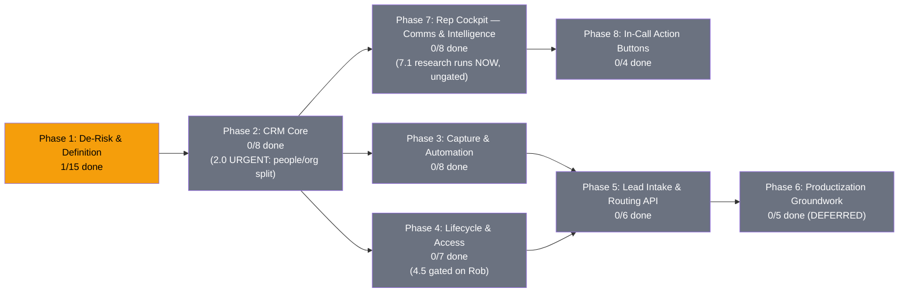

> ⛔ **SUPERSEDED — do not extend this file.** Folded into the living PRD on 2026-07-21: [`docs/plans/PRD-mle-crm.md`](../../../docs/plans/PRD-mle-crm.md). Kept for history. Signpost: [`PRD.md`](../../../PRD.md) at the repo root.

> ⚰️ **ARCHIVED 2026-07-21 — MERGED into [`docs/plans/PRD-mle-crm.md`](../../plans/PRD-mle-crm.md)** (the single living PRD).
> Zero-loss mapping: [`docs/plans/MERGE-LEDGER-2026-07-21.md`](../../plans/MERGE-LEDGER-2026-07-21.md) · rollback: git tag `pre-prd-merge-2026-07-21` + ~/.claude/plans/snapshots/. Do not edit this file.

# PRD: MLE Dashboard → Self-Made CRM Evolution

**Version:** 2.2.31 | **Created:** 2026-07-16 | **Updated:** 2026-07-21
**Status:** PLANNING
**Owner:** Rob + Max
**Project:** mle-rob-dashboard
**Type:** full
**Slug:** mle-crm-evolution

> ✅ **ROB'S VISION DUMP CAPTURED 2026-07-17** — verbatim at [`ROB-CRM-VISION-DUMP-2026-07-17.md`](./ROB-CRM-VISION-DUMP-2026-07-17.md).
> This v2.0 is the scope amendment that dump triggered. Every differentiator below maps to a task or an
> explicit OUT. Three open questions remain (bounty-hunter/booker mechanics, book-of-business visibility,
> auto-close lane) — logged as Open Questions with ASSUMED defaults in the Decisions Log so work proceeds.
>
> **Relationship to the base PRD:** This PRD layers ON TOP of `PRD-mle-rob-dashboard-v2.md` (Phases 0–9).
> It consumes that PRD's Supabase adapter (base Task 1.2), meeting→money flow (base P3), and n8n ingestion
> (base P8). Two base tasks are **superseded here with task-ID cross-links** (both marked in the base PRD's
> v2.1.2): base Task 7.1 (pipeline stages) → **this PRD's Task 1.6 is canonical**; base Task 6.3 (bulk import)
> → **this PRD's Tasks 4.3/4.4**. No other overlaps exist.

---

## Status Diagram

**Color key:** `#22c55e` complete · `#f59e0b` in-progress · `#6b7280` pending · `#ef4444` blocked

---

## Goal

The ultimate platform for sales reps — a self-owned CRM whose only job is **helping reps close more deals**, with The Network graph as Rob's super-admin lens on top. Every lead arrives with the *details* behind its source, every call is recorded/transcribed/summarized into a searchable brain, and the rep can send a proposal, matched case studies, an agreement, or an invoice **while still on the call** — with zero dependence on GoHighLevel, Close, or any rented CRM core.

## North-Star Principles (from Rob's dump — every task answers to these)

1. **Rep screens carry ONLY what closes deals.** Reports and analytics live outside the rep view.
2. **Rent-first modularity.** A $15/mo SaaS today beats a 3-month build; own the thin core, plug in modules (ours and others'). Reps must never eat admin work while waiting on a build.
3. **API-first, terminal-friendly.** Rob's partner's tools and agents sync in via APIs without his IP being absorbed. The fastest path to his buy-in is a working system he can wire into.
4. **Capture the details behind the source, not just the source.** The email they replied to, the form answers, what the TikTok reel was about — context is the differentiator.
5. **The graph is the chain of connections** (Rob's "blockchain" metaphor): who links to whom, node by node — the super-admin layer above the traditional CRM layers.

## Role Layers (from dump)

| Layer | Who | Sees |
|---|---|---|
| 1. Super Admin | Rob | Everything incl. Network graph, AI contribution $, door-open scores |
| 2. Management & Tech | Will/partner + future mgmt | Ops views, pipeline health, no rep-private book detail (ASSUMED) |
| 3a. Sales Rep (house) | MLE reps | Their leads/deals + rep cockpit |
| 3b. Sales Agent (outside) | Brought-on reps w/ own book | Their book is theirs — protected; we touch it only as invited |
| — Bounty Hunter | Lead CHANNEL, not a rep role | Receives/returns high-intent leads (mechanics = open Q1) |
| — Booker | Outreach/appointment setters | Booking queue (mechanics = open Q1) |

## Scope

**IN:**
- Deals/opportunities as first-class objects on the existing Supabase + StorageAdapter foundation
- Role hierarchy above (RLS-enforced) incl. Sales Agent book-of-business protection
- **Lead routing engine**: high-intent lead → auto-close / rep / bounty hunter / booker per defined rules
- **Source-context intake**: source + the actual message/creative/form answers/trade-show notes per lead
- **Rep cockpit**: in-CRM dialer, every call recorded → transcript → AI summary/action items/buying signals → RAG-searchable; video calls (Zoom/Teams) ingested the same way
- **Deep-scrape rapport brief** auto-generated per lead (talking points with sources)
- **In-call buttons**: custom proposal, matched (redacted) case studies, send-for-signature agreement, send invoice
- Task/follow-up engine, contact lifecycle (search/dedup/import/export/audit), authenticated product lead API (AIDRE/AIVA)
- Build-vs-buy verification via github-tool-scout (Rob's own first-mission search) + schema patterns from Attio/Twenty

**OUT:**
- GoHighLevel in any form; Close CRM as a destination (one-time read-only export of Rob's own contacts is the only allowed touch, gated on Rob's explicit scope call)
- **Management reporting/analytics suite inside the CRM** — reports are made outside it (Rob: "the only thing we need this for is to help close more deals"). NOT excluded: rep-facing best-practice surfacing (Task 7.8) — that IS closing help, not reporting
- **Literal blockchain tech** — "blockchain" is the connection-graph metaphor, not chain infrastructure (ASSUMED, flag if wrong)
- Client-facing / white-label views (productization = Phase 6 groundwork docs only)
- Replacing the base PRD's meeting→money, KPI, or ingestion scope (consumed, not duplicated)
- Absorbing partner IP into this codebase — integration is via API plug points only

## Success Criteria

- Rob runs a full deal — first touch → interactions logged → quote → signed → paid — without leaving the dashboard
- A rep opens a lead and sees: source WITH details (message/form answers/reel topic), deep-scrape talking points, and full activity timeline — nothing that doesn't help close
- A test call dialed from the CRM produces recording + transcript + AI summary w/ action items and buying signals in the timeline, and a RAG query (e.g. "pricing objection") surfaces the right call moment
- Proposal button: click → branded custom proposal sent in <60 seconds while on-call; same seat sends agreement (e-sign) and invoice
- A seeded high-intent lead routes correctly per the routing table (auto-close / rep / bounty hunter / booker)
- github-tool-scout report delivered; keep-vs-adopt base decision logged with weighted scores + source URLs
- Storage-adapter guarantee holds: file-store fallback keeps UI functional if Supabase is unreachable
- Every differentiator in the vision dump maps to ≥1 task or an explicit OUT (verified in this doc)

---

## Phases + Tasks

### Phase 1: De-Risk & Definition (Research + Sales — runs BEFORE build)

- [x] Task 1.1 [Rob] - **GATE: Brain-dump "how my CRM is different from every other CRM"** | DoD: Captured verbatim → `ROB-CRM-VISION-DUMP-2026-07-17.md`; every differentiator mapped in this v2.0 ✅ 2026-07-17
- [ ] Task 1.2 [Research] - Build-vs-buy scorecard: Attio, Twenty (OSS), Folk, HubSpot Free at <5 seats — cost, ownership, data portability, customization, network-graph fit | DoD: One-page weighted composite scorecard per scoring-pattern rule; source URL + access date per cell
- [ ] Task 1.3 [Research] - Table-stakes feature matrix: what lightweight CRMs (Attio, Twenty, Folk, HubSpot Free, Pipedrive) all ship | DoD: Tool × feature matrix with source URL per cell; flags gaps vs current dashboard
- [ ] Task 1.4 [Research] - Schema-pattern study: how Attio + Twenty model org↔person↔deal↔activity (incl. many-to-many people↔orgs, activity polymorphism) | DoD: Annotated Mermaid ER diagram citing each tool's public docs/repo, mapped against current `lib/types.ts` with gaps flagged
- [ ] Task 1.5 [Research] - Email-sync build cost: DIY Gmail API (watch renewals, quotas, threading, OAuth verification) vs Nylas/Unipile/EmailEngine | DoD: Comparison table (dev-days, $/mo at 5 seats, maintenance) with source URL per claim
- [ ] Task 1.6 [Sales] - Define the CANONICAL pipeline-stage list (supersedes base-PRD Task 7.1, now cross-linked): start from `New Lead → Contacted → Meeting Booked → Meeting Held → Quote Sent → Negotiating → Signed → Stalled → Lost` + `Referral-Sourced` flag, and reconcile base-7.1's post-signature stages (Invoiced → Paid → Delivering) plus entry/exit trigger events per stage | DoD: One stage table, approved by Rob, covering pre- AND post-signature; every existing record maps to exactly one stage; base-PRD 7.1 carries the supersession cross-link (done in base v2.1.2)
- [ ] Task 1.7 [Sales] - Spec the "Who do I touch today" rules: next-step due/overdue, meeting-no-log >24h, stage-aging thresholds (3d Contacted, 5d Quote Sent, 7d Negotiating) | DoD: Rules doc testable against 10 seeded records covering each trigger
- [ ] Task 1.8 [Sales] - Spec the Referral-Chase Queue: promised-intro-date passed with no linked new lead | DoD: Seeded "promised intro, no lead" record flags; clears when referred lead is logged
- [ ] Task 1.9 [Sales] - Define mandatory per-interaction fields: date, contact, channel, referral source, door-opened (Y/N + who), next step + date, stage change | DoD: Save rejected if any required field missing
- [ ] Task 1.10 [Sales] - Define rep-visible vs Rob-only fields (reps: contact/stage/next-step/log; Rob-only: AI contribution $, door-open score, network map) | DoD: Field-visibility matrix signed off by Rob; fixture test proves no Rob-only field renders in the rep view ("only what closes deals" verified, not asserted)
- [ ] Task 1.11 [Sales] - Define AIDRE/AIVA lead-intake payload: product, source, company, vertical, demo dates, assigned rep, stage=New Lead | DoD: Payload schema doc handed to Engineering for Task 5.1
- [x] Task 1.12 [Research] - 🔎 **github-tool-scout FIRST MISSION ✅ 2026-07-17** (docs/research/SCOUT-crm-agents-enrichment-2026-07-17.md; keep-base decision logged) (Rob's search):** OSS platforms approximating the full vision — multi-tier roles, in-app dialer + call recording, AI call summaries, proposal generation, plugin/modular architecture | DoD: Ranked scout report (health scorecards, weighted scores, source URLs); keep-vs-adopt decision logged in Decisions Log; Tasks 1.2–1.5 queue immediately behind it
- [ ] Task 1.13 [Sales] - Role & visibility matrix v2 per the Role Layers table: 4 layers + rep subtypes + bounty-hunter/booker actors, incl. Sales Agent book-of-business protection rules | DoD: Matrix covers every layer × every object type (person/deal/activity/book); ASSUMED cells flagged for Rob
- [ ] Task 1.14 [Sales] - Lead-routing decision table: which high-intent leads go auto-close vs rep vs bounty hunter vs booker (triggers, criteria, fallbacks) | DoD: Routing table resolves 10 seeded lead scenarios with zero ambiguity
- [ ] Task 1.15 [Sales] - Source-context intake spec: per-source detail fields — email replied to + reply text, form questions + answers, ad/reel topic + creative ref, trade-show notes | DoD: Field spec with worked examples for ≥3 source types; feeds Tasks 2.1 and 5.1

### Phase 2: CRM Core — Deals, Activities, Tasks (Engineering)

*Prereqs: (1) base-PRD Task 1.2 (Supabase adapter) complete; (2) Phase 1 definition tasks 1.6–1.15 in hand.*

- [x] Task 2.0 [Engineering] ✅ **DONE 2026-07-21 — critic-rob TICK 97/100 (`docs/reviews/CRITIC-ROB-Q4-orgs-split-2026-07-21.md`).** 🚨 **URGENT (Rob 2026-07-17): split People vs Businesses.** Live `people` table (54 rows at PRD time; live count drifts with Rob's edits — 32 as of 7/21 eve) mixes humans and orgs (e.g. `miga-food-manufacturing`). Add `orgs` table, classify every existing row (human / org / org-as-contact), migrate with edges/FKs preserved | DoD: Zero business entities remain typed as Person; every human links to their org via `org_id`; graph + ledger render both correctly; row-count reconciliation report (N in = N out across both tables, N = live count at apply time) | 7/21 status: 0003 written, amended (verbatim column carry), TWICE defect-fixed pre-apply (data-loss carry list; edges NOT-NULL ordering), and full-SQL rehearsed on live data w/ auto-rollback — all gates green (recon, edge constraints, field preservation). Remaining: ~~adapter dual-schema reads~~ ✅ 7/21 → ~~real apply (+flip `ORGS_SPLIT_READS`)~~ ✅ 7/21 eve **APPLIED TO PROD, LIVE** (post-apply gates == rehearsal exactly: 16+16, 33/47 edges repointed, 0 violations, field-preservation exact; prod curl: all 32 pre-split rows render, money/referral fields spot-checked intact) → ~~person→org `org_id` linking~~ ✅ 7/21 eve (scripts/backfill-org-links.mjs: 11/16 people linked to their org + 15 org_memberships rows incl. 3 secondary affiliations, every link source-cited from the enrichment corpus; 5 honest skips where no org row exists — Trent/Title Base, Cates, George/Guest Genie, Rob+Will/MLE internal; idempotent, gate 11/16 verified twice) → ~~UI merge-view check~~ ✅ 7/21 night (prod redeployed — 6b5faeb's isDemo filter had never shipped, DEMO rows were leaking into prod graph/ledger; post-deploy: 32 nodes/47 edges/0 DEMO/0 dangling, biz badges + Business record header render live) → ~~critic-rob review~~ ✅ 7/21 night TICK 97/100. Post-close notes: (a) export `entityKind` in `/api/network` before Phase-2 deals consumers exist; (b) `people.entity_kind` column is transitional debris — drop after Task 2.2 lands (dated 7/21); (c) Gulf Coast signed-dispute is resolved-by-data since 7/18 (signed date present, `isDisputedSigned` false) — no longer an open ruling.
  - 2026-07-21 (driver): migration `0003_orgs_split.sql` AMENDED before any apply — original draft silently dropped `referred_by_id` (set on ALL 17 company rows), `relationship` (17), `estimate` (11), `phase_one` (4 in-progress), `role`/`business`/`est_time_to_payment_days` + meeting/transcript urls. orgs now carries every people column verbatim (minus `entity_kind`); prune is a later Rob call. Dry-run gained a field-preservation gate (per-column non-null counts, diffable 1:1 post-apply) + flags any people column missing from the carry list. Verified vs live: 35 → 18+17, 33/48 edges repoint, zero dropped columns. NEXT: branch apply + adapter org reads.
- [ ] Task 2.1 [Engineering] - Migration `supabase/migrations/0002_crm_core.sql`: `deals`, `activities` (source-typed: manual|n8n|api|aidre|dialer), `tasks` tables with FKs + `source_context` JSONB per Task 1.15 spec | DoD: Migration applies clean locally + prod; FKs enforce integrity
- [ ] Task 2.2 [Engineering] - Extend `lib/types.ts` with `Deal`, `Activity`, `Task`, `Org` (+ additive `orgId?` on `Person`) | DoD: `npm run build` passes; existing pages compile unchanged
- [ ] Task 2.3 [Engineering] - Extend StorageAdapter with deal/activity/task methods in BOTH Supabase and file stores | DoD: Both adapters pass identical contract test suite (`lib/storage/__tests__/adapter.contract.test.ts`)
- [ ] Task 2.4 [Engineering] - Deal scoring as pure module `lib/scoring/deal.ts` (weighted ladder, `asOf` param, no `Date.now()`) + unit tests | DoD: Deterministic on fixed fixtures; full branch coverage on ladder thresholds
- [ ] Task 2.5 [Engineering] - Deal pipeline kanban `app/deals/page.tsx` + `components/ActivityTimeline.tsx` on person detail | DoD: Dragging a card persists stage via adapter; timeline renders mixed types chronologically
- [ ] Task 2.6 [Engineering] - "Needs action today" endpoint `app/api/tasks/today/route.ts` implementing Task 1.7's rules | DoD: Seeded fixture returns exact expected task IDs
- [ ] Task 2.7 [Engineering] - Backfill script `scripts/backfill-crm.mjs`: synthesize one Deal per existing Person with quoted/signed data | DoD: Dry-run report correct; `--apply` idempotent (re-run = no dupes)

### Phase 3: Capture & Automation (Operations)

- [ ] Task 3.1 [Operations] - **URGENT (expires ~2026-07-19):** Rotate boostn8n.app.n8n.cloud API key, re-point all workflows | DoD: New key live, old revoked, zero auth failures post-cutover
- [ ] Task 3.2 [Operations] - n8n Gmail capture: rob@aivoicetech.io ONLY → match to contact → append to activity timeline | DoD: Test email appears on correct timeline <5 min; boostuppayments.com mail never ingested (log-verified — identity rule)
- [ ] Task 3.3 [Operations] - AIDRE call-outcome webhook receiver stub (`/api/webhooks/aidre-call`) → `activities` as type=call, source=aidre | DoD: Synthetic POST creates one correctly-linked activity row; payload schema doc delivered
- [ ] Task 3.4 [Operations] - Overdue follow-up watcher: hourly n8n cron pings Rob on past-threshold follow-ups | DoD: Test past-due record triggers exactly one ping, no dupes on re-run
- [ ] Task 3.5 [Operations] - Nightly dedup detector → `dedup_review` queue (no auto-merge) | DoD: Same-email-different-casing pair surfaces; similar-but-distinct names don't
- [ ] Task 3.6 [Operations] - Silent-failure watchdog for Gmail/AIDRE capture workflows | DoD: Forced workflow error (bad credential) alerts Rob within 15 min
- [ ] Task 3.7 [Operations] - Orphaned-activity check (activities with null/deleted contact_id) as live alert | DoD: Seeded orphan row triggers alert on next scheduled run
- [ ] Task 3.8 [Operations] - Credential-expiry alerting (n8n key, Supabase keys, product API tokens) + homemade-CRM failure-mode doc | DoD: Key within 7 days of expiry alerts Rob; doc lists each failure mode + its detection method

### Phase 4: Contact Lifecycle & Access (Engineering + Operations)

- [ ] Task 4.1 [Engineering] - Full-text search: `tsvector` + GIN index migration + search bar on people page | DoD: "polk" returns Jonathan Polk <200ms on seeded data
- [ ] Task 4.2 [Engineering] - Dedup/merge: pure matcher `lib/dedup/match.ts` (unit-tested) + merge UI folding edges/activities/deals onto surviving person | DoD: Two fixture dupes → one record, zero orphaned FKs
- [ ] Task 4.3 [Engineering] - CSV import/export routes with dedup-on-import (supersedes base-PRD Task 6.3 — built here because import is now CRM-schema-aware) | DoD: 100-row CSV imports clean; dupes flagged, never silently created
- [ ] Task 4.4 [Operations] - CSV import pipeline UX for Rob's real lists: upload → field-mapping template → validation → tagged insert | DoD: 50-row sample with 3 planted dupes → 47 clean + 3 to review, zero silent drops
- [ ] Task 4.5 [Operations] - Close one-time export script — **dry-run only, gated on Rob's explicit scope call** | DoD: Script exists, does not execute until Rob confirms which contacts are legitimately his; output feeds Task 4.4
- [ ] Task 4.6 [Engineering] - RLS + roles implementing Task 1.13's matrix: `profiles` table (super_admin/management/sales_rep/sales_agent), book-of-business protection for sales_agent-imported contacts, policies per layer — rep tiers ship **gated-off** until reps exist | DoD: In test — sales_agent-scoped client cannot expose their protected book to management; rep cannot read another rep's unshared deal
- [ ] Task 4.7 [Engineering] - Audit trail: auto-log `status_change` activity on every deal/person stage change (adapter-layer, not client-trusted) | DoD: One UI stage change → exactly one status_change row

### Phase 5: Lead Intake & Routing API (Engineering)

- [ ] Task 5.1 [Engineering] - `POST /api/leads` with per-product bearer tokens (AIDRE key, AIVA key): creates/updates Person + logs activity + opens deal at intake stage, payload includes `source_context` per Task 1.15 | DoD: AIDRE test key creates person+deal with source details populated; missing/wrong token → 401
- [ ] Task 5.2 [Engineering] - Rate-limit + idempotency key on `/api/leads` | DoD: Same idempotency key twice → one person, one deal, one activity
- [ ] Task 5.3 [Operations] - Enrichment refresh: lead-enricher re-runs on contacts stale >90 days, results logged as timeline entries (no silent overwrite) | DoD: Stale contact re-enriched on schedule; diff visible in timeline
- [ ] Task 5.4 [Operations] - Dead-lead recycling: no-activity-180-days contacts auto-tag `recycle_candidate`, surfaced in weekly digest (piggybacks base-PRD digest infra) | DoD: Seeded stale contact appears in next weekly digest recycle section
- [ ] Task 5.5 [Engineering] - Routing engine: apply Task 1.14's decision table on intake — assign to auto-close lane / rep / bounty-hunter pool / booker queue, log routing decision as activity | DoD: 10 seeded lead scenarios route exactly per table; every decision auditable in timeline
- [ ] Task 5.6 [Engineering] - Booker-queue + bounty-hunter handoff surfaces (STUB — gated on Q1 mechanics): tracked here so it can't silently drop; scoped fully once Rob answers Q1 | DoD: Once Q1 resolves — booker sees their queue, bounty-hunter handoff works per chosen model (login role vs portal link); until then this task holds the scope

### Phase 6: Productization Groundwork (Marketing + Research — DEFERRED, docs only)

- [ ] Task 6.1 [Marketing] - Positioning hypothesis doc: "The CRM that shows contractors their referral network, not just their job pipeline" vs AccuLynx/JobNimbus | DoD: 1-pager with one-liner + 3 differentiation bullets + "NOT VALIDATED" banner
- [ ] Task 6.2 [Marketing] - Internal codename (AI VoiceTech family, zero STG strings) | DoD: Codename documented in project README + memory
- [ ] Task 6.3 [Marketing] - Dogfood capture list: dated graph screenshots, deal-attribution metrics, usage clips, "aha moment" log — captured from day 1 | DoD: Capture checklist + storage path written
- [ ] Task 6.4 [Marketing] - Productization trigger condition (proposed: 5+ unprompted inbound asks OR 3+ closed deals attributed to network insights, rolling 90 days) | DoD: Trigger written with owner (Rob) + review cadence
- [ ] Task 6.5 [Research] - Roofing/title CRM gripe matrix: AccuLynx, JobNimbus, Leap, SalesRabbit — top complaints around lead-source/referral tracking | DoD: Tool × top-3 complaints × source URL, min 5 sources, confidence level per claim

### Phase 7: Rep Cockpit — Comms & Intelligence (Engineering + Operations) 🆕 v2.0

*The heart of Rob's vision: every conversation captured, understood, and searchable. Rent-first on commodity pieces. **Task 7.1 is pure research — it runs NOW, parallel to Phases 1–2 (no code dependency), so the dialer pick is ready before 7.2 starts.***

- [x] Task 7.1 [Research] - ✅ 2026-07-18: raw Twilio (94.5 composite; docs/research/DIALER-SCORECARD-2026-07-18.md) — Dialer selection (rent-first, UNGATED — runs parallel to Phase 1): JustCall / Aircall / OpenPhone / Twilio-direct — recording API, webhook events, per-seat cost, CRM-embed support | DoD: Weighted scorecard per scoring-pattern rule, source URL per cell; pick logged in Decisions Log
- [ ] Task 7.2 [Engineering] - Click-to-dial from person/deal page via chosen provider; call auto-logged as `activity` type=call source=dialer with recording URL | DoD: Test call from UI → activity row with working recording link
- [ ] Task 7.3 [Operations] - Recording → transcript pipeline (provider transcription or Whisper via n8n) → transcript stored on the activity | DoD: Test call yields attached transcript within 10 min of hangup
- [ ] Task 7.4 [Engineering] - Post-call AI pass: summary, action items, key buying signals → written to activity + action items auto-created as `tasks` | DoD: Fixture transcript produces summary + ≥1 correctly-assigned task; buying-signals field populated
- [ ] Task 7.5 [Engineering] - RAG over transcripts/summaries: pgvector embeddings on Supabase + search UI ("what's working" queries) | DoD: Query "pricing objection" returns the relevant call moments from seeded transcripts with links to source activities
- [ ] Task 7.6 [Operations] - Deep-scrape rapport brief on lead assignment: lead-enricher + Firecrawl → talking-points brief on person page | DoD: New lead auto-gets brief with ≥5 talking points, each with source URL
- [ ] Task 7.7 [Operations] - Video-call ingestion: Zoom/Teams recordings via Fathom/Fireflies (already connected) → transcript + summary into timeline, embedded for RAG (extends base-PRD P8) | DoD: Test meeting appears in timeline with transcript, searchable via Task 7.5
- [ ] Task 7.8 [Engineering] - Rep-facing best-practice surfacing ("perfect their craft" — dump line 70): "what's working" digest on the rep cockpit — patterns from won-deal calls (openers, objection handling, buying signals that converted) computed from the RAG corpus | DoD: Digest renders ≥3 evidence-linked patterns from seeded won/lost call fixtures; each pattern links to its source call moments; distinct from excluded management analytics per OUT clause

### Phase 8: In-Call Action Buttons (Engineering) 🆕 v2.0

*Rob: proposal, proof, signature, invoice — while still on the call.*

- [ ] Task 8.1 [Engineering] - Proposal button: person + deal context → proposal generation (reuse `sales-proposal` + PDF skills as the engine) → branded PDF → send via email from rep seat | DoD: Click → sent test proposal in <60 seconds; proposal logged as activity
- [ ] Task 8.2 [Engineering] - Case-study matcher: match prospect (vertical, problem, opportunity) against existing client DB → redacted results view (website screenshots captured via Firecrawl/Playwright on client record creation, outcomes, account specifics stripped) | DoD: Fixture prospect returns ≥1 matched case study with redaction verified (no client-identifying details render); screenshot capture mechanism live for ≥1 seeded client
- [ ] Task 8.3 [Engineering] - Send-for-signature agreement from rep seat (consumes base-PRD P3 / Documenso flow) | DoD: Test agreement sent; signed status lands in timeline automatically
- [ ] Task 8.4 [Engineering] - Send invoice from rep seat (consumes contracts invoicing engine) | DoD: Test invoice sent; payment status visible in timeline

---

## Open Questions

- [ ] Q1: **Bounty hunters + bookers — mechanics.** Bounty hunters: paid per close or per intro? CRM login (a role) or portal/link handoff with no inside access? Bookers: who are they (in-house setters? VAs?) and do they need a seat + queue? (owner: Rob, due: 2026-07-24 — blocks final Task 1.13/1.14 sign-off)
- [ ] Q2: **Sales Agents' book-of-business** — completely invisible to super-admin/management, or visible-but-untouchable? Drives the entire RLS design (Task 4.6). Current ASSUMED default: visible to Rob only, invisible to management, never contacted without agent invitation. (owner: Rob, due: 2026-07-24)
- [ ] Q3: **"Trying to get to close automatically"** — is there a genuinely no-human closing lane (AI conversation → self-serve agreement + payment) for some lead tier? If yes it gets scoped as its own lane in Task 1.14 + a new phase. (owner: Rob, due: 2026-07-24)

## Decisions Log

| Date | Decision | Rationale | Source |
|------|----------|-----------|--------|
| 2026-07-04 | Supabase as store ("supabase go") | Base-PRD Task 1.1 gate | Rob |
| 2026-07-16 | Dashboard becomes basis of self-made CRM | Own the system of record; no GHL access, Close is STG's | Rob |
| 2026-07-16 | Build-vs-buy scorecard still runs (Task 1.2) | Rob's rule: CRM selection is merit-based, even for self-build | Max/rules |
| 2026-07-16 | Pipeline stages: CRM-PRD Task 1.6 is CANONICAL; base-PRD 7.1 superseded + cross-linked (base v2.1.2) | Prevent two-PRD drift | quality-evaluator/Max |
| 2026-07-16 | RLS/roles built but gated-off until reps exist | Don't over-build ahead of team | chief-of-staff |
| 2026-07-17 | Research Tasks 1.2–1.5 queue BEHIND Task 1.12 (scout first mission = Rob's vision search) | Rob: "first task related to something I'd like to search for for my vision of the CRM" | Rob |
| 2026-07-17 | **v2.0: vision dump folded in** — role layers, routing engine, rep cockpit (P7), in-call buttons (P8), source-context intake, north-star principles | Rob's verbal brain dump (verbatim file) | Rob |
| 2026-07-17 | Stack stays Next.js/TypeScript/Supabase — no language change | Rob's Q: same family as Twenty; RLS fits role layers; API routes fit partner's terminal agents | Max (Rob's Q answered) |
| 2026-07-17 | Provisional: keep MLE dashboard as base (not OSS adoption) — pending Task 1.12 scout data | Differentiators exist in no OSS CRM; steal schemas, rent modules, own thin core | Max (Rob's Q, data check queued) |
| 2026-07-17 | ASSUMED: "blockchain" = connection-graph metaphor, not literal chain tech | Dump context; flagged in OUT for Rob to veto | Max |
| 2026-07-17 | ASSUMED: Will/partner sits in Management & Tech layer; CRM codebase is Rob-owned with API-first plug points so partner tools integrate without IP absorption | Dump: layer 2 + IP-protective partner + "get it in front of him" | Max |
| 2026-07-17 | ASSUMED: Sales Agent book visible to Rob only, invisible to management, hands-off unless invited | Dump: "We won't reach out to them, except for the degree that they want" — pending Q2 | Max |
| 2026-07-17 | **PAID is the apex signal**: payment ⇒ auto-upgrade to Client with its own GREEN temperature tier; People views show PAID over signed; drop Est-time-to-payment from rep-facing views | Rob: "It's good to know they've signed, it's better to know they've paid" | Rob |
| 2026-07-17 | **Full CRM rebuild w/ logins GREENLIT** — Rob: "let me back off and let you build"; push to GitHub first + push throughout the job | Repo live: github.com/blacklabelbob/mle-rob-dashboard (private) | Rob |
| 2026-07-17 | **Critic Rob evaluator agent mandated**: built from mined history (all rules/feedback/preferences); uncompromising orderliness+precision, Jobs-grade design taste, Musk-grade first-principles engineering; backs down only at perfect; interprets Rob's non-technical phrasing for intent | Rob directive; corpus mining running | Rob |
| 2026-07-17 | **Auto-enrichment mandated** for every business record (phones, firmographics, social connections); current records under-enriched; scout GitHub for existing agents before building | Rob | Rob |
| 2026-07-17 | Enrichment stack (scout-verified): gosom/google-maps-scraper (5.1k★, MIT) as the phone/address/rating engine + fire-enrich architecture for domain→firmographics; NO self-hostable Clearbit exists — social-graph data goes through a paid API in an n8n waterfall | github-tool-scout report, docs/research/SCOUT-crm-agents-enrichment-2026-07-17.md | scout/Max |
| 2026-07-17 | Dialer build shape: official twilio-voice.js SDK + own thin Next.js token/webhook routes (~200 lines); no OSS dialer worth forking. Task 7.1's SaaS-provider scorecard (JustCall/Aircall/OpenPhone vs raw Twilio) still owed before 7.2 | scout report mission 2 | scout/Max |
| 2026-07-17 | Agent imports: wshobson/agents (38k★) + VoltAgent collections as pattern donors (backend-architect, sales-automator, code-reviewer et al) — re-tuned per CR-1/CR-2, not drop-in | scout report mission 3 | scout/Max |
| 2026-07-18 | **Task 7.1 DECIDED: raw Twilio** (twilio-voice.js + own routes) — composite 94.5 vs JustCall 78.25/Aircall 69.25/OpenPhone 67.05; scorecard w/ sources in docs/research/DIALER-SCORECARD-2026-07-18.md; JustCall is the rent-first fallback if Rob vetoes | Weighted composite per scoring-pattern rule; confirms OSS scout | research agent/Max |

## Dependencies & Blockers

| Item | Type | Owner | Status |
|------|------|-------|--------|
| ~~Rob's differentiator brain-dump (Task 1.1)~~ | ~~blocker~~ | Rob | ✅ resolved 2026-07-17 |
| ~~Base-PRD Task 1.2: Supabase adapter live~~ | dependency | Max | ✅ resolved 2026-07-17 (mle-network live, local+prod verified) |
| ~~Base-PRD Task 1.3: 25-person brain-dump~~ | dependency | Rob | ✅ resolved (54-person dataset live 7/8; Rob confirmed 7/21) |
| ~~Anthropic API key~~ | dependency | Rob | ✅ resolved — estimator running on claude (est. panel stamps 'source: claude 7/17'; Rob confirmed 7/21) |
| n8n API key rotation (EXPIRED ~7/19 — new key needed from Rob's n8n login, PING-INBOX item) | gate for Tasks 3.2+ only | Rob | open |
| AIDRE call-outcome payload shape | dependency for Task 3.3 | Max (AIDRE build) | open |
| Q1–Q3 answers (bounty/booker, book visibility, auto-close lane) | refines 1.13/1.14/4.6 | Rob | open |
| Dialer provider decision (Task 7.1 output) | blocker for 7.2–7.3 | Max → Rob confirm | open |

## Related Files

- [`ROB-CRM-VISION-DUMP-2026-07-17.md`](./ROB-CRM-VISION-DUMP-2026-07-17.md) — **verbatim vision dump (source of truth for intent)**
- `docs/plans/PRD-mle-rob-dashboard-v2.md` — base living PRD (Phases 0–9); this PRD layers on top
- `WHAT-WE-ARE-DOING.md` — plain-English strategy
- `docs/STORAGE-DECISION.md` — Supabase decision record
- `~/.claude/rules/scoring-pattern.md` — scoring-in-code rule (Tasks 2.4, 1.2, 7.1)
- `~/.claude/rules/email-identity.md` — Gmail capture identity constraint (Task 3.2)

---

## Revision History

| Version | Date | What Changed | By |
|---------|------|--------------|-----|
| 1.0 | 2026-07-16 | Initial PRD — army baseline (CoS + all 5 dept heads); explicitly DRAFT pending Rob's differentiator dump → v2.0 | Max |
| 2.2.31 | 2026-07-21 | Auto-touched (session activity) | prd-autosave.sh |
| 2.2.30 | 2026-07-21 | **Task 2.0 CLOSED — critic-rob TICK 97/100** (docs/reviews/CRITIC-ROB-Q4-orgs-split-2026-07-21.md; all DoD clauses independently verified vs live Supabase + prod). Same increment: UI merge-view check caught + fixed a prod defect — commit 6b5faeb (isDemo filter) was never deployed, so the 6 DEMO rows were leaking into prod graph/ledger; redeployed, prod now 32 nodes/0 DEMO. Punch-list notes recorded on Task 2.0: export entityKind in /api/network pre-Phase-2; drop people.entity_kind after Task 2.2; Gulf dispute resolved-by-data 7/18 | Max (driver) |
| 2.2.27 | 2026-07-21 | Task 2.0: person→org `org_id` backfill DONE (scripts/backfill-org-links.mjs) — 11/16 people linked to their org with per-link evidence (Sunbiz/DBPR/LinkedIn/Rob-confirmed), 15 `org_memberships` rows incl. secondary affiliations (Gary↔Miga co-owner, Daniella↔Martin Fierro+Oasis, Michael↔Oasis); 5 skips logged where no org row exists (Title Base, Cates, Guest Genie, MLE internal). Idempotent + gated (linked must equal 11). DoD "every human links to their org" now met for every human whose org exists. Remaining on 2.0: UI merge-view check → critic-rob review | Max (driver) |
| 2.2.26 | 2026-07-21 | Auto-touched (session activity) | prd-autosave.sh |
| 2.2.26 | 2026-07-21 | Task 2.0: **0003 APPLIED TO PROD + `ORGS_SPLIT_READS=1` live** (same-increment Vercel deploy, CLI upgraded 37→56 mid-deploy when the old one was rejected). Pre-apply JSON backups in `backups/`; post-apply gates matched the rehearsal run exactly; prod verified via authed curl (32 nodes, 47 edges, 0 null endpoints, quoted/signed/referrer spot-check intact). `scripts/regen-fallback.mjs` made org-aware (merges orgs as company Persons, coalesces paired FKs — fallback would otherwise have silently lost all 16 companies) and fallback regenerated. Remaining on 2.0: person→org `org_id` backfill, UI merge-view check, critic-rob review | Max (driver) |
| 2.2.25 | 2026-07-21 | Task 2.0: adapter dual-schema mode SHIPPED (env-gated `ORGS_SPLIT_READS=1`, off in prod until 0003 applies) — supabaseStore merges `orgs` rows back as entityKind-company Persons, edges coalesce paired person/org FKs, referred_by_org_id coalesced on read; writes route company rows to `orgs` and org-referrers to the paired column so an edit can never fork a record back into `people`. 7 new unit tests on the mappers (15/15 green), build green. Remaining on 2.0: real apply (flip flag same deploy) → UI merge view → critic-rob review | Max (driver) |
| 2.2.24 | 2026-07-21 | Task 2.0: 0003 rehearsed FULL-SQL against live prod data w/ guaranteed rollback (scripts/orgs-split-rehearsal.sql); caught+fixed a 2nd apply-blocker (edges from_id/to_id nulled before NOT NULL dropped → reordered). All gates pass on live data: 32→16+16 recon, 33/47 edges repointed, 0 constraint violations, field-preservation exact. 0003 apply-ready; next = adapter dual-schema reads, then apply + critic-rob | Max (driver) |
| 2.2.23 | 2026-07-21 | Auto-touched (session activity) | prd-autosave.sh |
| 2.2.22 | 2026-07-21 | Task 2.0: migration 0003 amended pre-apply — verbatim column carry into `orgs` (original draft would have destroyed referred_by/relationship/estimate/phase_one on all 17 live company rows); dry-run now enforces a field-preservation gate. Also reverted a stray autosave corruption in the vision-dump title line | Max (driver) |
| 2.1.21 | 2026-07-18 | Auto-touched (session activity) | prd-autosave.sh |
| 2.1.20 | 2026-07-18 | Auto-touched (session activity) | prd-autosave.sh |
| 2.1.19 | 2026-07-17 | Auto-touched (session activity) | prd-autosave.sh |
| 2.1.18 | 2026-07-17 | Auto-touched (session activity) | prd-autosave.sh |
| 1.1 | 2026-07-16 | QE fixes (was 83/100 → 95/100): stage canonicity, base-6.3 supersession, Phase 2 gate, task splits, diagram gating | Max |
| 1.1.1–1.1.10 | 2026-07-16/17 | Auto-touched (session activity) | prd-autosave.sh |
| 2.0 | 2026-07-17 | **VISION AMENDMENT** — Rob's verbal dump folded in: north-star principles, role layers (super-admin/mgmt/rep subtypes + bounty-hunter/booker channels), lead-routing engine (1.14, 5.5), source-context intake (1.15), Rep Cockpit phase P7 (dialer/recording/transcript/AI summary/RAG/deep-scrape briefs/video ingestion), In-Call Buttons phase P8 (proposal/case-study matcher/e-sign/invoice), scout first mission (1.12), Task 1.1 ✅, stack + base-structure questions answered in Decisions Log, Q1–Q3 opened with ASSUMED defaults | Max (Rob directive) |
| 2.2 | 2026-07-21 | SYNC PASS (Rob correction: "be SUPER diligent about the living PRD"): dependencies table reconciled (Supabase ✅, brain-dump ✅, Anthropic key ✅ — estimator live; n8n key now EXPIRED, Rob-gated), Tasks 1.12 + 7.1 ticked w/ artifacts, Task 2.0 in-progress notes. PRD-sync now baked into every driver increment (crm-build-driver-prompt.txt) | Max |
| 2.1 | 2026-07-17 | QE fidelity fixes (92/100, 1 vision gap → closed): Task 7.8 added ("perfect their craft" best-practice surfacing — the one unmapped dump item), OUT clause disambiguated (management analytics vs rep-facing closing help), 7.1 ungated to run parallel, 5.6 booker/bounty-hunter stub added (Q1-gated, can't silently drop), 8.2 screenshot mechanism named (Firecrawl/Playwright), 1.10 DoD now proves rep-view minimalism via fixture | Max |
