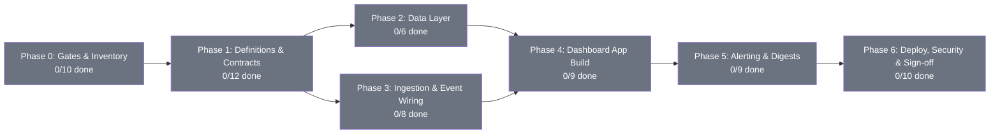

# PRD: MLE ROB Dashboard — Mission Control

**Version:** 1.0 | **Created:** 2026-07-04 | **Updated:** 2026-07-04
**Status:** PLANNING
**Owner:** Rob + Max
**Project:** mle-rob-dashboard
**Type:** full
**Slug:** mle-rob-dashboard

---

## Status Diagram

**Color key:** `#22c55e` complete · `#f59e0b` in-progress · `#6b7280` pending · `#ef4444` blocked

---

## Goal

One always-current mission-control dashboard that shows Rob the health of the entire MyLocalEverything business — pipeline, onboarding/e-sign, action items, delivery, cash/AR, and KPIs — by reading from (never duplicating) the onboarding-automation and invoicing-engine systems.

## Scope

**IN:**
- Read-only visual dashboard over the two in-flight MLE systems (onboarding automation + invoicing engine) via a stable read-model contract
- Six core panels: Pipeline, Onboarding/E-sign, Action Items (ours/theirs), Delivery Phases, Invoicing/AR, KPI Summary — plus a "Needs Action Today" widget
- Data-freshness pipelines (n8n), alerting/escalation to Rob, daily/weekly digests
- Lead-source attribution (UTM → Cal.com booking) feeding a top-of-funnel panel
- Auth restricted to a config-driven allowlist (Rob confirmed; Will pending Gate G2)

**OUT:**
- GoHighLevel in any form (no access — banned); Close CRM as a destination (STG read-only legacy only)
- Rebuilding or writing back to the onboarding/invoicing systems (dashboard is read-only)
- AIDRE / AIVA / RankLens product metrics (v2 candidate — see Open Q3)
- Client-facing views or white-label embeds

## Success Criteria

- Rob opens one URL and sees live pipeline, e-sign, action-item, AR, and KPI state that matches source systems on a 3-record spot check (sign-off task 6.10)
- Every panel's data is fresher than its declared SLA, verified by `last_synced_at` checks; stale data alerts Rob within 30 minutes
- All 7 sales KPIs + 4 marketing KPIs render with documented formulas and named source fields — no unsourced numbers
- Zero write paths from dashboard to source systems (SELECT-only role verified in test 2.1/6.7)

---

## Master Phase Map (dept crosswalk)

| Master Phase | Dept inputs | Hard gate before start |
|---|---|---|
| 0 Gates & Inventory | Research P1-P2, Rob decisions, Mktg spike, Eng capacity check | none — start now |
| 1 Definitions & Contracts | Sales P1-P2, Mktg P1-P2 (defs), Eng contract doc | none (pure documentation) |
| 2 Data Layer | Eng P1 | G3 (0.4) gates task 2.4 only — 2.1-2.3/2.5-2.6 start unblocked |
| 3 Ingestion & Event Wiring | Ops P1 | G1 CRM decision (0.2) gates task 3.5 only |
| 4 Dashboard App Build | Eng P2, Mktg wireframe, Sales rules | Phases 2+3 views/tables exist |
| 5 Alerting & Digests | Ops P2-P3 | Phase 3 `sync_failures`/`last_synced_at` live |
| 6 Deploy, Security & Sign-off | Eng P3, Ops P3 docs | Phase 4 screens pass smoke tests |

---

## Phases + Tasks

### Phase 0: Gates & Data Inventory

- [ ] Task 0.1 [Rob] - GATE G2: Decide Will DeVito's dashboard access (full / view-only / none) | DoD: Decision logged in Decisions Log; allowlist config updated accordingly
- [ ] Task 0.2 [Rob] - GATE G1: Name MLE's CRM system of record (Airtable / Baserow / Twenty / other — merit-based; never GHL, never Close) | DoD: Decision logged in Decisions Log; CRM adapter target confirmed with Engineering
- [ ] Task 0.3 [Research] - Inventory onboarding-PRD data: `clients/<slug>.json` schema, Documenso IDs + signed-PDF URLs, CRM adapter fields (stage, Retell agent ID, 30-day expiry) | DoD: Field table (name, source system, refresh mechanism, confirmed-vs-planned) covering Phases 1-5 of that PRD
- [ ] Task 0.4 [Research] - GATE G3: Confirm invoicing/AR backing store live today (Postgres/Supabase tables vs `invoice-ledger.csv`) | DoD: Written verdict per store (live / planned) with evidence; Engineering notified which source `v_invoices_ar` must read
- [ ] Task 0.5 [Research] - Document Cal.com, Fathom, Documenso, Twilio/Retell API + webhook payload fields with doc URLs | DoD: One consolidated payload-field table per system, each with source URL
- [ ] Task 0.6 [Research] - Check which CRM candidate (Airtable/Baserow/Bitrix24/Twenty) is actually provisioned today | DoD: "live / not provisioned" status per candidate with evidence (API ping or absence noted) — feeds Rob's G1 decision
- [ ] Task 0.7 [Research] - Map every planned panel to inventoried sources; flag panels with no source and which upstream PRD phase unblocks them | DoD: Gap table (panel, best source, blocking upstream phase) cross-checked against both source PRDs
- [ ] Task 0.8 [Research] - Competitive scan of 4 founder/ops mission-control dashboards (Databox, Geckoboard, FlyDash + 1) for panel ideas | DoD: 4-row table (panel idea, source name, URL, one-line takeaway)
- [ ] Task 0.9 [Marketing] - SPIKE: Confirm Cal.com supports hidden-field/query-param UTM passthrough on current booking pages | DoD: Yes/no verdict with test booking evidence or Cal.com doc URL; if no, workaround proposed
- [ ] Task 0.10 [Engineering] - GATE G4: Hetzner CX22 capacity check for one more container | DoD: ≥1 GB RAM and ≥25% CPU headroom and ≥10 GB disk confirmed via `htop`/`df` under normal load, or upgrade recommendation written

### Phase 1: Definitions & Contracts

- [ ] Task 1.1 [Sales] - Define 8 canonical pipeline stages (Lead → Discovery Booked → Discovery Held → Proposal/Agreement Sent → Signed → Invoiced → Paid → Delivering) each with entry/exit trigger event | DoD: Stage table maps each stage to the exact system event that moves a deal into it; approved by Rob
- [ ] Task 1.2 [Sales] - Define stalled-deal thresholds per stage (max days before red flag) | DoD: Stage → max-days table with rationale documented
- [ ] Task 1.3 [Sales] - Define lost-reason taxonomy (6-8 enum values) required on any deal marked Lost | DoD: Fixed enum list documented for CRM hub enforcement
- [ ] Task 1.4 [Sales] - Define qualified-lead gate (BANT-lite 3-question checklist; unqualified → raw-leads bucket, excluded from KPIs) | DoD: Checklist documented with routing rule
- [ ] Task 1.5 [Sales] - Define 7 sales KPIs with formulas + source fields: Discovery Show Rate (≥75%), Proposal Win Rate (30/60/90d), Weighted Pipeline Value (stage-probability map), Avg Sales Cycle, Time-to-First-Touch (<4 bus. hrs), Signed-to-Cash Lag, Follow-up SLA Compliance | DoD: Each KPI has formula, numerator/denominator source fields, and target benchmark documented; the stage→probability mapping table is a named deliverable approved by Rob, not defined ad hoc
- [ ] Task 1.6 [Sales] - Define "Needs Action Today" rule set (new lead >24h untouched; no 24h-prior discovery reminder; no proposal within 48h of discovery; no follow-up in 3 bus. days; signed-not-invoiced >24h) | DoD: Rule table with trigger condition, action owed, SLA hours, and exact CRM field each rule reads
- [ ] Task 1.7 [Sales] - Specify CRM hub required fields (deal_value, expected_close_date, stage_probability, source/channel, decision_maker_contact, lost_reason, days_in_current_stage, next_action_due_date, last_touch_date) + PVP enrichment gate (competitor_context, pain_point_observation, source_url) | DoD: Field list with type + required/optional flag, signed off by Engineering; implementation itself remains gated on G1
- [ ] Task 1.8 [Marketing] - Define 5-category lead-source taxonomy (Cold Email, Referral, Lead Magnet, Organic, Direct/Unknown) with inclusion rules + no-UTM fallback rule | DoD: Taxonomy doc; last 90 days of bookings each map to exactly one category
- [ ] Task 1.9 [Marketing] - Publish UTM convention (utm_source/medium/campaign) mapped 1:1 to taxonomy for all outbound links | DoD: Convention table published; 10 live links spot-checked correct
- [ ] Task 1.10 [Marketing] - Define 4 marketing KPIs with formulas + named source systems: Cost per Booked Call, Lead-Magnet Conversion, Source → Close Rate, Booking Volume by Channel | DoD: Each KPI has formula, input-source table (API/export/manual), and a worked example
- [ ] Task 1.11 [Marketing] - Produce MLE dashboard brand/visual spec: dark-mode mission-control palette, typography, logo rules (MLE / AI VoiceTech — zero STG) | DoD: One-page spec (hex codes, fonts, logo refs, do/don't) delivered as PDF
- [ ] Task 1.12 [Engineering] - Author read-model data contract: 6 views (v_pipeline, v_esign_status, v_action_items, v_delivery_phases, v_invoices_ar, v_nudge_activity) with source tables + columns | DoD: `docs/data-contract.md` lists every view's sources/columns and explicitly distinguishes dashboard-owned staging/event tables (Phase 3 targets) from source-of-truth business records; consumes Research 0.3/0.4 inventory

### Phase 2: Data Layer

- [ ] Task 2.1 [Engineering] - Create read-only Postgres role `dashboard_ro` scoped to onboarding + invoicing DBs | DoD: SELECT works; INSERT/UPDATE attempt fails in psql test
- [ ] Task 2.2 [Engineering] - Document DB topology (same instance vs separate; FDW/dblink need) | DoD: `docs/data-topology.md` committed with instance names, hosts, ports
- [ ] Task 2.3 [Engineering] - Write + run SQL migration creating 5 views (all except v_invoices_ar) per data contract | DoD: `psql -f views.sql` succeeds on staging; each view returns expected sample rows
- [ ] Task 2.4 [Engineering] - Build `v_invoices_ar` against the backing store confirmed in Gate G3 (Postgres view, or interim CSV-ingest table if ledger-only) | DoD: View/table returns AR rows matching ledger totals for last 4 weeks
- [ ] Task 2.5 [Engineering] - Add nightly materialized-view refresh for KPI aggregates (AR aging, days-to-sign, revenue) | DoD: Refresh timestamp < 24h old on check
- [ ] Task 2.6 [Engineering] - Write pytest data-contract suite asserting view schemas match `docs/data-contract.md` | DoD: `pytest tests/data_contract` green against staging

### Phase 3: Ingestion & Event Wiring

- [ ] Task 3.1 [Operations] - n8n workflow: Cal.com booking webhook → `pipeline_events` row (incl. UTM/source fields from spike 0.9) | DoD: Test booking produces row within 60s, verified via SQL
- [ ] Task 3.2 [Operations] - n8n workflow: Fathom recording-ready webhook → `onboarding_status` update + transcript link | DoD: Test call flips status within 2 min
- [ ] Task 3.3 [Operations] - n8n workflow: Documenso webhook (sent/viewed/signed/declined) → `esign_status` + timestamps | DoD: Sandbox envelope cycles all 4 states, each visible within 60s
- [ ] Task 3.4 [Operations] - n8n workflow: invoicing webhook → `ar_status`, `amount_paid`, `days_overdue` | DoD: Test invoice marked paid reflects within 5 min
- [ ] Task 3.5 [Operations] - [GATED: G1] n8n workflow: CRM hub poll (5-min) → `action_items` tagged owner (ours/theirs) | DoD: New item appears within one poll cycle, correctly tagged — starts only after Rob's CRM decision (0.2)
- [ ] Task 3.6 [Operations] - Error-workflow on all pipelines → failures logged to `sync_failures` table | DoD: Forced bad payload creates logged row within 60s
- [ ] Task 3.7 [Operations] - Add `last_synced_at` update to every table-writing node | DoD: Every target table's timestamp updates within its declared cadence
- [ ] Task 3.8 [Operations] - Publish Mermaid workflow map (trigger/nodes/target table per workflow) | DoD: Diagram matches n8n `workflows_list` output 1:1

### Phase 4: Dashboard App Build

- [ ] Task 4.1 [Engineering] - Scaffold Next.js app in `MLE ROB Dashboard/app` | DoD: `npm run dev` renders placeholder home locally
- [ ] Task 4.2 [Marketing] - Wireframe the six panels + top-of-funnel panel (chart types, source-category color coding) per brand spec 1.11 | DoD: Mockup image approved by Rob before build
- [ ] Task 4.3 [Engineering] - Typed data-access layer (`lib/db.ts`, `pg` client, `dashboard_ro` creds, one function per view) | DoD: Unit test returns typed rows matching contract from staging
- [ ] Task 4.4 [Engineering] - Build 6 screens: Pipeline, Onboarding/E-sign, Action Items (ours/theirs), Delivery Phases, Invoicing/AR, KPI Summary | DoD: Each renders live staging data; Playwright smoke test per screen passes
- [ ] Task 4.5 [Engineering] - Build "Needs Action Today" widget evaluating Sales rule set 1.6 | DoD: Seeded fixture for each of the 5 rules surfaces exactly the expected items
- [ ] Task 4.6 [Engineering] - Config-driven allowlist auth (env/JSON list, magic link or Caddy Basic Auth); seed with Rob only until Gate G2 closes | DoD: Non-allowlisted email gets 401/403 in test; adding an email requires config change only, no code change
- [ ] Task 4.7 [Engineering] - Nudge-activity feed component from n8n/CRM hub logs | DoD: Feed count matches source log count for last 20 entries
- [ ] Task 4.8 [Engineering] - Global error boundary + empty-state UI on all widgets | DoD: Simulated DB outage shows graceful banner, no crash
- [ ] Task 4.9 [Marketing] - Implement UTM → booking passthrough per spike 0.9 outcome; run 5 end-to-end test bookings (one per channel) | DoD: All 5 arrive with correct source field populated, verified against taxonomy 1.8

### Phase 5: Alerting & Digests

- [ ] Task 5.1 [Operations] - Stale-data check (30-min cron) comparing `last_synced_at` vs expected cadence per table | DoD: Pausing a workflow alerts Rob within 30 min
- [ ] Task 5.2 [Operations] - Failed-sync alert on new `sync_failures` row → immediate push to Rob | DoD: Forced failure alerts within 60s
- [ ] Task 5.3 [Operations] - Overdue action-item check (daily 8am), Rob-owned items only | DoD: Seeded overdue Rob-item alerts; overdue client-item does not
- [ ] Task 5.4 [Operations] - Unpaid-invoice alerts at 7/15/30-day thresholds, no duplicates | DoD: Invoice at day 8 fires exactly one 7-day alert; none repeat next run
- [ ] Task 5.5 [Operations] - Alert delivery channel (per Open Q2 answer) with 24h dedup per issue | DoD: Same condition twice in 1 hour produces one alert
- [ ] Task 5.6 [Operations] - Per-alert-type kill switch (config flag) | DoD: Toggling off invoice alerts stops them while stale-data alerts still fire
- [ ] Task 5.7 [Operations] - Uptime check (15-min cron) on dashboard + Postgres connectivity | DoD: Simulated outage >15 min alerts within one cycle
- [ ] Task 5.8 [Operations] - Daily 7am digest: pipeline count, e-sign pending, overdue items, AR aging | DoD: Test run delivers all 4 sections matching live dashboard counts
- [ ] Task 5.9 [Operations] - Weekly Monday 8am KPI rollup: revenue, pipeline velocity, sync-health score | DoD: Test run populates all 3 from live tables

### Phase 6: Deploy, Security & Sign-off

- [ ] Task 6.1 [Engineering] - Write ADR-0001: hosting choice (self-host on Hetzner behind Caddy vs Vercel), informed by capacity gate 0.10 | DoD: `docs/adr-0001-hosting.md` committed with rationale
- [ ] Task 6.2 [Engineering] - Docker service + compose entry alongside existing stack, Caddy TLS route | DoD: `docker compose up dashboard` reachable on staging domain
- [ ] Task 6.3 [Engineering] - Externalize secrets (.env/Docker secrets, gitignored) | DoD: `git grep -i password` clean; `.env` untracked
- [ ] Task 6.4 [Engineering] - `/api/health` endpoint + n8n uptime alert wiring | DoD: Returns 200 + DB connectivity check; failure triggers alert
- [ ] Task 6.5 [Engineering] - Document one-command rollback to previous image tag | DoD: `docker compose up dashboard:previous` dry-run verified
- [ ] Task 6.6 [Operations] - Nightly Postgres backup + verification workflow (file exists, size > 0) | DoD: Forced-missing-backup test flags failure within 24h
- [ ] Task 6.7 [Engineering] - Security pass: `dashboard_ro` write-block re-verified; no secrets in client bundle | DoD: Bundle grep clean; role test re-run green
- [ ] Task 6.8 [Operations] - Runbook covering every workflow (purpose, trigger, recovery, manual override) + CHANGELOG.md with dated entries | DoD: Runbook covers 100% of workflow map 3.8; CHANGELOG has an entry per shipped workflow
- [ ] Task 6.9 [Operations] - n8n execution-health check added to Claude Code session-start hook | DoD: Forced workflow failure surfaces in next session-start briefing
- [ ] Task 6.10 [Rob] - Live sign-off: log in, spot-check 3 records against source systems (with Will if G2 grants access) | DoD: Match confirmed; sign-off logged in Decisions Log; full Playwright E2E green with screenshots archived

---

## Open Questions

- [ ] Q1: Alert channel — Slack DM, SMS, or both? And do client-owned overdue items ever alert the client directly, or stay Rob-only? (owner: Rob, due: 2026-07-11)
- [ ] Q2: Data-freshness SLA per table — webhook-only near-real-time everywhere, or is 5-min poll acceptable for AR/action items? (owner: Rob, due: 2026-07-11)
- [ ] Q3: v2 scope — should mission control also cover AIDRE/AIVA/RankLens product metrics, or stay strictly MLE? (owner: Rob, due: 2026-07-18)

## Decisions Log

| Date | Decision | Rationale | Source |
|------|----------|-----------|--------|
| 2026-07-04 | Dashboard is read-only over source systems via view contract — no direct writes, no schema duplication | Source PRDs are moving targets; stable adapter contract survives their evolution | chief-of-staff |
| 2026-07-04 | Auth allowlist is config-driven; seeded Rob-only until Will's access is decided (G2) | Will's access is an open decision, not an assumption | quality-evaluator fix |
| 2026-07-04 | Sales CRM-dependent implementation gated on G1 (CRM system of record); definitions proceed now | No live CRM named for MLE; GHL banned, Close legacy-only | quality-evaluator fix |

## Dependencies & Blockers

| Item | Type | Owner | Status |
|------|------|-------|--------|
| G1: MLE CRM system of record named | blocker (gates 3.5, CRM field implementation) | Rob | open |
| G2: Will DeVito access decision | blocker (gates allowlist seed, 6.10 scope) | Rob | open |
| G3: Invoicing backing store confirmed (Postgres vs CSV) | blocker (gates 2.4) | Research → Rob | open |
| G4: Hetzner capacity headroom | blocker (gates 6.1/6.2) | Engineering | open |
| Onboarding PRD Phase 5 CRM hub schema names | dependency (feeds 1.12, 2.3) | onboarding PRD build | open |
| Cal.com UTM passthrough support | dependency (gates 4.9) | Marketing spike 0.9 | open |

## Related Files

- /Users/robertacheson/Projects/MyLocalEverything/contracts/docs/plans/PRD-phase1-client-onboarding-automation-v1.md
- /Users/robertacheson/Projects/MyLocalEverything/contracts/docs/plans/PRD-phase1-invoicing-payment-proposal-engine-v1.md
- /Users/robertacheson/Projects/MyLocalEverything/README.md
- /Users/robertacheson/Desktop/MLE/MLE ROB Dashboard/ (build target)

---

## Revision History

| Version | Date | What Changed | By |
|---------|------|--------------|-----|
| 1.0 | 2026-07-04 | Initial PRD — 5 dept heads + chief-of-staff, quality-gate fixes applied (gates G1-G4, phase crosswalk, UTM spike split, config-driven auth) | Max |
