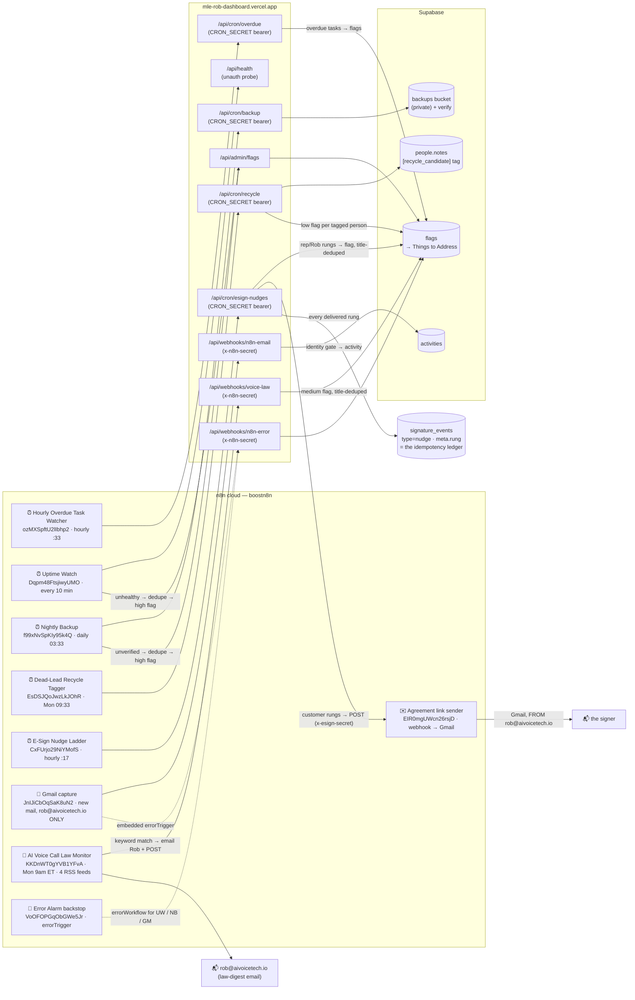

# n8n Workflow Map — MLE CRM (Task MC.11)

**Published:** 2026-07-23 · **Last reconciled against the live instance:** 2026-07-28 (inc.15 — two live CRM workflows were missing, see below) · **Source of truth:** live n8n workflow list (`boostn8n.app.n8n.cloud`, MCP-pulled) · **Visual:** https://mle-rob-dashboard.vercel.app/design/n8n-workflow-map.html
**Refresh rule (MC.9 cross-ref):** every new/changed n8n workflow that touches the CRM MUST update this map + the HTML page same-commit — the DoD is a 1:1 match with the live workflow list. MC.9's future ingestion workflows (Cal.com / Fathom / Documenso / invoicing) extend this map when they build.

## The map

## Per-workflow detail (trigger / nodes / target)

| Workflow (id) | Active | Trigger | Nodes (essence) | Auth | Target | Failure path |
|---|---|---|---|---|---|---|
| **Hourly Overdue Task Watcher** `ozMXSpftU2lIbhp2` | ✅ | Schedule, hourly :33 | GET `/api/cron/overdue` (route runs the pure overdue rules) | CRON_SECRET bearer | `flags` (per-task, deduped in-route) | route 401/503 contract; no errorWorkflow (route-side flags) |
| **Uptime Watch** `Dqpm48FtsjiwyUMO` | ✅ | Schedule, every 10 min | probe `/api/health` (text mode, `body ?? data`) → `Healthy?` → dedupe vs open flags → file high flag | none (health is unauth) | `flags` | inline branch + errorWorkflow → `VoOFOPGqObGWe5Jr` |
| **Nightly Backup** `f99xNvSpKIy95k4Q` | ✅ | Schedule, daily 03:33 | GET `/api/cron/backup` → `Verified?` → dedupe → high flag | CRON_SECRET bearer | `backups` bucket (12 tables, verified re-download) + `flags` on failure | inline branch + errorWorkflow → `VoOFOPGqObGWe5Jr` |
| **Weekly Dead-Lead Recycle Tagger** `EsDSJQoJwzLkJOhR` | ✅ | Schedule, Mon 09:33 | GET `/api/cron/recycle` (pure `findRecycleCandidates`; tag = idempotency) | CRON_SECRET bearer | `people.notes` `[recycle_candidate YYYY-MM-DD]` + low `flags` | route 401/503 contract |
| **Hourly E-Sign Nudge Ladder** `CxFUrjo29NiYMofS` | ✅ | Schedule, hourly :17 | GET `/api/cron/esign-nudges` (route runs the pure `planNudges` ladder) | CRON_SECRET bearer | customer rungs → agreement sender → signer's inbox; rep/Rob rungs → `flags`; every delivered rung → `signature_events` (`type=nudge`, `meta.rung`) | route 401/503 contract + errorWorkflow → `VoOFOPGqObGWe5Jr`; a failed rung writes NO event, so the next hour retries it |
| **Agreement link sender** `EIR0mgUWcn26rsjD` | ✅ | Webhook (`ESIGN_SENDER_WEBHOOK_URL`) | header-secret gate → Gmail send (cred `zafHNwGNRYD8V9aq`, FROM rob@aivoicetech.io per the identity rule) | x-esign-secret | the signer's inbox — both the first agreement link and every customer nudge rung | caller (`lib/esign/sender.ts`) reports a non-2xx as `sent:false` and the rung retries; env unset = skipped, never a lost send record |
| **Gmail capture** `JnIJiCbOqSaK8uN2` | ✅ | Gmail trigger — rob@aivoicetech.io ONLY (identity map enforced again in-route) | POST `/api/webhooks/n8n-email` → identity gate (any boostuppayments.com party → hard reject) → counterpart match → activity | x-n8n-secret | `activities` (`n8n-email-<gmailMessageId>` idempotent ids) | embedded errorTrigger → `/api/webhooks/n8n-error` + errorWorkflow backstop |
| **AI Voice Call Law Monitor** `KKDnWT0gYVB1YFvA` | ✅ | Cron `0 13 * * 1` (Mon 9am ET) | 4 RSS reads (FCC, FTC, TCPAWorld, NatLawReview) → merge → AI-voice keyword filter → digest email to Rob + `Package for CRM` → POST `/api/webhooks/voice-law` | x-n8n-secret | `flags` (medium, headline-title dedupe → one flag per story ever) + Gmail to rob@aivoicetech.io | `Has Matches?` false = silent (Rob's "IF theres changes") |
| **Error Alarm backstop** `VoOFOPGqObGWe5Jr` | ✅ | errorTrigger (registered errorWorkflow of Uptime Watch, Nightly Backup, Gmail capture) | POST `/api/webhooks/n8n-error` | x-n8n-secret | `flags` (Task 3.6 <15-min alerting DoD) | it IS the failure path |

## Jobs that deliberately are NOT n8n workflows (local, added 2026-07-25)

The 1:1 DoD is about the n8n instance, but a reader looking for "how does the AR data get in?" must not
come away thinking nothing ingests it. One MC.9 leg runs OFF n8n on purpose:

| Job | Trigger | Reads | Writes | Why not n8n / not a Vercel cron |
|---|---|---|---|---|
| **Invoice-ledger sync** `scripts/sync-invoice-ledger.mjs` | manual today (`node scripts/sync-invoice-ledger.mjs` = preview, `--apply` = write); a local scheduler is the MC.14 increment | `invoices/invoice-ledger.csv` in the **contracts** repo (fs + `git rev-parse` for the provenance tag) | `invoice_ledger` + `invoice_ledger_sync_runs` (service role; upsert + withdrawal marks, never a delete) | The contracts repo is not deployed with the dashboard and n8n cloud cannot see the local filesystem either — any hosted trigger could only report a read failure. Runs on the machine holding both checkouts. Exit 1 = needs a human (refusal / read failure / apply failure / requiresReview). |

## Secret-rotation coupling (registry)

- **CRON_SECRET** rotation touches **4** hardcoded-bearer workflows: `ozMXSpftU2lIbhp2`, `EsDSJQoJwzLkJOhR`, `f99xNvSpKIy95k4Q`, `CxFUrjo29NiYMofS` (registered Q47; the 4th was corrected in 2026-07-28 inc.15 — it had been live since 7/23 and unregistered, so a rotation would have silently 401'd the whole nudge ladder).
- **N8N_EMAIL_WEBHOOK_SECRET** (`x-n8n-secret`) rotation touches the shared n8n httpHeaderAuth credential `2sHDFkgzMWkOvhv7`, used by: Gmail capture, Error Alarm, Voice-Law Monitor POST.
- **ESIGN_SENDER_SECRET** (`x-esign-secret`) rotation touches `EIR0mgUWcn26rsjD` (agreement link sender) — rotate the workflow's gate and the env var together, or every agreement link and every customer nudge stops sending (reported as `sent:false`, never silently dropped).

## 1:1 accounting — the other 10 workflows on the instance (NOT CRM-touching)

Verified 2026-07-23: none of these reference `mle-rob-dashboard.vercel.app`.

> **Correction 2026-07-28 (inc.15) — the 1:1 claim was false for five days.** The E-Sign Nudge Ladder
> (`CxFUrjo29NiYMofS`, live 7/23 20:46) and the Agreement link sender (`EIR0mgUWcn26rsjD`, live 7/23 09:47)
> were both **absent from this map**, so a reader counting the map against the instance found two unexplained
> active workflows and, worse, `lib/esign/nudges.ts` + `app/api/cron/esign-nudges/route.ts` still said the
> hourly wiring was *"a follow-up increment"*. That stale sentence nearly cost a duplicate: this increment
> built a second hourly nudge workflow (`muIUxKjhaUP41i32`, :47) before checking the live list — created,
> tested 200, published, then **unpublished and archived within the same increment** once the original
> surfaced. Nothing else on the instance was touched. **The rule the map now carries: the 1:1 DoD is only
> true on the day someone pulls the live list — a map that is not re-pulled is a map that is drifting.**

| Workflow | Active | Scope |
|---|---|---|
| Gamma Pipeline — Discovery Call to Presentation v2.0 `YlK880u1m5SKVABE` | ✅ | Gamma deck automation (separate project) |
| STG Community Listening `U9HrIUMiuuNunHrH` | ✅ | STG legacy side-consulting |
| Documentation Expert Chatbot (Gemini RAG) `4ceeHqM5L4v7AkYJ` | — | experiment, inactive |
| AI Agent workflow `PVK5gy3MHxS85XPu` | — | experiment, inactive |
| AI Agent Chat with Tools `UnaBWqZ7QrOgWUSk` | — | experiment, inactive |
| Disco to Gamma `WeYz7BYckCU41Jv1` | — | superseded by v2.0, inactive |
| Gamma Pipeline v1 `m0qURCLqNzkU43Wy` | — | superseded by v2.0, inactive |
| My workflow `XzqlkzsQmkKRfZcv` | — | scratch, inactive |
| n8n Barber `dP2GZq5qEhytOMgr` | — | scratch, inactive |
| Chat Handoff `xeJAZPdPahCeqVAS` | — | scratch, inactive |
