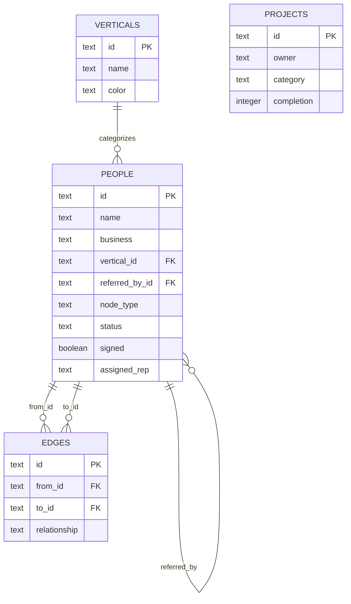
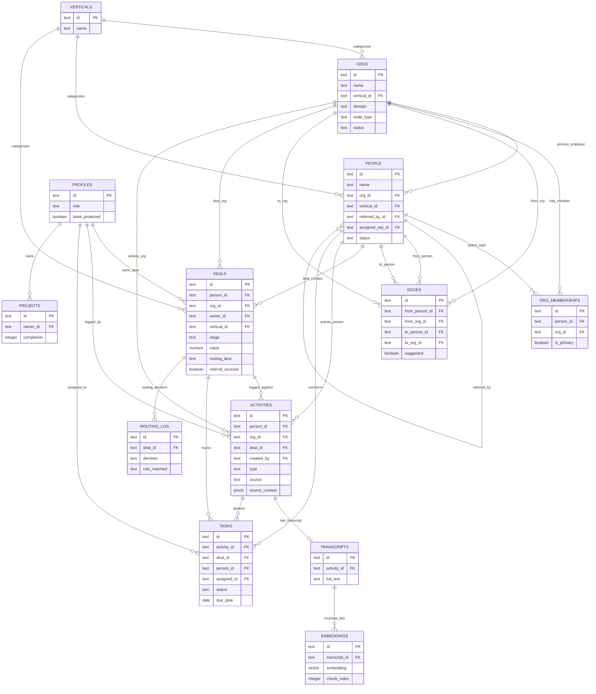

# MLE CRM Architecture Atlas — Data Model View-Set v1.0
**Date:** 2026-07-17 · **Owner:** Head of Engineering (Max) · **Feeds:** PRD-mle-crm-evolution-v1.md Tasks 1.4, 2.0, 2.1, 2.7
**Audience:** Rob (founder) + technical partner

---

## 1. Current-State ER Diagram

> **Callout — the bug Rob flagged (Task 2.0, urgent):** `people` mixes humans and businesses in one table. Row `miga-food-manufacturing` is a company typed as a Person. `business` is a free-text field on a person, not a real entity — so a business has no independent identity, no own `edges`, no own deal. `projects` is disconnected from the graph entirely (owner is a free-text enum, not an FK).

---

## 2. Target-State ER Diagram (centerpiece)

**Decision — `people.org_id` (denormalized primary) + `org_memberships` (many-to-many):** 54 live rows are ~95% one-person-one-org, so reps need a fast `org_id` FK for the hot path ("only what closes deals" — Principle 1). But connectors legitimately span orgs (a title-company referral partner who also runs his own shop). `org_memberships` carries that case without penalizing the common one. *Shape borrowed from Attio* (primary company + multi-company relationship attribute) more than Twenty (which keeps Person↔Company strictly 1:many).

**Decision — polymorphic `edges` and `activities`:** rather than a generic `(type, id)` polymorphic pair (unenforceable by FK), each uses **paired nullable FKs** (`from_person_id`/`from_org_id`, one populated) — real referential integrity, still one row per edge/activity. *Shape borrowed from Twenty's Timeline/ActivityTarget pattern* (activities attach to exactly one record type via distinct nullable relations, not a string discriminator).

---

## 3. Migration Path (current → target)

| Step | Current | Action | Target | Task |
|---|---|---|---|---|
| 1 | `people` (54 rows) | **Heuristic classify each row**: org if (`node_type='vertical-anchor'` OR `business` field IS the entity itself, i.e. name matches a company-name pattern with no personal-sounding first/last name) AND no personal email domain. Ambiguous rows (e.g. sole proprietors) → `org_classification_review` queue, human-decided. | split into `orgs` + `people` | 2.0 |
| 2 | Rows flagged **org** (e.g. `miga-food-manufacturing`) | INSERT into `orgs` (name, vertical_id, phone/email/website, node_type); original `people` row deleted | `orgs` | 2.0 |
| 3 | Rows flagged **person** with a resolvable `business` name | Match `business` text → created/existing `orgs.name`; set `people.org_id` | `people.org_id` | 2.0 |
| 4 | `edges.from_id`/`to_id` pointing at now-org rows | Repoint to `from_org_id`/`to_org_id`; pure person↔person edges keep `from_person_id`/`to_person_id` | `edges` | 2.0 |
| 5 | Reconciliation | Row-count report: 54 in = `count(orgs classified) + count(people remaining)` out, zero dropped | audit report | 2.0 (DoD) |
| 6 | — | Apply `0002_crm_core.sql`: `orgs`, `org_memberships`, `deals`, `activities`, `tasks`, `profiles`, `transcripts`, `embeddings`, `routing_log` | new schema | 2.1 |
| 7 | `people.quoted_amount`, `signed`, `key_dates` | `scripts/backfill-crm.mjs` synthesizes one `deals` row per person/org with `stage` derived from `signed`/`key_dates`, `value = quoted_amount` | `deals` | 2.7 |
| 8 | `people.meeting_video_url`, `transcript_url` | One `activities` row (type=meeting) + one `transcripts` row per non-null value, linked to the synthesized deal | `activities`, `transcripts` | 2.7 |
| 9 | `people.assigned_rep` (free text) | Lands as `deals.owner_id` free-text fallback until `profiles`/RLS ship (Task 4.6), then FK-resolved | `deals.owner_id` | 2.7 → 4.6 |
| 10 | `people.estimate` (jsonb) | Kept as `deals.estimate` jsonb short-term; superseded by `lib/scoring/deal.ts` computed score, not stored | `deals.estimate` | 2.4 |

---

## 4. Field-Level Spec — 3 Hottest Tables

### `people`
| Field | Type | Why a rep cares |
|---|---|---|
| `name` | text | who they're calling |
| `org_id` | FK→orgs, null | one click to the company context — deals, other contacts there |
| `status` | enum lit/warm/unlit | at-a-glance temperature, no digging |
| `referred_by_id` | FK→people, null | door-opener — who to thank/loop in |
| `phone`, `email` | text | dial/email straight from the record |
| `assigned_rep_id` | FK→profiles | whose lead this is — routing clarity |
| `node_type` | enum | connector vs client vs vertical-anchor shapes the talk track |

### `deals`
| Field | Type | Why a rep cares |
|---|---|---|
| `stage` | enum (canonical list, Task 1.6) | exactly where this deal sits, drives "who do I touch today" (Task 1.7) |
| `value` | numeric | what closing is worth — prioritization |
| `owner_id` | FK→profiles | accountability, no ambiguity on whose number it hits |
| `routing_lane` | enum auto_close/rep/bounty_hunter/booker | how this lead got here (Task 1.14) |
| `referral_sourced` | boolean | flags Referral-Chase Queue eligibility (Task 1.8) |
| `key_dates` | jsonb | quoted/signed/invoiced/paid timestamps — no re-asking the prospect |

### `activities`
| Field | Type | Why a rep cares |
|---|---|---|
| `type` | enum call/email/meeting/note/status_change | scan the timeline in seconds |
| `source` | enum manual/n8n/api/aidre/dialer | trust signal — was this a real touch or automated capture |
| `source_context` | jsonb | **the differentiator (Task 1.15)**: `{ "email_replied_to": "...", "reply_text": "...", "form_answers": {...}, "reel_topic": "...", "creative_ref": "...", "trade_show_notes": "..." }` — the actual context behind the lead, not just "source: TikTok" |
| `summary`, `action_items`, `buying_signals` | text/jsonb | AI call pass output (Task 7.4) — what to say next, without re-listening |
| `recording_url` / `transcript_id` | text/FK | one click to hear/read it |

---

## 5. RLS Policy Sketch

| Table | super_admin (Rob) | management | sales_rep | sales_agent |
|---|---|---|---|---|
| `orgs`, `people`, `edges` (graph) | read/write all | read all, write assigned | read/write own `assigned_rep_id` only | read/write own book only |
| `deals`, `activities`, `tasks` (not `book_protected`) | read/write all | read/write all | read/write own `owner_id` only | read/write own `owner_id` only |
| `deals`/`activities`/`tasks` where **`book_protected = true`** (sales_agent book — ASSUMED Q2 default) | **read only** | **no access** | **no access** | read/write own rows only |
| `routing_log` | read all | read all | read own deals' rows | no access |
| `transcripts`, `embeddings` (RAG) | read/write all | read all | read own calls' rows | read own calls' rows |
| `profiles` | read/write all | read all, no role edits | read own row | read own row |
| `projects` | read/write all | read all | no access | no access |

Enforcement: `book_protected` is set at import time (Task 4.5/4.6) whenever a `sales_agent` brings their own book; policy checks `owner_id = auth.uid() OR role = 'super_admin'` on protected rows — management's `USING` clause explicitly excludes `book_protected = true`, satisfying "hands-off unless invited" (PRD Decisions Log, 2026-07-17).

---

**Sources for shape decisions:** Attio and Twenty public docs/schemas referenced from memory per Task 1.4's brief — this doc is the ERD deliverable; Task 1.4 itself still owes citation URLs per its own DoD and should verify these two borrowed patterns against current public schema docs before sign-off.
