> ⚠️ **This is NOT the living PRD.** The living PRD is [`docs/plans/PRD-mle-crm.md`](../../docs/plans/PRD-mle-crm.md) — see [`PRD.md`](../../PRD.md) at the repo root. This file covers one narrow decision only.

# PRD — The Arsenal: visible, versioned, shareable

**Version:** 1.0 · **Created:** 2026-07-29 · **Updated:** 2026-07-29
**Status:** PLANNING · **Owner:** Rob + Max · **Project:** MLE ROB Dashboard → `blacklabelbob/claude-arsenal`
**Type:** technical

---

## Goal

Rob can see every agent and skill he owns, they are version-controlled, partners can install them with one command, and their quality is a machine-produced number instead of an opinion.

## Rob's question, answered

> *"Why don't we have agents. I don't get it. Why aren't there a lot of skills written out… I fear it's cuz we don't have them."*

**You have 40 agents and 92 skills — more than either repo you linked.** The fear is wrong. The reality is worse in a way you'd not have guessed:

| Finding | Detail |
|---|---|
| **`~/.claude/` is not a git repository** | `git rev-parse` → *fatal: not a git repository*. 132 assets, no version control, no diff, no rollback, no shareable surface. **This is the actual answer to "why doesn't mine look like theirs."** |
| **16 of 40 agents cannot load** | No `---` frontmatter block at all, so Claude Code never registers them. Proof: 40 − 16 = 24, and exactly 24 appear in this session's roster. **40% of the directory is inert.** |
| **You're comparing your repo to its own upstream** | `~/.claude/agents/realestate-comps.md` is **byte-identical** to `zubair-trabzada/ai-realestate-claude`'s copy. You installed it via its `install.sh`. Its agents lack frontmatter *upstream* — you inherited the defect. |
| **Zero of 40 agents are MLE-specific** | And exactly **one of 92 skills** is (`referral-edge-discovery`). So the fix is **not** moving them into the dashboard repo. It's giving them their own repo and letting the dashboard install it. |
| **The babysitting-eliminator already exists** | `claude plugin eval` ships in your installed v2.1.220 — runs `evals/**/case.yaml` against a plugin with `--ablation with-without` for a no-plugin baseline delta and `--report x.html`. Nothing to build. |

---

## 🔴 Security — found while auditing, unrelated, act tonight

`~/.claude/skills/seo/` contains **no SKILL.md** — only a `.env` holding `DATAFORSEO_LOGIN` and `DATAFORSEO_PASSWORD`, shapes consistent with a live credential pair, sitting there since **2026-06-04**. Not tested, deliberately. **Rotate it.**

**Severity corrected 2026-07-29 (Q73 inc.26 run, re-measured rather than inherited):** an earlier draft of this line called the file *world-readable*. It is **not** — `stat` shows mode `-rw-------` (0600, owner only), so the local-user exposure this claimed does not exist. What survives the re-measurement is still worth acting on and is the reason the line stays: a **plaintext long-lived credential pair, in no vault and no password manager**, inside a directory that is **not a git repository** — so there is no rotation history and nothing would record it if the value changed or leaked. The overstatement is logged here rather than quietly deleted, because a security note that inflates its own severity is the kind of line Rob stops trusting the next time one is real.

---

## Status

```mermaid
graph LR
  P0["Phase 0<br/>Stop the bleeding"]:::ready
  P1["Phase 1<br/>Version the arsenal"]:::ready
  P2["Phase 2<br/>Package as marketplace"]:::blocked
  P3["Phase 3<br/>Wire the MLE repo"]:::ready
  P4["Phase 4<br/>Index that can't go stale"]:::ready
  P5["Phase 5<br/>Babysitting-eliminator"]:::ready
  P6["Phase 6<br/>Separable for spin-offs"]:::ready

  P0 --> P1 --> P2 --> P3 --> P4 --> P5 --> P6

  classDef ready fill:#E2F1E7,stroke:#22713F,color:#14351F
  classDef blocked fill:#FBF0DC,stroke:#A66A12,color:#4A2F08
```

## Scope

**IN** — a private `blacklabelbob/claude-arsenal` marketplace repo; the 17 general agents + 8 general skills packaged as `arsenal-core`; a generated index that cannot drift; machine-scored evals; a clean core/GTM split for spin-offs.

**OUT** — redistributing the 14 Anthropic-licensed skills (see licence note); republishing the upstream realestate suite; the `geo-*` and `market-*`/`sales-*` suites (their own repos).

---

## The precedence trap that decides the migration

Agents and skills resolve in **opposite** directions:

- **Agents:** project `.claude/agents/` **beats** user `~/.claude/agents/`
- **Skills:** user `~/.claude/skills/` **beats** project `.claude/skills/`

So a *copied* agent in the repo silently hijacks global behaviour, and a *copied* skill in the repo is silently ignored. **Copy-and-keep-both is broken in both directions at once** — which is why the plan moves rather than copies.

Also found: the 5 `geo-*` agents use `allowed-tools:` — that's the *skill* field. The agent field is `tools:`. **Their tool restrictions are silently discarded today.**

---

## Phase 0 — Stop the bleeding *(~1h, no dependencies)*

- [ ] [Rob] Rotate the DataForSEO password | DoD: old pair fails auth; new pair only in `~/.claude/.env`; `~/.claude/skills/seo/` deleted
- [ ] [Max] Delete the 16 inert agent files | DoD: `for f in ~/.claude/agents/*.md; do [ "$(head -1 $f)" = "---" ] || echo $f; done` prints nothing. Content already superseded by skills 1.6–4.2× longer in every pair
- [ ] [Max] Delete stale local `playground` + `skill-creator` shadowing better plugin versions | DoD: `claude plugin list` still shows both from claude-plugins-official
- [ ] [Max] Fix the 5 geo agents: `allowed-tools:` → `tools:` | DoD: `grep -l "^allowed-tools:" ~/.claude/agents/*.md` prints nothing
- [ ] [Max] Port `REFERRAL-DISCOVERY-ENGINE.md` from the stale Desktop clone to canonical `docs/plans/` | DoD: repo-custodian reports no orphaned work

## Phase 1 — Version the arsenal *(prerequisite for everything)*

- [ ] [Max] `git init` private `blacklabelbob/claude-arsenal`; commit current state untouched as baseline | DoD: `gh repo view` succeeds; baseline tagged `pre-cleanup`
- [ ] [Rob] **BLOCKER:** confirm provenance of the `market-*` and `sales-*` suites (29 skills, 10 agents) — your own work, or a third-party install like ai-realestate-claude was? Their `agents/ + skills/ + orchestrator` shape matches that repo exactly | DoD: answer recorded in `PROVENANCE.md`. Nothing of unverified provenance ships in a marketplace
- [ ] [Max] Write `PROVENANCE.md` — every asset mapped to origin + licence | DoD: the 14 Anthropic-licensed skills marked DO-NOT-REDISTRIBUTE; realestate marked upstream-MIT; every row has a source URL

> **Licence note:** `docx`, `excel`, `pdf`, `pptx` are **"© 2025 Anthropic, PBC. All rights reserved."** Redistributing them would be a breach. Ten more are Apache-2.0. AGPL is clean — the only 4 hits are inside `github-tool-scout`, where AGPL is a *disqualifier in a scoring rubric*.

## Phase 2 — Package as a marketplace *(blocked on Phase 1 provenance)*

Reuses the working example already on disk: `~/.claude/skills/heygen-skills/.claude-plugin/`.

- [ ] [Max] `claude-arsenal/.claude-plugin/marketplace.json`, name `aivoicetech`, owner AI VoiceTech | DoD: `claude plugin validate . --strict` exits 0
- [ ] [Max] Build `arsenal-core` — 17 general agents + 8 general skills | DoD: `claude plugin details arsenal-core` lists 25 components
- [ ] [Max] Move `CRITIC-ROB-CORPUS.md` out of the MLE repo into `arsenal-core/`; repoint critic-rob at `${CLAUDE_PLUGIN_ROOT}/` | DoD: critic-rob runs correctly from any repo. Removes the only cross-repo hard dependency
- [ ] [Max] Excise stale STG identity — `crawford-gtm-strategist` L266–293, `head-of-sales` L78; delete or rewrite `head-of-marketing` (22 STG hits, still says *"Head of Marketing for Sales Transformation Group"* and *"Rob's Role: VP of Sales"*) and `project-ranker` (scoring hardcoded to STG's catalog) | DoD: `grep -ril "Sales Transformation Group\|VP of Sales" plugins/` returns nothing
- [ ] [Max] Fix 8 broken path refs to `visitor-psychology-conversion-prompts.md` | DoD: every shipped path resolves from an arbitrary cwd
- [ ] [Max] **MOVE** (not copy, not symlink) shipped assets out of `~/.claude`, then `claude plugin marketplace add` + `install` | DoD: all 25 resolve as `arsenal-core:<name>`; `~/.claude/agents/` holds only unshipped files
- [ ] [Max] `scripts/no-shadow.mjs` — fails if any name exists in both `~/.claude/` and a repo `.claude/` | DoD: exits 1 with the colliding name if one is re-added; skips gracefully when `~/.claude` is absent (CI)

> **Why move, not symlink or copy:** git stores a symlink's *text*, so a partner cloning gets a dangling pointer to `/Users/robertacheson/…`. A copy creates two sources of truth under inverted precedence. A move leaves one file, consumed from the plugin cache — **zero drift by construction**, so there is nothing to keep in sync. CR-3 satisfied structurally, not procedurally.

## Phase 3 — Wire the MLE repo

- [ ] [Max] Create `.claude/agents/` + `.claude/skills/`; move `referral-edge-discovery` in; **delete the global copy** (user scope would otherwise silently win) | DoD: skill resolves with the repo as cwd
- [ ] [Max] Commit `.claude/settings.json` with `extraKnownMarketplaces` + `enabledPlugins` | DoD: fresh clone → trust prompt → `arsenal-core` installs itself
- [ ] [Max] Rewrite `AGENTS.md` — it is currently **5 lines of Next.js boilerplate** behind a one-line `CLAUDE.md`. A repo with 2,759 tests, a PII guard and a data contract tells Claude nothing about itself | DoD: a fresh session can answer "where does data live and what must I never commit" without grepping
- [ ] [Rob] **BLOCKER:** do partners get GitHub access to `blacklabelbob`, or does the arsenal need to be a separate public repo? Private marketplaces work via git credentials — but only for people with repo access | DoD: decision logged

## Phase 4 — The index that cannot go stale

Copies the repo's own proven pattern: `scripts/gen-data-contract.mjs` + `lib/__tests__/readModelContract.test.ts` + the existing pre-push vitest hook.

- [ ] [Max] `scripts/gen-arsenal-index.mjs` — parse frontmatter, emit a table between `<!-- BEGIN:arsenal-index -->` markers | DoD: running twice is a no-op
- [ ] [Max] Vitest drift test | DoD: editing frontmatter without regenerating fails `npx vitest run`, which pre-push already executes. **No new enforcement machinery**
- [ ] [Max] Add `claude plugin validate . --strict` + `no-shadow.mjs` to CI | DoD: a malformed manifest or shadowed name turns CI red
- [ ] [Max] Generate an **HTML arsenal dashboard** — Rob does not read markdown | DoD: published artifact, every agent/skill a card with its trigger phrases, regenerated by the same script so it cannot drift

## Phase 5 — The babysitting-eliminator

> *Rob: "this is how the agents get better and the system gets better until I don't need to babysit all day."* This phase is that, and the tooling already exists.

- [ ] [Max] Author `evals/` cases for the 5 highest-traffic agents — critic-rob, quality-evaluator, chief-of-staff, repo-custodian, devil-advocate | DoD: `claude plugin eval arsenal-core@aivoicetech --ablation with-without` produces a scored baseline delta for each
- [ ] [Max] Schedule `--report evals/report.html` weekly, not per-push (it costs money) | DoD: weekly HTML report with `--max-cost-usd` ceiling
- [ ] [Max] Wire eval scores into `SKILL-AGENT-SCOREBOARD.md`, replacing prose self-assessment | DoD: every shipped agent has a machine-produced score with a date. **This closes the CR-2 backlog with numbers instead of opinions**

## Phase 6 — Separable for spin-offs

- [ ] [Max] Split `arsenal-core` (vertical-neutral) from `arsenal-gtm` (Crawford/PVP/roofing) as two plugins in one marketplace | DoD: a spun-off company installs core alone and gets zero roofing or MLE references
- [ ] [Max] CI guard: no file under `arsenal-core/` may match `MLE|MyLocalEverything|roofing|AIDRE|AIVA` | DoD: exits 1 on contamination

---

## Open questions

| # | Question | Owner | Due |
|---|---|---|---|
| 1 | Provenance of `market-*` / `sales-*` (29 skills, 10 agents) — yours or installed? **Hard blocker on Phase 2.** | Rob | 2026-07-30 |
| 2 | Do partners get `blacklabelbob` access, or does arsenal go public? Decides the Anthropic-licence question too. | Rob | 2026-07-30 |
| 3 | Rotate DataForSEO — tonight. | Rob | 2026-07-29 |

## Decisions log

| Date | Decision | Why |
|---|---|---|
| 2026-07-29 | Arsenal gets its **own repo**, not `.claude/` in the dashboard | Zero of 40 agents and 1 of 92 skills are MLE-specific |
| 2026-07-29 | Move, not copy or symlink | Inverted precedence makes copy broken both ways; symlinks break for every cloner |
| 2026-07-29 | Plugin/marketplace over plain `.claude/agents/` | Namespaced, versioned, installs from a private repo via existing git credentials, self-bootstraps for partners |
| 2026-07-29 | Use `claude plugin eval`, don't build an evaluator | Already ships in v2.1.220 with ablation + HTML reporting |

## Revision history

| Version | Date | Change |
|---|---|---|
| 1.0 | 2026-07-29 | Initial PRD — from the audit that found 16 inert agents, an unversioned `~/.claude`, and an exposed DataForSEO credential |
