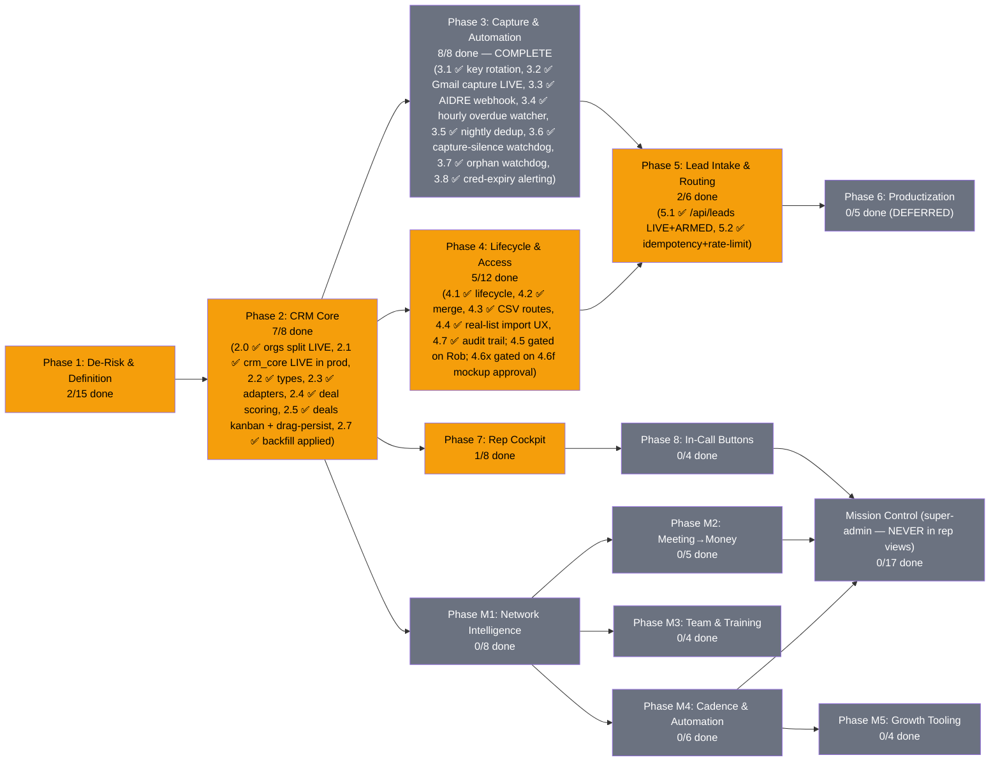

# PRD: MLE CRM — The Network + Self-Made CRM (Unified)

**Version:** 3.1.138 | **Created:** 2026-07-16 | **Updated:** 2026-07-25
**Status:** ACTIVE
**Owner:** Rob + Max
**Project:** mle-rob-dashboard
**Type:** full
**Slug:** mle-crm
**Date convention (est. 2026-07-23, after a UTC-rollover mixup):** every date in this PRD, in `BUILD-QUEUE.md`,
and in `docs/reviews/` is **Rob's local date (America/New_York)** — never the build host's UTC date. Late-night
increments run past 20:00 ET while the host clock has already rolled to the next day; label them by the ET date.
Raw system timestamps quoted as evidence (Supabase `created_at`, git `%cI`) keep their own zone and say so.

> **LINEAGE (replaces the old "Relationship to the base PRD" banner):** This is the single unified living
> PRD for the MLE CRM, formed 2026-07-21 by merging `PRD-mle-rob-dashboard-v2.md` (base PRD — "The Network",
> Created 2026-07-04, v1.0 → 2.1.2) INTO `PRD-mle-crm-evolution-v1.md` (CRM-evolution PRD, Created 2026-07-16 —
> **this PRD's direct lineage**; its structure and content are the skeleton of this document). Both source PRDs
> are archived with tombstone headers in [`docs/archive/plans/`](../archive/plans/) (created in commit 6bc0b64;
> Task 2.0's final state, closed by the build driver mid-merge, was ported from the archive in commit eefd7e8 —
> see revision 3.0.2). **Rollback:** git tag `pre-prd-merge-exact` (= ba4cc68, the exact pre-merge state; the
> earlier tag `pre-prd-merge-2026-07-21` is a checkpoint 3 commits prior), PRD snapshots in
> `~/.claude/plans/snapshots/`, and the zero-loss map in [`MERGE-LEDGER-2026-07-21.md`](./MERGE-LEDGER-2026-07-21.md).

---

## Status Diagram

**Color key:** `#22c55e` complete · `#f59e0b` in-progress · `#6b7280` pending · `#ef4444` blocked

**Phases M1–M5 and Mission Control are the base PRD's Phases 1(remainder)/2–9, folded in whole by this
merge — nothing dropped, nothing renamed away from its origin.** See the Merge Ledger for the full
task-by-task mapping and every judgment call made while folding them in.

---

## Goal

The ultimate platform for sales reps — a self-owned CRM whose only job is **helping reps close more deals**,
with The Network graph as Rob's super-admin lens on top. Every lead arrives with the *details* behind its
source, every call is recorded/transcribed/summarized into a searchable brain, and the rep can send a
proposal, matched case studies, an agreement, or an invoice **while still on the call** — with zero
dependence on GoHighLevel, Close, or any rented CRM core.

## North-Star Principles (from Rob's dump — every task answers to these)

1. **Rep screens carry ONLY what closes deals.** Reports and analytics live outside the rep view.
2. **Rent-first modularity.** A $15/mo SaaS today beats a 3-month build; own the thin core, plug in modules (ours and others'). Reps must never eat admin work while waiting on a build.
3. **API-first, terminal-friendly.** Rob's partner's tools and agents sync in via APIs without his IP being absorbed. The fastest path to his buy-in is a working system he can wire into.
4. **Capture the details behind the source, not just the source.** The email they replied to, the form answers, what the TikTok reel was about — context is the differentiator.
5. **The graph is the chain of connections** (Rob's "blockchain" metaphor): who links to whom, node by node — the super-admin layer above the traditional CRM layers.

## Role Layers (from dump)

| Layer | Who | Sees |
|---|---|---|
| 1. Super Admin | Rob | Everything incl. Network graph, AI contribution $, door-open scores |
| 2. Management & Tech | Will/partner + future mgmt | Ops views, pipeline health, no rep-private book detail (ASSUMED) |
| 3a. Sales Rep (house) | MLE reps | Their leads/deals + rep cockpit |
| 3b. Sales Agent (outside) | Brought-on reps w/ own book | Their book is theirs — protected; we touch it only as invited |
| — Bounty Hunter | Lead CHANNEL, not a rep role | Receives/returns high-intent leads (mechanics = open Q1) |
| — Booker | Outreach/appointment setters | Booking queue (mechanics = open Q1) |

## Scope

**IN:**
- Deals/opportunities as first-class objects on the existing Supabase + StorageAdapter foundation
- Role hierarchy above (RLS-enforced) incl. Sales Agent book-of-business protection
- **Lead routing engine**: high-intent lead → auto-close / rep / bounty hunter / booker per defined rules
- **Source-context intake**: source + the actual message/creative/form answers/trade-show notes per lead
- **Rep cockpit**: in-CRM dialer, every call recorded → transcript → AI summary/action items/buying signals → RAG-searchable; video calls (Zoom/Teams) ingested the same way
- **Deep-scrape rapport brief** auto-generated per lead (talking points with sources)
- **In-call buttons**: custom proposal, matched (redacted) case studies, send-for-signature agreement, send invoice
- Task/follow-up engine, contact lifecycle (search/dedup/import/export/audit), authenticated product lead API (AIDRE/AIVA)
- Build-vs-buy verification via github-tool-scout (Rob's own first-mission search) + schema patterns from Attio/Twenty
- **Carried-forward Network & mission-control scope (Phases M1–M5, Mission Control)** *(added 2026-07-21 merge)* — network graph intelligence, meeting→money flow, training corner, cadence/automation, growth tooling, and the super-admin KPI/ops layer, folded in whole from the base PRD — none of it dropped; see `MERGE-LEDGER-2026-07-21.md` for the full task-by-task mapping

**OUT:**
- GoHighLevel in any form; Close CRM as a destination (one-time read-only export of Rob's own contacts is the only allowed touch, gated on Rob's explicit scope call)
- **Management reporting/analytics suite inside the CRM** — reports are made outside it (Rob: "the only thing we need this for is to help close more deals"). NOT excluded: rep-facing best-practice surfacing (Task 7.8) — that IS closing help, not reporting
- **Literal blockchain tech** — "blockchain" is the connection-graph metaphor, not chain infrastructure (ASSUMED, flag if wrong)
- Client-facing / white-label views (productization = Phase 6 groundwork docs only)
- Replacing the base PRD's meeting→money, KPI, or ingestion scope (consumed, not duplicated)
- Absorbing partner IP into this codebase — integration is via API plug points only
- **Outside investment tracking** *(added 2026-07-21 merge — base PRD scope)* — we don't take outside money; door-openers can earn a cut instead
- **Writing back to the onboarding/invoicing source systems** *(added 2026-07-21 merge — base PRD scope)* — the Mission Control ops/read layer stays read-only, always

## Success Criteria

- Rob runs a full deal — first touch → interactions logged → quote → signed → paid — without leaving the dashboard
- A rep opens a lead and sees: source WITH details (message/form answers/reel topic), deep-scrape talking points, and full activity timeline — nothing that doesn't help close
- A test call dialed from the CRM produces recording + transcript + AI summary w/ action items and buying signals in the timeline, and a RAG query (e.g. "pricing objection") surfaces the right call moment
- Proposal button: click → branded custom proposal sent in <60 seconds while on-call; same seat sends agreement (e-sign) and invoice
- A seeded high-intent lead routes correctly per the routing table (auto-close / rep / bounty hunter / booker)
- github-tool-scout report delivered; keep-vs-adopt base decision logged with weighted scores + source URLs
- Storage-adapter guarantee holds: file-store fallback keeps UI functional if Supabase is unreachable
- Every differentiator in the vision dump maps to ≥1 task or an explicit OUT (verified in this doc)
- **Adding a person to the Network takes < 60 seconds of typing and immediately appears as a node** *(base PRD; now Task M1.1's DoD)*
- **The AI estimator produces revenue/new-node/probability estimates for the Jonathan Polk test case that Rob judges directionally right** *(base PRD; now Task M1.3)*
- **PRD checkboxes and revision history stay current within 24h of any work (living doc)** *(base PRD process criterion — applies to this unified doc)*

---

## Phases + Tasks

### Phase 1: De-Risk & Definition (Research + Sales — runs BEFORE build)

- [x] Task 1.1 [Rob] - **GATE: Brain-dump "how my CRM is different from every other CRM"** | DoD: Captured verbatim → `ROB-CRM-VISION-DUMP-2026-07-17.md`; every differentiator mapped in this v2.0 ✅ 2026-07-17
- [ ] Task 1.2 [Research] - Build-vs-buy scorecard: Attio, Twenty (OSS), Folk, HubSpot Free at <5 seats — cost, ownership, data portability, customization, network-graph fit | DoD: One-page weighted composite scorecard per scoring-pattern rule; source URL + access date per cell
- [ ] Task 1.3 [Research] - Table-stakes feature matrix: what lightweight CRMs (Attio, Twenty, Folk, HubSpot Free, Pipedrive) all ship | DoD: Tool × feature matrix with source URL per cell; flags gaps vs current dashboard
- [ ] Task 1.4 [Research] - Schema-pattern study: how Attio + Twenty model org↔person↔deal↔activity (incl. many-to-many people↔orgs, activity polymorphism) | DoD: Annotated Mermaid ER diagram citing each tool's public docs/repo, mapped against current `lib/types.ts` with gaps flagged
- [ ] Task 1.5 [Research] - Email-sync build cost: DIY Gmail API (watch renewals, quotas, threading, OAuth verification) vs Nylas/Unipile/EmailEngine | DoD: Comparison table (dev-days, $/mo at 5 seats, maintenance) with source URL per claim
- [ ] Task 1.6 [Sales] - Define the CANONICAL pipeline-stage list (supersedes base-PRD Task 7.1, now cross-linked): start from `New Lead → Contacted → Meeting Booked → Meeting Held → Quote Sent → Negotiating → Signed → Stalled → Lost` + `Referral-Sourced` flag, and reconcile base-7.1's post-signature stages (Invoiced → Paid → Delivering) plus entry/exit trigger events per stage | DoD: One stage table, approved by Rob, covering pre- AND post-signature; every existing record maps to exactly one stage; base-PRD 7.1 carries the supersession cross-link (done in base v2.1.2). **⚠️ Merge cross-reference (2026-07-21):** also reconcile with Mission Control Task MC.5 (base 7.6 stalled-deal thresholds/qualified-lead gate/lost-reason enum) — genuine content overlap, not auto-merged; see ledger.
- [x] Task 1.7 [Sales] - Spec the "Who do I touch today" rules: next-step due/overdue, meeting-no-log >24h, stage-aging thresholds (3d Contacted, 5d Quote Sent, 7d Negotiating) | DoD: Rules doc testable against 10 seeded records covering each trigger. **⚠️ Merge cross-reference (2026-07-21):** overlaps in purpose with Mission Control Task MC.3 (base 7.4 "Needs Action Today" rule set, feeds the Rob-facing daily-priorities panel) — related but distinct audiences (rep next-steps vs Rob/ops SLA rules); reconcile, don't silently merge; see ledger. ✅ **DONE 2026-07-22 (Q25):** rules ARE code per CR-3 — pure `lib/tasks/todayRules.ts` (4 triggers, ET-day + `now` passed in, demo-* excluded, deterministic ordering) + narrating spec `docs/plans/TODAY-RULES-SPEC.md`; DoD met by `lib/__tests__/todayRules.test.ts` — 12 seeded records cover every trigger + negatives (6 tests, 281/281). MC.3 reconciled-not-merged: spec directs MC.3's builder to define its thresholds relative to `STAGE_AGING_DAYS` (one threshold table, two consumers). Stage-entry proxied by `deal.updatedAt` until Task 4.7's audit trail (documented) — **4.7 SHIPPED 2026-07-22 (Q28): `status_change` rows now exist + no-op drags no longer churn `updatedAt`; switching stage_aging to true entry times is an open follow-up, proxy still in use.** **Unblocks Task 2.6.**
- [x] Task 1.8 [Sales] - Spec the Referral-Chase Queue: promised-intro-date passed with no linked new lead | DoD: Seeded "promised intro, no lead" record flags; clears when referred lead is logged ✅ **DONE 2026-07-22 (Q27):** rules ARE code per CR-3 — pure `lib/referrals/chaseQueue.ts`: promise = activity with `sourceContext.promised_intro {expected_by, of?}` (rides Task 1.15's seam, zero new schema) anchored to the promiser; chased when `expected_by` < Rob's ET day (due-today not yet broken, Task 3.4 convention); clears when a lead with `referredById === promiser` is logged at/after the promise (`Person.referredById`, the existing door-opener pointer). Timestampless leads conservatively never clear (Person type lacks created_at — callers pass it; documented). demo-* excluded, deterministic most-overdue-first ordering, shape-checked payloads. DoD met by `lib/__tests__/chaseQueue.test.ts` — flag + clear pair plus 7 negatives (9 tests, 292/292). Narrating spec `docs/plans/REFERRAL-CHASE-SPEC.md` (code canonical). Consumers (worklist band / flags watcher / digest) deliberately future tasks.
- [x] Task 1.9 [Sales] ✅ **DONE 2026-07-22 (driver, Q29 — shipped as code per CR-3, Q25/Q27 precedent)** - Define mandatory per-interaction fields: date, contact, channel, referral source, door-opened (Y/N + who), next step + date, stage change | DoD: Save rejected if any required field missing — **met**: pure `lib/activities/requiredFields.ts` is the single rule source (fields ride Task 1.15's `sourceContext` seam — zero new schema; "none" is a valid ANSWER for referral-source/stage-change, absence is what rejects; `door_opened.by` required only when opened=true; stage_change is a DECLARATION — the authoritative row stays server-written per Task 4.7); enforced at the new `POST /api/admin/activities` manual-log endpoint (400 + full missing-field list). Scope honesty: MANUAL logs only — automated captures (n8n/AIDRE/dialer webhooks) keep narrower validation, since they can't answer door-opened/next-step and 1.9 enforcement there would kill capture. 16 tests incl. route-level DoD pair (complete log saves; any stripped field rejects)
- [ ] Task 1.10 [Sales] - Define rep-visible vs Rob-only fields (reps: contact/stage/next-step/log; Rob-only: AI contribution $, door-open score, network map) | DoD: Field-visibility matrix signed off by Rob; fixture test proves no Rob-only field renders in the rep view ("only what closes deals" verified, not asserted)
- [x] Task 1.11 [Sales] ✅ **DONE 2026-07-22 (driver, Q31 — shipped as code per CR-3, Q25/Q27/Q29/Q30 precedent)** - Define AIDRE/AIVA lead-intake payload: product, source, company, vertical, demo dates, assigned rep, stage=New Lead | DoD: Payload schema doc handed to Engineering for Task 5.1 — **met**: pure `lib/leads/intakePayload.ts` IS the handoff — `LeadIntakePayload` envelope maps Task 1.11's list 1:1 (`product` aidre|aiva; `source_context` = Task 1.15's shapes validated by COMPOSING `parseIntakeSourceContext`, one rule source; `company`/`vertical` free text for 5.1 to map; `demo.requested_at`/`scheduled_for` ISO, requested ≠ booked; `assigned_rep` free text until Phase-4 profiles — omit → Task 1.14 routing decides). Stage is deliberately NOT a field: server pins `INTAKE_STAGE="new_lead"` and a client-supplied `stage` key rejects the payload (same anti-smuggling posture as the /deals stage-only patch gate). Plus `contact` (name + ≥1 of email/phone — a lead nobody can reach isn't a lead). `parseLeadIntake` reports every problem (1.9/1.15 contract); extra keys additive (MC.4 rides along later). `INTAKE_WORKED_EXAMPLES` one per product, test-pinned, reusing 1.15's pinned source examples so the specs can't drift. 11 tests. Doc `docs/plans/LEAD-INTAKE-PAYLOAD-SPEC.md` narrates (code canonical). **Task 5.1's definition prereqs are now ALL in hand** (1.15 ✅ + 1.11 ✅) — 5.1 imports `parseLeadIntake` + `INTAKE_STAGE` and only owes tokens/persistence.
- [x] Task 1.12 [Research] - 🔎 **github-tool-scout FIRST MISSION ✅ 2026-07-17** (docs/research/SCOUT-crm-agents-enrichment-2026-07-17.md; keep-base decision logged) (Rob's search):** OSS platforms approximating the full vision — multi-tier roles, in-app dialer + call recording, AI call summaries, proposal generation, plugin/modular architecture | DoD: Ranked scout report (health scorecards, weighted scores, source URLs); keep-vs-adopt decision logged in Decisions Log; Tasks 1.2–1.5 queue immediately behind it
- [ ] Task 1.13 [Sales] - Role & visibility matrix v2 per the Role Layers table: 4 layers + rep subtypes + bounty-hunter/booker actors, incl. Sales Agent book-of-business protection rules | DoD: Matrix covers every layer × every object type (person/deal/activity/book); ASSUMED cells flagged for Rob
- [ ] Task 1.14 [Sales] - Lead-routing decision table: which high-intent leads go auto-close vs rep vs bounty hunter vs booker (triggers, criteria, fallbacks) | DoD: Routing table resolves 10 seeded lead scenarios with zero ambiguity
- [x] Task 1.15 [Sales] ✅ **DONE 2026-07-22 (driver, Q30 — shipped as code per CR-3, Q25/Q27/Q29 precedent)** - Source-context intake spec: per-source detail fields — email replied to + reply text, form questions + answers, ad/reel topic + creative ref, trade-show notes | DoD: Field spec with worked examples for ≥3 source types; feeds Tasks 2.1 and 5.1 — **met**: pure `lib/leads/sourceContext.ts` is the canonical spec — typed shapes for all FOUR intake source types (`email_reply`/`web_form`/`ad_reel`/`trade_show`, discriminant `source_type`, riding the 0005 `source_context` JSONB seam — zero new schema), `parseIntakeSourceContext` validator (reports every problem, same contract as Task 1.9; extra keys allowed by design so MC.4 attribution + Task 1.11 product detail ride along additively), `describeIntakeSource` rep-surface one-liner, and `WORKED_EXAMPLES` exported + test-pinned valid for all 4 types (exceeds the ≥3 bar; import them, don't copy doc snippets). Feeds: Task 2.1 ✅ (column exists), Task 5.1 (validator ready to consume). Deliberate scope: already-live seam shapes (n8n capture, AIDRE, promised_intro, 1.9 manual fields, 4.7 stage audit) keep their own narrower validators — catalogued in-module. 8 tests. Narrating doc `docs/plans/SOURCE-CONTEXT-SPEC.md` (code canonical). **Cross-reference (2026-07-21):** complements Mission Control Task MC.4 (base 7.5 lead-source taxonomy/UTM convention) — 1.15 captures per-lead detail, MC.4 captures channel-level attribution taxonomy; both needed, not duplicative.

### Phase 1b: Live-with-Rob additions (shipped during walkthroughs)

- [x] Task 1b.1 [Engineering] ✅ 2026-07-22 - "Things to Address" flag system (table+API+3 surfaces: Overview digest w/ Read, entity pages w/ resolve+note, dated archive) | DoD met: CG conflict live test open; Miga/RedRock archived w/ Rob rulings
- [x] Task 1b.2 [Engineering] ✅ 2026-07-22 - Guaranteed dev-chat receipts server-side ('system' author) + CI/ESLint/Dependabot | DoD met: receipt round-trip proven on prod; CI green on main, blocked breaking dep PR
- [x] Task 1b.3 [Engineering] ✅ 2026-07-22 — critic-rob SHIP 92/100 after punch-fix round (docs/reviews/CRITIC-ROB-rep-scaffold-2026-07-22.md) — **REP CRM SCAFFOLD (Rob priority 7/22):** rep-facing account list ("My Accounts" — feels like a CRM, optimized for closing) + account workspace page (what opens on click: context story, timeline, action bar) on Jake demo book; full rep-POV mockup for Rob's sign-off | DoD: Rob can click through list→account→actions in prod demo; critic-rob ≥90; informs the Phase-4 rollout mockup requirement

### Phase 2: CRM Core — Deals, Activities, Tasks (Engineering)

*Prereqs: (1) base-PRD Task 1.2 (Supabase adapter) complete; (2) Phase 1 definition tasks 1.6–1.15 in hand.*

- [x] Task 2.0 [Engineering] ✅ **DONE 2026-07-21 — critic-rob TICK 97/100 (`docs/reviews/CRITIC-ROB-Q4-orgs-split-2026-07-21.md`).** 🚨 **URGENT (Rob 2026-07-17): split People vs Businesses.** Live `people` table (54 rows at PRD time; live count drifts with Rob's edits — 32 as of 7/21 eve) mixes humans and orgs (e.g. `miga-food-manufacturing`). Add `orgs` table, classify every existing row (human / org / org-as-contact), migrate with edges/FKs preserved | DoD: Zero business entities remain typed as Person; every human links to their org via `org_id`; graph + ledger render both correctly; row-count reconciliation report (N in = N out across both tables, N = live count at apply time) | 7/21 status: 0003 written, amended (verbatim column carry), TWICE defect-fixed pre-apply (data-loss carry list; edges NOT-NULL ordering), and full-SQL rehearsed on live data w/ auto-rollback — all gates green (recon, edge constraints, field preservation). Remaining: ~~adapter dual-schema reads~~ ✅ 7/21 → ~~real apply (+flip `ORGS_SPLIT_READS`)~~ ✅ 7/21 eve **APPLIED TO PROD, LIVE** (post-apply gates == rehearsal exactly: 16+16, 33/47 edges repointed, 0 violations, field-preservation exact; prod curl: all 32 pre-split rows render, money/referral fields spot-checked intact) → ~~person→org `org_id` linking~~ ✅ 7/21 eve (scripts/backfill-org-links.mjs: 11/16 people linked to their org + 15 org_memberships rows — 11 primary + 4 secondary across 3 people w/ secondary affiliations (critic-rob Q4b arithmetic fix 7/21), every link source-cited from the enrichment corpus; 5 honest skips where no org row exists — Trent/Title Base, Cates, George/Guest Genie, Rob+Will/MLE internal; idempotent, gate 11/16 verified twice — **7/23: Trent skip RESOLVED, org `the-title-base` created + membership linked when his $2k Phase 1 check landed (rev 3.1.84); 4 skips remain**) → ~~UI merge-view check~~ ✅ 7/21 night (prod redeployed — 6b5faeb's isDemo filter had never shipped, DEMO rows were leaking into prod graph/ledger; post-deploy: 32 nodes/47 edges/0 DEMO/0 dangling, biz badges + Business record header render live) → ~~critic-rob review~~ ✅ 7/21 night TICK 97/100. Post-close notes: (a) export `entityKind` in `/api/network` before Phase-2 deals consumers exist; (b) `people.entity_kind` column is transitional debris — drop after Task 2.2 lands (dated 7/21); (c) Gulf Coast signed-dispute is resolved-by-data since 7/18 (signed date present, `isDisputedSigned` false) — no longer an open ruling; (d) 🚨 **KNOWN-OPEN DEFECT (found 7/21 night by Q13 rename verification): `/api/admin/people` PATCH/DELETE are people-table-only** — post-split, inline edits on the 16 business records match 0 rows, error-free, and the UI still pulses "saved" (empirically proven: PATCH `people?id=eq.proplogic` → 200/`[]`, orgs untouched) → business edits silently lost in prod. Fix queued BUILD-QUEUE Q14, FIRST on unfreeze (capture-only freeze blocks the deploy); Rob notified via PING-INBOX. **7/22: fix BUILT + TESTED in repo (`lib/adminEdit.ts` + rewritten route: PATCH routes by entity w/ 0-row→404 truth gate, DELETE covers org edge-twins/pointers/both tables; 39/39 vitest, build green) — then DEPLOYED + PROD-VERIFIED same night per Rob dev-chat #40 ("Do what the best course of action is" = GO): business edit persists (orgs.proplogic.business PropLogic→PropLogix via the live route), bogus-id PATCH → 404 (no false "saved"), person edit unchanged, /api/network 32/47 intact. DEFECT CLOSED.**
  - 2026-07-21 (driver): migration `0003_orgs_split.sql` AMENDED before any apply — original draft silently dropped `referred_by_id` (set on ALL 17 company rows), `relationship` (17), `estimate` (11), `phase_one` (4 in-progress), `role`/`business`/`est_time_to_payment_days` + meeting/transcript urls. orgs now carries every people column verbatim (minus `entity_kind`); prune is a later Rob call. Dry-run gained a field-preservation gate (per-column non-null counts, diffable 1:1 post-apply) + flags any people column missing from the carry list. Verified vs live: 35 → 18+17, 33/48 edges repoint, zero dropped columns. NEXT: branch apply + adapter org reads.
- [x] Task 2.1 [Engineering] - Migration ~~`supabase/migrations/0002_crm_core.sql`~~ **`0005_crm_core.sql`** (0002/0004 names got taken by node_type_taxonomy + flags): `deals`, `activities` (source-typed: manual|n8n|api|aidre|dialer), `tasks` tables with FKs + `source_context` JSONB per Task 1.15 spec | DoD: Migration applies clean locally + prod; FKs enforce integrity | **Progress 2026-07-22 (driver): 0005 WRITTEN + FULL-SQL REHEARSED on live Supabase w/ auto-rollback (Q4 pattern)** — 3 tables + 10 indexes + RLS applied clean, FK inserts round-tripped, check-gates verified live (anchorless deal rejected, person+org double-anchor rejected), prod confirmed untouched after. Deliberate deviations dated in-file: owner_id/created_by/assigned_to free-text until Phase-4 profiles (D-002 step 9 says exactly this); transcript_url text until Task 7.4's transcripts table; stage check uses the Task 1.6 DRAFT list (Rob hasn't locked 1.6 — one cheap ALTER when he does). ~~Remaining: real apply (+ Task 2.2 types, 2.3 adapter methods), backfill script (D-002 steps 7-9), critic-rob milestone review before Q9 ticks~~ **✅ APPLIED TO PROD 2026-07-22 (Q9 inc.4)** via Supabase MCP apply_migration (tracked `crm_core`) after a clean pre-apply gate (10 tables, none of the three present). DoD proven LIVE through PostgREST (the adapter's real path): deal insert round-tripped numeric 1234.56 + key_dates jsonb byte-exact; anchorless deal REJECTED 23514; deal-only activity accepted, person+org double-anchor REJECTED 23514; task round-tripped; deal delete cascaded the activity and set-nulled the task FK; all test rows removed, tables back to 0, prod otherwise untouched (34 nodes/47 edges verified after). Side finding fixed same increment: 0003 had left `orgs`/`org_memberships` (+legacy `events`) with RLS disabled — migration `0006_rls_enable.sql` applied, flag #8 posted to the ledger. Task 2.1 fully done; Q9 remaining = backfill (Task 2.7) + critic-rob
- [x] Task 2.2 [Engineering] ✅ **DONE 2026-07-22 (driver)** - Extend `lib/types.ts` with `Deal`, `Activity`, `Task`, `Org` (+ additive `orgId?` on `Person`) | DoD: `npm run build` passes; existing pages compile unchanged — **met: build green, 96/96 vitest, zero page edits.** Delivered: all 5 types + `DealStage`/`RoutingLane`/`ActivityType`/`ActivitySource`/`TaskStatus` unions (`Org` = `Omit<Person, "entityKind"|"orgId">`, honest to 0003's verbatim mirror) **plus** `lib/crm.ts` row↔type mappers (the 2.3 seam) gate-tested against the 0005 DDL parsed from disk (`lib/__tests__/crm.test.ts`: column sets equal both directions, enum arrays == check constraints, round-trips, pg-numeric coercion; `satisfies` + type-level exhaustiveness pins the unions to the arrays). Note: `people.entity_kind` drop (Task 2.0 punch b) stays open — it rides a later migration, not this types task
- [x] Task 2.3 [Engineering] ✅ **DONE 2026-07-22 (driver)** - Extend StorageAdapter with deal/activity/task methods in BOTH Supabase and file stores | DoD: Both adapters pass identical contract test suite (`lib/storage/__tests__/adapter.contract.test.ts`) — **met: one shared behavioral suite (7 cases × 2 adapters: empty reads, round-trip fidelity incl. pg-numeric + jsonb, upsert-no-dupe, createdAt/occurredAt ordering, person/org/deal anchor filters, task status filters) passes against the file store on a temp `CRM_DATA_PATH` AND the supabase store through the real `lib/crm.ts` mappers over an in-memory PostgREST fake; 110/110 vitest, build green.** Delivered: `StorageAdapter` + `ActivityFilter`/`TaskFilter` (list/upsert × deals/activities/tasks), supabaseStore methods on the 0005 tables, fileStore CRM rows in separate `data/crm.json` (network.json + regen-fallback untouched; ENOENT = empty, same loud-fail write rule), no-stall read fallback + write-no-fallback extended to all CRM reads in `lib/storage/index.ts`, stubs updated. Honest caveat: supabase side is contract-proven against the fake — live-table round-trip proof rides the 0005 apply increment (next), before the Q9 critic-rob gate
- [x] Task 2.4 [Engineering] ✅ **DONE 2026-07-22 (driver)** - Deal scoring as pure module `lib/scoring/deal.ts` (weighted ladder, `asOf` param, no `Date.now()`) + unit tests | DoD: Deterministic on fixed fixtures; full branch coverage on ladder thresholds — **met: 66 tests in `lib/__tests__/dealScore.test.ts` hit EVERY ladder rung (all 12 stages, all 6 freshness bands incl. both boundary days of each, all 6 value rungs at both edges, both referral rungs, coverage 0–4 fields, all 5 grade bands at boundaries), determinism + asOf-is-a-parameter proven (same input twice → identical; moving asOf alone moves the score), unparseable asOf throws. 199/199 vitest, build green, lint clean.** Scoring-pattern rule honored: one weight table up front (stage .30 / freshness .25 / value .20 / referral .15 / coverage .10, sum-to-1.0 pinned by test), per-signal 0–100 ladders in code, every composite ships a breakdown row (signal|raw|weight|weighted|evidence). Design calls dated in-file: composite = attention priority, NOT win probability; `terminal` flag on paid/lost so consumers shelve them; stalled/lost rank below new_lead (dead-stopped < fresh); $0/unset value scores 0 raw with honest "no deal value recorded" evidence (polk verbatim-$0 safe); no consumer yet — Task 2.5 kanban + M1 estimator are the intended readers
- [x] Task 2.5 [Engineering] ✅ **DONE 2026-07-22 (driver, 3 increments)** - Deal pipeline kanban `app/deals/page.tsx` + `components/ActivityTimeline.tsx` on person detail | DoD: Dragging a card persists stage via adapter; timeline renders mixed types chronologically | **Progress 2026-07-22 (driver, inc.1): `/deals` pipeline board LIVE in prod** — server component off `store.listDeals()` + `getNetwork()`, columns in STAGE_LADDER order (only stages holding deals — 6 deals across 12 empty columns fails the Apple-not-MS-DOS bar), cards sorted by Task 2.4 score within column (first consumer of the scorer), each card: value (honest "no $ recorded" for polk/gary), grade chip w/ full breakdown-table tooltip (signal|raw×weight→weighted|evidence — scoring-pattern rule: never a bare number), referral badge, anchor linked to `/people/[id]` (org anchors resolve — getNetwork coalesces org twins), paid/lost dimmed via `terminal`; header = open count + $-in-play + $-paid; "Deals" added to nav. Prod-curl verified: $22k in play / $19k paid, gary D·48.5 w/ evidence tooltip, On Time Moving B·78. Build green, 199/199 vitest (no logic change — page consumes tested modules). ~~REMAINING for DoD: drag-to-persist stage via adapter (needs a PATCH deals route + client board), ActivityTimeline on `app/people/[id]` (component exists from Task 1b.3, rep-side only today)~~ **inc.2 2026-07-22 (driver): ActivityTimeline LIVE on admin person detail** — `components/ActivityTimeline.tsx` mounted in `app/people/[id]` main column with `isDemo=false`/no demo entries (admin = truth: real `/api/admin/activities?person=` feed or an honest "nothing logged yet" shell, NEVER fabricated demo history — that stays rep-mockup-only); empty-state copy corrected ("Phase 8/9" was stale — email capture is armed per Task 3.2, calls land with the dialer). Prod-curl verified (person page 200, Activity section ships, feed returns clean `[]`). Build green, 199/199 vitest. ~~REMAINING for DoD: drag-to-persist stage via adapter (PATCH deals route — stage only, write path must refuse value/keyDates — + client board)~~ **inc.3 2026-07-22 (driver): drag-to-persist LIVE — DoD closed.** Board moved to client component `components/DealsBoard.tsx` (page stays server-fetch); HTML5 drag between stage columns with optimistic move + snap-back-and-say-so on failed save (never a false "saved"); mid-drag, empty ladder stages appear as slim drop targets so any stage is reachable without 12 permanent columns (Apple bar holds). Write path: `PATCH /api/admin/deals` accepts `{id, stage}` ONLY — `parseDealStagePatch` in `lib/crm.ts` rejects the WHOLE request if any other field rides along (value/keyDates untouchable by construction, CR-3), unknown stage 400s against the DEAL_STAGES ladder, 0-row match 404s (no false save, per the Q14 lesson). Proven in prod by curl: smuggled `value` → 400 "refused fields: value"; bad stage → 400 with ladder; unknown id → 404; live round-trip on the no-money deal (gary → contacted → meeting_held) persisted both ways with `value`/`key_dates` byte-identical throughout. 6 new gate tests (205/205 vitest), build green, deployed + aliased
- [x] Task 2.6 [Engineering] ✅ **DONE 2026-07-22 (driver, Q26)** - "Needs action today" endpoint `app/api/tasks/today/route.ts` implementing Task 1.7's rules *(UNBLOCKED 2026-07-22 — Task 1.7 done; wrap `whoDoITouchToday` from `lib/tasks/todayRules.ts`)* | DoD: Seeded fixture returns exact expected task IDs — **met: `lib/__tests__/tasksTodayRoute.test.ts` runs the REAL GET handler against the file store on a temp `CRM_DATA_PATH` with 8 fixtures seeded RELATIVE to today-in-ET (so expected IDs are exact on any run date) and asserts the exact 4-item composite `[rt1 overdue, rt2 due-today, rm1 meeting-unlogged, rd3 stage-aging]` with the 4 negatives (future/done/demo/fresh) excluded; 282/282 vitest, build green.** Route is thin by design (CR-3: rules stay in the pure lib; route only feeds store rows + `todayInET` clock), read-only, `force-dynamic`. Deployed + prod-curl verified: live response `{today: 2026-07-22, count: 0}` is HONEST — tasks table is empty and the quote_sent/contacted deals were all touched 7/22 (0d aged), so an empty worklist is the true answer today. Side effect this increment: Vercel CLI upgraded 37.4.0→56.5.0 (old CLI hard-refused the deploy endpoint; new binary at `~/.npm-global/bin/vercel`, `/usr/local/bin/vercel` still shadows it in PATH). MC.13 (Rob/ops widget) remains the other consumer to reconcile when built. **⚠️ Merge cross-reference (2026-07-21):** overlaps with Mission Control Task MC.13 (base 9.2, "Needs Action Today" widget evaluating MC.3/base-7.4's rule set) — this is the rep-facing endpoint, MC.13 is the Rob/ops-facing widget; likely two consumers of related-but-distinct rule sets, reconcile in Task 1.6/1.7's follow-up; see ledger.
- [x] Task 2.7 [Engineering] ✅ **DONE 2026-07-22 (driver, Q9 inc.5)** - Backfill script `scripts/backfill-crm.mjs`: synthesize one Deal per existing Person with quoted/signed data | DoD: Dry-run report correct; `--apply` idempotent (re-run = no dupes) — **met: dry-run report verified against live rows, `--apply` inserted 6 deals, immediate re-run planned 6 / inserted 0.** Implements D-002 steps 7–10 (stage ladder off signed/key_dates per Task 1.6 DRAFT list; value = quoted_amount verbatim; assigned_rep→owner_id; estimate jsonb carried). Two truth-gate deviations from a literal one-row-per-person reading, both in-file: **(a) person↔org MERGE** — post-0003 the same engagement can mirror on a person AND their org (caleb-green + cg-roofing-group share signed/invoiced dates); blind synthesis would double-count $10k, so a mergeable pair folds into ONE deal anchored to both (divergent amounts stay separate + reported as CONFLICT); **(b) DEMO SKIP** — 5 demo-* fixture rows ($39.5k of fiction) reported and excluded from money tables. Live result: 6 deals, $41k pipeline total == source rows exactly (golf-coast paid 19000, cg-roofing invoiced 10000, naples-spine signed 5000, calebs-brother quote_sent 7000, polk quote_sent 0 — verbatim copy of his quoted_amount=0, gary meeting_held). Step-8 meeting activities: 0 live rows carry meeting_video_url/transcript_url, handler in place. 10 unit tests on the pure planner (merge guard, ladder, demo skip, idempotency filter), 120/120 vitest, build green. No deploy (no UI consumes deals yet — Task 2.5). ~~Q9 remaining: critic-rob milestone review only~~ **✅ Q9 MILESTONE REVIEWED 2026-07-22: critic-rob SHIP 95/100, zero auto-fails** (docs/reviews/CRITIC-ROB-Q9-crm-core-2026-07-22.md — reviewer independently re-verified tests, prod money totals, idempotency, and source-row untouchability). Polk $0 ruling: verbatim copy correct; ambiguity routed to Rob via /api/admin/flags (QUOTE vs PLACEHOLDER — deal stage flips to meeting_held if placeholder). Open follow-ups from the punch list (non-blocking): (a) deal `notes` provenance wording on gary/polk overstates "org+person rows" — key on `mergedFrom` at scripts/backfill-crm.mjs:69, patch or accept the 2 prod strings; ~~(b) suppress prd-autosave heartbeat rows in the revision log~~ **(b) ✅ DONE 2026-07-22** — prd-autosave.sh refreshes the Updated date only, no version bump / no revision row (see v3.1.19); (c) when step-8 meeting activities first fire, stamp `source_context.time_synthetic: true` on the noon-UTC synthetic times

### Phase 3: Capture & Automation (Operations)

- [x] Task 3.1 [Operations] - ~~URGENT (expires ~2026-07-19)~~ Rotate boostn8n.app.n8n.cloud API key, re-point all workflows | DoD: New key live, old revoked, zero auth failures post-cutover | **Progress 2026-07-21:** urgency cleared — Rob delivered the new key (`N8N_KEY` in .env.local), live-tested 200 on delivery and re-verified 200 during the 7/21 reconciliation sweep. **✅ DONE 2026-07-22 (driver):** old key curl-verified DEAD (401 — JWT past its 2026-07-19 exp; n8n rejects it, so it cannot authenticate anywhere; optional UI-list cleanup is cosmetic), new key 200 with exp 2026-10-19; the one remaining presenter of the old key (`multi-claude/.env` N8N_API_KEY — also what the session-start hook reads) cut over to the new value (backup `.env.bak-2026-07-22`); hook now reports "✓ n8n API key OK (88 days left)" — stale-warning defect closed
- [x] Task 3.2 [Operations] - n8n Gmail capture: rob@aivoicetech.io ONLY → match to contact → append to activity timeline | DoD: Test email appears on correct timeline <5 min; boostuppayments.com mail never ingested (log-verified — identity rule) | **Scope re-check vs 7.21 COMMS dump DONE 2026-07-22 (driver): NO conflict** — this task is ROB's own inbox via n8n; the dump's COMMS scope (rep-email scrape + send-as-rep) is Task 4.6b, rides Google-OAuth onboarding scopes, and is Phase-4-gated. Complementary, not overlapping. Build constraint so 4.6b doesn't force a rebuild: the n8n workflow must write the same `activities` shape 4.6b will use (`source='n8n'`, channel=email) — capture mechanism stays swappable. ~~**⛔ SEQUENCE-BLOCKED by Task 2.1 (Q9):** DoD lands mail on the activity timeline, but the `activities` table doesn't exist yet (0004 went to `flags`; crm_core migration is Q9, frozen pending Rob's schema go). Order: Q9 → this~~ **✅ UNBLOCKED 2026-07-22 (Q9 inc.4): `activities` table is LIVE in prod (0005 applied, round-trip verified) — n8n Gmail capture is buildable now (write `source='n8n'`, source_context channel=email)** | **CRM-side seam BUILT 2026-07-22 (driver):** `lib/n8nEmail.ts` (pure, 13 tests: identity gate hard-rejects ANY boostuppayments.com party per email-identity rule — headers judged, never the mailbox, so 2026-07-08-style crossover mail can't leak in; counterpart match excludes Rob's own capture-address record; deterministic `n8n-email-<gmailMessageId>` id → idempotent upsert; person vs company rows anchor as personId vs orgId, never both) + env-gated `POST /api/webhooks/n8n-email` (503 w/o N8N_EMAIL_WEBHOOK_SECRET, 403 bad x-n8n-secret; rejections return 200+logged reason so n8n never retry-loops — the log-verified DoD channel). ~~Remaining: set secret in Vercel env + deploy (inert), build the n8n workflow (Gmail trigger → POST) via N8N_KEY, live test-email DoD~~ **ENDPOINT ARMED IN PROD + n8n WORKFLOW BUILT 2026-07-22 (Q8 inc.3):** secret set (Vercel prod env + .env.local), deployed, all four gates curl-verified live (no/bad secret → 403; boostuppayments party → 200 rejected w/ logged crossover reason — the log-verified DoD channel, proven in prod; unknown sender → 200 no-contact-match; zero rows written). n8n side: httpHeaderAuth credential `2sHDFkgzMWkOvhv7` + workflow `JnIJiCbOqSaK8uN2` ("MLE CRM — Gmail capture (rob@aivoicetech.io)", everyMinute poll → POST w/ x-n8n-secret, defensive field mapping) created INACTIVE. ~~**Sole remainder = Rob-only OAuth click** (attach Gmail cred for rob@aivoicetech.io to the trigger — PING-INBOX ask filed) → activate → live test-email <5-min DoD~~ **✅ CLOSED 2026-07-22 (v3.1.22): Rob's OAuth click landed (cred `zafHNwGNRYD8V9aq`, account identity proven live — trigger From: rob@aivoicetech.io), workflow activated, <5-min DoD met with a real captured email → verified `activities` row; test scaffolding cleaned. Capture is LIVE in prod.**
- [x] Task 3.3 [Operations] ✅ **DONE 2026-07-22 (driver)** - AIDRE call-outcome webhook receiver stub (`/api/webhooks/aidre-call`) → `activities` as type=call, source=aidre | DoD: Synthetic POST creates one correctly-linked activity row; payload schema doc delivered — **met: route-level synthetic POST test proves exactly one row anchored to the phone-matched person (`type=call`, `source=aidre`, deterministic `aidre-call-<callId>` id → AIDRE retries can never duplicate); payload spec delivered at `docs/plans/AIDRE-CALL-PAYLOAD-SPEC.md` (hand to the AIDRE repo when its outbound webhook is built).** Seam: `lib/aidreCall.ts` (pure) reuses the Vapi last-10-digit phone matcher — ONE phone-matching behavior CRM-wide; company-number match anchors as orgId, never both (0005 check); unmatched callers → 200 `ingested:false`, zero rows (no anchorless writes; unmatched-call intake is a Task 5.1 decision). Env-gated like n8n/Vapi: `AIDRE_WEBHOOK_SECRET` unset → 503, fully inert — TRUE STUB, nothing armed until AIDRE-side webhook exists + secret is set. 11 tests (216/216 vitest; a minimal `vitest.config.ts` alias now lets tests import route handlers via `@/`), build green, no deploy (inert endpoint rides the next user-visible deploy)
- [x] Task 3.4 [Operations] ✅ **DONE 2026-07-22 (inc.3, driver): n8n hourly workflow `ozMXSpftU2lIbhp2` LIVE (Schedule Trigger hourly :33 → GET /api/cron/overdue w/ bearer, retry ×3) — manual test 200 honest `{overdue:0,flagged:0}`, published, first production scheduled execution observed. Phase 3 COMPLETE.** - Overdue follow-up watcher: hourly n8n cron pings Rob on past-threshold follow-ups | DoD: Test past-due record triggers exactly one ping, no dupes on re-run | **Progress 2026-07-22 (inc.1, driver): CRM-side watcher BUILT** — pure `lib/integrity/overdue.ts` (CR-3): open task + `due_date` strictly before Rob's ET calendar day (`todayInET` — a task due today must not alert at 7pm ET on UTC rollover; clock passed in, never read) → finding; demo-* excluded; deterministic title `Overdue follow-up: task <id> (due <date>)` = idempotency key, so hourly re-runs never dupe (the DoD) while a reschedule (new due_date) re-arms the alert. "Ping" = medium flag on the flags ledger (findings protocol). `GET /api/cron/overdue` reuses the Task 3.5/3.7 auth contract (`verifyCronAuth`, CRON_SECRET unset → 503 / wrong bearer 401); Vercel Hobby's 2-cron cap is spent (dedup + integrity), so the HOURLY firing comes from an n8n schedule workflow calling the route with the same bearer — exactly the "n8n cron" the task specifies. 9 tests (275/275), build green, no deploy (route rides next deploy). ~~Remaining: deploy + provision the n8n hourly schedule workflow via N8N_KEY + seeded past-due live DoD (one ping run 1, zero run 2)~~ **Progress 2026-07-22 (inc.2, driver): DEPLOYED + DoD PROVEN ON PROD** — route live (auth curls 401 no-bearer / 401 bad-bearer / honest `{ok:true,overdue:0,flagged:0}` on the empty tasks table); seeded past-due open task (`due_date` 2026-07-20) → run 1 `{overdue:1,flagged:1}` (flag verified on the ledger: medium, entity "CRM follow-ups", title embeds task id + due date), run 2 `{overdue:1,flagged:0}` — exactly one ping, zero dupes, the DoD's core sentence proven live; scaffolding cleaned (seed task + test flag deleted, final run honest `{overdue:0,flagged:0}`). Remaining: provision the hourly n8n schedule workflow (Schedule Trigger → HTTP GET with the CRON_SECRET bearer) → verify one live scheduled execution → tick — **✅ done inc.3 (see DONE line above)**
- [x] Task 3.5 [Operations] - ✅ 2026-07-22: Nightly dedup detector → `dedup_review` queue (no auto-merge) | DoD: Same-email-different-casing pair surfaces; similar-but-distinct names don't. **Progress 2026-07-22 (inc.1):** matcher core built as pure code — `lib/dedup/match.ts` (`findDuplicatePairs`: email/phone/name exact-after-normalization; phone reuses the Vapi last-10-digit rule so the CRM matches numbers ONE way; deliberately zero fuzzy matching so similar-but-distinct names can never surface; email/phone hits = high confidence, name-only = review; deterministic pair order, evidence line per signal). Both DoD behaviors pinned by 12 unit tests (228/228). Task 4.2's merge UI consumes this same module. **inc.2 (same day): `dedup_review` table + `/api/admin/dedup` (run/list/dismiss) live-verified — see rev 3.1.28.** **inc.3 (same day): CLOSED — nightly Vercel cron LIVE on prod**: `vercel.json` cron `0 7 * * *` UTC → `GET /api/cron/dedup` (CRON_SECRET bearer, constant-time; 503 unarmed / 401 wrong bearer / detector run on match — all three prod-curled), detector extracted to shared `lib/dedup/detector.ts` (admin POST + cron run byte-identical logic), proxy `isPublicPath` exempts `/api/cron/*` (route carries its own auth). `vercel crons ls` confirms registration; 240/240 tests, deploy Ready
- [x] Task 3.6 [Operations] - Silent-failure watchdog for Gmail/AIDRE capture workflows | DoD: Forced workflow error (bad credential) alerts Rob within 15 min ✅ **CLOSED 2026-07-22 (inc.2): full n8n path LIVE, DoD proven on prod — forced-error flag landed within SECONDS (16:02:18Z), once-a-minute failure storm → exactly 1 flag (12+ alarm runs), scaffolding cleaned, honest 0 final. n8n side: error-alarm workflow `VoOFOPGqObGWe5Jr` (Error Trigger → POST w/ shared httpHeaderAuth cred) + `errorWorkflow` set on Gmail capture `JnIJiCbOqSaK8uN2`.** | **Progress 2026-07-22 (inc.1, driver): CRM-side receiver BUILT** — design is n8n's own Error Trigger (fires within seconds of ANY workflow failure, incl. the polling-trigger bad-credential variant where no execution ever starts) → `POST /api/webhooks/n8n-error` → high-severity flag on the Things to Address ledger (findings protocol). Pure `lib/integrity/captureAlert.ts` (CR-3): payload→flag mapping, deterministic per-workflow-per-day title = idempotency key, so a once-a-minute failure storm raises ONE flag but a still-broken workflow re-alerts next day. Auth reuses the Gmail-capture contract (x-n8n-secret vs N8N_EMAIL_WEBHOOK_SECRET — same n8n instance is the only caller; unset → 503 inert); post-auth always 200 so n8n never retry-loops. 6 tests (260/260), build green, no deploy (endpoint rides next deploy). Remaining: deploy, provision the n8n Error Trigger workflow via N8N_KEY, set `errorWorkflow` on the Gmail capture workflow, forced-bad-credential live DoD test
- [x] Task 3.7 [Operations] - ✅ **DONE 2026-07-22 (driver)** - Orphaned-activity check (activities with null/deleted contact_id) as live alert | DoD: Seeded orphan row triggers alert on next scheduled run — **met live on prod: seeded anchorless `tasks` row → cron run 1 raised exactly one high-severity flag in the "Things to Address" ledger (findings protocol channel), run 2 raised zero dupes (deterministic flag title = idempotency key), scaffolding cleaned, final run honest 0 orphans.** Pure detector `lib/integrity/orphans.ts` (CR-3) covers the REAL orphan path the schema leaves open — `tasks` has no anchor check constraint, so a deal delete (`deal_id on delete set null`) can strand a task anchorless — plus belt-and-braces dangling-FK/anchorless-activity checks that watch the 0005 invariants instead of asserting them. Nightly `GET /api/cron/integrity` (vercel.json `30 7 * * *`, second Vercel cron) reuses the Task 3.5 auth contract (`verifyCronAuth`, CRON_SECRET unset → 503 inert / wrong bearer 401 — both prod-curled). 7 tests, 247/247, build green, deploy Ready
- [x] Task 3.8 [Operations] - Credential-expiry alerting (n8n key, Supabase keys, product API tokens) + homemade-CRM failure-mode doc | DoD: Key within 7 days of expiry alerts Rob; doc lists each failure mode + its detection method ✅ 2026-07-22 — rides the nightly integrity cron (Hobby 2-cron cap); decodes real JWT `exp` claims (no hand-maintained dates), ≤7d → high flag in Things to Address; doc: `docs/plans/CRM-FAILURE-MODES.md` (8 failure modes, each w/ detection method)

### Phase 4: Contact Lifecycle & Access (Engineering + Operations)

- [x] Task 4.1 [Engineering] - ✅ **DONE 2026-07-22 (Q33 inc.2, driver): DoD met live on prod** — search bar shipped on `/people` (`components/SearchBar.tsx`: debounced, keyboard-navigable, stale-response-guarded; person AND company hits deep-link to their record pages), deployed, and the DoD sentence prod-curled: `?q=polk` → `jonathan-polk` in **57ms** (<200ms). - Full-text search: `tsvector` + GIN index migration + search bar on people page | DoD: "polk" returns Jonathan Polk <200ms on seeded data | **Progress 2026-07-22 (Q33 inc.1): backend LIVE** — `0007_people_search.sql` APPLIED TO PROD (generated `search_tsv` tsvector + GIN on `people` AND `orgs`; 'simple' config on purpose — proper-noun corpus, English stemming would mangle names; additive DDL, counts verified untouched 22 people/18 orgs). Query half of DoD already proven live: `websearch_to_tsquery('simple','polk')` → `jonathan-polk` in **0.02ms** (limit 200ms). `GET /api/admin/search?q=` shipped (parallel people+orgs textSearch; logic pure in `lib/search.ts` per CR-3: query normalize, (DEMO)-row drop, deterministic merge order; migration-sync gate test parses 0007 off disk so the coalesce list can't drift from `SEARCH_COLUMNS`). 10 tests, 360/360 vitest, build green. NOT deployed (no user-visible surface yet). Remaining: search bar on people page + deploy + prod curl → tick
- [x] Task 4.2 [Engineering] - ✅ 2026-07-22: Dedup/merge: pure matcher `lib/dedup/match.ts` (unit-tested) + merge UI folding edges/activities/deals onto surviving person | DoD: Two fixture dupes → one record, zero orphaned FKs — **DoD PROVEN LIVE (inc.4, same day): two prod fixtures (same email different casing; duplicate carried a phone + an attached activity) → real merge → completed:8, phone folded, `orphans.total===0` across all 9 FK surfaces; Supabase re-verified independently (duplicate gone, survivor holds folded phone, activity repointed); fixtures cleaned to zero residue. Deployed `26b3f76`.** **Progress 2026-07-22 (inc.1, Q32):** matcher half was already in hand (Task 3.5's `lib/dedup/match.ts` is shared by design); merge PLANNER now shipped as pure code — `lib/dedup/merge.ts` `planPersonMerge`: covers every `people(id)` FK in the migrations (edges from/to w/ self-edge + collision drops, people/orgs `referred_by_id` incl. survivor-referred-by-duplicate inheritance without self-reference, org_memberships w/ unique-collision deletes, deals/activities/tasks blanket repoints), closes the `dedup_review` pair row with the detector's canonical pair_key, deletes the duplicate LAST; empty-field folding from a contact-only whitelist — money fields structurally unfoldable, and a duplicate carrying signed/quoted_amount/estimate REFUSES with blockers (driver hard limit: money-record deletion is a Rob call, never a merge side-effect); demo-* refused; deterministic plan. 11 tests (343/343, build green, no deploy — pure lib). REMAINING for DoD: executor route running the plan transactionally + merge UI on the review queue → then the two-fixture-dupes proof. **inc.2 (same day, Q32): EXECUTOR shipped** — `lib/dedup/executor.ts` `runMergePlan` (ordered fail-fast op runner over a structural Supabase slice: first error surfaces the exact op + completed count, later ops never fire — no silent partial merges; recovery = re-POST the same pair, planner ops are re-run-safe by construction) + `countOrphans` (live zero-orphan DoD gate: counts every remaining reference to the deleted duplicate across all 9 FK surfaces; a failed count reports −1, never a reassuring zero) + `POST /api/admin/dedup/merge` (load pair/edges/memberships → plan → 409 with blockers on planner refusal, `dryRun:true` returns the op list untouched, real run returns completed/folds/orphans). 7 new tests (350/350, build green; no deploy — endpoint has no UI consumer yet, nothing user-visible changed). REMAINING for DoD: merge UI on the review queue → two-fixture live proof (orphans.total===0). **inc.3 (same day, Q32): MERGE UI shipped** — `components/DedupQueue.tsx` on the overview ledger: detector pairs render with real display names (GET `/api/admin/dedup` now joins names server-side; a deleted record labels itself "(record missing)", never a bare id), confidence badges (likely duplicate / needs review), evidence line per pair. Merge is TWO-STEP by design: "Keep X" → dryRun preview (exact op count + which empty fields fold over) → explicit "Confirm merge"; nothing merges on one click, org pairs are dismiss-only (planner is person-scoped), "Not a duplicate" dismisses with a review note. Post-merge the UI reports the live orphan count honestly — 0 shows "no orphaned records", anything else says "flag Max". Section renders nothing when the queue is empty (no dead chrome on Rob's ledger). Recovered from a watchdog-killed driver run (rc=142) — code was complete on disk, verified fresh: 350/350 vitest, build green.
- [x] Task 4.3 [Engineering] - CSV import/export routes with dedup-on-import (supersedes base-PRD Task 6.3 — built here because import is now CRM-schema-aware) | DoD: 100-row CSV imports clean; dupes flagged, never silently created ✅ **CLOSED 2026-07-22 (Q34 inc.3): `/people` Export/Import buttons LIVE (`components/CsvButtons.tsx` — export = direct download; import = pick file → dry-run plan panel (N new / dupes flagged w/ line+match+signals / errors by line, nothing written) → explicit confirm commits, same two-step as dedup merge). Deployed; DoD prod-proven zero-write: 100-row CSV dry-run → 100 inserts planned, 0 dupes, 0 errors (commit path proven by the 13-test suite incl. 100-row commit on a temp store — prod ledger not polluted with fixtures); full prod export re-imported → all 34 rows dupe-flagged (`id-exact`, ledger), 0 inserts — never silently created, proven on live data.** | **Progress 2026-07-22 (Q34 inc.1): export half shipped** — pure `lib/csv.ts` (CR-3: fixed `PEOPLE_CSV_COLUMNS` header, RFC-4180 escape, deterministic name+id ordering, `(DEMO)` rows dropped per isDemo convention, CRLF for Excel) + `GET /api/admin/export` (people+orgs one file, `kind` column; store I/O only). Full RFC-4180 `parseCsv` already in the lib for the import half (round-trip tested). 11 tests, 371/371 vitest, build green; not deployed (no UI consumer yet). Remaining: import route w/ matcher dedup-check → 100-row DoD → `/people` buttons → deploy → tick | **Progress 2026-07-22 (Q34 inc.2): import half shipped** — pure `lib/csvImport.ts` (CR-3 planner: header-map any column order, per-line errors incl. blank lines/bad counts/invalid status/dangling referredById; Task 3.5/4.2 matcher run against ledger AND intra-file — dupes flagged never inserted; id collision = dupe, import never overwrites; slug ids de-collided; demo rows excluded from matching; no money/signed columns exist in the format at all) + `POST /api/admin/import` (dry-run default, `?commit=1` to execute — mirrors the dedup-merge two-step; store I/O only). 13 tests incl. the 100-row DoD case in-planner + export→import round-trip (every row dupe-flagged). 384/384 vitest, build green; not deployed (no UI consumer yet). Remaining: `/people` export/import buttons → deploy → prod DoD proof → tick
- [x] Task 4.4 [Operations] ✅ **DONE 2026-07-22 (Q35, 2 increments; DoD prod-proven)** - CSV import pipeline UX for Rob's real lists: upload → field-mapping template → validation → tagged insert | DoD: 50-row sample with 3 planted dupes → 47 clean + 3 to review, zero silent drops | **inc.2 2026-07-22 (driver): UX half LIVE + prod DoD closed** — `/people` import plan panel now renders the full mapping report before any commit: "Recognized: Company → business · Cell Phone → phone · …" (non-identity mappings only — canonical files stay quiet), amber "Not imported (no matching field): Fax" line (an ignored column is now IMPOSSIBLE to miss pre-commit — the reason inc.1 refused to deploy), and an optional tag input ("e.g. gulf-coast-list") that rides the commit as `?tag=` → `[import: tag]` stamped into every clean insert's notes. Deployed; **DoD proven against LIVE prod, zero-write:** 50-row "First Name,Last Name,Company,Cell Phone,Email Address,Fax" sample POSTed dry-run with 3 dupes planted against real records (email-exact → dix-thedevdix; differently-formatted phone 904.609.7180 → cg-roofing-group; First+Last combine → michael-jaenvega) → **47 inserts + 3 dupes + 0 errors, buckets sum to 50, `Fax` in ignoredColumns, all 5 real headers mapped, committed:false/inserted:0** — prod ledger re-exported and CSV-parsed after: 34 records, zero fixtures (commit path stays proven by the 13-test Q34 suite; prod never polluted). Build green, 393/393 vitest (UI-only inc). | **Progress 2026-07-22 (Q35 inc.1): mapping pipeline shipped as pure lib** — `lib/csvMapping.ts` (CR-3) composes AROUND the untouched Task-4.3 planner: real-world header alias template ("Company"→business, "Cell Phone"→phone, "Email Address"→email, …), First+Last→name combine (explicit name column wins), duplicate-source columns first-wins, every original header accounted for in `mapping` or `ignoredColumns` (zero silent drops covers COLUMNS too — "stage" deliberately unaliased: real pipeline stages aren't lit/warm/unlit, better an ignored-column report than 50 status errors); `planRealImport(..., {tag})` stamps clean inserts `[import: tag]` in notes (attributable imports; dupes never stamped/inserted); data rows rewritten 1:1 so plan line numbers still point at Rob's original file. `POST /api/admin/import` now runs the mapper + accepts `?tag=`, returns mapping/ignoredColumns (canonical CSVs identity-map — Task 4.3 behavior unchanged, round-trip re-proven in-suite). **DoD case proven in-suite:** 50-row "First Name,Last Name,Company,Cell Phone,Email Address,Fax" sample w/ 3 planted dupes (email / differently-formatted phone / combined name) → 47 inserts + 3 dupes + 0 errors, buckets sum to 50, Fax reported ignored. 9 tests, 393/393 vitest, build green; **not deployed** — plan panel doesn't render ignoredColumns yet (shipping now would hide the ignored-column report = UX silent drop). Remaining (inc.2): `/people` import panel shows mapping/ignored columns + tag input → deploy → prod DoD proof → tick
- [ ] Task 4.5 [Operations] - Close one-time export script — **dry-run only, gated on Rob's explicit scope call** | DoD: Script exists, does not execute until Rob confirms which contacts are legitimately his; output feeds Task 4.4
- [ ] Task 4.6 [Engineering] - **REWRITTEN per 7.21 dump:** Auth = admin portal creates users → rep signs in with Google OAuth (consent includes Gmail read/send scopes → powers M2/COMMS email capture + send-as-rep); NO interim login prompts; Rob gets "View as rep" impersonation; RLS per Task 1.13's matrix: `profiles` table (super_admin/management/sales_rep/sales_agent), book-of-business protection for sales_agent-imported contacts, policies per layer — rep tiers ship **gated-off** until reps exist | DoD: In test — sales_agent-scoped client cannot expose their protected book to management; rep cannot read another rep's unshared deal | ~~⚠️ KNOWN-OPEN RISK (critic-rob Q4b 7/21): prod `/api/network` UNAUTHENTICATED~~ ✅ RESOLVED 7/21 night (Q10): root cause was `DASHBOARD_PASSWORD` never set in Vercel prod — the ENTIRE dashboard (UI + API) was on the open web, not just /api. Re-armed with the original Phase-0 password + proxy now exempts only `/api/twilio/voice` + `/api/webhooks/*` (Twilio signature-authed). Prod-verified both ways: unauth /, /rep, /api/network, /api/twilio/token all 401; authed all 200 (32 nodes/47 edges); webhook routes reachable unauth (503 env-gate, never 401). This is still the INTERIM gate — Task 4.6 RLS remains the real fix. **⚠️ 7/21 ~22:00 REVERSAL (Rob order, dump 7.21.26-1):** the Sign-In popup interrupted Rob mid-dictation → basic-auth DISARMED on prod (`DASHBOARD_PASSWORD` env removed, f7e2e81; proxy code intact, re-arm = one env add + deploy). Dashboard intentionally open until ACCESS rollout. Access model itself re-scoped by the same dump: users provisioned from Rob's admin portal + Google sign-in, "Rep View" impersonation, rep-POV mockup owed before rollout — see D-7/21 decision row + Q7/Q8 open questions
- [ ] Task 4.6b [Engineering/Operations] - Rep email capture + send-as-rep (first-class dump want): Gmail scopes granted at Google-OAuth onboarding → inbound/outbound rep email auto-logged to the comms lake + sendouts from the rep's own address without rep effort | DoD: test rep account round-trips a captured thread + a sent email into activities; identity rules honored (aivoicetech.io only) | GATED on Phase 4 rollout
- [ ] Task 4.6c [Engineering] *(added 2026-07-22 — BUILD-QUEUE Q6 DoD: re-scoped ACCESS task list)* - **Admin user-provisioning portal:** Rob creates each user from HIS admin surface (name, email, role from Task 1.13's matrix, access grant) — NO self-signup path exists, and nothing here may surface a login prompt to current visitors pre-rollout (dump order) | DoD: Rob creates a test user from the admin surface → row lands in `profiles` with the assigned role; unprovisioned emails have no path in; prod UI for non-admins byte-identical until rollout
- [ ] Task 4.6d [Engineering] *(added 2026-07-22)* - **Google OAuth sign-in** (Supabase Auth Google provider): provisioned users sign in with Google, synced to Gmail identity; consent screen requests the Gmail read/send scopes Task 4.6b consumes (one onboarding, COMMS comes free) | DoD: provisioned test user signs in via Google and lands role-scoped; UNprovisioned Google account is rejected (no auto-account creation); granted scopes verifiably include Gmail read+send
- [ ] Task 4.6e [Engineering] *(added 2026-07-22)* - **"View as rep" impersonation for Rob:** super-admin toggle rendering exactly the rep-scoped surface (same code path as a real rep session, not a lookalike) | DoD: parity check — impersonated view vs a real test-rep session shows identical nav/data/actions; audit row logged per impersonation start
- [ ] Task 4.6f [Process] *(added 2026-07-22)* - **Rep-POV mockup sign-off gate (dump requirement "full mockup before anything ships"):** the live `/rep` demo (Task 1b.3, critic-rob 92/100, in prod on the Jake demo book) IS the mockup; Rob clicks through and approves or orders changes | DoD: Rob approval on the record (dev-chat) — **no other 4.6x task deploys user-facing until this clears** | Rollout order once approved: 4.6c → 4.6d → 4.6 RLS → 4.6e → 4.6b
- [x] Task 4.7 [Engineering] - Audit trail: auto-log `status_change` activity on every deal/person stage change (adapter-layer, not client-trusted) | DoD: One UI stage change → exactly one status_change row ✅ **DONE 2026-07-22 (Q28):** pure builder `lib/crm.ts#buildStageChangeActivity` (row built from the before/after the SERVER read — client only ever supplies `{id, stage}`, so not client-trusted; deterministic `stage-<dealId>-<ISO>` id doubles as upsert idempotency key) wired into `/api/admin/deals` PATCH — verified the ONLY live stage-write path (grep: `upsertDeal` has zero app/script consumers; backfill wrote pre-audit rows directly, correctly un-audited). Route now reads current stage first: same-stage drag = no-op (`changed:false`, no `updated_at` churn — cleans Task 1.7's stage-entry proxy), real change = update + exactly one `status_change` row (`source_context {from,to}`); audit-write failure surfaced in payload + server log, never silent. DoD proven ON PROD: seeded `demo-audit-447` → PATCH contacted→negotiating → exactly 1 row; repeat PATCH → `changed:false`, still 1 row; scaffolding deleted (honest-ledger precedent). 5 unit tests pin row shape to 0005 DDL checks (297/297 vitest, build green, deployed). Honest scope notes: (a) "person stage change" has no write path — stage lives ONLY on deals (Task 1.6 ladder); people have no stage column, so the deal path IS the whole surface; (b) audit lives at the route (the single write path) not inside `upsertDeal`, because the adapter's whole-row upsert is a backfill/import seam where synthetic audit rows would be wrong — if a second stage-write path ever appears, it MUST call `buildStageChangeActivity`; (c) follow-up (non-blocking): `todayRules` stage_aging can now derive TRUE stage-entry from newest `status_change` row instead of the `updatedAt` proxy

### Phase 5: Lead Intake & Routing API (Engineering)

- [x] Task 5.1 [Engineering] ✅ **DONE 2026-07-22 (driver, Q36 inc.3)** - `POST /api/leads` with per-product bearer tokens (AIDRE key, AIVA key): creates/updates Person + logs activity + opens deal at intake stage, payload includes `source_context` per Task 1.15 | DoD: AIDRE test key creates person+deal with source details populated; missing/wrong token → 401 — **met**: endpoint LIVE + ARMED at `mle-rob-dashboard.vercel.app/api/leads` — keys generated, in Vercel prod env (Sensitive) + `.env.local` only (never git); prod-proven zero-write: no/wrong token → 401 live (DoD), live AIDRE key + bad payload → 400 listing every problem (key armed), AIVA key + valid aidre payload → 401 cross-product scoping live; create path (person+deal w/ source details populated + intake activity, both worked examples end-to-end) proven in-suite per Q34 "prod not polluted" precedent (410/410). Key handoff section in `docs/plans/LEAD-INTAKE-PAYLOAD-SPEC.md` for the AIDRE/AIVA repos. Rate-limit + idempotency = Task 5.2. **Progress 2026-07-22 (Q36 inc.1):** intake PLANNER shipped as pure code (CR-3) — `lib/leads/intakePlan.ts` `planLeadIntake(payload, ledger, verticals, now)` → exact plan: match-or-create person (Task 3.5 matcher, email/phone-exact only — name-only collision CREATES, dedup queue is the safety net; demo excluded), contact-only empty-field fills (whitelist phone/email/role/business — money structurally unreachable), deal pinned at `INTAKE_STAGE`, one intake activity carrying source_context+product (`aidre` source; AIVA rides `api` — ActivitySource lacks aiva), vertical free-text → registry map w/ honest `verticalUnmatched`, `[lead: product]` notes tag, deterministic ids from (personId, now). 9 tests, 402/402. **Progress 2026-07-22 (Q36 inc.2):** ROUTE BUILT — `app/api/leads/route.ts` + pure `lib/leads/intakeAuth.ts` (CR-3): per-product bearer keys `LEADS_KEY_AIDRE`/`LEADS_KEY_AIVA` (none set → 503 fully inert, env-gating parity with Vapi/AIDRE webhooks), token identifies product and cross-product submits 401 (AIVA key can't post an AIDRE lead), missing/wrong token 401 (DoD), parseLeadIntake 400 reports every problem, route executes the planner's plan VERBATIM (create or whitelist-fills upsert + deal at new_lead + intake activity), unmatched vertical auto-POSTs a low-severity flag to Things to Address (findings protocol, non-fatal). 8 route tests incl. both worked examples end-to-end, 410/410 vitest, build green. Remaining: set env keys, deploy, prod DoD proof (401 live; create path per Q34 precedent — in-suite, prod not polluted)
- [x] Task 5.2 [Engineering] ✅ **DONE 2026-07-22 (driver, Q37)** - Rate-limit + idempotency key on `/api/leads` | DoD: Same idempotency key twice → one person, one deal, one activity — **met structurally, no side table**: optional `Idempotency-Key` header (`[A-Za-z0-9_-]{1,100}`) derives deal/activity ids from `(product, key)`, so the deal row itself is the idempotency record — a retry finds it before any write and returns `200 {replayed:true}` writing NOTHING (proven in-suite: same key twice → one person/deal/activity; product-scoped: AIDRE's key ≠ AIVA's same string). Rate limit: pure `lib/leads/rateLimit.ts` (CR-3, clock injected) — 60/min per product post-auth, 429 + Retry-After; per-instance memory honestly documented as abuse braking, not billing-grade quota. 6 new tests, 415/415, build green; deployed + prod-proven zero-write (401 intact; malformed Idempotency-Key → 400 live). Retry contract for AIDRE/AIVA in `docs/plans/LEAD-INTAKE-PAYLOAD-SPEC.md` § IDEMPOTENCY + RATE LIMIT
- [ ] Task 5.3 [Operations] - Enrichment refresh: lead-enricher re-runs on contacts stale >90 days, results logged as timeline entries (no silent overwrite) | DoD: Stale contact re-enriched on schedule; diff visible in timeline
- [x] Task 5.4 [Operations] - Dead-lead recycling: no-activity-180-days contacts auto-tag `recycle_candidate`, surfaced in weekly digest (piggybacks base-PRD digest infra) | DoD: Seeded stale contact appears in next weekly digest recycle section. ✅ **CLOSED 2026-07-22 (Q38 inc.3) — honest scope: tag + interim surfacing (flags to Things to Address) + n8n weekly schedule DONE and prod-proven; the literal digest section rides MC.15 (digest infra doesn't exist for any content yet — MC.15 carries the cross-ref to consume `hasRecycleTag`). Write path exercised LIVE: seeded stale person `wtest-q38-recycle` (created_at 2025-06-01) → run 1 `{candidates:1,tagged:1,flagged:1}` (notes-only append verified, signed/status untouched; flag #15 filed) → run 2 `{candidates:0}` (tag-as-idempotency live) → scaffolding cleaned, final honest zero, 22 people intact. n8n workflow `EsDSJQoJwzLkJOhR` (Mon 09:33 weekly → bearer GET /api/cron/recycle, retry ×3 — Q24 pattern clone), manual exec 267 = 200, published/activated; first firing Mon 7/27. Bearer-rotation coupling registered in BUILD-QUEUE Q38/Q24.** **Progress 2026-07-22 (Q38 inc.1):** detector shipped as pure code (CR-3) — `lib/leads/recycle.ts` `findRecycleCandidates(people, activities, today)`: touch = newest of person/org-anchored activities, keyDates milestones, caller-passed created_at; >=180d silence flags (boundary test-pinned). Never flagged: demo-*, signed, lit, already-tagged, or no-provable-date contacts (honest-conservative, chaseQueue precedent). Tag format single-sourced (`withRecycleTag` → `[recycle_candidate YYYY-MM-DD]`). 9 tests, 424/424. ~~Remaining: tagging cron (overdue-watcher pattern) + flags as interim surfacing~~; digest recycle section itself GATED on MC.15/M4.3 digest infra (not built). **Progress 2026-07-22 (Q38 inc.2):** tagging route LIVE — `GET /api/cron/recycle` (overdue-watcher pattern: CRON_SECRET bearer, n8n weekly schedule to come; Vercel Hobby 2-cron cap): executes the pure lib verbatim, notes-only append via single-source `withRecycleTag` (money/signed/status untouched), low flag per tagged person to Things to Address (findings protocol — the honest interim surfacing until MC.15). Tag = idempotency: tagged people are never candidates again, so re-runs can't double-tag/re-flag. Gate tests + 426/426, build green, deployed; prod-proven: wrong/missing bearer 401, real-bearer run → `candidates:0, tagged:0` (all real rows touched within the last month — zero-write, correct). Remaining: n8n weekly schedule provisioning + write-path exercised proof (in-suite mocked or seeded stale non-demo row) before tick
- [ ] Task 5.5 [Engineering] - Routing engine: apply Task 1.14's decision table on intake — assign to auto-close lane / rep / bounty-hunter pool / booker queue, log routing decision as activity | DoD: 10 seeded lead scenarios route exactly per table; every decision auditable in timeline
- [ ] Task 5.6 [Engineering] - Booker-queue + bounty-hunter handoff surfaces (STUB — gated on Q1 mechanics): tracked here so it can't silently drop; scoped fully once Rob answers Q1 | DoD: Once Q1 resolves — booker sees their queue, bounty-hunter handoff works per chosen model (login role vs portal link); until then this task holds the scope

### Phase 6: Productization Groundwork (Marketing + Research — DEFERRED, docs only)

- [ ] Task 6.1 [Marketing] - Positioning hypothesis doc: "The CRM that shows contractors their referral network, not just their job pipeline" vs AccuLynx/JobNimbus | DoD: 1-pager with one-liner + 3 differentiation bullets + "NOT VALIDATED" banner
- [ ] Task 6.2 [Marketing] - Internal codename (AI VoiceTech family, zero STG strings) | DoD: Codename documented in project README + memory
- [ ] Task 6.3 [Marketing] - Dogfood capture list: dated graph screenshots, deal-attribution metrics, usage clips, "aha moment" log — captured from day 1 | DoD: Capture checklist + storage path written
- [ ] Task 6.4 [Marketing] - Productization trigger condition (proposed: 5+ unprompted inbound asks OR 3+ closed deals attributed to network insights, rolling 90 days) | DoD: Trigger written with owner (Rob) + review cadence
- [ ] Task 6.5 [Research] - Roofing/title CRM gripe matrix: AccuLynx, JobNimbus, Leap, SalesRabbit — top complaints around lead-source/referral tracking | DoD: Tool × top-3 complaints × source URL, min 5 sources, confidence level per claim

### Phase 7: Rep Cockpit — Comms & Intelligence (Engineering + Operations) 🆕 v2.0

*The heart of Rob's vision: every conversation captured, understood, and searchable. Rent-first on commodity pieces. **Task 7.1 is pure research — it runs NOW, parallel to Phases 1–2 (no code dependency), so the dialer pick is ready before 7.2 starts.***

- [x] Task 7.1 [Research] - ✅ 2026-07-18: raw Twilio (94.5 composite; docs/research/DIALER-SCORECARD-2026-07-18.md) **⚠️ CONTESTED BY ROB 7/21 (dump 7.21.26-1 #2): "not going with your recommendations… unless you can convince me otherwise." Re-eval ordered — Vapi + LiveKit (+ Twilio/Vapi hybrid) vs raw Twilio, adding his new criteria: AI inbound receptionist for missed calls, rep-assistant persona, instant caller→CRM lookup, one stack for rep outbound + inbound routing. BUILD-QUEUE Q12; 7.2 build paused pending outcome** **→ 7/21 night: re-eval DONE (Q12 closed) — Twilio+Vapi hybrid 93.5 recommended over Twilio-only 79.25/LiveKit 85.25/Vapi-only 76.25; docs/research/DIALER-REEVAL-VAPI-LIVEKIT-2026-07-21.md; awaiting Rob's pick (see open Q7)** — Dialer selection (rent-first, UNGATED — runs parallel to Phase 1): JustCall / Aircall / OpenPhone / Twilio-direct — recording API, webhook events, per-seat cost, CRM-embed support | DoD: Weighted scorecard per scoring-pattern rule, source URL per cell; pick logged in Decisions Log
- [ ] Task 7.2 [Engineering] - Click-to-dial from person/deal page via chosen provider; call auto-logged as `activity` type=call source=dialer with recording URL | DoD: Test call from UI → activity row with working recording link. **Progress 2026-07-21:** server side scaffolded env-gated (`lib/twilio.ts` + `/api/twilio/token` + `/api/twilio/voice` TwiML + `/api/webhooks/twilio-recording` signature-checked → activities-ready payload; 12 unit tests). **Progress 2026-07-21 (2):** rep-cockpit Call button wired (`components/CallButton.tsx`, @twilio/voice-sdk dynamic-imported only after a 200 token probe; 503/no-creds or any dial failure → exact pre-dialer tel: link; deployed, prod-verified 503+tel:). Remaining: Twilio creds from Rob (PING-INBOX), live-call test, activity persistence rides on Task 2.1 activities table. **⚠️ 7/21: paused — provider pick contested by Rob (see 7.1); scaffold stays (env-gated, zero prod risk) and stays useful in a Vapi hybrid (Vapi rides Twilio numbers/SIP)** **→ 7/22 UNPAUSED: HYBRID locked (Rob #40 delegation) — this task is the human-dial half; blocked only on Rob's Twilio creds (PING-INBOX). Vapi receptionist half = BUILD-QUEUE Q15** **→ 7/22 (2): Vapi half's CRM-side wiring BUILT env-gated — `lib/vapi.ts` + `POST /api/webhooks/vapi` (pre-answer assistant-request w/ caller CRM context as variableValues; mid-call `crm_caller_lookup` tool = Rob's instant caller→CRM lookup; end-of-call-report logged pending Q9 activities; 503 w/o VAPI_WEBHOOK_SECRET, timing-safe secret check). 14 tests, 53/53 green. Remaining on Q15: Vapi account/key + assistant + SIP number import + live-call verify (creds ask in PING-INBOX)** **→ 7/22 (3): assistant definition moved from "build in Vapi dashboard" to CODE — `scripts/provision-vapi-assistant.mjs` (idempotent create-or-update via Vapi API; persona + crm_caller_lookup tool + server/secret wiring; prints VAPI_ASSISTANT_ID; exits 1 no-op w/o VAPI_API_KEY). 4 tests pin payload↔webhook sync, 57/57. Q15 now = creds → one command → SIP import → live-call DoD**
- [ ] Task 7.3 [Operations] - Recording → transcript pipeline (provider transcription or Whisper via n8n) → transcript stored on the activity | DoD: Test call yields attached transcript within 10 min of hangup
- [ ] Task 7.4 [Engineering] - Post-call AI pass: summary, action items, key buying signals → written to activity + action items auto-created as `tasks` | DoD: Fixture transcript produces summary + ≥1 correctly-assigned task; buying-signals field populated
- [ ] Task 7.5 [Engineering] - RAG over transcripts/summaries: pgvector embeddings on Supabase + search UI ("what's working" queries) | DoD: Query "pricing objection" returns the relevant call moments from seeded transcripts with links to source activities
- [ ] Task 7.6 [Operations] - Deep-scrape rapport brief on lead assignment: lead-enricher + Firecrawl → talking-points brief on person page | DoD: New lead auto-gets brief with ≥5 talking points, each with source URL
- [ ] Task 7.7 [Operations] - Video-call ingestion: Zoom/Teams recordings via Fathom/Fireflies (already connected) → transcript + summary into timeline, embedded for RAG (extends base-PRD P8) | DoD: Test meeting appears in timeline with transcript, searchable via Task 7.5
- [ ] Task 7.8 [Engineering] - Rep-facing best-practice surfacing ("perfect their craft" — dump line 70): "what's working" digest on the rep cockpit — patterns from won-deal calls (openers, objection handling, buying signals that converted) computed from the RAG corpus | DoD: Digest renders ≥3 evidence-linked patterns from seeded won/lost call fixtures; each pattern links to its source call moments; distinct from excluded management analytics per OUT clause

### Phase 8: In-Call Action Buttons (Engineering) 🆕 v2.0

*Rob: proposal, proof, signature, invoice — while still on the call.*

- [ ] Task 8.1 [Engineering] - Proposal button: person + deal context → proposal generation (reuse `sales-proposal` + PDF skills as the engine) → branded PDF → send via email from rep seat | DoD: Click → sent test proposal in <60 seconds; proposal logged as activity
- [ ] Task 8.2 [Engineering] - Case-study matcher: match prospect (vertical, problem, opportunity) against existing client DB → redacted results view (website screenshots captured via Firecrawl/Playwright on client record creation, outcomes, account specifics stripped) | DoD: Fixture prospect returns ≥1 matched case study with redaction verified (no client-identifying details render); screenshot capture mechanism live for ≥1 seeded client
- [ ] Task 8.3 [Engineering] - Send-for-signature agreement from rep seat (consumes base-PRD P3 / Documenso flow) | DoD: Test agreement sent; signed status lands in timeline automatically **→ Progress 2026-07-23 (Q47 core, critic-rob SHIP 96/100): in-dashboard MIT e-sign flow shipped instead of Documenso — send → public signer page → stamped PDF + audit certificate → timeline events, prod E2E proven and cleaned. → Progress 2026-07-23 (Q47 nudge inc.1): `GET /api/cron/esign-nudges` LIVE in code — bearer-gated (503 unset / 401 wrong) executor over the pure `lib/esign/nudges.ts` ladder; customer rungs email via the n8n sender, rep/Rob rungs file deduped flags, every executed rung writes one `nudge` event as the idempotency ledger (a failed send writes NO event, so it retries). `markStalled` is reported, never executed — the deal ladder has no Stalled stage. Remaining for the tick: n8n hourly schedule + live forced-nudge proof, countersign flow, org/deal DocumentsSection mounts, SMS channel (Q5b creds), counsel review of both consent drafts → Progress 2026-07-23 (Q47 nudge inc.2): route DEPLOYED to prod (401/200 bearer contract re-verified there) + hourly n8n schedule `CxFUrjo29NiYMofS` at :17 published and executed live (exec 425 success). Still owed: a forced-nudge proof with a real open signature request (prod has none — `planned=0` today), countersign flow, org/deal mounts, SMS, counsel review → Progress 2026-07-23 (Q47 nudge inc.3): schedule hardened — `errorWorkflow → VoOFOPGqObGWe5Jr` wired so a failed run flags Things to Address; a duplicate hourly workflow created by this run was archived before commit (exactly one active nudge cron verified); the forced-nudge proof stays open on purpose because `signature_events` is DB-enforced append-only, so a synthetic rung could never be removed from the audit chain → Progress 2026-07-23 (Q47 countersign inc.1): the MLE side is now representable — `0010_esign_countersign` APPLIED TO PROD (six additive `documents` columns + event type `countersigned`; `documents` status CHECK verified UNCHANGED, 0/0/0 rows touched) and `lib/esign/countersign.ts` ships the pure planner (state/label/plan/certificate-lines; refuses not-yet-signed · already-countersigned · no-signed-copy-to-stamp · blank printed name · blank authority title), 16 tests incl. a DDL gate. **Decision: `signed` stays terminal — countersignature is facts-on-the-row + one append-only event, not a sixth status.** Remaining for the tick: countersign stamp route + record-page button, forced-nudge proof, deal-anchored DocumentsSection mount (NOTE: no deal record page exists yet — only `/deals` board; the ORG mount is already live on `/people/[id]` for company rows), SMS (Q5b creds), counsel review of both consent drafts → Progress 2026-07-23 (Q47 countersign inc.2): the executor is in — `POST /api/esign/countersign` (planner refuses → atomic claim on `countersigned_at IS NULL` → stamp/upload → claim REVERTED on failure), digest gate against `documents.sha256_signed` before stamping, and `lib/esign/countersignPdf.ts` appending exactly one `COUNTERSIGNATURE` page beside the untouched signed copy at `v<N>-countersigned.pdf`. 587/587 vitest, build green. Remaining for the tick: forced-nudge proof, deal-anchored mount (needs a deal record page), SMS (Q5b creds), counsel review → Progress 2026-07-23 (Q47 countersign inc.3): the flow is COMPLETE end-to-end for Rob — `DocumentsSection` on `/people/[id]` now shows `awaiting your countersignature` on any signed-but-not-countersigned agreement, offers a `Countersign` action (printed name + authority title, last answers remembered locally as a convenience that can never gate — the server planner still refuses blanks), surfaces planner refusals verbatim, and flips the chip to **executed** (derived from `countersigned_at`, still not a sixth status). `?view=` serves the most executed copy that exists (countersigned → signed → original). 587/587 vitest, build green, DEPLOYED to prod. Remaining: forced-nudge proof (blocked by design — append-only audit), deal-anchored mount (needs a deal record page → Q39/Q45), SMS (Q5b creds), counsel review of both consent drafts → Progress 2026-07-23 (Q47 engine skill-packaging): the last ungated Q47 leg is CLOSED — `scripts/esign/render-agreement.mjs` (CLI over the same pure engine + same intake gate, verbatim refusals, no-clobber guard, Node type-stripping so no build step/dep), `skills/phase1-agreement/SKILL.md`, and a drift-guard test suite pinning the skill to the code. Verified both directions: gulf_coast.json → 4 pages, the_title_base.json → refusal + nothing written. 593/593 vitest, build+lint green, no deploy (nothing user-visible). Q47's remaining legs are now ALL gated: forced-nudge proof (blocked by design), deal-anchored mount (Q39/Q45), SMS (Q5b creds), counsel review of both consent drafts → **Progress 2026-07-25 (Q47 deal-anchored mount — UNGATED and SHIPPED): the deal-anchored mount is no longer gated on Q39.** It was blocked only because a deal had no page to mount on; `app/deals/[id]/page.tsx` is that page — a minimal READ-ONLY deal record (name, stage, value, score, owner, lane, key dates, notes, link to the anchor person/org) whose job is to host `DocumentsSection dealId=`. It deliberately does NOT design the deal record: no money edits, no date edits, stage changes stay on the board where the PATCH + snap-back error path already lives, so **Q39 Master View 2.0 still owns the real design and this page is replaceable, not a precedent**. Deal names on the pipeline board now link to it. Prod-verified: `/deals/deal-calebs-brother-moving-co` 200, unknown id 404, `GET /api/esign/documents?deal=…` 200 on prod. 784/784 vitest, build green, deployed. **Deploy tooling note: the pinned Vercel CLI (37.4.0 at `/usr/local/bin/vercel`) is now REJECTED by the deploy endpoint (requires ≥47.2.2); `npm i -g vercel@latest` installs 57.0.0 into `~/.npm-global/bin/vercel`, which is NOT first on PATH — deploys must call that path until the stale `/usr/local/bin` copy is removed.** Q47's remaining legs: forced-nudge proof (blocked by design), SMS (Q5b creds), counsel review of both consent drafts**
- [ ] Task 8.4 [Engineering] - Send invoice from rep seat (consumes contracts invoicing engine) | DoD: Test invoice sent; payment status visible in timeline

---

### Phase M1: Network Intelligence *(folded in 2026-07-21 from base PRD — Phase 2 "Network Intelligence" in full, plus base Phase 1's two remaining unchecked tasks 1.4/1.5, which had no other natural home; see MERGE-LEDGER-2026-07-21.md)*

*Base PRD Phase 1 tasks 1.1–1.3 are already complete (Supabase live, 54-person dataset loaded) — see ledger, not re-listed. Base Task 1.6 (nightly backup) is merged into Mission Control Task MC.16 (base 9.5 Hardening), which already covers "nightly store/Postgres backup with verification" — judgment call, flagged for Rob.*

- [ ] Task M1.1 [Engineering] *(was base Task 1.4)* - Add-person form (<60s entry) + inline edit | DoD: New person → node appears without redeploy
- [ ] Task M1.2 [Engineering] *(was base Task 1.5)* - Import roofing lists + lead-magnet assets inventory as network seed clusters | DoD: Roofing cluster populated from existing STG-era domain data (data, not branding)
- [ ] Task M1.3 [Engineering] *(was base Task 2.1)* - Claude-powered estimator on live data (replace heuristic): revenue, new nodes, probability, reasoning | DoD: Estimates cached per person; re-run on description change
- [ ] Task M1.4 [Engineering] *(was base Task 2.2)* - Connection suggester: AI scans ledger for non-obvious links (shared verticals, employers, geographies) | DoD: ≥1 suggested connection Rob didn't enter, shown as dashed edge
- [ ] Task M1.5 [Engineering] *(was base Task 2.3)* - Success-rate vs probability overlay (predicted vs actual as deals close) | DoD: Graph toggle shows both per node
- [ ] Task M1.6 [Sales] *(was base Task 2.4)* - Node-activation playbook per node type (connector / phone-attacker / social butterfly / vertical anchor) | DoD: Each type has a 3-step activation play visible on person detail
- [ ] Task M1.7 [Research] *(was base Task 2.5)* - Vertical-anchor scan: payment processing first — displaced payment-processing salespeople w/ deep local books (LinkedIn) | DoD: 10 candidates with source URLs, loaded as unlit nodes (research doc DONE 2026-07-04 → docs/research/payment-processing-candidates.md; node loading pending)
- [ ] Task M1.8 [Engineering] *(was base Task 2.6)* - Cluster analytics: per-vertical aggregate est. revenue + activation % | DoD: Zoom-out view shows per-cluster rollups

### Phase M2: Meeting → Money Flow *(folded in 2026-07-21 from base PRD Phase 3, in full)*

- [ ] Task M2.1 [Engineering] *(was base Task 3.1)* - Low-friction meeting notes capture (Fathom link or paste) attached to person record | DoD: Paste/link → transcript + video links populate ledger fields
- [ ] Task M2.2 [Engineering] *(was base Task 3.2)* - Notes → scope extraction → agreement fields (reuse onboarding PRD's extraction pipeline) | DoD: Test transcript → scoped agreement draft with fields filled
- [ ] Task M2.3 [Engineering] *(was base Task 3.3)* - Signature → invoice-out trigger (reuse invoicing PRD engine) | DoD: Signed test agreement → invoice generated within 5 min
- [ ] Task M2.4 [Engineering] *(was base Task 3.4)* - Time-to-payment tracking per person (est. vs actual) on ledger + overview | DoD: Both values render; overdue turns red
- [ ] Task M2.5 [Operations] *(was base Task 3.5)* - Key-dates timeline per person (met → quoted → signed → invoiced → paid → phase-one complete) | DoD: Timeline renders for any person with ≥2 dates

### Phase M3: Team & Training *(folded in 2026-07-21 from base PRD Phase 4; Task 4.1 "Phase One explainer" already shipped 2026-07-04 — see ledger, not re-listed)*

- [ ] Task M3.1 [Engineering] *(was base Task 4.2)* - Rep chat box (Claude-backed, grounded in training corpus) | DoD: "What is phase one?" answered correctly from corpus, not vibes
- [ ] Task M3.2 [Rob] *(was base Task 4.3)* - Record/approve coaching materials descriptions (Max structures into corpus) | DoD: ≥3 coaching entries live in training corner
- [ ] Task M3.3 [Sales] *(was base Task 4.4)* - Rep onboarding path: day 1 → first call script → first deal | DoD: Checklist page a new rep can self-serve
- [ ] Task M3.4 [Engineering] *(was base Task 4.5)* - Collateral shelf incl. items needed FROM Will (data, collateral) with reminder flags | DoD: Will-owed items generate reminders (Phase M4 wiring)

### Phase M4: Cadence & Automation *(folded in 2026-07-21 from base PRD Phase 5, in full)*

- [ ] Task M4.1 [Engineering] *(was base Task 5.1)* - Daily priorities panel: AI ranks today's actions (nodes to light, follow-ups, Will nudges) | DoD: Opens with ≥3 ranked actions each morning with reasons
- [ ] Task M4.2 [Operations] *(was base Task 5.2)* - Reminders engine: Will's action items + Rob follow-ups (n8n or cron) | DoD: Overdue Will item pings within 24h of due
- [ ] Task M4.3 [Operations] *(was base Task 5.3)* - Scheduling hooks: autonomous runs (estimator refresh, connection scan, daily digest) | DoD: All three run unattended on schedule; failures alert. **Cross-reference (2026-07-21):** the "daily digest" run here is the scheduling mechanism; its content spec is Mission Control Task MC.15 (base 9.4) — related, not duplicate.
- [ ] Task M4.4 [Engineering] *(was base Task 5.4)* - Events section: upcoming events as network opportunities (who's there, which nodes) | DoD: Event with linked people renders on overview
- [ ] Task M4.5 [Operations] *(was base Task 5.5)* - PRD autosave verification for this project path | DoD: Session-end hook updates checkboxes in THIS file
- [ ] Task M4.6 [Operations] *(was base Task 5.6)* - Update-reminders for the Products section (AIDRE/AIVA status staleness) | DoD: Product untouched >7 days flags on overview

### Phase M5: Growth Tooling *(folded in 2026-07-21 from base PRD Phase 6; Task 6.3 already superseded by CRM Tasks 4.3/4.4 pre-merge — see ledger, not re-listed)*

- [ ] Task M5.1 [Research] *(was base Task 6.1)* - Scraper/search pipeline for target groups (e.g., web developers) — names, roles, contact where permissible | DoD: 25-row enriched list from one target group with source URLs
- [ ] Task M5.2 [Sales] *(was base Task 6.2)* - Vertical expansion queue ranked by node-multiplier potential (payment processing, title, roofing next-wave) | DoD: Ranked list with rationale + est. aggregate revenue per vertical
- [ ] Task M5.3 [Marketing] *(was base Task 6.4)* - Reuse roofing lead magnets for network activation campaigns | DoD: ≥2 existing magnets wired to a booking link with source tracking
- [ ] Task M5.4 [Rob] *(was base Task 6.5)* - Recruit first 2 reps; their targets appear as assigned nodes | DoD: Rep column live in ledger; nodes assignable

### Phase Mission Control (super-admin analytics — NEVER in rep views) *(folded in 2026-07-21 from base PRD Phases 7–9, deprioritized-not-dropped in the base PRD, deprioritized-not-dropped again here — consistent with North-Star Principle 1: rep screens carry only what closes)*

**⚠️ Merge finding (2026-07-21):** base Task 7.7 ("GATE G1: Decide whether the Network people ledger IS MLE's CRM system of record, or name a separate CRM") was still UNCHECKED/open in the base PRD, but is functionally answered by this PRD's own 2026-07-16 Decisions Log entry — "Dashboard becomes basis of self-made CRM." **Not unilaterally closed as a task edit; flagged here and in the ledger for Rob's explicit sign-off**, since no one had marked base 7.7 resolved before this merge.

- [ ] Task MC.1 [Sales] *(was base Task 7.2)* - Define 7 sales KPIs with formulas + source fields: Discovery Show Rate (≥75%), Proposal Win Rate (30/60/90d), Weighted Pipeline Value (stage-probability map), Avg Sales Cycle, Time-to-First-Touch (<4 bus. hrs), Signed-to-Cash Lag, Follow-up SLA Compliance | DoD: Each KPI has formula, numerator/denominator source fields, and target benchmark documented; stage→probability mapping approved by Rob
- [x] Task MC.2 [Marketing] *(was base Task 7.3)* - Define 4 marketing KPIs with formulas + named source systems: Cost per Booked Call, Lead-Magnet Conversion, Source → Close Rate, Booking Volume by Channel | DoD: Each KPI has formula, input-source table, and a worked example ✅ **DONE 2026-07-23 (driver, Q54 — shipped as code per CR-3, Q52/MC.3 precedent):** `lib/kpis/marketingKpis.ts` — all 4 KPIs, each with `formula`, `inputs[]` (every input names its source system: Cal.com via MC.9, activities lake web_form per 1.15, Vercel analytics, ad platforms manual), pure compute fn, and a worked example in `MARKETING_KPI_WORKED_EXAMPLES` test-pinned to the fn (`lib/__tests__/marketingKpis.test.ts`, 466/466 — formula/example drift fails the suite). Honest coverage à la MC.3: NOTHING claims computable_today (test-pinned) — Source→Close Rate blocked on MC.4's missing `deals.source` (compute fn takes `(source, isClosedWon)` pairs so MC.4 changes the adapter, not the formula), bookings KPIs blocked on MC.9, spend/visitors manual. Ratios return `null` on zero denominator (never fake 0/Infinity). Narrating doc `docs/plans/MARKETING-KPI-SPEC.md` (code canonical). Consumers: MC.12 KPI Summary, MC.15 weekly rollup.
- [x] Task MC.3 [Sales] *(was base Task 7.4)* - Define "Needs Action Today" rule set (new lead >24h untouched; no 24h-prior discovery reminder; no proposal within 48h of discovery; no follow-up in 3 bus. days; signed-not-invoiced >24h) | DoD: Rule table with trigger, action owed, SLA hours, exact field each rule reads — feeds the daily-priorities panel (M4.1). **⚠️ Overlap flag: reconcile with CRM Task 1.7 ("who do I touch today").** ✅ **DONE 2026-07-23 (Q52):** rule table IS code per CR-3 — `lib/tasks/needsActionRules.ts` (5 rules NA-1..NA-5, each with trigger/actionOwed/slaHours/fieldsRead as real `table.column` refs + coverage status) + narrating `docs/plans/NEEDS-ACTION-SPEC.md`; invariants pinned by `lib/__tests__/needsActionRules.test.ts` (447/447). Task 1.7 reconciliation EXECUTED, not just flagged: `followup_lag` (NA-4) DERIVES its SLA from `STAGE_AGING_DAYS.contacted` (one threshold table, two consumers; calendar-day proxy for base's "business days" adopted as the documented decision); NA-2 blocked on MC.9 Cal.com ingestion (no bookings data); NA-5 needs NO invoices table (stage ladder encodes un-invoiced state per the G3 verdict — CSV is cross-check only, rides MC.9). Evaluators = MC.13's build, now mechanical against this table.
- [x] Task MC.4 [Marketing] *(was base Task 7.5)* - Lead-source taxonomy (Cold Email, Referral, Lead Magnet, Organic, Direct/Unknown) + UTM convention + Cal.com hidden-field/UTM passthrough spike | DoD: Taxonomy doc; UTM convention table; Cal.com passthrough yes/no verdict with evidence (or workaround). **Cross-reference: complements CRM Task 1.15 (source-context intake).** ✅ **DONE 2026-07-23 (Q55 inc.2, driver): Cal.com passthrough VERDICT delivered — YES, via hidden booking fields only.** `docs/research/CALCOM-UTM-PASSTHROUGH-VERDICT-2026-07-23.md`: auto-UTM-tracking captures our exact 5 params but is UI-only (NOT in webhook payloads — open calcom#24759); the reliable route = hidden Short-Text booking questions with identifiers matching `UTM_CONVENTION` (+ `campaign_ref`), auto-filled by plain `utm_*` booking-link query params, delivered in `BOOKING_CREATED`'s top-level `responses` object (`{label, value, isHidden}` per official webhook docs); `metadata[...]` query-param carrier rejected (regression calcom#16140). **Binds MC.9's build:** six hidden questions per event type, workflow reads `responses.<identifier>.value` → `classifyUtm` (shipped inc.1), test event must assert all six keys arrive (config-drift gate). Evidence URLs double-serve MC.6's Cal.com webhook-field row. **Progress 2026-07-23 (Q55 inc.1): taxonomy + UTM convention SHIPPED as code (CR-3, Q52/Q54 pattern)** — `lib/leads/sourceTaxonomy.ts`: the exact 5-value enum (no invented paid bucket — paid-vs-organic rides `utm_medium`, widening the enum is a Rob call, documented), `UTM_CONVENTION` table (5 params, reserved values, `lm-` lead-magnet campaign prefix joining 1.15's `campaign_ref`), deterministic `classifyUtm` 5-rung ladder + `classifyLeadSource` (UTM beats intake-type default; no evidence → honest `direct_unknown`), `parseLeadSource` free-text normalizer (null when unconfident, never a guess), `INTAKE_TYPE_DEFAULT_SOURCE` total over 1.15's source types (completeness gate-tested), `TAXONOMY_WORKED_EXAMPLES` test-pinned to the classifier. 7 tests (473/473). Narrating doc `docs/plans/LEAD-SOURCE-TAXONOMY-SPEC.md`. Consumers: MC.2 `source_close_rate` domain (its named adapter), MC.9 ingestion-time classification, MC.12/MC.15 group-by. **Remaining for tick (inc.2): Cal.com hidden-field/UTM passthrough spike — yes/no verdict w/ evidence URLs or workaround.**
- [ ] Task MC.5 [Sales] *(was base Task 7.6)* - Stalled-deal thresholds per stage, qualified-lead gate (BANT-lite), lost-reason enum (6-8 values) | DoD: Three short tables documented — Rob 2026-07-04: "we'll get there," so this is explicitly last in this phase. **⚠️ Overlap flag: reconcile with CRM Tasks 1.6 (Stalled/Lost are already canonical stages) and 1.7 (stage-aging thresholds 3d/5d/7d already spec'd) — do not duplicate the threshold definitions, do add the still-uncovered qualified-lead gate + lost-reason enum.**
- [x] Task MC.6 [Research] *(was base Task 8.1)* - Inventory onboarding-PRD data (`clients/<slug>.json` schema, Documenso IDs + signed-PDF URLs, CRM adapter fields) + Cal.com/Fathom/Documenso/Twilio/Retell webhook payload fields with doc URLs | DoD: Consolidated field table per system, each with source URL. *(Head start 2026-07-23: the Cal.com row's webhook-field evidence already gathered by the MC.4 spike — `BOOKING_CREATED` `responses`/`metadata` structure with doc URLs in `docs/research/CALCOM-UTM-PASSTHROUGH-VERDICT-2026-07-23.md`.)* **IN PROGRESS 2026-07-23 (Q56 inc.1):** `docs/research/MC6-SYSTEMS-FIELD-INVENTORY-2026-07-23.md` — internal legs DONE (§1 `clients/<slug>.json` schema from the live Gulf Coast instance incl. its traps: `fee` is a `$`-string, empty-string-as-null dates, paid-state encoded in file path; §2 Documenso IDs honest verdict = ZERO exist, real send was DocuSign, no backfill needed; §3 adapter field contract mapped to our in-house CRM w/ gaps flagged) + §4a Cal.com row done via MC.4 evidence. Remaining inc.2: Fathom/Documenso/Twilio webhook field rows w/ fetched doc URLs + the Retell-vs-Vapi row question flagged to Rob (stack decision post-dates base 8.1). ✅ **DONE 2026-07-23 (Q56 inc.2): inventory COMPLETE.** §4b Fathom (one event, "New Meeting Content Ready"; opt-in transcript/summary/action-items/CRM-matches sections; Svix-style HMAC-SHA256 `webhook-id/-timestamp/-signature` verification — doc URLs pinned; leaf field names deferred to MC.9 in-browser read, payload page is JS-rendered), §4c Documenso (lifecycle events `DOCUMENT_<STATUS>`; payload `{id,title,status,completedAt,recipients[]}` — `payload.id` IS the future `documenso_document_id`; signed-PDF URL NOT shown in webhook example → likely REST fetch after `DOCUMENT_COMPLETED`, verify at MC.9), §4d Twilio (all recording-callback params sourced to official docs, matching what `lib/twilio.ts` already consumes), §4e Retell = OBE (stack is Twilio+Vapi HYBRID per Rob #40) — **flagged to Rob via /api/admin/flags (low) per findings protocol**, provisional Vapi row (server message types + `end-of-call-report` artifact fields, doc URL) in its place pending his confirm.
- [x] Task MC.7 [Research] *(was base Task 8.2)* - GATE G3: Confirm invoicing/AR backing store live today (Postgres/Supabase tables vs `invoice-ledger.csv`) | DoD: Written verdict per store with evidence; determines what the AR view reads ✅ **DONE 2026-07-23 (driver, Q50) — VERDICT: `invoice-ledger.csv` is the ONLY live store; zero Postgres/Supabase invoicing tables.** Evidence per store in `docs/research/G3-INVOICING-STORE-VERDICT-2026-07-23.md`: Supabase's full 12-table registry (BACKUP_TABLES) has no invoice/AR table, REST probes for invoices/ar/ledger/payments/billing all 404, `deals` carries only stage-level knowledge (`invoiced`/`paid` stages + `value`, no invoice_number/due_date columns — probe 42703); the contracts-repo CSV holds both real invoices ($10k issued w/ split plan, $19k paid) with free-text status. **Determines:** MC.8 AR view needs a sync seam (CSV stays canonical; provenance-tagged import), MC.9 invoicing ingestion = scheduled CSV diff (no event emitter exists), MC.14 unpaid-alerts blocked on structured due_date extraction, Q40 phase↔invoice cross-check rides the same seam. Immediate finding flagged to ledger (findings protocol): invoice 100122's first $5,000 split payment due 2026-07-24 with no watcher covering it.
- [x] Task MC.8 [Engineering] *(was base Task 8.3)* - Read-model data contract + read-only role: views for pipeline, e-sign status, action items, delivery phases, invoices/AR, nudge activity; `dashboard_ro` SELECT-only role | DoD: `docs/data-contract.md` committed; INSERT/UPDATE attempt fails in test; views return expected sample rows **✅ DONE 2026-07-24 (driver, Q58 inc.1+2). All three DoD legs met.** Leg 1: contract as code (`lib/readModel/contract.ts`) + generated `docs/data-contract.md`. Leg 2: `supabase/migrations/0011_read_models.sql` APPLIED TO PROD (tracked as `read_models`) creating the four creatable views + `dashboard_ro nologin`; write-attempt denial proven ON PROD as that role — base-table SELECT `insufficient_privilege`, INSERT through the auto-updatable `rm_action_items` `insufficient_privilege`, UPDATE/DELETE `55000`; view SELECT works. Leg 3: sample rows — `rm_pipeline` 8/8 with a resolved counterparty, `rm_action_items` 2/2 with due dates, `rm_esign_status` + `rm_nudge_activity` 0 rows exactly as their `buildable_empty` coverage predicts. `rm_delivery_phases` + `rm_invoices_ar` deliberately NOT created (no backing store — Q40 / MC.9 unblock them); a test asserts they stay uncreated so nobody stubs an empty view that reads like a working feature. 12 new tests parse the migration and compare it column-for-column to the contract, so SQL and registry cannot drift.
- [ ] Task MC.9 [Operations] *(was base Task 8.4)* - n8n ingestion workflows: Cal.com booking (incl. UTM per MC.4), Fathom recording-ready, Documenso sent/viewed/signed/declined, invoicing paid/overdue | DoD: Each test event reflects in its target table within its cadence (60s–5min). **Cross-references:** invoicing leg = scheduled CSV diff per the G3 verdict (MC.7, no event emitter exists); every workflow built here MUST extend the MC.11 map (`docs/ops/N8N-WORKFLOW-MAP.md` + `/design/n8n-workflow-map.html`) same-commit — the 1:1 DoD there is continuous; Cal.com UTM leg = hidden booking fields → webhook `responses` per the MC.4 verdict (`docs/research/CALCOM-UTM-PASSTHROUGH-VERDICT-2026-07-23.md` — NOT the Tracking table, NOT `metadata[...]`; test event must assert the six hidden-field keys arrive). **Progress 2026-07-24 (Q59 inc.5): INVOICING LEG HALF 1 DONE — parse + aging, pure code.** `lib/readModel/invoiceLedger.ts`: RFC4180 parser (the ledger's `scope_summary`/`status` cells carry embedded commas, so a naive split shears rows), `LEDGER_COLUMNS` pinned so a renamed column THROWS instead of quietly emptying the AR panel, and `buildInvoicesArPanel()` with worst-first aging buckets. Pure per CR-3 (`todayISO` injected, ET anchor shared with `overdue.ts`). Free-text `status` is never guessed at: explicit-only payment state (else `unknown`), explicit-only ISO due date, and **a missing due date is its own bucket, not "not yet due"** — that bucket is precisely what MC.14's unpaid-alerts need. Split-payment plans ride verbatim, never as arithmetic (invoice 100122 keeps its full $10,000 outstanding — its "2 x $5,000" is prose, and a derived $5,000 balance would be a fabricated number on a money panel). Unreadable amounts are excluded from totals and counted, never zeroed. 21 tests against the real ledger text (702/702). **Progress 2026-07-24 (Q59 inc.6): HALF 2 DECISION CORE DONE — `lib/readModel/ledgerSync.ts`, the provenance-tagged diff, pure per CR-3.** `planLedgerSync(stored, incoming, provenance)` returns a PLAN, not a mutation: provenance-stamped `writes`, `withdrawals`, `conflicts`, a material-change count and `requiresReview`. Three conservative rules, each test-pinned: (1) **nothing is ever deleted** — an invoice that leaves the CSV is `withdrawn`, marked and kept; (2) **an empty read is REFUSED**, never applied — 0 keyable rows against a non-empty store is a failed read, not an emptied ledger (that single rule is what stops one bad sync from blanking a money panel); (3) **duplicate invoice numbers are conflicts, not last-write-wins** — both lines held back, and a held-back conflict is NOT reported as a withdrawal (present-but-unreadable ≠ dropped). `buildProvenance` THROWS on a malformed tag (digest must be a real sha256, `syncedAt` a real instant, commit a real sha or an honest `null`) because an untagged sync looks current forever. Money fields are mirrored from Rob's own ledger and flagged `material`, never originated. 21 tests, 723/723 suite, build green. **Progress 2026-07-25 (Q59 inc.7): the DESTINATION exists — `0012_invoice_ledger.sql` APPLIED TO PROD.** `invoice_ledger` (invoice-number-keyed mirror of the ledger) + `invoice_ledger_sync_runs` (run audit that records REFUSALS, keeping the refusal sentence rather than a boolean). Additive only; both tables verified present and empty after apply, 404 before, nothing else touched. The conservative rules are now DB-enforced, not just typed: `payment_state` CHECK-limited to `paid|outstanding|unknown` (live probe: `'probably'` → 23514), `source_sha256` NOT NULL + sha256 regex (live probe: `'not-a-digest'` → 23514), `source_commit` nullable by design (a dirty-tree read is real and is recorded honestly), `amount` nullable so an unreadable amount is never a zero, `withdrawn_at` so nothing is deleted, and **no `balance`/`amount_paid`/`amount_due` column at all** — half 1 refuses that arithmetic and a column would invite the fabricated number back (pinned as forbidden by test). RLS on both, no anon/authenticated policy. `rm_invoices_ar` deliberately NOT created and the contract still reads `blocked_no_source` — a view over an empty table would let the panel claim `live`. DDL gate `lib/__tests__/invoiceLedgerSql.test.ts` (12 tests) asserts every `TRACKED_FIELDS` entry has a landing column and round-trips the REAL live CSV against the NOT NULL set; 735/735. **REMAINING (half 2 runner): the I/O shell only** — read the CSV from the contracts repo, sha256 it, resolve the commit, apply the plan to these tables, on a schedule; the panel stays `unavailable` (test-pinned) until that lands. Must extend the MC.11 workflow map same-commit when built. **Progress 2026-07-25 (Q59 inc.8): HALF 2 RUNNER SHELL DONE — `lib/readModel/ledgerRunner.ts`, the read→digest→plan→apply→record sequence, still with zero I/O of its own.** Every side effect arrives as an injected port (`LedgerSourcePort.read()`, `LedgerStorePort.loadStored/applyPlan/recordRun`), so the whole run — including each failure path — is pinned by 15 tests without a filesystem, a git binary or Supabase; the concrete adapters + schedule are the last piece. Four orderings/refusals are now enforced code-side, each one a way a money panel could otherwise lie: (1) **apply BEFORE record**, so a run row can never claim writes that did not land, and a write that throws is still recorded — as a refusal naming the error, never silence; (2) **a read failure records NOTHING**, because `content_sha256` is NOT NULL and there are no bytes to digest — stamping the digest of nothing would fabricate provenance, so the previous run stays the newest, which is the last thing we actually know; (3) **an unreadable STORE is not an empty store** — diffing against a failed load would withdraw every invoice prod holds, so it aborts exactly like a failed file read; (4) **writes that land under a lost run row report `unrecorded`**, loudly, instead of passing as success. A no-op run IS still recorded — proving the sync ran today is most of the audit table's value. `runNeedsAttention()` gives the future cron route its status code (a refusal is not a 200). `applyPlan` has no delete: nothing-is-ever-deleted is a shape of the port, not a convention. 750/750 vitest, build green. **REMAINING for the tick: the adapters only** — fs read of `../contracts/invoices/invoice-ledger.csv`, sha256, `git rev-parse` (null when dirty), service-role writes, and the schedule; that increment is the one that adds the MC.11 workflow-map row (no workflow exists yet to map). **7/25 inc.9 (driver) — ADAPTERS SHIPPED (PRD 3.1.113):** `lib/readModel/ledgerAdapters.ts` — the fs+git source port (bytes read, bytes digested, `git rev-parse` reported ONLY when the file is clean at HEAD; dirty tree / missing git ⇒ null, never a nearby revision) and the service-role store port (loads withdrawn rows too, THROWS instead of returning `[]` on a failed load, marks withdrawals one at a time naming the invoice it stopped on, exposes no delete). The column mapping is written field by field and pinned against `TRACKED_FIELDS` **and the columns parsed out of 0012 itself**, because a dropped camel→snake key does not error — it writes NULL and an invoice silently loses its due date on a money panel. `readAmount()` closes the `Number("") === 0` trap so an unreadable amount can never become a real $0.00. 22 new tests incl. a live read of Rob's REAL ledger CSV (skipped, not failed, where the sibling repo is absent — the sync is local by design). 772/772 vitest, build green. **REMAINING for the tick: the entry point + schedule only** — wire these ports into `runLedgerSync()` as a LOCAL job (a Vercel cron cannot read a repo that is not deployed with the dashboard) and add the MC.11 workflow-map row with it. **7/25 inc.10 (driver) — ENTRY POINT SHIPPED AND THE SYNC HAS RUN (PRD 3.1.114):** `scripts/sync-invoice-ledger.mjs`, a LOCAL job by necessity (the contracts repo is not deployed with the dashboard, so a Vercel cron has no path to the CSV). Default is PLAN-ONLY — it prints the diff and writes nothing; `--apply` is the explicit second step, because every number here is money on a panel Rob shows people. Preview and run share ONE code path (`prepareLedgerSync()` extracted in `ledgerRunner.ts`), so a clean preview cannot turn into a surprise write — pinned by a test asserting the previewed plan deep-equals the applied plan while the preview's ports record zero calls. **Proven on prod:** preview `+2 added` → `--apply` wrote both invoices → preview again `=2 unchanged` (idempotent); `invoice_ledger` now mirrors MLE-2026-100122 ($10,000 outstanding, due 2026-07-24) and MLE-2026-100123 ($19,000 paid), with one `invoice_ledger_sync_runs` row carrying the digest, the real source commit and `requires_review false`. Exit code 1 = needs a human (refusal / read failure / apply failure / requiresReview), which is the hook MC.14's alerting will use. 775/775 vitest, build green. **The invoicing leg's DoD is met** (a ledger change reflects in its target table on the next run); MC.9 stays unticked on its Cal.com / Fathom / Documenso legs. MC.11 map updated same-commit with the local-job row.
- [ ] Task MC.10 [Operations] *(was base Task 8.5)* - Error workflow + freshness: failures → `sync_failures` table; `last_synced_at` on every table-writing node | DoD: Forced bad payload logs within 60s; every target table's timestamp updates on cadence
- [x] Task MC.11 [Operations] *(was base Task 8.6)* - Publish Mermaid workflow map (trigger/nodes/target table per workflow) | DoD: Diagram matches n8n workflow list 1:1 ✅ **DONE 2026-07-23 (driver, Q51)** — `docs/ops/N8N-WORKFLOW-MAP.md` (canonical, Mermaid renders on GitHub) + visual page `/design/n8n-workflow-map.html` (mermaid.js, master-view-2 design language). Built from the LIVE workflow list (API-pulled, node-level detail per workflow): all 17 workflows accounted 1:1 — 7 CRM-touching (uptime watch, nightly backup, overdue watcher, recycle tagger, Gmail capture, voice-law monitor, error-alarm backstop) mapped trigger→nodes→auth→target→failure-path; the other 10 explicitly tabled as non-CRM (verified: zero references to mle-rob-dashboard.vercel.app). Also registers both secret-rotation couplings (CRON_SECRET ×3 workflows; N8N_EMAIL_WEBHOOK_SECRET → shared cred `2sHDFkgzMWkOvhv7` ×3 consumers). **Refresh rule baked into the doc: MC.9's future ingestion workflows (Cal.com/Fathom/Documenso/invoicing) must extend the map same-commit — the 1:1 DoD is continuous, not one-shot.**
- [x] Task MC.12 [Engineering] *(was base Task 9.1)* - Add ops panels to the dashboard: Pipeline, Onboarding/E-sign, Action Items (ours/theirs), Invoicing/AR, KPI Summary — same app, new faces, super-admin-only | DoD: Each renders live data; smoke test per screen passes. **Progress 2026-07-24 (Q59 inc.1): SHAPING LAYER done** — `lib/readModel/panels.ts`, pure per CR-3 (`todayISO` injected, ET anchor shared with `overdue.ts`): Pipeline (all 12 canonical stages, money split dollars / COMPED / unvalued, `stalled` stays open), Action Items (ours/external/unassigned on a named roster, overdue/due-today/upcoming/undated), E-sign (shared `REQUEST_STATUSES` ladder + `no_request`, awaiting-countersignature derived from `countersigned_at`); `panelHeader()` emits live/empty/unavailable with the contract's own reason and `buildUnavailablePanel()` throws if asked to stub a buildable model. **Progress 2026-07-24 (Q59 inc.2): READ SEAM + ENDPOINT done** — `lib/readModel/source.ts` holds the MC.8 posture in code: `READABLE_VIEWS` is derived from the contract, `assertReadable()` throws on `deals`/`people`/`tasks`/`documents`/`signature_requests` and on the two blocked models, and `columnList()` generates the select list from the contract so a query cannot ask for a column the contract does not promise. `GET /api/panels` (thin, `force-dynamic`) injects a Supabase-backed `ViewReader` and returns the shaped panels + the blocked models' honest headers; a view that fails to read is reported in `errors` with its panel `null` (never downgraded to an innocent "empty"), and a total read failure answers **502** rather than a dashboard of confident zeros. 8 new tests on prod row shapes (664/664 vitest, build green). **Remaining for the tick: the panel UI + per-screen smoke test, and the KPI Summary panel** (MC.2/MC.3 are its named inputs). Note: `dashboard_ro` is `NOLOGIN` by design in 0011, so the HTTP path still authenticates with the service key — `source.ts` is the code-side equivalent of the grant; giving the route its own PG login role is a separate call (see Open Questions). **Progress 2026-07-24 (Q59 inc.3): THREE OF FIVE PANELS ARE LIVE ON PROD** — `/ops` (nav item "Ops", `force-dynamic`, server-rendered) renders Pipeline, Action Items and Onboarding/E-sign from `lib/readModel/live.ts`, the single loader now shared by the page and `/api/panels` so screen and endpoint structurally cannot disagree. `components/ops/PanelsView.tsx` does rendering only — no arithmetic (CR-3) — and renders the honest-coverage contract instead of hiding it: a blocked model prints "Can't be built yet" + its unblocker, a live-but-rowless view prints "Nothing in here yet" + the reason, and a view that FAILED to read prints "Couldn't read this one just now, so there is no number to show" — never a confident zero. COMPED deals show as a COMPED count, unvalued deals as "no value", neither as `$0`. `STAGE_LABELS` moved to `lib/labels.ts` (one definition for the board and the panels). Per-screen smoke test is a real render test (`lib/__tests__/opsPanelsView.test.tsx`, 6 tests) asserting what a reader SEES in each state. **Remaining for the tick: KPI Summary** (inputs MC.2/MC.3) — named, not faked; **Invoicing/AR stays `unavailable` by design** until MC.9's CSV-diff leg, and the panel says so on screen. **Progress 2026-07-24 (Q59 inc.4): KPI SUMMARY IS LIVE — FOUR OF FIVE PANELS, and the fifth is blocked, not missing.** `lib/readModel/kpiSummary.ts` is pure and **derived** — it reads nothing of its own, it summarises the panels `fetchPanels()` already shaped, so the summary structurally cannot disagree with the panel underneath it. Every KPI carries one of three states and a reason: `computed` (real number off a live read model), `no_data` (view is live and correct, holds nothing yet), `not_computable` (the input does not exist today — the tile names what would create it). **A failed read is `not_computable`, never a zero** — "0 overdue items" and "we couldn't read the tasks view" are different claims and only one is a KPI. Seven tiles are wired to live views (open pipeline $, open deals, won $, overdue, due today, out for signature, awaiting countersign); **on prod today exactly 5 compute** — `open pipeline $17,000 / 6 open deals / won $21,000 / 0 overdue / 0 due today` (verified against prod, and those two zeros are real numbers off a live view, not blanks) — while the two e-sign tiles correctly read `no_data` because the e-sign store genuinely holds nothing. The computed tiles carry Rob's 7/23 COMPED ruling into the KPI itself — the dollar tiles print the excluded COMPED/unvalued counts in their own note rather than silently absorbing them. MC.2's four marketing KPIs are **consumed from `lib/kpis/marketingKpis.ts`**, not restated (one formula, one home), each inheriting its own coverage reason. MC.1's two sales KPIs (weighted pipeline, avg sales cycle) are printed as blocked with their unblocker — a weighted-pipeline number needs Rob's stage→probability map, and inventing weights would put a fabricated dollar figure on a dashboard he quotes to clients. On screen, computable KPIs sit in their own grid above a separately-headed "Not computable today" grid, so a blank can never be scanned as a zero. 11 new tests (681/681 vitest, build green, deployed, prod-verified). **Remaining for the tick: Invoicing/AR only** — it has no backing store in this repo at all (the ledger is a CSV in the contracts repo, MC.7 GATE G3), so Q59 stays open on MC.9's CSV-diff leg rather than being ticked with a faked fifth panel. **Progress 2026-07-24 (Q59 inc.5): the fifth panel's SHAPING layer now exists** — `lib/readModel/invoiceLedger.ts` (see MC.9 above) parses the ledger CSV and builds `InvoicesArPanel` with aging, tested against the real ledger text. The panel header is still derived from the MC.8 contract rather than the row count, so it correctly keeps reporting `unavailable` on screen — **test-pinned, so no future increment can quietly promote it to `live` without the data actually reaching prod.** **Progress 2026-07-25 (Q59 inc.7): the fifth panel's STORE now exists on prod** — `0012_invoice_ledger.sql` applied (see MC.9). The panel header is STILL derived from the MC.8 contract rather than from table existence, so it correctly keeps reporting `unavailable` — test-pinned, and `rm_invoices_ar` is deliberately not created, because a view over an empty table is how a fake fifth panel would get shipped. Q59's tick now needs exactly one thing: the MC.9 half-2 runner (the I/O shell that fills these tables). **Progress 2026-07-25 (Q59 inc.10): the fifth panel's DATA is now IN PROD** — the MC.9 half-2 sync ran (see MC.9 / 3.1.114) and `invoice_ledger` holds both real invoices under a recorded, digest-tagged run. The panel STILL reports `unavailable`, correctly and still test-pinned, because the contract says `blocked_no_source` and `rm_invoices_ar` does not exist yet. **Q59's tick now needs exactly one increment: the AR read path** — create `rm_invoices_ar` over the synced table, flip the contract entry, wire `buildInvoicesArPanel()` into `live.ts`, and add its smoke test. ✅ **DONE 2026-07-25 (Q59 inc.11) — ALL FIVE PANELS RENDER LIVE DATA ON PROD; DoD MET.** `supabase/migrations/0013_rm_invoices_ar.sql` applied: `rm_invoices_ar` over the MC.9-synced `invoice_ledger`, filtering `withdrawn_at is null` (the sync never deletes and the store port loads withdrawn rows on purpose, so hiding them is the VIEW's job — splitting those two needs is what the view is for). Contract flipped off `blocked_no_source` **only because the data was already there** (3.1.114) — the five-increment refusal to create a view over an empty table held to the end. No arithmetic in SQL (no `balance` column exists to select); aging computed in code against an injected `todayISO` per CR-3, never `now()`. Column mapping extracted to `lib/readModel/ledgerRows.ts` — ONE definition shared by the writer and the reader (two would drift, and a drifted money mapping shows a wrong number rather than an error), and pure/node-free so the React path never reaches `ledgerAdapters.ts`'s `node:child_process`. **Prod-verified, not asserted:** `/ops` 200, AR card reads `$10,000 outstanding · $19,000 paid · 2 invoices · 1–30 days overdue 1 · $10,000` — outstanding and paid kept apart, never summed. Header total now renders ONLY when the panel is live, because an empty mirror totals to 0 and "$0.00 outstanding" reads as "Rob is fully paid". 3 new render tests (live AR, empty mirror prints no total, failed read shows no `$0`); the AR fixture was corrected field-by-field against prod (two DIFFERENT clients; 100123 has no owner — the nullable-owner path had been going untested under a comment claiming real-world fidelity). 784/784 vitest, build green, deployed. Not a Q4/Q6/Q9 milestone → no critic-rob gate. **Panels read `rm_*` only** — `assertReadable()` still throws on every base table, and `rm_invoices_ar` entered through the contract, not around it.
  - 2026-07-24 driver (inc.1): **shaping layer shipped as pure code** — `lib/readModel/panels.ts` turns `rm_*` rows into panel view-models (Pipeline stage buckets w/ COMPED-vs-unvalued split, Action Items ours/external/unassigned + overdue/due-today/undated, E-sign ladder + awaiting-countersignature, blocked-panel builder). 20 tests on the REAL prod row shapes. Next: the read route (as `dashboard_ro`) then the panel UI.
- [x] Task MC.13 [Engineering] *(was base Task 9.2)* - "Needs Action Today" widget evaluating rule set MC.3 | DoD: Seeded fixture for each rule surfaces exactly the expected items. **⚠️ Overlap flag: reconcile with CRM Task 2.6 ("needs action today" rep-facing endpoint).** *(UNBLOCKED 2026-07-23 — MC.3 table shipped as `lib/tasks/needsActionRules.ts`: build evaluators for NA-1/NA-3/NA-5, re-surface NA-4 from todayRules, hold NA-2 until MC.9.)* **Progress 2026-07-23 (Q53 inc.1): EVALUATORS DONE as pure code (CR-3)** — `lib/tasks/needsActionEval.ts`: NA-1 evaluator (deal-anchored activity check, the table's narrow anchor), NA-3/NA-5 on `stageEntryAt` (latest `status_change` per 4.7, `updatedAt` proxy fallback), NA-4 re-surfaced from todayRules' contacted rung NOT re-implemented (the 2.6 reconciliation executed — one evaluator, two consumers), NA-2 reported as `blocked` (honest coverage). Gate test pins table↔evaluator pairing (a new MC.3 rule that's neither evaluated nor blocked fails the suite); 8 tests, 455/455. Remaining: the widget surface itself (Rob/ops panel via MC.12 seam — master view is Q39-frozen) + route-level per-rule fixture proof for the DoD tick. **Progress 2026-07-23 (Q53 inc.2): ROUTE + PER-RULE FIXTURE PROOF DONE** — `app/api/admin/needs-action/route.ts` (thin, read-only, 2.6 pattern; returns `items` + the `blocked` honest-coverage list) and `lib/__tests__/needsActionRoute.test.ts` (real GET handler, temp file store, positive+negative fixture per evaluated rule, demo exclusion, status_change entry override; exact 4-item table-ordered composite + NA-2 blocked asserted; 457/457). Remaining for the tick: the Rob/ops panel rendering items + blocked state (deploys with it). ✅ **DONE 2026-07-23 (Q53 inc.3): widget LIVE on prod** — `components/NeedsActionPanel.tsx` renders `/api/admin/needs-action` in the Overview's "Daily priorities" placeholder slot (the panel MC.3 names as its consumer; no Q39-frozen layout touched). Plain-language rule labels, deterministic reason lines, count badge; `blocked` rendered in plain words ("Not yet watched: Discovery reminder — needs booking data…"), fetch-failure and empty states honest. Deployed + prod-verified: homepage serves the panel, live feed `{count:0, blocked:[NA-2]}` is the true answer today. Not a milestone task → no critic-rob gate. The Phase 5.1 AI-ranked daily-priorities layer remains separate future work.
- [ ] Task MC.14 [Operations] *(was base Task 9.3)* - Alerting: stale-data check (30-min), failed-sync push, overdue Rob-owned action items (daily 8am), unpaid-invoice alerts at 7/15/30 days — all with 24h dedup + per-alert-type kill switch | DoD: Each forced condition alerts once within its window; toggling one type off leaves others firing
- [ ] Task MC.15 [Operations] *(was base Task 9.4)* - Daily 7am digest (pipeline count, e-sign pending, overdue items, AR aging) + weekly Monday KPI rollup (revenue, pipeline velocity, sync health) | DoD: Test runs deliver all sections matching live dashboard counts. **Cross-reference (2026-07-22, Task 5.4 close):** the weekly rollup MUST include the dead-lead recycle section — consume `hasRecycleTag`/`[recycle_candidate YYYY-MM-DD]` from `lib/leads/recycle.ts` (people already tagged weekly by n8n `EsDSJQoJwzLkJOhR` → `/api/cron/recycle`); until this builds, the low flags on Things to Address are the surfacing
- [x] Task MC.16 [Engineering] *(was base Task 9.5, merged with base Task 1.6 "nightly backup")* - Hardening: secrets externalized + repo grep clean, `/api/health` endpoint + uptime check, nightly store/Postgres backup with verification (absorbs base Task 1.6's "simulated store outage → dashboard serves from last backup" requirement), no secrets in client bundle | DoD: `git grep -i password` clean; simulated outage alerts within one cycle; forced-missing-backup flags within 24h; simulated store outage → dashboard serves from last backup (base 1.6's DoD, folded in) **→ Progress 2026-07-22 (BUILD-QUEUE Q46 inc.1): `/api/health` LIVE on prod** — unauth (proxy exempt, exact match), real Supabase probe, data-free payload (test-pinned key whitelist), 503 on DB failure; prod-curled ok/156ms. **→ Progress 2026-07-22 (Q46 inc.2): uptime watch LIVE** — n8n `Dqpm48FtsjiwyUMO` every 10 min, inline failure branch (dedupe → high flag to ledger) + `errorWorkflow → VoOFOPGqObGWe5Jr` backstop; forced-failure proven live (flag filed, dedupe held, self-resolved w/ note). Q46 slice CLOSED. **→ Progress 2026-07-23 (Q47 inc.1): nightly-backup route LIVE + first verified backup on prod** — bearer-gated `/api/cron/backup` (401/503 contract like the other crons) pages all 12 tables → uploads dated object + `latest.json` to private `backups` bucket → re-downloads the STORED copy and verifies vs independent head-counts (truncation/corruption caught; empty-people snapshot refused); prod-proven `verified:true` w/ live counts, both auth rejections curled, 223KB objects listed in bucket; verification failure files one deduped high flag. Remaining MC.16: n8n nightly schedule + forced-failure proof (Q47 inc.2), outage-fallback proof, secrets grep, bundle check **→ Progress 2026-07-23 (Q47 inc.2): n8n nightly backup schedule LIVE + forced-failure flag path proven** — workflow `f99xNvSpKIy95k4Q` (daily 03:33, bearer GET, inline `Verified?` branch + errorWorkflow backstop, Q46 design) published/activated; live execs: healthy → done, forced-404 → high flag filed, re-run → dedupe held, flag self-resolved w/ note. Two n8n response-shape bugs found+fixed during proof (json-format throws on HTML error pages; text-mode payload lives under `data` not `body`) — same latent gap noted on the Q46 uptime watch for a follow-up patch. Route's own verification-failure flag ALSO proven by a real event (flag #20, 04:37Z buggy-window run; resolved, clean since). **→ Progress 2026-07-23 (Q46 follow-up): uptime watch response-shape gap CLOSED** — `Dqpm48FtsjiwyUMO` patched to the Q47-proven handling (text responseFormat + `body ?? data`); live-exec proof: healthy walks done-branch, forced-404 HTML page runs the INLINE failure branch (no throw) → flag filed → dedupe held → restored + self-resolved. Both MC.16 watchers now share identical proven handling. Remaining MC.16: secrets grep, bundle check, outage-fallback proof **→ Progress 2026-07-23 (Q48): secrets grep + client-bundle check DONE, as CODE** — repeatable `scripts/secrets-sweep.mjs` (CR-3: three gates — no tracked .env* file; no literal secret value in tracked files (JWT pairs, sk-ant/sk-proj, Twilio SK/AC-hex); no .env.local value ≥8 chars present in any `.next/static` client chunk). Run on fresh build: 0 tracked env files, 10 env values × 34 client files → CLEAN; detector PROVEN by forced-leak negative test (planted service-key in a static chunk → exit 1 naming the exact file, removed → CLEAN again). Prod spot-check: 9 live chunks off mle-rob-dashboard.vercel.app grepped for JWT/SERVICE_ROLE/CRON_SECRET/sk-ant markers — clean. `git grep -i password` DoD read honestly: 17 hits audited, ALL are the `DASHBOARD_PASSWORD` env-var NAME, docs narrative, or comments — zero literal credential values anywhere in tracked files (the sweep's literal-value gate now enforces this permanently). Remaining MC.16: outage-fallback proof (simulated store outage → dashboard serves from last backup) — the LAST open sub-item **→ CLOSED 2026-07-23 (Q49): outage-fallback proven end-to-end, MC.16 COMPLETE** — `regen-fallback.mjs --from-backup` restores `data/network.json` from the VERIFIED `latest.json` snapshot (same mappers as live mode, refuses empty/non-snapshot payloads); ran it (stale-38 → 40 nodes = exact backup counts); simulated outage on the prod build (unreachable SUPABASE_URL): `/api/health` 503, `/api/network` served 34 nodes/47 edges from the backup-derived file (count-identical to live prod), amber "Supabase unreachable" banner rendered, writes still fail loudly (no fork). Deployed so prod's bundled fallback IS the last verified backup (prod regression: health ok/58ms, network 34/47). Honest limits on the tick: fallback freshness = last committed `--from-backup` run (deploy-time auto-regen rejected — build must not depend on DB reachability); `data/crm.json` absent so deals/activities/tasks serve empty during total outage (network dashboard = the base-1.6 surface; CRM-row offline coverage is a follow-up only if Rob wants it). All four DoD legs proven: password-grep audited clean (Q48), outage alerts within one cycle (Q46 watch, 10-min), forced-missing-backup flags (Q47 live execs), outage→serves-last-backup (Q49).
- [ ] Task MC.17 [Rob] *(was base Task 9.6)* - Live sign-off: spot-check 3 records against source systems (with Will) | DoD: Match confirmed; sign-off logged; E2E screenshots archived

**Retired (carried from base PRD — already moot there, kept here so nothing is silently re-lost):**
- G2 Will-access gate → RESOLVED: Will gets access (Rob 2026-07-04 division-of-labor)
- G4 Hetzner capacity check + Docker/Caddy hosting ADR → MOOT: Rob chose Vercel; revisit only if we ever self-host
- Standalone brand-spec task → dashboard shipped with an approved dark-mode look; reopen only if Rob wants a restyle
- Competitive dashboard scan → nice-to-have; pull forward on request

---

## Open Questions

- [ ] Q1: **Bounty hunters + bookers — mechanics.** Bounty hunters: paid per close or per intro? CRM login (a role) or portal/link handoff with no inside access? Bookers: who are they (in-house setters? VAs?) and do they need a seat + queue? (owner: Rob, due: 2026-07-24 — blocks final Task 1.13/1.14 sign-off)
- [ ] Q2: **Sales Agents' book-of-business** — completely invisible to super-admin/management, or visible-but-untouchable? Drives the entire RLS design (Task 4.6). Current ASSUMED default: visible to Rob only, invisible to management, never contacted without agent invitation. (owner: Rob, due: 2026-07-24)
- [ ] Q3: **"Trying to get to close automatically"** — is there a genuinely no-human closing lane (AI conversation → self-serve agreement + payment) for some lead tier? If yes it gets scoped as its own lane in Task 1.14 + a new phase. (owner: Rob, due: 2026-07-24)
- [ ] Q4 *(folded in 2026-07-21, was base PRD Q4)*: Rep discount authority — last open `[CONFIRM WITH ROB]` in phase-one-explainer.md (owner: Rob)
- [ ] Q5 *(folded in 2026-07-21, was base PRD Q5)*: Alert channel for Mission Control — Slack DM, SMS, or both? Client-owned overdue items ever alert the client, or Rob-only? (owner: Rob, needed before Task MC.14)
- [ ] Q6 *(folded in 2026-07-21, was base PRD Q6)*: Data-freshness SLA per table — webhook near-real-time everywhere, or 5-min poll OK for AR/action items? (owner: Rob, needed before Task MC.9)
- [x] Q7 *(2026-07-21, Rob dump 7.21.26-1 #2)*: **Dialer/voice stack — Vapi? LiveKit? or defend raw Twilio.** Rob contests the 7/18 pick; wants one stack covering rep outbound + inbound routing + AI receptionist on missed calls (acting as the rep's assistant, instant caller→CRM lookup). **7/21 night: RE-EVAL DONE + RECOMMENDATION STAGED (BUILD-QUEUE Q12, done)** — Rob's pushback was right: with his criteria weighted, **Twilio+Vapi HYBRID wins 93.5** (LiveKit 85.25, Twilio-only 79.25, Vapi-only 76.25 — Vapi can't do human click-to-dial at all). Vapi rides the same Twilio numbers; pre-answer webhook + mid-call tools = his exact caller-lookup ask; Q5b scaffold survives as the human-dial half. Full sourced scorecard: docs/research/DIALER-REEVAL-VAPI-LIVEKIT-2026-07-21.md. **7/22: reply SENT (dev-chat #38, incl. correction of the stale "Twilio, handled" line in #29). RESOLVED same night — Rob #40 "Do what the best course of action is" delegates the pick → HYBRID (Twilio+Vapi, the 93.5 recommendation) is LOCKED. 7.2 unpaused (human-dial half, awaiting Twilio creds); Vapi receptionist half queued as BUILD-QUEUE Q15.** (owner: closed — Rob delegation 7/22)
- [x] Q8 *(2026-07-21, Rob dump 7.21.26-1)*: **ACCESS/COMMS modularity — own repo then merge, or lanes in this repo?** Rob asked directly; pairs with the worktree-lanes concept he's mulling (docs/plans/sources/ROB-TALK-NOTES-2026-07-21.md). ~~Answer owed when he finishes the dump.~~ **7/22: ANSWER DELIVERED on the record (dev-chat #43, under Rob's #40 "best course" delegation): same repo — role decides what renders; "merging repos" is the painful wrong tool; parallel work happens on branches/worktrees INSIDE this repo (the module lanes, see the 7/22 lanes decision row). Rep View gets no separate repo; Rob still gets the full rep-POV mockup before rollout (Task 4.6f). Lane WORK still awaits Rob's explicit GO — that gate is the lanes decision row, not this question.** (owner: closed — recommendation delivered per #40 delegation)
- [x] Q9 *(2026-07-21, Rob dump 7.21.26-1 #1)*: **Global rename propagation "Please confirm"** — one dashboard rename (Proplogic→Proplogix) must propagate system-wide incl. Supabase. **7/21 night: VERIFIED + ANSWER STAGED (BUILD-QUEUE Q13, done)** — confirmed for his rename (single Supabase row, all UI reads it, links id-based/rename-proof; verified live), with honest caveats: fallback snapshot staleness, free-text mentions don't auto-rename (`business` field + Polk notes still say "PropLogic"), and the verification exposed a post-split defect — business-record inline edits silently no-op (fix = BUILD-QUEUE Q14, freeze-gated). **7/22: reply SENT (dev-chat #39) — then CLOSED same night via Rob #40 ("Do what the best course of action is"): GO executed (Q14 fix deployed + prod-verified, defect closed) AND SWEEP executed (orgs.proplogic.business → "PropLogix" via the fixed live route; PropLogic prose mentions in Polk + Naples Spine & Joint notes annotated resolved; fallback network.json regenerated).** (owner: closed)
- [ ] Q10 *(2026-07-24, raised by MC.12 inc.2 — technical, NOT blocking the panels)*: **Should the panel endpoint get its own Postgres LOGIN role that inherits `dashboard_ro`, instead of reading the views with the service key?** `dashboard_ro` is `NOLOGIN` by design (0011) and holds no base-table grant, but the Next route authenticates as service role, so the "cannot reach base tables" guarantee is currently enforced in code (`lib/readModel/source.ts` whitelist + generated column lists) rather than by the connection's own privileges. Making it a privilege boundary means a direct PG connection string (pooled) + a new secret in Vercel. Cost: one more credential to rotate. Benefit: a coding mistake on the panel path stops being able to reach `deals`/`people` at all. (owner: Rob/Max — decide before the panels are opened to any non-super-admin role, i.e. before MC.6/ACCESS)

- [ ] Q11 *(2026-07-25, Rob dump `sources/ROB-PAYMENTS-LAYER-DUMP-2026-07-25.md`)*: **Payment Processing Layer — ISO / ISV / PayFac-like add-on.** Recorded here deliberately even though it is **OUT of this PRD's scope**: it is an ADD-ON that spans MLE *and* AI VoiceTech, so it gets no phase and no task in the CRM PRD — but a reader of this document must not conclude the initiative doesn't exist. Three decisions belong to Rob and only Rob: **which rung** ($0 independent agent → registered ISO ~$20–30k/yr → PayFac, with PayFac-as-a-Service the realistic "PayFac-like" answer), **which entity signs** (7/23 research filed it in the BoostUp Payments lane; Rob says it serves both — the strategy may span the businesses, the email/DNS/tooling plumbing may never, per `~/.claude/rules/email-identity.md`), and **the go/no-go itself**. Hard dates: DD **2026-08-04**, decision **2026-08-08**; daily nudge armed in `~/.claude/memory/REMINDERS.md`. Where the work lives: BUILD-QUEUE **Q60** (DD) and **Q61** (decision packet); live tracker `docs/research/PAYMENTS-LAYER-DD-2026-07-25.md`. Two DD legs are Rob-blocked and cannot be worked around: the OpenRouter room and ChatGPT conversation holding his candidate short-list are unreadable by Max (session-scoped / HTTP 403). If it becomes a GO, the CRM touchpoint it would create — processing bundled into a Network merchant's record — comes back here as a scoped task then, not before. **DD progress 2026-07-25:** the OTC:APGP financials line is CLOSED and the answer bears on the go/no-go — AmpliPay Group is the renamed **Osyka Corporation**, a 1990 oil-and-gas registrant (name change + 1-for-500 reverse split effective 2025-06-12, described by the company as a repositioning from natural resources to fintech), market cap **≈US$82k**, and **not an SEC reporting company** (the only EDGAR "Osyka" registrant deregistered via Form 15-15D in 2008; CIK linkage marked unconfirmed). This does not disqualify Amplipay — a small public vehicle can sit on a real business, and Rob's 7/24 booking stands — but it means the public record cannot verify them, so every remaining fact must come from the company in writing, and the **sponsor-bank question is now the top call-agenda item** (an $82k-cap counterparty cannot itself credibly guarantee a lifetime residual). Tracker §3a; high-severity flag on the ledger. (owner: Rob, due: 2026-08-08)

- [ ] Q12 *(2026-07-25, Rob dump `sources/ROB-PHASE2-ROI-DUMP-2026-07-25.md`, raised by BUILD-QUEUE Q63)*: **Phase 2 ROI — "Total Revenue since start of Phase 2" means top-line, or revenue *attributable* to the Phase 2 work?** Rob's wording is literally *"Total Revenue since start of Phase 2"*. Read literally that credits Phase 2 with every sale the business would have made anyway, which makes the 3-month guarantee trivially easy to clear and makes the number meaningless as proof of value. The defensible reading is attributable revenue — but that needs an attribution rule (which automations, which lead sources, what window). **Not silently decided:** the engine (`lib/roi/phase2.ts`) takes whatever number it is handed, the field is named `revenueSincePhase2Start` so the ambiguity is visible in the code, and the spec records the question. **Blocks nothing** — the Estimator UI and the actuals view can both be built either way; this decides what the number *means* when it is shown to a customer against a money guarantee. Also on the ledger (Things to Address). (owner: Rob, needed before the Phase 2 ROI number is shown to any customer)

*Base PRD Q1 (storage), Q2 (25-person brain-dump), Q3 (Anthropic API key) are RESOLVED and already reflected in this PRD's own Decisions Log / Dependencies table below — not re-opened; see ledger.*

## Decisions Log

| Date | Decision | Rationale | Source |
|------|----------|-----------|--------|
| 2026-07-25 | **Phase 2's 3-month ROI guarantee is PRO-RATED, and the arithmetic lives in ONE pure module.** Phase 2 Investment = ROI Target; `targetToDate = (investment ÷ 91) × daysElapsed`; ROI shown as **both** % (`value ÷ target − 1`) and $ (`value − target`); surplus green, shortfall red. 91 days is a parameterised default (`guaranteeDays`), not a hard-code, because Rob said the formula may change. Day 0 returns a **null** %, never `Infinity` or a fake 0%; past day 91 the target stops growing and the result says so. Every UI renders `lib/roi/phase2.ts` output and re-derives nothing (CR-3) | Rob's dump: *"Phase 2 Investment = ROI Target… When displaying the running ROI it always has to be factored based on how far we are into Phase 2. Surpluss will be Great, Shortfall will be -Red."* Pro-rating is the difference between "you're behind" and "you're ahead", so it cannot be a spreadsheet | Rob (dump) / Max (build) |
| 2026-07-25 | **Phase 2 labor-value estimates use published BLS OEWS medians (May 2025), metro→state→national, every rate carrying its source URL — and the fallback level is always stated on screen.** A missing metro figure stays `null` and is never back-filled from the state number | Rob asked for *"what their hourly rate is in the region the business is in (or est as close as possible)"*. House rule 10 (every stat needs a source URL) makes "estimate as close as possible" mean *published figure at the closest published geography, labelled*, not a guess | Rob (dump) / Max |
| 2026-07-22 | **ACCESS model (Rob dump 7.21.26-1):** no login prompts pre-rollout (basic auth REMOVED per dump order — site currently OPEN pre-rollout; exposure (real names/phones/deal $) explicitly flagged to Rob 2026-07-22 in session + dev-chat); rollout = admin portal creates users + Google OAuth sign-in whose consent also grants Gmail scopes (email capture + send-as-rep come free with onboarding); Rob gets "View as rep" impersonation; full rep-POV mockup REQUIRED before rollout | Rob verbatim in docs/plans/sources/7.21.26-1.md | Rob |
| 2026-07-22 | **COMMS architecture settled:** Twilio = telephony rails; **Vapi = agent layer standard** (AIDRE confirmed built on Vapi — 11 source files reference vapi (grep -ril vapi digi-rec-roi-dual-demo --include='*.ts*', excl node_modules; rerun anytime)); LiveKit = self-host hedge if scale economics demand; digital receptionist = AIDRE consumed by the CRM (product lanes stay separate); inbound flow: ring rep → miss → AI answers WITH caller's CRM record pre-loaded via our lookup API | Rob + code verification 2026-07-22 | Rob/Max |
| 2026-07-22 | **Comms data lake principle:** ALL channels (rep calls, AIDRE inbound, AIVA chats, rep email) land in ONE corpus (activities→transcripts→embeddings); Leaky-Bucket-3 products are producers AND consumers; | Rob dump (corpus principle: 7/17 vision + 7/21 walkthrough) | Rob |
| 2026-07-22 | Live on-call assist as the corpus end state — MAX'S PROPOSED extension (Vapi live events make it feasible); Rob has not explicitly ordered it | Max proposal, flagged | Max |
| 2026-07-22 | **Things to Address SHIPPED** (flags table/API/UI): Overview digest w/ hover-detail + Read-clears-overview (read ≠ resolved), entity-scoped display on record pages via org-membership routing, resolve+note in place, permanent dated archive; all agent/driver findings now flow here | Built live with Rob 2026-07-22 | Rob spec |
| 2026-07-22 | **CI + ESLint + Dependabot LIVE** (GitHub Actions on every push; day-zero win: CI auto-blocked Dependabot's breaking TS 5→7 bump); Linear/Jira REJECTED (living PRD + queue is the single source of truth); Sentry deferred to rep rollout; Vercel previews = staging discipline for lanes | Rob asked for pushback; gaps from Atlas A-004 closing | Max/Rob |
| 2026-07-22 | **Modular lanes: designed, NOT started** — requires Rob GO + quadruple-check protocol (CI prerequisite now met); Architecture Atlas = living doc (source committed: docs/ARCHITECTURE-ATLAS.html; published copy at the claude.ai artifact URL), refreshed after every milestone (driver duty) — "ZERO mixups… NOT NEGOTIABLE" | Rob | Rob |
| 2026-07-04 | Supabase as store ("supabase go") — *(2026-07-21 merge: enriched with base-PRD detail — adapter built at `lib/storage/supabaseStore.ts`, schema `0001_network.sql`, seed script)* | Base-PRD Task 1.1 gate | Rob |
| 2026-07-16 | Dashboard becomes basis of self-made CRM | Own the system of record; no GHL access, Close is STG's | Rob |
| 2026-07-16 | Build-vs-buy scorecard still runs (Task 1.2) | Rob's rule: CRM selection is merit-based, even for self-build | Max/rules |
| 2026-07-16 | Pipeline stages: CRM-PRD Task 1.6 is CANONICAL; base-PRD 7.1 superseded + cross-linked (base v2.1.2) | Prevent two-PRD drift | quality-evaluator/Max |
| 2026-07-16 | RLS/roles built but gated-off until reps exist | Don't over-build ahead of team | chief-of-staff |
| 2026-07-17 | Research Tasks 1.2–1.5 queue BEHIND Task 1.12 (scout first mission = Rob's vision search) | Rob: "first task related to something I'd like to search for for my vision of the CRM" | Rob |
| 2026-07-17 | **v2.0: vision dump folded in** — role layers, routing engine, rep cockpit (P7), in-call buttons (P8), source-context intake, north-star principles | Rob's verbal brain dump (verbatim file) | Rob |
| 2026-07-17 | Stack stays Next.js/TypeScript/Supabase — no language change | Rob's Q: same family as Twenty; RLS fits role layers; API routes fit partner's terminal agents | Max (Rob's Q answered) |
| 2026-07-17 | Provisional: keep MLE dashboard as base (not OSS adoption) — pending Task 1.12 scout data | Differentiators exist in no OSS CRM; steal schemas, rent modules, own thin core | Max (Rob's Q, data check queued) |
| 2026-07-17 | ASSUMED: "blockchain" = connection-graph metaphor, not literal chain tech | Dump context; flagged in OUT for Rob to veto | Max |
| 2026-07-17 | ASSUMED: Will/partner sits in Management & Tech layer; CRM codebase is Rob-owned with API-first plug points so partner tools integrate without IP absorption | Dump: layer 2 + IP-protective partner + "get it in front of him" | Max |
| 2026-07-17 | ASSUMED: Sales Agent book visible to Rob only, invisible to management, hands-off unless invited | Dump: "We won't reach out to them, except for the degree that they want" — pending Q2 | Max |
| 2026-07-17 | **PAID is the apex signal**: payment ⇒ auto-upgrade to Client with its own GREEN temperature tier; People views show PAID over signed; drop Est-time-to-payment from rep-facing views | Rob: "It's good to know they've signed, it's better to know they've paid" | Rob |
| 2026-07-17 | **Full CRM rebuild w/ logins GREENLIT** — Rob: "let me back off and let you build"; push to GitHub first + push throughout the job | Repo live: github.com/blacklabelbob/mle-rob-dashboard (private) | Rob |
| 2026-07-17 | **Critic Rob evaluator agent mandated**: built from mined history (all rules/feedback/preferences); uncompromising orderliness+precision, Jobs-grade design taste, Musk-grade first-principles engineering; backs down only at perfect; interprets Rob's non-technical phrasing for intent | Rob directive; corpus mining running | Rob |
| 2026-07-17 | **Auto-enrichment mandated** for every business record (phones, firmographics, social connections); current records under-enriched; scout GitHub for existing agents before building | Rob | Rob |
| 2026-07-17 | Enrichment stack (scout-verified): gosom/google-maps-scraper (5.1k★, MIT) as the phone/address/rating engine + fire-enrich architecture for domain→firmographics; NO self-hostable Clearbit exists — social-graph data goes through a paid API in an n8n waterfall | github-tool-scout report, docs/research/SCOUT-crm-agents-enrichment-2026-07-17.md | scout/Max |
| 2026-07-17 | Dialer build shape: official twilio-voice.js SDK + own thin Next.js token/webhook routes (~200 lines); no OSS dialer worth forking. Task 7.1's SaaS-provider scorecard (JustCall/Aircall/OpenPhone vs raw Twilio) still owed before 7.2 | scout report mission 2 | scout/Max |
| 2026-07-17 | Agent imports: wshobson/agents (38k★) + VoltAgent collections as pattern donors (backend-architect, sales-automator, code-reviewer et al) — re-tuned per CR-1/CR-2, not drop-in | scout report mission 3 | scout/Max |
| 2026-07-22 | **Rob decision batch (late, via question batch — unblocks Q40/Q41 back-half):** (1) manual phase toggles YES (interim until partner webhooks; Master-only, audit-logged `source:"manual-rob"`, same write path as webhook); (2) phase pricing = standard list price + per-customer override (override renders "$X — standard $Y", discounts never silent); (3) Phase-4 registry route-hidden pre-ACCESS APPROVED (unlinked owners route now, RLS at rollout); (4) phase lights: Max drafts P1/P2/P3 checklists → Rob edits (draft: `PHASE-COMPONENT-CHECKLIST-DRAFT.md`); (5) labels Option A WITH ROLE AMENDMENT — relationship labels insufficient, people also carry Role/title + invoice-recipient flag ("a VP, or a Bookkeeper that we need to send the Invoice to"); `business` column fate owed → resolved in design doc §2c (derive-from-org, then drop). Plus Q45: `meeting_booked` stage visibility + aging | BUILD-QUEUE decisions block (9d46b12); folded into MASTER-VIEW-2.0-DESIGN.md rev 3 | Rob |
| 2026-07-22 | **Rob dev-chat #40: "Do what the best course of action is"** — direct reply to Max's three pending asks (#38/#39), delegating all three: **(1) GO on Q14** (business-edit fix deployed + prod-verified same night, defect closed); **(2) dialer = Twilio+Vapi HYBRID** (the standing 93.5 recommendation — Task 7.2 unpaused, Vapi receptionist queued Q15); **(3) SWEEP executed** (PropLogic free-text strays fixed, fallback regenerated). Also read as ending the 7/21 capture-only freeze (his dump is done and he ordered action) | dev_chat id 40 | Rob (delegated) / Max |
| 2026-07-21 | **Rob dump 7.21.26-1 (~22:00, mid-stream — "I have more to write"): (1) NO login prompts until rollout** — basic-auth disarmed on prod same night (env var removed, f7e2e81); rollout access = Rob provisions users from HIS admin portal, Google sign-in synced to Gmail, rep-email scrape/sendout (COMMS), "Rep View" impersonation for Rob, full rep-POV mockup before ship. **(2) 7/18 Twilio dialer pick CONTESTED** — Vapi/LiveKit re-eval ordered with pushback (→ open Q7). **(3) CAPTURE-ONLY FREEZE** on all other changes until he finishes writing | Rob's verbatim order (docs/plans/sources/7.21.26-1.md); old Q6 login scope (magic-link/password prompt) is dead | Rob |
| 2026-07-18 | **Task 7.1 DECIDED: raw Twilio** (twilio-voice.js + own routes) — composite 94.5 vs JustCall 78.25/Aircall 69.25/OpenPhone 67.05; scorecard w/ sources in docs/research/DIALER-SCORECARD-2026-07-18.md; JustCall is the rent-first fallback if Rob vetoes | Weighted composite per scoring-pattern rule; confirms OSS scout | research agent/Max |
| 2026-07-04 *(carried from base PRD, 2026-07-21 merge)* | Re-center base PRD on The Network; v1 mission-control framing superseded as the *lead* (historical — base PRD's own framing, superseded again by this unified doc) | Rob's directive: network graph, people ledger, themes, training, speed over taxonomy | Rob |
| 2026-07-04 *(carried from base PRD, 2026-07-21 merge)* | v1 mission-control scope NOT dead — merged into base PRD as Phases 7–9, deprioritized; now folded into this PRD as the Mission Control phase | Rob: elements of v1 still matter; front-load priorities, keep everything tracked so nothing is missed | Rob |
| 2026-07-04 *(carried from base PRD, 2026-07-21 merge)* | Hosting = Vercel (v1 gate G4/Hetzner moot for dashboard) | Rob: "open up a dashboard on Vercel" | Rob |
| 2026-07-04 *(carried from base PRD, 2026-07-21 merge)* | Will gets access; he owns tech delivery + big-network meetings and has action items surfaced here | Rob's division-of-labor statement (closes v1 gate G2) | Rob |
| 2026-07-04 *(carried from base PRD, 2026-07-21 merge)* | Storage behind adapter; file store day 1; no tool outage may ever stall work (Sheets fallback mandate) | Rob: "plug them into Google Sheets until we get back" | Rob |
| 2026-07-04 *(carried from base PRD, 2026-07-21 merge)* | No outside money; door-openers can earn a cut | Rob's core-values statement | Rob |
| 2026-07-04 *(carried from base PRD, 2026-07-21 merge)* | Lost-reason/stage-probability taxonomy work deprioritized to (now) Mission Control Task MC.5 (kept, not cut) | Rob: "not super interested… we'll get there… I want to be moving" | Rob |
| 2026-07-04 *(carried from base PRD, 2026-07-21 merge)* | Est. network value labeled directional (referrer estimates may overlap door revenue) until Task M1.5 re-estimation ships | devil-advocate finding #4 — Rob quotes stats to clients; no unsourced/inflated numbers | Max |
| 2026-07-04 *(carried from base PRD, 2026-07-21 merge)* | Estimate writes fail LOUD on read-only deploys and report save-state in UI; reads always fall back to file store | QE finding #2 — the no-stall guarantee must be code, not prose | Max |
| 2026-07-04 *(carried from base PRD, 2026-07-21 merge)* | Phase One pricing = $10,000 upfront + $1,000/month; upfront pay-in-full due upon receipt | Rob's direct answer — resolves 2 of 3 training-doc flags; estimator economics updated (~$22k yr-1/deal) | Rob |

## Dependencies & Blockers

| Item | Type | Owner | Status |
|------|------|-------|--------|
| ~~Rob's differentiator brain-dump (Task 1.1)~~ | ~~blocker~~ | Rob | ✅ resolved 2026-07-17 |
| ~~Base-PRD Task 1.2: Supabase adapter live~~ | dependency | Max | ✅ resolved 2026-07-17 (mle-network live, local+prod verified) |
| ~~Base-PRD Task 1.3: 25-person brain-dump~~ | dependency | Rob | ✅ resolved (54-person dataset live 7/8; Rob confirmed 7/21) |
| ~~Anthropic API key~~ | dependency | Rob | ✅ resolved — estimator running on claude (est. panel stamps 'source: claude 7/17'; Rob confirmed 7/21) |
| ~~n8n API key~~ | dependency | Rob | ✅ resolved 2026-07-21 — new key delivered in .env.local (N8N_KEY), live-tested 200 vs boostn8n API |
| AIDRE call-outcome payload shape | dependency for Task 3.3 | Max (AIDRE build) | open |
| Q1–Q3 answers (bounty/booker, book visibility, auto-close lane) | refines 1.13/1.14/4.6 | Rob | open |
| Dialer provider decision (Task 7.1 output) | blocker for 7.2–7.3 | Max → Rob confirm | **DECIDED 7/22: Twilio+Vapi HYBRID** — Rob delegated via dev-chat #40 ("best course of action") → the 93.5 recommendation stands (scorecard: docs/research/DIALER-REEVAL-VAPI-LIVEKIT-2026-07-21.md). 7.2 unpaused; Vapi half = BUILD-QUEUE Q15 |
| Twilio creds (Account SID + Auth Token + local number, Rob-owned account) | gate for Task 7.2 live-call DoD only (scaffold done, env-gated) | Rob (PING-INBOX ☎️ item) | **ACTIVE again 7/22** — HYBRID locked, Twilio is the human-dial half; creds ask stands in PING-INBOX |
| **Rob's "go" after dump 7.21.26-1** ("I have more to write") | **freeze-gate for ALL schema/data/deploy changes** (Q7b, Q8, Q9 queue items) | Rob | **CLOSED 7/22 — freeze LIFTED** by dev-chat #40 ("Do what the best course of action is", answering the pending GO/HYBRID/SWEEP asks after his dump ended); driver back to full build mode |
| Onboarding PRD extraction pipeline *(folded in 2026-07-21, was base PRD dependency)* | dependency for Tasks M2.2, MC.6 | contracts build | open |
| Invoicing PRD engine *(folded in 2026-07-21, was base PRD dependency)* | dependency for Tasks M2.3, MC.7 | contracts build | open |
| ~~G1: CRM system of record (ledger vs separate CRM)~~ *(folded in 2026-07-21, was base PRD gate for 7.7)* | ~~gate~~ | Rob | **functionally resolved** by this PRD's own 2026-07-16 Decision ("Dashboard becomes basis of self-made CRM") — flagged for Rob's explicit confirmation since base 7.7 itself was never checked off; see Mission Control phase note |
| G3: Invoicing backing store confirmed *(folded in 2026-07-21, was base PRD dependency)* | gate for Task MC.7 → AR view | Research → Rob | **CLOSED 2026-07-23** — verdict: `invoice-ledger.csv` is the only live store, no DB tables (MC.7 ✅; `docs/research/G3-INVOICING-STORE-VERDICT-2026-07-23.md`); AR view reads a provenance-tagged CSV sync |
| Alert channel + freshness SLA (Q5/Q6) *(folded in 2026-07-21, was base PRD dependency)* | gate for Tasks MC.9, MC.14 | Rob | open |

## Related Files

- [`ROB-CRM-VISION-DUMP-2026-07-17.md`](./sources/ROB-CRM-VISION-DUMP-2026-07-17.md) — **verbatim vision dump (source of truth for intent)**
- `docs/archive/plans/PRD-mle-rob-dashboard-v2.md` — archived base PRD (Phases 0–9, v1.0→2.1.2); superseded by this document 2026-07-21 (archived in commit 6bc0b64, tombstoned)
- `WHAT-WE-ARE-DOING.md` — plain-English strategy
- `docs/plans/sources/STORAGE-DECISION.md` — Supabase decision record
- `~/.claude/rules/scoring-pattern.md` — scoring-in-code rule (Tasks 2.4, 1.2, 7.1)
- `~/.claude/rules/email-identity.md` — Gmail capture identity constraint (Task 3.2)
- `/Users/robertacheson/Projects/MyLocalEverything/contracts/docs/plans/` *(folded in 2026-07-21, was base PRD related file)* — onboarding + invoicing PRDs, dependencies for Tasks M2.2/M2.3/MC.6/MC.7
- `~/.claude/plans/snapshots/mle-rob-dashboard/` *(folded in 2026-07-21, was base PRD related file)* — v1.0 original snapshot of the base PRD, predates the archive copy above
- [`MERGE-LEDGER-2026-07-21.md`](./MERGE-LEDGER-2026-07-21.md) — zero-loss proof for this 2026-07-21 unification
- [`sources/ROB-PAYMENTS-LAYER-DUMP-2026-07-25.md`](./sources/ROB-PAYMENTS-LAYER-DUMP-2026-07-25.md) + `docs/research/PAYMENTS-LAYER-DD-2026-07-25.md` — **Payment Processing Layer (ADD-ON, out of this PRD's scope — see Open Question Q11)**; prior art: `docs/research/payments-deep-research-2026-07-23.md`
- [`sources/ROB-CHAT-COMMERCE-DUMP-2026-07-25.md`](./sources/ROB-CHAT-COMMERCE-DUMP-2026-07-25.md) — **Rob dump #2 (2026-07-25 pm): payments INSIDE the MLE deliverable** — a client site whose chatbot is a personal shopper with checkout in the chat. Folded into DD tracker **§7**; queue item **BUILD-QUEUE Q62** (scope only; **NOT Rob-gated** — Rob corrected the vertical question out of existence the same evening, DD §7.5: it is a horizontal capability on the embedded chatbot MLE already plans to ship, trained per vertical). Product-layer twin of Q11's business-layer question — same ADD-ON classification, same out-of-scope status for this PRD

---

## Revision History

| Version | Date | What Changed | By |
|---------|------|--------------|-----|
| 3.1.138 | 2026-07-25 | **THE AGREEMENTS ARE NOW ON THE COMPANY RECORD — Q47's last un-gated mount, and a prod deploy path that had quietly rotted is fixed on the way (BUILD-QUEUE Q47).** Picked as the top ACTIONABLE item: the gate map was re-verified against prod Supabase this run and every item above Q47 is at somebody else's boundary — Q57 still on Rob's two one-word Title Base answers (**newest rob dev-chat #47 < max #49**, nothing new from Rob), Q60 Rob-only / human-browser-403 / otcmarkets-outage / the 7/28 Amplipay chase, Q61's packet on Rob's two calls, Q62's leg (4) on Rob's placement call, Q63's leg (5) Q40-gated with the mount question already in PING-INBOX, Q15/Q5b creds-blocked, Q16/Q6 Phase-4-gated, Q39–Q45 Rob-gated. **What shipped:** `DocumentsSection` now renders on `app/companies/[id]` — the version list, status chips, signed-URL View, Upload PDF, Send/Resend through the pre-send check and the Countersign action, all of it, on the page Rob actually opens for a company. **The correctness point is the anchor, not the markup:** a company row's own id IS the org anchor (`companyRecordFromNetwork` returns the network row; `/people/[id]` already passes exactly that id as `orgId` for company rows), so `/companies/the-title-base` and `/people/the-title-base` read the **same** `documents` rows through the same `?org=` query. No second store, no mirrored copy of the paper, and no new id semantics invented to make a page look full. **Verified on prod, not asserted:** deployed and aliased, then `GET /companies/the-title-base` fetched back over HTTPS — `Documents` and `Upload PDF` present in the rendered HTML (200). Build green; full suite re-run. **Found and fixed while deploying — a real blocker, logged rather than worked around:** `vercel --prod` failed with *"Your Vercel CLI version is outdated. This endpoint requires version 47.2.2 or later"* — the pinned CLI on this machine was **37.4.0**, so **every deploy from the driver would have failed**, and the last several increments were docs-only and would not have noticed. Upgraded to **57.0.0** (installed under `~/.npm-global/bin`, which is npm's global root here; `/usr/local/bin/vercel` still resolves to the stale 37.4.0 on `PATH`, so the new binary is invoked by full path until Rob's `PATH`/shim is untangled — a note, not a silent workaround). **Q47 stays UNTICKED and says why:** engine skill-packaging remains, and the SMS channel is Q5b-creds-gated; the nudge cron, countersign flow and the person/deal mounts were already closed in earlier increments. Nothing signed, no money field touched, no record deleted, `STORAGE_SOURCE` untouched. **ATLAS: Architecture Atlas needs its refresh pass (dated 2026-07-25).** | Max (driver) |
| 3.1.137 | 2026-07-25 | **Q63 LEG (4) IS CLOSED AND THE ESTIMATOR CAN NO LONGER LIE QUIETLY — a page↔module parity guard, plus a stale queue line corrected in the open.** Gate map re-verified unchanged this run: Q57 still waits on Rob's two one-word Title Base answers (**newest rob dev-chat #47 < max #49**, re-queried against prod Supabase — nothing new from Rob), Q60 fully at its Rob-only / human-browser-403 / otcmarkets-outage / 7-28-Amplipay-chase boundary, Q61's packet waits only on Rob's two calls, Q62's leg (4) is Rob's placement call, Q15/Q5b creds-blocked, Q16/Q6 Phase-4-gated, Q39–Q45 Rob-gated. **First, the documentation defect: BUILD-QUEUE Q63 still read *"the Estimator UI is unbuilt"* and named leg (4) as the next increment — it went stale the same evening it was written** (`docs/plans/PHASE2-ROI-ESTIMATOR.html` shipped inside commit 0d088b8; the spec's own status line was corrected in e285b86 but the queue was not). Per the living-PRD rule a stale line is a defect equal to broken code, so it is **corrected in the open — the original sentence left as written with the correction beneath it**, not retro-edited. **Second, the real risk, which is what this increment actually fixes.** The Estimator is standalone by design — no build step, opens in a browser, publishable as an artifact, which is the form Rob asked for — and that property *requires* it to carry its own copy of the BLS rate table and its own inline arithmetic. **That is a second implementation of a money-facing formula with nothing holding it to `lib/roi/*`: the CR-3 failure mode exactly, and drift would have been silent** — the page would keep rendering confident numbers in front of a client while the tested module said something else. Closed by **`lib/__tests__/phase2RoiEstimatorParity.test.ts`**, which reads the HTML **as text** (no DOM, no jsdom, no new dependency), extracts the page's own `ROLES`, `AUTOMATIONS`, `DAYS_PER_MONTH` and input defaults, and **re-runs the page's defaults through `estimatePhase2Roi`** — so every assertion is about the module reproducing what the page prints, never about a copy of the page. **7 tests, all green, and they pass today: nothing had drifted. This is a guard, not a repair.** **What is pinned, each chosen because it is a lie somebody could tell later:** the rate table matches `LABOR_ROLES` row-for-row **including the nulls** — BLS publishes no Naples figure for Telemarketers, and back-filling the Florida rate as if it were local is the single most tempting silent falsehood in the table, so it now fails the suite; `DAYS_PER_MONTH` is the module's **30.4375**, not a rounded 30 that quietly inflates every revenue figure; every seeded revenue lift is **$0** with at least one non-zero `suggest`, so the opt-in is real and nothing is claimed by default; the seed totals **31.5 h/wk** and stays under one FTE — which makes the tuning that took the day-30 read from a client-losing **+477%** down to a believable **+11.6%** *enforced*, not merely recorded in a commit message; the spec's two published figures (**+11.6%** labor-only, **+149.6%** with conservative revenue loaded) are pinned to one decimal; and the target is asserted as `investment ÷ window × days` — Rob's rule — against the page's own inputs. **Spec §4b added, and it states the caveat rather than hiding it:** §4 point 5 (*"the UI never re-derives arithmetic"*) **cannot be literally honoured by a standalone page**, so the rule is enforced from outside by this test; when the Estimator is mounted inside the app it renders module output directly and point 5 applies literally again. **Full suite 861/861.** Docs + test only — the Estimator is a repo artifact, not a prod surface, so **no deploy** (Q52/Q53/MC.8/MC.9 precedent); nothing signed, no money field touched, no data written. **Q63 stays UNTICKED and says why: leg (5) the actuals view is Q40-gated** (no "Phase 2 start date" field exists until the phase model lands) **and leg (6) Open Question A is Rob's** (`revenueSincePhase2Start` — top-line vs attributable, already on the ledger, blocking nothing). **The one open Max-side question, asked not assumed: does Rob want the Estimator mounted inside the dashboard, or kept as the standalone artifact he can send?** → PING-INBOX. **ATLAS: Architecture Atlas needs its refresh pass (dated 2026-07-25).** | Max (driver) |
| 3.1.136 | 2026-07-25 | **Q40'S LONGEST-OPEN HOLE IS FILLED — the Phase 2 ROI calcs arrived, and the engine is built, tested and folded (BUILD-QUEUE Q63).** Recovered an orphaned run cut off mid-increment: Rob's dump, `lib/roi/phase2.ts`, `lib/roi/laborRates.ts` and 20 passing tests were all on disk **uncommitted**, referenced in the queue **nowhere**, and pointed at a spec file that **did not exist**. This increment made the dangling reference real (`docs/plans/PHASE2-ROI-ENGINE-SPEC.md` — formula, worked example pinned to the cent, UI contract, open questions) and folded the whole thing into the queue as Q63 with six DoD legs, three of them closed. **The rule:** Phase 2 Investment = ROI Target, **pro-rated over 91 days** — so the same delivered value is a surplus on day 10 and a shortfall on day 80, which is exactly why it is code and not a spreadsheet. ROI as **both** % and $, green surplus / red shortfall, per Rob verbatim. Honesty is in the arithmetic, not the UI: day 0 → `roiPct: null` (never `Infinity`, never a fake 0%, the $ still shown because it IS defined); past day 91 the target stops growing and says `beyondGuaranteeWindow`; negative revenue allowed (refund month), negative hours throw. The pre-sale **Estimator** (Rob's "Est Investment" + editable days, one row per recommended automation, then a summary) runs the **same** engine on the totals. Labor rates are **BLS OEWS May 2025 medians**, 9 displaced roles, Naples→FL→national, every row carrying its `bls.gov` URL, and the fallback level is **reported** (`usedRegion`/`fellBack`) — BLS publishes no Naples figure for Telemarketers and the table says so rather than showing a Florida rate as local. Q40's stale *"calcs forthcoming from Rob"* line corrected in place; Q40's DoD gains the ROI clause; the dependency runs **both ways** and is recorded (Q63's actuals view waits on Q40's phase model for a "Phase 2 start date"). **One thing NOT decided silently → new Open Question Q12:** Rob wrote *"Total Revenue since start of Phase 2"* — top-line would credit Phase 2 with sales it did not cause and make a money guarantee trivially easy to clear. The engine takes whatever it is handed and names the field `revenueSincePhase2Start` so the ambiguity is visible in the code; flagged to the ledger, blocks no other leg. Docs + pure lib, no user-visible surface → **no deploy** (Q52/Q53/MC.8/MC.9 precedent). Full suite green | Max (driver) |
| 3.1.135 | 2026-07-25 | **THE 8/8 DECISION PACKET NOW CARRIES THE EVIDENCE THE DD FOUND — rec (4) refreshed in `docs/research/PAYMENTS-DECISION-PACKET-2026-08-08.html`; recs 1–3 untouched.** Picked as the top ACTIONABLE item this run — gate map re-verified and unchanged: Q57 still waits on Rob's two one-word Title Base answers (**newest rob dev-chat #47 < max #49**, re-queried against prod Supabase this run — nothing new from Rob), Q60's every remaining line is Rob-only / human-browser-403 / otcmarkets-outage / the 7/28 Amplipay chase, Q62's leg (4) is Rob's placement call, Q15/Q5b creds-blocked, Q16/Q6 Phase-4-gated, Q39–Q45 Rob-gated. **The defect this closes is a stale-artifact one, and it is the kind that actually costs a decision:** 3.1.134 sourced the attach-rate bounds into the DD tracker (§3i) — but the packet is the ONLY artifact Rob reads on 8/8 (house rule 9: he does not read markdown), and its addendum still said rec (4)'s attach lever was *"a hypothesis with no number"* while the tracker held an SEC filing. A packet that understates its own evidence is as wrong as one that overstates it. **What changed, verbatim in the packet:** rec (4) gains a dated `⚡ Update 7/25 pm` block naming in-chat commerce (Q62) as **the single identified lever on the table's soft term** — sub-20% attach describes payments *sold separately*, while [Shopify ran **67% of GMV in Q1 2026**](https://www.sec.gov/Archives/edgar/data/0001594805/000159480526000019/shop-20260331.htm) shipping checkout *inside* the product — and its evidence line now cites §3i plus the Shopify 10-Q, [Clio COO Ronnie Gurion's **20–90+%** spread](https://www.tidemarkcap.com/post/how-to-sell-payments-vertical-saas) and [Stripe's 2025 vertical-SaaS benchmark](https://stripe.com/lp/vertical-saas-benchmark-2025). The addendum's rec-4 row is rewritten from hypothesis to sourced-with-bounds, carrying Gurion's **mechanism** (core product in quotas → *"maximum attach"* vs. a SPIFF → *"still gets treated like a secondary product"* — the difference between MLE shipping a site that transacts and MLE referring a merchant), the Stripe **medium** weighting (absolute median unpublished, not guessed) and **Toast as a CONTRAST not a benchmark** (~100% attach by contractual requirement). **Both edits print the bound on the face rather than burying it:** there is no published figure for our actual mode (third-party-built site, chatbot takes the payment, merchant boarded on the *builder's* Schedule A), so **67% is a directional ceiling, never a forecast, and sub-20% STAYS the planning number** — the `~4 merchants ≈ $140–200/mo` row is unchanged. The refusal to blend 67% with 20% into a "realistic" attach is restated in the packet itself, not just the DD, so the artifact carries its own guardrail. **Rec (1) is explicitly marked untouched in both places: this is a product decision (Q62), not a rung decision (Q61).** Footer + addendum heading dated so the packet says which parts were refreshed and when. **Q61 stays UNTICKED — its DoD closes on Rob's two calls, which this does not touch; Q62 stays UNTICKED on leg (4).** Docs-only: no code, no tests, no deploy (the packet is a repo artifact, not a prod surface), nothing signed, no processor committed, no money field moved, nothing entered `phase-one-explainer.md` §2. **ATLAS: Architecture Atlas needs its refresh pass (dated 2026-07-25).** | Max (driver) |
| 3.1.134 | 2026-07-25 | **Q62 LEG (3) IS CLOSED — the attach rate, the number this whole payments add-on rests on, now has sourced bounds instead of a hypothesis (DD tracker §3i; spec §6).** Picked as the top ACTIONABLE item — gate map re-verified unchanged this run: Q57 still waits on Rob's two one-word Title Base answers (**newest rob dev-chat #47 < max #49**, re-queried against prod Supabase this run), Q60's every remaining line is Rob-only / human-browser-403 / otcmarkets-outage / the 7/28 Amplipay chase, Q61's packet shipped and waits only on Rob's two calls, Q15/Q5b creds-blocked, Q16/Q6 Phase-4-gated, Q39–Q45 Rob-gated. **The finding: how payments is DELIVERED moves attach by multiples, not percentage points, and two independent sources — one of them an SEC filing — agree on it.** Shopify Payments ran **67% of GMV in Q1 2026** (up from 64% a year earlier) with checkout shipped *inside* the product ([Form 10-Q FY2026 Q1](https://www.sec.gov/Archives/edgar/data/0001594805/000159480526000019/shop-20260331.htm) — first-party, audited-issuer disclosure, not a vendor claim), against §3g's banked Apideck ***"often remain below 20%"*** for payments **sold separately**. Both sit inside the observed vertical-SaaS spread of ***"20% to 90+%"*** given by a named operator — **Ronnie Gurion, COO of Clio** — who also names the mechanism: payments carried as a **core product** in sales quotas yields *"maximum attach"*, while a **SPIFF** model means it *"still gets treated like a secondary product."* Stripe's 2025 vertical-SaaS benchmark (200+ companies) corroborates the direction — median attach *"has doubled in 1 year"*, 87% of fintech-offering vertical SaaS now offer payments vs 30% a year earlier — but is weighted **medium**, because the absolute median is not published on the public page and was not guessed at. **Toast is recorded as a CONTRAST, not a benchmark:** its ~100% attach comes from *requiring* its own processing by contract, which is a mandatory-bundling model, not evidence about product quality — and it is sourced from third-party reviews, not filings, so it carries context weight only. **The bound is printed on both documents rather than buried:** there is **no published attach figure for our actual mode** — a third-party-built website whose chatbot takes the payment with the merchant boarded on the *builder's* Schedule A. Shopify is a first-party platform monetizing its own checkout; Rob would be an agent earning a residual on someone else's rail. **67% is therefore a directional ceiling, never a forecast, and §3g's sub-20% denominator (19 orgs → ~4 merchants ≈ $140–200/mo) STANDS as the planning number** — nothing found justifies raising it, because nothing found describes our delivery mode. **One number was deliberately NOT manufactured:** blending Shopify's 67% with Apideck's 20% into a "realistic" attach would have been a fabricated statistic on a money model, and the refusal is written into §3i so a later run cannot quietly invent it. **What it changes for 8/8:** rec (4) gains a sourced range plus its honest bound, and the chat-commerce capability is reclassified from *nice add-on* to **the single identified lever on the one term that makes the payments add-on small** — worth ~3× on §3g's model at constant customer count. That is a **product decision (Q62), not a rung decision (Q61)**: rec (1) is untouched and still does not argue for jumping a rung. §7.3's original hypothesis paragraph was left as written with a dated UPDATE block beneath it, not retro-edited, so the state of knowledge at each date stays readable. Standing otcmarkets retry attempted again and **timed out this run** (5th consecutive failure; nothing quoted, line stays open). Escalated per findings protocol as an `/api/admin/flags` entry — not PING-INBOX, not dev-chat. Every stat carries a source URL (house rule 10). **House limits honoured: nothing signed, no processor committed, no money field moved, nothing entered `phase-one-explainer.md` §2 or any client-facing scope.** Docs-only — no code, no deploy, tests unchanged. **Q62 stays UNTICKED: leg (4) placement is Rob's call and is the only leg left.** **ATLAS: Architecture Atlas needs its refresh pass (dated 2026-07-25).** | Max |
| 3.1.133 | 2026-07-25 | **Q62's SPEC EXISTS — `docs/plans/IN-CHAT-COMMERCE-SPEC.md`, DoD legs (1) and (2) closed; the capability is now written down ONCE, horizontally, instead of living in a dump and a queue note.** Picked as the top ACTIONABLE item this run — the gate map was re-verified and is unchanged: Q57 still waits on Rob's two one-word Title Base answers (newest rob dev-chat **#47** < max **#49**), Q60's every remaining line is Rob-only / human-browser-403 / otcmarkets-outage / the 7/28 Amplipay chase, Q61's packet shipped and waits only on Rob's two calls, Q15/Q5b creds-blocked, Q16/Q6 Phase-4-gated, Q39–Q45 Rob-gated. **Leg (1) — the flow as five stages with the money moment as a PARAMETER:** discover-or-quote → select-or-scope → **pay-in-chat** → receipt → CRM activity, with stages 3 and 4 **identical in every vertical** (that is where the payments layer lives) and only 1, 2 and 5b varying. All four money moments carried: product purchase (retail) · deposit on a booked job (contractors) · fee payment (title/RE) · invoice or retainer (services). **Build order is stated against the pitch order** — deposit/fee/invoice are the simpler first build (one amount, no inventory behind it); the storefront moment carries the whole §5 leg. Five invariants written as rules, not preferences: the bot never invents an amount (every amount traces to a catalog item, an open invoice, a stated fee, or an explicit rule — an LLM-computed price is out of scope **by rule**); idempotency is issued at stage 2 because chats get retried and resumed; every completed payment produces a CRM activity (no off-books money moment); decline/abandon is a designed branch and **status comes from the processor, never from the conversation**; and the customer can always leave and pay the normal way, so a broken chat can never block a sale the merchant would otherwise have made. **Leg (2) — rail named + the hard constraint:** Square hosted payment links (link-shape, built for SMS/chat) and Helcim HelcimPay.js (in-widget, keeps the customer inside the chat) from the 7/23 short-list, with the posture that **rail selection FOLLOWS the Schedule A, not the reverse** — a rail Rob cannot board under his own code pays him nothing (§7.7). The 2025 agentic-commerce standards (Mastercard Agent Pay, Visa Intelligent Commerce/TAP, Google AP2, x402) are tracked, explicitly **not** depended on. **The 🔴 non-negotiable is on the face of the spec: card data never enters the LLM context, our prompts, our transcripts, our logs, or Supabase — hosted field / hosted page / tokenized element only, the bot sees a token and a status.** Consequences pinned so they cannot be re-litigated per surface: PCI target **SAQ-A**, and any design that renders a card field in our DOM is a **new decision**, not an implementation detail; chat transcripts ARE stored LLM context, which is exactly why payment is a handoff and *"read me your card number"* is prohibited **including as a fallback**; redaction is a backstop for accidents, **non-collection** is the control; the same rule binds voice (AIDRE deposit-on-call → hosted IVR / pay-by-link, the model does not hear the card). **§5 keeps Max's own storefront finding as a scoping fact:** an in-chat sale must land back in the merchant's store or MLE has manufactured an off-books sale (no inventory decrement, no fulfillment, no tax/shipping, no order status, no refund path) — two shapes, **(A)** chat drives the platform's own checkout (fewest parts, store stays system of record, **but the platform's payment config may mean NO residual — the catch is printed**) vs **(B)** chat takes payment then writes the order via platform API (owns the money moment and the residual, and must answer **partial failure: money captured, order write failed** before any code). Not decided — what IS decided is that no storefront money moment ships until one leg is answered in writing. **Q62 stays UNTICKED and says why: leg (3) the attach-rate figure is still a named hypothesis with NO number** (payments-as-product vs Apideck's banked *"often remain below 20%"* for payments-sold-separately) **and none is invented**, and **leg (4) placement — Phase-2+ add-on vs a Q40 Blueprint component — is Rob's call.** House limits honoured verbatim: nothing signed, no processor committed, no money field moved, and nothing entered `docs/training/phase-one-explainer.md` §2 or any client-facing scope (still generated from *signed* agreements by `phase1_engine.py build_scope()`). Docs-only — no code, no deploy, tests unchanged. Rec (1) is untouched: at the $0-agent rung this earns the residual and adds **zero** switching cost (§3f), whether or not the capability ships. **ATLAS: Architecture Atlas needs its refresh pass (dated 2026-07-25).** | Max |
| 3.1.132 | 2026-07-25 | **ROB CORRECTED THE FOLD WITHIN THE HOUR — the deliverable-side payments idea is HORIZONTAL, not a vertical pick, and Max's gate is recorded as wrong rather than quietly replaced.** 3.1.130 read *"personal shopper"* as implying a product catalog and therefore a vertical choice (contractor deposits vs. title/RE fees vs. a new retail ICP), and blocked BUILD-QUEUE Q62 on Rob picking one. Rob: *"we have customers across every vertical… some of those will inevitably be ecommerce… I was just using an eCommerce site as an example."* **The capability is an embedded chatbot riding the websites MLE spins up — a planned add-on for a lot of customers — with AIVA trained per vertical once it's finished; e-commerce is one training target, and the money moment is the only thing that varies** (product purchase · deposit on a booked job · fee payment · invoice/retainer). **The design principle Rob named is the general case: Amazon's Buy Now button beside Add to Cart — fewer steps, collect payment before the customer ever reaches a checkout page.** His three stated reasons, verbatim: *"a convenience to the customer, a way to convert on more sales for the business owner, and a profit center for MLE."* **DD §7.7 added, answering the debate he actually posed — *"I'm debating signing up as an ISO or a PayFac or whatever"*: he does not need to be either to take a piece of the processing profit, because the residual comes from the Schedule A, not the rung, and rung 1 pays it at $0 on every merchant boarded on his code. What PFaaS buys — and neither the agent nor the registered-ISO rung does — is OWNING the in-chat checkout and programming the charge, which is the same PFaaS posture §3f said the switching cost requires. Sequential, not either/or; rec 1 unchanged and arguably hardened, since the near-term goal is fully served at zero carrying cost.** Two knock-ons, both now DD §5 checklist lines: **NN#3 (third-party portfolio sale rights) is promoted from fourth checkbox to the deal-breaker clause** — Rob cites the 25–40× resale multiple as a reason for the whole initiative, and §3d already caught SignaPay's published *"portfolio buyouts"* meaning **SignaPay as buyer**, which carries no outside multiple — and **PFaaS revenue-share economics are UNSOURCED**, the one gap that keeps the ISO-vs-PayFac comparison from being honest before 8/8. **New engineering constraint written into Q62's DoD: card data must never enter the LLM context or our logs** — hosted field / hosted page / tokenized element only (Square payment links, Helcim HelcimPay.js), bot sees a token and a status, target posture **PCI SAQ-A**. No new number was invented; §7.3's attach-rate hypothesis remains explicitly unsourced. Q62 unblocked and restated horizontally; the 8/8 packet addendum updated with recs 1–4 still untouched. Docs-only: no code, no deploy, nothing signed, no processor committed. **Committed this run (the fold run died before committing it):** Rob's correction is now also captured in the source-of-record dump `docs/plans/sources/ROB-CHAT-COMMERCE-DUMP-2026-07-25.md` as a dated ADDENDUM, with its provenance stated honestly — the quotes are transcribed from the §7.5/§7.7 fold, **not** a fresh raw capture, because the run that received them was cut off before preserving the raw channel text; nothing was paraphrased or invented and anything the fold did not preserve is simply absent. **Separate PRD defect found and fixed in the same commit: the revision history had TWO rows numbered 3.1.130** (the payments dump #2 fold, commit 6889bfd, and COMPANY RECORDS LIVE, commit db3f174). Renumbered by actual commit order — payments fold stays 3.1.130, company records becomes 3.1.131, this row becomes 3.1.132 — so version numbers are unique and monotonic again. | Max (Rob correction fold) |
| 3.1.130 | 2026-07-25 | **A SECOND, DIFFERENT PAYMENTS QUESTION IS NOW ON RECORD — the deliverable-side one — and the answer to Rob's actual question was "no, you never wrote this down."** Rob asked whether he had ever referenced putting a payment processor *inside MLE's deliverables* (a client website whose chatbot is a **personal shopper** and the customer **checks out inside the chat**), with a standing instruction not to overwrite anything that already existed. **Searched before writing anything: 0 hits** for *shopper / cart / storefront / e-commerce* across every `.md/.html/.ts/.tsx/.json` in `~/Projects/MyLocalEverything`; Phase One's delivered scope (`docs/training/phase-one-explainer.md` §2, generated from `phase1_engine.py build_scope()`) and the Q40 phase model both carry **no commerce component and no payment component**. **What DID exist was left untouched and is now cited rather than duplicated:** the 7/23 swarm's chatbot-checkout rail shortlist (Square API payment links built for SMS/chat · Helcim in-widget HelcimPay.js · x402 for agentic USDC) and the 2025 agentic-commerce standards (Mastercard Agent Pay, Visa Intelligent Commerce/TAP, Google AP2), plus §3f mechanic #1 *AIVA card-in-chat* — **all of it filed under AIVA the product, never under MLE the deliverable**, which is precisely the gap. **Recorded in four places, all additive:** verbatim dump `docs/plans/sources/ROB-CHAT-COMMERCE-DUMP-2026-07-25.md`; DD tracker **§7** (+ one new §5 checklist line); **BUILD-QUEUE Q62**, placed below Q60/Q61 and below all P1 work per §3g's downstream rule; and a dated addendum panel on the 8/8 decision packet with the four recommendations untouched. **Why it belongs in the 8/8 packet at all: it moves §3g's softest term.** That model's ~4-merchant denominator rests on Apideck's *"attach often remain below 20%"* — a figure about platforms that **sell** payments separately; shipping checkout as part of the deliverable makes boarding an onboarding step rather than a second close. Written down as a **named hypothesis with no number** — no attach figure for product-delivered payments has been sourced, none was invented, and finding one is now a §5 line. **§3f's constraint carries over unchanged:** switching cost still requires a programmable rail, so rung 1 can ship in-chat checkout and earn the residual while adding **zero** lock-in — rec (1) unchanged, rec (3) gains a concrete MLE-side embodiment, rec (4) gains the attach lever. **The blocker is flagged, not assumed: "personal shopper" implies a catalog and neither stated vertical has one** — roofing's money moment is a deposit, title/RE's is fees (escrow/licensing untouched), a catalog vertical would be a new ICP; all three readings sit side by side as a Rob-only call and Q62 forbids building until he picks. **Deliberately NOT written into `phase-one-explainer.md` or any client-facing scope** — that section is generated from signed agreements. Both re-fed links (OpenRouter room, ChatGPT conversation) re-checked and **still unreadable** (session-scoped / HTTP 403); they are the same two already logged in the morning dump, so the export ask is now twice-asked. Docs-only: no code, no schema, no deploy, nothing signed, no processor committed, no money field touched. | Max (Rob dump #2 fold) |
| 3.1.131 | 2026-07-25 | **COMPANY RECORDS EXIST — Master View 2.0 §8 increment 5a is live on prod, and finishing it surfaced a silent data-loss bug that had made the whole feature impossible.** **This increment was recovered orphaned work:** the prior driver run was killed by the 480s alarm mid-increment and left the tree dirty; it was read and finished rather than discarded, and the reading is what mattered. **The bug it had found: `toPerson()` in `lib/storage/supabaseStore.ts` never mapped `org_id` → `orgId`.** Every person read out of Supabase carried `orgId: undefined`, so Rob's Q39(b) company page ("company detail ≠ person detail") could not have worked on prod no matter how well it was built — the People-here rail would have been empty on all 19 companies. It passed every prior test because the offline fallback file **does** carry `orgId`, so tests and prod disagreed silently. Worse in the other direction: `fromPerson()` also omitted the column, so **any person save wrote NULL over the link** — a silent unlink on every edit. Read and write are now fixed and test-pinned **together**, deliberately: fixing the read alone would have left saves erasing the data the read had just started using. `fromOrgRow()` strips the column (a company is not a member of a company). Verified against prod before deploying: `people.org_id` exists and 16 of 22 rows are populated, so this was live data the UI could not see. **Shipped: `lib/companyRecord.ts`** (pure per CR-3 — no clock, no network, no Next imports) + `app/companies/[id]/page.tsx`, and `CompaniesTable` rows now point at `/companies/[id]` instead of `/people/[id]`. **The honesty rules are the design:** "owner first" is derived ONLY from a person's own stored `role` text against an explicit word list — nobody is promoted, invented, or labelled, and a company where no role names an owner says so in plain language and falls back to name order rather than guessing the top of the org; a company with no linked people renders an explicit empty state and **never** borrows rows from another company or the loose roster (test-pinned both synthetically and across every company in the real network); a person id passed to the company route returns **null → 404**, so a human can never render the company shell. Unbuilt sections are named as unbuilt: the Phase Blueprint tracker (Q40 / increments 5b+8a) renders a dashed panel stating there is no phase store behind it yet, rather than a stub that implies data. **Prod-verified after deploy, not in code:** `/companies/miga-food-manufacturing` 200 with Daniella Roach + Gary Waskivich on the rail, `/companies/vive-health` 200 with Joe Fleming + Jonathan Burns, `/companies/daniella-roach` **404**. 20 new tests (`lib/__tests__/companyRecord.test.ts` + the mapper round-trip pins), **834/834 vitest, build green, deployed.** **Finding POSTed to the ledger** (`the-title-base`, medium): Trent Brands has `org_id` NULL despite dev-chat #44 establishing him as The Title Base's owner, so that company's rail is honestly empty — a record edit for Rob, not a driver write. No data written, no money field touched. | Max (driver, MV2.0 inc.5a) |
| 3.1.129 | 2026-07-25 | **THE ENTITY/PEOPLE SPLIT IS LIVE ON PROD — Master View 2.0 §8 increments 4a AND 4b both close this run, and the deploy blocker that held 4a open is gone.** **The blocker cleared itself, and that is worth recording precisely:** 3.1.128 left `/companies` built-but-404 because `vercel --prod` refused with *"The specified token is not valid"* on CLI **37.4.0**. This run's first move was to re-verify rather than re-ask — `vercel whoami` now returns `robertacheson` on CLI **57.0.0** (the upgrade the session hooks had been recommending), so the PING-INBOX ask for Rob's interactive `vercel login` was **overtaken by events, not answered**. One deploy landed both increments. **4a is now TICKABLE and verified on prod, not just in code:** `/companies` returns 200 and serves **19 companies · $10k owed · $21k paid**, and every row link resolves to a company id (19/19, zero person rows) — the DoD's "companies only" proven against the deployed page, not only the builder. **4b SHIPPED: `lib/peopleLedger.ts`** — pure per CR-3, `splitLedger()` + `reconcileLedger()`, answering Rob's Q39(a) rule (*"STOP interleaving entities and people in one list"*). **The design decision is that the split is exhaustive and says so:** the two ledgers are separate views over the same node set, so `reconcileLedger()` returns `reconciles: humans + companies === total` and `/people` renders a **visible amber warning** if it ever comes back false — a row on neither ledger is a disappeared record, which is strictly worse than a mixed list. **An unset `entityKind` is treated as human, never as a company** (test-pinned): guessing "company" on an un-migrated row would vanish a real person from the only ledger that lists them. A test also asserts `companies > 0` on the real network, so a no-op filter can never pass as a working split. **Prod-verified:** `/people` header reads **16 people**, with "**19 companies moved to the company ledger · 35 records total**" and a link across; 16 row links, **zero** company ids among them; "The Title Base" survives only as Trent Brands' business subtitle, which is a person column, not a company row. 16 + 19 = 35 reconciles (41 nodes − 6 demo rows). 7 new tests, **821/821 vitest, build green, deployed.** Increment 3b remains deliberately parked behind the 3a spinoff-chip flag; **next unbuilt increment is 5a** (company record shell). No data written, no money field touched. | Max (driver, MV2.0 inc.4b) |
| 3.1.128 | 2026-07-25 | **Master View 2.0 §8 increment 4a — THE COMPANY LEDGER EXISTS: `/companies` is built (and, honestly, not yet deployed).** Increment 3b was skipped deliberately, not forgotten: it cannot start until the 3a finding is ruled (Phase-4 spinoff entities are legitimately their own root and §5 as written would stamp a red broken-chain chip on both registry records), so 4a is the next thing that can be built without pre-empting a Rob decision. **Shipped:** `lib/companies.ts` — pure per CR-3 (no clock, no I/O; the page does the reads), and the only place company money is derived — plus `components/CompaniesTable.tsx`, `app/companies/page.tsx`, and the Companies nav entry. Columns are the §8 list verbatim (name · vertical · status · Phase 1 · owed · paid · rep · last touch); rows sort by money at stake (owed → paid → name) so the ledger opens on what needs attention rather than on the alphabet. **The decisions that matter are the refusals, all test-pinned:** (1) a deal sitting in a paid/owed state whose value is missing or unreadable (`undefined`, `NaN`) is **excluded from the totals and counted** as "+N no value" — the invoice-ledger rule, because a fabricated $0 in a money column reads as a settled account; (2) quote-stage and lost deals are **not** owed — owed means committed (`signed`/`invoiced`/`delivering`), so the number means something when Rob reads it aloud; (3) a paid **date** counts as paid even when the stage lags behind, since the money arriving is the fact and the stage is bookkeeping; (4) another company's deals can never roll into a row (pinned, because an `orgId` filter bug would silently inflate a customer's paid total); (5) last touch reads the newest activity on the company **or its deals** and stays `—` when nothing has touched it — never falling back to `updatedAt`, which would show one of our own data edits as customer contact. The DoD's "companies only, zero people rows" is proven twice — synthetically and by running the builder over the real 41-node network. 12 new tests, **814/814 vitest, build green.** ⚠️ **NOT DEPLOYED, and the row does not close until it is: `vercel --prod` refused with `The specified token is not valid` (CLI 37.4.0), so prod still 404s `/companies`.** Recorded here rather than quietly retried because "built" and "live" are different claims. Fix needs Rob's interactive `vercel login` (ask in PING-INBOX); the code is committed and pushed, so a git-integration build or one login picks it up unchanged. No data written, no money field touched. | Max (driver, MV2.0 inc.4a) |
| 3.1.127 | 2026-07-25 | **A STALE GATE WAS THE REAL FIND, and clearing it moved the queue off payments and back onto P1 build.** The gate map every recent increment re-copied — *"Q39–Q45 Rob-gated on master-view approval"* — **has been false since 2026-07-25 commit `709f73d`, in which Rob replied "approve" on mockup v2 and Q39 was ticked with "increments 1-14 are GO for the driver"**. The stale line was carried verbatim into PRD rows 3.1.120–3.1.125 and the Q60 annotations, so five consecutive increments picked payments DD as "top unblocked work" while the largest genuinely-unblocked build lane sat unread. Corrected in BUILD-QUEUE and here; recorded rather than quietly fixed, because a re-copied gate map is exactly the failure a living PRD exists to catch. **With the real map: Q57 Rob-blocked (his two one-word Title Base answers, newest rob dev-chat #47 < max #49 — unchanged), Q60 at its Rob/403/outage/7-28-call boundary, Q61 complete except Rob's own two calls, Q15/Q5b creds-blocked, Q16/Q6 Phase-4-gated → the top unblocked item is Master View 2.0 §8, whose increment 1 shipped 7/23 and increment 2 (Q43 retrofit) is done, making increment 3 — the lineage engine — the next unbuilt thing.** **SHIPPED: `lib/lineage.ts`, the §5 attribution-lineage engine.** Pure per CR-3 (no clock, no network, no Next imports; nodes passed in). Answers Rob's Q39(e) rule — *"attribution lines must show the FULL referral chain back to ROB origin… never make Rob guess the origin node"* — by walking `referredById` to `ORIGIN_ID = "rob-acheson"` and returning an origin-first, node-inclusive `path` plus the `ancestors` the breadcrumb renders. **The design decision that matters is what it does when the data cannot answer:** five distinct broken states (`unknown_node`, `broken_root`, `broken_missing`, `broken_cycle`, `broken_depth`) rather than one, each carrying a plain-language `reason` for the "⚠ broken chain" chip and **the partial path it did recover** — a fragment plus an honest warning is useful; a silently-shortened chain that looks complete is a lie about where a deal came from. `MAX_HOPS = 10` reports depth instead of truncating and presenting the head of the list as the origin. Relationship text rides the hop that used it, not the destination (`sarah.relationship = "his rep"` describes how **alex** knows sarah, so it renders on alex's chip). Also `doorsOpenedBy()` for the "Doors opened by X" lines and `formatChain()` implementing §5's ≥4-hop middle-truncation. **18 tests, incl. six that pin the refusals and three that run the engine over the REAL 41-node network** — zero cycles, zero dangling parents, every rooted chain starting at Rob. 802/802 vitest, build green. **NO DEPLOY — zero user-visible surface** (the breadcrumb component + person-page mount are increment 3's second half); Q45/Q52/Q53/Q59 precedent. **Finding filed to `/api/admin/flags` (medium), not PING-INBOX, not dev-chat:** the engine over live data reads **33 rooted / 8 not** — 6 demo-sandbox rows (expected) and **2 real ones, `spinoff-homeclonevault` and `spinoff-caleb-crm`, which are their own root because a Phase-4 venture entity was never referred by anyone.** That is correct data, but §5 as written would stamp a red warning chip on both registry records, so the rule needs a decision — exempt Phase-4 registry entities from the chip, or give them an explicit origin label — **before** the component mounts. No data changed, no money field touched. | Max (driver, MV2.0 inc.3a) |
| 3.1.126 | 2026-07-25 | **Q61 — THE ONE-SCREEN DECISION PACKET IS BUILT AND LANDED: `docs/research/PAYMENTS-DECISION-PACKET-2026-08-08.html`, the artifact Rob actually decides from on 8/8.** **Stall recovered first, and the root cause is on the record:** the 08:06 driver run built this packet in full and then died before committing, leaving it untracked for **~7.3 hours** while the watchdog counted the queue as stalled — a completed 19.6KB deliverable sitting outside git is indistinguishable from no work at all, so this run's first act was `git status`, not new research. The file was verified before adoption rather than trusted: DOM balanced (23/23 `div`, 2/2 `section`), all three relative links resolve on disk (`PAYMENTS-LAYER-DD-2026-07-25.md`, `payments-deep-research-2026-07-23.md`, `payments-landscape-2026-07-23.html`), and the full rendered text read end-to-end against Q61's DoD. **DoD content check — all four recommendations present, each with its evidence line:** (1) **rung** — $0 independent agent across multiple Schedule A's, carrying all four legs including §3h's *speech limit* stated plainly on the face of the packet (*"may only generate leads… may not quote a rate, draft or submit a contract"*) and the explicit "what this rung does NOT buy: any switching cost at all"; (2) **entity** — BoostUp Payments signs alone, MLE/AIVT distribution-only under a written arm's-length referral agreement, with the `rules/email-identity.md` plumbing rule restated as a constraint on the build, not a footnote; (3) **the switching-cost mechanic named concretely** — the AI agent transacting (AIDRE deposit-on-call / AIVA card-in-chat), with the governing catch printed rather than buried: it needs a PFaaS posture, so at rung 1 it is **zero**, and Rob's thesis is shown splitting into a revenue half (now) and a switching-cost half (Phase-2+ engineering, not a signature); (4) **revenue model** — $35–50/merchant/mo from two converging methods, a three-row scenario table (realistic ~4 merchants $140–200/mo · all 19 orgs $665–950 · industry "successful agent" 100 merchants $3.5–5k) each with its 25–40× book value. **One rule-10 defect found and fixed this increment:** rec (4)'s evidence line named *CCSalesPro* and the *Strictly 2026 ISO guide* as bare text — the two sources carrying the packet's central arithmetic (the ~50% split and the 15 bps floor / 25–40× multiple) were the only unlinked ones on the page; both now hyperlink to their originators, so **every stat on the packet carries a source URL** as the house rule requires. **Honesty surfaces are part of the deliverable, not an appendix:** the packet's closing section prints the open legs *with what each one can and cannot change* — the Amplipay chase moves *which counterparty*, never the rung or the arithmetic; the 4-run otcmarkets outage moves nothing; the three 403'd human-browser pulls sharpen rec 2's fee figures without reversing a rec; Rob's two unreadable transcripts explain *why those two candidates* and change no number — alongside the rejected `$23,000 avg monthly card spend` figure named as rejected, the May-2016 Visa edition caveat, and the house limit restated on the face of the document (*"this packet produces evidence, never a signature"*). **Q61 stays UNTICKED and deliberately so:** its DoD closes only when Rob's decision is recorded in the Decisions Log, and it is formally blocked-by Q60, which remains open on its Rob-only / 403 / outage / 7-28-call legs. What changed is that Q61 is no longer waiting on Max for anything — **the two open items are both Rob's calls** (confirm the $0-agent rung; own-name lead-gen vs. marketing under the ISO's name), and they are printed as the packet's closing panel. Docs-only: no code, no schema, no deploy surface, nothing signed, no processor committed, no money field touched. | Max (driver, Q61 inc.1) |
| 3.1.125 | 2026-07-25 | **Q60 DD — the ENTITY line is PRE-ANSWERED (§3h), and with it Q61's fourth and last undrafted recommendation now exists in evidence form.** Gate map re-verified unchanged before picking (Q57 still on Rob's two one-word Title Base answers — newest rob dev-chat #47 < max #49; Q15/Q5b creds-blocked, Q16/Q6 Phase-4-gated, Q39–Q45 Rob-gated). The OTC-disclosure retry ran FIRST for the **4th consecutive run** and otcmarkets.com **still serves its site-wide "Temporarily Unavailable" page** (HTTP 200 + outage HTML on `/otcapi/company/financial-report/484380/content` — platform outage, not a block on us), so that line stays open, unread, **nothing quoted**; the 7/28 fallback (ask Amplipay for the filings directly) stands. **Recommendation drafted for Q61 rec (2): BoostUp Payments signs the Schedule A and owns the residual, alone; MLE and AI VoiceTech never appear on the processor paper** — they are the distribution side, under a **written arm's-length intercompany referral agreement**, because §3g's denominator is our own CRM: **MLE's own customers are the merchants**, which puts MLE on the merchant side of the same relationship BoostUp earns on. Undocumented that is a conflict inside one owner's head; documented it is an ordinary referral fee. Splitting the signature is also rejected on asset grounds — §3g established the residual book is **saleable at 25–40× monthly**, and non-negotiable #3 (right to sell the portfolio to a third party) is exercised by whoever signed. **The finding that reframes the whole line comes from Visa's own Third Party Agent Registration Program:** *"ISO registration is required for any entity that solicits on behalf of a Visa client"* — defined to include **discussing pricing, fees or rates, drafting contracts, or submitting contracts to the acquirer** — and while *"a registered ISO may use referral entities or sales representatives,"* **those entities *"may only solicit and market in the name of the registered ISO"*; one marketing *in its own name* *"may only generate leads… and may not provide ISO services."* Visa also states *"acquirers must not process applications from any entity that they have not registered"* and that clients *"may be subject to fines and penalties for using an unregistered agent."* **So the entity question is not primarily who signs — it is whose NAME is on the pitch**, and the bundled-brand story the add-on is attractive for (*"MLE takes card payments for you"*) is ISO activity by an unregistered entity the moment anyone quotes a rate. Escaping that fork by registering costs **$5,000 initial + $5,000 annual renewal at Visa alone, per agent per region** (PF and **HRIPF** the same; ESO/TPS $1,000) — before Mastercard's own program and before §3g's ~$20–30k/yr all-in figure — and the cheap workaround is closed by Visa's rule that **"a DBA is not a separate legal entity"** and must have *"the same operational management,"* so one registration cannot cover two of Rob's companies. **Consequence for Q61 rec (1): it gains a FOURTH independent leg, and a new kind — a capability limit.** The first three were counterparty risk (§3b–§3e), zero switching cost at rung 1 (§3f) and negative unit economics at the ISO rung (§3g); this one says the $0-agent rung is not merely cheap-and-limited but **speech-limited**, which the packet must state plainly rather than let a rep discover it mid-call after quoting a rate. **Rob's remaining entity decision is therefore narrowed to a real, consequential choice — own-name lead-gen vs. marketing under the registered ISO's name — not the formality "which entity signs" implied.** **Currency caveat recorded rather than smoothed:** the FAQ read is the **May 2016** edition, retrieved from Visa's `visa.pt` mirror of the identical document because `usa.visa.com` returns **HTTP 403** to automated fetch; the Visa Rules govern, a human browser pull of the current US edition joins the Shift4-T&C / cardpaymentoptions 403 bucket, and the fee figures are order-of-magnitude until then. **New 7/28 call-agenda item** from the HR-ISO row: ask which **agent type** Rob's book would be boarded under — ordinary ISO or **High Risk ISO** — because §3c established the operating substance behind Amplipay appears to be **eDataPay, a high-risk / hard-to-place specialist**, and a roofing/title portfolio boarded through a high-risk channel inherits that channel's reserve and pricing posture; this joins the sponsor-bank (§3e) and who-counter-signs (§3c) questions. **All four Q61 recommendations now exist in evidence form** — rec (1) rung, rec (2) entity, rec (3) switching-cost mechanic (§3f), rec (4) revenue model (§3g) — so Q61 reduces to building the one-screen visual plus Rob's own two calls. Escalated per the findings protocol as a **`/api/admin/flags` ledger entry**, not PING-INBOX, not dev-chat. **House limit restated and honoured: no entity chosen, nothing signed, no processor committed, no money field moved.** Q60 stays UNTICKED — remaining lines are the otcmarkets retry (outage-blocked, 4th run), two human-browser PDF pulls (Shift4 T&Cs, cardpaymentoptions/SignaPay — both HTTP 403) plus now the current Visa FAQ edition, the 7/28 Amplipay chase, and the two Rob-only transcript lines. Docs-only increment: no code touched, no deploy. | Max (driver, Q60 inc.8) |
| 3.1.124 | 2026-07-25 | **Q60 DD — the REVENUE MODEL line is CLOSED, and the answer reverses the framing of the add-on itself.** Gate map re-verified unchanged before picking (Q57 still on Rob's two one-word Title Base answers — newest rob dev-chat #47 < max #49; Q15/Q5b creds-blocked, Q16/Q6 Phase-4-gated, Q39–Q45 Rob-gated). OTC retry ran FIRST for the **3rd consecutive run** and otcmarkets.com **still serves its site-wide "Temporarily Unavailable" page** (HTTP 200 + outage HTML on `/otcapi/company/financial-report/484380/content` — platform outage, not a block on us), so that line stays open, unread, **nothing quoted**; it now carries a fallback — ask Amplipay for the filings directly on the 7/28 chase. This increment closed **the last purely-analytic line** on the §5 checklist (everything else remaining is Rob-only, human-browser-403, or the 7/28 call). **Findings (tracker §3g, every figure with a traceable originator): per-merchant residual is $35–$50/month**, established by **two independent routes that converge** — CCSalesPro's worked **$70 gross margin per merchant** × the split it states verbatim as *"The industry average right now is probably about 50%"* (≈$35), and a $30k/mo merchant × the **15 bps** floor Strictly's 2026 ISO guide calls *"vital for long term ISO profitability"* (≈$45); an aggressive *"70% or 80% residual in exchange for no up-front bonus"* tier tops out at $49–56. Both routes sit **before** the deductions Strictly enumerates (BIN sponsorship **1–5 bps**, network/per-item, equipment), so **$35 is the planning number and $50 the ceiling, not the midpoint**. **The denominator was taken FIRST-PARTY rather than from an industry average — 19 organisations / 8 deals counted directly against prod Supabase this run** — then discounted by §3f's already-banked Apideck finding that attach *"often remain below 20%"* when a platform sells payments alone: **~4 merchants ≈ $140–200/month near-term**, against a single $2,000 Title Base Phase 1 or the $10,000 CG Roofing contract. **A widely-repeated figure was REJECTED rather than banked:** the 2025 study of 1.6m U.S. small businesses showing *"average monthly credit card spend rose from $10,000 in 2020 to $23,000"* (traceable to Akcigit/Chhina/Cilasun, *Credit Card Entrepreneurs*, BFI/NBER) measures small businesses **spending on** business credit cards *as buyers* — the opposite side of the transaction from merchant **acceptance** volume — and using it would have inflated the model several-fold. A vendor-circulated *"25–40%/yr attrition"* norm was likewise held out of the table as search-summary-level, in favour of §3f's directly-quoted **15–30%/yr contractor churn on a 3–6 year life**. **The finding with teeth: monthly cash is the wrong question.** A residual book **sells at 25–40× its monthly figure** (Strictly 2026), and every scenario in the model is driven by exactly one variable — **how many merchants MLE has**. **So the payments add-on does not compete with P1; it is a multiplier that sits DOWNSTREAM of it, and an hour moved from P1 to payments lowers the payments outcome too.** Correct sequencing is *P1 builds the denominator, payments monetises it later* — which is independently the same shape §3f reached on the switching-cost half, so **both halves of Rob's stated thesis (*"serve Both as a revenue stream and increase switching costs"*) are now answered, and both resolve the same way: real, but later, and gated on customer count rather than on a signature.** **Second hard number for Q61 rec (1):** the **registered-ISO rung at ~$20–30k/yr requires ~50–70 merchants at $35–50/mo just to break even — roughly 3× the entire current MLE Network** before a dollar of profit; a sourced disqualifier for jumping rungs on 8/8, and the reason the **$0-agent rung is affirmatively right rather than merely cautious** (zero carrying cost means the add-on can be *held* for free while the denominator grows). **Q61 rec (1) now rests on three independent legs** — unverifiable counterparties (§3b–§3e), zero switching cost at rung 1 (§3f), negative unit economics at the ISO rung (§3g) — and **rec (4) is pre-drafted with its arithmetic and sources.** Recorded explicitly: **none of this model moves if the Rob-blocked legs open** — the transcripts, the OTC filings and the Schedule A's determine *which counterparty*, not *how much per merchant* — so the line **closes rather than staying provisional**. Escalated per the findings protocol as a **`/api/admin/flags` ledger entry**, not PING-INBOX, not dev-chat. **House limit restated and honoured: nothing signed, no processor committed, no money field moved.** Q60 stays UNTICKED — remaining lines are the otcmarkets retry (outage-blocked, 3rd run), two human-browser PDF pulls (Shift4 T&Cs, cardpaymentoptions/SignaPay — both HTTP 403), the 7/28 Amplipay chase, the two Rob-only transcript lines, and the rung/entity decisions that belong to Q61. Docs-only increment: no code touched, no deploy. | Max (driver, Q60 inc.7) |
| 3.1.123 | 2026-07-25 | **Q60 DD — the SWITCHING-COST MECHANIC is named, §6's "question nobody has asked" is ANSWERED, and the answer contradicts the shape Q61 rec (1) was heading toward.** Gate map re-verified unchanged before picking (Q57 still on Rob's two one-word Title Base answers — newest rob dev-chat #47 < max #49; Q15/Q5b creds-blocked, Q16/Q6 Phase-4-gated, Q39–Q45 Rob-gated). The planned OTC-disclosure retry was attempted FIRST and **otcmarkets.com still serves its site-wide "Temporarily Unavailable" page** — 2nd consecutive run, verified by direct request to both report endpoints (`484380`, `506506`): HTTP 200 with the outage HTML body, i.e. a platform outage rather than a block on us — so that line stays open, unread, **nothing quoted from it**. This increment instead closed the one remaining **non-Rob, non-browser** line on the §5 checklist, and deliberately the one §6 singles out as the weaker half of Rob's own rationale (*"serve Both as a revenue stream and increase switching costs"*). **Findings (tracker §3f, every figure with a traceable originator): the mechanic is real, measurable, and it is NOT the payments** — stickiness comes from the software the payment flows *through*. Evidence banked: **Visa's VCA verticalization study of five European markets — verticalized acquirers see +19pp payment-volume growth and 5% less merchant attrition** vs. horizontal; **BCG × Adyen 2025 — embedded-payment SaaS platforms retain at 2.5×** traditional payment providers; **Clearly Payments' 2026 churn-by-vertical report — embedded shows "2x to 4x higher retention… due to increased switching friction and deeper integration into daily workflows", embedded platforms "90%+ retention"**, and the baseline that actually governs Rob's model: **contractors/home services churn 15–30%/yr on a 3–6 year merchant life** (property management 8–12%, legal/accounting 5–10%); **Apideck — attach "often remain below 20%" when a platform sells payments on its own.** A widely-repeated *"3+ software layers = 5% churn vs 18% payment-only / 40% lower churn"* pair surfaced in search and was **rejected, not banked** — it traces to a vendor blog carrying no attribution for those specific claims (TSG/Nilson/McKinsey listed at the foot, tied to nothing). **The four candidate mechanics for MLE/AIVA, ranked:** (1) ✅ **the AI agent transacts** — AIDRE takes the deposit on the call, AIVA closes the booking with a card; what Rob sells is *a booked-and-paid job*, not *a call answered*, and that outcome cannot survive moving the rail — **this mechanic is unique to Rob's stack and unavailable to an ordinary ISO, which is the only reason the payments question is interesting at all**; (2) ✅ the second brain as **revenue system-of-record** (quotes/invoices/deposits/paid state originating in the Q40 Blueprint — leaving forfeits reconciliation history), real, medium, already half-built; (3) ⚠️ data-derived money products (instant payout, working capital priced off processing history) — the industry's strongest lock-in and **out of reach**, needing capital, underwriting, and the ~$10–100M PayFac band; (4) ❌ **dual pricing / surcharge is NOT a switching cost — it is its opposite**: the door-opener reps use to *win* accounts off incumbents, perfectly symmetric, so counting it as lock-in is counting the attack as the armour. **The finding with teeth, and the reason this belonged in Q60 rather than being left to Q61: every one of those mechanics requires that Rob's software can PROGRAM the rail — issue the charge, hold the state, read the history — which is the PayFac-as-a-Service posture (Rainforest/Moov/Finix/Tilled). At the $0-independent-agent rung — the 7/23 recommendation, and the rung §3b–§3e have spent four increments HARDENING because it is the only one that survives an unverifiable counterparty — Rob refers the merchant to someone else's rail: he earns a residual and adds ZERO switching cost.** Nothing integrates; the merchant can move processing next week with every MLE deliverable intact. **So Rob's stated thesis splits in two and the halves sit on different rungs:** revenue half available immediately at $0 (real, small, uncontroversial); switching-cost half **unavailable at rung 1 by construction** — a Phase-2+ engineering decision, not a signature. **This is not an argument against the add-on; it is the argument that Q61 rec (1) must be stated as "$0 agent NOW for the revenue, with the switching-cost mechanic named as a later, separate engineering decision"** rather than presenting one rung as delivering both of Rob's goals, which it cannot. **Downstream effects recorded now so Q61 inherits them: rec (3) is pre-drafted; rec (1) acquires a mandatory caveat it did not previously have; rec (4)'s revenue model gets an honest denominator — model residual-per-merchant against a 3–6 year contractor life, not perpetuity, and apply the 2.5×–4× retention multiple ONLY to a rung that actually integrates; and the dual-pricing pitch is demoted from "lock-in" to "acquisition wedge" wherever it appears.** Escalated per the findings protocol as a **`/api/admin/flags` ledger entry**, not PING-INBOX, not dev-chat. **House limit restated and honoured: nothing signed, no processor committed, no money field moved.** Q60 stays UNTICKED — remaining lines are the otcmarkets retry (outage-blocked), two human-browser PDF pulls (Shift4 T&Cs, cardpaymentoptions/SignaPay — both HTTP 403), the 7/28 Amplipay chase, the two Rob-only transcript lines, and the rung/entity decisions that belong to Q61. Docs-only increment: no code touched, no deploy. | Max (driver, Q60 inc.6) |
| 3.1.122 | 2026-07-25 | **Q60 DD — the sponsor-bank line's public record is EXHAUSTED: the line converts from "unworked" to "company-blocked", and the finding is a compliance signal, not just a missing name.** §3a promoted the sponsor bank to **the top question on the call** for a concrete reason — if the residual is owed by an ~$82k-market-cap issuer, the sponsor bank is **the only capitalized party in the chain**, so whose paper the residual sits on decides whether it is bankable. This increment ran that public-record pass (it was the last non-Rob, non-browser leg named as NEXT by inc.4; gate map re-verified unchanged: Q57 still on Rob's two one-word Title Base answers — newest rob dev-chat #47 < max #49 — Q15/Q5b creds-blocked, Q16/Q6 Phase-4-gated, Q39–Q45 Rob-gated). **Findings (tracker §3e, every claim with a source URL): no sponsor, acquiring, or member bank is named on ANY of five Amplipay/eDataPay properties** — `amplipay.ai` (whose footer carries only *"© 2026 AmpliPay Group Inc. (OTC: APGP)"* and whose body says *"Visa & Mastercard Direct"* / *"acquiring networks"* with no institution, plus self-asserted *"PCI DSS L1 Certified"* and *"KYC / KYB Verified"* which are self-descriptions rather than third-party designations), `amplipaygroup.com` (§3c's *"0+ Customers"* placeholder site), `edatapay.com/about/` (*"a broad U.S. and international banking network"* — plural, generic, unnamed), `edatapay.com/partners/` (the ISO/agent recruiting page: *"Profitable Reseller & Affiliate Program"*, white-label tools, a *"Bonus program"* — no bank, no terms), and, most tellingly, the page literally titled **banking partnerships and lucrative residual commissions**, which names no bank and offers exactly one sentence about the residual: *"Residual income means you earn money every time a transaction is made"* — nothing on ownership, duration, portability, or assignability, i.e. **the same 4-for-4 silence §3d documented at Maverick and SignaPay, now on the candidate Rob actually has a booking with.** Targeted search for the disclosure phrasing returns only generic glossary pages plus eDataPay's own self-description as *"ISO/MSP USA"*, a *"Bankcard ISO in Boca Raton, FL"*, and *"an independent sales agent for US and International Bank Card acquirer"* (singular, unnamed). **The new fact is stronger than "we couldn't find it":** Visa and Mastercard **require** an ISO/MSP to display *"[Company] is a registered ISO/MSP of [Bank], [City], [State]"* on its website and marketing material, with industry references putting a missing/non-visible disclosure at **up to $25,000** in fines — and across five properties of a company that calls itself a *"Bankcard ISO"*, **that mandated disclosure appears nowhere**: no bank, no city, no state. **Stated with its limit, deliberately:** absence from marketing pages does **not** prove there is no sponsor bank — a real merchant application or agreement would carry it, and that document is precisely what Rob does not have yet; what is established is (a) the bank cannot be learned from the public record and (b) the disclosure the card brands require to be public is missing, which is a **compliance-posture** signal on the counterparty rather than a neutral gap. **Entity sprawl logged** because it compounds §3c's *which entity counter-signs the Schedule A*: the same operation presents across at least five domains (`amplipay.ai`, `amplipaygroup.com`, `edatapay.com`, `edatapay.net` as *"eDatapay Financial Group"*, `edatabankcard.com`) plus a LinkedIn page registered as **"eData Financial Systems Inc."**, while an eData-affiliated FAQ domain surfaced in search (`panamapayments.net`) **no longer resolves at all** (DNS ENOTFOUND, verified this run) — five live brands and one dead domain make the counter-signing question load-bearing, not administrative. **What this changes:** (1) the line does not close, it **converts** — from *"re-searched, nowhere public"* to **"not obtainable from the public record; answerable only in writing by the company"**, which is the correct state for a Rob/company-blocked line at the 8/4 deadline (search work banked, not an open line nobody worked); (2) it becomes a **call gate rather than a call question** — recommended framing for the **7/28 chase**: *name the sponsor bank and acquiring BIN in writing, and send the ISO/MSP disclosure language you publish* — **no Schedule A review is worth doing before that is answered**, because all four non-negotiables are claims against whoever's paper the residual sits on; (3) the counterparty pattern is now **5-for-5 unverifiable** (four candidates settling none of the four non-negotiables, plus the booked candidate not naming its bank), hardening **Q61 rec (1): $0 independent agent across MULTIPLE Schedule A's** as the only rung where an unverifiable counterparty is survivable; (4) **no new adverse claim about eDataPay's legitimacy is asserted** — it is a real, findable operating business with an 18-year claim, and what is documented is only what it does and does not publish. Escalated per the findings protocol as a **`/api/admin/flags` ledger entry**, not PING-INBOX, not dev-chat. **House limit restated and honoured: nothing signed, no processor committed, no money field moved.** Q60 stays UNTICKED — the sponsor-bank line remains open-but-company-blocked; remaining non-Rob legs are the otcmarkets retry (still outage-blocked) and two human-browser PDF pulls (Shift4 T&Cs, cardpaymentoptions/SignaPay — both HTTP 403). Docs-only increment: no code touched, no deploy. | Max (driver, Q60 inc.5) |
| 3.1.121 | 2026-07-25 | **Q60 DD — the Maverick/SignaPay line is HALF-CLOSED: the MERITS half is now on the record, and the pattern across four candidates is the finding.** The checklist line asks *"were Maverick and SignaPay rejected on merits, or never surfaced?"* — the **rejected-vs-never-surfaced** half is answerable only by Rob (his OpenRouter room and ChatGPT conversation are still unreadable to Max, session-scoped / HTTP 403, re-verified this run), so rather than leave the whole line parked behind him, this increment **pre-answered the merits half** so his one-word answer resolves it the same run instead of kicking off a fresh DD. Gate map re-verified unchanged: Q57 still on his two one-word Title Base answers (newest rob dev-chat #47 < max #49), Q15/Q5b creds-blocked, Q16/Q6 Phase-4-gated, Q39–Q45 Rob-gated; the planned OTC-disclosure retry was attempted first and **otcmarkets.com still serves the site-wide "Temporarily Unavailable" page** (re-verified by direct request this run — platform outage, not a block on us), so that line stays open and unread with nothing quoted from it. **Findings (tracker §3d, every claim with a source URL): neither company publishes a single one of the four Schedule A non-negotiables.** **Maverick** — the property that won it 7/23 pick #1 survives the check at marketing level: *"free unlimited downstream sub-agent management"*, sub-ISO onboarding, sub-agents and resellers free of charge (NN#4 🟡 marketing-supported, not contractual); its agent page markets residual **tracking** (dashboards), never residual **ownership**, so NN#1/#2/#3 are ⚠️ UNKNOWN and contract-only. The adverse finding is **merchant-side**: **23 BBB complaints in 3 years, 9 closed in the last 12 months**, dominated by **held settlement funds / reserves and abrupt account closures** (verbatim: *"held $23,357.45 of my merchant reserve funds despite no chargebacks, no refunds, no fraud"*; *"closed my merchant account today…without any warning"*); one complainant asserts having *"joined other merchants in a joint lawsuit against Maverick"* — **recorded as a complainant assertion on a BBB page, explicitly NOT cited as established fact.** Why merchant conduct lands on an agent decision: a residual is a claim on a **living merchant**, and under Rob's model those merchants are **his own roofing/title customers arriving through MLE**, so freeze-and-close conduct runs backwards into P1 in a way it never would for a pure agent play — the same trade §3c flagged on eDataPay's high-risk book (fat splits and volatile merchants are one purchase). **SignaPay** — *"residual splits up to 90%"* is a **rate**, never a vesting claim; its published *"flexible payouts, loans, and portfolio buyouts"* is **SignaPay as the buyer**, which is **not** NN#3 (the right to sell to a **third party**) — §3b is what that substitution looks like when it goes wrong. Counterparty record is thin and old: **3 BBB complaints** (materially quieter than Maverick's 23), one alleging escrowed funds moved to a third party that went bankrupt, one alleging **a salesperson signed an equipment lease in the merchant's name** (both answered by SignaPay); **Nov 2015 Priority Payment Systems of Georgia v. SignaPay** is logged as inter-ISO, 11 years old, **not agent-facing**, carried only so it is not "discovered" later. The lease allegation is the one that scales: **if Rob runs sub-agents, third-party lease misconduct is the classic way an agent's own portfolio and licence get contaminated**, so NN#4 must be asked as *"what are my liabilities for a sub-agent's conduct?"*, not merely *"can I have sub-agents?"* **What this changes — the headline is the pattern, not either company:** four candidates diligenced, and **four times the public record cannot settle a single one of the four non-negotiables** (Amplipay can't be sized at all per §3a/§3c; Shift4 is settled *against* two of them by conduct per §3b; Maverick and SignaPay publish nothing on any). That is now evidence-backed rather than an impression, and it is the **strongest affirmative argument yet for Q61 recommendation (1): start as a $0 independent agent across MULTIPLE Schedule A's** — the only rung where being unable to verify a counterparty in advance is survivable. **Neither candidate is disqualified**; both now carry a named question for a call instead of a vibe, and one new question applies to every candidate: *what happens to my residual when YOU terminate the merchant?* **New human-browser-pull line** joining Shift4's 403'd T&C PDFs: cardpaymentoptions.com's SignaPay review returns **HTTP 403** to automated fetch — unread, nothing quoted. Escalated per the findings protocol as a **`/api/admin/flags` ledger entry**, not PING-INBOX, not dev-chat. **House limit restated and honoured: nothing signed, no processor committed, no money field moved.** Q60 stays UNTICKED — 10 checklist lines open (the merits half closes inside the Maverick/SignaPay line; two new lines added: the cardpaymentoptions human pull, and the OTC retry still standing), 2 of them Rob-only. Docs-only increment: no code touched, no deploy. | Max (driver, Q60 inc.4) |
| 3.1.120 | 2026-07-25 | **Q60 DD — the Amplipay merchant-count / processing-volume line is CLOSED, and it closes as a negative: there is no count to verify, not a small one.** This was the last leg needing neither Rob nor a browser session (gate map re-verified unchanged this run: Q57 still on his two one-word Title Base answers — newest rob dev-chat is #47 < max #49; Q15/Q5b creds-blocked, Q16/Q6 Phase-4-gated, Q39–Q45 Rob-gated). **Findings (tracker §3c, every line with a source URL):** no third-party figure for Amplipay's merchant count or processed volume exists anywhere in the public record, and the company's own corporate site publishes its scale as literal placeholders — **"0+ World Active User", "0+ Customers", "0% Satisfaction"** — unpopulated template values standing exactly where a scale claim belongs. That site is also a **second domain**, `amplipaygroup.com`, running alongside the `amplipay.ai` site used for the §3 first pass, with the `.ai` domain reduced to the support-email address; two front doors, one company, no numbers on either. The operating substance appears to sit in a named brand/subsidiary, **eDataPay** (Boca Raton — the same city as Amplipay), which is a **high-risk / hard-to-place merchant specialist** ("high-risk, high-volume, and hard-to-place merchants", US + international acquiring) running its own competing ISO/reseller program; it claims **"over 18 years of experience"** while publishing **no merchant count, no founding year, no processing volume, and naming no acquiring or sponsor bank** — only a "broad U.S. and international banking network." Its jointly-marketed dispute-management product built "with AmpliPay Group tools" (Visa/Mastercard/Verifi/Ethoca) is the **only independent corroboration found** that the two entities are operationally linked. The ticker surfacing as **OSKAD** on a market-data vendor independently corroborates §3a's 2025-06-12 name-change/reverse-split. **§3a is refined, not overturned:** two **OTC Markets alternative-reporting disclosure documents** for APGP (report ids `484380`, `506506`) do exist — so "no financials at the **SEC**" stands exactly as written, but the issuer is not entirely undisclosed; **their contents are UNREAD and no figure from them is quoted or implied anywhere**, because otcmarkets.com served a site-wide *"Temporarily Unavailable"* page for the entire session (verified by direct request — a platform outage, not an access block on us), logged as an explicit retry for the next run. **Why it matters to the decision:** every other candidate in the 7/23 field can be sized from public data and this one cannot be sized at all — combined with §3a's ~$82k market cap, the residual counterparty's book is invisible from outside and the balance sheet behind it is nominal. **The high-risk profile is a new fact that cuts both ways:** high-risk acquiring carries the industry's fattest agent splits (plausibly the source of the "best-in-class revenue splits" pitch) *and* its highest attrition, chargeback exposure, and reserve/clawback risk — a materially different book from the roofing/title SMB merchants Rob would actually be bundling, which means **non-negotiable #2 (no production minimums that claw) is a different question against a high-risk portfolio and must be asked that way.** **Two new call-agenda items** join the three from §3a: (1) live merchant count and monthly processed volume **in writing**; (2) what the AmpliPay Group Inc. ↔ eDataPay relationship actually is — ownership, acquisition, or brand licence — and **which entity counter-signs the Schedule A**, now as load-bearing as the sponsor-bank question, because if eDataPay is the operator and AmpliPay the listed shell then the entity on the residual paper decides whether the residual is worth anything. **Explicitly NOT a disqualification** — a privately-held book being invisible to search is ordinary; a *public* issuer's book being invisible while its own site reads "0 Customers" is a question, and Rob's 7/24 booking is the right venue for it. Also fixed this increment: **inc.2 shipped §3b without its tracker changelog row** — backfilled, with the omission recorded rather than silently patched (a stale doc line is a defect equal to broken code). Escalated per the findings protocol as a **`/api/admin/flags` ledger entry**, not PING-INBOX, not dev-chat. **House limit restated and honoured: nothing signed, no processor committed, no money field moved.** Q60 stays UNTICKED — 9 checklist lines open (the OTC-disclosure retry replaces the closed count line), 2 of them Rob-only. Docs-only increment: no code touched, no deploy. | Max (driver, Q60 inc.3) |
| 3.1.119 | 2026-07-25 | **Q60 DD — the Shift4 partner-contract-history flag is CLOSED, and the history is real, documented, and adverse to three of Rob's four Schedule A non-negotiables.** The 7/23 swarm put Shift4 in the top-3 first calls with an unclosed caveat (*"treat as a product line, not umbrella; partner-contract history"*); this increment closed it because it was the second independently-verifiable leg needing no Rob input (Q57 still gated on his two one-word Title Base answers — newest rob dev-chat is #47 < max #49; Q15/Q5b creds-blocked, Q16/Q6 Phase-4-gated, Q39–Q45 Rob-gated). **The record (tracker §3b, every line with a source URL):** in **Feb 2022, across two communications inside two weeks**, Shift4 unilaterally discontinued ancillary-fee residual streams to channel partners effective **2022-04-01**, replacing an ongoing stream with a **one-time buyout** pitched as "a substantial premium," and the buyout carried a **10-year merchant non-solicit** — no soliciting acquired merchants, no advising them when Shift4 contracts expire, no referrals to competing processors — which Reforming Retail called *"the longest we've literally ever heard of"* against an industry norm of **16–42 months**, with acceptance mechanics left ambiguous (did cashing the lump sum bind you?). Shift4's own SEC filings describe the strategy plainly: it acquired the residual-commission obligations of **"over a hundred"** partners along with their non-solicitation rights, including a **$3.6M** buyout from a related-party distribution partner in June 2022. Behind that sits a **2018 antitrust suit** (Payment Logistics v. Shift4 / Lighthouse, S.D. Cal. 3:18-cv-00786) alleging the Lighthouse merger let them drop support for independent payment interfaces and "unilaterally increase pricing," and a **Jan 2025 SEC settled enforcement action — $750,000 civil penalty** under §13(a)/§14(a)/Item 404(a) for failing to disclose related-person transactions, one of which was **over $1M in "residual commissions while acting as an independent sales agent"** paid to a sibling of an executive officer/director, 2020–2022, absent from the 10-Ks and proxies. **Scored:** non-negotiable 1 (lifetime vested residuals) ❌ contradicted by conduct — a stream the counterparty can cancel by memo on ~5 weeks' notice is not vested whatever the caption says, and the buyout is evidence of the power, not a cure for it; non-negotiable 3 (portfolio sale rights) ❌ structurally hostile — Shift4's documented strategy is to *be* the buyer and bolt a decade-long non-solicit onto the sale; non-negotiables 2 (clawing minimums) and 4 (sub-agent Schedule A rights) ⚠️ **unknown and honestly marked so** — both public Authorized Partner / SkyTab T&C PDFs are served but return **HTTP 403 to automated fetch**, so they need a human browser download and were NOT guessed from marketing copy. **This does not disqualify Shift4, it reprices it:** the one-stop cards+crypto property that earned the top-3 slot is unchanged; what changes is that Shift4 is a **product line you resell**, not a **residual counterparty you retire on** — the 7/23 note, now with evidence under it. **Feeds Q61 recommendation (1), the rung:** this is an affirmative argument for the $0-independent-agent start across multiple Schedule A's, because single-processor residual concentration is the exact failure mode the record documents. **Symmetry with §3a:** the two live candidates fail counterparty durability from opposite ends — Amplipay may lack the balance sheet to honour a lifetime residual, Shift4 has the balance sheet and a documented history of choosing not to; neither is a reason to stop, both are reasons the Schedule A is the deciding document and the pitch deck is not. Escalated per the findings protocol as a **`/api/admin/flags` ledger entry**, not PING-INBOX, not dev-chat. **House limit restated and honoured: nothing signed, no processor committed, no money field moved.** Q60 stays UNTICKED — 9 checklist lines remain open, 2 of them Rob-only. Docs-only increment: no code touched, 784/784 vitest unchanged, no deploy. | Max (driver, Q60 inc.2) |
| 3.1.118 | 2026-07-25 | **Q60 DD — the OTC:APGP counterparty line is CLOSED, and the answer is not "thin disclosure," it is "there is nothing to pull."** AmpliPay Group Inc. is the renamed **Osyka Corporation**: name change + **1-for-500 reverse stock split** effective **2025-06-12**, described by the company itself as a repositioning *"from natural resource development to financial technology and global payment solutions"* — i.e. the payments identity is ~13 months old and the corporate vehicle is a **1990 oil-and-gas registrant**, still classified Energy by the data vendors. **Market cap ≈ US$82,190** on ~1.33m post-split shares; net income ≈ **−$127k** in each of the last two reported quarters. And it is **not an SEC reporting company** — EDGAR's only "Osyka" registrant (CIK 0001084486, formerly `RX TECHNOLOGY HOLDINGS INC`) filed **Form 15-15D on 2008-03-04**, its last financial statements are a **10-QSB for the quarter ended 2000-09-30**, and the sole filing in the 18 years since is one 8-K. **The CIK linkage is explicitly marked UNCONFIRMED in the tracker rather than smoothed over** — that registrant's Mandeville LA address and SIC 7330 do not match the vendor Houston/oil-and-gas profile — because the conclusion does not need it: no filing index or vendor surfaces audited SEC financials for this issuer either way. **Why it matters to the decision:** the four Schedule A non-negotiables (lifetime vested residuals, portfolio sale rights, no clawing minimums) are all promises about a residual stream that must *outlive the relationship*, and they are worth exactly the balance sheet behind them — an ~$82k-cap counterparty, unaudited by anyone the SEC supervises, cannot credibly guarantee one. **This is explicitly NOT a recommendation to drop Amplipay** (a small public vehicle can sit on a genuine operating business, and Rob's 7/24 booking stands); it establishes that **the public record cannot tell us**, so every remaining Amplipay fact must now come from the company in writing. Consequences recorded in the tracker: the **sponsor-bank question is promoted from item 1-of-5 to the single highest-value question on the call** — re-searched this run and nowhere public, and if the residual is contractually owed by an $82k-cap issuer then whose paper it actually sits on decides whether any of it is bankable — and residual-survivability-on-partner-failure escalates from prudent to essential, answered in the contract not on the call. Two new agenda questions added: is Amplipay an SEC reporting company and what is its CIK, and what was the payments business before June 2025 / was it acquired into the shell. Escalated per the findings protocol as a **high-severity ledger flag**, not PING-INBOX or dev-chat. **House limit restated and untouched: no signature, no processor commitment, no money field moves absent an explicit Rob instruction.** Q60 stays open — 10 checklist lines remain, 2 of them Rob-only. Docs-only increment, no code, no deploy. | Max (driver, Q60 inc.1) |
| 3.1.117 | 2026-07-25 | **Rob's Payment Processing Layer dump is FOLDED — it was captured 7/25 into `sources/ROB-PAYMENTS-LAYER-DUMP-2026-07-25.md` and a 167-line DD tracker, then referenced by NOTHING the driver reads: zero mentions in this PRD or `BUILD-QUEUE.md`. A captured requirement that no queue item points at is an unbuilt requirement with a paper trail, so this increment gave it queue items with DoDs and a home in this document.** BUILD-QUEUE **Q60** (DD, hard date 2026-08-04) and **Q61** (go/no-go packet, 2026-08-08, blocked-by Q60) — deliberately split, because a decision packet assembled on an open DD is exactly how a "recommendation" ends up resting on the two source transcripts nobody has read. **Placement is itself a decision:** both sit BELOW Q57, because Rob classified this an **Add-On** and it must not outrank P1 revenue work — dates alone do not buy priority. Q60's DoD forbids a silently-open checklist line: every item is closed with a sourced answer or flagged Rob-blocked, and it produces evidence only — **no signature, no processor commitment, no money field, absent an explicit Rob instruction.** Q61's DoD names the hole the DD found rather than papering it: the switching-cost half of Rob's thesis is *unquantified*, and processing is famously easy to switch (that is the premise of the dual-pricing pitch), so unless the INTEGRATION is what's sticky this is a revenue add-on with a switching-cost story attached — a materially smaller case. Recorded here as **Open Question Q11, explicitly OUT of this PRD's scope** (it spans MLE *and* AI VoiceTech, so it gets no CRM phase or task) with the three Rob-only decisions named: rung, signing entity, go/no-go. Nudge verified live this run, not assumed: `REMINDERS.md` lines 7–8 + the `tracker-extras.json` itinerary row both exist and are self-terminating. Two DD legs are Rob-blocked and were escalated to the flags ledger rather than guessed — the OpenRouter room and ChatGPT conversation holding his "Amplipay + Shift4" short-list are unreadable by Max (session-scoped / HTTP 403, re-verified), so his own match criteria cannot be scored, and Amplipay is an OTC micro-cap (APGP) that has never been through our scoring at all. Also corrected: this PRD's header version had drifted to 3.1.106 while the history table read 3.1.116. Docs-only increment — no code touched, no deploy. | Max (driver, payments-dump fold) |
| 3.1.116 | 2026-07-25 | **Q47 deal-anchored e-sign mount SHIPPED — agreements now have a home on the deal itself (`app/deals/[id]/page.tsx`).** This leg had been carried as gated-on-Q39 for two days, and the gate was wrong: 0008 has always anchored a document to person OR org OR **deal**, and `DocumentsSection` has always accepted `dealId` — the only thing missing was a deal page to mount it on, which does not require the Master View 2.0 design to land first. So the page is deliberately the smallest honest host: READ-ONLY facts (stage, value, score, owner, lane, key dates, notes, anchor link), **no money or date edits anywhere on it** (house hard limit), and stage changes stay on the board where the optimistic PATCH + snap-back-on-failure path already lives rather than being re-implemented behind a second, untested writer. `money()`/`scoreDeal()`/`STAGE_LABELS` are reused, so the value and the grade on the record are the same numbers the pipeline card shows — a deal cannot read as an A here and a C there. Deal names on the board are now links (the card stays draggable). Verified on prod, not just locally: `/deals/deal-calebs-brother-moving-co` → 200 with the record rendered, an unknown id → 404 (not a blank page pretending the deal exists), and `GET /api/esign/documents?deal=…` → 200 with the real (empty) feed, so the section renders its true empty state rather than `documents unavailable`. 784/784 vitest, build green. **Blocker found and cleared, worth recording because it will hit every future deploy: `vercel --prod` failed with `Your Vercel CLI version is outdated… requires 47.2.2 or later`.** The 37.4.0 binary at `/usr/local/bin/vercel` shadows the npm-global one; `npm i -g vercel@latest` wrote 57.0.0 to `~/.npm-global/bin/vercel` and `which vercel` still reported 37.4.0, so the upgrade LOOKED like a no-op. Deploys now call `~/.npm-global/bin/vercel` explicitly until the stale copy is removed (a Rob-machine change, not a repo change). Q47 after this: forced-nudge proof (blocked by design — append-only audit), SMS channel (Q5b creds), counsel review of both consent drafts. | Max (driver, Q47 deal mount) |
| 3.1.115 | 2026-07-25 | **Task MC.12 CLOSED — the fifth panel is LIVE on prod, and Q59 ticks (inc.11, watchdog-recovery run).** Diagnosis first: the 01:13 driver run died mid-response (`API Error: Connection closed mid-response`, rc=1) and the 04:54 retry was killed (rc=142), leaving this increment built but uncommitted for ~4h — the third time a run has died with a dirty tree, so the recovery play was again *verify and finish*, not rewrite. **`rm_invoices_ar` (0013) is now created over the synced `invoice_ledger`** and the contract flips off `blocked_no_source` — legitimately, because MC.9's sync had already put Rob's real invoices in prod (3.1.114); a view over an empty table is the fake fifth panel this task spent five increments refusing to ship. The view's ONE job is filtering `withdrawn_at is null`: the sync never deletes, and the store port loads withdrawn rows on purpose so a reappearing invoice diffs against what we hold, so hiding them belongs to the read side alone. **No arithmetic in SQL** — no `balance`/`amount_due` column exists to select, and aging is computed in code against an injected `todayISO` (CR-3), never `now()`. The writer/reader column mapping was extracted to `lib/readModel/ledgerRows.ts` so the sync and the panel share ONE definition (two would drift, and a drifted money mapping shows a wrong number rather than an error) and so the React path never reaches `ledgerAdapters.ts`'s `node:child_process`. **Verified on prod, not asserted:** `/ops` 200 and the AR card reads `$10,000 outstanding · $19,000 paid · 2 invoices · 1–30 days overdue 1 · $10,000` — the $10,000 and the $19,000 are kept apart and never summed into a $29,000 that means nothing. Three lies closed this increment: the card header no longer prints `$X outstanding` unconditionally (an empty or unreadable mirror totals to 0, and "$0.00 outstanding" is indistinguishable from "Rob is fully paid"); the KPI-summary contract test that asserts "nothing computable ⇒ status empty" was completed to null the AR panel too, since a forgotten override there would let the summary call itself live off one surviving tile; and the AR test fixture — whose comment claimed prod fidelity — was corrected field-by-field against `rm_invoices_ar` (100122 is CG Roofing/Caleb, 100123 is Gulf Coast with **no owner**; the earlier draft made both Gulf Coast and gave both an owner, leaving the nullable-owner path untested). 3 new render tests. 784/784 vitest, build green, **deployed + prod-verified**. Q59 is not a Q4/Q6/Q9 milestone → no critic-rob gate. **Note for MC.14:** invoice 100122 is now genuinely OVERDUE (due 7/24, today 7/25) and the panel says so on screen — ledger flag #26 finally has a watcher. | Max (driver, Q59 inc.11) |
| 3.1.114 | 2026-07-25 | **Task MC.9 invoicing leg, half 2 COMPLETE — the sync RAN, and prod now holds Rob's real ledger (Q59 inc.10).** `scripts/sync-invoice-ledger.mjs` is the entry point the four prior increments were building toward, and it deliberately lives on the LOCAL machine rather than in a Vercel cron: the ledger is `invoices/invoice-ledger.csv` in the **contracts** repo, which is not deployed with the dashboard, so a serverless cron could only ever report a read failure. The script loads the real TS modules through Vite's SSR loader (already installed via vitest — no new dependency, and it runs the SAME modules the 775 tests cover, never a drifting transpiled copy). **The default run writes NOTHING.** Every number this moves is money on a panel Rob shows people, so the default is a preview — read, digest, diff, print — and `--apply` is an explicit, separate act. To make that preview trustworthy rather than a second implementation that could disagree with the real run, `ledgerRunner.ts` was refactored: read→digest→plan now lives in one shared `prepareLedgerSync()`, with `previewLedgerSync()` and `runLedgerSync()` as the two endings. A clean preview therefore cannot become a surprise write, and that identity is test-pinned (`previewed.plan` deep-equals `applied.plan`, and the preview's ports record zero calls). **Verified end to end on prod, not asserted:** preview printed `+2 added`, `--apply` wrote both invoices, and re-running the preview printed `=2 unchanged` — idempotent. Prod now holds MLE-2026-100122 ($10,000, outstanding, due 2026-07-24) and MLE-2026-100123 ($19,000, paid, no due date) plus one `invoice_ledger_sync_runs` row (`row_count 2`, `requires_review false`, no refusal) carrying the content digest and the real source commit. Exit codes are the scheduler's contract for MC.14: 0 = clean, 1 = needs a human (refusal, read failure, apply failure, or `requiresReview`). 3 new tests (775 total), build green. **No deploy — no user-visible surface changed:** the AR panel still renders `unavailable` and `rm_invoices_ar` is still uncreated, both still test-pinned. That is now the ONLY thing between Q59 and its tick: the fifth panel finally has its data and needs its read path (view + contract flip + panel wiring), which is the next increment. | Max (driver, Q59 inc.10) |
| 3.1.113 | 2026-07-25 | **Task MC.9 invoicing leg, half 2 — the CONCRETE PORTS (Q59 inc.9): `lib/readModel/ledgerAdapters.ts`, the real filesystem/git read and the real service-role writes the runner shell was built to receive.** No policy moved: every conservative rule still lives in the decision core; this file only supplies effects. **The lie it closes is the quiet one** — the domain row is camelCase and Postgres is snake_case, and a dropped key does not error, it writes NULL, so an invoice loses its due date on a money panel while every test still passes. The mapping is therefore written field by field (never a generic camel→snake loop, which cannot be reviewed) and pinned in tests against BOTH `TRACKED_FIELDS` and the columns parsed out of `0012_invoice_ledger.sql` itself — plus a forbidden-key assertion, so no `balance`/`amount_due`/`amount_paid` can ever re-enter through the writer. **Second closed trap: `Number("") === 0`.** PostgREST returns `numeric` as a STRING, so a naive read would turn half 1's deliberately-unreadable amount into a real $0.00; `readAmount()` returns null for anything non-finite and is pinned against `""`, whitespace, `"TBD"`, null and NaN. An off-vocabulary `payment_state` read back from a hand edit resolves to `unknown`, never to `paid`. **Third: the commit tag never guesses** — `resolveCommit()` reports HEAD only when the file is clean at that revision, and returns null for a dirty tree, an unresolvable rev, or a missing git binary, because the migration's CHECK would rather have no commit than a revision that did not produce these bytes. The store port loads withdrawn rows too (a reappearing invoice must diff against what we hold, not arrive as new), THROWS on a failed load rather than returning `[]` (an empty array there would withdraw every invoice in prod), marks withdrawals one at a time so a partial failure names the invoice it stopped on, and exposes no delete. 22 new tests (16 pure + 6 against a fake supabase client), including a live read of Rob's REAL `contracts/invoices/invoice-ledger.csv` proving digest stability and a commit-shaped-or-null tag; that block skips rather than fails where the sibling repo is absent, since the sync is local by design. 772/772 vitest, build green. No user-visible surface → no deploy; AR panel still `unavailable`, `rm_invoices_ar` still uncreated, both test-pinned. Remaining for Q59's tick: the ENTRY POINT + SCHEDULE that wires these adapters into `runLedgerSync()` (a local job — the contracts repo is not deployed with the dashboard, so a Vercel cron cannot read the CSV), carrying the MC.11 workflow-map row. | Max (driver, Q59 inc.9) |
| 3.1.112 | 2026-07-25 | **Task MC.9 invoicing leg, half 2 — the RUNNER SHELL (Q59 inc.8): the sequence that turns a plan into prod state, written as pure orchestration over injected ports.** `lib/readModel/ledgerRunner.ts` sits between half 1 (parse), the decision core (plan) and the two tables applied in 3.1.111: read → digest → plan → apply → record. It performs no I/O itself — `LedgerSourcePort` and `LedgerStorePort` are handed in — so all 15 tests exercise the real sequence, failure paths included, with no filesystem, git binary or Supabase. What the increment actually fixes are four ways an unwatched sync could put a lie on a money panel: **apply happens BEFORE record** (a run row must never claim writes that did not land) and a write that throws is still recorded, as a refusal carrying the error sentence; **a read failure records nothing at all**, because `content_sha256` is NOT NULL and there are no bytes to digest — a fabricated digest is worse than a missing run, so the previous run stays the newest and the panel keeps saying the last true thing; **an unreadable store is never treated as an empty one** (diffing against a failed load would withdraw every invoice prod holds, so it aborts like a failed read); and **writes that land under a lost run row return `unrecorded`**, explicitly, rather than passing as success. A malformed digest aborts before any write, since an untagged row looks current forever. A zero-change run is still recorded — proving the sync ran today is most of what the audit table is for. `applyPlan` deliberately exposes no delete, so nothing-is-ever-deleted is a property of the port rather than a habit of its caller; `runNeedsAttention()` hands the future cron route its status code (a refusal is not a 200). 750/750 vitest, build green. No user-visible surface → no deploy; AR panel still `unavailable` and `rm_invoices_ar` still uncreated, both test-pinned. Remaining for Q59's tick: the concrete adapters (fs + sha256 + `git rev-parse`, service-role writes) and the schedule — that increment carries the MC.11 workflow-map row, since no workflow exists to map until then. | Max (driver, Q59 inc.8) |
| 3.1.111 | 2026-07-25 | **Task MC.9 invoicing leg, half 2 — the sync now has a REAL DESTINATION: `0012_invoice_ledger.sql` written and APPLIED TO PROD.** Picked as the prerequisite the half-2 runner was standing on: per GATE G3 (MC.7) the only live invoicing store is a CSV in a repo that is not deployed with the dashboard, so before a runner can apply `planLedgerSync()`'s plan there has to be somewhere for the plan to land. Two additive tables, zero existing rows touched: `invoice_ledger` (one row per invoice number, every column a MIRROR of a ledger cell) and `invoice_ledger_sync_runs` (the run audit — logged whether the run wrote or REFUSED, with the refusal kept as the sentence a reader gets shown, because 'no overdue invoices' and 'the sync has not run since Tuesday' are different claims that look identical on screen). **The truth posture from halves 1 and 2 is now enforced by the database, not just by TypeScript:** `payment_state` is CHECK-constrained to the parser's three honest states so a guessed state cannot be stored (verified live — `'probably'` rejected 23514); `source_sha256` and `synced_at` are NOT NULL and the digest is regex-constrained to a real sha256 (verified live — `'not-a-digest'` rejected 23514) because an untagged row looks current forever; `source_commit` stays nullable on purpose, since a read from a dirty tree is a real read and is recorded honestly rather than faked; `amount` stays nullable so an unreadable amount is excluded from totals instead of becoming a zero; `withdrawn_at` exists so nothing is ever deleted. **There is deliberately NO `balance`/`amount_paid`/`amount_due` column** — half 1 refuses to do arithmetic on a split-payment plan written in prose, and a column would invite exactly the fabricated number that refusal prevents (test-pinned as forbidden). RLS enabled on both, no anon/authenticated policy — money data gets no public read. **`rm_invoices_ar` is still NOT created and the contract still reads `blocked_no_source`, on purpose and test-pinned:** a view over an empty table would let the AR panel claim `live` while holding zero synced rows, which is the fake fifth panel Q59 has been refusing to ship. New DDL gate `lib/__tests__/invoiceLedgerSql.test.ts` (12 tests) parses the migration and asserts every `TRACKED_FIELDS` entry has a column to land in — a ledger field can no longer be added in TypeScript and silently dropped on the way to Postgres — and round-trips Rob's REAL live CSV against the NOT NULL set. Pre-apply gate: both tables 404 before, present and empty after, nothing else touched. 735/735 vitest, build green. No user-visible surface changed → no deploy (panel still `unavailable`, correctly). Q59's tick now needs exactly ONE thing: the runner I/O shell (read + sha256 + resolve commit + apply, on a schedule) + its MC.11 workflow-map row. | driver (Q59 inc.7) |
| 3.1.110 | 2026-07-24 | **Task MC.9 invoicing leg, half 2 decision core (Q59 inc.6) — the CSV-diff sync now has a provenance model and a conservative plan, shipped as pure code.** Picked as the single thing Q59's tick still waits on. `lib/readModel/ledgerSync.ts` decides what a sync run may write; it does not write. Why a diff and not a reload: `invoices/invoice-ledger.csv` lives in a repo that is not deployed with the dashboard, so every row reaching prod arrives via a run nobody watches — a blind delete-all/insert-all lets one truncated read silently empty a money panel and erases when each invoice actually changed. So: nothing is ever deleted (a vanished invoice is `withdrawn`, marked and kept); an empty read against a non-empty store is REFUSED with a stated reason rather than applied; duplicate invoice numbers are conflicts and both lines are held back rather than one quietly winning — and a held-back conflict is not double-counted as a withdrawal, because "present and unreadable" and "dropped by the ledger" are different claims. Every written row carries the content digest, source commit and sync timestamp so the AR panel can say "as of X" instead of implying live truth; `buildProvenance` throws on a malformed tag (an untagged sync looks current forever), and a dirty tree records `sourceCommit: null` rather than a faked sha. Amount/currency/payment-state/due-date edits are flagged `material` and force `requiresReview` — the sync mirrors Rob's ledger and never originates a money value (house hard limit). `describeSyncPlan()` prints what a run did AND what it refused, so a silent stale sync is not possible. 21 tests, 723/723 vitest, build green. NO DEPLOY — zero user-visible surface; the AR panel still renders `unavailable`, correctly and test-pinned. Remaining for the tick: the runner (file read + sha256 + commit resolve + apply to a real table, scheduled) plus its MC.11 map row. | Max (driver) |
| 3.1.109 | 2026-07-24 | **Task MC.9 invoicing leg, half 1 (Q59 inc.5) — the AR ledger now has a parser and an aging model, shipped as pure code.** Picked because Q59's fifth panel is its only remaining leg and GATE G3 (MC.7) says that panel can never read a SQL view — the sole live invoicing store is `invoices/invoice-ledger.csv` in the contracts repo. `lib/readModel/invoiceLedger.ts` is the parse+shape half: an RFC4180 parser (the ledger's `scope_summary` and `status` cells both carry embedded commas — `split(",")` silently shears those rows), a pinned column list that THROWS if the ledger loses a promised column rather than quietly emptying the panel, and `buildInvoicesArPanel()` with worst-first aging. Pure per CR-3 — no filesystem, no network, no clock; `todayISO` injected on the same ET anchor as `overdue.ts`/`panels.ts`. **Truth posture is the substance of this increment, because the ledger's `status` column is free text a human writes:** a payment state is claimed ONLY when the text says so explicitly and is otherwise `unknown` (never defaulted to paid or to outstanding — test-pinned that "client says it will be paid next week" reads as outstanding); a due date is read only from an explicit ISO date and a missing one gets its OWN aging bucket rather than being filed under "not yet due" (this IS the structured due-date extraction MC.14's unpaid-alerts are blocked on); an unreadable amount is excluded from every total and counted, never zeroed. **Split-payment plans are carried verbatim and never turned into arithmetic** — invoice 100122's "2 x $5,000, first due by 2026-07-24" exists in prose only, so the full $10,000 stays outstanding; deriving a $5,000 balance would put a fabricated number on a money panel. Tested against the REAL ledger text verbatim (21 new tests, 702/702 vitest, build green). **The panel still reports `unavailable` and the header still comes from the MC.8 contract, not from the row count — test-pinned, because shaping rows earns no claim of `live` until the rows can actually reach prod.** No user-visible surface changed → no deploy (Q52/Q53/MC.8-inc.1 precedent). Q59 stays open on MC.9 half 2 (the provenance-tagged CSV-diff sync). Finding escalated per protocol: ledger flag #26 medium→**high** — invoice 100122's first $5,000 is due TODAY and no watcher can see it. | driver (Q59 inc.5) |
| 3.1.108 | 2026-07-24 | **Task MC.12 inc.4 (Q59) — the KPI Summary panel is live: four of five ops panels now render, and the fifth is blocked rather than missing.** Watchdog-recovery run: the 18:33 driver run was killed mid-flight (`rc=142`) leaving this increment complete but uncommitted — recovered, re-verified end to end, shipped rather than rewritten. `lib/readModel/kpiSummary.ts` is pure and **derived from the panels themselves** (CR-3: no reads, no clock, `todayISO` injected), so the summary cannot contradict the panel below it. Three honest KPI states, each with a reason: `computed`, `no_data` (live view, genuinely empty), `not_computable` (input doesn't exist today + what would create it). **A failed read is `not_computable`, never a zero.** Seven tiles are wired to live `rm_*` views and **5 compute on prod today** (verified: $17,000 in play / 6 open / $21,000 won / 0 overdue / 0 due today), the two e-sign tiles reading `no_data` because that store is genuinely empty; the dollar tiles state their COMPED/unvalued exclusions in-tile per Rob's 7/23 ruling. MC.2's marketing KPIs are consumed from `lib/kpis/marketingKpis.ts` rather than restated; MC.1's two sales KPIs print as blocked with their unblocker (a weighted-pipeline figure needs Rob's stage→probability map — inventing weights would put a fabricated dollar number on a dashboard he quotes to clients). `PanelsView.tsx` splits computable tiles from a separately-headed "Not computable today" grid so a blank never scans as a zero; view layer still does zero arithmetic. 11 new tests (681/681 vitest), build green, deployed, prod-verified. Q59 deliberately still open: Invoicing/AR has no backing store (MC.7 GATE G3 → MC.9). | driver (Q59 inc.4) |
| 3.1.107 | 2026-07-24 | **Task MC.12 inc.3 (Q59) — the ops panels have faces: `/ops` is LIVE on prod with three of five panels rendering real read-model data.** Recovered a prior driver run's uncommitted work, verified it end-to-end and shipped it. `lib/readModel/live.ts` is now the ONE place panels get real rows — the `/ops` page and `GET /api/panels` both call `loadLivePanels()`, so the screen and the endpoint cannot drift into reading the world differently (the route shrank to a thin wrapper). `components/ops/PanelsView.tsx` renders only — every number was already shaped by `panels.ts` off the `rm_*` views (CR-3), and no base table is reachable from this path. **The honest-coverage contract is now visible to a human, not just typed:** a blocked model renders "Can't be built yet — …" with the contract's own reason and its unblocker (Invoicing/AR → MC.9's CSV-diff leg; delivery phases → Q40), a live-but-rowless view renders "Nothing in here yet — …" (e-sign, which holds zero prod rows exactly as MC.8 predicted), and a view that FAILED to read renders "Couldn't read this one just now, so there is no number to show" — three visually distinct states, so a reader can never mistake a broken read for a quiet zero. Rob's 7/23 COMPED ruling is honored on screen: $0 deals show as a COMPED count and null-value deals as "no value", neither ever printed as `$0`. `STAGE_LABELS` moved out of `DealsBoard.tsx` into `lib/labels.ts` so the board and the panels speak one vocabulary. **DoD leg "smoke test per screen" met as a real render test** — `lib/__tests__/opsPanelsView.test.tsx` renders the actual component off the actual shaping layer with prod row shapes and asserts what a reader SEES in each state (6 tests). 670/670 vitest, build green, deployed to prod and verified live. **MC.12 stays UNTICKED:** KPI Summary (inputs MC.2/MC.3) is not built and is named rather than faked, and Invoicing/AR remains legitimately `unavailable` until MC.9. | Max (driver) |
| 3.1.106 | 2026-07-24 | **Task MC.12 inc.2 (Q59) — the read seam: the panels now have a live endpoint that structurally cannot read a base table.** `lib/readModel/source.ts` turns MC.8's written posture into enforced code: `READABLE_VIEWS` is *derived* from the contract (a new read model becomes readable the moment it is creatable, and nothing else ever is), `assertReadable()` throws by name on `deals`, `people`, `tasks`, `documents`, `signature_requests` — the exact tables a future panel would reach for when a view is missing a column — and equally on `rm_invoices_ar`/`rm_delivery_phases`, which have no backing store at all. `columnList()` generates the select list from the contract, so a query cannot ask for a column the contract does not promise, and the doc, the migration, the shaping layer and now the query all quote ONE definition. Data access is injected as a `ViewReader` function type, keeping the fetch path testable with verbatim prod rows and keeping the module clock- and network-free per CR-3. `GET /api/panels` (thin, `force-dynamic`) wires the Supabase reader in and returns Pipeline + Action Items + E-sign panels alongside the two blocked models' honest headers. **Failure honesty is the design point:** a view that errors comes back as `errors: [{id, message}]` with its panel `null` — never silently downgraded to `empty`, because "empty" is a claim about the data and a failed read has no such claim to make — one dead view degrades one panel, and only a total read failure answers **502** instead of rendering a dashboard of confident zeros. 8 new tests (whitelist accept/reject incl. every base-table name, contract-order column lists, live shaping, partial failure, total failure); 664/664 vitest, build green. **Honest scope note recorded as new Open Question Q10:** `dashboard_ro` is `NOLOGIN` (0011), so the route still authenticates as service role — the base-table guarantee on this path is enforced by this module's whitelist, not yet by the connection's own privileges; promoting it to a real privilege boundary needs a pooled PG login role + a Vercel secret, and is a decision, not an oversight. No user-visible surface yet (no UI reads the endpoint) → no deploy. Next: the panel UI + per-screen smoke test, then KPI Summary. | Max (driver) |
| 3.1.105 | 2026-07-24 | **Task MC.12 inc.1 (Q59) — the ops panels get their shaping layer, pure and tested against the rows that actually exist.** Picked as top UNBLOCKED work; gate map re-verified this run and unchanged (Q57 = Rob's two one-word Title Base answers, dev-chat #49 still unanswered — newest rob message is #47; Q15/Q5b creds-blocked; Q16/Q6 Phase-4-gated; Q39–Q45 gated on Rob's master-view approval). `lib/readModel/panels.ts` (CR-3: no clock, no network, no Next imports — `todayISO` is passed in, same ET anchor as `overdue.ts`) shapes the MC.8 views into panel view-models: **Pipeline** buckets every canonical stage in `DEAL_STAGES` order (zeros included, so a column can't vanish), and splits money three ways — real dollars, **COMPED** ($0, per Rob's 7/23 ruling, never rendered as $0) and **unvalued** (null, never silently counted as zero); `stalled` deliberately stays OPEN (stuck ≠ closed) while `paid`/`lost` close, so `openValue` (17,000) and `wonValue` (21,000) are separate numbers on today's 8 prod deals. An off-ladder stage is reported in `unknownStages`, not swallowed. **Action items** split ours/external/unassigned by a named roster (`tasks.assigned_to` is free text until Phase-4 profiles, so this is a roster match, not an FK) — a non-roster name is NOT assumed to be the customer, it lands in `external` with the raw string printed so a typo shows up as a typo; overdue/due-today/upcoming/**undated** counted separately (undated is not "on time") and items sort most-overdue-first. **E-sign** counts the ladder off the shared `REQUEST_STATUSES` (one definition, pinned to 0008) plus a `no_request` bucket for an unsent document, and derives awaiting-countersignature from `countersigned_at IS NULL` — honoring 0010's "signed stays terminal" decision rather than inventing a sixth status. **Honest-coverage plumbing:** `panelHeader()` returns `unavailable` (with the contract's reason + unblocker) for `rm_invoices_ar`/`rm_delivery_phases`, `empty` (with reason) for a live-but-rowless view, `live` only when rows came back — and `buildUnavailablePanel()` THROWS if asked to placeholder a buildable model, so a real panel can never be quietly replaced by a stub. 20 new tests use the verbatim prod row shapes read from `rm_pipeline`/`rm_action_items` on 2026-07-24. 657/657 vitest, build green. No user-visible surface yet → no deploy. Next: the read route (connecting as `dashboard_ro`), then the panel UI. | Max (driver) |
| 3.1.104 | 2026-07-24 | **Task MC.8 TICKED (Q58 inc.2) — the read-model seam is LIVE on prod: four views + a role that structurally cannot write.** `supabase/migrations/0011_read_models.sql` applied to prod (tracked as `read_models`): `rm_pipeline`, `rm_esign_status`, `rm_action_items`, `rm_nudge_activity` + `create role dashboard_ro nologin`, granted SELECT on the views and explicitly REVOKEd on all seven base tables. **DoD leg 2 proven ON PROD, not asserted:** running as `dashboard_ro`, `select from deals` → `insufficient_privilege`, `insert into rm_action_items` (a simple auto-updatable view, so a real privilege check) → `insufficient_privilege`, UPDATE/DELETE through `rm_pipeline` → `55000`, while `select from rm_pipeline` succeeds — i.e. the panel path works and every write path is closed. **DoD leg 3:** `rm_pipeline` 8 rows, all 8 with a resolved `counterparty_name` (the people/orgs coalesce works post-split); `rm_action_items` 2 rows, both with due dates; `rm_esign_status` and `rm_nudge_activity` return 0 rows — exactly what their `buildable_empty` coverage predicts, which is the honest outcome, not a failure. **Anti-fiction gate:** `rm_delivery_phases` and `rm_invoices_ar` are NOT created (no backing store; Q40 and MC.9's CSV-diff leg unblock them) and a test asserts they stay uncreated, so no one can quietly stub an empty view that reads like a working feature. 12 new tests parse the migration itself and compare it to `lib/readModel/contract.ts` column-for-column, in order, plus table-scope, `SOURCE_COLUMNS` membership, `NEVER_EXPOSED` absence, and the role's grant/revoke shape — SQL and registry cannot drift (CR-3). Security note recorded in the migration header: the views are intentionally NOT `security_invoker` — owner rights are what let a base-table-less role read them; flipping that would break the design, not harden it. 637/637 vitest, build green. No user-visible surface → no deploy. **MC.12 panels now have their seam and must read `rm_*`, never base tables.** | Max (driver) |
| 3.1.103 | 2026-07-24 | **Task MC.8 DoD leg 1 DONE (Q58 inc.1) — the read-model data contract, shipped as CODE with the doc generated from it.** Picked as top UNBLOCKED work (gate map unchanged: Q57 blocked on Rob's Title Base scope answer — dev-chat #49 unanswered; Q15/Q5b creds-blocked — no `TWILIO_*`/`VAPI_*` in env, re-checked this run; Q16/Q6 Phase-4-gated; Q39–Q45 Rob-gated on the master-view approval). `lib/readModel/contract.ts` holds all six read models (`rm_pipeline`, `rm_esign_status`, `rm_action_items`, `rm_delivery_phases`, `rm_invoices_ar`, `rm_nudge_activity`) with per-column `table.column` sources; `docs/data-contract.md` is GENERATED by `scripts/gen-data-contract.mjs` and a test compares the committed file byte-for-byte against the generator, so prose and registry cannot drift (CR-3 — no hand-maintained doc to rot). **Column truth gate:** every source column was verified against live Supabase introspection + `supabase/migrations/0008-0010` this run, and a test asserts each read-model column resolves into the pinned `SOURCE_COLUMNS` set — an invented field fails the suite before MC.12 can build a panel on it. **Honest coverage, two of six blocked and named as such rather than shipped as empty views that read like working features:** `rm_delivery_phases` has no backing store (`documents.phase` is a label on one PDF, `people.phase_one` is free text — neither is a component checklist; unblocked by Q40) and `rm_invoices_ar` is structurally impossible in SQL per the G3 verdict (MC.7: `invoice-ledger.csv` in the contracts repo is the only live invoicing store; unblocked by MC.9's CSV-diff leg). `rm_esign_status`/`rm_nudge_activity` are marked `buildable_empty` — schema live, but prod holds **zero** documents/signature_requests/signature_events (verified live this run), so a panel must render an empty state, not a broken one. Security posture pinned by test: `NEVER_EXPOSED` keeps token hashes, signer IP/user-agent and all file digests out of every read model, and `dashboard_ro` is defined with no write verb of any kind. 625/625 vitest (9 new), build green. No user-visible surface changed → no deploy. **MC.8 stays UNTICKED** — DoD legs 2-3 (the SQL migration actually creating the views + role, the write-attempt-fails test, sample-row verification) are inc.2 | Max (driver) |
| 3.1.102 | 2026-07-24 | **Q43 TICKS — critic-rob re-score returned SHIP 95/100, zero auto-fails** (`docs/reviews/CRITIC-ROB-Q43-notes-enrichment-RESCORE-2026-07-23.md`; gates Fidelity 97 · UX 95 · Truth 98 · Engineering 95 · Recording 95 · Effort 97, overall = min gate). The contract from the 78/100 pass was "fix punches #1–#4 → ≥95"; all four are closed and the reviewer re-proved every one independently rather than taking the queue's word — cron consumer for `lintNotes` read in `app/api/cron/integrity/route.ts` and confirmed scheduled in `vercel.json`; the server-side recompose read in the PATCH route with a repo-wide grep confirming **zero** remaining client `composeNotes`/`serialize`/`field="notes"` paths; both machine writers confirmed on the shared `appendMachineNote`; miga's leading pipe confirmed gone by reading live prod. Independent measurements all matched the record (615/615 vitest / 58 files, 22 people + 19 orgs, zero `[recycle_candidate`/`[import:` rows, zero lint findings over all 41 live rows, gary's 4 ENRICHED blocks). Punch **#7** (mobile single-column puts enrichment above `EstimatePanel`) was judged a **legitimate deferral** to Q39, whose scope (d) READABILITY already owns it. This increment also closes the re-score's three **non-blocking** hygiene punches so nothing is left dangling: (1) `notes` deleted from `FIELD_MAP` (`lib/adminEdit.ts`) — with zero clients sending it, the entry was an open door that would let any future client bypass `applyHumanNotesEdit` and re-create the exact provenance wipe punch #3 killed; pinned by a new test asserting `FIELD_MAP.notes` is undefined and that a raw `notes` patch yields an empty row (616/616 vitest, build green). (2) This revision row is the home for the previously orphaned "Updated: 2026-07-24" date bump — a drifted date with no update was itself the stale-input pattern. (3) Punch #7 now has an explicit line in `docs/plans/MASTER-VIEW-2.0-DESIGN.md` §3.5 stating that DoD does not close while enrichment can render above live record content at any breakpoint, so Q39's builder reads it where the work lives instead of it surviving only as a Q43 queue sub-line. No user-visible surface changed → no deploy | Max (driver) |
| 3.1.101 | 2026-07-23 | **Q43 critic punch #4 CLOSED — every machine notes-writer now speaks the marker vocabulary, so Q43's discipline binds the whole system and not just the editor.** The two stragglers the critic named wrote their tags by string-gluing onto whatever was already stored (`lib/leads/recycle.ts` `withRecycleTag`: `` `${notes} ${tag}` ``; `lib/csvMapping.ts` `planRealImport`: `` `${p.notes} ${stamp}` ``), which parks `[recycle_candidate 2026-07-22]` / `[import: <tag>]` at the END of Rob's own sentence — a line-anchored splitter can never file that as machine text, so it renders inside the human Notes box: the exact cramming Q43 exists to stop. Fix is one shared path, not two patched call sites: new pure `appendMachineNote(notes, block)` in `lib/notes.ts` (always its own blank-line-separated block; empty block = no-op) and both writers call it. Both tag shapes joined the `MARKER` vocabulary (so `splitNotes` files them under enrichment) **and** `MID_LINE_MARKER` (so `lintNotes` → the nightly integrity flag catches any future writer or hand-edit that regresses). Scope honestly stated: this changes where new tags land, not old data — a **read-only scan of live prod first** (22 people + 19 orgs) found **zero** rows carrying either tag in any position, so there is no backlog to clean and no flag-flood risk from widening the lint; this is purely a regression net. `hasRecycleTag` (substring match) is unaffected, so cron idempotency holds. 615/615 vitest (5 new: the two writers' block shape + split + lint-clean assertions, the mid-line lint catch, and `appendMachineNote`'s empty/stacked cases; the two existing tag-format assertions updated to the new shape rather than deleted), build green, lint clean. No user-visible surface changed → no deploy. **Q43 now has all four blocking punches closed (#1–#4); remaining for the tick is the critic-rob re-score** (critic's own stated path: fix 1–4 → ≥95). #7 stays deferred to Q39 | Max (driver) |
| 3.1.100 | 2026-07-23 | **Q43 critic punch #3 CLOSED — the notes recompose moved SERVER-side, so an edit genuinely cannot drop provenance.** The critic's finding was precise: recomposition lived in a CLIENT closure over render-time enrichment feeding a blind PATCH, so any enrichment block appended server-side *after* Rob's tab loaded (overnight agent runs — exactly his pattern) was silently overwritten by his next notes save. Fix: the Notes box now sends ONLY Rob's human draft as a virtual field `notesHuman` (deliberately absent from `FIELD_MAP` — it is not a column), and `PATCH /api/admin/people` re-reads the target row's stored `notes` at save time and calls the new pure `applyHumanNotesEdit(stored, draft)` (`lib/notes.ts`) to put the enrichment back. Routes to `people` or `orgs` by the same `isOrgId` split as every other field; a non-string `notesHuman` is a 400 and a row that matches nothing is a 404 (no silent "saved"). Dead code removed rather than left as a second path: `InlineTextarea`'s `serialize` hook and `PersonEditor`'s client-side `composeNotes` import are gone (`EnrichmentSection` already reads the split independently). **DoD proven on LIVE prod, not asserted:** on `gary-waskivich`, pre-image captured → a NEW `ENRICHED` block written straight to Supabase (simulating the overnight append) → a real `PATCH` sent with the human text *as it looked before that block existed* → race block SURVIVED, both original ENRICHED blocks intact, human edit landed; row then restored **byte-identical** to the pre-image (verified). This also confirms the deploy carried the new route — the old one would have 400'd `notesHuman` as an unknown field. 610/610 vitest (4 new pinning the race, the clear-notes case, the no-op round trip, and the empty row), build green, deployed. **Q43 still UNTICKED:** punch #4 remains (`lib/leads/recycle.ts:60-63` + `lib/csvMapping.ts:168` still cram machine tags mid-line with prefixes no marker/lint regex knows) — after that, critic re-score (path to ship: fix 1–4 → ≥95) | Max (driver) |
| 3.1.99 | 2026-07-23 | **Q43 critic punches #2 + #5 CLOSED — the notes-shape guard is now code, not prose.** #2: `lintNotes` had zero consumers; it now has one — new pure `lib/integrity/notes.ts` (`findNoteShapeIssues` / `noteShapeFlagTitle` / `noteShapeFlagDetail`) wired into the nightly `/api/cron/integrity` run, which scans every `people` + `orgs` note and raises a **per-record** "Things to Address" flag (entity_id = the record, so it shows on that record's own page, not the "CRM integrity" pseudo-entity). Same idempotency contract as the orphan/credential watchdogs, keyed on (entity_id, title) — re-runs never duplicate. #5: the `EnrichmentSection` badge reads **"auto-appended"** instead of "machine-gathered" (the splitter correctly parks Rob-confirmed addenda like daniella's ALIAS line in the last block, so the badge must describe HOW text arrived, not who wrote it). Also corrected while proving it: `LEADING_SEPARATOR` dropped `-` from its class — a read-only scan of live prod flagged gulf-coast's genuine bullet line `- Replace Boomtown`, and a watchdog that cries wolf on Rob's own bullets is noise, not a guard (bullet-list fixture pinned). Live prod re-scan after the narrowing: **zero bad shapes** (miga's was fixed in the prior increment) — the guard is a regression net, not a backlog. 606/606 vitest (7 new), build green, deployed (badge is user-visible). **Q43 still UNTICKED:** punches #3 (client-side recompose can drop server-appended enrichment — fix belongs in the PATCH route) and #4 (`lib/leads/recycle.ts:60-63`, `lib/csvMapping.ts:168` still cram machine tags mid-line) remain; critic's path to ship unchanged: fix 1–4 → re-score ≥95 | Max (driver) |
| 3.1.98 | 2026-07-23 | **Q43 critic-rob readability pass RUN — REVISE 78/100, so Q43 stays UNTICKED** (`docs/reviews/CRITIC-ROB-Q43-notes-enrichment-2026-07-23.md`; gates Fidelity 88 · UX 85 · Truth 80 · Engineering 78 · Recording 90 · Effort 92, overall = min gate). This was Q43's last DoD leg and the only ungated item left in the queue. The core design PASSED live on prod (gary/daniella/michael/david-cates/rob-acheson render notes-first with quiet collapsed enrichment) and the **company variant is genuinely covered** — company rows anchor on `/people/[id]`, verified on miga — so rev 3.1.86's claim was accurate there. **Closed this increment:** punch #1, a live data defect — `orgs.miga-food-manufacturing.notes` opened with a stray `\| ` separator, so a company record displayed `\| Rob 2026-07-17: ownership resolved…` as its human note (pure prefix strip on prod, body byte-identical, pre-image captured; exactly the shape `notes.test.ts:108-112` already names) — and punch #6, recording drift (13 → **18** tests; the fixture-correction + `lintNotes` work had landed in aca8325 with no Q43 line). **Open, and they are the tick:** #2 `lintNotes` has zero consumers (guarantee in prose not code — CR-3; wire into ThingsToAddress); #3 rev 3.1.86's "an edit can NEVER wipe provenance" is stronger than the code — recomposition is a CLIENT closure over render-time enrichment feeding a blind PATCH, so enrichment written server-side after Rob's tab loaded is lost on his next save (fix: recompose in the API route against the stored row) — **wording softened in BUILD-QUEUE this commit rather than left standing**; #4 `lib/leads/recycle.ts:60-63` (recycle cron) and `lib/csvMapping.ts:168` still glue machine tags mid-line into human notes with prefixes no marker/lint regex knows; #5 "machine-gathered" badge sits over Rob-confirmed content. #7 (mobile column order) deferred to Q39. Critic's path to ship: fix 1–4 → ≥95. 598/598 vitest, build green; no code shipped → no deploy | Max (driver) |
| 3.1.97 | 2026-07-23 | **Date convention pinned + a UTC-rollover mixup corrected (Rob's "ZERO mixups" standard).** The build host runs UTC, so any increment worked after 20:00 ET is stamped with *tomorrow's* date unless the writer converts — which is exactly what happened to rev 3.1.96 and the Q57 inc.4 note (both labeled 2026-07-24 for work Rob lived through on the evening of 7/23). Convention now stated in this PRD's header and binding on PRD + `BUILD-QUEUE.md` + `docs/reviews/`: **increment dates are Rob's local date (America/New_York); raw system timestamps quoted as evidence keep their own zone and say so.** Applied: rev 3.1.96 re-dated 7/23, Q57 inc.4 re-labeled 7/23 with dev-chat #47's `created_at` kept verbatim as `2026-07-24T02:18Z = 2026-07-23 22:18 ET`, Q57's ATLAS note re-dated. Genuine future dates left alone (invoice 100122 due 7/24; Q1–Q3 owner due-dates) — those are real 7/24s, not mislabels. No code, no deploy | Max (driver) |
| 3.1.96 | 2026-07-23 | **Rob dev-chat #47 actioned — Title Base Phase 1 scope on the record (Q57 half-unblocked).** Rob answered the standing scope ask verbatim: "1 Website, 1 second Brain, 1 Website, Social Media". Stored verbatim (never paraphrased into numbers we don't have) on the CRM deal `deal-the-title-base-phase-1` and in `../contracts/clients/the_title_base.json` — second brain = 1, social media = yes, entities = 1, `website_pages` left NULL because 'Website' appears twice and 1-vs-2 changes the agreement. Existing flag #29 retitled/updated instead of spawning a duplicate; reply + the two remaining questions (website count, signed-agreement date) posted as dev-chat #48. Agreement engine re-verified to refuse generation (intake gate, exit 1, nothing written). No money/signed field touched. Also committed this increment: the previously uncommitted `lintNotes()` work from the Q43 critic punch (598/598 vitest, build green, no user-visible surface → no deploy) | Max (driver) |
| 3.1.95 | 2026-07-23 | **Q47 engine skill-packaging — the agreement engine is now usable outside the dashboard, without loosening a single gate.** `lib/esign/agreementPdf.ts` was built pure (JSON-in → PDF-bytes-out, no Next/Supabase imports) precisely so it could be driven from anywhere (Rob 2026-07-23: "skill-wrappable"); this increment ships the two things that were missing — a CLI entrypoint and a skill that documents the contract. `scripts/esign/render-agreement.mjs` renders any `contracts/clients/*.json` straight to disk on Node's native type-stripping (no build step, no new dependency), printing path + page count + bytes + sha256. It is deliberately the *same* engine and the *same* intake gate as `POST /api/esign/generate`: refusals print VERBATIM and nothing is written, and it refuses to overwrite an existing file without `--force` so a stray re-render can never clobber executed paper. Proven both ways this increment: `gulf_coast.json` → 4 pages (matching the python-parity page count), `the_title_base.json` → the intake-gate refusal with `[confirmed_by, date, entities_count, second_brains_total]` named and zero bytes on disk — the Q57 never-invent-scope rule holding at a second surface. `skills/phase1-agreement/SKILL.md` carries the contract (which surface for which job, the five required intake keys, the two cross-checks, never invent scope numbers), and `lib/esign/__tests__/agreementSkill.test.ts` is a drift guard so the prose can't rot away from the code: it fails if a documented path stops existing, if an intake key the engine requires goes undocumented, if the never-invent-scope/verbatim rules leave the page, or if the CLI's refusal path stops preceding its write. 593/593 vitest, build green, lint clean. No deploy — zero user-visible surface changed (CLI + skill + test only) | Max (driver) |
| 3.1.94 | 2026-07-23 | **Q47 countersign inc.3 — the record-page button: the countersign flow is now usable, not just callable.** `components/esign/DocumentsSection.tsx` (live on `/people/[id]`, company rows anchoring as org) gains a `Countersign` action on any document whose status is `signed` and whose `countersigned_at` is NULL, and states the situation plainly rather than leaving a signed agreement looking finished: amber `awaiting your countersignature` before, `countersigned by <name>, <title> · <date>` after. The chip renders **executed** once `countersigned_at` exists — derived in the UI so the inc.1 decision survives intact (`signed` stays TERMINAL in the database; no sixth status). The modal collects printed name + authority title (+ optional email) and remembers the last answers in localStorage — a convenience that structurally cannot gate anything, since the pure planner still refuses a blank name or blank authority server-side; corrupt/blocked storage is caught and ignored rather than blocking signing. Planner refusals are shown VERBATIM (they are the fix-it text), and the confirm button disables itself after a success so a double-click cannot even attempt a second countersignature — belt to the route's atomic `countersigned_at IS NULL` claim. One API correction shipped alongside: `GET /api/esign/documents?view=` returned the signed copy even after execution; it now returns the most executed copy that exists (`countersigned_path → signed_path → storage_path`), so `View` on a closed agreement opens the fully executed paper. 587/587 vitest, build green; DEPLOYED to prod (first user-visible countersign surface). Remaining for the Q47 tick: forced-nudge proof (blocked by design — `signature_events` is DB-enforced append-only, so a synthetic rung could never be removed), deal-anchored DocumentsSection mount (still needs a deal record page — Q39/Q45), SMS (Q5b creds), counsel review of both consent drafts | Max (driver) |
| 3.1.93 | 2026-07-23 | **Q47 countersign inc.2 — the executor: `POST /api/esign/countersign` + the countersignature page on the paper.** The 0010 columns now get written by something. Route order of operations copies the signer route's hard-won shape: the pure planner refuses first (verbatim 409s for not-yet-signed / already-countersigned / no signed copy / blank name / blank authority), then an **atomic claim** moves `countersigned_at` off NULL guarded by `.is("countersigned_at", null)` so a double-click cannot produce two countersignatures or re-date an executed agreement, then the fallible PDF work runs, and a failure **REVERTS the claim** (retry stays safe; an un-revertable claim says so explicitly in the error instead of leaving a silent lie). Integrity gate before stamping: the stored signed copy is re-digested and compared to `documents.sha256_signed` — a mismatch refuses rather than countersigning an altered file. `lib/esign/countersignPdf.ts` appends exactly ONE page (`COUNTERSIGNATURE`) to the signer-stamped PDF — same deliberate choice as `stamp.ts`, nothing is overlaid on the counterparty's pages — carrying printed name, authority title, server-stamped UTC instant, the counterparty's own signature line, and the digest of the exact bytes countersigned. The executed copy is written BESIDE the signed copy (`v<N>-countersigned.pdf`, `countersignedPath`), so the signer's emailed copy stays byte-identical. `documents.status` is never touched (`signed` stays terminal). Post-durability misses (path/digest write, event, timeline activity) log instead of unwinding an executed agreement. 5 new tests (page-count delta, pdf.js text extraction of the appended page, three refusals, path guards) → 587/587 vitest, build green, lint clean. No UI yet → no deploy. Remaining for the Q47 tick: record-page countersign button, forced-nudge proof, deal-anchored DocumentsSection mount (still needs a deal record page — Q39/Q45), SMS (Q5b creds), counsel review of both consent drafts | Max (driver) |
| 3.1.92 | 2026-07-23 | **Q47 countersign inc.1 — the MLE side of the paper gets its schema + its rules (`0010_esign_countersign` APPLIED TO PROD + verified).** Walkthrough step 5 says the MLE representative countersigns from inside the CRM; nothing in 0008/0009 could record that. Migration is additive-only — six nullable `documents` columns (`countersigned_at`, `countersigner_name/_title/_email`, `countersigned_path`, `sha256_countersigned`) + one constraint swap adding event type `countersigned`. Verified on prod: pre-gate showed zero counter-columns, post-apply all six present with correct types, `signature_events_type_check` now carries 11 types, **`documents` status CHECK confirmed UNCHANGED**, row counts 0/0/0 (nothing touched); registered `20260723210000/esign_countersign`. **Load-bearing design decision (recorded in the migration header + `lib/esign/countersign.ts`): `signed` stays TERMINAL — countersignature is NOT a sixth document status.** `signed` means the counterparty is bound, which is true the instant they sign and must never be walked back by an internal step; widening the ladder would re-open the archiveOnNewVersion/transition invariants critic-rob already certified. Countersignature is therefore facts-on-the-row + one append-only event on the signer's request, so the chain reads created→sent→viewed→consent→signed→countersigned→copy_delivered and the UI derives "signed · awaiting your countersignature" from `countersigned_at IS NULL`. Pure planner shipped with it (no clock, no network, no Next imports): refuses — never silently no-ops — on not-yet-signed, already-countersigned (no re-dating an executed agreement), missing signed copy to stamp, blank printed name, blank authority title. 16 new tests incl. a DDL gate asserting the migration adds every column the planner patches AND does not widen the status enum; 582/582 vitest, build green. Not yet wired: the stamp+re-upload route and the record-page button (next increment) — no user-visible surface changed, so no deploy | Max (driver) |
| 3.1.91 | 2026-07-23 | **Q47 nudge inc.3 — hourly schedule hardened, and a duplicate-infra near-miss caught before it shipped.** (1) `errorWorkflow → VoOFOPGqObGWe5Jr` (flags-ledger alarm) set on `CxFUrjo29NiYMofS`: a failing hourly nudge run now files a deduped flag on Things to Address instead of failing silently — the backstop the capture/backup/uptime watchers already had and inc.2 omitted. (2) **Near-miss on the record:** inc.2 was authored by a run killed (rc=142) before committing, so its annotations sat uncommitted; this run acted before reading them, re-deployed (harmless — `dpl_8RQ6q8A79dXpu7LuxqPbvGrUGQk7`; prod re-verified no-bearer 401 / bad-bearer 401 / good-bearer 200 `{"ok":true,"open":0,"planned":0,"emailed":0,"flagged":0}`, `/api/network` + `/api/health` 200) and created a SECOND identical hourly workflow `jblVjEPCq9NOeqDz` that would have double-fired the ladder hourly. Caught pre-commit: duplicate archived, `search_workflows` re-verified exactly ONE active nudge workflow; CRON_SECRET registry unchanged at FOUR workflows; root cause + permanent fix logged in `~/.claude/memory/INCIDENT-LEDGER.md`. (3) **Forced-nudge proof deliberately NOT faked** — seeding a synthetic open request writes into `signature_events`, which is append-only *enforced in the database* (`signature_events_no_update`, `before update or delete`), so a fabricated rung could never be deleted from the audit chain built to survive a court fight. The proof waits for a real open request or a scratch DB; Task 8.3 stays open on that leg | Max (driver) |
| 3.1.90 | 2026-07-23 | **Q47 nudge inc.2 — the ladder now has a clock: hourly n8n schedule LIVE and proven against prod.** inc.1 shipped the executor but never deployed it (cron-only surface), so the route 404'd on prod and nothing could fire — closed that gap: `vercel --prod` deploy, then bearer contract re-verified **on prod** (no bearer → 401; correct bearer → 200 `{"ok":true,"open":0,"planned":0,"emailed":0,"flagged":0}`). New workflow `CxFUrjo29NiYMofS` "MLE CRM — Hourly E-Sign Nudge Ladder" — Schedule Trigger hourly at **:17** (deliberately offset from the overdue watcher's :33 so the two crons never collide), bearer GET, 60s timeout, `retryOnFail` ×3 — mirroring the proven `ozMXSpftU2lIbhp2` pattern; published (active) and **executed live through n8n** (exec 425, success, node output = the same 200 ladder result). Hourly is the correct cadence because the planner DEFERS out-of-hours rungs rather than skipping them. **Registry: CRON_SECRET rotation now touches FOUR n8n workflows** (`ozMXSpftU2lIbhp2`, `EsDSJQoJwzLkJOhR`, `f99xNvSpKIy95k4Q`, `CxFUrjo29NiYMofS`). Honest remainder: this proves the *wiring*, not a *delivered nudge* — prod currently has **zero open signature requests** (the E2E rows were cleaned), so `planned=0` is the correct answer, not a passing test of the email leg; a forced-nudge proof needs a live open request and is owed before the Q47 tick | Max (driver) |
| 3.1.89 | 2026-07-23 | **Q47 nudge-cron increment — the e-sign ladder is now wired to something that runs.** Picked as the top RELEASED work (Q47's overnight claim was lifted; Q57 Rob-gated on Title Base scope, Q15/Q5b creds, Q16/Q6 Phase-4, Q39–Q45 master-view approval, Q46 R2+ research nod). New `GET /api/cron/esign-nudges`: same bearer contract as the other crons (CRON_SECRET unset → 503 inert, wrong bearer → 401), reads open `signature_requests` + prior `nudge` events, runs the pure tested planner, executes. Deliberate execution rules — a `nudge` event is written ONLY after the action actually happened (a failed/unconfigured send writes nothing and retries next run, reported in `deferred[]`); customer rungs are email via the n8n sender, rep/Rob rungs are flags deduped on the OPEN title, never both; `markStalled` is REPORTED not executed, because the deal ladder has no Stalled stage — and the 14-day flag copy was corrected same-commit to stop claiming a board change that never happens (truth gate). Two new pure mappers with 6 tests (`toNudgeRequestRows` handles PostgREST's object-or-array embed and never fabricates a title; `toPriorNudges` drops rung-less junk so a malformed event can't silently suppress a real nudge — both directions round-trip-tested against the planner). 568/568 vitest, build green. Remaining for the Q47 tick: n8n hourly schedule + live forced-nudge proof, countersign flow, org/deal DocumentsSection mounts, SMS (Q5b creds), counsel review of both consent drafts | Max (driver) |
| 3.1.88 | 2026-07-23 | **Q57 inc.3 — Title Base paperwork: last non-Rob-gated blocker cleared (contracts repo 64fe45c).** The remaining Q57 work is Rob-gated on scope, but inc.2 had also left a real environmental blocker: system python3 has no `reportlab`, so neither the agreement nor the invoice engine could generate at all. Provisioned the contracts repo `.venv` (gitignored) + documented it as one-command setup in the contracts README; **verified end-to-end** on python 3.13 / reportlab 5.0.0 — both engines render full agreement + invoice PDFs against a scratch config in `/tmp`, and both still REFUSE `clients/the_title_base.json` (incomplete intake by design, exit 1, nothing written). No agreement/invoice/ledger/money file touched (`git status` clean but for the engine + docs). Found while verifying and fixed same commit: `phase1_engine.py` crashed `FileNotFoundError` when its output directory did not exist (`invoice_engine.py` already did `makedirs`) — latent only, since `agreements/` exists in-repo, so no generated document was ever affected. **Q57 stays open**: generation now needs nothing but Rob's two answers (Phase 1 scope for Title Base + signed-agreement date if one exists), already standing in dev-chat #46 + the medium Things-to-Address flag | Max (driver) |
| 3.1.87 | 2026-07-23 | **Q45 inc.1 — `meeting_booked` two-tier stage-aging rung SHIPPED as pure code (design §7b; §8 row 11 leg 1 of 3).** Driver restarted after a ~7h stall whose cause was environmental, not a failed increment: `~/.claude/memory/crm-driver.pause` sat in place 08:45→15:29 (log shows 30 consecutive "paused" ticks, clean tree, no orphaned work). Picked as the top item with an UNGATED slice — Q57 Rob-gated on Title Base scope (ask already standing in dev-chat #46 + flag), Q15/Q5b creds, Q16/Q6 Phase-4, Q39–Q44 master-view approval, Q46 R2+ research nod. `lib/tasks/todayRules.ts`: fallback `STAGE_AGING_DAYS.meeting_booked = 7` days-in-stage **plus** exported `MEETING_BOOKED_GRACE_DAYS = 2` primary tier that clocks off the linked meeting activity's own datetime (`stageAgingItems` gained an OPTIONAL `activities` arg — every existing caller unchanged; `whoDoITouchToday` now passes them). The two tiers exist precisely so a meeting booked a week out can't false-positive on days-in-stage — pinned by a test that would fail on a single-tier implementation. NA-4 confirmed unaffected: `followupLagItems` filters to `contacted` deals, so the new rung cannot leak into Rob's ledger. 5 new tests incl. the DoD ladder-order gate (`contacted < meeting_booked < meeting_held`); 562/562 vitest, build green. **No deploy — zero user-visible surface** (sole consumer `/api/tasks/today`; the rep Today band that would render it is Q46 R2, Rob-gated), per the Q52/Q53 definitions-only precedent. Q45 NOT ticked: stage chip on company lead view (master + rep), drag/audit-trail pass, and prod verification remain, all Q39-approval-gated | Max (driver) |
| 3.1.86 | 2026-07-23 | **Q43 build shipped — notes/enrichment readability retrofit live on record pages (Rob's evening-msg quick win, queued pre-approval in bc8bdcd; tick still owes the critic-rob readability pass).** Master View §3.5 discipline on `app/people/[id]`: Notes box = human words only (pure `lib/notes.ts` split, explicit `ENRICHED`/`Enrichment hunt`/`Sources:` marker list); machine provenance quarantined in a new bottom `EnrichmentSection` — "machine-gathered" label, most-recent visible, "show all (N)" expander. Save path loss-proof: `InlineTextarea` gained `serialize`, notes edits recompose enrichment untouched (round-trip test-pinned on real prod note shapes). 13 new tests, 510/510, build green; deployed from a clean worktree (Q47 overnight WIP in the working tree deliberately NOT shipped); prod-verified on gary-waskivich + daniella-roach. Amends rev 3.1.74's gate map: Q43 was pre-approval buildable per its own queue entry, not master-view-gated | Max (driver) |
| 3.1.85 | 2026-07-23 | **Q57 inc.2 — Title Base contracts-side draft.** `contracts/clients/the_title_base.json` created (contracts repo e18f6a0): $2,000 paid-in-full check 2026-07-23 recorded (Rob #44 authorization), filed to `clients/` by the filing engine; intake left incomplete BY DESIGN so the agreement/invoice engines refuse to generate until Rob answers Phase 1 scope + signed-agreement date (no invented scope — Q57 gate). Q57 still open, blocked on Rob | Max (driver) |
| 3.1.84 | 2026-07-23 | **NEW PAID CLIENT recorded — The Title Base (Rob dev-chat #44).** Trent Brands ($2,000 Phase 1 check received 2026-07-23) → org `the-title-base` created (client/lit, title vertical, referred_by rob-acheson per his pre-existing pipeline row), Trent promoted vertical-anchor/warm → client/lit + `org_memberships` link (Founder/Owner, primary), deal `deal-the-title-base-phase-1` stage=paid value=2000, payment activity logged — all prod-verified live. **Invalidates Task 2.0's "5 honest skips — no org row exists (Trent/Title Base…)": now 4 skips; Trent is org-linked.** Signed-agreement date + invoice paperwork NOT on file — medium flag in Things to Address + contracts-system paperwork queued (BUILD-QUEUE Q57, blocked on Rob for Phase 1 scope). Money fields authorized by explicit Rob dev-chat instruction | Max (driver) |
| 3.1.83 | 2026-07-23 | **Task MC.6 CLOSED (Q56 inc.2) — external webhook rows done, inventory complete.** §4b Fathom: one event (New Meeting Content Ready), opt-in payload sections set at webhook creation, Svix-standard HMAC-SHA256 signature scheme — all with doc URLs; leaf fields deferred to MC.9 (JS-rendered payload page, exact URL pinned). §4c Documenso: lifecycle events, envelope `{event,payload,createdAt,webhookEndpoint}`, `payload.id` = the planned `documenso_document_id`; signed-PDF likely needs REST follow-up after `DOCUMENT_COMPLETED` (webhook example carries no PDF URL — MC.9 build note). §4d Twilio: every recording-callback param now source-URL'd (matches shipped `lib/twilio.ts`). §4e Retell OBE → flag posted to /api/admin/flags (findings protocol), provisional Vapi row (message types + end-of-call-report artifact fields) pending Rob's strike-or-keep. Docs-only — no deploy | Max (driver) |
| 3.1.82 | 2026-07-23 | **Task MC.6 inc.1 (Q56) — systems field inventory, internal legs + Cal.com row.** `docs/research/MC6-SYSTEMS-FIELD-INVENTORY-2026-07-23.md`: §1 `clients/<slug>.json` full field table (source = the ONE live instance, gulf_coast.json; traps pinned: `fee` `$`-string not numeric, empty-string dates, free-text `status` can outrun dates, paid-state in file path); §2 Documenso IDs/signed-PDF URLs = PLANNED NOT DEPLOYED, zero IDs exist, Gulf Coast went via DocuSign → MC.9 Documenso leg starts clean, no backfill; §3 onboarding-PRD adapter field contract mapped onto our CRM (AI number / Retell agent / Documenso envelope / Terms-Reviewed = no fields yet; `/api/leads` + a future `LEADS_KEY_ONBOARDING` supersedes the Python adapter plan); §4a Cal.com row closed via MC.4 evidence. inc.2 owed: Fathom/Documenso/Twilio doc-URL rows + Retell-vs-Vapi flag to Rob. Docs-only — no deploy | Max (driver) |
| 3.1.81 | 2026-07-23 | **Task MC.4 CLOSED (Q55 inc.2) — Cal.com passthrough verdict: YES, via hidden booking fields only.** `docs/research/CALCOM-UTM-PASSTHROUGH-VERDICT-2026-07-23.md` with evidence URLs per claim: auto-UTM-tracking (our exact 5 params) is host-UI-only — Tracking table NOT sent to webhooks (open calcom#24759); reliable channel = hidden booking questions (identifiers = `UTM_CONVENTION` + `campaign_ref`) auto-filled by plain `utm_*` link params, arriving in `BOOKING_CREATED`'s `responses` object; `metadata[...]` carrier rejected (regression calcom#16140). MC.9 build note recorded on its task row (six hidden questions, read `responses.*.value` → `classifyUtm`, test event asserts keys — config-drift gate); MC.6's Cal.com row gets the evidence free. All 3 MC.4 DoD legs met (taxonomy ✅ inc.1, UTM table ✅ inc.1, verdict ✅). Docs-only — no deploy | Max (driver) |
| 3.1.80 | 2026-07-23 | **Task MC.4 inc.1 (Q55) — lead-source taxonomy + UTM convention as code (CR-3).** `lib/leads/sourceTaxonomy.ts`: 5-value enum pinned (paid-vs-organic is a `utm_medium` dimension, not a sixth bucket — Rob call to widen), UTM convention table, deterministic classify ladder (UTM evidence > intake default > honest `direct_unknown`), free-text normalizer, worked examples test-pinned (7 tests, 473/473). Unblocks MC.2's Source→Close domain + MC.9's ingestion-time classification. Remaining for MC.4 tick: Cal.com passthrough verdict (inc.2). No deploy (definitions only) | Max (driver) |
| 3.1.79 | 2026-07-23 | **Task MC.2 CLOSED (Q54) — 4 marketing KPIs shipped as code (CR-3).** `lib/kpis/marketingKpis.ts`: Cost per Booked Call, Lead-Magnet Conversion, Source→Close Rate, Booking Volume by Channel — formula + named-source input table + pure compute fn + test-pinned worked example per KPI (466/466). Honest coverage: none computable today (pinned) — MC.4 owes the `deals.source` channel taxonomy, MC.9 owes bookings; formulas are decoupled so those tasks change adapters, not math. Zero-denominator → null, never fake metrics. Spec doc `docs/plans/MARKETING-KPI-SPEC.md`. Definitions only — no deploy | Max (driver) |
| 3.1.78 | 2026-07-23 | **Task MC.13 CLOSED (Q53 inc.3) — "Needs Action Today" Rob/ops widget live on prod.** `components/NeedsActionPanel.tsx` fills the Overview's "Daily priorities" placeholder (MC.3's named consumer seam — zero Q39-frozen layouts touched): plain-language rule labels, amber items with the evaluator's deterministic reasons, count badge, `/deals` link. Honest-coverage contract RENDERED: NA-2 shows as "Not yet watched" in plain words until MC.9; fetch failure and empty states state themselves truthfully. 457/457 vitest, build green, deployed + prod-verified (homepage serves the panel; live `{count:0, blocked:[NA-2]}` is the honest answer — all deals inside SLA). All three DoD legs now met (rule-table code, per-rule fixture proof through the real route, widget rendering items + blocked). Not a Q4/Q6/Q9 milestone → no critic-rob gate | Max (driver) |
| 3.1.77 | 2026-07-23 | **Task MC.13 progress (Q53 inc.2) — `/api/admin/needs-action` route live + route-level per-rule fixture proof.** Thin read-only route (2.6 pattern: pure lib does the rules, route feeds store rows + `todayInET` clock) returning `{today, count, items, blocked}` — `blocked` carries NA-2's honest-coverage state for the widget to render. DoD's route-level leg met: `lib/__tests__/needsActionRoute.test.ts` runs the REAL GET handler on a temp file store with a seeded fixture PER RULE (positive + negative each for NA-1/NA-3/NA-4/NA-5, demo exclusion, status_change stage-entry override exercised through the route) and asserts the exact 4-item table-ordered composite + NA-2 blocked. 457/457 vitest, build green; no deploy (API-only, zero user-visible surface — widget panel is inc.3 and deploys with it). Remaining: the Rob/ops panel rendering items + blocked state → then the MC.13 tick | Max (driver) |
| 3.1.76 | 2026-07-23 | **Task MC.13 progress (Q53 inc.1) — "Needs Action Today" evaluators shipped as pure code.** Picked as top unblocked work (gate map unchanged: Q15/Q5b creds, Q16/Q6 Phase-4, Q39–Q45 master-view approval, Q46 R2+ research nod). `lib/tasks/needsActionEval.ts` mechanical against the MC.3 table: NA-1 deal-anchored untouched-lead check; NA-3/NA-5 share `stageLagItems` on `stageEntryAt` (status_change per 4.7 → updatedAt proxy); NA-4 re-surfaced from todayRules' contacted rung, not re-implemented (2.6 reconciliation executed); NA-2 in a `blocked` list (honest coverage for the widget). Table↔evaluator pairing gate-tested; 455/455 vitest, build green, no deploy (pure lib). Remaining: widget surface (Rob/ops panel — master view Q39-frozen) + route-level fixture proof | Max (driver) |
| 3.1.75 | 2026-07-23 | **Task MC.3 CLOSED (Q52) — "Needs Action Today" Rob/ops SLA rule set shipped as code.** Picked as top unblocked work (gate map unchanged: Q15/Q5b creds, Q16/Q6 Phase-4, Q39–Q45 master-view approval, Q46 R2+ research nod). Per CR-3 the table IS code: `lib/tasks/needsActionRules.ts` — NA-1 `new_lead_untouched` (24h), NA-2 `discovery_reminder_missing` (24h, **blocked on MC.9** Cal.com data), NA-3 `proposal_lag` (48h on meeting_held; deliberately NOT folded into the rep queue — anti-notification-fatigue), NA-4 `followup_lag` (SLA DERIVED from `STAGE_AGING_DAYS.contacted` — one threshold table, two consumers; calendar-day proxy documented), NA-5 `signed_not_invoiced` (24h; stage ladder encodes un-invoiced per G3, CSV cross-check rides MC.9). Narrating spec `docs/plans/NEEDS-ACTION-SPEC.md`; invariants tested (447/447, build green). MC.13 unblocked (evaluators now mechanical). Definitions-only — no deploy (zero user-visible change) | Max (driver) |
| 3.1.74 | 2026-07-23 | **Q42 TICKED — rep pipeline click-through SHIPPED (Rob: "you cant even click into them in the pipeline"; Master View design §7 spec / §8 increment 1, the sole gate-A buildable-now item; = rep-research R1, pre-approved).** Every `/rep` queue card is now one whole click target opening `/rep/accounts/[id]`: stretched-link overlay on the name Link, Call/Email raised above it (one-tap preserved, CallButton untouched), money pill click-through — zero dead zones. Build green, deployed, prod-verified (12/12 cards carry overlay+href, destination 200, health ok/70ms). Rep-context DealsBoard treatment explicitly deferred to Q46 R3 (no rep board exists yet). Gate map otherwise unchanged (Q15/Q5b creds, Q16/Q6 Phase-4, Q39/Q40/Q41/Q43/Q44/Q45 master-view approval, Q46 R2+ research nod). Tooling: vercel CLI 37.4.0→56.5.0 (old version hard-refused deploys) | Max (driver) |
| 3.1.73 | 2026-07-23 | **Q51 — Task MC.11 TICKED: n8n workflow map published, 1:1 with the live instance.** `docs/ops/N8N-WORKFLOW-MAP.md` + visual `/design/n8n-workflow-map.html` (mermaid.js): all 17 workflows accounted — 7 CRM-touching mapped trigger→nodes→auth→target→failure-path (node detail API-pulled 2026-07-23), 10 non-CRM explicitly tabled (verified zero CRM references). Secret-rotation couplings registered in one place (CRON_SECRET ×3, N8N_EMAIL_WEBHOOK_SECRET cred `2sHDFkgzMWkOvhv7` ×3). Continuous-refresh rule baked in + MC.9 cross-ref added (its future ingestion workflows extend the map same-commit). Picked as top unblocked work — gate map unchanged (Q15/Q5b creds, Q16/Q6 Phase-4, Q39–Q45 master-view approval) | Max (driver) |
| 3.1.72 | 2026-07-23 | **Q50 — Task MC.7 TICKED, GATE G3 CLOSED.** Verdict with evidence per store (`docs/research/G3-INVOICING-STORE-VERDICT-2026-07-23.md`): NO Postgres/Supabase invoicing/AR tables exist (12-table registry + REST probes 404 + `deals` column probe 42703) — `contracts/invoices/invoice-ledger.csv` is the only live store (2 invoices: $10k issued/split-plan, $19k paid). Determines the AR path: MC.8 = provenance-tagged CSV sync, MC.9 invoicing leg = scheduled CSV diff (no event emitter), MC.14 unpaid-alerts need structured due_date extraction, Q40 phase↔invoice cross-check rides the same seam. Findings protocol: flag filed on CG Roofing Group — invoice 100122 first $5,000 split payment due 2026-07-24, uncovered by any watcher. Picked as top unblocked work (queue fully gated: Q15/Q5b creds, Q16/Q6 Phase-4, Q39–Q45 master-view approval incl. §7b per design-doc footnote). Docs+flag increment, no code | Max (driver) |
| 3.1.71 | 2026-07-23 | **Q49 — MC.16 TICKED: outage-fallback proof closes the hardening task.** `regen-fallback.mjs --from-backup` restores the file fallback from the VERIFIED nightly snapshot (`latest.json`, same mappers as live mode, refuses empty/non-snapshot payloads); fallback refreshed stale-38 → 40 nodes (exact backup counts). Simulated outage on the prod build: `/api/health` 503, `/api/network` serves 34/47 from the backup-derived file (count-identical to live), amber truth banner renders, writes fail loudly. Deployed — prod's bundled fallback IS the last verified backup (regression: health ok/58ms, network 34/47). Honest limits: fallback freshness = last committed restore run (deploy-time auto-regen rejected: build must not depend on DB); crm.json absent → deals/activities/tasks empty during total outage (follow-up only if Rob wants CRM-row offline coverage). MC.16 = first fully-closed hardening task: all four DoD legs proven across Q46–Q49 | Max (driver) |
| 3.1.70 | 2026-07-23 | **Q48 — MC.16 secrets grep + client-bundle check CLOSED, shipped as repeatable code.** `scripts/secrets-sweep.mjs` (CR-3): gate 1 no tracked .env* (0), gate 2 no literal secret values in tracked files (JWT pairs / sk-ant / sk-proj / Twilio SK|AC-hex — 0 hits incl. docs), gate 3 no .env.local value in `.next/static` (10 values × 34 chunks — 0). Detector proven by forced-leak test (planted key → exit 1 w/ exact file; removed → CLEAN). Prod bundle spot-checked (9 live chunks, clean). `password` grep audited honestly: every hit is an env-var name/doc/comment, zero literal credentials. MC.16 remainder is now ONLY the outage-fallback proof | Max (driver) |
| 3.1.69 | 2026-07-23 | **Q46 follow-up CLOSED — uptime watch `Dqpm48FtsjiwyUMO` response-shape gap patched (MC.16 hardening).** Applied the Q47-proven fix: probe json→text format (HTML error pages no longer make the HTTP node throw before the inline branch), `Healthy?` reads substring `"ok":true` off `body ?? data`, flag detail falls back `body ?? data ?? error`. Live-exec proof: #291 healthy → done-branch; #292 forced-404 → inline branch RAN → flag #25 filed; #293 → dedupe skip; URL restored, flag #25 self-resolved w/ note, prod curl ok/84ms. Uptime + nightly-backup watchers now share identical proven handling. No repo code changed. MC.16 remainder: secrets grep, bundle check, outage-fallback | Max (driver) |
| 3.1.68 | 2026-07-23 | **Q47 TICKED (inc.2) — n8n nightly backup schedule LIVE, forced-failure DoD proven on live execs (MC.16 second slice CLOSED).** Workflow `f99xNvSpKIy95k4Q` "MLE CRM — Nightly Backup /api/cron/backup" daily 03:33 → bearer GET → inline `Verified?` (200 ∧ ok ∧ verified) → done / else dedupe → high flag to Things to Address; `errorWorkflow → VoOFOPGqObGWe5Jr` backstop. Proof: healthy exec → `Verified — done`; forced-404 → flag #24; re-run → dedupe skip; restored + self-resolved w/ note. Hardening found during proof: json responseFormat throws on HTML error pages (inline branch unreachable — Q46 uptime watch shares the gap, follow-up noted) and text-mode payload keys off `data` not `body`; both fixed and re-proven. Real-event bonus: route's internal flag path proven by genuine flag #20 (04:37Z `dedup_review.id` ordering bug window) — resolved, runs verify clean since e8a3e8e. Registry: CRON_SECRET rotation now touches THREE n8n workflows (`ozMXSpftU2lIbhp2`, `EsDSJQoJwzLkJOhR`, `f99xNvSpKIy95k4Q`). MC.16 remainder: secrets grep, bundle check, outage-fallback | Max (driver) |
| 3.1.67 | 2026-07-23 | **Q47 inc.1 — nightly backup route LIVE, first VERIFIED backup on prod (MC.16 second slice; watchdog recovery of a timeout-killed run).** Pure `lib/integrity/backup.ts` (CR-3: 12-table registry + per-table order keys — `dedup_review` pages on `pair_key`; verifier checks the RE-DOWNLOADED stored copy against independent head-counts and refuses an empty-people snapshot even when counts agree — DoD is "verified restore point", not "a file landed") + bearer-gated `GET /api/cron/backup` (503 inert w/o CRON_SECRET, 401 wrong bearer; dated object + `latest.json` upsert to private `backups` bucket; failure files one high flag deduped on open title). 13 new tests (444/444), build green, deployed; prod proof: `{ok:true,verified:true,objectName:"crm-backup-2026-07-23.json"}` w/ live counts 22 people/18 orgs/47 edges, unauth + wrong-bearer 401, bucket lists both objects (223KB). Remaining (Q47 inc.2): n8n nightly schedule + forced-failure flag proof; then secrets grep, bundle check, outage-fallback | Max (driver) |
| 3.1.66 | 2026-07-22 | **Q46 CLOSED (inc.2) — n8n uptime watch on `/api/health` LIVE.** Workflow `Dqpm48FtsjiwyUMO` published/activated, every 10 min: probe (neverError+fullResponse) → healthy(200∧ok)=done; else open-flag dedupe → POST high-severity flag to Things to Address. Deliberate design: failure branch is INLINE (deterministic, provable) with `errorWorkflow → VoOFOPGqObGWe5Jr` kept as backstop — same ledger destination either way. Live proof: healthy exec no-flag; forced-404 exec filed flag #16; immediate re-run skipped on dedupe (no 10-min spam); URL restored, flag #16 self-resolved with note, final prod curl ok/67ms. Honest limit logged: in-stack alerting can't fire during a total stack outage (accepted Q23 tradeoff; off-stack SMS/email rides Q15 creds). MC.16 remainder open: backup+verification, outage fallback, secrets grep, bundle check | Max (driver) |
| 3.1.65 | 2026-07-22 | **Task MC.16 first slice LIVE (Q46 inc.1) — `/api/health` on prod.** Unauthenticated health endpoint (proxy `isPublicPath` exact-match exemption; uptime monitors carry no creds) probing the REAL dependency — one head-count query vs Supabase — not just answering 200; payload structurally data-free (ok/store/db/latencyMs only, key-whitelist test-pinned), 503 on DB failure so a plain status-code monitor is complete. Pure `lib/integrity/health.ts` (CR-3) + route; 5 new tests (431/431), deployed, prod-curled `{ok:true,store:"supabase",db:"ok",latencyMs:156}` + `/api/network` 200 regression. Picked as top UNBLOCKED work — Q39–Q45 Rob-gated (approval ask pending), Q15/Q5b creds-blocked, Q16/Q6 Phase-4-gated. Remaining MC.16: n8n uptime watch (schedule → /api/health, errorWorkflow → alarm → flags; next increment), nightly backup + verification, secrets grep, no-secrets-in-bundle | Max (driver) |
| 3.1.64 | 2026-07-22 | **Q39 punch #4 DONE — visual companion LIVE, design phase COMPLETE, approval ask sent.** One-page visual (Rob's visual-outputs-only law) at `public/design/master-view-2.html` → prod `mle-rob-dashboard.vercel.app/design/master-view-2.html` (curl-verified 200): company vs person record pages side-by-side (company = delivery+money w/ full §3.1 Phase Blueprint tracker in demo grammar — LIVE lights/money+override/refund-window, Top-Automations slot, NEXT UP, locked-quiet; person = relationship-forward w/ §5 ROB-origin lineage centerpiece + doors-opened chains) + the §4 ≠-test as a comparison strip. Approval ask (doc + visual + OQ-6, the only open question) → PING-INBOX. Q39 now awaits ONLY Rob's sign-off; approval unlocks Q40–Q43+Q45 in §8 order | Max (driver) |
| 3.1.63 | 2026-07-22 | **Task 5.4 CLOSED (Q38 inc.3) — dead-lead recycling live end-to-end (honest scope: digest section itself rides MC.15, cross-ref added there).** Write path exercised LIVE per Q24 precedent: seeded stale `wtest-q38-recycle` → run 1 tagged+flagged (notes-only verified, flag #15), run 2 zero (tag-as-idempotency proven on prod), scaffolding cleaned, final honest zero. n8n weekly workflow `EsDSJQoJwzLkJOhR` (Mon 09:33 → bearer GET /api/cron/recycle, Q24-pattern clone) — manual exec 267 = 200, published/activated, first firing Mon 7/27. Bearer hardcoded in node (same cosmetic debt as `ozMXSpftU2lIbhp2`; rotation coupling registered in BUILD-QUEUE). No repo code changed. Phase 5 now 3/5 ([x] 5.1, 5.2, 5.4; 5.3 needs scheduled enrichment runs, 5.5 blocked on Task 1.14) | Max (driver) |
| 3.1.62 | 2026-07-22 | **Q39/Q40: Rob's 7/22-late decision batch FOLDED into the design doc (rev 3 update)** — OQ-1/3/4/5 marked RESOLVED in place (§3.1 checklists/pricing/toggles, §6 rep-hiding), OQ-2 Option A + ROLE amendment → new §2c person-row vocabulary (Relationship / Role / `billing_contact` flag / `org_id`) incl. `business`-column audit **verified live this session** (22 rows, 5 set/17 empty, 4 org-less + gary-waskivich business↔org contradiction — fate: derive-from-org-then-drop) + Q45 `meeting_booked` spec'd as §7b (honest: stage already in ladder/board; real gap = `STAGE_AGING_DAYS` rung, two-tier threshold proposed). `PHASE-COMPONENT-CHECKLIST-DRAFT.md` NEW — P1 shared checklist (only `website-aeo-seo` confirmed; rest `[DRAFT — Rob confirm]` from demo), P2/P3 per-customer slot structures. Decisions Log row added same-commit (was missing — 9d46b12 recorded the batch only in BUILD-QUEUE). Remaining pre-approval: punch #4 visual companion → approval ask w/ OQ-6 | Max (driver) |
| 3.1.61 | 2026-07-22 | **Q39 Master View 2.0 design doc: critic-rob re-review 94/100, ZERO auto-fails** (docs/reviews/CRITIC-ROB-Q39-master-view-2026-07-22.md — all 4 external citations verified verbatim vs live sources, all internal code claims checked, both 7.22.26 dumps cross-checked line-by-line, rev-1 punch fully applied). Rev 3 same-commit fixes punch 1-3: increment 8c un-gated from OQ-3 (new OQ-6 = Top Automations slot content only; visual states now buildable on approval), §6 seed-row claim PROVEN (curled prod Supabase: spinoff-homeclonevault in orgs, gulf-coast deal, both signoff tasks — doc now says prod-Supabase, not repo), solopreneur rule added (§2b + OQ-2: Client never lands on a person; company shell auto-created on signing). Remaining pre-approval: punch #4 visual companion, then the Rob approval ask (Q39 DoD) | Max (driver) |
| 3.1.60 | 2026-07-22 | **Task 5.4 tagging route live (Q38 inc.2).** `GET /api/cron/recycle` — CRON_SECRET bearer (503 unset / 401 wrong, gate-tested), reads people+activities, runs `findRecycleCandidates`, appends the single-source `[recycle_candidate YYYY-MM-DD]` notes tag (notes-only write) + files a low flag per person (findings protocol = interim surfacing until MC.15 digest). Tag is the idempotency. 426/426 vitest, build green, deployed; prod: 401s live, armed run → 0 candidates (all real rows recent — honest zero-write). Next: n8n weekly schedule + exercised write-path proof, then tick | Max (driver) |
| 3.1.59 | 2026-07-22 | **Task 5.4 opened (Q38 inc.1) — dead-lead recycle detector as pure code.** Next unblocked PRD task (Q15/Q5b creds-blocked, Q16 Phase-4-gated, Q6 awaiting rep-mockup approval; 5.3 needs scheduled enrichment runs, 5.5 blocked on Task 1.14's table). `lib/leads/recycle.ts`: >=180d-silence rule with provable-touch anchors (activities via person/org, keyDates, caller-passed created_at), demo/signed/lit/tagged/no-date exclusions, single-source tag format for the coming cron. 9 tests, 424/424 vitest, build green, no deploy (pure lib). Honest gate noted in-task: DoD's weekly-digest surfacing rides MC.15/M4.3 infra that doesn't exist yet — interim surfacing will be flags (findings protocol) | Max (driver) |
| 3.1.58 | 2026-07-22 | **Task 5.2 CLOSED (Q37) — idempotency + rate limit live on `/api/leads`.** `Idempotency-Key` header derives deal/activity ids from (product, key): the deal row IS the idempotency record — retry short-circuits before any write, `200 replayed:true`, same key twice → one person/deal/activity (DoD structural). 60/min per-product sliding window (pure lib, clock injected) → 429 + Retry-After; per-instance limitation documented honestly. 6 new tests (415/415), build green, deployed; prod zero-write proof: 401 intact, malformed key → 400 live. Spec doc § IDEMPOTENCY + RATE LIMIT = retry contract for AIDRE/AIVA repos | Max (driver) |
| 3.1.57 | 2026-07-22 | **Task 5.1 CLOSED (Q36 inc.3) — `POST /api/leads` LIVE + ARMED on prod.** Per-product keys generated (Vercel prod env Sensitive + `.env.local` only — never git), deployed. DoD prod-proven zero-write: no/wrong token → 401 live; live AIDRE key + bad payload → 400 report-everything (key armed); AIVA key + fully-valid aidre payload → 401 cross-product (scoping live, check precedes store access). Create path proven in-suite (both worked examples end-to-end; prod not polluted, Q34 precedent), 410/410 vitest, build green. Key handoff section → `docs/plans/LEAD-INTAKE-PAYLOAD-SPEC.md`. Phase-5 next: Task 5.2 rate-limit + idempotency | Max (driver) |
| 3.1.56 | 2026-07-22 | **Task 5.1 route built (Q36 inc.2): `POST /api/leads` live in code** — per-product bearer auth (`lib/leads/intakeAuth.ts`, pure) + route executing the inc.1 planner verbatim; 503 inert w/o env keys, 401 missing/wrong/cross-product token, 400 reports all payload problems, 201 create-or-match + deal + activity; unmatched vertical → flags table (findings protocol). 8 tests, 410/410, build green; env keys + deploy + prod DoD next | Max (driver) |
| 3.1.55 | 2026-07-22 | **Task 5.1 opened (Q36 inc.1): lead-intake planner as pure code** — `lib/leads/intakePlan.ts` composes parseLeadIntake (1.11) + Task-3.5 matcher + sourceContext (1.15): match-or-create person (email/phone-exact only; name-only creates — dedup queue is the net), contact-only fill whitelist (money unreachable), deal at INTAKE_STAGE, intake activity w/ source_context+product, vertical registry map w/ honest unmatched report. 9 tests, 402/402, build green; route + bearer keys next | Max (driver) |
| 3.1.54 | 2026-07-22 | **Task 4.4 CLOSED (Q35 inc.2): real-list import UX LIVE, DoD prod-proven zero-write** — `/people` plan panel shows header mapping + amber ignored-columns line + optional import tag (`[import: tag]` in notes). Prod dry-run: 50-row real-header sample w/ 3 dupes planted vs live records → 47+3+0 sum 50, Fax ignored-reported, committed:false, ledger re-parse 34 records / 0 fixtures. 393/393, build green, deployed | Max (driver) |
| 3.1.53 | 2026-07-22 | **Task 4.4 opened (Q35 inc.1): field-mapping pipeline shipped pure** — `lib/csvMapping.ts` maps Rob's real-list headers (aliases + First/Last combine) onto the proven Task-4.3 planner; `?tag=` stamps attributable inserts; unmapped columns reported never silent. DoD case (50 rows, 3 planted dupes → 47+3+0, buckets sum) proven in-suite. 9 tests, 393/393, build green; no deploy (panel must render ignoredColumns first — inc.2) | Max (driver) |
| 3.1.52 | 2026-07-22 | **Task 4.3 CLOSED (Q34 inc.3):** `/people` Export/Import CSV buttons live (`CsvButtons.tsx`, two-step dry-run→confirm import UI). Deployed; DoD prod-proven without writing fixtures: 100-row dry-run plans 100 clean inserts; prod-export round-trip → all 34 rows dupe-flagged, 0 inserts. 384/384 vitest, build green. Next unblocked: Task 4.4 (or queue order) | Max (driver) |
| 3.1.51 | 2026-07-22 | **Task 4.3 import half shipped (Q34 inc.2)** — pure `lib/csvImport.ts` planner (parse → header-map → per-line validation → Task 3.5/4.2 matcher dedup-check vs ledger + intra-file; dupes/id-collisions flagged never inserted) + `POST /api/admin/import` (dry-run default, `?commit=1`, store I/O only). 13 tests incl. 100-row planner DoD + export→import round-trip; 384/384 vitest, build green; no deploy (no UI consumer). `/people` buttons + prod DoD proof next | Max (driver) |
| 3.1.50 | 2026-07-22 | **Task 4.3 opened (Q34 inc.1): CSV export half shipped** — pure `lib/csv.ts` (RFC-4180 both directions, deterministic ordering, demo-drop) + `GET /api/admin/export` (people+orgs CSV attachment). 11 tests, 371/371 vitest, build green; no deploy (no UI consumer). Import-with-dedup half next | Max (driver) |
| 3.1.49 | 2026-07-22 | **Task 4.1 CLOSED (Q33 inc.2):** `/people` search bar live (`components/SearchBar.tsx` — debounced /api/admin/search consumer, keyboard nav, person+company hits deep-link to record pages via shared ids). Deployed; DoD prod-proven: "polk" → jonathan-polk in 57ms (<200ms). Build green; UI-only inc (suite unchanged 360/360). Phase 4 continues with 4.2✅→4.3 next unblocked | Max (driver) |
| 3.1.48 | 2026-07-22 | **Task 4.1 backend live (Q33 inc.1 — next unblocked pick: Q15/Q5b creds-blocked, Q16 Phase-4-gated, Q6 awaiting mockup approval):** migration `0007_people_search.sql` applied to prod via Supabase MCP (generated tsvector + GIN on people/orgs, additive-only, 22/18 row counts verified untouched) + `GET /api/admin/search` with pure `lib/search.ts` (CR-3) and a migration-sync gate test. DoD's query half proven live: "polk" → jonathan-polk in 0.02ms. 360/360 vitest, build green, no deploy (no UI yet). Remaining: people-page search bar → tick | Max (driver) |
| 3.1.47 | 2026-07-22 | **Task 4.2 CLOSED (Q32) — DoD proven live on prod.** Deployed `26b3f76` (Vercel Ready; CLI had to be upgraded 37.4.0→56.5.0 mid-run — old version hard-rejected by Vercel's API). Two-fixture proof, real endpoint, real DB: fixtures `fixture-merge-survivor` (no phone) + `fixture-merge-duplicate` (same email different casing, phone, attached activity) inserted → dryRun previewed the exact op list → real `POST /api/admin/dedup/merge` → `ok:true, completed:8, folds:{phone}`, **`orphans.total===0` on all 9 FK surfaces**. Independent Supabase re-verification: duplicate row GONE, survivor holds the folded phone, fixture activity repoints to survivor (repointed ≠ orphaned). Fixtures deleted post-proof — residue check `[]` on people + activities. Prod sanity: overview 200, dedup queue empty → section renders nothing (Apple-not-MSDOS: no dead chrome). Not a Q4/Q6/Q9 milestone → no critic-rob gate. Q32 ticked same-commit. Phase 4 progress: 4.2 joins 4.7; next unblocked pick per queue order | Max (driver) |
| 3.1.46 | 2026-07-22 | **Task 4.2 inc.3 (Q32) — merge UI on the review queue.** `components/DedupQueue.tsx` (overview ledger section): pairs listed with real names via server-side name join in GET `/api/admin/dedup` (missing record → "(record missing)", honest, never a bare id), confidence badges + evidence lines, person links to record pages. Two-step merge: "Keep X" → dryRun preview (op count + fields that fold) → explicit Confirm; 409 blockers surface verbatim (money/demo guards visible to Rob, not swallowed); post-merge shows the LIVE orphan count — 0 → "no orphaned records", else "flag Max"; failed merge messaging states re-running is safe (executor guarantee). Org pairs dismiss-only (planner person-scoped); empty queue renders nothing. Increment recovered from a watchdog-killed run (rc=142, work complete on disk, uncommitted) — re-verified fresh: 350/350 vitest, build green. Deploy + two-fixture DoD proof same driver run (next rev) | Max (driver) |
| 3.1.45 | 2026-07-22 | **Task 4.2 inc.2 (Q32) — merge executor + endpoint.** `lib/dedup/executor.ts`: `runMergePlan` runs planner ops IN ORDER, fail-fast — first error surfaces the exact op + completed count, later ops never fire (the duplicate delete is last, so a failed run never orphans; recovery = re-POST, ops re-run-safe by construction); `countOrphans` = the zero-orphan DoD gate live (all 9 `people(id)` FK surfaces counted post-merge; failed count → −1, never a fake zero). `POST /api/admin/dedup/merge` { survivorId, duplicateId, dryRun? }: plan → 409 + blockers on refusal (money/demo/same-id — route never overrides the planner), dryRun returns ops untouched, real run returns completed/folds/orphans. Merge stays an explicit call — no cron, no detector hook. 7 tests (350/350, build green). No deploy (no UI consumer yet). Remaining for 4.2 DoD: merge UI on the review queue → two-fixture live proof | Max (driver) |
| 3.1.44 | 2026-07-22 | **Task 4.2 inc.1 (Q32) — person-merge planner as pure code.** Next unblocked PRD pick (Q15/Q5b creds-blocked, Q16 Phase-4-gated, Q6 awaiting rep-mockup approval). `lib/dedup/merge.ts` `planPersonMerge` (CR-3: no network/clock, caller passes `now`): emits the exact ordered op list folding a duplicate into a survivor with zero orphaned FKs — every `people(id)` reference in the migrations covered (edges repoint w/ self-edge + collision deletes, referred_by pointers incl. the survivor-referred-by-duplicate case resolved without self-reference, org_memberships unique-safe, deals/activities/tasks blanket repoints, dedup_review pair closed w/ detector-canonical pair_key, duplicate deleted LAST). Honest guards: duplicate carrying signed/quoted_amount/estimate → plan REFUSES with blockers (money-record deletion is Rob's call per driver hard limit, never a merge side-effect); money fields structurally absent from the fold whitelist; demo-* and same-id refused. 11 tests incl. determinism pin (343/343 vitest, build green). No deploy (pure lib — planner never auto-runs). Remaining for 4.2 DoD: executor + merge UI on the review queue | Max (driver) |
| 3.1.43 | 2026-07-22 | **Task 1.11 CLOSED (Q31) — AIDRE/AIVA lead-intake payload envelope shipped as code.** Next unblocked PRD task (Q15/Q5b creds-blocked, Q16 Phase-4-gated, Q6 awaiting rep-mockup approval). Per CR-3 the schema IS code: pure `lib/leads/intakePayload.ts` — `LeadIntakePayload` maps Task 1.11's field list 1:1; `source_context` validated by composing Task 1.15's `parseIntakeSourceContext` (one rule source, no drift); stage NOT client-suppliable — server pins `INTAKE_STAGE="new_lead"`, a `stage` key rejects the payload (stage-gate parity with /deals patch route); contact requires name + a reach channel; report-every-problem contract (1.9/1.15 parity); `INTAKE_WORKED_EXAMPLES` per product test-pinned. **Task 5.1 fully definition-unblocked** (1.15 + 1.11 both in hand — 5.1 imports the validator and only owes per-product tokens + persistence). 11 tests, 332/332 vitest, build green. Doc `docs/plans/LEAD-INTAKE-PAYLOAD-SPEC.md` narrates (code canonical). No deploy (pure lib) | Max (driver) |
| 3.1.42 | 2026-07-22 | **Task 1.15 CLOSED (Q30) — source-context intake spec shipped as code.** Next unblocked PRD task (Q15/Q5b creds-blocked, Q16 Phase-4-gated, Q6 awaiting rep-mockup approval). Per CR-3 the spec IS code: pure `lib/leads/sourceContext.ts` — typed shapes for all 4 intake source types (email_reply / web_form / ad_reel / trade_show; discriminant `source_type`; 0005 JSONB seam, zero new schema), report-everything validator (extra keys additive by design → MC.4/Task 1.11 compose, no conflict), `describeIntakeSource` one-liner for rep surfaces, `WORKED_EXAMPLES` exported + test-pinned (4 types > the ≥3 DoD bar). Already-live seam shapes (n8n/AIDRE/promised_intro/1.9/4.7) deliberately keep their own validators — catalogued in-module. Task 5.1's `/api/leads` now has its validation contract pre-built (Task 1.11 payload envelope is the remaining 5.1 prereq). 8 tests, 321/321 vitest, build green. Doc `docs/plans/SOURCE-CONTEXT-SPEC.md` narrates (code canonical). No deploy (pure lib) | Max (driver) |
| 3.1.41 | 2026-07-22 | **Task 1.9 CLOSED (Q29) — mandatory per-interaction fields enforced.** Next unblocked PRD task (Q15/Q5b creds-blocked, Q16 Phase-4-gated, Q6 awaiting rep-mockup approval). Shipped as code per CR-3: pure `lib/activities/requiredFields.ts` + new `POST /api/admin/activities` manual-log endpoint — save rejected (400, full missing list in payload-path form) unless date/contact/channel/referral-source/door-opened(+who)/next-step(+date)/stage-change-declaration all present. Manual-only scope documented (webhooks keep capture-appropriate validation). Unblocks the rep action-bar "log interaction" form (Task 1b.3 follow-on) with the validation contract pre-built. 16 tests, 313/313 vitest, build green, deployed | Max (driver) |
| 3.1.40 | 2026-07-22 | **Task 4.7 CLOSED (Q28) — stage-change audit trail LIVE.** Next unblocked PRD task (Q15/Q5b creds-blocked, Q16 Phase-4-gated, Q6 awaiting rep-mockup approval; Phase 4's other tasks auth-gated behind 4.6f). Pure `buildStageChangeActivity` in `lib/crm.ts` (CR-3; server-read before/after, deterministic id = idempotency key) wired into `/api/admin/deals` PATCH — verified the only live stage-write path. Same-stage drags now no-op without `updated_at` churn (improves Task 1.7's stage-entry proxy); real changes write exactly one `status_change` activity; audit failures surfaced, never silent. DoD proven on prod (seed → 1 row → no-op → still 1 row → cleaned). 5 tests, 297/297 vitest, build green, deployed. Scope honesty: person stage change has no write path (stage lives only on deals); audit at route not adapter (upsertDeal = backfill seam, synthetic audits would be wrong). Follow-up noted: todayRules can now use true stage-entry | Max (driver) |
| 3.1.39 | 2026-07-22 | **Task 1.8 CLOSED (Q27) — Referral-Chase Queue shipped as code.** Next unblocked PRD task (Q15/Q5b creds-blocked, Q16 Phase-4-gated, Q6 awaiting rep-mockup approval). Per CR-3 the rules ARE code: pure `lib/referrals/chaseQueue.ts` — promise = activity carrying `sourceContext.promised_intro {expected_by, of?}` anchored to promiser person/org (rides Task 1.15's sourceContext seam, zero new schema); flags when `expected_by` passed (< ET today, due-today excluded per Task 3.4 convention) with no lead `referredById === promiser` logged at/after the promise; pre-promise and timestampless leads never clear (honest-over-convenient, documented); demo-* excluded; deterministic ordering. DoD met exactly: fixture proves the flag AND the clear (+7 negatives, 9 tests, 292/292 vitest, build green). Spec `docs/plans/REFERRAL-CHASE-SPEC.md` narrates (code canonical). Consumer wiring (worklist band / watcher / digest) intentionally left to future tasks — this module is their single rule source. No deploy (pure lib, zero user-visible change) | Max (driver) |
| 3.1.38 | 2026-07-22 | **Task 2.6 CLOSED (Q26) — `/api/tasks/today` endpoint LIVE.** Next unblocked PRD task after Q25 (queue items Q15/Q5b creds-blocked, Q16 Phase-4-gated, Q6 awaiting rep-mockup approval). Thin `GET /api/tasks/today` wraps `whoDoITouchToday` (rules stay in the Task 1.7 pure lib per CR-3); route feeds it store rows (`listTasks`/`listDeals`/`listActivities`, no-stall fallback applies) + the `todayInET` clock. DoD met exactly: route-level fixture test seeds 8 records relative to real ET-today through the real handler and asserts the exact 4 expected IDs in composite order, 4 negatives excluded (282/282 vitest, build green). Deployed, prod-curl verified — live `count:0` is the honest answer (no open tasks; thresholded deals 0d-aged today). Vercel CLI 37→56 upgrade forced mid-deploy (old version refused the endpoint). MC.13 reconciliation unchanged (widget = separate Rob/ops consumer) | Max (driver) |
| 3.1.37 | 2026-07-22 | **Task 1.7 CLOSED (Q25) — "Who do I touch today" rules shipped as code.** Picked as top unblocked work (Q15/Q5b creds-blocked, Q16 Phase-4-gated, Q6 awaiting rep-mockup approval; Phase 3 complete). Per CR-3 the rules ARE code: pure `lib/tasks/todayRules.ts` — triggers `next_step_overdue`/`next_step_due_today` (open task, due ≤ Rob's ET day), `meeting_unlogged` (meeting >24h old with no later activity/task on the same anchor), `stage_aging` (`STAGE_AGING_DAYS`: contacted 3d / quote_sent 5d / negotiating 7d, entry proxied by `deal.updatedAt` until Task 4.7's audit trail — documented). Clock always passed in (`todayInET` shared w/ Task 3.4), demo-* excluded, composite deterministically ordered (overdue → due-today → meetings → aging). DoD met: `docs/plans/TODAY-RULES-SPEC.md` + 12 seeded fixture records covering every trigger + negatives (6 tests; 281/281 vitest, build green). MC.3 reconciliation on the record: distinct audiences kept, MC.3 to derive its thresholds from `STAGE_AGING_DAYS`. Task 2.6 unblocked. No deploy (pure lib, zero user-visible change) | Max (driver) |
| 3.1.36 | 2026-07-22 | **Task 3.4 CLOSED (inc.3) — hourly n8n watcher LIVE; PHASE 3 COMPLETE (8/8), Q24 ticked.** Provisioned n8n workflow `ozMXSpftU2lIbhp2` "MLE CRM — Hourly Overdue Task Watcher" via MCP: Schedule Trigger hourly at :33 → HTTP GET `/api/cron/overdue` with the CRON_SECRET bearer (30s timeout, retry ×3/5s — same resilience posture as the voice-law node). Verified: manual exec 255 → 200 `{ok:true,overdue:0,flagged:0}` (auth accepted, honest empty on the truly-empty tasks table); published (version `08872756`) and the first PRODUCTION scheduled execution observed live in the same increment — the "n8n cron" the task specifies is firing on its own clock. Idempotency already prod-proven inc.2 (run 1 one ping / run 2 zero dupes). Debt noted in BUILD-QUEUE: bearer hardcoded in the node (MCP can't create n8n creds) — interactive session should swap to an httpBearerAuth cred; CRON_SECRET rotation must touch this node. Atlas refresh flagged (Phase-3 completion). No repo code changed (n8n + docs) | Max (driver) |
| 3.1.35 | 2026-07-22 | **Task 3.4 inc.2 — overdue watcher DEPLOYED, DoD proven end-to-end on prod (Q24).** `/api/cron/overdue` shipped to prod; contract curls 401/401 + honest `{overdue:0,flagged:0}` (tasks table genuinely empty). Live DoD exactly as the task words it: seeded past-due open task (due 2026-07-20) → run 1 `{overdue:1,flagged:1}` with the medium flag verified on the ledger ("CRM follow-ups", deterministic title `Overdue follow-up: task <id> (due <date>)`, detail names the task + 2 days overdue), run 2 `{overdue:1,flagged:0}` — one ping, no dupes on re-run. Scaffolding cleaned per the honest-ledger precedent (seed task + flag deleted, final run `{overdue:0,flagged:0}`). Remaining before tick: n8n hourly schedule workflow (Schedule Trigger → HTTP GET w/ CRON_SECRET bearer, same shared-cred pattern as the voice-law POST node) + one observed scheduled execution | Max (driver) |
| 3.1.34 | 2026-07-22 | **Task 3.4 inc.1 — overdue follow-up watcher, CRM side built (Q24).** Last open Phase-3 task, picked as top unblocked work (Q15/Q5b creds-blocked, Q16 Phase-4-gated, Q6 awaiting rep-mockup approval). Pure `lib/integrity/overdue.ts` per CR-3: open tasks with `due_date` strictly before Rob's ET calendar day → finding (due-today never alerts; ET judged via `todayInET` with the clock passed in, never read — UTC rollover at 7pm ET can't false-alert); demo-* excluded per the standing DEMO rule; deterministic flag title embeds task id + due date, so hourly re-runs never dupe (the DoD's "exactly one ping") while a reschedule re-arms the cycle — same idempotency contract as 3.5/3.7/3.8. Ping channel = medium flag on the flags ledger (findings protocol). `GET /api/cron/overdue` reuses `verifyCronAuth`/CRON_SECRET (503 unset / 401 wrong bearer); Vercel Hobby's 2-cron cap is spent, so the hourly firing will be an n8n schedule workflow POSTing the same bearer — matching the task's own "n8n cron" wording. 9 new tests (275/275), build green, no deploy (inert route rides the next deploy). Remaining: deploy + n8n hourly workflow provisioning (N8N_KEY) + seeded past-due live DoD | Max (driver) |
| 3.1.33 | 2026-07-22 | **Task 3.6 CLOSED (Q23 inc.2) — capture-silence watchdog LIVE end-to-end; watchdog-recovery increment.** Three headless runs had died rc=142 (timeout) mid-n8n-wiring; this run recovered the partial state and finished: deployed the receiver (prod POST → 403 armed), verified n8n error-alarm workflow `VoOFOPGqObGWe5Jr` active (Error Trigger → POST `/api/webhooks/n8n-error`, same httpHeaderAuth cred as Gmail capture) and `errorWorkflow` wired on Gmail capture `JnIJiCbOqSaK8uN2`. **DoD proven on prod, stronger than asked:** forced-failure test workflow erroring once a MINUTE → first flag on the ledger within seconds (15-min DoD beaten by ~2 orders of magnitude) and 12+ alarm executions → exactly ONE flag (storm idempotency proven live, not just unit-tested). Scaffolding fully cleaned (test workflow deleted, test flag deleted, honest 0 capture flags final; Gmail capture untouched/active). Cosmetic residue noted in BUILD-QUEUE: a dead in-workflow Error Trigger pair inside the capture workflow from a killed run — inert while `errorWorkflow` points at the separate alarm; not worth a risky PUT on the live capture pipeline. P3 → 7/8; only Task 3.4 (n8n overdue watcher) remains in Phase 3 | Max (driver) |
| 3.1.32 | 2026-07-22 | **Task 3.6 inc.1 — capture-silence watchdog, CRM-side receiver built (Q23).** Top unblocked work (Q15/Q5b creds-blocked, Q16 Phase-4-gated, Q6 awaiting rep-mockup approval; P3 remainder = 3.4 + 3.6, and 3.6 was flagged "next" by the failure-modes doc). Architecture: n8n Error Trigger workflow → `POST /api/webhooks/n8n-error` → flags ledger, chosen over riding the nightly integrity cron because the DoD demands alert-within-15-min and the Error Trigger fires in seconds — including the polling-trigger failure variant (bad Gmail credential → no execution starts), which is exactly the forced-error DoD case. Pure `lib/integrity/captureAlert.ts` + env-gated route (secret contract shared with `/api/webhooks/n8n-email`; 503 unarmed, 403 bad secret, always-200 after auth so n8n can't retry-loop; per-workflow-per-day deterministic flag title → failure storm = 1 flag, next-day re-alert until fixed). 6 new tests (260/260), build green, not deployed (inert; ships with the n8n-wiring increment). Remaining: n8n Error Trigger provisioning + `errorWorkflow` wiring + forced-error live test | Max (driver) |
| 3.1.31 | 2026-07-22 | **Task 3.8 CLOSED — credential-expiry alerting LIVE on prod + failure-mode doc.** Top unblocked work again (Q15/Q5b creds-blocked, Q16 gated on Phase-4, Q6 awaiting rep-mockup approval). Pure `lib/integrity/credentials.ts` per CR-3: decodes the REAL `exp` claim from JWT-shaped creds in env (SUPABASE_SERVICE_ROLE_KEY now, N8N_API_KEY when it lands) instead of a hand-maintained expiry registry that would rot; ≤7 days → high-severity flag via the flags ledger, expiry date baked into the deterministic flag title so rotation re-arms the alert cycle and re-runs never dupe; token values structurally never leave the module (test-pinned). Rides the existing `/api/cron/integrity` nightly cron (Vercel Hobby caps at 2 crons — no third cron added); response now reports `credsExpiring`. Second DoD half: `docs/plans/CRM-FAILURE-MODES.md` — 8 failure modes each with its detection method (JWT expiry ✅, non-JWT revocation ⚠️ indirect, orphans ✅, dupes ✅, capture silence → Task 3.6 OPEN, fallback drift ✅, cron unregistration ✅ process, Supabase pause ⚠️). Verified: 7 new tests incl. 7-day boundary + rotation re-arm (254/254), build green, deployed; prod curls 401/401 + honest `{orphans:0, credsExpiring:0, flagged:0}` (real key exp 2036-07-07 — 3637d out, correctly silent). Not a Q4/Q6/Q9 milestone — no critic-rob gate. P3 now 6/8 (remaining: 3.4 n8n overdue watcher, 3.6 capture watchdog) | Max (driver) |
| 3.1.30 | 2026-07-22 | **Task 3.7 CLOSED — nightly orphan watchdog LIVE on prod.** Picked as top unblocked work (Q15/Q5b creds-blocked, Q16 note-only per Rob, Q6 awaiting mockup approval). Pure `lib/integrity/orphans.ts` detector: the schema's one REAL orphan path (tasks carry no anchor check constraint — a deal delete set-nulls `deal_id` and can strand a task anchorless) + invariant watchdogs for what 0005's FKs/checks *should* make impossible (anchorless activities, dangling person/org/deal/activity refs). `GET /api/cron/integrity` on vercel.json cron `30 7 * * *` reuses Task 3.5's exact auth contract (shared `verifyCronAuth`; CRON_SECRET unset → 503 inert) and alerts via the flags ledger per the findings protocol — deterministic per-row flag title is the idempotency key, so nightly re-runs never dupe and a resolved flag never resurrects for the same row. DoD proven END-TO-END ON PROD: seeded synthetic anchorless task → run 1 `{orphans:1, flagged:1}` (flag row verified in `flags`, severity high), run 2 `{orphans:1, flagged:0}` no-dupe, scaffolding cleaned (synthetic task + its flag), final run honest `{orphans:0}`; 401/401 auth curls + `vercel crons ls` shows both crons. 7 new tests (247/247), build green. Not a Q4/Q6/Q9 milestone — no critic-rob gate. P3 now 5/8 (remaining: 3.4 n8n overdue watcher, 3.6 capture watchdog, 3.8 cred-expiry alerting) | Max (driver) |
| 3.1.29 | 2026-07-22 | **Task 3.5 CLOSED (inc.3) — nightly dedup cron LIVE on prod; BUILD-QUEUE Q20 ticked.** `vercel.json` crons entry (`/api/cron/dedup`, `0 7 * * *` UTC ≈ 2-3am ET nightly) + `GET /api/cron/dedup`: CRON_SECRET-gated (unset → 503 inert, Vercel auto-sends the secret as bearer, verified constant-time like the Vapi/Twilio checks), runs the same detector as the admin route — logic extracted to shared `lib/dedup/detector.ts` so manual POST and nightly cron can never drift. Proxy `isPublicPath` exempts `/api/cron/*` (cron carries no Basic creds; route auth is its own gate, pinned by test incl. bare-prefix stays gated). CRON_SECRET armed in Vercel prod env; deployed (new CLI via npx — global vercel 37.4.0 now rejected by Vercel's API, upgrade queued as housekeeping) and prod-curled all three ways: no-auth 401, wrong bearer 401, correct bearer → `{ok, detected:0…}` honest empty run; `vercel crons ls` shows the registration; admin POST/GET regression-curled identical. 5 new tests (240/240), build green. Not a Q4/Q6/Q9 milestone — no critic-rob gate | Max (driver) |
| 3.1.28 | 2026-07-22 | **Task 3.5 inc.2 — `dedup_review` queue live (persistence + API).** New Supabase table `dedup_review` (pair_key PK, per-signal evidence, status open/dismissed/resolved, first/last_seen) + `/api/admin/dedup`: POST runs the detector over live people+orgs and upserts (idempotent on pair_key; `status` never in the payload so a DISMISSED pair can never resurface; open pairs the detector no longer sees auto-resolve — the queue never shows a duplicate Rob already fixed at the source), GET lists, PATCH dismiss/reopen with 0-row→404 truth gate. Matching is WITHIN-kind only via pure `lib/dedup/run.ts` (person↔person, org↔org — a person sharing their company's phone is structure, not a duplicate; pinned by test). DEMO exclusion reuses the completeness-scorer rule (demo-* ids + node_type). 7 new tests (235/235), build green; live-verified locally against prod Supabase: run → honest 0 duplicates on the 32-record network, dismiss round-trip + 404 gate + dismissed-survives-rerun all proven, synthetic row cleaned. No deploy (API-only, no UI surface; ships with next deploy). **Nightly wiring DECIDED: Vercel cron** (self-contained on the same deploy, no n8n dependency; n8n stays for email/agent flows) — remaining for 3.5: `vercel.json` cron → CRON_SECRET-gated route + proxy public-path exemption | Max (driver) |
| 3.1.27 | 2026-07-22 | **Task 3.5 inc.1 — dedup matcher core as pure code.** Top unblocked pick (Q15/Q5b creds-blocked, Q16 note-only, Q6 awaiting mockup approval). `lib/dedup/match.ts`: `findDuplicatePairs` over email/phone/name, exact-after-normalization ONLY (no fuzzy/edit-distance — a false merge hint on Rob's real network is worse than a missed one, and the DoD's "similar-but-distinct names don't" is enforced structurally, not tuned). Phone signal reuses `normalizePhone` from `lib/vapi.ts` (one last-10-digit rule CRM-wide); email/phone hit → high confidence, name-only → review; deterministic output, per-signal evidence lines ready for the review queue. Both DoD behaviors + edge cases pinned by 12 tests (228/228, build green, no deploy — pure lib). Shared with Task 4.2's merge UI by design. Remaining for 3.5: nightly run + `dedup_review` queue | Max (driver) |
| 3.1.26 | 2026-07-22 | **Task 3.3 CLOSED — AIDRE call-outcome webhook receiver stub.** Picked as top unblocked work (Q15/Q5b creds-blocked, Q16 note-only, Q6 awaiting Rob's mockup approval). `lib/aidreCall.ts` + `POST /api/webhooks/aidre-call`: phone-matched (Vapi's last-10-digit rule, one matcher CRM-wide) → one `type=call, source=aidre` activity row, `aidre-call-<callId>` deterministic id (retry-idempotent), company numbers anchor orgId-only, unmatched callers rejected 200 (never anchorless). Env-gated 503 w/o `AIDRE_WEBHOOK_SECRET` — inert stub until AIDRE's outbound webhook exists. Payload spec delivered: `docs/plans/AIDRE-CALL-PAYLOAD-SPEC.md`. DoD's synthetic POST proven by route-level test (new `vitest.config.ts` `@/` alias unlocks route-handler testing repo-wide). 11 tests, 216/216 vitest, build green, no deploy. Mermaid P3 count fixed 1/8→3/8 (3.2's close never moved the diagram — stale-line defect) | Max (driver) |
| 3.1.25 | 2026-07-22 | **Task 2.5 CLOSED (inc.3) — drag-to-persist LIVE in prod; Q18 done.** Board now client-side (`components/DealsBoard.tsx`, page stays a server fetch): drag a card between ladder columns → optimistic move → `PATCH /api/admin/deals`; failed save snaps back with a visible error, never a false "saved". Write gate is CODE (`parseDealStagePatch`, lib/crm.ts): any field beyond `{id, stage}` rejects the whole request — value/keyDates/money untouchable through this route by construction; unknown stage 400s, 0-row match 404s. Prod-proven by curl: smuggled value refused, live round-trip on the no-$ gary deal persisted both directions with value/key_dates byte-identical. Mid-drag, empty stages surface as slim drop targets (non-empty-only columns otherwise). 6 gate tests, 205/205 vitest, build green, deployed + prod-verified. Phase 2 → 7/8 (only 2.6 left) | Max (driver) |
| 3.1.24 | 2026-07-22 | **Task 2.5 inc.2 — ActivityTimeline on admin person detail, LIVE in prod.** Reused the Task 1b.3 component (no rebuild): mounted in `app/people/[id]` with demo history OFF — admin pages show the real activities feed or an honest empty shell, never the rep-mockup fiction; stale "Phase 8/9" empty-state copy corrected now that email capture (Task 3.2) writes real rows. Prod-curl verified. Task 2.5 remaining = drag-to-persist stage only (PATCH route must touch stage alone, never value/keyDates) | Max (driver) |
| 3.1.23 | 2026-07-22 | **Task 2.5 inc.1 — `/deals` pipeline board SHIPPED to prod** (top unblocked work; Q15/Q5b creds-blocked, Q6 mockup-approval-blocked, Q16 note-only). Read-only board over the live deals table: stage columns in ladder order (non-empty only), cards score-ranked via the Task 2.4 scorer — its first consumer — with grade chip + full breakdown tooltip per the scoring-pattern rule (never a bare number), referral badges, honest "no $ recorded", terminal dimming, anchors linked to record pages; nav gains "Deals". Prod-curl verified ($22k in play / $19k paid; gary D·48.5 breakdown renders). Task 2.5 stays UNCHECKED: drag-to-persist + ActivityTimeline on person detail remain | Max (driver) |
| 3.1.22 | 2026-07-22 | **Task 3.2 CLOSED — Q8 DONE, live <5-min DoD MET.** Rob attached the Gmail OAuth2 cred (`zafHNwGNRYD8V9aq`, signed in as rob@aivoicetech.io — identity proven by the live trigger output `From: Robert Acheson <rob@aivoicetech.io>`, not assumed) → workflow `JnIJiCbOqSaK8uN2` activated via API. Live DoD run: test #1 self-send → correct `ingested:false "no contact match"` (Rob's own record excluded by design); test #2 via temp plus-alias contact (rob+q8test@aivoicetech.io, zero external mail) → sent 08:41:44 → captured on the next 1-min poll (exec 210) → `ingested:true` → Supabase `activities` row `n8n-email-19f89d8a6794e7bd` verified live (person anchor, source='n8n', matchedAddress + direction recorded). Test scaffolding fully cleaned (activity row, temp contact, temp sender workflow — all delete-verified); capture workflow left ACTIVE. Phase 3 email capture is now LIVE in production end-to-end | Max (driver) |
| 3.1.21 | 2026-07-22 | **Task 2.4 CLOSED — deal scoring is CODE** (`lib/scoring/deal.ts`, pure + stateless per scoring-pattern rule): composite attention-priority 0–100 with declared weight table (stage .30 / freshness .25 / value .20 / referral .15 / coverage .10; sum-to-1.0 test-pinned), per-signal ladders, breakdown rows (signal|raw|weight|weighted|evidence) on every run, `asOf` as a parameter (no `Date.now()`; unparseable asOf throws), `terminal` flag on paid/lost. DoD met: 66 new tests cover every rung of every ladder at both boundary values + determinism + grade bands; 199/199 vitest, build green, lint clean. No consumer yet (Task 2.5 kanban / M1 estimator are the readers) → no deploy. Queue context: picked as top unblocked work — Q15/Q5b (creds), Q8 (OAuth click), Q6 (mockup approval) all Rob-blocked, Q16 note-only | Max (driver) |
| 3.1.20 | 2026-07-22 | **BUILD-QUEUE Q6 first DoD half DONE — re-scoped ACCESS task list written into Phase 4** (all other queue items Rob-blocked: Q15/Q5b creds, Q8 OAuth click, Q16 note-only). Task 4.6's rewritten prose decomposed into buildable tasks with DoDs: 4.6c admin user-provisioning portal (no self-signup, zero pre-rollout prompts), 4.6d Google OAuth sign-in w/ Gmail scopes at consent (feeds 4.6b), 4.6e View-as-rep impersonation (same code path + audit row), 4.6f rep-POV mockup sign-off gate (the live /rep demo from Task 1b.3 IS the mockup; blocks every 4.6x user-facing deploy; rollout order 4.6c→4.6d→4.6 RLS→4.6e→4.6b). Open question Q8 (repo split vs lanes) CLOSED — answer was delivered on the record in dev-chat #43 under Rob's #40 delegation (same repo, module lanes; lane WORK still awaits explicit GO), the "answer owed" line was stale. Mermaid Phase-4 count 0/7→0/12. Q6's remaining DoD = Rob's approval on 4.6f (PING-INBOX ask filed). Docs-only — no code, no deploy | Max (driver) |
| 3.1.19 | 2026-07-22 | **Task 2.7 follow-up (b) CLOSED — prd-autosave heartbeat rows retired** (critic-rob Q9 punch #3): `~/.claude/scripts/prd-autosave.sh` no longer bumps the version or injects "Auto-touched" revision rows — it now refreshes the `**Updated:**` date only (verified: re-run on a fresh PRD = byte-identical file, "Already fresh" logged; stale-date fixture refreshes correctly). Root cause of the recurring misplaced/non-monotonic junk rows (the awk inserted after the first data row it saw) is gone at the source; version numbers + revision rows are now exclusively driver/Max territory. This row reuses 3.1.19 (the junk bump the 07:14 hook made post-cddb8de) and replaces its heartbeat row; top-of-table 3.1.17/3.1.18 inversion also straightened. Historical Auto-touched rows kept verbatim (they document real version numbers; purging would renumber history). Stall diagnosis on the record: the 07:56 watchdog-flagged run died before doing any work — the only orphaned diff was this autosave row | Max (driver) |
| 3.1.18 | 2026-07-22 | **Task 3.2 endpoint ARMED in prod + n8n workflow BUILT (Q8 inc.3):** `N8N_EMAIL_WEBHOOK_SECRET` generated → Vercel prod env + .env.local → deployed (via `npx vercel@latest`; pinned CLI 37.4.0 now hard-rejected by Vercel's API) → all four gates verified by live prod curls: no-secret 403, bad-secret 403, boostuppayments.com party → 200 `ingested:false` with the logged crossover reason (identity-rule DoD clause now proven IN PROD, not just tests), unknown sender → 200 no-contact-match; no rows written (probe payloads only). n8n cloud side built via public API (N8N_KEY): httpHeaderAuth credential `2sHDFkgzMWkOvhv7` carrying the secret + workflow `JnIJiCbOqSaK8uN2` — Gmail trigger (everyMinute, simplified output) → HTTP POST to the endpoint with defensive From/To/CC/Subject field coalescing, created INACTIVE because the instance has NO Gmail credential and Google OAuth consent is Rob-only. PING-INBOX ask filed (1 click: attach rob@aivoicetech.io Gmail cred, Max activates + runs the <5-min live DoD). Task 3.2 sole remainder = that OAuth + live test. Absorbs 1 autosave row | Max (driver) |
| 3.1.17 | 2026-07-22 | **Task 3.2 CRM-side seam built (Q8 inc.2):** `lib/n8nEmail.ts` + env-gated `POST /api/webhooks/n8n-email` — identity gate enforces the email-identity rule IN CODE (any boostuppayments.com party → hard reject + logged, satisfying the "never ingested, log-verified" DoD clause by construction; gate reads headers, not mailbox, so forwarding-incident crossover mail can't leak in); counterpart matching excludes Rob's own capture-address record (Q7b gave it rob@aivoicetech.io); deterministic activity id from Gmail messageId → idempotent; company matches anchor as orgId (0005 ≤1-anchor check respected); writes the exact swappable shape 4.6b needs (source='n8n', channel=email). 13 new tests, 133/133 vitest, lint clean, build green, NO deploy (route 503s without secret — inert). Task 3.2 stays open: n8n workflow (Gmail trigger → POST w/ secret) + live <5-min timeline DoD are the next increment | Max (driver) |
| 3.1 | 2026-07-22 | **DUMPS FOLDED (Rob: "I thought you already triple-checked and incorporated them")**: 7.21.26-1 + walkthrough decisions → ACCESS model (Google OAuth+Gmail scopes, no interim logins, View-as-rep, mockup gate), COMMS architecture (Twilio rails + Vapi agent layer, AIDRE-on-Vapi verified, comms data lake, live-assist end state), Things-to-Address + receipts + CI/lint/Dependabot recorded, lanes pending GO, Atlas = living doc w/ refresh duty. Task 4.6 rewritten; Phase 1b added w/ rep-scaffold priority task | Max |
| 3.1.16 | 2026-07-22 | **Q9 MILESTONE CLOSED — critic-rob review SHIP 95/100, zero auto-fails** (docs/reviews/CRITIC-ROB-Q9-crm-core-2026-07-22.md). Independent re-verification by the reviewer: 120/120 vitest reproduced; prod curls (read-only) confirmed 6 deals / exactly $41,000 / 0 demo rows / all stage+value+key_dates verbatim vs source; caleb+CG $10k counted once; idempotency re-proven live (planned 6 / insert 0); source money+signed fields proven untouched (script has no PATCH path + live diff vs pre-backfill snapshot = 0 mismatches). Polk $0 ruling: verbatim copy correct, question routed to Rob as a Things-to-Address flag (QUOTE vs PLACEHOLDER). Punch #2-4 recorded as Task 2.7 follow-ups (notes-provenance wording, autosave heartbeat rows, time_synthetic marker). BUILD-QUEUE Q9 ticked same-commit + Atlas refresh duty noted. Phase 2 tasks all 5 closable ones closed (2.4-2.6 UI tasks remain). Absorbs 1 autosave row | Max (driver) |
| 3.1.14 | 2026-07-22 | **Task 2.7 CLOSED — CRM backfill APPLIED to prod (Q9 inc.5):** `scripts/backfill-crm.mjs` (D-002 steps 7–10; dry-run default, `--apply`, deterministic ids) synthesized **6 deals, $41k pipeline == source rows exactly**; DoD met live (dry-run report correct; re-run after apply planned 6/inserted 0 — idempotent). Truth gates in code: person↔org merge folds mirrored engagements into one dual-anchored deal (caleb+CG's $10k counted ONCE; divergent amounts → CONFLICT report, never silent), demo-* fixtures ($39.5k fiction) excluded + reported. polk's quoted_amount=0 copied verbatim (stage quote_sent — flag for critic-rob eyes). 0 step-8 meeting activities (no live video/transcript URLs; handler ready). 10 new unit tests on the pure planner, 120/120 vitest, build green, no deploy (no deals UI until Task 2.5). Mermaid P2 4/8→5/8. **Q9 remaining: critic-rob milestone review ONLY — next increment.** Absorbs 1 autosave row | Max (driver) |
| 3.1.12 | 2026-07-22 | **Task 2.1 CLOSED — 0005_crm_core APPLIED TO PROD (Q9 inc.4):** tracked apply via Supabase MCP after clean pre-apply gate; live PostgREST round-trip DoD (numeric+jsonb exact, anchorless deal + double-anchor rejected 23514, cascade + set-null verified, test rows cleaned, prod otherwise untouched — 34/47 after). Task 3.2 sequence-block CLEARED (activities live). Side fix: 0006_rls_enable applied (orgs/org_memberships/events had RLS off since 0003 — defense-in-depth gap, no public anon key in the bundle; flag #8 on the ledger, corrected wording). Mermaid P2 3/8→4/8. Q9 remaining: backfill (Task 2.7) + critic-rob milestone review | Max (driver) |
| 3.1.11 | 2026-07-22 | **Task 2.3 CLOSED (Q9 inc.3):** StorageAdapter extended with deal/activity/task list+upsert methods in BOTH stores — supabaseStore via the gate-tested `lib/crm.ts` mappers (relative import; vitest has no `@/` runtime alias), fileStore via a separate `data/crm.json` (network.json shape + regen-fallback untouched), no-stall read-fallback generalized to all CRM reads (writes still never fall back), stubs updated. DoD met: identical contract suite `lib/storage/__tests__/adapter.contract.test.ts` (7 cases × 2 adapters — temp-file store + in-memory PostgREST fake exercising the real mappers) green; 110/110 vitest, build green, lint clean, no deploy (no user-visible surface). Caveat recorded in-task: live-table round-trip proof rides the 0005 apply (next increment), then backfill (D-002 7-9), then Q9 critic-rob | Max (driver) |
| 3.1.10 | 2026-07-22 | Auto-touched (session activity) | prd-autosave.sh |
| 3.1.9 | 2026-07-22 | **Task 2.2 CLOSED (Q9 inc.2):** CRM types (`Deal`/`Activity`/`Task`/`Org` + unions + `Person.orgId?`) in `lib/types.ts`, `lib/crm.ts` row↔type mappers as the Task 2.3 seam, and a CR-3 gate suite pinning mappers + enum arrays to the 0005 DDL parsed from disk (column sets equal both directions; check-constraint lists equal; the gate found + fixed its own parser bug on `'n8n'` in dev). 96/96 vitest, build green, lint clean, zero page edits, no deploy (no user-visible surface). Mermaid counts corrected: P2 1/8→2/8, P3 0/8→1/8 (Task 3.1 was ticked 7/22 but the diagram never moved — stale-line fix). Next Q9 increment: Task 2.3 adapter methods (both stores + contract tests), then apply 0005 + backfill, then critic-rob | Max (driver) |
| 3.1.8 | 2026-07-22 | Auto-touched (session activity) | prd-autosave.sh |
| 3.1.7 | 2026-07-22 | **Task 2.1 first increment (Q9 unfrozen by Rob #40):** `0005_crm_core.sql` written (deals/activities/tasks per D-002; additive DDL only, zero rows touched) + full-SQL rehearsal on live Supabase w/ intentional rollback — applies clean, FK + check gates verified, prod untouched. Migration filename corrected 0002→0005 in Task 2.1 (name collision with shipped migrations). Not yet applied: apply rides with Task 2.2/2.3 consumers + critic-rob gate | Max (driver) |
| 3.1.6 | 2026-07-22 | Auto-touched (session activity) | prd-autosave.sh |
| 3.1.5 | 2026-07-22 | **Task 3.1 CLOSED (n8n key rotation complete)** — old key 401-dead (JWT exp 2026-07-19 passed), new key 200 (exp 2026-10-19), last old-key presenter (`multi-claude/.env`) cut over w/ backup, session-hook stale "EXPIRED" warning fixed (now reports OK/88d). **Q8 scope re-check done:** Task 3.2 (Rob-inbox n8n capture) does NOT conflict with the 7.21 COMMS dump (rep scrape/send-as-rep = Task 4.6b, OAuth-gated Phase 4) — but it IS sequence-blocked by Task 2.1's `activities` table (Q9, awaiting Rob's schema go); build-order note + swappable-capture constraint written into Task 3.2 | Max (driver) |
| 3.1.4 | 2026-07-22 | Auto-touched (session activity) | prd-autosave.sh |
| 3.1.3 | 2026-07-22 | Auto-touched (session activity) | prd-autosave.sh |
| 3.1.2 | 2026-07-22 | **Q-LINT CLOSED — react-compiler warnings 16→0, both rules re-promoted to error.** NetworkGraph ref-bridge refactored: graph data (nodes/edges) is now React state set once in `load()` (sim keeps its mutable x/y copies inside the canvas closure — React only reads static fields), killing `graphRef` + the `loaded` flag + both bogus useMemo deps; `hiddenRef.current = hidden` render-write moved to an effect sync; dead eslint-disable removed. eslint.config.mjs: `react-hooks/refs` + `set-state-in-effect` back to error, downgrade comment gone. Verified: lint zero warnings at error level, build green, 88/88 vitest, live headless-Playwright smoke on the built app (/network: canvas + clusters render, totals readout, search matches, focus banner, cluster toggle — all pass, zero page errors). Side find fixed: `.env.local` never got ORGS_SPLIT_READS=1 (prod-only), so local dev served 16 nodes/15 edges since the split — flag added, local now 34/47 matching live. No user-visible change → no deploy. Absorbs 1 autosave row | Max (driver) |
| 3.1.1 | 2026-07-22 | **Q-LINT increment 2 — react-compiler warnings 19→16; DevChat + ThingsToAddress fully clean.** DevChat: render-time `openRef.current = open` write + unseen-reset-in-effect replaced by a derived unseen count over a `lastSeenId` watermark advanced in the toggle handler (no ref, no setState-in-effect; badge behavior identical). ThingsToAddress: mount-fetch moved to a cancellable effect over a hoisted `fetchFlags` helper (also fixes potential setState-after-unmount / person-switch race); `load` kept for the Read/Resolve handlers. 88/88 vitest, build green, no user-visible change → no deploy. Remaining 16 warnings all in NetworkGraph (ref-bridge — its own increment). Absorbs 1 autosave row | Max (driver) |
| 3.0.38 | 2026-07-22 | **Q7b CLOSED — enrichment batch 2, DoD MET: whole-table avg 3.56/6 ≥ 3.5 (scorer-computed, honest), below-3 13→8, 32 non-DEMO records.** Sourced writes (unprotected fields only): Vive Health 2→6 (1-800-487-3808, service@vivehealth.com, vivehealth.com, LinkedIn/FB/IG in notes; vivehealth.com/pages/contact-us), Omega Title 2→6 (239-351-1405, angela@omegatitlegroup.com — Angela Stavros COO, omegatitlegroup.com, FB/IG; contact-page Naples HQ matches the relationship note's address, strengthening the Dascani-shop identification), Oasis 2→6 (oasisavemaria.com fetch-verified official, (239) 658-5938, FB/IG; no public email — left blank), Rob Acheson 1→4 (rob@aivoicetech.io, aivoicetech.io, description from his own operating docs; no social point claimed — GitHub isn't a scored platform, no verified LinkedIn on file), Dixith Magadiev 2→3 (email field-copied from his own description, thedevdix@gmail.com). Honest non-writes: Red Rock (pre-launch per Rob 7/22 — no footprint expected), Dix Healthcare AI (pre-registration EU entity), Cates + derm-pilot (already flagged to Things to Address), George/Guest Genie (multiple unrelated same-name companies — needs Dix/Rob, not the web). Remaining below-3 tail (8) is entirely Rob/Dix-input-blocked or footprint-nonexistent — recorded in the audit doc's round-3 section (further gains come from Rob's address book, not hunting). Fallback regenerated; no code change → no deploy. BUILD-QUEUE Q7b ticked same-commit; not a critic-rob milestone (data increment, no Q4/Q6/Q9 scope). Absorbs 2 autosave rows | Max (driver) |
| 3.0.39 | 2026-07-22 | Auto-touched (session activity) | prd-autosave.sh |
| 3.0.35 | 2026-07-22 | **Q7b increment 2 — enrichment batch 1 written (worst-first tail), avg 2.69→3.09/6, below-3 count 17→13.** Sourced writes to unprotected fields only (phone/email/website/role/description/notes): PropLogix 1→4 (site+phone+desc, proplogix.com/contact + FLTA directory), Qualia 1→5 (site+phone+desc+LinkedIn, ALTA member directory + qualia.com), LandTech 1→4 (identity RESOLVED: it's LandTech Data Corp, landtechdata.com, FL closing software — Polk Industries is literally "a marketing arm of LandTech," corroborating the relationship field; The Fund integration cited), De Cecco USA 0→3 (dececco.com/us_us + role + desc; no public US phone — Italy HQ number noted, honestly left phone blank). David Cates: zero public footprint for The Cates Processing Group → honest hunt note, NO score-gaming description. Two Rob-input gaps POSTed to /api/admin/flags per 7/22 findings protocol (Cates contact info only in Rob's address book; derm pilot #1 still a placeholder name) — live in Things to Address, `{"ok":true}`×2, no prior dupes. Scorer re-run (honest recompute), fallback network.json regenerated. No code change → no build/test/deploy needed; data lives in Supabase, prod reads live. Remaining tail to ≥3.5: George/Guest Genie, Rob's own record, the 2-scores. Absorbs 2 autosave rows | Max (driver) |
| 3.0.34 | 2026-07-22 | **Q7b increment 1 — completeness scoring is now CODE (CR-3 / scoring-pattern rule), honest baseline recomputed post-split.** Q15/Q5b both blocked on creds (PING-INBOX asks stand) → driver advanced to Q7b (freeze-gate satisfied by #40). `scripts/enrichment/completeness-score.mjs`: pure per-record scorer on the exact 7/17 audit rubric (0–6 Phone/Email/Website/Role/Description>100/Social; website link never double-counted as social; bare platform mentions score 0; LinkedIn parked in `website` counts social not website) reading BOTH `people` AND `orgs` (the 7/17 audit predates the split and can no longer be recomputed by hand), 11 unit tests (68/68 vitest), build green. Live run: **2.69/6 avg across 32 non-DEMO records, 17 below 3** — audit's 2.64 confirmed post-split, and real drift surfaced: CG Roofing + Gulf Coast now 5/6, Miga/Naples/On Time 6/6 (round-2 writes + Rob's live edits), while the score-0/1 tail (De Cecco, Cates, Guest Genie, LandTech, PropLogix, Qualia, Dermatology) is untouched. Next Q7b increments: enrich batches by vertical worst-first, re-run scorer each time until ≥3.5. Absorbs this session's autosave row | Max (driver) |
| 3.0.33 | 2026-07-22 | **Q15 increment 2 — receptionist assistant is now CODE, one command from live.** `scripts/provision-vapi-assistant.mjs`: full assistant definition in-repo per CR-3 (rep-assistant persona prompt w/ caller-context template variables, human-first framing, `crm_caller_lookup` tool schema, server URL + shared-secret wiring, tool-calls + end-of-call-report serverMessages) + idempotent provisioner — create-or-update-by-name via Vapi API, prints VAPI_ASSISTANT_ID + SIP-import next steps; without VAPI_API_KEY it explains and exits 1, touching nothing. 4 new unit tests pin payload↔webhook-handler sync (tool-name round-trip through toolCallResults, prompt variables ⊆ callerContext keys, secret wiring); 57/57 vitest, build green. No deploy (script inert w/o creds, zero user-visible change). Q15 remaining = Vapi+Twilio creds (PING-INBOX) → run script → SIP number import → live-call DoD. Absorbs this session's autosave touch; misplaced 3.0.27 row re-sorted | Max (driver) |
| 3.0.32 | 2026-07-22 | **Q15 increment 1 — Vapi receptionist CRM-side wiring built (env-gated, inert until creds).** `lib/vapi.ts` pure helpers + `POST /api/webhooks/vapi` single server-URL endpoint: pre-answer assistant-request returns VAPI_ASSISTANT_ID + caller→CRM context (name/business/status/vertical/referrer/assigned-rep/record URL) as variableValues; mid-call `crm_caller_lookup` custom tool answers with the same screen-pop payload; end-of-call-report logged for artifact recovery until Q9 activities land. Security: 503 without VAPI_WEBHOOK_SECRET, timing-safe x-vapi-secret check, rides the existing public /api/webhooks/* proxy carve-out. 14 new unit tests (53/53), build green; no deploy (zero user-visible change while env unset). Task 7.2 note + BUILD-QUEUE Q15 annotated same-commit. Absorbs a prd-autosave touch from this session | Max (driver) |
| 3.0.31 | 2026-07-22 | **Rob's #40 delegation executed — Q14 SHIPPED, SWEEP done, dialer HYBRID locked, freeze LIFTED.** Q14 fix deployed to prod (dpl_4w6sSgVoucK8he4DNmh4WkScNi8Y) + verified live: business edit persists via the fixed route (orgs.proplogic.business "PropLogic"→"PropLogix" — the SWEEP doubling as the before/after proof), bogus-id PATCH → 404, person-notes edit ok, /api/network 32 nodes/47 edges. SWEEP remainder: PropLogic prose mentions in jonathan-polk + naples-spine-joint notes annotated RESOLVED (historical analysis kept verbatim); regen-fallback.mjs run (network.json synced). Dialer: open Q7 closed as HYBRID per delegation; deps rows updated (dialer DECIDED, Twilio creds ACTIVE, freeze-gate CLOSED); open Q9 closed (GO+SWEEP both executed); Task 2.0 note (d) marked DEFECT CLOSED. BUILD-QUEUE: Q14 ticked, Q15 (Vapi receptionist) queued, freeze header lifted | Max (driver) |
| 3.0.30 | 2026-07-22 | Auto-touched (session activity) | prd-autosave.sh |
| 3.0.29 | 2026-07-22 | **Q14 business-edit fix BUILT + TESTED (staged in repo; deploy still GO-gated).** Honors dev-chat #39's "built and tested, ships in minutes" promise, which was ahead of the code: `lib/adminEdit.ts` (pure helpers, 8 unit tests incl. FIELD_MAP⊆orgs-columns gate) + `/api/admin/people` rewritten — PATCH routes to `orgs`/`people` by id lookup, referrer changes land in the paired person/org column on either table, and a 0-row update now returns 404 (UI error pulse — false "saved" truth-gate hole closed at the route level); DELETE handles org edge-twins, `referred_by_org_id`/`org_id` pointer clears, both-table delete. 39/39 vitest, build green. NO deploy — freeze holds, prod defect stands until Rob's GO (remaining DoD: deploy + before/after prod curl). Task 2.0 note (d) updated | Max (driver) |
| 3.0.28 | 2026-07-22 | Auto-touched (session activity) | prd-autosave.sh |
| 3.0.27 | 2026-07-22 | **Staged Q12/Q13 answers DELIVERED to Rob (dev-chat #38/#39)** — send trigger met (Rob finished his dump: interactive since #28, incl. instructing the flags-v2 + receipts deploys). #38 = dialer re-eval verdict (Twilio+Vapi HYBRID 93.5; corrects #29's stale "Twilio, handled" line; asks HYBRID/LIVEKIT/TWILIO-ONLY). #39 = rename-propagation CONFIRMED w/ both caveats + the Q14 business-edit defect and its GO ask now in Rob's channel (was PING-INBOX-only). Open Q7/Q9 updated staged→sent; revision-table hygiene: misplaced 3.0.19 row moved to its sorted slot. No code/schema/deploy | Max (driver) |
| 3.0.26 | 2026-07-21 | Auto-touched (session activity) | prd-autosave.sh |
| 3.0.25 | 2026-07-21 | Auto-touched (session activity) | prd-autosave.sh |
| 3.0.24 | 2026-07-21 | **Q12 dialer re-eval CLOSED (freeze-safe, research-only) — recommendation flips to Twilio+Vapi HYBRID (93.5).** Extended scorecard per Rob's dump-#2 criteria (AI receptionist, rep-assistant persona, instant caller→CRM lookup, one-stack in+outbound): hybrid 93.5 > LiveKit 85.25 > Twilio-only 79.25 > Vapi-only 76.25 (Vapi cannot do human click-to-dial — fails Rob's own one-stack test standalone; LiveKit = cheapest/self-hostable but we'd operate a long-running agent worker). 2 parallel research agents, source URL per cell: docs/research/DIALER-REEVAL-VAPI-LIVEKIT-2026-07-21.md. Task 7.1 + open Q7 + deps row updated; terse reply staged for dev-chat (sends when Rob finishes his dump). Zero code/schema/deploy — freeze honored | Max (driver) |
| 3.0.23 | 2026-07-21 | **Q13 rename-propagation verification DONE (freeze-safe, read-only) — answer staged for Rob + prod defect found.** Confirmed with file:line evidence that renames propagate (one Supabase row; all UI reads it; edges/referrers id-based; zero name string-matching in app code; live-verified on orgs row `proplogic`→"PropLogix" w/ Polk edge intact). Honest caveats staged with the reply: fallback-snapshot staleness; free-text (`business` field, Polk notes prose) doesn't auto-rename. DEFECT: `/api/admin/people` is people-table-only post-split → business-record inline edits silently no-op in prod w/ false "saved" pulse (empirical: PATCH 0-row match, 200, no error). Recorded on Task 2.0 post-close note (d); fix queued BUILD-QUEUE Q14 (FIRST on unfreeze); Rob pinged via PING-INBOX. No code/schema/data/deploy changes — freeze respected | Max (driver) |
| 3.0.22 | 2026-07-21 | **Reconciled to Rob dump 7.21.26-1 (capture-only freeze).** Task 4.6: basic-auth reversal recorded (disarmed per Rob order, f7e2e81 — dashboard intentionally open until ACCESS rollout). Task 7.1 marked CONTESTED + 7.2 paused (Vapi/LiveKit re-eval ordered). New open questions Q7 (voice stack), Q8 (ACCESS/COMMS repo split), Q9 (rename-propagation confirm). Decisions row for the dump's three orders; dependency rows: dialer decision RE-OPENED, Twilio creds on hold, freeze-gate added. BUILD-QUEUE synced same-commit: Q6 re-scoped (login-prompt scope dead → admin-portal provisioning + Google sign-in + Rep View + mockup), freeze header, freeze-safe Q12/Q13 queued. No code/schema/deploy changes — freeze respected | Max (driver) |
| 3.0.21 | 2026-07-21 | Auto-touched (session activity) | prd-autosave.sh |
| 3.0.20 | 2026-07-21 | Auto-touched (session activity) | prd-autosave.sh |
| 3.0.19 | 2026-07-21 | **Q11 CLOSED — revision-table hygiene (critic-rob Q4b punch #2).** Table renumbered/deduped with content verbatim: 5 exact-duplicate rows dropped (2.2.22/24/25/26/27 second copies from the unification port — one copy of each survives), 2 version collisions resolved by interpolated renumber so every externally-referenced version stays stable (race-loss content row 3.0.2→3.0.2.1; colliding auto-touch 2.2.26→2.2.25.1), all 39 rows re-sorted strictly descending (verified unique + monotonic by script). Root-cause fix shipped with it: prd-autosave.sh now skips version bumps while `~/.claude/memory/crm-driver.pause` is up (live-tested: flag up → autosave logs skip, no bump), so the driver's structural PRD edits can no longer be raced | Max (driver) |
| 3.0.18 | 2026-07-21 | **Q10 CLOSED — /api security gate SHIPPED.** Root cause worse than the punch item: `DASHBOARD_PASSWORD` was never set in Vercel prod, so proxy.ts was a no-op and the WHOLE dashboard (UI + every API route) was unauthenticated, not just /api/network. Fix: env var re-armed (original Phase-0 password, user rob), proxy exempts only `/api/twilio/voice` + `/api/webhooks/*` (own X-Twilio-Signature auth); recording webhook hardened (config-check before body parse; malformed body → 400 not 500). +3 proxy unit tests (30/30), build green, deployed, prod-curled both ways (unauth 401 on /, /rep, /api/network, /api/twilio/token; authed 200; webhooks reachable 503). Task 4.6 risk annotation resolved — RLS still the real fix | Max (driver) |
| 3.0.17 | 2026-07-21 | Auto-touched (session activity) | prd-autosave.sh |
| 3.0.16 | 2026-07-21 | **Q4b CLOSED — critic-rob independent 5-claim spot-check PASS 5/5, 93/100** (`docs/reviews/CRITIC-ROB-Q4b-prd-spotcheck-2026-07-21.md`; sampled around the sweep's own examples: org-link counts, Anthropic dep row, Q4 open question, GitHub decision entry, rev 2.2.26 backups/fallback/prod claims — all verified against live Supabase/prod/remote). Punch applied same-commit: Task 2.0 membership arithmetic fixed (11 primary + 4 secondary across 3 people); Task 4.6 annotated w/ KNOWN-OPEN RISK — prod /api/network unauthenticated. Queued: /api gate (Q10, security) + revision-table renumber/dedupe (Q11). gh CLI re-auth pinged to Rob (non-blocking) | Max (driver) |
| 3.0.15 | 2026-07-21 | Auto-touched (session activity) | prd-autosave.sh |
| 3.0.14 | 2026-07-21 | Auto-touched (session activity) | prd-autosave.sh |
| 3.0.13 | 2026-07-21 | Auto-touched (session activity) | prd-autosave.sh |
| 3.0.12 | 2026-07-21 | Auto-touched (session activity) | prd-autosave.sh |
| 3.0.11 | 2026-07-21 | **Q4b reconciliation sweep, pass 1 (driver):** every checkbox, dependency row, and open question verified against live state. VERIFIED TRUE: n8n key live (fresh 200 vs boostn8n API), Twilio creds still absent (Q5b gate holds), prod /api/network 32 nodes with NO entityKind export (Task 2.0 punch item (a) accurate), lib/types.ts has entityKind but no orgId (2.2 correctly open), rollback tags + all referenced review/research files exist, phase counts in status diagram exact (2/15, 1/8, 1/8). ONE stale line found+fixed: Task 3.1 still read as un-started urgent rotation — annotated with 7/21 delivery/test state + remaining revoke/repoint sub-items. Remaining for Q4b tick: critic-rob 5-claim spot-check | Max (driver) |
| 3.0.10 | 2026-07-21 | Auto-touched (session activity) | prd-autosave.sh |
| 3.0.9 | 2026-07-21 | Auto-touched (session activity) | prd-autosave.sh |
| 3.0.8 | 2026-07-21 | Auto-touched (session activity) | prd-autosave.sh |
| 3.0.7 | 2026-07-21 | Task 7.2 client wiring: rep-cockpit Call button is now `components/CallButton.tsx` (@twilio/voice-sdk added, dynamic-imported only after a 200 token probe) — one availability probe per page load; 503 (creds unset) or any call failure renders/degrades to the exact pre-dialer tel: link. Deployed + prod-verified (token 503, /rep 200, tel: links render). 7.2 remaining: Twilio creds (Rob), live-call DoD test, activity persistence rides on Task 2.1 | Max (driver) |
| 3.0.6 | 2026-07-21 | Auto-touched (session activity) | prd-autosave.sh |
| 3.0.5 | 2026-07-21 | Auto-touched (session activity) | prd-autosave.sh |
| 3.0.4 | 2026-07-21 | Auto-touched (session activity) | prd-autosave.sh |
| 3.0.3 | 2026-07-21 | Auto-touched (session activity) | prd-autosave.sh |
| 3.0.2.1 | 2026-07-21 | **RACE-LOSS RESTORED (critic-rob unification punch #1):** the driver closed Task 2.0 (orgs split APPLIED TO PROD, TICK 97/100) between the merge snapshot (v2.2.27) and commit; final state + the 6 revision rows below ported verbatim from the archived source (which preserved v2.2.31). Gulf signed-dispute = resolved-by-data since 7/18 (in Task 2.0 post-close notes). Driver now PAUSES during structural PRD ops (crm-driver.pause flag) | Max |
| 3.0.2 | 2026-07-21 | Task 7.2 server scaffold: env-gated Twilio routes (token mint w/o SDK dep, TwiML dial w/ dual-channel recording, signature-validated recording webhook emitting the activities-ready payload) + 12 unit tests; deps table: 7.1 dialer decision marked decided (Twilio), new Twilio-creds gate row (live-call DoD only) | Max (driver) |
| 3.0.1 | 2026-07-21 | Auto-touched (session activity) | prd-autosave.sh |
| 3.0 | 2026-07-21 | **UNIFICATION**: merged `PRD-mle-rob-dashboard-v2.md` (base PRD, v1.0→2.1.2, 62 tasks + scope/criteria/questions/decisions/dependencies) into this PRD (v1.0→2.2.28, the skeleton). Base Phase 1 remainder + Phase 2 → Phase M1; Phase 3 → M2; Phase 4 remainder → M3; Phase 5 → M4; Phase 6 remainder → M5; Phases 7–9 remainder → new "Mission Control" phase (super-admin only, per North-Star Principle 1). Completed/superseded/resolved base items recorded as absorbed, not re-listed. Scope OUT gained 2 bullets (outside investment, no write-back); Success Criteria gained 3 bullets; Open Questions gained Q4–Q6; Decisions Log gained 10 rows (incl. 1 enrichment); Dependencies gained 5 rows; Related Files gained 2 entries. 5 content-overlap points flagged (not silently merged) between CRM Phase 1/2 tasks and Mission Control tasks — see ledger. One gate (base 7.7/G1) found functionally-but-not-formally resolved — flagged for Rob. Full task-by-task zero-loss proof: `MERGE-LEDGER-2026-07-21.md`. Base PRD's own revision history (12 rows, v1.0→2.1.2) is preserved intact in the archived source file, not duplicated here. | Max (Rob directive: "unify the two living PRDs... lose NOTHING important") |
| 2.2.30 | 2026-07-21 | **Task 2.0 CLOSED — critic-rob TICK 97/100** (docs/reviews/CRITIC-ROB-Q4-orgs-split-2026-07-21.md; all DoD clauses independently verified vs live Supabase + prod). Same increment: UI merge-view check caught + fixed a prod defect — commit 6b5faeb (isDemo filter) was never deployed, so the 6 DEMO rows were leaking into prod graph/ledger; redeployed, prod now 32 nodes/0 DEMO. Punch-list notes recorded on Task 2.0: export entityKind in /api/network pre-Phase-2; drop people.entity_kind after Task 2.2; Gulf dispute resolved-by-data 7/18 | Max (driver) |
| 2.2.28 | 2026-07-21 | Auto-touched (session activity) | prd-autosave.sh |
| 2.2.27 | 2026-07-21 | Task 2.0: person→org `org_id` backfill DONE (scripts/backfill-org-links.mjs) — 11/16 people linked to their org with per-link evidence (Sunbiz/DBPR/LinkedIn/Rob-confirmed), 15 `org_memberships` rows incl. secondary affiliations (Gary↔Miga co-owner, Daniella↔Martin Fierro+Oasis, Michael↔Oasis); 5 skips logged where no org row exists (Title Base, Cates, Guest Genie, MLE internal). Idempotent + gated (linked must equal 11). DoD "every human links to their org" now met for every human whose org exists. Remaining on 2.0: UI merge-view check → critic-rob review | Max (driver) |
| 2.2.26 | 2026-07-21 | Task 2.0: **0003 APPLIED TO PROD + `ORGS_SPLIT_READS=1` live** (same-increment Vercel deploy, CLI upgraded 37→56 mid-deploy when the old one was rejected). Pre-apply JSON backups in `backups/`; post-apply gates matched the rehearsal run exactly; prod verified via authed curl (32 nodes, 47 edges, 0 null endpoints, quoted/signed/referrer spot-check intact). `scripts/regen-fallback.mjs` made org-aware (merges orgs as company Persons, coalesces paired FKs — fallback would otherwise have silently lost all 16 companies) and fallback regenerated. Remaining on 2.0: person→org `org_id` backfill, UI merge-view check, critic-rob review | Max (driver) |
| 2.2.25.1 | 2026-07-21 | Auto-touched (session activity) | prd-autosave.sh |
| 2.2.25 | 2026-07-21 | Task 2.0: adapter dual-schema mode SHIPPED (env-gated `ORGS_SPLIT_READS=1`, off in prod until 0003 applies) — supabaseStore merges `orgs` rows back as entityKind-company Persons, edges coalesce paired person/org FKs, referred_by_org_id coalesced on read; writes route company rows to `orgs` and org-referrers to the paired column so an edit can never fork a record back into `people`. 7 new unit tests on the mappers (15/15 green), build green. Remaining on 2.0: real apply (flip flag same deploy) → UI merge view → critic-rob review | Max (driver) |
| 2.2.24 | 2026-07-21 | Task 2.0: 0003 rehearsed FULL-SQL against live prod data w/ guaranteed rollback (scripts/orgs-split-rehearsal.sql); caught+fixed a 2nd apply-blocker (edges from_id/to_id nulled before NOT NULL dropped → reordered). All gates pass on live data: 32→16+16 recon, 33/47 edges repointed, 0 constraint violations, field-preservation exact. 0003 apply-ready; next = adapter dual-schema reads, then apply + critic-rob | Max (driver) |
| 2.2.23 | 2026-07-21 | Auto-touched (session activity) | prd-autosave.sh |
| 2.2.22 | 2026-07-21 | Task 2.0: migration 0003 amended pre-apply — verbatim column carry into `orgs` (original draft would have destroyed referred_by/relationship/estimate/phase_one on all 17 live company rows); dry-run now enforces a field-preservation gate. Also reverted a stray autosave corruption in the vision-dump title line | Max (driver) |
| 2.2 | 2026-07-21 | SYNC PASS (Rob correction: "be SUPER diligent about the living PRD"): dependencies table reconciled (Supabase ✅, brain-dump ✅, Anthropic key ✅ — estimator live; n8n key now EXPIRED, Rob-gated), Tasks 1.12 + 7.1 ticked w/ artifacts, Task 2.0 in-progress notes. PRD-sync now baked into every driver increment (crm-build-driver-prompt.txt) | Max |
| 2.1.21 | 2026-07-18 | Auto-touched (session activity) | prd-autosave.sh |
| 2.1.20 | 2026-07-18 | Auto-touched (session activity) | prd-autosave.sh |
| 2.1.19 | 2026-07-17 | Auto-touched (session activity) | prd-autosave.sh |
| 2.1.18 | 2026-07-17 | Auto-touched (session activity) | prd-autosave.sh |
| 2.1 | 2026-07-17 | QE fidelity fixes (92/100, 1 vision gap → closed): Task 7.8 added ("perfect their craft" best-practice surfacing — the one unmapped dump item), OUT clause disambiguated (management analytics vs rep-facing closing help), 7.1 ungated to run parallel, 5.6 booker/bounty-hunter stub added (Q1-gated, can't silently drop), 8.2 screenshot mechanism named (Firecrawl/Playwright), 1.10 DoD now proves rep-view minimalism via fixture | Max |
| 2.0 | 2026-07-17 | **VISION AMENDMENT** — Rob's verbal dump folded in: north-star principles, role layers (super-admin/mgmt/rep subtypes + bounty-hunter/booker channels), lead-routing engine (1.14, 5.5), source-context intake (1.15), Rep Cockpit phase P7 (dialer/recording/transcript/AI summary/RAG/deep-scrape briefs/video ingestion), In-Call Buttons phase P8 (proposal/case-study matcher/e-sign/invoice), scout first mission (1.12), Task 1.1 ✅, stack + base-structure questions answered in Decisions Log, Q1–Q3 opened with ASSUMED defaults | Max (Rob directive) |
| 1.1.1–1.1.10 | 2026-07-16/17 | Auto-touched (session activity) | prd-autosave.sh |
| 1.1 | 2026-07-16 | QE fixes (was 83/100 → 95/100): stage canonicity, base-6.3 supersession, Phase 2 gate, task splits, diagram gating | Max |
| 1.0 | 2026-07-16 | Initial PRD — army baseline (CoS + all 5 dept heads); explicitly DRAFT pending Rob's differentiator dump → v2.0 | Max |
