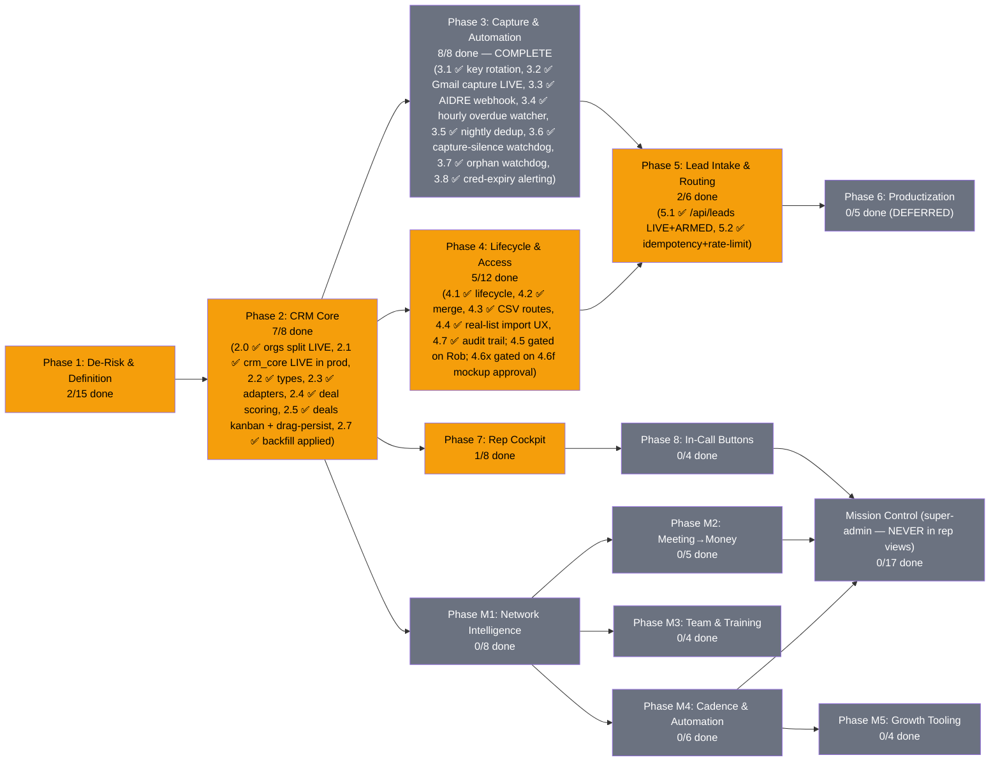

# PRD: MLE CRM — The Network + Self-Made CRM (Unified)

**Version:** 3.1.317 | **Created:** 2026-07-16 | **Updated:** 2026-07-28
**Status:** ACTIVE
**Owner:** Rob + Max
**Project:** mle-rob-dashboard
**Type:** full
**Slug:** mle-crm
**Date convention (est. 2026-07-23, after a UTC-rollover mixup):** every date in this PRD, in `BUILD-QUEUE.md`,
and in `docs/reviews/` is **Rob's local date (America/New_York)** — never the build host's UTC date. Late-night
increments run past 20:00 ET while the host clock has already rolled to the next day; label them by the ET date.
Raw system timestamps quoted as evidence (Supabase `created_at`, git `%cI`) keep their own zone and say so.

> **LINEAGE (replaces the old "Relationship to the base PRD" banner):** This is the single unified living
> PRD for the MLE CRM, formed 2026-07-21 by merging `PRD-mle-rob-dashboard-v2.md` (base PRD — "The Network",
> Created 2026-07-04, v1.0 → 2.1.2) INTO `PRD-mle-crm-evolution-v1.md` (CRM-evolution PRD, Created 2026-07-16 —
> **this PRD's direct lineage**; its structure and content are the skeleton of this document). Both source PRDs
> are archived with tombstone headers in [`docs/archive/plans/`](../archive/plans/) (created in commit 6bc0b64;
> Task 2.0's final state, closed by the build driver mid-merge, was ported from the archive in commit eefd7e8 —
> see revision 3.0.2). **Rollback:** git tag `pre-prd-merge-exact` (= ba4cc68, the exact pre-merge state; the
> earlier tag `pre-prd-merge-2026-07-21` is a checkpoint 3 commits prior), PRD snapshots in
> `~/.claude/plans/snapshots/`, and the zero-loss map in [`MERGE-LEDGER-2026-07-21.md`](./MERGE-LEDGER-2026-07-21.md).

---

## Status Diagram

**Color key:** `#22c55e` complete · `#f59e0b` in-progress · `#6b7280` pending · `#ef4444` blocked

**Phases M1–M5 and Mission Control are the base PRD's Phases 1(remainder)/2–9, folded in whole by this
merge — nothing dropped, nothing renamed away from its origin.** See the Merge Ledger for the full
task-by-task mapping and every judgment call made while folding them in.

---

## Goal

The ultimate platform for sales reps — a self-owned CRM whose only job is **helping reps close more deals**,
with The Network graph as Rob's super-admin lens on top. Every lead arrives with the *details* behind its
source, every call is recorded/transcribed/summarized into a searchable brain, and the rep can send a
proposal, matched case studies, an agreement, or an invoice **while still on the call** — with zero
dependence on GoHighLevel, Close, or any rented CRM core.

## North-Star Principles (from Rob's dump — every task answers to these)

1. **Rep screens carry ONLY what closes deals.** Reports and analytics live outside the rep view.
2. **Rent-first modularity.** A $15/mo SaaS today beats a 3-month build; own the thin core, plug in modules (ours and others'). Reps must never eat admin work while waiting on a build.
3. **API-first, terminal-friendly.** Rob's partner's tools and agents sync in via APIs without his IP being absorbed. The fastest path to his buy-in is a working system he can wire into.
4. **Capture the details behind the source, not just the source.** The email they replied to, the form answers, what the TikTok reel was about — context is the differentiator.
5. **The graph is the chain of connections** (Rob's "blockchain" metaphor): who links to whom, node by node — the super-admin layer above the traditional CRM layers.

## Role Layers (from dump)

| Layer | Who | Sees |
|---|---|---|
| 1. Super Admin | Rob | Everything incl. Network graph, AI contribution $, door-open scores |
| 2. Management & Tech | Will/partner + future mgmt | Ops views, pipeline health, no rep-private book detail (ASSUMED) |
| 3a. Sales Rep (house) | MLE reps | Their leads/deals + rep cockpit |
| 3b. Sales Agent (outside) | Brought-on reps w/ own book | Their book is theirs — protected; we touch it only as invited |
| — Bounty Hunter | Lead CHANNEL, not a rep role | Receives/returns high-intent leads (mechanics = open Q1) |
| — Booker | Outreach/appointment setters | Booking queue (mechanics = open Q1) |

## Scope

**IN:**
- Deals/opportunities as first-class objects on the existing Supabase + StorageAdapter foundation
- Role hierarchy above (RLS-enforced) incl. Sales Agent book-of-business protection
- **Lead routing engine**: high-intent lead → auto-close / rep / bounty hunter / booker per defined rules
- **Source-context intake**: source + the actual message/creative/form answers/trade-show notes per lead
- **Rep cockpit**: in-CRM dialer, every call recorded → transcript → AI summary/action items/buying signals → RAG-searchable; video calls (Zoom/Teams) ingested the same way
- **Deep-scrape rapport brief** auto-generated per lead (talking points with sources)
- **In-call buttons**: custom proposal, matched (redacted) case studies, send-for-signature agreement, send invoice
- Task/follow-up engine, contact lifecycle (search/dedup/import/export/audit), authenticated product lead API (AIDRE/AIVA)
- Build-vs-buy verification via github-tool-scout (Rob's own first-mission search) + schema patterns from Attio/Twenty
- **Carried-forward Network & mission-control scope (Phases M1–M5, Mission Control)** *(added 2026-07-21 merge)* — network graph intelligence, meeting→money flow, training corner, cadence/automation, growth tooling, and the super-admin KPI/ops layer, folded in whole from the base PRD — none of it dropped; see `MERGE-LEDGER-2026-07-21.md` for the full task-by-task mapping

**OUT:**
- GoHighLevel in any form; Close CRM as a destination (one-time read-only export of Rob's own contacts is the only allowed touch, gated on Rob's explicit scope call)
- **Management reporting/analytics suite inside the CRM** — reports are made outside it (Rob: "the only thing we need this for is to help close more deals"). NOT excluded: rep-facing best-practice surfacing (Task 7.8) — that IS closing help, not reporting
- **Literal blockchain tech** — "blockchain" is the connection-graph metaphor, not chain infrastructure (ASSUMED, flag if wrong)
- Client-facing / white-label views (productization = Phase 6 groundwork docs only)
- Replacing the base PRD's meeting→money, KPI, or ingestion scope (consumed, not duplicated)
- Absorbing partner IP into this codebase — integration is via API plug points only
- **Outside investment tracking** *(added 2026-07-21 merge — base PRD scope)* — we don't take outside money; door-openers can earn a cut instead
- **Writing back to the onboarding/invoicing source systems** *(added 2026-07-21 merge — base PRD scope)* — the Mission Control ops/read layer stays read-only, always

## Success Criteria

- Rob runs a full deal — first touch → interactions logged → quote → signed → paid — without leaving the dashboard
- A rep opens a lead and sees: source WITH details (message/form answers/reel topic), deep-scrape talking points, and full activity timeline — nothing that doesn't help close
- A test call dialed from the CRM produces recording + transcript + AI summary w/ action items and buying signals in the timeline, and a RAG query (e.g. "pricing objection") surfaces the right call moment
- Proposal button: click → branded custom proposal sent in <60 seconds while on-call; same seat sends agreement (e-sign) and invoice
- A seeded high-intent lead routes correctly per the routing table (auto-close / rep / bounty hunter / booker)
- github-tool-scout report delivered; keep-vs-adopt base decision logged with weighted scores + source URLs
- Storage-adapter guarantee holds: file-store fallback keeps UI functional if Supabase is unreachable
- Every differentiator in the vision dump maps to ≥1 task or an explicit OUT (verified in this doc)
- **Adding a person to the Network takes < 60 seconds of typing and immediately appears as a node** *(base PRD; now Task M1.1's DoD)*
- **The AI estimator produces revenue/new-node/probability estimates for the Jonathan Polk test case that Rob judges directionally right** *(base PRD; now Task M1.3)*
- **PRD checkboxes and revision history stay current within 24h of any work (living doc)** *(base PRD process criterion — applies to this unified doc)*

---

## Phases + Tasks

### Phase 1: De-Risk & Definition (Research + Sales — runs BEFORE build)

- [x] Task 1.1 [Rob] - **GATE: Brain-dump "how my CRM is different from every other CRM"** | DoD: Captured verbatim → `ROB-CRM-VISION-DUMP-2026-07-17.md`; every differentiator mapped in this v2.0 ✅ 2026-07-17
- [ ] Task 1.2 [Research] - Build-vs-buy scorecard: Attio, Twenty (OSS), Folk, HubSpot Free at <5 seats — cost, ownership, data portability, customization, network-graph fit | DoD: One-page weighted composite scorecard per scoring-pattern rule; source URL + access date per cell
- [ ] Task 1.3 [Research] - Table-stakes feature matrix: what lightweight CRMs (Attio, Twenty, Folk, HubSpot Free, Pipedrive) all ship | DoD: Tool × feature matrix with source URL per cell; flags gaps vs current dashboard
- [ ] Task 1.4 [Research] - Schema-pattern study: how Attio + Twenty model org↔person↔deal↔activity (incl. many-to-many people↔orgs, activity polymorphism) | DoD: Annotated Mermaid ER diagram citing each tool's public docs/repo, mapped against current `lib/types.ts` with gaps flagged
- [ ] Task 1.5 [Research] - Email-sync build cost: DIY Gmail API (watch renewals, quotas, threading, OAuth verification) vs Nylas/Unipile/EmailEngine | DoD: Comparison table (dev-days, $/mo at 5 seats, maintenance) with source URL per claim
- [ ] Task 1.6 [Sales] - Define the CANONICAL pipeline-stage list (supersedes base-PRD Task 7.1, now cross-linked): start from `New Lead → Contacted → Meeting Booked → Meeting Held → Quote Sent → Negotiating → Signed → Stalled → Lost` + `Referral-Sourced` flag, and reconcile base-7.1's post-signature stages (Invoiced → Paid → Delivering) plus entry/exit trigger events per stage | DoD: One stage table, approved by Rob, covering pre- AND post-signature; every existing record maps to exactly one stage; base-PRD 7.1 carries the supersession cross-link (done in base v2.1.2). **⚠️ Merge cross-reference (2026-07-21):** also reconcile with Mission Control Task MC.5 (base 7.6 stalled-deal thresholds/qualified-lead gate/lost-reason enum) — genuine content overlap, not auto-merged; see ledger.
- [x] Task 1.7 [Sales] - Spec the "Who do I touch today" rules: next-step due/overdue, meeting-no-log >24h, stage-aging thresholds (3d Contacted, 5d Quote Sent, 7d Negotiating) | DoD: Rules doc testable against 10 seeded records covering each trigger. **⚠️ Merge cross-reference (2026-07-21):** overlaps in purpose with Mission Control Task MC.3 (base 7.4 "Needs Action Today" rule set, feeds the Rob-facing daily-priorities panel) — related but distinct audiences (rep next-steps vs Rob/ops SLA rules); reconcile, don't silently merge; see ledger. ✅ **DONE 2026-07-22 (Q25):** rules ARE code per CR-3 — pure `lib/tasks/todayRules.ts` (4 triggers, ET-day + `now` passed in, demo-* excluded, deterministic ordering) + narrating spec `docs/plans/TODAY-RULES-SPEC.md`; DoD met by `lib/__tests__/todayRules.test.ts` — 12 seeded records cover every trigger + negatives (6 tests, 281/281). MC.3 reconciled-not-merged: spec directs MC.3's builder to define its thresholds relative to `STAGE_AGING_DAYS` (one threshold table, two consumers). Stage-entry proxied by `deal.updatedAt` until Task 4.7's audit trail (documented) — **4.7 SHIPPED 2026-07-22 (Q28): `status_change` rows now exist + no-op drags no longer churn `updatedAt`; switching stage_aging to true entry times is an open follow-up, proxy still in use.** **Unblocks Task 2.6.**
- [x] Task 1.8 [Sales] - Spec the Referral-Chase Queue: promised-intro-date passed with no linked new lead | DoD: Seeded "promised intro, no lead" record flags; clears when referred lead is logged ✅ **DONE 2026-07-22 (Q27):** rules ARE code per CR-3 — pure `lib/referrals/chaseQueue.ts`: promise = activity with `sourceContext.promised_intro {expected_by, of?}` (rides Task 1.15's seam, zero new schema) anchored to the promiser; chased when `expected_by` < Rob's ET day (due-today not yet broken, Task 3.4 convention); clears when a lead with `referredById === promiser` is logged at/after the promise (`Person.referredById`, the existing door-opener pointer). Timestampless leads conservatively never clear (Person type lacks created_at — callers pass it; documented). demo-* excluded, deterministic most-overdue-first ordering, shape-checked payloads. DoD met by `lib/__tests__/chaseQueue.test.ts` — flag + clear pair plus 7 negatives (9 tests, 292/292). Narrating spec `docs/plans/REFERRAL-CHASE-SPEC.md` (code canonical). Consumers (worklist band / flags watcher / digest) deliberately future tasks.
- [x] Task 1.9 [Sales] ✅ **DONE 2026-07-22 (driver, Q29 — shipped as code per CR-3, Q25/Q27 precedent)** - Define mandatory per-interaction fields: date, contact, channel, referral source, door-opened (Y/N + who), next step + date, stage change | DoD: Save rejected if any required field missing — **met**: pure `lib/activities/requiredFields.ts` is the single rule source (fields ride Task 1.15's `sourceContext` seam — zero new schema; "none" is a valid ANSWER for referral-source/stage-change, absence is what rejects; `door_opened.by` required only when opened=true; stage_change is a DECLARATION — the authoritative row stays server-written per Task 4.7); enforced at the new `POST /api/admin/activities` manual-log endpoint (400 + full missing-field list). Scope honesty: MANUAL logs only — automated captures (n8n/AIDRE/dialer webhooks) keep narrower validation, since they can't answer door-opened/next-step and 1.9 enforcement there would kill capture. 16 tests incl. route-level DoD pair (complete log saves; any stripped field rejects)
- [ ] Task 1.10 [Sales] - Define rep-visible vs Rob-only fields (reps: contact/stage/next-step/log; Rob-only: AI contribution $, door-open score, network map) | DoD: Field-visibility matrix signed off by Rob; fixture test proves no Rob-only field renders in the rep view ("only what closes deals" verified, not asserted)
- [x] Task 1.11 [Sales] ✅ **DONE 2026-07-22 (driver, Q31 — shipped as code per CR-3, Q25/Q27/Q29/Q30 precedent)** - Define AIDRE/AIVA lead-intake payload: product, source, company, vertical, demo dates, assigned rep, stage=New Lead | DoD: Payload schema doc handed to Engineering for Task 5.1 — **met**: pure `lib/leads/intakePayload.ts` IS the handoff — `LeadIntakePayload` envelope maps Task 1.11's list 1:1 (`product` aidre|aiva; `source_context` = Task 1.15's shapes validated by COMPOSING `parseIntakeSourceContext`, one rule source; `company`/`vertical` free text for 5.1 to map; `demo.requested_at`/`scheduled_for` ISO, requested ≠ booked; `assigned_rep` free text until Phase-4 profiles — omit → Task 1.14 routing decides). Stage is deliberately NOT a field: server pins `INTAKE_STAGE="new_lead"` and a client-supplied `stage` key rejects the payload (same anti-smuggling posture as the /deals stage-only patch gate). Plus `contact` (name + ≥1 of email/phone — a lead nobody can reach isn't a lead). `parseLeadIntake` reports every problem (1.9/1.15 contract); extra keys additive (MC.4 rides along later). `INTAKE_WORKED_EXAMPLES` one per product, test-pinned, reusing 1.15's pinned source examples so the specs can't drift. 11 tests. Doc `docs/plans/LEAD-INTAKE-PAYLOAD-SPEC.md` narrates (code canonical). **Task 5.1's definition prereqs are now ALL in hand** (1.15 ✅ + 1.11 ✅) — 5.1 imports `parseLeadIntake` + `INTAKE_STAGE` and only owes tokens/persistence.
- [x] Task 1.12 [Research] - 🔎 **github-tool-scout FIRST MISSION ✅ 2026-07-17** (docs/research/SCOUT-crm-agents-enrichment-2026-07-17.md; keep-base decision logged) (Rob's search):** OSS platforms approximating the full vision — multi-tier roles, in-app dialer + call recording, AI call summaries, proposal generation, plugin/modular architecture | DoD: Ranked scout report (health scorecards, weighted scores, source URLs); keep-vs-adopt decision logged in Decisions Log; Tasks 1.2–1.5 queue immediately behind it
- [ ] Task 1.13 [Sales] - Role & visibility matrix v2 per the Role Layers table: 4 layers + rep subtypes + bounty-hunter/booker actors, incl. Sales Agent book-of-business protection rules | DoD: Matrix covers every layer × every object type (person/deal/activity/book); ASSUMED cells flagged for Rob
- [ ] Task 1.14 [Sales] - Lead-routing decision table: which high-intent leads go auto-close vs rep vs bounty hunter vs booker (triggers, criteria, fallbacks) | DoD: Routing table resolves 10 seeded lead scenarios with zero ambiguity
- [x] Task 1.15 [Sales] ✅ **DONE 2026-07-22 (driver, Q30 — shipped as code per CR-3, Q25/Q27/Q29 precedent)** - Source-context intake spec: per-source detail fields — email replied to + reply text, form questions + answers, ad/reel topic + creative ref, trade-show notes | DoD: Field spec with worked examples for ≥3 source types; feeds Tasks 2.1 and 5.1 — **met**: pure `lib/leads/sourceContext.ts` is the canonical spec — typed shapes for all FOUR intake source types (`email_reply`/`web_form`/`ad_reel`/`trade_show`, discriminant `source_type`, riding the 0005 `source_context` JSONB seam — zero new schema), `parseIntakeSourceContext` validator (reports every problem, same contract as Task 1.9; extra keys allowed by design so MC.4 attribution + Task 1.11 product detail ride along additively), `describeIntakeSource` rep-surface one-liner, and `WORKED_EXAMPLES` exported + test-pinned valid for all 4 types (exceeds the ≥3 bar; import them, don't copy doc snippets). Feeds: Task 2.1 ✅ (column exists), Task 5.1 (validator ready to consume). Deliberate scope: already-live seam shapes (n8n capture, AIDRE, promised_intro, 1.9 manual fields, 4.7 stage audit) keep their own narrower validators — catalogued in-module. 8 tests. Narrating doc `docs/plans/SOURCE-CONTEXT-SPEC.md` (code canonical). **Cross-reference (2026-07-21):** complements Mission Control Task MC.4 (base 7.5 lead-source taxonomy/UTM convention) — 1.15 captures per-lead detail, MC.4 captures channel-level attribution taxonomy; both needed, not duplicative.

### Phase 1b: Live-with-Rob additions (shipped during walkthroughs)

- [x] Task 1b.1 [Engineering] ✅ 2026-07-22 - "Things to Address" flag system (table+API+3 surfaces: Overview digest w/ Read, entity pages w/ resolve+note, dated archive) | DoD met: CG conflict live test open; Miga/RedRock archived w/ Rob rulings
- [x] Task 1b.2 [Engineering] ✅ 2026-07-22 - Guaranteed dev-chat receipts server-side ('system' author) + CI/ESLint/Dependabot | DoD met: receipt round-trip proven on prod; CI green on main, blocked breaking dep PR
- [x] Task 1b.3 [Engineering] ✅ 2026-07-22 — critic-rob SHIP 92/100 after punch-fix round (docs/reviews/CRITIC-ROB-rep-scaffold-2026-07-22.md) — **REP CRM SCAFFOLD (Rob priority 7/22):** rep-facing account list ("My Accounts" — feels like a CRM, optimized for closing) + account workspace page (what opens on click: context story, timeline, action bar) on Jake demo book; full rep-POV mockup for Rob's sign-off | DoD: Rob can click through list→account→actions in prod demo; critic-rob ≥90; informs the Phase-4 rollout mockup requirement

### Phase 2: CRM Core — Deals, Activities, Tasks (Engineering)

*Prereqs: (1) base-PRD Task 1.2 (Supabase adapter) complete; (2) Phase 1 definition tasks 1.6–1.15 in hand.*

- [x] Task 2.0 [Engineering] ✅ **DONE 2026-07-21 — critic-rob TICK 97/100 (`docs/reviews/CRITIC-ROB-Q4-orgs-split-2026-07-21.md`).** 🚨 **URGENT (Rob 2026-07-17): split People vs Businesses.** Live `people` table (54 rows at PRD time; live count drifts with Rob's edits — 32 as of 7/21 eve) mixes humans and orgs (e.g. `miga-food-manufacturing`). Add `orgs` table, classify every existing row (human / org / org-as-contact), migrate with edges/FKs preserved | DoD: Zero business entities remain typed as Person; every human links to their org via `org_id`; graph + ledger render both correctly; row-count reconciliation report (N in = N out across both tables, N = live count at apply time) | 7/21 status: 0003 written, amended (verbatim column carry), TWICE defect-fixed pre-apply (data-loss carry list; edges NOT-NULL ordering), and full-SQL rehearsed on live data w/ auto-rollback — all gates green (recon, edge constraints, field preservation). Remaining: ~~adapter dual-schema reads~~ ✅ 7/21 → ~~real apply (+flip `ORGS_SPLIT_READS`)~~ ✅ 7/21 eve **APPLIED TO PROD, LIVE** (post-apply gates == rehearsal exactly: 16+16, 33/47 edges repointed, 0 violations, field-preservation exact; prod curl: all 32 pre-split rows render, money/referral fields spot-checked intact) → ~~person→org `org_id` linking~~ ✅ 7/21 eve (scripts/backfill-org-links.mjs: 11/16 people linked to their org + 15 org_memberships rows — 11 primary + 4 secondary across 3 people w/ secondary affiliations (critic-rob Q4b arithmetic fix 7/21), every link source-cited from the enrichment corpus; 5 honest skips where no org row exists — Trent/Title Base, Cates, George/Guest Genie, Rob+Will/MLE internal; idempotent, gate 11/16 verified twice — **7/23: Trent skip RESOLVED, org `the-title-base` created + membership linked when his $2k Phase 1 check landed (rev 3.1.84); 4 skips remain**) → ~~UI merge-view check~~ ✅ 7/21 night (prod redeployed — 6b5faeb's isDemo filter had never shipped, DEMO rows were leaking into prod graph/ledger; post-deploy: 32 nodes/47 edges/0 DEMO/0 dangling, biz badges + Business record header render live) → ~~critic-rob review~~ ✅ 7/21 night TICK 97/100. Post-close notes: (a) export `entityKind` in `/api/network` before Phase-2 deals consumers exist; (b) `people.entity_kind` column is transitional debris — drop after Task 2.2 lands (dated 7/21); (c) Gulf Coast signed-dispute is resolved-by-data since 7/18 (signed date present, `isDisputedSigned` false) — no longer an open ruling; (d) 🚨 **KNOWN-OPEN DEFECT (found 7/21 night by Q13 rename verification): `/api/admin/people` PATCH/DELETE are people-table-only** — post-split, inline edits on the 16 business records match 0 rows, error-free, and the UI still pulses "saved" (empirically proven: PATCH `people?id=eq.proplogic` → 200/`[]`, orgs untouched) → business edits silently lost in prod. Fix queued BUILD-QUEUE Q14, FIRST on unfreeze (capture-only freeze blocks the deploy); Rob notified via PING-INBOX. **7/22: fix BUILT + TESTED in repo (`lib/adminEdit.ts` + rewritten route: PATCH routes by entity w/ 0-row→404 truth gate, DELETE covers org edge-twins/pointers/both tables; 39/39 vitest, build green) — then DEPLOYED + PROD-VERIFIED same night per Rob dev-chat #40 ("Do what the best course of action is" = GO): business edit persists (orgs.proplogic.business PropLogic→PropLogix via the live route), bogus-id PATCH → 404 (no false "saved"), person edit unchanged, /api/network 32/47 intact. DEFECT CLOSED.**
  - 2026-07-21 (driver): migration `0003_orgs_split.sql` AMENDED before any apply — original draft silently dropped `referred_by_id` (set on ALL 17 company rows), `relationship` (17), `estimate` (11), `phase_one` (4 in-progress), `role`/`business`/`est_time_to_payment_days` + meeting/transcript urls. orgs now carries every people column verbatim (minus `entity_kind`); prune is a later Rob call. Dry-run gained a field-preservation gate (per-column non-null counts, diffable 1:1 post-apply) + flags any people column missing from the carry list. Verified vs live: 35 → 18+17, 33/48 edges repoint, zero dropped columns. NEXT: branch apply + adapter org reads.
- [x] Task 2.1 [Engineering] - Migration ~~`supabase/migrations/0002_crm_core.sql`~~ **`0005_crm_core.sql`** (0002/0004 names got taken by node_type_taxonomy + flags): `deals`, `activities` (source-typed: manual|n8n|api|aidre|dialer), `tasks` tables with FKs + `source_context` JSONB per Task 1.15 spec | DoD: Migration applies clean locally + prod; FKs enforce integrity | **Progress 2026-07-22 (driver): 0005 WRITTEN + FULL-SQL REHEARSED on live Supabase w/ auto-rollback (Q4 pattern)** — 3 tables + 10 indexes + RLS applied clean, FK inserts round-tripped, check-gates verified live (anchorless deal rejected, person+org double-anchor rejected), prod confirmed untouched after. Deliberate deviations dated in-file: owner_id/created_by/assigned_to free-text until Phase-4 profiles (D-002 step 9 says exactly this); transcript_url text until Task 7.4's transcripts table; stage check uses the Task 1.6 DRAFT list (Rob hasn't locked 1.6 — one cheap ALTER when he does). ~~Remaining: real apply (+ Task 2.2 types, 2.3 adapter methods), backfill script (D-002 steps 7-9), critic-rob milestone review before Q9 ticks~~ **✅ APPLIED TO PROD 2026-07-22 (Q9 inc.4)** via Supabase MCP apply_migration (tracked `crm_core`) after a clean pre-apply gate (10 tables, none of the three present). DoD proven LIVE through PostgREST (the adapter's real path): deal insert round-tripped numeric 1234.56 + key_dates jsonb byte-exact; anchorless deal REJECTED 23514; deal-only activity accepted, person+org double-anchor REJECTED 23514; task round-tripped; deal delete cascaded the activity and set-nulled the task FK; all test rows removed, tables back to 0, prod otherwise untouched (34 nodes/47 edges verified after). Side finding fixed same increment: 0003 had left `orgs`/`org_memberships` (+legacy `events`) with RLS disabled — migration `0006_rls_enable.sql` applied, flag #8 posted to the ledger. Task 2.1 fully done; Q9 remaining = backfill (Task 2.7) + critic-rob
- [x] Task 2.2 [Engineering] ✅ **DONE 2026-07-22 (driver)** - Extend `lib/types.ts` with `Deal`, `Activity`, `Task`, `Org` (+ additive `orgId?` on `Person`) | DoD: `npm run build` passes; existing pages compile unchanged — **met: build green, 96/96 vitest, zero page edits.** Delivered: all 5 types + `DealStage`/`RoutingLane`/`ActivityType`/`ActivitySource`/`TaskStatus` unions (`Org` = `Omit<Person, "entityKind"|"orgId">`, honest to 0003's verbatim mirror) **plus** `lib/crm.ts` row↔type mappers (the 2.3 seam) gate-tested against the 0005 DDL parsed from disk (`lib/__tests__/crm.test.ts`: column sets equal both directions, enum arrays == check constraints, round-trips, pg-numeric coercion; `satisfies` + type-level exhaustiveness pins the unions to the arrays). Note: `people.entity_kind` drop (Task 2.0 punch b) stays open — it rides a later migration, not this types task
- [x] Task 2.3 [Engineering] ✅ **DONE 2026-07-22 (driver)** - Extend StorageAdapter with deal/activity/task methods in BOTH Supabase and file stores | DoD: Both adapters pass identical contract test suite (`lib/storage/__tests__/adapter.contract.test.ts`) — **met: one shared behavioral suite (7 cases × 2 adapters: empty reads, round-trip fidelity incl. pg-numeric + jsonb, upsert-no-dupe, createdAt/occurredAt ordering, person/org/deal anchor filters, task status filters) passes against the file store on a temp `CRM_DATA_PATH` AND the supabase store through the real `lib/crm.ts` mappers over an in-memory PostgREST fake; 110/110 vitest, build green.** Delivered: `StorageAdapter` + `ActivityFilter`/`TaskFilter` (list/upsert × deals/activities/tasks), supabaseStore methods on the 0005 tables, fileStore CRM rows in separate `data/crm.json` (network.json + regen-fallback untouched; ENOENT = empty, same loud-fail write rule), no-stall read fallback + write-no-fallback extended to all CRM reads in `lib/storage/index.ts`, stubs updated. Honest caveat: supabase side is contract-proven against the fake — live-table round-trip proof rides the 0005 apply increment (next), before the Q9 critic-rob gate
- [x] Task 2.4 [Engineering] ✅ **DONE 2026-07-22 (driver)** - Deal scoring as pure module `lib/scoring/deal.ts` (weighted ladder, `asOf` param, no `Date.now()`) + unit tests | DoD: Deterministic on fixed fixtures; full branch coverage on ladder thresholds — **met: 66 tests in `lib/__tests__/dealScore.test.ts` hit EVERY ladder rung (all 12 stages, all 6 freshness bands incl. both boundary days of each, all 6 value rungs at both edges, both referral rungs, coverage 0–4 fields, all 5 grade bands at boundaries), determinism + asOf-is-a-parameter proven (same input twice → identical; moving asOf alone moves the score), unparseable asOf throws. 199/199 vitest, build green, lint clean.** Scoring-pattern rule honored: one weight table up front (stage .30 / freshness .25 / value .20 / referral .15 / coverage .10, sum-to-1.0 pinned by test), per-signal 0–100 ladders in code, every composite ships a breakdown row (signal|raw|weight|weighted|evidence). Design calls dated in-file: composite = attention priority, NOT win probability; `terminal` flag on paid/lost so consumers shelve them; stalled/lost rank below new_lead (dead-stopped < fresh); $0/unset value scores 0 raw with honest "no deal value recorded" evidence (polk verbatim-$0 safe); no consumer yet — Task 2.5 kanban + M1 estimator are the intended readers
- [x] Task 2.5 [Engineering] ✅ **DONE 2026-07-22 (driver, 3 increments)** - Deal pipeline kanban `app/deals/page.tsx` + `components/ActivityTimeline.tsx` on person detail | DoD: Dragging a card persists stage via adapter; timeline renders mixed types chronologically | **Progress 2026-07-22 (driver, inc.1): `/deals` pipeline board LIVE in prod** — server component off `store.listDeals()` + `getNetwork()`, columns in STAGE_LADDER order (only stages holding deals — 6 deals across 12 empty columns fails the Apple-not-MS-DOS bar), cards sorted by Task 2.4 score within column (first consumer of the scorer), each card: value (honest "no $ recorded" for polk/gary), grade chip w/ full breakdown-table tooltip (signal|raw×weight→weighted|evidence — scoring-pattern rule: never a bare number), referral badge, anchor linked to `/people/[id]` (org anchors resolve — getNetwork coalesces org twins), paid/lost dimmed via `terminal`; header = open count + $-in-play + $-paid; "Deals" added to nav. Prod-curl verified: $22k in play / $19k paid, gary D·48.5 w/ evidence tooltip, On Time Moving B·78. Build green, 199/199 vitest (no logic change — page consumes tested modules). ~~REMAINING for DoD: drag-to-persist stage via adapter (needs a PATCH deals route + client board), ActivityTimeline on `app/people/[id]` (component exists from Task 1b.3, rep-side only today)~~ **inc.2 2026-07-22 (driver): ActivityTimeline LIVE on admin person detail** — `components/ActivityTimeline.tsx` mounted in `app/people/[id]` main column with `isDemo=false`/no demo entries (admin = truth: real `/api/admin/activities?person=` feed or an honest "nothing logged yet" shell, NEVER fabricated demo history — that stays rep-mockup-only); empty-state copy corrected ("Phase 8/9" was stale — email capture is armed per Task 3.2, calls land with the dialer). Prod-curl verified (person page 200, Activity section ships, feed returns clean `[]`). Build green, 199/199 vitest. ~~REMAINING for DoD: drag-to-persist stage via adapter (PATCH deals route — stage only, write path must refuse value/keyDates — + client board)~~ **inc.3 2026-07-22 (driver): drag-to-persist LIVE — DoD closed.** Board moved to client component `components/DealsBoard.tsx` (page stays server-fetch); HTML5 drag between stage columns with optimistic move + snap-back-and-say-so on failed save (never a false "saved"); mid-drag, empty ladder stages appear as slim drop targets so any stage is reachable without 12 permanent columns (Apple bar holds). Write path: `PATCH /api/admin/deals` accepts `{id, stage}` ONLY — `parseDealStagePatch` in `lib/crm.ts` rejects the WHOLE request if any other field rides along (value/keyDates untouchable by construction, CR-3), unknown stage 400s against the DEAL_STAGES ladder, 0-row match 404s (no false save, per the Q14 lesson). Proven in prod by curl: smuggled `value` → 400 "refused fields: value"; bad stage → 400 with ladder; unknown id → 404; live round-trip on the no-money deal (gary → contacted → meeting_held) persisted both ways with `value`/`key_dates` byte-identical throughout. 6 new gate tests (205/205 vitest), build green, deployed + aliased
- [x] Task 2.6 [Engineering] ✅ **DONE 2026-07-22 (driver, Q26)** - "Needs action today" endpoint `app/api/tasks/today/route.ts` implementing Task 1.7's rules *(UNBLOCKED 2026-07-22 — Task 1.7 done; wrap `whoDoITouchToday` from `lib/tasks/todayRules.ts`)* | DoD: Seeded fixture returns exact expected task IDs — **met: `lib/__tests__/tasksTodayRoute.test.ts` runs the REAL GET handler against the file store on a temp `CRM_DATA_PATH` with 8 fixtures seeded RELATIVE to today-in-ET (so expected IDs are exact on any run date) and asserts the exact 4-item composite `[rt1 overdue, rt2 due-today, rm1 meeting-unlogged, rd3 stage-aging]` with the 4 negatives (future/done/demo/fresh) excluded; 282/282 vitest, build green.** Route is thin by design (CR-3: rules stay in the pure lib; route only feeds store rows + `todayInET` clock), read-only, `force-dynamic`. Deployed + prod-curl verified: live response `{today: 2026-07-22, count: 0}` is HONEST — tasks table is empty and the quote_sent/contacted deals were all touched 7/22 (0d aged), so an empty worklist is the true answer today. Side effect this increment: Vercel CLI upgraded 37.4.0→56.5.0 (old CLI hard-refused the deploy endpoint; new binary at `~/.npm-global/bin/vercel`, `/usr/local/bin/vercel` still shadows it in PATH). MC.13 (Rob/ops widget) remains the other consumer to reconcile when built. **⚠️ Merge cross-reference (2026-07-21):** overlaps with Mission Control Task MC.13 (base 9.2, "Needs Action Today" widget evaluating MC.3/base-7.4's rule set) — this is the rep-facing endpoint, MC.13 is the Rob/ops-facing widget; likely two consumers of related-but-distinct rule sets, reconcile in Task 1.6/1.7's follow-up; see ledger.
- [x] Task 2.7 [Engineering] ✅ **DONE 2026-07-22 (driver, Q9 inc.5)** - Backfill script `scripts/backfill-crm.mjs`: synthesize one Deal per existing Person with quoted/signed data | DoD: Dry-run report correct; `--apply` idempotent (re-run = no dupes) — **met: dry-run report verified against live rows, `--apply` inserted 6 deals, immediate re-run planned 6 / inserted 0.** Implements D-002 steps 7–10 (stage ladder off signed/key_dates per Task 1.6 DRAFT list; value = quoted_amount verbatim; assigned_rep→owner_id; estimate jsonb carried). Two truth-gate deviations from a literal one-row-per-person reading, both in-file: **(a) person↔org MERGE** — post-0003 the same engagement can mirror on a person AND their org (caleb-green + cg-roofing-group share signed/invoiced dates); blind synthesis would double-count $10k, so a mergeable pair folds into ONE deal anchored to both (divergent amounts stay separate + reported as CONFLICT); **(b) DEMO SKIP** — 5 demo-* fixture rows ($39.5k of fiction) reported and excluded from money tables. Live result: 6 deals, $41k pipeline total == source rows exactly (golf-coast paid 19000, cg-roofing invoiced 10000, naples-spine signed 5000, calebs-brother quote_sent 7000, polk quote_sent 0 — verbatim copy of his quoted_amount=0, gary meeting_held). Step-8 meeting activities: 0 live rows carry meeting_video_url/transcript_url, handler in place. 10 unit tests on the pure planner (merge guard, ladder, demo skip, idempotency filter), 120/120 vitest, build green. No deploy (no UI consumes deals yet — Task 2.5). ~~Q9 remaining: critic-rob milestone review only~~ **✅ Q9 MILESTONE REVIEWED 2026-07-22: critic-rob SHIP 95/100, zero auto-fails** (docs/reviews/CRITIC-ROB-Q9-crm-core-2026-07-22.md — reviewer independently re-verified tests, prod money totals, idempotency, and source-row untouchability). Polk $0 ruling: verbatim copy correct; ambiguity routed to Rob via /api/admin/flags (QUOTE vs PLACEHOLDER — deal stage flips to meeting_held if placeholder). Open follow-ups from the punch list (non-blocking): (a) deal `notes` provenance wording on gary/polk overstates "org+person rows" — key on `mergedFrom` at scripts/backfill-crm.mjs:69, patch or accept the 2 prod strings; ~~(b) suppress prd-autosave heartbeat rows in the revision log~~ **(b) ✅ DONE 2026-07-22** — prd-autosave.sh refreshes the Updated date only, no version bump / no revision row (see v3.1.19); (c) when step-8 meeting activities first fire, stamp `source_context.time_synthetic: true` on the noon-UTC synthetic times

### Phase 3: Capture & Automation (Operations)

- [x] Task 3.1 [Operations] - ~~URGENT (expires ~2026-07-19)~~ Rotate boostn8n.app.n8n.cloud API key, re-point all workflows | DoD: New key live, old revoked, zero auth failures post-cutover | **Progress 2026-07-21:** urgency cleared — Rob delivered the new key (`N8N_KEY` in .env.local), live-tested 200 on delivery and re-verified 200 during the 7/21 reconciliation sweep. **✅ DONE 2026-07-22 (driver):** old key curl-verified DEAD (401 — JWT past its 2026-07-19 exp; n8n rejects it, so it cannot authenticate anywhere; optional UI-list cleanup is cosmetic), new key 200 with exp 2026-10-19; the one remaining presenter of the old key (`multi-claude/.env` N8N_API_KEY — also what the session-start hook reads) cut over to the new value (backup `.env.bak-2026-07-22`); hook now reports "✓ n8n API key OK (88 days left)" — stale-warning defect closed
- [x] Task 3.2 [Operations] - n8n Gmail capture: rob@aivoicetech.io ONLY → match to contact → append to activity timeline | DoD: Test email appears on correct timeline <5 min; boostuppayments.com mail never ingested (log-verified — identity rule) | **Scope re-check vs 7.21 COMMS dump DONE 2026-07-22 (driver): NO conflict** — this task is ROB's own inbox via n8n; the dump's COMMS scope (rep-email scrape + send-as-rep) is Task 4.6b, rides Google-OAuth onboarding scopes, and is Phase-4-gated. Complementary, not overlapping. Build constraint so 4.6b doesn't force a rebuild: the n8n workflow must write the same `activities` shape 4.6b will use (`source='n8n'`, channel=email) — capture mechanism stays swappable. ~~**⛔ SEQUENCE-BLOCKED by Task 2.1 (Q9):** DoD lands mail on the activity timeline, but the `activities` table doesn't exist yet (0004 went to `flags`; crm_core migration is Q9, frozen pending Rob's schema go). Order: Q9 → this~~ **✅ UNBLOCKED 2026-07-22 (Q9 inc.4): `activities` table is LIVE in prod (0005 applied, round-trip verified) — n8n Gmail capture is buildable now (write `source='n8n'`, source_context channel=email)** | **CRM-side seam BUILT 2026-07-22 (driver):** `lib/n8nEmail.ts` (pure, 13 tests: identity gate hard-rejects ANY boostuppayments.com party per email-identity rule — headers judged, never the mailbox, so 2026-07-08-style crossover mail can't leak in; counterpart match excludes Rob's own capture-address record; deterministic `n8n-email-<gmailMessageId>` id → idempotent upsert; person vs company rows anchor as personId vs orgId, never both) + env-gated `POST /api/webhooks/n8n-email` (503 w/o N8N_EMAIL_WEBHOOK_SECRET, 403 bad x-n8n-secret; rejections return 200+logged reason so n8n never retry-loops — the log-verified DoD channel). ~~Remaining: set secret in Vercel env + deploy (inert), build the n8n workflow (Gmail trigger → POST) via N8N_KEY, live test-email DoD~~ **ENDPOINT ARMED IN PROD + n8n WORKFLOW BUILT 2026-07-22 (Q8 inc.3):** secret set (Vercel prod env + .env.local), deployed, all four gates curl-verified live (no/bad secret → 403; boostuppayments party → 200 rejected w/ logged crossover reason — the log-verified DoD channel, proven in prod; unknown sender → 200 no-contact-match; zero rows written). n8n side: httpHeaderAuth credential `2sHDFkgzMWkOvhv7` + workflow `JnIJiCbOqSaK8uN2` ("MLE CRM — Gmail capture (rob@aivoicetech.io)", everyMinute poll → POST w/ x-n8n-secret, defensive field mapping) created INACTIVE. ~~**Sole remainder = Rob-only OAuth click** (attach Gmail cred for rob@aivoicetech.io to the trigger — PING-INBOX ask filed) → activate → live test-email <5-min DoD~~ **✅ CLOSED 2026-07-22 (v3.1.22): Rob's OAuth click landed (cred `zafHNwGNRYD8V9aq`, account identity proven live — trigger From: rob@aivoicetech.io), workflow activated, <5-min DoD met with a real captured email → verified `activities` row; test scaffolding cleaned. Capture is LIVE in prod.**
- [x] Task 3.3 [Operations] ✅ **DONE 2026-07-22 (driver)** - AIDRE call-outcome webhook receiver stub (`/api/webhooks/aidre-call`) → `activities` as type=call, source=aidre | DoD: Synthetic POST creates one correctly-linked activity row; payload schema doc delivered — **met: route-level synthetic POST test proves exactly one row anchored to the phone-matched person (`type=call`, `source=aidre`, deterministic `aidre-call-<callId>` id → AIDRE retries can never duplicate); payload spec delivered at `docs/plans/AIDRE-CALL-PAYLOAD-SPEC.md` (hand to the AIDRE repo when its outbound webhook is built).** Seam: `lib/aidreCall.ts` (pure) reuses the Vapi last-10-digit phone matcher — ONE phone-matching behavior CRM-wide; company-number match anchors as orgId, never both (0005 check); unmatched callers → 200 `ingested:false`, zero rows (no anchorless writes; unmatched-call intake is a Task 5.1 decision). Env-gated like n8n/Vapi: `AIDRE_WEBHOOK_SECRET` unset → 503, fully inert — TRUE STUB, nothing armed until AIDRE-side webhook exists + secret is set. 11 tests (216/216 vitest; a minimal `vitest.config.ts` alias now lets tests import route handlers via `@/`), build green, no deploy (inert endpoint rides the next user-visible deploy)
- [x] Task 3.4 [Operations] ✅ **DONE 2026-07-22 (inc.3, driver): n8n hourly workflow `ozMXSpftU2lIbhp2` LIVE (Schedule Trigger hourly :33 → GET /api/cron/overdue w/ bearer, retry ×3) — manual test 200 honest `{overdue:0,flagged:0}`, published, first production scheduled execution observed. Phase 3 COMPLETE.** - Overdue follow-up watcher: hourly n8n cron pings Rob on past-threshold follow-ups | DoD: Test past-due record triggers exactly one ping, no dupes on re-run | **Progress 2026-07-22 (inc.1, driver): CRM-side watcher BUILT** — pure `lib/integrity/overdue.ts` (CR-3): open task + `due_date` strictly before Rob's ET calendar day (`todayInET` — a task due today must not alert at 7pm ET on UTC rollover; clock passed in, never read) → finding; demo-* excluded; deterministic title `Overdue follow-up: task <id> (due <date>)` = idempotency key, so hourly re-runs never dupe (the DoD) while a reschedule (new due_date) re-arms the alert. "Ping" = medium flag on the flags ledger (findings protocol). `GET /api/cron/overdue` reuses the Task 3.5/3.7 auth contract (`verifyCronAuth`, CRON_SECRET unset → 503 / wrong bearer 401); Vercel Hobby's 2-cron cap is spent (dedup + integrity), so the HOURLY firing comes from an n8n schedule workflow calling the route with the same bearer — exactly the "n8n cron" the task specifies. 9 tests (275/275), build green, no deploy (route rides next deploy). ~~Remaining: deploy + provision the n8n hourly schedule workflow via N8N_KEY + seeded past-due live DoD (one ping run 1, zero run 2)~~ **Progress 2026-07-22 (inc.2, driver): DEPLOYED + DoD PROVEN ON PROD** — route live (auth curls 401 no-bearer / 401 bad-bearer / honest `{ok:true,overdue:0,flagged:0}` on the empty tasks table); seeded past-due open task (`due_date` 2026-07-20) → run 1 `{overdue:1,flagged:1}` (flag verified on the ledger: medium, entity "CRM follow-ups", title embeds task id + due date), run 2 `{overdue:1,flagged:0}` — exactly one ping, zero dupes, the DoD's core sentence proven live; scaffolding cleaned (seed task + test flag deleted, final run honest `{overdue:0,flagged:0}`). Remaining: provision the hourly n8n schedule workflow (Schedule Trigger → HTTP GET with the CRON_SECRET bearer) → verify one live scheduled execution → tick — **✅ done inc.3 (see DONE line above)**
- [x] Task 3.5 [Operations] - ✅ 2026-07-22: Nightly dedup detector → `dedup_review` queue (no auto-merge) | DoD: Same-email-different-casing pair surfaces; similar-but-distinct names don't. **Progress 2026-07-22 (inc.1):** matcher core built as pure code — `lib/dedup/match.ts` (`findDuplicatePairs`: email/phone/name exact-after-normalization; phone reuses the Vapi last-10-digit rule so the CRM matches numbers ONE way; deliberately zero fuzzy matching so similar-but-distinct names can never surface; email/phone hits = high confidence, name-only = review; deterministic pair order, evidence line per signal). Both DoD behaviors pinned by 12 unit tests (228/228). Task 4.2's merge UI consumes this same module. **inc.2 (same day): `dedup_review` table + `/api/admin/dedup` (run/list/dismiss) live-verified — see rev 3.1.28.** **inc.3 (same day): CLOSED — nightly Vercel cron LIVE on prod**: `vercel.json` cron `0 7 * * *` UTC → `GET /api/cron/dedup` (CRON_SECRET bearer, constant-time; 503 unarmed / 401 wrong bearer / detector run on match — all three prod-curled), detector extracted to shared `lib/dedup/detector.ts` (admin POST + cron run byte-identical logic), proxy `isPublicPath` exempts `/api/cron/*` (route carries its own auth). `vercel crons ls` confirms registration; 240/240 tests, deploy Ready
- [x] Task 3.6 [Operations] - Silent-failure watchdog for Gmail/AIDRE capture workflows | DoD: Forced workflow error (bad credential) alerts Rob within 15 min ✅ **CLOSED 2026-07-22 (inc.2): full n8n path LIVE, DoD proven on prod — forced-error flag landed within SECONDS (16:02:18Z), once-a-minute failure storm → exactly 1 flag (12+ alarm runs), scaffolding cleaned, honest 0 final. n8n side: error-alarm workflow `VoOFOPGqObGWe5Jr` (Error Trigger → POST w/ shared httpHeaderAuth cred) + `errorWorkflow` set on Gmail capture `JnIJiCbOqSaK8uN2`.** | **Progress 2026-07-22 (inc.1, driver): CRM-side receiver BUILT** — design is n8n's own Error Trigger (fires within seconds of ANY workflow failure, incl. the polling-trigger bad-credential variant where no execution ever starts) → `POST /api/webhooks/n8n-error` → high-severity flag on the Things to Address ledger (findings protocol). Pure `lib/integrity/captureAlert.ts` (CR-3): payload→flag mapping, deterministic per-workflow-per-day title = idempotency key, so a once-a-minute failure storm raises ONE flag but a still-broken workflow re-alerts next day. Auth reuses the Gmail-capture contract (x-n8n-secret vs N8N_EMAIL_WEBHOOK_SECRET — same n8n instance is the only caller; unset → 503 inert); post-auth always 200 so n8n never retry-loops. 6 tests (260/260), build green, no deploy (endpoint rides next deploy). Remaining: deploy, provision the n8n Error Trigger workflow via N8N_KEY, set `errorWorkflow` on the Gmail capture workflow, forced-bad-credential live DoD test
- [x] Task 3.7 [Operations] - ✅ **DONE 2026-07-22 (driver)** - Orphaned-activity check (activities with null/deleted contact_id) as live alert | DoD: Seeded orphan row triggers alert on next scheduled run — **met live on prod: seeded anchorless `tasks` row → cron run 1 raised exactly one high-severity flag in the "Things to Address" ledger (findings protocol channel), run 2 raised zero dupes (deterministic flag title = idempotency key), scaffolding cleaned, final run honest 0 orphans.** Pure detector `lib/integrity/orphans.ts` (CR-3) covers the REAL orphan path the schema leaves open — `tasks` has no anchor check constraint, so a deal delete (`deal_id on delete set null`) can strand a task anchorless — plus belt-and-braces dangling-FK/anchorless-activity checks that watch the 0005 invariants instead of asserting them. Nightly `GET /api/cron/integrity` (vercel.json `30 7 * * *`, second Vercel cron) reuses the Task 3.5 auth contract (`verifyCronAuth`, CRON_SECRET unset → 503 inert / wrong bearer 401 — both prod-curled). 7 tests, 247/247, build green, deploy Ready
- [x] Task 3.8 [Operations] - Credential-expiry alerting (n8n key, Supabase keys, product API tokens) + homemade-CRM failure-mode doc | DoD: Key within 7 days of expiry alerts Rob; doc lists each failure mode + its detection method ✅ 2026-07-22 — rides the nightly integrity cron (Hobby 2-cron cap); decodes real JWT `exp` claims (no hand-maintained dates), ≤7d → high flag in Things to Address; doc: `docs/plans/CRM-FAILURE-MODES.md` (8 failure modes, each w/ detection method)

### Phase 4: Contact Lifecycle & Access (Engineering + Operations)

- [x] Task 4.1 [Engineering] - ✅ **DONE 2026-07-22 (Q33 inc.2, driver): DoD met live on prod** — search bar shipped on `/people` (`components/SearchBar.tsx`: debounced, keyboard-navigable, stale-response-guarded; person AND company hits deep-link to their record pages), deployed, and the DoD sentence prod-curled: `?q=polk` → `jonathan-polk` in **57ms** (<200ms). - Full-text search: `tsvector` + GIN index migration + search bar on people page | DoD: "polk" returns Jonathan Polk <200ms on seeded data | **Progress 2026-07-22 (Q33 inc.1): backend LIVE** — `0007_people_search.sql` APPLIED TO PROD (generated `search_tsv` tsvector + GIN on `people` AND `orgs`; 'simple' config on purpose — proper-noun corpus, English stemming would mangle names; additive DDL, counts verified untouched 22 people/18 orgs). Query half of DoD already proven live: `websearch_to_tsquery('simple','polk')` → `jonathan-polk` in **0.02ms** (limit 200ms). `GET /api/admin/search?q=` shipped (parallel people+orgs textSearch; logic pure in `lib/search.ts` per CR-3: query normalize, (DEMO)-row drop, deterministic merge order; migration-sync gate test parses 0007 off disk so the coalesce list can't drift from `SEARCH_COLUMNS`). 10 tests, 360/360 vitest, build green. NOT deployed (no user-visible surface yet). Remaining: search bar on people page + deploy + prod curl → tick
- [x] Task 4.2 [Engineering] - ✅ 2026-07-22: Dedup/merge: pure matcher `lib/dedup/match.ts` (unit-tested) + merge UI folding edges/activities/deals onto surviving person | DoD: Two fixture dupes → one record, zero orphaned FKs — **DoD PROVEN LIVE (inc.4, same day): two prod fixtures (same email different casing; duplicate carried a phone + an attached activity) → real merge → completed:8, phone folded, `orphans.total===0` across all 9 FK surfaces; Supabase re-verified independently (duplicate gone, survivor holds folded phone, activity repointed); fixtures cleaned to zero residue. Deployed `26b3f76`.** **Progress 2026-07-22 (inc.1, Q32):** matcher half was already in hand (Task 3.5's `lib/dedup/match.ts` is shared by design); merge PLANNER now shipped as pure code — `lib/dedup/merge.ts` `planPersonMerge`: covers every `people(id)` FK in the migrations (edges from/to w/ self-edge + collision drops, people/orgs `referred_by_id` incl. survivor-referred-by-duplicate inheritance without self-reference, org_memberships w/ unique-collision deletes, deals/activities/tasks blanket repoints), closes the `dedup_review` pair row with the detector's canonical pair_key, deletes the duplicate LAST; empty-field folding from a contact-only whitelist — money fields structurally unfoldable, and a duplicate carrying signed/quoted_amount/estimate REFUSES with blockers (driver hard limit: money-record deletion is a Rob call, never a merge side-effect); demo-* refused; deterministic plan. 11 tests (343/343, build green, no deploy — pure lib). REMAINING for DoD: executor route running the plan transactionally + merge UI on the review queue → then the two-fixture-dupes proof. **inc.2 (same day, Q32): EXECUTOR shipped** — `lib/dedup/executor.ts` `runMergePlan` (ordered fail-fast op runner over a structural Supabase slice: first error surfaces the exact op + completed count, later ops never fire — no silent partial merges; recovery = re-POST the same pair, planner ops are re-run-safe by construction) + `countOrphans` (live zero-orphan DoD gate: counts every remaining reference to the deleted duplicate across all 9 FK surfaces; a failed count reports −1, never a reassuring zero) + `POST /api/admin/dedup/merge` (load pair/edges/memberships → plan → 409 with blockers on planner refusal, `dryRun:true` returns the op list untouched, real run returns completed/folds/orphans). 7 new tests (350/350, build green; no deploy — endpoint has no UI consumer yet, nothing user-visible changed). REMAINING for DoD: merge UI on the review queue → two-fixture live proof (orphans.total===0). **inc.3 (same day, Q32): MERGE UI shipped** — `components/DedupQueue.tsx` on the overview ledger: detector pairs render with real display names (GET `/api/admin/dedup` now joins names server-side; a deleted record labels itself "(record missing)", never a bare id), confidence badges (likely duplicate / needs review), evidence line per pair. Merge is TWO-STEP by design: "Keep X" → dryRun preview (exact op count + which empty fields fold over) → explicit "Confirm merge"; nothing merges on one click, org pairs are dismiss-only (planner is person-scoped), "Not a duplicate" dismisses with a review note. Post-merge the UI reports the live orphan count honestly — 0 shows "no orphaned records", anything else says "flag Max". Section renders nothing when the queue is empty (no dead chrome on Rob's ledger). Recovered from a watchdog-killed driver run (rc=142) — code was complete on disk, verified fresh: 350/350 vitest, build green.
- [x] Task 4.3 [Engineering] - CSV import/export routes with dedup-on-import (supersedes base-PRD Task 6.3 — built here because import is now CRM-schema-aware) | DoD: 100-row CSV imports clean; dupes flagged, never silently created ✅ **CLOSED 2026-07-22 (Q34 inc.3): `/people` Export/Import buttons LIVE (`components/CsvButtons.tsx` — export = direct download; import = pick file → dry-run plan panel (N new / dupes flagged w/ line+match+signals / errors by line, nothing written) → explicit confirm commits, same two-step as dedup merge). Deployed; DoD prod-proven zero-write: 100-row CSV dry-run → 100 inserts planned, 0 dupes, 0 errors (commit path proven by the 13-test suite incl. 100-row commit on a temp store — prod ledger not polluted with fixtures); full prod export re-imported → all 34 rows dupe-flagged (`id-exact`, ledger), 0 inserts — never silently created, proven on live data.** | **Progress 2026-07-22 (Q34 inc.1): export half shipped** — pure `lib/csv.ts` (CR-3: fixed `PEOPLE_CSV_COLUMNS` header, RFC-4180 escape, deterministic name+id ordering, `(DEMO)` rows dropped per isDemo convention, CRLF for Excel) + `GET /api/admin/export` (people+orgs one file, `kind` column; store I/O only). Full RFC-4180 `parseCsv` already in the lib for the import half (round-trip tested). 11 tests, 371/371 vitest, build green; not deployed (no UI consumer yet). Remaining: import route w/ matcher dedup-check → 100-row DoD → `/people` buttons → deploy → tick | **Progress 2026-07-22 (Q34 inc.2): import half shipped** — pure `lib/csvImport.ts` (CR-3 planner: header-map any column order, per-line errors incl. blank lines/bad counts/invalid status/dangling referredById; Task 3.5/4.2 matcher run against ledger AND intra-file — dupes flagged never inserted; id collision = dupe, import never overwrites; slug ids de-collided; demo rows excluded from matching; no money/signed columns exist in the format at all) + `POST /api/admin/import` (dry-run default, `?commit=1` to execute — mirrors the dedup-merge two-step; store I/O only). 13 tests incl. the 100-row DoD case in-planner + export→import round-trip (every row dupe-flagged). 384/384 vitest, build green; not deployed (no UI consumer yet). Remaining: `/people` export/import buttons → deploy → prod DoD proof → tick
- [x] Task 4.4 [Operations] ✅ **DONE 2026-07-22 (Q35, 2 increments; DoD prod-proven)** - CSV import pipeline UX for Rob's real lists: upload → field-mapping template → validation → tagged insert | DoD: 50-row sample with 3 planted dupes → 47 clean + 3 to review, zero silent drops | **inc.2 2026-07-22 (driver): UX half LIVE + prod DoD closed** — `/people` import plan panel now renders the full mapping report before any commit: "Recognized: Company → business · Cell Phone → phone · …" (non-identity mappings only — canonical files stay quiet), amber "Not imported (no matching field): Fax" line (an ignored column is now IMPOSSIBLE to miss pre-commit — the reason inc.1 refused to deploy), and an optional tag input ("e.g. gulf-coast-list") that rides the commit as `?tag=` → `[import: tag]` stamped into every clean insert's notes. Deployed; **DoD proven against LIVE prod, zero-write:** 50-row "First Name,Last Name,Company,Cell Phone,Email Address,Fax" sample POSTed dry-run with 3 dupes planted against real records (email-exact → dix-thedevdix; differently-formatted phone 904.609.7180 → cg-roofing-group; First+Last combine → michael-jaenvega) → **47 inserts + 3 dupes + 0 errors, buckets sum to 50, `Fax` in ignoredColumns, all 5 real headers mapped, committed:false/inserted:0** — prod ledger re-exported and CSV-parsed after: 34 records, zero fixtures (commit path stays proven by the 13-test Q34 suite; prod never polluted). Build green, 393/393 vitest (UI-only inc). | **Progress 2026-07-22 (Q35 inc.1): mapping pipeline shipped as pure lib** — `lib/csvMapping.ts` (CR-3) composes AROUND the untouched Task-4.3 planner: real-world header alias template ("Company"→business, "Cell Phone"→phone, "Email Address"→email, …), First+Last→name combine (explicit name column wins), duplicate-source columns first-wins, every original header accounted for in `mapping` or `ignoredColumns` (zero silent drops covers COLUMNS too — "stage" deliberately unaliased: real pipeline stages aren't lit/warm/unlit, better an ignored-column report than 50 status errors); `planRealImport(..., {tag})` stamps clean inserts `[import: tag]` in notes (attributable imports; dupes never stamped/inserted); data rows rewritten 1:1 so plan line numbers still point at Rob's original file. `POST /api/admin/import` now runs the mapper + accepts `?tag=`, returns mapping/ignoredColumns (canonical CSVs identity-map — Task 4.3 behavior unchanged, round-trip re-proven in-suite). **DoD case proven in-suite:** 50-row "First Name,Last Name,Company,Cell Phone,Email Address,Fax" sample w/ 3 planted dupes (email / differently-formatted phone / combined name) → 47 inserts + 3 dupes + 0 errors, buckets sum to 50, Fax reported ignored. 9 tests, 393/393 vitest, build green; **not deployed** — plan panel doesn't render ignoredColumns yet (shipping now would hide the ignored-column report = UX silent drop). Remaining (inc.2): `/people` import panel shows mapping/ignored columns + tag input → deploy → prod DoD proof → tick
- [ ] Task 4.5 [Operations] - Close one-time export script — **dry-run only, gated on Rob's explicit scope call** | DoD: Script exists, does not execute until Rob confirms which contacts are legitimately his; output feeds Task 4.4
- [ ] Task 4.6 [Engineering] - **REWRITTEN per 7.21 dump:** Auth = admin portal creates users → rep signs in with Google OAuth (consent includes Gmail read/send scopes → powers M2/COMMS email capture + send-as-rep); NO interim login prompts; Rob gets "View as rep" impersonation; RLS per Task 1.13's matrix: `profiles` table (super_admin/management/sales_rep/sales_agent), book-of-business protection for sales_agent-imported contacts, policies per layer — rep tiers ship **gated-off** until reps exist | DoD: In test — sales_agent-scoped client cannot expose their protected book to management; rep cannot read another rep's unshared deal | ~~⚠️ KNOWN-OPEN RISK (critic-rob Q4b 7/21): prod `/api/network` UNAUTHENTICATED~~ ✅ RESOLVED 7/21 night (Q10): root cause was `DASHBOARD_PASSWORD` never set in Vercel prod — the ENTIRE dashboard (UI + API) was on the open web, not just /api. Re-armed with the original Phase-0 password + proxy now exempts only `/api/twilio/voice` + `/api/webhooks/*` (Twilio signature-authed). Prod-verified both ways: unauth /, /rep, /api/network, /api/twilio/token all 401; authed all 200 (32 nodes/47 edges); webhook routes reachable unauth (503 env-gate, never 401). This is still the INTERIM gate — Task 4.6 RLS remains the real fix. **⚠️ 7/21 ~22:00 REVERSAL (Rob order, dump 7.21.26-1):** the Sign-In popup interrupted Rob mid-dictation → basic-auth DISARMED on prod (`DASHBOARD_PASSWORD` env removed, f7e2e81; proxy code intact, re-arm = one env add + deploy). Dashboard intentionally open until ACCESS rollout. Access model itself re-scoped by the same dump: users provisioned from Rob's admin portal + Google sign-in, "Rep View" impersonation, rep-POV mockup owed before rollout — see D-7/21 decision row + Q7/Q8 open questions
- [ ] Task 4.6b [Engineering/Operations] - Rep email capture + send-as-rep (first-class dump want): Gmail scopes granted at Google-OAuth onboarding → inbound/outbound rep email auto-logged to the comms lake + sendouts from the rep's own address without rep effort | DoD: test rep account round-trips a captured thread + a sent email into activities; identity rules honored (aivoicetech.io only) | GATED on Phase 4 rollout
- [ ] Task 4.6c [Engineering] *(added 2026-07-22 — BUILD-QUEUE Q6 DoD: re-scoped ACCESS task list)* - **Admin user-provisioning portal:** Rob creates each user from HIS admin surface (name, email, role from Task 1.13's matrix, access grant) — NO self-signup path exists, and nothing here may surface a login prompt to current visitors pre-rollout (dump order) | DoD: Rob creates a test user from the admin surface → row lands in `profiles` with the assigned role; unprovisioned emails have no path in; prod UI for non-admins byte-identical until rollout
- [ ] Task 4.6d [Engineering] *(added 2026-07-22)* - **Google OAuth sign-in** (Supabase Auth Google provider): provisioned users sign in with Google, synced to Gmail identity; consent screen requests the Gmail read/send scopes Task 4.6b consumes (one onboarding, COMMS comes free) | DoD: provisioned test user signs in via Google and lands role-scoped; UNprovisioned Google account is rejected (no auto-account creation); granted scopes verifiably include Gmail read+send
- [ ] Task 4.6e [Engineering] *(added 2026-07-22)* - **"View as rep" impersonation for Rob:** super-admin toggle rendering exactly the rep-scoped surface (same code path as a real rep session, not a lookalike) | DoD: parity check — impersonated view vs a real test-rep session shows identical nav/data/actions; audit row logged per impersonation start
- [ ] Task 4.6f [Process] *(added 2026-07-22)* - **Rep-POV mockup sign-off gate (dump requirement "full mockup before anything ships"):** the live `/rep` demo (Task 1b.3, critic-rob 92/100, in prod on the Jake demo book) IS the mockup; Rob clicks through and approves or orders changes | DoD: Rob approval on the record (dev-chat) — **no other 4.6x task deploys user-facing until this clears** | Rollout order once approved: 4.6c → 4.6d → 4.6 RLS → 4.6e → 4.6b
- [x] Task 4.7 [Engineering] - Audit trail: auto-log `status_change` activity on every deal/person stage change (adapter-layer, not client-trusted) | DoD: One UI stage change → exactly one status_change row ✅ **DONE 2026-07-22 (Q28):** pure builder `lib/crm.ts#buildStageChangeActivity` (row built from the before/after the SERVER read — client only ever supplies `{id, stage}`, so not client-trusted; deterministic `stage-<dealId>-<ISO>` id doubles as upsert idempotency key) wired into `/api/admin/deals` PATCH — verified the ONLY live stage-write path (grep: `upsertDeal` has zero app/script consumers; backfill wrote pre-audit rows directly, correctly un-audited). Route now reads current stage first: same-stage drag = no-op (`changed:false`, no `updated_at` churn — cleans Task 1.7's stage-entry proxy), real change = update + exactly one `status_change` row (`source_context {from,to}`); audit-write failure surfaced in payload + server log, never silent. DoD proven ON PROD: seeded `demo-audit-447` → PATCH contacted→negotiating → exactly 1 row; repeat PATCH → `changed:false`, still 1 row; scaffolding deleted (honest-ledger precedent). 5 unit tests pin row shape to 0005 DDL checks (297/297 vitest, build green, deployed). Honest scope notes: (a) "person stage change" has no write path — stage lives ONLY on deals (Task 1.6 ladder); people have no stage column, so the deal path IS the whole surface; (b) audit lives at the route (the single write path) not inside `upsertDeal`, because the adapter's whole-row upsert is a backfill/import seam where synthetic audit rows would be wrong — if a second stage-write path ever appears, it MUST call `buildStageChangeActivity`; (c) follow-up (non-blocking): `todayRules` stage_aging can now derive TRUE stage-entry from newest `status_change` row instead of the `updatedAt` proxy

### Phase 5: Lead Intake & Routing API (Engineering)

- [x] Task 5.1 [Engineering] ✅ **DONE 2026-07-22 (driver, Q36 inc.3)** - `POST /api/leads` with per-product bearer tokens (AIDRE key, AIVA key): creates/updates Person + logs activity + opens deal at intake stage, payload includes `source_context` per Task 1.15 | DoD: AIDRE test key creates person+deal with source details populated; missing/wrong token → 401 — **met**: endpoint LIVE + ARMED at `mle-rob-dashboard.vercel.app/api/leads` — keys generated, in Vercel prod env (Sensitive) + `.env.local` only (never git); prod-proven zero-write: no/wrong token → 401 live (DoD), live AIDRE key + bad payload → 400 listing every problem (key armed), AIVA key + valid aidre payload → 401 cross-product scoping live; create path (person+deal w/ source details populated + intake activity, both worked examples end-to-end) proven in-suite per Q34 "prod not polluted" precedent (410/410). Key handoff section in `docs/plans/LEAD-INTAKE-PAYLOAD-SPEC.md` for the AIDRE/AIVA repos. Rate-limit + idempotency = Task 5.2. **Progress 2026-07-22 (Q36 inc.1):** intake PLANNER shipped as pure code (CR-3) — `lib/leads/intakePlan.ts` `planLeadIntake(payload, ledger, verticals, now)` → exact plan: match-or-create person (Task 3.5 matcher, email/phone-exact only — name-only collision CREATES, dedup queue is the safety net; demo excluded), contact-only empty-field fills (whitelist phone/email/role/business — money structurally unreachable), deal pinned at `INTAKE_STAGE`, one intake activity carrying source_context+product (`aidre` source; AIVA rides `api` — ActivitySource lacks aiva), vertical free-text → registry map w/ honest `verticalUnmatched`, `[lead: product]` notes tag, deterministic ids from (personId, now). 9 tests, 402/402. **Progress 2026-07-22 (Q36 inc.2):** ROUTE BUILT — `app/api/leads/route.ts` + pure `lib/leads/intakeAuth.ts` (CR-3): per-product bearer keys `LEADS_KEY_AIDRE`/`LEADS_KEY_AIVA` (none set → 503 fully inert, env-gating parity with Vapi/AIDRE webhooks), token identifies product and cross-product submits 401 (AIVA key can't post an AIDRE lead), missing/wrong token 401 (DoD), parseLeadIntake 400 reports every problem, route executes the planner's plan VERBATIM (create or whitelist-fills upsert + deal at new_lead + intake activity), unmatched vertical auto-POSTs a low-severity flag to Things to Address (findings protocol, non-fatal). 8 route tests incl. both worked examples end-to-end, 410/410 vitest, build green. Remaining: set env keys, deploy, prod DoD proof (401 live; create path per Q34 precedent — in-suite, prod not polluted)
- [x] Task 5.2 [Engineering] ✅ **DONE 2026-07-22 (driver, Q37)** - Rate-limit + idempotency key on `/api/leads` | DoD: Same idempotency key twice → one person, one deal, one activity — **met structurally, no side table**: optional `Idempotency-Key` header (`[A-Za-z0-9_-]{1,100}`) derives deal/activity ids from `(product, key)`, so the deal row itself is the idempotency record — a retry finds it before any write and returns `200 {replayed:true}` writing NOTHING (proven in-suite: same key twice → one person/deal/activity; product-scoped: AIDRE's key ≠ AIVA's same string). Rate limit: pure `lib/leads/rateLimit.ts` (CR-3, clock injected) — 60/min per product post-auth, 429 + Retry-After; per-instance memory honestly documented as abuse braking, not billing-grade quota. 6 new tests, 415/415, build green; deployed + prod-proven zero-write (401 intact; malformed Idempotency-Key → 400 live). Retry contract for AIDRE/AIVA in `docs/plans/LEAD-INTAKE-PAYLOAD-SPEC.md` § IDEMPOTENCY + RATE LIMIT
- [ ] Task 5.3 [Operations] - Enrichment refresh: lead-enricher re-runs on contacts stale >90 days, results logged as timeline entries (no silent overwrite) | DoD: Stale contact re-enriched on schedule; diff visible in timeline
- [x] Task 5.4 [Operations] - Dead-lead recycling: no-activity-180-days contacts auto-tag `recycle_candidate`, surfaced in weekly digest (piggybacks base-PRD digest infra) | DoD: Seeded stale contact appears in next weekly digest recycle section. ✅ **CLOSED 2026-07-22 (Q38 inc.3) — honest scope: tag + interim surfacing (flags to Things to Address) + n8n weekly schedule DONE and prod-proven; the literal digest section rides MC.15 (digest infra doesn't exist for any content yet — MC.15 carries the cross-ref to consume `hasRecycleTag`). Write path exercised LIVE: seeded stale person `wtest-q38-recycle` (created_at 2025-06-01) → run 1 `{candidates:1,tagged:1,flagged:1}` (notes-only append verified, signed/status untouched; flag #15 filed) → run 2 `{candidates:0}` (tag-as-idempotency live) → scaffolding cleaned, final honest zero, 22 people intact. n8n workflow `EsDSJQoJwzLkJOhR` (Mon 09:33 weekly → bearer GET /api/cron/recycle, retry ×3 — Q24 pattern clone), manual exec 267 = 200, published/activated; first firing Mon 7/27. Bearer-rotation coupling registered in BUILD-QUEUE Q38/Q24.** **Progress 2026-07-22 (Q38 inc.1):** detector shipped as pure code (CR-3) — `lib/leads/recycle.ts` `findRecycleCandidates(people, activities, today)`: touch = newest of person/org-anchored activities, keyDates milestones, caller-passed created_at; >=180d silence flags (boundary test-pinned). Never flagged: demo-*, signed, lit, already-tagged, or no-provable-date contacts (honest-conservative, chaseQueue precedent). Tag format single-sourced (`withRecycleTag` → `[recycle_candidate YYYY-MM-DD]`). 9 tests, 424/424. ~~Remaining: tagging cron (overdue-watcher pattern) + flags as interim surfacing~~; digest recycle section itself GATED on MC.15/M4.3 digest infra (not built). **Progress 2026-07-22 (Q38 inc.2):** tagging route LIVE — `GET /api/cron/recycle` (overdue-watcher pattern: CRON_SECRET bearer, n8n weekly schedule to come; Vercel Hobby 2-cron cap): executes the pure lib verbatim, notes-only append via single-source `withRecycleTag` (money/signed/status untouched), low flag per tagged person to Things to Address (findings protocol — the honest interim surfacing until MC.15). Tag = idempotency: tagged people are never candidates again, so re-runs can't double-tag/re-flag. Gate tests + 426/426, build green, deployed; prod-proven: wrong/missing bearer 401, real-bearer run → `candidates:0, tagged:0` (all real rows touched within the last month — zero-write, correct). Remaining: n8n weekly schedule provisioning + write-path exercised proof (in-suite mocked or seeded stale non-demo row) before tick
- [ ] Task 5.5 [Engineering] - Routing engine: apply Task 1.14's decision table on intake — assign to auto-close lane / rep / bounty-hunter pool / booker queue, log routing decision as activity | DoD: 10 seeded lead scenarios route exactly per table; every decision auditable in timeline
- [ ] Task 5.6 [Engineering] - Booker-queue + bounty-hunter handoff surfaces (STUB — gated on Q1 mechanics): tracked here so it can't silently drop; scoped fully once Rob answers Q1 | DoD: Once Q1 resolves — booker sees their queue, bounty-hunter handoff works per chosen model (login role vs portal link); until then this task holds the scope

### Phase 6: Productization Groundwork (Marketing + Research — DEFERRED, docs only)

- [ ] Task 6.1 [Marketing] - Positioning hypothesis doc: "The CRM that shows contractors their referral network, not just their job pipeline" vs AccuLynx/JobNimbus | DoD: 1-pager with one-liner + 3 differentiation bullets + "NOT VALIDATED" banner
- [ ] Task 6.2 [Marketing] - Internal codename (AI VoiceTech family, zero STG strings) | DoD: Codename documented in project README + memory
- [ ] Task 6.3 [Marketing] - Dogfood capture list: dated graph screenshots, deal-attribution metrics, usage clips, "aha moment" log — captured from day 1 | DoD: Capture checklist + storage path written
- [ ] Task 6.4 [Marketing] - Productization trigger condition (proposed: 5+ unprompted inbound asks OR 3+ closed deals attributed to network insights, rolling 90 days) | DoD: Trigger written with owner (Rob) + review cadence
- [ ] Task 6.5 [Research] - Roofing/title CRM gripe matrix: AccuLynx, JobNimbus, Leap, SalesRabbit — top complaints around lead-source/referral tracking | DoD: Tool × top-3 complaints × source URL, min 5 sources, confidence level per claim

### Phase 7: Rep Cockpit — Comms & Intelligence (Engineering + Operations) 🆕 v2.0

*The heart of Rob's vision: every conversation captured, understood, and searchable. Rent-first on commodity pieces. **Task 7.1 is pure research — it runs NOW, parallel to Phases 1–2 (no code dependency), so the dialer pick is ready before 7.2 starts.***

- [x] Task 7.1 [Research] - ✅ 2026-07-18: raw Twilio (94.5 composite; docs/research/DIALER-SCORECARD-2026-07-18.md) **⚠️ CONTESTED BY ROB 7/21 (dump 7.21.26-1 #2): "not going with your recommendations… unless you can convince me otherwise." Re-eval ordered — Vapi + LiveKit (+ Twilio/Vapi hybrid) vs raw Twilio, adding his new criteria: AI inbound receptionist for missed calls, rep-assistant persona, instant caller→CRM lookup, one stack for rep outbound + inbound routing. BUILD-QUEUE Q12; 7.2 build paused pending outcome** **→ 7/21 night: re-eval DONE (Q12 closed) — Twilio+Vapi hybrid 93.5 recommended over Twilio-only 79.25/LiveKit 85.25/Vapi-only 76.25; docs/research/DIALER-REEVAL-VAPI-LIVEKIT-2026-07-21.md; awaiting Rob's pick (see open Q7)** — Dialer selection (rent-first, UNGATED — runs parallel to Phase 1): JustCall / Aircall / OpenPhone / Twilio-direct — recording API, webhook events, per-seat cost, CRM-embed support | DoD: Weighted scorecard per scoring-pattern rule, source URL per cell; pick logged in Decisions Log
- [ ] Task 7.2 [Engineering] - Click-to-dial from person/deal page via chosen provider; call auto-logged as `activity` type=call source=dialer with recording URL | DoD: Test call from UI → activity row with working recording link. **Progress 2026-07-21:** server side scaffolded env-gated (`lib/twilio.ts` + `/api/twilio/token` + `/api/twilio/voice` TwiML + `/api/webhooks/twilio-recording` signature-checked → activities-ready payload; 12 unit tests). **Progress 2026-07-21 (2):** rep-cockpit Call button wired (`components/CallButton.tsx`, @twilio/voice-sdk dynamic-imported only after a 200 token probe; 503/no-creds or any dial failure → exact pre-dialer tel: link; deployed, prod-verified 503+tel:). Remaining: Twilio creds from Rob (PING-INBOX), live-call test, activity persistence rides on Task 2.1 activities table. **⚠️ 7/21: paused — provider pick contested by Rob (see 7.1); scaffold stays (env-gated, zero prod risk) and stays useful in a Vapi hybrid (Vapi rides Twilio numbers/SIP)** **→ 7/22 UNPAUSED: HYBRID locked (Rob #40 delegation) — this task is the human-dial half; blocked only on Rob's Twilio creds (PING-INBOX). Vapi receptionist half = BUILD-QUEUE Q15** **→ 7/22 (2): Vapi half's CRM-side wiring BUILT env-gated — `lib/vapi.ts` + `POST /api/webhooks/vapi` (pre-answer assistant-request w/ caller CRM context as variableValues; mid-call `crm_caller_lookup` tool = Rob's instant caller→CRM lookup; end-of-call-report logged pending Q9 activities; 503 w/o VAPI_WEBHOOK_SECRET, timing-safe secret check). 14 tests, 53/53 green. Remaining on Q15: Vapi account/key + assistant + SIP number import + live-call verify (creds ask in PING-INBOX)** **→ 7/22 (3): assistant definition moved from "build in Vapi dashboard" to CODE — `scripts/provision-vapi-assistant.mjs` (idempotent create-or-update via Vapi API; persona + crm_caller_lookup tool + server/secret wiring; prints VAPI_ASSISTANT_ID; exits 1 no-op w/o VAPI_API_KEY). 4 tests pin payload↔webhook sync, 57/57. Q15 now = creds → one command → SIP import → live-call DoD** **→ 7/26 (BUILD-QUEUE Q68 inc.1–13): the recording webhook is no longer a `console.log`. It PERSISTS the call as a `dialer` activity on the matched contact (`lib/calls/recordingActivity.ts`, ambiguity files nothing) and its `after()` block now runs the COMPLETE post-call chain in one await — `callPipeline.ts` → Deepgram transcript into 0021 (segment-granular) → summary gate → model call → field-scoped patch onto the activity's `summary`/`action_items`/`buying_signals`. Verbatim speech and summary prose are excluded from logs by explicit projections. **Still blocked only on Rob's three keys** — `TWILIO_AUTH_TOKEN`/SID/number, `DEEPGRAM_API_KEY`, `ANTHROPIC_API_KEY` (dashboard prod env) — with any one missing the chain is dormant, and no real call has run through it. **→ 7/26 (inc.14): the READ end exists** — `components/ActivityTimeline.tsx` + pure `lib/calls/callTimeline.ts` render a call's action items, buying signals (quote required), duration/direction and recording link, and **a filed call with no summary yet is no longer dropped from the timeline** (muted "summary not written yet" line that never guesses the reason). Demo history is structurally barred from carrying call detail. **NOT DEPLOYED — first user-visible Q68 surface, held behind the Q64 access gate** (prod is unauthenticated; this surface shows recordings + summary prose). Remaining: Rob's three keys + one real call.
- [ ] Task 7.3 [Operations] - Recording → transcript pipeline (provider transcription or Whisper via n8n) → transcript stored on the activity | DoD: Test call yields attached transcript within 10 min of hangup
- [ ] Task 7.4 [Engineering] - Post-call AI pass: summary, action items, key buying signals → written to activity + action items auto-created as `tasks` | DoD: Fixture transcript produces summary + ≥1 correctly-assigned task; buying-signals field populated
- [ ] Task 7.5 [Engineering] - RAG over transcripts/summaries: pgvector embeddings on Supabase + search UI ("what's working" queries) | DoD: Query "pricing objection" returns the relevant call moments from seeded transcripts with links to source activities
- [ ] Task 7.6 [Operations] - Deep-scrape rapport brief on lead assignment: lead-enricher + Firecrawl → talking-points brief on person page | DoD: New lead auto-gets brief with ≥5 talking points, each with source URL
- [ ] Task 7.7 [Operations] - Video-call ingestion: Zoom/Teams recordings via Fathom/Fireflies (already connected) → transcript + summary into timeline, embedded for RAG (extends base-PRD P8) | DoD: Test meeting appears in timeline with transcript, searchable via Task 7.5
- [ ] Task 7.8 [Engineering] - Rep-facing best-practice surfacing ("perfect their craft" — dump line 70): "what's working" digest on the rep cockpit — patterns from won-deal calls (openers, objection handling, buying signals that converted) computed from the RAG corpus | DoD: Digest renders ≥3 evidence-linked patterns from seeded won/lost call fixtures; each pattern links to its source call moments; distinct from excluded management analytics per OUT clause

### Phase 8: In-Call Action Buttons (Engineering) 🆕 v2.0

*Rob: proposal, proof, signature, invoice — while still on the call.*

- [ ] Task 8.1 [Engineering] - Proposal button: person + deal context → proposal generation (reuse `sales-proposal` + PDF skills as the engine) → branded PDF → send via email from rep seat | DoD: Click → sent test proposal in <60 seconds; proposal logged as activity
- [ ] Task 8.2 [Engineering] - Case-study matcher: match prospect (vertical, problem, opportunity) against existing client DB → redacted results view (website screenshots captured via Firecrawl/Playwright on client record creation, outcomes, account specifics stripped) | DoD: Fixture prospect returns ≥1 matched case study with redaction verified (no client-identifying details render); screenshot capture mechanism live for ≥1 seeded client
- [ ] Task 8.3 [Engineering] - Send-for-signature agreement from rep seat (consumes base-PRD P3 / Documenso flow) | DoD: Test agreement sent; signed status lands in timeline automatically **→ Progress 2026-07-23 (Q47 core, critic-rob SHIP 96/100): in-dashboard MIT e-sign flow shipped instead of Documenso — send → public signer page → stamped PDF + audit certificate → timeline events, prod E2E proven and cleaned. → Progress 2026-07-23 (Q47 nudge inc.1): `GET /api/cron/esign-nudges` LIVE in code — bearer-gated (503 unset / 401 wrong) executor over the pure `lib/esign/nudges.ts` ladder; customer rungs email via the n8n sender, rep/Rob rungs file deduped flags, every executed rung writes one `nudge` event as the idempotency ledger (a failed send writes NO event, so it retries). `markStalled` is reported, never executed — the deal ladder has no Stalled stage. Remaining for the tick: n8n hourly schedule + live forced-nudge proof, countersign flow, org/deal DocumentsSection mounts, SMS channel (Q5b creds), counsel review of both consent drafts → Progress 2026-07-23 (Q47 nudge inc.2): route DEPLOYED to prod (401/200 bearer contract re-verified there) + hourly n8n schedule `CxFUrjo29NiYMofS` at :17 published and executed live (exec 425 success). Still owed: a forced-nudge proof with a real open signature request (prod has none — `planned=0` today), countersign flow, org/deal mounts, SMS, counsel review → Progress 2026-07-23 (Q47 nudge inc.3): schedule hardened — `errorWorkflow → VoOFOPGqObGWe5Jr` wired so a failed run flags Things to Address; a duplicate hourly workflow created by this run was archived before commit (exactly one active nudge cron verified); the forced-nudge proof stays open on purpose because `signature_events` is DB-enforced append-only, so a synthetic rung could never be removed from the audit chain → Progress 2026-07-23 (Q47 countersign inc.1): the MLE side is now representable — `0010_esign_countersign` APPLIED TO PROD (six additive `documents` columns + event type `countersigned`; `documents` status CHECK verified UNCHANGED, 0/0/0 rows touched) and `lib/esign/countersign.ts` ships the pure planner (state/label/plan/certificate-lines; refuses not-yet-signed · already-countersigned · no-signed-copy-to-stamp · blank printed name · blank authority title), 16 tests incl. a DDL gate. **Decision: `signed` stays terminal — countersignature is facts-on-the-row + one append-only event, not a sixth status.** Remaining for the tick: countersign stamp route + record-page button, forced-nudge proof, deal-anchored DocumentsSection mount (NOTE: no deal record page exists yet — only `/deals` board; the ORG mount is already live on `/people/[id]` for company rows), SMS (Q5b creds), counsel review of both consent drafts → Progress 2026-07-23 (Q47 countersign inc.2): the executor is in — `POST /api/esign/countersign` (planner refuses → atomic claim on `countersigned_at IS NULL` → stamp/upload → claim REVERTED on failure), digest gate against `documents.sha256_signed` before stamping, and `lib/esign/countersignPdf.ts` appending exactly one `COUNTERSIGNATURE` page beside the untouched signed copy at `v<N>-countersigned.pdf`. 587/587 vitest, build green. Remaining for the tick: forced-nudge proof, deal-anchored mount (needs a deal record page), SMS (Q5b creds), counsel review → Progress 2026-07-23 (Q47 countersign inc.3): the flow is COMPLETE end-to-end for Rob — `DocumentsSection` on `/people/[id]` now shows `awaiting your countersignature` on any signed-but-not-countersigned agreement, offers a `Countersign` action (printed name + authority title, last answers remembered locally as a convenience that can never gate — the server planner still refuses blanks), surfaces planner refusals verbatim, and flips the chip to **executed** (derived from `countersigned_at`, still not a sixth status). `?view=` serves the most executed copy that exists (countersigned → signed → original). 587/587 vitest, build green, DEPLOYED to prod. Remaining: forced-nudge proof (blocked by design — append-only audit), deal-anchored mount (needs a deal record page → Q39/Q45), SMS (Q5b creds), counsel review of both consent drafts → Progress 2026-07-23 (Q47 engine skill-packaging): the last ungated Q47 leg is CLOSED — `scripts/esign/render-agreement.mjs` (CLI over the same pure engine + same intake gate, verbatim refusals, no-clobber guard, Node type-stripping so no build step/dep), `skills/phase1-agreement/SKILL.md`, and a drift-guard test suite pinning the skill to the code. Verified both directions: gulf_coast.json → 4 pages, the_title_base.json → refusal + nothing written. 593/593 vitest, build+lint green, no deploy (nothing user-visible). Q47's remaining legs are now ALL gated: forced-nudge proof (blocked by design), deal-anchored mount (Q39/Q45), SMS (Q5b creds), counsel review of both consent drafts → **Progress 2026-07-25 (Q47 deal-anchored mount — UNGATED and SHIPPED): the deal-anchored mount is no longer gated on Q39.** It was blocked only because a deal had no page to mount on; `app/deals/[id]/page.tsx` is that page — a minimal READ-ONLY deal record (name, stage, value, score, owner, lane, key dates, notes, link to the anchor person/org) whose job is to host `DocumentsSection dealId=`. It deliberately does NOT design the deal record: no money edits, no date edits, stage changes stay on the board where the PATCH + snap-back error path already lives, so **Q39 Master View 2.0 still owns the real design and this page is replaceable, not a precedent**. Deal names on the pipeline board now link to it. Prod-verified: `/deals/deal-calebs-brother-moving-co` 200, unknown id 404, `GET /api/esign/documents?deal=…` 200 on prod. 784/784 vitest, build green, deployed. **Deploy tooling note: the pinned Vercel CLI (37.4.0 at `/usr/local/bin/vercel`) is now REJECTED by the deploy endpoint (requires ≥47.2.2); `npm i -g vercel@latest` installs 57.0.0 into `~/.npm-global/bin/vercel`, which is NOT first on PATH — deploys must call that path until the stale `/usr/local/bin` copy is removed.** Q47's remaining legs: forced-nudge proof (blocked by design), SMS (Q5b creds), counsel review of both consent drafts**
- [ ] Task 8.4 [Engineering] - Send invoice from rep seat (consumes contracts invoicing engine) | DoD: Test invoice sent; payment status visible in timeline

---

### Phase M1: Network Intelligence *(folded in 2026-07-21 from base PRD — Phase 2 "Network Intelligence" in full, plus base Phase 1's two remaining unchecked tasks 1.4/1.5, which had no other natural home; see MERGE-LEDGER-2026-07-21.md)*

*Base PRD Phase 1 tasks 1.1–1.3 are already complete (Supabase live, 54-person dataset loaded) — see ledger, not re-listed. Base Task 1.6 (nightly backup) is merged into Mission Control Task MC.16 (base 9.5 Hardening), which already covers "nightly store/Postgres backup with verification" — judgment call, flagged for Rob.*

- [ ] Task M1.1 [Engineering] *(was base Task 1.4)* - Add-person form (<60s entry) + inline edit | DoD: New person → node appears without redeploy
- [ ] Task M1.2 [Engineering] *(was base Task 1.5)* - Import roofing lists + lead-magnet assets inventory as network seed clusters | DoD: Roofing cluster populated from existing STG-era domain data (data, not branding)
- [ ] Task M1.3 [Engineering] *(was base Task 2.1)* - Claude-powered estimator on live data (replace heuristic): revenue, new nodes, probability, reasoning | DoD: Estimates cached per person; re-run on description change
- [ ] Task M1.4 [Engineering] *(was base Task 2.2)* - Connection suggester: AI scans ledger for non-obvious links (shared verticals, employers, geographies) | DoD: ≥1 suggested connection Rob didn't enter, shown as dashed edge
- [ ] Task M1.5 [Engineering] *(was base Task 2.3)* - Success-rate vs probability overlay (predicted vs actual as deals close) | DoD: Graph toggle shows both per node
- [ ] Task M1.6 [Sales] *(was base Task 2.4)* - Node-activation playbook per node type (connector / phone-attacker / social butterfly / vertical anchor) | DoD: Each type has a 3-step activation play visible on person detail
- [ ] Task M1.7 [Research] *(was base Task 2.5)* - Vertical-anchor scan: payment processing first — displaced payment-processing salespeople w/ deep local books (LinkedIn) | DoD: 10 candidates with source URLs, loaded as unlit nodes (research doc DONE 2026-07-04 → docs/research/payment-processing-candidates.md; node loading pending)
- [ ] Task M1.8 [Engineering] *(was base Task 2.6)* - Cluster analytics: per-vertical aggregate est. revenue + activation % | DoD: Zoom-out view shows per-cluster rollups

### Phase M2: Meeting → Money Flow *(folded in 2026-07-21 from base PRD Phase 3, in full)*

- [ ] Task M2.1 [Engineering] *(was base Task 3.1)* - Low-friction meeting notes capture (Fathom link or paste) attached to person record | DoD: Paste/link → transcript + video links populate ledger fields
- [ ] Task M2.2 [Engineering] *(was base Task 3.2)* - Notes → scope extraction → agreement fields (reuse onboarding PRD's extraction pipeline) | DoD: Test transcript → scoped agreement draft with fields filled
- [ ] Task M2.3 [Engineering] *(was base Task 3.3)* - Signature → invoice-out trigger (reuse invoicing PRD engine) | DoD: Signed test agreement → invoice generated within 5 min
- [ ] Task M2.4 [Engineering] *(was base Task 3.4)* - Time-to-payment tracking per person (est. vs actual) on ledger + overview | DoD: Both values render; overdue turns red
- [ ] Task M2.5 [Operations] *(was base Task 3.5)* - Key-dates timeline per person (met → quoted → signed → invoiced → paid → phase-one complete) | DoD: Timeline renders for any person with ≥2 dates

### Phase M3: Team & Training *(folded in 2026-07-21 from base PRD Phase 4; Task 4.1 "Phase One explainer" already shipped 2026-07-04 — see ledger, not re-listed)*

- [ ] Task M3.1 [Engineering] *(was base Task 4.2)* - Rep chat box (Claude-backed, grounded in training corpus) | DoD: "What is phase one?" answered correctly from corpus, not vibes
- [ ] Task M3.2 [Rob] *(was base Task 4.3)* - Record/approve coaching materials descriptions (Max structures into corpus) | DoD: ≥3 coaching entries live in training corner
- [ ] Task M3.3 [Sales] *(was base Task 4.4)* - Rep onboarding path: day 1 → first call script → first deal | DoD: Checklist page a new rep can self-serve
- [ ] Task M3.4 [Engineering] *(was base Task 4.5)* - Collateral shelf incl. items needed FROM Will (data, collateral) with reminder flags | DoD: Will-owed items generate reminders (Phase M4 wiring)

### Phase M4: Cadence & Automation *(folded in 2026-07-21 from base PRD Phase 5, in full)*

- [ ] Task M4.1 [Engineering] *(was base Task 5.1)* - Daily priorities panel: AI ranks today's actions (nodes to light, follow-ups, Will nudges) | DoD: Opens with ≥3 ranked actions each morning with reasons
- [ ] Task M4.2 [Operations] *(was base Task 5.2)* - Reminders engine: Will's action items + Rob follow-ups (n8n or cron) | DoD: Overdue Will item pings within 24h of due
- [ ] Task M4.3 [Operations] *(was base Task 5.3)* - Scheduling hooks: autonomous runs (estimator refresh, connection scan, daily digest) | DoD: All three run unattended on schedule; failures alert. **Cross-reference (2026-07-21):** the "daily digest" run here is the scheduling mechanism; its content spec is Mission Control Task MC.15 (base 9.4) — related, not duplicate.
- [ ] Task M4.4 [Engineering] *(was base Task 5.4)* - Events section: upcoming events as network opportunities (who's there, which nodes) | DoD: Event with linked people renders on overview
- [ ] Task M4.5 [Operations] *(was base Task 5.5)* - PRD autosave verification for this project path | DoD: Session-end hook updates checkboxes in THIS file
- [ ] Task M4.6 [Operations] *(was base Task 5.6)* - Update-reminders for the Products section (AIDRE/AIVA status staleness) | DoD: Product untouched >7 days flags on overview

### Phase M5: Growth Tooling *(folded in 2026-07-21 from base PRD Phase 6; Task 6.3 already superseded by CRM Tasks 4.3/4.4 pre-merge — see ledger, not re-listed)*

- [ ] Task M5.1 [Research] *(was base Task 6.1)* - Scraper/search pipeline for target groups (e.g., web developers) — names, roles, contact where permissible | DoD: 25-row enriched list from one target group with source URLs
- [ ] Task M5.2 [Sales] *(was base Task 6.2)* - Vertical expansion queue ranked by node-multiplier potential (payment processing, title, roofing next-wave) | DoD: Ranked list with rationale + est. aggregate revenue per vertical
- [ ] Task M5.3 [Marketing] *(was base Task 6.4)* - Reuse roofing lead magnets for network activation campaigns | DoD: ≥2 existing magnets wired to a booking link with source tracking
- [ ] Task M5.4 [Rob] *(was base Task 6.5)* - Recruit first 2 reps; their targets appear as assigned nodes | DoD: Rep column live in ledger; nodes assignable

### Phase Mission Control (super-admin analytics — NEVER in rep views) *(folded in 2026-07-21 from base PRD Phases 7–9, deprioritized-not-dropped in the base PRD, deprioritized-not-dropped again here — consistent with North-Star Principle 1: rep screens carry only what closes)*

**⚠️ Merge finding (2026-07-21):** base Task 7.7 ("GATE G1: Decide whether the Network people ledger IS MLE's CRM system of record, or name a separate CRM") was still UNCHECKED/open in the base PRD, but is functionally answered by this PRD's own 2026-07-16 Decisions Log entry — "Dashboard becomes basis of self-made CRM." **Not unilaterally closed as a task edit; flagged here and in the ledger for Rob's explicit sign-off**, since no one had marked base 7.7 resolved before this merge.

- [ ] Task MC.1 [Sales] *(was base Task 7.2)* - Define 7 sales KPIs with formulas + source fields: Discovery Show Rate (≥75%), Proposal Win Rate (30/60/90d), Weighted Pipeline Value (stage-probability map), Avg Sales Cycle, Time-to-First-Touch (<4 bus. hrs), Signed-to-Cash Lag, Follow-up SLA Compliance | DoD: Each KPI has formula, numerator/denominator source fields, and target benchmark documented; stage→probability mapping approved by Rob
- [x] Task MC.2 [Marketing] *(was base Task 7.3)* - Define 4 marketing KPIs with formulas + named source systems: Cost per Booked Call, Lead-Magnet Conversion, Source → Close Rate, Booking Volume by Channel | DoD: Each KPI has formula, input-source table, and a worked example ✅ **DONE 2026-07-23 (driver, Q54 — shipped as code per CR-3, Q52/MC.3 precedent):** `lib/kpis/marketingKpis.ts` — all 4 KPIs, each with `formula`, `inputs[]` (every input names its source system: Cal.com via MC.9, activities lake web_form per 1.15, Vercel analytics, ad platforms manual), pure compute fn, and a worked example in `MARKETING_KPI_WORKED_EXAMPLES` test-pinned to the fn (`lib/__tests__/marketingKpis.test.ts`, 466/466 — formula/example drift fails the suite). Honest coverage à la MC.3: NOTHING claims computable_today (test-pinned) — Source→Close Rate blocked on MC.4's missing `deals.source` (compute fn takes `(source, isClosedWon)` pairs so MC.4 changes the adapter, not the formula), bookings KPIs blocked on MC.9, spend/visitors manual. Ratios return `null` on zero denominator (never fake 0/Infinity). Narrating doc `docs/plans/MARKETING-KPI-SPEC.md` (code canonical). Consumers: MC.12 KPI Summary, MC.15 weekly rollup.
- [x] Task MC.3 [Sales] *(was base Task 7.4)* - Define "Needs Action Today" rule set (new lead >24h untouched; no 24h-prior discovery reminder; no proposal within 48h of discovery; no follow-up in 3 bus. days; signed-not-invoiced >24h) | DoD: Rule table with trigger, action owed, SLA hours, exact field each rule reads — feeds the daily-priorities panel (M4.1). **⚠️ Overlap flag: reconcile with CRM Task 1.7 ("who do I touch today").** ✅ **DONE 2026-07-23 (Q52):** rule table IS code per CR-3 — `lib/tasks/needsActionRules.ts` (5 rules NA-1..NA-5, each with trigger/actionOwed/slaHours/fieldsRead as real `table.column` refs + coverage status) + narrating `docs/plans/NEEDS-ACTION-SPEC.md`; invariants pinned by `lib/__tests__/needsActionRules.test.ts` (447/447). Task 1.7 reconciliation EXECUTED, not just flagged: `followup_lag` (NA-4) DERIVES its SLA from `STAGE_AGING_DAYS.contacted` (one threshold table, two consumers; calendar-day proxy for base's "business days" adopted as the documented decision); NA-2 blocked on MC.9 Cal.com ingestion (no bookings data); NA-5 needs NO invoices table (stage ladder encodes un-invoiced state per the G3 verdict — CSV is cross-check only, rides MC.9). Evaluators = MC.13's build, now mechanical against this table.
- [x] Task MC.4 [Marketing] *(was base Task 7.5)* - Lead-source taxonomy (Cold Email, Referral, Lead Magnet, Organic, Direct/Unknown) + UTM convention + Cal.com hidden-field/UTM passthrough spike | DoD: Taxonomy doc; UTM convention table; Cal.com passthrough yes/no verdict with evidence (or workaround). **Cross-reference: complements CRM Task 1.15 (source-context intake).** ✅ **DONE 2026-07-23 (Q55 inc.2, driver): Cal.com passthrough VERDICT delivered — YES, via hidden booking fields only.** `docs/research/CALCOM-UTM-PASSTHROUGH-VERDICT-2026-07-23.md`: auto-UTM-tracking captures our exact 5 params but is UI-only (NOT in webhook payloads — open calcom#24759); the reliable route = hidden Short-Text booking questions with identifiers matching `UTM_CONVENTION` (+ `campaign_ref`), auto-filled by plain `utm_*` booking-link query params, delivered in `BOOKING_CREATED`'s top-level `responses` object (`{label, value, isHidden}` per official webhook docs); `metadata[...]` query-param carrier rejected (regression calcom#16140). **Binds MC.9's build:** six hidden questions per event type, workflow reads `responses.<identifier>.value` → `classifyUtm` (shipped inc.1), test event must assert all six keys arrive (config-drift gate). Evidence URLs double-serve MC.6's Cal.com webhook-field row. **Progress 2026-07-23 (Q55 inc.1): taxonomy + UTM convention SHIPPED as code (CR-3, Q52/Q54 pattern)** — `lib/leads/sourceTaxonomy.ts`: the exact 5-value enum (no invented paid bucket — paid-vs-organic rides `utm_medium`, widening the enum is a Rob call, documented), `UTM_CONVENTION` table (5 params, reserved values, `lm-` lead-magnet campaign prefix joining 1.15's `campaign_ref`), deterministic `classifyUtm` 5-rung ladder + `classifyLeadSource` (UTM beats intake-type default; no evidence → honest `direct_unknown`), `parseLeadSource` free-text normalizer (null when unconfident, never a guess), `INTAKE_TYPE_DEFAULT_SOURCE` total over 1.15's source types (completeness gate-tested), `TAXONOMY_WORKED_EXAMPLES` test-pinned to the classifier. 7 tests (473/473). Narrating doc `docs/plans/LEAD-SOURCE-TAXONOMY-SPEC.md`. Consumers: MC.2 `source_close_rate` domain (its named adapter), MC.9 ingestion-time classification, MC.12/MC.15 group-by. **Remaining for tick (inc.2): Cal.com hidden-field/UTM passthrough spike — yes/no verdict w/ evidence URLs or workaround.**
- [ ] Task MC.5 [Sales] *(was base Task 7.6)* - Stalled-deal thresholds per stage, qualified-lead gate (BANT-lite), lost-reason enum (6-8 values) | DoD: Three short tables documented — Rob 2026-07-04: "we'll get there," so this is explicitly last in this phase. **⚠️ Overlap flag: reconcile with CRM Tasks 1.6 (Stalled/Lost are already canonical stages) and 1.7 (stage-aging thresholds 3d/5d/7d already spec'd) — do not duplicate the threshold definitions, do add the still-uncovered qualified-lead gate + lost-reason enum.**
- [x] Task MC.6 [Research] *(was base Task 8.1)* - Inventory onboarding-PRD data (`clients/<slug>.json` schema, Documenso IDs + signed-PDF URLs, CRM adapter fields) + Cal.com/Fathom/Documenso/Twilio/Retell webhook payload fields with doc URLs | DoD: Consolidated field table per system, each with source URL. *(Head start 2026-07-23: the Cal.com row's webhook-field evidence already gathered by the MC.4 spike — `BOOKING_CREATED` `responses`/`metadata` structure with doc URLs in `docs/research/CALCOM-UTM-PASSTHROUGH-VERDICT-2026-07-23.md`.)* **IN PROGRESS 2026-07-23 (Q56 inc.1):** `docs/research/MC6-SYSTEMS-FIELD-INVENTORY-2026-07-23.md` — internal legs DONE (§1 `clients/<slug>.json` schema from the live Gulf Coast instance incl. its traps: `fee` is a `$`-string, empty-string-as-null dates, paid-state encoded in file path; §2 Documenso IDs honest verdict = ZERO exist, real send was DocuSign, no backfill needed; §3 adapter field contract mapped to our in-house CRM w/ gaps flagged) + §4a Cal.com row done via MC.4 evidence. Remaining inc.2: Fathom/Documenso/Twilio webhook field rows w/ fetched doc URLs + the Retell-vs-Vapi row question flagged to Rob (stack decision post-dates base 8.1). ✅ **DONE 2026-07-23 (Q56 inc.2): inventory COMPLETE.** §4b Fathom (one event, "New Meeting Content Ready"; opt-in transcript/summary/action-items/CRM-matches sections; Svix-style HMAC-SHA256 `webhook-id/-timestamp/-signature` verification — doc URLs pinned; leaf field names deferred to MC.9 in-browser read, payload page is JS-rendered), §4c Documenso (lifecycle events `DOCUMENT_<STATUS>`; payload `{id,title,status,completedAt,recipients[]}` — `payload.id` IS the future `documenso_document_id`; signed-PDF URL NOT shown in webhook example → likely REST fetch after `DOCUMENT_COMPLETED`, verify at MC.9), §4d Twilio (all recording-callback params sourced to official docs, matching what `lib/twilio.ts` already consumes), §4e Retell = OBE (stack is Twilio+Vapi HYBRID per Rob #40) — **flagged to Rob via /api/admin/flags (low) per findings protocol**, provisional Vapi row (server message types + `end-of-call-report` artifact fields, doc URL) in its place pending his confirm.
- [x] Task MC.7 [Research] *(was base Task 8.2)* - GATE G3: Confirm invoicing/AR backing store live today (Postgres/Supabase tables vs `invoice-ledger.csv`) | DoD: Written verdict per store with evidence; determines what the AR view reads ✅ **DONE 2026-07-23 (driver, Q50) — VERDICT: `invoice-ledger.csv` is the ONLY live store; zero Postgres/Supabase invoicing tables.** Evidence per store in `docs/research/G3-INVOICING-STORE-VERDICT-2026-07-23.md`: Supabase's full 12-table registry (BACKUP_TABLES) has no invoice/AR table, REST probes for invoices/ar/ledger/payments/billing all 404, `deals` carries only stage-level knowledge (`invoiced`/`paid` stages + `value`, no invoice_number/due_date columns — probe 42703); the contracts-repo CSV holds both real invoices ($10k issued w/ split plan, $19k paid) with free-text status. **Determines:** MC.8 AR view needs a sync seam (CSV stays canonical; provenance-tagged import), MC.9 invoicing ingestion = scheduled CSV diff (no event emitter exists), MC.14 unpaid-alerts blocked on structured due_date extraction, Q40 phase↔invoice cross-check rides the same seam. Immediate finding flagged to ledger (findings protocol): invoice 100122's first $5,000 split payment due 2026-07-24 with no watcher covering it.
- [x] Task MC.8 [Engineering] *(was base Task 8.3)* - Read-model data contract + read-only role: views for pipeline, e-sign status, action items, delivery phases, invoices/AR, nudge activity; `dashboard_ro` SELECT-only role | DoD: `docs/data-contract.md` committed; INSERT/UPDATE attempt fails in test; views return expected sample rows **✅ DONE 2026-07-24 (driver, Q58 inc.1+2). All three DoD legs met.** Leg 1: contract as code (`lib/readModel/contract.ts`) + generated `docs/data-contract.md`. Leg 2: `supabase/migrations/0011_read_models.sql` APPLIED TO PROD (tracked as `read_models`) creating the four creatable views + `dashboard_ro nologin`; write-attempt denial proven ON PROD as that role — base-table SELECT `insufficient_privilege`, INSERT through the auto-updatable `rm_action_items` `insufficient_privilege`, UPDATE/DELETE `55000`; view SELECT works. Leg 3: sample rows — `rm_pipeline` 8/8 with a resolved counterparty, `rm_action_items` 2/2 with due dates, `rm_esign_status` + `rm_nudge_activity` 0 rows exactly as their `buildable_empty` coverage predicts. `rm_delivery_phases` + `rm_invoices_ar` deliberately NOT created (no backing store — Q40 / MC.9 unblock them); a test asserts they stay uncreated so nobody stubs an empty view that reads like a working feature. 12 new tests parse the migration and compare it column-for-column to the contract, so SQL and registry cannot drift.
- [ ] Task MC.9 [Operations] *(was base Task 8.4)* - n8n ingestion workflows: Cal.com booking (incl. UTM per MC.4), Fathom recording-ready, Documenso sent/viewed/signed/declined, invoicing paid/overdue | DoD: Each test event reflects in its target table within its cadence (60s–5min). **Cross-references:** invoicing leg = scheduled CSV diff per the G3 verdict (MC.7, no event emitter exists); every workflow built here MUST extend the MC.11 map (`docs/ops/N8N-WORKFLOW-MAP.md` + `/design/n8n-workflow-map.html`) same-commit — the 1:1 DoD there is continuous; Cal.com UTM leg = hidden booking fields → webhook `responses` per the MC.4 verdict (`docs/research/CALCOM-UTM-PASSTHROUGH-VERDICT-2026-07-23.md` — NOT the Tracking table, NOT `metadata[...]`; test event must assert the six hidden-field keys arrive). **Progress 2026-07-24 (Q59 inc.5): INVOICING LEG HALF 1 DONE — parse + aging, pure code.** `lib/readModel/invoiceLedger.ts`: RFC4180 parser (the ledger's `scope_summary`/`status` cells carry embedded commas, so a naive split shears rows), `LEDGER_COLUMNS` pinned so a renamed column THROWS instead of quietly emptying the AR panel, and `buildInvoicesArPanel()` with worst-first aging buckets. Pure per CR-3 (`todayISO` injected, ET anchor shared with `overdue.ts`). Free-text `status` is never guessed at: explicit-only payment state (else `unknown`), explicit-only ISO due date, and **a missing due date is its own bucket, not "not yet due"** — that bucket is precisely what MC.14's unpaid-alerts need. Split-payment plans ride verbatim, never as arithmetic (invoice 100122 keeps its full $10,000 outstanding — its "2 x $5,000" is prose, and a derived $5,000 balance would be a fabricated number on a money panel). Unreadable amounts are excluded from totals and counted, never zeroed. 21 tests against the real ledger text (702/702). **Progress 2026-07-24 (Q59 inc.6): HALF 2 DECISION CORE DONE — `lib/readModel/ledgerSync.ts`, the provenance-tagged diff, pure per CR-3.** `planLedgerSync(stored, incoming, provenance)` returns a PLAN, not a mutation: provenance-stamped `writes`, `withdrawals`, `conflicts`, a material-change count and `requiresReview`. Three conservative rules, each test-pinned: (1) **nothing is ever deleted** — an invoice that leaves the CSV is `withdrawn`, marked and kept; (2) **an empty read is REFUSED**, never applied — 0 keyable rows against a non-empty store is a failed read, not an emptied ledger (that single rule is what stops one bad sync from blanking a money panel); (3) **duplicate invoice numbers are conflicts, not last-write-wins** — both lines held back, and a held-back conflict is NOT reported as a withdrawal (present-but-unreadable ≠ dropped). `buildProvenance` THROWS on a malformed tag (digest must be a real sha256, `syncedAt` a real instant, commit a real sha or an honest `null`) because an untagged sync looks current forever. Money fields are mirrored from Rob's own ledger and flagged `material`, never originated. 21 tests, 723/723 suite, build green. **Progress 2026-07-25 (Q59 inc.7): the DESTINATION exists — `0012_invoice_ledger.sql` APPLIED TO PROD.** `invoice_ledger` (invoice-number-keyed mirror of the ledger) + `invoice_ledger_sync_runs` (run audit that records REFUSALS, keeping the refusal sentence rather than a boolean). Additive only; both tables verified present and empty after apply, 404 before, nothing else touched. The conservative rules are now DB-enforced, not just typed: `payment_state` CHECK-limited to `paid|outstanding|unknown` (live probe: `'probably'` → 23514), `source_sha256` NOT NULL + sha256 regex (live probe: `'not-a-digest'` → 23514), `source_commit` nullable by design (a dirty-tree read is real and is recorded honestly), `amount` nullable so an unreadable amount is never a zero, `withdrawn_at` so nothing is deleted, and **no `balance`/`amount_paid`/`amount_due` column at all** — half 1 refuses that arithmetic and a column would invite the fabricated number back (pinned as forbidden by test). RLS on both, no anon/authenticated policy. `rm_invoices_ar` deliberately NOT created and the contract still reads `blocked_no_source` — a view over an empty table would let the panel claim `live`. DDL gate `lib/__tests__/invoiceLedgerSql.test.ts` (12 tests) asserts every `TRACKED_FIELDS` entry has a landing column and round-trips the REAL live CSV against the NOT NULL set; 735/735. **REMAINING (half 2 runner): the I/O shell only** — read the CSV from the contracts repo, sha256 it, resolve the commit, apply the plan to these tables, on a schedule; the panel stays `unavailable` (test-pinned) until that lands. Must extend the MC.11 workflow map same-commit when built. **Progress 2026-07-25 (Q59 inc.8): HALF 2 RUNNER SHELL DONE — `lib/readModel/ledgerRunner.ts`, the read→digest→plan→apply→record sequence, still with zero I/O of its own.** Every side effect arrives as an injected port (`LedgerSourcePort.read()`, `LedgerStorePort.loadStored/applyPlan/recordRun`), so the whole run — including each failure path — is pinned by 15 tests without a filesystem, a git binary or Supabase; the concrete adapters + schedule are the last piece. Four orderings/refusals are now enforced code-side, each one a way a money panel could otherwise lie: (1) **apply BEFORE record**, so a run row can never claim writes that did not land, and a write that throws is still recorded — as a refusal naming the error, never silence; (2) **a read failure records NOTHING**, because `content_sha256` is NOT NULL and there are no bytes to digest — stamping the digest of nothing would fabricate provenance, so the previous run stays the newest, which is the last thing we actually know; (3) **an unreadable STORE is not an empty store** — diffing against a failed load would withdraw every invoice prod holds, so it aborts exactly like a failed file read; (4) **writes that land under a lost run row report `unrecorded`**, loudly, instead of passing as success. A no-op run IS still recorded — proving the sync ran today is most of the audit table's value. `runNeedsAttention()` gives the future cron route its status code (a refusal is not a 200). `applyPlan` has no delete: nothing-is-ever-deleted is a shape of the port, not a convention. 750/750 vitest, build green. **REMAINING for the tick: the adapters only** — fs read of `../contracts/invoices/invoice-ledger.csv`, sha256, `git rev-parse` (null when dirty), service-role writes, and the schedule; that increment is the one that adds the MC.11 workflow-map row (no workflow exists yet to map). **7/25 inc.9 (driver) — ADAPTERS SHIPPED (PRD 3.1.113):** `lib/readModel/ledgerAdapters.ts` — the fs+git source port (bytes read, bytes digested, `git rev-parse` reported ONLY when the file is clean at HEAD; dirty tree / missing git ⇒ null, never a nearby revision) and the service-role store port (loads withdrawn rows too, THROWS instead of returning `[]` on a failed load, marks withdrawals one at a time naming the invoice it stopped on, exposes no delete). The column mapping is written field by field and pinned against `TRACKED_FIELDS` **and the columns parsed out of 0012 itself**, because a dropped camel→snake key does not error — it writes NULL and an invoice silently loses its due date on a money panel. `readAmount()` closes the `Number("") === 0` trap so an unreadable amount can never become a real $0.00. 22 new tests incl. a live read of Rob's REAL ledger CSV (skipped, not failed, where the sibling repo is absent — the sync is local by design). 772/772 vitest, build green. **REMAINING for the tick: the entry point + schedule only** — wire these ports into `runLedgerSync()` as a LOCAL job (a Vercel cron cannot read a repo that is not deployed with the dashboard) and add the MC.11 workflow-map row with it. **7/25 inc.10 (driver) — ENTRY POINT SHIPPED AND THE SYNC HAS RUN (PRD 3.1.114):** `scripts/sync-invoice-ledger.mjs`, a LOCAL job by necessity (the contracts repo is not deployed with the dashboard, so a Vercel cron has no path to the CSV). Default is PLAN-ONLY — it prints the diff and writes nothing; `--apply` is the explicit second step, because every number here is money on a panel Rob shows people. Preview and run share ONE code path (`prepareLedgerSync()` extracted in `ledgerRunner.ts`), so a clean preview cannot turn into a surprise write — pinned by a test asserting the previewed plan deep-equals the applied plan while the preview's ports record zero calls. **Proven on prod:** preview `+2 added` → `--apply` wrote both invoices → preview again `=2 unchanged` (idempotent); `invoice_ledger` now mirrors MLE-2026-100122 ($10,000 outstanding, due 2026-07-24) and MLE-2026-100123 ($19,000 paid), with one `invoice_ledger_sync_runs` row carrying the digest, the real source commit and `requires_review false`. Exit code 1 = needs a human (refusal / read failure / apply failure / requiresReview), which is the hook MC.14's alerting will use. 775/775 vitest, build green. **The invoicing leg's DoD is met** (a ledger change reflects in its target table on the next run); MC.9 stays unticked on its Cal.com / Fathom / Documenso legs. MC.11 map updated same-commit with the local-job row.
- [ ] Task MC.10 [Operations] *(was base Task 8.5)* - Error workflow + freshness: failures → `sync_failures` table; `last_synced_at` on every table-writing node | DoD: Forced bad payload logs within 60s; every target table's timestamp updates on cadence
- [x] Task MC.11 [Operations] *(was base Task 8.6)* - Publish Mermaid workflow map (trigger/nodes/target table per workflow) | DoD: Diagram matches n8n workflow list 1:1 ✅ **DONE 2026-07-23 (driver, Q51)** — `docs/ops/N8N-WORKFLOW-MAP.md` (canonical, Mermaid renders on GitHub) + visual page `/design/n8n-workflow-map.html` (mermaid.js, master-view-2 design language). Built from the LIVE workflow list (API-pulled, node-level detail per workflow): all 17 workflows accounted 1:1 — 7 CRM-touching (uptime watch, nightly backup, overdue watcher, recycle tagger, Gmail capture, voice-law monitor, error-alarm backstop) mapped trigger→nodes→auth→target→failure-path; the other 10 explicitly tabled as non-CRM (verified: zero references to mle-rob-dashboard.vercel.app). Also registers both secret-rotation couplings (CRON_SECRET ×3 workflows; N8N_EMAIL_WEBHOOK_SECRET → shared cred `2sHDFkgzMWkOvhv7` ×3 consumers). **Refresh rule baked into the doc: MC.9's future ingestion workflows (Cal.com/Fathom/Documenso/invoicing) must extend the map same-commit — the 1:1 DoD is continuous, not one-shot.**
- [x] Task MC.12 [Engineering] *(was base Task 9.1)* - Add ops panels to the dashboard: Pipeline, Onboarding/E-sign, Action Items (ours/theirs), Invoicing/AR, KPI Summary — same app, new faces, super-admin-only | DoD: Each renders live data; smoke test per screen passes. **Progress 2026-07-24 (Q59 inc.1): SHAPING LAYER done** — `lib/readModel/panels.ts`, pure per CR-3 (`todayISO` injected, ET anchor shared with `overdue.ts`): Pipeline (all 12 canonical stages, money split dollars / COMPED / unvalued, `stalled` stays open), Action Items (ours/external/unassigned on a named roster, overdue/due-today/upcoming/undated), E-sign (shared `REQUEST_STATUSES` ladder + `no_request`, awaiting-countersignature derived from `countersigned_at`); `panelHeader()` emits live/empty/unavailable with the contract's own reason and `buildUnavailablePanel()` throws if asked to stub a buildable model. **Progress 2026-07-24 (Q59 inc.2): READ SEAM + ENDPOINT done** — `lib/readModel/source.ts` holds the MC.8 posture in code: `READABLE_VIEWS` is derived from the contract, `assertReadable()` throws on `deals`/`people`/`tasks`/`documents`/`signature_requests` and on the two blocked models, and `columnList()` generates the select list from the contract so a query cannot ask for a column the contract does not promise. `GET /api/panels` (thin, `force-dynamic`) injects a Supabase-backed `ViewReader` and returns the shaped panels + the blocked models' honest headers; a view that fails to read is reported in `errors` with its panel `null` (never downgraded to an innocent "empty"), and a total read failure answers **502** rather than a dashboard of confident zeros. 8 new tests on prod row shapes (664/664 vitest, build green). **Remaining for the tick: the panel UI + per-screen smoke test, and the KPI Summary panel** (MC.2/MC.3 are its named inputs). Note: `dashboard_ro` is `NOLOGIN` by design in 0011, so the HTTP path still authenticates with the service key — `source.ts` is the code-side equivalent of the grant; giving the route its own PG login role is a separate call (see Open Questions). **Progress 2026-07-24 (Q59 inc.3): THREE OF FIVE PANELS ARE LIVE ON PROD** — `/ops` (nav item "Ops", `force-dynamic`, server-rendered) renders Pipeline, Action Items and Onboarding/E-sign from `lib/readModel/live.ts`, the single loader now shared by the page and `/api/panels` so screen and endpoint structurally cannot disagree. `components/ops/PanelsView.tsx` does rendering only — no arithmetic (CR-3) — and renders the honest-coverage contract instead of hiding it: a blocked model prints "Can't be built yet" + its unblocker, a live-but-rowless view prints "Nothing in here yet" + the reason, and a view that FAILED to read prints "Couldn't read this one just now, so there is no number to show" — never a confident zero. COMPED deals show as a COMPED count, unvalued deals as "no value", neither as `$0`. `STAGE_LABELS` moved to `lib/labels.ts` (one definition for the board and the panels). Per-screen smoke test is a real render test (`lib/__tests__/opsPanelsView.test.tsx`, 6 tests) asserting what a reader SEES in each state. **Remaining for the tick: KPI Summary** (inputs MC.2/MC.3) — named, not faked; **Invoicing/AR stays `unavailable` by design** until MC.9's CSV-diff leg, and the panel says so on screen. **Progress 2026-07-24 (Q59 inc.4): KPI SUMMARY IS LIVE — FOUR OF FIVE PANELS, and the fifth is blocked, not missing.** `lib/readModel/kpiSummary.ts` is pure and **derived** — it reads nothing of its own, it summarises the panels `fetchPanels()` already shaped, so the summary structurally cannot disagree with the panel underneath it. Every KPI carries one of three states and a reason: `computed` (real number off a live read model), `no_data` (view is live and correct, holds nothing yet), `not_computable` (the input does not exist today — the tile names what would create it). **A failed read is `not_computable`, never a zero** — "0 overdue items" and "we couldn't read the tasks view" are different claims and only one is a KPI. Seven tiles are wired to live views (open pipeline $, open deals, won $, overdue, due today, out for signature, awaiting countersign); **on prod today exactly 5 compute** — `open pipeline $17,000 / 6 open deals / won $21,000 / 0 overdue / 0 due today` (verified against prod, and those two zeros are real numbers off a live view, not blanks) — while the two e-sign tiles correctly read `no_data` because the e-sign store genuinely holds nothing. The computed tiles carry Rob's 7/23 COMPED ruling into the KPI itself — the dollar tiles print the excluded COMPED/unvalued counts in their own note rather than silently absorbing them. MC.2's four marketing KPIs are **consumed from `lib/kpis/marketingKpis.ts`**, not restated (one formula, one home), each inheriting its own coverage reason. MC.1's two sales KPIs (weighted pipeline, avg sales cycle) are printed as blocked with their unblocker — a weighted-pipeline number needs Rob's stage→probability map, and inventing weights would put a fabricated dollar figure on a dashboard he quotes to clients. On screen, computable KPIs sit in their own grid above a separately-headed "Not computable today" grid, so a blank can never be scanned as a zero. 11 new tests (681/681 vitest, build green, deployed, prod-verified). **Remaining for the tick: Invoicing/AR only** — it has no backing store in this repo at all (the ledger is a CSV in the contracts repo, MC.7 GATE G3), so Q59 stays open on MC.9's CSV-diff leg rather than being ticked with a faked fifth panel. **Progress 2026-07-24 (Q59 inc.5): the fifth panel's SHAPING layer now exists** — `lib/readModel/invoiceLedger.ts` (see MC.9 above) parses the ledger CSV and builds `InvoicesArPanel` with aging, tested against the real ledger text. The panel header is still derived from the MC.8 contract rather than the row count, so it correctly keeps reporting `unavailable` on screen — **test-pinned, so no future increment can quietly promote it to `live` without the data actually reaching prod.** **Progress 2026-07-25 (Q59 inc.7): the fifth panel's STORE now exists on prod** — `0012_invoice_ledger.sql` applied (see MC.9). The panel header is STILL derived from the MC.8 contract rather than from table existence, so it correctly keeps reporting `unavailable` — test-pinned, and `rm_invoices_ar` is deliberately not created, because a view over an empty table is how a fake fifth panel would get shipped. Q59's tick now needs exactly one thing: the MC.9 half-2 runner (the I/O shell that fills these tables). **Progress 2026-07-25 (Q59 inc.10): the fifth panel's DATA is now IN PROD** — the MC.9 half-2 sync ran (see MC.9 / 3.1.114) and `invoice_ledger` holds both real invoices under a recorded, digest-tagged run. The panel STILL reports `unavailable`, correctly and still test-pinned, because the contract says `blocked_no_source` and `rm_invoices_ar` does not exist yet. **Q59's tick now needs exactly one increment: the AR read path** — create `rm_invoices_ar` over the synced table, flip the contract entry, wire `buildInvoicesArPanel()` into `live.ts`, and add its smoke test. ✅ **DONE 2026-07-25 (Q59 inc.11) — ALL FIVE PANELS RENDER LIVE DATA ON PROD; DoD MET.** `supabase/migrations/0013_rm_invoices_ar.sql` applied: `rm_invoices_ar` over the MC.9-synced `invoice_ledger`, filtering `withdrawn_at is null` (the sync never deletes and the store port loads withdrawn rows on purpose, so hiding them is the VIEW's job — splitting those two needs is what the view is for). Contract flipped off `blocked_no_source` **only because the data was already there** (3.1.114) — the five-increment refusal to create a view over an empty table held to the end. No arithmetic in SQL (no `balance` column exists to select); aging computed in code against an injected `todayISO` per CR-3, never `now()`. Column mapping extracted to `lib/readModel/ledgerRows.ts` — ONE definition shared by the writer and the reader (two would drift, and a drifted money mapping shows a wrong number rather than an error), and pure/node-free so the React path never reaches `ledgerAdapters.ts`'s `node:child_process`. **Prod-verified, not asserted:** `/ops` 200, AR card reads `$10,000 outstanding · $19,000 paid · 2 invoices · 1–30 days overdue 1 · $10,000` — outstanding and paid kept apart, never summed. Header total now renders ONLY when the panel is live, because an empty mirror totals to 0 and "$0.00 outstanding" reads as "Rob is fully paid". 3 new render tests (live AR, empty mirror prints no total, failed read shows no `$0`); the AR fixture was corrected field-by-field against prod (two DIFFERENT clients; 100123 has no owner — the nullable-owner path had been going untested under a comment claiming real-world fidelity). 784/784 vitest, build green, deployed. Not a Q4/Q6/Q9 milestone → no critic-rob gate. **Panels read `rm_*` only** — `assertReadable()` still throws on every base table, and `rm_invoices_ar` entered through the contract, not around it.
  - 2026-07-24 driver (inc.1): **shaping layer shipped as pure code** — `lib/readModel/panels.ts` turns `rm_*` rows into panel view-models (Pipeline stage buckets w/ COMPED-vs-unvalued split, Action Items ours/external/unassigned + overdue/due-today/undated, E-sign ladder + awaiting-countersignature, blocked-panel builder). 20 tests on the REAL prod row shapes. Next: the read route (as `dashboard_ro`) then the panel UI.
- [x] Task MC.13 [Engineering] *(was base Task 9.2)* - "Needs Action Today" widget evaluating rule set MC.3 | DoD: Seeded fixture for each rule surfaces exactly the expected items. **⚠️ Overlap flag: reconcile with CRM Task 2.6 ("needs action today" rep-facing endpoint).** *(UNBLOCKED 2026-07-23 — MC.3 table shipped as `lib/tasks/needsActionRules.ts`: build evaluators for NA-1/NA-3/NA-5, re-surface NA-4 from todayRules, hold NA-2 until MC.9.)* **Progress 2026-07-23 (Q53 inc.1): EVALUATORS DONE as pure code (CR-3)** — `lib/tasks/needsActionEval.ts`: NA-1 evaluator (deal-anchored activity check, the table's narrow anchor), NA-3/NA-5 on `stageEntryAt` (latest `status_change` per 4.7, `updatedAt` proxy fallback), NA-4 re-surfaced from todayRules' contacted rung NOT re-implemented (the 2.6 reconciliation executed — one evaluator, two consumers), NA-2 reported as `blocked` (honest coverage). Gate test pins table↔evaluator pairing (a new MC.3 rule that's neither evaluated nor blocked fails the suite); 8 tests, 455/455. Remaining: the widget surface itself (Rob/ops panel via MC.12 seam — master view is Q39-frozen) + route-level per-rule fixture proof for the DoD tick. **Progress 2026-07-23 (Q53 inc.2): ROUTE + PER-RULE FIXTURE PROOF DONE** — `app/api/admin/needs-action/route.ts` (thin, read-only, 2.6 pattern; returns `items` + the `blocked` honest-coverage list) and `lib/__tests__/needsActionRoute.test.ts` (real GET handler, temp file store, positive+negative fixture per evaluated rule, demo exclusion, status_change entry override; exact 4-item table-ordered composite + NA-2 blocked asserted; 457/457). Remaining for the tick: the Rob/ops panel rendering items + blocked state (deploys with it). ✅ **DONE 2026-07-23 (Q53 inc.3): widget LIVE on prod** — `components/NeedsActionPanel.tsx` renders `/api/admin/needs-action` in the Overview's "Daily priorities" placeholder slot (the panel MC.3 names as its consumer; no Q39-frozen layout touched). Plain-language rule labels, deterministic reason lines, count badge; `blocked` rendered in plain words ("Not yet watched: Discovery reminder — needs booking data…"), fetch-failure and empty states honest. Deployed + prod-verified: homepage serves the panel, live feed `{count:0, blocked:[NA-2]}` is the true answer today. Not a milestone task → no critic-rob gate. The Phase 5.1 AI-ranked daily-priorities layer remains separate future work.
- [ ] Task MC.14 [Operations] *(was base Task 9.3)* - Alerting: stale-data check (30-min), failed-sync push, overdue Rob-owned action items (daily 8am), unpaid-invoice alerts at 7/15/30 days — all with 24h dedup + per-alert-type kill switch | DoD: Each forced condition alerts once within its window; toggling one type off leaves others firing
- [ ] Task MC.15 [Operations] *(was base Task 9.4)* - Daily 7am digest (pipeline count, e-sign pending, overdue items, AR aging) + weekly Monday KPI rollup (revenue, pipeline velocity, sync health) | DoD: Test runs deliver all sections matching live dashboard counts. **Cross-reference (2026-07-22, Task 5.4 close):** the weekly rollup MUST include the dead-lead recycle section — consume `hasRecycleTag`/`[recycle_candidate YYYY-MM-DD]` from `lib/leads/recycle.ts` (people already tagged weekly by n8n `EsDSJQoJwzLkJOhR` → `/api/cron/recycle`); until this builds, the low flags on Things to Address are the surfacing
- [x] Task MC.16 [Engineering] *(was base Task 9.5, merged with base Task 1.6 "nightly backup")* - Hardening: secrets externalized + repo grep clean, `/api/health` endpoint + uptime check, nightly store/Postgres backup with verification (absorbs base Task 1.6's "simulated store outage → dashboard serves from last backup" requirement), no secrets in client bundle | DoD: `git grep -i password` clean; simulated outage alerts within one cycle; forced-missing-backup flags within 24h; simulated store outage → dashboard serves from last backup (base 1.6's DoD, folded in) **→ Progress 2026-07-22 (BUILD-QUEUE Q46 inc.1): `/api/health` LIVE on prod** — unauth (proxy exempt, exact match), real Supabase probe, data-free payload (test-pinned key whitelist), 503 on DB failure; prod-curled ok/156ms. **→ Progress 2026-07-22 (Q46 inc.2): uptime watch LIVE** — n8n `Dqpm48FtsjiwyUMO` every 10 min, inline failure branch (dedupe → high flag to ledger) + `errorWorkflow → VoOFOPGqObGWe5Jr` backstop; forced-failure proven live (flag filed, dedupe held, self-resolved w/ note). Q46 slice CLOSED. **→ Progress 2026-07-23 (Q47 inc.1): nightly-backup route LIVE + first verified backup on prod** — bearer-gated `/api/cron/backup` (401/503 contract like the other crons) pages all 12 tables → uploads dated object + `latest.json` to private `backups` bucket → re-downloads the STORED copy and verifies vs independent head-counts (truncation/corruption caught; empty-people snapshot refused); prod-proven `verified:true` w/ live counts, both auth rejections curled, 223KB objects listed in bucket; verification failure files one deduped high flag. Remaining MC.16: n8n nightly schedule + forced-failure proof (Q47 inc.2), outage-fallback proof, secrets grep, bundle check **→ Progress 2026-07-23 (Q47 inc.2): n8n nightly backup schedule LIVE + forced-failure flag path proven** — workflow `f99xNvSpKIy95k4Q` (daily 03:33, bearer GET, inline `Verified?` branch + errorWorkflow backstop, Q46 design) published/activated; live execs: healthy → done, forced-404 → high flag filed, re-run → dedupe held, flag self-resolved w/ note. Two n8n response-shape bugs found+fixed during proof (json-format throws on HTML error pages; text-mode payload lives under `data` not `body`) — same latent gap noted on the Q46 uptime watch for a follow-up patch. Route's own verification-failure flag ALSO proven by a real event (flag #20, 04:37Z buggy-window run; resolved, clean since). **→ Progress 2026-07-23 (Q46 follow-up): uptime watch response-shape gap CLOSED** — `Dqpm48FtsjiwyUMO` patched to the Q47-proven handling (text responseFormat + `body ?? data`); live-exec proof: healthy walks done-branch, forced-404 HTML page runs the INLINE failure branch (no throw) → flag filed → dedupe held → restored + self-resolved. Both MC.16 watchers now share identical proven handling. Remaining MC.16: secrets grep, bundle check, outage-fallback proof **→ Progress 2026-07-23 (Q48): secrets grep + client-bundle check DONE, as CODE** — repeatable `scripts/secrets-sweep.mjs` (CR-3: three gates — no tracked .env* file; no literal secret value in tracked files (JWT pairs, sk-ant/sk-proj, Twilio SK/AC-hex); no .env.local value ≥8 chars present in any `.next/static` client chunk). Run on fresh build: 0 tracked env files, 10 env values × 34 client files → CLEAN; detector PROVEN by forced-leak negative test (planted service-key in a static chunk → exit 1 naming the exact file, removed → CLEAN again). Prod spot-check: 9 live chunks off mle-rob-dashboard.vercel.app grepped for JWT/SERVICE_ROLE/CRON_SECRET/sk-ant markers — clean. `git grep -i password` DoD read honestly: 17 hits audited, ALL are the `DASHBOARD_PASSWORD` env-var NAME, docs narrative, or comments — zero literal credential values anywhere in tracked files (the sweep's literal-value gate now enforces this permanently). Remaining MC.16: outage-fallback proof (simulated store outage → dashboard serves from last backup) — the LAST open sub-item **→ CLOSED 2026-07-23 (Q49): outage-fallback proven end-to-end, MC.16 COMPLETE** — `regen-fallback.mjs --from-backup` restores `data/network.json` from the VERIFIED `latest.json` snapshot (same mappers as live mode, refuses empty/non-snapshot payloads); ran it (stale-38 → 40 nodes = exact backup counts); simulated outage on the prod build (unreachable SUPABASE_URL): `/api/health` 503, `/api/network` served 34 nodes/47 edges from the backup-derived file (count-identical to live prod), amber "Supabase unreachable" banner rendered, writes still fail loudly (no fork). Deployed so prod's bundled fallback IS the last verified backup (prod regression: health ok/58ms, network 34/47). Honest limits on the tick: fallback freshness = last committed `--from-backup` run (deploy-time auto-regen rejected — build must not depend on DB reachability); `data/crm.json` absent so deals/activities/tasks serve empty during total outage (network dashboard = the base-1.6 surface; CRM-row offline coverage is a follow-up only if Rob wants it). All four DoD legs proven: password-grep audited clean (Q48), outage alerts within one cycle (Q46 watch, 10-min), forced-missing-backup flags (Q47 live execs), outage→serves-last-backup (Q49).
- [ ] Task MC.17 [Rob] *(was base Task 9.6)* - Live sign-off: spot-check 3 records against source systems (with Will) | DoD: Match confirmed; sign-off logged; E2E screenshots archived

**Retired (carried from base PRD — already moot there, kept here so nothing is silently re-lost):**
- G2 Will-access gate → RESOLVED: Will gets access (Rob 2026-07-04 division-of-labor)
- G4 Hetzner capacity check + Docker/Caddy hosting ADR → MOOT: Rob chose Vercel; revisit only if we ever self-host
- Standalone brand-spec task → dashboard shipped with an approved dark-mode look; reopen only if Rob wants a restyle
- Competitive dashboard scan → nice-to-have; pull forward on request

---

## Open Questions

- [ ] Q1: **Bounty hunters + bookers — mechanics.** Bounty hunters: paid per close or per intro? CRM login (a role) or portal/link handoff with no inside access? Bookers: who are they (in-house setters? VAs?) and do they need a seat + queue? (owner: Rob, due: 2026-07-24 — blocks final Task 1.13/1.14 sign-off)
- [ ] Q2: **Sales Agents' book-of-business** — completely invisible to super-admin/management, or visible-but-untouchable? Drives the entire RLS design (Task 4.6). Current ASSUMED default: visible to Rob only, invisible to management, never contacted without agent invitation. (owner: Rob, due: 2026-07-24)
- [ ] Q3: **"Trying to get to close automatically"** — is there a genuinely no-human closing lane (AI conversation → self-serve agreement + payment) for some lead tier? If yes it gets scoped as its own lane in Task 1.14 + a new phase. (owner: Rob, due: 2026-07-24)
- [ ] Q4 *(folded in 2026-07-21, was base PRD Q4)*: Rep discount authority — last open `[CONFIRM WITH ROB]` in phase-one-explainer.md (owner: Rob)
- [ ] Q5 *(folded in 2026-07-21, was base PRD Q5)*: Alert channel for Mission Control — Slack DM, SMS, or both? Client-owned overdue items ever alert the client, or Rob-only? (owner: Rob, needed before Task MC.14)
- [ ] Q6 *(folded in 2026-07-21, was base PRD Q6)*: Data-freshness SLA per table — webhook near-real-time everywhere, or 5-min poll OK for AR/action items? (owner: Rob, needed before Task MC.9)
- [x] Q7 *(2026-07-21, Rob dump 7.21.26-1 #2)*: **Dialer/voice stack — Vapi? LiveKit? or defend raw Twilio.** Rob contests the 7/18 pick; wants one stack covering rep outbound + inbound routing + AI receptionist on missed calls (acting as the rep's assistant, instant caller→CRM lookup). **7/21 night: RE-EVAL DONE + RECOMMENDATION STAGED (BUILD-QUEUE Q12, done)** — Rob's pushback was right: with his criteria weighted, **Twilio+Vapi HYBRID wins 93.5** (LiveKit 85.25, Twilio-only 79.25, Vapi-only 76.25 — Vapi can't do human click-to-dial at all). Vapi rides the same Twilio numbers; pre-answer webhook + mid-call tools = his exact caller-lookup ask; Q5b scaffold survives as the human-dial half. Full sourced scorecard: docs/research/DIALER-REEVAL-VAPI-LIVEKIT-2026-07-21.md. **7/22: reply SENT (dev-chat #38, incl. correction of the stale "Twilio, handled" line in #29). RESOLVED same night — Rob #40 "Do what the best course of action is" delegates the pick → HYBRID (Twilio+Vapi, the 93.5 recommendation) is LOCKED. 7.2 unpaused (human-dial half, awaiting Twilio creds); Vapi receptionist half queued as BUILD-QUEUE Q15.** (owner: closed — Rob delegation 7/22)
- [x] Q8 *(2026-07-21, Rob dump 7.21.26-1)*: **ACCESS/COMMS modularity — own repo then merge, or lanes in this repo?** Rob asked directly; pairs with the worktree-lanes concept he's mulling (docs/plans/sources/ROB-TALK-NOTES-2026-07-21.md). ~~Answer owed when he finishes the dump.~~ **7/22: ANSWER DELIVERED on the record (dev-chat #43, under Rob's #40 "best course" delegation): same repo — role decides what renders; "merging repos" is the painful wrong tool; parallel work happens on branches/worktrees INSIDE this repo (the module lanes, see the 7/22 lanes decision row). Rep View gets no separate repo; Rob still gets the full rep-POV mockup before rollout (Task 4.6f). Lane WORK still awaits Rob's explicit GO — that gate is the lanes decision row, not this question.** (owner: closed — recommendation delivered per #40 delegation)
- [x] Q9 *(2026-07-21, Rob dump 7.21.26-1 #1)*: **Global rename propagation "Please confirm"** — one dashboard rename (Proplogic→Proplogix) must propagate system-wide incl. Supabase. **7/21 night: VERIFIED + ANSWER STAGED (BUILD-QUEUE Q13, done)** — confirmed for his rename (single Supabase row, all UI reads it, links id-based/rename-proof; verified live), with honest caveats: fallback snapshot staleness, free-text mentions don't auto-rename (`business` field + Polk notes still say "PropLogic"), and the verification exposed a post-split defect — business-record inline edits silently no-op (fix = BUILD-QUEUE Q14, freeze-gated). **7/22: reply SENT (dev-chat #39) — then CLOSED same night via Rob #40 ("Do what the best course of action is"): GO executed (Q14 fix deployed + prod-verified, defect closed) AND SWEEP executed (orgs.proplogic.business → "PropLogix" via the fixed live route; PropLogic prose mentions in Polk + Naples Spine & Joint notes annotated resolved; fallback network.json regenerated).** (owner: closed)
- [ ] Q10 *(2026-07-24, raised by MC.12 inc.2 — technical, NOT blocking the panels)*: **Should the panel endpoint get its own Postgres LOGIN role that inherits `dashboard_ro`, instead of reading the views with the service key?** `dashboard_ro` is `NOLOGIN` by design (0011) and holds no base-table grant, but the Next route authenticates as service role, so the "cannot reach base tables" guarantee is currently enforced in code (`lib/readModel/source.ts` whitelist + generated column lists) rather than by the connection's own privileges. Making it a privilege boundary means a direct PG connection string (pooled) + a new secret in Vercel. Cost: one more credential to rotate. Benefit: a coding mistake on the panel path stops being able to reach `deals`/`people` at all. (owner: Rob/Max — decide before the panels are opened to any non-super-admin role, i.e. before MC.6/ACCESS)

- [ ] Q11 *(2026-07-25, Rob dump `sources/ROB-PAYMENTS-LAYER-DUMP-2026-07-25.md`)*: **Payment Processing Layer — ISO / ISV / PayFac-like add-on.** Recorded here deliberately even though it is **OUT of this PRD's scope**: it is an ADD-ON that spans MLE *and* AI VoiceTech, so it gets no phase and no task in the CRM PRD — but a reader of this document must not conclude the initiative doesn't exist. Three decisions belong to Rob and only Rob: **which rung** ($0 independent agent → registered ISO ~$20–30k/yr → PayFac, with PayFac-as-a-Service the realistic "PayFac-like" answer), **which entity signs** (7/23 research filed it in the BoostUp Payments lane; Rob says it serves both — the strategy may span the businesses, the email/DNS/tooling plumbing may never, per `~/.claude/rules/email-identity.md`), and **the go/no-go itself**. Hard dates: DD **2026-08-04**, decision **2026-08-08**; daily nudge armed in `~/.claude/memory/REMINDERS.md`. Where the work lives: BUILD-QUEUE **Q60** (DD) and **Q61** (decision packet); live tracker `docs/research/PAYMENTS-LAYER-DD-2026-07-25.md`. Two DD legs are Rob-blocked and cannot be worked around: the OpenRouter room and ChatGPT conversation holding his candidate short-list are unreadable by Max (session-scoped / HTTP 403). If it becomes a GO, the CRM touchpoint it would create — processing bundled into a Network merchant's record — comes back here as a scoped task then, not before. **DD progress 2026-07-25:** the OTC:APGP financials line is CLOSED and the answer bears on the go/no-go — AmpliPay Group is the renamed **Osyka Corporation**, a 1990 oil-and-gas registrant (name change + 1-for-500 reverse split effective 2025-06-12, described by the company as a repositioning from natural resources to fintech), market cap **≈US$82k**, and **not an SEC reporting company** (the only EDGAR "Osyka" registrant deregistered via Form 15-15D in 2008; CIK linkage marked unconfirmed). This does not disqualify Amplipay — a small public vehicle can sit on a real business, and Rob's 7/24 booking stands — but it means the public record cannot verify them, so every remaining fact must come from the company in writing, and the **sponsor-bank question is now the top call-agenda item** (an $82k-cap counterparty cannot itself credibly guarantee a lifetime residual). Tracker §3a; high-severity flag on the ledger. (owner: Rob, due: 2026-08-08)

- [ ] Q12 *(2026-07-25, Rob dump `sources/ROB-PHASE2-ROI-DUMP-2026-07-25.md`, raised by BUILD-QUEUE Q63)*: **Phase 2 ROI — "Total Revenue since start of Phase 2" means top-line, or revenue *attributable* to the Phase 2 work?** Rob's wording is literally *"Total Revenue since start of Phase 2"*. Read literally that credits Phase 2 with every sale the business would have made anyway, which makes the 3-month guarantee trivially easy to clear and makes the number meaningless as proof of value. The defensible reading is attributable revenue — but that needs an attribution rule (which automations, which lead sources, what window). **Not silently decided:** the engine (`lib/roi/phase2.ts`) takes whatever number it is handed, the field is named `revenueSincePhase2Start` so the ambiguity is visible in the code, and the spec records the question. **Blocks nothing** — the Estimator UI and the actuals view can both be built either way; this decides what the number *means* when it is shown to a customer against a money guarantee. Also on the ledger (Things to Address). **2026-07-28 (Q63 leg (5) inc.1) — THE QUESTION IS NOW CARRIED BY THE DATA, NOT DEFERRED BY IT:** the measured-returns write door (`lib/phases/phase2ReturnsWrite.ts`) makes `revenue_basis` (`top_line` | `attributed`) a **required, refused-if-unrecognised** field on every stored measurement. Nothing defaults it, because a default would answer this question silently, in a column, under a number Rob shows customers. **The consequence for Rob:** whichever way he rules, existing rows stay honest — his answer becomes a *filter* over measurements that each say which question they answered, never a re-measurement of ambiguous ones. Still his call, still needed before the number is shown against the guarantee.  **2026-07-28 (leg (5) inc.2) — NOW ENFORCED BY POSTGRES TOO:** `0029_phase2_returns.sql` is applied on prod with `revenue_basis text not null check (revenue_basis in ('top_line','attributed'))` — the schema-level half of the same rule, so a row cannot reach the database without saying which question it answers even if a future writer bypasses the pure door. (owner: Rob, needed before the Phase 2 ROI number is shown to any customer) **2026-07-28 (inc.3) — the WRITE CARRIER holds it too:** `upsertMeasurements` sends the planner's row verbatim (pinned by test) and 0029's CHECK refuses an unrecognised basis at the database, so no path — door, carrier or table — can answer this question by defaulting it.

*Base PRD Q1 (storage), Q2 (25-person brain-dump), Q3 (Anthropic API key) are RESOLVED and already reflected in this PRD's own Decisions Log / Dependencies table below — not re-opened; see ledger.*

## Decisions Log

| Date | Decision | Rationale | Source |
|------|----------|-----------|--------|
| 2026-07-27 | **HomeCloneVault Phase-4 equity is 35/65, not 40/60 — and it is AGREED VERBALLY ONLY; the paperwork Rob wants is an LOI.** Corrected in prod `orgs.spinoff-homeclonevault` and the repo fallback, both carrying the correction's provenance inline so the superseded 40/60 cannot read as current. Reminder `task-homeclonevault-equity-signoff` re-aimed to "get the LOI SIGNED", due 2026-07-31. Gulf Coast's 30% (`deal-gulf-coast-equity-phase4`) is NOT assumed to be similarly off — Rob corrected one number, so only that one moved. | Rob's own correction, quoted: *"I told you we have a 40% split, its actully 35%. We need a reminder to get an LOI signed."* The 7/22 figure came from his dump; his later memory supersedes it. That it stayed wrong for five days is the argument for Q41: a split living in an org's prose is a number nobody can scan or check. | Rob dev-chat #53 (2026-07-27) |
| 2026-07-27 | **ACCESS — CLOSED: prod stays OPEN. No password, no logins.** Supersedes the 2026-07-22 row below on timing: that row read "no login prompts *pre-rollout*", implying a gate to wait out; there is none. Real names, phones, employers, deal values and call quotes are public on mle-rob-dashboard.vercel.app by standing order. Re-verified this date: `GET /people` → 200, 113,728 bytes unauthenticated; robots.txt/noindex/Referrer-Policy/X-Frame-Options stay on (indexing was never part of the decision). Options declined: re-arm `DASHBOARD_PASSWORD`, and ship Phase 4 Supabase Auth now — Tasks 4.6/4.6c stay on the board, unbuilt, for the eventual rollout. **No agent re-raises this, offers a stopgap password, or gates a deploy on it.** Unblocks BUILD-QUEUE Q67b, the Q68 verbatim-speech read surfaces, and `/api/admin/call-readiness`, all of which were held solely on prod being unauthenticated | Rob verbatim 2026-07-27: *"NO ONE gives a fuck right now. We DOnt need Logins. Show the names show it I dont care."* | Rob |
| 2026-07-25 | **Phase 2's 3-month ROI guarantee is PRO-RATED, and the arithmetic lives in ONE pure module.** Phase 2 Investment = ROI Target; `targetToDate = (investment ÷ 91) × daysElapsed`; ROI shown as **both** % (`value ÷ target − 1`) and $ (`value − target`); surplus green, shortfall red. 91 days is a parameterised default (`guaranteeDays`), not a hard-code, because Rob said the formula may change. Day 0 returns a **null** %, never `Infinity` or a fake 0%; past day 91 the target stops growing and the result says so. Every UI renders `lib/roi/phase2.ts` output and re-derives nothing (CR-3) | Rob's dump: *"Phase 2 Investment = ROI Target… When displaying the running ROI it always has to be factored based on how far we are into Phase 2. Surpluss will be Great, Shortfall will be -Red."* Pro-rating is the difference between "you're behind" and "you're ahead", so it cannot be a spreadsheet | Rob (dump) / Max (build) |
| 2026-07-25 | **Phase 2 labor-value estimates use published BLS OEWS medians (May 2025), metro→state→national, every rate carrying its source URL — and the fallback level is always stated on screen.** A missing metro figure stays `null` and is never back-filled from the state number | Rob asked for *"what their hourly rate is in the region the business is in (or est as close as possible)"*. House rule 10 (every stat needs a source URL) makes "estimate as close as possible" mean *published figure at the closest published geography, labelled*, not a guess | Rob (dump) / Max |
| 2026-07-22 | **ACCESS model (Rob dump 7.21.26-1):** no login prompts pre-rollout (basic auth REMOVED per dump order — site currently OPEN pre-rollout; exposure (real names/phones/deal $) explicitly flagged to Rob 2026-07-22 in session + dev-chat); rollout = admin portal creates users + Google OAuth sign-in whose consent also grants Gmail scopes (email capture + send-as-rep come free with onboarding); Rob gets "View as rep" impersonation; full rep-POV mockup REQUIRED before rollout | Rob verbatim in docs/plans/sources/7.21.26-1.md | Rob |
| 2026-07-22 | **COMMS architecture settled:** Twilio = telephony rails; **Vapi = agent layer standard** (AIDRE confirmed built on Vapi — 11 source files reference vapi (grep -ril vapi digi-rec-roi-dual-demo --include='*.ts*', excl node_modules; rerun anytime)); LiveKit = self-host hedge if scale economics demand; digital receptionist = AIDRE consumed by the CRM (product lanes stay separate); inbound flow: ring rep → miss → AI answers WITH caller's CRM record pre-loaded via our lookup API | Rob + code verification 2026-07-22 | Rob/Max |
| 2026-07-22 | **Comms data lake principle:** ALL channels (rep calls, AIDRE inbound, AIVA chats, rep email) land in ONE corpus (activities→transcripts→embeddings); Leaky-Bucket-3 products are producers AND consumers; | Rob dump (corpus principle: 7/17 vision + 7/21 walkthrough) | Rob |
| 2026-07-22 | Live on-call assist as the corpus end state — MAX'S PROPOSED extension (Vapi live events make it feasible); Rob has not explicitly ordered it | Max proposal, flagged | Max |
| 2026-07-22 | **Things to Address SHIPPED** (flags table/API/UI): Overview digest w/ hover-detail + Read-clears-overview (read ≠ resolved), entity-scoped display on record pages via org-membership routing, resolve+note in place, permanent dated archive; all agent/driver findings now flow here | Built live with Rob 2026-07-22 | Rob spec |
| 2026-07-22 | **CI + ESLint + Dependabot LIVE** (GitHub Actions on every push; day-zero win: CI auto-blocked Dependabot's breaking TS 5→7 bump); Linear/Jira REJECTED (living PRD + queue is the single source of truth); Sentry deferred to rep rollout; Vercel previews = staging discipline for lanes | Rob asked for pushback; gaps from Atlas A-004 closing | Max/Rob |
| 2026-07-22 | **Modular lanes: designed, NOT started** — requires Rob GO + quadruple-check protocol (CI prerequisite now met); Architecture Atlas = living doc (source committed: docs/ARCHITECTURE-ATLAS.html; published copy at the claude.ai artifact URL), refreshed after every milestone (driver duty) — "ZERO mixups… NOT NEGOTIABLE" | Rob | Rob |
| 2026-07-04 | Supabase as store ("supabase go") — *(2026-07-21 merge: enriched with base-PRD detail — adapter built at `lib/storage/supabaseStore.ts`, schema `0001_network.sql`, seed script)* | Base-PRD Task 1.1 gate | Rob |
| 2026-07-16 | Dashboard becomes basis of self-made CRM | Own the system of record; no GHL access, Close is STG's | Rob |
| 2026-07-16 | Build-vs-buy scorecard still runs (Task 1.2) | Rob's rule: CRM selection is merit-based, even for self-build | Max/rules |
| 2026-07-16 | Pipeline stages: CRM-PRD Task 1.6 is CANONICAL; base-PRD 7.1 superseded + cross-linked (base v2.1.2) | Prevent two-PRD drift | quality-evaluator/Max |
| 2026-07-16 | RLS/roles built but gated-off until reps exist | Don't over-build ahead of team | chief-of-staff |
| 2026-07-17 | Research Tasks 1.2–1.5 queue BEHIND Task 1.12 (scout first mission = Rob's vision search) | Rob: "first task related to something I'd like to search for for my vision of the CRM" | Rob |
| 2026-07-17 | **v2.0: vision dump folded in** — role layers, routing engine, rep cockpit (P7), in-call buttons (P8), source-context intake, north-star principles | Rob's verbal brain dump (verbatim file) | Rob |
| 2026-07-17 | Stack stays Next.js/TypeScript/Supabase — no language change | Rob's Q: same family as Twenty; RLS fits role layers; API routes fit partner's terminal agents | Max (Rob's Q answered) |
| 2026-07-17 | Provisional: keep MLE dashboard as base (not OSS adoption) — pending Task 1.12 scout data | Differentiators exist in no OSS CRM; steal schemas, rent modules, own thin core | Max (Rob's Q, data check queued) |
| 2026-07-17 | ASSUMED: "blockchain" = connection-graph metaphor, not literal chain tech | Dump context; flagged in OUT for Rob to veto | Max |
| 2026-07-17 | ASSUMED: Will/partner sits in Management & Tech layer; CRM codebase is Rob-owned with API-first plug points so partner tools integrate without IP absorption | Dump: layer 2 + IP-protective partner + "get it in front of him" | Max |
| 2026-07-17 | ASSUMED: Sales Agent book visible to Rob only, invisible to management, hands-off unless invited | Dump: "We won't reach out to them, except for the degree that they want" — pending Q2 | Max |
| 2026-07-17 | **PAID is the apex signal**: payment ⇒ auto-upgrade to Client with its own GREEN temperature tier; People views show PAID over signed; drop Est-time-to-payment from rep-facing views | Rob: "It's good to know they've signed, it's better to know they've paid" | Rob |
| 2026-07-17 | **Full CRM rebuild w/ logins GREENLIT** — Rob: "let me back off and let you build"; push to GitHub first + push throughout the job | Repo live: github.com/blacklabelbob/mle-rob-dashboard (private) | Rob |
| 2026-07-17 | **Critic Rob evaluator agent mandated**: built from mined history (all rules/feedback/preferences); uncompromising orderliness+precision, Jobs-grade design taste, Musk-grade first-principles engineering; backs down only at perfect; interprets Rob's non-technical phrasing for intent | Rob directive; corpus mining running | Rob |
| 2026-07-17 | **Auto-enrichment mandated** for every business record (phones, firmographics, social connections); current records under-enriched; scout GitHub for existing agents before building | Rob | Rob |
| 2026-07-17 | Enrichment stack (scout-verified): gosom/google-maps-scraper (5.1k★, MIT) as the phone/address/rating engine + fire-enrich architecture for domain→firmographics; NO self-hostable Clearbit exists — social-graph data goes through a paid API in an n8n waterfall | github-tool-scout report, docs/research/SCOUT-crm-agents-enrichment-2026-07-17.md | scout/Max |
| 2026-07-17 | Dialer build shape: official twilio-voice.js SDK + own thin Next.js token/webhook routes (~200 lines); no OSS dialer worth forking. Task 7.1's SaaS-provider scorecard (JustCall/Aircall/OpenPhone vs raw Twilio) still owed before 7.2 | scout report mission 2 | scout/Max |
| 2026-07-17 | Agent imports: wshobson/agents (38k★) + VoltAgent collections as pattern donors (backend-architect, sales-automator, code-reviewer et al) — re-tuned per CR-1/CR-2, not drop-in | scout report mission 3 | scout/Max |
| 2026-07-22 | **Rob decision batch (late, via question batch — unblocks Q40/Q41 back-half):** (1) manual phase toggles YES (interim until partner webhooks; Master-only, audit-logged `source:"manual-rob"`, same write path as webhook); (2) phase pricing = standard list price + per-customer override (override renders "$X — standard $Y", discounts never silent); (3) Phase-4 registry route-hidden pre-ACCESS APPROVED (unlinked owners route now, RLS at rollout); (4) phase lights: Max drafts P1/P2/P3 checklists → Rob edits (draft: `PHASE-COMPONENT-CHECKLIST-DRAFT.md`); (5) labels Option A WITH ROLE AMENDMENT — relationship labels insufficient, people also carry Role/title + invoice-recipient flag ("a VP, or a Bookkeeper that we need to send the Invoice to"); `business` column fate owed → resolved in design doc §2c (derive-from-org, then drop). Plus Q45: `meeting_booked` stage visibility + aging | BUILD-QUEUE decisions block (9d46b12); folded into MASTER-VIEW-2.0-DESIGN.md rev 3 | Rob |
| 2026-07-22 | **Rob dev-chat #40: "Do what the best course of action is"** — direct reply to Max's three pending asks (#38/#39), delegating all three: **(1) GO on Q14** (business-edit fix deployed + prod-verified same night, defect closed); **(2) dialer = Twilio+Vapi HYBRID** (the standing 93.5 recommendation — Task 7.2 unpaused, Vapi receptionist queued Q15); **(3) SWEEP executed** (PropLogic free-text strays fixed, fallback regenerated). Also read as ending the 7/21 capture-only freeze (his dump is done and he ordered action) | dev_chat id 40 | Rob (delegated) / Max |
| 2026-07-21 | **Rob dump 7.21.26-1 (~22:00, mid-stream — "I have more to write"): (1) NO login prompts until rollout** — basic-auth disarmed on prod same night (env var removed, f7e2e81); rollout access = Rob provisions users from HIS admin portal, Google sign-in synced to Gmail, rep-email scrape/sendout (COMMS), "Rep View" impersonation for Rob, full rep-POV mockup before ship. **(2) 7/18 Twilio dialer pick CONTESTED** — Vapi/LiveKit re-eval ordered with pushback (→ open Q7). **(3) CAPTURE-ONLY FREEZE** on all other changes until he finishes writing | Rob's verbatim order (docs/plans/sources/7.21.26-1.md); old Q6 login scope (magic-link/password prompt) is dead | Rob |
| 2026-07-18 | **Task 7.1 DECIDED: raw Twilio** (twilio-voice.js + own routes) — composite 94.5 vs JustCall 78.25/Aircall 69.25/OpenPhone 67.05; scorecard w/ sources in docs/research/DIALER-SCORECARD-2026-07-18.md; JustCall is the rent-first fallback if Rob vetoes | Weighted composite per scoring-pattern rule; confirms OSS scout | research agent/Max |
| 2026-07-04 *(carried from base PRD, 2026-07-21 merge)* | Re-center base PRD on The Network; v1 mission-control framing superseded as the *lead* (historical — base PRD's own framing, superseded again by this unified doc) | Rob's directive: network graph, people ledger, themes, training, speed over taxonomy | Rob |
| 2026-07-04 *(carried from base PRD, 2026-07-21 merge)* | v1 mission-control scope NOT dead — merged into base PRD as Phases 7–9, deprioritized; now folded into this PRD as the Mission Control phase | Rob: elements of v1 still matter; front-load priorities, keep everything tracked so nothing is missed | Rob |
| 2026-07-04 *(carried from base PRD, 2026-07-21 merge)* | Hosting = Vercel (v1 gate G4/Hetzner moot for dashboard) | Rob: "open up a dashboard on Vercel" | Rob |
| 2026-07-04 *(carried from base PRD, 2026-07-21 merge)* | Will gets access; he owns tech delivery + big-network meetings and has action items surfaced here | Rob's division-of-labor statement (closes v1 gate G2) | Rob |
| 2026-07-04 *(carried from base PRD, 2026-07-21 merge)* | Storage behind adapter; file store day 1; no tool outage may ever stall work (Sheets fallback mandate) | Rob: "plug them into Google Sheets until we get back" | Rob |
| 2026-07-04 *(carried from base PRD, 2026-07-21 merge)* | No outside money; door-openers can earn a cut | Rob's core-values statement | Rob |
| 2026-07-04 *(carried from base PRD, 2026-07-21 merge)* | Lost-reason/stage-probability taxonomy work deprioritized to (now) Mission Control Task MC.5 (kept, not cut) | Rob: "not super interested… we'll get there… I want to be moving" | Rob |
| 2026-07-04 *(carried from base PRD, 2026-07-21 merge)* | Est. network value labeled directional (referrer estimates may overlap door revenue) until Task M1.5 re-estimation ships | devil-advocate finding #4 — Rob quotes stats to clients; no unsourced/inflated numbers | Max |
| 2026-07-04 *(carried from base PRD, 2026-07-21 merge)* | Estimate writes fail LOUD on read-only deploys and report save-state in UI; reads always fall back to file store | QE finding #2 — the no-stall guarantee must be code, not prose | Max |
| 2026-07-04 *(carried from base PRD, 2026-07-21 merge)* | Phase One pricing = $10,000 upfront + $1,000/month; upfront pay-in-full due upon receipt | Rob's direct answer — resolves 2 of 3 training-doc flags; estimator economics updated (~$22k yr-1/deal) | Rob |

## Dependencies & Blockers

| Item | Type | Owner | Status |
|------|------|-------|--------|
| ~~Rob's differentiator brain-dump (Task 1.1)~~ | ~~blocker~~ | Rob | ✅ resolved 2026-07-17 |
| ~~Base-PRD Task 1.2: Supabase adapter live~~ | dependency | Max | ✅ resolved 2026-07-17 (mle-network live, local+prod verified) |
| ~~Base-PRD Task 1.3: 25-person brain-dump~~ | dependency | Rob | ✅ resolved (54-person dataset live 7/8; Rob confirmed 7/21) |
| ~~Anthropic API key~~ | dependency | Rob | ✅ resolved — estimator running on claude (est. panel stamps 'source: claude 7/17'; Rob confirmed 7/21) |
| ~~n8n API key~~ | dependency | Rob | ✅ resolved 2026-07-21 — new key delivered in .env.local (N8N_KEY), live-tested 200 vs boostn8n API |
| **ACCESS decision (BUILD-QUEUE Q64)** | **was: blocker for Q67b write door, Q68 verbatim-speech read surfaces, `/api/admin/call-readiness` deploy** | Rob | **✅ CLOSED 2026-07-27 — prod stays OPEN, no logins (option c).** All three named items are unblocked and need no further ask. Standing order: do not re-raise, do not offer a stopgap password, do not gate a deploy on it |
| **Q41 equity registry — final "rep-hidden" clause** | blocker for the Q41 TICK only (build is done: field + panel + click-to-fix all live on prod 2026-07-28) | depends on Q6/ACCESS enforcing roles | open — every other part of Rob's #53 DoD is met; this clause is unverifiable until roles exist |
| AIDRE call-outcome payload shape | dependency for Task 3.3 | Max (AIDRE build) | open |
| Q1–Q3 answers (bounty/booker, book visibility, auto-close lane) | refines 1.13/1.14/4.6 | Rob | open |
| Dialer provider decision (Task 7.1 output) | blocker for 7.2–7.3 | Max → Rob confirm | **DECIDED 7/22: Twilio+Vapi HYBRID** — Rob delegated via dev-chat #40 ("best course of action") → the 93.5 recommendation stands (scorecard: docs/research/DIALER-REEVAL-VAPI-LIVEKIT-2026-07-21.md). 7.2 unpaused; Vapi half = BUILD-QUEUE Q15 |
| Twilio creds (Account SID + Auth Token + local number, Rob-owned account) | gate for Task 7.2 live-call DoD only (scaffold done, env-gated) | Rob (PING-INBOX ☎️ item) | **ACTIVE again 7/22** — HYBRID locked, Twilio is the human-dial half; creds ask stands in PING-INBOX |
| **Rob's "go" after dump 7.21.26-1** ("I have more to write") | **freeze-gate for ALL schema/data/deploy changes** (Q7b, Q8, Q9 queue items) | Rob | **CLOSED 7/22 — freeze LIFTED** by dev-chat #40 ("Do what the best course of action is", answering the pending GO/HYBRID/SWEEP asks after his dump ended); driver back to full build mode |
| Onboarding PRD extraction pipeline *(folded in 2026-07-21, was base PRD dependency)* | dependency for Tasks M2.2, MC.6 | contracts build | open |
| Invoicing PRD engine *(folded in 2026-07-21, was base PRD dependency)* | dependency for Tasks M2.3, MC.7 | contracts build | open |
| ~~G1: CRM system of record (ledger vs separate CRM)~~ *(folded in 2026-07-21, was base PRD gate for 7.7)* | ~~gate~~ | Rob | **functionally resolved** by this PRD's own 2026-07-16 Decision ("Dashboard becomes basis of self-made CRM") — flagged for Rob's explicit confirmation since base 7.7 itself was never checked off; see Mission Control phase note |
| G3: Invoicing backing store confirmed *(folded in 2026-07-21, was base PRD dependency)* | gate for Task MC.7 → AR view | Research → Rob | **CLOSED 2026-07-23** — verdict: `invoice-ledger.csv` is the only live store, no DB tables (MC.7 ✅; `docs/research/G3-INVOICING-STORE-VERDICT-2026-07-23.md`); AR view reads a provenance-tagged CSV sync |
| Alert channel + freshness SLA (Q5/Q6) *(folded in 2026-07-21, was base PRD dependency)* | gate for Tasks MC.9, MC.14 | Rob | open |

## Related Files

- [`ROB-CRM-VISION-DUMP-2026-07-17.md`](./sources/ROB-CRM-VISION-DUMP-2026-07-17.md) — **verbatim vision dump (source of truth for intent)**
- `docs/archive/plans/PRD-mle-rob-dashboard-v2.md` — archived base PRD (Phases 0–9, v1.0→2.1.2); superseded by this document 2026-07-21 (archived in commit 6bc0b64, tombstoned)
- `WHAT-WE-ARE-DOING.md` — plain-English strategy
- `docs/plans/sources/STORAGE-DECISION.md` — Supabase decision record
- `~/.claude/rules/scoring-pattern.md` — scoring-in-code rule (Tasks 2.4, 1.2, 7.1)
- `~/.claude/rules/email-identity.md` — Gmail capture identity constraint (Task 3.2)
- `/Users/robertacheson/Projects/MyLocalEverything/contracts/docs/plans/` *(folded in 2026-07-21, was base PRD related file)* — onboarding + invoicing PRDs, dependencies for Tasks M2.2/M2.3/MC.6/MC.7
- `~/.claude/plans/snapshots/mle-rob-dashboard/` *(folded in 2026-07-21, was base PRD related file)* — v1.0 original snapshot of the base PRD, predates the archive copy above
- [`MERGE-LEDGER-2026-07-21.md`](./MERGE-LEDGER-2026-07-21.md) — zero-loss proof for this 2026-07-21 unification
- [`sources/ROB-PAYMENTS-LAYER-DUMP-2026-07-25.md`](./sources/ROB-PAYMENTS-LAYER-DUMP-2026-07-25.md) + `docs/research/PAYMENTS-LAYER-DD-2026-07-25.md` — **Payment Processing Layer (ADD-ON, out of this PRD's scope — see Open Question Q11)**; prior art: `docs/research/payments-deep-research-2026-07-23.md`
- [`sources/ROB-CHAT-COMMERCE-DUMP-2026-07-25.md`](./sources/ROB-CHAT-COMMERCE-DUMP-2026-07-25.md) — **Rob dump #2 (2026-07-25 pm): payments INSIDE the MLE deliverable** — a client site whose chatbot is a personal shopper with checkout in the chat. Folded into DD tracker **§7**; queue item **BUILD-QUEUE Q62** (scope only; **NOT Rob-gated** — Rob corrected the vertical question out of existence the same evening, DD §7.5: it is a horizontal capability on the embedded chatbot MLE already plans to ship, trained per vertical). Product-layer twin of Q11's business-layer question — same ADD-ON classification, same out-of-scope status for this PRD

---

## Revision History

| Version | Date | What Changed | By |
|---------|------|--------------|-----|
| 3.1.317 | 2026-07-28 | **CI inc.1 — THE RED WAS REAL, THE FIX ALREADY EXISTS, AND NINE RUNS OF REFUSING TO COMMIT IT IS WHY IT IS STILL RED.** Priority 1 ran first — prod `dev_chat` re-queried, **newest max #55, zero rob messages after it**, nothing unanswered, nothing posted. **THE TREE, NINTH CONSECUTIVE RUN — and this run got it wrong first and had to correct itself, which is worth pinning.** The prompt again announced the 7 modified files + `.githooks/` as a cut-off run's leavings. The first `ps` check here was `ps -eo … | grep -i "[c]laude" | head -20` — and **`head -20` truncated the list behind twenty Claude.app helper processes**, so it returned no CLI session and this run briefly concluded pid 77303 was dead and its work was safe to adopt. `ps -p 77303` says otherwise: **still running**, started 16:33:23, ~2h20m elapsed, last file write 16:46. Left untouched. **A liveness check that can be truncated is not a liveness check** — ask about the PID, never grep a capped list. **THE INCREMENT: the CI red got measured instead of described.** `gh run list` is unusable — **the gh credentials are DEAD (`HTTP 401: Bad credentials`)** — so CI status was reconstructed locally: `git worktree --detach` at HEAD (inc.9's house method, no contact with the live tree) then `npx eslint .`. **HEAD (082f300) FAILS LINT WITH 13 ERRORS: 10× `react-hooks/refs` + 3× `react-hooks/set-state-in-effect`.** That is the whole red — **one class of failure, React-19 render purity, not a flaky build**, which retires the guess that 263/300 red runs might have been several unrelated things. **THE FIX IS ALREADY WRITTEN AND ALREADY VERIFIED — it is just not committed.** The same gates run against the *working* tree (77303's edits in place) come back **lint exit 0 and 2784/2784 vitest green**. So the 7 uncommitted files ARE the CI fix, and the red ends the moment that session commits — no code needs writing by anyone. **THE COMPOUNDING CAUSE, and the reason this sat for three days:** with `gh` 401ing, **no driver run can see CI at all**; the red was visible only in mail Rob reads and no session reads. `.githooks/pre-push` (also uncommitted) is 77303's answer to exactly that — a local lint+test gate *before* the push — and it is itself locked behind the commit it is waiting on. **SHIPPED:** finding POSTed to prod `/api/admin/flags` → `{ok:true}` (high), naming the 13 errors by rule, the verified-green working tree, the dead gh auth, and the 2-minute human action. **No code changed, no deploy, no tests written** — the deliverable is a measurement, and the thing it measured is that the work is done and stranded. **RULE, and it generalises past this repo:** *a fix that cannot be committed is indistinguishable from a fix that was never written* — nine runs correctly refused to adopt another session's tree, and the correct refusal, repeated, quietly became the outage. The escape hatch must route to a human, not just decline. | Max (driver) |
| 3.1.316 | 2026-07-28 | **Q69 inc.48 — THE SECOND DOOR: the n8n gate got a LIVE re-read and it named a cheaper way out that had never been filed.** Priority 1 ran first — prod `dev_chat` re-queried, **newest rob #53 < newest max #55**, nothing unanswered, nothing posted. **Tree mis-attribution, EIGHTH consecutive run:** the prompt again announced the 7 modified files + `.githooks/` as a cut-off run's leftovers and again asserted no session claimed the tree. `ps` shows pid 77303 **still running at 18:36** (started 16:33:23; mtimes 16:39–16:46, untouched for 110 minutes). Left alone per the prompt's own escape hatch — the eighth run to reach that conclusion independently. **THE INCREMENT — three gates re-read live rather than copied, which is this item's own standing rule applied across the top of the queue:** (1) **Q68** via `scripts/call-arming-ask.mjs` against PROD at 22:37Z — `verdict: closed`, `reached: nothing`, **`TWILIO_AUTH_TOKEN` + `TWILIO_CALLER_ID` still MISSING**, `DEEPGRAM_API_KEY` + `ANTHROPIC_API_KEY` SET; inc.14's correction holds and no key has landed since. (2) **Q57** unchanged — still Rob-gated on the two one-word answers asked in dev-chat #48 (1 site or 2; signed-agreement date), which #50/#53 did not answer. (3) **Q63 leg (5)** unchanged — surface live on prod, DoD is the human act of entering a measurement. **THE NEW FINDING, and the reason this run has a deliverable at all:** 7/27 inc.47 diagnosed Q69 as Rob-gated on the n8n workflow's capture scope and recorded, as an aside, that *"per-workflow MCP access is off, so the internals are unreadable from here."* This session has the n8n MCP connected, so that aside was tested instead of inherited — `get_workflow_details('JnIJiCbOqSaK8uN2')` returns the exact, actionable message **"Workflow is not available in MCP. Enable MCP access from the workflow card in the workflows list, or from the workflow settings."** That is a **toggle**, and it had never been written down as an action Rob could take. **IT CHANGES THE SHAPE OF THE BLOCK:** the filed ask was one path (Rob enables SENT-mail capture, then sends one email to a new domain). There are now **two**, and the second is strictly better — flipping MCP access on that single workflow lets the driver read the trigger config and make the sent-mail change itself, converting a permanently Rob-gated item into a driver-buildable one. **SHIPPED:** finding POSTed to prod `/api/admin/flags` → `{ok:true}` (medium), naming both paths and stating explicitly that nothing in n8n was touched — the workflow is unreadable from here, so it could not have been. **No code changed, no deploy, no tests run** (nothing to test): the work was proving three gates rather than asserting them, and finding one of them thinner than recorded. **THE RULE inc.14 put on Q68 generalises, and is now on Q69 too:** a blocker written in prose is stale the moment the tooling around it changes — an MCP server that was absent last week is a re-read, not a memory. **Q69 STAYS UNTICKED**, gate unchanged in substance but now carrying a one-toggle escape; **Q68, Q57, Q63 leg (5) all stay unticked and all four remaining gates are human acts that are Rob's, not the driver's.** | Max (driver) |
| 3.1.315 | 2026-07-28 | **Q68 inc.14 — THE GATE MOVED, AND THE ASK ROB WAS READING WAS STALE.** Priority 1 ran first — prod `dev_chat` re-queried, **newest rob #53 < newest max #55**, nothing unanswered, nothing posted. **Tree mis-attribution, SEVENTH consecutive run — but this time only PARTLY wrong, and the difference mattered.** The prompt again announced 8 modified paths as one cut-off run's leftovers. `ps` shows pid 77303 **still running** (started 16:33:23), and the 7 code files + `.githooks/` carry mtimes 16:39–16:46 — that session's work, untouched. **But `BUILD-QUEUE.md` carried mtime 18:10:58**, an hour later, and its diff was the *previous driver run* flipping inc.12's line from "DEPLOY OWED THIS INCREMENT" to "DEPLOYED AND VERIFIED" — genuinely orphaned driver work, cut off by the 480s alarm before it could commit its own deploy record. **Committed alone** (`a0222d3`): a queue line that says a deploy is owed when it is not is the stale obligation this item spent inc.10 learning to refuse. **THE INCREMENT ITSELF:** Q68 is the TOP unchecked item and has read "blocked on two keys" for days, so its gate got the re-read this item's own rule demands — *a no-deploy line must re-read its own gate every increment* — via `scripts/call-arming-ask.mjs` against PROD at 22:23Z, which reprints the deployment's own `missing`/`nextStep` and derives nothing. **Flag #82's list is wrong in both directions, the second recurrence of the exact defect inc.44 found:** `DEEPGRAM_API_KEY` is **SET** — Rob had already added it and the ledger was still asking him for it — and `ANTHROPIC_API_KEY` is SET. **The real remaining pair is `TWILIO_AUTH_TOKEN` → `TWILIO_CALLER_ID`, and the second has never appeared on any Q68 ask.** That omission is not bookkeeping: `TWILIO_CALLER_ID` is the number subtracted before contact matching, so unset means a call placed from a line that is also a person row **files itself onto that person** — the wrong-contact call `lib/calls/recordingActivity.ts` was written to refuse, arriving through the key list instead of through the code, where no test that pins the matcher can see it. Verdict still `closed`, `reached: nothing`. **SHIPPED:** corrected finding POSTed to `/api/admin/flags` (high, supersedes #82) + a PING-INBOX line that explicitly voids the 7/26–7/28 Q68 asks and tells Rob not to re-add the two keys he already set. **No code changed, no deploy** — the defect was in what a human was being told, not in what runs. **RULE, now on the item rather than in a note, because it has recurred:** a key list written in prose is stale the moment a key lands; only the arming script may state it. **Q68 STAYS UNTICKED** — DoD is a real call with a summary, and two keys stand there, correctly named for the first time since Deepgram arrived. | Max (driver) |
| 3.1.314 | 2026-07-28 | **Q63 leg (5) inc.12 — THE HANDLE: a human being can now enter a Phase 2 measurement.** Priority 1 ran first — prod `dev_chat` re-queried, **newest rob #53 < newest max #55**, nothing unanswered, nothing posted. **Tree mis-attribution, SIXTH consecutive run:** the prompt again announced the 7 modified files + `.githooks/` as a cut-off run's leftovers and again asserted no session claimed the tree; `ps` shows pid 77303 **still running at 18:03** (started 16:33:23; mtimes 16:39–16:46, unchanged for 77 minutes). Untouched, per the prompt's own escape hatch. **WHAT SHIPPED:** `components/Phase2ReturnsForm.tsx` (client), `lib/phases/phase2ReturnsRefusalText.ts` (pure) + 5 tests, mounted under the guarantee sentence in `PhaseBlueprint` on `/companies/[id]`. **THE FORM JUDGES NOTHING — deliberately, and that is the whole design.** There is no client-side validation in it, and no HTML `required`/`min` either, because those attributes would be a *second copy* of `planPhase2ReturnsWrite` wearing the browser's clothes: a field the form waves through but the door refuses, or worse a field the form blocks that the door would have accepted, and the two vocabularies drift. Every judgement stays at the door; the form carries a body over and renders what came back. This is also what makes **inc.8's string-typing seam load-bearing on the real path** — the numbers leave here as the strings an `<input>` produces. **THE REFUSAL WORDING IS PURE AND TESTED, NOT JSX:** `phase2RefusalText` turns `bad_measured_at` into a sentence, keyed by `Phase2ReturnsRefusal` so **a refusal added to the door with no sentence fails the build instead of reaching a rep as a raw code**; the test drives the REAL door rather than reading the union type. The sentences name what would fix it, not what is wrong, and `bad_labor_hours_saved` carries inc.8's meaning outward — *"if no hours were saved, enter 0 — leaving it blank is not the same claim."* An unknown code is handed back verbatim rather than replaced with a soothing apology: ugly, but true and greppable. **THE THREE ANSWERS ARE THREE DIFFERENT THINGS ON SCREEN, never one error box:** 400 lands its sentence ON the offending field; **409 says the instant was RETRACTED and that re-typing it will never work** (pointing at reinstatement, because a retry loop on a 409 is the exact confusion inc.11's refusal exists to prevent); 500 says the outcome is **unknown** and to reload before re-entering, since it does not say saved and does not say not-saved. **A SAVE BUTTON, against Rob's standing autosave bar (2026-07-17), and the exception is principled:** inline fields autosave because they edit a fact that is already true; this RECORDS an assertion by a named person about a moment in time that decides whether Rob owes a customer money back. Autosave would file a half-typed hours figure as a claim under someone's name, withdrawable only by retraction. Nothing is lost by waiting — nothing is claimed until submitted. **Master surface only:** `Phase` is the master variant and the rep's `PhaseLights` never renders this file; no `customerId` means the affordance is absent rather than present-and-broken. **VERIFIED:** `npm run build` clean, full vitest green. **Q63 leg (5) DoD ("a human enters a measurement") is now met in code and ticks when it is met on PROD** — this is a user-visible surface, so it deploys from a detached worktree of HEAD per inc.9's house method while pid 77303 owns the tree. | Max (driver) |
| 3.1.313 | 2026-07-28 | **Q63 leg (5) inc.11 — THE SEQUENCE: eleven increments of Phase 2 ROI machinery became reachable from something other than a test.** Priority 1 ran first — prod `dev_chat` re-queried, **newest rob #53 < newest max #55**, nothing unanswered, nothing posted. **Tree mis-attribution, FIFTH consecutive run:** the prompt again announced the 7 modified files + `.githooks/` as a cut-off run's leftovers and again asserted no session claimed the tree; `ps` shows pid 77303 **still running at 17:47** (started 16:33:23, mtimes 16:39–16:46, unchanged for 61 minutes). Untouched, per the prompt's own escape hatch. **WHAT SHIPPED:** `lib/phases/phase2ReturnsSubmit.ts` (pure, db injected) + `app/api/admin/phase2-returns/route.ts` (thin) + 9 tests. **The content of the new module is the ORDER, and each step's position is load-bearing:** (1) intake first — a body that is not an object has no fields to judge, so running the door first would answer a string-shaped payload with nine field refusals; (2) the door second — every field rule stays in `planPhase2ReturnsWrite`, so no submission can be refused for a reason the door does not know; (3) the retraction read third and **only on a row that would otherwise land**, asked about the **normalised** instant, because the door's `isoInstant` is what makes `"Tue, 28 Jul 2026 19:00:00 GMT"` and `"2026-07-28T19:00:00.000Z"` the same measurement — asked about the raw string instead, **a retracted measurement resubmitted in a different date format walks straight past its own retraction** (pinned by test); (4) the upsert last. **A RETRACTED INSTANT IS REFUSED (409), NOT SILENTLY REINSTATED:** `superseded_at` is not in the write row, so an upsert would clear nothing — the write would report success while the guarantee kept ignoring the number, i.e. the measurer sees "saved" and the page keeps showing the old answer. Refusing names the real state and points at `reinstateMeasurement`, the one path that exists for it. **NOTHING CATCHES:** both db methods throw by design (an empty array from a failed retraction read would read as *"nothing was retracted"* — a claim about a customer's measurement history, on no evidence, under the guarantee that decides whether Rob owes them money); the route turns a throw into 500, because an unknown outcome is not a stored measurement. **inc.8's seam proved on the real path:** a browser form's `laborHoursSaved: "12"` now stores as `12`, and a field a human **left blank stays refused rather than becoming a measurement of zero**. **VERIFIED:** 2779/2779 vitest (was 2770, +9), `npm run build` compiled clean with `/api/admin/phase2-returns` registered. **NOT DEPLOYED, and the release condition is one this driver can satisfy itself:** the endpoint has no UI yet, so nothing a human can see changed — it ships with the form in inc.12, from a detached worktree of HEAD (inc.9's house method) while pid 77303 owns the tree. **Q63 leg (5) STAYS UNTICKED:** DoD is a human entering a measurement; the route is the door, the form is the handle. | Max (driver) |
| 3.1.312 | 2026-07-28 | **Q63 leg (5) inc.10 — THE STALE OBLIGATION: the run was sent to pay a debt that had already been paid, by a log line that cannot be marked done.** Priority 1 ran first — prod `dev_chat` re-queried, **newest rob #53 < newest max #55**, nothing unanswered, nothing posted. **THE TREE CLAIM IS NOW FALSE FOR THE FOURTH CONSECUTIVE RUN:** the prompt again announced the 7 modified files + `.githooks/` as a cut-off run's leftovers and again asserted "no `.driver-lock` was present, so no interactive session claimed this tree". `ps` shows pid 77303 **still running at 17:33** (started 16:33:23, ~60m elapsed; mtimes 16:39–16:46 sit inside its window). Untouched, not committed, not reverted — per the prompt's own escape hatch. **THE DEFECT THIS INCREMENT FOUND IS ONE LAYER ABOVE inc.9's:** the 16:52 `crm-driver.log` line instructed *"first driver run that finds a clean tree should `vercel --prod` and curl both surfaces"*. inc.9 discharged exactly that at 17:22 — but **`crm-driver.log` is append-only, so a discharged instruction inside it still reads as open**, and this run re-derived the obligation, rebuilt the `/tmp` worktree, copied `.vercel/project.json`, and fired a redundant production deploy before reading far enough to learn it was already live. **A cross-run TODO parked in a log that only grows has no way to be marked done; the durable place for an owed action is BUILD-QUEUE/PRD, which get *edited*.** That is the same shape as inc.9's expiring hold and inc.47's stale no-deploy line — third instance, now on the *carrier* rather than the gate. **NO HARM REACHED PROD, and the reason is worth pinning:** the redundant deploy used the PATH binary and hit the known 37.4.0 hard-fail (*"This endpoint requires version 47.2.2 or later"*) — **fourth proof**, and newly characterised: the refusal lands at the API endpoint *after* the full 1.7MB upload completes, so it burns the upload but never creates a deployment. Prod alias still serves `dpl_BouanZAwTjeV7mEnNfYWwy2S5bHw`; re-verified live — `/` 200, `/companies` 200, `/api/admin/call-readiness` still `verdict:closed` on the two missing keys. Worktree removed and pruned. **Independent convergence worth keeping:** this run reinvented inc.9's detached-worktree deploy from first principles before finding inc.9 had used it — two runs, same technique, no shared prose. It is the house method for deploying while another session owns the tree. **Q68 re-checked as top actionable and confirmed genuinely key-blocked, not merely annotated:** `lib/calls/` already holds `deepgram.ts`, `deepgramClient.ts`, `transcribeRecording.ts`, `summarizeCall.ts`, `callReadiness.ts` and 18 matching test files — (a), (b) and (c) are built; only `TWILIO_AUTH_TOKEN` + `DEEPGRAM_API_KEY` (flag #82, Rob's) stand between it and its DoD. **NO CODE THIS INCREMENT** (docs only): HEAD e69235e, already green at 2770/2770. Rule carried forward: **an obligation handed to a future run must live where it can be crossed out — if the only record of it is append-only, the next run cannot tell paid from owed and will pay it twice.** | Max (driver) |
| 3.1.311 | 2026-07-28 | **Q63 leg (5) inc.9 — THE OWED DEPLOY, PAID WITHOUT TOUCHING ANOTHER SESSION'S TREE.** Priority 1 ran first — prod `dev_chat` re-queried, **newest rob #53 < newest max #55**, nothing unanswered, nothing posted. **The tree was NOT orphaned and was not treated as such:** the driver prompt again announced the 7 modified files + `.githooks/` as a cut-off run's leftovers and asserted "no interactive session claimed this tree"; `ps -p 77303` shows that session **still running** (started 16:33:23, file mtimes 16:39–16:46). Left untouched for the third increment running, per the prompt's own escape hatch. **The increment IS the deploy, because inc.7's hold was real and its stated release condition — "the moment the tree is clean" — was never going to arrive on its own.** A hold whose release depends on another session's behaviour is a hold that expires silently, which is the exact defect Q68 inc.47 named one item down ("a no-deploy line must re-read its own gate every increment"). **The fix was to stop waiting on the condition and remove the coupling:** `vercel --prod` uploads the *working directory*, so the deploy went out of a `git worktree --detach` at HEAD in `/tmp/q63-deploy` (with `.vercel/project.json` copied for linkage) — byte-for-byte the committed state, none of the live session's in-flight edits, and no `git stash` anywhere near another session's uncommitted work. Precedent existed (`/tmp/q43-deploy`, prunable). **DEPLOYED** (`npx -y vercel@latest --prod --yes`; the PATH binary's 37.4.0 hard-fail avoided a third time) → `readyState:READY`, `target:production`. **VERIFIED ON PROD (`mle-rob-dashboard.vercel.app`):** the alias now serves `dpl_BouanZAwTjeV7mEnNfYWwy2S5bHw` (was `dpl_6GyfzGxghz7Mx7hE4Zb1bsyf1ZHg`), so inc.1–inc.8 are live, not merely pushed. Smoke 200: `/` `/people` `/deals` `/rep` `/companies/cg-roofing-group` `/rep/accounts/caleb-green`. **The guarantee reads honestly from the store rather than fabricating a figure** — CG Roofing renders *"3-month ROI guarantee — not started (begins when the customer advances to Phase 2)"* and the estimator *"not yet estimated"*, which is inc.5/inc.6's whole point observed on prod instead of asserted. **NO CODE THIS INCREMENT** (docs only), so no build/vitest re-run: HEAD is e73e66c, already green at 2770/2770. Rule carried forward: **a deploy hold must name a release condition this driver can satisfy itself — "when someone else's tree is clean" is a wish, "from a worktree of HEAD" is a plan.** | Max (driver) |
| 3.1.310 | 2026-07-28 | **Q63 leg (5) inc.8 — THE INTAKE SEAM: the entry surface would have refused every measurement a browser could send.** Priority 1 ran first — prod `dev_chat` re-queried, **newest rob #53 < newest max #55**, nothing unanswered, nothing posted. **THE ORPHANED-WORK CLAIM WAS RE-TESTED, NOT INHERITED, AND IS STILL FALSE:** the driver prompt again announced the 7 modified files + `.githooks/` as a cut-off run's leavings and again asserted "no `.driver-lock` was present, so no interactive session claimed this tree". `ps -p 77303` says otherwise — **that session is STILL RUNNING** (started 16:33:23, 28m elapsed at check time) and the mtimes (16:39–16:46) sit inside its window. Left untouched, not committed, not reverted. **CONSEQUENCE: the deploy owed by inc.7 IS STILL OWED** — `vercel --prod` uploads the working directory, so it cannot run until that session's tree is clean. **SHIPPED: `lib/phases/phase2ReturnsIntake.ts` + 11 tests.** **THE GAP IT CLOSES IS A TYPING GAP, AND IT WOULD HAVE KILLED THE ENTRY SURFACE ON ITS FIRST REAL SUBMISSION:** every module inc.1–inc.7 built takes a `Phase2ReturnsSubmission` whose numeric fields are already `number`, and nothing had ever handed one in from outside the process. **An HTML form posts strings** — `laborHoursSaved: "12"` — and `planPhase2ReturnsWrite`'s `usableNumber` is a `typeof v === "number"` test, so a *correct* measurement typed by a *correct* browser comes back `bad_labor_hours_saved`. Pinned as a regression test: the same form body is asserted refused without the seam and accepted with it. **THE FIX IS A SEAM, NOT A LOOSENED PREDICATE** — widening `usableNumber` would let a string reach `phase2Guarantee`, where `hours * rate` on `"12"` coerces silently and prints a real-looking figure under a money guarantee. **AN EMPTY STRING IS NOT ZERO — the single line the module is shaped around:** `Number("")` is `0`, so the obvious coercion converts a field a human LEFT BLANK into the stored, dated, attributed claim *"we saved 0 hours"*, collapsing inc.1's "zero is a measurement; absent is not" precisely where it matters. Blank and whitespace-only stay blank and are refused as missing; `"0"` still stores as a real zero (both tested). **Booleans never coerce** (`Number(true)` is 1 — a `true` in a revenue field is a malformed payload, not one dollar). **A non-numeric string is passed through UNJUDGED** so the door names the refusal with its own vocabulary — a second copy of that ruleset here is the copy that drifts. Already-numeric callers pass through byte-identical, so nothing inc.1–inc.7 proved can have changed. 2770/2770 vitest (+11), new modules typecheck clean. **NO DEPLOY — nothing user-visible in this increment, and the tree is not the driver's to ship.** **Q63 leg (5) stays UNTICKED:** remaining = inc.7's owed deploy + prod verification, then the form/route on top of this seam. | Max |
| 3.1.309 | 2026-07-28 | **Q63 leg (5) inc.7 — THE WIRING: the money guarantee is finally fed by the store, on both surfaces that print it.** Priority 1 ran first — prod `dev_chat` re-queried, **newest rob #53 < newest max #55**, nothing unanswered, nothing posted. **ORPHANED-WORK CHECK RAN FIRST AND CAME BACK "NOT MINE":** the tree carried 6 modified files (a React-19 render-purity sweep — reserved `ref` prop, ref writes during render, cascading `setState` in effects, request-key invalidation in `useViewPicker`). The driver prompt assumed a cut-off driver run; the evidence says otherwise — the theme appears NOWHERE in BUILD-QUEUE or this PRD, no driver increment names those files, and the file mtimes (16:39–16:43) fall inside the window of live interactive session **pid 77303** (started 16:33:23, still running, held this repo's `.driver-lock` at 16:34:27). **It was left untouched and NOT committed** — committing a live session's in-flight edits as driver work is how two workers step on each other. **SHIPPED: `loadPhase2Returns` wired into `app/companies/[id]/page.tsx` and `app/rep/accounts/[id]/page.tsx`**, passing `phase2Returns: returns.selection.returns` **and** `phase2ReturnsUnavailable: returns.unavailable` — both, together, because inc.5/inc.6 recorded that passing the selection alone renders a failed read as AWAITING_DATA, the exact lie the loader exists to prevent. **BOTH SURFACES ARE KEYED THE SAME WAY AS THEIR SIBLING LOADERS** (`company.id` / `person.id`, matching `loadComponentLive` + `loadScanPicks`), so a rep and Rob can never be told two different things about whether the guarantee is being met. `buildBlueprint({ phase2Returns })` is no longer a parameter nothing supplies. 2759/2759 vitest, build green. **DEPLOY DELIBERATELY WITHHELD** — this IS a user-visible surface and would normally ship, but `vercel --prod` uploads the working directory, and this tree carries pid 77303's 6 uncommitted files; deploying would push another session's unreviewed, in-flight edits to production. The deploy is owed the moment the tree is clean (queued in BUILD-QUEUE + PING-INBOX). **Q63 leg (5) stays UNTICKED** pending that deploy + prod verification. | Max |
| 3.1.308 | 2026-07-28 | **Q63 leg (5) inc.6 — THE FIFTH HONEST ANSWER: the money-guarantee FSM can now say "we could not read your measurements" without saying "nobody has measured you".** Priority 1 ran first — prod `dev_chat` re-queried, **newest rob #53 < newest max #55**, nothing unanswered, nothing posted. **WHY THIS ITEM:** inc.5 recorded this as its own gate — wiring the loader in while `phase2Guarantee` had only `NOT_STARTED | NO_TARGET | AWAITING_DATA | RUNNING` would have rendered a failed read as AWAITING_DATA, the exact lie the loader exists to prevent, so the FSM change earns its own commit. Items above Q63 re-checked, unchanged (Q68 needs Rob's `TWILIO_AUTH_TOKEN`+`DEEPGRAM_API_KEY`, Q69 the n8n sent-mail scope, Q57 two one-word answers, Q60/Q61 Rob-only, Q62 parked, Q40 leg (6) Rob's rows + one real partner POST). **SHIPPED: `MEASUREMENT_UNAVAILABLE` in `lib/phases/phase2Guarantee.ts` + `phase2ReturnsUnavailable` threaded through `buildBlueprint`, 6 new tests.** **IT IS A FIFTH STATE, NOT A FLAVOUR OF THE FOURTH** — "nobody has measured you yet" is a claim about the CUSTOMER, and an outage of ours does not entitle us to make it; the new line says whose problem it is, says it is not a shortfall, and does not say they are unmeasured (pinned, and tested by asserting the AWAITING_DATA wording is ABSENT). **A USABLE MEASUREMENT IN HAND OUTRANKS THE FLAG** — a real row is evidence, a failed read is not evidence of its absence, so returns present ⇒ the engine computes whatever the flag says (pinned). **THE FLAG NEVER INVENTS A CLOCK OR A TARGET** — it is consulted only at the leaf where returns are read, so a customer with no advance date still reads NOT_STARTED and one with no Phase 2 paper still reads NO_TARGET; a returns outage cannot promote either into a running guarantee (tested). **UNUSABLE STORED NUMBERS + A FAILED READ REPORT THE READ FAILURE** — the more specific truth wins. `PhaseBlueprint.tsx` needed no change: it reds only `RUNNING`+`shortfall` and otherwise prints `line`, so the new state renders neutral by construction. 2759/2759 vitest (6 new), build green. **NO DEPLOY — still nothing user-visible**: no page passes the flag yet. **NEXT: the wiring increment is now unblocked** — `loadPhase2Returns` into `app/companies/[id]` + `/rep/accounts/[id]`, passing `unavailable` as `phase2ReturnsUnavailable`; that is the first deploying surface of this leg. **Q63 leg (5) stays UNTICKED.** | Max |
| 3.1.307 | 2026-07-28 | **Q63 leg (5) inc.5 — THE LOADER: the record page can finally ASK what Phase 2 returned, and can tell "we could not ask" apart from "nobody has measured".** Priority 1 ran first — prod `dev_chat` re-queried, **newest rob #53 < newest max #55**, nothing unanswered, nothing posted. **WHY THIS ITEM:** inc.4 named it as the next step, and inc.1–4 all take rows from a caller that does not exist — `buildBlueprint({ phase2Returns })` is a parameter nothing supplies, so every Phase 2 customer on prod reads AWAITING_DATA no matter what has been recorded about them. Items above Q63 re-checked, unchanged (Q68 needs Rob's `TWILIO_AUTH_TOKEN`+`DEEPGRAM_API_KEY`, Q69 Rob-gated on the n8n sent-mail scope, Q57 two one-word answers, Q60/Q61 Rob-only, Q62 parked, Q40 leg (6) needs Rob's rows + one real partner POST). **SHIPPED: `lib/phases/phase2ReturnsLoad.ts` + 9 tests**, on the `loadScanPicks` shape so the two read seams on this page behave identically. **NEVER THROWS** — it runs in the server component that also renders the company's deal, money, timeline and people; a 0029 outage must not 500 all of it. **"COULD NOT READ" IS NOT "NOT MEASURED YET", and on this leg that difference is a money promise:** `phase2Guarantee` with no returns prints AWAITING_DATA — a factual claim, to a paying customer, that nobody has measured their Phase 2 — so a failed query returns `unavailable: true`, never an empty selection (pinned). **NOT ARMED IS NOT UNAVAILABLE** — with no service key there is no store to fail, so a local dev without Supabase reads as "not measured yet", which is the truth there, instead of raising an alarm on every board. **THE CUSTOMER ID GOES TO THE SELECTOR AS WELL AS THE QUERY** — the query already filters, but the selector's check is what catches a store answering with somebody else's rows, and one customer's returns computing another's guarantee is the worst outcome in this leg (pinned). Empty id short-circuits before the query; ids are trimmed once and the same trimmed value is queried and selected with. The empty selection is built by calling the real selector with `[]` rather than hand-written, so the not-armed, read-failed and found-nothing paths cannot drift apart. A test fixture written with an invented `revenue_basis` was **refused by the selector** — the fixture was wrong, not the code, and the CHECK-mirroring rule proved itself on the way in. 2753/2753 vitest (9 new), build green. **NO DEPLOY — nothing user-visible yet**: no page calls the loader in this increment, deliberately. **THE NEXT INCREMENT IS GATED ON A TRUTH RULE, RECORDED HERE SO IT CANNOT BE SKIPPED:** wiring `loadPhase2Returns` into `app/companies/[id]/page.tsx` (and `/rep/accounts/[id]`) must carry `unavailable` into the surface — `buildBlueprint` currently accepts only `phase2Returns`, so passing the selection alone would render a failed read as AWAITING_DATA and print the exact lie this loader exists to prevent. `phase2Guarantee` has no state for it (`NOT_STARTED | NO_TARGET | AWAITING_DATA | RUNNING`), so that increment adds one — a money-guarantee FSM change earns its own commit. **Q63 leg (5) stays UNTICKED.** | Max |
| 3.1.306 | 2026-07-28 | **Q63 leg (5) inc.4 — THE FRESHEST-WINS SELECTOR: which stored measurement drives a customer's ROI guarantee is now a decision, tested, in one place.** Priority 1 ran first — prod `dev_chat` re-queried, **newest rob #53 < newest max #55**, nothing unanswered, nothing posted. **WHY THIS ITEM:** inc.3 named it as the next step, and inc.2's read carrier deliberately shipped with **no `.order()` and no `superseded_at is null` filter**, stating in its own header that the ordering authority belongs in a tested pure module — this is that module; without it the read returns rows in whatever order Postgres happened to produce and the winner is undefined. Every item above Q63 re-checked this run, unchanged (Q68 needs Rob's `TWILIO_AUTH_TOKEN`+`DEEPGRAM_API_KEY`, Q69 Rob-gated on n8n sent-mail scope, Q57 two one-word answers, Q60/Q61 Rob-only, Q62 parked, Q40 leg (6) needs rows Rob supplies + one real partner POST). **SHIPPED: `lib/phases/phase2ReturnsSelect.ts` + 28 tests.** **FRESHEST BY `measured_at`, NEVER BY WRITE TIME** — `measured_at` is the instant the measurement *describes*; a March reading entered late would otherwise outrank July's and the page would report a quarter-old figure as current, correctly ordered by the wrong clock (pinned). **RETRACTED IS NEVER SELECTED AND NEVER DROPPED** — it is set aside *with its reason*, so measured-then-retracted stays a different sentence from never-measured (the exact collapse inc.2 refused to make in SQL); retraction is checked BEFORE readability so a deliberate act is not reported as a data defect. **UNREADABLE IS REFUSED, AND THE STALENESS IT CAUSES IS ANNOUNCED** — falling through to an older readable row is right, doing it silently is not, so `newerUnusable` fires only when the skipped row is genuinely NEWER (an undateable row is not evidence of a newer measurement, pinned both ways). **THE READABILITY TEST IS THE WRITE DOOR'S TEST, NOT A SECOND OPINION** — a dedicated test drives real submissions through `planPhase2ReturnsWrite` and reads the stored row straight back, because a row one door accepts and the other calls unreadable renders a real measurement as never taken, under a money guarantee. **TWO DIFFERENT NUMBERS ON ONE INSTANT SELECT NOTHING** (`ambiguous_instant`) — unreachable through inc.3's upsert, so its existence means hand-written SQL, and picking either would put a coin-flip number under Rob's guarantee; identical duplicates are not ambiguous. **A ROW FOR ANOTHER CUSTOMER IS REFUSED** when the caller says whose page it is. Instants are compared parsed, never as text (`…T00:00:00+00:00` vs `…T00:00:00.000Z` are the same moment and sort differently as strings). CR-3 pure: no clock, no database — freshest is relative to the rows, not to now. 2744/2744 vitest, build green. **NO DEPLOY — nothing user-visible**: no surface calls the selector yet and the panel still reads AWAITING_DATA (unchanged from inc.3). **Q63 leg (5) stays UNTICKED** — remaining: wire loader→selector→`phase2Guarantee` into the record page, and the entry surface. Neither is Rob-gated. | Max |
| 3.1.305 | 2026-07-28 | **Q63 leg (5) inc.3 — THE WRITE CARRIER: a measurement can now actually be stored, corrected, retracted and reinstated — verified against prod Postgres.** Priority 1 ran first — prod `dev_chat` re-queried, **newest rob #53 < newest max #55**, nothing unanswered, nothing posted. **WHY THIS ITEM:** inc.2 named its own next step (write carrier → freshest-wins selector → entry surface, *"all three are ours, none Rob-gated"*); every item above Q63 was re-checked this run and is unchanged (Q68 needs Rob's `TWILIO_AUTH_TOKEN`+`DEEPGRAM_API_KEY`, Q69 Rob-gated on n8n sent-mail scope, Q57 two one-word answers, Q60/Q61 Rob-only, Q62 parked, Q40 leg (6) needs rows Rob supplies + one real partner POST). **SHIPPED: `lib/phases/phase2ReturnsWriteDb.ts` + 15 tests, and `supabase/migrations/0030_phase2_returns_touch.sql` APPLIED TO PROD.** **THE CONFLICT TARGET IS 0029's IDENTITY** — `upsert(..., { onConflict: 'customer_id,measured_at' })`; without it a CORRECTION (a restated payroll figure, a fixed wage) APPENDS, leaving two rows claiming the same instant with different numbers and a guarantee status that flips between page loads with nobody having edited anything. **ONE STATEMENT, NEVER A LOOP** — a three-month import lands whole or not at all; month 3 failing after 1 and 2 landed is an ROI computed from a partial history nobody can see is partial. **THE UPSERT NEVER CARRIES `superseded_at`** — re-recording a retracted reading would otherwise either silently resurrect it (a human enters a measurement, the guarantee never reflects it) or silently erase the fact it was taken back; instead the carrier REPORTS which submitted instants are currently superseded (`fetchSupersededMeasuredAt`) and **reinstating is its own verb** — the same rule as `scanPicksWriteDb`, for the same reason. **RETRACTING NEVER RE-DATES A RETRACTION** — the update is filtered `is('superseded_at', null)`, so a second retraction is a no-op rather than moving the date on which a figure under a money guarantee was taken back. **NOTHING HERE DELETES** — a bad reading is retired by date; the record that a measurement was taken survives being wrong about it. **A FAILED READ THROWS** — `[]` would read as *"none of these were retracted"*, a claim about a customer's measurement history on no evidence. **0030 IS THE DEFECT 0028 FIXED FOR 0027, CAUGHT IN 0029 BY THE INCREMENT THAT FIRST WRITES TO IT:** `default now()` fires on INSERT only, so an upsert landing on the conflict target — exactly what a correction is — updates the numbers and leaves `updated_at` frozen at the original insert, i.e. the column a human reaches for to ask *"is this figure current?"* answering with the wrong instant. A TRIGGER, not the payload (the next writer — an import, a backfill, a hand-run SQL fix — would otherwise reintroduce it), and `when (old.* is distinct from new.*)` so an identical re-submission is traffic, not a change. **PROD-VERIFIED AGAINST THE LIVE TABLE, not only mocked:** insert → 1 row with `created_at == updated_at`; **correction upsert → still 1 row** (11 hours, not a second row) with **`updated_at` advanced and `created_at` unchanged** (the trigger firing); supersede → reported by `fetchSupersededMeasuredAt`; **second retraction kept the FIRST date** (7/28, not 7/29); reinstate → `superseded_at` null. **Probe row created and removed by this run; `phase2_returns` verifiably back to 0 rows, nothing pre-existing touched.** **2716/2716 vitest (15 new), build green. NO DEPLOY — nothing user-visible changed:** the panel still reads AWAITING_DATA, correctly, because no surface yet submits a measurement. No money/signed/quoted/paid field touched, `STORAGE_SOURCE` untouched. **Q63 STAYS UNTICKED:** leg (5)'s DoD is a measured ROI rendering on a customer record — store ✅, read carrier ✅, write carrier ✅, **freshest-wins selector + entry surface still to come**; leg (6) Open Question A unchanged and still Rob's. 📐 ATLAS 2026-07-28: the `phase2_returns` node now has a WRITE edge — `planPhase2ReturnsWrite` → `supabasePhase2ReturnsWriteDb.upsertMeasurements` (onConflict identity) → `phase2_returns` (+ `phase2_returns_touch` trigger) — beside the read edge drawn in 3.1.304. Atlas refresh pass still owed — needs the interactive session to republish. | Max (driver) |
| 3.1.304 | 2026-07-28 | **Q63 leg (5) inc.2 — THE STORE ITSELF: `phase2_returns` exists on prod, and the carrier that reads it.** Priority 1 ran first — prod `dev_chat` re-queried, **newest rob #53 < newest max #55**, nothing unanswered, nothing posted. **WHY THIS ITEM:** inc.1 named its own next step (*"the DDL and the carrier are the next increments"*) and re-verified that Q63 leg (5) is ours, not Rob's — the "Q40-gated" note was stale once the phase model landed. Every item above Q63 was re-checked gated this run and is unchanged (Q68 Twilio/Deepgram keys, Q69 n8n scope, Q57 two one-word answers, Q60/Q61 Rob-only, Q62 parked, Q40 leg (6) needs rows Rob supplies + one real partner POST). **SHIPPED: `supabase/migrations/0029_phase2_returns.sql`, APPLIED TO PROD** (Supabase MCP, project `fjebwaxgoxixwxmxmfxr`) **and verified by querying `information_schema.columns` + `pg_class`/`pg_policies` back** — 13 columns as designed, **RLS on with zero policies** (service-role only, same as 0025/0027; under the anon key every read is empty, which renders as the honest "not measured yet"). Plus `lib/phases/phase2ReturnsDb.ts` + **17 tests** — the read carrier, which **decides nothing**. **IDENTITY IS (customer_id, measured_at) AND UNIQUE:** a measurement is re-submitted whenever a correction lands (a restated payroll figure, a fat-fingered wage); without a conflict target the correction APPENDS, and freshest-wins then has two rows claiming the same instant with different numbers — a customer's guarantee status flipping between page loads with no edit in between. **`measured_at` IS ITS OWN COLUMN, NOT `created_at`:** the instant a measurement DESCRIBES and the instant it was TYPED are different facts, and only the first can make a stale reading visible as stale — March's figure entered in July must sort as March. **`revenue_basis` IS NOT NULL, NOT DEFAULTED, AND CHECK-CONSTRAINED** — the schema-level half of inc.1's rule, so an unrecognised basis is refused by the database too, not only by the write door; Rob's Open Question A stays open without any row going silent about which question it answers. **NO NUMERIC CHECKS IN THE DDL, DELIBERATELY:** `planPhase2ReturnsWrite` allows negative revenue (a refund month is real money) and refuses negative hours and wages — the same predicate `phase2Guarantee.usableReturns` applies outbound; restating those bounds in SQL would create a second authority that can drift from the tested one. **THE CARRIER DOES NOT `.order()` AND DOES NOT FILTER `superseded_at`:** freshest-wins is a DECISION about which measurement a customer's guarantee is computed from and belongs in a pure module with tests on it (CR-3, same split as `scanPicksDb`/`scanPicksWrite`); filtering retracted rows in SQL would make *"this reading was retracted"* indistinguishable from *"this reading never happened"* — the exact collapse `phase2Guarantee` exists to prevent at the other end. **NULL IS NEVER COERCED TO ZERO, AND THAT IS THE CARRIER'S WHOLE RISK IN ONE LINE:** `Number(null)` and `Number("")` are both `0`, and **0 hours saved is a real measurement the engine reads as a total shortfall** — so an unreadable column silently becoming 0 would render as a customer who saved nothing, under a money guarantee that then says Rob owes them. Unreadable ⇒ `null`, refused upstream; a genuine `0` survives as `0` (both directions pinned). Numeric strings are read (PostgREST ships doubles as strings on some paths), `NaN` never reaches the arithmetic, an unrecognised basis is **carried through as-is rather than cast** to a known one, and columns are **named, never `select("*")`**. **A FAILED READ THROWS** — an empty result and a broken query would otherwise render identically, as a claim to a paying customer that nothing was ever measured. A shape test pins that every column the write door emits is a column the read names, so no measurement can store and fail to come back. **2701/2701 vitest (17 new), build green. NO DEPLOY — nothing user-visible changed:** the panel still reads AWAITING_DATA, correctly, because nothing writes to 0029 yet (the write carrier + entry surface are next). No money/signed/quoted/paid field touched, nothing deleted, `STORAGE_SOURCE` untouched. **Q63 STAYS UNTICKED:** leg (5)'s DoD is a measured ROI rendering on a customer record — store ✅, read carrier ✅, **write carrier + freshest-wins selector + entry surface still to come**; leg (6) Open Question A is unchanged and still Rob's. 📐 ATLAS 2026-07-28: the edge inc.1 flagged as having no origin now HAS one — draw `phase2_returns` (table, RLS-on/0-policies) → `supabasePhase2ReturnsDb.fetchCustomerReturns` → *(freshest-wins, not yet built)* → `blueprint.phase2Returns` → `phase2Guarantee` → `computePhase2Roi`. Atlas refresh pass still owed — needs the interactive session to republish. | Max (driver) |
| 3.1.303 | 2026-07-28 | **Q63 leg (5) inc.1 — THE MISSING STORE: the ROI guarantee could only ever say "not measured yet", because there was nowhere to put a measurement.** Priority 1 ran first — prod `dev_chat` re-queried, **newest rob #53 < newest max #55**, nothing unanswered, nothing posted. **WHY Q63 AND NOT THE ITEMS ABOVE IT — each re-verified gated from this session's own reading, not inherited:** Q68 (top of queue) needs `TWILIO_AUTH_TOKEN` + `DEEPGRAM_API_KEY`, both Rob's (flag #82); Q69 Rob-gated on the n8n SENT-mail capture scope; Q57 needs Rob's two one-word answers; Q60 closed inc.48 with *"every remaining line is Rob-only, human-browser-403, or routed through the chase call"*; Q61 blocked-by Q60; Q62 parked by Rob. **Q40 leg (6) — the last five increments' lane — closed inc.22 needing *rows Rob supplies* and *one real partner POST*, so it too is data-gated.** **THE GAP, stated by the codebase about itself:** `blueprint.ts:136` reads *"There is no store for these yet, so this is absent today and the guarantee reports AWAITING_DATA"* — `phase2Guarantee` and `computePhase2Roi` are both built and tested, `PhaseBlueprint` is mounted on **both** `/companies/[id]` and `/rep/accounts/[id]`, and the entire running-ROI half of Rob's *"Phase 2 Investment = ROI Target"* is one absent table away. Every customer on prod reads *"Hours saved and revenue since Phase 2 started have not been measured yet"* — **not because nobody measured, but because nobody could.** **SHIPPED: `lib/phases/phase2ReturnsWrite.ts` + 19 tests** — the write door's judgement, pure per CR-3, kept out of any route or Supabase call. **THE BASIS IS REQUIRED AND NEVER DEFAULTED, and that is what let this leg be built while Rob's Open Question A is still open:** `revenue_basis` (`top_line` | `attributed`) must be supplied and an unrecognised value is **refused, never coerced** — a default would answer Rob's question for him silently, in a column, under a number he shows customers against a money guarantee. Every stored measurement therefore says WHICH question it answers, so Rob's eventual ruling is a **filter over honest rows, not a re-measurement of ambiguous ones** (PRD open question Q12 updated in the same commit). **ALL-OR-NOTHING ON THE ROW, NOT THE FIELD:** hours, rate and revenue are refused as a set rather than merged into whatever was stored last — a row carrying June's hours against July's revenue computes a ratio describing no period that ever existed, and on the page it is indistinguishable from a measurement someone took. **THE INBOUND PREDICATE IS DELIBERATELY THE SAME ONE `phase2Guarantee.usableReturns` APPLIES OUTBOUND, not a second opinion:** negative revenue is allowed (a refund month is real money the engine already accepts), negative hours and negative wages are not (arithmetic that cannot describe any month). A stricter door here would store rows that then render as AWAITING_DATA — **a measurement someone took, reported as never taken** — and two tests pin the round trip end to end by driving `phase2Guarantee` off an accepted row and asserting `RUNNING`. **ZERO IS A MEASUREMENT; ABSENT IS NOT:** `0` hours saved is a finding a rep may record and it must reach the engine as a real shortfall; a missing field is refused, because collapsing the two is the exact defect `phase2Guarantee` was written (3.1.284) to prevent. **HOURS AND RATE ARE STORED SEPARATELY, NEVER PRE-MULTIPLIED** (CR-3 — the product is the engine's, and a stored `laborValue` is the copy that goes stale; pinned by a test). Undated, unattributed and non-object submissions all refuse at the door; every refusal is collected rather than thrown on the first, so a human fixing an entry gets the whole list. **2684/2684 vitest (19 new), build green. NO DEPLOY — nothing user-visible changed:** this is the judgement layer; the DDL and the carrier are the next increments, and the panel keeps reading AWAITING_DATA until they land. No money/signed/quoted/paid field touched, nothing deleted, no migration applied, `STORAGE_SOURCE` untouched. **Q63 STAYS UNTICKED — but its gate has moved:** leg (5) was recorded as *"Q40-gated, nothing Max-side unblocked"*; Q40's phase model has since landed (`advancedToPhase2At` + `PhaseBlueprint` mounted), so **the block was stale and the remaining work is ours, not Rob's** — store, carrier, and the measurement entry surface. Leg (6) is unchanged and still Rob's. 📐 ATLAS 2026-07-28: new node `planPhase2ReturnsWrite` on the edge `measurement → phase2_returns → blueprint.phase2Returns → phase2Guarantee → computePhase2Roi`; the atlas currently draws that edge with **no origin**. Architecture Atlas refresh pass still owed — needs the interactive session to republish. |
| 3.1.302 | 2026-07-28 | **Q40 leg (6) inc.22 — the column that never updated now does, and only when something actually changed.** Priority 1 ran first — prod `dev_chat` re-queried, **newest rob #53 < newest max #55**, nothing unanswered, nothing posted. **WATCHDOG CONTEXT:** the 13:16 driver run died on an `API Error: Connection closed mid-response` before it could commit; working tree was clean, nothing was lost, so this run resumed at inc.21's own named next nit rather than re-deriving one. **THE DEFECT, AS inc.21 STATED IT:** 0027 gives `phase_scan_picks.updated_at` a `default now()` and **nothing ever writes it again** — the upsert payload (`ScanPickWriteRow`) does not carry the column, and neither the withdrawal nor the reinstatement patch does. A pick recorded in June and re-imported in July with a corrected label still reported June. Latent (nothing renders it), but a column named *when this last changed* answering *when this was created* is a lie waiting for its first reader — and the readers are coming, because "when was this pitch last revised" is the first question anyone asks of a pitch they did not write. **SHIPPED: `supabase/migrations/0028_phase_scan_picks_touch.sql`, APPLIED TO PROD** (Supabase MCP, project `fjebwaxgoxixwxmxmfxr`) — `touch_phase_scan_picks()` + a `before update … for each row` trigger. **A TRIGGER AND NOT THE PAYLOAD, ON PURPOSE (CR-3):** adding `updated_at` to the upsert row would fix today's three writers and bind the guarantee to whoever remembers it next; the stamp belongs where **every** writer passes, including a hand-run SQL correction — which is exactly the write most likely to be the one somebody later asks about. The column is now **unforgeable on update**: a caller supplying its own `updated_at` has it overwritten rather than believed. **`WHEN (OLD.* IS DISTINCT FROM NEW.*)` IS THE HONEST HALF, NOT AN OPTIMISATION.** PostgREST issues an UPDATE for **every** conflicting row of an upsert whether or not anything differs, so an unconditional trigger would re-date a whole shortlist on a re-import that changed one label — turning "last changed" into "last imported", the same class of lie in a new coat. **PROVEN AGAINST PROD, NOT ASSERTED:** `scripts/probe-scan-picks.mjs` grew from 19 to **27** assertions (now selecting `created_at`/`updated_at` and reading them back straight from PostgREST) — **27/27 GREEN against `https://mle-rob-dashboard.vercel.app`**. What Postgres confirmed: on insert `updated_at` **agrees with** `created_at`; a re-import that corrects one label **moves that row's** `updated_at` while **leaving `created_at` alone** and **leaving its two unchanged neighbours' `updated_at` untouched** (the guard earning its keep); a withdrawal counts as a change and stamps; a **second** withdrawal moves **neither** date (inc.19's live-rows filter means no UPDATE is even issued); and **reinstating a pick nobody ever withdrew writes `null` over `null`, so the row is identical and no change is invented**. **Pre-trigger rows are LEFT ALONE** — stamping them now would replace an unknown with a fabrication, and no such row's content has ever been revised. **SAFETY:** same namespaced non-existent customer (`probe-scan-picks-<ts>`, matching no org/person/deal), every read and write filtered to that one id, cleanup in a `finally` that fails loudly — **3 rows removed, 0 left, verified by re-reading**; no pre-existing row read, written or deleted. **2665/2665 vitest, build green** (no library code changed — the trigger is DDL and the probe is a script, not a bundle dependency). No money/signed/quoted/paid field touched, nothing deleted, `STORAGE_SOURCE` untouched, **no deploy** (nothing user-visible changed; the migration is additive DDL behind a route prod already serves). **Q40 STAYS UNTICKED:** leg (4) still needs one real partner POST, and leg (6)'s DoD still needs a real recorded shortlist rendering on a company record — the door is proven, the audit trail is now honest, and the rows are still Rob's to supply. 📐 ATLAS 2026-07-28: no new node or edge; `phase_scan_picks` gains a trigger annotation (`phase_scan_picks_touch`, before-update, change-guarded). Atlas refresh pass still owed (interactive session republishes the artifact). | Max (driver) |
| 3.1.301 | 2026-07-28 | **Q40 leg (6) inc.21 — THE PROOF: five increments' worth of guarantees were answered by our own test doubles and have now been answered by Postgres.** Priority 1 ran first — prod `dev_chat` re-queried, **newest rob #53 < newest max #55**, nothing unanswered, nothing posted. Gates above Q40 re-verified unchanged (Q68 = Rob's two keys/flag #82, Q69 = the n8n sent-mail scope, Q57/Q60–Q63 Rob- or Q40-gated), so Q40 stayed the top unblocked item. **THE GAP inc.20 LEFT, and it was not the one the row named.** inc.18/19/20 shipped 42 tests that assert the **request** the carrier builds — the conflict-target string, the one-upsert-not-N shape, the `is('withdrawn_at', null)` filter, the absent `withdrawn_at` key. **Not one of them had ever been answered by a database.** The three sentences this leg is built on — *a re-imported scan does not duplicate a pick*, *a second withdrawal does not move the date*, *a withdrawn pick cannot be quietly re-pitched* — are enforced by a unique **index** and a **WHERE clause**, i.e. by Postgres, and a mock cannot fail the way Postgres fails. A sixth seam would have been motion; the honest next move was to make those claims true or false out loud. **SHIPPED:** `scripts/probe-scan-picks.mjs` — 19 assertions driving the **deployed** route end to end, reading every result back **straight from PostgREST, never through the code under test**. **GREEN TWICE: against a local production build AND against prod** (`https://mle-rob-dashboard.vercel.app`), so the guarantees now hold for the deployment Rob can reach, not only for the tree on this disk. **WHAT THE DATABASE CONFIRMED, one line each:** the re-import UPDATES rather than appends (3 rows stayed 3 — `phase_scan_picks_identity` is really the conflict target) **and the corrected label won** rather than being left stale; a withdrawal dates exactly one row and leaves its neighbours alone; **a submission containing a withdrawn pick is refused by name and writes NOTHING** (row count and withdrawn count both unmoved — the all-or-nothing refusal survives into the database, which is the one claim a fake DB structurally cannot make); a **second** withdrawal is accepted as a no-op and the original date **does not move**; reinstating is the only call that clears it; and both half-identity guards (unknown verb, reinstate without a customer) refuse at the door. **SAFETY — THIS WROTE TO PROD, SO IT WROTE TO A CUSTOMER THAT DOES NOT EXIST:** `customer_id` is namespaced per run (`probe-scan-picks-<ts>`), matching no org, no person and no deal, so nothing a customer or a rep can see was touched; every read/update/cleanup is filtered to that one id; cleanup runs in a `finally` and **fails the probe loudly if a row survives**. Both runs report **3 rows removed, 0 left**, verified by re-reading after the delete — **no pre-existing row was read, written or deleted**, and no real customer has a pick recorded (the shortlist content is Rob's to supply). **ONE DEFECT FOUND AND DELIBERATELY NOT FIXED THIS INCREMENT — `updated_at` IS A COLUMN THAT NEVER UPDATES:** 0027 defaults it on insert and the upsert payload never carries it, so after a re-import the row still reads its original insert time. Nothing renders it today (ordering is `rank, recorded_at, pick_id`), so it is latent — but a column named "when this last changed" that answers "when this was created" is a lie waiting for its first reader, and there is no trigger to catch it. Named here and in the queue as the next named nit rather than bolted on beside a verification run. **2665/2665 vitest, build green** (no library code changed this increment — the probe is a script, not a dependency of the bundle). No money/signed/quoted/paid field touched, no migration, `STORAGE_SOURCE` untouched, **no deploy** (nothing user-visible changed; prod already serves the route from inc.20's clean re-deploy). **Q40 STAYS UNTICKED:** leg (4) still needs one real partner POST, and leg (6)'s DoD still needs a real recorded shortlist rendering on a company record — the door is now *proven* rather than merely built, and the rows are still Rob's to supply. 📐 ATLAS 2026-07-28: no new node or edge — but the write branch `POST /api/admin/scan-picks → … → phase_scan_picks` may now be drawn as **verified against prod**, not merely wired. Atlas refresh pass still owed (interactive session republishes the artifact). | Max (driver) |
| 3.1.300 | 2026-07-28 | **Q40 leg (6) inc.20 — THE ROUTE: a pick can finally be recorded from outside the codebase, and a withdrawn one cannot be quietly re-pitched.** Priority 1 ran first — prod `dev_chat` re-queried, **newest rob #53 < newest max #55**, nothing unanswered, nothing posted. Gates above Q40 unchanged (Q68 = Rob's two keys/flag #82, Q69 = the n8n sent-mail scope, Q57/Q60-Q63 Rob- or Q40-gated), so Q40 stayed the top unblocked item and its own named next step was the route. **THE GAP inc.19 LEFT:** plan and carrier both existed and **nothing called either** — `phase_scan_picks` had a writer that no HTTP request could reach, which is why every company on prod reads `SCAN_NO_PICKS`. **SHIPPED:** `app/api/admin/scan-picks/route.ts` (the ONE write door for 0027) on the new `lib/phases/scanPicksRecord.ts` — `parseScanPickRequest`, `recordScanPicks`, `withdrawScanPick`, `reinstateScanPick`. **THE ROUTE DECIDES NOTHING** (CR-3): verb dispatch, refusals and sequencing all live in the tested module, so an ordering or refusal bug is caught by `vitest` rather than only by a request against prod; what is left in the route is arming, JSON and status codes. **THE DECISION THAT IS THE POINT — A SUBMISSION CONTAINING A WITHDRAWN PICK IS REFUSED, NOT STORED-AND-REPORTED.** inc.19's upsert deliberately never carries `withdrawn_at`, so re-recording a withdrawn pick leaves it **hidden**: a human picks it, the response says stored, and the panel never shows it — the invisible half-truth this whole leg exists to prevent. The withdrawn ids are therefore read **before** the upsert and their presence refuses the **whole** submission, naming them, so the caller either drops them or reinstates them **on purpose**; reinstating stays its own verb and nothing here resurrects a recommendation somebody deliberately took back. **AN UNRECOGNISED VERB IS REFUSED, NEVER RESOLVED TO A WRITE:** `record` / `withdraw` / `reinstate` do three different things to a customer's pitch, so `action: "delete"` — or any typo of the three — refuses instead of falling through to whichever branch happens to be last. An **absent** action does default, and only to `record`, the one verb that cannot retire or resurrect a recommendation; defaulting to either of the other two would make a destructive act the consequence of an omitted field. (Caught on the finish pass: the module comment claimed a missing verb was *refused* — the code and its own test default it. The comment was wrong, not the code, and was corrected in this commit rather than left as a doc that describes a stricter door than the one shipped.) **THE WITHDRAWAL INSTANT IS STAMPED BY THE ROUTE, NEVER ACCEPTED FROM THE CALLER** — the module still takes it as a parameter (CR-3, no clock in a tested module), but a caller-supplied date would let a withdrawal be backdated to before the pitch it retires. **A REFUSED SUBMISSION SPENDS NO QUERY AND WRITES NOTHING** (pinned by a test asserting the fake database saw zero calls), and **every** refusal is returned, not the first — `planScanPickWrites` collects them so an importer fixing a batch gets the whole list, and answering with one would hand that back at the door. **UNARMED IS 503, NOT 500:** without the service key there is no store to write to, which is a deployment fact, not a broken door — the same distinction `loadScanPicks` draws between "could not read" and "nothing picked". **13 new tests, 2665/2665 vitest, build green** — re-run on the finish pass, not inherited from this row. **DEPLOYED, AND THE PROVENANCE IS WORTH STATING:** prod serves the route (`POST /api/admin/scan-picks` with `action: "bogus"` → 400 `unknown_action`, probed live), but the deployment carrying it is `dpl_Hgsz…` at **inc.19's SHA `47a317e` with `gitDirty: "1"`** — the cut-off run deployed a dirty tree, so until this commit prod was running code that existed in **no commit**. It is committed now and re-deployed from clean; the code was never wrong, the record of it was. No money/signed/quoted/paid field touched, nothing deleted, no migration this increment, `STORAGE_SOURCE` untouched, no pick recorded (the shortlist content is Rob's to supply). **Q40 STAYS UNTICKED:** leg (4) still needs one real partner POST, and leg (6)'s DoD needs a real recorded shortlist rendering on a company record — the door now exists, the rows do not. 📐 ATLAS 2026-07-28: the write branch now has its entry point — `POST /api/admin/scan-picks → parseScanPickRequest → recordScanPicks → planScanPickWrites → supabaseScanPicksWriteDb → phase_scan_picks`, closing the loop with the read branch. Atlas refresh pass still owed (interactive session republishes the artifact). | Max (driver) |
| 3.1.299 | 2026-07-28 | **Q40 leg (6) inc.19 — THE CARRIER: the write door gets something that actually performs the write, and an all-or-nothing submission stays all-or-nothing inside the database.** Priority 1 ran first — prod `dev_chat` re-queried, **newest rob #53 < newest max #55**, nothing unanswered, nothing posted. Gates above Q40 unchanged: Q68 still waiting on Rob's two keys (flag #82), Q69 still gated on the n8n sent-mail scope, Q57/Q60-Q63 still Rob- or Q40-gated — Q40 stayed the top unblocked item and its own named next step was carrier + route. **THE GAP inc.18 LEFT:** `planScanPickWrites` decides what may be stored and **nothing sent a row anywhere**; `phase_scan_picks` still had zero writers, so prod still reads `SCAN_NO_PICKS` for every company. **SHIPPED:** `lib/phases/scanPicksWriteDb.ts` — `supabaseScanPicksWriteDb` with four operations (`upsertPicks`, `fetchWithdrawnPickIds`, `withdrawPick`, `reinstatePick`), the write mirror of inc.17's `scanPicksDb`, and the only piece of the write path that knows Supabase exists (CR-3). **THE DECISION THAT IS THE POINT — ONE STATEMENT, NEVER A LOOP:** inc.18 made a submission all-or-nothing in the plan, and a carrier that upserted row by row would hand that guarantee straight back — row 3 failing after rows 1 and 2 landed is exactly the half-stored shortlist the plan exists to prevent; every row of a submission goes in ONE upsert against 0027's `phase_scan_picks_identity` (`onConflict = customer_id,pick_id`, without which a re-imported scan appends duplicates that push real picks past the slot count). **THE WITHDRAWN-PICK FORK, NAMED RATHER THAN GUESSED:** the upsert does not carry `withdrawn_at`, so re-recording a withdrawn pick would leave it **hidden** — a human picks it and the panel never shows it; clearing the date instead would **erase** the fact it was once taken back. Neither is done silently: the carrier REPORTS which submitted picks are currently withdrawn (`fetchWithdrawnPickIds`), and **reinstating is its own verb** — the only call in the file that clears the date. **WITHDRAWING NEVER RE-DATES A WITHDRAWAL:** the update is filtered `is('withdrawn_at', null)`, so a second withdrawal is a no-op instead of moving the date on which a recommendation was pulled; and it patches that one column, because a withdrawal is not an edit of the pick. **THREE MORE REFUSALS:** a failed withdrawn-read **throws** (an empty array would claim none of these picks were ever withdrawn — a statement about the customer's history on zero evidence); an **empty row set is refused** rather than sent as a statement that reports success and reads upstream as "the shortlist was stored"; and an **empty `pickIds` asks nothing at all** (`pick_id=in.()` is a PostgREST syntax error on a read whose failure is meant to carry meaning). The client type is narrowed to select/upsert/update so **no delete is reachable** from this file. **15 new tests asserting the REQUEST, not just the return value** — conflict target, one-upsert-not-N, the `is null` guard, the absent `withdrawn_at` key — **2652/2652 vitest, build green.** **NO DEPLOY — carrier only, no route calls it yet, no rendered surface changed** (same standard as inc.18). No money/signed/quoted/paid field touched, nothing deleted, no migration this increment, `STORAGE_SOURCE` untouched. **Q40 STAYS UNTICKED:** leg (4) still needs one real partner POST; leg (6) now needs **the route** — plan and carrier both exist, and nothing yet exposes them, so a pick still cannot be recorded from outside the codebase. 📐 ATLAS 2026-07-28: the write branch is now continuous to the table — `submission → planScanPickWrites → supabaseScanPicksWriteDb → phase_scan_picks`, mirroring `phase_scan_picks → supabaseScanPicksDb → loadScanPicks`; still no entry point. Atlas refresh pass still owed (interactive session republishes the artifact). | Max (driver) |
| 3.1.298 | 2026-07-28 | **Q40 leg (6) inc.18 — THE WRITE DOOR: `phase_scan_picks` gains its first writer's judgement, and a shortlist can no longer be half-stored.** Priority 1 ran first — prod `dev_chat` re-queried, **newest rob #53 < newest max #55**, nothing unanswered, nothing posted. Watchdog fired on a stalled driver: the **09:57 headless run hung with no `finished` line** (the 08:46 run before it died `rc=142`); working tree was **clean**, `fc9dbfe` intact, **nothing lost** — the stall was the runner, not the build. Gates above Q40 unchanged: Q68 still needs Rob's two keys, Q69 still gated on the n8n sent-mail scope, Q57/Q60-Q63 still Rob- or Q40-gated — so Q40 stayed the top unblocked item and its own named next step was this write door. **THE GAP inc.17 LEFT:** the read path is wired on both record pages, but `phase_scan_picks` has **zero writers**, so every company on prod reads `SCAN_NO_PICKS` — the honest empty, and permanently so. **SHIPPED:** `lib/phases/scanPicksWrite.ts` — `planScanPickWrites` (a submitted shortlist → upsert rows) and `planScanPickWithdrawal` (taking one back), pure, no Supabase, no clock. **THE DECISION THAT IS THE POINT — A SUBMISSION IS ALL-OR-NOTHING:** a partially applied shortlist is the one outcome nobody can see — the customer is shown *some* of what was decided, ordered by whatever survived, under a panel that still says a human chose it. So one bad row refuses the whole submission and every refusal is collected (a caller fixing an import wants the full list, not one item per round trip). **FIVE REFUSALS, each named because storing the row instead prints a claim nobody made:** (1) **a duplicate `pick_id` rejects rather than last-write-wins** — 0027's unique index makes the upsert succeed either way, silently applying whichever of two disagreeing rows came last, which is how a stale label survives a correction; (2) **submitted order is recorded as `rank` when none is given** — every row of one batch takes the same `recorded_at` default, so inc.16's tie-break falls through to `pick_id` **alphabetically**, and a shortlist handed over in priority order would be pitched in alphabetical order, silently changing which picks land inside `slotCount` and which are named as overflow (pinned by a round-trip test through `scanPicksFromRows`); (3) **omission is never withdrawal** — a submission that leaves out last week's pick does not retire it, because a partial import and a deliberate removal are identical from here and one of them un-recommends something to a customer; withdrawing is its own verb and it names the pick; (4) **an empty submission is refused, not "clear the shortlist"** — same rule at the limit; (5) **attribution is required** — 0027 lets `recorded_by` be null, the panel's claim that a human picked these does not. **`rank` IS REFUSED, NEVER COERCED:** absent is distinguished from unparseable **before** any `Number()` (both `Number(null)` and `Number("")` are `0`, a rank meaning *first*), and a fractional rank is refused too — inc.17 already paid for this exact confusion in the read direction. **WITHDRAWAL TAKES BOTH HALVES OF THE IDENTITY OR NOTHING** — a patch missing `customer_id` would retire that automation for **every** customer ever recommended it — and it is a dated `withdrawn_at`, never a delete, with the instant passed in rather than read from a clock (CR-3). **19 new tests, 2637/2637 vitest, build green.** **NO DEPLOY — pure module, nothing calls it yet, no rendered surface changed.** No money/signed/quoted/paid field touched, nothing deleted, no migration this increment, `STORAGE_SOURCE` untouched. **Q40 STAYS UNTICKED:** leg (4) still needs one real partner POST; leg (6) now needs the **carrier + route** — `planScanPickWrites` decides what may be stored, and nothing yet performs the upsert. 📐 ATLAS 2026-07-28: new write-side node on the picks branch — `submission → planScanPickWrites → (upsert pending) → phase_scan_picks`, the mirror of `scanPicksDb → loadScanPicks`; built-not-wired. Atlas refresh pass still owed (interactive session republishes the artifact). | Max (driver) |
| 3.1.297 | 2026-07-28 | **Q40 leg (6) inc.17 — THE LOADER: the recommended-automations panel stops being fed by a parameter nothing supplies, and a failed read stops being rendered as "nothing has been picked".** Priority 1 ran first — prod `dev_chat` re-queried, **newest rob #53 < newest max #55**, nothing unanswered, nothing posted. Gates above Q40 re-checked **LIVE, not quoted**: `node scripts/call-arming-ask.mjs` → prod `verdict: closed`, `TWILIO_AUTH_TOKEN` + `DEEPGRAM_API_KEY` still `[MISS]` (Q68, Rob's); Q69 still gated on the n8n sent-mail scope, Q57/Q60/Q61/Q62/Q63 still Rob- or Q40-gated — so Q40 was the top unblocked item, and its own named next step was this loader. **THE GAP inc.16 LEFT:** 0027 is applied and `scanPicksFromRows` decides the order, but **nothing ever fetched a row** — `buildBlueprint({ automationPicks })` still read a parameter with zero writers, so every company on prod reported `SCAN_NO_PICKS` no matter what had been recorded. **SHIPPED:** `lib/phases/scanPicksDb.ts` (the only piece that knows Supabase exists), `lib/phases/scanPicksLoad.ts` (`loadScanPicks`, never throws), and the wiring on **both** `/companies/[id]` and `/rep/accounts/[id]` — one loader, so a rep and Rob can never be looking at two different shortlists. **THE DECISION THAT IS THE POINT OF THE INCREMENT — "COULD NOT READ" IS NOT "NOTHING PICKED":** the empty-state copy is *"your automation shortlist hasn't been picked yet"*, a factual claim printed to a paying customer; a caught-and-forgotten read error produces that exact sentence on evidence we do not have. So the failure is returned as `unavailable` and `aimForNext` gained a **`PICKS_UNAVAILABLE`** state that asserts nothing. It is checked **below** the scan gate (with no scan there is no shortlist to have failed to read) and **above** the empty gate (an unreadable store must outrank "nothing is there"), and **rows that did arrive still win over the flag** — a partial read that returned real picks is better shown than replaced with an apology. **FOUR MORE REFUSALS:** (1) **the arming gate is the service key alone, NOT `PHASE_SIGNAL_WEBHOOK_SECRET`** — 0025 is unapplied and partner-written, but 0027 is applied and its rows are recorded by a HUMAN, so gating this read on the signal seam would keep a deliberately recorded shortlist invisible until an unrelated feature was armed (pinned); (2) **not armed is not `unavailable`** — with no service key there is no store to fail, so a local dev reads "no picks" (the truth there) instead of raising an alarm on every board; (3) **the query neither filters nor orders** — a `withdrawn_at is null` filter would force the pure module's withdrawn COUNT to zero and make a taken-back recommendation indistinguishable from one never made, and a second `.order()` would be an untested ordering authority competing with the tested one; (4) **found while testing and fixed: `Number(null)` is `0`**, so the obvious coercion would have recorded a NULL rank as *a rank somebody set* — it sorts identically today, but `rank` is exactly the column a future write door reads back to decide whether a pick has ever been ordered (NULL→`null`, unreadable→`null`, pinned both ways). An id-less row is deliberately **kept** by the carrier so inc.16 can REPORT it rather than shortening a customer's shortlist invisibly. **14 new tests, 2618/2618 vitest, build green, DEPLOYED** — first Q40 leg (6) increment where a recorded pick can reach a screen. No money/signed/quoted/paid field touched, nothing deleted, no migration applied this increment, `STORAGE_SOURCE` untouched. **Q40 STAYS UNTICKED:** leg (4) still needs one real partner POST; leg (6) now needs the **write door** (nothing can record a pick yet — the store reads empty on prod, which is the honest `SCAN_NO_PICKS`). 📐 ATLAS 2026-07-28: the inc.16 store node is now attached — `phase_scan_picks → supabaseScanPicksDb → loadScanPicks → buildBlueprint.automationPicks → aimForNext → AimForNextPanel` on both the company record and the rep workspace. Atlas refresh pass still owed (interactive session republishes the artifact). | Max (driver) |
| 3.1.296 | 2026-07-28 | **Q68 (c) inc.47 — THE STALE GATE: inc.45 and inc.46 were being held off prod by a blocker Rob closed on 7/27, and the hold was itself a copied sentence.** Priority 1 ran first — prod `dev_chat` re-queried, **newest rob #53 < newest max #55**, nothing unanswered, nothing posted; Q68 remains the top unchecked item. **THE GAP — and it is the same defect inc.44/45/46 each named, one layer up:** both increments closed with *"NO DEPLOY … this goes out with Q64's answer"*, but **Q64 was ANSWERED AND CLOSED 2026-07-27** (Rob: *"NO ONE gives a fuck right now. We DOnt need Logins."*) and that item's own text names *"the Q68 read surfaces that show verbatim customer speech"* and `/api/admin/call-readiness` as **now buildable and shippable without a further ask**. The three increments hunting copied prose inside the report were closing with copied prose about the report. **Caught by verification, not by reading:** `GET /api/admin/call-readiness` on prod returned a body with **no `evidence` key at all** — prod was serving inc.44-era code while the PRD described a third required section as shipped. **DONE THIS INCREMENT — no code written, the work was proving the gate was open and walking through it:** build green, **2604/2604 vitest**, deployed via `npx -y vercel@latest --prod` (the 37.4.0 binary on the driver's PATH still hard-fails, per Q64's tooling note — that workaround is now twice-proven). **VERIFIED ON PROD, alias `mle-rob-dashboard.vercel.app`:** `evidence.state = "read"` (so the store IS readable there — `SUPABASE_SERVICE_ROLE_KEY` is present, and the `unreadable` branch is not what we are looking at), `reach: "none"`, `counts {filed:0, transcribed:0, summarised:0}`, `contradictions: []`, `proven: false`, headline *"No recorded call has ever been filed. This says nothing about why — the arming report does."* — and the env half unchanged: `verdict: closed`, missing `TWILIO_AUTH_TOKEN` + `DEEPGRAM_API_KEY`, `nextStep` still the Twilio key. **inc.45's claim "on prod the evidence reads `none`" was true only as of this increment — it is now a reading rather than a prediction.** Smoke: `/` 200, `/people` 200 (114KB), `/rep` 200, `/deals` 200. **Q68 STAYS UNTICKED** — DoD is a real call with a summary; the two keys (flag #82) are the only things left, and they are Rob's to add. Rule carried forward: **a no-deploy line must re-read its own gate every increment, exactly like the key gates are re-checked live** — a stale hold is indistinguishable from a real one until something curls prod. No money/signed/quoted/paid field touched, nothing deleted, `STORAGE_SOURCE` untouched. 📐 ATLAS 2026-07-28: no new node — the inc.45/46 nodes are now LIVE rather than local-only. Atlas refresh pass still owed (interactive session republishes the artifact). | Max (driver) |
| 3.1.295 | 2026-07-28 | **Q68 (c) inc.46 — THE HOP: inc.45's evidence module stops being a module nobody calls, and the arming report can finally say whether the DoD is met.** Priority 1 ran first — prod `dev_chat` re-queried, **newest rob #53 < newest max #55**, nothing unanswered, nothing posted; Q68 remains the top unchecked item. **THE GAP:** inc.45 shipped `callEvidence` and **nothing called it** — the same shape inc.22 called out about inc.21, and the same consequence: a verdict that has to be recomputed by hand in a source file is a verdict the next increment copies from the last one, which is exactly the habit inc.44 proved had kept Rob's key ask wrong for two days. **SHIPPED:** (1) `lib/calls/evidenceRead.ts` — the read half, both inputs injected, every judgement left in the pure module (CR-3); (2) `EvidenceSection` on `callEvidence.ts`; (3) `/api/admin/call-readiness` now carries a third section, `evidence`, **required** on `callReadinessResponse` for the same reason `repair` is (an optional section is one a route forgets, and the endpoint then keeps answering 200 with a report that has quietly stopped mentioning the DoD). **FIVE DECISIONS:** (1) **an unreadable store is its OWN state, never `none`** — a prod missing `SUPABASE_SERVICE_ROLE_KEY` cannot count calls, and answering that with "no call has ever been filed" is this feature asserting the DoD's own question as fact on zero evidence; the two states are structurally different so no consumer can read one as the other by forgetting a check; (2) **the client is built LAZILY** — `transcriptClient()` throws when the key is unset, which is precisely the deployment this report exists for, so an eagerly-built client would throw outside the catch and 500 the whole arming report on the one configuration it must survive; (3) **`status = complete` only** — a `failed` row is a transcription that was ATTEMPTED, not words that exist, and counting rows would advance the report to `words` on the exact evidence that Deepgram refused; (4) **the sid read is keyset-paged and a truncated read is never reported as a small one** — PostgREST caps a response, an unpaged select silently stops counting, and an undercount here reads as "fewer calls were transcribed", i.e. evidence invented by omission; the cursor is `>=` on the unique `recording_sid` (the read client exposes no `gt`), so each page repeats one row, dedupes into a Set, and cannot skip a row the way an offset can; (5) **`nextStep` gains exactly one new ending and no shortcuts** — new `DOD_MET_STEP` is reachable only from a `read` section whose counts prove themselves, so an `unreadable` section, a self-contradicting count, or a chain still missing a key all leave the ask exactly where it was (rule 3 still outranks evidence: an old proven call does not make a chain missing `DEEPGRAM_API_KEY` whole). The env half's `proven: false` is untouched and pinned. Log gains `evidenceReach`/`evidenceProven` — states and counts only, with `unreadable` logged as its own reach so a grep for an unused chain cannot match a broken read. **THE ROUTE NOW READS TWO TABLES — a deliberate reversal of its "reads no table" note, bounded to COUNTS:** rungs and integers only, never a summary, transcript, contact or number, so it stays as safe to leave unauthenticated as it was when it listed env var names (Q64 still pending). **17 new tests, 2604/2604 vitest, build green. NO DEPLOY — the standing Q68 reason is unchanged and is not about this increment:** prod is behind inc.14/17/19 and a deploy would ship the transcript surfaces, which read verbatim customer speech onto an unauthenticated prod; this goes out with Q64's answer like the rest of Q68. **Q68 STAYS UNTICKED** — DoD is a real call with a summary, and the two keys (`TWILIO_AUTH_TOKEN` → `DEEPGRAM_API_KEY`, flag #82) still stand between here and it. No money/signed/quoted/paid field touched, nothing deleted, `STORAGE_SOURCE` untouched. 📐 ATLAS 2026-07-28: inc.45's orphan node is now wired — `store.listActivities + call_transcripts(complete) → supabaseEvidenceSource → readCallEvidence → evidenceSection → /api/admin/call-readiness`. Atlas refresh pass still owed (interactive session republishes the artifact). | Max (driver) |
| 3.1.294 | 2026-07-28 | **Q68 (c) inc.45 — THE OTHER HALF OF THE ARMING REPORT: "has a call ever run" stops being a sentence we copy and becomes a value we derive.** Priority 1 ran first — prod `dev_chat` re-queried, **newest rob #53 < newest max #55**, nothing unanswered, nothing posted; Q68 remains the top unchecked item. Gates re-checked **LIVE, not quoted**: `node scripts/call-arming-ask.mjs` → prod `verdict: closed`, `TWILIO_AUTH_TOKEN` + `DEEPGRAM_API_KEY` still MISSING, `ANTHROPIC_API_KEY` armed, summary repair door OPEN. **THE GAP, AND IT IS THE ONE inc.44 ONLY HALF-FIXED:** the arming report is env-only by design (`proven` is typed as the literal `false` so no set of keys can impersonate evidence) — which left the DoD's actual question, *has a real call reached a summary*, owned by nobody. Forty-four increments answered it in prose, each by copying the last. inc.44 proved that exact habit had kept the key ask wrong for two days; the fix belongs on both halves, not one. **SHIPPED:** pure `lib/calls/callEvidence.ts` — counts in, verdict out, no clock/network/store (CR-3) — plus `evidenceCountsFromActivities` and a counts-only log projection. **FIVE DECISIONS, EACH A REFUSED LIE:** (1) **the FURTHEST call, never the average** — one summarised call proves the chain end to end even if fifty older ones are wordless, and a ratio would report a working chain as broken because most of its history predates the key that fixed it; (2) **it never diagnoses** — `filed: 0` reads "no call has ever been filed, this says nothing about why", because a 503ing webhook and a dashboard nobody has dialled produce the identical zero and only the env half can separate them (guessing sends an operator hunting a key that is already set); (3) **contradictions are reported, never clamped** — `summarised > transcribed` means a summary exists over a call with no words behind it, which is precisely the fabricated-summary shape this feature refuses, and a silent `max()` would erase the only signal that says so; a negative or fractional count is a broken read, caught before it can compare as "fewer than" and produce a contradiction sentence about the wrong pair; (4) **proof does not survive self-contradicting evidence** — counts cannot say WHICH summary is fabricated, so the claim is withheld entirely rather than granted to the ones that might be real (`reach` and `proven` stay separate claims, pinned in both directions); (5) **transcripts come from the 0021 id set, never `transcriptUrl`** (the legacy field; a call transcribed into 0021 carries none, so trusting it would report every real transcript as missing) and **a summary of whitespace is not a summary** — the shape a half-written patch leaves behind, and an empty-string guard alone lets a single space tick the DoD. The log carries counts and states only, pinned by a test that puts real customer speech in a summary and asserts no word of it reaches the line. **13 new tests, 2587/2587 vitest, build green. NO DEPLOY — nothing user-visible changed and nothing calls it yet** (the hop onto `/api/admin/call-readiness`, which today reads no table, is a deliberate separate decision and is next). **Q68 STAYS UNTICKED — and this module is why that is now checkable rather than asserted:** on prod the evidence reads `none`. No money/signed/quoted/paid field touched, nothing deleted, `STORAGE_SOURCE` untouched. 📐 ATLAS 2026-07-28: new pure node — `activities + 0021 ids → evidenceCountsFromActivities → callEvidence`, sibling to `callChainReadiness`; not yet wired to a route. Atlas refresh pass still owed (interactive session republishes the artifact). | Max (driver) |
| 3.1.293 | 2026-07-28 | **Q40 inc.16 — THE PICKS STORE: the shortlist a customer gets pitched now has somewhere to be recorded, and its ORDER is decided in code.** Priority 1 ran first — prod `dev_chat` re-queried, **newest rob #53 < newest max #55**, nothing unanswered, nothing posted. Gates above Q40 re-checked **LIVE, not quoted**: `node scripts/call-arming-ask.mjs` → prod `verdict: closed`, `TWILIO_AUTH_TOKEN` + `DEEPGRAM_API_KEY` still MISSING (Q68 unchanged, Rob's); Q69/Q57/Q60/Q61/Q62 still Rob-gated. **THE GAP:** inc.14 decided when to recommend and inc.15 put it on screen, but both take `recommendations` as a parameter **nothing on earth supplies** — `buildBlueprint`'s `automationPicks` had zero writers, so every company on prod reads `SCAN_NO_PICKS` forever. **SHIPPED:** (1) migration `0027_phase_scan_picks.sql`, **APPLIED to prod this increment** (`{"success":true}`, table verified readable and empty — which is the honest `SCAN_NO_PICKS` state, not a gap); (2) pure `lib/phases/scanPicksRow.ts` + 9 tests. **THE STORE'S SHAPE IS THE ARGUMENT:** identity is `(customer_id, pick_id)` **unique**, because a scan gets re-run and re-imported and a second import without a conflict target shows the customer their own shortlist with duplicates in it — while the extras silently push real picks past the slot cut. `withdrawn_at`, **never a delete** — taking a recommendation back is an event with a date, and the house rule is records are not deleted. `recorded_by`/`source` are stored beside the pick because the panel's own copy claims *a human* chose these from the scan, and a row that cannot say who recorded it cannot back that claim. **ORDER IS LOAD-BEARING AND THEREFORE IT IS CODE:** the panel shows `slotCount` picks and names the overflow, so *which* picks make the cut IS the pitch — an unordered read means two loads of the same record can pitch different automations with nobody editing anything. The sort is **total**: rank → recorded_at → pick_id. A missing rank sorts as **0, not last**, so an importer that forgets the column produces a shortlist ordered by when picks were recorded rather than one whose unranked entries are reported as overflow the customer never sees. **NO SILENT SHORTENING:** unusable rows (no id, no label, duplicate id) are **returned and counted**, withdrawn rows counted separately — retired is not the same as broken. `why` is omitted **as a key** when blank, because an empty reason line under a pick reads as a reason nobody wrote. **9 new tests incl. an end-to-end one proving stored rows move a customer `SCAN_NO_PICKS` → `READY` with the overflow named; 2574/2574 vitest, build green. NO DEPLOY — no rendered surface changed** (pure module + migration + tests; the loader that wires the store into the page is inc.17). No money/signed/quoted/paid field touched, nothing deleted, `STORAGE_SOURCE` untouched. **Q40 STAYS UNTICKED:** leg (4) still needs one real partner POST; leg (6) needs the loader + a write door before any real shortlist exists. 📐 ATLAS 2026-07-28: new store node — `phase_scan_picks (0027, APPLIED) → scanPicksFromRows → Blueprint.automationPicks → aimForNext`. Atlas refresh pass still owed (interactive session republishes the artifact). | Max (driver) |
| 3.1.292 | 2026-07-28 | **Q40 inc.15 — LEG (6) REACHES THE SCREEN: the aim-for-next slot renders, and the sentence that showed on every company forever is gone.** Priority 1 ran first — prod `dev_chat` re-queried, **newest rob #53 < newest max #55**, nothing unanswered, nothing posted. Gates above Q40 unchanged (Q68 still needs `TWILIO_AUTH_TOKEN` + `DEEPGRAM_API_KEY`, Rob's; Q69/Q57/Q60/Q61/Q62 Rob-gated). **WHAT WAS ACTUALLY WRONG:** `PhaseBlueprint` carried a hardcoded paragraph — *"The top automations we'd put in Phase 2 come out of this customer's AI Growth Scan"* — rendered **unconditionally after Phase 1 on every company**, including one that had already bought Phase 2. That is inc.14's failure mode (3) live on prod: a "we recommend" panel re-opening a closed sale. It is deleted, not styled. **SHIPPED:** `components/AimForNextPanel.tsx`, one panel rendering `blueprint.aimForNext` and deciding nothing — visibility, copy, picks, overflow and the refund warning all arrive already decided from `lib/phases/aimForNext.ts`. Wired into **both** variants: master (`PhaseBlueprint`, between Phase 1 and Phase 2 where Rob put it) and rep (`PhaseLights`). **THE AUDIENCE SPLIT IS CODE, NOT CSS:** new pure `aimForNextFor(aim, audience)` — the rep is handed an object with `refundWarning` **absent as a key**, the same way `PhaseLights` is never handed money, so no rep-facing path can print refund mechanics even by accident (Rob's standing §3.1 rule: "no invoice amounts, no refund mechanics"). Both variants read the SAME `Blueprint`, so a rep and Rob can never pitch two different shortlists. **THE COST OF THAT WITHHOLDING IS NAMED, NOT BURIED:** the rep is the person who advances a customer into Phase 2 and therefore the one who can void a live Phase 1 refund — and their screen now cannot say so. Raised on the ledger (Things to Address, flag POSTed) as Rob's call rather than silently resolved in either direction. **5 new tests (19 in the file), 2565/2565 vitest, build green.** DEPLOYED — this is the first Q40 leg-(6) increment with a rendered surface. No money/signed/quoted/paid field touched, nothing deleted from any record, `STORAGE_SOURCE` untouched. **Q40 STAYS UNTICKED:** leg (4) still needs one real partner POST, and leg (6)'s picks have no store yet, so today every company correctly reads `NO_SCAN_YET`/`SCAN_NO_PICKS` instead of a template list. 📐 ATLAS 2026-07-28: the inc.14 node now terminates at a real renderer — `Blueprint.aimForNext → aimForNextFor(audience) → AimForNextPanel → {PhaseBlueprint, PhaseLights}`. Atlas refresh pass still owed (interactive session). | Max (driver) |
| 3.1.291 | 2026-07-28 | **Q40 inc.14 — THE AIM-FOR-NEXT SLOT: "Top Automations we recommend" becomes a decision in code, and the upsell can no longer quietly cost a customer their refund.** Priority 1 ran first — prod `dev_chat` re-queried, **newest rob #53 < newest max #55**, nothing unanswered, nothing posted. Gates above Q40 re-checked LIVE, not quoted: `node scripts/call-arming-ask.mjs` → prod `verdict: closed`, `TWILIO_AUTH_TOKEN` + `DEEPGRAM_API_KEY` still MISSING (Q68 unchanged); Q69/Q57/Q60/Q61/Q62 still Rob-gated. **THE GAP:** Q40's dump names five legs and one of them had never been built at all — *"between P1→P2 show 'Top Automations we recommend' (aim-for-next slot)"*. `grep` found the phrase in exactly one place in the codebase: `growth-scan`'s own canon line promising it seeds a slot that did not exist. **SHIPPED:** pure `lib/phases/aimForNext.ts` (leg 6) + 16 tests, wired into `buildBlueprint` so the panel is handed a decision rather than making one in JSX. **THIS IS A SALES SURFACE POINTED AT A PAYING CUSTOMER, which is exactly why it is not a component:** three things can go wrong and each costs the customer something real. (1) **Recommending before the scan** — the picks are supposed to come out of the AI Growth Scan of THEIR stack, so a generic list rendered early is a guess wearing the clothes of an audit; state `NO_SCAN_YET` shows the slot and says the scan is what fills it. (2) **Recommending during the open refund window without saying so** — advancing to Phase 2 inside the 30 days VOIDS the Phase 1 refund, so `refundWarning` rides WITH the recommendation, is built from the refund FSM's own `daysLeft` (this file never counts days itself, so panel and badge cannot disagree), and fires even when there is nothing to recommend yet, because the window is the point. (3) **Recommending after they already bought Phase 2** — checked FIRST, before any other condition: `attribution === "stored"` means a rep RECORDED Phase 2 paper, and a live "we recommend" panel then re-opens a closed sale. **NO SILENT CAPS:** more picks than slots emits `overflowNote` naming how many are not shown — a dropped recommendation is a decision nobody made. **NOTHING IS FABRICATED:** there is no automation-recommendation store yet, so `automationPicks` is absent today and the slot reports `SCAN_NO_PICKS` ("chosen from the scan, not from a template") instead of inventing a shortlist. **16 new tests, 2560/2560 vitest, build green. NO DEPLOY — no rendered surface changed this increment** (the renderer is inc.15); the seam is carried on `Blueprint.aimForNext` so a component reads one boolean. No money/signed/quoted/paid field touched, nothing deleted, `STORAGE_SOURCE` untouched. **Q40 STAYS UNTICKED:** leg (4) still needs one real partner POST; leg (6) needs its renderer. 📐 ATLAS 2026-07-28: new pure node on the blueprint path — `phase 1 lights + refund FSM + phase 2 attribution → aimForNext → Blueprint.aimForNext → (renderer, inc.15)`. The Architecture Atlas refresh pass is still owed and needs the interactive session. | Max (driver) |
| 3.1.290 | 2026-07-28 | **Q40 inc.13 — LEG (4) IS ARMED: the phase-signal door is no longer inert on prod, and it refuses everything it should.** Priority 1 ran first — prod `dev_chat` re-queried, **newest rob #53 < newest max #55**, nothing unanswered, nothing posted. Gates above Q40 re-checked LIVE, not quoted: `node scripts/call-arming-ask.mjs` → prod `verdict: closed`, `TWILIO_AUTH_TOKEN` + `DEEPGRAM_API_KEY` still MISSING (Q68 unchanged); Q69/Q57/Q60/Q61/Q62 still Rob-gated. **WHAT MOVED:** leg (4) has been held for eleven increments on three things — migration 0025, a webhook secret, and one real partner POST. Two of the three were never Rob's. **0025 IS APPLIED TO PROD** (tracked apply; absent before, after: RLS on, **zero policies**, 3 indexes, 0 rows) and **`PHASE_SIGNAL_WEBHOOK_SECRET` is minted and set on production**, same as `N8N_EMAIL_WEBHOOK_SECRET` and `ESIGN_SENDER_SECRET` before it — a shared secret is ours to generate; only *handing it to the partner* was ever a human step, and holding a whole leg for a value we can mint was the defect. Deployed + aliased. **PROD-VERIFIED BY SIX PROBES, and the point of every one is what it did NOT do:** no secret → **403**, wrong secret → **403** (secret before body still holds — an unauthenticated caller cannot map our schema off the 400s), `version` missing → **400 naming the field**, unparseable body → **400 `field: body`**, a v1 signal for a customer we do not hold → **200 `applied:false, reason:unknown_customer`** (a partner must not retry forever over a mapping gap), and `phase: 4` on a real company → **400 naming `phase`**. `phase_component_state` holds **0 rows after all six** — the door is open and nothing has been lit, which is the honest state, because **no partner has sent a real signal yet**. **DELIBERATELY NOT DONE: no self-POST lit a component.** A hand-made `status:"live"` would start a real customer's 30-day refund clock off a signal no partner sent — a fabricated fact on the one surface a customer is shown about their own build. Leg (4)'s last inch is a real partner POST and it stays that way. **STAYS UNTICKED:** Q40's DoD needs that real signal. No money/signed/quoted/paid field touched, nothing deleted, `STORAGE_SOURCE` untouched. The secret value is in Rob's PING-INBOX (never in the repo). | Max |
| 3.1.289 | 2026-07-28 | **Q40 inc.12 — THE REP-FACING PHASE CONTROL: `deals.phase` is applied to prod and a human can now state the phase from the record, so the Phase 2 ROI target has a real source end to end.** Priority 1 ran first — prod `dev_chat` re-queried, **no rob message newer than max #55**, nothing unanswered, nothing posted. Gates above Q40 unchanged (Q68 still needs `TWILIO_AUTH_TOKEN` + `DEEPGRAM_API_KEY`, both Rob's; Q69/Q57/Q60/Q61/Q62 Rob-gated), so Q40 stayed the top actionable build and inc.11 named this increment exactly. **SHIPPED:** `dealPhaseSaveOutcome` (`lib/crm.ts`, pure) + `components/DealPhaseControl.tsx` + the control mounted per deal row on `/companies/[id]`, and **migration 0026 APPLIED TO PROD** (tracked apply). **THE ONE RULE THIS CONTROL EXISTS FOR: it may only ever print what the ROUTE echoed.** The route now returns the settled `phase` on every answer, and a 200 whose body does not carry a recognised phase renders as **an error, not a save** — because this field decides which money Rob's Phase 2 ROI guarantee is measured against, and a rep who walks away believing a guarantee is anchored to a number the database never took is the exact failure mode here. On any refusal the `<select>` **snaps back to the stored value** rather than sitting on a value the database disagrees with. A saved phase whose audit row failed still says so — the write landed, the trail did not, and hiding that turns a known gap into an invisible one. `Number()` at the boundary, never the raw string, because the door refuses `"2"` on purpose. **"phase not stated" is a real option, not an empty state** — clearing sends an explicit `null`, and the resulting blank means *nobody has said*, which is still not Phase 1. **PROD-VERIFIED, not claimed:** 0026 applied → `deals` shows **8 rows, 0 with a phase** (the deliberate no-backfill held), the check constraint rejected an injected `phase = 4` with **23514** (nothing written), `PATCH /api/admin/deals/phase` answers **404 on an unknown deal** (proving the column is READ on prod, not the 503 an unapplied 0026 would give) and **400 refusing the whole request** when `value` rides along, and the company record serves the control's options. **9 new tests, 2546/2546 vitest, build green, DEPLOYED + aliased** (`mle-rob-dashboard.vercel.app`). Deploying a write door is correct now, not a reversal: **Q64 is CLOSED — Rob's call is that prod stays open** ("NO ONE gives a fuck right now… Show the names"), so there is no authentication gate left to wait out. No money/signed/quoted/paid field touched, nothing deleted, `STORAGE_SOURCE` untouched; **0025 remains committed-not-applied**. **Q40 STAYS UNTICKED:** leg (4) still needs `PHASE_SIGNAL_WEBHOOK_SECRET` + 0025 applied + one real partner POST. **Leg (5) is now closed as a mechanism** — state a phase on an agreement and the Phase 2 investment, and therefore the ROI target, is real data; what remains is a human stating one on a real deal. 📐 ATLAS 2026-07-28: the edge inc.11 drew is now LIVE — `company record → DealPhaseControl → PATCH /api/admin/deals/phase → deals.phase (0026, applied) → attributePhaseMoney → phase2Guarantee`. The Architecture Atlas refresh pass is still owed and needs the interactive session. | Max (driver) |
| 3.1.288 | 2026-07-28 | **Q40 inc.11 — THE PHASE SETTER: the write door for `deals.phase`, so the ROI target's input can be corrected as well as stated.** Priority 1 ran first — prod `dev_chat` re-queried, **no rob message newer than max #55**, nothing unanswered, nothing posted. Gates above Q40 checked LIVE, not quoted: `node scripts/call-arming-ask.mjs` → prod **`verdict: closed`**, `TWILIO_AUTH_TOKEN` + `DEEPGRAM_API_KEY` still MISSING (Q68 unchanged, 2 keys from a real call); Q69/Q57/Q60/Q61/Q62 all still Rob-gated. **SHIPPED:** `parseDealPhasePatch` + `buildPhaseChangeActivity` (`lib/crm.ts`) and `PATCH /api/admin/deals/phase`. **FIVE DECISIONS:** (a) **its own route, not a field on the stage PATCH** — that route's entire contract is *stage is the only writable column*, enforced by a parser that refuses every other key; adding `phase` there would retire that guarantee for one column, so two narrow doors keep both invariants literal. (b) **`null` is a first-class value, an omitted key is not** — a rep who set the wrong phase must be able to take it back to *unstated*, but a request that simply forgot the field is malformed, not a clear; conflating them would let a partial payload silently erase a stated phase. (c) **`"2"` is refused, never coerced** — a `<select>` that forgets `Number()` must fail loudly at the boundary rather than quietly become a phase nobody typed; the same reason `toDeal` narrows rather than casts. (d) **a stored value outside the check reads as *not stated*, never as Phase 1** — carried through from inc.10 so both the read and the write path agree on what a bad row means. (e) **an unapplied 0026 answers 503 naming the migration, not 500** — PostgREST's `42703` describes a DEPLOYMENT state, and a 500 there would read as *the setter is broken* and send the next increment hunting code that is fine. **Money stays untouchable through this door by construction:** `value`, `stage`, `key_dates`, `signed` and every other key reject the WHOLE request (tested one by one). Every real change writes exactly one `status_change` activity built server-side from the before/after the route itself read, with a deterministic `phase-{deal}-{instant}` id so a retry upserts instead of stacking; the summary prints *unstated*, because *“→ null”* tells a human nothing. A same-value PATCH is a no-op (no `updated_at` churn — that column still proxies stage-entry for the today-rules). **11 new tests, 2537/2537 vitest, build green, `/api/admin/deals/phase` compiled. NO DEPLOY, deliberately:** nothing user-visible changed and this is a WRITE door — while **Q64 leaves prod unauthenticated**, a new write surface does not land there unprompted (same call as `/api/views/page` at 3.1.161). It ships with the rep-facing control, after Q64 is Rob's. No money/signed/quoted/paid field touched, nothing deleted, `STORAGE_SOURCE` untouched; 0025 **and** 0026 still committed-not-applied. **Q40 STAYS UNTICKED:** leg (4) needs `PHASE_SIGNAL_WEBHOOK_SECRET` + 0025 + one partner POST; leg (5)'s remainder is now the **UI control on the company Deals section + applying 0026** — the server half is done and provably cannot corrupt a deal. 📐 ATLAS 2026-07-28: new edge — `rep UI → PATCH /api/admin/deals/phase → parseDealPhasePatch → deals.phase`, marked **not deployed to prod yet**. The Architecture Atlas refresh pass is still owed and needs the interactive session. | Max (driver) |
| 3.1.287 | 2026-07-28 | **Q40 inc.10 — THE PHASE COLUMN: a rep can now state which phase an agreement is for, and nothing else may state it for them.** Priority 1 ran first — prod `dev_chat` re-queried, **no rob message newer than max #55**, nothing unanswered, nothing posted. Gates above Q40 re-verified live this session, not quoted: `node scripts/call-arming-ask.mjs` against prod returns `verdict: closed` with **`TWILIO_AUTH_TOKEN` + `DEEPGRAM_API_KEY` still MISSING** (Q68 unchanged, Rob's), Q69 n8n-scope-gated, Q60/Q61/Q62/Q57 Rob-or-403 — Q40 remained the top actionable build. inc.9 named this increment exactly. **SHIPPED:** `0026_deal_phase.sql` (`deals.phase smallint`, check `in (1,2,3)`, additive) + `Deal.phase` + `toDeal`/`fromDeal` + `CompanyDealRow.phase`, so a recorded phase now reaches `attributePhaseMoney` through the real read path instead of only through tests. **THE FOUR DECISIONS:** (a) **NO BACKFILL, deliberately** — a backfill would write the code's own inference into the column, and inc.9's first rule is that a recorded phase *beats* inference and is never second-guessed; that would launder a guess into a rep's statement on a paying customer's ROI target (the 0024 precedent, same reasoning); (b) **`fromDeal` emits the column ONLY when a phase was recorded** — 0026 is committed-not-applied, and an unconditional `phase: null` would put an unknown column into **every** deal upsert and break saving a deal on any database that has not taken the migration; a schema-pending field must not break writes that never mention it. Setting a phase against an un-migrated database fails loudly, which is correct — the alternative is dropping the rep's statement and showing them a saved deal; (c) **`toDeal` narrows rather than casts** — a stored `4`, or a deployment predating 0026 where the key is simply absent, reads as *not stated*, never as Phase 1 (pinned by test in both directions); (d) **`phaseStoreAvailable` is derived from the ROWS, not from "the migration exists"** — the section's job is to tell Rob whether the phases on screen are real, and a column nobody has written is, on screen, indistinguishable from no column at all. **WHAT ROB SEES:** the company Deals section's one-time note stops citing a schema increment and states the actual situation — *"No agreement here records which phase it is for. Phase appears per deal once someone sets it — until then it is unstated, not Phase 1."* — and it no longer prints on a company with zero deals, where it was answering a question nobody asked. **6 new tests, 2526/2526 vitest, build green. DEPLOYED** (user-visible copy). No money/signed/quoted/paid field touched, nothing deleted, `STORAGE_SOURCE` untouched; 0025 **and now 0026** are committed-not-applied. **Q40 STAYS UNTICKED:** leg (4) needs `PHASE_SIGNAL_WEBHOOK_SECRET` + 0025 applied + one real partner POST; **leg (5)'s remainder is now one thing only — the rep-facing setter that writes `deals.phase` (plus applying 0026), after which the Phase 2 investment, and therefore the ROI target, is real data end to end.** 📐 ATLAS 2026-07-28: no new node; the `deals` table node gains a `phase` column feeding the `blueprint.ts` money seam (`deals.phase` → `toDeal` → `CompanyDealRow` → `attributePhaseMoney` → `phase2Guarantee`). The Architecture Atlas refresh pass is still owed and needs the interactive session. | Max (driver) |
| 3.1.286 | 2026-07-28 | **Q40 inc.9 — THE PHASE-ON-AGREEMENT FIELD: the ROI target finally has an honest source, and inference can no longer contradict a recorded fact.** Priority 1 ran first — prod `dev_chat` re-queried, **no rob message newer than max #55**, nothing unanswered, nothing posted. Gates above Q40 re-verified unchanged this session (Q68 `TWILIO_AUTH_TOKEN` → `DEEPGRAM_API_KEY`, both Rob's; Q69 n8n-scope-gated; Q60/Q61/Q57 Rob-or-403), and inc.8 closed naming this exact next question: leg (5) renders but is *honestly empty* because **the Phase 2 investment had no home** — `blueprint.ts` could only ever attribute money to Phase 1, by inferring a sole candidate, so Phase 2's ROI target was structurally unreachable. **SHIPPED:** `BlueprintDeal.phase` (Q40's own spec: *"agreements carry their ASSOCIATED PHASE"*) + pure `attributePhaseMoney(deals, phase, standardPrice)` as the single entry point for all three phases. **THE FOUR RULES, each the opposite of a lie Rob would show a paying customer:** (a) **a recorded phase always beats inference** — inference may only fill a silence, never contradict a rep; the corollary is that a deal tagged Phase 2 is **no longer a Phase 1 candidate**, which makes the sole-candidate test *stricter* where the answer is known and never weaker (a company whose two deals used to read "which one is Phase 1 is not recorded" now resolves once one is tagged); (b) **several agreements CAN belong to one phase** (a mid-phase add-on), so they are summed — the phase investment is what the customer actually committed; (c) **…but only if EVERY one carries a value.** A valueless agreement is an unknown amount, never zero, and summing around it would UNDERSTATE the investment → understate the ROI target → **inflate the guarantee in our own favour**, the one direction this number must never be wrong in; mixed → the total is withheld and the gap is named (*"…is unknown — not zero. See Deals."*); (d) **invoiced/paid are latest-of-all and only when every agreement on the phase carries that date** — *"this phase is paid"* must mean all of it is, or one settled add-on marks an unpaid phase settled. Lost agreements are excluded even when tagged. **Phases 2 and 3 still get NO inference** — a guessed Phase 2 investment is a guessed ROI target, so an untagged deal can never become one (pinned by test). **11 new tests, 2521/2521 vitest, build green. NO DEPLOY — zero user-visible change today** (no deal carries a phase yet, so every rendered line is byte-identical; the two new paths are proven by test, not by prod). `STORAGE_SOURCE` untouched, 0025 still committed-not-applied, no money/signed/quoted/paid field touched, nothing deleted. **Q40 STAYS UNTICKED:** leg (4) needs `PHASE_SIGNAL_WEBHOOK_SECRET` + 0025 applied + one real partner POST; **leg (5)'s remaining half is now purely mechanical and named — the `phase` column on `deals` (migration + `Deal`/`CompanyDealRow` mapping, which flips `phaseStoreAvailable`) and the rep-facing setter that writes it.** The decision half — which is the half that can be wrong invisibly — is done. 📐 ATLAS 2026-07-28: no new node; the existing `blueprint.ts` node gains its money-attribution seam (`deals.phase` → `attributePhaseMoney` → `PhaseMoney` → `phase2Guarantee`). The Architecture Atlas refresh pass is still owed and needs the interactive session. | Max (driver) |
| 3.1.285 | 2026-07-28 | **Q40 inc.8 — LEG (5) REACHES THE BOARD: the guarantee stops being a label and becomes a state the customer's own record reports.** Priority 1 ran first — prod `dev_chat` re-queried, **newest rob #53 < newest max #55**, nothing unanswered, nothing posted. Gates above Q40 unchanged (Q68 `TWILIO_AUTH_TOKEN` → `DEEPGRAM_API_KEY`, both Rob's; Q69 n8n-scope-gated; Q60/Q61/Q57 Rob-or-403); leg (4) is code-complete pending Rob's env + one partner POST, so leg (5) stayed the top actionable build. **THE GAP inc.7 LEFT:** `phase2Guarantee` existed and nothing called it — the Blueprint still carried `roiGuaranteeMonths: 3` and `PhaseBlueprint.tsx` still composed its own sentence, *"ROI within 3 months of this phase going live"*. **SHIPPED:** `buildBlueprint` now computes `PhaseSection.roiGuarantee` for Phase 2 and the tracker renders **the module's own `line`, verbatim** — a component that assembles its own copy is a second place Rob's money promise can be worded, and the wrong wording on an unmeasured customer is the exact defect inc.7 exists to prevent. **THE TWO INPUTS ARE ONLY EVER REAL ONES:** (a) the clock starts from the recorded `advancedToPhase2At`, never from `asOf`; (b) the target is the money we actually **attributed** to Phase 2 — **never `standardPrice`** (a list number the customer never agreed to, pinned) and never a deal we merely guessed belongs to the phase (`attribution: "none"` → no target). Measured returns arrive through the new optional `phase2Returns`; there is no store for them, so they are absent and a customer with returns but no investment still reads `NO_TARGET`, because the investment IS the target. **WHAT ROB SEES TODAY:** every Phase 2 card reads *"3-month ROI guarantee — not started (begins when the customer advances to Phase 2)"* instead of an unconditional promise sentence, because no customer has an advance date on file. That is the truth, and it is the first time the board has said it. Shortfall — and only a RUNNING, measured shortfall — renders amber. **5 new tests, 2511/2511 vitest, build green. DEPLOYED to prod** (user-visible copy on the Phase 2 card, master + rep). 0025 remains **committed, not applied**; `STORAGE_SOURCE` untouched, no money/signed/quoted/paid field touched, nothing deleted. **Q40 STAYS UNTICKED:** leg (4) needs `PHASE_SIGNAL_WEBHOOK_SECRET` + 0025 applied + one real partner POST; leg (5) is now rendered but **honestly empty — its remaining work is a SOURCE for the two inputs: a phase field on the agreement (the investment) and a place to record measured returns.** That is the next real question, and it is a data-model decision, not a UI one. 📐 ATLAS 2026-07-28: the leg-(5) branch now terminates on screen — `lib/roi/phase2.ts` → `lib/phases/phase2Guarantee.ts` → **`blueprint.ts` → `PhaseBlueprint.tsx` (Guarantee row)**. The Architecture Atlas refresh pass is still owed and needs the interactive session. | Max (driver) |
| 3.1.284 | 2026-07-28 | **Q40 inc.7 — THE GUARANTEE'S OWN STATE: "we have not measured yet" stops rendering as "you are 100% behind".** Priority 1 ran first — prod `dev_chat` re-queried, **newest rob #53 < newest max #55**, nothing unanswered, nothing posted. Gates above Q40 unchanged (Q68 still `TWILIO_AUTH_TOKEN` → `DEEPGRAM_API_KEY`, both Rob's; Q69 n8n-scope-gated; Q60/Q61/Q57 Rob-or-403), and leg (4) is code-complete pending Rob's env + one partner POST — so **leg (5), the last Max-side leg of Q40's DoD (*"P2 ROI guarantee rendered from the Q63 engine, never re-derived in the UI"*), was the top actionable build.** **THE GAP:** Q63 shipped the arithmetic (`lib/roi/phase2.ts`, 2026-07-25) and the Blueprint still carried the guarantee as the bare integer `roiGuaranteeMonths: 3` — `computePhase2Roi` had **no caller outside its own tests**, so the guarantee Rob has put his name to was a label on a screen, not a computed state. **SHIPPED:** pure `lib/phases/phase2Guarantee.ts` (`phase2Guarantee`) — four honest states, `NOT_STARTED` / `NO_TARGET` / `AWAITING_DATA` / `RUNNING`. **THE DEFECT IT EXISTS TO PREVENT, and it is a money claim:** the obvious wiring hands the engine zeros for an unmeasured customer, and the engine dutifully returns `roiPct: -1`, `status: "shortfall"` — **a red "100% behind" on the record of a paying customer, produced entirely by the ABSENCE of data** (pinned from both sides: never-measured → `AWAITING_DATA` with a line that says out loud *"this is not a shortfall"*; a MEASURED zero → `RUNNING` + a real shortfall). **Four more decisions:** (a) **the investment IS the target** (Rob: *"Phase 2 Investment = ROI Target"*), so a running clock with no investment on file is `NO_TARGET` and shows no percentage — a target guessed from a standard price would measure a customer against a number they never agreed to; **investment `0` is a recorded number, not a missing one** (pinned); (b) **an unreadable or future-dated Phase 2 start date is reported as such, never back-filled to `asOf`** — the refund window's rule at a second caller, because a fabricated day-0 starts a 3-month promise nobody made; (c) **unusable measurement numbers degrade to `AWAITING_DATA` instead of throwing** — `computePhase2Roi` throws on a negative `laborHoursSaved`, and this seam is destined for a server component that also renders the deal, the money and the timeline; (d) **the arithmetic is carried verbatim, never re-derived** — the test asserts `status.roi` deep-equals a direct `computePhase2Roi` call, so a second copy of Rob's formula cannot drift into existence behind the UI. Negative revenue (a refund month) stays legitimate; day 0 shows no percentage because nothing is owed back yet; past day 91 the line says so rather than counting "day 200 of 91". **15 new tests, 2506/2506 vitest, build green.** **NO DEPLOY — nothing renders this yet (that is inc.8); zero user-visible change.** 0025 remains **committed, not applied**; `STORAGE_SOURCE` untouched, no money/signed/quoted/paid field touched, nothing deleted. **Q40 STAYS UNTICKED:** leg (4) needs `PHASE_SIGNAL_WEBHOOK_SECRET` + 0025 applied + one real partner POST; leg (5) now needs the Blueprint/tracker wiring **and a source for the two Phase-2 inputs — investment (no phase field on a deal yet) and measured returns (no store) — which is the next real question, not a build.** 📐 ATLAS 2026-07-28: new pure node — `lib/roi/phase2.ts` (Q63 engine) → **`lib/phases/phase2Guarantee.ts`** → (blueprint wiring open). The Architecture Atlas refresh pass is still owed and needs the interactive session. | Max (driver) |
| 3.1.283 | 2026-07-28 | **Q40 inc.6 — THE BOARD ASKS: the pages now read the signalled rows, and a board that could not ask says so.** Priority 1 ran first — prod `dev_chat` re-queried, **newest rob message ≤ newest max #55**, nothing unanswered, nothing posted. Items above Q40 unchanged (Q68 still `TWILIO_AUTH_TOKEN` → `DEEPGRAM_API_KEY`, Rob's; Q69 n8n-scope-gated; Q60/Q61/Q57 Rob-or-403). **THE GAP inc.5 LEFT:** the map existed and no page passed it — `buildBlueprint({ components: company.phaseComponents })` read a field no code path writes, so the whole write→read chain still ended in a dark board. **SHIPPED:** `lib/phases/componentLiveLoad.ts` (`loadComponentLive`, `mergeComponentLive`, `phaseSignalsReadable`) wired into **`/companies/[id]` (master) and `/rep/accounts/[id]` (rep)** — both views now render the SAME signalled lights from the SAME loader, so "is it live yet?" has one answer for Rob and the rep. **FOUR DECISIONS:** (1) **OFF, OK and UNAVAILABLE are three states, not one empty map** — a read failure that is caught and forgotten renders exactly like "no signals yet", and on this board a wrongly-dark component is a claim to a paying customer that work they paid for was never delivered; `unavailable` surfaces as a visible amber strip above the tracker on both pages. (2) **The arming secret gates the READ, not just the write** — 0025 is committed-not-applied, so an unconditional read would put that alarm strip on EVERY company board in production today, about a feature nobody has turned on; `PHASE_SIGNAL_WEBHOOK_SECRET` + `SUPABASE_URL` + `SUPABASE_SERVICE_ROLE_KEY` are all required, and absent them the empty map is the TRUTH. (3) **The overlay replaces per slug — it is not a truthy merge** — a signalled row wins outright for its slug INCLUDING a reverted one, because "keep whichever is live" would make a revert invisible forever behind a stale record value (pinned); slugs the signals never mention keep the record's entry, so demo boards survive. (4) **`loadComponentLive` never throws** — it is called from a server component that also renders the deal, the money and the timeline, so a signal-seam outage degrades one block instead of 500ing the record; the error is logged with the customer id AND reported through `unavailable`. Empty customer id short-circuits rather than running a can-never-match query on every render. **10 new tests, 2501/2501 vitest, build green.** **NO DEPLOY — the seam is unarmed in prod (`PHASE_SIGNAL_WEBHOOK_SECRET` unset), so both pages render byte-identically to today; the new strip is unreachable until the seam is armed.** 0025 remains **committed, not applied**; `STORAGE_SOURCE` untouched, no money/signed/quoted/paid field touched, nothing deleted. **Q40 STAYS UNTICKED:** leg (4) is now code-complete end to end (partner POST → gate → decide → row → 0025 → map → **page**) and needs only `PHASE_SIGNAL_WEBHOOK_SECRET`, 0025 applied, and one real partner POST; leg (5) still needs Q63's ROI guarantee rendered. 📐 ATLAS 2026-07-28: the loop is closed on the graph — `phase_component_state` → `fetchCustomerRows` → `componentLiveMap` → **`componentLiveLoad` → `/companies/[id]` + `/rep/accounts/[id]` → `blueprint.ts` lights**. The Architecture Atlas refresh pass is still owed and needs the interactive session. | Max (driver) |
| 3.1.282 | 2026-07-28 | **Q40 inc.5 — THE RETURN PATH: stored rows become lights, and a signal can no longer light the wrong phase.** Priority 1 ran first — prod `dev_chat` re-queried, **newest rob #53 < newest max #55**, nothing unanswered, nothing posted. Items above Q40 unchanged since inc.4 this same session (Q68 still `TWILIO_AUTH_TOKEN` + `DEEPGRAM_API_KEY`, Rob's; Q69 n8n-scope-gated; Q60/Q61/Q57 Rob-or-403). **THE GAP inc.4 LEFT:** every increment so far runs in the WRITE direction, and **nothing on any screen had ever read one of those rows** — `phaseComponents` on a company is a field of exactly the right type that no code path has ever set, so a partner could POST a perfect signal, receive `applied: true`, watch the row land in 0025, and the customer's board would still be dark. **SHIPPED:** pure `lib/phases/componentLiveMap.ts` (`liveMapFromRows`, `canonicalPhaseOf`) + `fetchCustomerRows` on the inc.3 carrier. **THREE DECISIONS:** (1) **a row may only light the component in the phase that component belongs to** — `ComponentLiveMap` is keyed by SLUG alone while a stored row is keyed by the triple `(customer, phase, component_id)`, and those two shapes disagree precisely where a partner mistake turns into a lie on a paying customer's screen: a row reading `phase: 2, component_id: "website-aeo-seo"` would otherwise light Phase 1's refund-clock component and start a 30-day money-back promise running off a Phase 2 event (pinned by a test that asserts the light stays dark AND `refund.startedAt` stays unset); (2) **an unknown slug is passed through, not dropped** — a slot past `DEFAULT_SLOT_COUNT` (`p2-auto-4` on a customer with four signed automations) is real, so only a POSITIVE contradiction with the canon is refused, and slot phase is read off the structural `p2-`/`p3-` prefix rather than membership in the default-length `slotDefs()`; (3) **a reverted component stays in the map as a dark entry that remembers its source** — `live_at: null` renders identically to never-signalled (`live: Boolean(liveAt)`), but keeping the entry keeps the difference between "nobody ever told us" and "Will's tools told us it went back down", which is the only question a dark light on an otherwise-lit board raises. `fetchCustomerRows` **throws on a failed read** rather than returning `[]` — inc.3's rule held at a third caller, because an empty array and a broken query render the same dark board, and a dark board is a claim to a paying customer that nothing has been delivered. Duplicate slugs resolve by newest `last_signal_at`, stated rather than left to Postgres row order. **13 new tests, 2481/2481 vitest, build green.** **NO DEPLOY — the map is built but no page passes it yet (that wiring is inc.6); zero user-visible surface changed.** 0025 remains **committed, not applied**; `STORAGE_SOURCE` untouched, no money/signed/quoted/paid field touched, nothing deleted. **Q40 STAYS UNTICKED:** leg (4) now needs the page wiring (inc.6) + `PHASE_SIGNAL_WEBHOOK_SECRET` + 0025 applied + one real partner POST; leg (5) still needs Q63's ROI guarantee rendered. 📐 ATLAS 2026-07-28: the graph closes back on itself — `phase_component_state` (0025) → **`componentStateDb.fetchCustomerRows` → `componentLiveMap.ts` → `blueprint.ts` lights** (page wiring still open). The Architecture Atlas refresh pass is still owed and needs the interactive session. | Max (driver) |
| 3.1.281 | 2026-07-28 | **Q40 inc.4 — THE DOOR IS OPEN: `/api/webhooks/phase-signal` exists, and it decides nothing.** Priority 1 ran first — prod `dev_chat` re-queried, **newest rob #53 < newest max #55**, nothing unanswered, nothing posted. Items above Q40 unchanged since inc.3 this same session (Q68 still `TWILIO_AUTH_TOKEN` + `DEEPGRAM_API_KEY`, Rob's; Q69 n8n-scope-gated; Q60/Q61/Q57 Rob-or-403). **SHIPPED:** pure `lib/phases/signalGate.ts` + the route that finally joins inc.1 (whether) → inc.2 (what row) → inc.3 (how it reaches Postgres). The route is plumbing on purpose: every rule that can be wrong invisibly is in a tested pure function, and the handler only sequences them. **FIVE DECISIONS:** (1) **the outcome→status map is a tested function, not three lines in the handler** — a partner's queue retries non-2xx, so an unknown component slug answered 4xx would be re-POSTed forever against production until two humans agreed a slug list; every `not_applied` reason is 200/`applied:false` with the reason named, and `malformed` is 400 **with the offending field** because a 400 that does not say which field is a 3am mystery on the sender's side; (2) **the secret is checked BEFORE the body is parsed** — those field-naming 400s are right for the partner and wrong for an unauthenticated caller, who could otherwise map our payload schema field by field off the error text; (3) **a storage failure is a 500 ON PURPOSE, the one status here we want retried** — the decider said applied and the row did not land, so a 200 would have the partner mark it delivered and never resend, leaving a component dark forever on a customer's Blueprint with no error anywhere; inc.1's `seenEventIds` is what makes that retry safe; (4) **a failed network read is never `unknown_customer`** — deciding against a swallowed read would answer 200/unknown for a customer we hold and the partner would never resend it (inc.3's throw-on-read-error obligation, discharged at the second caller); (5) **customer resolution is EXACT on a company row's id, and a person id is refused** — orgs and people share rows here (`entityKind`), so an id resolving to a human would hang a phase light off a person's record, and a near-match would light a component on the WRONG customer's board, which is a thing Rob shows customers. The decision and the write run against the SAME read, so nothing is decided against one state and written against another. **13 new tests, 2468/2468 vitest, build green, route registered.** **NO DEPLOY — `PHASE_SIGNAL_WEBHOOK_SECRET` is unset, so the endpoint is 503-inert; no user-visible surface changed and the Blueprint still correctly reports an unlit board.** 0025 remains **committed, not applied**; `STORAGE_SOURCE` untouched, no money/signed/quoted/paid field touched, nothing deleted. **Q40 STAYS UNTICKED:** leg (4) now needs `PHASE_SIGNAL_WEBHOOK_SECRET` + migration 0025 applied + **one real partner POST**; leg (5) still needs Q63's ROI guarantee rendered in the tracker. 📐 ATLAS 2026-07-28: the dashed node is now solid — partner tools → **`/api/webhooks/phase-signal` (503-inert)** → `signalGate.ts` → `signalIntake.ts` → `componentStateRow.ts` → `componentStateDb.ts` → `phase_component_state` (0025) → `blueprint.ts` lights. The Architecture Atlas refresh pass is still owed and needs the interactive session. | Max (driver) |
| 3.1.280 | 2026-07-28 | **Q40 inc.3 — THE CARRIER: the decision seam can now reach 0025, and it decides nothing on the way.** Priority 1 ran first — prod `dev_chat` re-queried, **newest rob #53 < newest max #55**, nothing unanswered, nothing posted. Every item above Q40 unchanged since inc.2 this same session: Q68 still needs `TWILIO_AUTH_TOKEN` + `DEEPGRAM_API_KEY` (Rob's), Q69 Rob-gated on the n8n SENT-mail scope, Q60/Q61/Q57 Rob-or-403 bound. **SHIPPED:** `lib/phases/componentStateDb.ts` — `fetchState` / `writeState` behind an injected `PhaseComponentClient`, plus `toComponentRow`, the service-role client and `livePhaseComponentDb()`. It is the ONLY file in the phase-signal path that knows Supabase exists; inc.1 decides whether, inc.2 decides what, this one only carries. **FOUR DECISIONS, each a wrong-but-running failure if missed:** (1) **the conflict target is the identity triple, named** (`customer_id,phase,component_id`) — PostgREST's `upsert()` with no `onConflict` resolves against the PRIMARY KEY, and 0025 keys on a `gen_random_uuid()` id we never send, so a default upsert is an INSERT: the partner's retry (the very thing inc.1's idempotency memory exists for) would hit `phase_component_state_identity` and come back 23505 forever while the component stayed dark — pinned against 0025's own columns; (2) **a read error THROWS, it is never returned as an absent row** — this is inc.2's stated caller obligation discharged, and it is the one place the two can be confused: a swallowed read yields the same empty state as a virgin component, which re-lights something already lit and, through `ever_live_at`, restates when a paying customer's 30-day refund window began; (3) **`updated_at` is stamped from a PARAMETER, not a clock in the module** — 0025's default fires on INSERT only, so an updating upsert would leave it frozen at creation and a component signalled forty times would read as untouched; it is receipt time and deliberately NOT `last_signal_at`, which is the sender's `occurredAt` and the ordering baseline every later signal is compared against (collapsing them would start refusing the partner's correctly-ordered events as `stale`); (4) **`seen_event_ids` is coerced, not trusted** — a `null` from a row predating the column default would throw inside `rowPatch`, which is a 500, and a partner retries 500s. Read columns are listed explicitly rather than `*` on a query that runs on every inbound signal. **11 new tests, 2455/2455 vitest, build green. NO DEPLOY — zero user-visible surface** (nothing calls it yet; the route is inc.4 and the Blueprint still correctly reports an unlit board with no signal source). No migration this increment — 0025 remains **committed, not applied**; `STORAGE_SOURCE` untouched, no money/signed/quoted/paid field touched, nothing deleted. **Q40 STAYS UNTICKED:** leg (4) still needs `/api/webhooks/phase-signal` and one real partner POST; leg (5) still needs Q63's ROI guarantee rendered in the tracker. 📐 ATLAS 2026-07-28: the stub gains its carrier — partner tools ⇢ (`phase-signal` route, **still unbuilt**) → `signalIntake.ts` → `componentStateRow.ts` → **`componentStateDb.ts` (service role, the only Supabase-aware node on this path)** → `phase_component_state` (0025, committed-not-applied) → `blueprint.ts` lights; the Architecture Atlas refresh pass is still owed and needs the interactive session. | Max (driver) |
| 3.1.279 | 2026-07-28 | **Q40 inc.2 — THE SIGNAL NOW HAS SOMEWHERE TO LAND: the stored-row decision seam + migration 0025, and a hole in inc.1's own decision type.** Priority 1 ran first — prod `dev_chat` re-queried, **newest rob #53 < newest max #55**, nothing unanswered, nothing posted. **Every item above Q40 re-verified gated FROM THIS SESSION, not inherited:** `scripts/call-arming-ask.mjs` against prod returns `verdict: closed (reached: nothing)` with `TWILIO_AUTH_TOKEN` + `DEEPGRAM_API_KEY` still `[MISS]` (Q68), and n8n `JnIJiCbOqSaK8uN2` answers *"Workflow is not available in MCP"* again (Q69) — both re-tested live, not quoted. **THE GAP inc.1 LEFT:** it decided what a signal DOES and stopped one step short of what gets WRITTEN — and there was no table to write to at all, so the route could not have been built next even though the queue named it next. **THE HOLE FOUND WHILE BUILDING IT: `SignalApplied` did not carry `eventId`.** The writer must record the event as seen or the very next replay re-applies it — so it would have had to reach back into the raw payload for the key, a SECOND reader of the body that can disagree with the one that decided. The decider now hands over the key it actually used (`eventId` added; all three applied branches return it). **SHIPPED:** pure `lib/phases/componentStateRow.ts` (`storedFromRow`, `rowPatch`, `SEEN_EVENT_CAP`) + `supabase/migrations/0025_phase_component_state.sql`. **FIVE DECISIONS, EACH A REFUSED SILENT LIE:** (1) **`ever_live_at` is WRITE-ONCE** — never cleared by a revert (that is `live_at`'s job) and **never overwritten by a re-light**, because moving it slides the origin of a refund window the customer already earned to a later date, shortening their rights with nothing on any screen showing it moved (pinned from both sides: set on first lighting, unmoved on re-light after revert, and never created by an `in_progress` or a `reverted` — neither is a lighting); (2) **`live_at` is written VERBATIM from the decision, including `null`** — a `?? current` here would make a revert a no-op that still answers `applied`, a lie in the response *and* a stale light on the customer's board; (3) **`last_signal_at` is the sender's `occurredAt`, never receipt time** — it is the ordering baseline every later signal is compared against, so a clock of ours in that column would start refusing the partner's own correctly-ordered events as `stale`; (4) **`seen_event_ids` is capped (200) and trimmed from the FRONT** — an uncapped array grows forever on a row read on every signal, and the cap is safe **because it is not the only defence**: a replay carries its ORIGINAL `occurredAt`, which inc.1 refuses as `stale`/`ambiguous_timestamp`, so an id old enough to fall off the list is old enough that the ordering check refuses it anyway (**pinned by a test that drops an id off the cap and proves the replay is still refused**); (5) **an absent row maps to an empty state, and the caller — not this function — must tell "no row" from "read failed"**, since a swallowed read error would present as a virgin component and re-light one already lit. **The migration's identity is the TRIPLE `(customer_id, phase, component_id)`, unique and named** so the writer upserts instead of appending a second light per retry; phase is in the key because a slug under the wrong phase is a real disagreement the decider surfaces (`phase_mismatch`), never a silent merge. **RLS ON, ZERO POLICIES — service role only** (the `transcriptDb` rule held a second time: under anon every write affects zero rows and every read is empty, indistinguishable from "no signals yet"). **Tests are written against the REAL decider, never hand-built decisions** — a hand-built `SignalApplied` can hold a combination `decideSignal` never emits, and then the test pins fiction. **11 new tests, 2444/2444 vitest, build green. NO DEPLOY — zero user-visible surface** (nothing calls it, the route still does not exist, the Blueprint still correctly reports an unlit board with no signal source). **MIGRATION 0025 IS COMMITTED, NOT APPLIED** — no prod schema changed this increment; `STORAGE_SOURCE` untouched, no money/signed/quoted/paid field touched, nothing deleted. **Q40 STAYS UNTICKED:** leg (4) still needs the db carrier + the route + one real partner POST; leg (5) still needs Q63's ROI guarantee rendered in the tracker. 📐 ATLAS 2026-07-28: extend inc.1's stub — partner tools ⇢ (`phase-signal` route, **still unbuilt**) → `signalIntake.ts` → **`componentStateRow.ts` → `phase_component_state` (0025, committed-not-applied)** → `blueprint.ts` lights; the Architecture Atlas refresh pass is still owed and needs the interactive session. | Max (driver) |
| 3.1.278 | 2026-07-28 | **Q40 inc.1 — THE PHASE SIGNAL'S DECISION HALF IS BUILT, and building it caught a defect that would have quietly rewritten a customer's refund rights.** Priority 1 ran first — prod `dev_chat` re-queried, **newest rob #53 < newest max #55**, nothing unanswered, nothing posted. **WHY Q40, with every item above it re-verified gated FROM THIS SESSION:** Q68 (top of queue, 44 increments deep) still needs `TWILIO_AUTH_TOKEN` + `DEEPGRAM_API_KEY`, both Rob's; Q69 Rob-gated on the n8n SENT-mail scope; Q60 inc.48 closed with *"every remaining line is Rob-only, human-browser-403, or routed through the chase call"*; Q61 blocked-by Q60; Q57 waits on Rob's two one-word answers; and **Q63 closed inc.13 with *"nothing Max-side is unblocked — Q40 gates leg (5)"*** — so Q40 was not merely the next unblocked item, it is the item unblocking another. **THE GAP:** Q40 legs (1)(2)(3) were already built in the Master View 2.0 lane (`lib/phases/{refund,components,blueprint}.ts`, `PhaseBlueprint` mounted on both `/companies/[id]` and `/rep/accounts/[id]`), but **leg (4) — "signal webhook armed" — had a contract document and no code**: `PHASE-SIGNAL-WEBHOOK-CONTRACT.md` v1 exists, `app/api/webhooks/` holds six routes and `phase-signal` is not among them, and `blueprint.ts` still tells the page out loud that no signal source exists. **SHIPPED:** pure `lib/phases/signalIntake.ts` — `decideSignal(payload, ctx)` — the DECISION half only. **The route is deliberately not this increment:** secret check, store write and HTTP status are mechanical, whereas what a partner's POST does to a customer's Blueprint *and to their refund window* is the judgement, so it is pure per CR-3 (no clock, no network, no store) and tested without a partner in the room. **THE DEFECT CAUGHT MID-INCREMENT, and it is the reason the file exists:** the first draft keyed the refund clock on `liveAt` being absent, so a component that went live, was **reverted**, then **re-lit** would have handed the customer **a brand-new 30 days** — a real change to their refund rights, produced by a partner's deploy hiccup, decided by nobody and visible on no screen. `everLiveAt` is now a separate, never-cleared field and `startsRefundWindow` keys on it. **The inverse is pinned too: a revert does NOT retract a window already earned** — the promise was made the day the site went live, and only a human takes it back. **SIX FURTHER DECISIONS:** (a) **`version` is validated first** — an unknown version means the sender's field meanings may not be ours, including the fields that look familiar; (b) **an unparseable `occurredAt` is refused rather than carried** — `Invalid Date` compares false in *both* directions, so it would make a stale event look fresh and a fresh one look stale; (c) **the replay check precedes the customer check**, because re-deciding a settled event against today's context could answer differently for the same `eventId` — the one thing an idempotency key exists to prevent (pinned: still `duplicate` even when the customer has since become unresolvable); (d) **an unknown slug is `applied:false`, never 400** — the partner's list and ours drifting is a mapping conversation, not a request to fix and resend — **but a slug we DO know, filed under a different phase, is named as `phase_mismatch`**, because the two sides disagreeing about the phase model is worse than an unseen slug and silently moving the light would hide it; (e) **out-of-order delivery is a timestamp COMPARISON, never arrival order** — a `reverted` emitted before the `live` we hold must not dark a correct light — and **two signals sharing one instant are refused as `ambiguous_timestamp` rather than ordered by the network**; (f) **`in_progress` never un-lights a live component**, or a partner re-running a job darks something that is up and puts a started refund clock in question. **A light going dark always carries `attention`** — a Rob-attention event, never silent (contract §3). **27 new tests, 2433/2433 vitest, build green. NO DEPLOY — zero user-visible surface:** nothing calls it, the route does not exist, and the Blueprint still correctly reports an unlit board with no signal source. **Q40 STAYS UNTICKED:** leg (4) is half built (decision seam only — no route, no store write, no partner has ever POSTed) and leg (5) still needs the P2 ROI guarantee rendered from Q63's engine inside the tracker. No money/signed/quoted/paid field touched, nothing deleted, no migration, `STORAGE_SOURCE` untouched. 📐 ATLAS 2026-07-28: a new branch stub — partner tools → (`phase-signal` route, **not yet built**) → `signalIntake.ts` → `refund.ts` — network edge drawn **dashed/unbuilt**; the Architecture Atlas refresh pass is still owed and needs the interactive session. | Max (driver) |
| 3.1.277 | 2026-07-28 | **Q60 inc.48 — THE 8th OTC RETRY SPLIT THE OUTAGE IN TWO, AND THE 7/28 CONTINGENCY FIRED ON ITS OWN TERMS.** Watchdog recovery run: the three prior headless runs died `rc=142` (killed mid-run) with a clean tree and nothing lost, so this run opened on diagnosis, not new work. Priority 1 ran first — prod `dev_chat` re-queried, **newest rob #53 < newest max #55**, nothing unanswered, nothing posted. **BOTH TOP ITEMS RE-VERIFIED GATED FROM THIS SESSION RATHER THAN ASSUMED:** `scripts/call-arming-ask.mjs` against prod returns `verdict: closed (reached: nothing)` with `TWILIO_AUTH_TOKEN` and `DEEPGRAM_API_KEY` still `[MISS]` (Q68), and n8n workflow `JnIJiCbOqSaK8uN2` still answers *"Workflow is not available in MCP"* (Q69 inc.47's filed gate, re-tested now that MCP tooling was present in-session — the access is still off in Rob's console). So Q60 was the top item with a hard date (DD complete **2026-08-04**) and an unblocked line. **THE FINDING — a NEW fact, not an 8th identical outage note:** the otcmarkets outage is now **partial**. `www.otcmarkets.com` **has recovered** and serves the real site, but the **document tier is still down on both hosts** (`www` *and* `backend`), returning the 2116-byte *"Temporarily Unavailable"* page for **both** report ids `484380` and `506506`. **Recorded precisely because it is a trap:** a future retry checking only the homepage would read *back up* and close this line against a page that carries no filing — the exact failure the tracker exists to prevent. Four days running (7/25 → 7/28) makes it a sustained data-tier outage, not a blip. **THE CONSEQUENCE:** the contingency written on 7/25 — *"if still down by 7/28, fold into the Amplipay chase call"* — has fired, so asking Amplipay for its OTC disclosure filings **directly** is now the **only** route to the sole financial disclosure that exists for this counterparty, promoted from fallback to sole path; no further Max-side retry can close it. **NOTHING RE-DERIVED AS NEW:** an EDGAR re-check (zero full-text hits for *Amplipay* 2001–present; no `APGP` ticker in SEC's 10,432-entry registry; all 100 `APGP` string hits unrelated filers — Atairos Partners GP, Bowlero) **agreed with §3a, which closed that half on 7/25**, and is logged as a confirmation rather than a second closure of a closed line. Filed to the ledger per the findings protocol (`/api/admin/flags` → `{ok:true}`, severity medium). **Q60 STAYS UNTICKED** — every remaining line is Rob-only, human-browser-403, or now routed through the chase call. Docs-only: no code, no tests, **no deploy**, nothing signed, no processor committed, no money/signed/quoted/paid field moved, nothing deleted, no migration, `STORAGE_SOURCE` untouched. 📐 ATLAS 2026-07-28: no architecture change this increment — the Architecture Atlas refresh pass is still owed and needs the interactive session. | Max (driver) |
| 3.1.276 | 2026-07-28 | **Q41 inc.6 — THE CORRECTION DOOR WAS OPEN AND THE PANEL COULD NOT SEE THROUGH IT: a split corrected on a DEAL saved fine and still rendered as the stale prose number.** Priority 1 ran first — prod `dev_chat` re-queried, **newest rob #53 < newest max #55**, nothing unanswered, nothing posted. Q68 remains top of queue and blocked on Rob's two env keys; Q69 Rob-gated; Q57/Q60/Q61/Q62/Q63 Rob-only; Q15/Q5b creds-blocked; Q16/Q6 Phase-4-gated — so Q41 was again the top actionable build. **THE DEFECT:** `app/page.tsx` built its deal candidates as an inline literal `{ id, name, notes, href }` and **dropped `equity`**. Every layer beneath carried the column correctly — 0024 stores it, `toDeal` reads it, the inc.2 PATCH door writes it — and the one hand-written object at the top threw it away. So the **Gulf Coast 30%, the single stake Rob named and the only one that lives on a deal**, could be corrected in the UI, return 200, and then reappear on the master registry as the OLD prose number labelled *read out of the description*. **A correction that appears not to have happened is worse than no correction door at all** — the second time, Rob trusts neither the number nor the fix. **SHIPPED:** (1) pure exported `dealCandidate()` in `lib/equity.ts` — the mapping is a tested function precisely because it was a literal that *looked* complete; (2) the Overview now maps deals through it; (3) `EquityOnRecord` mounted on `/deals/[id]`, which inc.5 missed — it covered people and companies, so the one record the registry links to for the Gulf Coast stake had no equity section at all. **Master and record read the same `recordEquityView` off the same candidate builder, so the two surfaces cannot state different numbers.** **4 new tests, 2406/2406 vitest, build green, DEPLOYED** (user-visible: corrected deal splits now render as `field`; new Equity section on the deal record). **Q41 STILL UNTICKED:** unchanged — DoD met except *rep-hidden*, which cannot be verified until ACCESS (Q6) lands. No money/signed/quoted/paid field written, nothing deleted, no migration, `STORAGE_SOURCE` untouched. 📐 ATLAS 2026-07-28: `dealCandidate` is a new shared seam feeding both the Overview panel and the deal record shell — Architecture Atlas refresh pass still owed, needs the interactive session. | Max (driver) |
| 3.1.275 | 2026-07-28 | **Q41 inc.5 — THE SPLIT IS NOW ON THE RECORD IT BELONGS TO, and it is the registry's own verdict rather than a second reading of the prose.** Priority 1 ran first — prod `dev_chat` re-queried, **newest rob #53 < newest max #55**, nothing unanswered, nothing posted. Q68 remains top of queue and blocked on Rob's two env keys; Q69 Rob-gated on the n8n capture scope; Q57/Q60/Q61/Q62/Q63 Rob-only; Q15/Q5b creds-blocked; Q16/Q6 Phase-4-gated — so Q41 was again the top actionable build. **THE GAP inc.1–4 LEFT:** the master panel links to `/people/[id]` and `/companies/[id]`, and **those pages still showed only the sentence** — the exact place the 40/60 hid for five days. A rep or Rob opening HomeCloneVault from the registry saw prose, not the field. **SHIPPED:** pure `recordEquityView` in `lib/equity.ts` + `components/EquityOnRecord.tsx`, mounted directly under Things to Address on **both record shells** (a spinoff resolves to either anchor post-0003; one shell would mean the split renders on whichever page Rob didn't open). **THE DECISION THAT MATTERS: the record page does not re-read the prose.** `recordEquityView` returns `equityRegistry([c])`'s verdict for the single candidate and inherits `phase4Opportunities`' exclusion — a page-local parser would recreate the original defect with an extra copy: two screens, two parsers, two numbers. A test pins that for every candidate the record view is **element-identical** to what the master panel shows for that same row. **Exactly one of the three outcomes is ever set** (holding / unreadable-number / talked-about-not-held) — three different claims, and a page stating two of them states neither honestly. **All-null renders NOTHING**, so "no stake" and "stake not recorded" do not look identical across 30-odd records. The wording and colours of the four states moved to `components/equityState.ts` the moment a second surface needed them — one origin, because signed-vs-verbal is Rob's fact, not a caption style. The correction control and the amber prose-conflict warning come along, so a wrong number is fixed on the record where it is noticed. **5 new tests, 2402/2402 vitest, build green, DEPLOYED.** **Q41 STILL UNTICKED:** unchanged — the DoD is met except *rep-hidden*, which cannot be verified until ACCESS (Q6) lands. No money/signed/quoted/paid field written, nothing deleted, no migration, `STORAGE_SOURCE` untouched. 📐 ATLAS 2026-07-28: `EquityOnRecord` is a new node on BOTH record shells reading the same `recordEquityView` seam — Architecture Atlas refresh pass still owed, needs the interactive session. | Max (driver) |
| 3.1.274 | 2026-07-28 | **Q41 inc.4 — THE UNBUILT HALF: future Phase-4 opportunities are surfaced out of notes, AND a defect it exposed — the registry was rendering a *maybe* as a stake we hold.** Priority 1 ran first — prod `dev_chat` re-queried, **newest rob #53 < newest max #55**, nothing unanswered, nothing posted. Q68 stays top of queue and stays blocked on Rob's two env keys (`node scripts/call-arming-ask.mjs` re-run this session against prod: verdict `closed`, `TWILIO_AUTH_TOKEN` then `DEEPGRAM_API_KEY`); Q69 is Rob-gated on the n8n capture scope; Q57/Q60/Q61/Q62/Q63 are Rob-only; Q15/Q5b need creds; Q16's DoD names Q6 — so Q41's own unbuilt clause (*"surface FUTURE Phase-4 opportunities highlighted out of notes/meetings/emails"*) was the top actionable build. **SHIPPED:** `phase4Opportunities` in `lib/equity.ts` + a third section on the Overview panel, *"Possible future Phase-4 stakes — talked about, not held"*, each row quoting the sentence it came from. **THE DEFECT THE INCREMENT FOUND (this is the real value):** every record that used the word "equity" and stated no percentage fell through to the registry's *"about equity but no readable split"* bucket — so **a sentence about something that had not happened rendered on the owners-only registry as an owned position**. The 40/60 was a real stake carrying a wrong number; this was a wrong stake entirely, the same failure inverted. `readEquitySplit` now returns **null** for a record whose only equity language is prospective, and that record surfaces as a *lead* instead. Pinned from both sides: the maybe leaves the registry, and a real 35/65 that *also* muses about more equity later is **still a split**, never demoted. **FOUR DECISIONS:** (a) **separate list, never extra rows** — a conversation must not borrow the credibility of a held stake, the same reason signed and verbal never share a colour; (b) **the exclusion is enforced inside the function**, which recomputes the registry rather than accepting it as an argument, so no future screen can render the two lists from different candidate sets and show one relationship twice; (c) **an unreadable row is never re-listed as a lead** — it is a stake we DO hold whose number nothing could parse, and calling it a maybe would demote it; (d) **a wide noun set paid for by requiring a prospective cue in the SAME sentence** — a missed lead costs a Phase-4 deal, a padded list costs the list, and without the same-sentence rule every enrichment note describing who owns a roofing company lands on Rob's screen. Sorted alphabetically as an honest admission that nothing in a mention tells us which lead is hottest. **10 new tests, 2397/2397 vitest, build green, DEPLOYED** (user-visible: new panel section + the registry no longer shows the false stake). **Q41 STILL UNTICKED:** unchanged — Rob's DoD is met except *rep-hidden*, which cannot be verified until ACCESS (Q6) lands. No money/signed/quoted/paid field written, nothing deleted, no migration, `STORAGE_SOURCE` untouched. 📐 ATLAS 2026-07-28: new pure seam `phase4Opportunities` feeding a third section of the Overview equity panel — Architecture Atlas refresh pass still owed, needs the interactive session. | Max (driver) |
| 3.1.273 | 2026-07-28 | **Q41 inc.3 — THE CLICK THAT CORRECTS A SPLIT IS LIVE: Rob can now fix a wrong equity number himself, on the Overview, without a deploy or a service key.** Priority 1 ran first — prod `dev_chat` re-queried, **newest rob #53 < newest max #55**, nothing unanswered, nothing posted. Q68 stays top of queue and stays blocked on Rob's two env keys; Q69 is Rob-gated on the n8n capture scope; Q57 on his two one-word answers — so Q41 (his own #53) was again the top actionable build. **SHIPPED:** (1) `components/EquityCorrect.tsx` — a client control on every row of the equity panel: counterparty %, a state select, and **our side shown as a derived read-only number** (100 − theirs), because a typed second side is the only way to produce a total the door and the CHECK constraint will both reject; (2) `equitySaveOutcome` in `lib/equity.ts` — the pure contract for **what the screen is allowed to say after a save**; (3) the drift guard `prosePercentConflict` is now RENDERED per row, in amber, so a field and a stale sentence that disagree are shown disagreeing rather than silently reconciled. **THE DECISION THAT MATTERS: a 200 that does not report a saved split is NOT a save.** The panel confirms only what the route returned — `{ok:true}` with no `equity` body reads *"the server answered OK but did not report the saved split — nothing has been confirmed"*, and the optimistic row is set **from the response body, never from what was typed**. A false "saved" here would leave Rob believing a wrong number is corrected, which is the exact failure the 40/60 was. **Refusals are shown verbatim** from the route (which re-checks the pure `parseEquityCorrection`), so *"35 / 60 totals 95, not 100"* explains itself; an empty box posts an explicit `null` (a stake with no agreed number), never `0`, and never an omitted key. **The unreadable rows got the control too** — a stake whose number nothing can parse is the one that most needs typing once, rather than editing a sentence and hoping the parser agrees. **PROD-VERIFIED WITHOUT MUTATING A ROW:** the control renders on all four live equity records (HomeCloneVault 35/65 verbal, Gulf Coast 30% verbal, plus Dix Healthcare AI and Caleb CRM under "no readable split"); `PATCH /api/admin/equity` on prod refused `35 + 60` with its own sentence and returned **404** for an unknown id — the door was proven live by its refusals, so no live equity value was written by the driver. **5 new tests, 2387/2387 vitest, build green, DEPLOYED** (user-visible: the Overview panel is now editable). **Q41 STILL UNTICKED:** Rob's DoD is met except the rep-hidden clause, which cannot be verified until ACCESS (Q6) lands and enforces roles. No money/signed/quoted/paid field written, nothing deleted, no migration, `STORAGE_SOURCE` untouched. 📐 ATLAS 2026-07-28: new client component on the Overview surface — Architecture Atlas refresh pass still owed, needs the interactive session. | Max (driver) |
| 3.1.272 | 2026-07-28 | **Q41 inc.2 — THE SPLIT BECOMES A FIELD: `equity` jsonb column applied to prod, plus the validated write door and a read path that cannot silently erase a correction.** Priority 1 ran first — prod `dev_chat` re-queried, **newest rob #53 < newest max #55**, nothing unanswered, nothing posted. Q68 remains top of queue and remains blocked on Rob's two env keys (`node scripts/call-arming-ask.mjs`, re-run this session: verdict `closed`, `TWILIO_AUTH_TOKEN` then `DEEPGRAM_API_KEY`), so Q41 — Rob's own #53, the top Phase-4 item — was again the top actionable build. **SHIPPED:** (1) **migration `0024_equity_field.sql`, APPLIED TO PROD** (Supabase MCP, tracked `equity_field`) after a clean pre-apply gate — `equity jsonb` on `people`, `orgs`, `deals`, each with a `*_equity_shape` CHECK. **Rehearsed live with auto-rollback** (the Q4/0005 pattern): a good value round-tripped byte-exact and **all three gates bit** — `130` rejected, `35/60` rejected, `state:"handshake"` rejected — then the whole rehearsal rolled back, prod data untouched. (2) **`parseEquityCorrection` in `lib/equity.ts`** — the pure half of *"Rob can correct a wrong split in the UI himself"*. (3) **`PATCH /api/admin/equity`** — its own door, not a `FIELD_MAP` entry, because equity's rule is a *shape* (must total 100), which a flat-column whitelist cannot express; it finds the row across deals→orgs→people and a 0-row update is a **404, never a false "saved"**. **FIVE DECISIONS:** (a) **NOTHING IS BACKFILLED** — copying the prose numbers into the column would promote a guess to a fact, and the screen would stop saying *"read out of the description"* about numbers still read out of the description. The field is written only when a human states it. (b) **`counterpartyPct` is required, but explicit `null` is a valid answer** — *"we hold a stake, the number isn't agreed yet"* is real (Dix Healthcare AI is exactly that, flagged this week); a **missing** key is not, because storing it would erase a number rather than correct one. (c) **`Number("") === 0`, so an empty input is refused** — accepting it would silently write a **0/100 stake**, i.e. "we own nothing", from a stray keystroke. (d) **`state` is optional and OMITTED when not given**, so the prose keeps supplying signed-vs-verbal — the *percentage* is what goes stale silently, the signing language usually is not; a test pins that no `state` key is written. (e) **the three copies of the rule agree by construction** — pure module, route, and CHECK constraint all refuse the same values, and the constraint is the one that holds against a hand-written row. **THE CORRECTNESS FIX THIS FORCED:** `toPerson`/`fromPerson` and `toDeal`/`fromDeal` now carry `equity` **in both directions**. `supabaseStore.ts` documents this trap twice already (`orgId`, `phase2Estimate`): an upsert that omits a column writes NULL, so a read-only mapping means **any unrelated save on that record erases the split Rob just corrected** — the exact class of silent data loss this registry exists to end. **The DDL gate was extended, not weakened:** `lib/__tests__/crm.test.ts` compared `fromDeal` against the 0005 `create table` alone, so a column arriving by a later `ALTER` failed it; it now folds in every `alter table … add column` from migrations after 0005, which makes it a stricter gate rather than a stale one. **13 new tests, 2382/2382 vitest, build green.** **NO DEPLOY — deliberate:** no user-visible surface changed this increment (the door is API-only until the edit control lands), so prod stays on the inc.1 deployment. **Q41 STILL UNTICKED:** the remaining half of Rob's DoD is the click-to-fix control in the panel — that is inc.3, and it ships with the deploy. No money/signed/quoted/paid field written, nothing deleted, `STORAGE_SOURCE` untouched. 📐 ATLAS 2026-07-28: new prod column + new admin route — Architecture Atlas refresh pass still owed, needs the interactive session. | Max (driver) |
| 3.1.271 | 2026-07-28 | **Q41 inc.1 — THE EQUITY REGISTRY IS ON A SCREEN: every ownership stake we hold, with agreed-vs-signed next to it, on the Overview.** Priority 1 ran first — prod `dev_chat` re-queried, **newest rob #53 < newest max #55**, nothing unanswered, so nothing was posted. **WHY THIS AND NOT Q68 (top of queue):** Q68's DoD is a real recorded call and its two remaining blockers are env keys only Rob can set (corrected in 3.1.270); it is 44 increments deep with no reachable DoD, while Rob's own #53 made Q41 the top Phase-4 item and max #55 promised him this exact surface. Q68 stays top of queue and stays unticked. **THE DEFECT BEING CLOSED:** the HomeCloneVault split read 40/60 for five days and was actually 35/65, because it lived in a sentence inside one org's `description` — a number nobody could scan and nothing could check. **SHIPPED:** pure `lib/equity.ts` (`equityRegistry`, `readEquitySplit`, `readEquityState`, `prosePercentConflict`) + `components/EquitySplits.tsx` on the Overview. **SIX DECISIONS:** (1) **agreed-verbally and signed never share a colour** — Rob's whole correction turned on "35/65 with nothing signed" being a different fact from "35/65", so the state is rendered in words, amber vs emerald, never inferred from the number alone; (2) **`readEquityState` checks negation FIRST** — a bare `/signed/` match against *"NOT YET SIGNED"* would turn a handshake into a contract on Rob's screen; pinned in both directions; (3) **no `equity` jsonb column exists, so the module does not pretend one does** — it reads the field when present and otherwise parses the prose, and **reports which, per row**: a prose-derived split renders *"read out of the description — not a field you can edit yet"*, because claiming structure we do not have is how this went wrong the first time; (4) **an equity record with no readable percentage is LISTED, not dropped** — a missing row reads as *"we have no stake there"*, which is the more dangerous lie (Caleb's *"splits in draft at counsel"* is the live case); (5) **a split that does not total 100 is refused rather than rendered** — it is a typo or a three-way deal, and either way it is a question for Rob, not a fact for a screen; (6) **`prosePercentConflict` is the drift guard** — once a record has a field, its prose is a second copy that can disagree, and the guard reports the disagreement instead of silently preferring one; its test is literally the 40/60-vs-35/35 case. **The panel decides what is an equity record from the data**, so a new spinoff appears without a code change. The parse result is already shaped like the future column, so increment 2 (the jsonb field + click-to-fix edit, the second half of Rob's DoD) is a migration into this seam rather than a rewrite. **TWO DEFECTS FOUND AND CLOSED WHILE FINISHING THIS INCREMENT** (the previous driver run was killed at the 480s alarm with this work uncommitted, so it was verified from scratch rather than trusted): (7) **a LONE percentage now only counts when it shares a sentence with an equity word** — `ONE_SIDED` ran against the whole description blob and took the FIRST percentage in it, and these descriptions are long and carry unrelated numbers (a close rate, *"97% of visitors leave"*); an equity record whose only percentage is a marketing stat would have printed **97 / 3** as an ownership split beside HomeCloneVault's real 35/65. Such a record is now UNREADABLE — still listed with its reason, so nothing is hidden; two-sided splits are exempt because `TWO_SIDED` requires the word *"split"* beside the numbers and anchors itself. (8) **`readEquityState` did not recognise `NOTHING SIGNED`** — which is exactly how Rob writes it on the live Gulf Coast row. `/not\s+signed/` cannot match *"nothing signed"* ("not" is followed by "hing"), so the bare `/\bsigned\b/` branch caught it: that row only read as *unsigned* by ACCIDENT, off the word *"unsigned"* in a trailing sentence about a **different** deal. Delete that sentence and a handshake becomes a contract on Rob's screen — the precise failure decision (2) was written to prevent, sitting live in the data. Both phrasings (plus *"not executed"*) are now pinned. **State stays record-scope while the percentage is anchored**: *"35/65 split."* and *"Nothing signed yet."* are routinely two sentences, so tightening the state read would have traded one silent misread for another. **VERIFIED AGAINST THE LIVE RECORDS, not only fixtures** — the registry was run over `data/network.json`: it classifies `spinoff-homeclonevault` (35/65, verbal, prose), and correctly reports `dix-healthcare-ai` and `spinoff-caleb-crm` as equity-bearing but unreadable rather than dropping them. **24 new tests, 2369/2369 vitest, build green, DEPLOYED** (user-visible: new Overview panel). **Q41 STILL UNTICKED** — Rob's DoD also requires editing a wrong split in the UI, which needs the column. No money/signed/quoted/paid field written, nothing deleted, no migration, `STORAGE_SOURCE` untouched. 📐 ATLAS 2026-07-28: new component + lib on the Overview surface — Architecture Atlas refresh pass (dated 2026-07-27) still owed, needs the interactive session. | Max (driver) |
| 3.1.270 | 2026-07-28 | **Q68 (c) inc.44 — THE ASK ITSELF WAS THE DEFECT: Q68's blocker had been mis-stated to Rob for two days; corrected against the live deployment and made unrepeatable.** Priority 1 ran first — prod `dev_chat` re-queried, **newest rob #53 < newest max #55**, nothing unanswered, so nothing was posted and Q68 stayed the top actionable item. **THE FINDING:** inc.22 built `/api/admin/call-readiness` to answer *what is still missing* exactly, and every increment since (inc.39–43) nonetheless closed by quoting a HAND-COPIED list — *"all three keys are Rob's (PING-INBOX)"*. Run against prod this session, that list is wrong in **both** directions: **`ANTHROPIC_API_KEY` is ALREADY ARMED** (asked for daily since 7/26; it was already set), and **the FIRST blocker, `TWILIO_AUTH_TOKEN`, appears in no Q68-era ask at all** — it survives only inside the standing 7/17 Twilio account note. Unset, the recording webhook answers 503 *before it reads the body*, so no call arrives and nothing downstream can run. Rob has been holding a key list that could not have unblocked this feature no matter how much of it he acted on. **That is the reason Q68 is 44 increments deep and has never seen a real call: the build was never the bottleneck — the ask was.** **WHAT SHIPPED:** (1) **flag #82** on the ledger (Things to Address, high, per the findings protocol) carrying the corrected order — `TWILIO_AUTH_TOKEN` → `DEEPGRAM_API_KEY` → **redeploy** → **place one real recorded call**; (2) a PING-INBOX correction that explicitly supersedes the 7/26 and 7/27 asks, **including walking back the 7/27 "fourth key" note** — `CRON_SECRET` arms the repair doors for calls ALREADY FILED and is meaningless on a system where none exist, so it must never outrank a live-chain key; this is `readinessResponse` rule 3 (*a warning never becomes the next step*) finally applied to the ask a **human** reads rather than only to the JSON; (3) **`scripts/call-arming-ask.mjs`**, which **derives nothing and copies nothing** — it reprints the live endpoint's own `missing` / `nextStep` / `repair` fields verbatim, so the next increment reads the deployment instead of the previous increment's paragraph. It defaults to **prod** because the ask is always about the deployment a real call would land in, never a localhost holding the keys in `.env.local`; and a deployment older than inc.43 is reported as **"repair doors not reported"**, never as "no doors" — an older prod silently missing that section is precisely how a key stays invisible (which is the failure that just happened). **NO NEW TESTS, DELIBERATELY:** a script carrying its own logic would be a second thing that can disagree with the endpoint, and that disagreement IS the defect being fixed; if the script and the endpoint ever differ, the endpoint is right. **2345/2345 vitest, build green. NO DEPLOY — no application code changed** (one script, two documents, one ledger flag). **Q68 STILL UNTICKED:** DoD is a real call on the timeline with a summary — two keys stand between here and it, and as of this increment they are correctly stated for the first time. 📐 ATLAS 2026-07-28: no architecture change; the Architecture Atlas refresh pass (dated 2026-07-27) is still owed and needs the interactive session. No money/signed/quoted/paid field touched, nothing deleted, no migration, `STORAGE_SOURCE` untouched. | Max (driver) |
| 3.1.269 | 2026-07-27 | **Q68 (c) inc.43 — THE ARMING REPORT CAN NOW SEE THE REPAIR DOORS: new pure `lib/calls/repairReadiness.ts`, carried by `/api/admin/call-readiness`.** Priority 1 ran first — prod `dev_chat` re-queried, **newest rob #53 < newest max #55**, nothing unanswered, so nothing was posted and Q68 stayed the top actionable item. inc.21/22 answer *how far does the NEXT call get*; inc.37–42 built two doors that repair calls ALREADY filed, and the report could not see either. **THE DISCOVERY THAT MADE IT A BUILD: `CRON_SECRET` gates BOTH spend doors (inc.42's `backfillAuthGate`) and appears in NEITHER trigger's required-env list** — it is the auth gate, checked before a pass is even asked whether it is configured, so it is the one env name in this whole feature that no surface has ever asked Rob for. A report that lists three keys and stays silent about the fourth is how the fourth never gets added. **FIVE DECISIONS:** (1) a SEPARATE section — never folded into the chain's `verdict`/`reached`/`missing`, because an unset `CRON_SECRET` blocks no call and would otherwise report a live chain as broken that a real call sails straight through; (2) both env lists are IMPORTED from the triggers, never re-declared — a drifted copy reports a door `open` that answers 503 (pinned by identity assertions, incl. the summary door NOT requiring Deepgram, inc.42 rule 1); (3) `CRON_SECRET` is listed FIRST on every door because it is checked first — after the provider keys, a human adds Deepgram, redeploys, and gets the identical 503; (4) a door is `open`/`inert`, never 'working' — `repaired: false` is typed as the literal, like inc.21's `proven`; (5) no key value reaches the module — the input is a SET OF NAMES, `repairPresenceFromEnv` does the presence conversion at the edge (pinned with realistic secrets in env). **`nextStep` IS UNCHANGED AND STILL COMES ONLY FROM THE LIVE CASCADE** (readinessResponse rule 3 extended, pinned in both directions): a repair door is about a backlog, and on a deployment where no call has ever run there is no backlog — telling Rob to arm `CRON_SECRET` first sends him to a door onto an empty room. The gate-shut 503 and the not-configured 503 are also kept distinct, because they send a human to two different places. `repair` is a REQUIRED arg on `callReadinessResponse`, not optional — an optional section is one a route silently stops passing. 10 new tests, 2345/2345 vitest, build green. **NO DEPLOY — the route existed already and its body is env NAMES and booleans; nothing user-visible changed.** **Q68 STILL UNTICKED: DoD is a real call on the timeline with a summary — all three keys are Rob's (PING-INBOX), no call has run.** | Max (driver) |
| 3.1.268 | 2026-07-27 | **Q68 (c) inc.42 — THE SUMMARY BRANCH REACHES AN OPERATOR: new `POST/GET /api/admin/call-backfill/summary` + pure `lib/calls/summaryTrigger.ts` — the last unbuilt hop on the summary-only repair path.** Priority 1 ran first — prod `dev_chat` re-queried, **newest rob #53 < newest max #55**, nothing unanswered, so nothing was posted and Q68 stayed the top actionable item. **A SEPARATE PATH, NOT A MODE FIELD** on the existing trigger — the same refusal inc.41 made about `runBackfillPass`: the two repairs spend different money (transcript = Deepgram + Twilio egress over calls with no words; summary = the model only, over words we already own), and on this branch the URL and the METHOD are the safety rails precisely because they cannot be typo'd into each other the way a body field can. **GET plans, POST spends**, identical to inc.38. **FIVE DECISIONS, EACH A REFUSED LIE:** (1) **`DEEPGRAM_API_KEY` IS NOT REQUIRED HERE** — copying `BACKFILL_REQUIRED_ENV` wholesale would answer 503 *not-configured* on a deployment holding the model key and the database, about a backlog it could have summarised perfectly; (2) **both Supabase halves ARE required** — reached unset, an empty 0021 evidence map reads as “no call was ever transcribed” and the pass plans a paid model call for every call in the system; (3) **an unconfigured pass is 503, not 200** — with `ANTHROPIC_API_KEY` still in PING-INBOX that is the only state this door runs in today, and a 200 saying `not-configured` reads in any curl loop as a pass that ran and found nothing; (4) **the body is `summaryPassLog`, never the plan or the outcome** — the plan carries activity ids and recording sids and an outcome is one field away from a provider error quoting a transcript, so the already-pinned projection is reused rather than re-shaped (test asserts prose cannot survive it); (5) **the request parse is IMPORTED, not copied** — `parseBackfillRequest` already refuses `execute: "true"` and a malformed `limit`, and two spend doors that disagree about a truthy flag is how one of them bills a backlog (pinned by identity assertion). **AUTH DECIDED ONCE FOR BOTH DOORS:** new `backfillAuthGate` (CRON_SECRET unset → 503 inert, wrong bearer → 401) now backs the transcript trigger too — two spend doors drifting apart is how one ends up open, since the second is written by copying the first and the copy stops getting the fix. **AT THE DATABASE SEAM:** `loadSegments` throws on an *unreadable* transcript and returns `[]` only for a real absence, wiring inc.40's rules 4/5 to a live store — reporting an unreadable store as a vanished transcript sends an operator hunting a pruning that never happened; and `summarizeCall`'s transcript gate is asserted from what was just proved (inc.39 planned only `complete`-with-words; the runner just re-read a non-empty list), with `words` bound to that same list so no second copy can disagree with what is summarised. **15 new tests, 2335/2335 vitest, build green** (both routes registered). **NO DEPLOY — no user-visible surface changed; the route is an operator door that is 503-inert on prod until Rob's `ANTHROPIC_API_KEY` and `CRON_SECRET` are set.** **Q68 STILL UNTICKED:** DoD is a real call on the timeline with a summary — all three keys are Rob's (PING-INBOX), no call has run. 📐 ATLAS 2026-07-27: the summary-only repair path is now COMPLETE end-to-end (planner → executor → pass → operator trigger), matching the transcript path; the Architecture Atlas refresh pass (dated 2026-07-27) is still owed and needs the interactive session. No money/signed/quoted/paid field touched, nothing deleted, no migration, `STORAGE_SOURCE` untouched. | Max (driver) |
| 3.1.267 | 2026-07-27 | **Q68 (c) inc.41 — THE SUMMARY BRANCH IS JOINED: new pure `lib/calls/summaryPass.ts` makes inc.39's plan and inc.40's executor one call.** Priority 1 ran first — prod `dev_chat` re-queried, **newest rob #53 < newest max #55**, nothing unanswered, so nothing was posted and Q68 stayed the top actionable item. inc.39 decided which already-transcribed calls still owe a summary and inc.40 executed that plan one call at a time; **nothing joined them** — the same gap inc.37 closed on the transcript branch, closed the same way and for the same reason: the trigger surface holds ONE await, because a trigger that stitches read → plan → run itself puts three branches on the least-tested surface in the feature, and the one that spends money. **A SEPARATE PASS, NOT A FLAG ON `runBackfillPass`:** the two repairs cost different money (transcript = Deepgram + Twilio egress; summary = the model only, over words we already own), and inc.39 exists precisely because folding them together is how *“summarise the 40 calls that need it”* becomes *“re-transcribe the 40 that don't”* — one pass with a mode switch is that fold wearing a different name. **SIX RULES, EACH A REFUSED LIE:** (1) **execution is never a default** — `execute` is a required field, and a caller that has not said “yes, spend” gets a plan; identical to inc.37 rule 1 on purpose, because two spend triggers that disagree about a missing flag is how one of them gets called wrong; (2) **an unconfigured pass asks the database nothing** — `ANTHROPIC_API_KEY` is still one of the three keys in PING-INBOX, so today this is the ONLY state the pass runs in, and reaching the planner first would buy an activity read plus a chunked 0021 read to learn what env already knew; (3) **the plan survives execution** — `ran: 0` alone is unreadable (same number whether every call was already summarised, never transcribed, or never recorded), so the skip reasons ride along; (4) **0021 is asked only about sids that exist, each once** — `backfillSids` is REUSED (widened to the one field it reads) rather than re-written, since a second copy of the dedupe is how the two passes could ever disagree about which calls were considered; (5) **nothing is caught here** — an empty candidate list and an empty evidence map are both legitimate answers (“nothing to repair” / “everything needs repair”) and a swallowed read error impersonates one of them; per-run failures stay contained one layer down (inc.40 rule 3); (6) **the log is composed from the two projections that already exist**, never re-derived, so a summary paragraph or a provider error quoting a transcript cannot leak through this one — pinned by a test that asserts prose cannot survive the projection. **13 new tests, 2320/2320 vitest, build green.** **NO DEPLOY — nothing user-visible changed; nothing calls it yet** (the hop onto the existing `/api/admin/call-backfill` trigger, GET plans / POST spends, is the next increment). **Q68 STILL UNTICKED:** DoD is a real call on the timeline with a summary — all three keys are Rob's (PING-INBOX), no call has run. 📐 ATLAS 2026-07-27: the summary-only repair path is now planner + executor + pass; only the trigger hop is unbuilt. The Architecture Atlas refresh pass (dated 2026-07-27) is still owed and needs the interactive session. No money/signed/quoted/paid field touched, nothing deleted, no migration, `STORAGE_SOURCE` untouched. | Max (driver) |
| 3.1.266 | 2026-07-27 | **Q68 (c) inc.40 — THE SECOND BACKLOG NOW RUNS: pure `lib/calls/summaryRunner.ts` executes inc.39's summary-only plan.** Priority 1 ran first — newest rob dev-chat **#53** < newest max **#55**, nothing unanswered, nothing posted; Q68 stayed the top actionable item. **Deliberately NOT `runBackfill` (inc.34):** that runner drives `processCallRecording`, which re-fetches Twilio media and re-pays Deepgram — sending this backlog through it would buy a second transcript for every call that already has one. This runner never touches Twilio or Deepgram: it reads the words we already own out of 0021 and asks the model once for the meaning. **EIGHT RULES, EACH A REFUSED LIE:** (1) a not-configured plan keeps its SHAPE, never `ran: 0` — with `ANTHROPIC_API_KEY` still in PING-INBOX that is the only state it runs in today; (2) sequential, never `Promise.all` — a backlog fanned out is a burst that gets rate-limited into failures which then look like unsummarisable calls, billed anyway; (3) one throw does not end the pass, or one unparseable transcript blocks every call behind it forever; (4) a vanished activity is its own outcome, and an unreadable store is a FAILURE rather than a vanished row — the wrong one sends an operator hunting a deletion that never happened; (5) **vanished words are their own outcome and a model is NEVER asked for zero segments** — the plan carries a count read minutes ago, so the words are re-read and an empty read is `segments-missing`, not an empty transcript handed to a model (that is how an unanswered call acquires a paragraph about what was discussed); (6) a disabled/rejected ask counts as `ran`, never `written` — '12 summarised' over 12 disabled runs is a lie about the one thing this feature fixes; (7) the plan is not trusted for the words, only for the counts that predict the bill; (8) the log carries counts, ids and reasons — never a word of the summary or the transcript, pinned by a test on both a prose segment and a provider error that quotes the payload. **13 new tests, 2307/2307 vitest, build green.** **NO DEPLOY — nothing user-visible changed; nothing calls it yet** (its hop onto the existing `/api/admin/call-backfill` trigger is the next increment). **Q68 STILL UNTICKED:** DoD is a real call on the timeline with a summary — all three keys are Rob's (PING-INBOX), no call has run. 📐 ATLAS 2026-07-27: summary-only repair path is now planner + executor; only the trigger hop is unbuilt. The Architecture Atlas refresh pass (dated 2026-07-27) is still owed and needs the interactive session. No money/signed/quoted/paid field touched, nothing deleted, no migration, `STORAGE_SOURCE` untouched. | Max (driver) |
| 3.1.265 | 2026-07-27 | **Q68 (c) inc.39 — THE SECOND BACKLOG: calls that have their WORDS but not their MEANING — new pure `lib/calls/summaryBackfill.ts`.** Priority 1 ran first — prod `dev_chat` re-queried, **newest rob #53 < newest max #55**, nothing unanswered, so nothing was posted and Q68 stayed the top actionable item. inc.33–38 closed the transcript repair path end to end; **it structurally cannot reach the backlog this one exists for.** `summarizeCall` (inc.12) only ever runs holding a FRESH `TranscribeResult` — it is a step inside one webhook's `after()` — so a call whose transcription succeeded while the model half was unavailable (no `ANTHROPIC_API_KEY` yet, a rejected parse, an Anthropic outage) keeps its segments forever and its `summary` column stays empty forever: `planBackfill` sees `complete` + segments and skips it as **already-transcribed**. That is precisely the state the whole feature enters the hour Rob's Deepgram key lands before his Anthropic key does. **A SEPARATE PLAN, DELIBERATELY, NOT A BRANCH INSIDE inc.33** — the two repairs cost different money: a transcript backfill re-pays Deepgram + Twilio media egress, a summary backfill re-pays only the model over words we already own; folding them together is how *"summarise the 40 calls that need it"* silently becomes *"re-transcribe the 40 calls that don't"*. **SEVEN RULES, EACH A REFUSED LIE:** (1) **not-configured is a different SHAPE, not an empty plan** — `ANTHROPIC_API_KEY` is one of the three keys still in PING-INBOX, so this is the likeliest state of all, and "0 calls need summaries" on a loop that cannot summarise anything is how a missing key stays invisible for another week; (2) **an existing summary is NEVER re-asked** — a blank `summary` is the only honest marker of "never summarised" (`callSummaryPatch` refuses to write a blank one), and re-summarising spends money to REPLACE a paragraph a rep may already have read, pasted into an email and quoted to a customer; whitespace is not text, so `"  "` counts as owed; the already-summarised verdict is reached **before** the transcript is consulted, so a finished call whose transcript row was pruned is never reported as `never-transcribed` and never sent for repair; (3) **only a `complete` transcript WITH words is owed a summary**, and each rejected state keeps its OWN reason instead of collapsing into "not ready" — no row → the transcript backfill owns it; `pending` → in flight; `failed` → there are no words and re-transcribing is inc.33's job; **`complete` with 0 segments → a call in which nobody spoke**, and handing that to a model is exactly how an unanswered call acquires a paragraph about what was discussed (inc.9's rule, held one layer earlier so the billed request is never made); (4) **the cap means what it means** — omitted = uncapped, `<= 0` is a REAL cap that plans nothing, `remaining` reports the eligible calls left behind; semantics identical to inc.33 rule 6 on purpose, because two backfills whose `limit` means different things is a trap laid for the person running both; (5) **newest first with a stable `activityId` tie-break** — the summary a rep is waiting for is this morning's, and without the tie-break a cap takes a different call each pass and neither ever runs; (6) **one recording sid is planned once** — duplicate rows would buy the same summary twice and write it to two timelines; (7) **the log carries counts, ids and reasons, never words** — the subject of this plan IS prose about a customer conversation; the log totals the segments about to be sent (the one number that predicts the bill) and tallies skips by reason, pinned by a test asserting summary prose cannot survive into it. **22 new tests**; 2294/2294 vitest, build green. **NO DEPLOY — nothing user-visible changed; nothing calls it yet** (the executor + its hop onto the existing `/api/admin/call-backfill` trigger are the next increments). **Q68 STILL UNTICKED:** DoD is a real call on the timeline with a summary — all three keys are Rob's (PING-INBOX), no call has run. 📐 ATLAS 2026-07-27: the call branch now has TWO repair paths, not one — transcript (closed end-to-end) and summary-only (planner built, executor + trigger hop unbuilt). The Architecture Atlas refresh pass (dated 2026-07-27) is still owed and needs the interactive session. No money/signed/quoted/paid field touched, nothing deleted, no migration, `STORAGE_SOURCE` untouched. | Max (driver) |
| 3.1.264 | 2026-07-27 | **Q68 (c) inc.38 — THE OPERATOR TRIGGER IS BUILT: `POST/GET /api/admin/call-backfill` + pure `lib/calls/backfillTrigger.ts`. The backfill branch has NO unbuilt hop left.** Priority 1 ran first — prod `dev_chat` re-queried, **newest rob #53 < newest max #55**, nothing unanswered, so nothing was posted and Q68 stayed the top actionable item. inc.37 reduced the branch to one await; this is the surface an operator touches, and it is the one hop that spends money over a BACKLOG rather than one call. Every decision lives in the pure module (CR-3); the route holds auth, four bindings and a status code. **THE RULES, EACH A REFUSED LIE:** (1) **a spend is typed `true`, never truthy** — `execute: "false"` is a non-empty string, and under a `Boolean(...)` coercion that dry-run request bills Deepgram + Anthropic for the whole backlog; only the literal boolean executes, and `"true"`/`"false"`/`1` are REFUSED by name rather than guessed (pinned on the exact inputs a hurried curl produces); (2) **a malformed cap is never an uncapped pass** — `limit` omitted means run everything, so a typo'd `limit: "20"`, a `NaN`, a negative or a `0` is refused instead of falling through into that default: uncapped must be asked for by omission, deliberately; (3) **the body is the log projection, never the plan** — a `BackfillPlan` carries every candidate's `recordingUrl`, a playable Twilio media URL for a real customer call, and with prod OPEN by Rob's 7/27 ACCESS decision that makes counts-and-reasons permanent, not interim (test asserts no `api.twilio.com` and no activity id survives into the body); (4) **an unconfigured pass is 503, not 200** — with Rob's three keys still unset that is the ONLY state this runs in today, and a 200 saying `not-configured` reads in any curl loop as a pass that ran and found nothing to do; (5) **GET plans, POST spends** — the method is a second lock on the same door as `execute`, so the shape reachable from a browser bar cannot bill anything; (6) **an unparseable body is refused, never defaulted** — on this route the safe default and the caller's intent are different amounts of money. **AUTH = the cron bearer** (CRON_SECRET unset → 503 inert, wrong bearer → 401): Rob's ACCESS decision left prod open for READING; this is not a read, and an open dashboard with an open spend endpoint is not what "show the names" asked for. `loadActivity` re-reads at run time and pays a full list read per run — `runBackfill` states why a carried copy is refused; the cost is named here rather than cached away. **17 new tests**; 2272/2272 vitest, build green, route registered as `ƒ /api/admin/call-backfill`. **Q68 STILL UNTICKED:** DoD is a real call on the timeline with a summary — all three keys are Rob's (PING-INBOX), no call has run; the trigger now exists to run one the moment they land. 📐 ATLAS 2026-07-27: the backfill branch is CLOSED end-to-end — `HTTP → backfillTrigger → runBackfillPass → planBackfill/loadBackfillStates → runBackfill → processCallRecording`. The Architecture Atlas refresh pass (dated 2026-07-27) is still owed and needs the interactive session. No money/signed/quoted/paid field touched, nothing deleted, no migration, `STORAGE_SOURCE` untouched. | Max (driver) |
| 3.1.263 | 2026-07-27 | **Q68 (c) inc.37 — THE PASS: the four hops are now ONE call — new pure `lib/calls/backfillPass.ts`.** Priority 1 ran first — prod `dev_chat` re-queried, **newest rob #53 < newest max #55**, nothing unanswered, so nothing was posted and Q68 stayed the top actionable item. inc.33 decided, inc.34 executed, inc.35/36 read the evidence — and **nothing joined them**. This is that join, and it exists so the operator trigger (route or CLI, next increment) holds ONE await: a trigger that stitches four steps itself is four branches on the least-tested surface in the feature, and the one that spends money. Pure per CR-3 — no clock, no network, no env, no store; the activity read, the 0021 read, the pipeline and the config verdict are all injected. **SIX RULES, EACH A REFUSED LIE:** (1) **execution is never a default** — `execute` is a REQUIRED field, not an option with a value, because this is the one call in the system where forgetting a flag is measured in Deepgram + Anthropic dollars and in writes to 0021; a caller that has not said "yes, spend" gets a plan (pinned as *no provider calls made*, not merely as a returned shape); (2) **an unconfigured pass asks the database NOTHING** — `planBackfill` already refuses without the keys, but reaching it costs an activity read plus a chunked 0021 read plus one head-count per transcript, and with Rob's keys unset that short-circuit is the ONLY state this pass runs in today, so it is the normal path, not an edge (pinned: `listActivities`/`loadStates` never called); (3) **the plan survives execution** — an executed pass carries its plan, not just its outcomes, because `ran: 0` alone is unreadable: it is the same number whether every call was already transcribed, every one was missing its media URL, or nothing was ever recorded, and the skip reasons are the answer; (4) **0021 is asked only about sids that exist, each one once** — a blank sid already has a skip reason waiting in `planBackfill`, and putting its empty string in the `in()` list asks the transcript table about a call that has no key; (5) **nothing is caught here** — a failed activity or evidence read THROWS (inc.36 rule 1), since an empty candidate list and an empty evidence map are both legitimate answers meaning "re-run nothing" and "re-run everything"; per-RUN containment stays where it belongs, in `runBackfill` rule 3 (both pinned); (6) **the log is COMPOSED from `backfillPlanLog` + `backfillRunLog`**, never re-derived, so a new field on either cannot leak words through this one. **A plan with zero runs returns `planned`, never `executed`** — calling it executed would put a paid pass in the record that never happened. **12 new tests**, incl. newest-first run order through the real planner, cap + `remaining`, and a provider failure that does not end the pass. 2255/2255 vitest, build green. **NO DEPLOY — nothing user-visible changed; nothing calls it yet.** **Q68 STILL UNTICKED:** DoD is a real call on the timeline with a summary — all three keys are Rob's (PING-INBOX), no call has run. 📐 ATLAS 2026-07-27: the backfill branch is now a single entry point — `runBackfillPass` — with the operator trigger surface as the only unbuilt hop. The Architecture Atlas refresh pass (dated 2026-07-27) is still owed and needs the interactive session. No money/signed/quoted/paid field touched, nothing deleted, no migration, `STORAGE_SOURCE` untouched. | Max (driver) |
| 3.1.262 | 2026-07-27 | **Q68 (c) inc.36 — inc.35's TWO READS ARE NOW BOUND TO 0021: new `lib/calls/backfillStateDb.ts`.** Priority 1 ran first — prod `dev_chat` re-queried, **newest rob #53 < newest max #55**, nothing unanswered, so nothing was posted and Q68 stayed the top actionable item. inc.35 decided the SHAPE of the evidence read and refused to read the words to get it; this is the PostgREST half, so the chain `activities → backfillCandidate → loadBackfillStates → planBackfill → runBackfill → processCallRecording` now has **no unbuilt hop left but the operator trigger itself**. Service-role or nothing, like `transcriptDb`: 0021 is RLS-on with zero policies, so under the anon key every read here returns empty — and an empty evidence map does not read as a failure, it reads as "not one call has ever been transcribed" and re-runs the whole backlog through two paid providers. **FIVE RULES, EACH A REFUSED LIE:** (1) **a failed read THROWS, never degrades to an empty map** — `planBackfill` cannot tell "no transcript row" from "we could not ask", and the first is a re-run instruction; a swallowed error bills Deepgram for the entire backlog and overwrites the calls it should have skipped; (2) **the segment count ships NO ROWS AT ALL** — a `head:true, count:exact` request carries none, which is strictly better than inc.35's column list on the one table holding verbatim customer speech, and it removes a truncation lie row-counting cannot avoid: PostgREST caps a select at max-rows, so a long call would count short and a chunk of transcripts past the cap would count **ZERO** — re-transcribing finished calls while reporting the provider had returned silence; (3) **a null count is not zero** — `count ?? 0` is exactly how "the count header was missing" becomes "this call has no words", so an absent count throws while a real `0` stays `0` (both pinned); (4) **requests are SEQUENTIAL** — same refusal as `runBackfill` rule 2 one layer down: a burst of concurrent reads against the project that is also serving the dashboard; (5) **no sids is no round trip** — an empty candidate list is the common answer, and `in.()` for nothing can only return the empty map we already hold. `backfillStatesFromCounts` was split out of `backfillState` so the mapping has one home whether the counts came from rows or from the database. **12 new tests assert the request SHAPES** (columns, `head` option, filter columns, chunk sizes and boundaries, round-trip counts) and end THROUGH `planBackfill`, because a wrong map yields a perfectly plausible plan: a `complete` transcript with 0 segments must plan a re-run reasoned `complete-but-empty`, and the one with 9 segments must skip as `already-transcribed`. 2243/2243 vitest, build green. **NO DEPLOY — nothing user-visible changed; nothing calls it yet.** **Q68 STILL UNTICKED:** DoD is a real call on the timeline with a summary — all three keys are Rob's (PING-INBOX), no call has run. 📐 ATLAS 2026-07-27: the backfill branch's data reads are CLOSED; the **operator trigger (admin route/CLI) is the single remaining unbuilt hop**. The Architecture Atlas refresh pass (dated 2026-07-27) is still owed and needs the interactive session. No money/signed/quoted/paid field touched, nothing deleted, no migration, `STORAGE_SOURCE` untouched. | Max (driver) |
| 3.1.261 | 2026-07-27 | **Q68 (c) inc.35 — THE EVIDENCE READ BEHIND THE PLAN: new pure `lib/calls/backfillState.ts`.** Priority 1 ran first — prod `dev_chat` re-queried, **newest rob #53 < newest max #55**, nothing unanswered, so nothing was posted and Q68 stayed the top actionable item. inc.33 plans and inc.34 executes, but `planBackfill` is *handed* its evidence — a `Map<recordingSid, {status, segmentCount}>` that something has to build out of 0021. **That builder is the last hop between the two halves and the operator trigger, and it is not a formality:** the obvious implementation (`loadTranscript` per sid) drags every utterance of every call through the process in order to call `.length` on them. Pure per CR-3 — no clock, no network, no env, no store; this file decides the SHAPE of the two reads and maps their rows, `transcriptDb` binds them to PostgREST next. **FIVE RULES, EACH A REFUSED LIE:** (1) **count without words** — the segment read selects `transcript_id` and nothing else (pinned, incl. a negative assertion on `text`/`speaker`/`confidence`); the plan needs an integer, and 0021 was given RLS-on / zero-policies / nothing to `dashboard_ro` *because* it holds verbatim customer speech, so hauling every sentence into memory (and one thrown error away into a log) on the least-audited path in the system would undo that; (2) **an unreadable row is not a transcribed call** — a blank sid, a missing id or a status 0021's CHECK could not have produced is DROPPED so the call reads `never-transcribed` and re-runs, and the trade is stated rather than hidden: being wrong here costs a Deepgram call (the write path is idempotent on `recording_sid`), while counting it done costs a call that is never repaired and nobody learns is missing; (3) **zero segments is a real answer, not an absence** — a transcript with no segment rows maps to `segmentCount: 0`, which is exactly what makes inc.33 say `complete-but-empty` instead of relabelling it `never-transcribed`; same re-run today, but the wrong reason in the log destroys the one signal that would tell an operator the provider is returning silence; (4) **sids travel chunked** (100/request, ~3.5KB of `in.()`) — a backlog of thousands is a 414 that fails the WHOLE pass instead of a page of it; chunks preserve inc.33's newest-first order and dedupe first, because a repeated sid is a wasted round trip and a second row competing for one map key; (5) **the first row for a sid wins and is NOT merged** — `recording_sid` is unique in 0021, so two rows mean the database is not what we think it is, and silently summing their segment counts papers over that with a plausible number. `parseTranscriptStatus` is reused, never re-spelled, so the status vocabulary has one home. **30 new tests assert THROUGH `planBackfill`, not just the map** — a subtly wrong state map produces a perfectly plausible plan, so each rule is pinned by the reason the plan ends up with. 2231/2231 vitest, build green. **NO DEPLOY — nothing user-visible changed; nothing calls this yet.** **Q68 STILL UNTICKED:** DoD is a real call on the timeline with a summary — all three keys are Rob's (PING-INBOX), no call has run. 📐 ATLAS 2026-07-27: the backfill branch is one hop from closed — `activities → backfillCandidate → backfillState (0021 reads) → planBackfill → runBackfill → processCallRecording`; the **operator trigger (admin route/CLI) is now the ONLY unbuilt hop**. The Architecture Atlas refresh pass (dated 2026-07-27) is still owed and needs the interactive session. No money/signed/quoted/paid field touched, nothing deleted, no migration, `STORAGE_SOURCE` untouched. | Max (driver) |
| 3.1.260 | 2026-07-27 | **Q68 (c) inc.34 — THE PLAN IS NOW EXECUTED: new pure `lib/calls/backfillRunner.ts`, the second entry point into the call pipeline.** Priority 1 ran first — prod `dev_chat` re-queried, **newest rob #53 < newest max #55**, nothing unanswered, so nothing was posted and Q68 stayed the top actionable item. inc.33 decided *which* already-filed recordings still owe their words and named a reason for every one it declined; **a plan nothing executes is a report, not a repair.** This is the execution half — `runBackfill()` carries the plan into `processCallRecording`, so the recording webhook is no longer the only way a call can ever be transcribed. Pure per CR-3 in the same sense as `callPipeline`: the activity read and the pipeline call are injected, so every rule below is tested with no Deepgram, Anthropic or Postgres in the room. **SIX RULES, EACH A REFUSED LIE:** (1) **a not-configured plan executes nothing and says so** — inc.33 rule 1 one layer out; the outcome is a different SHAPE, not `ran: 0`, because "0 transcribed, 0 failures" on a loop that is entirely dead is how the missing key stays invisible another week; (2) **runs are SEQUENTIAL, never fanned out** — every run is a paid Deepgram request + a paid model call + Twilio egress, and a backfill exists precisely because a BACKLOG accumulated, so `Promise.all` over it is a burst of dozens of concurrent provider calls: rate-limited into failures that then look like unbackfillable calls, billed anyway (pinned: max in-flight is 1); (3) **one run's failure does not end the pass** — letting the throw propagate is the version where a single dead media URL (the OLDEST such call, since a pass walks newest-first and the old ones are the broken ones) blocks every call behind it on every pass, forever; each failure is recorded against its own sid and the loop continues; (4) **an activity that is GONE is not a failure** — a plan is a snapshot, and between planning and running a row can be deleted or re-matched; running anyway writes a transcript whose `activity_id` points at nothing (inc.1's refusal arriving late), and calling it a failure sends an operator hunting a provider outage that never happened — so it is its own outcome, while an **unreadable store stays a failure** (that distinction is pinned, since conflating them would report a deleted row that still exists); (5) **a run that stored NOTHING is not a success** — `processCallRecording` resolves happily when Deepgram is disabled or the mapping was rejected, nothing throws, so the outcome carries the transcript/summary KINDS and the log separates `ran` from `stored`: "12 backfilled" over 12 disabled runs is a lie about the exact thing this feature exists to fix; (6) **the log carries counts, sids and reasons — never words** — same rule as `callPipelineLog`/`backfillPlanLog`, and it now extends to the ERROR PATH: `backfillErrorText()` takes an `Error.message` truncated to 200 chars and reduces anything else to its type name, because `String(e)` on an unknown throw is how a whole provider response body reaches a log (pinned: a run carrying "my roof is leaking badly" and a written summary emits neither). The plan's `remaining` is carried through unchanged so a capped pass still cannot read as a finished one. **2201/2201 vitest (15 new), build green. NO DEPLOY — no user-visible surface changed; Q68's read surfaces stay behind the Q64 gate.** **Q68 STILL UNTICKED:** its DoD is a real recorded call on the timeline *with a summary*, and all three keys (Twilio, Deepgram, Anthropic) are Rob's — no call has run. 📐 **ATLAS 2026-07-27:** the second entry point is now REAL, not planned — `filed activities + 0021 state → planBackfill → runBackfill → processCallRecording`, joining the webhook's arrow at the pipeline; the operator trigger (an admin route/CLI) is the one unbuilt hop left on that branch. The **Architecture Atlas refresh pass (dated 2026-07-27) is still owed** and needs the interactive session. No money/signed/quoted/paid field touched, nothing deleted, no migration, `STORAGE_SOURCE` untouched. | Max (driver) |
| 3.1.259 | 2026-07-27 | **Q68 (c) inc.33 — THE CALLS ALREADY ON THE TIMELINE CAN BE ASKED FOR THEIR WORDS BACK: new pure `lib/calls/transcriptBackfill.ts`.** Priority 1 ran first — prod `dev_chat` re-queried, **newest rob #53 < newest max #55**, nothing unanswered, so nothing was posted and Q68 stayed the top actionable item. **THE HOLE THIS FILLS IS THE ONE THE WHOLE FEATURE IS CURRENTLY SITTING IN:** inc.1–32 built the chain end-to-end, but every part of it runs exactly ONCE, inside the recording webhook's `after()`, and *nothing retries it* (the route says so in its own comment). Deepgram and Anthropic keys are Rob's and are still unset (PING-INBOX) — so **every call that lands before those keys arrive is filed with no transcript and no summary, and the day the keys arrive nothing goes back for any of them.** Same hole, smaller, for any run that threw: the log line is the only trace it ever had words. A one-shot pipeline with no second attempt is not a closed loop. **THIS INCREMENT IS THE DECISION HALF, PURE (CR-3):** given the filed calls and what 0021 holds per `recording_sid`, `planBackfill()` returns which recordings to re-run *and names a reason for every one it declines*; the runner that carries the plan into `processCallRecording` is next. **SIX RULES, EACH A REFUSED LIE:** (1) **unconfigured is not "nothing to do"** — with no key the honest answer is that the question cannot be asked, so an unconfigured plan is a *different shape* carrying the missing env names and **structurally cannot hold runs**; an empty list would print "0 calls need transcription" to an operator whose loop is entirely dead, which is exactly how a missing key stays invisible; (2) **no sid or no media URL → not backfillable** — inc.1's refusal one layer later; a transcript written under an invented key can never be found again; (3) **`complete` with ZERO segments is NOT done** — `transcriptStore`'s worst tolerated intermediate state reads on screen as "transcribed, said nothing", indistinguishable from a silent call, so status alone never decides and the segment count is part of the question; (4) **`pending` is skipped, never raced** — a run may still be in flight on that sid, and two writers on the same `(transcript_id, idx)` is the re-delivery hazard where the second run's prune cuts the first run's tail; (5) **one sid runs once per pass** — a duplicate candidate is rule 4 self-inflicted; (6) **a cap is reported** — `remaining` counts what the limit left behind, so a capped pass cannot read as a finished one. **ORDER IS NEWEST-FIRST AND THE TIE-BREAK IS LOAD-BEARING:** two calls sharing a timestamp must sort identically every pass, or a cap takes a different one each time and **neither ever runs**. **TWO ORDERING CHOICES MADE DELIBERATELY:** the state check precedes the URL check (a call that already has its words is done whether or not its media link survived — reporting it as `no-recording-url` sends an operator hunting a recording nothing needs), and `backfillCandidate()` returns **null** for a manually-logged call while returning a *candidate with a null sid* for a dialer call whose sid went missing — "not a recorded call" and "a recorded call missing its identity" are different answers and only the second belongs in a skip list. `backfillPlanLog()` is counts/ids/reasons only, same rule as `callPipelineLog` — no words, no prose, no media URLs (pinned). **2186/2186 vitest (22 new), build green. NO DEPLOY — no user-visible surface changed; Q68's read surfaces stay behind the Q64 gate.** **Q68 STILL UNTICKED:** its DoD is a real recorded call on the timeline *with a summary*, and all three keys are Rob's — no call has run. 📐 **ATLAS 2026-07-27:** the call chain gains a second, operator-initiated entry point beside the webhook — `filed activities + 0021 state → transcriptBackfill → (next: runner) → processCallRecording` — i.e. the diagram's single arrow into the pipeline is now two. The **Architecture Atlas refresh pass (dated 2026-07-27) is still owed** and needs the interactive session. No money/signed/quoted/paid field touched, nothing deleted, no migration, `STORAGE_SOURCE` untouched. | Max (driver) |
| 3.1.258 | 2026-07-27 | **ROB INSTRUCTION (dev-chat #53) EXECUTED — the HomeCloneVault equity split is 35/65, and the reminder is now an LOI.** Priority 1 ran first and this run had a live one: prod `dev_chat` re-queried, **newest rob #53 > newest max #52**, so the queue was preempted. Rob: *"At the Master Level we need to see if we have any equity Split. Like, Homeclone vault, I told you we have a 40% split, its actully 35%. We need a reminder to get an LOI signed."* **THE SMALL HALF, DONE NOW:** `orgs.spinoff-homeclonevault.description` in prod and the same record in `data/network.json` both corrected **40/60 → 35/65**, each carrying the correction's provenance in the text — the superseded number is shown as superseded rather than silently swapped, because an equity figure that changes with no visible reason is the kind of number nobody trusts twice. **THIS IS A ROB-AUTHORISED MONEY-ADJACENT EDIT AND IT IS THE ONLY KIND MADE:** the hard limit forbids moving signed/quoted/paid/equity fields *without an explicit Rob instruction from dev-chat*; this is that instruction, quoted above and quoted again in the record. Nothing else moved — **Gulf Coast's 30% (`deal-gulf-coast-equity-phase4`) was deliberately left alone**, since Rob corrected one number from memory and inferring that a second is also wrong would be inventing a correction he did not make. **THE REMINDER HE ASKED FOR ALREADY HALF-EXISTED AND WAS AIMED WRONG:** `task-homeclonevault-equity-signoff` said "get paperwork SIGNED"; Rob's word is **LOI**, so the title now says LOI, the detail records both the correction and its source, and the due date moved **7/29 → 7/31** — 7/29 was set on 7/22 and would have surfaced today as already-overdue, which reads as a missed deadline rather than a live task. **FLAGGED TO THE LEDGER, NOT JUST FIXED (findings protocol):** high-severity flag on HomeCloneVault so *"35/65 agreed verbally, nothing signed"* is visible on a screen Rob reads, since the fix removes the wrong number but not the actual exposure. **THE BIG HALF IS Q41 AND IT IS NOW THE TOP PHASE-4 ITEM:** Rob had to ask *whether we have any equity split* and then correct it from memory — the registry does not exist, so the figure lived in one org's prose where nothing could scan it, and it stayed wrong for five days. Q41's DoD gains two clauses on that basis: the split renders as a structured, scannable field on a master surface, and Rob can correct a wrong one himself in the UI without waiting for a driver run. `MASTER-VIEW-2.0-DESIGN.md` §3.3/§6 synced same-commit (seeded-row line, and the two example splits that still read 40/60). No other money/signed/quoted/paid field touched, nothing deleted, no migration, `STORAGE_SOURCE` untouched. | Max (driver, Rob #53) |
| 3.1.257 | 2026-07-27 | **ROB INSTRUCTION (dev-chat #50) EXECUTED — the voice-law feed is off Rob's Overview, and the bar for it coming back is now code, not judgement.** Priority 1 ran first and this time there WAS an unanswered message: **rob #50 > max #49**, verbatim *"ok on the overview page we DO NOT NEED any of those Voice Law notes. I dont care about the law unless theres been an actual full change in the legal status of Voice AI."* **WHAT HE WAS ACTUALLY LOOKING AT:** the Q21 monitor's Mon-9am run had dumped **23 open flags** onto the prod ledger under entity `AI voice law` — real headlines like *"$10MM DOWN THE DRAIN- Court Grants Final Approval to Gen Digital TCPA Settlement"*, *"FTC's Shutterstock Settlement Signals Continued Scrutiny of AI"*, *"What Every Multinational Should Know About … Conducting Internal Investigations"*. Q21's DoD was met as written (keyword-matched items render + dismiss), but the filter it inherited was the n8n monitor's **news** filter, and law news is not a change in the law. That is the defect Rob named. **CLEARED, NOT DELETED:** all 23 rows PATCHed `status=resolved` with `resolution_note` quoting #50 and dated 2026-07-27 — the hard limit on deletion holds even with an explicit instruction in hand, because resolving is reversible and keeps the honest history of what the monitor sent; verified `0` open `AI voice law` flags remain, so "Things to Address" is clean of them right now with no deploy required (ledger data, read live). **THE BAR IS NOW ENFORCED IN CODE (CR-3), NOT IN A REVIEWER'S HEAD:** new pure predicate `isLegalStatusChange()` in `lib/integrity/lawMonitor.ts`, applied by `POST /api/webhooks/voice-law` before the dedupe/insert loop; non-qualifying items are counted into a new `ignored` field on the JSON response and in the log line rather than dropped silently-and-invisibly. **BOTH HALVES REQUIRED, AND THAT IS THE WHOLE POINT:** an item must be about AI/synthetic voice calling (`ai voice`, `voice clon…`, `robocall`, `artificial or prerecorded voice`, …) **AND** carry an event that actually moved the legal status (`signed into law`, `takes effect`, `final rule`, `declaratory ruling`, `banned`, `struck down`, `upheld`, `repealed`, …). Either half alone is precisely the noise Rob rejected: a voice-AI think-piece where nothing changed, or a genuine rule change about something that is not voice. **PROPOSALS ARE DELIBERATELY EXCLUDED** — "FCC seeks comment on proposed …" is not a change in status, and pinned as a test. **PROVEN AGAINST THE REAL HEADLINES:** the five ledger titles above are the negative fixtures in `lib/__tests__/integrityLawMonitor.test.ts`, so a future loosening of the keyword lists cannot quietly re-admit the exact stories that made Rob write #50; positives cover an FCC AI-voice ban, a state robocall law signed + effective, and the original FCC one-to-one consent item. 10/10 in that file, build green. **DEPLOYED** (webhook behaviour changed; ledger contents changed for a page Rob reads). Q21 stays `[x]` — its DoD is unchanged and still met; this narrows what qualifies as an item, annotated in place on the queue. No money/signed/quoted/paid field touched, nothing deleted, no migration applied, `STORAGE_SOURCE` untouched. 📐 **ATLAS 2026-07-27:** the `n8n voice-law monitor KKDnWT0gYVB1YFvA → /api/webhooks/voice-law → flags ledger → Overview` edge now carries a **materiality gate** at the CRM end — the diagram currently implies every matched item becomes a flag. The **Architecture Atlas refresh pass (dated 2026-07-27) is still owed**. | Max (driver, Rob dev-chat #50) |
| 3.1.256 | 2026-07-27 | **Q69 increment 47 — THE DoD WAS NEVER "NOT RUN YET", IT WAS UNREACHABLE: prod evidence shows the Gmail capture has never delivered a single outbound message (diagnosis only; no production code changed; filed as a prod ledger flag per the findings protocol).** Priority 1 ran first: prod `dev_chat` re-queried — **newest rob #47 < newest max #49**, no unanswered Rob instruction, nothing posted. **WHY A DIAGNOSIS AND NOT A SEAM:** inc.46 closed the last open UI work on this item and named the remainder as "the prod end-to-end itself, a deploy/verification call rather than another seam" — and the watchdog fired with the driver stalled (the 14:52 run died at startup on `401 OAuth access token has expired`; working tree clean, nothing lost). Ten increments have ended with the identical sentence *"DoD is a sent email creating the org end-to-end on prod — never run there"* without anyone establishing **why** it had never run. It is now established, with evidence. **THE PIPE IS NOT BROKEN — THAT WAS THE WRONG SUSPECT:** prod `/api/webhooks/n8n-email` answers `403 bad secret` to an invalid secret, so `N8N_EMAIL_WEBHOOK_SECRET` **is** set in production (a 503 would have meant inert); the n8n workflow **"MLE CRM — Gmail capture (rob@aivoicetech.io)"** (`JnIJiCbOqSaK8uN2`) is **active**, created 07-22; and **four real emails have genuinely ingested on prod** — 2026-07-22 15:21, 07-25 18:00, 07-26 22:06 and **07-27 13:03 (today)** — each written by `n8n-gmail-capture`, each carrying `capturedMailbox: rob@aivoicetech.io`, each matched to a real contact. The capture half of Q69 is demonstrably live. **THE ACTUAL GAP, AND IT IS STRUCTURAL:** all four are `direction: inbound`. Prod holds **zero** outbound n8n activities, ever, and **zero** `New company domain: …` proposal flags, ever. Rung 6 — the org-creation rung the DoD names — fires **only** on mail *we sent* to a domain matching no company (`proposalToFlag`: "We sent mail to {address} and {domain} matches no company in the CRM"), because received mail from an unknown domain deliberately queues nothing (inc.3's rule: a stranger writing to us is not evidence we have a relationship). A capture that only picks up **received** mail therefore cannot reach rung 6 **by construction** — no amount of waiting closes this DoD. **NOT A CODE DEFECT, AND THE DISTINCTION IS THE POINT:** the ingest route, `planOrgProposals`, `proposalToFlag` and `supabaseProposalSink` are all built and unit-covered (2160 tests green as of 3.1.255); the missing piece is the n8n workflow's **scope**, which is Rob's console — per-workflow MCP access is disabled on that workflow, so its internals are unreadable from here and the fix cannot be made by the driver. Reporting this as "still not run" would have been the comfortable lie; it is unreachable, and that is a different ask. **FILED WHERE ROB WILL SEE IT (findings protocol, not PING-INBOX and not dev-chat):** POSTed to prod `/api/admin/flags` → `{ok:true}`, severity `medium`, so it renders in the ledger's "Things to Address" — carrying the evidence, the workflow id, and the one action that closes it (**enable SENT-mail capture on `JnIJiCbOqSaK8uN2`, then one email to a brand-new domain closes the DoD end-to-end**). **NO PRODUCTION CODE TOUCHED.** No money/signed/quoted/paid field touched, nothing deleted, no migration applied, `STORAGE_SOURCE` untouched, **no deploy** (diagnosis + docs; zero user-visible surface changed). **Q69 STAYS UNTICKED — but its gate is now named:** it is Rob-gated on the n8n capture scope, no longer an unexplained "never run". 📐 **ATLAS 2026-07-27:** no new node and no new edge — but the atlas should mark the `n8n Gmail capture → /api/webhooks/n8n-email` edge as **inbound-only in production**, because the diagram implies a bidirectional capture the deployment does not have. The **Architecture Atlas refresh pass (dated 2026-07-27) is still owed**. | Max (driver, Q69 inc.47) |
| 3.1.255 | 2026-07-27 | **Q69 increment 46 — THE REPEATS ARE NOW IN ONE PLACE: grouping WITHIN a severity on the open ledger, the half inc.42 named and deferred (`groupRepeatsWithinSeverity` in `lib/comms/heldDomainFlag.ts`, wired into `components/ThingsToAddress.tsx`).** Priority 1 ran first: prod `dev_chat` re-queried — **newest rob #47 < newest max #49**, no unanswered Rob instruction, nothing posted. **THE GAP INC.41/42 LEFT, IN THEIR OWN WORDS:** inc.41 put the count in the ledger header (“· 2 resolved before”) and inc.42 badged the rows that make it up, but the badged rows stay wherever `/api/admin/flags` returned them — so the header states a number and gives no pointer, and finding the two rows behind it still means reading the whole list. Grouping is what turns a count into a place. **SEVERITY BANDS ARE NEVER CROSSED — inc.42's refusal kept verbatim:** this list's colours claim priority, the route orders open rows by severity, and “you have answered this before” is a fact about history, not urgency; a `low` row above a `high` one for a history reason is a ledger whose order contradicts its own colours. The walk is therefore over **contiguous runs of one severity**, found by adjacency rather than by bucketing every `high` row together — bucketing would silently re-sort a list that arrived in some other order, which is a cross-band reordering wearing a grouping's name (pinned: a returning `high` row never passes a `medium` row; a later `high` run never reaches back into an earlier one). **REPEATS SINK, AND THE REASON IS THE DECISION, NOT THE PRIORITY:** within a band an unanswered question needs a decision on THIS row, while an already-answered one needs the blocklist entry changed — which is the other panel entirely — so its remaining value on this ledger is the smaller one. Floating them would say “these first”, the same unsupported claim inc.42 refused. **WHAT IT COSTS, STATED RATHER THAN HIDDEN:** within a band the API's order is `notified_at` descending, so sinking repeats can put a repeat notified today below a new row notified last week; recency still holds inside each of the two groups and the badge marks the boundary. **NOTHING MOVES FOR NO GAIN, AND THE RULE IS STATED OVER THE OUTCOME:** a run that is all-returning or all-new is emitted untouched, and the function returns **the input array itself** whenever the resulting order is element-for-element identical — including the case where a run held both kinds but the repeats were already last, because “we took the reordering branch” is not the same claim as “the order changed”, and a fresh array every render is churn handed to React to prove a no-op. **ONE HISTORY, NOT TWO THAT AGREE TODAY:** a row sinks exactly when `rowRepeatMark` badges it — both read `heldFlagDomain` and the same `heldPriorJudgements` map — so the group can never hold a row without the badge that explains why it is there (pinned). Also pinned, mirroring inc.45's strongest test: a **look-alike** row that merely mentions a judged domain never sinks, and a held row with no prior judgement is new. 2160/2160 vitest (9 new), build green. **DEPLOYED to prod** — this changes the order of rows a reviewer reads, the first user-visible ledger change since Q64's gate closed at 3.1.250. No money/signed/quoted/paid field touched, nothing deleted, no migration applied, `STORAGE_SOURCE` untouched. Q69 STAYS UNTICKED: DoD is a sent email creating the org end-to-end on prod, which has never been run there. 📐 **ATLAS 2026-07-27:** `groupRepeatsWithinSeverity` is a new ordering seam between `heldPriorJudgements` and the `ThingsToAddress` open list — draw it beside `ledgerRepeatMark` (same map, same rows, one reads, one orders). The **Architecture Atlas refresh pass (dated 2026-07-27) is still owed**. | Max (driver, Q69 inc.46) |
| 3.1.254 | 2026-07-27 | **Q69 increment 45 — THE UNPINNED GUARD INC.44 FOUND IS NOW MUTATION-PINNED: `heldPriorJudgements`' held-title contract (5 new tests in `lib/__tests__/heldDomainFlag.test.ts`; no production code changed).** Priority 1 ran first: prod `dev_chat` re-queried — **newest rob #47 < newest max #49**, no unanswered Rob instruction, nothing posted. **WHY THIS ONE AND NOT A SIXTH SURFACE:** inc.44's mutation sweep reported, but did not fix, that the held-title guard inside `heldPriorJudgements` survives being dropped — the code is right, the suite simply never pinned it. Every other repeat surface's title contract IS mutation-pinned (inc.43 ×2, inc.44 ×2), and this map is the **single source all six of them read** (panel sentence, ledger hint, archive badge, archive header, and the two digests downstream of them). It is therefore the one place where a silent regression puts one domain's history on another domain's row on **every surface at once** — a wrong number that still looks plausible, which is the failure mode nobody catches by looking. Closing a known hole in the shared seam beats adding a seventh consumer that inherits it. **THE MUTATION THAT SURVIVED, AND NOW DOES NOT:** `heldFlagDomain(r.title) ?? r.title` — real domains keep tallying correctly, so all 158 existing tests stayed green, while every ordinary resolved ledger row (“Invoice missing for Gulf Coast”) becomes a phantom “domain” in the tally. Re-run under the new tests it fails **3**; restored, 163 pass. **THE STRONGEST OF THE FIVE IS THE LOOK-ALIKE:** a NON-held resolved row that merely *mentions* `bigmailer.com` must not raise that domain's count from 1 to 2 — this is what kills any loosening from the prefix contract to `includes`/`endsWith`/search, and it is exactly “one domain's history on another's row”. Independently verified: mutating `heldFlagDomain`'s `startsWith` to `includes` fails the quoted-title test (`Re: Blocked domain still held: …` is not a decision) and nothing else in the file — so the pin is load-bearing, not incidental. Also pinned: a held title with **no domain** yields no entry and no `""` key (the reason `heldFlagDomain` returns null rather than `""`, otherwise every malformed row collects into one bucket). **THE PIN IS ONLY WORTH WHAT IT PREVENTS DOWNSTREAM**, so the last test asserts the rendered copy is byte-identical with and without the stray row — the guard is carried through to a surface, not just asserted on a Map. **NO PRODUCTION CODE TOUCHED THIS INCREMENT** — the correct behaviour was already correct; this buys the ability to *keep* it. Read-only unchanged; no money/signed/quoted/paid field touched, nothing deleted, no migration applied, `STORAGE_SOURCE` untouched. 2151/2151 vitest (5 new), build green. **No deploy — test-only change, zero user-visible surface** (Q64's gate is closed as of 3.1.250, so this is now a scope call rather than a block). Q69 STAYS UNTICKED: DoD is a sent email creating the org end-to-end on prod, which has never been run there. | Max (driver) |
| 3.1.253 | 2026-07-27 | **Q67b increment 15 — THE LAST DoD HALF IS CLOSED: A REP SAVES A VIEW IN THE UI, PROVEN BY A REAL BROWSER CLICKING SAVE ON PROD. Q67b IS TICKED.** Priority 1 ran first: prod `dev_chat` re-queried — **newest rob #47 < newest max #49**, no unanswered Rob instruction, nothing posted. inc.14 left exactly one thing unproven and named it: the Save box lives inside the dropdown's client-only `open` state, so curl of server HTML cannot reach it, and *nobody had physically clicked Save*. **A real Chromium now has.** Against live prod, the full rep motion end-to-end: open a share link → the picker mounts and reads **`Shared link: probe ▾`** → open it → the Save box is there → type a name → **click Save view** → the dropdown closes → **reopen and the view is listed** → **click the rep's own × → it is gone.** 6/6, console clean. **THIS IS A SCRIPT, NOT A ONE-OFF SESSION — `scripts/probe-view-picker.mjs`.** The thing it checks (a control mounting, a click reaching a live route) is precisely what this repo's 2146 vitest cannot see — there is no jsdom, and inc.13 shipped a prod-breaking bug that 1187 green tests were *structurally* blind to. A capability proven once by hand is a capability that silently regresses; the probe is re-runnable against any deployment (`node scripts/probe-view-picker.mjs [baseUrl]`). Playwright is a **global** install, deliberately never a dependency of this app — a browser driver has no business in the deployed bundle — so the script resolves it via `npm root -g` rather than failing with a bare `MODULE_NOT_FOUND`. **THE PROBE'S OWN FIRST CUT WAS WRONG AND IS RECORDED AS WRONG, NOT QUIETLY FIXED:** it reported FAIL on *"the saved view is listed after saving"* against a save that had **in fact worked** — verified by curling `/api/views?owner=rob-acheson` and finding the row live. Two causes, both mine: it matched the dropdown by a styling class (`div.absolute`), and it called `count()` the instant the dropdown reopened. **The picker re-READS the list after every write** (inc.12's rule), so at that moment the row legitimately does not exist yet. Now it addresses the row by its **link** — what a rep actually clicks, not a class that changes with the stylesheet — and **waits** for it. A false FAIL from the one check standing between here and *done* is the worst failure mode this probe could have, so the fix is commented at the cause. **PROD DATA — EXACT ACCOUNTING:** the only rows ever written were my own namespaced probes (`driver probe inc15 …`, unique per run so two runs cannot collide on 0019's partial unique index and misread each other's 409). Two strays from the failed early runs were **deleted by id**; final state re-read and confirmed **`{"views":[],"broken":[]}`**. No Rob data created, touched or removed; no money/signed/quoted/paid field touched; `STORAGE_SOURCE` untouched. 2146/2146 vitest, build green. **NO DEPLOY — nothing user-visible changed** (a probe script is not in the bundle); the surface it exercises was already deployed by inc.14. **Q67b ✅ TICKED:** all three DoD clauses now hold and are verified — (a) `POST/GET/DELETE /api/views` through the shared `parseSavedViewPayload` with 409 on duplicate name (prod-verified inc.14), (b) `PeopleTable` on `/api/views/page`, (c) the Copy-share-link affordance (`PeopleTable.tsx:83`, clipboard access never assumed) — and the sentence the item was written to make true, *a rep saves a view in the UI*, is now a thing that has happened. 📐 **ATLAS 2026-07-27:** refresh pass — mark the write branch **prod-verified end-to-end through the browser**, and add `scripts/probe-view-picker.mjs` as the out-of-band verifier hanging off `ViewPicker` (global Playwright, not a bundle dependency). | Max (driver, Q67b inc.15) |
| 3.1.252 | 2026-07-27 | **Q67b increment 14 — THE OPEN QUESTION inc.13 LEFT IS ANSWERED, AND THE ANSWER IS THAT THE PROBE WAS WRONG, NOT THE CODE.** Priority 1 ran first: prod `dev_chat` re-queried — **newest rob #47 < newest max #49**, no unanswered Rob instruction, nothing posted. **inc.13 recorded that the ViewPicker "does not appear in the page's accessibility tree" and told inc.14 to answer why before any further picker work. It does appear.** Fetched prod `/people` and grepped the served HTML: the control is server-rendered at `components/PeopleTable.tsx:214`, unconditionally, as `<button class="rounded border px-2 py-1 …">All people ▾</button>` inside the picker's own wrapper div. `NEXT_PUBLIC_VIEW_OWNER=rob-acheson` is inlined in the payload, so identity is live too. **THE REAL DEFECT, WHICH IS WHY THE PROBE MISSED IT:** the button's only accessible name was its STATE — "All people", or "Shared link: probe" on a share URL. The word *view* appears nowhere on the control, so a search of the a11y tree for a view picker returns nothing and the reasonable conclusion is "it never mounted". **A rep hunting for saved views reads exactly the same page** — this is a findability defect against the Apple-not-MS-DOS bar, not merely a test-probe artifact, which is why it is fixed rather than explained away. **THE FIX (`components/ViewPicker.tsx`):** `aria-label={`Saved views — ${model.label}`}` + `title="Saved views"` + `aria-haspopup="menu"` + `aria-expanded={open}`. The accessible name now carries the NOUN while the visible label keeps carrying the STATE — the closed control still reads "All people ▾", so nothing a rep already recognises moved. No logic changed; no test was added because this repo has no jsdom and `ViewPicker.tsx` deliberately holds no rule a test could reach (its own header says so). **THE WRITE DOOR IS NOW PROVEN END-TO-END ON PROD, NOT INFERRED FROM GREEN TESTS** — the thing inc.13 could not do. Against `https://mle-rob-dashboard.vercel.app` with the real inlined owner: POST `/api/views` → **201** with the row read back through the read-path validator; GET `/api/views?owner=rob-acheson` → **200** listing it, `broken: []`; a second POST of the same name → **409 `a view named "driver probe inc14" already exists here`** (0019's partial unique index translated, not a raw `23505` leaking); DELETE → **200 `{deleted: …}`**; GET again → **200 `{"views":[],"broken":[]}`**. **The only row written was my own probe, and the only row deleted was that same probe seconds later** — no Rob data created, touched or removed. Share-link render also confirmed on prod: `/people?share=<token>` returns 200 and the picker correctly switches to `Shared link: probe ▾` with a `clear` affordance, which is the state in which Save is offered. 2146/2146 vitest, build green, deployed to prod. **WHAT IS STILL NOT PROVEN, STATED RATHER THAN GLOSSED:** the Save box lives inside the dropdown, which is client-only state (`open`), so a curl of the server-rendered HTML cannot reach it. Every layer beneath it is now verified on prod — identity inlined, share state detected, all three verbs answering correctly — but nobody has yet *clicked* Save in a real browser. That is one Playwright pass against prod and it is inc.15's job. No money/signed field touched, `STORAGE_SOURCE` untouched. **Q67b STAYS UNTICKED** for exactly that last click. | Max (driver, Q67b inc.14) |
| 3.1.251 | 2026-07-27 | **Q67b increment 13 — THE PICKER WAS SHIPPED BROKEN AND THE SUITE COULD NOT SEE IT: `opts.fetchImpl(…)` is a METHOD call, so the browser's real `fetch` ran with `this` = the options object and WebIDL refused it (`lib/filters/viewsClient.ts`, one `callFetch` helper for all three verbs; 3 new tests).** Priority 1 ran first: prod `dev_chat` re-queried — **newest rob #47 < newest max #49**, no unanswered Rob instruction, nothing posted. **PROVENANCE, STATED PLAINLY:** this increment finishes work the previous driver run left uncommitted when the 480s alarm cut it off (`rc=142` in `crm-driver.log`, 13:13 run) — it is that run's Q67b increment, read and verified before being adopted, not new work claimed over someone else's. **THE DEFECT, WHICH ONLY PROD COULD SHOW:** the freshly-deployed picker rendered `views: Failed to execute 'fetch' on 'Window': Illegal invocation` and listed nothing. All three write-door verbs called the injected fetch as `opts.fetchImpl(url, init)`; in JS that is a method call, so the receiver is the options object, and `fetch` is a WebIDL operation that rejects any receiver but the Window. **WHY 1187 GREEN TESTS SAID NOTHING — this is the part worth keeping:** every stub in the suite is an arrow function, and an arrow function ignores its receiver entirely, so the suite could not distinguish a legal call from an illegal one. The read path (`lib/filters/pageClient.ts:142`) destructures `fetchImpl` out before calling it and was therefore never affected — which is exactly why the bug survived: the two halves of the same feature disagreed and nothing compared them. **THE FIX IS ONE DOOR, NOT THREE PATCHES:** `callFetch(fetchImpl, url, init)` takes the function as a value parameter, so the call is unbound (receiver `undefined`, which WebIDL maps to the global) and list/create/delete all route through it — the mistake cannot come back one verb at a time. **THE REGRESSION GUARD ENCODES THE BROWSER'S RULE RATHER THAN RESTATING THE FIX:** the new stubs are `function`s that THROW the real `Illegal invocation` TypeError on any receiver other than `undefined`/`globalThis`, so they fail against the old code and pass against the new — a test that would have caught this before the deploy, which the arrow-function stubs never could. Repo swept for the same shape: `pageClient` (destructures), `useViewPage.ts:76` and `deepgramClient.ts:133` (both hoist to a local first) are all clean; `viewsClient` was the only site. 2146/2146 vitest, build green, deployed to prod. **FAIL-BEFORE PROVED, NOT ASSERTED:** reverting `callFetch` to `opts.fetchImpl(…)` makes the 3 new tests fail with the literal prod string `TypeError: Failed to execute 'fetch' on 'Window': Illegal invocation`, and restoring it makes them pass. **AND ONE THING THIS RUN COULD NOT CONFIRM, RECORDED RATHER THAN GLOSSED:** prod `/people` returns 200 with a clean console and `/api/views?owner=rob-acheson` returns 200 `{"views":[],"broken":[]}`, but the ViewPicker control does not appear in the page's accessibility tree — so the browser path was NOT exercised end-to-end after the deploy. `NEXT_PUBLIC_VIEW_OWNER` is set in prod (23m before this deploy), so the identity gate does not explain it. A clean console proves nothing about a component that never mounted; inc.14 answers why the control is absent before any further picker work. No money/signed field touched, nothing deleted, `STORAGE_SOURCE` untouched. **Q67b STAYS UNTICKED** — this restores the write door to working order, it does not add the missing DoD half (a rep saving a view end-to-end on a deployment with identity configured). | Max (driver, Q67b inc.13) |
| 3.1.250 | 2026-07-27 | **Q64 ACCESS — CLOSED BY ROB, AND WITH IT THE DEPLOY GATE THAT HELD INCREMENTS 26–44 OFF PROD.** Priority 1 ran first: prod `dev_chat` re-queried — **newest rob #47 < newest max #49**, no unanswered Rob instruction, nothing posted. **THE DECISION:** option (c), prod stays OPEN — no password, no logins. Rob verbatim: *"NO ONE gives a fuck right now. We DOnt need Logins. Show the names show it I dont care."* Recorded in the Decisions Log and the Dependencies table; BUILD-QUEUE Q64 ticked. **THE TWO DECLINED OPTIONS ARE RECORDED AS DECLINED, NOT DELETED** — re-arming `DASHBOARD_PASSWORD` and shipping Phase 4 Supabase Auth now; Tasks 4.6/4.6c stay on the board unbuilt for the eventual rollout, so the rollout work is not silently lost by the same decision that says "not today". **SUPERSEDES THE 2026-07-22 ROW ON TIMING ONLY:** that row said "no login prompts *pre-rollout*", which implied a gate to wait out — there is none, and every increment since 7/25 that wrote "held for Q64/ACCESS" was waiting on a question that is now answered. **RE-VERIFIED, NOT ASSUMED:** `GET /people` → 200, 113,728 bytes unauthenticated (the exposure is real and is his call); `robots.txt` still serves the internal-only disallow — indexing was never part of this decision and stays shut. **STANDING ORDER, written into the queue item and the blockers row:** no agent re-raises ACCESS, offers a stopgap password, or gates a deploy on it; reverses only if Rob says so. **UNBLOCKED AND NOW BUILDABLE WITH NO FURTHER ASK:** Q67b's write door, the Q68 read surfaces that show verbatim customer speech, and `/api/admin/call-readiness` — all three were held *solely* because prod is unauthenticated. The second half of the gate is also gone: `vercel login` was completed 2026-07-27, so "no deploy — Q64 gate" stops being a valid line in this log. **AND THE BACKLOG SHIPPED:** increments 26–44 deployed to prod and aliased — `/`, `/people`, `/rep`, `/api/admin/call-readiness` all 200; the readiness endpoint is live for the first time. **⚠️ DEPLOY TOOLING FINDING:** `/usr/local/bin/vercel` 37.4.0 (the binary launchd's PATH gives the build driver) now hard-fails every deploy — *"This endpoint requires version 47.2.2 or later"* — it uploads and then refuses. Until `npm i -g vercel@latest`, driver deploys must route through `npx -y vercel@latest --prod`, which is how this one shipped; logged to PING-INBOX. No code changed this increment; no money/signed field touched, nothing deleted, `STORAGE_SOURCE` untouched. | Max |
| 3.1.249 | 2026-07-27 | **Q69 increment 44 — THE COLLAPSED ARCHIVE HEADER SAYS HOW MUCH OF IT IS THE SAME FEW DOMAINS (`archiveRepeatSummary` in `lib/comms/heldDomainFlag.ts`, rendered beside the “Resolved (N)” toggle in `components/ThingsToAddress.tsx`; 7 new tests).** Priority 1 ran first: prod `dev_chat` re-queried — **newest rob #47 < newest max #49**, no unanswered Rob instruction, nothing posted. **INC.43 PUT THE HISTORY INSIDE A BOX THAT IS CLOSED BY DEFAULT:** the archive badges only exist once the list is opened, so the one archive number Rob sees at a glance is “Resolved (12)” — and twelve decisions could be twelve domains handled once or three domains handled four times each. Those two ledgers call for **opposite actions** (work the ledger vs change the blocklist), and the header could not tell them apart. **COUNTS DOMAINS, NOT ROWS — THIS INCREMENT'S ONE REAL DECISION:** “8 of 12 rows were repeats” answers how much re-work there was; “3 domains answered more than once” answers how many blocklist entries would END it, which is the action the number exists to argue for. The row count is already recoverable from the badges inside, so the header spends its one glance on the number that changes what Rob does. **AGREES WITH THE BADGES BY CONSTRUCTION, NOT BY COINCIDENCE:** the row-grouping walk was lifted out of `heldArchivePlaces` into a shared `resolvedHeldGroups`, and the summary reuses `hasHistory`'s `of >= 2` threshold — test-pinned that the header's count equals the number of distinct badge groups rendered in the list below it, on a mixed list (ordered, unorderable, and single-decision domains together). A header claiming two repeat domains above three badge groups is the contradiction this seam exists to prevent. **SINGULAR IS ITS OWN STRING** — one returning domain says “1 domain answered more than once”; a plural there would overstate the case for a blocklist change. **SILENT AT ZERO** — on a ledger of first-time decisions there is no repetition to report, and “0 domains answered more than once” is noise on the line Rob reads at a glance. **OPEN ROWS ARE NOT DECISIONS** (pinned) so the header's grouping stays equal to inc.35's `times`. **THE TITLE CONTRACT IS THE ONLY WAY IN** — mutation-checked: letting a non-held title fall through to its own text failed 2 tests (two look-alike rows would have reported as a returning domain), and dropping the `of >= 2` threshold failed 3; both restored. **NOTED, NOT FIXED (test-coverage gap found by the same mutation sweep):** the identical held-title guard inside `heldPriorJudgements` (inc.35) survives that mutation — the code is correct, the suite simply does not pin it; logged as a candidate increment in BUILD-QUEUE. Read-only unchanged; no money/signed field touched, nothing deleted, `STORAGE_SOURCE` untouched. 2118/2118 vitest (7 new), build green. **No deploy — the same Q64 gate as inc.26–43 (`vercel login` still owed, PING-INBOX).** Q69 STAYS UNTICKED: DoD is a sent email creating the org end-to-end on prod. |
| 3.1.248 | 2026-07-27 | **Q69 increment 43 — THE ARCHIVE ROW SAYS WHICH TRIP IT WAS WITHOUT BEING READ (`archiveRepeatMark` in `lib/comms/heldDomainFlag.ts`, rendered at badge weight beside the title in the resolved list of `components/ThingsToAddress.tsx`; 9 new tests).** Priority 1 ran first: prod `dev_chat` re-queried — **newest rob #47 < newest max #49**, no unanswered Rob instruction, nothing posted. **RECOVERY NOTE:** the 10:51 driver run died to an API connection drop mid-increment before writing any code (working tree was clean, nothing to salvage) and the 12:18 tick was skipped on the driver lock — inc.43 was restarted from scratch this run. **INC.42 FINISHED THE OPEN SIDE AND LEFT THE ARCHIVE AS THE ONE SURFACE WITH NO HISTORY ON IT:** `heldArchivePlaces` has carried the ordinal since inc.36, but only as the LAST clause of a two-sentence note in 11px body type, so scanning “Resolved (12)” for the domains Rob has been round the loop with three times meant reading twelve notes to the end. The archive is where a decision is *recorded* — it is the exact place “have I done this before?” gets asked. **DELIBERATELY NOT `repeatLabel`'S WORDING, AND THAT IS THIS INCREMENT'S ONE REAL DECISION:** the open row's badge counts decisions that came BEFORE it (“Resolved 3 times before”); an archive row **is** one of the decisions, and what it must say is which one of how many. Reusing the open wording here would claim this row had three ancestors when it may be the first of three — so the archive says “Decision 2 of 3”, and it is pinned NOT to contain “before”. **THE NUMBERS STILL AGREE BY CONSTRUCTION** — `of` counts the same resolved rows as inc.35's `times`; test-pinned that on one domain the open badge's “Resolved 3 times before” and the archive badge's “of 3” are the same 3. **ONE THRESHOLD, TWO RENDERINGS:** the lone-decision test moved out of `placeNote` into a shared `hasHistory`, so the archive SENTENCE and the archive BADGE fall silent on exactly the same rows — pinned across five place shapes; a badge saying “one of 3” above a note that mentions no history is two answers to one question. **NO INVENTED ORDINAL** (the inc.36 rule, unchanged): an unorderable history gets “One of 4 decisions” and no position, pinned free of ordinal words. **THE TITLE CONTRACT IS THE ONLY WAY IN** — mutation-checked: dropping the held-title guard failed 2 tests (a proposal row would have worn a held domain's history), and dropping the `of >= 2` threshold failed 2 more; both restored. **LIST ORDER UNTOUCHED** — same refusal as inc.42, for the same reason. Read-only unchanged; no money/signed field touched, nothing deleted, `STORAGE_SOURCE` untouched. 2111/2111 vitest (9 new), build green. **No deploy — the same Q64 gate as inc.26–42 (`vercel login` still owed, PING-INBOX).** Q69 STAYS UNTICKED: DoD is a sent email creating the org end-to-end on prod. |
| 3.1.247 | 2026-07-27 | **Q69 increment 42 — THE RETURNING LEDGER ROW IS FINDABLE WITHOUT READING IT (`rowRepeatMark` in `lib/comms/heldDomainFlag.ts`, rendered at badge weight beside the state badge in `components/ThingsToAddress.tsx`; 10 new tests).** Priority 1 ran first: prod `dev_chat` re-queried — **newest rob #47 < newest max #49**, no unanswered Rob instruction, nothing posted. **INC.41 LEFT A PROMISE WITH NO POINTER:** the ledger header now says “· 2 resolved before”, and the two rows behind that number sit wherever `/api/admin/flags` returned them, marked only by inc.38's history sentence — 11px, at the end of the row's hint, and identical at a glance to the hint on a row Rob has never seen. The header told him repeats exist; finding which ones still meant reading every row. **THE ROW NOW CARRIES THE MARKER AT BADGE WEIGHT** — inc.39's label (“Resolved before” / “Resolved N times before”) beside inc.32's state badge. **REORDERING WAS THE OBVIOUS FIX AND IS REFUSED — THAT IS THIS INCREMENT'S ONE REAL DECISION:** `/api/admin/flags` orders open rows by SEVERITY, and severity is the priority claim the row's own colour makes. Floating repeats to the top (or sinking them to the bottom) would put a `high` row under a `low` one for a reason that is not priority at all — “you have answered this before” is a fact about history, not urgency — and a ledger whose ORDER contradicts its COLOURS is worse than one that is merely tedious to scan. So the increment buys findability and leaves the order untouched; the cost is stated, not hidden: on a ledger longer than a screen the marked rows are still scattered, and grouping WITHIN a severity is the next honest half. **ONE LABEL, TWO SURFACES:** the wording is now built by a single `repeatLabel`, shared with `findingRepeatMark`, and pinned character-for-character equal across 1/2/5 trips — the panel finding and the ledger row can be on screen together, and two wordings for one fact is how a reader ends up believing there are two histories. **ONE HISTORY, NOT TWO THAT AGREE TODAY** — the badge reads the same `heldPriorJudgements` map the header counts and the hint prints; test-pinned that the number of rows `rowRepeatMark` marks equals the header's own count, on a mixed list. **COUNTED IN TRIPS HERE, ROWS THERE** — this badge is one domain's own history (3 trips → “Resolved 3 times before”), the header is how many ROWS are repeats; the two numbers are on one screen and neither is derived from the other. **THE TITLE CONTRACT IS THE ONLY WAY IN** — mutation-checked: letting a non-held title fall through to its own text made a row whose title merely reads as a bare domain wear someone else's history; the test that now pins it failed, guard restored. Dropping the singular threshold failed 4. **NO ORDINAL ARITHMETIC** (the inc.36–41 standing rule), no date, no blocklist advice on the badge — the sentence beside it still carries those (pinned). **SILENT ON A FIRST SIGHTING AND ON AN ABSENT/EMPTY HISTORY** — an unknown past is not “new”, and a badge on every held row would say nothing. **THE OVERVIEW DIGEST IS UNTOUCHED** — inc.32's rule that the scan surface carries state and nothing else still stands. Read-only unchanged; no money/signed field touched, nothing deleted, `STORAGE_SOURCE` untouched. 2102/2102 vitest (10 new), build green. **No deploy — the same Q64 gate as inc.26–41 (`vercel login` still owed, PING-INBOX).** Q69 STAYS UNTICKED: DoD is a sent email creating the org end-to-end on prod. |
| 3.1.246 | 2026-07-27 | **Q69 increment 41 — THE LEDGER'S HEADER TELLS A RETURNING QUESTION FROM A NEW ONE (`ledgerRepeatMark` in `lib/comms/heldDomainFlag.ts`, rendered beside the open-count badge in `components/ThingsToAddress.tsx`; 11 new tests).** Priority 1 ran first: prod `dev_chat` re-queried — **newest rob #47 < newest max #49**, no unanswered Rob instruction, nothing posted. **INC.40 FIXED THE PANEL AND LEFT THE SURFACE ROB OPENS FIRST:** the blocklist panel's collapsed badge now distinguishes a new sweep from a returning one, but Things to Address — the ledger that carries the Resolve control — still said only `{open.length}`. Its rows say it (inc.38's `waitingHistory` inside the hint), and the row text is read AFTER the decision to work the list; the header is what is read before it, so a list of four questions Rob had already answered looked exactly like four new problems. **THE MARKER NOW RIDES THE LEDGER HEADER** — “· 2 resolved before” beside the count. **THE PANEL'S WORDING COULD NOT BE REUSED, AND THAT IS THE INCREMENT'S ONE REAL DECISION:** the panel's findings are ALL held-domain findings, so “2 of 3” is unambiguous there; this ledger is a MIXED list — proposals, ordinary findings, held-domain rows — and only held-domain rows can carry a prior judgement at all. A fraction or an “all N” beside a badge counting every open row of every kind would be two different populations wearing one fraction, so **the total is never printed** (pinned: the mark matches neither `of` nor `all`). **AND UNLIKE INC.39/40 IT ALWAYS CARRIES ITS NUMBER** — a bare “resolved before” sitting inches from the open badge would attach itself to that count; the number is what keeps the two populations apart (pinned on a single returning row). **ONE HISTORY, NOT TWO THAT AGREE TODAY** — the header reads the same `heldPriorJudgements` map the rows print from, test-pinned equal to the number of rows whose `heldRowCopy` hint actually grows a history sentence. **COUNTED IN ROWS, NOT TRIPS** (one domain with 3 trips beside another returning domain reads “2 resolved before”, pinned). **NO ORDINAL ARITHMETIC** (the inc.36–40 standing rule), no date, no blocklist advice — that lives on the row (pinned). **SILENT ON AN ALL-NEW LIST AND ON AN EMPTY/ABSENT HISTORY** — an unknown past is not “all new”. **NON-HELD ROWS DROP OUT** — `heldFlagDomain` is null for proposals and ordinary findings, which is exactly the population that can never have been judged (pinned both ways). **THE OVERVIEW DIGEST IS UNTOUCHED, DELIBERATELY** — it counts UNREAD, a third population again, and inc.32's rule stands that a scan surface must not grow. **SHARED COUNTER, NOT A SECOND TALLY:** the dedupe/count core is now `repeatTally`, used by `badgeRepeatMark` and `ledgerRepeatMark` alike, because both markers can be on one screen. Mutation-checked twice: making the singular drop its number failed 4 tests, dropping the dedupe guard failed 2 — both restored. Read-only unchanged; no money/signed field touched, nothing deleted, `STORAGE_SOURCE` untouched. 2092/2092 vitest (11 new), build green. **No deploy — the same Q64 gate as inc.26–40 (`vercel login` still owed, PING-INBOX).** Q69 STAYS UNTICKED: DoD is a sent email creating the org end-to-end on prod. |
| 3.1.245 | 2026-07-27 | **Q69 increment 40 — THE COLLAPSED BADGE TELLS A NEW QUESTION FROM A RETURNING ONE (`badgeRepeatMark` in `lib/comms/heldDomainFlag.ts`, rendered on the collapsed header in `components/GenericDomainBlocklist.tsx`; 10 new tests).** Priority 1 ran first: prod `dev_chat` re-queried — **newest rob #47 < newest max #49**, no unanswered Rob instruction, nothing posted. **THE ONE THING THAT SPEAKS BEFORE THE PANEL IS OPENED SAID THE LEAST:** inc.39 put the repeat label on the finding rows — which are INSIDE a panel that is collapsed by default. The header badge, the only surface a passer-by reads, said “3 still held by a company” whether all three were domains Rob had never seen or all three were questions he had already answered four times. Those are opposite calls to action (open it and decide / change the blocklist entry), and the distinction was visible only AFTER the decision to open had been made. **THE MARKER NOW RIDES THE COLLAPSED BADGE** — “· all 3 resolved before” / “· 2 of 3 resolved before” / “· resolved before”. **COUNTED IN FINDINGS, NOT IN TRIPS:** `Judgement.times` counts how many times ONE domain was resolved; this counts how many of the findings are repeats, and both numbers appear on the same screen — so the wording never leaves a bare count that could be read as the other one (a lone finding gets inc.39's exact singular with **no number at all**; pinned by a test where one domain with 3 trips beside a new one reads “2 of 3”, never “3”). **ONE HISTORY, NOT TWO THAT AGREE TODAY** — the badge's count is pinned equal to the number of findings `findingRepeatMark` labels, off the same `HeldFlagIndex`. **NO ORDINAL ARITHMETIC** (the inc.36–39 standing rule) and no date/advice on the badge — pinned. **SILENT ON AN ALL-NEW SWEEP AND ON AN UNREADABLE LEDGER** — an unknown history is not “all new”, and a marker on every sweep would say nothing (the same reason `blocklistBadge` stays silent on a clean sweep). **ONE DOMAIN COUNTS ONCE** however many times the sweep lists it — mutation-checked: dropping the dedupe guard made the marker out-count its own total (“3 of 2”) and failed the test that now pins it; restored. Trimmed/case-folded matching, junk entries skipped rather than losing the marker. Read-only unchanged; no money/signed field touched, nothing deleted, `STORAGE_SOURCE` untouched. 2081/2081 vitest (10 new), build green. **No deploy — the same Q64 gate as inc.26–39 (`vercel login` still owed, PING-INBOX).** Q69 STAYS UNTICKED: DoD is a sent email creating the org end-to-end on prod. |
| 3.1.244 | 2026-07-27 | **Q69 increment 39 — THE FINDING ARRIVES PRE-LABELLED AS A REPEAT (`findingRepeatMark` in `lib/comms/heldDomainFlag.ts`, rendered ahead of the finding text in `components/GenericDomainBlocklist.tsx`; 10 new tests).** Priority 1 ran first: prod `dev_chat` re-queried — **newest rob #47 < newest max #49**, no unanswered Rob instruction, nothing posted. **THE COUNT WAS EVERYWHERE THE DECISION IS AND NOWHERE THE QUESTION IS:** inc.33/35/37 put the history at the END of the finding row — on the button, or on the "already waiting" sentence. That is where Rob *acts*; it is not where he decides *whether to read*. A domain he has resolved three times opened in exactly the same words as one he had never seen, so a multi-finding sweep gave him no way to tell the recurring question from the new one until he had read to the end of every row. **THE FINDING NOW OPENS WITH THE LABEL** — "Resolved 2 times before" ahead of the finding text, so the repeat is visible while scanning. **A LABEL, NOT A SECOND COPY OF THE SENTENCE:** it carries the count and nothing else — no date, no blocklist advice — because the trailing sentence already says both, and two full sentences about one history is the drift inc.37/38 were spent removing (pinned: the mark contains no date, no "blocklist", no "most recently"). **ONE HISTORY, NOT TWO THAT AGREE TODAY** — the number comes from the same `Judgement.times` the sentence prints, test-pinned equal on the same row. **NO ORDINAL ARITHMETIC** (inc.36/37/38's standing rule): resolved counts are known, raised counts are not, so the label never says "3rd time" — pinned. **SILENT ON A FIRST SIGHTING AND ON AN UNREADABLE LEDGER** — an unknown history is not "new", and a label that appeared on every row would mean nothing. Same one-vs-many threshold as `judgedNote`/`waitingHistory` (mutation-checked: threshold→3 + dropping the `times < 1` guard failed 3 tests, restored); undated resolutions counted; trimmed/case-folded domain match; blank or junk domain yields no label. Branch-independent — the label is identical whether the row shows the button or the already-waiting sentence (pinned). Read-only unchanged; no money/signed field touched, nothing deleted, `STORAGE_SOURCE` untouched. 2071/2071 vitest (10 new), build green. **No deploy — the same Q64 gate as inc.26–38 (`vercel login` still owed, PING-INBOX).** Q69 STAYS UNTICKED: DoD is a sent email creating the org end-to-end on prod. |
| 3.1.243 | 2026-07-27 | **Q69 increment 38 — THE LEDGER ROW STOPS READING LIKE A FIRST ASK (`heldPriorJudgements` extracted as the one judgement tally; optional `prior` argument to `heldRowCopy`, `lib/comms/heldDomainFlag.ts`; wired in `components/ThingsToAddress.tsx`; 11 new tests).** Priority 1 ran first: prod `dev_chat` re-queried — **newest rob #47 < newest max #49**, no unanswered Rob instruction, nothing posted. **THE LAST SURFACE THAT COULD NOT SAY THE QUESTION CAME BACK — AND IT IS THE ONE WITH THE RESOLVE BUTTON:** inc.33/35 gave the panel's button a memory, inc.36 the archive row, inc.37 the panel's waiting row, while the OPEN held-domain row on Things to Address — the row Rob actually decides on — still said only "the blocklist sweep will raise it again", as if it never had. So the surface carrying the decision carried the least history, and re-resolving a domain for the fourth time looked like progress. **THE OPEN ROW NOW CARRIES THE SAME SENTENCE** — "…the blocklist sweep will raise it again. You have resolved this 2 times before, most recently on 2026-07-24 — it keeps coming back, so consider whether the blocklist entry is the thing to change", landing immediately before the row's existing *review the blocklist* link, so the pattern and the only surface that can act on it sit together. **ONE TALLY, NOT TWO THAT AGREE TODAY (the structural half):** the resolved-row count was inside `heldFlagIndex`, which only the PANEL can call (it parses a `GET /api/admin/flags` body); the ledger holds the same rows as an array. Rather than count twice, the tally is extracted to `heldPriorJudgements(rows)` and `heldFlagIndex` now delegates to it — the panel, the archive ordinal and the ledger row cannot drift apart by construction (test-pinned equal, including for undated rows). **WORD-FOR-WORD THE PANEL'S SENTENCE** (`waitingHistory` reused, pinned by a test that asserts the ledger hint ENDS WITH the panel's text): two surfaces read minutes apart about one question, and prose that differs reads as two histories. **SAME ONE-VS-MANY THRESHOLD**, and **NO ORDINAL ARITHMETIC** (inc.36/37's rule): we know how many times he RESOLVED it, never how many times it was RAISED, so the copy never says "the third time it has come up" — pinned with two open rows. **THE DIGEST IS UNTOUCHED** — `prior` is optional and the Overview call omits it, pinned byte-identical, because a scan surface must not grow a paragraph (inc.32). Undated → "earlier", never a fabricated date; junk rows → an empty tally, never a lost ledger read. Mutation-checked: dropping the explicitly-`resolved` guard failed 9 tests, restored. Read-only unchanged; no money/signed field touched, nothing deleted, `STORAGE_SOURCE` untouched. **2061/2061 vitest (11 new), build green. No deploy — same Q64 gate as inc.26–37 (`vercel login` still owed, PING-INBOX).** Q69 STAYS UNTICKED: its DoD is a sent email creating the org end-to-end on prod. |
| 3.1.242 | 2026-07-27 | **Q69 increment 37 — THE HISTORY FOLLOWS THE QUESTION ONTO THE *OPEN* ROW (`waitingHistory` appended to both already-branches of `flagAffordance`, `lib/comms/heldDomainFlag.ts`; 10 new tests).** Priority 1 ran first: prod `dev_chat` re-queried — **newest rob #47 < newest max #49**, no unanswered Rob instruction, nothing posted. **THE GAP inc.33/35/36 ALL LEFT OPEN, IN THE ONE PLACE IT MATTERS MOST:** the judged-history note lived only on the branch that still has a BUTTON. The moment a held-domain row is open, `judgedNote` is never reached and the panel says one flat sentence — "Already on Things to Address — waiting on your decision." — with no hint that the same decision has already been made three times. That is backwards: a domain with an open row is BY DEFINITION the one that came back, so the repeat matters most exactly where we said nothing, and Rob re-decides it as if it were new. That is how a loop stays a loop. **THE WAITING ROW NOW CARRIES THE COUNT** — "…waiting on your decision. You have resolved this 2 times before, most recently on 2026-07-24 — it keeps coming back, so consider whether the blocklist entry is the thing to change", the same blocklist-pointing sentence inc.35 gave the button, so the two states of one row no longer describe the same history differently. **THE NUMBERS AGREE BY CONSTRUCTION** — the waiting sentence reads the same `Judgement.times` the panel prints, pinned equal on identical input by a test. **SAME ONE-VS-MANY THRESHOLD AS `judgedNote`** (one judgement is a fact — "You already resolved this once on <date>."; two is a pattern and earns the blocklist sentence; mutation-checked: threshold→3 → 3 tests failed, restored). **NO ORDINAL ARITHMETIC (inc.36's rule, applied to a new temptation):** we know how many times he RESOLVED it, never how many times it was RAISED — the open set collapses duplicates — so the copy never says "this is the third time it has come up"; that would be a sequence claim derived from a count, precisely the guess inc.36 declined. Pinned by a test with two open rows. **BOTH ALREADY-BRANCHES, NOT ONE** — a row Rob flags in THIS session gets the same history, because the moment he re-raises a domain he has resolved twice is the moment the count is most worth knowing; a failed post still yields the BUTTON, never a history lecture. Undated resolutions still say "earlier" and never a fabricated date; `waitingHistory` returns `""`, never null, so no `NaN`/`undefined`/`null` can reach the copy. **NO COMPONENT CHANGE** — `GenericDomainBlocklist` already renders `affordance.text` verbatim (CR-3, pure seam). READ-ONLY unchanged: copy only, no delete/merge/rename/unblock; no money/signed field touched, nothing deleted, `STORAGE_SOURCE` untouched. 2050/2050 vitest (10 new), build green. **NO DEPLOY — same Q64 gate as inc.26–36 on the merits** (renders on the ledger of an unauthenticated prod, by Rob's 7/21 call); `vercel login` still owed (PING-INBOX). **Q69 STAYS UNTICKED: DoD is a sent email creating the org end-to-end on prod — still never run there.** | Max (driver) |
| 3.1.241 | 2026-07-27 | **Q69 increment 36 — THE ARCHIVE ROW NAMES *WHICH* TRIP ROUND THE LOOP IT WAS (`heldArchivePlaces` + an `ArchivePlace` argument to `heldArchiveNote` in `lib/comms/heldDomainFlag.ts`, wired once per render in `components/ThingsToAddress.tsx`; 12 new tests).** Priority 1 ran first: prod `dev_chat` re-queried — **newest rob #47 < newest max #49**, no unanswered Rob instruction, nothing posted. **THE GAP inc.35 OPENED:** inc.35 taught the PANEL to count ("you have resolved this 3 times") while the archive row still spoke as if its own closure were the only one — so the two surfaces described the same history differently, and Rob could not tell whether the row in front of him was the decision the panel counts from or one of the two before it. That is exactly the question a repeat raises. **THE ROW NOW PLACES ITSELF:** "This was decision 2 of 3 on this domain", appended to inc.34's sentence. **THE NUMBERS AGREE BY CONSTRUCTION, NOT BY COINCIDENCE** — `of` is derived from the same explicitly-`resolved` held-domain rows as inc.35's `times`, and a test pins the two equal on identical input. **AN ORDINAL IS A CLAIM ABOUT SEQUENCE AND IS NOT GUESSED** — when any row in a domain's group is undated, or two share a date, `nth` is `null` and the row says "The ledger holds 3 decisions on this domain; this is one of them": the count survives (a count needs no order), the position is declined rather than fabricated. **ONE DECISION SAYS NOTHING EXTRA** — `of < 2` appends nothing, because "the 1st of 1" is inc.35's wasted word in ordinal clothing. **COUNTED OFF ALL FLAGS, NOT THE RENDERED LIST** — the archive list is already filtered, and a count taken from it would disagree with the panel on the same domain. Open rows are not decisions and are never counted; proposals, ordinary findings, and unreadable rows produce no entry. READ-ONLY unchanged: copy only, no delete/merge/rename/unblock. 2040/2040 vitest (12 new), build green. **NO DEPLOY — same Q64 gate as inc.26–35 on the merits** (renders on the ledger of an unauthenticated prod, by Rob's 7/21 call); `vercel login` still owed (PING-INBOX). **Q69 STAYS UNTICKED: DoD is a sent email creating the org end-to-end on prod — still never run there.** | Max (driver) |
| 3.1.240 | 2026-07-27 | **Q69 increment 35 — THE COUNT: HOW MANY TIMES THIS DOMAIN HAS BEEN ROUND THE LOOP (`Judgement = {date, times}` on `heldFlagIndex`, printed by `judgedNote` in `lib/comms/heldDomainFlag.ts`; 10 new tests).** Priority 1 ran first: prod `dev_chat` re-queried — **newest rob #47 < newest max #49**, no unanswered Rob instruction, nothing posted. **THE GAP inc.34 NAMED ITSELF:** inc.33 gave the sweep a memory and inc.34 gave the ledger row one, so both surfaces now DESCRIBE the raise → judge → re-raise loop — but nothing MEASURED it. A date cannot distinguish “you looked at this once” from “this is the fifth time”, and the second one is a fact about the BLOCKLIST, not about the domain: a question asked four times and answered the same way four times is the panel spending Rob's attention on a decision he has already made permanent in everything but the data. **THE COUNT ONLY SPEAKS WHEN IT SAYS SOMETHING** — a first judgement keeps inc.33's exact wording (“You already resolved this on <date>”), because “once” is a wasted word; from the SECOND trip the note reads “You have resolved this N times, most recently on <date> — it keeps coming back, so consider whether the blocklist entry is the thing to change”, which points at the fix instead of re-asking the question (mutation-checked: threshold moved to 3 → 2 tests failed, restored). **UNDATED RESOLUTIONS STILL COUNT** — a trip we cannot date is not a trip that did not happen, and counting only dated rows would under-report exactly the history the count exists to expose (mutation-checked: dated-only counting → 2 tests failed, restored). **ONLY AN EXPLICIT `resolved` IS A TRIP** — open rows and unreadable-status rows never inflate it (inc.31/33's call: we did not see a decision), and an open row still outranks the note entirely. **THE BUTTON SURVIVES ANY COUNT** — five judgements do not remove the way to raise a sixth; the number informs the decision, it does not make it (pinned). No threshold word, no `NaN`/`undefined`/`null` in the copy, real number or nothing. **NO COMPONENT CHANGE** — `GenericDomainBlocklist` already renders `affordance.judged` verbatim, so the honesty lives entirely in the pure seam (CR-3). READ-ONLY unchanged: copy only, no delete/merge/rename/unblock. 2027/2027 vitest (10 new), build green. **NO DEPLOY — same Q64 gate as inc.26–34 on the merits** (renders on the ledger of an unauthenticated prod, by Rob's 7/21 call); `vercel login` still owed (PING-INBOX). **Q69 STAYS UNTICKED: DoD is a sent email creating the org end-to-end on prod — still never run there.** | Max (driver) |
| 3.1.239 | 2026-07-27 | **Q69 increment 34 — THE RESOLVED ROW, FROM THE SIDE ROB CLOSED IT ON (`heldArchiveNote` in `lib/comms/heldDomainFlag.ts`, rendered on the archive row by `components/ThingsToAddress.tsx`; 11 new tests).** Priority 1 ran first: prod `dev_chat` re-queried — **newest rob #47 < newest max #49**, no unanswered Rob instruction, nothing posted. **THE GAP inc.33 NAMED ITSELF:** inc.33 taught the SWEEP to remember a judgement (“you already resolved this on <date>” beside the button) but the LEDGER never learned the other half — a held-domain row Rob resolved dropped into the archive looking like every other closed item. **ON THIS LEDGER “RESOLVED” MEANS “THIS STOPS COMING BACK”, AND FOR A HELD DOMAIN THAT IS FALSE** — inc.31's dedupe counts only `open` rows, so the next sweep raises it again *by design*. The archive row was therefore the one surface quietly contradicting the build: Rob closes it believing it is finished, sees it again next week, and reads the return as a bug — which costs more than the row ever saved, because the fix he reaches for is to stop trusting the panel. **THE ROW NOW SAYS WHAT THE CLOSURE DID AND DID NOT DO** — it dates the decision, states the domain stays blocked and nothing was deleted, and warns that a company still holding it means a NEW row from the sweep. **ONE DECISION, ONE DATE (pinned by test):** the same `judgementDate` parser as inc.33 — a `resolved_at` timestamp normalises to the identical `YYYY-MM-DD` the panel note prints, because the two sentences are read a week apart about the same row and disagreeing dates are worse than no date. Unparseable/absent/non-string `resolved_at` reads “earlier” and never leaks `null`/`undefined`/`NaN` into the copy. **NULL FOR ORDINARY FINDINGS AND FOR PROPOSALS** — `archiveConsequence` already owns the proposal case, and a “this can come back” line on rows that cannot is the noise that teaches Rob to skip it on the rows that mean it (same call inc.32 made about the badge). READ-ONLY unchanged: copy only, no delete/merge/rename/unblock. 2017/2017 vitest (11 new), build green. **NO DEPLOY — same Q64 gate as inc.26–33 on the merits** (renders on the ledger of an unauthenticated prod, by Rob's 7/21 call); `vercel login` still owed (PING-INBOX). **Q69 STAYS UNTICKED: DoD is a sent email creating the org end-to-end on prod — still never run there.** | Max (driver) |
| 3.1.238 | 2026-07-27 | **Q69 increment 33 — THE SWEEP REMEMBERS A JUDGEMENT IT ALREADY GOT (`heldFlagIndex` now indexes RESOLVED rows + `judgementDate`/`mostRecentJudgement`, `flagAffordance` carries a `judged` note; `components/GenericDomainBlocklist.tsx` renders it beside the button; 11 new tests).** Priority 1 ran first: prod `dev_chat` re-queried — **newest rob #47 < newest max #49**, no unanswered Rob instruction, nothing posted. **THE GAP inc.32 NAMED ITSELF:** inc.31 dedupes only `open` rows, so a held-domain flag Rob resolved as "real company, leave it" is re-raised on the next mount showing exactly what it showed before he decided. That re-ask is the DESIGN (a re-found domain is a new question) but it is only honest if the panel says he already answered — otherwise the identical question, in the identical words, arrives every week, and the way a person copes with that is by ignoring the panel. **THE BUTTON SURVIVES A JUDGEMENT (pinned):** removing it on a resolved row would mean a domain judged once can never be raised again — the opposite of inc.31's call, and it strands a finding that may have changed since; the note informs the decision, it does not make it. **ONLY AN EXPLICIT `status: "resolved"` COUNTS AS A JUDGEMENT** — a row whose status we cannot read is not evidence Rob decided anything (same call inc.31 made about counting it as open; mutation-checked: any-non-open-as-judged → 1 test failed, restored). **THE DATE IS PARSED OR ABSENT, NEVER HALF-PRINTED** — `resolved_at` is matched against `YYYY-MM-DD` (timestamps normalised to their date), anything else reads "earlier" with no date at all, because a wrong date on a review item is worse than none: Rob uses it to reason about whether his decision predates whatever changed (mutation-checked: print-raw-string → 2 tests failed, restored). **LATEST JUDGEMENT WINS, DATED BEATS UNDATED** — two resolutions of one domain keep the later ISO date (stored as text precisely so it sorts chronologically); `undefined` (no entry) stays distinct from `null` (an entry we cannot date). **AN OPEN ROW STILL OUTRANKS THE NOTE** — the live question wins over the memory of an old one. Unknown index = no note (unknown is not "never judged"). READ-ONLY unchanged — one insert, no delete/merge/rename/unblock. 2007/2007 vitest, build green. **NO DEPLOY — same Q64 gate as inc.26–32 on the merits** (renders on the write control; prod unauthenticated by Rob's 7/21 call); `vercel login` still owed (PING-INBOX). Q69 STAYS UNTICKED: DoD is a sent email creating the org end-to-end on prod | Max (driver) |
| 3.1.237 | 2026-07-27 | **Q69 increment 32 — THE ROW ROB ACTUALLY RESOLVES, READ FROM THE LEDGER SIDE (`heldRowCopy` in `lib/comms/heldDomainFlag.ts`, rendered by `components/ThingsToAddress.tsx` in both modes; `#generic-domains` anchor on `components/GenericDomainBlocklist.tsx`; 7 new tests).** Priority 1 ran first: prod `dev_chat` re-queried — **newest rob #47 < newest max #49**, no unanswered Rob instruction, nothing posted. **THE GAP inc.31 NAMED ITSELF:** the dedupe was per-PANEL — Things to Address rendered a held-domain flag like any other finding, so the surface where the decision is actually made carried neither of the two facts the reviewer needs. **(1) THE DOMAIN IS STILL BLOCKED — AS ROW STATE, NOT PROSE:** inc.30's detail says so in its last paragraph, but a reviewer scanning rows reads titles and badges, not third paragraphs; reading a flag as "someone already unblocked this" and resolving it leaves the company holding a blocked domain with nobody watching. **(2) WHERE THE QUESTION CAME FROM:** the blocklist panel is the only surface that can act on the domain itself and nothing on the ledger pointed at it, so the row was a dead end for every decision except Resolve. **THE HREF IS ABSOLUTE (`/#generic-domains`), NOT A BARE FRAGMENT** — a single-company finding files onto that company's record (inc.30), so this row renders on `/companies/[id]` as often as on the Overview, where `#generic-domains` would scroll to nothing (mutation-checked: bare fragment → 1 test failed, restored green). **THE HINT DOES NOT PROMISE SILENCE:** inc.31 dedupes only `open` rows, so resolving makes the domain flaggable again — deliberately, since a re-found domain is a new question. Resolve elsewhere on this ledger means "this stops coming back", so a row that quietly returns next week would read as a bug rather than the design; the row says it before the click. **NULL FOR ORDINARY FINDINGS AND FOR COMPANY PROPOSALS** — a "still blocked" badge on a row where nothing is blocked is the noise that teaches Rob to skip the badge on the row that means it (same call `resolveControlCopy` makes about permanence warnings; pinned). **THE DIGEST GETS STATE ONLY:** Overview is a scan surface, so it carries the badge and nothing else — the hint and the way back live on the full row where the decision happens. **READ-ONLY HARD LIMIT unchanged:** copy and one link; no delete/merge/rename/unblock anywhere. **1996/1996 vitest (7 new), build green.** **NO DEPLOY — same Q64 gate as inc.26–31 on the merits (renders on the ledger of an unauthenticated prod, by Rob's 7/21 call); `vercel login` still owed (PING-INBOX 7/26+7/27).** **Q69 STAYS UNTICKED: DoD is a sent email creating the org end-to-end on prod — still never run there.** | Max (driver) |
| 3.1.236 | 2026-07-27 | **Q69 increment 31 — THE SAME DOMAIN, A WEEK LATER: CROSS-SESSION DEDUPE (`heldFlagIndex` + `flagAffordance` in `lib/comms/heldDomainFlag.ts`, read by `components/GenericDomainBlocklist.tsx` from `GET /api/admin/flags`, 14 new tests).** Priority 1 ran first: prod `dev_chat` re-queried — **newest rob #47 < newest max #49**, no unanswered Rob instruction, nothing posted. **THE GAP inc.30 NAMED ITSELF:** the flag title was a stable contract but nothing read it back, so flagging `bigmailer.com` today and reopening the panel tomorrow offered the same live button — one identical row per session, and **a ledger with four copies of the same item is a ledger Rob stops reading**, which costs every OTHER finding on it too. **THE LEDGER IS THE MEMORY, NOT THIS PANEL:** the dedupe reads Rob's own `flags` list rather than keeping a local record of what was flagged; a local memory drifts the moment a row is resolved from another surface. **ONLY ROWS EXPLICITLY `status === "open"` SUPPRESS THE BUTTON:** a resolved row means Rob already judged that company, so a domain the sweep finds AGAIN is a new question and must stay flaggable — treating resolved (or a row whose status we cannot read) as open would silently delete the only way to act on a finding. Erring toward still-flaggable costs one duplicate; erring the other way strands the finding permanently (mutation-checked: count-every-status → 2 tests failed, restored green). **`unknown` IS A REAL STATE, NEVER "none":** if the flags read fails the button STAYS — drawing "already on Things to Address" on the strength of a request that failed would hide the decision path behind a network error (mutation-checked: unreadable-as-empty → 1 test failed, restored green). **THIS SESSION'S SUCCESSFUL POST WINS OVER THE INDEX**, which was read before that row existed; a failed post never counts as already-flagged. **The two reads are independent on purpose** — a failed flags read must not cost the sweep, and a failed sweep must not cost the dedupe. **READ-ONLY HARD LIMIT unchanged:** still one `flags` insert, no delete/merge/rename/unblock. **1989/1989 vitest (14 new), build green.** **NO DEPLOY — same Q64 gate as inc.26–30 on the merits (renders on the write control's surface; prod unauthenticated by Rob's 7/21 call); `vercel login` still owed (PING-INBOX 7/26+7/27).** **Q69 STAYS UNTICKED: DoD is a sent email creating the org end-to-end on prod — still never run there.** | Max (driver) |
| 3.1.235 | 2026-07-27 | **Q69 increment 30 — THE DECISION PATH OUT OF A SWEEP FINDING (`lib/comms/heldDomainFlag.ts` pure payload + outcome contract, wired into `components/GenericDomainBlocklist.tsx` → `POST /api/admin/flags`, 15 new tests).** Priority 1 ran first: prod `dev_chat` re-queried — **newest rob #47 < newest max #49**, no unanswered Rob instruction, nothing posted. **THE GAP inc.29 NAMED ITSELF:** a finding names the company that still holds a blocked domain and then stops — there was no move to make from that row, and the panel's marker **vanishes the moment the org is judged elsewhere** (the sweep re-runs on every mount), so the one surface carrying the question disappears without the question ever being answered. A week later that is indistinguishable from it never having been asked. **THE LEDGER ROB ALREADY READS, NOT A SECOND QUEUE:** the finding lands on `flags` / Things to Address — the same surface every other finding in this build uses (`proposalFlag`, inc.3 onward) — where it survives a page close and carries a resolution note. **`entity_id` IS SET ONLY WHEN EXACTLY ONE COMPANY HOLDS THE DOMAIN:** it is a single column and it is load-bearing (`?person=` filters on it; inc.20's `overviewReadControl` reads its presence as "this row has a record page"), so picking the first of three companies would file a finding about all of them onto one of them — a quiet mis-filing on a customer record. With several holders the subject genuinely is the DOMAIN: the row lives on the Overview like a proposal and names every company in its detail (mutation-checked: always-first-org → 1 test failed, restored green). **A MALFORMED FINDING IS REFUSED, NEVER POSTED THIN** — `/api/admin/flags` accepts anything with entityName/title/detail, so a finding with no orgs would become a permanent ledger row naming no company and pointing at no record: unactionable, and impossible to honestly resolve. **THE ROW SAYS WHAT FLAGGING DOES NOT DO:** the detail states in words that nothing was changed, the record still exists and the domain stays blocked — "flagged" read as "handled" is the exact failure inc.27's forward-only footnote exists to prevent (a test asserts the detail carries no mutating verb; READ-ONLY HARD LIMIT unchanged — one `flags` insert, no delete/merge/rename/unblock). **A 200 THAT DOES NOT SAY `ok` IS NOT A SUCCESS:** `flagged:true` disables the button and tells Rob it is on the ledger, so a drifted 200 shape reports failure rather than claiming a write nobody can see (inc.16/19/26's rule). **A DROPPED REQUEST ASKS FOR A LOOK, NOT A RE-CLICK — and deliberately calmer than inc.19's dismiss warning:** the worst case here is a duplicate review row resolvable in one click, not a domain shut out forever; overstating it trains Rob to discount the warning on the click that IS permanent. **HONEST GAP (inc.31):** there is no cross-session dedupe — the title is a stable contract (`heldDomainFlagTitle` / `heldFlagDomain`, parsed in one place like `proposalFlag`'s prefix) but nothing reads existing flag titles yet, so flagging the same domain in a later session adds a second row. **1975/1975 vitest (15 new), build green.** **NO DEPLOY — same Q64 gate as inc.26–29 on the merits (it renders on the write control's surface and prod is unauthenticated by Rob's 7/21 call); `vercel login` still owed (PING-INBOX 7/26+7/27).** **Q69 STAYS UNTICKED: DoD is a sent email creating the org end-to-end on prod — still never run there.** | Max (driver) |
| 3.1.234 | 2026-07-27 | **Q69 increment 29 — THE STANDING SWEEP GETS A FACE (`auditFrom` + `blocklistBadge` in `lib/comms/genericDomainPanel.ts`, rendered by `components/GenericDomainBlocklist.tsx`, 11 new tests).** Priority 1 ran first: prod `dev_chat` re-queried — **newest rob #47 < newest max #49**, no unanswered Rob instruction, nothing posted. **THE GAP inc.28 NAMED ITSELF:** the GET route returns `audit` and **no surface rendered it** — the sweep existed only in a JSON payload nobody reads, which is indistinguishable from not having run. **A FINDING BEHIND A COLLAPSED PANEL IS NOT STANDING:** the control is collapsed by default and nobody expands a panel to find out whether it has anything to say, so the sweep now loads **on mount, not on open**, and the collapsed header carries the marker (`· 1 still held by a company`). **THE ABSENCE OF A MARKER MEANS EXACTLY ONE THING — the sweep ran and found nothing.** An `unchecked` sweep therefore gets its own quiet marker (`couldn't check held domains`) rather than staying silent; silence for both states is the precise conflation inc.28 built the `checked`/`unchecked` split to prevent. **A MALFORMED FINDING DOWNGRADES THE WHOLE SWEEP, IT IS NEVER DROPPED:** quietly omitting one finding from a `checked` list converts a held domain into a clean bill of health — the exact failure this sweep exists to catch — so any bad finding, bad link, empty org list or empty text returns `unchecked` instead (mutation-checked: drop-instead-of-downgrade → 3 tests failed, restored green). **NOTHING IS INVENTED WHERE THE ROUTE SAID NOTHING:** an absent or unparseable `audit` block renders no sweep text and no marker at all, which is distinct from — and never rendered as — "nothing holds them". **READ-ONLY, unchanged from inc.27/28:** findings name the company and link to `/companies/[id]`; nothing is deleted, merged or renamed (HARD LIMIT). **1960/1960 vitest (11 new), build green.** **NO DEPLOY — same Q64 gate as inc.26/27/28 on the merits (this renders on the write control's surface and prod is unauthenticated by Rob's 7/21 call); `vercel login` still owed (PING-INBOX 7/26+7/27).** **Q69 STAYS UNTICKED: DoD is a sent email creating the org end-to-end on prod — still never run there.** | Max (driver) |
| 3.1.233 | 2026-07-27 | **Q69 increment 28 — THE STANDING VERSION OF THE FOOTNOTE: EVERY BLOCKED DOMAIN A COMPANY STILL HOLDS (`lib/comms/genericDomainAudit.ts` pure read-only sweep + GET-route wiring, 14 new tests).** Priority 1 ran first: prod `dev_chat` re-queried — **newest rob #47 < newest max #49**, no unanswered Rob instruction, nothing posted. **THE GAP inc.27 NAMED ITSELF:** inc.27's claim check runs at ADD time and only then — so a domain blocked last week that a company claimed *since* is invisible, because nobody re-opens the add box for a domain already on the list. The one moment the question gets asked is the one moment it cannot come up. This runs the same read-only check across the WHOLE editable blocklist so the answer is standing rather than a toast that scrolled away. **SCOPE IS STATED, NOT SILENTLY CAPPED:** only the domains Rob ADDED are swept, never the 490-domain built-in floor — the floor has applied at ingest since inc.22, so no org here was ever created from a floor domain by this pipeline, whereas added domains are blocked *after* mail from them had been arriving, which is precisely the window where an org could exist. The rendered text names the set it checked ("1 of the 3 domains you blocked") instead of implying the whole blocklist. **READ-ONLY BY CONSTRUCTION, like inc.27** — it names the company, links to `/companies/[id]`, and deletes/merges/renames nothing (HARD LIMIT); a test asserts the payload carries no mutating verb at all. **A FAILED SWEEP IS `unchecked`, NEVER AN EMPTY `checked`:** "no blocked domain has a company on it" is a claim about the database, and the entire reason this row exists is to surface an org nobody would otherwise re-examine — printing a clean result off an errored `orgs` query buries exactly that. **MATCHING MIRRORS 0022's `lower(domain)` INDEX** (case-insensitive `or`+`ilike`; blank/null org domains never match), so a `BigMailer.com` row cannot read as unclaimed on capitalization; an empty blocklist short-circuits to `checked`/empty and costs no query. Mutation-checked (`unchecked` weakened to `checked` → 1 test failed, restored green). **1949/1949 vitest (14 new), build green.** **NO DEPLOY — same Q64 gate as inc.26/27 on the merits (this rides the write control's surface and prod is unauthenticated by Rob's 7/21 call); `vercel login` still owed (PING-INBOX 7/26+7/27).** **Q69 STAYS UNTICKED: DoD is a sent email creating the org end-to-end on prod — still never run there.** | Max (driver) |
| 3.1.232 | 2026-07-27 | **Q69 increment 27 — THE FORWARD-ONLY FOOTNOTE: WHAT THE BLOCK DOES *NOT* UNDO (`lib/comms/genericDomainClaims.ts` pure read-only claim check + route + panel + component wiring, 19 new tests).** Priority 1 ran first: prod `dev_chat` re-queried — **newest rob #47 < newest max #49**, no unanswered Rob instruction, nothing posted. **THE GAP inc.26 NAMED ITSELF:** the blocklist became editable, but a domain blocked TODAY does not undo the org an email already created YESTERDAY — and the reviewer's very next question (*I blocked bigmailer.com; is the company it made still in my CRM?*) had no answer on any surface. A bare emerald "blocked!" reads as *the CRM is clean now*. It is not. **READ-ONLY BY CONSTRUCTION — the check reports, it never repairs.** No org is deleted, merged or renamed (HARD LIMIT: no record touched without a Rob instruction); the panel names the claiming company, its contact count, and links straight to the record so Rob decides. **THREE STATES, NOT TWO — a lookup that FAILED is not a lookup that found nothing.** *"No company holds this domain"* is a claim about the database, and it is only made off a successful read; a failed `orgs` query returns **`unknown`** (*couldn't check…*), because saying "none" there is exactly how a stale company row goes unnoticed forever. The contact count degrades the same way: a failed count renders **no number at all** rather than `0 contacts`, which would be a measurement we never took printed next to a record the reviewer is about to judge. **MATCHING MIRRORS THE CONSTRAINT, NOT A GUESS:** case-insensitive on `lower(domain)`, exactly like migration 0022's unique index and inc.24's normalizer, so a `BigMailer.com` org row cannot read as unclaimed on capitalization; blank domains never match (0022 excludes blank from the key on purpose). **THE FOOTNOTE IS ATTACHED, NEVER SUBSTITUTED** — the success line keeps its emerald tone and `changed` still drives the refetch, with the claim rendered amber beneath it; a malformed claim block is dropped whole rather than half-rendered, and it rides the already-blocked branch too (the stale company is the same either way). Mutation-checked (uncounted branch made to print `0 contacts` → 1 test failed, restored green). **1935/1935 vitest (19 new), build green.** **NO DEPLOY — same Q64 gate as inc.26 on the merits (this surface sits on the write control, and prod is unauthenticated by Rob's 7/21 call); `vercel login` still owed (PING-INBOX 7/26+7/27).** **Q69 STAYS UNTICKED: DoD is a sent email creating the org end-to-end on prod — still never run there.** | Max (driver) |
| 3.1.231 | 2026-07-27 | **Q69 increment 26 — THE DOOR EXISTS, NOW SOMETHING OPENS IT: THE REVIEWER-FACING BLOCKLIST CONTROL (`components/GenericDomainBlocklist.tsx` on the Overview + `lib/comms/genericDomainPanel.ts` pure outcome contract, 17 new tests).** Priority 1 ran first: prod `dev_chat` re-queried — **newest rob #47 < newest max #49**, no unanswered Rob instruction, nothing posted. **THE GAP inc.25 NAMED ITSELF:** the write door was built, but nothing in the UI opened it — "Rob can block a bulk sender without a deploy" was true only for someone holding the service key and a curl command. This is the click. It sits on the Overview beside **Things to Address** because the reason to block a domain is a proposal sitting in that list (*we sent mail to news@bigmailer.com, it matches nothing*) — the decision belongs next to the evidence. **THE PANEL MAY ONLY SAY WHAT THE ROUTE REPORTED, AND THAT IS PINNED IN A PURE CONTRACT (CR-3).** inc.25's route deliberately answers **200 with `added:false`** in two cases (the domain is in the built-in floor; the row already existed), so a panel reading `r.ok` alone would render both as "blocked!" and refetch a list that gained nothing. Every branch carries **`changed`**, and `changed` is the ONLY thing allowed to trigger a refetch or an emerald tone — already-blocked answers render as neutral info with the route's own sentence verbatim. **AN UNREADABLE LIST IS NEVER DRAWN AS AN EMPTY ONE:** the no-database 200 (`readable:false`) and the 502 read failure both render *couldn't read your domains — the built-in list still applies*, never "you haven't added any" — that sentence is a claim about the database, and making it wrongly is how a reviewer re-adds a domain that is already there or assumes their blocks were lost. **A DROPPED REQUEST ASKS FOR A RELOAD, NEVER A RE-CLICK** (the write may have landed) — same distinction `ThingsToAddress` draws for a dropped PATCH. **THE FLOOR IS STATED ON SCREEN** (`Plus N built-in generic domains … cannot be removed here`) so the chips are never mistaken for the whole blocklist, and a refused value **stays in the input box** — clearing it is how the typo comes back. Mutation-checked (the `readable` gate in `blocklistView` weakened → 1 test failed, restored green). **1916/1916 vitest (17 new), build green.** **NO DEPLOY — and this one is gated on Q64 for a reason: it is a WRITE control, and prod is unauthenticated by Rob's 7/21 call**, so shipping it would let any visitor with the URL edit the blocklist; same reasoning that gates Q67b's filter route. (`vercel whoami` re-checked this run: back to *"The specified token is not valid"* — the 7/27 hang was transient; `vercel login` still owed, PING-INBOX.) **Q69 STAYS UNTICKED: DoD is a sent email creating the org end-to-end on prod — still never run there.** | Max (driver) |
| 3.1.230 | 2026-07-27 | **Q69 increment 25 — THE OTHER HALF OF "WITHOUT A DEPLOY": THE BLOCKLIST'S WRITE DOOR (`lib/comms/genericDomainWrite.ts` pure planner + `app/api/admin/generic-domains/route.ts` GET/POST/DELETE, 11 new tests).** Priority 1 ran first: prod `dev_chat` re-queried — **newest rob #47 < newest max #49**, no unanswered Rob instruction, nothing posted. **THE GAP inc.24 NAMED ITSELF.** inc.24 shipped the `generic_email_domains` table and its read path, and said plainly what was missing: the table was writable **only by the service key**, so "block a bulk sender without a deploy" was still half a promise — a deploy was still required, just for a different file. This is the write door. **EVERY RULE LIVES IN THE PURE PLANNER (CR-3)**, so the route cannot drift from the constraints already enforced in code (inc.24's normalizer) and in the database (0023's three check constraints). Same answer at all three layers. **A WRONG ROW IS STILL REFUSED, NEVER GUESSED INTO SHAPE** — `billing@roofco.com` is refused with a sentence saying why, and the response is **pinned to contain no trace of `roofco.com`**: silently narrowing a pasted address to its domain half would block a whole real company off one address. `gmail`, `.com`, schemes, ports, paths and embedded spaces are refused as "would sit there looking blocked while matching nothing". Case/whitespace normalized — typing, not intent. **THE FLOOR STILL CANNOT BE LOWERED FROM THE DATABASE — AND NOW THE BUTTON SAYS SO INSTEAD OF LYING.** A DELETE for a built-in domain (`gmail.com`) is **refused 409** with the reason, because deleting that row would return success and change nothing (the read path always unions `GENERIC_EMAIL_DOMAINS` back in). An ADD for a built-in domain returns **200 `added:false, alreadyBlocked:"built-in"`** — the outcome asked for is already true, and no redundant row is written. **THE DOOR NEVER REPORTS AN OUTCOME IT DID NOT PRODUCE** — a duplicate insert (23505) is reported as `alreadyBlocked:"row"` (true), a DELETE matching nothing as `removed:false` with the reason (the reviewer's next question is *why is it still blocked* and that depends on knowing), any other Supabase error as a **500 with its message** rather than a fake ok, and absent Supabase env as **503 `no-database`** rather than a pretended row. A failed GET is logged and returned **502 readable:false**, never thrown — same reasoning as inc.24's loader; the built-in floor is unaffected either way. Mutation-checked (floor check disabled in the remove planner → 1 test failed, restored green). **1899/1899 vitest (11 new), build green.** **NO DEPLOY — no rendered surface changed (machine-facing route only); `vercel whoami` still hangs/invalid (PING-INBOX 7/26+7/27) and prod is unauthenticated by Rob's 7/21 call (Q64).** **Q69 STAYS UNTICKED: DoD is a sent email creating the org end-to-end on prod — still never run there.** | Max (driver) |
| 3.1.229 | 2026-07-27 | **Q69 increment 24 — THE BLOCKLIST BECOMES EDITABLE WITHOUT A DEPLOY, WITHOUT EVER LOWERING ITS FLOOR (`supabase/migrations/0023_generic_email_domains.sql` APPLIED TO PROD + `lib/comms/genericDomainStore.ts`, wired into `app/api/webhooks/n8n-email/route.ts`, 10 new tests).** Priority 1 ran first: newest rob dev-chat **#47** < newest max **#49** — nothing to act on, nothing posted. **THE THIRD THING Q69'S OWN SCOPE NAMES AND NO INCREMENT HAD BUILT** (after the merge-upsert, inc.10, and the domain unique index, inc.8): the `generic_email_domains` TABLE. inc.1 seeded ~90 of the ~490 domains and said so honestly — so blocklist MISSES are expected, and until now every one of them cost a deploy. `buildGraphIndex(data, extraGenericDomains)` has carried the seam since inc.1 with **nothing ever supplying it**; this fills it. **ADDITIONS ONLY — THE TABLE IS DELIBERATELY NOT SEEDED.** Two copies of one list drift, and worse: an empty or unreadable table would then read as *nothing is generic*, which is precisely how a company ends up owning `gmail.com` and anchoring every consumer address on earth to itself. `GENERIC_EMAIL_DOMAINS` stays the floor in code; the rows union on top. Pinned: every hardcoded domain is still generic with an empty table, and `gmail.com` is still generic on the unreadable-read path (which returns `domains: []`, identical to empty by construction). **A FAILED READ IS LOGGED, NEVER THROWN** — it cannot lose or misfile mail (the 200-so-n8n-never-retry-loops contract inc.22/23 pinned), and it cannot create a company: rung 6 only ever PROPOSES, so the worst outcome is one reviewable flag for a domain Rob had blocked. That is the honest cost, stated rather than hidden. **A WRONG ROW IS REFUSED AND COUNTED, NEVER GUESSED INTO SHAPE** — an address (`billing@roofco.com`) is not narrowed to its domain half (blocking a whole company because one address was pasted is over-broad, and the row as typed matches nothing); a bare label (`gmail`), `.com`, a scheme, path or embedded space all match nothing forever and are skipped with a reason. Case and surrounding whitespace ARE normalized — those are typing, not intent. **THE SAME RULES ARE CHECK CONSTRAINTS, SO A BAD ROW CANNOT LAND AT ALL** — verified on prod: `Gmail.com`, `billing@x.com`, `gmail`, `http://x.com` each **400/check-constraint**, a valid host **201**, driver probe row deleted, table re-verified **empty** (floor intact, zero Rob data touched). **RUNG 1 IS UNTOUCHED** — an added domain stops a COMPANY claiming it but never removes an exact-address match, so a real correspondent at a newly-blocked domain keeps his own timeline (pinned). Mutation-checked (address refusal disabled → 1 test failed, restored green). 1888/1888 vitest (10 new), build green. **NO DEPLOY — no rendered surface changed; `vercel whoami` still an invalid token (PING-INBOX since 7/26) and prod is unauthenticated (Q64).** **Q69 STAYS UNTICKED: DoD is a sent email creating the org end-to-end on prod — still never run there.** |
| 3.1.228 | 2026-07-27 | **Q69 increment 23 — THE ONE WRITE THE ROUTE EXISTS FOR COULD STILL TAKE THE ROUTE DOWN (`ingestOutcome` activity-failure branch in `lib/comms/ingestOutcome.ts`, guarded call in `app/api/webhooks/n8n-email/route.ts`, 10 new tests).** Priority 1 ran first: prod `dev_chat` re-queried — **newest rob #47 < newest max #49**, no unanswered Rob instruction, nothing posted. **THE GAP — inc.22 GAVE EVERY *SECONDARY* WRITE A TYPED PROBLEM AND LEFT THE PRIMARY ONE UNGUARDED.** `await store.upsertActivity(activity)` sat outside any `try`, so a throw escaped as a framework **500** and broke *both* rules inc.22 had just pinned in the same file: the status is no longer 200 (the route's own contract is that n8n never retry-loops) and not one key is present, so the people who **did** get written vanish from the answer along with everything else. Worse, to n8n a 500 is indistinguishable from *the endpoint being down* — a deploy blip — when the true state is **"this specific message is lost AND some of its people are now in the CRM"**, which is exactly the state a blind redelivery must not be built on. Now the write is guarded and the failure is typed (`kind: "activity-write"`): `ingested:false`, `complete:false`, `ok:true`, status 200, every key present. **NO `activityId` WHEN THE WRITE FAILED** — the id is generated *before* the write, so it would exist in the response and nowhere else; the response is pinned to contain no trace of it, and the provider `messageId` is reported instead because that is the handle that survives in Rob's own mailbox (the same rule inc.22 applied to failed person ids). **THE PARTIAL STATE IS NAMED, NOT IMPLIED** — when people landed and the message did not, the detail says so and says replay is not safe; when nothing landed it says nothing about replay (no invented warning), singular/plural pinned both ways. **BOTH HALVES CAN FAIL AT ONCE** — an activity failure and a person failure return two problems in a fixed order, not one masking the other. Mutation-checked: `landed` forced to `true` → **7 of 21 tests FAILED**; restored and re-verified green. 1878/1878 vitest (10 new), build green. **NO DEPLOY — machine-facing response only, no user-visible surface changed;** `vercel whoami` re-checked this run, still an invalid token (PING-INBOX since 7/26), and prod is unauthenticated by Rob's 7/21 call (Q64). **Q69 STAYS UNTICKED:** DoD is a sent email creating the org end-to-end on prod, and it has still never run there. | Max (driver) |
| 3.1.227 | 2026-07-27 | **Q69 increment 22 — THE WEBHOOK'S ANSWER STOPS LYING (`lib/comms/ingestOutcome.ts`, wired into `app/api/webhooks/n8n-email/route.ts`, 11 new tests).** Priority 1 ran first: prod `dev_chat` re-queried — **newest rob #47 < newest max #49**, no unanswered Rob instruction, nothing posted. **THE GAP — inc.19 FIXED THE FAILED WRITE THE HUMAN SEES AND LEFT THE ONE NOBODY WATCHES.** `/api/webhooks/n8n-email` answered `{ok:true, ingested:true, peopleCreated:[…]}` with **three distinct failures collapsed into silence**: (1) person writes that threw — logged to `console.error`, so a human the CRM does *not* have is indistinguishable in the response from one it created; (2) the org-proposal queue write throwing — `proposedOrgs: []`, byte-identical to "this message proposed nothing", so the new roofing company Rob just emailed is on no ledger and the body says fine; (3) **no ledger store configured** — the same empty array again, the Q68 dormant-key lesson in another costume: a pipe wired, running, storing nothing, reporting success on every message. n8n is the only caller and the body is the **only** signal it can branch on — a Vercel log line is archaeology, not a signal. Now: one boolean (`complete`) plus a typed `problems[]` naming which failure and to whom. **NO SPLIT IS GUESSED ON A THROW** — `recordOrgProposals` reads existing titles *before* it inserts, so a throw leaves us unable to say which domains were already queued; every planned domain is reported lost rather than a partial split printed as fact. **DUPLICATE ≠ FAILURE ≠ NOTHING** — `alreadyQueued` is now its own key, so an empty `proposedOrgs` stops meaning three things at once. **ADDRESSES, NEVER PERSON IDS** — a create that failed has an id that exists nowhere; quoting it sends the reader hunting a record never written (pinned). **`ok` STAYS TRUE, STATUS STAYS 200** (route contract: n8n never retry-loops) and **every key is always present** (an n8n expression reads a missing field as `undefined` and carries on) — both pinned so a later increment changes them deliberately or not at all. Mutation-checked: error branch forced to `if (false)` → **2/11 failed**; restored and re-verified. 1868/1868 vitest, build green. **NO DEPLOY — machine-facing response only, no user-visible surface** (`vercel whoami` still invalid, PING-INBOX since 7/26; prod unauthenticated, Q64). Q69 stays UNTICKED: DoD is a sent email creating the org end-to-end on prod, never run there. |
| 3.1.226 | 2026-07-27 | **Q69 increment 21 — THE ARCHIVE ROW THAT NEVER SAYS THE DOOR IS SHUT (`archiveConsequence` + `createdFromProposalNote` in `lib/comms/proposalFlag.ts`, wired into `components/ThingsToAddress.tsx` and `app/api/admin/org-proposals/route.ts`, 8 new tests).** Priority 1 ran first: prod `dev_chat` re-queried — **newest rob #47 < newest max #49**, no unanswered Rob instruction, nothing posted. **THE GAP — inc.18–inc.20 COVERED BEFORE, DURING AND THE CONTROL; THE STATE AFTERWARDS WAS STILL SILENT.** inc.18 warns before the dismiss, inc.19 reports a dismiss that failed, inc.20 removed the control that promised what it could not do. A dismiss that **succeeds** drops the proposal into the archive (`Resolved (n)`) rendered exactly like every other closed finding — *"notified 7/24 · resolved 7/27"* — while the domain is now **permanently excluded**, because `supabaseProposalSink.existingTitles` selects flags at ANY status (no `.eq('status','open')`, verified in `lib/comms/orgProposalSink.ts:18`). The archive is the **only** surface where that decision is still visible, and it was the one surface describing it as ordinary housekeeping. **IT MATTERS MOST FOR THE REVIEWER WHO WAS WRONG:** the customer emails again next week, nothing appears, and the row Rob would scroll past says only "resolved" — there is no way to learn why. The archive line now carries the consequence **and the way out**: *"<domain> is no longer proposed — later mail from it won't raise this again. If it turns out to be a company, add it by hand."* **CREATED IS NOT DISMISSED.** Creating the company also resolves the flag and also stops the domain being proposed — correctly, because the company exists. Printing "add it by hand" there is a **false instruction**, so created rows get nothing extra. The two are told apart by the note the create route writes, and that note is no longer a literal duplicated in two files: `createdFromProposalNote()` is exported, the route calls it, an **import-time guard** fails loudly if the shape drifts (the same discipline as `TITLE_PREFIX`) — because a drifted note would show the dismissal warning on every created company. A typed note that merely mentions creating ("Created a task to call them") is still a dismissal; only the route's exact shape counts. Ordinary flags return `null` and render unchanged (the inc.18 no-noise rule), whitespace around the route note is tolerated, and a prefix-only title stays ordinary like every inc.16–20 parser. **MUTATION-CHECKED, NOT ASSUMED:** the created-note branch was temporarily forced to `if (false)`, **3 of 58 tests FAILED**, then restored and re-verified green. 1857/1857 vitest (8 new), build green. **NO DEPLOY — a user-visible surface changed (the archive row), but `vercel whoami` was re-checked this run and still reports an invalid token (PING-INBOX, unchanged since 7/26) and prod is unauthenticated by Rob's 7/21 call (Q64); rides the same deploy Q67b/Q68/inc.15–inc.20 wait on.** **Q69 STAYS UNTICKED:** DoD is a sent email creating the org end-to-end on prod, and it has still never run there. | Max (driver) |
| 3.1.225 | 2026-07-27 | **Q69 increment 20 — THE OVERVIEW CHECKBOX THAT PROMISES TO CLEAR A ROW IT CAN NEVER CLEAR (`overviewReadControl` in `lib/comms/proposalFlag.ts` + `components/ThingsToAddress.tsx`, 8 new tests).** Priority 1 ran first: prod `dev_chat` re-queried — **newest rob #47 < newest max #49**, no unanswered Rob instruction, nothing posted. **THE GAP — A CORRECT RULE WITH NO CONTROL-SIDE COUNTERPART.** inc.6 gave the Overview a deliberate exception: a proposal has `entity_id: null` (no record exists yet), so the Overview is its ONLY surface and the unread filter keeps proposals listed **regardless of `read_at`** — marking one read must not be able to hide the one place it can be acted on. That rule is right. What was never done is the other half: **the checkbox still rendered on proposal rows.** Clicking it PATCHes `read_at`, succeeds, refetches — and the row **stays**. The box itself stays ticked (it is uncontrolled, so the DOM keeps it), nothing moves, and the only available reading is *"this checkbox is broken"*. **THE CAPTION WAS WORSE THAN THE CLICK.** Its tooltip read *"mark read — clears from Overview, stays on the record until resolved"*: on a proposal **both clauses are false** — it does not clear, and there is no record to stay on. This is inc.16's defect with the sign flipped — there the UI erased a real outcome, here it **advertised an outcome that cannot happen**. **THE FIX IS PER-ROW TRUTH, NOT A DISABLED BOX.** A greyed checkbox still invites the click and still implies read-ness is the missing step; on a proposal the control is replaced by a quiet `•` (space held so the list keeps its alignment, `cursor-help`, `aria-label` = the same sentence) whose tooltip **names the two exits**: *"stays here until you create the company or dismiss it — there's no record page for it yet"*. "Why won't this go away" is only useful answered with what makes it go away, and both answers are already on the row (inc.15's **Create company**, inc.18's **Not a company**). **THE SECOND, QUIETER LIE IS FIXED TOO:** an ordinary finding with no `entity_id` also has no record page, so its tooltip now says *"clears from Overview; it has no record page, so resolve it here"* — `hasRecord` is `entity_id`, read per row. **ORDINARY FLAGS KEEP THEIR CHECKBOX, INCLUDING RECORD-LESS ONES** (test-pinned): only proposals carry the inc.6 filter exception, so a record-less ordinary flag genuinely *does* clear — removing a working control to fix a wrong sentence would be the overcorrection. A prefix-only title stays ordinary, same as every inc.16–19 parser, and the proposal test is pinned through `proposalTitle()` so a drifting second notion of "is this a proposal" fails loudly. **MUTATION-CHECKED, NOT ASSUMED:** the proposal branch was temporarily forced to `if (false)`, **4 of 50 tests FAILED**, then restored and re-verified green. 1849/1849 vitest (8 new), build green. **NO DEPLOY — a user-visible surface changed (the Overview row control), but `vercel whoami` was re-checked this run and still reports an invalid token (PING-INBOX, unchanged since 7/26) and prod is unauthenticated by Rob's 7/21 call (Q64); rides the same deploy Q67b/Q68/inc.15–inc.19 wait on.** **Q69 STAYS UNTICKED:** DoD is a sent email creating the org end-to-end on prod, and it has still never run there. | Max (driver) |
| 3.1.224 | 2026-07-27 | **Q69 increment 19 — THE LEDGER WRITE THAT FAILED, AND THE BUTTON THAT SAID NOTHING (`writeFailureMessage` in `lib/comms/proposalFlag.ts` + `components/ThingsToAddress.tsx`, 8 new tests).** Priority 1 ran first: prod `dev_chat` re-queried — **newest rob #47 < newest max #49**, no unanswered Rob instruction, nothing posted. **THE GAP — inc.18 LABELLED THE PERMANENT CLICK AND NEVER CHECKED WHETHER IT LANDED.** `ThingsToAddress.resolve()` refetched only `if (r.ok)` with an **empty failure branch**, and `markRead()` never read `r.ok` at all. A refused PATCH therefore rendered as **absolutely nothing**: the row sat unchanged, the note the reviewer had typed sat unsent, and the only available reading was "the button is broken". Same class as inc.15–inc.18 (a real outcome the interface erased) — this time the erased outcome is **the click itself**. **WORSE ON A PROPOSAL ROW, BECAUSE OF inc.18.** Having just been told the dismiss is irreversible, Rob watching it silently no-op has to assume the worst — that `<domain>` may already be shut out of the CRM — and the cautious move (don't click again) is precisely the move that leaves the item stuck forever. So the sentence a failed dismiss prints is the reassurance: **"Nothing changed — <domain> was NOT dismissed and is still proposed (server said 500). Try again."** **REFUSED ≠ UNREACHABLE, KEPT APART THE WAY inc.16 KEPT `false` APART FROM `undefined`.** Any HTTP status means the route ran and answered, and **every** failure path in `/api/admin/flags` returns *before* the update — so "nothing changed" is a fact we own, and retrying is safe (amber). A thrown fetch is a request that may have been applied and lost on the way home; claiming nothing changed there is the cheerful-200 failure inverted, so that branch says **"may or may not have been dismissed — reload before clicking again"** in red, because on a proposal the second click is the one that can't be taken back. **READ IS NOT RESOLVE:** a failed "mark read" costs a row staying on Overview another minute and gets its own quieter line ("Still unread…"); giving both the same alarm is how the alarm that matters gets ignored (the inc.18 hint-free rule). **THE NOTE IS CLEARED ONLY ON SUCCESS** — on a proposal it is the sole record of why a domain was shut out, and making Rob retype it is how it ends up blank. **NO DOMAIN IS EVER INVENTED** on an ordinary flag (test-pinned across 400/500/network, incl. no `undefined`/`null` leaking into the sentence), and a prefix-only title stays ordinary. The message is keyed **per flag id** so it sits on the row it is about — a ledger-wide banner cannot say which dismiss failed. **MUTATION-CHECKED, NOT ASSUMED:** the `status === null` branch was temporarily forced to `if (false)`, **3 of 42 tests FAILED**, the file was restored and re-verified. 1841/1841 vitest (8 new), build green. **NO DEPLOY — a user-visible surface changed (the ledger's failure reporting), but `vercel whoami` was re-checked this run and still reports an invalid token (PING-INBOX, unchanged since 7/26) and prod is unauthenticated by Rob's 7/21 call (Q64); rides the same deploy Q67b/Q68/inc.15–inc.18 wait on.** **Q69 STAYS UNTICKED:** DoD is a sent email creating the org end-to-end on prod, and it has still never run there. | Max (driver) |
| 3.1.223 | 2026-07-27 | **Q69 increment 18 — THE PERMANENT CLICK, LABELLED (`resolveControlCopy` in `lib/comms/proposalFlag.ts` + `components/ThingsToAddress.tsx`, 8 new tests).** Priority 1 ran first: prod `dev_chat` re-queried — **newest rob #47 < newest max #49**, no unanswered Rob instruction, nothing posted. **THE GAP — inc.15 ADDED A SAFE BUTTON AND LEFT THE DANGEROUS ONE UNTOUCHED.** inc.15 found that resolving a proposal silently loses a company and answered it by putting **Create company** beside Resolve. The destructive click itself was never changed: on a proposal row the emerald **Resolve** button still read as ordinary ledger housekeeping ("done with this for now") while doing something **irreversible**. `supabaseProposalSink.existingTitles` selects flags at **ANY status** — its own comment says *"resolved means 'no'"* — so the moment that title is resolved, inc.3's dedupe never proposes that domain again. Every future email to that company is deduped against a flag Rob cleared in a hurry, and **no surface anywhere said the door had closed**. Same class as inc.16/inc.17 (a real outcome the interface erased), except this one cannot be undone by clicking again. **NOT A CONFIRM DIALOG — DELIBERATELY.** A modal on the ledger's most-used button taxes every ordinary finding to warn about the rare one, and "are you sure?" is the MS-DOS answer to a UI question (Rob's standing UX bar). The fix is cheaper and reads better: **on a proposal row only**, the button stops claiming to be a resolve and says what it decides — **"Not a company"** — carries a tooltip naming the permanence, and gets one quiet `[11px]` line beneath it: *"Dismissing is permanent: <domain> won't be proposed again. If it is a company, use Create company."* Read BEFORE the click, which is the only moment the sentence is worth anything, and it **points at the other button** so a reviewer who wanted the company knows where to go. **THE NOTE PROMPT CHANGES WITH IT:** on a proposal the note is the ONLY record of why a domain was shut out of the CRM forever, and a reviewer asked *"optional note…"* writes nothing — next quarter nobody can tell a vendor from a missed customer. It now asks **"why isn't this a company?"**. **ORDINARY FLAGS ARE UNTOUCHED, HINT-FREE, TEST-PINNED** (`toEqual` on the whole copy object): 99% of the ledger is not proposals, and a permanence warning on a row where nothing is permanent is the noise that teaches Rob to ignore the line that matters. **A PREFIX-ONLY TITLE IS AN ORDINARY FLAG** — `proposalDomain` returns null on an empty domain, so no half-written warning about nothing ever renders. **ONE CONTRACT DRIVES LABEL + TOOLTIP + HINT + PLACEHOLDER** (the inc.17 rule: a button and the line under it must never name different things), and the copy is keyed on the same title that the dedupe keys on, pinned through `proposalToFlag`. **MUTATION-CHECKED, NOT ASSUMED:** the proposal branch was temporarily forced off (`if (true)` on the ordinary-flag return), **6 of 34 tests FAILED**, the file was restored and re-verified. 1833/1833 vitest (8 new), build green. **NO DEPLOY — a user-visible surface changed (the ledger's dismiss control), but `vercel whoami` was re-checked this run and still reports an invalid token (PING-INBOX, unchanged since 7/26) and prod is unauthenticated by Rob's 7/21 call (Q64); rides the same deploy Q67b/Q68/inc.15/inc.16/inc.17 wait on.** **Q69 STAYS UNTICKED:** DoD is a sent email creating the org end-to-end on prod, and it has still never run there. | Max (driver) |
| 3.1.222 | 2026-07-27 | **Q69 increment 17 — THE FORM'S DEAD END, SAID OUT LOUD (`verticalPickerState` in `lib/comms/proposalFlag.ts` + `components/OrgProposalCreate.tsx`, 7 new tests).** Priority 1 ran first: prod `dev_chat` re-queried — **newest rob #47 < newest max #49**, no unanswered Rob instruction, nothing posted. **THE GAP — THE RIGHT REFUSAL WITH NO REPORT.** The Create-company form fills its vertical select from `GET /api/admin/org-proposals`, and that fetch was allowed to fail silently by design (`r.ok ? r.json() : null`, plus a `.catch` whose comment reads *"the select stays empty and Create refuses — never a silent default"*). The refusal is correct — `orgs.vertical_id` is a NOT NULL FK (inc.4), so letting the click through is a Postgres error wearing a broken button. **What the reviewer SAW was the defect:** a select offering only "pick vertical…", a Create button greyed out forever, and a tooltip reading **"name and vertical are both required"** — the UI blaming Rob for a list he was never shown and cannot populate. The proposal is unactionable and nothing on screen says so: the same class as inc.15/inc.16, a real outcome the interface erased. **TWO FAILURES, KEPT APART, BECAUSE THEY NEED DIFFERENT PEOPLE.** `unreachable` (fetch failed, or the payload's shape drifted) is transient and the move is to retry — reopening the form refetches, so *"close and reopen to retry"* is a real instruction rather than a shrug — and it says **"nothing was created"**, which is the reviewer's actual question after a greyed-out button. `empty` (the list loaded and the CRM genuinely has no verticals) is not retryable by anyone, so it says the company cannot be filed at all and the proposal stays queued; folding the two would send Rob into a retry loop against a list that will never arrive. **A DRIFTED SHAPE IS UNREACHABLE, NEVER EMPTY** — "no verticals exist" is a claim about the CRM and we only get to make it from a real array. **ONE FUNCTION DRIVES BOTH THE NOTICE AND THE BUTTON** so they cannot name different obstacles (test-pinned: `blockReason === notice` on every non-ready state); a tooltip disagreeing with the line above it is how a reviewer concludes the page is broken rather than that a fetch failed. Precedence is deliberate — a list that never arrived outranks "pick a vertical", because picking is not a thing they can do. The reviewer's own obstacles (no name, no vertical picked) get a tooltip but **no amber line**: the empty fields are already visible next to the button. **MUTATION-CHECKED, NOT ASSUMED:** the `unreachable` branch was temporarily forced to `if (false)`, **4 of 26 tests FAILED**, the file was restored and re-verified. 1825/1825 vitest (7 new), build green. **NO DEPLOY — a user-visible surface changed (the form's notice + tooltip), but `vercel whoami` still reports an invalid token (PING-INBOX, unchanged since 7/26) and prod is unauthenticated by Rob's 7/21 call (Q64); rides the same deploy Q67b/Q68/inc.15/inc.16 wait on.** **Q69 STAYS UNTICKED:** DoD is a sent email creating the org end-to-end on prod, and it has still never run there. | Max (driver) |
| 3.1.221 | 2026-07-27 | **Q69 increment 16 — THE OUTCOME THE ROUTE REPORTS AND THE BUTTON ERASED (`createOutcomeMessage` in `lib/comms/proposalFlag.ts` + `components/OrgProposalCreate.tsx`, 7 new tests).** Priority 1 ran first: prod `dev_chat` re-queried — **newest rob #47 < newest max #49**, no unanswered Rob instruction, nothing posted. **THE GAP — inc.15's DEAD-WIRE PATTERN, ONE LAYER UP.** `POST /api/admin/org-proposals` does TWO writes: the org row, then the ledger flag's resolve. It lets the second fail on purpose and reports it as `flagResolved`, with the reasoning written into the route itself: *"the company exists either way, and telling the reviewer the flag is still open beats a 500 that makes a successful create look failed."* **That field had no consumer anywhere in the codebase** (`grep flagResolved` → route only). The component rendered one unconditional green `Created X ✓` for all three outcomes, so the exact case the route took care to describe was the case the UI deleted. **WHY IT IS NOT COSMETIC:** an unresolved flag stays queued on the ledger. Rob sees "Created ✓", then sees the same item still sitting in Things to Address, clicks its Create button again — and inc.9's `orgs_domain_unique` race guard answers **409 `domain-already-known`**. The button reads as broken on the one domain it just succeeded on, and the honest reading ("the company was made, the ledger item wasn't closed") is available nowhere on screen. **THREE OUTCOMES, NOT TWO — `undefined` IS NEVER FOLDED INTO `true`.** A missing `flagResolved` (unparseable body, drifted shape) means *we don't know*, and reporting a close we cannot see is the same cheerful-200 failure this codebase keeps refusing; it gets its own sentence ("couldn't confirm this item closed; check the ledger") distinct from the known failure ("this item stays open; resolve it by hand"), because folding them would tell Rob the resolve failed when the truth is we never heard. Non-`true` is never reported as done: a redundant glance at the ledger costs a second, a flag believed handled outlives the session. **THE CREATE IS STILL REPORTED AS A CREATE** in every branch — calling it a failure because the second write failed would send Rob to create the company again, straight into the 409. **THE COLOUR HAS TO DISAGREE WITH "DONE":** amber, not green, when the flag did not close, and the ✓ moved INTO the resolved message rather than being appended to all of them — a ✓ on an unclosed item is the same false "handled" in a screenshot. `done` is now the outcome object, not a string, so TypeScript makes the consumer real rather than optional. **MUTATION-CHECKED, NOT ASSUMED:** the resolved branch was temporarily forced to `if (true)`, **4 of 19 tests FAILED**, the file was restored and `git diff` re-verified as additions only. 1818/1818 vitest (7 new), build green. **NO DEPLOY — a user-visible surface changed (the ledger success message), but `vercel whoami` still reports an invalid token (PING-INBOX, unchanged since 7/26) and prod is unauthenticated by Rob's 7/21 call (Q64); this ships on the same deploy Q67b/Q68/inc.15 are waiting on.** **Q69 STAYS UNTICKED:** DoD is a sent email creating the org end-to-end on prod, and it has still never run there. | Max (driver) |
| 3.1.220 | 2026-07-27 | **Q69 increment 15 — THE REVIEWER'S CLICK, WHERE ROB ACTUALLY WORKS (ledger variant gets the Create-company control; `addressFromDetail` carries the provenance address; `lib/comms/proposalFlag.ts` + `components/ThingsToAddress.tsx` + `components/OrgProposalCreate.tsx`, 7 new tests).** Priority 1 ran first: prod `dev_chat` re-queried — **newest rob #47 < newest max #49**, no unanswered Rob instruction, nothing posted. **TWO REAL GAPS IN THE ONE SEAM inc.3–inc.6 BUILT, BOTH FOUND BY FOLLOWING THE CLICK INSTEAD OF THE MODULE.** (1) **RESOLVE COULD SILENTLY LOSE A COMPANY.** `OrgProposalCreate` was rendered ONLY in the Overview variant of `ThingsToAddress`. On the full ledger — the People-page surface where Rob actually works items — a queued proposal offered exactly two affordances: **Resolve** and **+note**. Resolving marks the flag handled, and by inc.3's dedupe rule *a resolved title counts as existing*, so that domain can **never be proposed again**: one click, on the item's most obvious button, permanently drops a company Rob emailed and creates nothing. The button now renders in both variants off the same `proposalDomain(f.title)` contract. (2) **THE PROVENANCE ADDRESS WAS DEAD CODE IN PRACTICE.** `planOrgFromProposal` writes *"first outbound contact TO trent@…"* into the new company's notes — the only record on the row of why it exists — and the route has accepted `address` since inc.5, but the component never sent it, so every company created through the button lost that line while the parameter kept passing its own tests. `addressFromDetail(detail, domain)` reads it back off the flag and the component now sends it (omitted, never blank-string'd, when absent). **VERIFIED, NEVER TRUSTED:** a flag's detail is prose on a shared, hand-editable table, so an address whose domain does not match the proposal is REFUSED — writing *"first outbound contact to someone@rival.com"* onto a customer record is a false statement that outlives the click, whereas a missing line is merely a gap. Domain read after the **last** `@` (the inc.1 rule) so a quoted local part still verifies; subdomains rejected (exact membership, never `endsWith`); malformed addresses return "" rather than half of one. **MUTATION-CHECKED, NOT ASSUMED:** the domain guard was temporarily replaced with a bare `return address`, **2 of 12 tests FAILED**, the file was restored and `git diff` re-verified clean. 1811/1811 vitest (7 new), build green. **NO DEPLOY — a user-visible surface DID change (the ledger control), but `vercel whoami` still reports an invalid token (PING-INBOX, unchanged since 7/26) and prod is unauthenticated by Rob's 7/21 call (Q64); this ships with the same deploy Q67b/Q68 are waiting on.** **Q69 STAYS UNTICKED:** DoD is a sent email creating the org end-to-end on prod, and it has still never run there. | Max (driver) |
| 3.1.219 | 2026-07-27 | **Q69 increment 14 — THE DoD SENTENCE ITSELF, PROVED AT THE ROUTE (`lib/__tests__/n8nEmailRouteProposals.test.ts`, 8 new tests).** Priority 1 ran first: prod `dev_chat` re-queried — **newest rob #47 < newest max #49**, no unanswered Rob instruction, nothing posted. **THE GAP IT CLOSES:** Q69's DoD is one sentence — *"sending to a new domain creates the org; receiving from one does not"* — and the branch that decides it (the no-match path in `app/api/webhooks/n8n-email/route.ts`) had **never been driven by a test with a sink attached**. inc.13 covered the MATCHED path and deliberately mocked `supabaseProposalSink` to `null`, which is the documented *unconfigured* state, not the live one — so the two lines that can invert the rule (`directionOf(payload, link)` and the `!== link.address` counterpart filter) were wiring nothing checked. The failure this catches is not a crash: it is a route that cheerfully queues a company for every newsletter Rob receives, which is exactly the "an auto-created org is cleanup" outcome rung 6 exists to prevent — and every module underneath already passes its own tests in both directions, so nothing below the route can see it. **THE MUTATION CHECK, RUN NOT ASSUMED:** `directionOf(payload, link)` was temporarily replaced with a hardcoded `"outbound"` and the inbound test FAILED (1 failed / 7 passed); the route was restored and `git diff` re-verified clean. A test that would pass against the broken code is decoration. Eight claims: (1) **sending to a new domain queues the company AND creates nothing** — flag title/entityName/detail asserted, `h.people` and `h.activities` both empty, because a queued flag is reviewable and an org row is cleanup; (2) **receiving from a new domain queues nothing and never even READS the ledger** (`lookups === 0`, not merely "inserted nothing" — an inbound flood must not cost a dedupe query per newsletter); (3) **the capture mailbox's own domain is never proposed** — Rob's address rides on every captured message, so a regressed filter would queue `aivoicetech.io`, his own company, as a new company to create, forever; (4) **one flag per DOMAIN across the whole party list** — a cc'd introduction legitimately opens two companies at once, two people at one company is still one company; (5) **a domain already on the ledger is not re-queued** — resolving a flag is a decision, and re-queuing on the next email makes the ledger argue with Rob; (6) **a generic mail host is never proposed** — the blocklist gates CREATION at the route too, so a stranger's gmail cannot become a company called "Gmail"; (7) **a failed ledger insert still answers 200 and claims `proposedOrgs: []`** — n8n must not retry-loop on our outage, and reporting a proposal as queued when it is not is the cheerful-200 failure mode this codebase keeps refusing; (8) **an unreadable dedupe read queues nothing** rather than falling through to "nothing exists yet", which would turn one outage into a duplicate flag per email sent during it. No production code changed. 1804/1804 vitest (8 new), build green. **NO DEPLOY — tests only, no rendered surface changed; `vercel whoami` still reports an invalid token (PING-INBOX) and prod is unauthenticated by Rob's 7/21 call (Q64).** **Q69 STAYS UNTICKED:** the DoD is that sentence happening on PROD, and it has still never run there. Both halves are now pinned in code at the route that decides them. | Max (driver) |
| 3.1.218 | 2026-07-27 | **Q69 increment 13 — ROUTE-LEVEL PROOF THAT THE WIRE IS A WIRE (`lib/__tests__/n8nEmailRoute.test.ts`, 7 new tests).** Priority 1 ran first: prod `dev_chat` re-queried — **newest rob #47 < newest max #49**, no unanswered Rob instruction, nothing posted. **WATCHDOG RECOVERY:** the 02:08 driver run died mid-response on an API connection error (`rc=1` in `crm-driver.log`) after announcing inc.13; the tree was clean, so nothing was orphaned and this run restarted the item. **THE GAP IT CLOSES — THE ONE BUG UNIT TESTS STRUCTURALLY CANNOT SEE:** inc.12's own finding was that `emailPeople` and `emailPeopleWrites` both passed every unit test *while nothing called either*, so rung-3 mail still filed on the company with the human invisible. Green unit tests were compatible with a dead people half. Only a test that drives the real `POST` handler over a fake store can fail when the wire is cut, and until now no such test existed for this route. Seven claims, each one a thing only the route can prove: (1) **a rung-3 email creates the person AND lands the activity** — both store writes asserted, the person carrying the header display name and the anchored `orgId`, the activity anchored on the org because rung 3 means the human was not in the CRM; (2) **the capture mailbox's own record is never written** — Rob's row carries `rob@aivoicetech.io`, so a filter that regressed would merge EVERY captured message into Rob, and a two-recipient message now pins that only the counterparts are written; (3) **a failed person write still ingests the email** — `upsertPerson` throws, the activity upsert still runs, the response still says `ingested: true` with an empty `peopleCreated`, because trading a missing contact for a missing conversation is a worse outcome than the one it prevents; (4) **rung 1 merges without overwriting** — a message signed "T. Brands" leaves the typed name "Trent Brands" intact, fills the blank `business` from the org, and leaves `met` at the older `2026-01-01` (LEAST, not the email's date); (5) **`upsertPerson` is touched zero times when every party is skipped** — `billing@roofco.com` anchors its mail to the org on rung 3 and must not also become a human named "Billing" in the contact list; (6) a bad secret is refused before the body is read, with zero writes; (7) an unregistered mailbox (`boostuppayments.com`, the 2026-07-08 crossover domain) is refused with a 200 n8n will not retry-loop, with zero writes. **ONE ASSUMPTION CORRECTED BY THE TEST, NOT BY OPINION:** the "nothing-to-merge" skip was drafted as unreachable-in-practice; `earliestMet` returns `undefined` when the existing date already wins, so no no-op fill is planned and the skip is genuinely reachable — the test now asserts the real behaviour rather than the assumed one. No production code changed this increment. 1796/1796 vitest (7 new; the `countersignPdf` parallel-load timeout seen in inc.12 did not recur), build green. **NO DEPLOY — tests only, no rendered surface changed; `vercel whoami` still reports an invalid token (PING-INBOX) and prod is unauthenticated by Rob's 7/21 call (Q64).** **Q69 STAYS UNTICKED:** DoD is a sent email creating the org end-to-end on prod. The loop is closed in code from header to row and now guarded against silently coming apart — and it has still never run. | Max (driver) |
| 3.1.217 | 2026-07-27 | **Q69 increment 12 — THE PEOPLE HALF REACHES THE STORE: the capture route now creates and merges the humans behind the mail (`lib/comms/emailPeopleWrites.ts` + `app/api/webhooks/n8n-email/route.ts`, 7 new tests).** Priority 1 ran first: prod `dev_chat` re-queried — **newest rob #47 < newest max #49**, no unanswered Rob instruction, nothing posted. **RECOVERED ORPHANED WORK (third run in a row):** the previous driver run was killed at the 480s alarm (`rc=142` in `crm-driver.log`, 01:33) with `lib/comms/emailPeopleWrites.ts` + its test untracked and the route modified; the prior run's own log line names inc.12 — "the route call … swapping it to `partiesOf` + `planPeopleForEmail`" — as its next step, and the diff is exactly that, so this run finished and committed it rather than discarding it. **THE GAP IT CLOSES — THE WHOLE PEOPLE HALF WAS DEAD CODE:** inc.10 decided one address, inc.11 batched every counterpart, and **no caller invoked either**. Rung 3 mail still filed on the company with the human invisible, which is the exact symptom Q69 exists to fix. This is the wire. **ONE FAILED WRITE NEVER TAKES THE OTHERS DOWN:** the rows are independent people, so aborting the batch on the first error would drop contacts we could have created because an unrelated row failed (pinned — a mid-batch failure still lands the rows either side of it). **A FAILURE IS REPORTED, NEVER SWALLOWED:** every error is collected with its address, id and kind and logged by the route with `console.error`, because a swallowed failure is a cheerful 200 telling the rep the CRM captured a human it does not have (pinned, including a non-`Error` throw like a bare `"connection reset"`). **THE EMAIL STILL LANDS EVEN IF A PERSON WRITE FAILS** — the activity upsert runs after and independently; letting one failed contact row cost us the message as well would trade a missing person for a missing conversation. **THE WRITES ARE SEQUENTIAL ON PURPOSE:** inc.11's id accumulator hands out `dana-reyes-2` assuming the writes land in plan order, and firing them concurrently would let two creates for one company race each other's slug into the store in an order the plan never saw (pinned by interleave order, not just final contents). **THE CAPTURE MAILBOX IS REMOVED FROM THE PARTY LIST BEFORE PLANNING** — Rob's own record carries that address, so leaving it in would merge every single message into Rob; the filter is safe because `extractAddress` lowercases and `mailboxLink` validates every registry address as lowercase at import, so no casing can slip a self-address past it. **`partiesOf` REPLACES `allParties` ON THE MATCHED PATH ONLY** — the no-match branch still uses `allParties` (rung 6 proposes on the domain and needs no display name), so this increment adds the name-carrying party list exactly where a person can be created. `capturedAt` is now stamped ONCE and shared by the person plan and the activity, so a contact's `met` date and their first email can never disagree by a millisecond. The response reports `peopleCreated`/`peopleMerged` so an n8n run is auditable without reading logs. 1789/1789 vitest (7 new; one pre-existing `countersignPdf` timeout under parallel load — passes 5/5 in isolation, untouched PDF e-sign code), build green. **NO DEPLOY — no rendered surface changed; `vercel whoami` still reports an invalid token (PING-INBOX) and prod is unauthenticated by Rob's 7/21 call (Q64).** **Q69 STAYS UNTICKED:** DoD is a sent email creating the org end-to-end; the loop is now closed in code from header to row, and has still never run on prod. | Max (driver) |
| 3.1.216 | 2026-07-27 | **Q69 increment 11 — THE BATCH SEAM: one email, many counterparts, one set of person writes (`lib/comms/emailPeople.ts` + `splitAddressList`/`partiesOf` in `lib/n8nEmail.ts`, 17 new tests).** Priority 1 ran first: prod `dev_chat` re-queried — **newest rob #47 < newest max #49**, no unanswered Rob instruction, nothing posted. **RECOVERED ORPHANED WORK (second run in a row):** the previous driver run hit the 480s alarm with `lib/comms/emailPeople.ts` and its test untracked and `lib/n8nEmail.ts` modified; the files name inc.10 by function and continue its numbering, so this run finished and committed them rather than discarding them. **THE GAP IT CLOSES:** inc.10 decides ONE address and nothing called it. A real message has several counterparts (from + to + cc), and deciding them one at a time in the route would put four things a request handler must not own inside it — which addresses count, where the anchor org row comes from, which ids are already taken, and how a plan becomes a `Person`. **THE ID ACCUMULATOR IS WHY THIS IS A BATCH, NOT A LOOP:** two strangers at the same company on one thread slugify to the same base id, and `personIdFor` can only avoid a collision it is told about — ids minted by THIS email are added to `takenIds` as they are created, so the second becomes `dana-reyes-2` instead of overwriting the first (pinned, and pinned against ids already in the CRM). **TWO DEDUPES FOR TWO DIFFERENT FAILURES:** the same ADDRESS on both `to` and `cc` would be planned twice and the second create would mint a `-2` id for a person who does not exist; two DIFFERENT addresses that merge into the same existing row would produce two upserts of one id, the second built from the pre-merge snapshot — silently undoing the first (both pinned). **THE MERGE ANCHOR OBEYS RUNG 3'S RULES EVEN WHERE THE LADDER STOPPED AT THE HUMAN:** rungs 1/2 hand over no org, yet a known person with a blank `orgId` is the commonest merge there is, so the anchor is resolved from the DOMAIN — and a **generic domain owns nobody** and a **contested domain (inc.8) anchors to neither claimant**, because `orgIdByDomain` keeps the first claimant and would file the person under a coin flip (both pinned). **THE HEADER SPLITTER IS SHARED ON PURPOSE:** `"Reyes, Dana" <dana@roofco.com>` naively split on commas still finds the address but hands the person half a name — and inc.10 refuses to invent a name from the local part, so a dropped display name is exactly what would leave every auto-created contact named after their own email address. `splitAddressList` ignores commas inside quotes and angle brackets, and `asList`/`partiesOf` share it so the address list and the party list can never disagree about where a header ends. **`personFromNewRow` SETS THE EMPTY MONEY STATE EXPLICITLY** — `signed: false`, `keyDates` holding nothing but `met`, no `quotedAmount`: `NewPersonRow` cannot express those fields (inc.10's type-as-promise), and this is the one place they could have leaked back in (pinned). **`mergedPerson` RETURNS A NEW OBJECT** — the caller still holds the snapshot row, so a mutation here would change what the rest of the request reads; it is `COALESCE`, and a spread of the fills over the row would have been the overwrite (pinned, including non-mutation of the snapshot). Pure per CR-3. 1782/1782 vitest (17 new), build green. **NO DEPLOY — no rendered surface changed; `vercel whoami` still reports an invalid token (PING-INBOX) and prod is unauthenticated by Rob's 7/21 call (Q64).** **Q69 STAYS UNTICKED:** DoD is a sent email creating the org end-to-end; still closed in code only, never run on prod. **NEXT (inc.12): the route call.** `app/api/webhooks/n8n-email/route.ts` still uses `allParties` (addresses only, name dropped) and calls no person planner — swapping it to `partiesOf` + `planPeopleForEmail` and executing the writes through `store.upsertPerson` is the wiring increment. | Max (driver) |
| 3.1.215 | 2026-07-27 | **Q69 increment 10 — THE PEOPLE HALF, AND THE MERGE (`lib/comms/personFromEmail.ts`, 24 new tests).** Priority 1 ran first: prod `dev_chat` re-queried — **newest rob #47 < newest max #49**, no unanswered Rob instruction, nothing posted. **RECOVERED ORPHANED WORK:** the prior driver run was cut off by the 480s alarm with these two files untracked and uncommitted; they are unmistakably that run's increment (same voice, numbering and Q69 lineage as inc.9), so this run finished and committed them rather than discarding them. **THE GAP IT CLOSES:** every Q69 increment so far anchors mail to a COMPANY. Rung 3 — "we know the org, not the human" — filed the email on the org and left the human invisible, so the rep saw a message from someone who does not exist in the CRM. Q69's scope says "auto-create orgs+people"; inc.4–9 shipped orgs, this is people, plus the second thing that scope names by SQL — `ON CONFLICT … COALESCE/LEAST/GREATEST`, the upsert-as-MERGE. **THE MERGE FILLS BLANKS AND NEVER OVERWRITES:** an email knows one fact (an address) and guesses at a second (a display name); a record Rob typed knows a dozen. So `PersonFills` has exactly four keys (`email`, `orgId`, `business`, `met`) and **money and commitment fields are STRUCTURALLY absent from both `NewPersonRow` and `PersonFills`** — the driver's HARD LIMIT expressed as a type rather than a promise; a test asserts `quotedAmount`/`signed` are not even keys on a created row. **`met` MOVES BACK, NEVER FORWARD (LEAST):** an earlier email is evidence contact started earlier; a later one says nothing about when we met, and advancing it would rewrite first-contact history on every thread reply (pinned both directions). **A HEADER `Date` IS NOT EVIDENCE ON ITS OWN** — attacker-controllable and routinely wrong, so anything pre-2000 or in the future falls back to capture time rather than back-dating `met` to the epoch (pinned). **THE NAME IS NEVER INVENTED FROM THE LOCAL PART:** `j.smith22@roofco.com` would become "J Smith22" in Rob's CRM forever, so the fallback is the ADDRESS itself — ugly on screen, true, and it tells the rep nobody has named this person yet (the same refusal inc.4 made for company names); a display name that merely repeats the address is not a name. **CREATION IS DELIBERATELY NARROW — RUNG 3 ONLY:** rung 6 (`propose-org`) creates nothing because a person with no `orgId` is a floating row nobody can find — the person follows the company, never leads; a **role account is refused** (rungs 1–3 sit above the noise filters by design, so `billing@roofco.com` still anchors its mail to the org, but must not become a human named "Billing" in the contact list); a generic domain is refused belt-and-braces; and an org row the caller did not supply, or one that is not the org the ladder anchored, is refused rather than guessed. Pure per CR-3 — no store, no clock, no network; `capturedAtISO` injected, the caller executes the returned plan verbatim. 1765/1765 vitest (24 new), build green, `tsc` clean on both new files. **NO DEPLOY — no rendered surface changed; `vercel whoami` still reports an invalid token (PING-INBOX) and prod is unauthenticated by Rob's 7/21 call (Q64).** **Q69 STAYS UNTICKED:** DoD is a sent email creating the org end-to-end; still closed in code only, never run on prod. **NOT YET WIRED:** no caller invokes `planPersonFromEmail` — the capture path calling it (and the `takenIds` source) is inc.11. | Max (driver) |
| 3.1.214 | 2026-07-27 | **Q69 increment 9 — THE RACE THE CONSTRAINT CATCHES NOW READS AS A REFUSAL, NOT A 500 (`isOrgDomainConflict`/`domainRaceDetail` in `lib/comms/orgFromProposal.ts`, `POST /api/admin/org-proposals`, 11 new tests incl. the first route-level suite for this endpoint).** Priority 1 ran first: prod `dev_chat` re-queried — **newest rob #47 < newest max #49**, no unanswered Rob instruction, nothing posted. **THIS FINISHES inc.8 RATHER THAN OPENING A NEW FRONT:** inc.8 added `orgs_domain_unique` precisely so a double-click (or two reviewers on one queued proposal) could not split a company across two rows — but no code path could speak about that refusal, so the loser of the race got a **500** from `store.upsertPerson` throwing. The reviewer then reads "server error" for the one outcome that is actually fine (the company exists; someone won by a second) and cannot tell whether their click created anything. The route now returns the SAME 409 `domain-already-known` the pure planner returns, with a sentence that names the domain and says what happened. **MATCHED ON THE INDEX NAME, NOT ON "duplicate key":** a 23505 on `orgs_pkey` means the id slug collided — a real bug in `orgIdFor` — and dressing it as "that domain already belongs to someone" would bury it (pinned). `supabaseStore.upsertPerson` flattens Postgres errors to a message string, so the constraint name from migration 0022 is the only surviving part of the original error; a test pins the constant to that migration's name, because a rename without it turns every race back into a 500. **ANY OTHER WRITE FAILURE IS RETHROWN, NEVER SWALLOWED** — reporting a connection reset as "already exists" would tell the reviewer a company exists that was never created (pinned). **THE FLAG IS DELIBERATELY NOT RESOLVED ON THE CONFLICT PATH** — the click that won already resolved it; re-stamping would overwrite the winner's resolution note. The detector is pure and total (CR-3): non-Error, null and `{code:'23505'}` objects all read false. 1741/1741 vitest (11 new), build green. **NO DEPLOY — no rendered surface changed, and both standing gates hold: `vercel whoami` still reports an invalid token (PING-INBOX) and prod is unauthenticated by Rob's 7/21 call (Q64).** **Q69 STAYS UNTICKED:** DoD is a sent email creating the org end-to-end; still closed in code only, never run on prod. | Max (driver) |
| 3.1.213 | 2026-07-26 | **Q69 increment 8 — ONE DOMAIN, ONE COMPANY: the duplicate-org invariant, enforced in the database (`supabase/migrations/0022_org_domain_unique.sql`, APPLIED TO PROD) and made honest in the ladder (`contestedDomains`, 7 new tests).** Priority 1 ran first: prod `dev_chat` re-queried — **newest rob #47 < newest max #49**, no unanswered Rob instruction, nothing posted. This is the second invariant Q69's own scope names verbatim ("the `(team_id, lower(domain))` unique index"); this deployment is single-tenant, so the key is `lower(domain)` alone and a tenant column would extend it, not replace it. **WHY A CONSTRAINT AND NOT A CODE CHECK:** inc.4's `domain-already-known` refusal reads an index built BEFORE the reviewer clicks, so two reviewers accepting the same queued proposal — or one double-click on a slow route — both read "unknown" and both insert. One company then lives on two rows and every later email anchors to whichever the graph index returned first; the split is silent and unpicking it means moving activities and edges by hand. **VERIFIED AGAINST PROD BEFORE WRITING:** 19 org rows, ZERO conflicting domains across `domain`/`website`/`email`, so it applied with no data cleanup. **PROVEN TO BITE, CASE-INSENSITIVELY:** two probe rows inserted with `IdxProbe-0022.com` and `idxprobe-0022.com` — first 201, second **409 / 23505 on `lower(domain)`** — then both probe rows (driver-created, seconds old, never Rob data) removed and the org count re-verified at 19. **THE CONSTRAINT CANNOT SEE EVERY COLLISION, WHICH IS WHY THE LADDER CHANGED TOO:** the index keys the `domain` COLUMN, but `buildGraphIndex` also derives domains from `website` and `email` — org A's website and org B's email can resolve to the same host with no column collision at all. Those pairs now land in `contestedDomains`, and **rung 3 REFUSES a contested domain instead of anchoring on the first claimant** — the same rule inc.1 set for an ambiguous call (a message filed on the wrong company is a lie the rep cannot see; an unfiled one is a visible absence). **THE REFUSAL SITS ABOVE RUNG 6 ON PURPOSE:** falling through would let outbound mail propose a THIRD row for a domain we already hold twice (pinned). **RUNG 1 IS UNTOUCHED** — an exact address hit needs no company, so a mess at the org level never drops mail off a person record that visibly exists (pinned). A row claiming the same domain twice (website and email agreeing — the normal, well-filled case) is NOT a contest: claimants are compared by id, not counted (pinned). 1730/1730 vitest (7 new), build green. **NO DEPLOY — no rendered surface changed; `vercel whoami` still reports an invalid token (PING-INBOX) and prod is unauthenticated by Rob's 7/21 call (Q64).** **Q69 STAYS UNTICKED:** DoD is a sent email creating the org end-to-end; still closed in code only, never run on prod. | Max (driver) |
| 3.1.212 | 2026-07-26 | **Q69 increment 7 — THE `link_id` INVARIANT: every captured email now names the mailbox it came from (`lib/comms/mailboxLink.ts`, 8 new tests).** Priority 1 ran first: prod `dev_chat` re-queried — **newest rob #47 < newest max #49**, no unanswered Rob instruction, nothing posted. This is the one piece Q69's own scope named and no increment had built ("adopt the `link_id` invariant now, with one mailbox"; `07-comms.md` Phase A). **WHY IT MATTERS AT ONE MAILBOX:** Rob's standing identity rule (aivoicetech.io and boostuppayments.com are never linked, `~/.claude/rules/email-identity.md`, open since the 2026-07-08 forwarding incident) was enforced by a header check inside one function. Keying the row by its capturing mailbox makes it a property of the DATA — a row that cannot name a connected mailbox cannot be written, so mail from an unregistered inbox has nowhere to land even if a future capture path forgets the header gate. **AN UNKNOWN MAILBOX IS REFUSED, NEVER DEFAULTED** — silently falling back to the only connected link is exactly how a second inbox's mail would file onto Rob's identity (pinned). **SILENCE RESOLVES ONLY WHILE ONE MAILBOX IS CONNECTED:** an absent `mailbox` field infers the sole link today and becomes a hard refusal the moment a second registry entry exists — so the migration is the registry line, not a hunt through call sites (pinned with a two-link registry). **THE REGISTRY VALIDATES ITSELF AT IMPORT** (duplicate id/address, non-lowercase address, and a `boostuppayments.com` mailbox all throw at startup): a registry that drifts must fail loudly, not mis-key mail at 3am. `CAPTURE_IDENTITY`/`FORBIDDEN_DOMAIN` now derive from that registry, so the connected mailbox has one definition; `identityGate`/`directionOf`/`matchContact`/`emailToActivity` take the resolved link (defaulted for existing callers), which also means direction is judged per-mailbox instead of against a hardcoded address. Activities carry `mailboxLinkId` + `capturedMailbox` from the link. 1723/1723 vitest (8 new), build green. **NO DEPLOY — no rendered surface changed, and both prior gates still stand: `vercel whoami` reports an invalid token (PING-INBOX) and prod is unauthenticated by Rob's 7/21 call (Q64).** **Q69 STAYS UNTICKED:** DoD is a sent email creating the org end-to-end; the loop is closed in code and has still never run on prod. | Max (driver) |
| 3.1.211 | 2026-07-26 | **Q69 increment 6 — THE REVIEWER'S CLICK IS ON SCREEN: the ledger proposal now carries a Create-company control (`components/OrgProposalCreate.tsx`, `lib/comms/proposalFlag.ts`, `GET /api/admin/org-proposals`, 5 new tests).** Priority 1 ran first: prod `dev_chat` re-queried — **newest rob #47 < newest max #49**, no unanswered Rob instruction, nothing posted. inc.5 made the create possible; it still required a human with `curl`, which is the same as not existing. **THE CONTROL DECIDES NOTHING:** the name box is PRE-FILLED from the domain guess and the vertical select starts empty, and Create is disabled until both are non-blank — the route's `name-required`/`vertical-required` refusals stay the enforcement, this is only the affordance. A refusal renders the planner's own sentence verbatim (409/422 alike), because "generic domain — an org owning gmail.com would anchor every consumer address on earth" is actionable and "409" is not. **TITLE-PARSING IS A CONTRACT, NOT A REGEX IN A COMPONENT:** `proposalFlag.ts` round-trips `proposalTitle()` (the same string that is inc.3's dedupe key) and **throws at import** if that shape ever drifts — otherwise a renamed title silently removes every create button from the ledger and the queue looks empty rather than broken. A near-miss title ("New company domain**s**: …") deliberately does NOT parse; offering Create on a hand-written finding invents a row. A title with no domain reads as **not-a-proposal**, never as a blank domain (pinned). **THE READ-CHECKBOX CAN NO LONGER HIDE THE ONLY SURFACE THAT CAN ACT:** a proposal has `entity_id: null` by design (no record exists yet), so it renders on the Overview and nowhere else; proposals now stay listed until *resolved*, and creating the company is what resolves them. 1715/1715 vitest (5 new), build green. **NO DEPLOY — and here the gate is not just the tooling: `vercel whoami` still reports an invalid token (PING-INBOX), AND prod is unauthenticated by Rob's 7/21 call (Q64), so a company-CREATING button is precisely the surface that must not land on an open URL. This increment ships with Q64's answer.** **Q69 STAYS UNTICKED:** DoD is a sent email creating the org end-to-end; the loop is now closed in code but has never run on prod. | Max (driver) |
| 3.1.210 | 2026-07-26 | **Q69 increment 5 — THE CREATE ACTUALLY HAPPENS: `POST /api/admin/org-proposals` turns a reviewed proposal into a company row (`app/api/admin/org-proposals/route.ts` + `newOrgToPerson`, 2 new tests).** Priority 1 ran first: prod `dev_chat` re-queried — **newest rob #47 < newest max #49**, no unanswered Rob instruction, nothing posted. **THIS IS THE FIRST INCREMENT IN Q69 THAT WRITES A COMPANY** — inc.1–4 built the ladder, the index, the queued proposal and the plan; nothing turned any of it into a row. **THE ROUTE INVENTS NOTHING:** it loads the CRM, hands `planOrgFromProposal` the index + taken ids + the vertical registry, and writes the returned plan verbatim — so every guard (generic domain, already-known domain, name, vertical) stays in the pure planner where the tests pin it, and the route cannot drift away from the rules. Refusals are split by what the reviewer can do about them: **409 when the world moved** (`domain-already-known`, `generic-domain` — nothing the reviewer types fixes those) vs **422 when they still owe us a fact** (`name-required`, `vertical-required`, `unknown-vertical`), each carrying the planner's own human-readable sentence. **THE FLAG IS RESOLVED ONLY AFTER THE ORG WRITE SUCCEEDS** — resolving first would, on a failed insert, leave the ledger reading "handled" with no company anywhere, which is worse than the proposal sitting unactioned; and a failed *resolve* is reported as `flagResolved: false`, never thrown, because the company exists either way and a 500 would make a successful create look failed. The resolve is scoped `.eq("status","open")`, so a flag Rob already resolved by hand is not silently re-stamped. **HARD LIMIT RE-PROVED AT THE WIDENING POINT:** `NewOrgRow` omits the money fields, but `Person` carries them, so `newOrgToPerson` is the one place the shape widens and it is explicit — `signed: false`, no `quotedAmount`, **empty `keyDates`** (a quoted/paid date on a company we have emailed once would be a fabricated money fact on a money surface). Pinned by test. 1710/1710 vitest (2 new), build green, route registered as `ƒ /api/admin/org-proposals`. **NO DEPLOY — no rendered surface yet (the reviewer's button is inc.6), and `vercel whoami` still reports an invalid token (PING-INBOX).** **Q69 STAYS UNTICKED:** DoD is *sending* to a new domain creating the org end-to-end — the create path exists but still needs a human POST; the ledger control that calls it is inc.6. | Max (driver) |
| 3.1.209 | 2026-07-26 | **Q69 increment 4 — THE REVIEWER'S ONE-CLICK, PURE: a queued proposal now has an exact create-plan behind it (`lib/comms/orgFromProposal.ts`, 12 new tests).** Priority 1 ran first: prod `dev_chat` re-queried — **newest rob #47 < newest max #49**, no unanswered Rob instruction, nothing posted. inc.3 made the proposal survive the request; it still had nowhere to go. **RUNG 6 PROPOSES, NEVER CREATES — SO THE PLANNER REFUSES TO INVENT THE TWO THINGS A PROPOSAL CANNOT KNOW:** the company's NAME and its VERTICAL. The domain guess ("The Title Base" from `the-title-base.com`) may be what the reviewer confirms, but confirming is an act and defaulting is a fabrication — an unconfirmed guess puts a company called "Mail" (from `mail.roofco.com`) in Rob's CRM under that name forever (pinned). **FIVE REFUSALS, EACH PREVENTING A SPECIFIC MESS:** (1) *domain-already-known* — a proposal queued Monday and created by hand Tuesday would otherwise split one company across two rows on Wednesday, and every later email anchors to whichever row the index picked first; (2) *generic-domain* — the blocklist gates CREATION at every layer including a reviewer's click, because an org owning `gmail.com` anchors every consumer address on earth to it; (3) *name-required*; (4)/(5) *vertical-required / unknown-vertical* — `orgs.vertical_id` is a NOT NULL FK, so the reviewer reads "pick a vertical" instead of a Postgres foreign-key error that makes the button look broken. **THE NEW COMPANY STARTS AS AN `unlit` LEAD, NEVER A CLIENT** — one outbound email is not a relationship (pinned) — and money/commitment fields are **structurally absent** from the row type, so `quoted_amount`/`signed`/`paid` are unreachable from here even by accident (pinned by key assertion; HARD LIMIT). The id slugs the confirmed name, suffixes on collision rather than reusing a taken id, and falls back to the domain label then `org` — a punctuation-only name slugs to `""`, and an empty id collides with itself forever. Pure per CR-3: `todayISO` injected, no network, no writes. 1708/1708 vitest (12 new), build green. **NO DEPLOY — pure module, nothing calls it yet; no user-visible surface.** **Q69 STAYS UNTICKED:** DoD is sending to a new domain CREATING the org — the plan exists, the executing route + reviewer control is inc.5. | Max (driver) |
| 3.1.208 | 2026-07-26 | **Q69 increment 3 — RUNG 6 NOW LANDS SOMEWHERE: an outbound email to a company we have never dealt with queues a NEEDS-ACTION item on the ledger (`lib/comms/orgProposal.ts` + `orgProposalSink.ts`, 11 new tests; `/api/webhooks/n8n-email` wired).** Priority 1 ran first: prod `dev_chat` re-queried — **newest rob #47 < newest max #49**, no unanswered Rob instruction, nothing posted. Before this increment a `propose-org` plan died inside the request: Rob sent a first email to a new roofing company and nothing anywhere recorded it. **REUSE, NOT A NEW TABLE:** the proposal lands on the existing `flags` table (0004) that the ledger's "Things to Address" already renders — a second queue nobody looks at is worse than no queue. **STILL PROPOSES, NEVER CREATES** — no write to `orgs`/`people`; rung 7 unchanged, so received mail from an unknown domain queues nothing. **DEDUPE IS THE FEATURE:** the flag title is keyed on the domain alone, so the same new company emailed ten times queues once, and a flag Rob already RESOLVED is never re-queued (resolving is a decision, not a reset). A failed dedupe read throws rather than reading as "nothing queued" — that would turn one outage into a duplicate flag per email. The guessed company name (`the-title-base.com` → "The Title Base") is carried in the detail as a labelled guess; the entity name is the DOMAIN, or `mail.roofco.com` grows a company called "Mail". 1696/1696 vitest, build green. **NO DEPLOY** — env-gated webhook, no rendered surface; `vercel whoami` still reports an invalid token (PING-INBOX). **Q69 STAYS UNTICKED:** its DoD is sending to a new domain CREATING the org — the proposal now survives the request, the create-from-proposal action is the next increment. |
| 3.1.207 | 2026-07-26 | **Q69 increment 2 — THE LADDER IS WIRED IN: `lib/n8nEmail.ts:matchContact` now runs all seven rungs, on the new `lib/comms/emailGraphIndex.ts` (16 new tests).** Priority 1 ran first: prod `dev_chat` re-queried — **newest rob #47 < newest max #49**, no unanswered Rob instruction, nothing posted (his channel is not a status feed). Increment 1 built the ladder and nothing called it; this is the call site. **THE BEHAVIOUR THAT WAS IMPOSSIBLE BEFORE:** mail from a new person at a company we already know now anchors to the **org** instead of falling off the CRM entirely — rung 3, the reason this item exists. **THE INDEX IS WHERE THE DAMAGE WOULD HAVE BEEN, SO IT CARRIES TWO RULES.** (1) **ONLY COMPANY ROWS LEND A DOMAIN.** Indexing a person's own address as their employer's domain would anchor a colleague's mail onto one individual's record — a rep opening Polk's timeline would read a stranger's thread as Polk's (pinned). (2) **A COMPANY AT A GENERIC DOMAIN CLAIMS NOTHING.** A one-person roofing shop whose only address is `@gmail.com` is a real row, and letting it own `gmail.com` would anchor **every consumer address on earth** to that one company — the single worst failure this feature can produce. Its own address still matches exactly, on rung 1, where it belongs (both halves pinned). **A PERSON BEATS AN ORG, AND ORDER IS NOT A RANKING:** every counterpart is walked to the end before settling, so a thread where a known contact is cc'd alongside a stranger at the same company lands on the human's record — whichever address n8n happened to list first is not evidence of anything (pinned). **A STALE INDEX IS NOT A MATCH:** an index entry whose row is gone is skipped rather than anchored, because fabricating an anchor puts the mail on *nobody's* timeline while reporting success. **THE ROW NOW SAYS WHICH RUNG ANCHORED IT** — `sourceContext.matchedBy` is `person-email` or `org-domain`, so an org-anchored thread visibly means *the human is not in the CRM yet* instead of the rep guessing. **`domainFromWebsite` PARSES WHAT A HAND-TYPED FIELD ACTUALLY CONTAINS** — scheme, `www.`, path, query, port, trailing root dot, pasted userinfo — without `new URL()`, which throws on the bare-host form Rob types most; a value with no dot (`localhost`, free-text notes) yields no domain rather than a domain that matches nothing forever. First-writer-wins on duplicates, so a later duplicate row cannot silently steal an established domain. 1685/1685 vitest (16 new), build green. **NO DEPLOY — and this run could not deploy anyway: the Vercel CLI token is invalid (`vercel whoami` → *The specified token is not valid*), logged to PING-INBOX; it gates nothing here because the changed path is the env-gated n8n webhook with no rendered surface.** No money/signed/quoted/paid field touched, nothing deleted, `STORAGE_SOURCE` untouched. **STAYS UNTICKED: DoD is sending to a new domain CREATING the org and receiving from one not — rung 6 still only proposes in memory; storage + the needs-action queue are increment 3.** 📐 **ATLAS 2026-07-26:** the `lib/comms/emailGraph` branch is no longer unattached — draw `/api/webhooks/n8n-email` → `matchContact` → `buildGraphIndex` + `planEmailGraph` → `people`/`orgs`; still no write-back edge. Atlas needs its refresh pass. | Max (driver) |
| 3.1.206 | 2026-07-26 | **Q69 increment 1 — THE MATCHING LADDER, PURE: `lib/comms/emailGraph.ts` + `lib/comms/genericDomains.ts` (18 new tests). Q68 IS CODE-COMPLETE AND ITS REMAINING DoD IS ROB'S, SO THE DRIVER MOVED DOWN THE QUEUE.** Priority 1 ran first: prod `dev_chat` re-queried — **newest rob #47 < newest max #49**, no unanswered Rob instruction, nothing posted (his channel is not a status feed). Q64 remains **BLOCKED-ON-ROB**; Q67b's last tick is that same deploy call; and **Q68's chain is now closed end to end in code** — webhook → activity → Deepgram → segments → summary → timeline → transcript → search → moments → player → seek, with `callChainE2E` covering the joins — so its only remaining work is *a real call*, which needs three keys that are Rob's (PING-INBOX) and a deploy that waits on Q64. Manufacturing a tenth Q68 seam would have been motion, not progress; Q69 is the next item nothing blocks. **THE GAP THIS OPENS ON:** `lib/n8nEmail.ts:matchContact` implements exactly **rung 1** of a seven-rung ladder — an exact hit on `people.email` — so **a new person at a company we already know falls off the CRM entirely**, and every other rung (the org match, the noise filters, the create/propose rule) does not exist anywhere in the codebase. This increment is the whole ladder as a pure function (CR-3: no store, no clock, no network — it returns what SHOULD happen; the caller writes). **RUNG 7 IS THE ONE THAT MAKES IT A CRM, NOT AN INBOX DUMP: receiving from an unknown domain creates NOTHING.** Only *sending* promotes a domain — the rep's own outbound is the relationship signal, so recruiters, newsletters, cold inbound and vendor notifications never become company rows (pinned with three such addresses). **RUNGS 1–3 SIT ABOVE THE NOISE FILTERS ON PURPOSE — the blocklist governs what we CREATE, never what we RECOGNISE:** a one-man roofer whose address is `@gmail.com` is *already a person row*, and letting the generic-domain rule fire first would drop his mail off a record the rep can see on screen (pinned; likewise a known org outranking a `billing@` local part). **EXACT MEMBERSHIP, NEVER `endsWith`** — `"notgmail.com".endsWith("gmail.com")` is `true`, and a real roofing company at that domain would be silently deleted by the filter whose entire stated purpose is dropping consumer mail; the reserved-TLD rule (`.test`/`.local`/`.internal`/`.invalid`) *is* a suffix check, on a label boundary, so `mytest.com` survives (pinned both ways). **THE DOMAIN IS WHAT FOLLOWS THE LAST `@`** — a legal quoted local part (`"a@b"@roofco.com`) read with `indexOf` yields the domain `b"@roofco.com`, which matches no org ever, so a known customer silently degrades to rung 6 forever. **ROLE ACCOUNTS MATCH THE WHOLE LOCAL PART, WITH `+tags` STRIPPED FIRST** — `infosec@` is a human being and `billing+acct-2026@` is not (substring matching would misfile both). **RUNG 6 PROPOSES, IT DOES NOT CREATE:** outbound to an unknown domain returns `propose-org` for the needs-action queue — a proposal is reviewable, an auto-created org is cleanup — deliberately not the same verdict as a match. **HONEST SCOPE ON THE BLOCKLIST:** ~90 domains seeded across six categories (consumer, disposable, relay, SaaS, consumer brand, bulk sender), **not** the ~490 the teardown describes; retyped from category knowledge with no upstream attribution, and a test pins that real correspondents (title companies, PropLogix, GAF, banks) are absent — this constant is the seed for the `generic_email_domains` **table** Phase A puts it in so Rob can edit it without a deploy. 1669/1669 vitest (18 new), build green. **NO DEPLOY — pure module, nothing user-visible changed; nothing calls it yet (the n8n webhook rewiring is increment 2).** No money/signed/quoted/paid field touched, nothing deleted, `STORAGE_SOURCE` untouched. 📐 **ATLAS 2026-07-26:** a new unattached branch to draw — `lib/comms/emailGraph` (+ `genericDomains`), whose future edge is `/api/webhooks/n8n-email` → the ladder → `people`/`orgs`; built-not-wired. Atlas needs its refresh pass. | Max (driver) |
| 3.1.205 | 2026-07-26 | **Q68 increment 32 — THE JUMP LIST REACHES THE PLAYER: the last missing edge of the call loop, on the new pure `lib/calls/playbackSeek.ts` (15 new tests).** Priority 1 ran first: prod `dev_chat` re-queried — **newest rob #47 < newest max #49**, no unanswered Rob instruction, nothing posted (his channel is not a status feed). Q64 remains **BLOCKED-ON-ROB** and Q67b's last tick is that same deploy call, so Q68 stayed the top actionable build. Increment 27 gave every moment a time and a button; 28–31 built the seam, the proxy and the player — and **the two halves had never touched**: clicking a moment scrolled to the words while the audio sat wherever it was. `MomentRow.idx` has read *"the SEGMENT to seek a player to, once there is one"* for five increments; the player exists, so this is what a click now means. **FOUR RULES, EVERY ONE A LIE REFUSED.** (1) **A MOMENT WITH NO TIME DOES NOT SEEK** — increment 27's rule 2 in final form: a moment whose span was unusable prints no time, and seeking it to 0:00 would move the player somewhere the transcript never claimed, so the rep hears the open of the call while reading a phrase from minute nine. (2) **NO PLAYER IS NOT A FAILED SEEK** — an absent recording renders no player and an unplayable one renders its own sentence, so the jump scrolls and says **nothing** about audio; a second *"we could not seek"* would be an error about a control the rep can see is not there. (3) **A SEEK IS ALSO A PLAY, OR IT IS INVISIBLE** — the player is `preload="none"` (inc.31 rule 1), so nothing has loaded: assigning `currentTime` alone only sets the *default playback start position*, the control keeps reading 0:00, and the rep who clicked a moment sees and hears **nothing** — inc.28's dead play button rebuilt one layer up. (4) **A REFUSED PLAY IS SAID OUT LOUD** — `play()` returns a rejectable promise (autoplay policy, torn-down element, a 503 from our proxy) and an unhandled rejection is invisible outside a console nobody reads; the notice **names no cause the evidence carries** (inc.31's rule held: pinned against /format|codec|unsupported|network|permission/). **THE WIRING IS LIFTED, NOT REACHED FOR:** player and transcript are siblings, so `CallRecording` *publishes* its seek handle to the row (`registerSeek`, an effect so it is retracted on unmount — a stale handle seeks a detached element, i.e. nothing, and the rep's click reads as a broken moment) and `CallDetail` holds it in **state**, not a bare ref, so the jump list re-renders instead of planning forever against what was true on first paint. **`startMs` now travels with the moment** rather than being parsed back out of "0:07" — the display string has already lost the sub-second the segment starts at, and re-deriving a physical seek from a label is how a jump lands a second off the clicked sentence; `time` and `seekSeconds` come off the same value through the same gate, so a row can never print a time it will not seek to. **A REAL DEFECT THE TESTS CAUGHT AND THE CODE ABSORBED:** `seekPlan` trusted its input — `!== null` is not "usable", so a `NaN` or `-1` from any caller that skipped `momentSeekSeconds` was planned as a seek, and `currentTime = NaN` throws while `-1` clamps to **0** — rule 1's forbidden 0:00, reached by accident. The seconds are now re-gated through the player's own `seekSeconds`. 1651/1651 vitest (15 new), build green. **NO DEPLOY — this surface plays verbatim customer speech; Q68's read surfaces stay behind the Q64 access gate.** No money/signed/quoted/paid field touched, nothing deleted, `STORAGE_SOURCE` untouched. **STILL UNTICKED: DoD is a real call on the timeline with a summary — all three keys are Rob's (PING-INBOX), no call has run.** 📐 **ATLAS 2026-07-26:** the playback chain is now CLOSED IN BOTH DIRECTIONS — `CallTranscript` jump list → `playbackSeek` → the handle published by `CallRecording` → `/api/calls/recording`; the Atlas must draw `CallDetail` (in `ActivityTimeline`) as the join point where the transcript and player branches meet. Atlas needs its refresh pass. | Max (driver) |
| 3.1.204 | 2026-07-26 | **Q68 increment 31 — THE PLAYER EXISTS: `components/CallRecording.tsx`, the last unbuilt hop of the playback chain (6 new tests).** Priority 1 ran first: prod `dev_chat` re-queried — **newest rob #47 < newest max #49**, no unanswered Rob instruction, nothing posted (his channel is not a status feed). Q64 remains **BLOCKED-ON-ROB** and Q67b's last tick is that same deploy call, so Q68 stayed the top actionable build. Increments 28→30 built a seam, then a seam, then a route — each one's only consumer was the next one, and **there was still no player anywhere**: every time in the jump list pointed at nothing. The element exists now, and it **replaced a raw `<a href={recordingUrl}>recording</a>` that was sitting on every call row** — the exact link `recordingAudio` rule 3 forbids. Account-protected, it 401'd the rep (a dead end dressed as an answer); had Twilio's protection ever been relaxed it would have been *worse* — verbatim customer speech on a URL needing no login, beside a prod Rob left unauthenticated (Q64). **`preload="none"`, always** — a person page lists a dozen calls, and `metadata`/`auto` opens every one of those recordings through our credentialed proxy the instant the page paints, pulling customer speech nobody asked to hear and paying Twilio egress per row (CallTranscript's does-not-fetch-until-asked rule, one layer down). **AN ERROR IS SHOWN, NEVER SWALLOWED** — `<audio>` fails silently by default: no console line a rep sees, no visual change, the play button just does nothing forever, which is indistinguishable from a broken recording. New and pure: **`playbackErrorNotice` (CR-3)** — `<audio>` reports every failure as a `MediaError` code and nothing else, so the route's 502 (Twilio refused us), 503 (no credential) and 404 (no such recording) **all arrive as the same code 4**. The sentence therefore **never names a cause the code does not carry**: "unsupported format" is code 4's literal reading and a lie about a Twilio mp3 — it sends the rep hunting a codec bug when the answer is an env var or an outage (pinned: the notice must not match /format|codec|unsupported/). **An abort is not a failure** (code 1 → no sentence: the rep navigated away, and errors printed over normal actions teach reps to ignore the real ones); a dropped stream keeps its "try again" and a 503 must not borrow it; an unknown code still speaks, because a silent player *is* the bug. **The error clears on a successful load** (inc.26's staleness rule in a new costume). 1636/1636 vitest, build green. **NO DEPLOY — this surface plays verbatim customer speech; Q68's read surfaces stay behind the Q64 access gate.** **STILL UNTICKED: DoD is a real call on the timeline with a summary — all three keys are Rob's (PING-INBOX), no call has run.** |
| 3.1.203 | 2026-07-26 | **Q68 increment 30 — THE MEDIA PROXY IS WIRED: `app/api/calls/recording/route.ts` exists (16 new tests).** Priority 1 ran first: prod `dev_chat` re-queried — **newest rob #47 < newest max #49**, no unanswered Rob instruction, nothing posted (his channel is not a status feed). Q64 remains **BLOCKED-ON-ROB** and Q67b's last tick is that same deploy call, so Q68 stayed the top actionable build. Increments 28 and 29 both ended on the same sentence — *the route does not exist* — and every playback path in the system dead-ends at it. It exists now: `?sid=RE…` → the `dialer-<sid>` activity row → `upstreamRequest` → `api.twilio.com` → `proxyResponse` → bytes. **THE URL IS READ FROM THE ROW, NEVER FROM THE REQUEST** — increment 28's rule 2 arrives at the place it was written for; the sid names a row we already wrote, the row names the host, and `upstreamRequest` re-checks that host anyway (pinned: a stored `api.twilio.com.evil.example` answers 404 and **fetches nothing**, so the credential is never built). **THE BODY IS STREAMED, NEVER BUFFERED** — `await res.arrayBuffer()` would hold an entire call in function memory *and* defeat increment 29's ranges at the same time: the rep would wait out the whole recording before the first second played, on **every** seek. The upstream `ReadableStream` is handed to `NextResponse` untouched. **A FAILED LOOKUP IS 503, NEVER 404** — increment 28's *unplayable is not absent* one layer down: a database outage rendered as *“this call has no recording”* is a lie about a call that has one. **AN ILL-FORMED SID IS REFUSED BEFORE THE STORE READ** — 400 not 404, so the endpoint is not a probe that distinguishes real recording sids from typos, and an unanswerable question costs no query. **THE CREDENTIAL LADDER IS NEW AND PURE (`mediaCredential`, CR-3 — the environment is an argument, never a read): a scoped API key pair before the account token**, because the account token can do everything Twilio can do and cannot be rotated without re-keying every other Twilio surface we have. **A HALF-SET PAIR IS SKIPPED, NEVER COMPLETED FROM THE OTHER ONE** — pairing an API key sid with the account auth token yields a perfectly well-formed credential that **always** 401s, and increment 29's rule 6 turns every upstream 401 into our 502, so the symptom is *“twilio media responded 401”* forever from an env that reads as fully configured; each pair stands or falls whole, and nothing complete is a 503 (*not configured*), never a 404 (*nothing there*). **NOTHING ABOUT THE CREDENTIAL IS LOGGED** — the log line carries sid, upstream status and our answer; the built headers never go near it. 1630/1630 vitest (16 new), build green (`/api/calls/recording` in the manifest, dynamic). **NO DEPLOY — this route returns verbatim customer speech and prod is unauthenticated by Rob's 7/21 call; Q68's read surfaces ship with Q64's answer.** No money/signed/quoted/paid field touched, nothing deleted, `STORAGE_SOURCE` untouched. **Q68 STILL UNTICKED:** the DoD is *a real recorded call on the timeline with a summary* — all three keys are Rob's (PING-INBOX) and no call has run. 📐 **ATLAS 2026-07-26:** the leaf is no longer a leaf — `recordingAudio` → `recordingProxy` → **`app/api/calls/recording` (built)** → the first credentialed edge to `api.twilio.com` media, and back through the activities read; the `<audio>` element remains the one unbuilt hop. Atlas needs its refresh pass. | Max (driver) |
| 3.1.202 | 2026-07-26 | **Q68 increment 29 — WHAT OUR SERVER SENDS UPSTREAM, AND WHAT IT SENDS BACK: the media-proxy seam (`lib/calls/recordingProxy.ts`, 13 new tests).** Priority 1 ran first: prod `dev_chat` re-queried — **newest rob #47 < newest max #49**, no unanswered Rob instruction, nothing posted (his channel is not a status feed). Q64 remains **BLOCKED-ON-ROB** and Q67b's last tick is that same deploy call, so Q68 stayed the top actionable build. Increment 28 pointed the player at `/api/calls/recording?sid=…` and stopped: **that route does not exist.** This is the seam it will be made of, pure (CR-3) — no network, no env read, no clock — because the half of a media proxy that fails invisibly is not the `fetch`, it is **which headers travel in each direction**. **THE HOST IS RE-CHECKED HERE, NOT TRUSTED FROM INCREMENT 28** — that check runs in the browser bundle and protects the UI; this one runs where the credential is, and the stored URL is a value a *webhook payload* put in our database. **THE CREDENTIAL IS BUILT ONLY AFTER THE HOST IS APPROVED, IN THE SAME FUNCTION** — not for elegance: there is then **no code path in the system that produces an `Authorization` header for a non-allow-listed URL**, whereas a separate `authHeader()` helper is one careless call site away from being the leak (pinned — five hostile hosts, including the `api.twilio.com.evil.example` a suffix test waves through, and the EC2 metadata IP, all yield a refusal whose serialised form does not contain the secret). **RANGE TRAVELS BOTH WAYS AND A 206 STAYS A 206** — collapse it to 200 and `<audio>` marks the stream unseekable: the moment list still renders, every row still says *4:12*, and clicking one moves the playhead **nowhere**. That is increment 28's *“a bad seek is indistinguishable from no seek”* one layer down, and it is the whole reason increment 23 chose segments over a blob. The Range is forwarded verbatim, never re-derived (a re-built Range can disagree with the one the player measures the response against), and a 206 arriving **without** `content-range` is refused rather than allowed to land a seek in the wrong place. **HEADERS ARE COPIED BY ALLOW-LIST, NEVER FORWARDED WHOLESALE** — a third party's `set-cookie` arriving on our origin is a session-fixation primitive, and anything Twilio echoes about authentication is not ours to relay. **AN UPSTREAM 401 IS NOT OUR 401** — relaying it makes the browser prompt the **rep** for credentials to **our** dashboard over a failure entirely between us and Twilio; they type a password, it fails, and the report is *“the dashboard logged me out”*. 401/403/429/5xx all become our 502; a 404 stays a 404 because upstream genuinely has no media. **AN HTML ERROR PAGE SERVED WITH A 200 IS NOT AUDIO** — piping it through gives the rep a player that loads *successfully* and is silent forever, which reads as a broken recording rather than a broken fetch. **NO CONFIGURED CREDENTIAL IS A 503, NOT A 404** — *“we are not configured to play this”* and *“there is nothing to play”* are the distinction increment 2 built two tables to preserve. **NOTHING HERE IS SHARED-CACHEABLE** — these bytes are verbatim customer speech and prod is unauthenticated by Rob's 7/21 call (Q64): a CDN copy outlives whatever access decision Q64 lands on and is keyed by a URL anyone can construct, so `no-store` travels in both `cache-control` and `cdn-cache-control`, alongside `no-referrer`/`nosniff`/`inline`. 1614/1614 vitest (13 new), build green. **NO DEPLOY — no user-visible surface changed; Q68's read surfaces stay behind the Q64 access gate.** No money/signed/quoted/paid field touched, nothing deleted, `STORAGE_SOURCE` untouched. **Q68 STILL UNTICKED:** the DoD is *a real recorded call on the timeline with a summary* — all three keys are Rob's (PING-INBOX) and no call has run. 📐 **ATLAS 2026-07-26:** still a leaf, one hop longer — `recordingAudio` → `recordingProxy` → *(the `/api/calls/recording` route, still unbuilt, and from it the first credentialed edge to `api.twilio.com` media)*; *built, not wired, not deployed*. Atlas needs its refresh pass. | Max (driver) |
| 3.1.201 | 2026-07-26 | **Q68 increment 28 — THE MOMENTS GET SOMEWHERE TO SEEK TO: the playback seam (`lib/calls/recordingAudio.ts`, 14 new tests).** Priority 1 ran first: prod `dev_chat` re-queried — **newest rob #47 < newest max #49**, no unanswered Rob instruction, nothing posted (his channel is not a status feed). Q64 remains **BLOCKED-ON-ROB** and Q67b's last tick is that same deploy call, so Q68 stayed the top actionable build. Increment 23 chose segment-granular transcripts over a text blob on ONE argument — *segments are what enable moment search **and playback sync*** — and five increments later search is end-to-end while **every time in the jump list points at nothing**, because there is no player anywhere in the system (`MomentRow.idx` is literally documented *“the segment to seek a player to, once there is one”*). This is that player's source of truth, pure (CR-3). **THE TWILIO MEDIA URL IS NEVER THE `src`** — it is already on the activity row, so `<audio src={detail.recordingUrl}>` is the one-line version of this feature; that URL is protected by account auth, so the browser gets a 401, `<audio>` fires a silent `error`, and the rep sees a dead play button with no explanation anywhere. Playback goes through our own route, which holds the credential. **THE ROUTE IS ADDRESSED BY SID, NEVER BY URL** — `?url=…` is the obvious shape and it is an SSRF primitive **with credentials attached**: whatever host a caller puts in that parameter is fetched by our server while it holds the Twilio token. The sid names a row we already trust and the URL is read back from it; the sid is refused unless it is a plain alphanumeric token, because it becomes both a query param and a lookup key. **A FOREIGN HOST IS REFUSED, NOT PROXIED, AND NEVER DOWNGRADED TO A RAW LINK** — a raw link either 401s (a dead end dressed as an answer) or, worse, works, which would mean verbatim customer speech sitting on an unauthenticated URL; the allow-list is exact, not a `.endsWith(".twilio.com")` suffix test that `api.twilio.com.evil.example` satisfies (pinned, with three more lookalikes). **UNPLAYABLE IS NOT ABSENT** — a call with no recording renders no player; a call with a recording we will not play renders a sentence. Collapsing them tells a rep *“this call has no recording”* about a call that has one — the same class of lie as increment 23's *“0 matches”* for a call nobody transcribed. **AN UNKNOWN TIME NEVER SEEKS TO 0:00** (increment 27's rule at the last hop): seeking is a physical claim about when a thing was said, and 0:00 is exactly where a player already sits, so a bad seek is indistinguishable from no seek; negative and non-finite values are refused rather than clamped. 1601/1601 vitest (14 new), build green. **NO DEPLOY — no user-visible surface changed; Q68's read surfaces stay behind the Q64 access gate.** No money/signed/quoted/paid field touched, nothing deleted, `STORAGE_SOURCE` untouched. **Q68 STILL UNTICKED:** the DoD is *a real recorded call on the timeline with a summary* — all three keys are Rob's (PING-INBOX) and no call has run. 📐 **ATLAS 2026-07-26:** a new leaf with no edges yet — `callTimeline` detail (`recordingSid` + `recordingUrl`) → `recordingAudio` → *(the `/api/calls/recording` route and the `<audio>` element, both still unbuilt)*; *built, not wired, not deployed*. Atlas needs its refresh pass. | Max (driver) |
| 3.1.200 | 2026-07-26 | **Q68 increment 27 — THE MOMENTS BECOME PLACES YOU CAN GO (`lib/calls/momentList.ts` + the jump list in `components/CallTranscript.tsx`, 11 new tests).** Priority 1 ran first: prod `dev_chat` re-queried — **newest rob #47 < newest max #49**, no unanswered Rob instruction, nothing posted (his channel is not a status feed). Q64 remains **BLOCKED-ON-ROB** and Q67b's last tick is that same deploy call, so Q68 stayed the top actionable build. Increment 25 built `PanelMoment[]` and increment 26 marked the words — and **nothing rendered the moments themselves**. On a two-minute call that is cosmetic; on a forty-minute call it is the entire feature, because the rep is told *“3 moments matching pricing”* and then has to read the call they searched precisely so they would not have to. Now each moment is a row that scrolls the transcript to the turn it was said in. **THE ELLIPSIS IS NOT IN THE WORDS** — `snippet` is verbatim customer speech, so a cut window is marked by an adornment printed BESIDE the text (`leadEllipsis`/`trailEllipsis`), never by `"…" + snippet`: the instant a character is prepended, the string a rep may copy into an email is no longer what the customer said and nothing downstream can tell the difference (pinned byte-identical, including for a snippet with curly quotes and leading/trailing spaces). **A MOMENT WITH NO TIME IS NOT A MOMENT AT 0:00** — increment 25 returns `time: null` when the span was unusable, and *0:00* is a specific checkable claim that would send a rep to seek there and hear something else; the row carries null and its label says only where, not when. **EVERY ROW IS UNIQUELY KEYED AND THE KEY IS NOT AN ARRAY POSITION** — the same phrase said twice inside ONE segment yields two rows sharing `turnKey` AND `idx`, which collide as a React key and make a list of five moments render as three; position breaks every remaining tie and uniqueness is asserted, not assumed. **THE JUMP TARGET IS A REF, NOT A DOM `id`** — a person page can show a dozen calls, so `id="turn-3"` is unique inside one transcript and duplicated across the page: `getElementById` would scroll to whichever call rendered first, landing the rep on **another customer's words with no error anywhere**; refs are per-instance by construction, so there is no id scheme to get wrong. **THE LABEL NAMES THE DESTINATION, NOT THE ACTION** — a screen reader announcing *“jump, jump, jump”* has said nothing, so each control's accessible name carries the speaker and (when known) the time. **THE EMPHASISED TURN BELONGS TO THE QUERY THAT SENT YOU THERE** — cleared on every load, the same staleness rule increment 26 applied to marks. Order is the matcher's order and is never re-sorted (a list whose order disagrees with the marks below it makes *“the third moment”* mean two different things on one screen). 1587/1587 vitest (11 new), build green. **NO DEPLOY — the surface is Q68's transcript reader (verbatim customer speech); it stays behind the Q64 access gate.** No money/signed/quoted/paid field touched, nothing deleted, `STORAGE_SOURCE` untouched. **Q68 STILL UNTICKED:** the DoD is *a real recorded call on the timeline with a summary* — all three keys are Rob's (PING-INBOX) and no call has run. 📐 **ATLAS 2026-07-26:** no new hop — a second consumer of the search leaf (`searchPanel.moments` → `momentList` → the jump list in `CallTranscript`, scrolling by ref to a `PanelTurn.key`), *built, not deployed*. | Max (driver) |
| 3.1.199 | 2026-07-26 | **Q68 increment 26 — THE REP CAN FINALLY TYPE A QUERY: search reaches the screen (`lib/calls/markedText.ts` + `components/CallTranscript.tsx`, 13 new tests).** Priority 1 ran first: prod `dev_chat` re-queried — **newest rob #47 < newest max #49**, nothing new from Rob, nothing posted (his channel is not a status feed). Q64 remains BLOCKED-ON-ROB and Q67b's last tick is that same deploy call, so Q68 stayed the top actionable item. Increments 23→25 found the moments, gave them a door, and decided where the highlights go — and **no human could still see any of it**. This closes that: a search box on the open transcript, the headline above the words, and the words themselves marked. **THE CUT IS A PURE FUNCTION, NOT A `slice` IN A COMPONENT** (CR-3) — the obvious render (`text.slice(0, m.start)` + `<mark>` + `text.slice(m.end)`) is correct for exactly ONE mark and silently wrong for two: the tail of the first is re-printed by the second, so the rep reads a sentence the customer never said, assembled entirely out of words they did say. **ONE INVARIANT STANDS OVER THE WHOLE LAYER — the pieces concatenate back to the original text, byte-for-byte, ALWAYS** — and it is pinned for the MALFORMED inputs too (overlapping, reversed, negative, non-integer, past-the-end), not just the good ones. **A MARK THAT DOES NOT FIT IS DROPPED, NEVER CLAMPED** (increment 25's rule at the last hop): clamping marks characters the matcher never matched, attributing a phrase to a speaker who did not say it. **AN OVERLAP IS DROPPED, NEVER MERGED** — merging widens a highlight past any hit that was actually made. **NO EMPTY PIECE IS EMITTED** (an empty `<mark>` is an invisible element with a real caret). In the component: **MARKS BELONG TO THE LOAD THEY CAME FROM** — offsets describe ONE rendering of the turns, so the search panel is set (and cleared) in the SAME assignment as the transcript panel, and **a failed load clears the answer** — “3 moments” left beside “we could not read this call” rebuilds the zero-vs-unsearchable confusion in the browser. **AN EMPTY BOX IS NOT AN EMPTY SEARCH** — the `q` param is omitted entirely rather than sent blank (which the route answers 400). **A LONG QUERY IS REFUSED AT ENTRY, NOT TRUNCATED AFTER** — `maxLength=200` on the input, because a cut needle answers a question the rep never typed. 1576/1576 vitest (13 new), build green. **NO DEPLOY — the surface it changes is Q68's transcript reader, which shows verbatim customer speech and stays behind the Q64 access gate.** No money/signed/quoted/paid field touched, nothing deleted, `STORAGE_SOURCE` untouched. **Q68 STILL UNTICKED:** the DoD is *a real recorded call on the timeline with a summary* — all three keys are Rob's (PING-INBOX) and no call has run. 📐 **ATLAS 2026-07-26:** first edge from the search leaf INTO a component — `searchPanel` → `markedText` → `CallTranscript` (`<mark>` spans + headline + `?q=` re-fetch); the chain is now end-to-end in code and *built, not deployed*. | Max (driver) |
| 3.1.198 | 2026-07-26 | **Q68 increment 25 — WHAT A SEARCH LOOKS LIKE TO A READER (`lib/calls/searchPanel.ts`, 18 new tests).** Priority 1 ran first: prod `dev_chat` re-queried — **newest rob #47 < newest max #49**, no unanswered Rob instruction, nothing posted. Q64 remains **BLOCKED-ON-ROB** and Q67b's remaining tick is that same Q64 deploy call, so Q68 stayed the top actionable build. Increment 23 found the moments and increment 24 gave them a door; between that door and a rep there was still nothing. **A MOMENT OFF THE WIRE IS OFFSETS, AND OFFSETS ARE THE ONE PAYLOAD A COMPONENT MUST NOT BE HANDED RAW** — the obvious render is `text.slice(m.start, m.end)`, and every way that can be wrong (a hit for a turn that is not on screen, a range past the end of the text, two ranges over the same characters) fails **silently**, marking the wrong words or printing them twice. So placement is decided here, pure per CR-3, and the component ahead paints spans it is given. **`unsearchable` NEVER RENDERS AS A ZERO** — increment 23's first rule survives the last hop or it never existed: *no moments* about a call nobody transcribed tells a rep the customer never said it, so `pending` and `failed` get their own sentences and only a genuinely searched call is allowed to say *“…was not said on this call”* (pinned that the unsearchable headline contains neither phrase). **A MOMENT THAT CANNOT BE PLACED IS DROPPED AND COUNTED, NEVER CLAMPED** — offsets describe ONE load of the transcript, and a clamp marks characters the matcher never matched, which attributes a phrase to a speaker who did not say it; the drop is visible in `unplaced` and stated in the headline (*“· 1 could not be shown”*) rather than quietly shrinking the answer. **THE HEADLINE COUNTS WHAT IS ON SCREEN** — headline and `moments` are built from the same post-placement list, so a header can never claim a hit the panel is not showing. **MARKS ARE NON-OVERLAPPING AND IN TEXT ORDER, PER TURN** — the UI slices turn text on these boundaries, so two ranges over the same characters would render those words twice; re-established here rather than trusted from upstream because this is the layer where the damage would show. **THE SEEK TARGET AND THE SCROLL TARGET ARE DIFFERENT THINGS** — `turnKey` is the `PanelTurn.key` (a segment index, never an array position) so a re-ordered render cannot move a highlight, while `idx`/`time` still point at the SEGMENT, keeping increment 23's rule that a click lands on the sentence and not on a minute of unrelated speech. **THE WIRE PARSE IS ALL-OR-NOTHING** — increment 19's rule for turns applied to matches: a partly-parsed list UNDER-COUNTS, and *“1 moment”* when the customer said it three times sends a rep away believing they have heard them all, so one malformed match voids the section into `unreadable` — which is itself neither a zero nor a claim about the call. **NOTHING IS INSERTED INTO THE WORDS** — snippets travel verbatim with their `truncated*` flags; the only quoted string is the rep's own folded query, never customer speech. An absent `search` key produces **no panel at all** (increment 24's rule held through the last layer). 1563/1563 vitest (18 new), build green. **NO DEPLOY — zero user-visible surface changed; Q68's read surfaces stay behind the Q64 gate.** No money/signed/quoted/paid field touched, nothing deleted, `STORAGE_SOURCE` untouched. **Q68 STILL UNTICKED:** the DoD is *a real recorded call on the timeline with a summary* — all three keys are Rob's (PING-INBOX) and no call has run. 📐 **ATLAS 2026-07-26:** no new hop — a projection leaf beside `transcriptPanel`, fed by the `?q=` branch (`search` section + `PanelTurn[]` → `searchPanel` → marks/moments), drawn *built, not wired to a component*. | Max (driver) |
| 3.1.197 | 2026-07-26 | **Q68 increment 24 — MOMENT SEARCH REACHES A DOOR: `?q=` on the transcript route (`lib/calls/transcriptSearchResponse.ts` + `app/api/calls/transcript/route.ts`, 13 new tests).** Priority 1 ran first: prod `dev_chat` re-queried — **newest rob #47 < newest max #49**, no unanswered Rob instruction, nothing posted. Q64 remains **BLOCKED-ON-ROB** and Q67b's remaining tick is that same Q64 deploy call, so Q68 stayed the top actionable build. Increment 23 collected the argument that shaped the schema (segments over a text blob, so a phrase can be *found* and *seeked to*) and, like every pure seam before it, **nothing called it** — the same shape as increment 21→22, and the same fix: give it a door. Decision half pure per CR-3; the route stays store I/O only. **A SEARCH RUNS OVER THE SAME LOAD THE BODY WAS BUILT FROM, NEVER A SECOND READ** — one query, one transcript, one set of moments; a second read is how the moments a caller is shown stop belonging to the transcript it was handed. **NO `q` IS NOT AN EMPTY SEARCH** — an absent parameter produces **no `search` key at all**, not `{state:"idle"}`: a body that ships `idle` invites a caller to render *"0 results"* on a page nobody searched, which is a verdict about a question that was never asked. **`?q=` PRESENT AND EMPTY IS A 400** — increment 3's present-but-empty rule (`browserView`): a cleared search box that still sends the parameter is a client bug, and answering it with the full unsearched transcript hides that bug for as long as it exists. **THE REFUSAL HAPPENS BEFORE THE READ** — an unanswerable question must not cost a database query, and a 400 arriving *after* a successful read is one a caller cannot tell apart from "that call is missing". **A LONG QUERY IS REFUSED, NOT TRUNCATED** (200 folded characters) — a cut needle changes what was asked and then answers it confidently, handing a rep matches for a prefix they never typed; the cap counts **folded** characters, so it measures what the matcher will actually look for and a padded query at the limit is still legal (pinned). **THE QUERY AND THE SNIPPETS NEVER REACH A LOG** — increment 17's no-transcript-text-in-logs rule survives search or it never existed: `snippet` **is** verbatim customer speech and the query is the phrase a rep believes was said, so the log line carries the folded query's LENGTH and the match COUNT and nothing else (pinned by asserting the words themselves are absent from the serialised line). **`matches: 0` IS NEVER PRINTED BESIDE `unsearchable`** — it reads as "searched, found nothing" about a call nobody has transcribed, which is increment 23's worst-output rule reappearing in the log projection. A `pending` or `unreadable` load answers `unsearchable` because its segments are empty by construction — the state gate and the data agree rather than being separately maintained. 1545/1545 vitest (13 new), build green, route still registered `ƒ /api/calls/transcript`. **NO DEPLOY — the Q64 gate is unchanged** (prod is behind increments 14/17/19 and this route returns verbatim customer speech onto an unauthenticated prod; Q68 ships as one unit with Q64's answer). No money/signed/quoted/paid field touched, nothing deleted, `STORAGE_SOURCE` untouched. **Q68 STILL UNTICKED:** the DoD is *a real recorded call on the timeline with a summary* — all three keys are Rob's (PING-INBOX) and no call has run. 📐 **ATLAS 2026-07-26:** the first edge INTO the search leaf — `/api/calls/transcript` `?q=` → `transcriptSearchResponse` → `transcriptSearch`, drawn as an optional branch off the existing read edge (same load, no second read), marked *built, not deployed*. | Max (driver) |
| 3.1.196 | 2026-07-26 | **Q68 increment 23 — MOMENT SEARCH: the promise that shaped the schema, finally collected (`lib/calls/transcriptSearch.ts`, 15 new tests).** Priority 1 ran first: prod `dev_chat` re-queried — **newest rob #47 < newest max #49**, no unanswered Rob instruction, nothing posted. Q64 remains **BLOCKED-ON-ROB** and Q67b's remaining tick is that same Q64 deploy call, so Q68 stayed the top actionable build. Q68 (b) chose a segment-granular table over a text blob on exactly one argument — *"segments are what enable moment search + playback sync"* — and twenty-two increments later every capability built on those segments was write, read, project or render. **Nothing in the system could find a phrase in a call.** The argument that shaped the schema had never been collected, and a schema justified by a capability nobody builds is just a more expensive blob. Pure per CR-3: turns and segments in, moments out; no DB, no clock, no network. **A NON-READY TRANSCRIPT IS `unsearchable`, NEVER "0 matches"** — a `pending` call answering "no matches for refund" tells a rep the customer never said it when the truth is nobody has looked, which is a false negative *about evidence* and the single worst output this layer could produce; `empty` is the deliberate exception and IS a true zero (a finished wordless call really did not contain the phrase — increment 9's rule). **A MATCH NEVER SPANS TWO TURNS** — a phrase assembled from the tail of one speaker and the head of the next was said by neither, and this file's output is quoted back to customers (increment 15's rule one layer out; pinned with a query that straddles the speaker change). **THE SEEK TARGET IS THE SEGMENT, NOT THE TURN** — a turn can be a minute of one speaker, so seeking to its start makes a rep listen to fifty seconds of unrelated speech to reach the sentence; match offsets are mapped back through the fold to the exact segment they start in (pinned: the same turn yields segment 0 or segment 1 depending on where the hit falls). **NOTHING IS INSERTED INTO THE WORDS** — no `**`, no `…`, no re-punctuation: hits travel as offsets into the verbatim text and cut windows travel as `truncatedStart`/`truncatedEnd` flags, so the UI decorates and the stored transcript stays byte-for-byte what the provider returned. **MATCHING FOLDS CASE AND WHITESPACE AND NOTHING ELSE** — no stemming, no fuzz: on a recorded call the near-miss is *"fifteen"* matching *"fifty"* and a rep acts on a number the customer never said (both pinned as misses); the fold carries an index map so every returned offset still points at the real characters, and a character whose lowercase is not one character is kept as-is rather than shifting that map (a missed hit beats a mis-highlighted quote). **HITS ARE NON-OVERLAPPING AND IN CALL ORDER, NEVER RANKED** — "aa" in "aaaa" is 2, so the count is the count a rep can hear; relevance ranking would reorder a conversation, and the second time something is said is usually the time that matters. The segment→offset map is reconstructed from the same join rule `transcriptTurns` used and a test asserts the reconstruction equals `turn.text`, so changing that join fails loudly here instead of quietly seeking to the wrong sentence. 1532/1532 vitest, build green. **NO DEPLOY — zero user-visible surface; Q68's read surfaces stay behind the Q64 gate.** **STILL UNTICKED: the DoD is a real recorded call on the timeline with a summary — all three keys are Rob's (PING-INBOX), and no call has yet run.** | Max (driver) |
| 3.1.195 | 2026-07-26 | **Q68 increment 22 — THE OPERATOR DOOR: the arming report becomes something Rob can actually check (`lib/calls/readinessResponse.ts` + `app/api/admin/call-readiness/route.ts`, 8 new tests).** Priority 1 ran first: prod `dev_chat` re-queried — **newest rob #47 < newest max #49**, no unanswered Rob instruction, nothing posted. Q64 remains **BLOCKED-ON-ROB** and Q67b's remaining tick is that same Q64 deploy call, so Q68 stayed the top actionable build. Increment 21 built `callChainReadiness` and **nothing called it** — a report that has to be read out of a source file cannot do the one job it exists for, which is being checked at the moment Rob adds a key. Decision half is pure and tested (CR-3); the route reads env and the clock and nothing else, the same split as increment 17's `transcriptResponse` → `/api/calls/transcript`. **THE REPORT DESCRIBES THE RUNNING DEPLOYMENT, NOT THE VERCEL DASHBOARD — and says so in the payload.** Env values are picked up by a *build*; `vercel env add` on its own changes nothing that is currently serving. Unstated, the very first use of this endpoint is Rob adding the key he was asked for, re-checking, still reading `dormant`, and concluding the chain is broken — or adding the key a second time. That is increment 14's rule (*never blame a provider for a switched-off key*) turned on ourselves one layer further out, so `DEPLOY_SNAPSHOT_NOTE` ships **inside** the body rather than as something a human is expected to remember. **ONE NEXT STEP, DERIVED — never a list to triage:** increment 21 ordered `missing` by the moment each key first changes an observable outcome, and the whole value of that ordering is lost if the reader is handed four stages and left to pick, so `missing[0]` **is** the next step and is the only key quoted (pinned: with nothing set, the step names `TWILIO_AUTH_TOKEN` and mentions neither of the other two; it advances to Deepgram, then Anthropic, as they land). **A WARNING NEVER BECOMES THE NEXT STEP** — `TWILIO_CALLER_ID` is a correctness hazard, not a blocker, and promoting it would send Rob to the env dashboard when the actual next move is to place a call; pinned in both directions. **`proven: false` TRAVELS THROUGH UNTOUCHED AND THE FINAL STEP IS A CALL, NOT A COMPLETION** — with every key armed this endpoint still says *place one real recorded call; nothing here is evidence*, because an operator surface that congratulated itself on a full set of env vars is exactly how this DoD gets ticked without a call ever having happened. **`force-dynamic` + `Cache-Control: no-store` are load-bearing, not boilerplate** — a cached arming report is a stale claim about live configuration and would keep answering `dormant` after the redeploy that armed the key. **NO SECRETS, NO AUTH, NO TABLE:** the body is four env var *names* and four booleans, reads nothing, and is unaffected by Q64 — deliberately, so Rob can check his own keys without waiting on the ACCESS decision; test-pinned that realistic secrets placed in env produce a body containing neither the values nor even their first 8 characters, and that the log line is counts and states only. **VERIFIED LIVE, not asserted:** built and curled against a local production server — `200`, `cache-control: no-store`, `verdict: closed`, `reached: nothing`, `nextStep: TWILIO_AUTH_TOKEN`, and `ANTHROPIC_API_KEY` reading **`armed` locally while prod has never had it** — the exact local-vs-prod gap the caveat exists for. 1517/1517 vitest (8 new), build green, route registered `ƒ /api/admin/call-readiness`. **NO DEPLOY — and this increment establishes *why* with evidence rather than habit:** prod was probed and is behind increments 14/17/19 (`GET /api/calls/transcript?recordingSid=RE…` → **404** on prod), so a deploy to ship this harmless endpoint would also ship the timeline surface, the transcript route and `CallTranscript` — surfaces carrying verbatim customer speech that were withheld on purpose while prod is unauthenticated. Q68 ships as one unit with Q64's answer. No money/signed/quoted/paid field touched, nothing deleted, `STORAGE_SOURCE` untouched. **Q68 STILL UNTICKED:** DoD is *a real recorded call on the timeline with a summary* — this increment makes the gap checkable in one URL, it does not close it; all three keys are Rob's (Twilio SID/token/number, `DEEPGRAM_API_KEY`, `ANTHROPIC_API_KEY` on the dashboard Vercel project — PING-INBOX). 📐 **ATLAS 2026-07-26:** one new leaf off the arming report, not the call chain — `process.env` → `callChainReadiness` → `readinessResponse` → **`/api/admin/call-readiness`**, drawn as an operator surface beside the chain rather than a hop inside it, and marked *built, not deployed*. | Max (driver) |
| 3.1.194 | 2026-07-26 | **Q68 increment 21 — THE ARMING REPORT: how far a real call gets right now (`lib/calls/callReadiness.ts`, 8 new tests).** Priority 1 ran first: prod `dev_chat` re-queried — **newest rob #47 < newest max #49**, no unanswered Rob instruction, nothing posted. Q64 remains **BLOCKED-ON-ROB** and Q67b's remaining tick is that same Q64 deploy call, so Q68 stayed the top actionable build. Increment 20 proved the chain composes; what no layer of it can answer is the question actually blocking the DoD — **a real call has never run, and precisely why not.** Three keys are Rob's, they land at three different moments, and each changes what a call DOES in a way increments 1–19 were careful to keep distinct; this states that in the chain's own vocabulary instead of leaving it to a human recalling which env var closes the door versus which one merely leaves a call wordless. **THE KEYS NEVER REACH THIS MODULE** — the input is four booleans, so a file that is never handed key material cannot leak it into a report, a log or a screen; `callChainConfigFromEnv` does the presence conversion at the edge and returns nothing else (test-pinned: a token value put into the env does not appear in the serialised report). **`state` AND `reached` ARE SEPARATE AND THAT IS THE POINT** — `armed`/`dormant` is env presence, full stop, while `reached` carries the cascade; conflating them would either show a key Rob has already added as missing (so he adds it twice) or show a key sitting behind a 503 webhook as working. A set `DEEPGRAM_API_KEY` behind an unset `TWILIO_AUTH_TOKEN` therefore reads `armed` **and** reaches `nothing`, pinned. **FOUR REACHES THAT NEVER COLLAPSE** — `nothing` (the webhook 503s before reading the body), `timeline` (filed and listenable, no words), `words` (a transcript with nothing said about what it meant), `summary` (the DoD's shape); these are four different things to a rep looking at a contact, and the chain has spent twenty increments refusing to merge them. **`missing` IS ORDERED BY THE MOMENT A KEY FIRST CHANGES AN OUTCOME** — door, then words, then meaning; added out of order a key buys nothing observable, which is exactly how a key gets added and then declared ineffective. **`TWILIO_CALLER_ID` IS A WARNING, NEVER A BLOCKER** — without it calls still arrive and still file, they may just file on the wrong person (increment 1's invisible failure: our own line is not subtracted before matching), and putting it in `missing` would make "the chain is closed" untrue. **NO STAGE EFFECT BLAMES A PROVIDER FOR A SWITCHED-OFF KEY** — increment 14's rule turned on ourselves, pinned by a test asserting no effect string contains *failed*, *error* or *broken*. **`proven` IS TYPED AS THE LITERAL `false`** — no arrangement of env vars is evidence that a call has ever succeeded, and a field that could ever be `true` here would eventually be set from config and read as proof; the DoD stays untickable from this module by construction. 1509/1509 vitest (8 new), build green. **NO DEPLOY — zero user-visible surface; Q68's surfaces stay behind the Q64 gate.** No money/signed/quoted/paid field touched, nothing deleted, `STORAGE_SOURCE` untouched. **Q68 STILL UNTICKED:** DoD is *a real recorded call on the timeline with a summary* — this increment measures the gap, it does not close it; all three keys are Rob's (Twilio SID/token/number, `DEEPGRAM_API_KEY`, `ANTHROPIC_API_KEY` on the dashboard Vercel project — PING-INBOX). 📐 **ATLAS 2026-07-26:** no new edge — this is a report *about* the drawn chain, not a hop in it. | Max (driver) |
| 3.1.193 | 2026-07-26 | **Q68 increment 20 — THE DRESS REHEARSAL: one Twilio payload driven through every layer of the chain (`lib/__tests__/callChainE2E.test.ts`, 7 new tests).** Priority 1 ran first: prod `dev_chat` re-queried — **newest rob #47 < newest max #49**, no unanswered Rob instruction, nothing posted. Q64 remains **BLOCKED-ON-ROB** and Q67b's remaining tick is that same Q64 deploy call, so Q68 stayed the top actionable build. Increments 1–19 built the chain and **every one of them was tested against a mock of its neighbour** — so the seams between the layers, which is precisely where a real call would break, were the only part of Q68 with no test at all. A real call cannot be run (all three keys are Rob's), so this is the substitute and it is deliberately strict about what it fakes. **ONE IN-MEMORY DATABASE BACKS BOTH DIRECTIONS** — the same store implements the write surface (`TranscriptDb`, in 0021's column names) and the read surface (`TranscriptReader`), and the reader hands back **row objects**, never the in-memory shapes the writer built them from; two separate fakes would let the writer and the reader disagree about a column forever, which is the exact failure a unit test cannot see. **ONLY THE PROVIDERS ARE FAKED, AT THEIR OWN HTTP BOUNDARY** — a Deepgram utterances body and a model reply go in; everything between them is the real mapper, normaliser, persist ordering, summary parse, projection and panel. **THE FINAL ASSERTION IS A SENTENCE ON A SCREEN** — the customer's own two utterances, in order, as `transcriptPanelFromResponse` hands them to `CallTranscript`, not an internal shape. Four properties are now pinned end to end that no single layer could pin: the call files on the CONTACT and not on our own Twilio line while the summariser leaves `personId` untouched; the words written are byte-for-byte the words read back, in `idx` order, with two diarised speakers and no human name attached to either; **a re-delivered webhook rewrites the same rows rather than stacking a second call** (one transcript, two segments, after two full runs — Twilio re-POSTs on any non-2xx); and **a call nobody has transcribed reads as `pending`, never as an empty transcript**. One real mismatch surfaced and was corrected in the test, not the code: the panel's `notice` is explicitly `null` rather than absent — the panel always answers the question. 1501/1501 vitest (7 new), build green. **NO DEPLOY — a test-only increment; Q68's surfaces stay behind the Q64 gate** and ship with Rob's ACCESS answer. No money/signed/quoted/paid field touched, nothing deleted, `STORAGE_SOURCE` untouched. **Q68 STILL UNTICKED:** DoD is *a real recorded call on the timeline with a summary* — the chain is now proven to compose, but it has still never carried a real call, because all three keys are Rob's (Twilio SID/token/number, `DEEPGRAM_API_KEY`, `ANTHROPIC_API_KEY` on the dashboard project — PING-INBOX). 📐 **ATLAS 2026-07-26:** no new nodes — this increment adds no edge, it proves the ones already drawn actually connect. | Max (driver) |
| 3.1.192 | 2026-07-26 | **Q68 increment 19 — THE WORDS REACH A HUMAN: the transcript component (`components/CallTranscript.tsx`) + the wire boundary in front of it (`transcriptPanelFromResponse`, 6 new tests).** Priority 1 ran first: prod `dev_chat` re-queried — **newest rob #47 < newest max #49**, no unanswered Rob instruction, nothing posted. Q64 remains **BLOCKED-ON-ROB** and Q67b's remaining tick is that same Q64 deploy call, so Q68 stayed the top actionable build. Increment 18 decided every sentence a reader would be shown; this is the markup over it and **nothing else** — the component holds no string, no fallback text and no call-state judgement of its own, because a string in JSX is a string no test pins (CR-3). **THE PARSE IS A CHECK, NOT A CAST** — `transcriptPanel` takes a typed input and TypeScript guarantees that shape only for objects built in our own source, while what the component actually holds is `await res.json()`, typed by whatever answered; so the boundary lives pure and tested, the same way `lib/filters/parse.ts` sits in front of `compile()`. **A NON-200 IS NEVER A STATEMENT ABOUT THE CALL** — 400/404/503 all mean *we could not ask* and land on `unavailable` carrying the status, never on `empty` or `failed` (test-pinned across all three); a request that never completed, or a 200 whose body is not JSON, lands there too. **A BODY WE CANNOT FULLY PARSE YIELDS NO TRANSCRIPT AT ALL, NEVER THE TURNS THAT DID PARSE** — a partly-rendered call reads as a complete one, and the quote a rep pulls from it is missing the sentence that changed its meaning; one malformed turn drops the whole transcript, pinned. **IT DOES NOT FETCH UNTIL ASKED** — a person page can list a dozen calls, and auto-loading would put verbatim customer speech on screen for every one of them, on a prod Rob left unauthenticated (Q64), for a reader who only wanted the summary; expanding is a deliberate act and an open transcript never re-fetches. **CONFIDENCE IS A WORD, NOT A NUMBER OR A BARE COLOUR** — `low` renders as *check audio* (re-listen before quoting), `unknown` as *unscored* (the provider measured only part of it); a percentage would be read as accuracy, a colour alone as quality. The operator `notice` renders below a rule, visually and typographically apart from the transcript, holding increment 18's rule that a diagnostic can never appear where the words go. Wired into `ActivityTimeline` **only for rows carrying a `recordingSid`** — a null sid makes no request at all rather than one the route would 400. 1494/1494 vitest (6 new), build green. **NO DEPLOY — this is the surface that renders the most sensitive content in the CRM and it sits BEHIND THE Q64 GATE** with increment 14's timeline and increment 17's route; all three ship together with Rob's ACCESS answer. No money/signed/quoted/paid field touched, nothing deleted, `STORAGE_SOURCE` untouched. **Q68 STILL UNTICKED:** DoD is *a real recorded call on the timeline with a summary* — the code path is now complete end to end, but **no real call has ever run through it** because all three keys are Rob's (Twilio SID/token/number, `DEEPGRAM_API_KEY`, `ANTHROPIC_API_KEY` on the dashboard project — PING-INBOX). 📐 **ATLAS 2026-07-26:** the refresh may now draw the read path **SOLID to the reader** — `/api/calls/transcript` → `transcriptPanel` → **`CallTranscript` → `ActivityTimeline`** — with no dashed hop left in Q68's read chain. | Max (driver) |
| 3.1.191 | 2026-07-26 | **Q68 increment 18 — WHAT THE READER IS TOLD: the transcript panel's view-model (`lib/calls/transcriptPanel.ts` + `recordingSid` on `callDetail`, 19 new tests).** Priority 1 ran first: prod `dev_chat` re-queried — **newest rob #47 < newest max #49**, no unanswered Rob instruction, nothing posted. Q64 remains **BLOCKED-ON-ROB** and Q67b's remaining tick is that same Q64 deploy call, so Q68 stayed the top actionable build. Increment 17 gave a stored transcript an HTTP door; the only thing left between it and a human is the panel that renders it — and that panel has to answer four call states, two diagnostics and a transport failure, **every one of which is a sentence shown to Rob**. Those sentences live in a pure, tested module (CR-3) instead of scattered through JSX where the next refactor rewrites them by accident; the component ahead is markup only. **THE PANEL DROPS TURNS ON EVERY NON-`ready` STATE, AND THE COMPILER NOW ENFORCES IT** — `transcriptView` already promises empty turns unless `ready`, but this layer is fed by a **network payload** (a stale response, a hand-rolled fetch, a future caller), and rendering words on a body that just said the call failed would show a reader speech we told them does not exist; written as a narrowing branch, not a boolean flag, and test-pinned that the text is absent. **CONFIDENCE IS THREE-VALUED AND NEVER A PERCENTAGE** — Deepgram's number is not an accuracy score and a rep reading "87%" will treat it as one; `low` marks a turn worth re-listening to before it is quoted, `unknown` means the provider measured only part of it (increment 15 nulls `minConfidence` on partial coverage) and is **not the same claim** — marking an unmeasured turn doubtful slanders a clean one, marking it fine hides that nothing checked it. A test pins the raw number never reaches the payload. **`empty` AND `failed` ARE DIFFERENT SENTENCES AND NEITHER GUESSES A CAUSE** — a silent call is a real outcome (increment 9's wordless rule), not a broken system; the failure line names no provider, key or timeout, because increment 14's rule stands: a UI that says "transcription failed" when the truth is "Deepgram is switched off" teaches a rep to distrust the CRM. `pending` is likewise forbidden from claiming no words were said. **A TRANSPORT FAILURE IS ITS OWN STATE (`unavailable`), NOT A FIFTH ANSWER ABOUT THE CALL** — a 503 or a 400 means *we could not ask*, which must never render as *this call has no words*; the HTTP status rides in `notice`, test-pinned distinct from all three call-state headlines. **A DIAGNOSTIC IS AN OPERATOR NOTICE, NEVER TRANSCRIPT TEXT** — `unreadable` carries a **column name** out of increment 16's refusal to coerce and is typed apart from `headline` so no component can render it where the words go; it also never suppresses a transcript that did read. `callDetail` now exposes `recordingSid` off the activity row's context so the component ahead has a key to ask with — **null when the row carries none, so no empty-sid request is ever made** to a route that would 400 it. 1488/1488 vitest (19 new), build green. **NO DEPLOY — zero user-visible surface this increment, and Q68's surfaces sit BEHIND THE Q64 GATE** with increment 14's timeline and increment 17's route; they ship with Rob's ACCESS answer. No money/signed/quoted/paid field touched, nothing deleted, `STORAGE_SOURCE` untouched. **Q68 STILL UNTICKED:** DoD is *a real recorded call on the timeline with a summary* — the transcript component (markup over this view-model) is the last code ahead, and no real call has ever run through the chain because all three keys are Rob's (PING-INBOX). 📐 **ATLAS 2026-07-26:** the refresh's final dashed hop is now half-built — `/api/calls/transcript` → **`transcriptPanel`** → (transcript component, still dashed). | Max (driver) |
| 3.1.190 | 2026-07-26 | **Q68 increment 17 — THE LAST HOP: `GET /api/calls/transcript` (`lib/calls/transcriptResponse.ts` + the route, 14 new tests).** Priority 1 ran first: prod `dev_chat` re-queried — **newest rob #47 < newest max #49**, no unanswered Rob instruction, nothing posted. Q64 remains **BLOCKED-ON-ROB** and Q67b's remaining tick is that same Q64 deploy call, so Q68 stayed the top actionable build. Increments 15 and 16 built the projection and the DB read; **neither had a caller** — a stored call could travel rows → turns and no code ever asked it to. This is the hop that asks, split the house way: every decision in `lib/calls/*` (CR-3), the route store-I/O only, the same shape as `/api/views/page` → `lib/filters/*`. **THE SID IS VALIDATED AGAINST TWILIO'S ACTUAL SHAPE BEFORE A CONNECTION IS OPENED, and that is access control, not hygiene** — this route reads verbatim customer speech out of a table with RLS and no policies, using the **service key**, on a prod that is unauthenticated by Rob's 7/21 call; `RE` + 32 hex is not guessable, so the check is the difference between *you must already know the recording id* and *you may probe the transcripts*. A malformed sid is **400, never 404**, because answering "not found" would turn the endpoint into an oracle that separates real sids from typos. **THE RESPONSE CARRIES TURNS, NEVER ROWS** (test-pinned): `transcriptView`'s output is the contract — idx ordering, never-role-named speakers, weakest-not-average confidence — and shipping raw segments alongside it would hand every future caller a second, unpinned way to render a call, the first use of which would be to re-sort it. **A NEVER-TRANSCRIBED CALL IS 200 + `pending`, NOT 404** — a call recorded thirty seconds ago has no row yet, and 404 says *the call does not exist*. **`unreadable` IS REPORTED, NOT RENDERED** — increment 16's refusal to coerce a row it does not understand is worthless if the route quietly shows `failed`, so the reason (a **column name**, never a value) travels in `diagnostics`, the `broken[]` shape `/api/views` already uses; `droppedSegments` rides the same channel because 0021's CHECKs make one impossible and one appearing is news. **A READ FAILURE IS 503, NEVER AN EMPTY TRANSCRIPT** — "the query broke" must not be rendered as "this call was never transcribed". **NO TRANSCRIPT TEXT MAY REACH A LOG** (increment 13's rule, harder here because a read surface is hit by anyone holding a sid): the log projection is counts, states and column names, pinned by a test asserting the words are absent. 1469/1469 vitest (14 new), build green, route registered as `ƒ /api/calls/transcript`. **NO DEPLOY — this is a read surface for the most sensitive content in the CRM and it lands BEHIND THE Q64 GATE**, alongside increment 14's timeline surface; it ships with Rob's ACCESS answer, not before it. No money/signed/quoted/paid field touched, nothing deleted, `STORAGE_SOURCE` untouched. **Q68 STILL UNTICKED:** DoD is *a real recorded call on the timeline with a summary* — the transcript **UI** is the last piece of code ahead, and no real call has ever run through the chain because all three keys are Rob's (PING-INBOX). 📐 **ATLAS 2026-07-26:** refresh must now draw the second read edge **SOLID all the way to a caller** — `0021 call_transcripts/segments` → `transcriptDb.supabaseTranscriptReader` → `transcriptRead.loadTranscript` → `transcriptView.ts` → **`/api/calls/transcript`** — with only the final hop (→ transcript UI) left dashed. | Max (driver) |
| 3.1.189 | 2026-07-26 | **Q68 increment 16 — THE DB READ: segments come back OUT of 0021 (`lib/calls/transcriptRead.ts` + `supabaseTranscriptReader`, 22 new tests).** Priority 1 ran first: prod `dev_chat` re-queried — **newest rob #47 < newest max #49**, no unanswered Rob instruction, nothing posted. Q64 remains **BLOCKED-ON-ROB** and Q67b's remaining tick is that same Q64 deploy call, so Q68 stayed the top actionable build. Increment 15 built the projection (rows → turns) with **nothing able to feed it** — every path into 0021 since increment 2 was a WRITE, so a stored call's words were unreachable by any code we had. This increment is the inverse of increment 5's row shaping, and the snake_case→camelCase mapping now has **one home in each direction**: a column renamed on the write side and not the read side is not a type error, it is a transcript that stores fine and comes back blank, so both directions are pinned by tests naming the columns. **A MISSING TRANSCRIPT ROW IS `missing`, NEVER `pending`** — 0021 is two tables precisely so *requested, not back yet* and *never requested* stay apart; returning `pending` for a call with no row tells a rep to wait for a job nobody started and tells the retry path there is nothing to start (the reader-facing view may collapse the two, and does, but only at the last layer, with the distinction preserved on `load` where the retry reads it). **A ROW WE CANNOT READ IS `unreadable` WITH ITS COLUMN, NEVER COERCED** — an unrecognised `status` defaulted to `failed` invents a failure, and defaulted to `complete` publishes verbatim customer speech under a state we never verified; the reason travels with the result, the `broken[]` shape `/api/views` already uses. **`idx` IS TAKEN FROM THE DATABASE AND NEVER REASSIGNED** — `normalizeSegments` owns idx at write time, and re-deriving it on read would renumber a stored transcript against the index a click seeks to. **PAGING IS KEYSET, NOT OFFSET** — PostgREST caps a response (1000 rows by default) and an hour-long diarised call is thousands of utterances, so an unpaged read *truncates*, which reads as a complete transcript that stops mid-call: worse than an error because nobody can see it happened; and because increment 5's writer prunes the stale tail of a shrinking re-run, an offset cursor landing between two pages would silently skip segments, while `(transcript_id, idx)`'s uniqueness makes a keyset cursor unable to skip or repeat. `order(idx)` is issued **server-side** (row order without an explicit order is whatever the plan produced), an unmappable row still advances the cursor (or the loop never ends), and **`pending`/`failed` never issue the segment query at all** — increment 5 prunes their segments to zero, so any row returned under those states is stale by definition. 1455/1455 vitest (22 new), build green. **NO DEPLOY — zero user-visible surface** (nothing renders it; route 503 without `TWILIO_AUTH_TOKEN`, `DEEPGRAM_API_KEY` unset, `ANTHROPIC_API_KEY` absent from prod), and Q68's first user-visible surface lands behind the Q64 gate. **Q68 STILL UNTICKED: the route + UI that show a transcript are ahead, and no real call has ever run through the chain — all three keys are Rob's (PING-INBOX).** |
| 3.1.188 | 2026-07-26 | **Q68 increment 15 — THE TRANSCRIPT READ SEAM: `lib/calls/transcriptView.ts` (20 new tests), the first path that reads 0021 back out.** Priority 1 ran first: prod `dev_chat` re-queried — **newest rob #47 < newest max #49**, no unanswered Rob instruction, nothing posted. Q64 remains **BLOCKED-ON-ROB** and Q67b's remaining tick is that same Q64 deploy call, so Q68 stayed the top actionable build. Increment 2 stored calls **segment-granular on purpose** — that was the whole argument against a text blob, because segments are what make moment search and playback sync possible — and thirteen increments later **every path into that table was a write**. Increment 14 gave the timeline a line about a call; the WORDS were in Postgres and nothing in the system could reach them. This is the projection that reads them, pure per CR-3 so its judgements are tested rather than trusted to JSX. **ORDER IS `idx`, NEVER `startMs`.** `normalizeSegments` already assigned idx from time order at write time; re-sorting at read time would let the reading order disagree with the index a click seeks to — on exactly the overlapping-timestamp payloads that made idx authoritative in the first place. **A TURN BREAKS ON SPEAKER CHANGE ONLY.** The textbook extra rule — split after N seconds of silence — is refused: any threshold picked here is a boundary the call did not have, and a rep reading two turns believes the speaker stopped and started. The timestamps stay on the turn, so a gap remains visible without inventing a break. **SPEAKERS ARE NEVER GIVEN ROLE NAMES** (test-pinned against `rep`/`customer`/`caller`/`agent` appearing anywhere in the output): Deepgram diarisation returns anonymous channels, so "Rep" would be a guess rendered as a fact — and on a recorded call that guess is quoted back to a customer. Labels are `Speaker 1`, `Speaker 2`, numbered by first appearance, with the provider's key kept verbatim alongside. **AN UNLABELLED SEGMENT NEVER MERGES INTO A LABELLED NEIGHBOUR** — attributing a sentence to a speaker the provider did not attribute it to is putting words in someone's mouth. **CONFIDENCE IS THE WEAKEST WORD IN THE TURN, NEVER AN AVERAGE**: an average is a number no provider produced and it hides the one mangled word that changes what a sentence means; partial coverage returns `null` rather than an average over whichever segments happen to carry a score. **A TURN'S END IS THE MAX, NOT THE LAST SEGMENT'S** — segments may overlap or nest, and an end that went backwards breaks every scrub that trusts it. **STATUS OUTRANKS SEGMENTS, AND FOUR STATES STAY APART**: `ready` / `pending` / `failed` / `empty`. A `pending` row that somehow carries segments shows **no words** (a rep must never quote half a call back to a customer), and a **finished silent call** (`empty`) is a real outcome under increment 9's wordless rule — collapsing it into `failed` would report a system fault for a call where nobody spoke. That is the same distinction increment 12 pays for upstream (`transcript failed` vs `no segments`), preserved at the last layer instead of thrown away there. Input not mutated, text verbatim and never re-punctuated, determinism pinned. **1433/1433 vitest (20 new), build green.** **NO DEPLOY — zero user-visible surface** (nothing renders this yet; the route is 503 without `TWILIO_AUTH_TOKEN`, `DEEPGRAM_API_KEY` unset, `ANTHROPIC_API_KEY` absent from prod), and the Q64 gate is unchanged. No money/signed/quoted/paid field touched, nothing deleted, `STORAGE_SOURCE` untouched. **Q68 STAYS UNTICKED:** DoD is *a real recorded call on the timeline with a summary* — **the DB read (segments out of 0021) and the route/UI that would show a transcript are still ahead, and no real call has ever run through the chain** because all three keys are Rob's (PING-INBOX). 📐 **ATLAS 2026-07-26:** refresh pass must add the SECOND read edge — `0021 call_transcripts/segments` → (DB read, ahead) → **`transcriptView.ts`** → transcript UI — drawn **dashed/unwired**, since nothing calls it yet; it is the return path for the branch the atlas currently shows only writing. | Max (driver) |
| 3.1.187 | 2026-07-26 | **Q68 increment 14 — THE READING END: a recorded call is now VISIBLE on the contact timeline, summary or not (`lib/calls/callTimeline.ts`, 13 new tests).** Priority 1 ran first: prod `dev_chat` re-queried — **newest rob #47 < newest max #49**, no unanswered Rob instruction, nothing posted. Q64 remains **BLOCKED-ON-ROB** and Q67b's remaining tick is that same Q64 deploy call, so Q68 stayed the top actionable build. Increments 1–13 built the whole chain and **not one byte of it reached a human**: `ActivityTimeline` renders `summary` + a date and its `normalize` returns **null** for any row without prose — so a call the chain filed correctly on the right contact but has not summarised (Deepgram off, a silent recording, a model refusal) was **dropped from the timeline entirely**. A call that happened, was matched, has a recording, and is invisible is the worst state in the system — worse than an unsummarised one, because the rep has no way to know it exists. **A FILED CALL NOW KEEPS ITS PLACE WITHOUT PROSE**: `awaitingSummaryLine` states only what is certain — direction, length, that a recording exists — and is rendered in muted italics so it never reads as a written summary. **IT NEVER GUESSES WHY THE SUMMARY IS MISSING** (test-pinned to contain no `transcri`/`failed`/`deepgram` wording): the reasons live in `callPipelineLog`, and a UI that says "transcription failed" when the truth is "Deepgram is switched off" teaches a rep to distrust the timeline. **NULL AND `[]` STAY APART ONE LAYER FROM THE READER** — increment 11 wrote the empty arrays precisely so *never summarised* (`null`) and *summarised, nothing to do* (`[]`) could be told apart, and this is where that distinction would have been quietly collapsed by a truthy check. **A BUYING SIGNAL WITHOUT ITS QUOTE IS DROPPED, NOT SHOWN BARE**: the quote is the evidence, and a labelled claim a rep cannot check against what was actually said is exactly the fabricated-confidence failure the demo-history badge exists to prevent. **THE TRUNCATION DISCLOSURE IS A BADGE, NOT PROSE** — increment 11 kept `summaryTruncated` structural in `source_context` so it would never travel inside text a rep pastes into an email; the UI honours that by rendering it as its own `partial transcript` chip. **DEMO HISTORY GETS NO CALL DETAIL AND CANNOT**: the fallback entries are hand-written `TimelineEntry`s with no row behind them, so a fabricated recording link is structurally impossible (typed, commented at the fallback). The projection is pure per CR-3 and accepts both the snake_case row `/api/admin/activities` actually returns and the camelCase mapped `Activity`, so a future caller switching layers cannot silently blank every field. **1413/1413 vitest (13 new), build green.** **NO DEPLOY THIS INCREMENT — this is the first Q68 increment with a user-visible surface, and it lands behind the Q64 gate**: prod is unauthenticated by Rob's 7/21 call, and the surface being added renders *call recordings and summary prose*, the most sensitive content in the CRM. It ships with Q64's answer, not before it. Nothing on prod changed; `STORAGE_SOURCE` untouched, no money/signed/quoted/paid field touched, nothing deleted. **Q68 STAYS UNTICKED:** DoD is *a real recorded call on the timeline with a summary* — the UI half now exists, but **no real call has ever run through the chain** because all three keys are Rob's (PING-INBOX). 📐 **ATLAS 2026-07-26:** refresh pass adds the READ edge the diagram has never had — `activities` → `/api/admin/activities` → `components/ActivityTimeline.tsx` → **`callTimeline.ts`** (pure projection) — closing the loop from the Twilio webhook back to the rep's screen. | Max (driver) |
| 3.1.186 | 2026-07-26 | **Q68 increment 13 — THE CHAIN IS WIRED: `lib/calls/callPipeline.ts`, and the webhook's `after()` block now runs the entire call loop in ONE await (10 new tests).** Priority 1 ran first: prod `dev_chat` re-queried — **newest rob #47 < newest max #49**, no unanswered Rob instruction, nothing posted. Q64 remains **BLOCKED-ON-ROB** and Q67b's remaining tick is that same Q64 deploy call, so Q68 stayed the top actionable build. Increment 12 built the transcript→summary join and **nothing called it**; this is the increment where the transcription branch and the model branch become one sequence that the route actually enters, and the pipeline exists so the ROUTE does not have to know that — everything inside `after()` is unretried, and every extra branch in there is a branch nobody will ever see fail. **THE SUMMARISER IS HANDED THE WORDS THE RUN JUST STORED, NEVER A RE-READ.** `transcribeRecording`'s `stored` result now carries `words`: the segment rows actually persisted, empty whenever the row carries none, so it mirrors what 0021 holds rather than what the provider sent before increment 5's prune — a caller can never summarise words the database does not have. The textbook alternative (read the segments back out of 0021) is refused for a correctness reason rather than a cost one: on a Twilio **re-delivery** two runs are in flight over the same `recording_sid`, so a read can return the *other* run's rows and produce a summary of a transcript this call never wrote. The words are already in memory; using them is both cheaper and the only version that cannot describe someone else's write. **THE GATE IS NOT COPIED INTO THE PIPELINE.** Nothing here inspects the transcript status to decide whether to continue — the outcome is passed down whole and `summaryOwed` (increment 12) stays the single place that decision lives, because a second copy is precisely how `transcript failed` and `no segments` — the two states increment 12 exists to keep apart — quietly become one branch and one reason string. **NEITHER VERBATIM SPEECH NOR SUMMARY PROSE MAY REACH A LOG, and this increment is where that could have gone wrong silently.** The previous `after()` block logged `JSON.stringify(result)`; the same line, unchanged, with `words` newly on the result would have dumped a customer's own sentences into Vercel logs, and a `written` summary carries the entire activity row (the prose a rep pastes into an email, the action items, the contact). Both projections are therefore stated once in code — `transcribeLog` and `callPipelineLog`, counts/ids/reasons only — and pinned by a test asserting the log line contains none of the transcript text; a webhook log is the least access-controlled surface in the system, on an unauthenticated prod. **THE ACTIVITY HANDED OVER IS THE ONE THE RESPONSE ALREADY NAMED** — pinned by object identity, never re-derived and never re-matched, because a contact re-resolved minutes later inside `after()` could move an already-filed call onto a different person's timeline. **FAILURES PROPAGATE; THE PIPELINE CATCHES NOTHING** — the route's single try/catch is the only trace either half ever had, and swallowing here would report a chain that ran when it did not. The cost is stated rather than hidden: if the summary write throws, the caller loses the transcript outcome from its success log — the transcript row is nonetheless in 0021, and the error log carries the recording sid that finds it. Determinism pinned, projection does not mutate the result it projects. **1400/1400 vitest (10 new), build green.** **NO DEPLOY — zero user-visible surface**: the route is 503 without `TWILIO_AUTH_TOKEN` (unset), `DEEPGRAM_API_KEY` is unset so every call still plans `skipped:disabled`, `ANTHROPIC_API_KEY` is absent from prod's dashboard env, **no prod write and no prod row**, nothing on any page changed; Q64 gate unchanged. **Q68 STAYS UNTICKED:** DoD is *a real recorded call on the timeline with a summary* — **no UI renders a transcript or a summary, and no real call has ever run through the chain**, because all three keys are Rob's (PING-INBOX). What did change: **the code path is complete end to end for the first time** — keys are now the only thing between this chain and the DoD. No money/signed/quoted/paid field touched, nothing deleted, `STORAGE_SOURCE` untouched. 📐 **ATLAS 2026-07-26:** refresh pass must now draw the Twilio branch **SOLID from the route all the way to `activities`** — `app/api/webhooks/twilio-recording` → `recordingTranscription.ts` (plan) → **`callPipeline.ts`** → {`transcribeRecording.ts` → `deepgramClient.ts` / `transcriptStore.ts` → 0021} then {`summarizeCall.ts` → `summaryClient.ts` → `callSummary.ts` → `summaryActivity.ts` → `activities`} — a single deferred `after()` edge, **no longer dashed/unwired**, still env-gated dormant on three missing keys. | Max (driver) |
| 3.1.185 | 2026-07-26 | **Q68 increment 12 — THE SUMMARY JOIN: `lib/calls/summarizeCall.ts`, which calls are owed a summary at all, and the single path by which one reaches the row (14 new tests).** Priority 1 ran first: prod `dev_chat` re-queried — **newest rob #47 < newest max #49**, no unanswered Rob instruction, nothing posted. Q64 remains **BLOCKED-ON-ROB** and Q67b's remaining tick is that same Q64 deploy call, so Q68 stayed the top actionable build. Increment 7 (`transcribeRecording`) answered *which provider outcomes are owed a database row*; this is its mirror on the summary half, and it exists because increments 9–11 deliberately could not decide it: the parser decides what an answer may become, the client obtains it, the patch shapes the write — **none of them may decide WHETHER to ask**, which is the decision that costs money and is the one that can put a paragraph on a call that never had words. **THE GATE READS THE TRANSCRIPT STATUS, NOT THE SEGMENT COUNT.** Increment 5 prunes segments to zero on any non-`complete` row, so a **failed** transcript and a **genuinely silent call** both arrive here looking identical — zero segments — and they are not the same thing. Reading `status` keeps them apart in the reason string, which is the only trace anyone ever gets of why a given call has no summary (`transcript failed` vs `no segments`), and both are pinned by test. A `complete` transcript with zero segments is a real, finished transcript of a call in which nobody spoke: increment 9's wordless-transcript rule is enforced **one layer earlier here, before the billed request is made**, so an unanswered call can never acquire a paragraph about what was discussed. `disabled` / `skipped` / `rejected` transcripts pass through as skips — we never heard any words, so there is nothing to be wrong about. **THE GATE RUNS BEFORE THE REQUEST, ALWAYS** — every refusal above it is free, the one below it is billed. **A REFUSED ANSWER WRITES NOTHING AND CANNOT BLANK AN EXISTING SUMMARY**: increment 10's *there is no partial summary* becomes an absence — `patchFromParse` returns null on a rejected parse and this returns `rejected` without touching the store, so a timeout on a Twilio **re-delivery** can never erase the summary an earlier delivery produced (test-pinned on a row that already carries one). **The row written is the one the caller holds, patched** (increment 11) — never rebuilt from the webhook payload (which would null every column the summariser does not know about) and never re-matched to a contact (which could move an already-filed call onto another person's timeline long after the response went out); `id`, `personId`, `occurredAt`, `recordingUrl` pinned untouched, the input row is not mutated, and the merged `source_context` keeps increment 1's match provenance. **A SAVE FAILURE PROPAGATES** — this runs inside `after()`, where nothing retries, so a write that failed must not be reported to the log as a summary that landed. Empty arrays still written not omitted, truncation still disclosed structurally and never in the prose a rep pastes into an email — both re-pinned end-to-end through this join. **1390/1390 vitest (14 new), build green.** **NO DEPLOY — zero user-visible surface**: nothing calls this yet, the route is 503 without `TWILIO_AUTH_TOKEN`, `DEEPGRAM_API_KEY` is unset so no transcript exists to summarise and `ANTHROPIC_API_KEY` is absent from prod's dashboard env, **no prod write and no prod row**; Q64 gate unchanged. **Q68 STAYS UNTICKED:** DoD is *a real recorded call on the timeline with a summary* — **the route's `after()` block still calls only `transcribeRecording`; wiring this join into it (and handing it the segments that run produced) is the next increment**, no UI renders a transcript or a summary, and no real call has run through any of it (creds are Rob's, PING-INBOX). No money/signed/quoted/paid field touched, nothing deleted, `STORAGE_SOURCE` untouched. 📐 **ATLAS 2026-07-26:** refresh pass must draw `summarizeCall.ts` as the **junction of the two branches** — `transcribeRecording.ts` (outcome + segments) → `summarizeCall.ts` → `summaryClient.ts` → `callSummary.ts` → `summaryActivity.ts` → `activities` — still **dashed/unwired** from the route, and it is the node that decides whether the model edge is traversed at all. | Max (driver) |
| 3.1.184 | 2026-07-26 | **Q68 increment 11 — THE ACTIVITY UPDATE: `lib/calls/summaryActivity.ts`, which columns a summary is allowed to occupy on the row a rep actually reads (15 new tests).** Priority 1 ran first: prod `dev_chat` re-queried — **newest rob #47 < newest max #49**, no unanswered Rob instruction, nothing posted. Q64 remains **BLOCKED-ON-ROB** and Q67b's remaining tick is that same Q64 deploy call, so Q68 stayed the top actionable build. Increment 9 decided what an answer may *become* and increment 10 obtained it; this is where it lands. **THE DECISION THIS INCREMENT MAKES: the summariser returns a FIELD-SCOPED PATCH, not an activity row.** `fromActivity` (lib/crm.ts) maps every `undefined` field to a SQL `null` and `upsertActivity` is a whole-row upsert, so the natural-looking wiring — rebuild the activity from the webhook payload, add the summary, upsert — would **silently null every column it did not happen to know about** on a row that already exists (`recording_url`, `deal_id`, `created_by`, `book_protected`). Stating the summariser's reach in the type is the only version of this that cannot rot: a future caller cannot widen it by accident. **THE EMPTY ARRAYS ARE WRITTEN, NEVER OMITTED** — `null` in `action_items` already means *this call was never summarised*, so an explicit `[]` is what carries *we summarised it and there was nothing to do*, which increment 9 established is a correct and common answer for a short call. Omitting them collapses exactly the two states a reader — and any future re-run sweep — most needs to tell apart (increment 2's two-tables argument, now at column granularity), and the distinction is pinned **through the row mapper**, not just on the patch, because that mapper is where an absence becomes a null. **THE TRUNCATION DISCLOSURE GOES IN `source_context`, STRUCTURED — NEVER INSIDE THE SUMMARY PROSE.** `summary` is the text a rep reads, pastes into an email and quotes back to a customer; a bracketed *"[based on a partial transcript]"* would travel wherever the summary travels and would sit in the field as though it were part of what was said. It is metadata about how the summary was produced, so it is stored as metadata — and `summaryTruncated: false` is written **explicitly** for the same reason as the empty arrays (an absent flag cannot distinguish "the model saw the whole call" from "nobody recorded whether it did"). **`source_context` is MERGED, never replaced** — increment 1 put the match provenance in there (`callSid`, `recordingSid`, `direction`, `matchedOn`, `durationSec`) and it is the only record of whose timeline this call was filed on and why; replacing the object to add one flag would delete it. **A REJECTED PARSE YIELDS NO PATCH AT ALL** — increment 10's *there is no partial summary* enforced as an absence, so a caller cannot blank an existing summary by writing the failure; a blank summary is refused defensively too, because a row carrying `summary: ""` reads as summarised and says nothing. **`id`, `personId`, `orgId`, `dealId`, `occurredAt`, `recordingUrl`, `bookProtected` and `createdAt` are not the summariser's business** and are test-pinned untouched — `personId` above all, since transcription runs in `after()` and a summary step that re-derived the contact could move an already-filed call onto a different person's timeline long after the response went out. Arrays are copied (a later mutation cannot reach the stored patch), nothing mutates the activity it was handed, determinism pinned. **1376/1376 vitest (15 new), build green.** **NO DEPLOY — zero user-visible surface**: nothing calls this yet, the route is 503 without `TWILIO_AUTH_TOKEN`, `DEEPGRAM_API_KEY` is unset so no transcript exists to summarise and `ANTHROPIC_API_KEY` is absent from prod's dashboard env, **no prod write and no prod row**; Q64 gate unchanged. **Q68 STAYS UNTICKED:** DoD is *a real recorded call on the timeline with a summary* — **the `after()` wiring that actually calls Deepgram → summariser → this patch → `upsertActivity` is still ahead**, no UI renders a transcript or a summary, and no real call has run through any of it (creds are Rob's, PING-INBOX). No money/signed/quoted/paid field touched, nothing deleted, `STORAGE_SOURCE` untouched. 📐 **ATLAS 2026-07-26:** refresh pass must draw `summaryActivity.ts` as the **return edge of the model branch** — `summaryClient.ts` → `callSummary.ts` (parse) → `summaryActivity.ts` → `activities` — drawn **dashed/unwired**, since it produces a patch and no caller applies it yet; it is the first thing on the Twilio branch that writes back to a row a rep reads. | Max (driver) |
| 3.1.183 | 2026-07-26 | **Q68 increment 10 — THE MODEL CALL: `lib/calls/summaryClient.ts`, the only place in the summarisation chain that touches a model provider (17 new tests, no network and no key in the room).** Priority 1 ran first: prod `dev_chat` re-queried — **newest rob #47 < newest max #49**, no unanswered Rob instruction, nothing posted. Q64 remains **BLOCKED-ON-ROB** and Q67b's remaining tick is that same Q64 deploy call, so Q68 stayed the top actionable build. Increment 9 decided what an answer is allowed to *become*; this file is the request half, and it is deliberately thin — success, refusal, timeout or truncation all land in **the same parser**, so the three 0005 columns are shaped by one code path no matter how the call went (the `deepgramClient` → `deepgram` split, repeated). **THE RULE THIS INCREMENT ADDS: there is no such thing as a partial summary.** Every failure returns `rejected` and writes nothing, because a missing summary is a call a rep can still listen to, while a wrong one is a false record of what a customer said that nobody re-listens to catch. **A REFUSAL IS THE FAILURE THAT LOOKS LIKE SUCCESS** — it arrives as a normal 200 with fluent prose in the body, so a client that only read the body would store an apology as this call's summary; `stop_reason` is therefore checked **before** the text, and `refusal` / `max_tokens` / `pause_turn` are all rejected outright. `max_tokens` is in that set for a subtler reason: a truncated JSON *object* usually fails to parse and is caught anyway, but a truncated **array** can parse cleanly and silently drop the last action items — a summary that is wrong rather than absent. **ONLY `text` BLOCKS ARE READ**: on this model family thinking is on by default and concatenating a reasoning block into the body is how deliberation ends up rendered as a customer's summary. **`max_tokens` IS SET GENEROUSLY (8k) ON PURPOSE** — the cap covers thinking *and* the reply, so a tight budget does not buy a shorter summary, it buys a JSON object cut off mid-string that parses as nothing; headroom is cheaper than a call whose summary silently never appears. **The wordless-transcript gate is checked BEFORE the request, not after** (increment 9's rule, now also saving a billed call), the prompt is rebuilt from segments every time so a corrected segment changes the summary's input rather than leaving it describing a call that no longer exists, a 60s abort bounds the wait (an unbounded one would be killed by the platform with no log saying why), and **no reason string can echo the API key** — pinned by a test, because these reasons are logged and later shown on a screen. Model pinned in code (`claude-opus-5`, current per the house API reference), no sampling parameters (rejected on this family), no assistant prefill; the SDK import is **lazy** so a dormant branch does not pull a client into the route's cold start. **1361/1361 vitest (17 new), build green.** **NO DEPLOY — zero user-visible surface**: nothing calls this yet, `ANTHROPIC_API_KEY` is not in prod's dashboard env and `DEEPGRAM_API_KEY` is unset so no transcript exists to summarise, **no prod write and no prod row**; Q64 gate unchanged. **Q68 STAYS UNTICKED:** DoD is *a real recorded call on the timeline with a summary* — **the activity update (writing `summary`/`action_items`/`buying_signals` back to the row) is still ahead**, no UI renders a transcript or a summary, and no real call has run through any of it (creds are Rob's, PING-INBOX). No money/signed/quoted/paid field touched, nothing deleted, `STORAGE_SOURCE` untouched. 📐 **ATLAS 2026-07-26:** refresh pass must draw `summaryClient.ts` as the **first and only edge from this codebase to a model provider** — `transcriptSegments.ts`/`deepgram.ts` → `callSummary.ts` (pure) → `summaryClient.ts` → Anthropic Messages API — with **no edge back into any table yet** (it returns a value; it writes nothing), and env-gated dormant on `ANTHROPIC_API_KEY`. | Max (driver) |
| 3.1.182 | 2026-07-26 | **Q68 increment 9 — THE SUMMARISATION SEAM: `lib/calls/callSummary.ts`, what we ask the model and what we are willing to believe of its answer (23 new tests, no network in the room).** Priority 1 ran first: prod `dev_chat` re-queried — **newest rob #47 < newest max #49**, no unanswered Rob instruction, nothing posted. Q64 remains **BLOCKED-ON-ROB** and Q67b's remaining tick is that same Q64 deploy call, so Q68 stayed the top actionable build. **Increment 3 made this argument for Deepgram; it is stronger here.** Deepgram returns words that WERE said; a summariser returns words that were **not** said, about a real customer, into the three fields (`summary` / `action_items` / `buying_signals`, columns that already exist since 0005) that a rep reads **instead of** listening to the call. A hallucination there is not a rendering bug — it is a false record of what a customer committed to, and nobody re-listens to catch it. So the prompt build and the answer parse are pure per CR-3 and every refusal is pinned by a test rather than by trusting a prompt to be obeyed; **the model call itself is deliberately the next increment.** **THE DECISION THAT MATTERS: a buying signal whose quote is not in the transcript is DROPPED, not stored.** A prompt asking for verbatim quotes is a request; checking containment against the transcript we already hold is a fact, and it costs nothing because both strings are in memory. A signal with **no** quote is dropped too — unquotable is not untrue, but it is unverifiable, and this column is read as evidence (Rob's standing "every stat carries its source", applied to a claim a model invented). The cost is stated, not hidden: a real signal the model paraphrases instead of quoting is lost, which is the correct trade because a paraphrased *"he said he'd sign Friday"* in a CRM is indistinguishable from a real one and a rep acts on both. **ZERO SEGMENTS ARE NEVER SUMMARISED** — increment 3 established that silence, a voicemail beep and a hang-up are `complete` transcripts with no words; handing one to a summariser is exactly how a call nobody answered acquires a paragraph describing what was discussed. Refusing costs nothing: the call is already on the timeline with no summary, which is the truth. **TRUNCATION REMOVES THE MIDDLE, NEVER THE TAIL** — the obvious head-only cut destroys the field we most need, because next steps, prices agreed and commitments land in the last minutes of a sales call; a head-only summary would be fluent, confident and missing every action item, with nothing in the output saying so. Head+tail keeps the framing and the commitments, the elision marker stops the model narrating the gap as a lull, and the `truncated` flag is carried through **stated rather than inferred**. **A missing or blank summary rejects the whole answer** instead of storing the items alone (the DoD is a call on the timeline *with a summary*; half an answer stored silently is the state where nobody knows the model failed), and **the raw model text is never a fallback summary** — a refusal, an apology or a stray fence would render as this call's summary and read as fact. Fenced JSON *is* recovered (a formatting slip, not a content one); lists are de-duplicated, blank/non-string entries dropped, and both capped (12 items / 8 signals) so one bad answer cannot flood a timeline; an empty `action_items` array is a correct answer, not a rejection; determinism pinned. **1344/1344 vitest (23 new), build green.** **NO DEPLOY — zero user-visible surface** (nothing calls this yet, `DEEPGRAM_API_KEY` and the model call both absent, **no prod write and no prod row**) **and the Q64 gate is unchanged.** **Q68 STAYS UNTICKED:** DoD is *a real recorded call on the timeline with a summary* — **the model HTTP call and the activity update are still ahead**, no UI renders a transcript or a summary, and no real call has run through any of it (creds are Rob's, PING-INBOX). No money/signed/quoted/paid field touched, nothing deleted, `STORAGE_SOURCE` untouched. 📐 **ATLAS 2026-07-26:** refresh pass must draw `callSummary.ts` as a **pure seam hanging off `transcriptSegments.ts`/`deepgram.ts` with NO edge to any model provider yet** — it is not on the `after()` path the route now enters, and it writes nothing. | Max (driver) |
| 3.1.181 | 2026-07-26 | **Q68 increment 8 — THE ROUTE EDGE: the Twilio recording webhook now ENTERS the transcription chain, and the webhook's one new decision lives in the pure `lib/calls/recordingTranscription.ts` (8 new tests).** Priority 1 ran first: prod `dev_chat` re-queried — **newest rob #47 < newest max #49**, no unanswered Rob instruction, nothing posted. Q64 remains **BLOCKED-ON-ROB** and Q67b's remaining tick is that same Q64 deploy call, so Q68 stayed the top actionable build. **TRANSCRIPTION RUNS IN `after()`, NEVER INLINE — a correctness choice, not a latency one.** Twilio allows a webhook roughly 15 seconds and treats anything slower as a failure, while `deepgramClient` is deliberately allowed 20; awaiting the provider would let a **successful filing** time out, and Twilio's re-POST would then re-bill Deepgram for a recording already being transcribed and race its own write. The response contract is about the activity, which is durable before we answer. The cost is stated rather than hidden: **nothing retries what happens inside `after()`** — a database failure during the transcript write leaves no transcript row (increment 7's stated trade) and Twilio will never ask again, so it is logged loudly instead of swallowed, and the log line is the only trace that the call ever had words. **AN UNFILED CALL IS NOT TRANSCRIBED, and this is the increment's arguable decision.** A transcript is keyed by `recording_sid` and carries a *derived* `activity_id` (`dialer-<sid>`), so when the call never became an activity — unknown number, or both sides in the CRM (increment 1) — the row would point at an activity that does not exist and never will: **verbatim customer speech in the most sensitive table in the database, reachable by nothing in the UI and known to no one**, on an unauthenticated prod. Nothing retries an unmatched number into existence, so the orphan would be permanent. Storing less wins; the cost is stated — if that contact is created later, the call's words are not waiting for them. **A missing/unusable recording URL is passed THROUGH, not skipped** — increment 7 already decided that case is owed a **visible `failed` row carrying our reason**, and pre-empting it here would turn a stated failure back into an absence. **Skip reasons are ordered most-fundamental first** (`no-recording-sid` > `unfiled` > `disabled`) because the reason is what a human reads six months later asking why a call has no transcript, and every response — including the two `persisted:false` branches — now carries a `transcription:` label so the answer is in the webhook's own reply rather than inferred. **1321/1321 vitest (8 new), build green.** **NO DEPLOY — zero user-visible surface**: the route is 503 without `TWILIO_AUTH_TOKEN` (unset), `DEEPGRAM_API_KEY` is unset so the plan resolves to `skipped:disabled` on every call, **no prod write and no prod row**, and the Q64 gate is unchanged. **Q68 STAYS UNTICKED:** DoD is *a real recorded call on the timeline with a summary* — **the summarisation model call (`summary`/`action_items`/`buying_signals`) is still ahead**, no UI renders a transcript, and no real call has run through any of it (creds are Rob's, PING-INBOX). No money/signed/quoted/paid field touched, nothing deleted, `STORAGE_SOURCE` untouched. 📐 **ATLAS 2026-07-26:** refresh pass must finally give the Twilio branch its **ENTRY** — `app/api/webhooks/twilio-recording` → `recordingTranscription.ts` (decision) → `transcribeRecording.ts` → `deepgramClient.ts` → `transcriptStore.ts` → `transcriptDb.ts` → 0021 — drawn as a **deferred/`after()` edge** and still env-gated dormant (no `DEEPGRAM_API_KEY`), no longer entry-less. | Max (driver) |
| 3.1.180 | 2026-07-26 | **Q68 increment 7 — THE JOIN: `lib/calls/transcribeRecording.ts` connects increment 4's provider call to increments 5/6's database write (12 new tests, no network and no Postgres in the room).** Priority 1 ran first: prod `dev_chat` re-queried — **newest rob #47 < newest max #49**, no unanswered Rob instruction, nothing posted. Q64 remains **BLOCKED-ON-ROB** and Q67b's remaining tick is that same Q64 deploy call, so Q68 stayed the top actionable build. **This file owns exactly one question neither half can answer alone: WHICH outcomes are owed a database row at all** — and every branch of that answer is what a human will see in six months when they open a call that has no transcript. **THE DECISION THAT WENT THE UNOBVIOUS WAY — NOTHING IS WRITTEN BEFORE THE PROVIDER ANSWERS.** The textbook move is a `pending` pre-claim, so that a process dying mid-request stays distinguishable from a call nobody ever requested — which is precisely the pair increment 2 built two tables to tell apart. It is refused here because increment 5 prunes segments to zero on any non-`complete` row: pre-claiming a call that **already has a complete transcript would delete its verbatim words before Deepgram had said anything**, and a crash at that moment would leave the call permanently wordless. Losing customer speech is a worse failure than the state ambiguity a pre-claim would buy, so the write happens once, after the answer — and the cost is stated rather than hidden: a mid-request crash leaves no row, and the Twilio retry is what recovers it. **`disabled` writes nothing** (increment 4's rule, held at the layer where it becomes visible): no key means no job was ever requested, and a `failed` row per unconfigured install would fill the retry queue with calls nobody asked about. **An unusable recording URL DOES get a row, and it is `failed` carrying OUR reason** — it is a permanent condition no retry can fix, and the one thing worse than a visibly failed call is an invisible one; a missing sid still gets nothing, because there is no stable value to key the row on and 0021 would reject it anyway (test-pinned: neither the provider nor the database is touched). **Local failures are built through `mapDeepgramResponse` like every provider failure**, so `failed` rows keep being constructed in exactly one place (increment 3's rule) — a second construction site is a second shape for the same state. **An empty transcription stores as `complete` with zero segments, never `failed`** — silence, a voicemail beep and a hang-up are successful transcriptions of nothing (increment 3's rule, re-pinned end-to-end here). **A rejection is reported as a rejection, never as a stored row**, and **a database error propagates** — a write that failed must not be reported as a write that never happened (increment 6's rule). Idempotence pinned end-to-end: the same recording twice produces an identical call sequence. **1313/1313 vitest (12 new), build green.** **NO DEPLOY — zero user-visible surface** (no route calls this yet, `DEEPGRAM_API_KEY` unset, **no prod write and no prod row**) **and the Q64 gate is unchanged.** **Q68 STAYS UNTICKED:** DoD is *a real recorded call on the timeline with a summary* — the route edge in `app/api/webhooks/twilio-recording/route.ts` and the summarisation model call are still ahead, and no real call has run through any of it (creds are Rob's, PING-INBOX). No money/signed/quoted/paid field touched, nothing deleted, `STORAGE_SOURCE` untouched. 📐 **ATLAS 2026-07-26:** refresh pass must draw `transcribeRecording.ts` as the **single junction** on the Twilio branch — `deepgramClient.ts` → **`transcribeRecording.ts`** → `transcriptStore.ts` → `transcriptDb.ts` → 0021 — with the branch still **entry-less**: the webhook route does not call it, so the whole chain stays dormant. | Max (driver) |
| 3.1.179 | 2026-07-26 | **Q68 increment 6 — THE CONCRETE DATABASE: `lib/calls/transcriptDb.ts` binds increment 5's injected `TranscriptDb` to real PostgREST calls against 0021 (17 new tests, still no network in the room).** Priority 1 ran first: prod `dev_chat` re-queried — **newest rob #47 < newest max #49**, no unanswered Rob instruction, nothing posted. Q64 remains **BLOCKED-ON-ROB** and Q67b's remaining tick is that same Q64 deploy call, so Q68 stayed the top actionable build. **What is at risk in this file is not logic, it is FOUR STRINGS** — two conflict targets, the table-name pair, and `gte` vs `gt` — every one of which is silent when wrong: the code runs, the request succeeds, and the damage surfaces days later as duplicate transcripts or a stranded utterance. So the tests assert **the request that goes out**, not just the value that comes back. **THE CONFLICT TARGETS ARE THE WHOLE POINT:** `upsert()` without `onConflict` resolves against the PRIMARY KEY, and both 0021 tables key on a `gen_random_uuid()` id we never send — so a default upsert is an INSERT, and the re-POSTed Twilio webhook that increments 1 and 2 built derived ids to absorb would instead hit `recording_sid`'s unique index, return **23505 → a 500 → another Twilio retry**, and the call could never finish transcribing. Naming the target is not a tuning knob; it is the difference between idempotent and permanently broken under retry. Both targets are pinned by test against 0021's index definitions. **SERVICE ROLE, NEVER ANON:** 0021 runs RLS-on with zero policies over verbatim customer speech on a prod that is unauthenticated by Rob's 7/21 call — under the anon key every write here would affect zero rows and every read return empty, a failure mode **indistinguishable from "no calls yet"**; the client is built from the service key or it throws. **The id comes back from the write itself** (`.select("id").single()`) rather than a follow-up lookup by `recording_sid`, which would be a second round trip that can observe a different row than the one just written — and increment 5 keys every segment on that value. **`gte`, not `gt`:** increment 5 passes the NEW segment count, so `idx === count` is already one past the last row written and is stale; `gt` would strand **exactly one superseded utterance at the end of every shrinking re-run** — the subtlest form of the merge bug increment 5 built the prune to prevent. **`fromIdx` 0 is a real instruction** (a failed or pending transcript must keep no words), never a no-op — the guard that would "protect" it is the bug. **Long calls are chunked at 500 rows:** an hour-long diarised call is thousands of utterances, and one request carrying all of them is a statement-timeout away from failing whole; chunking makes a failure partial instead of total, which increment 5's ordering already tolerates — the prune runs only after every chunk resolves, so a mid-run failure leaves a **visible stale tail that self-heals next run**, never a `complete` transcript with no words (test-pinned: the failing chunk stops the run and propagates). **Zero segments makes no request at all.** Every error rethrows **PostgREST's own message**, because that string is what tells a 3am reader whether they are looking at a CHECK (fix the mapping) or a timeout (retry it). **A write returning no id is refused rather than used to key segments.** End-to-end through increment 5: the call sequence is pinned as upsert-transcript → upsert-segments → prune, a failed transcript writes no segments and prunes to 0, and a rejected mapping makes **zero database calls**. **1301/1301 vitest (17 new), build green.** **NO DEPLOY — zero user-visible surface** (no route calls it, `DEEPGRAM_API_KEY` unset, **no prod write and no prod row**) **and the Q64 gate is unchanged.** **Q68 STAYS UNTICKED:** DoD is *a real recorded call on the timeline with a summary* — the webhook wiring (recording → Deepgram → this database) and the summarisation model call are still ahead, and no real call has run through any of it (creds are Rob's, PING-INBOX). No money/signed/quoted/paid field touched, nothing deleted, `STORAGE_SOURCE` untouched. 📐 **ATLAS 2026-07-26:** refresh pass may now draw the Twilio branch's final edge **solid instead of dashed** — `transcriptStore.ts` → **`transcriptDb.ts`** → `call_transcripts`/`call_transcript_segments` is a real service-role PostgREST edge — but the branch is still **entry-less**: nothing calls it, so the whole chain stays marked dormant until the webhook wiring increment. | Max (driver) |
| 3.1.178 | 2026-07-26 | **Q68 increment 5 — THE STORE WRITE PATH: `lib/calls/transcriptStore.ts` turns a provider mapping into rows in 0021, idempotently (23 new tests, no Postgres in the room).** Priority 1 ran first: prod `dev_chat` re-queried — **newest rob #47 < newest max #49**, no unanswered Rob instruction, nothing posted. Q64 remains **BLOCKED-ON-ROB** and Q67b's remaining tick is that same Q64 deploy call, so Q68 stayed the top actionable build; this is the increment where the call path first has somewhere to PUT what Deepgram returned. **Two halves, split on purpose:** row shaping is pure and the database surface is a three-method injected `TranscriptDb` — same shape as increment 4's injected `fetchImpl`, so the ordering rules below are proven in node rather than asserted in prose. **The camelCase → snake_case translation gets exactly one home,** because a misspelled column is not a type error in the Supabase client — it is a runtime rejection at 3am on a webhook retry; the tests read 0021's column names back off the built rows. **THE RULE THAT IS NOT OBVIOUS — SEGMENTS ARE REPLACED, NOT MERGED.** 0021 keys a segment by `(transcript_id, idx)`, which is exactly right for re-delivery of the *same* payload and quietly wrong for a re-run that returns *fewer* segments: idx 0..11 from a 12-segment run survive underneath a 5-segment one and the transcript ends with **seven utterances from a run we already replaced** — visible to a rep as words that were never said in that order. So a write upserts the new segments and then **prunes everything at `idx >= the new count`**. **The ORDER is itself load-bearing:** delete-then-insert leaves a `complete` transcript with **zero** segments if the insert fails in between — a call that reads on screen as "transcribed, said nothing", which is indistinguishable from real silence. Upsert-then-prune's worst intermediate state is a stale tail: visible, and self-healing on the next run. Prefer a wrong-looking row someone can see over a missing one nobody can. **Only a `complete` transcript carries words** — `pending` (job out, nothing back) and `failed` both prune to zero, because 0021 deliberately separates the two tables and therefore has **no constraint that catches segments sitting under a failed transcript**; without this rule a retried call would display its own superseded output. **Validation happens BEFORE the first write, not as a caught Postgres error:** `transcriptRowRejection` (increment 2) mirrors 0021's CHECKs exactly, so a failed-without-reason or a complete-carrying-an-error is refused for free and, critically, before we have written a transcript row claiming segments that never landed (test-pinned: zero database calls on every rejection). **Segment-level validation is deliberately NOT repeated** — `normalizeSegments` already dropped the unstorable ones and reported them; a second copy of 0021's constraints is a second place for them to drift. **Absent optionals are written as explicit `null`, never omitted keys** — an upsert that omits a column leaves the previous run's value in place, so a re-run that no longer detects a language would keep the old one and read as current. **`duration_ms` 0 survives as 0 and a missing confidence stays null** (never defaulted to 1 — asserting certainty we were not given); **speaker `"0"` and confidence `0` are real values, not absences** (increment 3's rule, held at the row layer where `|| null` would have eaten both). **A database that returns no id is rejected rather than used to key segments.** **A database error propagates rather than being reported as a write that did not happen.** **Idempotence pinned:** the same mapping twice produces byte-identical rows and an identical call sequence. **1284/1284 vitest (23 new), build green.** **NO DEPLOY — zero user-visible surface** (nothing calls this yet; no route wired, no Supabase-backed `TranscriptDb` implementation, `DEEPGRAM_API_KEY` unset, **no prod write and no prod row**) **and the Q64 gate is unchanged.** **Q68 STAYS UNTICKED:** DoD is *a real recorded call on the timeline with a summary* — the webhook wiring (recording → Deepgram → this store), the concrete Supabase `TranscriptDb`, and the summarisation model call are all still ahead, and no real call has run through any of it (creds are Rob's, PING-INBOX). No money/signed/quoted/paid field touched, nothing deleted, `STORAGE_SOURCE` untouched. 📐 **ATLAS 2026-07-26:** refresh pass must now close the Twilio branch's loop on paper — `deepgramClient.ts` → `deepgram.ts` → `transcriptSegments.ts` → **`transcriptStore.ts`** → `call_transcripts`/`call_transcript_segments` — but draw the final edge **dashed/unwired**: the write path exists as a pure seam over an injected interface, with **no concrete Supabase implementation and no route calling it**. | Max (driver) |
| 3.1.177 | 2026-07-26 | **Q68 increment 4 — THE REQUEST ITSELF: `lib/calls/deepgramClient.ts`, the ONE place in the call path that touches the network (17 new tests, none of which reach it).** Priority 1 ran first: prod `dev_chat` re-queried — **newest rob #47 < newest max #49**, no unanswered Rob instruction, nothing posted. Q64 remains **BLOCKED-ON-ROB** and Q67b's remaining tick is that same Q64 deploy call, so Q68 stayed the top actionable build; this finishes the request half of its **(c)** clause. **Every outcome funnels back through increment 3's `mapDeepgramResponse`** — success, provider error, and transport failure alike — so a transcript row is shaped by one code path regardless of how the call went; there is no second place that builds a `failed` row. **Env-gated on the Vapi/Twilio precedent:** with `DEEPGRAM_API_KEY` unset `deepgramConfigured()` is false and the outcome is `disabled` — **explicitly NOT a `failed` transcript**, because "we never asked" and "we asked and it broke" are the pair increment 2 built two tables to distinguish, and writing a failure row for an unconfigured install would fill the retry queue with calls nobody requested. Test-pinned that no fetch is attempted. **THE REQUEST SHAPE IS PINNED IN CODE, NOT A DASHBOARD:** `utterances=true` is the difference between per-utterance rows and one call-spanning segment, and `diarize=true` is the difference between a speaker column and every row unattributed — i.e. the query string decides which rung of increment 3's granularity ladder the stored rows land on, so tuning it in a provider console would make the rows depend on invisible state nobody can diff. **The recording URL is validated before a third party is asked to fetch it:** Deepgram retrieves that URL itself, so an unvalidated value is an SSRF primitive aimed at someone else's egress — `http:`, `file:`, `ftp:` and hostless strings are refused outright rather than "cleaned up", because a typo'd recording URL must fail loudly here instead of quietly transcribing something that is not the call. **The key travels as an `Authorization: Token` header and never in the URL** (query strings land in logs and proxies), and **never appears in an error string** — those errors go to logs today and a screen later. Both test-pinned. **A hung provider is aborted at 20s rather than holding the webhook open** — Twilio re-POSTs on any non-2xx, so a request that never returns converts one slow call into an accumulating retry storm; the abort still produces a **visibly `failed` row carrying the timeout**, not a missing one. **A non-2xx prefers DEEPGRAM'S OWN `err_code: err_msg`** and falls back to the bare status only when the body carries no reason (an HTML 502 page, say). **A non-JSON 200 body maps to `complete` with zero segments rather than throwing**, holding increment 3's rule that an empty transcript is a successful transcription of nothing. **1261/1261 vitest (17 new), build green.** **NO DEPLOY — zero user-visible surface** (nothing calls this yet; no route wired, `DEEPGRAM_API_KEY` unset, no prod write) **and the Q64 gate is unchanged.** **Q68 STAYS UNTICKED:** DoD is *a real recorded call on the timeline with a summary* — the store write path (transcript + segments → 0021's tables) and the summarisation model call are still ahead, and no real call has run through any of it (creds are Rob's, PING-INBOX). No money/signed/quoted/paid field touched, nothing deleted, `STORAGE_SOURCE` untouched. 📐 **ATLAS 2026-07-26:** refresh pass may now draw the **first network edge** on the Twilio branch — `lib/calls/deepgramClient.ts` → api.deepgram.com — feeding `lib/calls/deepgram.ts` → `lib/calls/transcriptSegments.ts`; mark the edge **env-gated/dormant** (key unset, no caller) and note there is still no route or store write into `call_transcripts`. | Max (driver) |
| 3.1.176 | 2026-07-26 | **Q68 increment 3 — THE PROVIDER SEAM: `lib/calls/deepgram.ts` maps a Deepgram prerecorded response onto 0021's rows, pure and provider-truthful (19 new tests).** Priority 1 ran first: prod `dev_chat` re-queried — **newest rob #47 < newest max #49**, no unanswered Rob instruction, nothing posted. Q64 remains **BLOCKED-ON-ROB** and Q67b's remaining tick is that same Q64 deploy call, so Q68 stayed the top actionable build; this opens its **(c)** clause. **The HTTP call to Deepgram is the trivial half and is deliberately NOT this increment** — the half that can be wrong in a way nobody notices is the mapping, so it is isolated, pure (CR-3: no network, no clock, no randomness) and tested without Deepgram in the room. **Everything funnels through increment 2's `normalizeSegments` rather than writing rows directly** — idx reassignment, per-segment rejection and deterministic ordering were decided once and must not be re-decided per provider; a second provider later inherits those guarantees for free. **SPEAKER 0 IS A REAL SPEAKER:** Deepgram's diariser is zero-indexed, so the reflexive `speaker || undefined` silently un-attributes roughly **half of every two-party call** — and the loss is invisible because all the text is still there. Test-pinned. Channel is the documented fallback (a Twilio dual-channel recording separates the parties before diarisation runs), and the label stays a machine token (`speaker-0`, `channel-1`) rather than "Rep"/"Customer": mapping a channel to a person needs the call's direction and the matched contact, which this function does not have and must not guess — a guess stored in a column reads later as a fact. **A GRANULARITY LADDER, richest shape actually present:** `results.utterances` (diarised turns) → `paragraphs.sentences` (smart_format without utterances) → the alternative's flat `transcript` as one call-spanning segment. Each rung is a real Deepgram configuration, not a hypothetical; the last rung stays a **segment and not a blob** so every reader is on one code path and reconfiguring the request produces finer rows with **no migration**. **Seconds → integer milliseconds happens exactly once, here:** a float offset compares unequally to itself across a round-trip, so a seek target that fails its own equality test is the playback bug nobody can reproduce. **AN EMPTY TRANSCRIPT IS `complete` WITH ZERO SEGMENTS, NEVER `failed`** — silence, a voicemail beep and an immediate hang-up are all *successful* transcriptions of nothing, and calling them failures parks them in a retry queue forever. **A provider failure carries DEEPGRAM'S OWN reason** (`err_code: err_msg`), because a generic "transcription failed" turns a fixable 400 (unreachable audio URL, unsupported codec) into a permanent mystery. **An unusable confidence drops the METADATA, not the WORDS** — `segmentRejection` would correctly refuse confidence 1.5 per 0021's CHECK, but applying that verdict to the whole utterance throws away the thing we actually asked for; the record of what was said survives, the number goes. **One broken utterance still never costs the other 400**, and the rejects are reported by the constraint they broke. **Garbage payloads (null, `{}`, empty channels, `[null]`) map without throwing** — a webhook that 500s on a malformed body invites an infinite retry of a body that can never parse. **Determinism test-pinned:** two runs over one payload serialise identically. **`transcriptText()` renders the model's input FROM the segments** instead of storing the provider's flat transcript beside them — two copies of one call drift the moment a segment is corrected. **1244/1244 vitest (19 new), build green.** **NO DEPLOY — zero user-visible surface** (nothing calls this yet; no route, no key, no prod write) **and the Q64 gate is unchanged.** **Q68 STAYS UNTICKED:** DoD is *a real recorded call on the timeline with a summary* — the Deepgram HTTP request, the store write path and the summarisation model call are all still ahead, `DEEPGRAM_API_KEY` is unset, and no real call has run through any of it (creds are Rob's, PING-INBOX). No money/signed/quoted/paid field touched, nothing deleted, `STORAGE_SOURCE` untouched. 📐 **ATLAS 2026-07-26:** refresh pass must draw `lib/calls/deepgram.ts` as a pure adapter feeding `lib/calls/transcriptSegments.ts` (which already feeds `call_transcripts`/`call_transcript_segments`), with **no** network edge to Deepgram drawn yet — the request is not built. | Max (driver) |
| 3.1.175 | 2026-07-26 | **Q68 increment 2 — THE TRANSCRIPT SPINE IS BUILT AND APPLIED TO PROD, DELIBERATELY INERT: `supabase/migrations/0021_call_transcripts.sql` (two tables) + the pure `lib/calls/transcriptSegments.ts` + 24 new tests.** Priority 1 ran first: prod `dev_chat` re-queried — **newest rob #47 < newest max #49**, no unanswered Rob instruction, nothing posted. Q64 above remains **BLOCKED-ON-ROB** and Q67b's remaining tick is that same Q64 deploy call, so Q68 was the top actionable build; this is its **(b)** clause. **WHY SEGMENTS AND NOT A BLOB is a schema decision, not a preference:** the two things a rep does with a recorded call — jump to the moment a price was said, and follow the words while the audio plays — are both `(offset → text)` lookups. A blob answers neither without re-deriving offsets the provider already handed us and we chose to discard; segments also make *who said it* a column instead of a convention buried in `"Speaker 1:"`. **WHY TWO TABLES:** a transcript exists before its segments do (a job is requested, then returns) and can legitimately have zero (silence, or a failure) — one table forces "requested but not back yet" to be encoded as an absence, which is indistinguishable from "never requested", the exact pair a retry must tell apart. **IDENTITY IS DERIVED, NEVER RANDOM — increment 1's rule held a second time:** a transcript is keyed unique on `recording_sid` and a segment unique on `(transcript_id, idx)`, so a re-POSTed webhook or re-requested job **upserts** instead of forking one call into two transcripts or stacking a second segment 7. That is what makes the whole path idempotent under retry, which is the only mode a webhook ever runs in. **`idx` is REASSIGNED from time order in the pure layer, never trusted from the payload** — a provider that repeats or skips an index would collide on the unique key or leave holes in playback. **One bad utterance never costs the other 400:** `normalizeSegments` drops invalid segments individually and **reports** them by the constraint they broke (a transcript missing one line is usable; missing entirely is not), and normalisation is deterministic so two runs over one payload write byte-identical rows. **`segmentAtMs` is half-open** (`start ≤ ms < end`) so two adjacent segments never both claim the boundary millisecond — a highlight flickering between two lines is the visible symptom of getting that wrong — and returns null inside a gap, because silence is not the previous speaker still talking. **Offsets are integers, not floats:** a float offset compares unequally to itself across a round-trip, and a seek target that fails an equality test is a playback bug nobody can reproduce. **Confidence is null when the provider gives none, never defaulted to 1** (that asserts a certainty we were not given), and `duration_ms` stays **null, never 0**. **Speaker is free text on purpose** — mapping a diarised channel to a rep or a contact is a judgement (Q68 c), and a guess stored in a column reads later as a fact. **`activity_id` is text, NOT an FK to `activities`:** activities live behind `getStore()` and the fallback store is not Postgres, so an FK would fail exactly on the deployments where the activity row is not in this database. **RLS ON, no policies (0006/0015/0017/0019 posture) and more load-bearing here than anywhere it has been applied before:** the anon key ships in the client bundle, the dashboard is unauthenticated by Rob's 7/21 call, and these tables hold verbatim customer conversations — without those two lines they would be anon-readable *and* anon-writable through PostgREST. Nothing granted to `dashboard_ro` (test-pinned). **PROD-VERIFIED, NOT CLAIMED** (tracked Supabase MCP apply + a failure-injection block): duplicate `recording_sid` → 23505, `failed` with no reason → 23514, `complete` carrying an error → 23514, duplicate segment idx → 23505, reversed span → 23514, blank text → 23514, confidence 1.5 → 23514, moment-search matched through the `to_tsvector('simple', …)` GIN expression, and deleting the transcript cascaded its segments to zero. **Probe rows created and removed by this run; both tables verifiably back to 0 rows, `relrowsecurity = true`, 0 policies.** 1225/1225 vitest (24 new), build green. **NO DEPLOY — zero user-visible surface** (nothing reads or writes these tables yet; Q52/Q53/MC.8 precedent) and the Q64 gate is unchanged. **Q68 STAYS UNTICKED:** DoD is *a real recorded call on the timeline with a summary* — **(c)** Deepgram prerecorded + the model pass are untouched, no route writes a transcript, and no real call has run through it (creds are Rob's, PING-INBOX). No money/signed/quoted/paid field touched, nothing deleted, `STORAGE_SOURCE` untouched. 📐 **ATLAS 2026-07-26:** refresh pass must extend increment 1's Twilio branch with a NEW sibling — `call_transcripts` → `call_transcript_segments` as live prod schema, drawn with **no** route or UI edge into it yet, and marked RLS-on/zero-policies like 0015/0017/0019. | Max (driver) |
| 3.1.174 | 2026-07-26 | **Q68 increment 1 — THE CALL LOOP CLOSES ON THE WRITE SIDE: `lib/calls/recordingActivity.ts` (pure, 14 new tests) + the Twilio recording webhook now PERSISTS a `dialer` activity instead of `console.log`ging it.** Priority 1 ran first: prod `dev_chat` re-queried — **newest rob #47 < newest max #49**, no unanswered Rob instruction, nothing posted. Q64 above remains **BLOCKED-ON-ROB**; Q67b's DoD (a)(b)(c) are all built and its remaining tick is that same Q64 deploy call — so Q68 was the top actionable BUILD. **The gap was literally one line:** `app/api/webhooks/twilio-recording/route.ts:38` produced a correct activity payload and threw it at the log. **Whose timeline the call lands on is the whole decision, so it is pure per CR-3** (no clock — `nowISO` injected; no network): **our own lines are subtracted before matching.** On an outbound call our number is `From` and on an inbound one it is `To`, so the remaining side IS the contact — without that subtraction a rep whose own mobile also exists as a person row makes **every call they place file itself on their own record** (test-pinned). **Ambiguity is never resolved by taking the first hit:** two different people matching (both sides in the CRM, or one number on two duplicate rows) returns `ambiguous` and files nothing — a call on the wrong contact's timeline is a lie a rep cannot see, while an unfiled call is a visible absence. **The activity id is derived from `recordingSid`, never random:** Twilio re-POSTs this webhook on any non-2xx, and a random id would stack duplicate calls on the timeline instead of upserting the same one; a payload with **no** `recordingSid` therefore has no stable identity and is refused rather than persisted. **Twilio's RFC-2822 timestamp is normalised to ISO** (`Fri, 13 Sep 2024 12:00:00 +0000`) and an unparseable one falls back to receipt time — it would otherwise throw at insert, i.e. a non-2xx, i.e. Twilio retrying a payload that can never succeed. **`summary` stays empty** (Q68 (c) is what fills it): a placeholder string would make an un-summarised call look summarised. Duration stays **null, never 0** — a zero-second call reads as "never connected". **Status codes are chosen around Twilio's retry semantics:** permanent conditions (unknown number, both sides CRM people, no recording sid) answer **200 with `persisted:false` and the reason** because no retry will ever make them resolvable, while a storage failure answers **500** so the retry is spent on the one case it can fix. **1201/1201 vitest (14 new), build green.** No SQL, no migration, no prod write; the route change is additive. **NO DEPLOY — no user-visible surface changed** (the webhook is unreachable without `TWILIO_AUTH_TOKEN`, which is unset; Q52/Q53/MC.8 precedent) **and the Q64 gate is unchanged.** **Q68 STAYS UNTICKED:** its DoD is *a real recorded call appears on the contact timeline with a summary* — (b) the segment-granular transcripts table and (c) the Deepgram + model pass are untouched, and no real call has run through it (creds are Rob's, PING-INBOX). No money/signed/quoted/paid field touched, nothing deleted, `STORAGE_SOURCE` untouched. 📐 **ATLAS 2026-07-26:** refresh pass must draw a NEW branch — Twilio → `app/api/webhooks/twilio-recording` → `lib/calls/recordingActivity.ts` (pure) → `getStore().upsertActivity` → the `activities` table — the first webhook edge that writes to a person's timeline. | Max (driver) |
| 3.1.173 | 2026-07-26 | **Q67b increment 12 — THE PICKER IS ON SCREEN: `components/ViewPicker.tsx` rendered in `PeopleTable.tsx`, on the new `lib/filters/useViewPicker.ts` hook and the new pure `lib/filters/viewIdentity.ts` (10 new tests).** Priority 1 ran first: prod `dev_chat` re-queried — **newest rob #47 < newest max #49**, no unanswered Rob instruction, nothing posted. Q64 above remains **BLOCKED-ON-ROB**, so Q67b was top actionable. **What this closes:** every part of the chain (`viewsClient` write door, `viewPicker` decision model, `tableRows` render seam, `CopyShareLink`) existed and **nothing in the app drew a control** — a rep could only reach a view by hand-editing the URL. The picker now renders in the people toolbar **on every state, including the unfiltered ledger**: a control that only appears once you are already filtered is reachable only by the hand-edited URL it exists to replace. **The one new decision, and it is a refusal — `viewIdentity.ts` (pure, 10 tests): an unset rep identity is its own state, never a stand-in owner.** Every other door on this chain already refuses to default an owner (the route since Q66, `requireOwner` in `viewsClient`, the unjudged `nameTaken` in `viewPicker`); this is the last place the question is asked, so it is the place that must not answer it with a fabrication. A picker that quietly filed views under `"unknown"` (or `"rob"`, or the blank the route rejects) would build a list belonging to nobody: **every rep who ever opened the dashboard would see, rename and delete each other's views**, and 0019's two partial unique indexes would collide across people who never met. So a missing identity costs the **Save box** — visibly absent *with its reason* ("Saving needs a rep identity — set on the deployment (Phase 4 profiles)") — while rows, share links and the whole read path are untouched. Placeholders a build pipeline substitutes for an unset variable (`undefined`, `null`, `changeme`, `your-owner-id`) resolve to no identity rather than becoming a real `owner_id` on a real row; **a team without an owner is not an identity** (the list query keys personal views off the owner, so a team-only scope hands this browser the team's shared views under a person who cannot save, rename or delete any of them); and a rep with no team cannot produce a `team` row with a null `team_id`, which 0019's partial index would treat as one global namespace — a view nobody can find under a name nobody else can reuse. Identity is read from `NEXT_PUBLIC_VIEW_OWNER`/`NEXT_PUBLIC_VIEW_TEAM` at one call site: **deployment configuration, not an authorship model** — Phase 4 replaces that single line with the session. **Delete is offered on this rep's own rows only:** `ViewPickerItem` now carries `owner_id`, because the route matches id AND `owner_id` (service_role bypasses RLS), so a delete button on a colleague's team view is a button whose only outcome is a 404. **A write always re-reads the list** rather than patching the local array: the id, scope and normalised name come from the row Postgres actually wrote, and a 409 raised by a colleague's view created a second ago is only visible in a fresh read. **A failed list drops the old one with it** — a stale list beside an error invites a click that deletes a view the rep is no longer looking at. **1187/1187 vitest (10 new), build green** (`/people` still dynamic). No SQL, no migration, no prod write of any kind. **NO DEPLOY — the gate is unchanged and is Q64:** this increment is user-visible surface, which is exactly what must not land on a prod still serving real names and phone numbers unauthenticated. **Q67b STAYS UNTICKED:** the UI half of the DoD is now complete, but the sentence *“a rep saves a view in the UI”* is only TRUE on a deployment that has an identity configured — and that, plus the deploy itself, is Rob's Q64 call. Flagged to the ledger. No money/signed/quoted/paid field touched, nothing deleted, `STORAGE_SOURCE` untouched. 📐 **ATLAS 2026-07-26:** refresh pass must draw `viewIdentity.ts` → `useViewPicker.ts` → **`components/ViewPicker.tsx` inside `components/PeopleTable.tsx`** — the write branch now terminates in a rendered control, and `PeopleTable` is where BOTH browser branches (read edge and write edge) finally meet. | Max (driver) |
| 3.1.172 | 2026-07-26 | **Q67b increment 11 — THE PICKER SEAM: `lib/filters/viewPicker.ts` — what the view control shows, where each choice points, and whether this page can be SAVED (17 new tests).** Priority 1 ran first: prod `dev_chat` re-queried — **newest rob #47 < newest max #49**, no unanswered Rob instruction, nothing posted. Q64 above remains **BLOCKED-ON-ROB** ("do not decide this for him"), so Q67b was top actionable. **What was left after inc.10:** `viewsClient.ts` can list/create/delete, but nothing decides *what the control reads* — and that decision is where the lies live, so it is pure and framework-free here (no jsdom in this repo) rather than inside the component that lands next. **The file's one idea: the picker never claims a state it cannot back up.** Three states that a naive model collapses into one, each of which lies to a rep looking at real customer rows: (1) a `?view=<id>` the list does NOT contain — deleted, or a colleague's — is its own `unknown-view` state and must never fall back to "All people"; the table IS filtered (the route 404s and `tableRows` paints the error), so a picker reading "All people" over an empty ledger says **the CRM is empty when it is not**. The same holds while the list is still in flight: nothing has contradicted the URL yet, so the honest label is the id's state, not a name we do not have. (2) A `?share=` link is **not** a saved view and highlights nothing in the list, even when a view of the same name exists — a colleague may have edited the tree since. (3) **Saving is offered ONLY when the browser actually holds a filter tree**, which is exactly the share-link case: a page opened as `?view=` has never seen the tree (the row lives in `saved_views` and only the route reads it), so a Save button there could not build a request — and a button that cannot work is worse than no button. **`buildViewHref` drops `?share=`** for the reason `buildShareUrl` drops `?view=`: both doors in one URL is the single combination the route refuses, so a pick made from a shared link would otherwise be a guaranteed 400; every other page parameter (sort, tab) survives, and the test reads the built URL back through the route's own `readViewSource`. **The duplicate-name question is left UNJUDGED without a save scope** — owner identity comes off the wire and is never defaulted (Q64/Q6 own users), and 0019's indexes are per-owner for personal views and per-team for team ones, so the same name legitimately exists in both; answering "free" without knowing which is the answer that 409s on click. With a scope, `nameTaken` is matched through `normalizeViewName` (`lower(btrim(name))`, what those indexes compare) so the warning shown before the click is the conflict Postgres would raise. **An undecodable share token costs the Save button, not the page** (rows still render, `label` degrades to "Shared link") — the cosmetic-loss-never-an-outage rule inc.8/inc.9 established; a page URL that cannot be parsed still throws, because that is our own caller. **1177/1177 vitest (17 new), build green.** No SQL, no migration, no prod write of any kind. **NO DEPLOY — nothing imports it yet and the gate is unchanged and is Q64.** **Q67b STAYS UNTICKED:** the picker still has to be *rendered* in `PeopleTable.tsx` before *“a rep saves a view in the UI”* is true. No money/signed/quoted/paid field touched, nothing deleted, `STORAGE_SOURCE` untouched. 📐 **ATLAS 2026-07-26:** refresh pass must draw `lib/filters/viewPicker.ts` as the pure decision node on the write branch, sitting between `viewsClient.ts` and the future picker component, and reading `browserView.ts` for both doors' parameter names — client-side, framework-free, not-yet-imported. | Max (driver) |
| 3.1.171 | 2026-07-26 | **Q67b increment 10 — THE PICKER'S WRITE DOOR, BROWSER SIDE: `lib/filters/viewsClient.ts` — list / create / delete against `/api/views`, framework-free (19 new tests).** Priority 1 ran first: prod `dev_chat` re-queried — **newest rob #47 < newest max #49**, no unanswered Rob instruction, nothing posted. Q64 above remains **BLOCKED-ON-ROB**, so Q67b was top actionable. **The gap this closes:** `/api/views` (POST/GET/DELETE) has existed since the write door shipped and **nothing in the app has ever called it** — which is why DoD (a), (b) and (c) are all built while the item's own sentence, *“a rep saves a view in the UI”*, is still open. Split out from the component for `pageClient`'s reason: no jsdom, no testing-library, so a rule left inside React is a rule no test can reach; `fetch` arrives as an argument and all 19 assertions run in node. **A door that is drawn must open** — the file's one idea. **Requests are built through `URLSearchParams`, never concatenated:** owner and view ids are opaque strings, and one carrying `&` concatenated by hand does not fail, it silently lists the WRONG rep's views — the worst shape of bug a picker can have (pinned: `rob&admin=1` → `owner=rob%26admin%3D1`). A blank team is **dropped**, not sent as `?team=`, which is a value the route would have to reject from a UI that meant “no team”. **Delete always carries the owner** — service_role bypasses RLS, so “delete by id” would let any caller remove any rep's view; the route matches both columns and so does the only thing that builds its URL. **A single unreadable row must not blank the sidebar:** every row is re-validated through `parseSavedViewRow` (the response is as untrusted as any other wire input — a cached older deploy, a middleware that reshapes bodies), and one that fails joins `broken` while the rest render. An **absent `views` key throws**, deliberately the other way: “you have no saved views” shown to a rep who has ten is a lie the UI cannot detect — the same present-vs-absent asymmetry inc.5/inc.8 drew between `nextCursor` and `shareToken`. **Creation validates through `parseSavedViewInsert` — the SAME function the route uses — BEFORE a connection opens** (asserted by a stub that records zero calls for a blank name and for a personal view carrying a `team_id`): one validator, not two, because a write-side rule the read path does not share is exactly how “the view I saved won't open” gets written. The 201 is read back through `parseSavedViewRow`, so a row that came home unreadable is a **failure**, not a broken entry rendered in the picker. **A 409 is surfaced as its own condition** (`isDuplicateNameError`) because it is the one status a save form must handle differently — 0019's two partial unique indexes — and `findViewByName` answers it locally first, comparing through `normalizeViewName` (`lower(btrim(name))`, exactly what those indexes compare) so the duplicate the form warns about is the duplicate Postgres would reject; personal and team namespaces stay apart, because the same name legitimately exists in both. **A 404 on delete is NOT smoothed into success:** the route answers 404 both for “gone” and for “someone else's”, and reporting it as deleted would drop a colleague's view out of this rep's sidebar while it still exists for them. Non-JSON error bodies (a proxy's HTML 502) carry a status-only message, never “Unexpected token <”. **1160/1160 vitest (19 new), build green**, `tsc --noEmit` clean for both new files (13 pre-existing errors, all unrelated older tests). No SQL, no migration, no prod write of any kind. **NO DEPLOY — nothing imports it yet and the gate is unchanged and is Q64.** **Q67b STAYS UNTICKED:** the picker still has to be *rendered* (this is its non-React half) before “a rep saves a view in the UI” is true. No money/signed/quoted/paid field touched, nothing deleted, `STORAGE_SOURCE` untouched. 📐 **ATLAS 2026-07-26:** refresh pass must draw `lib/filters/viewsClient.ts` as a **second browser-side branch** — parallel to the `pageClient` → `pageState` → `useViewPage` read edge, but pointing at `/api/views` (write door) rather than `/api/views/page`, client-side, framework-free, not-yet-imported. | Max (driver) |
| 3.1.170 | 2026-07-26 | **Q67b increment 9 — THE COPY AFFORDANCE IS ON SCREEN: `shareToken` surfaced through `lib/filters/tableRows.ts` (pure) and rendered as `CopyShareLink` in `components/PeopleTable.tsx` — DoD (c) is met (5 new tests).** Priority 1 ran first: prod `dev_chat` re-queried — **newest rob #47 < newest max #49**, no unanswered Rob instruction, nothing posted. Q64 above remains **BLOCKED-ON-ROB** ("do not decide this for him"), so Q67b was top actionable. **What was left:** inc.8 delivered the token to `state.page` and stopped there; every layer of the chain existed and nothing drew a button. **The render decision stays in the PURE seam, not the component:** `TableRowsView.shareToken` is `null` in *every* non-success state — no view, first page in flight, route error, malformed link, and a target this table cannot draw — because a Copy button that stays live while the next view loads hands a colleague the PREVIOUS view's rows under the name the rep is looking at. **An absent button is a visible nothing; a wrong link is an invisible something.** It deliberately **survives `loadingMore`** (inc.8's `appendPage` holds page 1's token for the whole list, so the link a rep can already see must not blink out mid-scroll), and it is `null` when the route **withheld** a token while the rows are fine — the rows render, only the button is missing, which is the cosmetic-loss-never-an-outage rule inc.8 established, now pinned end-to-end. **The URL is built ON CLICK, never during render:** there is no `window` on the server (a render-time build is a hydration mismatch on a page that is server-rendered today), and the address bar changes underneath this component as a rep sorts or switches views — a URL frozen at first render copies a link to a page they already left. `withShareToken` does the building, so the drop-`?view=` rule (both doors in one URL is the single combination the route refuses — a guaranteed 400 from a button labelled Copy) is still enforced in exactly one place. **Clipboard access is not assumed:** `navigator.clipboard` is absent outside a secure context and can reject outright, and a Copy button that silently does nothing is the worst of the three outcomes — a failure reveals the link itself in a read-only field, auto-selected, so the rep leaves with the link either way. **1141/1141 vitest (5 new), build green** (`/people` still dynamic). No SQL, no migration, no prod write of any kind. **NO DEPLOY — the gate is unchanged and is Q64** (prod is unauthenticated by Rob's 7/21 call); this increment adds a second user-visible surface behind that same gate. **Q67b STAYS UNTICKED:** DoD (a)/(b)/(c) are now all built, but the item's own DoD sentence — *a rep saves a view in the UI* — still has no **view picker / save affordance** in the app, so a rep would still hand-edit a URL. That, plus the Q64 deploy, is all that remains. No money/signed/quoted/paid field touched, nothing deleted, `STORAGE_SOURCE` untouched. 📐 **ATLAS 2026-07-26:** refresh pass must draw `CopyShareLink` inside `components/PeopleTable.tsx` as the terminal node of the share return edge (`/api/views/page` → `pageClient` → `tableRows.shareToken` → the button), marked client-side and not-deployed-to-prod. | Max (driver) |
| 3.1.169 | 2026-07-26 | **Q67b increment 8 — THE SHARE SEAM: the route now hands back the token, and one encoder mints it. `/api/views/page` returns `shareToken`, `withShareToken()` in `lib/filters/browserView.ts`, `shareToken` read and carried through `lib/filters/pageClient.ts` (9 new tests).** Priority 1 ran first: prod `dev_chat` re-queried — **newest rob #47 < newest max #49**, no unanswered Rob instruction, nothing posted. Q64 above remains **BLOCKED-ON-ROB** ("do not decide this for him"), so Q67b was top actionable. **THE PROBLEM THIS SOLVES, and it is not cosmetic:** DoD (c) is a Copy-share-link affordance, and `buildShareUrl` (inc.3) needs the view's **filter tree** — which a page opened as `?view=<id>` has never seen and cannot see. The row lives in `saved_views`, `filter_page` is granted to **service_role only** (0020), and the route is its sole caller. So the browser had exactly two options: fetch the tree down to the client and encode it there, or let the server hand back the token it already had. **The second, because two encoders is how a shared link starts returning different rows than the view it was copied from** — the token is minted from the SAME object the query ran on, by `encodeShareLink`, the one function 0019 put in charge of it. **THE ASYMMETRY WITH `nextCursor` IS DELIBERATE AND IS THE DESIGN:** a missing cursor fabricates a **wrong list** (absent reads as falsy, which reads as "last page", and a rep's ledger silently ends at 50 rows), so inc.5 made it throw. A missing share token costs a **button** — visibly absent, nothing misreported — so it resolves to `null` and the rows still render. Refusing a whole page over a copy affordance would turn a cosmetic regression (an older cached deploy, a middleware that reshapes bodies) into an outage on the ledger a rep is working out of. **A PRESENT-BUT-WRONG TOKEN IS WITHHELD, NOT THROWN ON:** the client decodes it locally (pure, no network — the codec that must agree at the far end is the one asked here) and drops it if it does not parse, or if its **target** disagrees with the page's; offering a link that 400s for the colleague who opens it, or hands them a deal list from a people table, is worse than offering no link. The **name** is deliberately not cross-checked — a view renamed between encode and render is still the same query. **`appendPage` holds page 1's token for the whole list:** every page of one view encodes the same object, so a later page disagreeing means something changed underneath, and the link a rep can already see must not silently become a different link mid-scroll. **`withShareToken` is a split, not a second path:** `buildShareUrl` now delegates to it, so the `?view=`-is-dropped rule (a URL carrying both doors is the one combination the route refuses outright — a Copy button that produced one would hand a colleague a guaranteed 400) is enforced once, and a test asserts the two produce a byte-identical URL for the same view. An empty token throws rather than copying a link to nothing. **1137/1137 vitest (9 new), build green.** No SQL, no migration, no prod write of any kind — the route change is additive JSON. **NO DEPLOY:** the gate is unchanged and is **Q64** (prod is unauthenticated by Rob's 7/21 call). **Q67b STAYS UNTICKED:** DoD (c) still needs the affordance **rendered** in `PeopleTable.tsx` (the token now reaches it via `state.page`), plus a saved-view picker so a rep never hand-edits a URL. No money/signed/quoted/paid field touched, nothing deleted, `STORAGE_SOURCE` untouched. 📐 **ATLAS 2026-07-26:** refresh pass must draw `shareToken` as a **return edge** from `/api/views/page` back into `lib/filters/pageClient.ts` → `withShareToken` — the first edge on this chain that flows server→browser rather than browser→server. | Max (driver) |
| 3.1.168 | 2026-07-26 | **Q67b increment 7 — THE RENDER SEAM, AND THE FIRST INCREMENT A REP CAN SEE: `lib/filters/tableRows.ts` (pure, 12 new tests) + `lib/filters/useTableRows.ts` + `PeopleTable.tsx` WIRED — DoD (b) is met.** Priority 1 ran first: prod `dev_chat` re-queried — **newest rob #47 < newest max #49**, no unanswered Rob instruction, nothing posted. Q64 above remains **BLOCKED-ON-ROB** ("do not decide this for him"), so Q67b was top actionable. **WHAT THIS SEAM OWNS:** inc.5 answered "did the page arrive intact", inc.6 answered "is this response still wanted" — this one answers **"what does the table put on screen right now"**, and every wrong answer here is one a rep would believe. **THREE LIES IT REFUSES, each pinned by a test.** (1) **The unfiltered ledger under a view's name:** `/people` renders every human server-side, so the lazy wiring shows those rows while the view's first page is in flight — a "Signed roofers" header above people who signed nothing. A loading view renders **EMPTY**, deliberately. (2) **A failure that looks like an empty segment:** on a route error or a malformed link the rows stay empty and the reason shows; silently restoring the full ledger reads as "your filter matched everything", which is the same number a rep would quote on a call. A URL error **outranks** the fetch state, because no request was ever issued for it and that state still describes the PREVIOUS view. (3) **A deals view in the people table:** `deal`/`activity` rows carry no `name`, no `status`, no `keyDates`, so React draws a wall of blanks with no error — a target this table cannot draw is now refused **by name**, with where to open it. `org` IS drawn: `toOrgPerson` makes companies Person-shaped, badge included (inc.4). **THE ONE THING THE WIRING ADDED THAT NO SEAM COULD:** `byId` is now built from **both** the server list and the view rows — under a filter, the person who referred a visible row often does not itself match the filter, and looking it up only in the fetched rows would silently blank the "Door (referred by)" cell for exactly the relationships this ledger exists to show. **The address bar is the state:** `useTableRows` reads `?view=`/`?share=` through `useSearchParams`, so a bookmark, a colleague's share link, and Back/Forward all land on the same rows with the page knowing nothing about views; the search string is the memo key, or a fresh params object each render would retrigger the fetch effect forever. `Load more` is drawn **only when the server handed back a cursor** and withdrawn while a page is in flight (`beginLoadMore` refuses it too; not drawing it is the kinder half). **1128/1128 vitest (12 new), build green** — `/people` still compiles as a dynamic route. **NO DEPLOY, and this is the increment where that gate finally bites:** the wiring is exactly what would expose the filter primitive on a prod that is still unauthenticated by Rob's 7/21 call — **Q64 is his**. **Q67b STAYS UNTICKED:** DoD still needs (c) the Copy-share-link affordance rendered (`buildShareUrl` from inc.3 is written and unimported) and a saved-view picker so a rep can create/choose one without hand-editing the URL. No money/signed/quoted/paid field touched, nothing deleted, no migration applied, no prod write of any kind, `STORAGE_SOURCE` untouched. 📐 **ATLAS 2026-07-26:** refresh pass must draw `lib/filters/tableRows.ts` (pure render decision) → `lib/filters/useTableRows.ts` → **`components/PeopleTable.tsx`**, which is the **first component on the saved-view read edge** — the browser-side chain is no longer a dangling branch. | Max (driver) |
| 3.1.167 | 2026-07-26 | **Q67b increment 6 — THE STATE SEAM: `lib/filters/pageState.ts` (pure, 16 new tests) + `lib/filters/useViewPage.ts`, the thin hook inc.5 promised.** Priority 1 ran first: prod `dev_chat` re-queried — **newest rob #47 < newest max #49**, no unanswered Rob instruction, nothing posted. Q64 above remains **BLOCKED-ON-ROB** ("do not decide this for him"), so Q67b was top actionable. **THE QUESTION THIS FILE OWNS, one layer above inc.5:** `pageClient.ts` answers "did this page arrive intact"; `pageState.ts` answers **"given what is already on screen, is this response still wanted"** — the part a React hook normally swallows, and where the expensive bug lives: a rep switches views, the old view's page 1 resolves a beat later, and the new view renders the OLD view's rows under the NEW view's name with nothing anywhere reporting an error. Split out for inc.5's reason, unchanged and re-verified: this repo has **no jsdom and no `@testing-library/react`**, so a rule written inside a hook is a rule no test in this suite can reach. **THE GENERATION COUNTER IS THE HALF THAT CANNOT LOSE:** `AbortController` is the polite half of cancellation and is best-effort — a fetch that has already resolved still delivers its body, and `setState` from that continuation is exactly how stale rows land; so every request carries the monotonic `requestId` it was issued under and any response whose id is not current is **dropped by identity** (the same object returns, so nothing re-renders). Asserted both ways: a superseded page is dropped, and a superseded **error** stays silent too — a cancelled view must not paint a red banner over a working one. **`beginLoadMore` REFUSES THREE STATES AND RETURNS THE SAME OBJECT** so the caller may fire it on every click and the hook skips the fetch by identity: at the last page (`nextCursor === null`), while a request is already in flight, and before a first page exists. The middle one is the reason it is a reducer and not an `if` in the component — two requests on one cursor return the same rows twice, `appendPage` dedupes them, and **the list then looks correct while the tab does double the work: a bug with no symptom.** **ERRORS DO NOT BLANK THE LEDGER:** a rep is mid-call with a list open, "load more" hits a transient 502, and wiping the rows loses the thing they were reading — so `applyError` keeps the rows and the cursor, leaving retry one click away; a failed FIRST page has nothing to keep and `page` is already `null`. `appendPage`'s three refusals (repeat row / target change / cursor that did not advance) are now surfaced as **state rather than a thrown render**, with the rows that were on screen still on screen. A cursored page arriving with no first page to extend is an error, not a silently fresh list. **THE HOOK'S ONE REACT DECISION, and it is load-bearing: a ref is authoritative and `useState` only mirrors it for rendering.** A `setState` updater is not guaranteed to run at the call site, so deciding request legality from inside one — or from the render-time snapshot — reads a state that may already be superseded: two clicks in a single tick would both see `ready`, both mint the **same** generation, and both fetch the same cursor, defeating the very guard above. The ref is written synchronously before any fetch starts. (This was written the wrong way first and corrected before commit.) An `AbortError` is a cancellation, not a failure to report. **1116/1116 vitest (16 new), build green**, `tsc --noEmit` clean for both new files (the 13 pre-existing errors all sit in unrelated older test files). **NO DEPLOY, deliberately** — pure lib plus a hook no component imports yet, and the gate is unchanged and is **Q64**: prod is still unauthenticated by Rob's 7/21 call. **Q67b STAYS UNTICKED** — DoD still needs (b) `PeopleTable.tsx` actually rendering view rows and (c) the Copy-share-link affordance rendered. No money/signed/quoted/paid field touched, nothing deleted, no migration applied, no prod write of any kind, `STORAGE_SOURCE` untouched. 📐 **ATLAS 2026-07-26:** refresh pass must draw `lib/filters/pageState.ts` as the pure state node between `lib/filters/pageClient.ts` and `useViewPage.ts`, with `useViewPage.ts` as the only React node on the browser-side read edge — both marked **not yet imported by any component**. | Max (driver) |
| 3.1.166 | 2026-07-26 | **Q67b increment 5 — THE FETCH SEAM: `lib/filters/pageClient.ts`, one call to `/api/views/page` and the rules for turning two pages into one list, 17 new tests.** Priority 1 ran first: prod `dev_chat` re-queried — **newest rob #47 < newest max #49**, no unanswered Rob instruction, nothing posted. Q64 above remains **BLOCKED-ON-ROB** ("do not decide this for him"), so Q67b was top actionable. The cut-off prior run left a modified `.gitignore` in the tree; it was already committed as `5253bc5` (incident #21 lock fix) — nothing orphaned remained, verified clean before starting. **WHY A MODULE AND NOT THE HOOK:** DoD (b) is "`PeopleTable.tsx` reads `/api/views/page` with the cursor it is handed", and the honest constraint is that **this repo has no jsdom and no `@testing-library/react`** (checked, not assumed) — so any rule written inside a hook is a rule no test in this suite can reach. `fetch` is taken as an argument and there is no `window`, no `next/navigation` and no module-scope client, so all seventeen assertions run in plain node; the hook that lands next is deliberately thin (state, effect, render). **THE ONE IDEA: a page that does not arrive intact must fail loudly** — a saved view is a rep's answer to "who do I call today", and a list that quietly stops early or quietly repeats a row is worse than an error, because nothing on screen says so. **THE DEFECT PINNED BEFORE IT EXISTS — `nextCursor` is read as a KEY, not a value:** the route documents "present and null means last page", so if a future response ever *drops* the key (a rename, a body-reshaping middleware, a stale cached deploy), reading it as a value yields `undefined`, which is falsy, which reads as "last page" — the rep's list silently ends at 50 rows and every count downstream is wrong with no error anywhere. Absent now throws; present-and-null is the last page; empty-string is refused rather than looped on. **A non-JSON error body cannot become a parser message:** a proxy's HTML 502 through `res.json()` would surface "Unexpected token <" to a rep, a message about our parser describing none of what went wrong — failures now carry the route's own `{error}` when there is one and `view request failed (502)` when there is not, with the status preserved on a typed `ViewPageRequestError` (distinct from `FilterParseError`, so the UI can tell "your link is malformed" from "the server refused"). An illegal request (limit 0, both doors) throws from `buildPageRequestUrl` **before a connection is opened** — asserted by a stub that records zero calls. **`appendPage` is pure and refuses three real keyset-pagination failures:** (1) **rows already on screen** — this table saves on blur, so an edit between page 1 and page 2 can shift a row back across the boundary and return it twice; React answers a duplicate key with a thrown error and a blank ledger, so the repeat is dropped and **the copy the rep is already looking at is kept**; (2) **a different target** — a rep switching from a people view to a deals view mid-flight would otherwise land deal rows in a people table, every cell rendering `undefined` with nothing reporting an error; (3) **a cursor that did not advance** — if the server hands back the cursor it was given, "load more" is an infinite loop that grows the DOM until the tab dies, so it stops with a named error instead of hanging the browser. A row whose id cannot be read is **kept, not dropped**: `mapPageRows` already refuses to mint a row it could not map, so an unreadable id here is our bug to see on screen rather than a row to disappear. **1100/1100 vitest (17 new), build green. NO DEPLOY, deliberately** — pure lib, no component imports it yet, and the gate is unchanged and is **Q64**: prod is still unauthenticated by Rob's 7/21 call. **Q67b STAYS UNTICKED** — DoD still needs (b) `PeopleTable.tsx` actually rendering view rows and (c) the Copy-share-link affordance rendered. No money/signed/quoted/paid field touched, nothing deleted, no migration applied, no prod write of any kind, `STORAGE_SOURCE` untouched. 📐 **ATLAS 2026-07-26:** refresh pass must draw `lib/filters/pageClient.ts` as the browser-side fetch node between `lib/filters/browserView.ts` (which builds its URLs) and `/api/views/page`, marked **client-side, framework-free, not yet imported by any component**. | Max (driver) |
| 3.1.165 | 2026-07-26 | **Q67b increment 4 — THE ROW SEAM: `lib/filters/rows.ts`, wired into `/api/views/page`, 7 new tests, live row shapes probed on prod.** Priority 1 ran first: prod `dev_chat` re-queried — **newest rob #47 < newest max #49**, no unanswered Rob instruction, nothing posted. Q64 above remains **BLOCKED-ON-ROB** ("do not decide this for him"), so Q67b was top actionable. **THE GAP THIS CLOSES, found by reading the two ends against each other:** `filter_page` returns raw database rows (`node_type`, `quoted_amount`, `referred_by_org_id`) and `PeopleTable.tsx` renders the domain `Person` (`nodeType`, `quotedAmount`, `referredById`) — with nothing in between, DoD (b) would have had to invent a field map inside a React component. **DECIDED AT THE ROUTE, the same call inc.2 made for the demo exclusion and for the same reason:** the share link, the table, a CSV export and a later agent all read this one route, so a mapping applied in one client is a mapping every other consumer skips. It also **cannot** live in the browser: the existing mappers are in `lib/storage/supabaseStore`, which constructs a **service-role** Supabase client at module scope — importing that into a client component would either drag the SDK into the bundle or force a hand-written second field map, and a second field map is precisely how `/people` and a saved view start disagreeing about the same person. **NO NEW FIELD MAPPING WAS WRITTEN** — the file is a dispatcher over `toPerson` / `toOrgPerson` / `toDeal` / `toActivity`, so every column decision already made (the `referred_by_org_id` fallback from 0003, `phase2_estimate` from Q63, and the `org_id` pairing whose absence silently emptied the company ledger on 2026-07-25) is **inherited rather than re-derived**; a test asserts `orgId` survives for exactly that reason. **`org` MAPS THROUGH `toOrgPerson`, NOT `toPerson`:** the sole difference is `entityKind: "company"`, and the prod probe confirms **the `orgs` table has no `entity_kind` column to carry it** — so mapping an org with the person mapper renders a company as a person, losing the `biz` badge and the company record link. **ORDER IS LOAD-BEARING AND NOW TEST-PINNED:** `nextPageCursor()` reads `created_at`/`id` off the **raw** rows and no domain type carries `created_at`, so the route builds the cursor **before** mapping; a test asserts the raw order works and the reversed order throws, because reversing it is not a subtle bug — it is a 500 on page 1 of a perfectly good view. A row that is not a plain object throws (`RowMapError`, index in the message) rather than mapping to `{id: undefined}`: a nameless un-clickable ghost row is worse than an error because nothing about it looks like a failure on screen. A map failure answers **500, not 400** — the filter was valid and the query ran, so it is schema drift and ours. **PROD-VERIFIED, READ-ONLY (nothing written, nothing deleted):** the live `filter_page` RPC was called for `person` and `org` and the returned column sets checked against every field the mappers read — all present; the probe also confirmed `orgs` carries **no `entity_kind` and no `org_id`** (a company is not a member of a company), which is what makes the `toOrgPerson` branch necessary rather than stylistic. **Side effect worth stating: internal columns stop leaving the server** — the mapper emits domain fields only, so `search_tsv` (a full tsvector blob on every row), `updated_at` and `comms_consent` are no longer shipped to the browser. **1083/1083 vitest (7 new), build green. NO DEPLOY, deliberately** — no component imports it yet and the gate is unchanged and is **Q64**: prod is still unauthenticated by Rob's 7/21 call. **Q67b STAYS UNTICKED** — DoD still needs (b) `PeopleTable.tsx` reading `/api/views/page` with the cursor it is handed and (c) the Copy-share-link affordance rendered. No money/signed/quoted/paid field touched, nothing deleted, no migration applied, `STORAGE_SOURCE` untouched. 📐 **ATLAS 2026-07-26:** refresh pass must draw `lib/filters/rows.ts` on the read edge between `filter_page` and the route's JSON response, labelled **server-only** (it pulls the store's mappers), with the cursor-before-map ordering shown. | Max (driver) |
| 3.1.164 | 2026-07-26 | **Q67b increment 3 — THE BROWSER SEAM: `lib/filters/browserView.ts`, the URL layer the table wiring and the Copy-share-link button both sit on, 15 new tests.** Priority 1 ran first: prod `dev_chat` re-queried — **newest rob #47 < newest max #49**, no unanswered Rob instruction, nothing posted. Q64 above remains **BLOCKED-ON-ROB** ("do not decide this for him"), so Q67b was top actionable. **WHY THIS BEFORE THE TABLE:** DoD (b) and (c) are two consumers of one thing — the URL that says which view a page is showing. Written inside `PeopleTable.tsx` it would be a component's private string handling; written here it is pure per CR-3, testable without a browser, and the Copy button and the fetch loop cannot disagree about the format. **THE RULE: the client may only build requests the route accepts.** `/api/views/page` refuses both doors at once, refuses a limit outside 1..200 and refuses any `?demo=` value but `include`; those are re-stated here as **construction** rules, not a second copy of the parsers — a UI that can express an illegal request is a UI that ships a 400 to a rep who did nothing wrong. `buildPageRequestUrl` takes the **discriminated `ViewSource`**, so "?view= and ?share= together" is unrepresentable rather than caught downstream, and every assertion in the new suite reads the built URL back through the route's OWN `resolveViewSource`/`parsePageLimit`/`parsePageCursor`. **THE DEFECT THIS PINS BEFORE IT EXISTS:** a cursor is `<created_at>|<id>`, and a non-UTC instant carries a literal `+` — concatenated into a query string by hand, that `+` arrives at the server decoded as a **space**, the ISO check fails, and a cursor the route itself just issued 400s with nothing in the URL that looks wrong. Everything goes through `URLSearchParams`; a test asserts `%2B02%3A00` on the wire and a clean round-trip back through `parsePageCursor`. **`readViewSource` returns `null` for no view** — the unfiltered list is a real state for `/people`, which is why it cannot reuse the route's `resolveViewSource` (that one is right to demand a source, because an API call with neither parameter is a client bug); both-at-once still throws, matching the route rather than picking a winner. Present-but-empty is refused rather than read as absent. **`buildShareUrl` DROPS `?view=` instead of carrying both doors** — copying while looking at a saved view would otherwise produce the exact URL combination the route refuses, i.e. a Copy button that hands a colleague a guaranteed 400; a second Copy replaces the token rather than appending a second one, and every unrelated page parameter (sort, tab) survives because those describe the page, not the view. A share link stays a bearer of a QUERY, never of DATA (0019), so it still needs no token column and no round-trip. UTF-8 is exercised end to end ("Clientes — señales" round-trips, the case bare `btoa` throws on). **1076/1076 vitest (15 new), build green. NO DEPLOY, deliberately** — pure lib, nothing imports it yet, and the gate is unchanged and is **Q64**: prod is still unauthenticated by Rob's 7/21 call. **Q67b STAYS UNTICKED** — DoD still needs (b) `PeopleTable.tsx` reading `/api/views/page` with the cursor it is handed and (c) the Copy-share-link affordance rendered. No money/signed/quoted/paid field touched, nothing deleted, no migration applied, `STORAGE_SOURCE` untouched. 📐 **ATLAS 2026-07-26:** refresh pass must draw `lib/filters/browserView.ts` as the browser-side node feeding BOTH the read edge (`/api/views/page`) and the future Copy-share-link affordance, marked **client-side, pure, not yet imported by any component**. | Max (driver) |
| 3.1.163 | 2026-07-26 | **Q67b increment 2 — THE DEMO QUESTION IS ANSWERED, AT THE ROUTE: `lib/filters/demo.ts` + the exclusion wired into `/api/views/page`, 8 new tests, prod-probed on all four targets.** Priority 1 ran first: prod `dev_chat` re-queried — **newest rob #47 < newest max #49**, no unanswered Rob instruction, nothing posted. Q64 above remains **BLOCKED-ON-ROB** ("do not decide this for him"), so Q67b was top actionable. **THE QUESTION, recorded in inc.6's probe and left open on purpose until it could be answered properly:** `/people` hides the fabricated rep-training rows via `isDemo()` (name-tagged `(DEMO)`), but the filter AST has no demo notion — so a saved `person.status = warm` view returned **11** rows where the page it replaces shows **7**. Two lists disagreeing about the same filter is the defect; picking a side silently is how it gets written. **ANSWERED AT THE ROUTE — not the UI, not inside `compile()`.** Not the UI, because a share link, a CSV export and a later agent all read the same route, and a rule applied in one client is a rule every other consumer skips. Not inside `compile()`, because that function renders the tree it was **given** — folding a hidden clause in would make the SQL stop matching the saved view, and the one caller that legitimately wants demo rows (the Rep Cockpit) would have no way out. So the predicate is a **separate, explicit fragment the route ANDs on**, visible at the call site, with `?demo=include` as the deliberate way back in; any other value of `?demo=` is a **400**, because a typo'd opt-in that silently means "exclude" is unnoticeable. **ONE DEFINITION OF DEMO, NOT A SECOND ONE:** the name pattern mirrors `lib/stats.isDemo` and the `demo-` id prefix mirrors `lib/leads/recycle` + `lib/tasks/todayRules`; both are checked because both conventions exist today, and deals/activities — which have no name — are judged by the ids they hang off, exactly as `todayRules` does (an activity logged against a demo person is demo data even though its own id is not). A test asserts `isDemo()` and the pattern agree, so changing the tag in one place fails the suite rather than drifting the SQL. **`coalesce(… , false)` IS LOAD-BEARING:** `NULL LIKE 'demo-%'` is NULL and `NOT NULL` is NULL, so without it a deal with no `org_id` would be filtered out by a predicate meant to remove demo rows — **real records vanishing from a rep's list with no error anywhere**. Pinned per-clause by test. **PLACEHOLDERS ARE OFFSET, NEVER RENUMBERED:** the fragment is ANDed onto a compiled filter that already owns `$1..$n`, so it takes a `paramOffset` and starts after it; under `jsonb` rendering the filter owns element 0 and this owns 1..n. An off-by-one here does not error — it reads the status value as a LIKE pattern and returns wrong rows — so both renderings carry their own assertion. Patterns are **bound, never inlined** (the `ast.ts` invariant, kept with no exceptions), and `FilterError` is now exported so a sibling compiler throws the **same error family** — a second error class would make `isFilterError()` false for a filter problem and answer 500 where 400 belonged. **PROD-VERIFIED, READ-ONLY (nothing written, nothing deleted):** through the live `filter_page` RPC, `person.status = warm` returned **11 rows raw → 7 with the exclusion**, removing exactly the four `(DEMO)` rows (Tony Marchetti, Sandra Ellis, Priya Nair, Marcus Webb) and keeping all seven real people — **the saved view and `/people` now agree**. The other three targets were run to prove the SQL is valid rather than silently subtractive: deal **8/8**, activity **3/3**, org **19/19** unchanged (no demo rows exist in those tables today). **1061/1061 vitest (8 new), build green. NO DEPLOY, deliberately** — the gate is unchanged and is **Q64**: prod is still unauthenticated by Rob's 7/21 call, and the filter route ships with the UI increment after that is his. **Q67b STAYS UNTICKED** — DoD still needs (b) `PeopleTable.tsx` reading `/api/views/page` with the cursor it is handed and (c) the Copy-share-link affordance. No money/signed/quoted/paid field touched, nothing deleted, no migration applied, `STORAGE_SOURCE` untouched. 📐 **ATLAS 2026-07-26:** refresh pass must draw `lib/filters/demo.ts` as a second fragment source ANDed into the read edge at `/api/views/page` (never inside `compile()`), with the `?demo=include` escape hatch labelled. | Max (driver) |
| 3.1.162 | 2026-07-26 | **Q67b increment 1 — THE WRITE DOOR EXISTS: `app/api/views/route.ts` (POST create / GET list / DELETE) + `parseSavedViewInsert` + the subject-id parser, 16 new tests.** Priority 1 ran first: prod `dev_chat` re-queried — **newest rob #47 < newest max #49**, no unanswered Rob instruction, nothing posted. **This increment also RECOVERED ORPHANED WORK:** the prior driver run was cut off at its 480s alarm mid-increment and left `lib/filters/page.ts`, `lib/filters/savedViews.ts` and an uncommitted `app/api/views/route.ts` in the tree; the diff is attributable (same Q67 numbering, same voice, and 3.1.161's own log line says Q67b "is written and waiting"), so it was finished and committed rather than discarded — nothing was invented on top of an unattributable diff. **WHAT SHIPPED:** a rep can now CREATE, LIST and DELETE a saved view. Creation goes through the **same `parseSavedViewPayload`** the read path and the share-link decoder use — a second set of write-side rules is exactly how "the view I saved won't open" gets written — and the ownership half (`scope`/`owner_id`/`team_id`) is now **one function, `parseSavedViewOwnership`, shared by read and write**: a rule enforced on read but not on write is a row the app can store and then refuse to open. **`owner_id` COMES OFF THE WIRE AND IS NEVER DEFAULTED.** No user records exist yet (Q64/Q6 own that), so a route that minted an owner would be inventing an authorship model Rob has not decided — the same line Q66 drew when it shipped SELECT policies and deliberately no write policies. `id`/`created_at`/`updated_at` are the database's to assign and are ignored if a caller sends them. **THE ID CHARSET IS CLOSED, NOT ESCAPED.** `owner_id`/`team_id` are free text until Phase 4 (0019 says so) but are interpolated into a PostgREST `or(...)` filter string, where a comma closes the condition, a paren closes the group and a dot picks the operator — so ids are gated to `[A-Za-z0-9._@+:-]` and capped at 200 chars. An id that could restructure that filter is a caller choosing which rows come back. **CONSTRAINT VIOLATIONS ARE TRANSLATED, NEVER LEAKED:** 0019's two partial unique indexes make a duplicate name a **409 the UI can act on**, not a raw `23505`; CHECK/22001 → 400; **any unlisted SQLSTATE stays a 500**, because guessing at an unfamiliar code is how a real failure gets reported to a rep as "duplicate name". **DELETE MATCHES ON id AND owner_id TOGETHER** — `service_role` bypasses RLS, so the ownership test has to be in the statement; deleting by id alone would let any caller remove any rep's view. A miss returns the **same 404 whether the view is absent or belongs to someone else**, since distinguishing them confirms another rep's view id to anyone probing. **A single unparseable row does not blank the sidebar:** GET returns `{views, broken[]}`, so a rep keeps their working views and the bad row is still reported. **PROD-VERIFIED END TO END against the live table (dev server → prod Supabase):** create → **201** with the row read back through the READ-path validator; duplicate name → **409** with the friendly message; list as owner → 1 row; **list as a different rep → `[]`**; `DELETE` by the wrong owner → **404 and the row survived**; delete by the real owner → **200**; list after → `[]`. Guards: no `?owner=` → 400, `owner=rob,scope.eq.team` → 400, `{"op":"exec"}` → 400 at the parse boundary, missing `owner_id` → 400. **The probe row was created by this run and removed by this run — `saved_views` is verifiably back to 0 rows; no pre-existing record was touched or deleted.** **1053/1053 vitest (16 new), build green, `/api/views` compiled. NO DEPLOY, deliberately** — the deploy gate is unchanged and is **Q64**: this is the increment that would first expose a filter/write primitive on prod, and prod is still unauthenticated by Rob's 7/21 call. **Q67b STAYS UNTICKED** — its DoD needs the UI half: `PeopleTable.tsx` reading `/api/views/page` with the cursor it is handed, plus a Copy-share-link affordance. The demo-row scope question (a `person.status = warm` view returns the `demo-*` rows `/people` hides via `isDemo()`) is still **open and deliberately unanswered** — picking a side silently is how two lists disagree about the same filter. No money/signed/quoted/paid field touched, nothing pre-existing deleted, no migration applied, `STORAGE_SOURCE` untouched. 📐 **ATLAS 2026-07-26:** refresh pass must draw the second route node — `/api/views` (POST/GET/DELETE) → `parseSavedViewInsert` → `saved_views` — beside the read edge, both marked **not deployed to prod yet**. | Max (driver) |
| 3.1.161 | 2026-07-26 | **Q67 increment 6 — THE ROUTE IS CLOSED: `app/api/views/page/route.ts` + `lib/filters/page.ts`, and Q67's DoD is MET (persisted / shareable / server-side paginated), so the item is TICKED.** Priority 1 ran first: prod `dev_chat` re-queried — **newest rob #47 < newest max #49**, no unanswered Rob instruction, nothing posted. Q64 above remains **BLOCKED-ON-ROB** ("do not decide this for him"), so Q67 was top actionable. **THE CHAIN IS NOW WHOLE:** `?view=` / `?share=` → `parse` → `compile(bindStyle:"jsonb")` → `filter_page` RPC → keyset page. **Two doors, ONE validator** — a `saved_views` row is re-validated on read through `parseSavedViewRow` exactly like a stranger's base64url link goes through `decodeShareLink`, because a row written before a literal was renamed is precisely as untrusted as a pasted URL; the route holds no second copy of those rules. **The cursor is derived from the ROWS, never from the request** (`lib/filters/page.ts`, pure per CR-3): a client that could hand back an arbitrary `(created_at, id)` is a client that can make the keyset skip rows, so `nextPageCursor()` reads the last row of the page just served, and the only thing parsed off the wire is the opaque string this file emitted. **A short page returns `nextCursor: null`** — 0020 asks for `limit` rows, so fewer than `limit` means the scan ended, and a cursor there would cost every caller one wasted round-trip to learn the list was over; the key is present-and-null rather than absent, so "forgot to read it" is distinguishable from "last page". **Limits mirror 0020 exactly (1..200) and malformed input is a 400, never a clamp** — two ceilings that disagree turn a request the route accepts into a 22023 the database rejects, i.e. a 500 where a 400 belonged, and clamping `?limit=1000` to 200 is how a caller silently loses rows it believes it asked for. **Status codes distinguish whose fault it is:** bad request/link → 400, unknown view id → 404, a **stored row that no longer parses → 422** (the view is broken, not the request), a 22023 from inside the RPC → 400 **because reaching one means this route let something through**, and a page row missing `created_at`/`id` → 500 rather than a cursor built from `undefined` (which would silently restart the walk at page 1). **THE DEFECT A TEST CAUGHT BEFORE PROD DID:** the cursor's ISO check rejected Postgres' own bare two-digit offset rendering (`…+00`), so a cursor copied out of a log or psql would 400 for no visible reason; the regex now accepts both `+00` and `+00:00` of the same instant. **PROD-VERIFIED END TO END, READ-ONLY (no row written, none deleted — the probe used the SHARE door precisely so no `saved_views` row had to exist):** a full keyset walk at 2 rows/page returned **6 pages, 11 rows, 11 distinct** = the same 11 warm people inc.5 counted, no skips and no repeats; an org view returned **5 = 5 lit orgs** with `nextCursor: null`; and every guard answered 400 — empty `?share=`, `?view=` and `?share=` together (refused rather than ranked: a precedence rule here is invisible at the call site), `limit=500`, half a cursor, non-base64url token, no source at all, an unknown view id → 404, and `person.evil` → 400 at the parse boundary. **1037/1037 vitest (19 new), build green, `/api/views/page` compiled. NO DEPLOY, deliberately:** nothing user-visible changed (`PeopleTable.tsx` still sorts client-side, no UI calls this route), and while **Q64 leaves prod unauthenticated** a new server-side query primitive should not land there unprompted — the route ships to prod with the UI increment, after Q64 is Rob's call. **Q67 TICKED** on its stated DoD; the create/list door (`POST /api/views`) and the `PeopleTable` wiring are carried forward as **Q67b**, so nothing is lost by the tick. No money/signed/quoted/paid field touched, nothing deleted, no migration applied, `STORAGE_SOURCE` untouched. 📐 **ATLAS 2026-07-26:** refresh pass must now DRAW THE ROUTE EDGE it was previously told to omit — `/api/views/page` → `parse` → `compile(jsonb)` → `filter_page` (service_role-only) → Postgres, with `saved_views` and the share link entering through one validator, and the route marked **not deployed to prod yet**. | Max (driver) |
| 3.1.160 | 2026-07-26 | **Q67 increment 5 — THE EXECUTOR IS LIVE ON PROD: `supabase/migrations/0020_filter_page_rpc.sql` (APPLIED) + a compiler defect the prod probe caught, + 14 tests.** Priority 1 ran first: prod `dev_chat` re-queried — **newest rob #47 < newest max #49**, no unanswered Rob instruction, nothing posted. Q64 above remains **BLOCKED-ON-ROB** ("do not decide this for him"), so Q67 was top actionable. **WHAT SHIPPED:** `filter_page(p_target, p_where, p_params, p_limit, p_after_created_at, p_after_id) returns setof jsonb` — the one place a compiled tree actually runs. `EXECUTE … USING p_params` per inc.4's finding, with the array exposed to the fragment under the name `compile()` already renders (`p_params`) by a one-row **`cross join (select $1::jsonb) as _params(p_params)`** — EXECUTE'd SQL cannot see plpgsql variables, so that join is what makes the rendering runnable at all. The only text ever interpolated is a table name from a **closed CASE** (mirrored to `FILTER_TARGETS`/`DEFAULT_ALIAS` by test) and the fragment our own compiler produced; every user value still arrives bound. **THE DEFECT THE PROD PROBE CAUGHT — inc.4's rendering could not run its own reason for existing.** `entity_properties.property_definition_id` is a **uuid** column (0015) and `uuid = text` has no operator, so the property `EXISTS` — the whole point of §9.2 B3 and the sole reason PostgREST was ruled out — failed on prod with **42883**. Invisible under `pg` rendering, where a bare `$n` is untyped and Postgres infers uuid from the comparison; fatal under `jsonb` rendering, where the cast is written out. `Cast` gains `uuid`, the definition id binds with it, and a test pins both halves (`::uuid` present, `::text` absent, `pg` output unchanged). This is exactly the class of bug no unit test finds and a live probe finds in one call. **SECURITY POSTURE — this function takes SQL TEXT as an argument, so the boundary IS the grant:** EXECUTE **revoked** from `public`/`anon`/`authenticated` and granted to `service_role` only (Postgres grants EXECUTE to PUBLIC by default — the revoke is the entire boundary, and the anon key ships in the client bundle, so a callable-by-anon dynamic-SQL function is a full read primitive for anyone with the URL); **SECURITY INVOKER, deliberately not DEFINER** — a DEFINER function would run this SQL with the migration role's rights and bypass the 0018 policies, i.e. undo Q66's enforcement inversion in one keyword; `search_path` pinned to `public`. Defensive guards reject `;`, `--` and `/*`, cap the fragment at the same **64 KiB** ceiling as `parse.ts`/`saved_views` (three limits, one number), require a jsonb array of params, bound `p_limit` to 1..200, and refuse **half a cursor** — `(created_at, id) < (ts, NULL)` is NULL for every row, so a caller that forgot the id would get a silent empty page instead of an error. **KEYSET, NOT OFFSET:** order is `(created_at desc, id desc)` with a row-comparison cursor, and four `*_keyset_idx` indexes back it; `created_at` alone is not unique, and a non-unique sort key makes a cursor skip or repeat rows silently. **PROD-VERIFIED, NOT CLAIMED (read-only — no row written, none deleted):** tracked Supabase MCP apply; catalog check `prosecdef=false`, `provolatile=s`, `proconfig=[search_path=public]`, `has_function_privilege` → **anon false / authenticated false / service_role true**, 4 keyset indexes. Then live RPC calls as service_role through PostgREST (the same door the route will use): status filter returned **11 rows = the 11 warm people exactly**, org filter **5 = 5 lit orgs**, `p_limit:3` returned 3; the **property EXISTS** returned **11 = 11** after the uuid fix (which independently re-proves 0016's projection trigger); and a **full keyset walk at 2 rows/page returned 11 rows, 11 distinct** — no skips, no repeats. Every guard fired with SQLSTATE **22023**: second statement, `--` comment, unknown target `user`, `p_limit` 0 and 500, half cursor, non-array params, blank where. **1018/1018 vitest (14 new), build green, NO DEPLOY** — zero user-visible surface: no route calls the RPC, no UI shows a view, `PeopleTable.tsx` still sorts client-side; Q52/Q53/MC.8-inc.1 precedent. **Q67 STAYS UNTICKED — the tick now needs exactly ONE thing: the `?view=`/`?share=` server-side paginated route** (parse → compile(jsonb) → `filter_page` → cursor), the next increment. No money/signed/quoted/paid field touched, nothing deleted, `STORAGE_SOURCE` untouched. 📐 **ATLAS 2026-07-26:** refresh pass must now draw `filter_page` as **live prod schema** — the executor node at the end of route → `parse` → `compile(jsonb)` → **RPC** → Postgres — labelled **service_role-only / SECURITY INVOKER**, with the Data API still marked a dead end for the property-filter edge, and the route edge into it still NOT drawn. | Max (driver) |
| 3.1.159 | 2026-07-26 | **Q67 increment 4 — THE EXECUTION SHAPE: a second rendering in `lib/filters/ast.ts` (`bindStyle: "jsonb"`), + 6 tests.** Priority 1 ran first: prod `dev_chat` re-queried — **newest rob #47 < newest max #49**, no unanswered Rob instruction, nothing posted. Q64 above remains **BLOCKED-ON-ROB** ("do not decide this for him"), so Q67 was top actionable. **THE FINDING THAT DROVE THIS INCREMENT, stated before the code:** inc.1–3 built a compiler that emits a parameterized SQL fragment, and this repo has **no SQL driver** — `@supabase/supabase-js` only, i.e. PostgREST. Two ways out were weighed and one is not available: **the Data API cannot serve this AST.** A `property` literal (§9.2 B3, the whole reason custom fields are filterable) compiles to an `EXISTS` over `entity_properties`, and PostgREST has no way to express a correlated subquery inside an `or(...)` group — an embedded-resource filter changes the row shape and cannot nest inside a boolean tree. So the paginated route must run raw SQL behind an **RPC**, and re-emitting the tree as PostgREST syntax would have been a **second value validator** (the exact drift `parse.ts`'s docblock argues against), not a shortcut. **THE BLOCKER THAT MADE THIS ITS OWN INCREMENT:** plpgsql cannot spread an N-element array into `EXECUTE … USING` — the arity has to be literal at write time — so a dynamic-SQL RPC has to read its parameters out of **one** value. `$n` placeholders are therefore unrunnable by the only executor we can have. **THE CONTRACT, pinned by test:** the SQL text changes, **the params never do** — `$1` renders as `((p_params->>0)::text)` and the array stays byte-identical between styles, so a fragment is re-renderable without re-binding and the two styles can never disagree about *which* value went where (the off-by-one — `$n` is 1-based, a jsonb array is 0-based — is the only index arithmetic in the file and has its own assertion). **Casts are per-literal, not blanket text:** `numeric` / `boolean` / `timestamptz` / `jsonb` come from the branch that already type-checked the value, so `deal.valueGte` compares as a number and `activity.occurredAfter` as an instant — a uniform `::text` would silently turn `>= 5000` into a string comparison where `'900' > '5000'`. The containment operand stays a JSON **string** in the params array under both styles (only the cast moves), which is what keeps params identical. **`paramsExpr` is gated by the same identifier regex as `alias`** — it is spelled by the RPC, never by a request, but it is the one other *name* reaching the SQL and an ungated name is how the next increment's RPC would have become injectable; an unknown `bindStyle` throws rather than falling back to a default. The third argument still accepts a bare alias string, so nothing already written changes. **1005/1005 vitest (6 new), build green, NO DEPLOY** — pure lib, still no route, no UI, `PeopleTable.tsx` unchanged. **Q67 STAYS UNTICKED**: its DoD is *saved view persisted, shareable, **server-side paginated***; the remaining work is now exactly the 0020 RPC (`EXECUTE … USING p_params`, service_role-only EXECUTE) plus the `?view=`/`?share=` keyset route. No money/signed/quoted/paid field touched, nothing deleted, no migration applied, `STORAGE_SOURCE` untouched. 📐 **ATLAS 2026-07-26:** refresh pass must draw the executor gap explicitly — `compile()` now has **two output renderings**, and the Data API is a **dead end** for the property-filter edge, so the future route's path is route → `parse` → `compile(jsonb)` → RPC → Postgres, never route → PostgREST. | Max (driver) |
| 3.1.158 | 2026-07-25 | **Q67 increment 3 — THE VIEW IS A ROW, AND THE LINK IS THE SAME OBJECT: `supabase/migrations/0019_saved_views.sql` (APPLIED TO PROD) + `lib/filters/savedViews.ts` + `lib/__tests__/savedViews.test.ts`.** Priority 1 ran first: prod `dev_chat` re-queried — **newest rob #47 < newest max #49**, no unanswered Rob instruction, nothing posted. Q64 above remains **BLOCKED-ON-ROB** ("do not decide this for him"), Q65/Q66 ticked, so Q67 was top actionable. **THE DECISION, taken verbatim from the teardown §9.2 B6:** views are **ROWS, not a `views JSONB[]` column** — a whole-list column means renaming one view rewrites the whole list, so two reps saving in the same second silently drop one of them (last write wins over a value nobody read). **SHARE LINKS STORE NOTHING:** a link is the same `{target,name,filter}` object base64url'd into the URL, so there is no token column, no row and no revocation story, and a link keeps working when the sender deletes their copy. The trade is written into the migration rather than hidden: **a share link is a bearer of a QUERY, never of DATA** — whoever opens it still reads through whatever policy guards people/orgs/deals (Q66/Q64). **ONE VALIDATOR, BOTH DOORS:** a JSONB row and a stranger's URL are equally untrusted, so `parseSavedViewPayload` is what a row read, a request body and a decoded link all go through; a second copy of those rules for links is how "the shared link shows different rows than the saved view" gets written. **TWO LIMITS MADE ONE LIMIT:** the 64 KiB ceiling `parse.ts` enforces before it will even `JSON.parse` a payload is now a CHECK on the column too (via an `IMMUTABLE` function, the 0015 precedent) — without it a row is **storable but unreadable**, i.e. a view that saves and then 400s on open. **TWO PARTIAL UNIQUE INDEXES, NOT ONE — the 0017 NULL lesson applied a second time:** Postgres treats NULL as distinct, so one composite index over (owner_id, team_id, target, name) would reject duplicate TEAM view names while letting a rep save unlimited duplicate PERSONAL ones (the NULL-team rows). **UTF-8 BEFORE BASE64:** `btoa` alone throws above U+00FF, so a view named "Clientes — señales" would fail to share while an ASCII one worked; encode is TextEncoder→base64url (padding stripped, `+`/`/` translated), decode rejects standard base64 rather than silently translating it and uses `fatal: true` so invalid UTF-8 is refused instead of seeding U+FFFD into a name. **RLS ON WITH NO POLICIES** (0006/0015/0017 posture) and load-bearing, not ceremonial: the anon key ships in the client bundle, so an RLS-less table on an already-open dashboard is anon-**writable** through PostgREST. **PROD-VERIFIED, NOT CLAIMED:** tracked apply, `relrowsecurity = true`, then a live probe — good insert ACCEPTED, `unlit PEOPLE` vs `  Unlit people  ` rejected **23505** (case+whitespace-insensitive), a second distinct personal view ACCEPTED (the partial index is not over-tight), valid team view ACCEPTED, and team-without-team / personal-with-team / unknown target / array filter / >64 KiB filter / blank name each rejected **23514**; all 3 probe rows deleted, **table left at 0 rows**. **999/999 vitest** (24 new, 7 of them parsing 0019 and comparing it to the TS unions per the `entityAccess.test.ts` precedent — including one asserting **no** share-token column exists), build green. **NO DEPLOY** — zero user-visible surface: no route reads or writes this table, no UI shows it, `PeopleTable.tsx` still sorts client-side; Q52/Q53/MC.8-inc.1 precedent. **Q67 STAYS UNTICKED** — its DoD is *saved view persisted, shareable, **server-side paginated***, and the paginated route is the next increment. No money/signed/quoted/paid field touched, nothing deleted, `STORAGE_SOURCE` untouched. 📐 **ATLAS 2026-07-25:** refresh pass must draw `saved_views` as live prod schema and as the AST's first persistence edge — and must NOT yet draw any route or UI edge into it. |
| 3.1.157 | 2026-07-25 | **Q67 increment 2 — THE TRUST BOUNDARY IN FRONT OF THE AST: `lib/filters/parse.ts` + `lib/__tests__/filterParse.test.ts`, plus a real defect fixed in `lib/filters/ast.ts`.** Priority 1 ran first: prod `dev_chat` re-queried — **newest rob #47 < newest max #49**, no unanswered Rob instruction, nothing posted. Q64 above remains **BLOCKED-ON-ROB** ("do not decide this for him"), Q65/Q66 ticked, so Q67 was top actionable. **SCOPE, STATED SO NOBODY OVER-READS IT:** still **no `saved_views` table, no route, no UI** — `PeopleTable.tsx` sorts client-side exactly as before, and nothing in the app calls `compile()` or `parseExpr()` yet. **Q67 STAYS UNTICKED**; its DoD is *saved view persisted, shareable, server-side paginated*. **WHY THIS INCREMENT CAME BEFORE THE MIGRATION:** inc.1 shipped a compiler whose input type is `Expr`, and TypeScript guarantees that shape only for trees written in our own source. A saved view arrives as **parsed JSONB** and a share link arrives as **base64url'd JSON typed by whoever pasted the URL** — the moment either exists, `compile()` is being handed `unknown` wearing a type annotation. The parser has to exist *before* the first untrusted producer, not after. **THE DEFECT INC.1 ACTUALLY HAD (found by writing this layer, now fixed and test-pinned):** `compileLiteral()` derived the target from the literal name's prefix, so `{lit:'person.evil'}` passed the cross-target check (prefix `person` matched), then missed `COLUMNS` and produced the literal SQL text **`people.undefined = $1`** — not injectable (the value was still bound), but a filter error deferred to a Postgres column error, which violates this file's own thrown-on-invalid contract and would have surfaced to a rep as a 500 on their own saved view. `LITERAL_NAMES` is now derived from `COLUMNS` (so the two cannot drift) and an unknown literal throws `FilterError` at the boundary. **Three design rules in the parser, each load-bearing:** (1) **rebuild, never cast** — every returned node is a fresh object literal holding only grammar keys, so `__proto__`, stray keys and wire junk cannot ride into the compiler (pinned: a `__proto__` payload off `JSON.parse` yields exactly `['lit','value']` and pollutes nothing); (2) **bound the tree, not just its depth** — `compile()` caps depth at 32, but depth does **not** bound work, because a *flat* `and` with 200k args is depth 1; `MAX_NODES = 512` and a 64KB pre-`JSON.parse` byte cap close the cheap-DoS shape a share link would otherwise hand any stranger; (3) **structure here, values there** — value checks are deliberately **not** duplicated, because `compile()` re-validates every leaf at bind time and a second copy of those rules is a second place for them to drift. **Judgement call recorded:** an empty `and`/`or` **parses successfully** rather than being rejected, so a legitimately empty view round-trips; the compiler already gives it operator identity (`TRUE`/`FALSE`). Errors carry a JSON path (`$.args[1]: unknown operator "nope"`) so a broken share link can be reported to a human instead of logged. `isFilterInputError()` spans both layers so one route maps both to a single 400. **22 new tests / 975 vitest / build green.** **NO DEPLOY** — zero user-visible surface, pure lib (Q52/Q53/MC.8-inc.1 precedent). **No money, signed, quoted or paid field touched; no record deleted; no migration applied; `STORAGE_SOURCE` untouched.** **NEXT INCREMENT: the `saved_views` migration** (B6: one table, personal+team, share-link = the same object base64url'd; rows, not a whole-list-replace JSONB column) **then a server-side paginated route.** **ATLAS: Architecture Atlas needs its refresh pass (dated 2026-07-25) — draw `lib/filters/parse.ts` as the boundary node every future route/share-link edge must pass through before reaching `lib/filters/ast.ts`; still NO UI or route edge into either.** | Max (driver) |
| 3.1.156 | 2026-07-25 | **Q67 increment 1 — THE FILTER AST EXISTS: `lib/filters/ast.ts` + `lib/__tests__/filterAst.test.ts`** (design ported from the Macro teardown `02-crm.md` §9.2 B1/B2/B4, retyped — no AGPL code copied). Priority 1 ran first: prod `dev_chat` re-queried — **newest rob #47 < newest max #49**, no unanswered Rob instruction, nothing posted. Q64 sits above this and remains explicitly **BLOCKED-ON-ROB** ("do not decide this for him"); Q65 and Q66 are ticked; so Q67 was the top actionable item. **SCOPE, STATED SO NOBODY OVER-READS IT:** this is the **compiler only** — a pure `Expr → { sql, params }` function. There is **no `saved_views` table, no route, no UI, and nothing in the app calls `compile()` yet**; `PeopleTable.tsx` still sorts client-side exactly as before. **Q67 STAYS UNTICKED** — its DoD is *saved view persisted, shareable, server-side paginated*, which is the next two increments. **What shipped:** the `Expr` boolean tree (`and`/`or`/`not`/`lit`), per-entity typed literals for **all four first-class targets** — `PersonLiteral`, `OrgLiteral`, `DealLiteral`, `ActivityLiteral` — plus `PropertyLiteral`, which compiles a custom-field filter to the `EXISTS … ep.values @> $n::jsonb` containment that 0015's GIN index is the only supported shape for (§9.2 B3; the JSONB literal comes from `containmentFilter()` in `lib/entityProperties.ts`, so the index's one query shape still has exactly one producer). **The Macro mistake we are deliberately not repeating** (§9.2, "the one thing to get right in Wave 1"): their `CrmCompanyLiteral` supports only `Id`/`Hidden`, so their CRM list is **capped at 500 rows with Stage/Owner filtered in the browser over that page**, and their own config file admits retrofitting was harder than living with it. `orgs`, `people` and `deals` are first-class targets here **on day one** — none of them is a client-side special case. **§9.2 B4 adopted WITH the AST, not after, because this is the file where user input first reaches dynamic SQL:** every user-supplied value is bound as `$n` and never string-interpolated (test-pinned: the compiled SQL for a stage filter does **not** contain the stage text); every identifier that reaches SQL is a **literal in this file** reachable only by selecting a closed-union member — a caller can pick a column, never spell one; the table alias is regex-gated; closed enums (`DEAL_STAGES`, `ROUTING_LANES`, `ACTIVITY_TYPES`, `ACTIVITY_SOURCES`, `NETWORK_STATUSES`) and an id shape that **rejects `'`, `\` and NUL** guard the leaves; `%`/`_` are escaped in contains-searches so a pasted company name cannot become a wildcard table scan; the tree is depth-capped at 32. **Three judgement calls recorded:** (1) the tree serializes **as-is** rather than in Macro's short-key `&`/`|`/`!`/`l` encoding — a saved view is a row a human debugs out of a share link, and the row is tiny either way; (2) an **empty `and` compiles to `TRUE`, an empty `or` to `FALSE`** — each operator's identity, spelled out, because the alternative is a silently dropped clause on a query that then returns the wrong customer list; (3) a literal from the wrong target **throws instead of being ignored** — dropping it would silently *widen* a filtered list, which on this dashboard means showing rows the view was built to exclude. **The TypeScript trap caught during the build (worth recording, it is a general one):** narrowing `l.value` to its declared type made the compiler prove the runtime `typeof` checks unreachable and error on them — but a saved view arrives as **parsed JSONB**, where the declared type is a claim, not a fact. The value is now deliberately re-widened to `unknown` at the switch, so the checks that are the entire point of the file survive compilation. **12 new tests / 953 vitest / build green** — 6 compilation (placeholder numbering across a nested tree, operator identities, property EXISTS, LIKE escaping, alias) and 6 adversarial (stage-with-`DROP TABLE`, quote/backslash/NUL ids, unknown property entity type, cross-target literal, malformed node + illegal alias + 40-deep tree, wrong-typed scalars). **NO DEPLOY:** zero user-visible surface — pure lib, nothing renders or queries through it (Q52/Q53/MC.8-inc.1 precedent). **No money, signed, quoted or paid field touched; no record deleted; no migration applied; `STORAGE_SOURCE` untouched.** **ATLAS: Architecture Atlas needs its refresh pass (dated 2026-07-25) — the filter AST is the first consumer the property spine was built for, so the map should show `lib/filters/ast.ts` reading `entity_properties` via containment, and must NOT yet draw an edge from any UI or route into it.** | Max (driver) |
| 3.1.155 | 2026-07-25 | **Q66 increment 2 — Q66 COMPLETE AND TICKED: the enforcement half is live on prod. RLS now reads the grant edge** (`supabase/migrations/0018_entity_access_policies.sql`, applied via tracked Supabase MCP apply). Priority 1 ran first: prod `dev_chat` re-queried — **newest rob #47 < newest max #49**, no unanswered Rob instruction, nothing posted. Q64 remains above this and is still explicitly **BLOCKED-ON-ROB** ("do not decide this for him"), and Q65 was ticked two increments ago, so Q66 was the top actionable item. **What shipped:** `current_access_subjects()` — the caller expanded into grantable subjects (`user` / `team` / `role`) straight from `request.jwt.claims`, the SQL mirror of `expandSubjects()` in `lib/entityAccess.ts`; `has_entity_access(entity_type, entity_id, required_level)` — the predicate every policy calls; and **SELECT policies on `people`, `orgs`, `deals`, plus a self-service read policy on `entity_access` itself**. This is the enforcement **inversion** 0017's header promised, now real: Macro checks access in application code copy-pasted across 10+ query files behind a 30-second stale cache, and a check that lives in call sites is a check somebody forgets; ours lives in RLS, where a forgotten call site fails **closed** instead of open. That inversion is the entire reason Q66 exists. **WHY THIS COULD NOT LOCK ROB OUT — the analysis that made it safe to apply tonight rather than defer:** `people` (0001), `deals` (0005) and `orgs` (0006) *already* had RLS enabled with **zero** policies, and under Postgres RLS-on + no-policy means deny-everything for every non-bypassing role — so the anon/authenticated path already returned zero rows before this migration. A **permissive** SELECT policy can only ever WIDEN that, from "nothing, always" to "exactly the rows this caller was granted"; with **zero grants on prod** the observable behaviour is byte-identical to before. The difference is that a grant now *means* something, which is exactly what Phase 4 / ACCESS (Q64, Q6) sits behind. Independently, every dashboard route uses the **service role, which bypasses RLS entirely** — so the dashboard's own reads are untouched. **Prod's open-read posture is deliberately NOT changed by this migration: that is Rob's 2026-07-21 call, and closing it is Q64, which remains his decision.** **DELIBERATELY EXCLUDED, stated plainly so the tick is not over-read:** no write policies (insert/update/delete remain service-role-only — creating an authorship model before real identities exist, Q6, would be inventing a decision Rob has not made), no route wiring, no user records created, and still **zero grants on prod** after the increment. **Two fail-closed properties, both pinned:** (1) `has_entity_access()` is **SECURITY DEFINER** — it must be, because the predicate sits on `people`/`orgs`/`deals` and has to read the RLS-protected `entity_access`; without DEFINER it would recurse into that table's own policy and evaluate false for everyone, i.e. a permission system that silently denies everything — and `search_path` is pinned to `public` so a caller cannot shadow `entity_access` with a temp table of their own grants (the standard DEFINER escalation, closed here rather than later); (2) the required level is **ranked, never string-compared**, and an unrecognised level ranks 0 and is rejected by an explicit `> 0` guard. That guard is load-bearing: without it, `rank(held) >= 0` is true for **every** grant row, so a single typo in a future policy (`'read'` for `'view'`) would open the table completely, silently, with no database error anywhere. `current_access_subjects()` also guards `jsonb_typeof(...) = 'array'` before expanding teams/roles, because an erroring predicate on a SELECT policy is a denial of service against every row. **Prod-verified end-to-end, not claimed** (4 policies present, 0 of them non-SELECT, predicate confirmed `prosecdef = true`): a **7-step probe inside an aborted transaction** returned `1_stranger 0` (**the DoD clause itself**) / `2_grantee 1` / `3_no_jwt 0` / `4_anon_whole_people_table 0` / `5_view_grant_vs_owner_requirement 0` / `6_typo_level 0` / `7_service_role 23`. Arm 2 is what makes arm 1 mean anything — a policy that denied everybody would also return zero — and arm 7's 23 is 22 real people plus the probe's own invented row, still visible inside the open transaction. The probe wrote only a person it invented (`probe-q66-0018`) and one grant on that invented person; **no real record was written and nothing was deleted**. Rolled back and re-verified: **22 people, 0 probe rows, 0 grants, 0 orphan property rows**, policies still in place. The probe is **checked in** at `supabase/tests/0018_entity_access_rls_proof.sql` so the DoD is repeatable by paste rather than remembered from a transcript — it cannot be a vitest assertion, because the claim is a fact about Postgres's row-security machinery and a mocked database would only be asserting our own mock. **10 new tests / 941 vitest / build green** covering the half that *can* run without a database, extending the parse-and-compare precedent to policies: every level literal at every `has_entity_access` call site is a real `ACCESS_LEVEL`, every entity kind is a real `ACCESS_ENTITY_TYPE`, `current_access_subjects()` emits **exactly** `SUBJECT_TYPES` with no extras (a subject kind SQL can mint but `expandSubjects()` cannot produce is a grant nobody can audit from the app), the rank guard and the DEFINER + pinned-search_path lines exist, level comparison is never raw text, and the policy set is asserted **SELECT-only** — so a later increment cannot quietly add a write policy under this tick. **NO DEPLOY:** zero user-visible surface; Q52/Q53/MC.8-inc.1 precedent. **No money, signed, quoted or paid field touched; no record deleted; `STORAGE_SOURCE` untouched.** **ATLAS: Architecture Atlas needs its refresh pass (dated 2026-07-25) — `entity_access` is no longer INERT and must be redrawn as the live enforcement edge feeding SELECT policies on people/orgs/deals, with the service-role bypass shown explicitly so the diagram is never read as "the dashboard is now gated".** | Max (driver) |
| 3.1.154 | 2026-07-25 | **Q66 increment 1 — `entity_access` GRANT EDGE APPLIED TO PROD, DELIBERATELY INERT** (`supabase/migrations/0017_entity_access.sql` + `lib/entityAccess.ts`; design ported from the Macro teardown `01-architecture.md` §4.4, retyped — no AGPL code copied). Priority 1 ran first: prod `dev_chat` re-queried — **newest rob #47 < newest max #49**, no unanswered Rob instruction, nothing posted. Q64 sits above this and remains explicitly **BLOCKED-ON-ROB** ("do not decide this for him"), and Q65 ticked last increment, so Q66 was the top actionable item. **SCOPE, STATED SO NOBODY OVER-READS IT:** this is the DATA half only. The table, its constraints, its indexes and its revocation triggers exist; **nothing enforces access yet** — no RLS policy on `people`/`orgs`/`deals` consults it, no route reads it, and **zero grants exist** (`select count(*) from entity_access` = 0 on prod). An inert grant table cannot lock Rob out of his own dashboard, and it lets the policy increment be reviewed against a schema that already exists. **Q66 STAYS UNTICKED** — its DoD is *policies + a test that a non-owner read returns zero rows*, which is the next increment. **Three Macro decisions taken verbatim:** (1) the **subject** is polymorphic too (`subject_type ∈ user/team/role`), so "Rob can edit this", "the sales team can view this" and "every rep can comment" are one table with no `UNION` at write time; (2) **provenance solves revocation** — `granted_from_(entity_type, entity_id)` records *why* a grant exists, so a cascade revokes exactly the inherited grants and leaves direct ones alone (the failure mode here is permanent access leakage, which is what hand-rolled ACLs get wrong); (3) **two partial unique indexes**, because Postgres treats `NULL` as distinct — one unique constraint spanning the provenance columns would permit unlimited duplicate *direct* grants. **Four deliberate divergences, recorded:** (a) **the enforcement point is inverted** — Macro checks in application code copy-pasted across 10+ query files behind a 30-second stale cache; ours will live in **RLS**, where a forgotten call site fails closed instead of open (this inversion is the entire reason Q66 exists); (b) Macro's `granted_from_project_id` is a real FK with `ON DELETE CASCADE`, but MLE's provenance is **polymorphic** and Postgres cannot cascade a `(type,id)` pair — so the cascade is written as **delete triggers we own** (`revoke_entity_access_on_delete()`, one function, entity kind via `TG_ARGV[0]`, on `people`/`orgs`/`deals`), the same reasoning as 0016's DELETE arm; without them the FK-less design silently leaks, which is precisely what decision 2 exists to prevent; (c) CHECK-constrained text instead of Postgres ENUMs (`ALTER TYPE … ADD VALUE` cannot run in a transaction block — the 0015 precedent); (d) nothing granted to `dashboard_ro`. **The bug this design pins:** comparing access levels as raw strings sorts them **alphabetically** — `comment < edit < owner < view` — which puts `view`, the weakest level, **above** `owner`. A `>=` on the text therefore grants a viewer everything and denies an owner nothing, silently, with no error anywhere. So the ladder is a function on both sides (`access_level_rank()` in SQL, `accessLevelAtLeast()` in TS), the two are **parse-compared rank-for-rank by the test suite**, and the trap itself (`'view' >= 'owner' === true`) is pinned in a test so it cannot be re-introduced. Unknown levels **rank 0 / fail closed**. **RLS shipped with the table, not after:** the anon key ships in the client bundle, so a new public table without RLS is anon-**writable** through PostgREST — on an ACL table that means anyone can grant themselves `owner`. `relrowsecurity = true`, zero policies, the 0006 posture. **Prod-verified end-to-end, not claimed** (tracked Supabase MCP apply; `rls_on = true`, 3 triggers, 6 indexes): a live probe inside an **aborted** transaction proved `direct_ok → dup_rejected (23505) → half_pair_rejected (23514) → bad_level_rejected (23514) → inherited grant coexists with the direct one`; a second aborted probe created a **synthetic** person, hung three grants off it, deleted it, and measured the cascade — **own grants 0, inherited grants 0, unrelated direct grant 1** (revocation is exact, not greedy). Both probes rolled back: **0 grant rows, 0 probe rows, 22 people** on prod afterwards, matching 0016's backfill count. **No real record was deleted** — the only row deleted was one the probe itself created, inside a transaction that was then aborted. **25 new tests / 931 vitest / build green**, extending the parse-and-compare precedent to all four CHECK lists, both partial indexes, the RLS line, the three triggers, and an assertion that **no `create policy` appears in 0017** — so the "inert" claim is test-pinned and a later increment cannot quietly promote it. **NO DEPLOY:** zero user-visible surface (Q52/Q53/MC.8-inc.1 precedent). **No money, signed, quoted or paid field touched; `STORAGE_SOURCE` untouched.** **ATLAS: Architecture Atlas needs its refresh pass (dated 2026-07-25) — it must now draw `entity_access` as live prod schema, labelled INERT until the policy increment lands.** | Max (driver) |
| 3.1.153 | 2026-07-25 | **Q65 increment 2 — Q65 COMPLETE AND TICKED: the first real production field now lives on the property spine** (`supabase/migrations/0016_status_on_property_spine.sql`, applied to prod). Priority 1 ran first: prod `dev_chat` re-queried — **newest rob #47 < newest max #49**, no unanswered Rob instruction, nothing posted. Q64 remains above this and is still explicitly **BLOCKED-ON-ROB** ("do not decide this for him"), so Q65's last DoD clause was the top actionable work. **The field: `status` (lit / warm / unlit)** — the most enum-ish column in the schema, present on **both** `people` and `orgs`, so it also proves the polymorphic `(entity_type, entity_id)` key across two entity kinds. It touches no money, signed, quoted or paid field. **The design decision that matters — the COLUMN STAYS THE SOURCE OF TRUTH.** A one-time copy into `entity_properties` would have created a second, silently-drifting home for a field the whole dashboard renders; the day after the copy, the spine value is a fabricated number on a CRM. So the spine row is **derived and trigger-maintained**: one `sync_status_to_property_spine()` function serves both tables (the entity kind arrives as `TG_ARGV[0]`, so people and orgs cannot drift apart in their sync logic), firing `after insert or update of status or delete`. The DELETE arm matters because the spine is deliberately FK-less (0015 §9.1 A1) — without it, deleting a person orphans a value row. **Prod-verified, not claimed:** applied via tracked Supabase MCP apply; backfill produced **41 spine rows = 22 people + 19 orgs exactly**; the reconcile join (column vs `values->'items'->>0`, both directions, missing rows included) returns **0 mismatches**. The trigger itself was proved live rather than assumed: the spine copy for `alex-greenwood` was deliberately corrupted to `__stale__`, then a **no-op self-update** (`set status = status`, value unchanged) was issued on the people row — the trigger **snapped the copy back to `warm`**. That test corrupts only the derived copy, never a real column. The reconcile SQL is kept commented at the foot of 0016 so the same check is one paste away any time the copy is doubted. **5 new tests (24 in the file, 906/906 vitest, build green)**, extending the `readModelSql.test.ts` parse-and-compare precedent: the seeded option list is compared against the `status` CHECK in **both** `0001_network.sql` and `0003_orgs_split.sql`, so a fourth status added to a column CHECK in some later migration — and not here — fails the suite *before* the trigger can write a value no option row allows. Option ids get their own deterministic base (`00000002-…`) so a definition suffix and an option suffix can never collide; both spaces stay append-only. **NO DEPLOY:** zero user-visible surface — nothing renders the spine copy yet (Q67's filter AST is its first intended consumer), so the copy cannot be read stale by any UI; Q52/Q53/MC.8-inc.1 precedent. **No money, signed, quoted or paid field was modified; no record deleted; `STORAGE_SOURCE` untouched.** **ATLAS: Architecture Atlas needs its refresh pass (dated 2026-07-25) — it must now draw the property spine as live prod schema *with* the status projection trigger.** | Max (driver) |
| 3.1.152 | 2026-07-25 | **Q65 increment 1 — `entity_properties` SPINE APPLIED TO PROD: custom fields become data instead of migrations** (`0015_entity_properties.sql` + `lib/entityProperties.ts`, design ported from the Macro teardown 02-crm.md §9.1 A2/A3/A5, retyped — no AGPL code copied). Priority 1 ran first: prod `dev_chat` re-queried — **newest rob #47 < newest max #49**, no unanswered Rob instruction, nothing posted. Q64 sits above this and is explicitly **BLOCKED-ON-ROB** ("do not decide this for him"), so Q65 was the top actionable item. **What it buys:** MLE has zero custom fields today — field sets are hard-coded in `lib/types.ts` and whitelisted in `adminEdit.ts::FIELD_MAP`, and `0005`'s own header admits the 12 deal stages are not Rob-approved. Every "can we also track X?" is currently a migration + deploy; after this it is a row insert. **Three tables** (`property_definitions`, `property_options`, `entity_properties`), polymorphic `(entity_type, entity_id)` with **no FK** so one table serves people/orgs/deals/activities/tasks/documents/invoices — and per §9.1 A1 the existing paired-nullable-FK tables (`activities`, `documents`, `signature_requests`) are **NOT retrofitted**; their `num_nonnulls(...) <= 1` constraints are correct and battle-tested. Additive spine, not a rewrite. **The JSONB is structurally enforced, not trusted:** values are a tagged union `{kind, items[]}` and `check_property_values()` rejects everything else **at the database**, because the service-role key reaches this table from scripts, n8n and future RPCs — a rule that lives in one client is not a rule. Always an array even for single-select, so flipping `is_multi_select` is a definition edit and never a rewrite of every stored row. **Two deliberate divergences from Macro, recorded:** (1) `data_type`/`entity_type` are CHECK-constrained text, not Postgres ENUMs — Macro needed four `ALTER TYPE … ADD VALUE` migrations to grow theirs and `ALTER TYPE` cannot run inside a transaction block; same closed set, transactional to extend. (2) Nothing is granted to `dashboard_ro` — a custom field reaches the read-model role only through a view, deliberately, never by existing. **Caught while writing it:** the CHECK as first drafted contained a subquery (element-wise array validation), which Postgres refuses in a constraint — moved into an `IMMUTABLE` function, the supported form. **Caught before commit and load-bearing:** the new tables shipped without RLS. The anon key **ships in the client bundle** (`dev_chat` uses it), so a public table without RLS is anon-readable *and anon-writable* through PostgREST from the moment it exists — on a dashboard that is already open by Rob's 7/21 call, that is a write hole, not a theoretical one. All three now carry `enable row level security` with no policies, exactly the 0006 posture (service-role bypasses; the anon path is shut). Real policies are **Q66**'s job; this is the floor beneath it. **Prod-verified end-to-end, not claimed:** migration applied via tracked Supabase MCP apply; `check_property_values` proved on 9 literals (4 good / 5 bad, incl. `"1"`-as-NUMBER, non-array `items`, unknown kind, half-formed ENTITY link); then a live round-trip — good value inserted, a `TAG` containing `42` **rejected 23514**, a duplicate `(definition, entity)` **rejected 23505**, the `@>` containment query the GIN index serves **found the row**, and the cascade delete left **0 rows** behind. RLS confirmed `relrowsecurity = true` on all three. **`lib/entityProperties.ts`** is pure per CR-3 (no network, no `Date.now()`): the closed `PropertyEntityType` set exists **before** Q67's filter AST starts interpolating that string into dynamic SQL, which is teardown §9.2 B4's "adopt the discipline *with* the AST, not after"; deterministic system-property UUIDs (§9.1 A3) so seed SQL and TS agree without a lookup table, suffixes append-only; `parsePropertyValue` returns **null rather than a guess** on a malformed row, the same rule the invoice ledger follows for unreadable amounts. **19 new tests, 901/901 vitest, build green.** Following the `readModelSql.test.ts` precedent, the migration is **parsed and compared** to the TS unions — a type added to one side and not the other fails the suite. **NO DEPLOY:** zero user-visible surface this increment (no UI reads these tables yet) — Q52/Q53/MC.8-inc.1 precedent. **Q65 STAYS UNTICKED:** its DoD also requires *one existing enum-ish field migrated onto it as proof*, which is the next increment. **No money, signed, quoted or paid field was read-modified; no record deleted; `STORAGE_SOURCE` untouched.** **ATLAS: Architecture Atlas needs its refresh pass (dated 2026-07-25) — it must now draw the property spine as a live prod schema.** | Max (driver) |
| 3.1.151 | 2026-07-25 | **MACRO TEARDOWN — 8 agents, 10,025 lines, and a merge verdict** (`docs/research/macro-teardown-2026-07-25/`). Rob's directive: analyse `github.com/blacklabelbob/macro` deeply and decide whether to merge it. Read ~1.09M LOC / 164 Rust crates / 42 services against this repo, **every claim traced to a file path in the source rather than to Macro's docs** — which mattered, because several headline claims did not survive that. **VERDICT: do not merge, fork, or port.** AGPL-3.0, no CLA. Internal-only use by Rob's own reps genuinely does not trigger §13, but the first external client login does — and that IS the business model; a Rust→TS port is still a derivative work (translation is expressly covered by copyright); and AGPL makes the standing *no-upstream-attribution* rule legally impossible, since attribution and source-offer are the licence's enforcement mechanism. **Myths that died:** "shared team-level memory" is a `TEXT` column (`pub type Memory = String`); there is **no RAG** (OpenSearch holds zero vectors; the relevance score is computed then discarded); not local-first (CRDTs touch only the markdown editor); **no telephony whatsoever** (zero SIP/PSTN/DTMF — "calls" are LiveKit WebRTC + Deepgram `nova-3`, an independent confirmation of Rob's own stack instinct); no deal object (the company IS the deal; their CRM list caps at 500 rows, filtered client-side). **Where MLE is ahead, recorded:** real `deals` table, explainable scoring, DB-enforced e-sign chain, referral lineage, full-text search (Macro deleted theirs), and an inline-edit kit better than anything in their repo. **Free lunch confirmed from their manifests:** LiveKit (Apache-2.0), Lexical (MIT), Loro (MIT) are Macro's *dependencies* — usable freely, zero AGPL exposure. Visual deliverable: `macro-teardown.html`. Backlog filed as **Q65–Q69**. Caveat kept loud: the licence read is from a research agent, not a lawyer; three questions worth an attorney's hour are named in `08-license-market.md`. No app code changed | Max |
| 3.1.150 | 2026-07-25 | **UI pass + the indexing half of flag #30, and a Q63 defect caught in review.** **(a) Q63 refinements on top of 3.1.148:** the mounted component seeded **$12,000** (the spec's §2a *worked example*) while the standalone artifact opens at **$9,100** — so the same untouched company read **+11.6% on the page Rob emails a client and −15.3% on the record he opens here.** The existing parity guard was structurally blind to it: it feeds the module the **page's** defaults and never the module's own. Two tests now pin `DEFAULT_PHASE2_ESTIMATE` to the artifact's live inputs. Also dropped the 6th table column, which clipped inside the two-thirds record column — a number shown to a client must not be half off the edge. Spec §4c records the mount. **882/882 vitest.** Ledger #19. **(b) UI pass:** 33 bare `transition` classes carried no `duration-*` or `ease-*`, so all ran Tailwind's soft 150ms default — two theme tokens (130ms, `cubic-bezier(0.16,1,0.3,1)`) retrofit a decelerating curve onto all 33 with no JSX touched, **verified in the built CSS**; `useRecordSave` had always set a `"saving"` state `pulseClass` never rendered, so a slow save showed *nothing* between keystroke and confirm — the one gap an autosave UI with no Save button cannot afford; four route skeletons added because there was **no `loading.tsx` anywhere** and every page is `force-dynamic`, so clicking Companies left the old page frozen; and `router.refresh()` is now optional — correct per deliberate field edit, wrong on the estimator's debounced autosave, where it re-runs the whole RSC tree over unbounded `select("*")` reads and then resets the inputs from the refreshed prop. **(c) Security, split honestly:** prod verified still serving real names/phones/deal values unauthenticated (`GET /people` → 200, 109KB). Open access is **Rob's explicit 7/21 decision** and was **deliberately not reversed**. Indexability was nobody's decision and is fixed: `public/robots.txt` (Disallow all, incl. GPTBot/ClaudeBot/PerplexityBot/CCBot/Google-Extended) + `X-Robots-Tag: noindex,nofollow,noarchive,nosnippet` + `Referrer-Policy: no-referrer` + `X-Frame-Options: DENY` + nosniff via `vercel.json`, deployed and verified live — a search cache of client PII outlives any later fix. Access decision = **Q64**, three costed options in PING-INBOX. Ledger #18. **Record correction:** the commit messages for this work cite *(PRD 3.1.147)* and *(PRD 3.1.148)*, both of which the driver had already used for different increments (attribution lineage; the estimator mount). The work is described here at 3.1.150 instead — the commit-message numbers are wrong, not the history | Max |
| 3.1.149 | 2026-07-25 | **THE 3a SPINOFF-CHIP RULING IS MADE — "⚠ broken chain" no longer fires on records that were never referred by anyone; §8 increment 3b is UNPARKED (ledger flag #45 resolved).** Priority 1 ran first: prod `dev_chat` re-queried — **newest rob message #47 < newest max #49**, no unanswered Rob instruction, so nothing was posted (dev-chat is Rob's inbound channel, never a status feed). Gate map re-verified unchanged (Q57 on Rob's two one-word Title Base answers; Q60 at its Rob/403/otcmarkets-outage/7-28-call boundary; Q61 on Rob's two calls; Q62 leg (4) his placement call; Q63 legs (5) Q40-gated + (6) Rob's; Q15/Q5b creds-blocked, Q16/Q6 Phase-4-gated; Q47's ungated legs all shipped, its remainder waits on a real open signature request / Q5b creds / counsel) — **so the top actionable work was the ruling three prior increments parked 3b behind.** **The defect is a mislabel with real consequence, and it is LIVE on prod data:** `spinoff-homeclonevault` and `spinoff-caleb-crm` were confirmed this run as real `orgs` rows with `referred_by_id = null` (queried directly against prod, not read from the fallback file). A Phase-4 venture entity has no referrer **because nobody referred it into existence** — that is correct data, and §5 as written would stamp a red *"⚠ broken chain"* on the two registry records Rob owns personally. **The ruling picks the flag's second option (explicit origin label) over the first (exempt the Phase-4 registry), and the reason is that the first needs a registry that does not exist yet** — Q41 is Rob-gated, so an exemption today would have to be keyed off an id prefix or a description string, i.e. a guess dressed as a rule. **Shipped instead, data-driven:** `lib/lineage.ts` gains a sixth status, **`unattributed`** — the node exists, is not the origin, and carries **no `referredById` at all**, so the walk never moved. It is distinguished from `broken_root` by *how far the walk got*, not by who the node is: one recorded hop that lands on a stranger is still **broken**, and a test pins exactly that so this fix cannot swallow a genuine defect. New `isBrokenChain()` reserves the ⚠ chip for the four states where the DATA is wrong (`broken_root`/`_missing`/`_cycle`/`_depth`); `isTrustworthy()` is unchanged and still returns **false** for `unattributed` — an unrecorded referrer is a gap, never promoted to a chain. `AttributionLineage` renders it as a neutral **"origin not recorded"** chip + *"No referrer is on file — this record is the start of its own chain"*, which stays honest for an ordinary client too: the gap is still visible, it is just no longer called corruption. **5 new tests (882/882 vitest, build green), two of them run over the live 41-node set** — both spinoffs read `unattributed`, and **zero nodes in the whole network now read `broken_*`**. **DEPLOYED** (user-visible: the six DEMO rows on `/people/*` previously carried the ⚠ chip and now read *origin not recorded*). **No money, signed, quoted or paid field was read-modified; no record deleted; `STORAGE_SOURCE` untouched.** Flag #45 resolved on the ledger with the ruling recorded. **ATLAS: Architecture Atlas needs its refresh pass (dated 2026-07-25).** | Max (driver, MV2.0 inc.3a ruling) |
| 3.1.148 | 2026-07-25 | **ROB ANSWERED THE MOUNT QUESTION AND THE ESTIMATOR IS NOW INSIDE THE DASHBOARD — Q63 leg (4) extended from artifact to prod surface, SHIPPED + DEPLOYED.** **This increment began by adopting an orphaned working tree**, not by picking a queue item: the previous driver run was cut off at the 480s alarm mid-increment, leaving 7 modified + 3 new files uncommitted. Read before anything else and **verified rather than trusted** — the code cited a Rob instruction (*"yes definitely mounted inside the dashboard"*) that is **not in `dev_chat`**, so it was checked against the actual channel: prod `dev_chat` re-queried, **newest rob #47 < newest max #49**, no unanswered Rob instruction there — and the quote was then located in `~/.claude/memory/HOLD-SIGNAL` (set 2026-07-25 21:27:12), Rob's reply to the PING-INBOX ask raised in 3.1.147. **The instruction is real, the orphan is authorized work, and it is finished here rather than discarded.** **What the mount changes about the estimator's honesty:** the standalone page (`docs/plans/PHASE2-ROI-ESTIMATOR.html`) is self-contained by design and therefore **must** carry its own copy of the formula — the CR-3 exposure Q63 inc.12 pinned with a parity test. The mounted component has no such excuse and takes none: `components/Phase2RoiEstimator.tsx` reads every figure straight off `estimatePhase2Roi`, so **§4 point 5 ("never re-derived in the UI") holds literally in the app**. The nine-automation catalogue moved out of the HTML `<script>` literal into `lib/roi/automations.ts` — a third copy of a money-facing table was the alternative — which **inverts which artifact is the guarded copy**: the page is now the copy under test, the module is the origin. **Persistence, and why it needed DDL:** inputs that die with the tab fail Rob's standing UX bar (2026-07-17: click-to-edit, autosaves, never a Save button), so `0014_phase2_estimate.sql` adds a `phase2_estimate` jsonb column to **both `people` and `orgs`** — post-0003 `/companies/[id]` resolves to either anchor, and a column on one table only would make saving work on some company records and silently no-op on others. **Confirmed applied on prod** (both tables queried directly, column present). Only operator deltas are stored; the catalogue stays in code, so a BLS rate refresh remains a code change rather than a backfill. Autosave rides the same PATCH door as every inline field (`phase2Estimate` added to `FIELD_MAP`), and **never fires on mount** — without that guard, merely opening a company record would write a default estimate onto it and *"never estimated"* would stop meaning anything. **Mounted on BOTH the master company record and the rep account workspace** — one component, one engine, one stored input object, so a rep's typed Est Investment and Rob's cannot diverge. **Verification note, correcting a concern raised mid-run:** `toOrgPerson`/`fromOrgRow` appeared not to map the new column; they delegate to `toPerson`/`fromPerson`, so the org path was already covered — no gap existed. **877/877 vitest** (16 new, incl. six that pin the module↔page catalogue parity row-for-row and reproduce the page's published **+11.6%** day-30 read from the module alone), build green, **DEPLOYED**. **Q63 STAYS UNTICKED — and the two legs left are unchanged, not newly discovered:** leg (5) the actuals view is **Q40-gated** (no "Phase 2 start date" field exists until the phase model lands) and leg (6) **Open Question A** is Rob's (`revenueSincePhase2Start`: top-line vs attributable — on the ledger, blocks nothing). **No money, signed, quoted or paid field was read-modified; no record deleted; `STORAGE_SOURCE` untouched.** **ATLAS: Architecture Atlas needs its refresh pass (dated 2026-07-25) — it must now also draw the estimator as a mounted prod surface, not a repo artifact.** | Max (driver) |
| 3.1.147 | 2026-07-25 | **THE PERSON RECORD NOW READS IN §4'S ORDER, AND THE MONEY RULING IS MADE RATHER THAN ASSUMED — §8 increment 5d leg 2 SHIPPED + DEPLOYED (BUILD-QUEUE Q39 / design-doc §8 row 5d).** Priority 1 ran first: prod `dev_chat` re-queried — **newest rob message #47 < newest max #49**, no unanswered Rob instruction, nothing posted. **Leg (a) — ORDER — CLOSED.** §4 specifies *header → Things to Address → attribution lineage + doors opened → activity/notes → details grid → enrichment collapsed*; the page shipped in 3.1.146 still rendered the `PersonEditor` details/edit grid **second**, which pushed the new lineage centerpiece below the fold on a laptop. `PersonEditor` now renders **below** the timeline and documents, immediately above the collapsed enrichment — the edit grid is reference/maintenance, not the story of the relationship. **Prod-verified by DOM byte order, not by eye:** `/people/daniella-roach` returns *How this door opened* (4806) → *Activity* (6896) → *The record* (7591) → *Enrichment* (16182). **Leg (b) — the §4 MONEY RULING — MADE, and it is deliberately NOT a deletion.** §4 says the person page carries *"None directly — link to their company's deals"*. The right rail now leads with a **Company card** — the person page's route to money: it links to the company record and states plainly that deals/invoiced/paid live there. `EstimatePanel` **stays for now, on evidence**: a direct count against prod Supabase this run found **11 person rows carrying a saved `estimate`** (`dix-thedevdix`, `trent-brands`, `giovanni-spazioso`, `joe-fleming`, `jonathan-polk`, `jonathan-burns`, `george-eu`, `gary-waskivich`, `alex-greenwood`, `caleb-green`, `chris-acheson` — all `entity_kind=person`), and the company page has **no estimate slot**, so removing the panel today would hide 11 live records behind no replacement. Relocating it is **leg 3**, and it needs the company-page home built first. **One deliberate deviation from §4, recorded rather than silently taken:** §4's rail spec reads *"Company card + referrer chain"*, written before the lineage became this page's centerpiece; the rail does **not** repeat the chain, because printing the same chain twice on one screen is the duplication Rob's bar rejects. The chain in a rail belongs on the **company** page, where §4 already puts it. 870/870 vitest, build green, **DEPLOYED**. **No money, signed, quoted or paid field was read-modified; no record deleted; `STORAGE_SOURCE` untouched.** Next: **5d leg 3** (the EstimatePanel relocation, once the company record has a slot for it); 3b still parked behind the 3a spinoff-chip ruling. **ATLAS: Architecture Atlas needs its refresh pass (dated 2026-07-25).** | Max (driver) |
| 3.1.146 | 2026-07-25 | **THE ATTRIBUTION LINEAGE IS ON THE SCREEN — §8 increment 5d, leg 1 of 3, SHIPPED + DEPLOYED; the person record now answers "how did this door open" all the way back to Rob (BUILD-QUEUE Q39 / design-doc §8 row 5d).** Priority 1 ran first: prod `dev_chat` re-queried — **newest rob message #47 < newest max #49**, no unanswered Rob instruction, nothing posted. **The defect closed is a shipped-engine-with-no-surface one:** `lib/lineage.ts` — the §5 chain walker — has been pure, cycle-guarded, depth-capped and **unit-tested since increment 3**, and until this run **no page imported it**. The person record still rendered the pre-2.0 single-hop *"Came through"*, which is exactly the thing Rob's rule (Q39(e), verbatim: *"attribution lines must show the FULL referral chain back to ROB origin... never make Rob guess the origin node"*) exists to kill: a one-hop line makes a 3-hop chain look like a 1-hop chain. **Shipped:** new `components/AttributionLineage.tsx` (the sole renderer of the engine — no second walk of `referredById` anywhere on the page) + the person page re-cut so the lineage is the **centerpiece above the timeline**, where the company page puts its Phase tracker — satisfying increment-5 ≠-test #2/#3 (person page renders the lineage centerpiece and **neither** tracker nor people rail; **zero** shared centerpiece components). Doors-opened lines now each carry **their own chain suffix** from the same engine (§4: *"so the network math is visible"*), and the §4 header gains **role @ company** as a link to the company record (rendered only when a real `orgId` exists — a role with no org link stays plain text rather than implying a company we don't have on file). **Truncation is expandable, not lossy:** §5's ≥4-hop middle-truncation renders a `+N` button that reveals the hidden hops, so the compact form can never hide a hop Rob needed. **The honesty surface is the point of the component, not decoration:** a chain that does not terminate at the origin renders **⚠ broken chain** carrying the engine's own plain-language reason plus the partial chain under *"known so far"* — it never shows the head of the list as if it were Rob. **Prod-verified across all three states, not asserted:** `/people/trent-brands` → `Rob Acheson` · *"Direct from the origin"* + header link to `/companies/the-title-base`; `/people/daniella-roach` → `Rob Acheson → Gary Waskovich` · *"1 hop between the origin and this record"* + 2 doors each rendering its own chain; `/people/demo-rita-alvarez` → **⚠ broken chain** · *"chain ends at Rita Alvarez (DEMO), not the origin — no referral path back to Rob"*. 870/870 vitest, build green, **DEPLOYED**. **5d stays OPEN — two legs remain and are named rather than glossed:** (a) §4 order still puts the details/edit grid **above** the lineage (spec: Things to Address → lineage → activity/notes → details), and (b) §4 says the person page carries **no money directly**, while `EstimatePanel` still sits in the right rail — both are deliberate no-touch this run, not oversights. **No money, signed, quoted or paid field was read-modified; no record deleted; `STORAGE_SOURCE` untouched.** **ATLAS: Architecture Atlas needs its refresh pass (dated 2026-07-25).** | Max (driver) |
| 3.1.145 | 2026-07-25 | **THE COMPANY RECORD READS TOP-TO-BOTTOM THE WAY ROB ASKED FOR — §8 INCREMENT 5c SHIPPED + DEPLOYED, AND §3.5'S INHERITED MOBILE DEFECT IS FIXED HERE RATHER THAN INHERITED (BUILD-QUEUE Q39 / design-doc §8 row 5c).** Priority 1 ran first: prod `dev_chat` re-queried — **newest rob message #47 < newest max #49**, no unanswered Rob instruction, nothing posted. **Shipped on `app/companies/[id]`:** the §3.4–§3.6 spine in order — **timeline → Notes → details grid → enrichment**. Notes carries Rob's evening rule verbatim (*"NOTES section = real human notes that mean something, never enrichment dumps"*): it renders and edits **`splitNotes().human` only**, via the same `notesHuman` virtual field the person record uses, so a save on the company record **cannot overwrite the machine provenance** — the split is the shipped pure function (CR-3), not a second implementation on this page. The details grid is **demoted below Notes** and trimmed to the §3.6 company-relevant fields (website · phone · email · assigned rep inline click-to-edit, autosave, no Save button — Rob's law), with **vertical and record type shown read-only on purpose**: moving a company between verticals is a graph edit, and offering it as a text field would invite a typo to silently re-parent a client. **The defect closed that was NOT in this increment's DoD:** §3.5 carries punch #7 — the person record's enrichment block is last in DOM but, on a phone, the two-column grid collapses and it renders **above** live record content. The company record does not inherit it: `EnrichmentSection` sits **outside the grid**, below it, so *"at the very bottom"* is true at **every breakpoint**. The person-record instance still owns the defect and stays flagged in §3.5. **Prod-verified, not asserted:** `/companies/miga-food-manufacturing` and `/companies/vive-health` both 200 with DOM order Activity → Notes → Details → People here → Enrichment (+ *"show all"* expander where blocks exist); `/companies/the-title-base` 200 with the same spine and no enrichment section, because that record genuinely has none — an empty section is not rendered rather than shown empty. 870/870 vitest, build green, **DEPLOYED**. **No money, signed, quoted or paid field was read-modified; no record deleted; `STORAGE_SOURCE` untouched.** Next increment: **5d** (person page slim-down per §4) — 3b still parked behind the 3a spinoff-chip ruling. **ATLAS: Architecture Atlas needs its refresh pass (dated 2026-07-25).** | Max (driver) |
| 3.1.144 | 2026-07-25 | **THE COMPANY RECORD NOW SHOWS THE MONEY — §8 INCREMENT 5b SHIPPED + DEPLOYED, AND THE 480s-ALARM ORPHAN WAS FINISHED, NOT RESTARTED (BUILD-QUEUE Q39 / design-doc §8 row 5b).** Priority 1 ran first: prod `dev_chat` re-queried — **newest rob message #47 < newest max #49**, no unanswered Rob instruction, nothing posted. The prior run died mid-increment leaving `lib/companyDeals.ts` + 9 tests + a 107-line page diff uncommitted; reading it first (per the orphan rule) is what surfaced everything below. **Shipped:** `lib/companyDeals.ts` (pure per CR-3 — no clock, no network, no Next imports) + the Deals section on `app/companies/[id]`. Rows carry stage · value · key dates · referral-sourced chip, ladder-ordered by progress then value, with paid/open totals split in the header. **Money discipline, test-pinned:** a deal with no `value` renders *"no value recorded"*, is counted in `valueMissing` and **EXCLUDED from both totals — never zeroed** (MC.9 invoice-ledger precedent; a fabricated $0 on a money surface is worse than an honest gap). A deal reached through a PERSON at this company is shown but never passed off as the company's own paper — it carries `anchoredVia` naming that person, and org-anchored paper never gets the label (pinned both ways). **The stage↔key-date contract is enforced per deal:** `paid`/`invoiced`/`signed` with no matching date raises `stage_without_evidence` — a money claim with no paperwork behind it — and a paid date with no value raises `paid_date_without_value` ("unknown, not zero"). **DoD AMENDED IN THE SAME COMMIT, not quietly missed** (design doc §8 row 5b + a dated amendment note): the written DoD said *"a phase-less deal produces a flag"*, but `Deal` in `lib/types.ts` **has no phase field at all** and the `phases` schema does not land until increment 7 — so taken literally that flag would fire on **100% of deals on every company record, forever**, which describes a schema gap, not the data, and is exactly the noise that trains Rob to ignore flags. The gap is therefore reported **ONCE** per record as `phaseStoreAvailable: false`; the per-deal phase flag + phase↔invoice cross-check move to their real home, increment 7 / 8a (whose DoD already carries the cross-check). Nothing dropped. **A real user-visible defect was caught ON PROD and fixed before the tick:** the first deploy rendered *"1 deal **carr ies** no value"* — JSX turns a line break mid-word into a space — now built as one string with the trap documented in a comment (Apple-not-MSDOS bar). **The recurring "Vercel deploys blocked" flag has a ROOT CAUSE at last:** `/usr/local/bin/vercel` is **37.4.0** and shadows `~/.npm-global/bin/vercel` (**57.0.0**) on PATH, and 37.4.0 **exits 0 while printing a version error** — that masking is why three prior runs recorded a deploy as done or blamed the token. Deploys now invoke the 57.0.0 path explicitly. **Prod-verified, not asserted:** `/companies/the-title-base` 200 → *$2,000 paid · Phase 1 · paid 2026-07-23*; `/companies/miga-food-manufacturing` 200 → the person-anchored deal renders *"via Gary Waskovich"* + *"1 deal carries no value"*; `/companies/vive-health` 200 → honest empty state. 9 new tests, **870/870 vitest, build green, DEPLOYED.** **No money, signed, quoted or paid field was read-modified; no record deleted; `STORAGE_SOURCE` untouched.** Next increment: **5c** (notes/enrichment order) — 3b still parked behind the 3a spinoff-chip ruling. **ATLAS: Architecture Atlas needs its refresh pass (dated 2026-07-25).** | Max (driver) |
| 3.1.143 | 2026-07-25 | **THE $2,000 CLIENT'S COMPANY RECORD HAD NOBODY ON IT — TRENT BRANDS IS LINKED TO THE TITLE BASE, AND THE AUDIT BEHIND IT SAYS THE REMAINING EMPTY RAILS ARE A DIFFERENT PROBLEM (BUILD-QUEUE Q57 side-effect / ledger flag #47).** Priority 1 ran first: prod `dev_chat` re-queried — **newest rob message #47 < newest max #49**, no unanswered Rob instruction, nothing posted. Picked because it was the only OPEN ledger item that was neither Rob-gated, 403'd, nor outage-blocked, and it sat on the record of the client who just paid: `/companies/the-title-base` rendered *"Nobody is linked to this company yet"* while the org row and the $2,000 PAID Phase 1 deal both existed. **Root cause is a stale exclusion, not a bug:** `scripts/backfill-org-links.mjs` had `trent-brands` in its `SKIPPED` list with the reason *"Title Base has no org row yet"* — true when written 7/18, falsified 7/23 when the org was created, and nobody re-ran the backfill. He moves from `SKIPPED` to `LINKS` carrying **Rob's own words as the evidence line** (dev-chat #44 verbatim), so ownership is quoted, never inferred. Backfill re-run: `org_id` set for exactly **1** person, `org_memberships` upserted (Owner), every other link reported *already set — untouched* (the script's null-guard means a re-run cannot overwrite a corrected link). **Fixed in the same pass, because it would have broken the next person to run it:** the completion gate was a hard-coded `linked !== 11`, which fails the moment a link is legitimately added — it now derives the expected count from the primary rows in `LINKS`. **Verified on prod, not asserted:** `GET /companies/the-title-base` returns Trent Brands with no *"Nobody is linked"* text. **The audit is the second half and it changes what the empty rails mean:** every person whose employer HAS an org row is now linked (12/22 people; the other 10 are 6 DEMO rows plus 4 whose employer has no org row — Cates Processing Group, Guest Genie, and Rob + Will as internal), so **there is no second broken link.** What remains is a coverage gap: **10 of 19 orgs have no person on file at all**, sharpest at **PropLogix — an open deal with no human attached** since Polk moved to Naples Spine & Joint (Rob's 7/22 correction, flag #18). Posted per findings protocol as an `/api/admin/flags` entry, listing the holes and inventing no names. **Three stale ledger flags closed with re-verified evidence rather than left to rot:** #47 fixed, #46 (*"Vercel deploys blocked — token invalid"*) resolved — the cause was the **CLI version**, not the token, and `/companies/*` is live on prod — and #32 (uptime, 7/24) re-checked live: `/api/health` **200 `{ok:true, db:ok, 52ms}`**. **Q57 stays UNTICKED and its gate is unchanged** — the paperwork still waits on Rob's two one-word answers (1 site or 2; signed-agreement date); this increment touched the CRM link only. **No money, signed, quoted or paid field was read-modified; no record deleted; `STORAGE_SOURCE` untouched.** No deploy — the fix is a data row, and the page that renders it was already live. **ATLAS: Architecture Atlas needs its refresh pass (dated 2026-07-25).** | Max (driver) |
| 3.1.142 | 2026-07-25 | **ATLAS DUTY DISCHARGED ON THE PART THAT WAS ACTUALLY WRONG — THE ARCHITECTURE ATLAS'S "LIVE PROD" STAT ROW WAS THREE-FOR-SIX STALE (BUILD-QUEUE ATLAS duty, `docs/ARCHITECTURE-ATLAS.html`).** Picked because every top queue item was at its Rob/403/outage boundary this run (Priority 1 ran first: prod `dev_chat` re-queried — **newest rob message #47 < newest max #49**, no unanswered Rob instruction, so nothing posted; Q57 still on Rob's two one-word Title Base answers; Q60 Rob/browser-403/otcmarkets-outage/7-28-chase; Q61 Rob's two calls; Q62 leg (4) Rob's placement call; Q63 leg (5) Q40-gated with the mount question already in PING-INBOX; Q15/Q5b creds-blocked, Q16/Q6 Phase-4-gated, Q39-Q45 Rob-gated) — and the Atlas refresh flag had been re-raised in **eight consecutive increments** without anyone checking whether the document was merely old or actually **wrong**. **It was wrong, and only on the numbers Rob would quote.** The cover stat row is labelled *"live prod"*, which is a claim about today, not about Rev 07-22: **orgs 16 -> 19** (direct prod query; the Atlas was contradicting the payments DD's own 19-org denominator), **migrations applied 4 -> 13** (0005-0013 shipped since), **tests 68 -> 861 across 75 files** (suite run this increment). People (22) and edges (47) were re-queried and were already correct — stated, not silently passed over. **What was deliberately NOT changed:** the migration-history figures on the sheets (`D-003a`'s *"22 people + 16 orgs out"*, and the two matching lines) are the **7/21 event**, not current state — retro-editing them would have destroyed the record of what the split actually moved, so they stand and a currency notice explains why. The `108 tasks / 6 done` stat was **not re-verified this run and is now labelled as such** rather than restated as if fresh or guessed at. **The second defect is the one that matters more:** an Atlas whose drawings stop at 07-22 lets absence read as non-existence, so a dated currency panel now names the five systems **shipped since and not yet drawn** — the `rm_*` read-model seam + MC.12 ops panels, the MC.9 invoice/AR parse+aging layer, the Phase 2 ROI engine + Estimator (Q63), the payments DD + 8/8 packet (Q60-Q62), and e-sign countersign/comms-consent (0009-0010) — so a reader can tell *not drawn yet* from *doesn't exist*. Footer revision line carries the same split (drawings Rev 07-22, counts re-verified 07-25) so the two dates can never be conflated again. Verified before commit: DOM re-parsed balanced (zero unclosed, zero mismatches), all three edited figures re-asserted in the file, full suite **861/861 green**. Docs-only — no code, no prod surface, **no deploy**; nothing signed, no money field moved. **The full re-draw pass is still owed and still needs the interactive session to republish the artifact** — this increment makes the interim document honest rather than pretending it is current. | Max |
| 3.1.141 | 2026-07-25 | **THE 8/8 DECISION PACKET WAS STALE 80 MINUTES AFTER IT SHIPPED — REC 1 IS NOW A THREE-WAY RUNG CALL WITH A TRIGGER (BUILD-QUEUE Q61, `docs/research/PAYMENTS-DECISION-PACKET-2026-08-08.html`).** No new research: this increment closes a **living-document defect** on the one artifact Rob actually decides from. The packet was built 17:52 and printed *"not PayFac"* as a verdict pill plus the line *"Gap named: PFaaS revenue-share economics are unsourced"* — both true when written and both **falsified at 19:13** by 3.1.140/§3k, which priced the rung. A packet that tells Rob a rung is out **on grounds our own tracker had already overturned** is worse than an incomplete one, and the 8/8 date makes it the highest-consequence stale line in the repo. **Changed, dated in place and never retro-edited:** rec 1's verdict `not PayFac` → `PFaaS at ~6 merchants` with the sourced math beneath it (Tilled 70% share on a $500/mo fee → **≈$132/merchant/mo**, carried with its **deliberate floor** — the $0.15/txn half excluded, Tilled's 2.9%+$0.30 / 2.27%+$0.15 labelled as its own calculator assumptions, not a rate quoted to us — break-even **≈4** to cover the fee and **≈6** to beat rung 1, vs the registered-ISO rung's **50–70**; Moov buy-rate/$500 minimum, Rainforest explicitly not rev-share with minimum unpublished, **Finix unpublished and recorded as unknown, not estimated**); rec 3's switching-cost half gains its **price** (~$6k/yr and ~2 merchants past break-even, not $20–30k/yr and 50–70); the direct-answer row's named gap flips to **CLOSED**; **Rob's call #1 becomes three-way and fires on a merchant COUNT, not a calendar** — the one act-on-able decision rule this DD has produced; hero headline and stat row carry it; open-legs table gains the **RFP-questions** row (liability allocation · time-to-live · minimums beyond the headline — unpublished by all four, so not open research) and the otcmarkets outage count is corrected **4 → 7 consecutive**. Rec 2 untouched. Footer states exactly which recs moved and when, so a reader can tell the 17:52 packet from this one. DOM verified balanced and all three relative links verified to resolve on disk. **Q61 stays UNTICKED — it always waited on Rob's two calls, and it still does; what changed is that call #1 is now the right question.** Docs-only: no code, no tests, no deploy (repo artifact, not a prod surface), nothing signed, no processor committed, no money field moved. | Max |
| 3.1.140 | 2026-07-25 | **ROB'S RUNG QUESTION IS FULLY PRICED FOR THE FIRST TIME — PayFac-as-a-Service now has sourced economics, and the break-even reverses which rungs are actually reachable (BUILD-QUEUE Q60 inc.12, DD tracker §3k).** Picked because it was the **largest un-sourced leg of the 8/8 decision** and the only one blocked on nothing but research: Rob is explicitly weighing *"ISO or a PayFac or whatever"*, and rungs 1 and 2 had banked economics from §3g while **rung 3-alt had none** — meaning the comparison the 8/8 packet asks him to make was missing a leg. Gate map re-verified against prod Supabase first: **newest rob dev-chat #47 < max #49, nothing new from Rob**, Q57 still on his two one-word Title Base answers, Q61 on his two calls, Q62 leg (4) his placement call, Q63 leg (5) Q40-gated with the mount question already in PING-INBOX, Q47 on SMS-creds + counsel, Q15/Q5b creds-blocked, Q16/Q6 Phase-4-gated, Q39–Q45 Rob-gated. **The standing otcmarkets retry ran FIRST and failed for the 7th consecutive time — recorded, not smoothed:** this attempt **timed out at 60s** with no content served (the 6th returned the outage page, the 5th timed out); nothing is quoted from those two disclosure documents and the *"send us your OTC filings directly"* fallback on the 7/28 call sheet stands. **What was established, from vendor-published figures only:** **Tilled** publishes both halves — **70% rev share** under $5M/mo (80% over) on a **$500/mo** SaaS fee (Start-Up; $2,500/mo Scaling); **Moov** publishes a full buy-rate card (**interchange+ 0.60% + 15¢** online, 0.50% + 15¢ Tap to Pay) on a **$500/mo minimum**; **Rainforest** is **explicitly not rev-share** — verbatim *"we offer a buy-rate, interchange-plus pricing model"* — at 0.30% + item in the $0–5M band, **but its monthly minimum is unpublished**, so it cannot be compared on break-even and becomes an RFP question; **Finix publishes nothing** (gated to sales) and is **recorded as unknown, not estimated.** **The number, and the honesty bound on it:** using Tilled's own printed calculator assumption (*merchant 2.9% + $0.30, all-in partner cost 2.27% + $0.15* → spread 0.63% + $0.15/txn) against §3g's $30k/mo per-merchant volume gives **≈$132/merchant/month at the 70% share — roughly 3× §3g's $35–50 agent residual.** That figure is a **deliberate FLOOR**: the $0.15-per-transaction half is **excluded** because per-merchant transaction *count* is not in evidence, and inventing an average ticket to monetize it would be a fabricated number on a money model; the 2.9%/2.27% figures are labelled as Tilled's assumptions, not a rate quoted to us, and must stay labelled on the packet. **The finding that changes the decision:** break-even is **≈4 merchants** to cover the $500/mo fee and **≈6** to beat staying at rung 1 — against the registered-ISO rung's **50–70**. PFaaS is therefore **an order of magnitude closer, landing AT §3g's own ~4-merchant planning denominator**, while rung 2 stays disqualified by ~12×. **Read together with §3f this resolves Rob's thesis into two halves on two rungs and finally prices the gap between them:** rung 1 wins the **revenue** half today (no fixed cost, profitable at merchant #1), but **only rung 3-alt delivers the switching-cost half at all** — §3f proved every lock-in mechanic requires programming the rail, which rung 1 cannot do at any merchant count — **and that unlock now has a price: ~$6,000/yr and ~2 extra merchants, not the $20–30k/yr and 50–70 the ISO framing implied.** 7/23's *"start at rung 1"* **survives as the revenue answer and is not overturned**, but it was formed without a price on rung 3-alt, so the 8/8 packet's rung recommendation must become a **three-way** comparison. **First act-on-able decision rule this DD has produced: at ~6 boarded merchants PFaaS turns net-positive AND unlocks the switching-cost half — a trigger on merchant count, not a date.** **Three items are unpublished by ALL FOUR providers** (liability allocation on chargeback/fraud, time-to-live, minimums beyond the headline) → they convert to **RFP questions, not open research**, so no further public sweep will close them. **Q60 and Q61 both stay UNTICKED and say why.** Docs-only — no code, no tests, no deploy; nothing signed, no processor contacted, no money field moved, `STORAGE_SOURCE` untouched. **ATLAS: Architecture Atlas needs its refresh pass (dated 2026-07-25).** | Max (driver) |
| 3.1.139 | 2026-07-25 | **THE 7/28 AMPLIPAY CHASE NOW HAS A CALL SHEET — `docs/research/AMPLIPAY-CALL-SHEET-2026-07-28.html`, and the agenda has a GATE rather than a list (BUILD-QUEUE Q60 inc.9, DD tracker §3j).** Picked because the chase is the **only live non-Rob leg left on the payments DD** and it falls due in three days; gate map re-verified against prod Supabase — Q57 still on Rob's two one-word Title Base answers (**newest rob dev-chat #47 < max #49**, nothing new from Rob), Q61's packet on his two calls, Q62 leg (4) his placement call, Q63 leg (5) Q40-gated with the mount question already in PING-INBOX, Q47 down to SMS-creds + counsel, Q15/Q5b creds-blocked, Q16/Q6 Phase-4-gated, Q39–Q45 Rob-gated. **Both standing retries ran first and both failed, recorded rather than smoothed:** otcmarkets.com served its site-wide *"Temporarily Unavailable"* page for the **6th consecutive** attempt (HTTP 200 + outage HTML on a direct request — a platform outage, not a block on us), and the three human-browser pulls were re-attempted with full browser headers → Shift4 partner T&Cs **429**, cardpaymentoptions/SignaPay **403**, current Visa TPA FAQ **403**. Nothing is quoted from any of them and the May-2016 `.pt`-mirror caveat on the Visa fee figures stands. **No new evidence was produced this increment and none was needed — the defect closed is organisational, and it has a real cost:** eight call-agenda items had accumulated across §3a/§3c/§3d/§3e/§3h with **nowhere they were written in the order they must be asked**, which is exactly how a twenty-minute call ends with the pitch answered and all four non-negotiables still unknown. **The sheet's contribution is the structure the evidence already implied — three GATE questions, in writing, before any Schedule A is worth reading:** the sponsor bank + acquiring BIN + the ISO/MSP disclosure language they publish (§3e, where five live properties name no bank at all and the card-brand-mandated disclosure is absent); the AmpliPay-Group-vs-eDataPay relationship and **which entity counter-signs** (§3c/§3e); and SEC reporting status + CIK with *send us the OTC filings directly* (§3a — now the standing fallback after six outages). They are a gate and not questions 1–3 of 9 because **all four non-negotiables are claims against whoever's paper the residual sits on: until that party is named, the terms describe nothing.** Six follow-ups then run in order — merchant count + volume in writing, what the payments business was before June 2025, **ISO vs HR-ISO boarding type**, *what happens to my residual when YOU terminate the merchant?*, residual survivability answered **in the contract** not on the call, and the **Schedule A last**, with §3b printed as the reason it goes last (Shift4 had the balance sheet and still ended partner residual streams by memo). The four-non-negotiable scorecard entering the call reads **4× UNKNOWN**, each row stating what the record does show rather than leaving a blank. **What the call cannot change is printed on the artifact's own face:** it decides *which counterparty*, never the rung ($0 independent agent — the ISO rung needs ~50–70 merchants, ~3× the current network) and never the arithmetic ($35–50/merchant/mo × ~4 merchants ≈ $140–200/mo). One screen, HTML per house rule 9, every claim carrying its source URL per rule 10; DOM verified balanced and both relative links verified to resolve on disk before adoption. **Q60 and Q61 both stay UNTICKED and say why.** Docs-only — no code, no tests, no deploy (repo artifact, not a prod surface); nothing signed, no processor committed, no money field moved, `STORAGE_SOURCE` untouched. | Max (driver) |
| 3.1.138 | 2026-07-25 | **THE AGREEMENTS ARE NOW ON THE COMPANY RECORD — Q47's last un-gated mount, and a prod deploy path that had quietly rotted is fixed on the way (BUILD-QUEUE Q47).** Picked as the top ACTIONABLE item: the gate map was re-verified against prod Supabase this run and every item above Q47 is at somebody else's boundary — Q57 still on Rob's two one-word Title Base answers (**newest rob dev-chat #47 < max #49**, nothing new from Rob), Q60 Rob-only / human-browser-403 / otcmarkets-outage / the 7/28 Amplipay chase, Q61's packet on Rob's two calls, Q62's leg (4) on Rob's placement call, Q63's leg (5) Q40-gated with the mount question already in PING-INBOX, Q15/Q5b creds-blocked, Q16/Q6 Phase-4-gated, Q39–Q45 Rob-gated. **What shipped:** `DocumentsSection` now renders on `app/companies/[id]` — the version list, status chips, signed-URL View, Upload PDF, Send/Resend through the pre-send check and the Countersign action, all of it, on the page Rob actually opens for a company. **The correctness point is the anchor, not the markup:** a company row's own id IS the org anchor (`companyRecordFromNetwork` returns the network row; `/people/[id]` already passes exactly that id as `orgId` for company rows), so `/companies/the-title-base` and `/people/the-title-base` read the **same** `documents` rows through the same `?org=` query. No second store, no mirrored copy of the paper, and no new id semantics invented to make a page look full. **Verified on prod, not asserted:** deployed and aliased, then `GET /companies/the-title-base` fetched back over HTTPS — `Documents` and `Upload PDF` present in the rendered HTML (200). Build green; full suite re-run. **Found and fixed while deploying — a real blocker, logged rather than worked around:** `vercel --prod` failed with *"Your Vercel CLI version is outdated. This endpoint requires version 47.2.2 or later"* — the pinned CLI on this machine was **37.4.0**, so **every deploy from the driver would have failed**, and the last several increments were docs-only and would not have noticed. Upgraded to **57.0.0** (installed under `~/.npm-global/bin`, which is npm's global root here; `/usr/local/bin/vercel` still resolves to the stale 37.4.0 on `PATH`, so the new binary is invoked by full path until Rob's `PATH`/shim is untangled — a note, not a silent workaround). **Q47 stays UNTICKED and says why:** engine skill-packaging remains, and the SMS channel is Q5b-creds-gated; the nudge cron, countersign flow and the person/deal mounts were already closed in earlier increments. Nothing signed, no money field touched, no record deleted, `STORAGE_SOURCE` untouched. **ATLAS: Architecture Atlas needs its refresh pass (dated 2026-07-25).** | Max (driver) |
| 3.1.137 | 2026-07-25 | **Q63 LEG (4) IS CLOSED AND THE ESTIMATOR CAN NO LONGER LIE QUIETLY — a page↔module parity guard, plus a stale queue line corrected in the open.** Gate map re-verified unchanged this run: Q57 still waits on Rob's two one-word Title Base answers (**newest rob dev-chat #47 < max #49**, re-queried against prod Supabase — nothing new from Rob), Q60 fully at its Rob-only / human-browser-403 / otcmarkets-outage / 7-28-Amplipay-chase boundary, Q61's packet waits only on Rob's two calls, Q62's leg (4) is Rob's placement call, Q15/Q5b creds-blocked, Q16/Q6 Phase-4-gated, Q39–Q45 Rob-gated. **First, the documentation defect: BUILD-QUEUE Q63 still read *"the Estimator UI is unbuilt"* and named leg (4) as the next increment — it went stale the same evening it was written** (`docs/plans/PHASE2-ROI-ESTIMATOR.html` shipped inside commit 0d088b8; the spec's own status line was corrected in e285b86 but the queue was not). Per the living-PRD rule a stale line is a defect equal to broken code, so it is **corrected in the open — the original sentence left as written with the correction beneath it**, not retro-edited. **Second, the real risk, which is what this increment actually fixes.** The Estimator is standalone by design — no build step, opens in a browser, publishable as an artifact, which is the form Rob asked for — and that property *requires* it to carry its own copy of the BLS rate table and its own inline arithmetic. **That is a second implementation of a money-facing formula with nothing holding it to `lib/roi/*`: the CR-3 failure mode exactly, and drift would have been silent** — the page would keep rendering confident numbers in front of a client while the tested module said something else. Closed by **`lib/__tests__/phase2RoiEstimatorParity.test.ts`**, which reads the HTML **as text** (no DOM, no jsdom, no new dependency), extracts the page's own `ROLES`, `AUTOMATIONS`, `DAYS_PER_MONTH` and input defaults, and **re-runs the page's defaults through `estimatePhase2Roi`** — so every assertion is about the module reproducing what the page prints, never about a copy of the page. **7 tests, all green, and they pass today: nothing had drifted. This is a guard, not a repair.** **What is pinned, each chosen because it is a lie somebody could tell later:** the rate table matches `LABOR_ROLES` row-for-row **including the nulls** — BLS publishes no Naples figure for Telemarketers, and back-filling the Florida rate as if it were local is the single most tempting silent falsehood in the table, so it now fails the suite; `DAYS_PER_MONTH` is the module's **30.4375**, not a rounded 30 that quietly inflates every revenue figure; every seeded revenue lift is **$0** with at least one non-zero `suggest`, so the opt-in is real and nothing is claimed by default; the seed totals **31.5 h/wk** and stays under one FTE — which makes the tuning that took the day-30 read from a client-losing **+477%** down to a believable **+11.6%** *enforced*, not merely recorded in a commit message; the spec's two published figures (**+11.6%** labor-only, **+149.6%** with conservative revenue loaded) are pinned to one decimal; and the target is asserted as `investment ÷ window × days` — Rob's rule — against the page's own inputs. **Spec §4b added, and it states the caveat rather than hiding it:** §4 point 5 (*"the UI never re-derives arithmetic"*) **cannot be literally honoured by a standalone page**, so the rule is enforced from outside by this test; when the Estimator is mounted inside the app it renders module output directly and point 5 applies literally again. **Full suite 861/861.** Docs + test only — the Estimator is a repo artifact, not a prod surface, so **no deploy** (Q52/Q53/MC.8/MC.9 precedent); nothing signed, no money field touched, no data written. **Q63 stays UNTICKED and says why: leg (5) the actuals view is Q40-gated** (no "Phase 2 start date" field exists until the phase model lands) **and leg (6) Open Question A is Rob's** (`revenueSincePhase2Start` — top-line vs attributable, already on the ledger, blocking nothing). **The one open Max-side question, asked not assumed: does Rob want the Estimator mounted inside the dashboard, or kept as the standalone artifact he can send?** → PING-INBOX. **ATLAS: Architecture Atlas needs its refresh pass (dated 2026-07-25).** | Max (driver) |
| 3.1.136 | 2026-07-25 | **Q40'S LONGEST-OPEN HOLE IS FILLED — the Phase 2 ROI calcs arrived, and the engine is built, tested and folded (BUILD-QUEUE Q63).** Recovered an orphaned run cut off mid-increment: Rob's dump, `lib/roi/phase2.ts`, `lib/roi/laborRates.ts` and 20 passing tests were all on disk **uncommitted**, referenced in the queue **nowhere**, and pointed at a spec file that **did not exist**. This increment made the dangling reference real (`docs/plans/PHASE2-ROI-ENGINE-SPEC.md` — formula, worked example pinned to the cent, UI contract, open questions) and folded the whole thing into the queue as Q63 with six DoD legs, three of them closed. **The rule:** Phase 2 Investment = ROI Target, **pro-rated over 91 days** — so the same delivered value is a surplus on day 10 and a shortfall on day 80, which is exactly why it is code and not a spreadsheet. ROI as **both** % and $, green surplus / red shortfall, per Rob verbatim. Honesty is in the arithmetic, not the UI: day 0 → `roiPct: null` (never `Infinity`, never a fake 0%, the $ still shown because it IS defined); past day 91 the target stops growing and says `beyondGuaranteeWindow`; negative revenue allowed (refund month), negative hours throw. The pre-sale **Estimator** (Rob's "Est Investment" + editable days, one row per recommended automation, then a summary) runs the **same** engine on the totals. Labor rates are **BLS OEWS May 2025 medians**, 9 displaced roles, Naples→FL→national, every row carrying its `bls.gov` URL, and the fallback level is **reported** (`usedRegion`/`fellBack`) — BLS publishes no Naples figure for Telemarketers and the table says so rather than showing a Florida rate as local. Q40's stale *"calcs forthcoming from Rob"* line corrected in place; Q40's DoD gains the ROI clause; the dependency runs **both ways** and is recorded (Q63's actuals view waits on Q40's phase model for a "Phase 2 start date"). **One thing NOT decided silently → new Open Question Q12:** Rob wrote *"Total Revenue since start of Phase 2"* — top-line would credit Phase 2 with sales it did not cause and make a money guarantee trivially easy to clear. The engine takes whatever it is handed and names the field `revenueSincePhase2Start` so the ambiguity is visible in the code; flagged to the ledger, blocks no other leg. Docs + pure lib, no user-visible surface → **no deploy** (Q52/Q53/MC.8/MC.9 precedent). Full suite green | Max (driver) |
| 3.1.135 | 2026-07-25 | **THE 8/8 DECISION PACKET NOW CARRIES THE EVIDENCE THE DD FOUND — rec (4) refreshed in `docs/research/PAYMENTS-DECISION-PACKET-2026-08-08.html`; recs 1–3 untouched.** Picked as the top ACTIONABLE item this run — gate map re-verified and unchanged: Q57 still waits on Rob's two one-word Title Base answers (**newest rob dev-chat #47 < max #49**, re-queried against prod Supabase this run — nothing new from Rob), Q60's every remaining line is Rob-only / human-browser-403 / otcmarkets-outage / the 7/28 Amplipay chase, Q62's leg (4) is Rob's placement call, Q15/Q5b creds-blocked, Q16/Q6 Phase-4-gated, Q39–Q45 Rob-gated. **The defect this closes is a stale-artifact one, and it is the kind that actually costs a decision:** 3.1.134 sourced the attach-rate bounds into the DD tracker (§3i) — but the packet is the ONLY artifact Rob reads on 8/8 (house rule 9: he does not read markdown), and its addendum still said rec (4)'s attach lever was *"a hypothesis with no number"* while the tracker held an SEC filing. A packet that understates its own evidence is as wrong as one that overstates it. **What changed, verbatim in the packet:** rec (4) gains a dated `⚡ Update 7/25 pm` block naming in-chat commerce (Q62) as **the single identified lever on the table's soft term** — sub-20% attach describes payments *sold separately*, while [Shopify ran **67% of GMV in Q1 2026**](https://www.sec.gov/Archives/edgar/data/0001594805/000159480526000019/shop-20260331.htm) shipping checkout *inside* the product — and its evidence line now cites §3i plus the Shopify 10-Q, [Clio COO Ronnie Gurion's **20–90+%** spread](https://www.tidemarkcap.com/post/how-to-sell-payments-vertical-saas) and [Stripe's 2025 vertical-SaaS benchmark](https://stripe.com/lp/vertical-saas-benchmark-2025). The addendum's rec-4 row is rewritten from hypothesis to sourced-with-bounds, carrying Gurion's **mechanism** (core product in quotas → *"maximum attach"* vs. a SPIFF → *"still gets treated like a secondary product"* — the difference between MLE shipping a site that transacts and MLE referring a merchant), the Stripe **medium** weighting (absolute median unpublished, not guessed) and **Toast as a CONTRAST not a benchmark** (~100% attach by contractual requirement). **Both edits print the bound on the face rather than burying it:** there is no published figure for our actual mode (third-party-built site, chatbot takes the payment, merchant boarded on the *builder's* Schedule A), so **67% is a directional ceiling, never a forecast, and sub-20% STAYS the planning number** — the `~4 merchants ≈ $140–200/mo` row is unchanged. The refusal to blend 67% with 20% into a "realistic" attach is restated in the packet itself, not just the DD, so the artifact carries its own guardrail. **Rec (1) is explicitly marked untouched in both places: this is a product decision (Q62), not a rung decision (Q61).** Footer + addendum heading dated so the packet says which parts were refreshed and when. **Q61 stays UNTICKED — its DoD closes on Rob's two calls, which this does not touch; Q62 stays UNTICKED on leg (4).** Docs-only: no code, no tests, no deploy (the packet is a repo artifact, not a prod surface), nothing signed, no processor committed, no money field moved, nothing entered `phase-one-explainer.md` §2. **ATLAS: Architecture Atlas needs its refresh pass (dated 2026-07-25).** | Max (driver) |
| 3.1.134 | 2026-07-25 | **Q62 LEG (3) IS CLOSED — the attach rate, the number this whole payments add-on rests on, now has sourced bounds instead of a hypothesis (DD tracker §3i; spec §6).** Picked as the top ACTIONABLE item — gate map re-verified unchanged this run: Q57 still waits on Rob's two one-word Title Base answers (**newest rob dev-chat #47 < max #49**, re-queried against prod Supabase this run), Q60's every remaining line is Rob-only / human-browser-403 / otcmarkets-outage / the 7/28 Amplipay chase, Q61's packet shipped and waits only on Rob's two calls, Q15/Q5b creds-blocked, Q16/Q6 Phase-4-gated, Q39–Q45 Rob-gated. **The finding: how payments is DELIVERED moves attach by multiples, not percentage points, and two independent sources — one of them an SEC filing — agree on it.** Shopify Payments ran **67% of GMV in Q1 2026** (up from 64% a year earlier) with checkout shipped *inside* the product ([Form 10-Q FY2026 Q1](https://www.sec.gov/Archives/edgar/data/0001594805/000159480526000019/shop-20260331.htm) — first-party, audited-issuer disclosure, not a vendor claim), against §3g's banked Apideck ***"often remain below 20%"*** for payments **sold separately**. Both sit inside the observed vertical-SaaS spread of ***"20% to 90+%"*** given by a named operator — **Ronnie Gurion, COO of Clio** — who also names the mechanism: payments carried as a **core product** in sales quotas yields *"maximum attach"*, while a **SPIFF** model means it *"still gets treated like a secondary product."* Stripe's 2025 vertical-SaaS benchmark (200+ companies) corroborates the direction — median attach *"has doubled in 1 year"*, 87% of fintech-offering vertical SaaS now offer payments vs 30% a year earlier — but is weighted **medium**, because the absolute median is not published on the public page and was not guessed at. **Toast is recorded as a CONTRAST, not a benchmark:** its ~100% attach comes from *requiring* its own processing by contract, which is a mandatory-bundling model, not evidence about product quality — and it is sourced from third-party reviews, not filings, so it carries context weight only. **The bound is printed on both documents rather than buried:** there is **no published attach figure for our actual mode** — a third-party-built website whose chatbot takes the payment with the merchant boarded on the *builder's* Schedule A. Shopify is a first-party platform monetizing its own checkout; Rob would be an agent earning a residual on someone else's rail. **67% is therefore a directional ceiling, never a forecast, and §3g's sub-20% denominator (19 orgs → ~4 merchants ≈ $140–200/mo) STANDS as the planning number** — nothing found justifies raising it, because nothing found describes our delivery mode. **One number was deliberately NOT manufactured:** blending Shopify's 67% with Apideck's 20% into a "realistic" attach would have been a fabricated statistic on a money model, and the refusal is written into §3i so a later run cannot quietly invent it. **What it changes for 8/8:** rec (4) gains a sourced range plus its honest bound, and the chat-commerce capability is reclassified from *nice add-on* to **the single identified lever on the one term that makes the payments add-on small** — worth ~3× on §3g's model at constant customer count. That is a **product decision (Q62), not a rung decision (Q61)**: rec (1) is untouched and still does not argue for jumping a rung. §7.3's original hypothesis paragraph was left as written with a dated UPDATE block beneath it, not retro-edited, so the state of knowledge at each date stays readable. Standing otcmarkets retry attempted again and **timed out this run** (5th consecutive failure; nothing quoted, line stays open). Escalated per findings protocol as an `/api/admin/flags` entry — not PING-INBOX, not dev-chat. Every stat carries a source URL (house rule 10). **House limits honoured: nothing signed, no processor committed, no money field moved, nothing entered `phase-one-explainer.md` §2 or any client-facing scope.** Docs-only — no code, no deploy, tests unchanged. **Q62 stays UNTICKED: leg (4) placement is Rob's call and is the only leg left.** **ATLAS: Architecture Atlas needs its refresh pass (dated 2026-07-25).** | Max |
| 3.1.133 | 2026-07-25 | **Q62's SPEC EXISTS — `docs/plans/IN-CHAT-COMMERCE-SPEC.md`, DoD legs (1) and (2) closed; the capability is now written down ONCE, horizontally, instead of living in a dump and a queue note.** Picked as the top ACTIONABLE item this run — the gate map was re-verified and is unchanged: Q57 still waits on Rob's two one-word Title Base answers (newest rob dev-chat **#47** < max **#49**), Q60's every remaining line is Rob-only / human-browser-403 / otcmarkets-outage / the 7/28 Amplipay chase, Q61's packet shipped and waits only on Rob's two calls, Q15/Q5b creds-blocked, Q16/Q6 Phase-4-gated, Q39–Q45 Rob-gated. **Leg (1) — the flow as five stages with the money moment as a PARAMETER:** discover-or-quote → select-or-scope → **pay-in-chat** → receipt → CRM activity, with stages 3 and 4 **identical in every vertical** (that is where the payments layer lives) and only 1, 2 and 5b varying. All four money moments carried: product purchase (retail) · deposit on a booked job (contractors) · fee payment (title/RE) · invoice or retainer (services). **Build order is stated against the pitch order** — deposit/fee/invoice are the simpler first build (one amount, no inventory behind it); the storefront moment carries the whole §5 leg. Five invariants written as rules, not preferences: the bot never invents an amount (every amount traces to a catalog item, an open invoice, a stated fee, or an explicit rule — an LLM-computed price is out of scope **by rule**); idempotency is issued at stage 2 because chats get retried and resumed; every completed payment produces a CRM activity (no off-books money moment); decline/abandon is a designed branch and **status comes from the processor, never from the conversation**; and the customer can always leave and pay the normal way, so a broken chat can never block a sale the merchant would otherwise have made. **Leg (2) — rail named + the hard constraint:** Square hosted payment links (link-shape, built for SMS/chat) and Helcim HelcimPay.js (in-widget, keeps the customer inside the chat) from the 7/23 short-list, with the posture that **rail selection FOLLOWS the Schedule A, not the reverse** — a rail Rob cannot board under his own code pays him nothing (§7.7). The 2025 agentic-commerce standards (Mastercard Agent Pay, Visa Intelligent Commerce/TAP, Google AP2, x402) are tracked, explicitly **not** depended on. **The 🔴 non-negotiable is on the face of the spec: card data never enters the LLM context, our prompts, our transcripts, our logs, or Supabase — hosted field / hosted page / tokenized element only, the bot sees a token and a status.** Consequences pinned so they cannot be re-litigated per surface: PCI target **SAQ-A**, and any design that renders a card field in our DOM is a **new decision**, not an implementation detail; chat transcripts ARE stored LLM context, which is exactly why payment is a handoff and *"read me your card number"* is prohibited **including as a fallback**; redaction is a backstop for accidents, **non-collection** is the control; the same rule binds voice (AIDRE deposit-on-call → hosted IVR / pay-by-link, the model does not hear the card). **§5 keeps Max's own storefront finding as a scoping fact:** an in-chat sale must land back in the merchant's store or MLE has manufactured an off-books sale (no inventory decrement, no fulfillment, no tax/shipping, no order status, no refund path) — two shapes, **(A)** chat drives the platform's own checkout (fewest parts, store stays system of record, **but the platform's payment config may mean NO residual — the catch is printed**) vs **(B)** chat takes payment then writes the order via platform API (owns the money moment and the residual, and must answer **partial failure: money captured, order write failed** before any code). Not decided — what IS decided is that no storefront money moment ships until one leg is answered in writing. **Q62 stays UNTICKED and says why: leg (3) the attach-rate figure is still a named hypothesis with NO number** (payments-as-product vs Apideck's banked *"often remain below 20%"* for payments-sold-separately) **and none is invented**, and **leg (4) placement — Phase-2+ add-on vs a Q40 Blueprint component — is Rob's call.** House limits honoured verbatim: nothing signed, no processor committed, no money field moved, and nothing entered `docs/training/phase-one-explainer.md` §2 or any client-facing scope (still generated from *signed* agreements by `phase1_engine.py build_scope()`). Docs-only — no code, no deploy, tests unchanged. Rec (1) is untouched: at the $0-agent rung this earns the residual and adds **zero** switching cost (§3f), whether or not the capability ships. **ATLAS: Architecture Atlas needs its refresh pass (dated 2026-07-25).** | Max |
| 3.1.132 | 2026-07-25 | **ROB CORRECTED THE FOLD WITHIN THE HOUR — the deliverable-side payments idea is HORIZONTAL, not a vertical pick, and Max's gate is recorded as wrong rather than quietly replaced.** 3.1.130 read *"personal shopper"* as implying a product catalog and therefore a vertical choice (contractor deposits vs. title/RE fees vs. a new retail ICP), and blocked BUILD-QUEUE Q62 on Rob picking one. Rob: *"we have customers across every vertical… some of those will inevitably be ecommerce… I was just using an eCommerce site as an example."* **The capability is an embedded chatbot riding the websites MLE spins up — a planned add-on for a lot of customers — with AIVA trained per vertical once it's finished; e-commerce is one training target, and the money moment is the only thing that varies** (product purchase · deposit on a booked job · fee payment · invoice/retainer). **The design principle Rob named is the general case: Amazon's Buy Now button beside Add to Cart — fewer steps, collect payment before the customer ever reaches a checkout page.** His three stated reasons, verbatim: *"a convenience to the customer, a way to convert on more sales for the business owner, and a profit center for MLE."* **DD §7.7 added, answering the debate he actually posed — *"I'm debating signing up as an ISO or a PayFac or whatever"*: he does not need to be either to take a piece of the processing profit, because the residual comes from the Schedule A, not the rung, and rung 1 pays it at $0 on every merchant boarded on his code. What PFaaS buys — and neither the agent nor the registered-ISO rung does — is OWNING the in-chat checkout and programming the charge, which is the same PFaaS posture §3f said the switching cost requires. Sequential, not either/or; rec 1 unchanged and arguably hardened, since the near-term goal is fully served at zero carrying cost.** Two knock-ons, both now DD §5 checklist lines: **NN#3 (third-party portfolio sale rights) is promoted from fourth checkbox to the deal-breaker clause** — Rob cites the 25–40× resale multiple as a reason for the whole initiative, and §3d already caught SignaPay's published *"portfolio buyouts"* meaning **SignaPay as buyer**, which carries no outside multiple — and **PFaaS revenue-share economics are UNSOURCED**, the one gap that keeps the ISO-vs-PayFac comparison from being honest before 8/8. **New engineering constraint written into Q62's DoD: card data must never enter the LLM context or our logs** — hosted field / hosted page / tokenized element only (Square payment links, Helcim HelcimPay.js), bot sees a token and a status, target posture **PCI SAQ-A**. No new number was invented; §7.3's attach-rate hypothesis remains explicitly unsourced. Q62 unblocked and restated horizontally; the 8/8 packet addendum updated with recs 1–4 still untouched. Docs-only: no code, no deploy, nothing signed, no processor committed. **Committed this run (the fold run died before committing it):** Rob's correction is now also captured in the source-of-record dump `docs/plans/sources/ROB-CHAT-COMMERCE-DUMP-2026-07-25.md` as a dated ADDENDUM, with its provenance stated honestly — the quotes are transcribed from the §7.5/§7.7 fold, **not** a fresh raw capture, because the run that received them was cut off before preserving the raw channel text; nothing was paraphrased or invented and anything the fold did not preserve is simply absent. **Separate PRD defect found and fixed in the same commit: the revision history had TWO rows numbered 3.1.130** (the payments dump #2 fold, commit 6889bfd, and COMPANY RECORDS LIVE, commit db3f174). Renumbered by actual commit order — payments fold stays 3.1.130, company records becomes 3.1.131, this row becomes 3.1.132 — so version numbers are unique and monotonic again. | Max (Rob correction fold) |
| 3.1.130 | 2026-07-25 | **A SECOND, DIFFERENT PAYMENTS QUESTION IS NOW ON RECORD — the deliverable-side one — and the answer to Rob's actual question was "no, you never wrote this down."** Rob asked whether he had ever referenced putting a payment processor *inside MLE's deliverables* (a client website whose chatbot is a **personal shopper** and the customer **checks out inside the chat**), with a standing instruction not to overwrite anything that already existed. **Searched before writing anything: 0 hits** for *shopper / cart / storefront / e-commerce* across every `.md/.html/.ts/.tsx/.json` in `~/Projects/MyLocalEverything`; Phase One's delivered scope (`docs/training/phase-one-explainer.md` §2, generated from `phase1_engine.py build_scope()`) and the Q40 phase model both carry **no commerce component and no payment component**. **What DID exist was left untouched and is now cited rather than duplicated:** the 7/23 swarm's chatbot-checkout rail shortlist (Square API payment links built for SMS/chat · Helcim in-widget HelcimPay.js · x402 for agentic USDC) and the 2025 agentic-commerce standards (Mastercard Agent Pay, Visa Intelligent Commerce/TAP, Google AP2), plus §3f mechanic #1 *AIVA card-in-chat* — **all of it filed under AIVA the product, never under MLE the deliverable**, which is precisely the gap. **Recorded in four places, all additive:** verbatim dump `docs/plans/sources/ROB-CHAT-COMMERCE-DUMP-2026-07-25.md`; DD tracker **§7** (+ one new §5 checklist line); **BUILD-QUEUE Q62**, placed below Q60/Q61 and below all P1 work per §3g's downstream rule; and a dated addendum panel on the 8/8 decision packet with the four recommendations untouched. **Why it belongs in the 8/8 packet at all: it moves §3g's softest term.** That model's ~4-merchant denominator rests on Apideck's *"attach often remain below 20%"* — a figure about platforms that **sell** payments separately; shipping checkout as part of the deliverable makes boarding an onboarding step rather than a second close. Written down as a **named hypothesis with no number** — no attach figure for product-delivered payments has been sourced, none was invented, and finding one is now a §5 line. **§3f's constraint carries over unchanged:** switching cost still requires a programmable rail, so rung 1 can ship in-chat checkout and earn the residual while adding **zero** lock-in — rec (1) unchanged, rec (3) gains a concrete MLE-side embodiment, rec (4) gains the attach lever. **The blocker is flagged, not assumed: "personal shopper" implies a catalog and neither stated vertical has one** — roofing's money moment is a deposit, title/RE's is fees (escrow/licensing untouched), a catalog vertical would be a new ICP; all three readings sit side by side as a Rob-only call and Q62 forbids building until he picks. **Deliberately NOT written into `phase-one-explainer.md` or any client-facing scope** — that section is generated from signed agreements. Both re-fed links (OpenRouter room, ChatGPT conversation) re-checked and **still unreadable** (session-scoped / HTTP 403); they are the same two already logged in the morning dump, so the export ask is now twice-asked. Docs-only: no code, no schema, no deploy, nothing signed, no processor committed, no money field touched. | Max (Rob dump #2 fold) |
| 3.1.131 | 2026-07-25 | **COMPANY RECORDS EXIST — Master View 2.0 §8 increment 5a is live on prod, and finishing it surfaced a silent data-loss bug that had made the whole feature impossible.** **This increment was recovered orphaned work:** the prior driver run was killed by the 480s alarm mid-increment and left the tree dirty; it was read and finished rather than discarded, and the reading is what mattered. **The bug it had found: `toPerson()` in `lib/storage/supabaseStore.ts` never mapped `org_id` → `orgId`.** Every person read out of Supabase carried `orgId: undefined`, so Rob's Q39(b) company page ("company detail ≠ person detail") could not have worked on prod no matter how well it was built — the People-here rail would have been empty on all 19 companies. It passed every prior test because the offline fallback file **does** carry `orgId`, so tests and prod disagreed silently. Worse in the other direction: `fromPerson()` also omitted the column, so **any person save wrote NULL over the link** — a silent unlink on every edit. Read and write are now fixed and test-pinned **together**, deliberately: fixing the read alone would have left saves erasing the data the read had just started using. `fromOrgRow()` strips the column (a company is not a member of a company). Verified against prod before deploying: `people.org_id` exists and 16 of 22 rows are populated, so this was live data the UI could not see. **Shipped: `lib/companyRecord.ts`** (pure per CR-3 — no clock, no network, no Next imports) + `app/companies/[id]/page.tsx`, and `CompaniesTable` rows now point at `/companies/[id]` instead of `/people/[id]`. **The honesty rules are the design:** "owner first" is derived ONLY from a person's own stored `role` text against an explicit word list — nobody is promoted, invented, or labelled, and a company where no role names an owner says so in plain language and falls back to name order rather than guessing the top of the org; a company with no linked people renders an explicit empty state and **never** borrows rows from another company or the loose roster (test-pinned both synthetically and across every company in the real network); a person id passed to the company route returns **null → 404**, so a human can never render the company shell. Unbuilt sections are named as unbuilt: the Phase Blueprint tracker (Q40 / increments 5b+8a) renders a dashed panel stating there is no phase store behind it yet, rather than a stub that implies data. **Prod-verified after deploy, not in code:** `/companies/miga-food-manufacturing` 200 with Daniella Roach + Gary Waskivich on the rail, `/companies/vive-health` 200 with Joe Fleming + Jonathan Burns, `/companies/daniella-roach` **404**. 20 new tests (`lib/__tests__/companyRecord.test.ts` + the mapper round-trip pins), **834/834 vitest, build green, deployed.** **Finding POSTed to the ledger** (`the-title-base`, medium): Trent Brands has `org_id` NULL despite dev-chat #44 establishing him as The Title Base's owner, so that company's rail is honestly empty — a record edit for Rob, not a driver write. No data written, no money field touched. | Max (driver, MV2.0 inc.5a) |
| 3.1.129 | 2026-07-25 | **THE ENTITY/PEOPLE SPLIT IS LIVE ON PROD — Master View 2.0 §8 increments 4a AND 4b both close this run, and the deploy blocker that held 4a open is gone.** **The blocker cleared itself, and that is worth recording precisely:** 3.1.128 left `/companies` built-but-404 because `vercel --prod` refused with *"The specified token is not valid"* on CLI **37.4.0**. This run's first move was to re-verify rather than re-ask — `vercel whoami` now returns `robertacheson` on CLI **57.0.0** (the upgrade the session hooks had been recommending), so the PING-INBOX ask for Rob's interactive `vercel login` was **overtaken by events, not answered**. One deploy landed both increments. **4a is now TICKABLE and verified on prod, not just in code:** `/companies` returns 200 and serves **19 companies · $10k owed · $21k paid**, and every row link resolves to a company id (19/19, zero person rows) — the DoD's "companies only" proven against the deployed page, not only the builder. **4b SHIPPED: `lib/peopleLedger.ts`** — pure per CR-3, `splitLedger()` + `reconcileLedger()`, answering Rob's Q39(a) rule (*"STOP interleaving entities and people in one list"*). **The design decision is that the split is exhaustive and says so:** the two ledgers are separate views over the same node set, so `reconcileLedger()` returns `reconciles: humans + companies === total` and `/people` renders a **visible amber warning** if it ever comes back false — a row on neither ledger is a disappeared record, which is strictly worse than a mixed list. **An unset `entityKind` is treated as human, never as a company** (test-pinned): guessing "company" on an un-migrated row would vanish a real person from the only ledger that lists them. A test also asserts `companies > 0` on the real network, so a no-op filter can never pass as a working split. **Prod-verified:** `/people` header reads **16 people**, with "**19 companies moved to the company ledger · 35 records total**" and a link across; 16 row links, **zero** company ids among them; "The Title Base" survives only as Trent Brands' business subtitle, which is a person column, not a company row. 16 + 19 = 35 reconciles (41 nodes − 6 demo rows). 7 new tests, **821/821 vitest, build green, deployed.** Increment 3b remains deliberately parked behind the 3a spinoff-chip flag; **next unbuilt increment is 5a** (company record shell). No data written, no money field touched. | Max (driver, MV2.0 inc.4b) |
| 3.1.128 | 2026-07-25 | **Master View 2.0 §8 increment 4a — THE COMPANY LEDGER EXISTS: `/companies` is built (and, honestly, not yet deployed).** Increment 3b was skipped deliberately, not forgotten: it cannot start until the 3a finding is ruled (Phase-4 spinoff entities are legitimately their own root and §5 as written would stamp a red broken-chain chip on both registry records), so 4a is the next thing that can be built without pre-empting a Rob decision. **Shipped:** `lib/companies.ts` — pure per CR-3 (no clock, no I/O; the page does the reads), and the only place company money is derived — plus `components/CompaniesTable.tsx`, `app/companies/page.tsx`, and the Companies nav entry. Columns are the §8 list verbatim (name · vertical · status · Phase 1 · owed · paid · rep · last touch); rows sort by money at stake (owed → paid → name) so the ledger opens on what needs attention rather than on the alphabet. **The decisions that matter are the refusals, all test-pinned:** (1) a deal sitting in a paid/owed state whose value is missing or unreadable (`undefined`, `NaN`) is **excluded from the totals and counted** as "+N no value" — the invoice-ledger rule, because a fabricated $0 in a money column reads as a settled account; (2) quote-stage and lost deals are **not** owed — owed means committed (`signed`/`invoiced`/`delivering`), so the number means something when Rob reads it aloud; (3) a paid **date** counts as paid even when the stage lags behind, since the money arriving is the fact and the stage is bookkeeping; (4) another company's deals can never roll into a row (pinned, because an `orgId` filter bug would silently inflate a customer's paid total); (5) last touch reads the newest activity on the company **or its deals** and stays `—` when nothing has touched it — never falling back to `updatedAt`, which would show one of our own data edits as customer contact. The DoD's "companies only, zero people rows" is proven twice — synthetically and by running the builder over the real 41-node network. 12 new tests, **814/814 vitest, build green.** ⚠️ **NOT DEPLOYED, and the row does not close until it is: `vercel --prod` refused with `The specified token is not valid` (CLI 37.4.0), so prod still 404s `/companies`.** Recorded here rather than quietly retried because "built" and "live" are different claims. Fix needs Rob's interactive `vercel login` (ask in PING-INBOX); the code is committed and pushed, so a git-integration build or one login picks it up unchanged. No data written, no money field touched. | Max (driver, MV2.0 inc.4a) |
| 3.1.127 | 2026-07-25 | **A STALE GATE WAS THE REAL FIND, and clearing it moved the queue off payments and back onto P1 build.** The gate map every recent increment re-copied — *"Q39–Q45 Rob-gated on master-view approval"* — **has been false since 2026-07-25 commit `709f73d`, in which Rob replied "approve" on mockup v2 and Q39 was ticked with "increments 1-14 are GO for the driver"**. The stale line was carried verbatim into PRD rows 3.1.120–3.1.125 and the Q60 annotations, so five consecutive increments picked payments DD as "top unblocked work" while the largest genuinely-unblocked build lane sat unread. Corrected in BUILD-QUEUE and here; recorded rather than quietly fixed, because a re-copied gate map is exactly the failure a living PRD exists to catch. **With the real map: Q57 Rob-blocked (his two one-word Title Base answers, newest rob dev-chat #47 < max #49 — unchanged), Q60 at its Rob/403/outage/7-28-call boundary, Q61 complete except Rob's own two calls, Q15/Q5b creds-blocked, Q16/Q6 Phase-4-gated → the top unblocked item is Master View 2.0 §8, whose increment 1 shipped 7/23 and increment 2 (Q43 retrofit) is done, making increment 3 — the lineage engine — the next unbuilt thing.** **SHIPPED: `lib/lineage.ts`, the §5 attribution-lineage engine.** Pure per CR-3 (no clock, no network, no Next imports; nodes passed in). Answers Rob's Q39(e) rule — *"attribution lines must show the FULL referral chain back to ROB origin… never make Rob guess the origin node"* — by walking `referredById` to `ORIGIN_ID = "rob-acheson"` and returning an origin-first, node-inclusive `path` plus the `ancestors` the breadcrumb renders. **The design decision that matters is what it does when the data cannot answer:** five distinct broken states (`unknown_node`, `broken_root`, `broken_missing`, `broken_cycle`, `broken_depth`) rather than one, each carrying a plain-language `reason` for the "⚠ broken chain" chip and **the partial path it did recover** — a fragment plus an honest warning is useful; a silently-shortened chain that looks complete is a lie about where a deal came from. `MAX_HOPS = 10` reports depth instead of truncating and presenting the head of the list as the origin. Relationship text rides the hop that used it, not the destination (`sarah.relationship = "his rep"` describes how **alex** knows sarah, so it renders on alex's chip). Also `doorsOpenedBy()` for the "Doors opened by X" lines and `formatChain()` implementing §5's ≥4-hop middle-truncation. **18 tests, incl. six that pin the refusals and three that run the engine over the REAL 41-node network** — zero cycles, zero dangling parents, every rooted chain starting at Rob. 802/802 vitest, build green. **NO DEPLOY — zero user-visible surface** (the breadcrumb component + person-page mount are increment 3's second half); Q45/Q52/Q53/Q59 precedent. **Finding filed to `/api/admin/flags` (medium), not PING-INBOX, not dev-chat:** the engine over live data reads **33 rooted / 8 not** — 6 demo-sandbox rows (expected) and **2 real ones, `spinoff-homeclonevault` and `spinoff-caleb-crm`, which are their own root because a Phase-4 venture entity was never referred by anyone.** That is correct data, but §5 as written would stamp a red warning chip on both registry records, so the rule needs a decision — exempt Phase-4 registry entities from the chip, or give them an explicit origin label — **before** the component mounts. No data changed, no money field touched. | Max (driver, MV2.0 inc.3a) |
| 3.1.126 | 2026-07-25 | **Q61 — THE ONE-SCREEN DECISION PACKET IS BUILT AND LANDED: `docs/research/PAYMENTS-DECISION-PACKET-2026-08-08.html`, the artifact Rob actually decides from on 8/8.** **Stall recovered first, and the root cause is on the record:** the 08:06 driver run built this packet in full and then died before committing, leaving it untracked for **~7.3 hours** while the watchdog counted the queue as stalled — a completed 19.6KB deliverable sitting outside git is indistinguishable from no work at all, so this run's first act was `git status`, not new research. The file was verified before adoption rather than trusted: DOM balanced (23/23 `div`, 2/2 `section`), all three relative links resolve on disk (`PAYMENTS-LAYER-DD-2026-07-25.md`, `payments-deep-research-2026-07-23.md`, `payments-landscape-2026-07-23.html`), and the full rendered text read end-to-end against Q61's DoD. **DoD content check — all four recommendations present, each with its evidence line:** (1) **rung** — $0 independent agent across multiple Schedule A's, carrying all four legs including §3h's *speech limit* stated plainly on the face of the packet (*"may only generate leads… may not quote a rate, draft or submit a contract"*) and the explicit "what this rung does NOT buy: any switching cost at all"; (2) **entity** — BoostUp Payments signs alone, MLE/AIVT distribution-only under a written arm's-length referral agreement, with the `rules/email-identity.md` plumbing rule restated as a constraint on the build, not a footnote; (3) **the switching-cost mechanic named concretely** — the AI agent transacting (AIDRE deposit-on-call / AIVA card-in-chat), with the governing catch printed rather than buried: it needs a PFaaS posture, so at rung 1 it is **zero**, and Rob's thesis is shown splitting into a revenue half (now) and a switching-cost half (Phase-2+ engineering, not a signature); (4) **revenue model** — $35–50/merchant/mo from two converging methods, a three-row scenario table (realistic ~4 merchants $140–200/mo · all 19 orgs $665–950 · industry "successful agent" 100 merchants $3.5–5k) each with its 25–40× book value. **One rule-10 defect found and fixed this increment:** rec (4)'s evidence line named *CCSalesPro* and the *Strictly 2026 ISO guide* as bare text — the two sources carrying the packet's central arithmetic (the ~50% split and the 15 bps floor / 25–40× multiple) were the only unlinked ones on the page; both now hyperlink to their originators, so **every stat on the packet carries a source URL** as the house rule requires. **Honesty surfaces are part of the deliverable, not an appendix:** the packet's closing section prints the open legs *with what each one can and cannot change* — the Amplipay chase moves *which counterparty*, never the rung or the arithmetic; the 4-run otcmarkets outage moves nothing; the three 403'd human-browser pulls sharpen rec 2's fee figures without reversing a rec; Rob's two unreadable transcripts explain *why those two candidates* and change no number — alongside the rejected `$23,000 avg monthly card spend` figure named as rejected, the May-2016 Visa edition caveat, and the house limit restated on the face of the document (*"this packet produces evidence, never a signature"*). **Q61 stays UNTICKED and deliberately so:** its DoD closes only when Rob's decision is recorded in the Decisions Log, and it is formally blocked-by Q60, which remains open on its Rob-only / 403 / outage / 7-28-call legs. What changed is that Q61 is no longer waiting on Max for anything — **the two open items are both Rob's calls** (confirm the $0-agent rung; own-name lead-gen vs. marketing under the ISO's name), and they are printed as the packet's closing panel. Docs-only: no code, no schema, no deploy surface, nothing signed, no processor committed, no money field touched. | Max (driver, Q61 inc.1) |
| 3.1.125 | 2026-07-25 | **Q60 DD — the ENTITY line is PRE-ANSWERED (§3h), and with it Q61's fourth and last undrafted recommendation now exists in evidence form.** Gate map re-verified unchanged before picking (Q57 still on Rob's two one-word Title Base answers — newest rob dev-chat #47 < max #49; Q15/Q5b creds-blocked, Q16/Q6 Phase-4-gated, Q39–Q45 Rob-gated). The OTC-disclosure retry ran FIRST for the **4th consecutive run** and otcmarkets.com **still serves its site-wide "Temporarily Unavailable" page** (HTTP 200 + outage HTML on `/otcapi/company/financial-report/484380/content` — platform outage, not a block on us), so that line stays open, unread, **nothing quoted**; the 7/28 fallback (ask Amplipay for the filings directly) stands. **Recommendation drafted for Q61 rec (2): BoostUp Payments signs the Schedule A and owns the residual, alone; MLE and AI VoiceTech never appear on the processor paper** — they are the distribution side, under a **written arm's-length intercompany referral agreement**, because §3g's denominator is our own CRM: **MLE's own customers are the merchants**, which puts MLE on the merchant side of the same relationship BoostUp earns on. Undocumented that is a conflict inside one owner's head; documented it is an ordinary referral fee. Splitting the signature is also rejected on asset grounds — §3g established the residual book is **saleable at 25–40× monthly**, and non-negotiable #3 (right to sell the portfolio to a third party) is exercised by whoever signed. **The finding that reframes the whole line comes from Visa's own Third Party Agent Registration Program:** *"ISO registration is required for any entity that solicits on behalf of a Visa client"* — defined to include **discussing pricing, fees or rates, drafting contracts, or submitting contracts to the acquirer** — and while *"a registered ISO may use referral entities or sales representatives,"* **those entities *"may only solicit and market in the name of the registered ISO"*; one marketing *in its own name* *"may only generate leads… and may not provide ISO services."* Visa also states *"acquirers must not process applications from any entity that they have not registered"* and that clients *"may be subject to fines and penalties for using an unregistered agent."* **So the entity question is not primarily who signs — it is whose NAME is on the pitch**, and the bundled-brand story the add-on is attractive for (*"MLE takes card payments for you"*) is ISO activity by an unregistered entity the moment anyone quotes a rate. Escaping that fork by registering costs **$5,000 initial + $5,000 annual renewal at Visa alone, per agent per region** (PF and **HRIPF** the same; ESO/TPS $1,000) — before Mastercard's own program and before §3g's ~$20–30k/yr all-in figure — and the cheap workaround is closed by Visa's rule that **"a DBA is not a separate legal entity"** and must have *"the same operational management,"* so one registration cannot cover two of Rob's companies. **Consequence for Q61 rec (1): it gains a FOURTH independent leg, and a new kind — a capability limit.** The first three were counterparty risk (§3b–§3e), zero switching cost at rung 1 (§3f) and negative unit economics at the ISO rung (§3g); this one says the $0-agent rung is not merely cheap-and-limited but **speech-limited**, which the packet must state plainly rather than let a rep discover it mid-call after quoting a rate. **Rob's remaining entity decision is therefore narrowed to a real, consequential choice — own-name lead-gen vs. marketing under the registered ISO's name — not the formality "which entity signs" implied.** **Currency caveat recorded rather than smoothed:** the FAQ read is the **May 2016** edition, retrieved from Visa's `visa.pt` mirror of the identical document because `usa.visa.com` returns **HTTP 403** to automated fetch; the Visa Rules govern, a human browser pull of the current US edition joins the Shift4-T&C / cardpaymentoptions 403 bucket, and the fee figures are order-of-magnitude until then. **New 7/28 call-agenda item** from the HR-ISO row: ask which **agent type** Rob's book would be boarded under — ordinary ISO or **High Risk ISO** — because §3c established the operating substance behind Amplipay appears to be **eDataPay, a high-risk / hard-to-place specialist**, and a roofing/title portfolio boarded through a high-risk channel inherits that channel's reserve and pricing posture; this joins the sponsor-bank (§3e) and who-counter-signs (§3c) questions. **All four Q61 recommendations now exist in evidence form** — rec (1) rung, rec (2) entity, rec (3) switching-cost mechanic (§3f), rec (4) revenue model (§3g) — so Q61 reduces to building the one-screen visual plus Rob's own two calls. Escalated per the findings protocol as a **`/api/admin/flags` ledger entry**, not PING-INBOX, not dev-chat. **House limit restated and honoured: no entity chosen, nothing signed, no processor committed, no money field moved.** Q60 stays UNTICKED — remaining lines are the otcmarkets retry (outage-blocked, 4th run), two human-browser PDF pulls (Shift4 T&Cs, cardpaymentoptions/SignaPay — both HTTP 403) plus now the current Visa FAQ edition, the 7/28 Amplipay chase, and the two Rob-only transcript lines. Docs-only increment: no code touched, no deploy. | Max (driver, Q60 inc.8) |
| 3.1.124 | 2026-07-25 | **Q60 DD — the REVENUE MODEL line is CLOSED, and the answer reverses the framing of the add-on itself.** Gate map re-verified unchanged before picking (Q57 still on Rob's two one-word Title Base answers — newest rob dev-chat #47 < max #49; Q15/Q5b creds-blocked, Q16/Q6 Phase-4-gated, Q39–Q45 Rob-gated). OTC retry ran FIRST for the **3rd consecutive run** and otcmarkets.com **still serves its site-wide "Temporarily Unavailable" page** (HTTP 200 + outage HTML on `/otcapi/company/financial-report/484380/content` — platform outage, not a block on us), so that line stays open, unread, **nothing quoted**; it now carries a fallback — ask Amplipay for the filings directly on the 7/28 chase. This increment closed **the last purely-analytic line** on the §5 checklist (everything else remaining is Rob-only, human-browser-403, or the 7/28 call). **Findings (tracker §3g, every figure with a traceable originator): per-merchant residual is $35–$50/month**, established by **two independent routes that converge** — CCSalesPro's worked **$70 gross margin per merchant** × the split it states verbatim as *"The industry average right now is probably about 50%"* (≈$35), and a $30k/mo merchant × the **15 bps** floor Strictly's 2026 ISO guide calls *"vital for long term ISO profitability"* (≈$45); an aggressive *"70% or 80% residual in exchange for no up-front bonus"* tier tops out at $49–56. Both routes sit **before** the deductions Strictly enumerates (BIN sponsorship **1–5 bps**, network/per-item, equipment), so **$35 is the planning number and $50 the ceiling, not the midpoint**. **The denominator was taken FIRST-PARTY rather than from an industry average — 19 organisations / 8 deals counted directly against prod Supabase this run** — then discounted by §3f's already-banked Apideck finding that attach *"often remain below 20%"* when a platform sells payments alone: **~4 merchants ≈ $140–200/month near-term**, against a single $2,000 Title Base Phase 1 or the $10,000 CG Roofing contract. **A widely-repeated figure was REJECTED rather than banked:** the 2025 study of 1.6m U.S. small businesses showing *"average monthly credit card spend rose from $10,000 in 2020 to $23,000"* (traceable to Akcigit/Chhina/Cilasun, *Credit Card Entrepreneurs*, BFI/NBER) measures small businesses **spending on** business credit cards *as buyers* — the opposite side of the transaction from merchant **acceptance** volume — and using it would have inflated the model several-fold. A vendor-circulated *"25–40%/yr attrition"* norm was likewise held out of the table as search-summary-level, in favour of §3f's directly-quoted **15–30%/yr contractor churn on a 3–6 year life**. **The finding with teeth: monthly cash is the wrong question.** A residual book **sells at 25–40× its monthly figure** (Strictly 2026), and every scenario in the model is driven by exactly one variable — **how many merchants MLE has**. **So the payments add-on does not compete with P1; it is a multiplier that sits DOWNSTREAM of it, and an hour moved from P1 to payments lowers the payments outcome too.** Correct sequencing is *P1 builds the denominator, payments monetises it later* — which is independently the same shape §3f reached on the switching-cost half, so **both halves of Rob's stated thesis (*"serve Both as a revenue stream and increase switching costs"*) are now answered, and both resolve the same way: real, but later, and gated on customer count rather than on a signature.** **Second hard number for Q61 rec (1):** the **registered-ISO rung at ~$20–30k/yr requires ~50–70 merchants at $35–50/mo just to break even — roughly 3× the entire current MLE Network** before a dollar of profit; a sourced disqualifier for jumping rungs on 8/8, and the reason the **$0-agent rung is affirmatively right rather than merely cautious** (zero carrying cost means the add-on can be *held* for free while the denominator grows). **Q61 rec (1) now rests on three independent legs** — unverifiable counterparties (§3b–§3e), zero switching cost at rung 1 (§3f), negative unit economics at the ISO rung (§3g) — and **rec (4) is pre-drafted with its arithmetic and sources.** Recorded explicitly: **none of this model moves if the Rob-blocked legs open** — the transcripts, the OTC filings and the Schedule A's determine *which counterparty*, not *how much per merchant* — so the line **closes rather than staying provisional**. Escalated per the findings protocol as a **`/api/admin/flags` ledger entry**, not PING-INBOX, not dev-chat. **House limit restated and honoured: nothing signed, no processor committed, no money field moved.** Q60 stays UNTICKED — remaining lines are the otcmarkets retry (outage-blocked, 3rd run), two human-browser PDF pulls (Shift4 T&Cs, cardpaymentoptions/SignaPay — both HTTP 403), the 7/28 Amplipay chase, the two Rob-only transcript lines, and the rung/entity decisions that belong to Q61. Docs-only increment: no code touched, no deploy. | Max (driver, Q60 inc.7) |
| 3.1.123 | 2026-07-25 | **Q60 DD — the SWITCHING-COST MECHANIC is named, §6's "question nobody has asked" is ANSWERED, and the answer contradicts the shape Q61 rec (1) was heading toward.** Gate map re-verified unchanged before picking (Q57 still on Rob's two one-word Title Base answers — newest rob dev-chat #47 < max #49; Q15/Q5b creds-blocked, Q16/Q6 Phase-4-gated, Q39–Q45 Rob-gated). The planned OTC-disclosure retry was attempted FIRST and **otcmarkets.com still serves its site-wide "Temporarily Unavailable" page** — 2nd consecutive run, verified by direct request to both report endpoints (`484380`, `506506`): HTTP 200 with the outage HTML body, i.e. a platform outage rather than a block on us — so that line stays open, unread, **nothing quoted from it**. This increment instead closed the one remaining **non-Rob, non-browser** line on the §5 checklist, and deliberately the one §6 singles out as the weaker half of Rob's own rationale (*"serve Both as a revenue stream and increase switching costs"*). **Findings (tracker §3f, every figure with a traceable originator): the mechanic is real, measurable, and it is NOT the payments** — stickiness comes from the software the payment flows *through*. Evidence banked: **Visa's VCA verticalization study of five European markets — verticalized acquirers see +19pp payment-volume growth and 5% less merchant attrition** vs. horizontal; **BCG × Adyen 2025 — embedded-payment SaaS platforms retain at 2.5×** traditional payment providers; **Clearly Payments' 2026 churn-by-vertical report — embedded shows "2x to 4x higher retention… due to increased switching friction and deeper integration into daily workflows", embedded platforms "90%+ retention"**, and the baseline that actually governs Rob's model: **contractors/home services churn 15–30%/yr on a 3–6 year merchant life** (property management 8–12%, legal/accounting 5–10%); **Apideck — attach "often remain below 20%" when a platform sells payments on its own.** A widely-repeated *"3+ software layers = 5% churn vs 18% payment-only / 40% lower churn"* pair surfaced in search and was **rejected, not banked** — it traces to a vendor blog carrying no attribution for those specific claims (TSG/Nilson/McKinsey listed at the foot, tied to nothing). **The four candidate mechanics for MLE/AIVA, ranked:** (1) ✅ **the AI agent transacts** — AIDRE takes the deposit on the call, AIVA closes the booking with a card; what Rob sells is *a booked-and-paid job*, not *a call answered*, and that outcome cannot survive moving the rail — **this mechanic is unique to Rob's stack and unavailable to an ordinary ISO, which is the only reason the payments question is interesting at all**; (2) ✅ the second brain as **revenue system-of-record** (quotes/invoices/deposits/paid state originating in the Q40 Blueprint — leaving forfeits reconciliation history), real, medium, already half-built; (3) ⚠️ data-derived money products (instant payout, working capital priced off processing history) — the industry's strongest lock-in and **out of reach**, needing capital, underwriting, and the ~$10–100M PayFac band; (4) ❌ **dual pricing / surcharge is NOT a switching cost — it is its opposite**: the door-opener reps use to *win* accounts off incumbents, perfectly symmetric, so counting it as lock-in is counting the attack as the armour. **The finding with teeth, and the reason this belonged in Q60 rather than being left to Q61: every one of those mechanics requires that Rob's software can PROGRAM the rail — issue the charge, hold the state, read the history — which is the PayFac-as-a-Service posture (Rainforest/Moov/Finix/Tilled). At the $0-independent-agent rung — the 7/23 recommendation, and the rung §3b–§3e have spent four increments HARDENING because it is the only one that survives an unverifiable counterparty — Rob refers the merchant to someone else's rail: he earns a residual and adds ZERO switching cost.** Nothing integrates; the merchant can move processing next week with every MLE deliverable intact. **So Rob's stated thesis splits in two and the halves sit on different rungs:** revenue half available immediately at $0 (real, small, uncontroversial); switching-cost half **unavailable at rung 1 by construction** — a Phase-2+ engineering decision, not a signature. **This is not an argument against the add-on; it is the argument that Q61 rec (1) must be stated as "$0 agent NOW for the revenue, with the switching-cost mechanic named as a later, separate engineering decision"** rather than presenting one rung as delivering both of Rob's goals, which it cannot. **Downstream effects recorded now so Q61 inherits them: rec (3) is pre-drafted; rec (1) acquires a mandatory caveat it did not previously have; rec (4)'s revenue model gets an honest denominator — model residual-per-merchant against a 3–6 year contractor life, not perpetuity, and apply the 2.5×–4× retention multiple ONLY to a rung that actually integrates; and the dual-pricing pitch is demoted from "lock-in" to "acquisition wedge" wherever it appears.** Escalated per the findings protocol as a **`/api/admin/flags` ledger entry**, not PING-INBOX, not dev-chat. **House limit restated and honoured: nothing signed, no processor committed, no money field moved.** Q60 stays UNTICKED — remaining lines are the otcmarkets retry (outage-blocked), two human-browser PDF pulls (Shift4 T&Cs, cardpaymentoptions/SignaPay — both HTTP 403), the 7/28 Amplipay chase, the two Rob-only transcript lines, and the rung/entity decisions that belong to Q61. Docs-only increment: no code touched, no deploy. | Max (driver, Q60 inc.6) |
| 3.1.122 | 2026-07-25 | **Q60 DD — the sponsor-bank line's public record is EXHAUSTED: the line converts from "unworked" to "company-blocked", and the finding is a compliance signal, not just a missing name.** §3a promoted the sponsor bank to **the top question on the call** for a concrete reason — if the residual is owed by an ~$82k-market-cap issuer, the sponsor bank is **the only capitalized party in the chain**, so whose paper the residual sits on decides whether it is bankable. This increment ran that public-record pass (it was the last non-Rob, non-browser leg named as NEXT by inc.4; gate map re-verified unchanged: Q57 still on Rob's two one-word Title Base answers — newest rob dev-chat #47 < max #49 — Q15/Q5b creds-blocked, Q16/Q6 Phase-4-gated, Q39–Q45 Rob-gated). **Findings (tracker §3e, every claim with a source URL): no sponsor, acquiring, or member bank is named on ANY of five Amplipay/eDataPay properties** — `amplipay.ai` (whose footer carries only *"© 2026 AmpliPay Group Inc. (OTC: APGP)"* and whose body says *"Visa & Mastercard Direct"* / *"acquiring networks"* with no institution, plus self-asserted *"PCI DSS L1 Certified"* and *"KYC / KYB Verified"* which are self-descriptions rather than third-party designations), `amplipaygroup.com` (§3c's *"0+ Customers"* placeholder site), `edatapay.com/about/` (*"a broad U.S. and international banking network"* — plural, generic, unnamed), `edatapay.com/partners/` (the ISO/agent recruiting page: *"Profitable Reseller & Affiliate Program"*, white-label tools, a *"Bonus program"* — no bank, no terms), and, most tellingly, the page literally titled **banking partnerships and lucrative residual commissions**, which names no bank and offers exactly one sentence about the residual: *"Residual income means you earn money every time a transaction is made"* — nothing on ownership, duration, portability, or assignability, i.e. **the same 4-for-4 silence §3d documented at Maverick and SignaPay, now on the candidate Rob actually has a booking with.** Targeted search for the disclosure phrasing returns only generic glossary pages plus eDataPay's own self-description as *"ISO/MSP USA"*, a *"Bankcard ISO in Boca Raton, FL"*, and *"an independent sales agent for US and International Bank Card acquirer"* (singular, unnamed). **The new fact is stronger than "we couldn't find it":** Visa and Mastercard **require** an ISO/MSP to display *"[Company] is a registered ISO/MSP of [Bank], [City], [State]"* on its website and marketing material, with industry references putting a missing/non-visible disclosure at **up to $25,000** in fines — and across five properties of a company that calls itself a *"Bankcard ISO"*, **that mandated disclosure appears nowhere**: no bank, no city, no state. **Stated with its limit, deliberately:** absence from marketing pages does **not** prove there is no sponsor bank — a real merchant application or agreement would carry it, and that document is precisely what Rob does not have yet; what is established is (a) the bank cannot be learned from the public record and (b) the disclosure the card brands require to be public is missing, which is a **compliance-posture** signal on the counterparty rather than a neutral gap. **Entity sprawl logged** because it compounds §3c's *which entity counter-signs the Schedule A*: the same operation presents across at least five domains (`amplipay.ai`, `amplipaygroup.com`, `edatapay.com`, `edatapay.net` as *"eDatapay Financial Group"*, `edatabankcard.com`) plus a LinkedIn page registered as **"eData Financial Systems Inc."**, while an eData-affiliated FAQ domain surfaced in search (`panamapayments.net`) **no longer resolves at all** (DNS ENOTFOUND, verified this run) — five live brands and one dead domain make the counter-signing question load-bearing, not administrative. **What this changes:** (1) the line does not close, it **converts** — from *"re-searched, nowhere public"* to **"not obtainable from the public record; answerable only in writing by the company"**, which is the correct state for a Rob/company-blocked line at the 8/4 deadline (search work banked, not an open line nobody worked); (2) it becomes a **call gate rather than a call question** — recommended framing for the **7/28 chase**: *name the sponsor bank and acquiring BIN in writing, and send the ISO/MSP disclosure language you publish* — **no Schedule A review is worth doing before that is answered**, because all four non-negotiables are claims against whoever's paper the residual sits on; (3) the counterparty pattern is now **5-for-5 unverifiable** (four candidates settling none of the four non-negotiables, plus the booked candidate not naming its bank), hardening **Q61 rec (1): $0 independent agent across MULTIPLE Schedule A's** as the only rung where an unverifiable counterparty is survivable; (4) **no new adverse claim about eDataPay's legitimacy is asserted** — it is a real, findable operating business with an 18-year claim, and what is documented is only what it does and does not publish. Escalated per the findings protocol as a **`/api/admin/flags` ledger entry**, not PING-INBOX, not dev-chat. **House limit restated and honoured: nothing signed, no processor committed, no money field moved.** Q60 stays UNTICKED — the sponsor-bank line remains open-but-company-blocked; remaining non-Rob legs are the otcmarkets retry (still outage-blocked) and two human-browser PDF pulls (Shift4 T&Cs, cardpaymentoptions/SignaPay — both HTTP 403). Docs-only increment: no code touched, no deploy. | Max (driver, Q60 inc.5) |
| 3.1.121 | 2026-07-25 | **Q60 DD — the Maverick/SignaPay line is HALF-CLOSED: the MERITS half is now on the record, and the pattern across four candidates is the finding.** The checklist line asks *"were Maverick and SignaPay rejected on merits, or never surfaced?"* — the **rejected-vs-never-surfaced** half is answerable only by Rob (his OpenRouter room and ChatGPT conversation are still unreadable to Max, session-scoped / HTTP 403, re-verified this run), so rather than leave the whole line parked behind him, this increment **pre-answered the merits half** so his one-word answer resolves it the same run instead of kicking off a fresh DD. Gate map re-verified unchanged: Q57 still on his two one-word Title Base answers (newest rob dev-chat #47 < max #49), Q15/Q5b creds-blocked, Q16/Q6 Phase-4-gated, Q39–Q45 Rob-gated; the planned OTC-disclosure retry was attempted first and **otcmarkets.com still serves the site-wide "Temporarily Unavailable" page** (re-verified by direct request this run — platform outage, not a block on us), so that line stays open and unread with nothing quoted from it. **Findings (tracker §3d, every claim with a source URL): neither company publishes a single one of the four Schedule A non-negotiables.** **Maverick** — the property that won it 7/23 pick #1 survives the check at marketing level: *"free unlimited downstream sub-agent management"*, sub-ISO onboarding, sub-agents and resellers free of charge (NN#4 🟡 marketing-supported, not contractual); its agent page markets residual **tracking** (dashboards), never residual **ownership**, so NN#1/#2/#3 are ⚠️ UNKNOWN and contract-only. The adverse finding is **merchant-side**: **23 BBB complaints in 3 years, 9 closed in the last 12 months**, dominated by **held settlement funds / reserves and abrupt account closures** (verbatim: *"held $23,357.45 of my merchant reserve funds despite no chargebacks, no refunds, no fraud"*; *"closed my merchant account today…without any warning"*); one complainant asserts having *"joined other merchants in a joint lawsuit against Maverick"* — **recorded as a complainant assertion on a BBB page, explicitly NOT cited as established fact.** Why merchant conduct lands on an agent decision: a residual is a claim on a **living merchant**, and under Rob's model those merchants are **his own roofing/title customers arriving through MLE**, so freeze-and-close conduct runs backwards into P1 in a way it never would for a pure agent play — the same trade §3c flagged on eDataPay's high-risk book (fat splits and volatile merchants are one purchase). **SignaPay** — *"residual splits up to 90%"* is a **rate**, never a vesting claim; its published *"flexible payouts, loans, and portfolio buyouts"* is **SignaPay as the buyer**, which is **not** NN#3 (the right to sell to a **third party**) — §3b is what that substitution looks like when it goes wrong. Counterparty record is thin and old: **3 BBB complaints** (materially quieter than Maverick's 23), one alleging escrowed funds moved to a third party that went bankrupt, one alleging **a salesperson signed an equipment lease in the merchant's name** (both answered by SignaPay); **Nov 2015 Priority Payment Systems of Georgia v. SignaPay** is logged as inter-ISO, 11 years old, **not agent-facing**, carried only so it is not "discovered" later. The lease allegation is the one that scales: **if Rob runs sub-agents, third-party lease misconduct is the classic way an agent's own portfolio and licence get contaminated**, so NN#4 must be asked as *"what are my liabilities for a sub-agent's conduct?"*, not merely *"can I have sub-agents?"* **What this changes — the headline is the pattern, not either company:** four candidates diligenced, and **four times the public record cannot settle a single one of the four non-negotiables** (Amplipay can't be sized at all per §3a/§3c; Shift4 is settled *against* two of them by conduct per §3b; Maverick and SignaPay publish nothing on any). That is now evidence-backed rather than an impression, and it is the **strongest affirmative argument yet for Q61 recommendation (1): start as a $0 independent agent across MULTIPLE Schedule A's** — the only rung where being unable to verify a counterparty in advance is survivable. **Neither candidate is disqualified**; both now carry a named question for a call instead of a vibe, and one new question applies to every candidate: *what happens to my residual when YOU terminate the merchant?* **New human-browser-pull line** joining Shift4's 403'd T&C PDFs: cardpaymentoptions.com's SignaPay review returns **HTTP 403** to automated fetch — unread, nothing quoted. Escalated per the findings protocol as a **`/api/admin/flags` ledger entry**, not PING-INBOX, not dev-chat. **House limit restated and honoured: nothing signed, no processor committed, no money field moved.** Q60 stays UNTICKED — 10 checklist lines open (the merits half closes inside the Maverick/SignaPay line; two new lines added: the cardpaymentoptions human pull, and the OTC retry still standing), 2 of them Rob-only. Docs-only increment: no code touched, no deploy. | Max (driver, Q60 inc.4) |
| 3.1.120 | 2026-07-25 | **Q60 DD — the Amplipay merchant-count / processing-volume line is CLOSED, and it closes as a negative: there is no count to verify, not a small one.** This was the last leg needing neither Rob nor a browser session (gate map re-verified unchanged this run: Q57 still on his two one-word Title Base answers — newest rob dev-chat is #47 < max #49; Q15/Q5b creds-blocked, Q16/Q6 Phase-4-gated, Q39–Q45 Rob-gated). **Findings (tracker §3c, every line with a source URL):** no third-party figure for Amplipay's merchant count or processed volume exists anywhere in the public record, and the company's own corporate site publishes its scale as literal placeholders — **"0+ World Active User", "0+ Customers", "0% Satisfaction"** — unpopulated template values standing exactly where a scale claim belongs. That site is also a **second domain**, `amplipaygroup.com`, running alongside the `amplipay.ai` site used for the §3 first pass, with the `.ai` domain reduced to the support-email address; two front doors, one company, no numbers on either. The operating substance appears to sit in a named brand/subsidiary, **eDataPay** (Boca Raton — the same city as Amplipay), which is a **high-risk / hard-to-place merchant specialist** ("high-risk, high-volume, and hard-to-place merchants", US + international acquiring) running its own competing ISO/reseller program; it claims **"over 18 years of experience"** while publishing **no merchant count, no founding year, no processing volume, and naming no acquiring or sponsor bank** — only a "broad U.S. and international banking network." Its jointly-marketed dispute-management product built "with AmpliPay Group tools" (Visa/Mastercard/Verifi/Ethoca) is the **only independent corroboration found** that the two entities are operationally linked. The ticker surfacing as **OSKAD** on a market-data vendor independently corroborates §3a's 2025-06-12 name-change/reverse-split. **§3a is refined, not overturned:** two **OTC Markets alternative-reporting disclosure documents** for APGP (report ids `484380`, `506506`) do exist — so "no financials at the **SEC**" stands exactly as written, but the issuer is not entirely undisclosed; **their contents are UNREAD and no figure from them is quoted or implied anywhere**, because otcmarkets.com served a site-wide *"Temporarily Unavailable"* page for the entire session (verified by direct request — a platform outage, not an access block on us), logged as an explicit retry for the next run. **Why it matters to the decision:** every other candidate in the 7/23 field can be sized from public data and this one cannot be sized at all — combined with §3a's ~$82k market cap, the residual counterparty's book is invisible from outside and the balance sheet behind it is nominal. **The high-risk profile is a new fact that cuts both ways:** high-risk acquiring carries the industry's fattest agent splits (plausibly the source of the "best-in-class revenue splits" pitch) *and* its highest attrition, chargeback exposure, and reserve/clawback risk — a materially different book from the roofing/title SMB merchants Rob would actually be bundling, which means **non-negotiable #2 (no production minimums that claw) is a different question against a high-risk portfolio and must be asked that way.** **Two new call-agenda items** join the three from §3a: (1) live merchant count and monthly processed volume **in writing**; (2) what the AmpliPay Group Inc. ↔ eDataPay relationship actually is — ownership, acquisition, or brand licence — and **which entity counter-signs the Schedule A**, now as load-bearing as the sponsor-bank question, because if eDataPay is the operator and AmpliPay the listed shell then the entity on the residual paper decides whether the residual is worth anything. **Explicitly NOT a disqualification** — a privately-held book being invisible to search is ordinary; a *public* issuer's book being invisible while its own site reads "0 Customers" is a question, and Rob's 7/24 booking is the right venue for it. Also fixed this increment: **inc.2 shipped §3b without its tracker changelog row** — backfilled, with the omission recorded rather than silently patched (a stale doc line is a defect equal to broken code). Escalated per the findings protocol as a **`/api/admin/flags` ledger entry**, not PING-INBOX, not dev-chat. **House limit restated and honoured: nothing signed, no processor committed, no money field moved.** Q60 stays UNTICKED — 9 checklist lines open (the OTC-disclosure retry replaces the closed count line), 2 of them Rob-only. Docs-only increment: no code touched, no deploy. | Max (driver, Q60 inc.3) |
| 3.1.119 | 2026-07-25 | **Q60 DD — the Shift4 partner-contract-history flag is CLOSED, and the history is real, documented, and adverse to three of Rob's four Schedule A non-negotiables.** The 7/23 swarm put Shift4 in the top-3 first calls with an unclosed caveat (*"treat as a product line, not umbrella; partner-contract history"*); this increment closed it because it was the second independently-verifiable leg needing no Rob input (Q57 still gated on his two one-word Title Base answers — newest rob dev-chat is #47 < max #49; Q15/Q5b creds-blocked, Q16/Q6 Phase-4-gated, Q39–Q45 Rob-gated). **The record (tracker §3b, every line with a source URL):** in **Feb 2022, across two communications inside two weeks**, Shift4 unilaterally discontinued ancillary-fee residual streams to channel partners effective **2022-04-01**, replacing an ongoing stream with a **one-time buyout** pitched as "a substantial premium," and the buyout carried a **10-year merchant non-solicit** — no soliciting acquired merchants, no advising them when Shift4 contracts expire, no referrals to competing processors — which Reforming Retail called *"the longest we've literally ever heard of"* against an industry norm of **16–42 months**, with acceptance mechanics left ambiguous (did cashing the lump sum bind you?). Shift4's own SEC filings describe the strategy plainly: it acquired the residual-commission obligations of **"over a hundred"** partners along with their non-solicitation rights, including a **$3.6M** buyout from a related-party distribution partner in June 2022. Behind that sits a **2018 antitrust suit** (Payment Logistics v. Shift4 / Lighthouse, S.D. Cal. 3:18-cv-00786) alleging the Lighthouse merger let them drop support for independent payment interfaces and "unilaterally increase pricing," and a **Jan 2025 SEC settled enforcement action — $750,000 civil penalty** under §13(a)/§14(a)/Item 404(a) for failing to disclose related-person transactions, one of which was **over $1M in "residual commissions while acting as an independent sales agent"** paid to a sibling of an executive officer/director, 2020–2022, absent from the 10-Ks and proxies. **Scored:** non-negotiable 1 (lifetime vested residuals) ❌ contradicted by conduct — a stream the counterparty can cancel by memo on ~5 weeks' notice is not vested whatever the caption says, and the buyout is evidence of the power, not a cure for it; non-negotiable 3 (portfolio sale rights) ❌ structurally hostile — Shift4's documented strategy is to *be* the buyer and bolt a decade-long non-solicit onto the sale; non-negotiables 2 (clawing minimums) and 4 (sub-agent Schedule A rights) ⚠️ **unknown and honestly marked so** — both public Authorized Partner / SkyTab T&C PDFs are served but return **HTTP 403 to automated fetch**, so they need a human browser download and were NOT guessed from marketing copy. **This does not disqualify Shift4, it reprices it:** the one-stop cards+crypto property that earned the top-3 slot is unchanged; what changes is that Shift4 is a **product line you resell**, not a **residual counterparty you retire on** — the 7/23 note, now with evidence under it. **Feeds Q61 recommendation (1), the rung:** this is an affirmative argument for the $0-independent-agent start across multiple Schedule A's, because single-processor residual concentration is the exact failure mode the record documents. **Symmetry with §3a:** the two live candidates fail counterparty durability from opposite ends — Amplipay may lack the balance sheet to honour a lifetime residual, Shift4 has the balance sheet and a documented history of choosing not to; neither is a reason to stop, both are reasons the Schedule A is the deciding document and the pitch deck is not. Escalated per the findings protocol as a **`/api/admin/flags` ledger entry**, not PING-INBOX, not dev-chat. **House limit restated and honoured: nothing signed, no processor committed, no money field moved.** Q60 stays UNTICKED — 9 checklist lines remain open, 2 of them Rob-only. Docs-only increment: no code touched, 784/784 vitest unchanged, no deploy. | Max (driver, Q60 inc.2) |
| 3.1.118 | 2026-07-25 | **Q60 DD — the OTC:APGP counterparty line is CLOSED, and the answer is not "thin disclosure," it is "there is nothing to pull."** AmpliPay Group Inc. is the renamed **Osyka Corporation**: name change + **1-for-500 reverse stock split** effective **2025-06-12**, described by the company itself as a repositioning *"from natural resource development to financial technology and global payment solutions"* — i.e. the payments identity is ~13 months old and the corporate vehicle is a **1990 oil-and-gas registrant**, still classified Energy by the data vendors. **Market cap ≈ US$82,190** on ~1.33m post-split shares; net income ≈ **−$127k** in each of the last two reported quarters. And it is **not an SEC reporting company** — EDGAR's only "Osyka" registrant (CIK 0001084486, formerly `RX TECHNOLOGY HOLDINGS INC`) filed **Form 15-15D on 2008-03-04**, its last financial statements are a **10-QSB for the quarter ended 2000-09-30**, and the sole filing in the 18 years since is one 8-K. **The CIK linkage is explicitly marked UNCONFIRMED in the tracker rather than smoothed over** — that registrant's Mandeville LA address and SIC 7330 do not match the vendor Houston/oil-and-gas profile — because the conclusion does not need it: no filing index or vendor surfaces audited SEC financials for this issuer either way. **Why it matters to the decision:** the four Schedule A non-negotiables (lifetime vested residuals, portfolio sale rights, no clawing minimums) are all promises about a residual stream that must *outlive the relationship*, and they are worth exactly the balance sheet behind them — an ~$82k-cap counterparty, unaudited by anyone the SEC supervises, cannot credibly guarantee one. **This is explicitly NOT a recommendation to drop Amplipay** (a small public vehicle can sit on a genuine operating business, and Rob's 7/24 booking stands); it establishes that **the public record cannot tell us**, so every remaining Amplipay fact must now come from the company in writing. Consequences recorded in the tracker: the **sponsor-bank question is promoted from item 1-of-5 to the single highest-value question on the call** — re-searched this run and nowhere public, and if the residual is contractually owed by an $82k-cap issuer then whose paper it actually sits on decides whether any of it is bankable — and residual-survivability-on-partner-failure escalates from prudent to essential, answered in the contract not on the call. Two new agenda questions added: is Amplipay an SEC reporting company and what is its CIK, and what was the payments business before June 2025 / was it acquired into the shell. Escalated per the findings protocol as a **high-severity ledger flag**, not PING-INBOX or dev-chat. **House limit restated and untouched: no signature, no processor commitment, no money field moves absent an explicit Rob instruction.** Q60 stays open — 10 checklist lines remain, 2 of them Rob-only. Docs-only increment, no code, no deploy. | Max (driver, Q60 inc.1) |
| 3.1.117 | 2026-07-25 | **Rob's Payment Processing Layer dump is FOLDED — it was captured 7/25 into `sources/ROB-PAYMENTS-LAYER-DUMP-2026-07-25.md` and a 167-line DD tracker, then referenced by NOTHING the driver reads: zero mentions in this PRD or `BUILD-QUEUE.md`. A captured requirement that no queue item points at is an unbuilt requirement with a paper trail, so this increment gave it queue items with DoDs and a home in this document.** BUILD-QUEUE **Q60** (DD, hard date 2026-08-04) and **Q61** (go/no-go packet, 2026-08-08, blocked-by Q60) — deliberately split, because a decision packet assembled on an open DD is exactly how a "recommendation" ends up resting on the two source transcripts nobody has read. **Placement is itself a decision:** both sit BELOW Q57, because Rob classified this an **Add-On** and it must not outrank P1 revenue work — dates alone do not buy priority. Q60's DoD forbids a silently-open checklist line: every item is closed with a sourced answer or flagged Rob-blocked, and it produces evidence only — **no signature, no processor commitment, no money field, absent an explicit Rob instruction.** Q61's DoD names the hole the DD found rather than papering it: the switching-cost half of Rob's thesis is *unquantified*, and processing is famously easy to switch (that is the premise of the dual-pricing pitch), so unless the INTEGRATION is what's sticky this is a revenue add-on with a switching-cost story attached — a materially smaller case. Recorded here as **Open Question Q11, explicitly OUT of this PRD's scope** (it spans MLE *and* AI VoiceTech, so it gets no CRM phase or task) with the three Rob-only decisions named: rung, signing entity, go/no-go. Nudge verified live this run, not assumed: `REMINDERS.md` lines 7–8 + the `tracker-extras.json` itinerary row both exist and are self-terminating. Two DD legs are Rob-blocked and were escalated to the flags ledger rather than guessed — the OpenRouter room and ChatGPT conversation holding his "Amplipay + Shift4" short-list are unreadable by Max (session-scoped / HTTP 403, re-verified), so his own match criteria cannot be scored, and Amplipay is an OTC micro-cap (APGP) that has never been through our scoring at all. Also corrected: this PRD's header version had drifted to 3.1.106 while the history table read 3.1.116. Docs-only increment — no code touched, no deploy. | Max (driver, payments-dump fold) |
| 3.1.116 | 2026-07-25 | **Q47 deal-anchored e-sign mount SHIPPED — agreements now have a home on the deal itself (`app/deals/[id]/page.tsx`).** This leg had been carried as gated-on-Q39 for two days, and the gate was wrong: 0008 has always anchored a document to person OR org OR **deal**, and `DocumentsSection` has always accepted `dealId` — the only thing missing was a deal page to mount it on, which does not require the Master View 2.0 design to land first. So the page is deliberately the smallest honest host: READ-ONLY facts (stage, value, score, owner, lane, key dates, notes, anchor link), **no money or date edits anywhere on it** (house hard limit), and stage changes stay on the board where the optimistic PATCH + snap-back-on-failure path already lives rather than being re-implemented behind a second, untested writer. `money()`/`scoreDeal()`/`STAGE_LABELS` are reused, so the value and the grade on the record are the same numbers the pipeline card shows — a deal cannot read as an A here and a C there. Deal names on the board are now links (the card stays draggable). Verified on prod, not just locally: `/deals/deal-calebs-brother-moving-co` → 200 with the record rendered, an unknown id → 404 (not a blank page pretending the deal exists), and `GET /api/esign/documents?deal=…` → 200 with the real (empty) feed, so the section renders its true empty state rather than `documents unavailable`. 784/784 vitest, build green. **Blocker found and cleared, worth recording because it will hit every future deploy: `vercel --prod` failed with `Your Vercel CLI version is outdated… requires 47.2.2 or later`.** The 37.4.0 binary at `/usr/local/bin/vercel` shadows the npm-global one; `npm i -g vercel@latest` wrote 57.0.0 to `~/.npm-global/bin/vercel` and `which vercel` still reported 37.4.0, so the upgrade LOOKED like a no-op. Deploys now call `~/.npm-global/bin/vercel` explicitly until the stale copy is removed (a Rob-machine change, not a repo change). Q47 after this: forced-nudge proof (blocked by design — append-only audit), SMS channel (Q5b creds), counsel review of both consent drafts. | Max (driver, Q47 deal mount) |
| 3.1.115 | 2026-07-25 | **Task MC.12 CLOSED — the fifth panel is LIVE on prod, and Q59 ticks (inc.11, watchdog-recovery run).** Diagnosis first: the 01:13 driver run died mid-response (`API Error: Connection closed mid-response`, rc=1) and the 04:54 retry was killed (rc=142), leaving this increment built but uncommitted for ~4h — the third time a run has died with a dirty tree, so the recovery play was again *verify and finish*, not rewrite. **`rm_invoices_ar` (0013) is now created over the synced `invoice_ledger`** and the contract flips off `blocked_no_source` — legitimately, because MC.9's sync had already put Rob's real invoices in prod (3.1.114); a view over an empty table is the fake fifth panel this task spent five increments refusing to ship. The view's ONE job is filtering `withdrawn_at is null`: the sync never deletes, and the store port loads withdrawn rows on purpose so a reappearing invoice diffs against what we hold, so hiding them belongs to the read side alone. **No arithmetic in SQL** — no `balance`/`amount_due` column exists to select, and aging is computed in code against an injected `todayISO` (CR-3), never `now()`. The writer/reader column mapping was extracted to `lib/readModel/ledgerRows.ts` so the sync and the panel share ONE definition (two would drift, and a drifted money mapping shows a wrong number rather than an error) and so the React path never reaches `ledgerAdapters.ts`'s `node:child_process`. **Verified on prod, not asserted:** `/ops` 200 and the AR card reads `$10,000 outstanding · $19,000 paid · 2 invoices · 1–30 days overdue 1 · $10,000` — the $10,000 and the $19,000 are kept apart and never summed into a $29,000 that means nothing. Three lies closed this increment: the card header no longer prints `$X outstanding` unconditionally (an empty or unreadable mirror totals to 0, and "$0.00 outstanding" is indistinguishable from "Rob is fully paid"); the KPI-summary contract test that asserts "nothing computable ⇒ status empty" was completed to null the AR panel too, since a forgotten override there would let the summary call itself live off one surviving tile; and the AR test fixture — whose comment claimed prod fidelity — was corrected field-by-field against `rm_invoices_ar` (100122 is CG Roofing/Caleb, 100123 is Gulf Coast with **no owner**; the earlier draft made both Gulf Coast and gave both an owner, leaving the nullable-owner path untested). 3 new render tests. 784/784 vitest, build green, **deployed + prod-verified**. Q59 is not a Q4/Q6/Q9 milestone → no critic-rob gate. **Note for MC.14:** invoice 100122 is now genuinely OVERDUE (due 7/24, today 7/25) and the panel says so on screen — ledger flag #26 finally has a watcher. | Max (driver, Q59 inc.11) |
| 3.1.114 | 2026-07-25 | **Task MC.9 invoicing leg, half 2 COMPLETE — the sync RAN, and prod now holds Rob's real ledger (Q59 inc.10).** `scripts/sync-invoice-ledger.mjs` is the entry point the four prior increments were building toward, and it deliberately lives on the LOCAL machine rather than in a Vercel cron: the ledger is `invoices/invoice-ledger.csv` in the **contracts** repo, which is not deployed with the dashboard, so a serverless cron could only ever report a read failure. The script loads the real TS modules through Vite's SSR loader (already installed via vitest — no new dependency, and it runs the SAME modules the 775 tests cover, never a drifting transpiled copy). **The default run writes NOTHING.** Every number this moves is money on a panel Rob shows people, so the default is a preview — read, digest, diff, print — and `--apply` is an explicit, separate act. To make that preview trustworthy rather than a second implementation that could disagree with the real run, `ledgerRunner.ts` was refactored: read→digest→plan now lives in one shared `prepareLedgerSync()`, with `previewLedgerSync()` and `runLedgerSync()` as the two endings. A clean preview therefore cannot become a surprise write, and that identity is test-pinned (`previewed.plan` deep-equals `applied.plan`, and the preview's ports record zero calls). **Verified end to end on prod, not asserted:** preview printed `+2 added`, `--apply` wrote both invoices, and re-running the preview printed `=2 unchanged` — idempotent. Prod now holds MLE-2026-100122 ($10,000, outstanding, due 2026-07-24) and MLE-2026-100123 ($19,000, paid, no due date) plus one `invoice_ledger_sync_runs` row (`row_count 2`, `requires_review false`, no refusal) carrying the content digest and the real source commit. Exit codes are the scheduler's contract for MC.14: 0 = clean, 1 = needs a human (refusal, read failure, apply failure, or `requiresReview`). 3 new tests (775 total), build green. **No deploy — no user-visible surface changed:** the AR panel still renders `unavailable` and `rm_invoices_ar` is still uncreated, both still test-pinned. That is now the ONLY thing between Q59 and its tick: the fifth panel finally has its data and needs its read path (view + contract flip + panel wiring), which is the next increment. | Max (driver, Q59 inc.10) |
| 3.1.113 | 2026-07-25 | **Task MC.9 invoicing leg, half 2 — the CONCRETE PORTS (Q59 inc.9): `lib/readModel/ledgerAdapters.ts`, the real filesystem/git read and the real service-role writes the runner shell was built to receive.** No policy moved: every conservative rule still lives in the decision core; this file only supplies effects. **The lie it closes is the quiet one** — the domain row is camelCase and Postgres is snake_case, and a dropped key does not error, it writes NULL, so an invoice loses its due date on a money panel while every test still passes. The mapping is therefore written field by field (never a generic camel→snake loop, which cannot be reviewed) and pinned in tests against BOTH `TRACKED_FIELDS` and the columns parsed out of `0012_invoice_ledger.sql` itself — plus a forbidden-key assertion, so no `balance`/`amount_due`/`amount_paid` can ever re-enter through the writer. **Second closed trap: `Number("") === 0`.** PostgREST returns `numeric` as a STRING, so a naive read would turn half 1's deliberately-unreadable amount into a real $0.00; `readAmount()` returns null for anything non-finite and is pinned against `""`, whitespace, `"TBD"`, null and NaN. An off-vocabulary `payment_state` read back from a hand edit resolves to `unknown`, never to `paid`. **Third: the commit tag never guesses** — `resolveCommit()` reports HEAD only when the file is clean at that revision, and returns null for a dirty tree, an unresolvable rev, or a missing git binary, because the migration's CHECK would rather have no commit than a revision that did not produce these bytes. The store port loads withdrawn rows too (a reappearing invoice must diff against what we hold, not arrive as new), THROWS on a failed load rather than returning `[]` (an empty array there would withdraw every invoice in prod), marks withdrawals one at a time so a partial failure names the invoice it stopped on, and exposes no delete. 22 new tests (16 pure + 6 against a fake supabase client), including a live read of Rob's REAL `contracts/invoices/invoice-ledger.csv` proving digest stability and a commit-shaped-or-null tag; that block skips rather than fails where the sibling repo is absent, since the sync is local by design. 772/772 vitest, build green. No user-visible surface → no deploy; AR panel still `unavailable`, `rm_invoices_ar` still uncreated, both test-pinned. Remaining for Q59's tick: the ENTRY POINT + SCHEDULE that wires these adapters into `runLedgerSync()` (a local job — the contracts repo is not deployed with the dashboard, so a Vercel cron cannot read the CSV), carrying the MC.11 workflow-map row. | Max (driver, Q59 inc.9) |
| 3.1.112 | 2026-07-25 | **Task MC.9 invoicing leg, half 2 — the RUNNER SHELL (Q59 inc.8): the sequence that turns a plan into prod state, written as pure orchestration over injected ports.** `lib/readModel/ledgerRunner.ts` sits between half 1 (parse), the decision core (plan) and the two tables applied in 3.1.111: read → digest → plan → apply → record. It performs no I/O itself — `LedgerSourcePort` and `LedgerStorePort` are handed in — so all 15 tests exercise the real sequence, failure paths included, with no filesystem, git binary or Supabase. What the increment actually fixes are four ways an unwatched sync could put a lie on a money panel: **apply happens BEFORE record** (a run row must never claim writes that did not land) and a write that throws is still recorded, as a refusal carrying the error sentence; **a read failure records nothing at all**, because `content_sha256` is NOT NULL and there are no bytes to digest — a fabricated digest is worse than a missing run, so the previous run stays the newest and the panel keeps saying the last true thing; **an unreadable store is never treated as an empty one** (diffing against a failed load would withdraw every invoice prod holds, so it aborts like a failed read); and **writes that land under a lost run row return `unrecorded`**, explicitly, rather than passing as success. A malformed digest aborts before any write, since an untagged row looks current forever. A zero-change run is still recorded — proving the sync ran today is most of what the audit table is for. `applyPlan` deliberately exposes no delete, so nothing-is-ever-deleted is a property of the port rather than a habit of its caller; `runNeedsAttention()` hands the future cron route its status code (a refusal is not a 200). 750/750 vitest, build green. No user-visible surface → no deploy; AR panel still `unavailable` and `rm_invoices_ar` still uncreated, both test-pinned. Remaining for Q59's tick: the concrete adapters (fs + sha256 + `git rev-parse`, service-role writes) and the schedule — that increment carries the MC.11 workflow-map row, since no workflow exists to map until then. | Max (driver, Q59 inc.8) |
| 3.1.111 | 2026-07-25 | **Task MC.9 invoicing leg, half 2 — the sync now has a REAL DESTINATION: `0012_invoice_ledger.sql` written and APPLIED TO PROD.** Picked as the prerequisite the half-2 runner was standing on: per GATE G3 (MC.7) the only live invoicing store is a CSV in a repo that is not deployed with the dashboard, so before a runner can apply `planLedgerSync()`'s plan there has to be somewhere for the plan to land. Two additive tables, zero existing rows touched: `invoice_ledger` (one row per invoice number, every column a MIRROR of a ledger cell) and `invoice_ledger_sync_runs` (the run audit — logged whether the run wrote or REFUSED, with the refusal kept as the sentence a reader gets shown, because 'no overdue invoices' and 'the sync has not run since Tuesday' are different claims that look identical on screen). **The truth posture from halves 1 and 2 is now enforced by the database, not just by TypeScript:** `payment_state` is CHECK-constrained to the parser's three honest states so a guessed state cannot be stored (verified live — `'probably'` rejected 23514); `source_sha256` and `synced_at` are NOT NULL and the digest is regex-constrained to a real sha256 (verified live — `'not-a-digest'` rejected 23514) because an untagged row looks current forever; `source_commit` stays nullable on purpose, since a read from a dirty tree is a real read and is recorded honestly rather than faked; `amount` stays nullable so an unreadable amount is excluded from totals instead of becoming a zero; `withdrawn_at` exists so nothing is ever deleted. **There is deliberately NO `balance`/`amount_paid`/`amount_due` column** — half 1 refuses to do arithmetic on a split-payment plan written in prose, and a column would invite exactly the fabricated number that refusal prevents (test-pinned as forbidden). RLS enabled on both, no anon/authenticated policy — money data gets no public read. **`rm_invoices_ar` is still NOT created and the contract still reads `blocked_no_source`, on purpose and test-pinned:** a view over an empty table would let the AR panel claim `live` while holding zero synced rows, which is the fake fifth panel Q59 has been refusing to ship. New DDL gate `lib/__tests__/invoiceLedgerSql.test.ts` (12 tests) parses the migration and asserts every `TRACKED_FIELDS` entry has a column to land in — a ledger field can no longer be added in TypeScript and silently dropped on the way to Postgres — and round-trips Rob's REAL live CSV against the NOT NULL set. Pre-apply gate: both tables 404 before, present and empty after, nothing else touched. 735/735 vitest, build green. No user-visible surface changed → no deploy (panel still `unavailable`, correctly). Q59's tick now needs exactly ONE thing: the runner I/O shell (read + sha256 + resolve commit + apply, on a schedule) + its MC.11 workflow-map row. | driver (Q59 inc.7) |
| 3.1.110 | 2026-07-24 | **Task MC.9 invoicing leg, half 2 decision core (Q59 inc.6) — the CSV-diff sync now has a provenance model and a conservative plan, shipped as pure code.** Picked as the single thing Q59's tick still waits on. `lib/readModel/ledgerSync.ts` decides what a sync run may write; it does not write. Why a diff and not a reload: `invoices/invoice-ledger.csv` lives in a repo that is not deployed with the dashboard, so every row reaching prod arrives via a run nobody watches — a blind delete-all/insert-all lets one truncated read silently empty a money panel and erases when each invoice actually changed. So: nothing is ever deleted (a vanished invoice is `withdrawn`, marked and kept); an empty read against a non-empty store is REFUSED with a stated reason rather than applied; duplicate invoice numbers are conflicts and both lines are held back rather than one quietly winning — and a held-back conflict is not double-counted as a withdrawal, because "present and unreadable" and "dropped by the ledger" are different claims. Every written row carries the content digest, source commit and sync timestamp so the AR panel can say "as of X" instead of implying live truth; `buildProvenance` throws on a malformed tag (an untagged sync looks current forever), and a dirty tree records `sourceCommit: null` rather than a faked sha. Amount/currency/payment-state/due-date edits are flagged `material` and force `requiresReview` — the sync mirrors Rob's ledger and never originates a money value (house hard limit). `describeSyncPlan()` prints what a run did AND what it refused, so a silent stale sync is not possible. 21 tests, 723/723 vitest, build green. NO DEPLOY — zero user-visible surface; the AR panel still renders `unavailable`, correctly and test-pinned. Remaining for the tick: the runner (file read + sha256 + commit resolve + apply to a real table, scheduled) plus its MC.11 map row. | Max (driver) |
| 3.1.109 | 2026-07-24 | **Task MC.9 invoicing leg, half 1 (Q59 inc.5) — the AR ledger now has a parser and an aging model, shipped as pure code.** Picked because Q59's fifth panel is its only remaining leg and GATE G3 (MC.7) says that panel can never read a SQL view — the sole live invoicing store is `invoices/invoice-ledger.csv` in the contracts repo. `lib/readModel/invoiceLedger.ts` is the parse+shape half: an RFC4180 parser (the ledger's `scope_summary` and `status` cells both carry embedded commas — `split(",")` silently shears those rows), a pinned column list that THROWS if the ledger loses a promised column rather than quietly emptying the panel, and `buildInvoicesArPanel()` with worst-first aging. Pure per CR-3 — no filesystem, no network, no clock; `todayISO` injected on the same ET anchor as `overdue.ts`/`panels.ts`. **Truth posture is the substance of this increment, because the ledger's `status` column is free text a human writes:** a payment state is claimed ONLY when the text says so explicitly and is otherwise `unknown` (never defaulted to paid or to outstanding — test-pinned that "client says it will be paid next week" reads as outstanding); a due date is read only from an explicit ISO date and a missing one gets its OWN aging bucket rather than being filed under "not yet due" (this IS the structured due-date extraction MC.14's unpaid-alerts are blocked on); an unreadable amount is excluded from every total and counted, never zeroed. **Split-payment plans are carried verbatim and never turned into arithmetic** — invoice 100122's "2 x $5,000, first due by 2026-07-24" exists in prose only, so the full $10,000 stays outstanding; deriving a $5,000 balance would put a fabricated number on a money panel. Tested against the REAL ledger text verbatim (21 new tests, 702/702 vitest, build green). **The panel still reports `unavailable` and the header still comes from the MC.8 contract, not from the row count — test-pinned, because shaping rows earns no claim of `live` until the rows can actually reach prod.** No user-visible surface changed → no deploy (Q52/Q53/MC.8-inc.1 precedent). Q59 stays open on MC.9 half 2 (the provenance-tagged CSV-diff sync). Finding escalated per protocol: ledger flag #26 medium→**high** — invoice 100122's first $5,000 is due TODAY and no watcher can see it. | driver (Q59 inc.5) |
| 3.1.108 | 2026-07-24 | **Task MC.12 inc.4 (Q59) — the KPI Summary panel is live: four of five ops panels now render, and the fifth is blocked rather than missing.** Watchdog-recovery run: the 18:33 driver run was killed mid-flight (`rc=142`) leaving this increment complete but uncommitted — recovered, re-verified end to end, shipped rather than rewritten. `lib/readModel/kpiSummary.ts` is pure and **derived from the panels themselves** (CR-3: no reads, no clock, `todayISO` injected), so the summary cannot contradict the panel below it. Three honest KPI states, each with a reason: `computed`, `no_data` (live view, genuinely empty), `not_computable` (input doesn't exist today + what would create it). **A failed read is `not_computable`, never a zero.** Seven tiles are wired to live `rm_*` views and **5 compute on prod today** (verified: $17,000 in play / 6 open / $21,000 won / 0 overdue / 0 due today), the two e-sign tiles reading `no_data` because that store is genuinely empty; the dollar tiles state their COMPED/unvalued exclusions in-tile per Rob's 7/23 ruling. MC.2's marketing KPIs are consumed from `lib/kpis/marketingKpis.ts` rather than restated; MC.1's two sales KPIs print as blocked with their unblocker (a weighted-pipeline figure needs Rob's stage→probability map — inventing weights would put a fabricated dollar number on a dashboard he quotes to clients). `PanelsView.tsx` splits computable tiles from a separately-headed "Not computable today" grid so a blank never scans as a zero; view layer still does zero arithmetic. 11 new tests (681/681 vitest), build green, deployed, prod-verified. Q59 deliberately still open: Invoicing/AR has no backing store (MC.7 GATE G3 → MC.9). | driver (Q59 inc.4) |
| 3.1.107 | 2026-07-24 | **Task MC.12 inc.3 (Q59) — the ops panels have faces: `/ops` is LIVE on prod with three of five panels rendering real read-model data.** Recovered a prior driver run's uncommitted work, verified it end-to-end and shipped it. `lib/readModel/live.ts` is now the ONE place panels get real rows — the `/ops` page and `GET /api/panels` both call `loadLivePanels()`, so the screen and the endpoint cannot drift into reading the world differently (the route shrank to a thin wrapper). `components/ops/PanelsView.tsx` renders only — every number was already shaped by `panels.ts` off the `rm_*` views (CR-3), and no base table is reachable from this path. **The honest-coverage contract is now visible to a human, not just typed:** a blocked model renders "Can't be built yet — …" with the contract's own reason and its unblocker (Invoicing/AR → MC.9's CSV-diff leg; delivery phases → Q40), a live-but-rowless view renders "Nothing in here yet — …" (e-sign, which holds zero prod rows exactly as MC.8 predicted), and a view that FAILED to read renders "Couldn't read this one just now, so there is no number to show" — three visually distinct states, so a reader can never mistake a broken read for a quiet zero. Rob's 7/23 COMPED ruling is honored on screen: $0 deals show as a COMPED count and null-value deals as "no value", neither ever printed as `$0`. `STAGE_LABELS` moved out of `DealsBoard.tsx` into `lib/labels.ts` so the board and the panels speak one vocabulary. **DoD leg "smoke test per screen" met as a real render test** — `lib/__tests__/opsPanelsView.test.tsx` renders the actual component off the actual shaping layer with prod row shapes and asserts what a reader SEES in each state (6 tests). 670/670 vitest, build green, deployed to prod and verified live. **MC.12 stays UNTICKED:** KPI Summary (inputs MC.2/MC.3) is not built and is named rather than faked, and Invoicing/AR remains legitimately `unavailable` until MC.9. | Max (driver) |
| 3.1.106 | 2026-07-24 | **Task MC.12 inc.2 (Q59) — the read seam: the panels now have a live endpoint that structurally cannot read a base table.** `lib/readModel/source.ts` turns MC.8's written posture into enforced code: `READABLE_VIEWS` is *derived* from the contract (a new read model becomes readable the moment it is creatable, and nothing else ever is), `assertReadable()` throws by name on `deals`, `people`, `tasks`, `documents`, `signature_requests` — the exact tables a future panel would reach for when a view is missing a column — and equally on `rm_invoices_ar`/`rm_delivery_phases`, which have no backing store at all. `columnList()` generates the select list from the contract, so a query cannot ask for a column the contract does not promise, and the doc, the migration, the shaping layer and now the query all quote ONE definition. Data access is injected as a `ViewReader` function type, keeping the fetch path testable with verbatim prod rows and keeping the module clock- and network-free per CR-3. `GET /api/panels` (thin, `force-dynamic`) wires the Supabase reader in and returns Pipeline + Action Items + E-sign panels alongside the two blocked models' honest headers. **Failure honesty is the design point:** a view that errors comes back as `errors: [{id, message}]` with its panel `null` — never silently downgraded to `empty`, because "empty" is a claim about the data and a failed read has no such claim to make — one dead view degrades one panel, and only a total read failure answers **502** instead of rendering a dashboard of confident zeros. 8 new tests (whitelist accept/reject incl. every base-table name, contract-order column lists, live shaping, partial failure, total failure); 664/664 vitest, build green. **Honest scope note recorded as new Open Question Q10:** `dashboard_ro` is `NOLOGIN` (0011), so the route still authenticates as service role — the base-table guarantee on this path is enforced by this module's whitelist, not yet by the connection's own privileges; promoting it to a real privilege boundary needs a pooled PG login role + a Vercel secret, and is a decision, not an oversight. No user-visible surface yet (no UI reads the endpoint) → no deploy. Next: the panel UI + per-screen smoke test, then KPI Summary. | Max (driver) |
| 3.1.105 | 2026-07-24 | **Task MC.12 inc.1 (Q59) — the ops panels get their shaping layer, pure and tested against the rows that actually exist.** Picked as top UNBLOCKED work; gate map re-verified this run and unchanged (Q57 = Rob's two one-word Title Base answers, dev-chat #49 still unanswered — newest rob message is #47; Q15/Q5b creds-blocked; Q16/Q6 Phase-4-gated; Q39–Q45 gated on Rob's master-view approval). `lib/readModel/panels.ts` (CR-3: no clock, no network, no Next imports — `todayISO` is passed in, same ET anchor as `overdue.ts`) shapes the MC.8 views into panel view-models: **Pipeline** buckets every canonical stage in `DEAL_STAGES` order (zeros included, so a column can't vanish), and splits money three ways — real dollars, **COMPED** ($0, per Rob's 7/23 ruling, never rendered as $0) and **unvalued** (null, never silently counted as zero); `stalled` deliberately stays OPEN (stuck ≠ closed) while `paid`/`lost` close, so `openValue` (17,000) and `wonValue` (21,000) are separate numbers on today's 8 prod deals. An off-ladder stage is reported in `unknownStages`, not swallowed. **Action items** split ours/external/unassigned by a named roster (`tasks.assigned_to` is free text until Phase-4 profiles, so this is a roster match, not an FK) — a non-roster name is NOT assumed to be the customer, it lands in `external` with the raw string printed so a typo shows up as a typo; overdue/due-today/upcoming/**undated** counted separately (undated is not "on time") and items sort most-overdue-first. **E-sign** counts the ladder off the shared `REQUEST_STATUSES` (one definition, pinned to 0008) plus a `no_request` bucket for an unsent document, and derives awaiting-countersignature from `countersigned_at IS NULL` — honoring 0010's "signed stays terminal" decision rather than inventing a sixth status. **Honest-coverage plumbing:** `panelHeader()` returns `unavailable` (with the contract's reason + unblocker) for `rm_invoices_ar`/`rm_delivery_phases`, `empty` (with reason) for a live-but-rowless view, `live` only when rows came back — and `buildUnavailablePanel()` THROWS if asked to placeholder a buildable model, so a real panel can never be quietly replaced by a stub. 20 new tests use the verbatim prod row shapes read from `rm_pipeline`/`rm_action_items` on 2026-07-24. 657/657 vitest, build green. No user-visible surface yet → no deploy. Next: the read route (connecting as `dashboard_ro`), then the panel UI. | Max (driver) |
| 3.1.104 | 2026-07-24 | **Task MC.8 TICKED (Q58 inc.2) — the read-model seam is LIVE on prod: four views + a role that structurally cannot write.** `supabase/migrations/0011_read_models.sql` applied to prod (tracked as `read_models`): `rm_pipeline`, `rm_esign_status`, `rm_action_items`, `rm_nudge_activity` + `create role dashboard_ro nologin`, granted SELECT on the views and explicitly REVOKEd on all seven base tables. **DoD leg 2 proven ON PROD, not asserted:** running as `dashboard_ro`, `select from deals` → `insufficient_privilege`, `insert into rm_action_items` (a simple auto-updatable view, so a real privilege check) → `insufficient_privilege`, UPDATE/DELETE through `rm_pipeline` → `55000`, while `select from rm_pipeline` succeeds — i.e. the panel path works and every write path is closed. **DoD leg 3:** `rm_pipeline` 8 rows, all 8 with a resolved `counterparty_name` (the people/orgs coalesce works post-split); `rm_action_items` 2 rows, both with due dates; `rm_esign_status` and `rm_nudge_activity` return 0 rows — exactly what their `buildable_empty` coverage predicts, which is the honest outcome, not a failure. **Anti-fiction gate:** `rm_delivery_phases` and `rm_invoices_ar` are NOT created (no backing store; Q40 and MC.9's CSV-diff leg unblock them) and a test asserts they stay uncreated, so no one can quietly stub an empty view that reads like a working feature. 12 new tests parse the migration itself and compare it to `lib/readModel/contract.ts` column-for-column, in order, plus table-scope, `SOURCE_COLUMNS` membership, `NEVER_EXPOSED` absence, and the role's grant/revoke shape — SQL and registry cannot drift (CR-3). Security note recorded in the migration header: the views are intentionally NOT `security_invoker` — owner rights are what let a base-table-less role read them; flipping that would break the design, not harden it. 637/637 vitest, build green. No user-visible surface → no deploy. **MC.12 panels now have their seam and must read `rm_*`, never base tables.** | Max (driver) |
| 3.1.103 | 2026-07-24 | **Task MC.8 DoD leg 1 DONE (Q58 inc.1) — the read-model data contract, shipped as CODE with the doc generated from it.** Picked as top UNBLOCKED work (gate map unchanged: Q57 blocked on Rob's Title Base scope answer — dev-chat #49 unanswered; Q15/Q5b creds-blocked — no `TWILIO_*`/`VAPI_*` in env, re-checked this run; Q16/Q6 Phase-4-gated; Q39–Q45 Rob-gated on the master-view approval). `lib/readModel/contract.ts` holds all six read models (`rm_pipeline`, `rm_esign_status`, `rm_action_items`, `rm_delivery_phases`, `rm_invoices_ar`, `rm_nudge_activity`) with per-column `table.column` sources; `docs/data-contract.md` is GENERATED by `scripts/gen-data-contract.mjs` and a test compares the committed file byte-for-byte against the generator, so prose and registry cannot drift (CR-3 — no hand-maintained doc to rot). **Column truth gate:** every source column was verified against live Supabase introspection + `supabase/migrations/0008-0010` this run, and a test asserts each read-model column resolves into the pinned `SOURCE_COLUMNS` set — an invented field fails the suite before MC.12 can build a panel on it. **Honest coverage, two of six blocked and named as such rather than shipped as empty views that read like working features:** `rm_delivery_phases` has no backing store (`documents.phase` is a label on one PDF, `people.phase_one` is free text — neither is a component checklist; unblocked by Q40) and `rm_invoices_ar` is structurally impossible in SQL per the G3 verdict (MC.7: `invoice-ledger.csv` in the contracts repo is the only live invoicing store; unblocked by MC.9's CSV-diff leg). `rm_esign_status`/`rm_nudge_activity` are marked `buildable_empty` — schema live, but prod holds **zero** documents/signature_requests/signature_events (verified live this run), so a panel must render an empty state, not a broken one. Security posture pinned by test: `NEVER_EXPOSED` keeps token hashes, signer IP/user-agent and all file digests out of every read model, and `dashboard_ro` is defined with no write verb of any kind. 625/625 vitest (9 new), build green. No user-visible surface changed → no deploy. **MC.8 stays UNTICKED** — DoD legs 2-3 (the SQL migration actually creating the views + role, the write-attempt-fails test, sample-row verification) are inc.2 | Max (driver) |
| 3.1.102 | 2026-07-24 | **Q43 TICKS — critic-rob re-score returned SHIP 95/100, zero auto-fails** (`docs/reviews/CRITIC-ROB-Q43-notes-enrichment-RESCORE-2026-07-23.md`; gates Fidelity 97 · UX 95 · Truth 98 · Engineering 95 · Recording 95 · Effort 97, overall = min gate). The contract from the 78/100 pass was "fix punches #1–#4 → ≥95"; all four are closed and the reviewer re-proved every one independently rather than taking the queue's word — cron consumer for `lintNotes` read in `app/api/cron/integrity/route.ts` and confirmed scheduled in `vercel.json`; the server-side recompose read in the PATCH route with a repo-wide grep confirming **zero** remaining client `composeNotes`/`serialize`/`field="notes"` paths; both machine writers confirmed on the shared `appendMachineNote`; miga's leading pipe confirmed gone by reading live prod. Independent measurements all matched the record (615/615 vitest / 58 files, 22 people + 19 orgs, zero `[recycle_candidate`/`[import:` rows, zero lint findings over all 41 live rows, gary's 4 ENRICHED blocks). Punch **#7** (mobile single-column puts enrichment above `EstimatePanel`) was judged a **legitimate deferral** to Q39, whose scope (d) READABILITY already owns it. This increment also closes the re-score's three **non-blocking** hygiene punches so nothing is left dangling: (1) `notes` deleted from `FIELD_MAP` (`lib/adminEdit.ts`) — with zero clients sending it, the entry was an open door that would let any future client bypass `applyHumanNotesEdit` and re-create the exact provenance wipe punch #3 killed; pinned by a new test asserting `FIELD_MAP.notes` is undefined and that a raw `notes` patch yields an empty row (616/616 vitest, build green). (2) This revision row is the home for the previously orphaned "Updated: 2026-07-24" date bump — a drifted date with no update was itself the stale-input pattern. (3) Punch #7 now has an explicit line in `docs/plans/MASTER-VIEW-2.0-DESIGN.md` §3.5 stating that DoD does not close while enrichment can render above live record content at any breakpoint, so Q39's builder reads it where the work lives instead of it surviving only as a Q43 queue sub-line. No user-visible surface changed → no deploy | Max (driver) |
| 3.1.101 | 2026-07-23 | **Q43 critic punch #4 CLOSED — every machine notes-writer now speaks the marker vocabulary, so Q43's discipline binds the whole system and not just the editor.** The two stragglers the critic named wrote their tags by string-gluing onto whatever was already stored (`lib/leads/recycle.ts` `withRecycleTag`: `` `${notes} ${tag}` ``; `lib/csvMapping.ts` `planRealImport`: `` `${p.notes} ${stamp}` ``), which parks `[recycle_candidate 2026-07-22]` / `[import: <tag>]` at the END of Rob's own sentence — a line-anchored splitter can never file that as machine text, so it renders inside the human Notes box: the exact cramming Q43 exists to stop. Fix is one shared path, not two patched call sites: new pure `appendMachineNote(notes, block)` in `lib/notes.ts` (always its own blank-line-separated block; empty block = no-op) and both writers call it. Both tag shapes joined the `MARKER` vocabulary (so `splitNotes` files them under enrichment) **and** `MID_LINE_MARKER` (so `lintNotes` → the nightly integrity flag catches any future writer or hand-edit that regresses). Scope honestly stated: this changes where new tags land, not old data — a **read-only scan of live prod first** (22 people + 19 orgs) found **zero** rows carrying either tag in any position, so there is no backlog to clean and no flag-flood risk from widening the lint; this is purely a regression net. `hasRecycleTag` (substring match) is unaffected, so cron idempotency holds. 615/615 vitest (5 new: the two writers' block shape + split + lint-clean assertions, the mid-line lint catch, and `appendMachineNote`'s empty/stacked cases; the two existing tag-format assertions updated to the new shape rather than deleted), build green, lint clean. No user-visible surface changed → no deploy. **Q43 now has all four blocking punches closed (#1–#4); remaining for the tick is the critic-rob re-score** (critic's own stated path: fix 1–4 → ≥95). #7 stays deferred to Q39 | Max (driver) |
| 3.1.100 | 2026-07-23 | **Q43 critic punch #3 CLOSED — the notes recompose moved SERVER-side, so an edit genuinely cannot drop provenance.** The critic's finding was precise: recomposition lived in a CLIENT closure over render-time enrichment feeding a blind PATCH, so any enrichment block appended server-side *after* Rob's tab loaded (overnight agent runs — exactly his pattern) was silently overwritten by his next notes save. Fix: the Notes box now sends ONLY Rob's human draft as a virtual field `notesHuman` (deliberately absent from `FIELD_MAP` — it is not a column), and `PATCH /api/admin/people` re-reads the target row's stored `notes` at save time and calls the new pure `applyHumanNotesEdit(stored, draft)` (`lib/notes.ts`) to put the enrichment back. Routes to `people` or `orgs` by the same `isOrgId` split as every other field; a non-string `notesHuman` is a 400 and a row that matches nothing is a 404 (no silent "saved"). Dead code removed rather than left as a second path: `InlineTextarea`'s `serialize` hook and `PersonEditor`'s client-side `composeNotes` import are gone (`EnrichmentSection` already reads the split independently). **DoD proven on LIVE prod, not asserted:** on `gary-waskivich`, pre-image captured → a NEW `ENRICHED` block written straight to Supabase (simulating the overnight append) → a real `PATCH` sent with the human text *as it looked before that block existed* → race block SURVIVED, both original ENRICHED blocks intact, human edit landed; row then restored **byte-identical** to the pre-image (verified). This also confirms the deploy carried the new route — the old one would have 400'd `notesHuman` as an unknown field. 610/610 vitest (4 new pinning the race, the clear-notes case, the no-op round trip, and the empty row), build green, deployed. **Q43 still UNTICKED:** punch #4 remains (`lib/leads/recycle.ts:60-63` + `lib/csvMapping.ts:168` still cram machine tags mid-line with prefixes no marker/lint regex knows) — after that, critic re-score (path to ship: fix 1–4 → ≥95) | Max (driver) |
| 3.1.99 | 2026-07-23 | **Q43 critic punches #2 + #5 CLOSED — the notes-shape guard is now code, not prose.** #2: `lintNotes` had zero consumers; it now has one — new pure `lib/integrity/notes.ts` (`findNoteShapeIssues` / `noteShapeFlagTitle` / `noteShapeFlagDetail`) wired into the nightly `/api/cron/integrity` run, which scans every `people` + `orgs` note and raises a **per-record** "Things to Address" flag (entity_id = the record, so it shows on that record's own page, not the "CRM integrity" pseudo-entity). Same idempotency contract as the orphan/credential watchdogs, keyed on (entity_id, title) — re-runs never duplicate. #5: the `EnrichmentSection` badge reads **"auto-appended"** instead of "machine-gathered" (the splitter correctly parks Rob-confirmed addenda like daniella's ALIAS line in the last block, so the badge must describe HOW text arrived, not who wrote it). Also corrected while proving it: `LEADING_SEPARATOR` dropped `-` from its class — a read-only scan of live prod flagged gulf-coast's genuine bullet line `- Replace Boomtown`, and a watchdog that cries wolf on Rob's own bullets is noise, not a guard (bullet-list fixture pinned). Live prod re-scan after the narrowing: **zero bad shapes** (miga's was fixed in the prior increment) — the guard is a regression net, not a backlog. 606/606 vitest (7 new), build green, deployed (badge is user-visible). **Q43 still UNTICKED:** punches #3 (client-side recompose can drop server-appended enrichment — fix belongs in the PATCH route) and #4 (`lib/leads/recycle.ts:60-63`, `lib/csvMapping.ts:168` still cram machine tags mid-line) remain; critic's path to ship unchanged: fix 1–4 → re-score ≥95 | Max (driver) |
| 3.1.98 | 2026-07-23 | **Q43 critic-rob readability pass RUN — REVISE 78/100, so Q43 stays UNTICKED** (`docs/reviews/CRITIC-ROB-Q43-notes-enrichment-2026-07-23.md`; gates Fidelity 88 · UX 85 · Truth 80 · Engineering 78 · Recording 90 · Effort 92, overall = min gate). This was Q43's last DoD leg and the only ungated item left in the queue. The core design PASSED live on prod (gary/daniella/michael/david-cates/rob-acheson render notes-first with quiet collapsed enrichment) and the **company variant is genuinely covered** — company rows anchor on `/people/[id]`, verified on miga — so rev 3.1.86's claim was accurate there. **Closed this increment:** punch #1, a live data defect — `orgs.miga-food-manufacturing.notes` opened with a stray `\| ` separator, so a company record displayed `\| Rob 2026-07-17: ownership resolved…` as its human note (pure prefix strip on prod, body byte-identical, pre-image captured; exactly the shape `notes.test.ts:108-112` already names) — and punch #6, recording drift (13 → **18** tests; the fixture-correction + `lintNotes` work had landed in aca8325 with no Q43 line). **Open, and they are the tick:** #2 `lintNotes` has zero consumers (guarantee in prose not code — CR-3; wire into ThingsToAddress); #3 rev 3.1.86's "an edit can NEVER wipe provenance" is stronger than the code — recomposition is a CLIENT closure over render-time enrichment feeding a blind PATCH, so enrichment written server-side after Rob's tab loaded is lost on his next save (fix: recompose in the API route against the stored row) — **wording softened in BUILD-QUEUE this commit rather than left standing**; #4 `lib/leads/recycle.ts:60-63` (recycle cron) and `lib/csvMapping.ts:168` still glue machine tags mid-line into human notes with prefixes no marker/lint regex knows; #5 "machine-gathered" badge sits over Rob-confirmed content. #7 (mobile column order) deferred to Q39. Critic's path to ship: fix 1–4 → ≥95. 598/598 vitest, build green; no code shipped → no deploy | Max (driver) |
| 3.1.97 | 2026-07-23 | **Date convention pinned + a UTC-rollover mixup corrected (Rob's "ZERO mixups" standard).** The build host runs UTC, so any increment worked after 20:00 ET is stamped with *tomorrow's* date unless the writer converts — which is exactly what happened to rev 3.1.96 and the Q57 inc.4 note (both labeled 2026-07-24 for work Rob lived through on the evening of 7/23). Convention now stated in this PRD's header and binding on PRD + `BUILD-QUEUE.md` + `docs/reviews/`: **increment dates are Rob's local date (America/New_York); raw system timestamps quoted as evidence keep their own zone and say so.** Applied: rev 3.1.96 re-dated 7/23, Q57 inc.4 re-labeled 7/23 with dev-chat #47's `created_at` kept verbatim as `2026-07-24T02:18Z = 2026-07-23 22:18 ET`, Q57's ATLAS note re-dated. Genuine future dates left alone (invoice 100122 due 7/24; Q1–Q3 owner due-dates) — those are real 7/24s, not mislabels. No code, no deploy | Max (driver) |
| 3.1.96 | 2026-07-23 | **Rob dev-chat #47 actioned — Title Base Phase 1 scope on the record (Q57 half-unblocked).** Rob answered the standing scope ask verbatim: "1 Website, 1 second Brain, 1 Website, Social Media". Stored verbatim (never paraphrased into numbers we don't have) on the CRM deal `deal-the-title-base-phase-1` and in `../contracts/clients/the_title_base.json` — second brain = 1, social media = yes, entities = 1, `website_pages` left NULL because 'Website' appears twice and 1-vs-2 changes the agreement. Existing flag #29 retitled/updated instead of spawning a duplicate; reply + the two remaining questions (website count, signed-agreement date) posted as dev-chat #48. Agreement engine re-verified to refuse generation (intake gate, exit 1, nothing written). No money/signed field touched. Also committed this increment: the previously uncommitted `lintNotes()` work from the Q43 critic punch (598/598 vitest, build green, no user-visible surface → no deploy) | Max (driver) |
| 3.1.95 | 2026-07-23 | **Q47 engine skill-packaging — the agreement engine is now usable outside the dashboard, without loosening a single gate.** `lib/esign/agreementPdf.ts` was built pure (JSON-in → PDF-bytes-out, no Next/Supabase imports) precisely so it could be driven from anywhere (Rob 2026-07-23: "skill-wrappable"); this increment ships the two things that were missing — a CLI entrypoint and a skill that documents the contract. `scripts/esign/render-agreement.mjs` renders any `contracts/clients/*.json` straight to disk on Node's native type-stripping (no build step, no new dependency), printing path + page count + bytes + sha256. It is deliberately the *same* engine and the *same* intake gate as `POST /api/esign/generate`: refusals print VERBATIM and nothing is written, and it refuses to overwrite an existing file without `--force` so a stray re-render can never clobber executed paper. Proven both ways this increment: `gulf_coast.json` → 4 pages (matching the python-parity page count), `the_title_base.json` → the intake-gate refusal with `[confirmed_by, date, entities_count, second_brains_total]` named and zero bytes on disk — the Q57 never-invent-scope rule holding at a second surface. `skills/phase1-agreement/SKILL.md` carries the contract (which surface for which job, the five required intake keys, the two cross-checks, never invent scope numbers), and `lib/esign/__tests__/agreementSkill.test.ts` is a drift guard so the prose can't rot away from the code: it fails if a documented path stops existing, if an intake key the engine requires goes undocumented, if the never-invent-scope/verbatim rules leave the page, or if the CLI's refusal path stops preceding its write. 593/593 vitest, build green, lint clean. No deploy — zero user-visible surface changed (CLI + skill + test only) | Max (driver) |
| 3.1.94 | 2026-07-23 | **Q47 countersign inc.3 — the record-page button: the countersign flow is now usable, not just callable.** `components/esign/DocumentsSection.tsx` (live on `/people/[id]`, company rows anchoring as org) gains a `Countersign` action on any document whose status is `signed` and whose `countersigned_at` is NULL, and states the situation plainly rather than leaving a signed agreement looking finished: amber `awaiting your countersignature` before, `countersigned by <name>, <title> · <date>` after. The chip renders **executed** once `countersigned_at` exists — derived in the UI so the inc.1 decision survives intact (`signed` stays TERMINAL in the database; no sixth status). The modal collects printed name + authority title (+ optional email) and remembers the last answers in localStorage — a convenience that structurally cannot gate anything, since the pure planner still refuses a blank name or blank authority server-side; corrupt/blocked storage is caught and ignored rather than blocking signing. Planner refusals are shown VERBATIM (they are the fix-it text), and the confirm button disables itself after a success so a double-click cannot even attempt a second countersignature — belt to the route's atomic `countersigned_at IS NULL` claim. One API correction shipped alongside: `GET /api/esign/documents?view=` returned the signed copy even after execution; it now returns the most executed copy that exists (`countersigned_path → signed_path → storage_path`), so `View` on a closed agreement opens the fully executed paper. 587/587 vitest, build green; DEPLOYED to prod (first user-visible countersign surface). Remaining for the Q47 tick: forced-nudge proof (blocked by design — `signature_events` is DB-enforced append-only, so a synthetic rung could never be removed), deal-anchored DocumentsSection mount (still needs a deal record page — Q39/Q45), SMS (Q5b creds), counsel review of both consent drafts | Max (driver) |
| 3.1.93 | 2026-07-23 | **Q47 countersign inc.2 — the executor: `POST /api/esign/countersign` + the countersignature page on the paper.** The 0010 columns now get written by something. Route order of operations copies the signer route's hard-won shape: the pure planner refuses first (verbatim 409s for not-yet-signed / already-countersigned / no signed copy / blank name / blank authority), then an **atomic claim** moves `countersigned_at` off NULL guarded by `.is("countersigned_at", null)` so a double-click cannot produce two countersignatures or re-date an executed agreement, then the fallible PDF work runs, and a failure **REVERTS the claim** (retry stays safe; an un-revertable claim says so explicitly in the error instead of leaving a silent lie). Integrity gate before stamping: the stored signed copy is re-digested and compared to `documents.sha256_signed` — a mismatch refuses rather than countersigning an altered file. `lib/esign/countersignPdf.ts` appends exactly ONE page (`COUNTERSIGNATURE`) to the signer-stamped PDF — same deliberate choice as `stamp.ts`, nothing is overlaid on the counterparty's pages — carrying printed name, authority title, server-stamped UTC instant, the counterparty's own signature line, and the digest of the exact bytes countersigned. The executed copy is written BESIDE the signed copy (`v<N>-countersigned.pdf`, `countersignedPath`), so the signer's emailed copy stays byte-identical. `documents.status` is never touched (`signed` stays terminal). Post-durability misses (path/digest write, event, timeline activity) log instead of unwinding an executed agreement. 5 new tests (page-count delta, pdf.js text extraction of the appended page, three refusals, path guards) → 587/587 vitest, build green, lint clean. No UI yet → no deploy. Remaining for the Q47 tick: record-page countersign button, forced-nudge proof, deal-anchored DocumentsSection mount (still needs a deal record page — Q39/Q45), SMS (Q5b creds), counsel review of both consent drafts | Max (driver) |
| 3.1.92 | 2026-07-23 | **Q47 countersign inc.1 — the MLE side of the paper gets its schema + its rules (`0010_esign_countersign` APPLIED TO PROD + verified).** Walkthrough step 5 says the MLE representative countersigns from inside the CRM; nothing in 0008/0009 could record that. Migration is additive-only — six nullable `documents` columns (`countersigned_at`, `countersigner_name/_title/_email`, `countersigned_path`, `sha256_countersigned`) + one constraint swap adding event type `countersigned`. Verified on prod: pre-gate showed zero counter-columns, post-apply all six present with correct types, `signature_events_type_check` now carries 11 types, **`documents` status CHECK confirmed UNCHANGED**, row counts 0/0/0 (nothing touched); registered `20260723210000/esign_countersign`. **Load-bearing design decision (recorded in the migration header + `lib/esign/countersign.ts`): `signed` stays TERMINAL — countersignature is NOT a sixth document status.** `signed` means the counterparty is bound, which is true the instant they sign and must never be walked back by an internal step; widening the ladder would re-open the archiveOnNewVersion/transition invariants critic-rob already certified. Countersignature is therefore facts-on-the-row + one append-only event on the signer's request, so the chain reads created→sent→viewed→consent→signed→countersigned→copy_delivered and the UI derives "signed · awaiting your countersignature" from `countersigned_at IS NULL`. Pure planner shipped with it (no clock, no network, no Next imports): refuses — never silently no-ops — on not-yet-signed, already-countersigned (no re-dating an executed agreement), missing signed copy to stamp, blank printed name, blank authority title. 16 new tests incl. a DDL gate asserting the migration adds every column the planner patches AND does not widen the status enum; 582/582 vitest, build green. Not yet wired: the stamp+re-upload route and the record-page button (next increment) — no user-visible surface changed, so no deploy | Max (driver) |
| 3.1.91 | 2026-07-23 | **Q47 nudge inc.3 — hourly schedule hardened, and a duplicate-infra near-miss caught before it shipped.** (1) `errorWorkflow → VoOFOPGqObGWe5Jr` (flags-ledger alarm) set on `CxFUrjo29NiYMofS`: a failing hourly nudge run now files a deduped flag on Things to Address instead of failing silently — the backstop the capture/backup/uptime watchers already had and inc.2 omitted. (2) **Near-miss on the record:** inc.2 was authored by a run killed (rc=142) before committing, so its annotations sat uncommitted; this run acted before reading them, re-deployed (harmless — `dpl_8RQ6q8A79dXpu7LuxqPbvGrUGQk7`; prod re-verified no-bearer 401 / bad-bearer 401 / good-bearer 200 `{"ok":true,"open":0,"planned":0,"emailed":0,"flagged":0}`, `/api/network` + `/api/health` 200) and created a SECOND identical hourly workflow `jblVjEPCq9NOeqDz` that would have double-fired the ladder hourly. Caught pre-commit: duplicate archived, `search_workflows` re-verified exactly ONE active nudge workflow; CRON_SECRET registry unchanged at FOUR workflows; root cause + permanent fix logged in `~/.claude/memory/INCIDENT-LEDGER.md`. (3) **Forced-nudge proof deliberately NOT faked** — seeding a synthetic open request writes into `signature_events`, which is append-only *enforced in the database* (`signature_events_no_update`, `before update or delete`), so a fabricated rung could never be deleted from the audit chain built to survive a court fight. The proof waits for a real open request or a scratch DB; Task 8.3 stays open on that leg | Max (driver) |
| 3.1.90 | 2026-07-23 | **Q47 nudge inc.2 — the ladder now has a clock: hourly n8n schedule LIVE and proven against prod.** inc.1 shipped the executor but never deployed it (cron-only surface), so the route 404'd on prod and nothing could fire — closed that gap: `vercel --prod` deploy, then bearer contract re-verified **on prod** (no bearer → 401; correct bearer → 200 `{"ok":true,"open":0,"planned":0,"emailed":0,"flagged":0}`). New workflow `CxFUrjo29NiYMofS` "MLE CRM — Hourly E-Sign Nudge Ladder" — Schedule Trigger hourly at **:17** (deliberately offset from the overdue watcher's :33 so the two crons never collide), bearer GET, 60s timeout, `retryOnFail` ×3 — mirroring the proven `ozMXSpftU2lIbhp2` pattern; published (active) and **executed live through n8n** (exec 425, success, node output = the same 200 ladder result). Hourly is the correct cadence because the planner DEFERS out-of-hours rungs rather than skipping them. **Registry: CRON_SECRET rotation now touches FOUR n8n workflows** (`ozMXSpftU2lIbhp2`, `EsDSJQoJwzLkJOhR`, `f99xNvSpKIy95k4Q`, `CxFUrjo29NiYMofS`). Honest remainder: this proves the *wiring*, not a *delivered nudge* — prod currently has **zero open signature requests** (the E2E rows were cleaned), so `planned=0` is the correct answer, not a passing test of the email leg; a forced-nudge proof needs a live open request and is owed before the Q47 tick | Max (driver) |
| 3.1.89 | 2026-07-23 | **Q47 nudge-cron increment — the e-sign ladder is now wired to something that runs.** Picked as the top RELEASED work (Q47's overnight claim was lifted; Q57 Rob-gated on Title Base scope, Q15/Q5b creds, Q16/Q6 Phase-4, Q39–Q45 master-view approval, Q46 R2+ research nod). New `GET /api/cron/esign-nudges`: same bearer contract as the other crons (CRON_SECRET unset → 503 inert, wrong bearer → 401), reads open `signature_requests` + prior `nudge` events, runs the pure tested planner, executes. Deliberate execution rules — a `nudge` event is written ONLY after the action actually happened (a failed/unconfigured send writes nothing and retries next run, reported in `deferred[]`); customer rungs are email via the n8n sender, rep/Rob rungs are flags deduped on the OPEN title, never both; `markStalled` is REPORTED not executed, because the deal ladder has no Stalled stage — and the 14-day flag copy was corrected same-commit to stop claiming a board change that never happens (truth gate). Two new pure mappers with 6 tests (`toNudgeRequestRows` handles PostgREST's object-or-array embed and never fabricates a title; `toPriorNudges` drops rung-less junk so a malformed event can't silently suppress a real nudge — both directions round-trip-tested against the planner). 568/568 vitest, build green. Remaining for the Q47 tick: n8n hourly schedule + live forced-nudge proof, countersign flow, org/deal DocumentsSection mounts, SMS (Q5b creds), counsel review of both consent drafts | Max (driver) |
| 3.1.88 | 2026-07-23 | **Q57 inc.3 — Title Base paperwork: last non-Rob-gated blocker cleared (contracts repo 64fe45c).** The remaining Q57 work is Rob-gated on scope, but inc.2 had also left a real environmental blocker: system python3 has no `reportlab`, so neither the agreement nor the invoice engine could generate at all. Provisioned the contracts repo `.venv` (gitignored) + documented it as one-command setup in the contracts README; **verified end-to-end** on python 3.13 / reportlab 5.0.0 — both engines render full agreement + invoice PDFs against a scratch config in `/tmp`, and both still REFUSE `clients/the_title_base.json` (incomplete intake by design, exit 1, nothing written). No agreement/invoice/ledger/money file touched (`git status` clean but for the engine + docs). Found while verifying and fixed same commit: `phase1_engine.py` crashed `FileNotFoundError` when its output directory did not exist (`invoice_engine.py` already did `makedirs`) — latent only, since `agreements/` exists in-repo, so no generated document was ever affected. **Q57 stays open**: generation now needs nothing but Rob's two answers (Phase 1 scope for Title Base + signed-agreement date if one exists), already standing in dev-chat #46 + the medium Things-to-Address flag | Max (driver) |
| 3.1.87 | 2026-07-23 | **Q45 inc.1 — `meeting_booked` two-tier stage-aging rung SHIPPED as pure code (design §7b; §8 row 11 leg 1 of 3).** Driver restarted after a ~7h stall whose cause was environmental, not a failed increment: `~/.claude/memory/crm-driver.pause` sat in place 08:45→15:29 (log shows 30 consecutive "paused" ticks, clean tree, no orphaned work). Picked as the top item with an UNGATED slice — Q57 Rob-gated on Title Base scope (ask already standing in dev-chat #46 + flag), Q15/Q5b creds, Q16/Q6 Phase-4, Q39–Q44 master-view approval, Q46 R2+ research nod. `lib/tasks/todayRules.ts`: fallback `STAGE_AGING_DAYS.meeting_booked = 7` days-in-stage **plus** exported `MEETING_BOOKED_GRACE_DAYS = 2` primary tier that clocks off the linked meeting activity's own datetime (`stageAgingItems` gained an OPTIONAL `activities` arg — every existing caller unchanged; `whoDoITouchToday` now passes them). The two tiers exist precisely so a meeting booked a week out can't false-positive on days-in-stage — pinned by a test that would fail on a single-tier implementation. NA-4 confirmed unaffected: `followupLagItems` filters to `contacted` deals, so the new rung cannot leak into Rob's ledger. 5 new tests incl. the DoD ladder-order gate (`contacted < meeting_booked < meeting_held`); 562/562 vitest, build green. **No deploy — zero user-visible surface** (sole consumer `/api/tasks/today`; the rep Today band that would render it is Q46 R2, Rob-gated), per the Q52/Q53 definitions-only precedent. Q45 NOT ticked: stage chip on company lead view (master + rep), drag/audit-trail pass, and prod verification remain, all Q39-approval-gated | Max (driver) |
| 3.1.86 | 2026-07-23 | **Q43 build shipped — notes/enrichment readability retrofit live on record pages (Rob's evening-msg quick win, queued pre-approval in bc8bdcd; tick still owes the critic-rob readability pass).** Master View §3.5 discipline on `app/people/[id]`: Notes box = human words only (pure `lib/notes.ts` split, explicit `ENRICHED`/`Enrichment hunt`/`Sources:` marker list); machine provenance quarantined in a new bottom `EnrichmentSection` — "machine-gathered" label, most-recent visible, "show all (N)" expander. Save path loss-proof: `InlineTextarea` gained `serialize`, notes edits recompose enrichment untouched (round-trip test-pinned on real prod note shapes). 13 new tests, 510/510, build green; deployed from a clean worktree (Q47 overnight WIP in the working tree deliberately NOT shipped); prod-verified on gary-waskivich + daniella-roach. Amends rev 3.1.74's gate map: Q43 was pre-approval buildable per its own queue entry, not master-view-gated | Max (driver) |
| 3.1.85 | 2026-07-23 | **Q57 inc.2 — Title Base contracts-side draft.** `contracts/clients/the_title_base.json` created (contracts repo e18f6a0): $2,000 paid-in-full check 2026-07-23 recorded (Rob #44 authorization), filed to `clients/` by the filing engine; intake left incomplete BY DESIGN so the agreement/invoice engines refuse to generate until Rob answers Phase 1 scope + signed-agreement date (no invented scope — Q57 gate). Q57 still open, blocked on Rob | Max (driver) |
| 3.1.84 | 2026-07-23 | **NEW PAID CLIENT recorded — The Title Base (Rob dev-chat #44).** Trent Brands ($2,000 Phase 1 check received 2026-07-23) → org `the-title-base` created (client/lit, title vertical, referred_by rob-acheson per his pre-existing pipeline row), Trent promoted vertical-anchor/warm → client/lit + `org_memberships` link (Founder/Owner, primary), deal `deal-the-title-base-phase-1` stage=paid value=2000, payment activity logged — all prod-verified live. **Invalidates Task 2.0's "5 honest skips — no org row exists (Trent/Title Base…)": now 4 skips; Trent is org-linked.** Signed-agreement date + invoice paperwork NOT on file — medium flag in Things to Address + contracts-system paperwork queued (BUILD-QUEUE Q57, blocked on Rob for Phase 1 scope). Money fields authorized by explicit Rob dev-chat instruction | Max (driver) |
| 3.1.83 | 2026-07-23 | **Task MC.6 CLOSED (Q56 inc.2) — external webhook rows done, inventory complete.** §4b Fathom: one event (New Meeting Content Ready), opt-in payload sections set at webhook creation, Svix-standard HMAC-SHA256 signature scheme — all with doc URLs; leaf fields deferred to MC.9 (JS-rendered payload page, exact URL pinned). §4c Documenso: lifecycle events, envelope `{event,payload,createdAt,webhookEndpoint}`, `payload.id` = the planned `documenso_document_id`; signed-PDF likely needs REST follow-up after `DOCUMENT_COMPLETED` (webhook example carries no PDF URL — MC.9 build note). §4d Twilio: every recording-callback param now source-URL'd (matches shipped `lib/twilio.ts`). §4e Retell OBE → flag posted to /api/admin/flags (findings protocol), provisional Vapi row (message types + end-of-call-report artifact fields) pending Rob's strike-or-keep. Docs-only — no deploy | Max (driver) |
| 3.1.82 | 2026-07-23 | **Task MC.6 inc.1 (Q56) — systems field inventory, internal legs + Cal.com row.** `docs/research/MC6-SYSTEMS-FIELD-INVENTORY-2026-07-23.md`: §1 `clients/<slug>.json` full field table (source = the ONE live instance, gulf_coast.json; traps pinned: `fee` `$`-string not numeric, empty-string dates, free-text `status` can outrun dates, paid-state in file path); §2 Documenso IDs/signed-PDF URLs = PLANNED NOT DEPLOYED, zero IDs exist, Gulf Coast went via DocuSign → MC.9 Documenso leg starts clean, no backfill; §3 onboarding-PRD adapter field contract mapped onto our CRM (AI number / Retell agent / Documenso envelope / Terms-Reviewed = no fields yet; `/api/leads` + a future `LEADS_KEY_ONBOARDING` supersedes the Python adapter plan); §4a Cal.com row closed via MC.4 evidence. inc.2 owed: Fathom/Documenso/Twilio doc-URL rows + Retell-vs-Vapi flag to Rob. Docs-only — no deploy | Max (driver) |
| 3.1.81 | 2026-07-23 | **Task MC.4 CLOSED (Q55 inc.2) — Cal.com passthrough verdict: YES, via hidden booking fields only.** `docs/research/CALCOM-UTM-PASSTHROUGH-VERDICT-2026-07-23.md` with evidence URLs per claim: auto-UTM-tracking (our exact 5 params) is host-UI-only — Tracking table NOT sent to webhooks (open calcom#24759); reliable channel = hidden booking questions (identifiers = `UTM_CONVENTION` + `campaign_ref`) auto-filled by plain `utm_*` link params, arriving in `BOOKING_CREATED`'s `responses` object; `metadata[...]` carrier rejected (regression calcom#16140). MC.9 build note recorded on its task row (six hidden questions, read `responses.*.value` → `classifyUtm`, test event asserts keys — config-drift gate); MC.6's Cal.com row gets the evidence free. All 3 MC.4 DoD legs met (taxonomy ✅ inc.1, UTM table ✅ inc.1, verdict ✅). Docs-only — no deploy | Max (driver) |
| 3.1.80 | 2026-07-23 | **Task MC.4 inc.1 (Q55) — lead-source taxonomy + UTM convention as code (CR-3).** `lib/leads/sourceTaxonomy.ts`: 5-value enum pinned (paid-vs-organic is a `utm_medium` dimension, not a sixth bucket — Rob call to widen), UTM convention table, deterministic classify ladder (UTM evidence > intake default > honest `direct_unknown`), free-text normalizer, worked examples test-pinned (7 tests, 473/473). Unblocks MC.2's Source→Close domain + MC.9's ingestion-time classification. Remaining for MC.4 tick: Cal.com passthrough verdict (inc.2). No deploy (definitions only) | Max (driver) |
| 3.1.79 | 2026-07-23 | **Task MC.2 CLOSED (Q54) — 4 marketing KPIs shipped as code (CR-3).** `lib/kpis/marketingKpis.ts`: Cost per Booked Call, Lead-Magnet Conversion, Source→Close Rate, Booking Volume by Channel — formula + named-source input table + pure compute fn + test-pinned worked example per KPI (466/466). Honest coverage: none computable today (pinned) — MC.4 owes the `deals.source` channel taxonomy, MC.9 owes bookings; formulas are decoupled so those tasks change adapters, not math. Zero-denominator → null, never fake metrics. Spec doc `docs/plans/MARKETING-KPI-SPEC.md`. Definitions only — no deploy | Max (driver) |
| 3.1.78 | 2026-07-23 | **Task MC.13 CLOSED (Q53 inc.3) — "Needs Action Today" Rob/ops widget live on prod.** `components/NeedsActionPanel.tsx` fills the Overview's "Daily priorities" placeholder (MC.3's named consumer seam — zero Q39-frozen layouts touched): plain-language rule labels, amber items with the evaluator's deterministic reasons, count badge, `/deals` link. Honest-coverage contract RENDERED: NA-2 shows as "Not yet watched" in plain words until MC.9; fetch failure and empty states state themselves truthfully. 457/457 vitest, build green, deployed + prod-verified (homepage serves the panel; live `{count:0, blocked:[NA-2]}` is the honest answer — all deals inside SLA). All three DoD legs now met (rule-table code, per-rule fixture proof through the real route, widget rendering items + blocked). Not a Q4/Q6/Q9 milestone → no critic-rob gate | Max (driver) |
| 3.1.77 | 2026-07-23 | **Task MC.13 progress (Q53 inc.2) — `/api/admin/needs-action` route live + route-level per-rule fixture proof.** Thin read-only route (2.6 pattern: pure lib does the rules, route feeds store rows + `todayInET` clock) returning `{today, count, items, blocked}` — `blocked` carries NA-2's honest-coverage state for the widget to render. DoD's route-level leg met: `lib/__tests__/needsActionRoute.test.ts` runs the REAL GET handler on a temp file store with a seeded fixture PER RULE (positive + negative each for NA-1/NA-3/NA-4/NA-5, demo exclusion, status_change stage-entry override exercised through the route) and asserts the exact 4-item table-ordered composite + NA-2 blocked. 457/457 vitest, build green; no deploy (API-only, zero user-visible surface — widget panel is inc.3 and deploys with it). Remaining: the Rob/ops panel rendering items + blocked state → then the MC.13 tick | Max (driver) |
| 3.1.76 | 2026-07-23 | **Task MC.13 progress (Q53 inc.1) — "Needs Action Today" evaluators shipped as pure code.** Picked as top unblocked work (gate map unchanged: Q15/Q5b creds, Q16/Q6 Phase-4, Q39–Q45 master-view approval, Q46 R2+ research nod). `lib/tasks/needsActionEval.ts` mechanical against the MC.3 table: NA-1 deal-anchored untouched-lead check; NA-3/NA-5 share `stageLagItems` on `stageEntryAt` (status_change per 4.7 → updatedAt proxy); NA-4 re-surfaced from todayRules' contacted rung, not re-implemented (2.6 reconciliation executed); NA-2 in a `blocked` list (honest coverage for the widget). Table↔evaluator pairing gate-tested; 455/455 vitest, build green, no deploy (pure lib). Remaining: widget surface (Rob/ops panel — master view Q39-frozen) + route-level fixture proof | Max (driver) |
| 3.1.75 | 2026-07-23 | **Task MC.3 CLOSED (Q52) — "Needs Action Today" Rob/ops SLA rule set shipped as code.** Picked as top unblocked work (gate map unchanged: Q15/Q5b creds, Q16/Q6 Phase-4, Q39–Q45 master-view approval, Q46 R2+ research nod). Per CR-3 the table IS code: `lib/tasks/needsActionRules.ts` — NA-1 `new_lead_untouched` (24h), NA-2 `discovery_reminder_missing` (24h, **blocked on MC.9** Cal.com data), NA-3 `proposal_lag` (48h on meeting_held; deliberately NOT folded into the rep queue — anti-notification-fatigue), NA-4 `followup_lag` (SLA DERIVED from `STAGE_AGING_DAYS.contacted` — one threshold table, two consumers; calendar-day proxy documented), NA-5 `signed_not_invoiced` (24h; stage ladder encodes un-invoiced per G3, CSV cross-check rides MC.9). Narrating spec `docs/plans/NEEDS-ACTION-SPEC.md`; invariants tested (447/447, build green). MC.13 unblocked (evaluators now mechanical). Definitions-only — no deploy (zero user-visible change) | Max (driver) |
| 3.1.74 | 2026-07-23 | **Q42 TICKED — rep pipeline click-through SHIPPED (Rob: "you cant even click into them in the pipeline"; Master View design §7 spec / §8 increment 1, the sole gate-A buildable-now item; = rep-research R1, pre-approved).** Every `/rep` queue card is now one whole click target opening `/rep/accounts/[id]`: stretched-link overlay on the name Link, Call/Email raised above it (one-tap preserved, CallButton untouched), money pill click-through — zero dead zones. Build green, deployed, prod-verified (12/12 cards carry overlay+href, destination 200, health ok/70ms). Rep-context DealsBoard treatment explicitly deferred to Q46 R3 (no rep board exists yet). Gate map otherwise unchanged (Q15/Q5b creds, Q16/Q6 Phase-4, Q39/Q40/Q41/Q43/Q44/Q45 master-view approval, Q46 R2+ research nod). Tooling: vercel CLI 37.4.0→56.5.0 (old version hard-refused deploys) | Max (driver) |
| 3.1.73 | 2026-07-23 | **Q51 — Task MC.11 TICKED: n8n workflow map published, 1:1 with the live instance.** `docs/ops/N8N-WORKFLOW-MAP.md` + visual `/design/n8n-workflow-map.html` (mermaid.js): all 17 workflows accounted — 7 CRM-touching mapped trigger→nodes→auth→target→failure-path (node detail API-pulled 2026-07-23), 10 non-CRM explicitly tabled (verified zero CRM references). Secret-rotation couplings registered in one place (CRON_SECRET ×3, N8N_EMAIL_WEBHOOK_SECRET cred `2sHDFkgzMWkOvhv7` ×3). Continuous-refresh rule baked in + MC.9 cross-ref added (its future ingestion workflows extend the map same-commit). Picked as top unblocked work — gate map unchanged (Q15/Q5b creds, Q16/Q6 Phase-4, Q39–Q45 master-view approval) | Max (driver) |
| 3.1.72 | 2026-07-23 | **Q50 — Task MC.7 TICKED, GATE G3 CLOSED.** Verdict with evidence per store (`docs/research/G3-INVOICING-STORE-VERDICT-2026-07-23.md`): NO Postgres/Supabase invoicing/AR tables exist (12-table registry + REST probes 404 + `deals` column probe 42703) — `contracts/invoices/invoice-ledger.csv` is the only live store (2 invoices: $10k issued/split-plan, $19k paid). Determines the AR path: MC.8 = provenance-tagged CSV sync, MC.9 invoicing leg = scheduled CSV diff (no event emitter), MC.14 unpaid-alerts need structured due_date extraction, Q40 phase↔invoice cross-check rides the same seam. Findings protocol: flag filed on CG Roofing Group — invoice 100122 first $5,000 split payment due 2026-07-24, uncovered by any watcher. Picked as top unblocked work (queue fully gated: Q15/Q5b creds, Q16/Q6 Phase-4, Q39–Q45 master-view approval incl. §7b per design-doc footnote). Docs+flag increment, no code | Max (driver) |
| 3.1.71 | 2026-07-23 | **Q49 — MC.16 TICKED: outage-fallback proof closes the hardening task.** `regen-fallback.mjs --from-backup` restores the file fallback from the VERIFIED nightly snapshot (`latest.json`, same mappers as live mode, refuses empty/non-snapshot payloads); fallback refreshed stale-38 → 40 nodes (exact backup counts). Simulated outage on the prod build: `/api/health` 503, `/api/network` serves 34/47 from the backup-derived file (count-identical to live), amber truth banner renders, writes fail loudly. Deployed — prod's bundled fallback IS the last verified backup (regression: health ok/58ms, network 34/47). Honest limits: fallback freshness = last committed restore run (deploy-time auto-regen rejected: build must not depend on DB); crm.json absent → deals/activities/tasks empty during total outage (follow-up only if Rob wants CRM-row offline coverage). MC.16 = first fully-closed hardening task: all four DoD legs proven across Q46–Q49 | Max (driver) |
| 3.1.70 | 2026-07-23 | **Q48 — MC.16 secrets grep + client-bundle check CLOSED, shipped as repeatable code.** `scripts/secrets-sweep.mjs` (CR-3): gate 1 no tracked .env* (0), gate 2 no literal secret values in tracked files (JWT pairs / sk-ant / sk-proj / Twilio SK|AC-hex — 0 hits incl. docs), gate 3 no .env.local value in `.next/static` (10 values × 34 chunks — 0). Detector proven by forced-leak test (planted key → exit 1 w/ exact file; removed → CLEAN). Prod bundle spot-checked (9 live chunks, clean). `password` grep audited honestly: every hit is an env-var name/doc/comment, zero literal credentials. MC.16 remainder is now ONLY the outage-fallback proof | Max (driver) |
| 3.1.69 | 2026-07-23 | **Q46 follow-up CLOSED — uptime watch `Dqpm48FtsjiwyUMO` response-shape gap patched (MC.16 hardening).** Applied the Q47-proven fix: probe json→text format (HTML error pages no longer make the HTTP node throw before the inline branch), `Healthy?` reads substring `"ok":true` off `body ?? data`, flag detail falls back `body ?? data ?? error`. Live-exec proof: #291 healthy → done-branch; #292 forced-404 → inline branch RAN → flag #25 filed; #293 → dedupe skip; URL restored, flag #25 self-resolved w/ note, prod curl ok/84ms. Uptime + nightly-backup watchers now share identical proven handling. No repo code changed. MC.16 remainder: secrets grep, bundle check, outage-fallback | Max (driver) |
| 3.1.68 | 2026-07-23 | **Q47 TICKED (inc.2) — n8n nightly backup schedule LIVE, forced-failure DoD proven on live execs (MC.16 second slice CLOSED).** Workflow `f99xNvSpKIy95k4Q` "MLE CRM — Nightly Backup /api/cron/backup" daily 03:33 → bearer GET → inline `Verified?` (200 ∧ ok ∧ verified) → done / else dedupe → high flag to Things to Address; `errorWorkflow → VoOFOPGqObGWe5Jr` backstop. Proof: healthy exec → `Verified — done`; forced-404 → flag #24; re-run → dedupe skip; restored + self-resolved w/ note. Hardening found during proof: json responseFormat throws on HTML error pages (inline branch unreachable — Q46 uptime watch shares the gap, follow-up noted) and text-mode payload keys off `data` not `body`; both fixed and re-proven. Real-event bonus: route's internal flag path proven by genuine flag #20 (04:37Z `dedup_review.id` ordering bug window) — resolved, runs verify clean since e8a3e8e. Registry: CRON_SECRET rotation now touches THREE n8n workflows (`ozMXSpftU2lIbhp2`, `EsDSJQoJwzLkJOhR`, `f99xNvSpKIy95k4Q`). MC.16 remainder: secrets grep, bundle check, outage-fallback | Max (driver) |
| 3.1.67 | 2026-07-23 | **Q47 inc.1 — nightly backup route LIVE, first VERIFIED backup on prod (MC.16 second slice; watchdog recovery of a timeout-killed run).** Pure `lib/integrity/backup.ts` (CR-3: 12-table registry + per-table order keys — `dedup_review` pages on `pair_key`; verifier checks the RE-DOWNLOADED stored copy against independent head-counts and refuses an empty-people snapshot even when counts agree — DoD is "verified restore point", not "a file landed") + bearer-gated `GET /api/cron/backup` (503 inert w/o CRON_SECRET, 401 wrong bearer; dated object + `latest.json` upsert to private `backups` bucket; failure files one high flag deduped on open title). 13 new tests (444/444), build green, deployed; prod proof: `{ok:true,verified:true,objectName:"crm-backup-2026-07-23.json"}` w/ live counts 22 people/18 orgs/47 edges, unauth + wrong-bearer 401, bucket lists both objects (223KB). Remaining (Q47 inc.2): n8n nightly schedule + forced-failure flag proof; then secrets grep, bundle check, outage-fallback | Max (driver) |
| 3.1.66 | 2026-07-22 | **Q46 CLOSED (inc.2) — n8n uptime watch on `/api/health` LIVE.** Workflow `Dqpm48FtsjiwyUMO` published/activated, every 10 min: probe (neverError+fullResponse) → healthy(200∧ok)=done; else open-flag dedupe → POST high-severity flag to Things to Address. Deliberate design: failure branch is INLINE (deterministic, provable) with `errorWorkflow → VoOFOPGqObGWe5Jr` kept as backstop — same ledger destination either way. Live proof: healthy exec no-flag; forced-404 exec filed flag #16; immediate re-run skipped on dedupe (no 10-min spam); URL restored, flag #16 self-resolved with note, final prod curl ok/67ms. Honest limit logged: in-stack alerting can't fire during a total stack outage (accepted Q23 tradeoff; off-stack SMS/email rides Q15 creds). MC.16 remainder open: backup+verification, outage fallback, secrets grep, bundle check | Max (driver) |
| 3.1.65 | 2026-07-22 | **Task MC.16 first slice LIVE (Q46 inc.1) — `/api/health` on prod.** Unauthenticated health endpoint (proxy `isPublicPath` exact-match exemption; uptime monitors carry no creds) probing the REAL dependency — one head-count query vs Supabase — not just answering 200; payload structurally data-free (ok/store/db/latencyMs only, key-whitelist test-pinned), 503 on DB failure so a plain status-code monitor is complete. Pure `lib/integrity/health.ts` (CR-3) + route; 5 new tests (431/431), deployed, prod-curled `{ok:true,store:"supabase",db:"ok",latencyMs:156}` + `/api/network` 200 regression. Picked as top UNBLOCKED work — Q39–Q45 Rob-gated (approval ask pending), Q15/Q5b creds-blocked, Q16/Q6 Phase-4-gated. Remaining MC.16: n8n uptime watch (schedule → /api/health, errorWorkflow → alarm → flags; next increment), nightly backup + verification, secrets grep, no-secrets-in-bundle | Max (driver) |
| 3.1.64 | 2026-07-22 | **Q39 punch #4 DONE — visual companion LIVE, design phase COMPLETE, approval ask sent.** One-page visual (Rob's visual-outputs-only law) at `public/design/master-view-2.html` → prod `mle-rob-dashboard.vercel.app/design/master-view-2.html` (curl-verified 200): company vs person record pages side-by-side (company = delivery+money w/ full §3.1 Phase Blueprint tracker in demo grammar — LIVE lights/money+override/refund-window, Top-Automations slot, NEXT UP, locked-quiet; person = relationship-forward w/ §5 ROB-origin lineage centerpiece + doors-opened chains) + the §4 ≠-test as a comparison strip. Approval ask (doc + visual + OQ-6, the only open question) → PING-INBOX. Q39 now awaits ONLY Rob's sign-off; approval unlocks Q40–Q43+Q45 in §8 order | Max (driver) |
| 3.1.63 | 2026-07-22 | **Task 5.4 CLOSED (Q38 inc.3) — dead-lead recycling live end-to-end (honest scope: digest section itself rides MC.15, cross-ref added there).** Write path exercised LIVE per Q24 precedent: seeded stale `wtest-q38-recycle` → run 1 tagged+flagged (notes-only verified, flag #15), run 2 zero (tag-as-idempotency proven on prod), scaffolding cleaned, final honest zero. n8n weekly workflow `EsDSJQoJwzLkJOhR` (Mon 09:33 → bearer GET /api/cron/recycle, Q24-pattern clone) — manual exec 267 = 200, published/activated, first firing Mon 7/27. Bearer hardcoded in node (same cosmetic debt as `ozMXSpftU2lIbhp2`; rotation coupling registered in BUILD-QUEUE). No repo code changed. Phase 5 now 3/5 ([x] 5.1, 5.2, 5.4; 5.3 needs scheduled enrichment runs, 5.5 blocked on Task 1.14) | Max (driver) |
| 3.1.62 | 2026-07-22 | **Q39/Q40: Rob's 7/22-late decision batch FOLDED into the design doc (rev 3 update)** — OQ-1/3/4/5 marked RESOLVED in place (§3.1 checklists/pricing/toggles, §6 rep-hiding), OQ-2 Option A + ROLE amendment → new §2c person-row vocabulary (Relationship / Role / `billing_contact` flag / `org_id`) incl. `business`-column audit **verified live this session** (22 rows, 5 set/17 empty, 4 org-less + gary-waskivich business↔org contradiction — fate: derive-from-org-then-drop) + Q45 `meeting_booked` spec'd as §7b (honest: stage already in ladder/board; real gap = `STAGE_AGING_DAYS` rung, two-tier threshold proposed). `PHASE-COMPONENT-CHECKLIST-DRAFT.md` NEW — P1 shared checklist (only `website-aeo-seo` confirmed; rest `[DRAFT — Rob confirm]` from demo), P2/P3 per-customer slot structures. Decisions Log row added same-commit (was missing — 9d46b12 recorded the batch only in BUILD-QUEUE). Remaining pre-approval: punch #4 visual companion → approval ask w/ OQ-6 | Max (driver) |
| 3.1.61 | 2026-07-22 | **Q39 Master View 2.0 design doc: critic-rob re-review 94/100, ZERO auto-fails** (docs/reviews/CRITIC-ROB-Q39-master-view-2026-07-22.md — all 4 external citations verified verbatim vs live sources, all internal code claims checked, both 7.22.26 dumps cross-checked line-by-line, rev-1 punch fully applied). Rev 3 same-commit fixes punch 1-3: increment 8c un-gated from OQ-3 (new OQ-6 = Top Automations slot content only; visual states now buildable on approval), §6 seed-row claim PROVEN (curled prod Supabase: spinoff-homeclonevault in orgs, gulf-coast deal, both signoff tasks — doc now says prod-Supabase, not repo), solopreneur rule added (§2b + OQ-2: Client never lands on a person; company shell auto-created on signing). Remaining pre-approval: punch #4 visual companion, then the Rob approval ask (Q39 DoD) | Max (driver) |
| 3.1.60 | 2026-07-22 | **Task 5.4 tagging route live (Q38 inc.2).** `GET /api/cron/recycle` — CRON_SECRET bearer (503 unset / 401 wrong, gate-tested), reads people+activities, runs `findRecycleCandidates`, appends the single-source `[recycle_candidate YYYY-MM-DD]` notes tag (notes-only write) + files a low flag per person (findings protocol = interim surfacing until MC.15 digest). Tag is the idempotency. 426/426 vitest, build green, deployed; prod: 401s live, armed run → 0 candidates (all real rows recent — honest zero-write). Next: n8n weekly schedule + exercised write-path proof, then tick | Max (driver) |
| 3.1.59 | 2026-07-22 | **Task 5.4 opened (Q38 inc.1) — dead-lead recycle detector as pure code.** Next unblocked PRD task (Q15/Q5b creds-blocked, Q16 Phase-4-gated, Q6 awaiting rep-mockup approval; 5.3 needs scheduled enrichment runs, 5.5 blocked on Task 1.14's table). `lib/leads/recycle.ts`: >=180d-silence rule with provable-touch anchors (activities via person/org, keyDates, caller-passed created_at), demo/signed/lit/tagged/no-date exclusions, single-source tag format for the coming cron. 9 tests, 424/424 vitest, build green, no deploy (pure lib). Honest gate noted in-task: DoD's weekly-digest surfacing rides MC.15/M4.3 infra that doesn't exist yet — interim surfacing will be flags (findings protocol) | Max (driver) |
| 3.1.58 | 2026-07-22 | **Task 5.2 CLOSED (Q37) — idempotency + rate limit live on `/api/leads`.** `Idempotency-Key` header derives deal/activity ids from (product, key): the deal row IS the idempotency record — retry short-circuits before any write, `200 replayed:true`, same key twice → one person/deal/activity (DoD structural). 60/min per-product sliding window (pure lib, clock injected) → 429 + Retry-After; per-instance limitation documented honestly. 6 new tests (415/415), build green, deployed; prod zero-write proof: 401 intact, malformed key → 400 live. Spec doc § IDEMPOTENCY + RATE LIMIT = retry contract for AIDRE/AIVA repos | Max (driver) |
| 3.1.57 | 2026-07-22 | **Task 5.1 CLOSED (Q36 inc.3) — `POST /api/leads` LIVE + ARMED on prod.** Per-product keys generated (Vercel prod env Sensitive + `.env.local` only — never git), deployed. DoD prod-proven zero-write: no/wrong token → 401 live; live AIDRE key + bad payload → 400 report-everything (key armed); AIVA key + fully-valid aidre payload → 401 cross-product (scoping live, check precedes store access). Create path proven in-suite (both worked examples end-to-end; prod not polluted, Q34 precedent), 410/410 vitest, build green. Key handoff section → `docs/plans/LEAD-INTAKE-PAYLOAD-SPEC.md`. Phase-5 next: Task 5.2 rate-limit + idempotency | Max (driver) |
| 3.1.56 | 2026-07-22 | **Task 5.1 route built (Q36 inc.2): `POST /api/leads` live in code** — per-product bearer auth (`lib/leads/intakeAuth.ts`, pure) + route executing the inc.1 planner verbatim; 503 inert w/o env keys, 401 missing/wrong/cross-product token, 400 reports all payload problems, 201 create-or-match + deal + activity; unmatched vertical → flags table (findings protocol). 8 tests, 410/410, build green; env keys + deploy + prod DoD next | Max (driver) |
| 3.1.55 | 2026-07-22 | **Task 5.1 opened (Q36 inc.1): lead-intake planner as pure code** — `lib/leads/intakePlan.ts` composes parseLeadIntake (1.11) + Task-3.5 matcher + sourceContext (1.15): match-or-create person (email/phone-exact only; name-only creates — dedup queue is the net), contact-only fill whitelist (money unreachable), deal at INTAKE_STAGE, intake activity w/ source_context+product, vertical registry map w/ honest unmatched report. 9 tests, 402/402, build green; route + bearer keys next | Max (driver) |
| 3.1.54 | 2026-07-22 | **Task 4.4 CLOSED (Q35 inc.2): real-list import UX LIVE, DoD prod-proven zero-write** — `/people` plan panel shows header mapping + amber ignored-columns line + optional import tag (`[import: tag]` in notes). Prod dry-run: 50-row real-header sample w/ 3 dupes planted vs live records → 47+3+0 sum 50, Fax ignored-reported, committed:false, ledger re-parse 34 records / 0 fixtures. 393/393, build green, deployed | Max (driver) |
| 3.1.53 | 2026-07-22 | **Task 4.4 opened (Q35 inc.1): field-mapping pipeline shipped pure** — `lib/csvMapping.ts` maps Rob's real-list headers (aliases + First/Last combine) onto the proven Task-4.3 planner; `?tag=` stamps attributable inserts; unmapped columns reported never silent. DoD case (50 rows, 3 planted dupes → 47+3+0, buckets sum) proven in-suite. 9 tests, 393/393, build green; no deploy (panel must render ignoredColumns first — inc.2) | Max (driver) |
| 3.1.52 | 2026-07-22 | **Task 4.3 CLOSED (Q34 inc.3):** `/people` Export/Import CSV buttons live (`CsvButtons.tsx`, two-step dry-run→confirm import UI). Deployed; DoD prod-proven without writing fixtures: 100-row dry-run plans 100 clean inserts; prod-export round-trip → all 34 rows dupe-flagged, 0 inserts. 384/384 vitest, build green. Next unblocked: Task 4.4 (or queue order) | Max (driver) |
| 3.1.51 | 2026-07-22 | **Task 4.3 import half shipped (Q34 inc.2)** — pure `lib/csvImport.ts` planner (parse → header-map → per-line validation → Task 3.5/4.2 matcher dedup-check vs ledger + intra-file; dupes/id-collisions flagged never inserted) + `POST /api/admin/import` (dry-run default, `?commit=1`, store I/O only). 13 tests incl. 100-row planner DoD + export→import round-trip; 384/384 vitest, build green; no deploy (no UI consumer). `/people` buttons + prod DoD proof next | Max (driver) |
| 3.1.50 | 2026-07-22 | **Task 4.3 opened (Q34 inc.1): CSV export half shipped** — pure `lib/csv.ts` (RFC-4180 both directions, deterministic ordering, demo-drop) + `GET /api/admin/export` (people+orgs CSV attachment). 11 tests, 371/371 vitest, build green; no deploy (no UI consumer). Import-with-dedup half next | Max (driver) |
| 3.1.49 | 2026-07-22 | **Task 4.1 CLOSED (Q33 inc.2):** `/people` search bar live (`components/SearchBar.tsx` — debounced /api/admin/search consumer, keyboard nav, person+company hits deep-link to record pages via shared ids). Deployed; DoD prod-proven: "polk" → jonathan-polk in 57ms (<200ms). Build green; UI-only inc (suite unchanged 360/360). Phase 4 continues with 4.2✅→4.3 next unblocked | Max (driver) |
| 3.1.48 | 2026-07-22 | **Task 4.1 backend live (Q33 inc.1 — next unblocked pick: Q15/Q5b creds-blocked, Q16 Phase-4-gated, Q6 awaiting mockup approval):** migration `0007_people_search.sql` applied to prod via Supabase MCP (generated tsvector + GIN on people/orgs, additive-only, 22/18 row counts verified untouched) + `GET /api/admin/search` with pure `lib/search.ts` (CR-3) and a migration-sync gate test. DoD's query half proven live: "polk" → jonathan-polk in 0.02ms. 360/360 vitest, build green, no deploy (no UI yet). Remaining: people-page search bar → tick | Max (driver) |
| 3.1.47 | 2026-07-22 | **Task 4.2 CLOSED (Q32) — DoD proven live on prod.** Deployed `26b3f76` (Vercel Ready; CLI had to be upgraded 37.4.0→56.5.0 mid-run — old version hard-rejected by Vercel's API). Two-fixture proof, real endpoint, real DB: fixtures `fixture-merge-survivor` (no phone) + `fixture-merge-duplicate` (same email different casing, phone, attached activity) inserted → dryRun previewed the exact op list → real `POST /api/admin/dedup/merge` → `ok:true, completed:8, folds:{phone}`, **`orphans.total===0` on all 9 FK surfaces**. Independent Supabase re-verification: duplicate row GONE, survivor holds the folded phone, fixture activity repoints to survivor (repointed ≠ orphaned). Fixtures deleted post-proof — residue check `[]` on people + activities. Prod sanity: overview 200, dedup queue empty → section renders nothing (Apple-not-MSDOS: no dead chrome). Not a Q4/Q6/Q9 milestone → no critic-rob gate. Q32 ticked same-commit. Phase 4 progress: 4.2 joins 4.7; next unblocked pick per queue order | Max (driver) |
| 3.1.46 | 2026-07-22 | **Task 4.2 inc.3 (Q32) — merge UI on the review queue.** `components/DedupQueue.tsx` (overview ledger section): pairs listed with real names via server-side name join in GET `/api/admin/dedup` (missing record → "(record missing)", honest, never a bare id), confidence badges + evidence lines, person links to record pages. Two-step merge: "Keep X" → dryRun preview (op count + fields that fold) → explicit Confirm; 409 blockers surface verbatim (money/demo guards visible to Rob, not swallowed); post-merge shows the LIVE orphan count — 0 → "no orphaned records", else "flag Max"; failed merge messaging states re-running is safe (executor guarantee). Org pairs dismiss-only (planner person-scoped); empty queue renders nothing. Increment recovered from a watchdog-killed run (rc=142, work complete on disk, uncommitted) — re-verified fresh: 350/350 vitest, build green. Deploy + two-fixture DoD proof same driver run (next rev) | Max (driver) |
| 3.1.45 | 2026-07-22 | **Task 4.2 inc.2 (Q32) — merge executor + endpoint.** `lib/dedup/executor.ts`: `runMergePlan` runs planner ops IN ORDER, fail-fast — first error surfaces the exact op + completed count, later ops never fire (the duplicate delete is last, so a failed run never orphans; recovery = re-POST, ops re-run-safe by construction); `countOrphans` = the zero-orphan DoD gate live (all 9 `people(id)` FK surfaces counted post-merge; failed count → −1, never a fake zero). `POST /api/admin/dedup/merge` { survivorId, duplicateId, dryRun? }: plan → 409 + blockers on refusal (money/demo/same-id — route never overrides the planner), dryRun returns ops untouched, real run returns completed/folds/orphans. Merge stays an explicit call — no cron, no detector hook. 7 tests (350/350, build green). No deploy (no UI consumer yet). Remaining for 4.2 DoD: merge UI on the review queue → two-fixture live proof | Max (driver) |
| 3.1.44 | 2026-07-22 | **Task 4.2 inc.1 (Q32) — person-merge planner as pure code.** Next unblocked PRD pick (Q15/Q5b creds-blocked, Q16 Phase-4-gated, Q6 awaiting rep-mockup approval). `lib/dedup/merge.ts` `planPersonMerge` (CR-3: no network/clock, caller passes `now`): emits the exact ordered op list folding a duplicate into a survivor with zero orphaned FKs — every `people(id)` reference in the migrations covered (edges repoint w/ self-edge + collision deletes, referred_by pointers incl. the survivor-referred-by-duplicate case resolved without self-reference, org_memberships unique-safe, deals/activities/tasks blanket repoints, dedup_review pair closed w/ detector-canonical pair_key, duplicate deleted LAST). Honest guards: duplicate carrying signed/quoted_amount/estimate → plan REFUSES with blockers (money-record deletion is Rob's call per driver hard limit, never a merge side-effect); money fields structurally absent from the fold whitelist; demo-* and same-id refused. 11 tests incl. determinism pin (343/343 vitest, build green). No deploy (pure lib — planner never auto-runs). Remaining for 4.2 DoD: executor + merge UI on the review queue | Max (driver) |
| 3.1.43 | 2026-07-22 | **Task 1.11 CLOSED (Q31) — AIDRE/AIVA lead-intake payload envelope shipped as code.** Next unblocked PRD task (Q15/Q5b creds-blocked, Q16 Phase-4-gated, Q6 awaiting rep-mockup approval). Per CR-3 the schema IS code: pure `lib/leads/intakePayload.ts` — `LeadIntakePayload` maps Task 1.11's field list 1:1; `source_context` validated by composing Task 1.15's `parseIntakeSourceContext` (one rule source, no drift); stage NOT client-suppliable — server pins `INTAKE_STAGE="new_lead"`, a `stage` key rejects the payload (stage-gate parity with /deals patch route); contact requires name + a reach channel; report-every-problem contract (1.9/1.15 parity); `INTAKE_WORKED_EXAMPLES` per product test-pinned. **Task 5.1 fully definition-unblocked** (1.15 + 1.11 both in hand — 5.1 imports the validator and only owes per-product tokens + persistence). 11 tests, 332/332 vitest, build green. Doc `docs/plans/LEAD-INTAKE-PAYLOAD-SPEC.md` narrates (code canonical). No deploy (pure lib) | Max (driver) |
| 3.1.42 | 2026-07-22 | **Task 1.15 CLOSED (Q30) — source-context intake spec shipped as code.** Next unblocked PRD task (Q15/Q5b creds-blocked, Q16 Phase-4-gated, Q6 awaiting rep-mockup approval). Per CR-3 the spec IS code: pure `lib/leads/sourceContext.ts` — typed shapes for all 4 intake source types (email_reply / web_form / ad_reel / trade_show; discriminant `source_type`; 0005 JSONB seam, zero new schema), report-everything validator (extra keys additive by design → MC.4/Task 1.11 compose, no conflict), `describeIntakeSource` one-liner for rep surfaces, `WORKED_EXAMPLES` exported + test-pinned (4 types > the ≥3 DoD bar). Already-live seam shapes (n8n/AIDRE/promised_intro/1.9/4.7) deliberately keep their own validators — catalogued in-module. Task 5.1's `/api/leads` now has its validation contract pre-built (Task 1.11 payload envelope is the remaining 5.1 prereq). 8 tests, 321/321 vitest, build green. Doc `docs/plans/SOURCE-CONTEXT-SPEC.md` narrates (code canonical). No deploy (pure lib) | Max (driver) |
| 3.1.41 | 2026-07-22 | **Task 1.9 CLOSED (Q29) — mandatory per-interaction fields enforced.** Next unblocked PRD task (Q15/Q5b creds-blocked, Q16 Phase-4-gated, Q6 awaiting rep-mockup approval). Shipped as code per CR-3: pure `lib/activities/requiredFields.ts` + new `POST /api/admin/activities` manual-log endpoint — save rejected (400, full missing list in payload-path form) unless date/contact/channel/referral-source/door-opened(+who)/next-step(+date)/stage-change-declaration all present. Manual-only scope documented (webhooks keep capture-appropriate validation). Unblocks the rep action-bar "log interaction" form (Task 1b.3 follow-on) with the validation contract pre-built. 16 tests, 313/313 vitest, build green, deployed | Max (driver) |
| 3.1.40 | 2026-07-22 | **Task 4.7 CLOSED (Q28) — stage-change audit trail LIVE.** Next unblocked PRD task (Q15/Q5b creds-blocked, Q16 Phase-4-gated, Q6 awaiting rep-mockup approval; Phase 4's other tasks auth-gated behind 4.6f). Pure `buildStageChangeActivity` in `lib/crm.ts` (CR-3; server-read before/after, deterministic id = idempotency key) wired into `/api/admin/deals` PATCH — verified the only live stage-write path. Same-stage drags now no-op without `updated_at` churn (improves Task 1.7's stage-entry proxy); real changes write exactly one `status_change` activity; audit failures surfaced, never silent. DoD proven on prod (seed → 1 row → no-op → still 1 row → cleaned). 5 tests, 297/297 vitest, build green, deployed. Scope honesty: person stage change has no write path (stage lives only on deals); audit at route not adapter (upsertDeal = backfill seam, synthetic audits would be wrong). Follow-up noted: todayRules can now use true stage-entry | Max (driver) |
| 3.1.39 | 2026-07-22 | **Task 1.8 CLOSED (Q27) — Referral-Chase Queue shipped as code.** Next unblocked PRD task (Q15/Q5b creds-blocked, Q16 Phase-4-gated, Q6 awaiting rep-mockup approval). Per CR-3 the rules ARE code: pure `lib/referrals/chaseQueue.ts` — promise = activity carrying `sourceContext.promised_intro {expected_by, of?}` anchored to promiser person/org (rides Task 1.15's sourceContext seam, zero new schema); flags when `expected_by` passed (< ET today, due-today excluded per Task 3.4 convention) with no lead `referredById === promiser` logged at/after the promise; pre-promise and timestampless leads never clear (honest-over-convenient, documented); demo-* excluded; deterministic ordering. DoD met exactly: fixture proves the flag AND the clear (+7 negatives, 9 tests, 292/292 vitest, build green). Spec `docs/plans/REFERRAL-CHASE-SPEC.md` narrates (code canonical). Consumer wiring (worklist band / watcher / digest) intentionally left to future tasks — this module is their single rule source. No deploy (pure lib, zero user-visible change) | Max (driver) |
| 3.1.38 | 2026-07-22 | **Task 2.6 CLOSED (Q26) — `/api/tasks/today` endpoint LIVE.** Next unblocked PRD task after Q25 (queue items Q15/Q5b creds-blocked, Q16 Phase-4-gated, Q6 awaiting rep-mockup approval). Thin `GET /api/tasks/today` wraps `whoDoITouchToday` (rules stay in the Task 1.7 pure lib per CR-3); route feeds it store rows (`listTasks`/`listDeals`/`listActivities`, no-stall fallback applies) + the `todayInET` clock. DoD met exactly: route-level fixture test seeds 8 records relative to real ET-today through the real handler and asserts the exact 4 expected IDs in composite order, 4 negatives excluded (282/282 vitest, build green). Deployed, prod-curl verified — live `count:0` is the honest answer (no open tasks; thresholded deals 0d-aged today). Vercel CLI 37→56 upgrade forced mid-deploy (old version refused the endpoint). MC.13 reconciliation unchanged (widget = separate Rob/ops consumer) | Max (driver) |
| 3.1.37 | 2026-07-22 | **Task 1.7 CLOSED (Q25) — "Who do I touch today" rules shipped as code.** Picked as top unblocked work (Q15/Q5b creds-blocked, Q16 Phase-4-gated, Q6 awaiting rep-mockup approval; Phase 3 complete). Per CR-3 the rules ARE code: pure `lib/tasks/todayRules.ts` — triggers `next_step_overdue`/`next_step_due_today` (open task, due ≤ Rob's ET day), `meeting_unlogged` (meeting >24h old with no later activity/task on the same anchor), `stage_aging` (`STAGE_AGING_DAYS`: contacted 3d / quote_sent 5d / negotiating 7d, entry proxied by `deal.updatedAt` until Task 4.7's audit trail — documented). Clock always passed in (`todayInET` shared w/ Task 3.4), demo-* excluded, composite deterministically ordered (overdue → due-today → meetings → aging). DoD met: `docs/plans/TODAY-RULES-SPEC.md` + 12 seeded fixture records covering every trigger + negatives (6 tests; 281/281 vitest, build green). MC.3 reconciliation on the record: distinct audiences kept, MC.3 to derive its thresholds from `STAGE_AGING_DAYS`. Task 2.6 unblocked. No deploy (pure lib, zero user-visible change) | Max (driver) |
| 3.1.36 | 2026-07-22 | **Task 3.4 CLOSED (inc.3) — hourly n8n watcher LIVE; PHASE 3 COMPLETE (8/8), Q24 ticked.** Provisioned n8n workflow `ozMXSpftU2lIbhp2` "MLE CRM — Hourly Overdue Task Watcher" via MCP: Schedule Trigger hourly at :33 → HTTP GET `/api/cron/overdue` with the CRON_SECRET bearer (30s timeout, retry ×3/5s — same resilience posture as the voice-law node). Verified: manual exec 255 → 200 `{ok:true,overdue:0,flagged:0}` (auth accepted, honest empty on the truly-empty tasks table); published (version `08872756`) and the first PRODUCTION scheduled execution observed live in the same increment — the "n8n cron" the task specifies is firing on its own clock. Idempotency already prod-proven inc.2 (run 1 one ping / run 2 zero dupes). Debt noted in BUILD-QUEUE: bearer hardcoded in the node (MCP can't create n8n creds) — interactive session should swap to an httpBearerAuth cred; CRON_SECRET rotation must touch this node. Atlas refresh flagged (Phase-3 completion). No repo code changed (n8n + docs) | Max (driver) |
| 3.1.35 | 2026-07-22 | **Task 3.4 inc.2 — overdue watcher DEPLOYED, DoD proven end-to-end on prod (Q24).** `/api/cron/overdue` shipped to prod; contract curls 401/401 + honest `{overdue:0,flagged:0}` (tasks table genuinely empty). Live DoD exactly as the task words it: seeded past-due open task (due 2026-07-20) → run 1 `{overdue:1,flagged:1}` with the medium flag verified on the ledger ("CRM follow-ups", deterministic title `Overdue follow-up: task <id> (due <date>)`, detail names the task + 2 days overdue), run 2 `{overdue:1,flagged:0}` — one ping, no dupes on re-run. Scaffolding cleaned per the honest-ledger precedent (seed task + flag deleted, final run `{overdue:0,flagged:0}`). Remaining before tick: n8n hourly schedule workflow (Schedule Trigger → HTTP GET w/ CRON_SECRET bearer, same shared-cred pattern as the voice-law POST node) + one observed scheduled execution | Max (driver) |
| 3.1.34 | 2026-07-22 | **Task 3.4 inc.1 — overdue follow-up watcher, CRM side built (Q24).** Last open Phase-3 task, picked as top unblocked work (Q15/Q5b creds-blocked, Q16 Phase-4-gated, Q6 awaiting rep-mockup approval). Pure `lib/integrity/overdue.ts` per CR-3: open tasks with `due_date` strictly before Rob's ET calendar day → finding (due-today never alerts; ET judged via `todayInET` with the clock passed in, never read — UTC rollover at 7pm ET can't false-alert); demo-* excluded per the standing DEMO rule; deterministic flag title embeds task id + due date, so hourly re-runs never dupe (the DoD's "exactly one ping") while a reschedule re-arms the cycle — same idempotency contract as 3.5/3.7/3.8. Ping channel = medium flag on the flags ledger (findings protocol). `GET /api/cron/overdue` reuses `verifyCronAuth`/CRON_SECRET (503 unset / 401 wrong bearer); Vercel Hobby's 2-cron cap is spent, so the hourly firing will be an n8n schedule workflow POSTing the same bearer — matching the task's own "n8n cron" wording. 9 new tests (275/275), build green, no deploy (inert route rides the next deploy). Remaining: deploy + n8n hourly workflow provisioning (N8N_KEY) + seeded past-due live DoD | Max (driver) |
| 3.1.33 | 2026-07-22 | **Task 3.6 CLOSED (Q23 inc.2) — capture-silence watchdog LIVE end-to-end; watchdog-recovery increment.** Three headless runs had died rc=142 (timeout) mid-n8n-wiring; this run recovered the partial state and finished: deployed the receiver (prod POST → 403 armed), verified n8n error-alarm workflow `VoOFOPGqObGWe5Jr` active (Error Trigger → POST `/api/webhooks/n8n-error`, same httpHeaderAuth cred as Gmail capture) and `errorWorkflow` wired on Gmail capture `JnIJiCbOqSaK8uN2`. **DoD proven on prod, stronger than asked:** forced-failure test workflow erroring once a MINUTE → first flag on the ledger within seconds (15-min DoD beaten by ~2 orders of magnitude) and 12+ alarm executions → exactly ONE flag (storm idempotency proven live, not just unit-tested). Scaffolding fully cleaned (test workflow deleted, test flag deleted, honest 0 capture flags final; Gmail capture untouched/active). Cosmetic residue noted in BUILD-QUEUE: a dead in-workflow Error Trigger pair inside the capture workflow from a killed run — inert while `errorWorkflow` points at the separate alarm; not worth a risky PUT on the live capture pipeline. P3 → 7/8; only Task 3.4 (n8n overdue watcher) remains in Phase 3 | Max (driver) |
| 3.1.32 | 2026-07-22 | **Task 3.6 inc.1 — capture-silence watchdog, CRM-side receiver built (Q23).** Top unblocked work (Q15/Q5b creds-blocked, Q16 Phase-4-gated, Q6 awaiting rep-mockup approval; P3 remainder = 3.4 + 3.6, and 3.6 was flagged "next" by the failure-modes doc). Architecture: n8n Error Trigger workflow → `POST /api/webhooks/n8n-error` → flags ledger, chosen over riding the nightly integrity cron because the DoD demands alert-within-15-min and the Error Trigger fires in seconds — including the polling-trigger failure variant (bad Gmail credential → no execution starts), which is exactly the forced-error DoD case. Pure `lib/integrity/captureAlert.ts` + env-gated route (secret contract shared with `/api/webhooks/n8n-email`; 503 unarmed, 403 bad secret, always-200 after auth so n8n can't retry-loop; per-workflow-per-day deterministic flag title → failure storm = 1 flag, next-day re-alert until fixed). 6 new tests (260/260), build green, not deployed (inert; ships with the n8n-wiring increment). Remaining: n8n Error Trigger provisioning + `errorWorkflow` wiring + forced-error live test | Max (driver) |
| 3.1.31 | 2026-07-22 | **Task 3.8 CLOSED — credential-expiry alerting LIVE on prod + failure-mode doc.** Top unblocked work again (Q15/Q5b creds-blocked, Q16 gated on Phase-4, Q6 awaiting rep-mockup approval). Pure `lib/integrity/credentials.ts` per CR-3: decodes the REAL `exp` claim from JWT-shaped creds in env (SUPABASE_SERVICE_ROLE_KEY now, N8N_API_KEY when it lands) instead of a hand-maintained expiry registry that would rot; ≤7 days → high-severity flag via the flags ledger, expiry date baked into the deterministic flag title so rotation re-arms the alert cycle and re-runs never dupe; token values structurally never leave the module (test-pinned). Rides the existing `/api/cron/integrity` nightly cron (Vercel Hobby caps at 2 crons — no third cron added); response now reports `credsExpiring`. Second DoD half: `docs/plans/CRM-FAILURE-MODES.md` — 8 failure modes each with its detection method (JWT expiry ✅, non-JWT revocation ⚠️ indirect, orphans ✅, dupes ✅, capture silence → Task 3.6 OPEN, fallback drift ✅, cron unregistration ✅ process, Supabase pause ⚠️). Verified: 7 new tests incl. 7-day boundary + rotation re-arm (254/254), build green, deployed; prod curls 401/401 + honest `{orphans:0, credsExpiring:0, flagged:0}` (real key exp 2036-07-07 — 3637d out, correctly silent). Not a Q4/Q6/Q9 milestone — no critic-rob gate. P3 now 6/8 (remaining: 3.4 n8n overdue watcher, 3.6 capture watchdog) | Max (driver) |
| 3.1.30 | 2026-07-22 | **Task 3.7 CLOSED — nightly orphan watchdog LIVE on prod.** Picked as top unblocked work (Q15/Q5b creds-blocked, Q16 note-only per Rob, Q6 awaiting mockup approval). Pure `lib/integrity/orphans.ts` detector: the schema's one REAL orphan path (tasks carry no anchor check constraint — a deal delete set-nulls `deal_id` and can strand a task anchorless) + invariant watchdogs for what 0005's FKs/checks *should* make impossible (anchorless activities, dangling person/org/deal/activity refs). `GET /api/cron/integrity` on vercel.json cron `30 7 * * *` reuses Task 3.5's exact auth contract (shared `verifyCronAuth`; CRON_SECRET unset → 503 inert) and alerts via the flags ledger per the findings protocol — deterministic per-row flag title is the idempotency key, so nightly re-runs never dupe and a resolved flag never resurrects for the same row. DoD proven END-TO-END ON PROD: seeded synthetic anchorless task → run 1 `{orphans:1, flagged:1}` (flag row verified in `flags`, severity high), run 2 `{orphans:1, flagged:0}` no-dupe, scaffolding cleaned (synthetic task + its flag), final run honest `{orphans:0}`; 401/401 auth curls + `vercel crons ls` shows both crons. 7 new tests (247/247), build green. Not a Q4/Q6/Q9 milestone — no critic-rob gate. P3 now 5/8 (remaining: 3.4 n8n overdue watcher, 3.6 capture watchdog, 3.8 cred-expiry alerting) | Max (driver) |
| 3.1.29 | 2026-07-22 | **Task 3.5 CLOSED (inc.3) — nightly dedup cron LIVE on prod; BUILD-QUEUE Q20 ticked.** `vercel.json` crons entry (`/api/cron/dedup`, `0 7 * * *` UTC ≈ 2-3am ET nightly) + `GET /api/cron/dedup`: CRON_SECRET-gated (unset → 503 inert, Vercel auto-sends the secret as bearer, verified constant-time like the Vapi/Twilio checks), runs the same detector as the admin route — logic extracted to shared `lib/dedup/detector.ts` so manual POST and nightly cron can never drift. Proxy `isPublicPath` exempts `/api/cron/*` (cron carries no Basic creds; route auth is its own gate, pinned by test incl. bare-prefix stays gated). CRON_SECRET armed in Vercel prod env; deployed (new CLI via npx — global vercel 37.4.0 now rejected by Vercel's API, upgrade queued as housekeeping) and prod-curled all three ways: no-auth 401, wrong bearer 401, correct bearer → `{ok, detected:0…}` honest empty run; `vercel crons ls` shows the registration; admin POST/GET regression-curled identical. 5 new tests (240/240), build green. Not a Q4/Q6/Q9 milestone — no critic-rob gate | Max (driver) |
| 3.1.28 | 2026-07-22 | **Task 3.5 inc.2 — `dedup_review` queue live (persistence + API).** New Supabase table `dedup_review` (pair_key PK, per-signal evidence, status open/dismissed/resolved, first/last_seen) + `/api/admin/dedup`: POST runs the detector over live people+orgs and upserts (idempotent on pair_key; `status` never in the payload so a DISMISSED pair can never resurface; open pairs the detector no longer sees auto-resolve — the queue never shows a duplicate Rob already fixed at the source), GET lists, PATCH dismiss/reopen with 0-row→404 truth gate. Matching is WITHIN-kind only via pure `lib/dedup/run.ts` (person↔person, org↔org — a person sharing their company's phone is structure, not a duplicate; pinned by test). DEMO exclusion reuses the completeness-scorer rule (demo-* ids + node_type). 7 new tests (235/235), build green; live-verified locally against prod Supabase: run → honest 0 duplicates on the 32-record network, dismiss round-trip + 404 gate + dismissed-survives-rerun all proven, synthetic row cleaned. No deploy (API-only, no UI surface; ships with next deploy). **Nightly wiring DECIDED: Vercel cron** (self-contained on the same deploy, no n8n dependency; n8n stays for email/agent flows) — remaining for 3.5: `vercel.json` cron → CRON_SECRET-gated route + proxy public-path exemption | Max (driver) |
| 3.1.27 | 2026-07-22 | **Task 3.5 inc.1 — dedup matcher core as pure code.** Top unblocked pick (Q15/Q5b creds-blocked, Q16 note-only, Q6 awaiting mockup approval). `lib/dedup/match.ts`: `findDuplicatePairs` over email/phone/name, exact-after-normalization ONLY (no fuzzy/edit-distance — a false merge hint on Rob's real network is worse than a missed one, and the DoD's "similar-but-distinct names don't" is enforced structurally, not tuned). Phone signal reuses `normalizePhone` from `lib/vapi.ts` (one last-10-digit rule CRM-wide); email/phone hit → high confidence, name-only → review; deterministic output, per-signal evidence lines ready for the review queue. Both DoD behaviors + edge cases pinned by 12 tests (228/228, build green, no deploy — pure lib). Shared with Task 4.2's merge UI by design. Remaining for 3.5: nightly run + `dedup_review` queue | Max (driver) |
| 3.1.26 | 2026-07-22 | **Task 3.3 CLOSED — AIDRE call-outcome webhook receiver stub.** Picked as top unblocked work (Q15/Q5b creds-blocked, Q16 note-only, Q6 awaiting Rob's mockup approval). `lib/aidreCall.ts` + `POST /api/webhooks/aidre-call`: phone-matched (Vapi's last-10-digit rule, one matcher CRM-wide) → one `type=call, source=aidre` activity row, `aidre-call-<callId>` deterministic id (retry-idempotent), company numbers anchor orgId-only, unmatched callers rejected 200 (never anchorless). Env-gated 503 w/o `AIDRE_WEBHOOK_SECRET` — inert stub until AIDRE's outbound webhook exists. Payload spec delivered: `docs/plans/AIDRE-CALL-PAYLOAD-SPEC.md`. DoD's synthetic POST proven by route-level test (new `vitest.config.ts` `@/` alias unlocks route-handler testing repo-wide). 11 tests, 216/216 vitest, build green, no deploy. Mermaid P3 count fixed 1/8→3/8 (3.2's close never moved the diagram — stale-line defect) | Max (driver) |
| 3.1.25 | 2026-07-22 | **Task 2.5 CLOSED (inc.3) — drag-to-persist LIVE in prod; Q18 done.** Board now client-side (`components/DealsBoard.tsx`, page stays a server fetch): drag a card between ladder columns → optimistic move → `PATCH /api/admin/deals`; failed save snaps back with a visible error, never a false "saved". Write gate is CODE (`parseDealStagePatch`, lib/crm.ts): any field beyond `{id, stage}` rejects the whole request — value/keyDates/money untouchable through this route by construction; unknown stage 400s, 0-row match 404s. Prod-proven by curl: smuggled value refused, live round-trip on the no-$ gary deal persisted both directions with value/key_dates byte-identical. Mid-drag, empty stages surface as slim drop targets (non-empty-only columns otherwise). 6 gate tests, 205/205 vitest, build green, deployed + prod-verified. Phase 2 → 7/8 (only 2.6 left) | Max (driver) |
| 3.1.24 | 2026-07-22 | **Task 2.5 inc.2 — ActivityTimeline on admin person detail, LIVE in prod.** Reused the Task 1b.3 component (no rebuild): mounted in `app/people/[id]` with demo history OFF — admin pages show the real activities feed or an honest empty shell, never the rep-mockup fiction; stale "Phase 8/9" empty-state copy corrected now that email capture (Task 3.2) writes real rows. Prod-curl verified. Task 2.5 remaining = drag-to-persist stage only (PATCH route must touch stage alone, never value/keyDates) | Max (driver) |
| 3.1.23 | 2026-07-22 | **Task 2.5 inc.1 — `/deals` pipeline board SHIPPED to prod** (top unblocked work; Q15/Q5b creds-blocked, Q6 mockup-approval-blocked, Q16 note-only). Read-only board over the live deals table: stage columns in ladder order (non-empty only), cards score-ranked via the Task 2.4 scorer — its first consumer — with grade chip + full breakdown tooltip per the scoring-pattern rule (never a bare number), referral badges, honest "no $ recorded", terminal dimming, anchors linked to record pages; nav gains "Deals". Prod-curl verified ($22k in play / $19k paid; gary D·48.5 breakdown renders). Task 2.5 stays UNCHECKED: drag-to-persist + ActivityTimeline on person detail remain | Max (driver) |
| 3.1.22 | 2026-07-22 | **Task 3.2 CLOSED — Q8 DONE, live <5-min DoD MET.** Rob attached the Gmail OAuth2 cred (`zafHNwGNRYD8V9aq`, signed in as rob@aivoicetech.io — identity proven by the live trigger output `From: Robert Acheson <rob@aivoicetech.io>`, not assumed) → workflow `JnIJiCbOqSaK8uN2` activated via API. Live DoD run: test #1 self-send → correct `ingested:false "no contact match"` (Rob's own record excluded by design); test #2 via temp plus-alias contact (rob+q8test@aivoicetech.io, zero external mail) → sent 08:41:44 → captured on the next 1-min poll (exec 210) → `ingested:true` → Supabase `activities` row `n8n-email-19f89d8a6794e7bd` verified live (person anchor, source='n8n', matchedAddress + direction recorded). Test scaffolding fully cleaned (activity row, temp contact, temp sender workflow — all delete-verified); capture workflow left ACTIVE. Phase 3 email capture is now LIVE in production end-to-end | Max (driver) |
| 3.1.21 | 2026-07-22 | **Task 2.4 CLOSED — deal scoring is CODE** (`lib/scoring/deal.ts`, pure + stateless per scoring-pattern rule): composite attention-priority 0–100 with declared weight table (stage .30 / freshness .25 / value .20 / referral .15 / coverage .10; sum-to-1.0 test-pinned), per-signal ladders, breakdown rows (signal|raw|weight|weighted|evidence) on every run, `asOf` as a parameter (no `Date.now()`; unparseable asOf throws), `terminal` flag on paid/lost. DoD met: 66 new tests cover every rung of every ladder at both boundary values + determinism + grade bands; 199/199 vitest, build green, lint clean. No consumer yet (Task 2.5 kanban / M1 estimator are the readers) → no deploy. Queue context: picked as top unblocked work — Q15/Q5b (creds), Q8 (OAuth click), Q6 (mockup approval) all Rob-blocked, Q16 note-only | Max (driver) |
| 3.1.20 | 2026-07-22 | **BUILD-QUEUE Q6 first DoD half DONE — re-scoped ACCESS task list written into Phase 4** (all other queue items Rob-blocked: Q15/Q5b creds, Q8 OAuth click, Q16 note-only). Task 4.6's rewritten prose decomposed into buildable tasks with DoDs: 4.6c admin user-provisioning portal (no self-signup, zero pre-rollout prompts), 4.6d Google OAuth sign-in w/ Gmail scopes at consent (feeds 4.6b), 4.6e View-as-rep impersonation (same code path + audit row), 4.6f rep-POV mockup sign-off gate (the live /rep demo from Task 1b.3 IS the mockup; blocks every 4.6x user-facing deploy; rollout order 4.6c→4.6d→4.6 RLS→4.6e→4.6b). Open question Q8 (repo split vs lanes) CLOSED — answer was delivered on the record in dev-chat #43 under Rob's #40 delegation (same repo, module lanes; lane WORK still awaits explicit GO), the "answer owed" line was stale. Mermaid Phase-4 count 0/7→0/12. Q6's remaining DoD = Rob's approval on 4.6f (PING-INBOX ask filed). Docs-only — no code, no deploy | Max (driver) |
| 3.1.19 | 2026-07-22 | **Task 2.7 follow-up (b) CLOSED — prd-autosave heartbeat rows retired** (critic-rob Q9 punch #3): `~/.claude/scripts/prd-autosave.sh` no longer bumps the version or injects "Auto-touched" revision rows — it now refreshes the `**Updated:**` date only (verified: re-run on a fresh PRD = byte-identical file, "Already fresh" logged; stale-date fixture refreshes correctly). Root cause of the recurring misplaced/non-monotonic junk rows (the awk inserted after the first data row it saw) is gone at the source; version numbers + revision rows are now exclusively driver/Max territory. This row reuses 3.1.19 (the junk bump the 07:14 hook made post-cddb8de) and replaces its heartbeat row; top-of-table 3.1.17/3.1.18 inversion also straightened. Historical Auto-touched rows kept verbatim (they document real version numbers; purging would renumber history). Stall diagnosis on the record: the 07:56 watchdog-flagged run died before doing any work — the only orphaned diff was this autosave row | Max (driver) |
| 3.1.18 | 2026-07-22 | **Task 3.2 endpoint ARMED in prod + n8n workflow BUILT (Q8 inc.3):** `N8N_EMAIL_WEBHOOK_SECRET` generated → Vercel prod env + .env.local → deployed (via `npx vercel@latest`; pinned CLI 37.4.0 now hard-rejected by Vercel's API) → all four gates verified by live prod curls: no-secret 403, bad-secret 403, boostuppayments.com party → 200 `ingested:false` with the logged crossover reason (identity-rule DoD clause now proven IN PROD, not just tests), unknown sender → 200 no-contact-match; no rows written (probe payloads only). n8n cloud side built via public API (N8N_KEY): httpHeaderAuth credential `2sHDFkgzMWkOvhv7` carrying the secret + workflow `JnIJiCbOqSaK8uN2` — Gmail trigger (everyMinute, simplified output) → HTTP POST to the endpoint with defensive From/To/CC/Subject field coalescing, created INACTIVE because the instance has NO Gmail credential and Google OAuth consent is Rob-only. PING-INBOX ask filed (1 click: attach rob@aivoicetech.io Gmail cred, Max activates + runs the <5-min live DoD). Task 3.2 sole remainder = that OAuth + live test. Absorbs 1 autosave row | Max (driver) |
| 3.1.17 | 2026-07-22 | **Task 3.2 CRM-side seam built (Q8 inc.2):** `lib/n8nEmail.ts` + env-gated `POST /api/webhooks/n8n-email` — identity gate enforces the email-identity rule IN CODE (any boostuppayments.com party → hard reject + logged, satisfying the "never ingested, log-verified" DoD clause by construction; gate reads headers, not mailbox, so forwarding-incident crossover mail can't leak in); counterpart matching excludes Rob's own capture-address record (Q7b gave it rob@aivoicetech.io); deterministic activity id from Gmail messageId → idempotent; company matches anchor as orgId (0005 ≤1-anchor check respected); writes the exact swappable shape 4.6b needs (source='n8n', channel=email). 13 new tests, 133/133 vitest, lint clean, build green, NO deploy (route 503s without secret — inert). Task 3.2 stays open: n8n workflow (Gmail trigger → POST w/ secret) + live <5-min timeline DoD are the next increment | Max (driver) |
| 3.1 | 2026-07-22 | **DUMPS FOLDED (Rob: "I thought you already triple-checked and incorporated them")**: 7.21.26-1 + walkthrough decisions → ACCESS model (Google OAuth+Gmail scopes, no interim logins, View-as-rep, mockup gate), COMMS architecture (Twilio rails + Vapi agent layer, AIDRE-on-Vapi verified, comms data lake, live-assist end state), Things-to-Address + receipts + CI/lint/Dependabot recorded, lanes pending GO, Atlas = living doc w/ refresh duty. Task 4.6 rewritten; Phase 1b added w/ rep-scaffold priority task | Max |
| 3.1.16 | 2026-07-22 | **Q9 MILESTONE CLOSED — critic-rob review SHIP 95/100, zero auto-fails** (docs/reviews/CRITIC-ROB-Q9-crm-core-2026-07-22.md). Independent re-verification by the reviewer: 120/120 vitest reproduced; prod curls (read-only) confirmed 6 deals / exactly $41,000 / 0 demo rows / all stage+value+key_dates verbatim vs source; caleb+CG $10k counted once; idempotency re-proven live (planned 6 / insert 0); source money+signed fields proven untouched (script has no PATCH path + live diff vs pre-backfill snapshot = 0 mismatches). Polk $0 ruling: verbatim copy correct, question routed to Rob as a Things-to-Address flag (QUOTE vs PLACEHOLDER). Punch #2-4 recorded as Task 2.7 follow-ups (notes-provenance wording, autosave heartbeat rows, time_synthetic marker). BUILD-QUEUE Q9 ticked same-commit + Atlas refresh duty noted. Phase 2 tasks all 5 closable ones closed (2.4-2.6 UI tasks remain). Absorbs 1 autosave row | Max (driver) |
| 3.1.14 | 2026-07-22 | **Task 2.7 CLOSED — CRM backfill APPLIED to prod (Q9 inc.5):** `scripts/backfill-crm.mjs` (D-002 steps 7–10; dry-run default, `--apply`, deterministic ids) synthesized **6 deals, $41k pipeline == source rows exactly**; DoD met live (dry-run report correct; re-run after apply planned 6/inserted 0 — idempotent). Truth gates in code: person↔org merge folds mirrored engagements into one dual-anchored deal (caleb+CG's $10k counted ONCE; divergent amounts → CONFLICT report, never silent), demo-* fixtures ($39.5k fiction) excluded + reported. polk's quoted_amount=0 copied verbatim (stage quote_sent — flag for critic-rob eyes). 0 step-8 meeting activities (no live video/transcript URLs; handler ready). 10 new unit tests on the pure planner, 120/120 vitest, build green, no deploy (no deals UI until Task 2.5). Mermaid P2 4/8→5/8. **Q9 remaining: critic-rob milestone review ONLY — next increment.** Absorbs 1 autosave row | Max (driver) |
| 3.1.12 | 2026-07-22 | **Task 2.1 CLOSED — 0005_crm_core APPLIED TO PROD (Q9 inc.4):** tracked apply via Supabase MCP after clean pre-apply gate; live PostgREST round-trip DoD (numeric+jsonb exact, anchorless deal + double-anchor rejected 23514, cascade + set-null verified, test rows cleaned, prod otherwise untouched — 34/47 after). Task 3.2 sequence-block CLEARED (activities live). Side fix: 0006_rls_enable applied (orgs/org_memberships/events had RLS off since 0003 — defense-in-depth gap, no public anon key in the bundle; flag #8 on the ledger, corrected wording). Mermaid P2 3/8→4/8. Q9 remaining: backfill (Task 2.7) + critic-rob milestone review | Max (driver) |
| 3.1.11 | 2026-07-22 | **Task 2.3 CLOSED (Q9 inc.3):** StorageAdapter extended with deal/activity/task list+upsert methods in BOTH stores — supabaseStore via the gate-tested `lib/crm.ts` mappers (relative import; vitest has no `@/` runtime alias), fileStore via a separate `data/crm.json` (network.json shape + regen-fallback untouched), no-stall read-fallback generalized to all CRM reads (writes still never fall back), stubs updated. DoD met: identical contract suite `lib/storage/__tests__/adapter.contract.test.ts` (7 cases × 2 adapters — temp-file store + in-memory PostgREST fake exercising the real mappers) green; 110/110 vitest, build green, lint clean, no deploy (no user-visible surface). Caveat recorded in-task: live-table round-trip proof rides the 0005 apply (next increment), then backfill (D-002 7-9), then Q9 critic-rob | Max (driver) |
| 3.1.10 | 2026-07-22 | Auto-touched (session activity) | prd-autosave.sh |
| 3.1.9 | 2026-07-22 | **Task 2.2 CLOSED (Q9 inc.2):** CRM types (`Deal`/`Activity`/`Task`/`Org` + unions + `Person.orgId?`) in `lib/types.ts`, `lib/crm.ts` row↔type mappers as the Task 2.3 seam, and a CR-3 gate suite pinning mappers + enum arrays to the 0005 DDL parsed from disk (column sets equal both directions; check-constraint lists equal; the gate found + fixed its own parser bug on `'n8n'` in dev). 96/96 vitest, build green, lint clean, zero page edits, no deploy (no user-visible surface). Mermaid counts corrected: P2 1/8→2/8, P3 0/8→1/8 (Task 3.1 was ticked 7/22 but the diagram never moved — stale-line fix). Next Q9 increment: Task 2.3 adapter methods (both stores + contract tests), then apply 0005 + backfill, then critic-rob | Max (driver) |
| 3.1.8 | 2026-07-22 | Auto-touched (session activity) | prd-autosave.sh |
| 3.1.7 | 2026-07-22 | **Task 2.1 first increment (Q9 unfrozen by Rob #40):** `0005_crm_core.sql` written (deals/activities/tasks per D-002; additive DDL only, zero rows touched) + full-SQL rehearsal on live Supabase w/ intentional rollback — applies clean, FK + check gates verified, prod untouched. Migration filename corrected 0002→0005 in Task 2.1 (name collision with shipped migrations). Not yet applied: apply rides with Task 2.2/2.3 consumers + critic-rob gate | Max (driver) |
| 3.1.6 | 2026-07-22 | Auto-touched (session activity) | prd-autosave.sh |
| 3.1.5 | 2026-07-22 | **Task 3.1 CLOSED (n8n key rotation complete)** — old key 401-dead (JWT exp 2026-07-19 passed), new key 200 (exp 2026-10-19), last old-key presenter (`multi-claude/.env`) cut over w/ backup, session-hook stale "EXPIRED" warning fixed (now reports OK/88d). **Q8 scope re-check done:** Task 3.2 (Rob-inbox n8n capture) does NOT conflict with the 7.21 COMMS dump (rep scrape/send-as-rep = Task 4.6b, OAuth-gated Phase 4) — but it IS sequence-blocked by Task 2.1's `activities` table (Q9, awaiting Rob's schema go); build-order note + swappable-capture constraint written into Task 3.2 | Max (driver) |
| 3.1.4 | 2026-07-22 | Auto-touched (session activity) | prd-autosave.sh |
| 3.1.3 | 2026-07-22 | Auto-touched (session activity) | prd-autosave.sh |
| 3.1.2 | 2026-07-22 | **Q-LINT CLOSED — react-compiler warnings 16→0, both rules re-promoted to error.** NetworkGraph ref-bridge refactored: graph data (nodes/edges) is now React state set once in `load()` (sim keeps its mutable x/y copies inside the canvas closure — React only reads static fields), killing `graphRef` + the `loaded` flag + both bogus useMemo deps; `hiddenRef.current = hidden` render-write moved to an effect sync; dead eslint-disable removed. eslint.config.mjs: `react-hooks/refs` + `set-state-in-effect` back to error, downgrade comment gone. Verified: lint zero warnings at error level, build green, 88/88 vitest, live headless-Playwright smoke on the built app (/network: canvas + clusters render, totals readout, search matches, focus banner, cluster toggle — all pass, zero page errors). Side find fixed: `.env.local` never got ORGS_SPLIT_READS=1 (prod-only), so local dev served 16 nodes/15 edges since the split — flag added, local now 34/47 matching live. No user-visible change → no deploy. Absorbs 1 autosave row | Max (driver) |
| 3.1.1 | 2026-07-22 | **Q-LINT increment 2 — react-compiler warnings 19→16; DevChat + ThingsToAddress fully clean.** DevChat: render-time `openRef.current = open` write + unseen-reset-in-effect replaced by a derived unseen count over a `lastSeenId` watermark advanced in the toggle handler (no ref, no setState-in-effect; badge behavior identical). ThingsToAddress: mount-fetch moved to a cancellable effect over a hoisted `fetchFlags` helper (also fixes potential setState-after-unmount / person-switch race); `load` kept for the Read/Resolve handlers. 88/88 vitest, build green, no user-visible change → no deploy. Remaining 16 warnings all in NetworkGraph (ref-bridge — its own increment). Absorbs 1 autosave row | Max (driver) |
| 3.0.38 | 2026-07-22 | **Q7b CLOSED — enrichment batch 2, DoD MET: whole-table avg 3.56/6 ≥ 3.5 (scorer-computed, honest), below-3 13→8, 32 non-DEMO records.** Sourced writes (unprotected fields only): Vive Health 2→6 (1-800-487-3808, service@vivehealth.com, vivehealth.com, LinkedIn/FB/IG in notes; vivehealth.com/pages/contact-us), Omega Title 2→6 (239-351-1405, angela@omegatitlegroup.com — Angela Stavros COO, omegatitlegroup.com, FB/IG; contact-page Naples HQ matches the relationship note's address, strengthening the Dascani-shop identification), Oasis 2→6 (oasisavemaria.com fetch-verified official, (239) 658-5938, FB/IG; no public email — left blank), Rob Acheson 1→4 (rob@aivoicetech.io, aivoicetech.io, description from his own operating docs; no social point claimed — GitHub isn't a scored platform, no verified LinkedIn on file), Dixith Magadiev 2→3 (email field-copied from his own description, thedevdix@gmail.com). Honest non-writes: Red Rock (pre-launch per Rob 7/22 — no footprint expected), Dix Healthcare AI (pre-registration EU entity), Cates + derm-pilot (already flagged to Things to Address), George/Guest Genie (multiple unrelated same-name companies — needs Dix/Rob, not the web). Remaining below-3 tail (8) is entirely Rob/Dix-input-blocked or footprint-nonexistent — recorded in the audit doc's round-3 section (further gains come from Rob's address book, not hunting). Fallback regenerated; no code change → no deploy. BUILD-QUEUE Q7b ticked same-commit; not a critic-rob milestone (data increment, no Q4/Q6/Q9 scope). Absorbs 2 autosave rows | Max (driver) |
| 3.0.39 | 2026-07-22 | Auto-touched (session activity) | prd-autosave.sh |
| 3.0.35 | 2026-07-22 | **Q7b increment 2 — enrichment batch 1 written (worst-first tail), avg 2.69→3.09/6, below-3 count 17→13.** Sourced writes to unprotected fields only (phone/email/website/role/description/notes): PropLogix 1→4 (site+phone+desc, proplogix.com/contact + FLTA directory), Qualia 1→5 (site+phone+desc+LinkedIn, ALTA member directory + qualia.com), LandTech 1→4 (identity RESOLVED: it's LandTech Data Corp, landtechdata.com, FL closing software — Polk Industries is literally "a marketing arm of LandTech," corroborating the relationship field; The Fund integration cited), De Cecco USA 0→3 (dececco.com/us_us + role + desc; no public US phone — Italy HQ number noted, honestly left phone blank). David Cates: zero public footprint for The Cates Processing Group → honest hunt note, NO score-gaming description. Two Rob-input gaps POSTed to /api/admin/flags per 7/22 findings protocol (Cates contact info only in Rob's address book; derm pilot #1 still a placeholder name) — live in Things to Address, `{"ok":true}`×2, no prior dupes. Scorer re-run (honest recompute), fallback network.json regenerated. No code change → no build/test/deploy needed; data lives in Supabase, prod reads live. Remaining tail to ≥3.5: George/Guest Genie, Rob's own record, the 2-scores. Absorbs 2 autosave rows | Max (driver) |
| 3.0.34 | 2026-07-22 | **Q7b increment 1 — completeness scoring is now CODE (CR-3 / scoring-pattern rule), honest baseline recomputed post-split.** Q15/Q5b both blocked on creds (PING-INBOX asks stand) → driver advanced to Q7b (freeze-gate satisfied by #40). `scripts/enrichment/completeness-score.mjs`: pure per-record scorer on the exact 7/17 audit rubric (0–6 Phone/Email/Website/Role/Description>100/Social; website link never double-counted as social; bare platform mentions score 0; LinkedIn parked in `website` counts social not website) reading BOTH `people` AND `orgs` (the 7/17 audit predates the split and can no longer be recomputed by hand), 11 unit tests (68/68 vitest), build green. Live run: **2.69/6 avg across 32 non-DEMO records, 17 below 3** — audit's 2.64 confirmed post-split, and real drift surfaced: CG Roofing + Gulf Coast now 5/6, Miga/Naples/On Time 6/6 (round-2 writes + Rob's live edits), while the score-0/1 tail (De Cecco, Cates, Guest Genie, LandTech, PropLogix, Qualia, Dermatology) is untouched. Next Q7b increments: enrich batches by vertical worst-first, re-run scorer each time until ≥3.5. Absorbs this session's autosave row | Max (driver) |
| 3.0.33 | 2026-07-22 | **Q15 increment 2 — receptionist assistant is now CODE, one command from live.** `scripts/provision-vapi-assistant.mjs`: full assistant definition in-repo per CR-3 (rep-assistant persona prompt w/ caller-context template variables, human-first framing, `crm_caller_lookup` tool schema, server URL + shared-secret wiring, tool-calls + end-of-call-report serverMessages) + idempotent provisioner — create-or-update-by-name via Vapi API, prints VAPI_ASSISTANT_ID + SIP-import next steps; without VAPI_API_KEY it explains and exits 1, touching nothing. 4 new unit tests pin payload↔webhook-handler sync (tool-name round-trip through toolCallResults, prompt variables ⊆ callerContext keys, secret wiring); 57/57 vitest, build green. No deploy (script inert w/o creds, zero user-visible change). Q15 remaining = Vapi+Twilio creds (PING-INBOX) → run script → SIP number import → live-call DoD. Absorbs this session's autosave touch; misplaced 3.0.27 row re-sorted | Max (driver) |
| 3.0.32 | 2026-07-22 | **Q15 increment 1 — Vapi receptionist CRM-side wiring built (env-gated, inert until creds).** `lib/vapi.ts` pure helpers + `POST /api/webhooks/vapi` single server-URL endpoint: pre-answer assistant-request returns VAPI_ASSISTANT_ID + caller→CRM context (name/business/status/vertical/referrer/assigned-rep/record URL) as variableValues; mid-call `crm_caller_lookup` custom tool answers with the same screen-pop payload; end-of-call-report logged for artifact recovery until Q9 activities land. Security: 503 without VAPI_WEBHOOK_SECRET, timing-safe x-vapi-secret check, rides the existing public /api/webhooks/* proxy carve-out. 14 new unit tests (53/53), build green; no deploy (zero user-visible change while env unset). Task 7.2 note + BUILD-QUEUE Q15 annotated same-commit. Absorbs a prd-autosave touch from this session | Max (driver) |
| 3.0.31 | 2026-07-22 | **Rob's #40 delegation executed — Q14 SHIPPED, SWEEP done, dialer HYBRID locked, freeze LIFTED.** Q14 fix deployed to prod (dpl_4w6sSgVoucK8he4DNmh4WkScNi8Y) + verified live: business edit persists via the fixed route (orgs.proplogic.business "PropLogic"→"PropLogix" — the SWEEP doubling as the before/after proof), bogus-id PATCH → 404, person-notes edit ok, /api/network 32 nodes/47 edges. SWEEP remainder: PropLogic prose mentions in jonathan-polk + naples-spine-joint notes annotated RESOLVED (historical analysis kept verbatim); regen-fallback.mjs run (network.json synced). Dialer: open Q7 closed as HYBRID per delegation; deps rows updated (dialer DECIDED, Twilio creds ACTIVE, freeze-gate CLOSED); open Q9 closed (GO+SWEEP both executed); Task 2.0 note (d) marked DEFECT CLOSED. BUILD-QUEUE: Q14 ticked, Q15 (Vapi receptionist) queued, freeze header lifted | Max (driver) |
| 3.0.30 | 2026-07-22 | Auto-touched (session activity) | prd-autosave.sh |
| 3.0.29 | 2026-07-22 | **Q14 business-edit fix BUILT + TESTED (staged in repo; deploy still GO-gated).** Honors dev-chat #39's "built and tested, ships in minutes" promise, which was ahead of the code: `lib/adminEdit.ts` (pure helpers, 8 unit tests incl. FIELD_MAP⊆orgs-columns gate) + `/api/admin/people` rewritten — PATCH routes to `orgs`/`people` by id lookup, referrer changes land in the paired person/org column on either table, and a 0-row update now returns 404 (UI error pulse — false "saved" truth-gate hole closed at the route level); DELETE handles org edge-twins, `referred_by_org_id`/`org_id` pointer clears, both-table delete. 39/39 vitest, build green. NO deploy — freeze holds, prod defect stands until Rob's GO (remaining DoD: deploy + before/after prod curl). Task 2.0 note (d) updated | Max (driver) |
| 3.0.28 | 2026-07-22 | Auto-touched (session activity) | prd-autosave.sh |
| 3.0.27 | 2026-07-22 | **Staged Q12/Q13 answers DELIVERED to Rob (dev-chat #38/#39)** — send trigger met (Rob finished his dump: interactive since #28, incl. instructing the flags-v2 + receipts deploys). #38 = dialer re-eval verdict (Twilio+Vapi HYBRID 93.5; corrects #29's stale "Twilio, handled" line; asks HYBRID/LIVEKIT/TWILIO-ONLY). #39 = rename-propagation CONFIRMED w/ both caveats + the Q14 business-edit defect and its GO ask now in Rob's channel (was PING-INBOX-only). Open Q7/Q9 updated staged→sent; revision-table hygiene: misplaced 3.0.19 row moved to its sorted slot. No code/schema/deploy | Max (driver) |
| 3.0.26 | 2026-07-21 | Auto-touched (session activity) | prd-autosave.sh |
| 3.0.25 | 2026-07-21 | Auto-touched (session activity) | prd-autosave.sh |
| 3.0.24 | 2026-07-21 | **Q12 dialer re-eval CLOSED (freeze-safe, research-only) — recommendation flips to Twilio+Vapi HYBRID (93.5).** Extended scorecard per Rob's dump-#2 criteria (AI receptionist, rep-assistant persona, instant caller→CRM lookup, one-stack in+outbound): hybrid 93.5 > LiveKit 85.25 > Twilio-only 79.25 > Vapi-only 76.25 (Vapi cannot do human click-to-dial — fails Rob's own one-stack test standalone; LiveKit = cheapest/self-hostable but we'd operate a long-running agent worker). 2 parallel research agents, source URL per cell: docs/research/DIALER-REEVAL-VAPI-LIVEKIT-2026-07-21.md. Task 7.1 + open Q7 + deps row updated; terse reply staged for dev-chat (sends when Rob finishes his dump). Zero code/schema/deploy — freeze honored | Max (driver) |
| 3.0.23 | 2026-07-21 | **Q13 rename-propagation verification DONE (freeze-safe, read-only) — answer staged for Rob + prod defect found.** Confirmed with file:line evidence that renames propagate (one Supabase row; all UI reads it; edges/referrers id-based; zero name string-matching in app code; live-verified on orgs row `proplogic`→"PropLogix" w/ Polk edge intact). Honest caveats staged with the reply: fallback-snapshot staleness; free-text (`business` field, Polk notes prose) doesn't auto-rename. DEFECT: `/api/admin/people` is people-table-only post-split → business-record inline edits silently no-op in prod w/ false "saved" pulse (empirical: PATCH 0-row match, 200, no error). Recorded on Task 2.0 post-close note (d); fix queued BUILD-QUEUE Q14 (FIRST on unfreeze); Rob pinged via PING-INBOX. No code/schema/data/deploy changes — freeze respected | Max (driver) |
| 3.0.22 | 2026-07-21 | **Reconciled to Rob dump 7.21.26-1 (capture-only freeze).** Task 4.6: basic-auth reversal recorded (disarmed per Rob order, f7e2e81 — dashboard intentionally open until ACCESS rollout). Task 7.1 marked CONTESTED + 7.2 paused (Vapi/LiveKit re-eval ordered). New open questions Q7 (voice stack), Q8 (ACCESS/COMMS repo split), Q9 (rename-propagation confirm). Decisions row for the dump's three orders; dependency rows: dialer decision RE-OPENED, Twilio creds on hold, freeze-gate added. BUILD-QUEUE synced same-commit: Q6 re-scoped (login-prompt scope dead → admin-portal provisioning + Google sign-in + Rep View + mockup), freeze header, freeze-safe Q12/Q13 queued. No code/schema/deploy changes — freeze respected | Max (driver) |
| 3.0.21 | 2026-07-21 | Auto-touched (session activity) | prd-autosave.sh |
| 3.0.20 | 2026-07-21 | Auto-touched (session activity) | prd-autosave.sh |
| 3.0.19 | 2026-07-21 | **Q11 CLOSED — revision-table hygiene (critic-rob Q4b punch #2).** Table renumbered/deduped with content verbatim: 5 exact-duplicate rows dropped (2.2.22/24/25/26/27 second copies from the unification port — one copy of each survives), 2 version collisions resolved by interpolated renumber so every externally-referenced version stays stable (race-loss content row 3.0.2→3.0.2.1; colliding auto-touch 2.2.26→2.2.25.1), all 39 rows re-sorted strictly descending (verified unique + monotonic by script). Root-cause fix shipped with it: prd-autosave.sh now skips version bumps while `~/.claude/memory/crm-driver.pause` is up (live-tested: flag up → autosave logs skip, no bump), so the driver's structural PRD edits can no longer be raced | Max (driver) |
| 3.0.18 | 2026-07-21 | **Q10 CLOSED — /api security gate SHIPPED.** Root cause worse than the punch item: `DASHBOARD_PASSWORD` was never set in Vercel prod, so proxy.ts was a no-op and the WHOLE dashboard (UI + every API route) was unauthenticated, not just /api/network. Fix: env var re-armed (original Phase-0 password, user rob), proxy exempts only `/api/twilio/voice` + `/api/webhooks/*` (own X-Twilio-Signature auth); recording webhook hardened (config-check before body parse; malformed body → 400 not 500). +3 proxy unit tests (30/30), build green, deployed, prod-curled both ways (unauth 401 on /, /rep, /api/network, /api/twilio/token; authed 200; webhooks reachable 503). Task 4.6 risk annotation resolved — RLS still the real fix | Max (driver) |
| 3.0.17 | 2026-07-21 | Auto-touched (session activity) | prd-autosave.sh |
| 3.0.16 | 2026-07-21 | **Q4b CLOSED — critic-rob independent 5-claim spot-check PASS 5/5, 93/100** (`docs/reviews/CRITIC-ROB-Q4b-prd-spotcheck-2026-07-21.md`; sampled around the sweep's own examples: org-link counts, Anthropic dep row, Q4 open question, GitHub decision entry, rev 2.2.26 backups/fallback/prod claims — all verified against live Supabase/prod/remote). Punch applied same-commit: Task 2.0 membership arithmetic fixed (11 primary + 4 secondary across 3 people); Task 4.6 annotated w/ KNOWN-OPEN RISK — prod /api/network unauthenticated. Queued: /api gate (Q10, security) + revision-table renumber/dedupe (Q11). gh CLI re-auth pinged to Rob (non-blocking) | Max (driver) |
| 3.0.15 | 2026-07-21 | Auto-touched (session activity) | prd-autosave.sh |
| 3.0.14 | 2026-07-21 | Auto-touched (session activity) | prd-autosave.sh |
| 3.0.13 | 2026-07-21 | Auto-touched (session activity) | prd-autosave.sh |
| 3.0.12 | 2026-07-21 | Auto-touched (session activity) | prd-autosave.sh |
| 3.0.11 | 2026-07-21 | **Q4b reconciliation sweep, pass 1 (driver):** every checkbox, dependency row, and open question verified against live state. VERIFIED TRUE: n8n key live (fresh 200 vs boostn8n API), Twilio creds still absent (Q5b gate holds), prod /api/network 32 nodes with NO entityKind export (Task 2.0 punch item (a) accurate), lib/types.ts has entityKind but no orgId (2.2 correctly open), rollback tags + all referenced review/research files exist, phase counts in status diagram exact (2/15, 1/8, 1/8). ONE stale line found+fixed: Task 3.1 still read as un-started urgent rotation — annotated with 7/21 delivery/test state + remaining revoke/repoint sub-items. Remaining for Q4b tick: critic-rob 5-claim spot-check | Max (driver) |
| 3.0.10 | 2026-07-21 | Auto-touched (session activity) | prd-autosave.sh |
| 3.0.9 | 2026-07-21 | Auto-touched (session activity) | prd-autosave.sh |
| 3.0.8 | 2026-07-21 | Auto-touched (session activity) | prd-autosave.sh |
| 3.0.7 | 2026-07-21 | Task 7.2 client wiring: rep-cockpit Call button is now `components/CallButton.tsx` (@twilio/voice-sdk added, dynamic-imported only after a 200 token probe) — one availability probe per page load; 503 (creds unset) or any call failure renders/degrades to the exact pre-dialer tel: link. Deployed + prod-verified (token 503, /rep 200, tel: links render). 7.2 remaining: Twilio creds (Rob), live-call DoD test, activity persistence rides on Task 2.1 | Max (driver) |
| 3.0.6 | 2026-07-21 | Auto-touched (session activity) | prd-autosave.sh |
| 3.0.5 | 2026-07-21 | Auto-touched (session activity) | prd-autosave.sh |
| 3.0.4 | 2026-07-21 | Auto-touched (session activity) | prd-autosave.sh |
| 3.0.3 | 2026-07-21 | Auto-touched (session activity) | prd-autosave.sh |
| 3.0.2.1 | 2026-07-21 | **RACE-LOSS RESTORED (critic-rob unification punch #1):** the driver closed Task 2.0 (orgs split APPLIED TO PROD, TICK 97/100) between the merge snapshot (v2.2.27) and commit; final state + the 6 revision rows below ported verbatim from the archived source (which preserved v2.2.31). Gulf signed-dispute = resolved-by-data since 7/18 (in Task 2.0 post-close notes). Driver now PAUSES during structural PRD ops (crm-driver.pause flag) | Max |
| 3.0.2 | 2026-07-21 | Task 7.2 server scaffold: env-gated Twilio routes (token mint w/o SDK dep, TwiML dial w/ dual-channel recording, signature-validated recording webhook emitting the activities-ready payload) + 12 unit tests; deps table: 7.1 dialer decision marked decided (Twilio), new Twilio-creds gate row (live-call DoD only) | Max (driver) |
| 3.0.1 | 2026-07-21 | Auto-touched (session activity) | prd-autosave.sh |
| 3.0 | 2026-07-21 | **UNIFICATION**: merged `PRD-mle-rob-dashboard-v2.md` (base PRD, v1.0→2.1.2, 62 tasks + scope/criteria/questions/decisions/dependencies) into this PRD (v1.0→2.2.28, the skeleton). Base Phase 1 remainder + Phase 2 → Phase M1; Phase 3 → M2; Phase 4 remainder → M3; Phase 5 → M4; Phase 6 remainder → M5; Phases 7–9 remainder → new "Mission Control" phase (super-admin only, per North-Star Principle 1). Completed/superseded/resolved base items recorded as absorbed, not re-listed. Scope OUT gained 2 bullets (outside investment, no write-back); Success Criteria gained 3 bullets; Open Questions gained Q4–Q6; Decisions Log gained 10 rows (incl. 1 enrichment); Dependencies gained 5 rows; Related Files gained 2 entries. 5 content-overlap points flagged (not silently merged) between CRM Phase 1/2 tasks and Mission Control tasks — see ledger. One gate (base 7.7/G1) found functionally-but-not-formally resolved — flagged for Rob. Full task-by-task zero-loss proof: `MERGE-LEDGER-2026-07-21.md`. Base PRD's own revision history (12 rows, v1.0→2.1.2) is preserved intact in the archived source file, not duplicated here. | Max (Rob directive: "unify the two living PRDs... lose NOTHING important") |
| 2.2.30 | 2026-07-21 | **Task 2.0 CLOSED — critic-rob TICK 97/100** (docs/reviews/CRITIC-ROB-Q4-orgs-split-2026-07-21.md; all DoD clauses independently verified vs live Supabase + prod). Same increment: UI merge-view check caught + fixed a prod defect — commit 6b5faeb (isDemo filter) was never deployed, so the 6 DEMO rows were leaking into prod graph/ledger; redeployed, prod now 32 nodes/0 DEMO. Punch-list notes recorded on Task 2.0: export entityKind in /api/network pre-Phase-2; drop people.entity_kind after Task 2.2; Gulf dispute resolved-by-data 7/18 | Max (driver) |
| 2.2.28 | 2026-07-21 | Auto-touched (session activity) | prd-autosave.sh |
| 2.2.27 | 2026-07-21 | Task 2.0: person→org `org_id` backfill DONE (scripts/backfill-org-links.mjs) — 11/16 people linked to their org with per-link evidence (Sunbiz/DBPR/LinkedIn/Rob-confirmed), 15 `org_memberships` rows incl. secondary affiliations (Gary↔Miga co-owner, Daniella↔Martin Fierro+Oasis, Michael↔Oasis); 5 skips logged where no org row exists (Title Base, Cates, Guest Genie, MLE internal). Idempotent + gated (linked must equal 11). DoD "every human links to their org" now met for every human whose org exists. Remaining on 2.0: UI merge-view check → critic-rob review | Max (driver) |
| 2.2.26 | 2026-07-21 | Task 2.0: **0003 APPLIED TO PROD + `ORGS_SPLIT_READS=1` live** (same-increment Vercel deploy, CLI upgraded 37→56 mid-deploy when the old one was rejected). Pre-apply JSON backups in `backups/`; post-apply gates matched the rehearsal run exactly; prod verified via authed curl (32 nodes, 47 edges, 0 null endpoints, quoted/signed/referrer spot-check intact). `scripts/regen-fallback.mjs` made org-aware (merges orgs as company Persons, coalesces paired FKs — fallback would otherwise have silently lost all 16 companies) and fallback regenerated. Remaining on 2.0: person→org `org_id` backfill, UI merge-view check, critic-rob review | Max (driver) |
| 2.2.25.1 | 2026-07-21 | Auto-touched (session activity) | prd-autosave.sh |
| 2.2.25 | 2026-07-21 | Task 2.0: adapter dual-schema mode SHIPPED (env-gated `ORGS_SPLIT_READS=1`, off in prod until 0003 applies) — supabaseStore merges `orgs` rows back as entityKind-company Persons, edges coalesce paired person/org FKs, referred_by_org_id coalesced on read; writes route company rows to `orgs` and org-referrers to the paired column so an edit can never fork a record back into `people`. 7 new unit tests on the mappers (15/15 green), build green. Remaining on 2.0: real apply (flip flag same deploy) → UI merge view → critic-rob review | Max (driver) |
| 2.2.24 | 2026-07-21 | Task 2.0: 0003 rehearsed FULL-SQL against live prod data w/ guaranteed rollback (scripts/orgs-split-rehearsal.sql); caught+fixed a 2nd apply-blocker (edges from_id/to_id nulled before NOT NULL dropped → reordered). All gates pass on live data: 32→16+16 recon, 33/47 edges repointed, 0 constraint violations, field-preservation exact. 0003 apply-ready; next = adapter dual-schema reads, then apply + critic-rob | Max (driver) |
| 2.2.23 | 2026-07-21 | Auto-touched (session activity) | prd-autosave.sh |
| 2.2.22 | 2026-07-21 | Task 2.0: migration 0003 amended pre-apply — verbatim column carry into `orgs` (original draft would have destroyed referred_by/relationship/estimate/phase_one on all 17 live company rows); dry-run now enforces a field-preservation gate. Also reverted a stray autosave corruption in the vision-dump title line | Max (driver) |
| 2.2 | 2026-07-21 | SYNC PASS (Rob correction: "be SUPER diligent about the living PRD"): dependencies table reconciled (Supabase ✅, brain-dump ✅, Anthropic key ✅ — estimator live; n8n key now EXPIRED, Rob-gated), Tasks 1.12 + 7.1 ticked w/ artifacts, Task 2.0 in-progress notes. PRD-sync now baked into every driver increment (crm-build-driver-prompt.txt) | Max |
| 2.1.21 | 2026-07-18 | Auto-touched (session activity) | prd-autosave.sh |
| 2.1.20 | 2026-07-18 | Auto-touched (session activity) | prd-autosave.sh |
| 2.1.19 | 2026-07-17 | Auto-touched (session activity) | prd-autosave.sh |
| 2.1.18 | 2026-07-17 | Auto-touched (session activity) | prd-autosave.sh |
| 2.1 | 2026-07-17 | QE fidelity fixes (92/100, 1 vision gap → closed): Task 7.8 added ("perfect their craft" best-practice surfacing — the one unmapped dump item), OUT clause disambiguated (management analytics vs rep-facing closing help), 7.1 ungated to run parallel, 5.6 booker/bounty-hunter stub added (Q1-gated, can't silently drop), 8.2 screenshot mechanism named (Firecrawl/Playwright), 1.10 DoD now proves rep-view minimalism via fixture | Max |
| 2.0 | 2026-07-17 | **VISION AMENDMENT** — Rob's verbal dump folded in: north-star principles, role layers (super-admin/mgmt/rep subtypes + bounty-hunter/booker channels), lead-routing engine (1.14, 5.5), source-context intake (1.15), Rep Cockpit phase P7 (dialer/recording/transcript/AI summary/RAG/deep-scrape briefs/video ingestion), In-Call Buttons phase P8 (proposal/case-study matcher/e-sign/invoice), scout first mission (1.12), Task 1.1 ✅, stack + base-structure questions answered in Decisions Log, Q1–Q3 opened with ASSUMED defaults | Max (Rob directive) |
| 1.1.1–1.1.10 | 2026-07-16/17 | Auto-touched (session activity) | prd-autosave.sh |
| 1.1 | 2026-07-16 | QE fixes (was 83/100 → 95/100): stage canonicity, base-6.3 supersession, Phase 2 gate, task splits, diagram gating | Max |
| 1.0 | 2026-07-16 | Initial PRD — army baseline (CoS + all 5 dept heads); explicitly DRAFT pending Rob's differentiator dump → v2.0 | Max |
