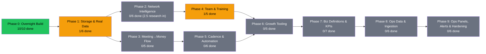

# PRD: MLE ROB Dashboard — The Network

**Version:** 2.1.0 | **Created:** 2026-07-04 | **Updated:** 2026-07-04
**Status:** ACTIVE
**Owner:** Rob + Max
**Project:** mle-rob-dashboard
**Type:** full
**Slug:** mle-rob-dashboard

> Plain-English companion: [`WHAT-WE-ARE-DOING.md`](../../WHAT-WE-ARE-DOING.md) — read that first.
>
> **This is the ONE living PRD.** Rob's 2026-07-04 directive: front-load The Network (graph, people ledger,
> AI estimator, sign/get-paid/reduce-friction themes, training); everything from the v1 mission-control PRD
> **still matters and is preserved below as Phases 7–9** — it is deprioritized, not dropped. Nothing gets lost.
> v1 original text is snapshotted at `~/.claude/plans/snapshots/mle-rob-dashboard/`.

---

## Status Diagram

**Color key:** `#22c55e` complete · `#f59e0b` in-progress · `#6b7280` pending · `#ef4444` blocked

**Priority order is the phase order.** Phases 1–6 are Rob's stated focus (The Network). Phases 7–9 carry
the full v1 mission-control scope (KPI definitions, ops data layer, ingestion, panels, alerting) — important,
just not first. Individual Phase 7–9 tasks may be pulled forward any time Rob flags one.

---

## Goal

One Vercel dashboard where Rob sees and grows The Network — every person as a node with AI-estimated revenue + door-opening potential, every project with its completion/category/theme, and a friction-free meeting → agreement → invoice flow — so the business expands as fast as possible without losing its core values. As it matures (Phases 7–9), the same dashboard becomes full mission control: pipeline KPIs, e-sign status, AR aging, action-item SLAs, and alerting.

## Scope

**IN (front-loaded — The Network):**
- **The Network graph**: zoomable, globe-like node/cluster visualization — people + verticals as nodes (lit/unlit), referral relationships as edges, node size = estimated contribution
- **People ledger**: line-item table with Rob's full field set (optimized order), manual entry first, automation later
- **Projects board** with completion %, category, core theme (sign the agreement / get paid fast / reduce all friction — all remote revenue generation); product builds (AIDRE, AIVA, etc.) in a linked section with Will-reminders
- **AI contribution estimator**: from a free-text description → est. aggregate revenue, est. new nodes, probability, reasoning; connection suggestions Rob doesn't see
- **Meeting→Money**: low-friction meeting notes → scoped agreement → invoice out (integrates the onboarding + invoicing PRD systems; this dashboard is the visible surface)
- **Training corner**: Phase One explainer, coaching materials, later a rep-facing chat box
- **Storage behind an adapter** — file/Sheets/Airtable/Supabase swappable; losing access to any one tool NEVER stalls work
- Daily prioritization → tasks; reminders (incl. Will's action items); upcoming events

**IN (deferred — mission control, Phases 7–9, preserved from v1):**
- Canonical pipeline stages, stalled-deal thresholds, qualified-lead gate, lost-reason taxonomy
- 7 sales KPIs + 4 marketing KPIs with documented formulas and named source fields — no unsourced numbers
- Lead-source attribution (UTM → Cal.com booking) and source taxonomy
- Read-only data layer over the onboarding-automation and invoicing-engine systems (view contract, `dashboard_ro` role)
- n8n ingestion: Cal.com, Fathom, Documenso, invoicing webhooks; `sync_failures` + `last_synced_at`
- Ops panels: Pipeline, Onboarding/E-sign, Action Items (ours/theirs), Invoicing/AR, KPI Summary, "Needs Action Today"
- Alerting (stale data, failed sync, overdue items, unpaid invoices), daily/weekly digests, backups, security hardening

**OUT (actually out):**
- GoHighLevel in any form; Close CRM as a destination (STG read-only legacy only)
- Outside investment tracking (we don't take outside money — door-openers can earn a cut)
- Client-facing views / white-label embeds
- Writing back to the onboarding/invoicing source systems (ops layer stays read-only)

## Success Criteria

- Rob opens one URL: network graph zooms/clusters, people ledger scans line-by-line with all his fields, projects show completion/category/theme, AI estimates render per person
- Adding a person takes < 60 seconds of typing and immediately appears as a node
- The AI estimator produces revenue/node/probability estimates for the Jonathan Polk test case that Rob judges directionally right
- Storage swap test: switching the adapter source loses zero UI functionality
- (Phases 7–9) Every KPI renders with a documented formula and named source field; panel data matches source systems on a 3-record spot check; stale data alerts Rob within 30 minutes
- PRD checkboxes and revision history current within 24h of any work (living doc)

---

## Phases + Tasks

### Phase 0: Overnight Build (2026-07-04, Max solo, full authority)

- [x] Task 0.1 [Engineering] - Write plain-English WHAT-WE-ARE-DOING.md | DoD: File at project root explains the play + the build in plain English
- [x] Task 0.2 [Engineering] - Scaffold Next.js (App Router, TS, Tailwind) + git init with organized file structure | DoD: `npm run build` passes; structure documented in README
- [x] Task 0.3 [Engineering] - Data model: Person/Node, Edge (referredBy + relationship), Project (category, theme, completion), Vertical, Estimate types | DoD: `lib/types.ts` compiles; every Rob-specified field present
- [x] Task 0.4 [Engineering] - StorageAdapter interface + JSON file store (day-1 source) with Sheets/Airtable/Supabase stubs | DoD: All reads go through the adapter; swapping source = 1 line
- [x] Task 0.5 [Engineering] - Seed data: Jonathan Polk → Naples Spine & Joint → PropLogic/LandTech/Qualia chain, Will's big-network contacts placeholder, roofing + payment-processing + medical verticals, real project list (this dashboard, meeting→money, AIDRE, AIVA, RankLens, PropEstimate) | DoD: Seed renders on every page; Polk chain visible in graph
- [x] Task 0.6 [Engineering] - People ledger page: Rob's fields in optimized order, sortable, status badges | DoD: All 14+ fields render; sortable by key dates/quoted/signed
- [x] Task 0.7 [Engineering] - Network graph page: force-directed, zoom/pan, lit/unlit nodes, size = est. contribution, cluster coloring by vertical, click → detail | DoD: Polk chain zoomable; clicking node shows person panel
- [x] Task 0.8 [Engineering] - Overview + Projects pages: aggregates (pipeline $, signed, network size, est. network value), projects with completion/category/theme, Products section (AIDRE/AIVA link-outs) + Will reminders | DoD: Every project shows all three attributes; Will items flagged
- [x] Task 0.9 [Engineering] - AI estimator v1: heuristic scorer + `/api/estimate` route (Claude-powered, key-gated) + estimate display on person detail | DoD: Polk description produces revenue/nodes/probability/reasoning
- [x] Task 0.10 [Engineering] - Evaluate → iterate → verify build; deploy to Vercel if authenticated, else local + screenshots; morning report | DoD: quality-evaluator ≥90 on Rob's spoken spec; report delivered

### Phase 1: Storage & Real Data

- [x] Task 1.1 [Rob] - GATE: 10-second yes/no on storage recommendation (see `docs/STORAGE-DECISION.md`) | DoD: Decision logged in Decisions Log — **RESOLVED: "supabase go"**
- [ ] Task 1.2 [Engineering] - Implement chosen store adapter + migrate seed → real data | DoD: Dashboard reads live store; file store remains as fallback
- [ ] Task 1.3 [Rob] - Brain-dump first ~25 real people (voice or text, any format — Max structures them) | DoD: 25 people in ledger with vertical + referred-by where known
- [ ] Task 1.4 [Engineering] - Add-person form (<60s entry) + inline edit | DoD: New person → node appears without redeploy
- [ ] Task 1.5 [Engineering] - Import roofing lists + lead-magnet assets inventory as network seed clusters | DoD: Roofing cluster populated from existing STG-era domain data (data, not branding)
- [ ] Task 1.6 [Operations] - Nightly backup of store to file (no-stall guarantee) | DoD: Simulated store outage → dashboard serves from last backup

### Phase 2: Network Intelligence

- [ ] Task 2.1 [Engineering] - Claude-powered estimator on live data (replace heuristic): revenue, new nodes, probability, reasoning | DoD: Estimates cached per person; re-run on description change
- [ ] Task 2.2 [Engineering] - Connection suggester: AI scans ledger for non-obvious links (shared verticals, employers, geographies) | DoD: ≥1 suggested connection Rob didn't enter, shown as dashed edge
- [ ] Task 2.3 [Engineering] - Success-rate vs probability overlay (predicted vs actual as deals close) | DoD: Graph toggle shows both per node
- [ ] Task 2.4 [Sales] - Node-activation playbook per node type (connector / phone-attacker / social butterfly / vertical anchor) | DoD: Each type has a 3-step activation play visible on person detail
- [ ] Task 2.5 [Research] - Vertical-anchor scan: payment processing first — displaced payment-processing salespeople w/ deep local books (LinkedIn) | DoD: 10 candidates with source URLs, loaded as unlit nodes (research doc DONE 2026-07-04 → docs/research/payment-processing-candidates.md; node loading pending)
- [ ] Task 2.6 [Engineering] - Cluster analytics: per-vertical aggregate est. revenue + activation % | DoD: Zoom-out view shows per-cluster rollups

### Phase 3: Meeting→Money Flow

- [ ] Task 3.1 [Engineering] - Low-friction meeting notes capture (Fathom link or paste) attached to person record | DoD: Paste/link → transcript + video links populate ledger fields
- [ ] Task 3.2 [Engineering] - Notes → scope extraction → agreement fields (reuse onboarding PRD's extraction pipeline) | DoD: Test transcript → scoped agreement draft with fields filled
- [ ] Task 3.3 [Engineering] - Signature → invoice-out trigger (reuse invoicing PRD engine) | DoD: Signed test agreement → invoice generated within 5 min
- [ ] Task 3.4 [Engineering] - Time-to-payment tracking per person (est. vs actual) on ledger + overview | DoD: Both values render; overdue turns red
- [ ] Task 3.5 [Operations] - Key-dates timeline per person (met → quoted → signed → invoiced → paid → phase-one complete) | DoD: Timeline renders for any person with ≥2 dates

### Phase 4: Team & Training

- [x] Task 4.1 [Marketing] - Phase One explainer (what it is, what it costs, what client gets) as training page + short video script | DoD: A new rep can answer "what's Phase One" from the page alone
- [ ] Task 4.2 [Engineering] - Rep chat box (Claude-backed, grounded in training corpus) | DoD: "What is phase one?" answered correctly from corpus, not vibes
- [ ] Task 4.3 [Rob] - Record/approve coaching materials descriptions (Max structures into corpus) | DoD: ≥3 coaching entries live in training corner
- [ ] Task 4.4 [Sales] - Rep onboarding path: day 1 → first call script → first deal | DoD: Checklist page a new rep can self-serve
- [ ] Task 4.5 [Engineering] - Collateral shelf incl. items needed FROM Will (data, collateral) with reminder flags | DoD: Will-owed items generate reminders (Phase 5 wiring)

### Phase 5: Cadence & Automation

- [ ] Task 5.1 [Engineering] - Daily priorities panel: AI ranks today's actions (nodes to light, follow-ups, Will nudges) | DoD: Opens with ≥3 ranked actions each morning with reasons
- [ ] Task 5.2 [Operations] - Reminders engine: Will's action items + Rob follow-ups (n8n or cron) | DoD: Overdue Will item pings within 24h of due
- [ ] Task 5.3 [Operations] - Scheduling hooks: autonomous runs (estimator refresh, connection scan, daily digest) | DoD: All three run unattended on schedule; failures alert
- [ ] Task 5.4 [Engineering] - Events section: upcoming events as network opportunities (who's there, which nodes) | DoD: Event with linked people renders on overview
- [ ] Task 5.5 [Operations] - PRD autosave verification for this project path | DoD: Session-end hook updates checkboxes in THIS file
- [ ] Task 5.6 [Operations] - Update-reminders for the Products section (AIDRE/AIVA status staleness) | DoD: Product untouched >7 days flags on overview

### Phase 6: Growth Tooling

- [ ] Task 6.1 [Research] - Scraper/search pipeline for target groups (e.g., web developers) — names, roles, contact where permissible | DoD: 25-row enriched list from one target group with source URLs
- [ ] Task 6.2 [Sales] - Vertical expansion queue ranked by node-multiplier potential (payment processing, title, roofing next-wave) | DoD: Ranked list with rationale + est. aggregate revenue per vertical
- [ ] Task 6.3 [Engineering] - Bulk import (CSV/Sheets) → ledger + graph | DoD: 100-row CSV imports clean with dedup
- [ ] Task 6.4 [Marketing] - Reuse roofing lead magnets for network activation campaigns | DoD: ≥2 existing magnets wired to a booking link with source tracking
- [ ] Task 6.5 [Rob] - Recruit first 2 reps; their targets appear as assigned nodes | DoD: Rep column live in ledger; nodes assignable

---

### Phase 7: Business Definitions & KPIs *(preserved from v1 — deprioritized, not dropped)*

- [ ] Task 7.1 [Sales] - Define 8 canonical pipeline stages (Lead → Discovery Booked → Discovery Held → Proposal/Agreement Sent → Signed → Invoiced → Paid → Delivering) each with entry/exit trigger event | DoD: Stage table maps each stage to the exact system event that moves a deal into it; approved by Rob
- [ ] Task 7.2 [Sales] - Define 7 sales KPIs with formulas + source fields: Discovery Show Rate (≥75%), Proposal Win Rate (30/60/90d), Weighted Pipeline Value (stage-probability map), Avg Sales Cycle, Time-to-First-Touch (<4 bus. hrs), Signed-to-Cash Lag, Follow-up SLA Compliance | DoD: Each KPI has formula, numerator/denominator source fields, and target benchmark documented; stage→probability mapping approved by Rob
- [ ] Task 7.3 [Marketing] - Define 4 marketing KPIs with formulas + named source systems: Cost per Booked Call, Lead-Magnet Conversion, Source → Close Rate, Booking Volume by Channel | DoD: Each KPI has formula, input-source table, and a worked example
- [ ] Task 7.4 [Sales] - Define "Needs Action Today" rule set (new lead >24h untouched; no 24h-prior discovery reminder; no proposal within 48h of discovery; no follow-up in 3 bus. days; signed-not-invoiced >24h) | DoD: Rule table with trigger, action owed, SLA hours, exact field each rule reads — feeds the daily-priorities panel (5.1)
- [ ] Task 7.5 [Marketing] - Lead-source taxonomy (Cold Email, Referral, Lead Magnet, Organic, Direct/Unknown) + UTM convention + Cal.com hidden-field/UTM passthrough spike | DoD: Taxonomy doc; UTM convention table; Cal.com passthrough yes/no verdict with evidence (or workaround)
- [ ] Task 7.6 [Sales] - Stalled-deal thresholds per stage, qualified-lead gate (BANT-lite), lost-reason enum (6-8 values) | DoD: Three short tables documented — Rob 2026-07-04: "we'll get there," so this is explicitly last in this phase
- [ ] Task 7.7 [Rob] - GATE G1: Decide whether the Network people ledger IS MLE's CRM system of record, or name a separate CRM (merit-based; never GHL, never Close as destination) | DoD: Decision logged in Decisions Log

### Phase 8: Ops Data & Ingestion *(preserved from v1 — deprioritized, not dropped)*

- [ ] Task 8.1 [Research] - Inventory onboarding-PRD data (`clients/<slug>.json` schema, Documenso IDs + signed-PDF URLs, CRM adapter fields) + Cal.com/Fathom/Documenso/Twilio/Retell webhook payload fields with doc URLs | DoD: Consolidated field table per system, each with source URL
- [ ] Task 8.2 [Research] - GATE G3: Confirm invoicing/AR backing store live today (Postgres/Supabase tables vs `invoice-ledger.csv`) | DoD: Written verdict per store with evidence; determines what the AR view reads
- [ ] Task 8.3 [Engineering] - Read-model data contract + read-only role: views for pipeline, e-sign status, action items, delivery phases, invoices/AR, nudge activity; `dashboard_ro` SELECT-only role | DoD: `docs/data-contract.md` committed; INSERT/UPDATE attempt fails in test; views return expected sample rows
- [ ] Task 8.4 [Operations] - n8n ingestion workflows: Cal.com booking (incl. UTM per 7.5), Fathom recording-ready, Documenso sent/viewed/signed/declined, invoicing paid/overdue | DoD: Each test event reflects in its target table within its cadence (60s–5min)
- [ ] Task 8.5 [Operations] - Error workflow + freshness: failures → `sync_failures` table; `last_synced_at` on every table-writing node | DoD: Forced bad payload logs within 60s; every target table's timestamp updates on cadence
- [ ] Task 8.6 [Operations] - Publish Mermaid workflow map (trigger/nodes/target table per workflow) | DoD: Diagram matches n8n workflow list 1:1

### Phase 9: Ops Panels, Alerting & Hardening *(preserved from v1 — deprioritized, not dropped)*

- [ ] Task 9.1 [Engineering] - Add ops panels to the dashboard: Pipeline, Onboarding/E-sign, Action Items (ours/theirs), Invoicing/AR, KPI Summary — same app, new faces | DoD: Each renders live data; smoke test per screen passes
- [ ] Task 9.2 [Engineering] - "Needs Action Today" widget evaluating rule set 7.4 | DoD: Seeded fixture for each rule surfaces exactly the expected items
- [ ] Task 9.3 [Operations] - Alerting: stale-data check (30-min), failed-sync push, overdue Rob-owned action items (daily 8am), unpaid-invoice alerts at 7/15/30 days — all with 24h dedup + per-alert-type kill switch | DoD: Each forced condition alerts once within its window; toggling one type off leaves others firing
- [ ] Task 9.4 [Operations] - Daily 7am digest (pipeline count, e-sign pending, overdue items, AR aging) + weekly Monday KPI rollup (revenue, pipeline velocity, sync health) | DoD: Test runs deliver all sections matching live dashboard counts
- [ ] Task 9.5 [Engineering] - Hardening: secrets externalized + repo grep clean, `/api/health` endpoint + uptime check, nightly store/Postgres backup with verification, no secrets in client bundle | DoD: `git grep -i password` clean; simulated outage alerts within one cycle; forced-missing-backup flags within 24h
- [ ] Task 9.6 [Rob] - Live sign-off: spot-check 3 records against source systems (with Will) | DoD: Match confirmed; sign-off logged; E2E screenshots archived

**Retired from v1 (moot — with reasons, so nothing is silently dropped):**
- G2 Will-access gate → RESOLVED: Will gets access (Rob 2026-07-04 division-of-labor)
- G4 Hetzner capacity check + Docker/Caddy hosting ADR → MOOT: Rob chose Vercel; revisit only if we ever self-host
- Standalone brand-spec task → dashboard shipped with an approved dark-mode look; reopen only if Rob wants a restyle
- Competitive dashboard scan → nice-to-have; pull forward on request

---

## Open Questions

- [x] Q1: Storage — RESOLVED 2026-07-04: Supabase (Rob: "supabase go")
- [ ] Q2: First 25 real people brain-dump — voice memo is fine (owner: Rob, due: 2026-07-08)
- [ ] Q3: Anthropic API key — Rob 2026-07-04: "will give when done" — pending delivery (owner: Rob)
- [ ] Q4: Rep discount authority — last open `[CONFIRM WITH ROB]` in phase-one-explainer.md (owner: Rob)
- [ ] Q5 (from v1): Alert channel for Phase 9 — Slack DM, SMS, or both? Client-owned overdue items ever alert the client, or Rob-only? (owner: Rob, needed before 9.3)
- [ ] Q6 (from v1): Data-freshness SLA per table — webhook near-real-time everywhere, or 5-min poll OK for AR/action items? (owner: Rob, needed before 8.4)

## Decisions Log

| Date | Decision | Rationale | Source |
|------|----------|-----------|--------|
| 2026-07-04 | Re-center PRD on The Network; v1 mission-control framing superseded as the *lead* | Rob's directive: network graph, people ledger, themes, training, speed over taxonomy | Rob |
| 2026-07-04 | **v1 scope is NOT dead — merged into this PRD as Phases 7–9, deprioritized behind Network phases** | Rob: elements of v1 still matter; front-load his priorities, keep everything tracked so nothing is missed | Rob |
| 2026-07-04 | Hosting = Vercel (v1 gate G4/Hetzner moot for dashboard) | Rob: "open up a dashboard on Vercel" | Rob |
| 2026-07-04 | Will gets access; he owns tech delivery + big-network meetings and has action items surfaced here | Rob's division-of-labor statement (closes v1 gate G2) | Rob |
| 2026-07-04 | Storage behind adapter; file store day 1; no tool outage may ever stall work (Sheets fallback mandate) | Rob: "plug them into Google Sheets until we get back" | Rob |
| 2026-07-04 | No outside money; door-openers can earn a cut | Rob's core-values statement | Rob |
| 2026-07-04 | Lost-reason/stage-probability taxonomy work deprioritized to Phase 7 (kept, not cut) | Rob: "not super interested… we'll get there… I want to be moving" | Rob |
| 2026-07-04 | Est. network value labeled directional (referrer estimates may overlap door revenue) until Phase 2.3 re-estimation ships | devil-advocate finding #4 — Rob quotes stats to clients; no unsourced/inflated numbers | Max |
| 2026-07-04 | Estimate writes fail LOUD on read-only deploys and report save-state in UI; reads always fall back to file store | QE finding #2 — the no-stall guarantee must be code, not prose | Max |
| 2026-07-04 | Storage = Supabase (adapter built: lib/storage/supabaseStore.ts, schema 0001_network.sql, seed script) | Rob: "supabase go" — closes Q1/Task 1.1 | Rob |
| 2026-07-04 | Phase One pricing = $10,000 upfront + $1,000/month; upfront pay-in-full due upon receipt | Rob's direct answer — resolves 2 of 3 training-doc flags; estimator economics updated (~$22k yr-1/deal) | Rob |
| 2026-07-04 | Rep discount authority still undecided | Only remaining [CONFIRM WITH ROB] in phase-one-explainer.md | Max |

## Dependencies & Blockers

| Item | Type | Owner | Status |
|------|------|-------|--------|
| ~~Storage decision (Q1)~~ | ~~gate for Phase 1.2+~~ | Rob | **resolved — Supabase** |
| Anthropic API key for live estimator (Q3) | gate for 2.1, 4.2 | Rob | open |
| 25-person brain-dump (Q2) | gate for 1.3 | Rob | open |
| Onboarding PRD extraction pipeline | dependency for 3.2, 8.1 | contracts build | open |
| Invoicing PRD engine | dependency for 3.3, 8.2 | contracts build | open |
| G1: CRM system of record (ledger vs separate) | gate for 7.7 → 8.x action-item wiring | Rob | open |
| G3: Invoicing backing store confirmed | gate for 8.2 → AR view | Research → Rob | open |
| Alert channel + freshness SLA (Q5/Q6) | gate for 8.4, 9.3 | Rob | open |

## Related Files

- WHAT-WE-ARE-DOING.md (plain-English mission)
- docs/STORAGE-DECISION.md (resolved: Supabase)
- /Users/robertacheson/Projects/MyLocalEverything/contracts/docs/plans/ (onboarding + invoicing PRDs)
- ~/.claude/plans/snapshots/mle-rob-dashboard/ (v1.0 original snapshot)

---

## Revision History

| Version | Date | What Changed | By |
|---------|------|--------------|-----|
| 2.1.0 | 2026-07-04 | **Merged full v1 mission-control scope back in as Phases 7–9** per Rob: front-load Network priorities, keep everything else tracked (KPIs, ops data layer, ingestion, panels, alerting). Retired-item list added with reasons. Open questions Q5/Q6 carried over from v1. Task 1.1 checked (Supabase resolved). | Max (Rob directive) |
| 1.0 | 2026-07-04 | Initial PRD — mission control over contracts systems; gated (G1-G4); QE 92/100 | Max |
| 2.0.6 | 2026-07-04 | Auto-touched (session activity) | prd-autosave.sh |
| 2.0.5 | 2026-07-04 | Auto-touched (session activity) | prd-autosave.sh |
| 2.0.4 | 2026-07-04 | Auto-touched (session activity) | prd-autosave.sh |
| 2.0.3 | 2026-07-04 | Auto-touched (session activity) | prd-autosave.sh |
| 2.0.2 | 2026-07-04 | Auto-touched (session activity) | prd-autosave.sh |
| 2.0.1 | 2026-07-04 | Auto-touched (session activity) | prd-autosave.sh |
| 2.0 | 2026-07-04 | MAJOR scope change per Rob: The Network is the center — graph, people ledger, AI estimator, themes, training, Will's corner; hosting = Vercel; taxonomy ceremony deprioritized; PRD moved into project repo | Max (Rob directive) |
| 2.1 | 2026-07-04 | Phase 0 built (two-session build: bf391e58 pages + a0a6c8a2 verify/fix). QE scored 77 → fixes: real no-stall storage fallback, estimate persistence w/ honest save-state, pointer/pinch graph controls, probability+nodeType surfaced, Polk seed regenerated from actual heuristic, Daily-priorities/Events stubs, double-count caveat. Tasks 0.1-0.9, 4.1 checked; 2.5 research half done. | Max |
