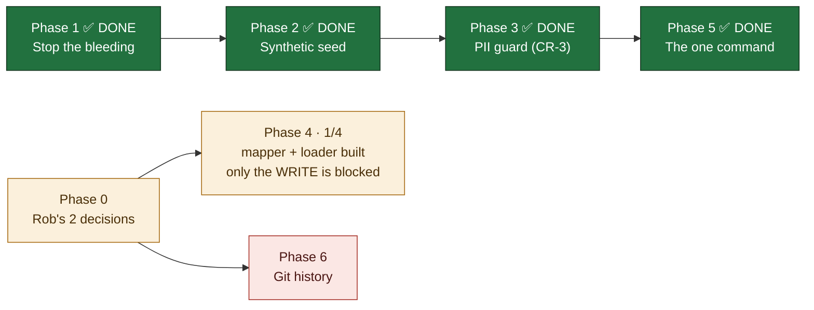

# PRD — Scaffolding in Git, Data in Supabase

**Version:** 1.23 · **Created:** 2026-07-29 · **Updated:** 2026-07-29
**Status:** IN PROGRESS — **Phases 1, 2, 3 and 5 COMPLETE; Phase 4 is now 1/4 — its pure mapper (`lib/calls/firefliesMapping.ts`, inc.19) is built and driven over all 13 real exports (4,451 sentences → 4,451 segments, 0 rejected, 0 rows `0021` would refuse) WITHOUT writing anything anywhere. Deciding the mapping never needed Rob's permission; only the load does. What remains is Rob-gated (Phase 0's two one-word decisions → the Phase 4 write, Phase 6 history).** The DoD sentence now holds end to end, driven from a tracked-files-only tree: `git archive HEAD` → `npm run dev:demo` → `/` `/people` `/deals` all 200, 16 deals, `data-tone="demo"` on every page, zero real names, no credential reachable. The README quickstart states the three paths (demo / live / local mirror) and **cannot rot silently** — a test asserts every command, link and directory it names exists. `npm run guard:pii` is one command over both tiers and one allowlist: Tier A 3/3 targets · Tier B 700 text files vs 31 denied contacts (14 binaries skipped) · exit 0 — enforced by a vitest case over the **real tracked tree**, so `.githooks/pre-push` and CI gate it with zero new wiring. **`npm run seed:local` now populates BOTH gitignored overlays from live Supabase** — network *and* CRM (deals/activities/tasks had no live path at all before inc.15) — leaving `git status` clean of data files, **and as of inc.21 it maps those rows with the STORE's own mappers instead of a copy of them**: the copy in `regen-fallback.mjs` had silently fallen four columns behind (`legacySlug`, `orgId`, `phase2Estimate`, `equity`), so every local mirror served people with no company link and no ROI inputs — proven by re-running it (0 → 41 `legacySlug`, 0 → 12 `orgId`, 0 → 2 `phase2Estimate`, zero regressions on the fields the copy did map). **`.env.example` is now tracked at all** (`.gitignore`'s `.env*` had been swallowing it, so no clone had one) and lists all **37** variables the code reads instead of 5 — held there by `npm run check:env`. **Phase 5 has nothing left in it** — its three items (`seed:local`, `.env.example`, README) closed in inc.15–17, and inc.18 measured the one DoD clause the rewrite could only assert. · **Owner:** Rob + Max · **Project:** MLE ROB Dashboard · **Type:** technical

---

## Goal

Clone the repo and nothing sensitive leaks. Run one command and get a fully working dashboard on synthetic data. Point it at Supabase and get the real thing in seconds.

## Why this exists

Rob, 2026-07-29: *"Wouldn't there be a way to have any people or company or financial or anything at all empty and just the scaffolding in the GitHub. Can it all get populated from Supabase in a few seconds?"*

He was right, and the audit that followed found the problem is **larger than the transcripts that prompted it** — 16 tracked files carrying real contacts and deal values, one committed the same day, and a script that actively refills them.

---

## The finding that reorders everything

`scripts/regen-fallback.mjs` reads **live Supabase** and writes `data/network.json`, which is **committed** and is what `fileStore.ts` serves in CI.

**The repo contains a pump pointing real customer data into git.** Deleting the artifacts without re-pointing that pump means they come back on the next run. This is why Phase 1 must precede Phase 2 — a synthetic seed landing first gets silently overwritten with real rows and re-committed.

---

## Status

---

## Scope

**IN**
- Untracking every file that carries real contacts, phones, or deal values
- Re-pointing the fallback pump so it can never re-commit real data
- A deterministic synthetic seed that makes a fresh clone *work*, not just build
- A code-enforced guard that fails the suite before real PII can be committed
- Loading the 13 Fireflies transcripts into the existing `0021` tables

**OUT**
- Rewriting git history on the existing repo (Phase 6 — gated, and the recommendation is *don't*)
- The `~/Projects/MyLocalEverything/contracts` repo — separate repo, needs its own pass
- Re-opening the dashboard auth decision (Rob closed it 2026-07-27; prod stays open)

---

## Verified inventory — tracked files holding real data

| File | What's in it | Action |
|---|---|---|
| `data/network.json` | 26 phones, 22 emails incl. Rob's family | Replace with synthetic |
| `backups/0031-preapply-2026-07-29/*.json` (8 files) | 13 phones, 14 emails, `quoted_amount` 19000/10000/7000 — **committed today** | Untrack |
| `backups/pre-0003-*-2026-07-21.json` (4 files) | 14 phones, 9 emails, 5 quoted amounts | Untrack |
| `docs/backups/*-2026-07-17.json` (4 files) | 58 records, quoted amounts | Untrack |
| `MLE Internal Meetings/manifest.json` | **12 real participant emails** — my "metadata only, no speech" claim last night was wrong | Regenerate without emails |
| `docs/research/ENRICHMENT-GAP-AUDIT-2026-07-17.md` | 22 real contacts in prose | Redact |
| `BUILD-QUEUE.md`, `docs/plans/PRD-mle-crm.md` | One real phone, propagated across 3 files | Redact |
| **this PRD** | **4 phones + a family gmail address** — quoted while *documenting* the leaks. Inventory correction, 2026-07-29 inc.4: the count above was low and this file was missing from its own list. | Redacted |

Test fixtures using invented domains (`roofco.com`, `proplogix.com`, ~15 files) are **left alone** — a guard that flags all 57 files gets disabled within a day.

---

## Phase 0 — Rob only

- [ ] [Rob] **Is this repo going public, or do you just want a clean tree?** Private + 0 forks today. If it stays private, Phases 1–5 are sufficient and history stays as-is. | DoD: one-word answer logged below.
- [ ] [Rob] **May the 13 transcripts load into prod Supabase?** Verified safe despite the open dashboard: the only public route validates against `/^RE[0-9a-fA-F]{32}$/`, so a `fireflies-…` key is structurally unreachable, and `0021` has RLS on with zero policies. Two independent barriers. Not re-raising the auth decision — just need a go. | DoD: yes/no.

### The same two decisions in plain English *(Rob asked for this, 2026-07-29 dump item 1 — no jargon, and the right way named rather than a menu)*

1. **Decision 1 is: do you ever want to show anyone the *building plans* for this system?** Not the customer list — the plans. Today they are locked in a filing cabinet only you can open, and **the right answer is to leave them locked**: keep this one private forever, and *if* you ever want to show someone, publish a separate clean copy rather than unlocking this cabinet, because a cabinet that has ever held a customer's phone number can never be fully emptied of it.
2. **Decision 2 is: may I put the 13 recorded meetings into the same database the dashboard already reads from?** They sit on my laptop today, so nobody but us can see them and nobody but us can search them; the right answer is **yes**, because the dashboard is where they become useful and I already proved they cannot be reached from the one page the public can load.
3. **The one sentence behind both:** the *plans* can be public one day, the *people* never can — which is why the system is built so the plans and the people live in two different places.

### Rob's own read, confirmed — with the one thing he has slightly different

Rob, 2026-07-29: *"keep the repo as it is now, and then create another repo later of the full thing with those fixes in place."* **That is right, and it is exactly what Phase 6 recommends.** One correction, and it is the difference between this working and this quietly failing:

> The second repo is **not** the full thing moved over, and this one is not retired. The private repo stays the real one — every day's work keeps happening here, with all 455 commits of history intact. The public one is a **published snapshot**: one single commit with no history behind it, republished from here whenever you want it refreshed. If instead you *moved* onto the new repo and kept building there, you would have spent the risk of a migration and still be one careless paste away from the same problem — with no private original left to fall back on.

## Phase 1 — Stop the bleeding *(tonight, fully reversible)*

- [x] [Max] Add `backups/`, `docs/backups/`, `data/network.local.json`, `data/crm.json` to `.gitignore` | DoD: `git check-ignore backups/0031-preapply-2026-07-29/people.json` exits 0 — **DONE 2026-07-29 inc.1, exit 0 verified**
- [x] [Max] `git rm -r --cached backups docs/backups` (16 files, stay on disk) | DoD: `git ls-files | grep -c backups` = 0 — **DONE 2026-07-29 inc.1: index count 0, all 12 files (8 + 4) still on disk. Checked first that nothing reads these paths — the only `backups/` in code is `regen-fallback.mjs:103`, the Supabase Storage *bucket*, not the local dir.**
- [x] [Max] **Re-point the pump** — `regen-fallback.mjs` target → `data/network.local.json` | DoD: running it leaves `git status` clean — **DONE 2026-07-29 inc.2, proven against LIVE Supabase: the run reported `41 people, 47 edges, 8 verticals, 12 projects` and `git status --porcelain` showed only the three source files of this increment — zero data files. Before this change that same run dirtied the tracked `data/network.json`.**
- [x] [Max] Teach `fileStore.ts` to prefer `network.local.json` when present, resolved per-call | DoD: new test asserts local-wins and synthetic-fallback; 187 existing test files green — **DONE 2026-07-29 inc.2: `lib/storage/__tests__/fileStoreNetworkOverlay.test.ts`, 5 tests (fallback-when-absent, local-wins, per-call re-resolution both directions, write-lands-in-overlay-and-committed-file-is-byte-identical, corrupt-overlay-fails-loud). 189/189 files, 2901/2901 tests, build green.**
- [x] [Max] De-PII the manifest — `participants` → `participantCount` + domains only | DoD: 0 email matches; 13 meetings still identifiable by title/date/link — **DONE 2026-07-29 inc.3.** `scripts/manifest-privacy.mjs` (pure `redactAttendees`/`redactMeeting`/`redactManifest` + a no-network CLI); the committed manifest now greps **0** for any address-shaped string (broad regex, not just the 12 known), all 13 meetings keep title/date/duration/keywords/Fireflies link, and `organizer` became `organizerDomain`. **`fireflies-ingest.mjs` now shapes attendees at the point of creation**, so a future pull cannot re-introduce emails by re-running the ingest. 10 new tests in `lib/__tests__/manifestPrivacy.test.ts`, three of which assert against the real committed file. Idempotent both ways (second CLI run = no-op; `redactManifest(manifest)` deep-equals the file).
- [x] [Max] Redact the 3 prose leaks | DoD: Tier-B guard passes on all three — **DONE 2026-07-29 inc.4.** `scripts/prose-redact.mjs` (pure `redactProse`/`isRedactableEmail`/`isRedactablePhone` + a no-network CLI) rewrote all three: `ENRICHMENT-GAP-AUDIT-2026-07-17.md` 9 emails + 14 phones, `PRD-mle-crm.md` 4 + 4, `BUILD-QUEUE.md` 4 + 7 — **17 mailboxes and 25 numbers, against the 22-contact estimate in the inventory above.** The prose rule is narrower than Tier A's whitelist by necessity: the *mailbox* goes, the *organisation* stays (`<name>@omegatitlegroup.com` → `[email redacted @omegatitlegroup.com]`), so the record of the enrichment work survives its own redaction. Rob's own `aivoicetech.io` and the invented fixture domains (`roofco.com`, `proplogix.com`, …) are allowlisted — redacting them would break tests for zero privacy gain. Idempotent (second CLI run: "clean — no change" on all three). 17 tests in `lib/__tests__/proseRedact.test.ts`, six of them asserting against the real committed files **with a broader regex than the redactor's own**, so the DoD is not graded by the matcher that produced it. Tier B (Phase 3) inherits `isRedactablePhone`/`isRedactableEmail` rather than restating them.
- [x] [Max] Confirm the 110 `ARCHITECTURE-ATLAS.html` hits are SVG coordinates | DoD: 5 sampled, each inside `d=` or `viewBox` — **DONE 2026-07-29 inc.4, and the answer is yes — but the check found a live trap first.** Sampling showed the frequent hits are path data (`[phone redacted]` ×18, `[phone redacted]` ×12, `[phone redacted]` ×14) and `viewBox` geometry. The trap: `viewBox="0 0 2663.84375 634.171875"` contains a substring straddling the two numbers (width's last 3 digits, space, height's first 3, decimal, 4 more) which is phone-**shaped**, NANP-**valid**, and a coordinate — the first draft of the redactor would have silently rewritten the Atlas. Fixed by construction, not by exception list: a phone may not sit flush against a digit or a decimal point (`(?<![\d.])`/`(?![\d.])`), and markup is matched on formatted numbers only. **Pinned by test** — `redactProse(ATLAS)` must return byte-identical text with 0 emails and 0 phones — so this conclusion is re-proven on every run instead of resting on tonight's eyeballs.

## Phase 2 — Synthetic seed *(tonight)*

Reuses the repo's own convention — 6 existing `demo-` rows use RFC 2606 `@example.com` and the reserved 555-01XX block. Those are the nucleus; the generator extends them.

- [x] [Max] `scripts/seed-synthetic.mjs` — seeded PRNG, no `Date.now()`, no network, emits full `NetworkData` + `__synthetic: true` | DoD: two runs byte-identical (`cmp` exits 0) — **DONE 2026-07-29 inc.5, `cmp` exit 0 proven on two real CLI runs.** mulberry32 over an FNV-1a hash of a pinned `SEED` string; every date derives from `BASE_DATE`, never a clock. **Safety is structural, not reviewed:** every address is RFC 2606 `@example.com` and every number is `+1 (555) 555-01NN` — inside the reserved `555-01XX` line range *and* behind the non-assignable `555` area code, so it satisfies both conventions (the six pre-existing `demo-` rows used `+1 (555) 010-XXXX`, area-code-safe but outside the reserved line range; Tier A will accept both so those rows keep passing). Ids mirror the Q70 record-number convention (`P-1001…`/`C-2001…`) with `legacySlug` on every row, so slug URLs resolve in demo mode exactly as on prod. Cardinality mirrors the real ledger (22 people / 19 orgs / 47 edges / 12 projects) so the demo exercises the same layouts. 17 tests in `lib/__tests__/seedSynthetic.test.ts`, **graded by regexes broader than the generator's own rules** — plus dangling-edge, unique-id, vertical-resolves and no-signed-date-without-signed structural checks, and a source scan proving no `Date.now(`/`fetch(` survives comment-stripping. `NetworkData` gained `__synthetic?: boolean`.
- [x] [Max] Generate and commit the new `data/network.json` | DoD: `STORAGE_SOURCE=file npm run build` + vitest green; dashboard populated, zero real names — **DONE 2026-07-29 inc.6.** The committed fallback is now generator output: **0 non-`example.com` addresses, 0 phones outside the reserved `555-01XX` block, 0 hits for any real name** (Acheson / Caleb / Trent / Stavros / HomeClone / Gulf / PropLogix / Omega, all counted at 0). `STORAGE_SOURCE=file npm run build` exit **0**; **2949/2949 vitest**. **The swap exposed a real generator defect, and fixing the generator was the right end of it:** the seed emitted **zero `referredById`**, so demo mode rendered a referral dashboard in which nothing referred anything and every row read as its own root — the seed satisfied "populated" while failing "working". The generator now emits the live ledger's attribution shape exactly (**32 of 41 attributed**, 9 roots = origin + 6 unattributed people + 2 unattributed orgs), parents drawn only from the rooted set so `broken_root` is impossible by construction, deepest chain 4 hops so multi-hop breadcrumbs are exercised rather than merely possible. **Two lineage tests were pinned to the real venture ids `spinoff-homeclonevault`/`spinoff-caleb-crm`** — keeping them green would have meant emitting real names *from the privacy generator*, so the test was re-pointed onto the property it actually guards ("no referrer recorded reads `unattributed`, never broken") over every such row in whichever ledger is committed, with a non-vacuity assertion so an all-attributed ledger can't silently skip the branch. Determinism survived the change: two fresh runs `cmp` exit **0**, and the committed file is byte-identical to a third. **No deploy, and the reason is verified rather than assumed:** prod is `STORAGE_SOURCE=supabase` (env read) and `/people` was curled live returning **200 with real rows**, so this file is prod's *fallback*, not its source — nothing user-visible changed. Recorded side effect: if Supabase ever fails, prod's fallback now renders `__synthetic` demo rows instead of a stale real snapshot — louder and safer, but a behavior change, so it is written down rather than discovered later.
- [x] [Max] Drift guard — vitest regenerates in-memory and asserts the committed file matches | DoD: a hand-edit fails with "run `node scripts/seed-synthetic.mjs`" — **DONE 2026-07-29 inc.7.** `describeSeedDrift(text, seed)` in the generator (pure, takes TEXT not a path per CR-3) returns `null` when clean, else the **first divergent line** + the regen command — a raw byte-diff of a 41-record file is thousands of lines of noise, and a guard nobody can act on gets deleted rather than obeyed. `lib/__tests__/networkSeedDrift.test.ts` = 8 tests, **4 of them failure-injection** (one-char edit, pasted row, whitespace-only reformat that is semantically identical and still drift, and a phone-line edit whose reported line number is asserted exactly) — a guard asserted only against a passing file proves only that it can say yes. Each injection first asserts the mutation actually landed, so no test is vacuous. The same function backs a `--check` CLI mode (`node scripts/seed-synthetic.mjs --check [path]`, exit 1 with the message) so the guard is runnable outside vitest; **both exit codes exercised live** (clean → 0, mutated copy → 1). The message names no path — it is handed text, and one that said `data/network.json` while checking something else would be a guard that lies about where the problem is; the CLI prefixes the real path. 193/193 files, 2957/2957 tests, `STORAGE_SOURCE=file npm run build` exit 0.
- [x] [Max] Demo banner driven off `__synthetic` | DoD: shows on `npm run dev:demo`, absent on Supabase — **DONE 2026-07-29 inc.8, both halves curled live.** `lib/ui/dataDisclosure.ts` holds the decision as a pure function (CR-3) over the **two independent facts** — `mode` (where the rows came from) and `synthetic` (what they are) — and `components/FallbackBanner.tsx` renders only what it returns. The pair that only exists because of inc.6's swap gets its own loudest wording: **Supabase down *and* the fallback generated** now renders an `alarm` banner ("DEMO DATA — NOT YOUR RECORDS … do not read or act on anything on this screen") instead of the old amber outage line, which is the safety net for the side effect inc.6 recorded rather than merely noted. The `__synthetic` read sits **behind** the mode check, so live Supabase does zero extra I/O for a banner it never shows, and an unreadable file degrades to the mode-only disclosure rather than taking the page down. 7 tests in `lib/__tests__/dataDisclosure.test.ts` over the full 6-row truth table, incl. a property assertion that generated rows can never be described without a word that says so. `dev:demo` + `seed:synthetic` npm scripts added (Phase 5 stays open — `seed:local` and the README rewrite are still owed).
- [x] [Max] Emit `data/crm.json` too — deals/activities/tasks are empty in file mode today | DoD: demo dashboard shows a populated CRM, not an empty one — **DONE 2026-07-29 inc.9, and the DoD was proven by CONTRAST rather than by a screenshot of a full page.** The same dev server was curled twice: with `data/crm.json` present `/deals` renders **16** synthetic deals (`D-30xx` ×16, stages spanning `new_lead`→`paid` plus both terminal states, `data-tone="demo"`, **0** hits for Acheson/Stavros/HomeClone/PropLogix/Caleb/Trent); with the file moved aside, **0**. That second number is the bug this item existed to fix — an empty pipeline is not a neutral default, it is indistinguishable from a broken adapter, which is the one thing a demo must never be ambiguous about. `buildCrm()` runs on its **own rng stream** (`${SEED}/crm`) so adding a deal can never renumber a person, and every anchor is drawn from the SAME run's `buildNetwork()` — the two files cannot disagree about who exists. **The CRM half needed the network half's seam, and it was not there:** `data/crm.json` was gitignored (Phase 1 inc.1, because it held real rows), so committing generated scaffolding required the identical two-file split — committed `crm.json` + gitignored `crm.local.json`, overlay wins on read, **every write lands in the overlay**, corrupt overlay fails loud. **That seam broke three existing tests, and the breakage was the useful part:** they reset and read back at "the crm file", which after the split is no longer where writes land — silent cross-test state leakage. Fixed by **exporting `localCrmPath()`** so callers ask the store where a write goes instead of re-deriving the `.local.json` rule in a second place that can drift. 26 new tests (`seedSyntheticCrm.test.ts` 20 + `fileStoreCrmOverlay.test.ts` 6), graded by regexes broader than the generator's own, incl. drift failure-injection, no-dangling-reference checks, an activity-anchor-matches-its-deal check, and monotonic money dates (never `paid` without `signed`). **196/196 files, 2990/2990 tests**, `STORAGE_SOURCE=file npm run build` exit 0. **No deploy — prod is `STORAGE_SOURCE=supabase`, so this file is its fallback, not its source**, and `git status` after regeneration showed `data/network.json` unchanged.

## Phase 3 — The guard *(tonight, CR-3)*

Rides the existing `.githooks/pre-push` + CI vitest step — **a new test file is enforced at both gates with zero new wiring.** Gitleaks rejected: tuned for credential entropy, would sail past `[email redacted @gmail.com]`, and `scripts/secrets-sweep.mjs` already covers credentials.

- [x] [Max] **Tier A — structural whitelist** on `data/*.json` + manifest: every email a reserved domain, every phone 555-01XX, `__synthetic` present | DoD: pasting one real email fails the suite. Zero false positives by construction. — **DONE 2026-07-29 inc.10.** `scripts/pii-guard-structural.mjs` (pure `scanStructural(text, {profile})` per CR-3 — text in, findings out, no path/clock/network — plus a no-key CLI). **"Zero false positives by construction" is met by PARSING, not by a better regex:** the scanner walks leaf **string** values of the parsed JSON, so record ids, money and SVG coordinates are numbers and therefore unreachable — not excluded by an exception list somebody has to maintain. **Two profiles, because the two files make different promises:** `data` requires RFC 2606 addresses + the non-assignable **555 area code** + `__synthetic: true`; `manifest` requires **zero addresses of any kind** (Phase 1 item 5's promise was domains-only, so even `@example.com` there would mean an attendee field came back). The phone rule is the area code, not the current generator's `555-01NN` line range — it accepts the older `demo-` rows' `+1 (555) 010-XXXX` too, because a Tier A pinned to today's generator tests the generator rather than the safety property. **Deliberately STRICTER than the prose redactor:** `rob@aivoicetech.io` and the invented fixture domains pass `isRedactableEmail` (a doc must stay readable) and **fail** Tier A (a data file has no such excuse) — asserted as a test, not left implicit. Unknown paths default to the **stricter** profile. 22 tests in `lib/__tests__/piiGuardStructural.test.ts`, **7 of them failure-injection** (real email, real phone, unformatted number under a `phone` key, `__synthetic` dropped, reserved address in the manifest, unparseable JSON) — each first asserting the mutation landed, which is how the first draft's wrong anchor string got caught instead of silently passing. Counts are reported so "scanned nothing" is distinguishable from "scanned 919 strings and passed". Live on the real files: **919/650/141 strings, 0 findings, exit 0**; a mutated copy exits **1** with `file:line` + the JSON path. 197/197 files, **3012/3012 tests**, `STORAGE_SOURCE=file npm run build` exit 0.
- [x] [Max] **Tier B — hashed denylist** across all tracked files: SHA-256 of ~35 real emails + ~30 phones, each with a human label | DoD: re-pasting the known phone fails; all 15 fixture files and the Atlas pass untouched — **DONE 2026-07-29 inc.11, and the DoD split in two: the guard half passed, the fixture half FAILED and that failure is the finding.** `scripts/pii-guard-denylist.mjs` — pure `scanDenylist(text, {denylist})` per CR-3 (text in, findings out; no path, no clock, no network) + a no-key CLI with a `--build` mode. `security/pii-denylist.json` holds **14 emails + 17 phones** as salted SHA-256 with domain-only / area-code-only labels: the ORGANISATION survives into git, the INDIVIDUAL does not, which is the same rule Phase 1's prose redactor set. **Numbers are normalized to 10 digits before hashing**, so the parenthesised, dotted and `+1`-prefixed spellings of one number collapse to one secret — a re-paste in a different format still fires, which is the likeliest way a redacted number comes back. **The build inherits `isRedactableEmail`/`isRedactablePhone` from the prose redactor rather than restating them, and that is load-bearing:** the first build didn't, denied `rob@aivoicetech.io`, and produced **29 findings against Rob's own published sender address in production code** (`lib/esign/sender.ts`, `lib/n8nEmail.ts`) — findings clearable only by deleting working code, which is how a guard gets switched off instead of obeyed. **The stated limitation is stated in the code, not just the PRD:** the header says plainly that a 10-digit number is a 10^10 space, that the committed salt defeats rainbow tables and nothing else, and that this is not confidentiality — a guard that oversells its protection is how the next leak gets committed believing it was safe. 20 tests in `lib/__tests__/piiGuardDenylist.test.ts`, all fixtures **invented** so the suite can't become the thing it guards, incl. the Atlas byte-pass, both data files, the SVG-coordinate trap, format-variant matching, empty-denylist non-vacuity, rebuild byte-stability, and an assertion that no committed label contains its own secret. **198/198 files, 3032/3032 tests**, `STORAGE_SOURCE=file npm run build` exit 0. No deploy — no user-visible surface changed.
- [x] [Max] **De-PII the 10 fixture re-pastes Tier B found** *(new item, 2026-07-29 inc.11 — the PRD assumed the fixture files were clean and they are not)*: `lib/__tests__/proseRedact.test.ts` (5), `lib/__tests__/piiGuardStructural.test.ts` (2), `lib/__tests__/aidreCall.test.ts` (1), and the doc comment at the top of `scripts/prose-redact.mjs` itself (2) all quote real contacts as test input. Flagged to the ledger (high). | DoD: `node scripts/pii-guard-denylist.mjs` exits 0 over all tracked files, with the redaction tests still asserting on real-shaped invented contacts rather than being weakened — **DONE 2026-07-29 inc.12.** All 10 gone, and the fix was wider than the guard's report: the denylist reports the FIRST line per (file, value), so the 10 findings were really 15 occurrences — `redactProse`'s own worked examples (`:76`, `:82`, `:96`) and `aidreCall`'s match assertion (`:110`) quoted the same contacts further down and would have re-fired. Replacements are principled rather than scrubbed: **RFC 2606 `.invalid`** for mailboxes and the **permanently unassignable NANP area code 999** for numbers — both still pass every shape the tests grade (non-allowlisted domain, area + exchange starting 2-9, all four docs formats, not the reserved 555-01XX block), so nothing was weakened to make the guard happy. Verified: `node scripts/pii-guard-denylist.mjs` → `704 files scanned against 31 denied contacts — 0 findings`, exit 0; 3032/3032 vitest across 198 files; `npm run build` green. No deploy — zero user-visible surface.
- [x] [Max] Allowlist pinned to the **hash of the finding, not the file** — change the file and the exception expires | DoD: an allowlisted finding re-fires after the line is edited — **DONE 2026-07-29 inc.13.** `scripts/pii-guard-allowlist.mjs` — pure per CR-3 (`fingerprintFinding` / `applyAllowlist` / `applyAllowlistToRun`: data in, data out; no path, no clock, no network) + a no-key CLI (`--fingerprint`, `--list`). The fingerprint is `sha256(salt | file | kind | value | trimmed line text)`, and **the line's content is read out of the source text here rather than accepted from the caller** — a caller-supplied snippet would let a stale snippet keep a dead exception alive. Two omissions are as load-bearing as the inclusions: the line **number** is out (inserting a paragraph above must not expire every exception below it, which would train bulk-refreshing the allowlist — i.e. not having one), and leading/trailing whitespace is out (re-indenting is not a content change). A dead entry is reported as **stale**, not ignored, and staleness is decided **across the whole run** (`applyAllowlistToRun`) because an entry unused by one file may be the exception covering another — per-file folding would report every entry stale on every run. 14 tests, incl. the DoD by failure injection (excused → edit the line → re-fires *and* the entry shows stale, with the mutation asserted first), a swapped contact on the same line, a moved file, a rotated salt, and the committed allowlist asserted **empty**. `security/pii-allowlist.json` ships with zero entries — every entry would be a contact-shaped value we chose to keep in git.
- [x] [Max] `npm run guard:pii` | DoD: exits 0 clean, 1 with `file:line` + label + the two fix commands — **DONE 2026-07-29 inc.14, and both exit codes were driven live rather than asserted.** `scripts/pii-guard.mjs` (pure `runGuard` / `dedupeFindings` / `formatReport` per CR-3 — data in, data out; the CLI at the bottom owns every read). Clean run: `ok Tier A 3/3 targets · Tier B 693 text files vs 31 denied contacts (14 binaries skipped) — 0 findings`, exit **0**. Failure run, injected into `data/crm.json`: `data/crm.json:3  [Tier A]  email  [fabricated mailbox redacted @acme-not-reserved.test]` + `$.__probe: not an RFC 2606 reserved domain` + both fix commands, exit **1** — then the *printed* fix command (`node scripts/seed-synthetic.mjs`) was the thing that restored it, `cmp` byte-identical to the pre-injection file, so the remedy the guard advertises is the remedy that works rather than a hopeful string.
  **The item was named "the wiring", and the wiring was the missing half:** `.githooks/pre-push` runs lint + vitest, and *nothing* ran either tier over the real tree — every prior tier was a command a human had to remember. `lib/__tests__/piiGuard.test.ts` now ends with a case that reads `git ls-files` and runs the actual repo through the actual denylist and allowlist, so pre-push and CI enforce `guard:pii` with the zero new wiring this phase promised. Proven by injection: with a non-reserved address pasted into `data/crm.json` the **suite goes red** (`1 failed | 12 passed`) with the guard's own report as the assertion message. That case leads with non-vacuity assertions (>500 files, Tier A targets all present, >20 denied contacts) because a green guard over an empty file list is the one failure nobody questions.
  **Three decisions are load-bearing, each because the obvious version is wrong.** (1) **One allowlist pass over both tiers, not one per tier** — staleness is decided by what an entry excused across the whole run, so per-tier passes make every Tier B exception look stale to Tier A and vice versa, and the report would tell you to delete the entries doing their job; pinned by a test that allowlists a Tier B finding and asserts `stale` is empty. (2) **A stale entry warns, it does not fail** — an entry that excused nothing cannot hide anything; failing on dead weight is exactly what trains bulk-refreshing the allowlist, which is the rot inc.13 was built to stop. (3) **A missing Tier A target is a finding, not a skip** — a guard vouching for a file that isn't there passes loudly and checks nothing. Findings seen by both tiers collapse to one (they share a fingerprint, so one exception already covers both), the severer message surviving with `(+Tier A)` recording the agreement rather than hiding it. Binary skips are printed even at zero. **14 tests; 3059/3059 vitest across 200 files; `npm run lint` exit 0; `STORAGE_SOURCE=file npm run build` exit 0.**

> **Stated limitation:** SHA-256 of a 10-digit phone is enumerable in seconds. The denylist avoids re-publishing PII in cleartext inside the guard itself — obfuscation, not encryption. If the repo goes public, drop the denylist from the public mirror and run Tier B only in private CI.

## Phase 4 — 13 transcripts → `0021` *(1/4 — the mapper is DONE; the three write items are blocked on Rob)*

`0021` is **not** empty scaffolding — `transcriptDb.ts`, `transcriptStore.ts`, `transcriptSegments.ts` and 7 test files already exist. Reuse `persistTranscript()`; write no SQL.

- [x] [Max] `lib/calls/firefliesMapping.ts` — pure, no I/O. Five load-bearing decisions: derived key `fireflies-${id}` (never collides with a Twilio `RE…` sid, and rejected by the public validator); `status: "complete"` with `error` omitted per the `0021` CHECK; `startMs = round(start_time * 1000)` because Fireflies gives float seconds; `confidence` omitted because Fireflies supplies none and defaulting to 1 asserts certainty we weren't given; `durationMs` derived from `max(end_time)`, not `t.duration` — verified ambiguous (`duration: 5` on a file ending at 166.95s) | DoD: unit tests for all five, no network — **DONE 2026-07-29 inc.19, and it was driven over the real files without writing anywhere.** 19 tests, one per decision plus its failure mode; fixture content is INVENTED (a suite pasted from the exports would commit the names this whole item exists to remove, and `guard:pii` would be right to fail it). The mapper was then run across all 13 exports in a throwaway process: **13 files, 4,451 sentences → 4,451 segments, 0 rejected, 0 rows `transcriptRowRejection` would refuse** — the PRD's own 4,451 target, reached by reading rather than by trusting. Decision 3 is the one that would have been silently wrong: `01KV8PMM…` carries `duration: 5` on a meeting whose last sentence ends at 166.95s, so duration is derived from `max(end_time)` and a meeting with nothing usable gets **no** duration rather than 0 (zero is a claim; absence is the truth). Decision 1's namespacing is a **safety property, not a naming convention**, and is pinned as one: `fireflies-…` fails `RECORDING_SID_PATTERN` structurally, so these transcripts are unreachable from the only public transcript route by SHAPE while prod has no login — with a non-vacuity assertion that the pattern still accepts a real `RE…` sid. `activityId` is deliberately absent (a `dialer-fireflies-…` id would link to a call that never happened). **Nothing was written to Supabase and nothing is gated on this** — the remaining three Phase 4 items are the load, and they stay blocked on Rob's Phase 0 answer
- [ ] [Max] `scripts/transcripts-to-supabase.mjs` | DoD: 13 transcripts, 4,451 segments; `count(*)` = 4451 — **BUILT 2026-07-29 inc.20, DoD NOT met and cannot be: the count is a fact about prod, and the write is Rob's call.** The script exists, runs, and its dry run plans **13 loadable, 0 skipped, 4,451 segments, 0 rejected** — the PRD's own target, computed off the 13 real exports rather than copied from this document. `npm run transcripts:plan` (default, writes nothing). **The gate is in code, not in a comment:** `--apply` exits 1 with the PRD reference unless `TRANSCRIPT_LOAD_APPROVED=1`, driven live (exit 1 confirmed). A "don't run this yet" note survives exactly until someone runs the file; an env var is one deliberate act nobody performs by accident, and it is the single thing that changes the moment Rob answers OQ 2
- [ ] [Max] Prove idempotency — run twice | DoD: identical counts, no 23505 — **blocked with item 2: it is a property of a write that has not happened.** The mechanism is already in place and inherited rather than rebuilt — `persistTranscript` upserts on `recording_sid` then prunes segments at `idx >= count`, and the key is derived (`fireflies-<id>`), so a re-run cannot stack duplicates. `updated_at` is deliberately not passed, so a re-run of an unchanged file produces an unchanged row and "run it twice" compares content instead of shuffling timestamps
- [ ] [Max] `--verify` mode comparing disk sentence counts to DB segment counts | DoD: reports `13/13 match` — **BUILT AND DRIVEN AGAINST LIVE SUPABASE 2026-07-29 inc.20, but the DoD says `13/13` and it says `0/13`, so it stays unticked.** That is the DoD's instrument working, not failing: nothing has been loaded, so 13 `no transcript row` findings is the true answer, and a verifier that said `13/13` today would be the defect. Counting is server-side (`count: "exact", head: true`) rather than pulling 4,451 rows to call `.length`. **A missing row and a short row are reported differently on purpose** — missing means the load never ran, short means it ran and lost rows, and those have different fixes, so collapsing them into "mismatch" would discard the only bit that says which happened. **An empty plan is not a pass:** `verifyLoad` returns `ok: false` on `0/0`, because that is the shape a broken directory read takes and it is exactly what a green check would hide

Flat files **stay** — gitignored, on disk, as the re-ingest cache. Supabase becomes system of record; disk stays the recovery path.

## Phase 5 — The one command *(tonight)*

- [x] [Max] Add `dev:demo`, `seed:local`, `seed:synthetic` scripts | DoD: all three run from a clean clone — **DONE 2026-07-29 inc.15.** `dev:demo` and `seed:synthetic` shipped in inc.8; `seed:local` was the missing one, and it was missing a *half* nobody had noticed: `regen-fallback.mjs` pulls people/edges/verticals/projects into `data/network.local.json`, but **deals, activities and tasks had no live path at all** — a clone with real credentials populated the graph while `/deals` kept serving committed synthetic scaffolding, i.e. real people next to demo money, which is precisely the ambiguity Phase 2 item 5 existed to remove. `scripts/seed-local-crm.mjs` closes it (pure `toDeal`/`toActivity`/`toTask`/`buildLocalCrm` per CR-3 — rows in, records out, no path/clock/network; the CLI at the bottom owns every read), and `seed:local` = `regen-fallback && seed-local-crm`. Proven live: `41 people, 47 edges, 8 verticals, 12 projects` + `8 deals, 6 activities, 2 tasks`, and `git status --porcelain` after the run listed **only this increment's source files — zero data files**, which is the whole thesis of Q71 demonstrated end to end. **The mapper duplication is pinned rather than commented:** the script cannot import the TypeScript `lib/crm.ts`, so `lib/__tests__/seedLocalCrmMappers.test.ts` imports **both** and asserts they agree on the rows a lazy copy gets wrong (Postgres numeric-as-string, every-column-null, an out-of-range `phase: 4`) — verified by injection (dropping the phase narrowing turns the suite red; restoring it green), so this copy cannot rot the way `regen-fallback.mjs`'s person/project mappers still can. 10 tests, incl. a non-vacuity case proving the fixtures exercise those branches and an assertion that the overlay is **never** marked `__synthetic` — real rows labelled synthetic would make the demo banner lie in the one direction that gets acted on. Clean-clone behavior with no credentials was driven, not assumed: run from a directory without `.env.local`, it exits **1** with `Set SUPABASE_URL and SUPABASE_SERVICE_ROLE_KEY` — the honest DoD reading, since a data pull without credentials cannot succeed, and a missing CRM table degrades to an empty list (same rule as `allOrgs`) so a pre-CRM database gets an empty pipeline rather than a crash.
- [x] [Max] Rewrite README quickstart to exactly three paths | DoD: `git clone && npm i && npm run dev:demo` → populated dashboard, zero network calls, zero secrets — **DONE 2026-07-29 inc.17, and the DoD sentence was DRIVEN rather than described.** The old README documented a repo that no longer exists: it told a newcomer to run `npm run dev` (live mode, which without credentials is the failure path), never mentioned `dev:demo`/`seed:local`/`seed:synthetic`/`guard:pii`/`check:env`, listed `sheets|airtable` stores that are gone and a `data/network.json` described as "Day-1 store" — i.e. the one file Phases 1–3 spent the day proving is *synthetic scaffolding*. **The three paths are now the three things a reader can actually want** and they are named by what they cost: **demo** (no secrets, no network), **live** (Supabase, what prod runs), **local mirror** (`seed:local` → gitignored overlays, real data offline). **Verified against a tracked-files-only tree, not against the working copy** — `git archive HEAD | tar -x` into a scratch dir (whose only env file was `.env.example`, so no credential was reachable even by accident), then `npm run dev:demo`: `/` `/people` `/deals` all **200**, `/deals` carrying **16 distinct `D-30xx` ids** and zero occurrences of "No deals", every page rendering `data-tone="demo"` with *"Demo mode — Generated sample data"*, and **0 matches** across all three pages for Acheson/Stavros/HomeClone/PropLogix/Caleb/Trent. **The README's promises are now enforced in code, because a quickstart rots silently** — the prose still reads fine after a script is renamed. `lib/__tests__/readmeQuickstart.test.ts` (pure `npmScriptsNamed`/`relativeLinkTargets`/`structurePaths` — text in, paths out, no clock, no network) asserts every `npm run X` the README names exists in `package.json`, every `./` link resolves, and every path in the Structure block is on disk; globs (`data/*.local.json`) are excluded **deliberately** — they name gitignored runtime artifacts, so asserting their existence would assert the opposite of what the README says. Proven by injection: `check:env` → `check:envv` and `readModel/` → `readModelz/` turned the suite red naming both, and restoring was `cmp` byte-identical. Non-vacuity on every list (>4 scripts, >2 links, >20 paths) because a README that stopped naming commands would otherwise pass. 6 tests + 1 parser test. **3096/3096 across 203 files**, `npm run lint` exit 0, `npm run guard:pii` exit 0 (700 text files), `npm run check:env` 37/37, `STORAGE_SOURCE=file npm run build` exit 0.
- [x] [Max] Add `FIREFLIES_API_KEY` to `.env.example` (missing though a script needs it) | DoD: every env var any script reads is listed — **DONE 2026-07-29 inc.16, and the item was understated twice over.** (a) **The file was gitignored and untracked** — `.gitignore`'s `.env*` swallowed it, so a fresh clone had *no* env documentation at all and this DoD was unreachable by definition; `!.env.example` added, file committed, and both facts are now test-pinned (tracked-in-git + "names only, one legitimate default"). (b) **`FIREFLIES_API_KEY` was 1 of 32 missing, not 1 of 1**: the example listed 5 names while code reads 37. Enforced in code per CR-3 rather than by this one edit — `scripts/env-manifest.mjs` (pure `scanEnvReads`/`parseEnvExample`/`diffEnvManifest`, no clock, no network) + `npm run check:env`. **Both exit codes driven live** (probe read added → exit 1 naming `Q71_PROBE_VAR ← lib/storage/fileStore.ts` and the suite failed with it; restored → `cmp` byte-identical, exit 0, `git diff` empty). (c) **Staging the scanner made it fail on itself, and that was a real bug, not a nuisance:** a comment in `env-manifest.mjs` explains that `env.NODE` must not match — and once the file was tracked the scanner read that sentence and demanded `NODE` be documented. Names in prose are not reads (the rule `parseEnvExample` already applied to the example file), so `stripComments` now blanks line and block comments before matching. It is deliberately conservative — only `//`/`/*` that OPEN a line — because finding a mid-line `//` needs string tracking that misreads the quotes inside this file's own regex literal and could drop a real read; over-reporting is loud and one edit away, a missed read is a silent hole in the guarantee. `readCount` stayed **37** across the change, so nothing was lost. 21 tests, every fixture name invented so the suite can't become a copy of the manifest it grades, plus non-vacuity (`readCount > 20`).

- [x] [Max] Measure the DoD's "zero network calls" instead of inferring it | DoD: one command boots the demo path from a tracked-files-only tree and fails if anything leaves the machine — **DONE 2026-07-29 inc.18.** `npm run verify:offline` archives `HEAD` to a scratch tree (asserting no `.env*` came with it), clones in `node_modules` rather than installing (`npm i` is itself a network call, and the *dev server* is what's under test), and boots `next dev` with **no credential in env** behind a preloaded sentinel wrapping `net.Socket#connect` + the `dns` resolvers. It **records rather than blocks** — a run that falls back after a failed connection still made the call. Clean → 3 pages 200, exit 0. `OFFLINE_INJECT=1` → exit 1 naming the TLS connect *and* the DNS lookup with stack frames. **The first negative control was a false green:** planted at `app/__offline_probe__/`, which the App Router excludes from routing as a private folder, so it 404'd — exit 1 for a routing bug, proving nothing. Renamed and asserted 200; the instrument then fired, which also proves `NODE_OPTIONS` reaches Next's render worker.

## Phase 6 — Git history *(irreversible, gated)*

**Recommendation: do not rewrite. Keep this repo private with history intact. If you want public, publish a *new* repo from a single squashed orphan commit.**

You cannot rotate a customer's phone number — so "leave and rotate" isn't available, and if this ever goes public, rewrite is the only remediation. But `filter-repo` rewrites all 455 commits, changes every SHA, permanently diverges the stale Desktop clone, breaks 3 dependabot branches, needs a force-push to main — and GitHub still retains unreferenced objects reachable by direct SHA until you delete the repo anyway. **You accept all the risk and still don't get a clean guarantee.** An orphan commit gets one clean commit by construction, with none of that.

- [ ] [Rob] Decide: private (stop at Phase 5) or public
- [ ] [Max] *If public:* orphan-commit mirror, denylist dropped, guard run before first push | DoD: `git log --oneline` = 1 commit; guard exits 0
- [ ] [Max] *If public:* warning `CLAUDE.md` naming the private repo canonical; both added to `~/.claude/rules/canonical-repos.md`

> **Do not** run `filter-repo` on `blacklabelbob/mle-rob-dashboard` without written go from Rob and a full `git clone --mirror` backup.

---

## Open questions

| # | Question | Owner | Due |
|---|---|---|---|
| 1 | Public or private? Gates Phase 6 entirely. **2026-07-29 — Rob has now stated his own read of this in the architecture dump: *"keep the repo as it is now, and then create another repo later of the full thing with those fixes in place."* That is Phase 6's recommendation in his words, so this question is close to answered — it is carried open until he confirms it back as a decision rather than a paraphrase.** **Q72 answered the two things that were owed to him and the question is now DOWN TO ONE WORD:** his read is confirmed above with the single correction that the second repo is a republished snapshot rather than a migration, and the industry evidence he asked for is in the decisions log (5 vendors, source URL each). **The evidence also removed the risk framing from this question** — both live industry patterns keep customer data out of the repo, which Phase 3 already enforces here, so public and private are *both* commercially normal and the choice is now purely about whether Rob wants the partner/recruiting upside. Still his call; still nothing ships off it. | Rob | 2026-07-30 |
| 2 | Transcripts into prod Supabase — go? **As of inc.20 the cost of waiting is one env var, not an increment:** the loader is built and gated in code, so a yes is `TRANSCRIPT_LOAD_APPROVED=1 npm run transcripts:apply` then `npm run transcripts:verify` (should flip `0/13` → `13/13`). Already in PING-INBOX; not re-raised. | Rob | 2026-07-30 |
| 3 | ~~Rob raised Vercel/other templates — does a Supabase starter already ship the seed + demo-mode pattern?~~ **ANSWERED 2026-07-29 inc.5 — no, and it can't.** See the decisions log row below. | Max | ✅ closed |

## Decisions log

| Date | Decision | Why |
|---|---|---|
| 2026-07-29 | **What real commercial CRM vendors do with their source — the industry answer Rob asked for, not a preference.** There are exactly **two** live patterns, and the split is about *code*, never about *data*: **(A) proprietary product, public GitHub org holding only SDKs and tooling** — the pattern of every large seat-priced CRM. Salesforce says it in its own engineering blog: *"much of the code that runs the product was written as proprietary"* and *"Code isn't our secret sauce"*, while [github.com/salesforce](https://github.com/salesforce) publishes the Mobile SDK, the CLI and Lightning Design System ([engineering.salesforce.com](https://engineering.salesforce.com/salesforce-is-powered-by-open-source-a00dfb9ea95b/)). HubSpot is identical in shape — [github.com/HubSpot](https://github.com/HubSpot) carries `hubspot-local-dev-lib` (the CLI), `HubSpot-public-api-spec-collection` and mobile SDKs; **no HubSpot CRM product source is there**. **(B) open source in public, monetised on hosting/support/enterprise add-ons** — [SuiteCRM](https://github.com/salesagility/SuiteCRM) ships the *entire* application publicly under **AGPLv3** and SuiteCRM Ltd sells managed hosting, support and SuiteASSURED; [Odoo](https://github.com/odoo/odoo) is open-core, `odoo/odoo` public under **LGPLv3** with Enterprise sold separately as "licensed" ([odoo.com/page/editions](https://www.odoo.com/page/editions)); [Twenty](https://github.com/twentyhq/twenty) publishes the full CRM and sells the cloud. **What NOBODY does, in either camp, is publish customer records** — the open-source vendors put 100% of their code in public and 0% of anyone's contacts. | Rob asked for the industry answer because he cites this to partners (global rule 10 — every stat gets a source URL), and the answer settles the question by reframing it. **"Private GitHub or something else" turns out to be the wrong axis.** Both camps agree on the only thing this PRD is actually deciding: *code and customer data are separated at the repository boundary, and the data never crosses it.* This repo already satisfies that as of Phase 3 — which is why **either** answer to open question 1 is commercially normal, and the choice is about whether Rob wants the marketing/recruiting/partner-trust upside of a public codebase, not about whether it is safe. **Our current position is pattern (A) minus the public org**: proprietary and private, with no SDK published — a strict subset of what Salesforce and HubSpot do, so nothing about it is unusual. |
| 2026-07-29 | A Rob-gated write is enforced by an env var the script checks, never by a comment saying "don't run this yet" | The comment stops being a gate the moment anybody runs the file, and the person who runs it is usually the person who did not read the header. `TRANSCRIPT_LOAD_APPROVED=1` is a deliberate act, it makes the go/no-go a one-token change when Rob answers, and it lets `--plan`/`--verify` stay freely runnable — which is how the decision gets made on evidence instead of on a guess. |
| 2026-07-29 | A guard on duplicated logic asserts that the duplicate does not EXIST, never that the two copies agree | `regen-fallback.mjs`'s copy is the proof: it agreed on the day it was written and then fell four columns behind, and an agreement test would have gone red on the first added column — where the fix a hurried person reaches for is to paste the line into the copy, i.e. keep the duplicate and silence the alarm. "This file defines no mapper" has no such escape hatch. The CRM half (`seedLocalCrmMappers.test.ts`) still uses agreement because that script still copies; when it moves onto the loader, its test should be replaced, not extended. |
| 2026-07-29 | CLI scripts import the repo's real `.ts` modules through a resolver hook, rather than copying logic into `.mjs` | `seed-local-crm.mjs` had to copy `lib/crm.ts`'s mappers and then pin the copy with a test that asserts the two agree — a test that exists only because copies rot. `scripts/ts-loader.mjs` removes the copy instead of policing it: Node 24 already strips types, and the only missing piece was extension guessing. It is narrow on purpose — it appends `.ts` only *after* Node's own resolution fails, so it can never shadow a real `.js` or a package. |
| 2026-07-29 | `.env.example` is tracked (`!.env.example`) and completeness is a code gate, not an edit | The file existed on disk but `.gitignore`'s `.env*` matched it, so it reached no clone — env documentation nobody could read. Un-ignoring it fixes today; `npm run check:env` is what stops it drifting back to 5-of-37, because the next person to add a `process.env` read will not remember to come here. |
| 2026-07-29 | Comments are stripped before scanning, and only line-opening `//` / `/*` count as comments | A name explained in prose is not a name read by code — the scanner proved it by failing on its own comment the moment it became tracked. The conservative rule is chosen on which error is survivable: stripping mid-line comments needs string tracking that misparses this file's own regex literal, and a lost read is a silent hole in the one guarantee `check:env` sells, while an over-reported name is a visible one-line fix. |
| 2026-07-29 | The scanner matches `env.X` as well as `process.env.X` | Four live webhook secrets (AIDRE, n8n, both lead keys) plus Twilio/Deepgram/e-sign/Vapi are read through an injected `NodeJS.ProcessEnv` parameter. A `process.env`-only scanner found 22 of 37 and would have certified an incomplete file as complete — worse than no scanner, because it carries an exit 0. |
| 2026-07-29 | Transcript bodies gitignored, manifest committed | Git history is permanent; encrypted-in-git still leaks retroactively if a key leaks |
| 2026-07-29 | Guard is vitest, not gitleaks | Gitleaks targets credential entropy; the risk here is plain email addresses |
| 2026-07-29 | Orphan mirror over `filter-repo` | Same outcome, none of the SHA churn or missed-blob risk |
| 2026-07-29 | Tier B's denylist build reuses the prose redactor's allowlist instead of its own | The two guards answer different questions but share one definition of "whose PII is this". Restating it gave a denylist that denied `rob@aivoicetech.io` — 29 findings against the repo's own production sender address. One definition, one place. |
| 2026-07-29 | Denylist labels carry the domain / area code, never the individual | The denylist is committed. A label like "Jane Doe — mobile" would make the guard file the plaintext contact list it exists to replace, while the domain alone is enough for Rob to recognise which contact a finding is about. |
| 2026-07-29 | Hand-rolled seed generator over a Supabase starter or a faker dependency (closes OQ 3) | The DoD is `git clone && npm i && npm run dev:demo` with **zero network calls**. Supabase's seeding convention is `supabase/seed.sql` applied by `supabase db reset` — it needs Docker and a local Postgres, so it structurally cannot satisfy a file-mode, network-free boot; it seeds the *database*, and what needs seeding here is the committed JSON the file store reads when there is no database. A faker-style dependency was rejected on two counts: its values would still have to be forced into the reserved `@example.com` / `555-01XX` blocks (so the constraint that actually matters stays hand-written either way), and byte-identical output across versions is a promise from a third party rather than a property of our own 30-line PRNG — and byte-identity is the drift guard's whole contract. |

## Revision history

| Version | Date | Change |
|---|---|---|
| 1.23 | 2026-07-29 | **Q72 ANSWERED — the three things Rob actually asked for, and the research changed what open question 1 even is.** (a) **Decisions 1 and 2 restated in plain English with the right way NAMED**, per his explicit instruction that a menu of options is not an answer: decision 1 is *"do you ever want to show anyone the building plans"* → **leave the cabinet locked, publish a separate clean copy if you ever want to show someone**; decision 2 is *"may the 13 recorded meetings go into the database the dashboard reads"* → **yes**. Three sentences, no repo jargon, sitting under Phase 0 where the decisions themselves are. (b) **His own read is CONFIRMED with exactly one correction**, and the correction is load-bearing rather than pedantic: *"keep the repo as it is now, and then create another repo later of the full thing"* is right, but the second repo is a **republished one-commit snapshot, not a migration** — this repo stays the real one with its 455 commits, because moving onto the new repo would spend the risk of the migration and leave no private original to fall back on. (c) **The industry answer, evidenced to his citation bar** (rule 10 — a source URL per claim): **5 vendors, two patterns.** Proprietary-core-with-a-public-SDK-org (**Salesforce**, in its own words — *"much of the code that runs the product was written as proprietary"*, *"Code isn't our secret sauce"* — and **HubSpot**, whose public org is the CLI, API specs and mobile SDKs and contains no product source); or fully-public-code-monetised-on-service (**SuiteCRM**, whole app under AGPLv3 with SuiteCRM Ltd selling hosting/SuiteASSURED; **Odoo**, `odoo/odoo` public under LGPLv3 with Enterprise sold separately; **Twenty**, full CRM public, cloud sold). **The finding worth more than the answer: "private GitHub or something else" is the wrong axis.** Both camps agree on the only thing this PRD decides — code and customer data separate at the repository boundary, data never crosses — and Phase 3 already enforces that here. So **both** answers to open question 1 are commercially normal, the safety argument comes off the table, and what remains is a business preference about partner/recruiting upside. Our position today is Salesforce's pattern minus the public org: a strict subset, nothing unusual. **ANSWER/DESIGN ONLY per Rob's *"DO NOT DO ANYTHING. We're just talking"* — no repo change, no code, no deploy, Phase 6 untouched and still recommending don't-rewrite.** |
| 1.22 | 2026-07-29 | **A CAPTURED REQUIREMENT THAT REACHES NO QUEUE ITEM IS A REQUIREMENT WE DID NOT RECEIVE — the 7/29 architecture dump is folded.** `docs/plans/sources/ROB-ARCHITECTURE-DUMP-2026-07-29.md` was sitting **untracked and referenced by nothing** — not this PRD, not `BUILD-QUEUE.md` — which is precisely the failure the 2026-07-22 lesson names: a dump in `sources/` reads as *handled* while its contents are doing no work. Ten threads, now **Q72–Q77** in the queue with a DoD each, ordered so the one that shapes the others (**Q74**, core-vs-instance split) is answered before the packaging items that depend on it. **Rob's constraint travels with them:** *"DO NOT DO ANYTHING. We're just talking"* — so every item is marked ANSWER/DESIGN ONLY and the ones whose DoD would change the repo say so and cannot be ticked until he converts the discussion into a go. **Two of the threads are new questions this PRD never contemplated** — insider risk as named users arrive (Q73) and agent read-scope confidence (Q76) — and neither is the closed *"prod is open, no logins"* decision re-litigated: that decision was made about a dashboard only Rob opened, and bookers/sales reps arriving as named users is a **new fact about the population**, not a second opinion on the same one. Open question 1 is annotated rather than closed: Rob has now stated Phase 6's recommendation back in his own words (*"keep the repo as it is now, and then create another repo later of the full thing"*), which is close to an answer, but a paraphrase that matches is not the same as a decision given — **Q72** is where he confirms it, alongside the industry evidence he asked for (*what real commercial CRMs actually do with their source — the industry answer, not my preference*), which carries the ≥3-vendors-with-source-URLs bar because he cites this to partners. **Q77 is blocked and stays blocked:** the "very small repository focused on one thing" example he referenced never arrived, and the requirement is *matching what he pictured*, so designing against a guess would produce work that has to be thrown away — ask is in PING-INBOX, and it gates only Q77. **No code changed this increment** (queue + PRD + the dump now tracked), so no build/test delta is claimed and there is no deploy; `guard:pii` was re-driven over the newly tracked dump because tracking a file is exactly when the guard becomes load-bearing for it. |
| 1.21 | 2026-07-29 | **THE COPY THAT INC.20 RETIRED IN PRINCIPLE IS NOW DELETED IN FACT — and it had already rotted.** inc.20 built `scripts/ts-loader.mjs` and noted, as an aside, that `regen-fallback.mjs`'s person/project mappers "still can" rot. They already had. Its header promised the mapping "mirrors `lib/storage/supabaseStore.ts` toPerson/toProject exactly"; the real `toPerson` reads **four columns the copy never learned** — `legacySlug` (Q70), `orgId` (added 2026-07-25), `phase2Estimate` (Q63) and `equity` (Q41) — every one of them added to the store *after* the copy was written, which is the entire mechanism. **The damage was invisible by construction:** `npm run seed:local` produced a well-formed overlay with the right counts, and the four missing fields read as `undefined` — indistinguishable from an empty column. So the local mirror of live data showed **nobody employed anywhere** (the company ledger's headcount and the People-here rail structurally empty — the same defect the store itself had until 7/25, reintroduced one layer out), **no equity split**, and **blank Phase 2 ROI inputs**. **FIXED BY DELETION, NOT BY SYNC:** the script now imports `toPerson`/`toOrgPerson`/`toEdge`/`toProject` from the store through the resolver hook, and `seed:local` runs under `--import ./scripts/ts-loader.mjs` (`toProject` was module-private and is now exported — the only change inside `lib/`). **PROVEN AGAINST LIVE SUPABASE, by diffing the overlay across the change rather than by reading the diff:** same 41 people / 47 edges / 8 verticals / 12 projects, `git status` clean of data files, and **0 → 41 `legacySlug`, 0 → 12 `orgId`, 0 → 2 `phase2Estimate`**, with **zero regressions** on every field the copy did map (compared key-by-key on all 41 rows). `equity` stays 0 because no row on prod carries one yet — the mapper reads it now, which is the part that was missing. **The pin asserts the ABSENCE of a copy, not the agreement of two** (`lib/__tests__/regenFallbackMappers.test.ts`, 5 tests): a suite that checks two mappers agree passes the moment someone adds a column to one and a matching line to the other — exactly what nobody did here for four columns — while "this file defines no mapper" cannot be satisfied that way. Verified by injection: pasting a two-field `const toPerson` back turns it red, restore `cmp` byte-identical. Non-vacuity on the parser (it must see the script's real declarations) and on the import (the store must genuinely export all four). **3134/3134 tests across 206 files, `npm run lint` exit 0, `guard:pii` 0 findings (709 text files), `check:env` 41/41, `STORAGE_SOURCE=file npm run build` exit 0. No deploy — `seed:local` is a local-mirror command; prod reads the store directly and was never affected.** **Committed by the FOLLOWING driver run: the run that wrote this increment was cut off at the 480s alarm before it could commit, leaving the work uncommitted in the tree.** The next run re-drove every gate rather than inheriting the numbers above — 3134/3134, lint 0, `guard:pii` 0 findings / 709 files, `check:env` 41/41, build exit 0, and `npm run seed:local` re-run live against Supabase (41/47/8/12, `git status` clean of data files). The one claim it could not re-observe is the **0 →** half of the deltas, because the interrupted run had already regenerated the overlay with the fixed mapper; it is instead established mechanically from `git show HEAD:scripts/regen-fallback.mjs` — the retired copy contains no `legacySlug`, `orgId`, `phase2Estimate` or `equity` key at all, so it could not have emitted one. Remaining Phase 4/6 work is unchanged and still Rob-gated. |
| 1.20 | 2026-07-29 | **THE LOADER IS BUILT AND THE GATE MOVED OUT OF PROSE INTO CODE — Phase 4's remaining work is now one env var, not one increment.** Phase 4 items 2–4 were all carried as "blocked on Rob", but only the *write* is his call; building the thing that would do the write, and the instrument that grades it, needed nobody's permission. `scripts/transcripts-to-supabase.mjs` now runs in three modes: `transcripts:plan` (**the default — writes nothing**), `transcripts:verify` (read-only), `transcripts:apply` (gated). The dry run computes **13 loadable, 0 skipped, 4,451 segments, 0 rejected** off the 13 real exports — the PRD's own target, reached by reading rather than by trusting this document. **`--apply` refuses with exit 1 unless `TRANSCRIPT_LOAD_APPROVED=1`, driven live**, because a "do not run yet" comment stops being a gate the instant somebody runs the file. **`--verify` was driven against live prod Supabase and correctly reports `0/13 match`, exit 1** — 13 × `no transcript row`, which is the true answer today and precisely why the instrument is worth having: a verifier that said `13/13` before the load ever ran would be the defect. It counts server-side (`count: "exact", head: true`) rather than pulling 4,451 rows to measure their length; it distinguishes a MISSING row from a SHORT one (never ran vs. ran and lost rows — different fixes, so collapsing them discards the only informative bit); and it refuses to call `0/0` a pass, since that is the shape a broken directory read takes. **The increment's reusable half is `scripts/ts-loader.mjs`, and it retires a pattern rather than adding one:** `seed-local-crm.mjs` (v1.15) had to COPY `lib/crm.ts`'s mappers into `.mjs` and pin the copy with a test asserting the two agree — a test needed only because copies rot. Node 24 already strips types; the sole blocker was that `lib/` is written for the bundler's resolver, so every import lacks an extension. A ~20-line resolve hook that appends `.ts` **only after Node's own resolution fails** (so it can never shadow a real `.js` or a package) lets the script import `firefliesMapping.ts`, `transcriptStore.ts` and `transcriptDb.ts` directly — the mapping the loader applies is now, by construction, the mapping 19 tests grade. Pure verdicts live in `lib/calls/transcriptLoadPlan.ts` per CR-3 (`planTranscriptLoad` / `verifyLoad` — no clock, no network, no filesystem; the CLI owns every read) with **11 tests, every fixture invented** because a suite pasted from the gitignored exports would commit the names Q71 exists to remove. **`check:env` fired again, and again it was right:** the run before the commit was green *because the new script was untracked*; staging it took the manifest 40 → **41** and demanded `TRANSCRIPT_LOAD_APPROVED` be documented — so the gate's own switch is now described in `.env.example` where someone can find it without reading the script. **3129/3129 tests across 205 files**, `npm run lint` exit 0, `npm run guard:pii` 0 findings (705 text files), `npm run check:env` 41/41, `STORAGE_SOURCE=file npm run build` exit 0. **No Supabase write and no deploy** — no user-visible surface changed, and items 2–3 stay unticked because their DoDs are counts in a database that has not been written to. |
| 1.19 | 2026-07-29 | **PHASE 4 IS NO LONGER 0/4 — the half that never needed permission is built.** Phase 4 was carried as "blocked on Rob" in full, but only the *write* is: Rob's open question is whether the 13 transcripts may load into prod Supabase, and deciding what a Fireflies export **becomes** is a pure function that touches nothing. `lib/calls/firefliesMapping.ts` (no network, no clock, no filesystem; segments funnel through `normalizeSegments` so idx reassignment and rejection are not re-decided per provider) + 19 tests, then driven across all 13 real exports in a throwaway process: **4,451 sentences → 4,451 segments, 0 rejected, 0 rows `0021` would refuse.** The mapping's riskiest decision is `durationMs`, derived from `max(end_time)` rather than the file's own `duration` — which claims **5** on a meeting ending at 166.95s, and would have made every progress bar and every seek wrong in a way no test of the *loader* would catch. Identity (`fireflies-<id>`) is namespaced for a safety reason now pinned by test: it fails `RECORDING_SID_PATTERN`, so meeting transcripts stay unreachable from the only public transcript route by shape, not by a check someone must remember. 3118/3118 tests across 204 files, lint 0, `guard:pii` 0 findings, `check:env` 40/40, `STORAGE_SOURCE=file npm run build` 0. No deploy (no user-visible surface) and **no Supabase write** — the remaining three Phase 4 items stay blocked. |
| 1.18 | 2026-07-29 | **THE DoD's "ZERO NETWORK CALLS" CLAUSE IS NOW MEASURED RATHER THAN INFERRED.** Every prior increment established it by *argument* — every seam is env-gated, no credential is reachable, therefore nothing dials out. That is a claim about the code, not an observation of the running system, and it is exactly the kind of claim that stays in a README long after a dependency starts phoning home. `npm run verify:offline` (`scripts/verify-offline.mjs` + `scripts/net-sentinel.cjs`) now *drives* it: `git archive HEAD` into a scratch tree (**tracked files only** — the measurement is void if a gitignored `.env.local` is in scope, so the archive is additionally asserted to contain none of five env filenames), `node_modules` cloned in rather than installed (`npm i` is a network call by definition, and it is the dev server under test), then `next dev` under an env carrying **no** credential of any kind, behind a `NODE_OPTIONS=--require` preload that wraps `net.Socket#connect` plus the four `dns` resolvers. The sentinel **records, never blocks** — a demo that quietly falls back after a failed connection is still a demo that made a call, and blocking would hide the very thing being counted. **Both exit codes driven live.** Clean: `/` `/people` `/deals` all 200, log empty, exit 0. Injected (`OFFLINE_INJECT=1` plants a page that fetches `example.com`): exit 1 naming **2** findings — the TLS `connect` *and* the `dns.lookup` — each with stack frames, because "something phoned home" is useless without "this line did". **The first negative control failed for the wrong reason and would have blessed the harness as working:** the probe was planted at `app/__offline_probe__/`, and the App Router treats a leading-underscore folder as a **private folder excluded from routing**, so it 404'd — the run exited 1, but on a routing mistake, having proven nothing about the sentinel. Renamed to `offline-probe-net-sentinel` and the probe is now asserted 200 like any other page; only then did the instrument fire, which also proves `NODE_OPTIONS` survives into the worker process Next forks to render. Clean run re-driven on the final source. README updated (the quickstart is test-enforced, so the new script had to exist): "nothing dialled out" now points at the command that measures it. **Adding the first `.cjs` file to the repo exposed a latent eslint config error, and the fix is a scoping fix rather than an ignore:** the local `react-hooks/*` block carried no `files` key, so it applied to EVERY file — and the moment a file arrived whose extension `eslint-config-next` does not register the plugin for, the whole run died with *"could not find plugin react-hooks"*. That is a config failure, not a lint finding: it would have taken down `npm run lint` for the next contributor to add a `.cjs`, `.json` or `.md` file, with an error naming a React rule and no obvious connection to the file they added. Scoped to `**/*.{js,jsx,mjs,ts,tsx}` — the extensions Next registers the plugin for — because a React hook can only appear where React can; ignoring `net-sentinel.cjs` would have left the trap armed for the next one. `npm run lint` exit 0 with the new files staged. **And committing the harness made inc.16's `check:env` gate fire — correctly — which is the second time a scanner in this repo has caught the increment that shipped it.** The vitest run before the commit was green *because the new scripts were untracked*, and `check:env` scans `git ls-files`; the pre-push hook found 6 undocumented reads the moment they were tracked. That is the gate working exactly as designed, and it was worth the interruption: the six names are **two different kinds** and one blanket ignore would have papered over the distinction. `PATH`/`HOME`/`LANG` are handed to every process by the **operating system** — `.env.example` is the file a reader copies to configure the app, so listing `PATH` there would be instructing someone to overwrite their shell's PATH. They are now excluded via a closed `AMBIENT` set whose entry bar is written down (*the value comes from the OS, not from a person, so no `.env` file could ever be its home*) and pinned by a test asserting the set stays exactly those three — because the failure mode of any exclusion list is becoming the drawer for "not documented yet". `OFFLINE_PORT`/`OFFLINE_INJECT`/`NET_SENTINEL_LOG` are the opposite: a **human** chooses their values, so they are documented in `.env.example` like everything else, with the footgun said out loud (a globally-set `NET_SENTINEL_LOG` would make every node process on the machine log sockets). A third test asserts a one-script app variable is still demanded, so the fix cannot be read as "scripts are exempt". 37 → **40** documented variables. **Re-verified in this run, not inherited:** clean `verify:offline` exit 0 (3 pages 200), `OFFLINE_INJECT=1` exit 1 with both findings, `npx eslint .` exit 0, **3096/3096 across 203 files**. No deploy — no user-visible surface changed. |
| 1.17 | 2026-07-29 | **PHASE 5 CLOSED — the README describes this repo again, and the DoD sentence was driven end to end.** The old quickstart pointed a newcomer at `npm run dev` (live mode — without credentials, the failure path), named none of `dev:demo`/`seed:local`/`seed:synthetic`/`guard:pii`/`check:env`, advertised `sheets|airtable` stores that no longer exist, and called `data/network.json` the "Day-1 store" — the exact file Phases 1–3 spent the day proving is synthetic scaffolding. Rewritten to the three paths a reader can actually want, named by what they cost: demo (no secrets, no network) / live (Supabase, what prod runs) / local mirror (`seed:local` → gitignored overlays). **Verified against `git archive HEAD` in a scratch tree whose only env file was `.env.example`** — `/` `/people` `/deals` 200, 16 `D-30xx` ids, no "No deals", `data-tone="demo"` + *"Demo mode — Generated sample data"* on every page, 0 real-name matches. **A quickstart rots silently, so it is now code:** `lib/__tests__/readmeQuickstart.test.ts` asserts every `npm run X`, every `./` link and every Structure path exists (globs excluded — they name gitignored artifacts, so asserting existence would assert the opposite of the README's claim); injection on a renamed script and a moved directory turned the suite red naming both, restore was `cmp` byte-identical. 3096/3096 across 203 files, lint 0, guard:pii 0, check:env 37/37, build 0. No deploy — no user-visible surface changed. **Remaining work is Rob-gated only:** Phase 0's two one-word answers (already in PING-INBOX, not re-raised) unlock Phase 4; Phase 6's recommendation stands at *don't rewrite*. |
| 1.16 | 2026-07-29 | **Phase 5 item 2 shipped, and it was hiding a bigger defect than the one it named.** The item read "add `FIREFLIES_API_KEY` to `.env.example`"; the file **was gitignored and untracked**, so no clone had it and the DoD could not be met by adding a line to it. `!.env.example` added, file committed, tracked-ness test-pinned. The example listed **5** names against **37** the code actually reads — the gap is now enforced by `scripts/env-manifest.mjs` + `npm run check:env` (pure functions, no clock/network, CR-3) with both exit codes driven live via a probe read. **Committing the scanner exposed a defect in it that could not exist until it was tracked:** it matched `env.NODE` inside its own explanatory comment, so `stripComments` now blanks line/block comments before matching, conservatively (line-opening delimiters only) so no real read can be lost — `readCount` held at 37 across the fix. 202/202 files, **3090/3090 tests**, `STORAGE_SOURCE=file npm run build` exit 0, `npm run lint` exit 0, `npm run guard:pii` 0 findings over the newly tracked file (700 text files). No deploy — no user-visible surface changed. |
| 1.15 | 2026-07-29 | **Phase 5 item 1 shipped — `npm run seed:local` exists, and building it found the missing half of the live-data path.** `regen-fallback.mjs` covered people/edges/verticals/projects; **deals/activities/tasks had no live pull**, so a credentialed clone rendered real people beside committed demo money. `scripts/seed-local-crm.mjs` (pure mappers per CR-3 + a CLI that owns every read) writes the gitignored `data/crm.local.json`; `seed:local` chains both. Live: 41/47/8/12 + 8 deals, 6 activities, 2 tasks, with `git status` showing **zero data files** after the run. The .mjs↔.ts mapper duplication is enforced by `seedLocalCrmMappers.test.ts` (imports both, agrees on numeric-as-string / all-null / `phase: 4`; drift injection turns it red) instead of a "keep in sync" comment. No-credentials path driven live → exit 1 with the fix instruction; absent CRM tables degrade to empty. **Also fixed a defect v1.14 introduced into itself:** the guard's own failure report quoted the fabricated address it injected, and `proseRedact.test.ts` (correctly) flags any non-allowlisted mailbox in committed prose — HEAD was red on 2 tests. Both mentions now use the redactor's own convention (organisation stays, mailbox goes). 3069/3069 across 201 files. |
| 1.14 | 2026-07-29 | **PHASE 3 CLOSED — `npm run guard:pii` is the one command, and it is now a GATE rather than a command somebody has to remember.** `scripts/pii-guard.mjs` folds Tier A (structural, 3 targets) and Tier B (hashed denylist, 693 text files, 14 binaries skipped and *stated*) through **one** `applyAllowlistToRun` call — per-tier passes would report every live exception in the other tier as stale, so the merge happens before the allowlist, not after. Clean exit **0**; injected fault exits **1** with `data/crm.json:3 [Tier A] email …` + label + both fix commands, and the printed fix command is what restored the tree (`cmp` byte-identical). The missing half this item was named for: nothing ran either tier over the real repo, so `lib/__tests__/piiGuard.test.ts` now runs `git ls-files` through the actual denylist + allowlist — pre-push and CI enforce it with zero new wiring, proven by injection turning the suite red. Stale entries warn without failing (dead weight is not risk, and failing on it trains bulk-refresh); an absent Tier A target is a finding, not a silent skip. 14 tests · 3059/3059 · lint 0 · build 0. Q71 stays open: **Phase 5** (`seed:local` + README) is the last unblocked phase, and the DoD's `npm run dev:demo` half rides on it. |
| 1.13 | 2026-07-29 | **Phase 3 item 4 shipped — an exception now expires when its line is edited.** `scripts/pii-guard-allowlist.mjs` fingerprints the FINDING (`sha256(salt \| file \| kind \| value \| trimmed line text)`), not the file or the rule, so the usual failure mode — an ignore that outlives the reason for it — is closed by construction. The line's text is read from the source rather than taken from the caller. The line NUMBER is deliberately excluded (inserting text above a file must not expire everything below it) and so is indentation (re-indenting is not a content change). Dead entries surface as **stale** rather than silently doing nothing, decided across the whole run because an entry unused by one file may be the one covering another. 14 tests, DoD proven by failure injection with each mutation asserted first; the committed `security/pii-allowlist.json` is asserted **empty**. 199/199 files, **3046/3046 tests**, `STORAGE_SOURCE=file npm run build` exit 0. No deploy — no user-visible surface. |
| 1.12 | 2026-07-29 | **Phase 3 item 3 shipped — the fixtures no longer quote real people.** The 10 findings Tier B raised were 15 actual occurrences (the guard dedupes per file+value and reports the first line, so four later re-pastes were invisible in its output and had to be found by grep). `proseRedact.test.ts`, `piiGuardStructural.test.ts`, `aidreCall.test.ts` and the `prose-redact.mjs` doc comment now use `@meridiantitle.invalid` / `@webmail.invalid` (RFC 2606, never resolvable) and area code **999** (never assignable in the NANP). This keeps the tests honest: the redactor is still graded on inputs it must treat as real — a non-allowlisted domain, an ordinary mailbox, dialable-shaped numbers outside the reserved 555-01XX block — so the DoD's "real-shaped invented contacts rather than being weakened" holds literally. Guard now: 704 files, 31 denied contacts, **0 findings, exit 0**. 3032/3032 tests, build green. |
| 1.11 | 2026-07-29 | **Phase 3 item 2 shipped — Tier B, the hashed denylist, covers all 701 tracked files, and its first run found 10 real contacts still committed.** `scripts/pii-guard-denylist.mjs` + `security/pii-denylist.json` (14 emails + 17 phones, salted SHA-256, domain-only / area-code-only labels). Phones normalize to 10 digits before hashing so a reformatted re-paste still fires. **The build inherits `isRedactableEmail`/`isRedactablePhone` from the prose redactor** — the version that didn't produced 29 findings against `rob@aivoicetech.io` in production code, i.e. a guard nobody could clear without deleting working code. The hashing's limits are documented in the script header, not just here: this is obfuscation, not confidentiality. **DoD half-met, honestly:** the guard fires correctly and the Atlas + both generated data files pass untouched, but the fixture files do NOT pass — `proseRedact.test.ts`, `piiGuardStructural.test.ts`, `aidreCall.test.ts` and `prose-redact.mjs`'s own doc comment quote real contacts as test input. That is a new Phase 3 item (flagged to the ledger, high), not a guard defect. A second finding also went to the ledger: `proplogix.com` is allowlisted as an "invented fixture domain" and is a real company. 20 new tests, all fixtures invented; **198/198 files, 3032/3032 tests**, build exit 0. No deploy. |
| 1.10 | 2026-07-29 | **Phase 3 item 1 shipped — Tier A, the structural whitelist, is live and graded by failure injection.** `scripts/pii-guard-structural.mjs` walks leaf **string** values of the parsed JSON rather than regexing text, which is how "zero false positives by construction" is actually met: record ids, money and SVG coordinates are numbers and so are unreachable by the scanner, rather than being excluded by an exception list. Two profiles — `data` (RFC 2606 addresses + non-assignable **555 area code** + `__synthetic: true`) and `manifest` (**zero** addresses of any kind, because Phase 1 item 5's promise was domains-only). The phone rule keys on the area code, not the current generator's line range, so it accepts the older `demo-` rows and tests safety rather than testing the generator. **Tier A is deliberately stricter than the prose redactor** — `rob@aivoicetech.io` passes there and fails here — and that gap is asserted as a test. 22 tests, 7 failure-injection, each first asserting its mutation landed; that assertion caught the first draft's wrong anchor string instead of letting it pass vacuously. Live: 919/650/141 strings scanned, 0 findings, exit 0; mutated copy exits 1 with `file:line`. 197/197 files, **3012/3012 tests**, `STORAGE_SOURCE=file npm run build` exit 0. No deploy — no user-visible surface changed. |
| 1.9 | 2026-07-29 | **PHASE 2 IS COMPLETE — item 5 shipped: the demo CRM is populated.** `buildCrm()` emits 16 deals / 34 activities / 14 tasks from its own rng stream off the same seed, every anchor drawn from the same run's network so the two files cannot disagree about who exists. **Proven by contrast on a live dev server:** `/deals` renders 16 synthetic deals with `data-tone="demo"` and 0 real names; with `crm.json` moved aside, 0 — and 0 was the state every fresh clone was in, which reads as a broken adapter rather than as a neutral default. Committing generated CRM scaffolding required the network file's two-file seam (`crm.json` committed + gitignored `crm.local.json`, overlay wins, all writes land in the overlay, corrupt overlay fails loud). **The seam broke three existing tests, and that was the finding, not the cost:** they reset/read back at "the crm file", which is no longer where writes land — silent cross-test state leakage. Fixed by exporting `localCrmPath()` so nothing re-derives the rule. 26 new tests; **196/196 files, 2990/2990 tests**, `STORAGE_SOURCE=file npm run build` exit 0. No deploy — prod is `STORAGE_SOURCE=supabase`, so this is its fallback, not its source. **Phase 3 (the PII guard) is next and is what Q71's tick actually waits on.** |
| 1.8 | 2026-07-29 | **Phase 2 item 4 shipped — the dashboard now says out loud when its numbers are invented.** `dataDisclosure(mode, synthetic)` is a pure 2×3 truth table (`lib/ui/dataDisclosure.ts`); `FallbackBanner` renders it and nothing else. **The state worth building this for is the one inc.6 created:** Supabase unreachable *and* the fallback synthetic now shows a red `alarm` — "NOT YOUR RECORDS … do not read or act on anything on this screen" — where before it showed the same calm amber line it shows for a real snapshot. **Both DoD halves curled live, not asserted:** demo dir → `data-tone="demo"` + 0 hits for any real name on `/people`; `STORAGE_SOURCE=supabase` → **0** banner elements and real rows served. A third result worth recording: `npm run dev:demo` on **this** machine renders `warn`, not `demo`, because the gitignored `network.local.json` overlay wins — the demo command serves real rows to a dev who has pulled them, and the banner tells the truth about it. That is correct behaviour, and it is exactly why the banner reads the data rather than the env var. 194/194 files, **2964/2964 tests**, `STORAGE_SOURCE=file npm run build` exit 0. Deployed: prod's outage path is a user-visible surface and it changed. |
| 1.7 | 2026-07-29 | **Phase 2 item 3 shipped — the committed seed can no longer be hand-edited without the suite saying so.** `describeSeedDrift()` (pure, text-in) + `lib/__tests__/networkSeedDrift.test.ts` (8 tests, 4 failure-injection incl. a whitespace-only reformat that is semantically identical and still drift) + a `--check` CLI mode with both exit codes exercised live. Phase 2 now owes 2 items: the `__synthetic` demo banner and `data/crm.json`. 193/193 files, 2957/2957 tests, build exit 0. No deploy — no user-visible surface changed. |
| 1.6 | 2026-07-29 | **Phase 2 item 2 shipped — the committed ledger is synthetic, and the swap caught the generator lying about "populated".** `data/network.json` is now generator output: 0 real names, 0 addresses outside `example.com`, 0 numbers outside the reserved `555-01XX` block; `STORAGE_SOURCE=file npm run build` exit 0, **2949/2949 tests**. The seed had emitted **zero `referredById`**, so a demo of a *referral network* would have shown no referrals and 41 self-rooted nodes — populated but not working. The generator now reproduces the live attribution shape exactly (32 of 41 attributed, 9 roots, parents only from the rooted set so `broken_root` is structurally impossible, deepest chain 4 hops). **Two lineage tests were pinned to the real venture ids `spinoff-homeclonevault`/`spinoff-caleb-crm`**; keeping them green would have meant emitting real names from the privacy generator, so they were re-pointed onto the property they actually guard, with a non-vacuity assertion. Determinism survived (`cmp` exit 0 across two fresh runs; committed file byte-identical to a third). **No deploy — verified, not assumed:** prod is `STORAGE_SOURCE=supabase` and `/people` returned 200 with real rows, so this file is prod's fallback, not its source. Side effect recorded: a Supabase outage now falls back to `__synthetic` demo rows rather than a stale real snapshot. |
| 1.5 | 2026-07-29 | **Phase 2 item 1 shipped — the generator exists and is provably deterministic.** `scripts/seed-synthetic.mjs` emits a full `NetworkData` + `__synthetic: true` from a pinned seed with no clock and no network; two CLI runs are byte-identical (`cmp` exit 0). Reserved-block addresses and numbers are enforced by construction and graded by broader regexes than the generator's own. **OQ 3 is closed with a reason, not a shrug:** `supabase db seed` needs Docker + Postgres and so cannot satisfy a network-free file-mode boot, and a faker dependency would leave the reserved-block constraint hand-written anyway while making byte-identity someone else's promise. 17 new tests; **192/192 files, 2947/2947 tests, build exit 0.** No deploy — the committed `data/network.json` is untouched this increment, so prod's read path is unchanged; **it still carries 26 phones / 22 emails and is still tracked.** That swap is item 2, deliberately its own increment because it is the first change with a user-visible blast radius. |
| 1.4 | 2026-07-29 | **PHASE 1 IS COMPLETE — items 6–7 shipped, the bleeding is stopped.** `scripts/prose-redact.mjs` redacted 17 mailboxes and 25 phone numbers out of the three prose leaks, keeping the organisation and dropping the individual so the docs still read as a record of the work. The Atlas check answered yes (the 110 hits are path data and `viewBox` geometry) **and caught a live trap on the way**: `2663.84375 634.171875` yields the phone-shaped, NANP-valid coordinate `[phone redacted]`, which the first draft would have rewritten — now impossible by construction and pinned by a byte-identity test. 17 new tests; 191/191 files, 2928/2928, build exit 0. **Phase 2 is next and is now unblocked** — `data/network.json` (26 phones / 22 emails) is the last tracked file holding real data, and Q71 stays unticked until `npm run guard:pii` exits 0 on a clean clone. |
| 1.3 | 2026-07-29 | **Phase 1 item 5 shipped — the manifest is de-PII'd at rest AND at the source.** `scripts/manifest-privacy.mjs` holds the pure shaping (`redactAttendees`) and doubles as a no-network CLI; `fireflies-ingest.mjs` imports the same function, so the fix survives the next pull instead of being undone by it. Committed manifest greps **0** address-shaped strings; all 13 meetings still identifiable. Phase 1 now has **2 items left** (prose redaction + the Atlas false-positive check). |
| 1.0 | 2026-07-29 | Initial PRD — from the engineering audit that found the `regen-fallback` pump and 16 unlisted files |
| 1.2 | 2026-07-29 | **Phase 1 items 3–4 shipped together — the pump is off git.** `regen-fallback.mjs` now writes the gitignored `data/network.local.json`; `fileStore.ts` prefers that overlay per-call and falls back to the committed `network.json`, and **all writes land in the overlay**, so the committed file can never be mutated back into a PII carrier. Proven live, not asserted. **Side effect recorded honestly:** the MC.16 restore path no longer bundles into a deploy as a side effect of a commit — restoring prod is now a deliberate act, documented in the script header. `data/network.json` still carries 26 phones / 22 emails and is still tracked — Phase 2 replaces it. |
| 1.1 | 2026-07-29 | Phase 1 items 1–2 shipped (gitignore + untrack, both DoDs proven). PRD adopted into BUILD-QUEUE as **Q71** — it had been sitting untracked in the working tree from a cut-off run. Every inventory claim above was re-verified against the repo before acting rather than trusted from the document. |
