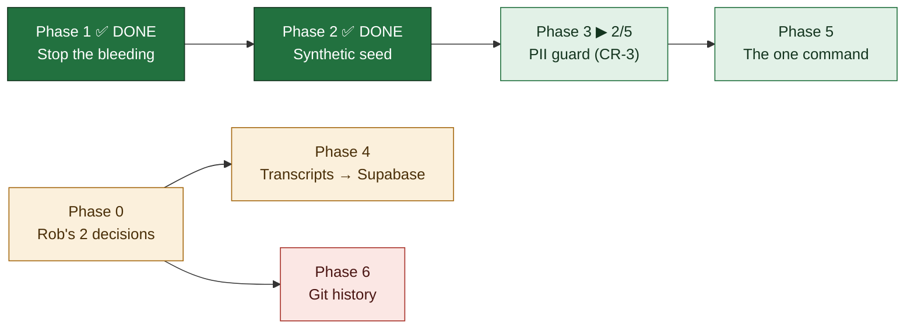

# PRD — Scaffolding in Git, Data in Supabase

**Version:** 1.10 · **Created:** 2026-07-29 · **Updated:** 2026-07-29
**Status:** IN PROGRESS — Phases 1–2 complete, Phase 3 at 2 of 4 (Tier A + Tier B shipped; allowlist + `npm run guard:pii` left). **Tier B's first run found 10 real contacts still committed in test fixtures — a NEW Phase 3 item, added below.** · **Owner:** Rob + Max · **Project:** MLE ROB Dashboard · **Type:** technical

---

## Goal

Clone the repo and nothing sensitive leaks. Run one command and get a fully working dashboard on synthetic data. Point it at Supabase and get the real thing in seconds.

## Why this exists

Rob, 2026-07-29: *"Wouldn't there be a way to have any people or company or financial or anything at all empty and just the scaffolding in the GitHub. Can it all get populated from Supabase in a few seconds?"*

He was right, and the audit that followed found the problem is **larger than the transcripts that prompted it** — 16 tracked files carrying real contacts and deal values, one committed the same day, and a script that actively refills them.

---

## The finding that reorders everything

`scripts/regen-fallback.mjs` reads **live Supabase** and writes `data/network.json`, which is **committed** and is what `fileStore.ts` serves in CI.

**The repo contains a pump pointing real customer data into git.** Deleting the artifacts without re-pointing that pump means they come back on the next run. This is why Phase 1 must precede Phase 2 — a synthetic seed landing first gets silently overwritten with real rows and re-committed.

---

## Status

---

## Scope

**IN**
- Untracking every file that carries real contacts, phones, or deal values
- Re-pointing the fallback pump so it can never re-commit real data
- A deterministic synthetic seed that makes a fresh clone *work*, not just build
- A code-enforced guard that fails the suite before real PII can be committed
- Loading the 13 Fireflies transcripts into the existing `0021` tables

**OUT**
- Rewriting git history on the existing repo (Phase 6 — gated, and the recommendation is *don't*)
- The `~/Projects/MyLocalEverything/contracts` repo — separate repo, needs its own pass
- Re-opening the dashboard auth decision (Rob closed it 2026-07-27; prod stays open)

---

## Verified inventory — tracked files holding real data

| File | What's in it | Action |
|---|---|---|
| `data/network.json` | 26 phones, 22 emails incl. Rob's family | Replace with synthetic |
| `backups/0031-preapply-2026-07-29/*.json` (8 files) | 13 phones, 14 emails, `quoted_amount` 19000/10000/7000 — **committed today** | Untrack |
| `backups/pre-0003-*-2026-07-21.json` (4 files) | 14 phones, 9 emails, 5 quoted amounts | Untrack |
| `docs/backups/*-2026-07-17.json` (4 files) | 58 records, quoted amounts | Untrack |
| `MLE Internal Meetings/manifest.json` | **12 real participant emails** — my "metadata only, no speech" claim last night was wrong | Regenerate without emails |
| `docs/research/ENRICHMENT-GAP-AUDIT-2026-07-17.md` | 22 real contacts in prose | Redact |
| `BUILD-QUEUE.md`, `docs/plans/PRD-mle-crm.md` | One real phone, propagated across 3 files | Redact |
| **this PRD** | **4 phones + a family gmail address** — quoted while *documenting* the leaks. Inventory correction, 2026-07-29 inc.4: the count above was low and this file was missing from its own list. | Redacted |

Test fixtures using invented domains (`roofco.com`, `proplogix.com`, ~15 files) are **left alone** — a guard that flags all 57 files gets disabled within a day.

---

## Phase 0 — Rob only

- [ ] [Rob] **Is this repo going public, or do you just want a clean tree?** Private + 0 forks today. If it stays private, Phases 1–5 are sufficient and history stays as-is. | DoD: one-word answer logged below.
- [ ] [Rob] **May the 13 transcripts load into prod Supabase?** Verified safe despite the open dashboard: the only public route validates against `/^RE[0-9a-fA-F]{32}$/`, so a `fireflies-…` key is structurally unreachable, and `0021` has RLS on with zero policies. Two independent barriers. Not re-raising the auth decision — just need a go. | DoD: yes/no.

## Phase 1 — Stop the bleeding *(tonight, fully reversible)*

- [x] [Max] Add `backups/`, `docs/backups/`, `data/network.local.json`, `data/crm.json` to `.gitignore` | DoD: `git check-ignore backups/0031-preapply-2026-07-29/people.json` exits 0 — **DONE 2026-07-29 inc.1, exit 0 verified**
- [x] [Max] `git rm -r --cached backups docs/backups` (16 files, stay on disk) | DoD: `git ls-files | grep -c backups` = 0 — **DONE 2026-07-29 inc.1: index count 0, all 12 files (8 + 4) still on disk. Checked first that nothing reads these paths — the only `backups/` in code is `regen-fallback.mjs:103`, the Supabase Storage *bucket*, not the local dir.**
- [x] [Max] **Re-point the pump** — `regen-fallback.mjs` target → `data/network.local.json` | DoD: running it leaves `git status` clean — **DONE 2026-07-29 inc.2, proven against LIVE Supabase: the run reported `41 people, 47 edges, 8 verticals, 12 projects` and `git status --porcelain` showed only the three source files of this increment — zero data files. Before this change that same run dirtied the tracked `data/network.json`.**
- [x] [Max] Teach `fileStore.ts` to prefer `network.local.json` when present, resolved per-call | DoD: new test asserts local-wins and synthetic-fallback; 187 existing test files green — **DONE 2026-07-29 inc.2: `lib/storage/__tests__/fileStoreNetworkOverlay.test.ts`, 5 tests (fallback-when-absent, local-wins, per-call re-resolution both directions, write-lands-in-overlay-and-committed-file-is-byte-identical, corrupt-overlay-fails-loud). 189/189 files, 2901/2901 tests, build green.**
- [x] [Max] De-PII the manifest — `participants` → `participantCount` + domains only | DoD: 0 email matches; 13 meetings still identifiable by title/date/link — **DONE 2026-07-29 inc.3.** `scripts/manifest-privacy.mjs` (pure `redactAttendees`/`redactMeeting`/`redactManifest` + a no-network CLI); the committed manifest now greps **0** for any address-shaped string (broad regex, not just the 12 known), all 13 meetings keep title/date/duration/keywords/Fireflies link, and `organizer` became `organizerDomain`. **`fireflies-ingest.mjs` now shapes attendees at the point of creation**, so a future pull cannot re-introduce emails by re-running the ingest. 10 new tests in `lib/__tests__/manifestPrivacy.test.ts`, three of which assert against the real committed file. Idempotent both ways (second CLI run = no-op; `redactManifest(manifest)` deep-equals the file).
- [x] [Max] Redact the 3 prose leaks | DoD: Tier-B guard passes on all three — **DONE 2026-07-29 inc.4.** `scripts/prose-redact.mjs` (pure `redactProse`/`isRedactableEmail`/`isRedactablePhone` + a no-network CLI) rewrote all three: `ENRICHMENT-GAP-AUDIT-2026-07-17.md` 9 emails + 14 phones, `PRD-mle-crm.md` 4 + 4, `BUILD-QUEUE.md` 4 + 7 — **17 mailboxes and 25 numbers, against the 22-contact estimate in the inventory above.** The prose rule is narrower than Tier A's whitelist by necessity: the *mailbox* goes, the *organisation* stays (`<name>@omegatitlegroup.com` → `[email redacted @omegatitlegroup.com]`), so the record of the enrichment work survives its own redaction. Rob's own `aivoicetech.io` and the invented fixture domains (`roofco.com`, `proplogix.com`, …) are allowlisted — redacting them would break tests for zero privacy gain. Idempotent (second CLI run: "clean — no change" on all three). 17 tests in `lib/__tests__/proseRedact.test.ts`, six of them asserting against the real committed files **with a broader regex than the redactor's own**, so the DoD is not graded by the matcher that produced it. Tier B (Phase 3) inherits `isRedactablePhone`/`isRedactableEmail` rather than restating them.
- [x] [Max] Confirm the 110 `ARCHITECTURE-ATLAS.html` hits are SVG coordinates | DoD: 5 sampled, each inside `d=` or `viewBox` — **DONE 2026-07-29 inc.4, and the answer is yes — but the check found a live trap first.** Sampling showed the frequent hits are path data (`[phone redacted]` ×18, `[phone redacted]` ×12, `[phone redacted]` ×14) and `viewBox` geometry. The trap: `viewBox="0 0 2663.84375 634.171875"` contains a substring straddling the two numbers (width's last 3 digits, space, height's first 3, decimal, 4 more) which is phone-**shaped**, NANP-**valid**, and a coordinate — the first draft of the redactor would have silently rewritten the Atlas. Fixed by construction, not by exception list: a phone may not sit flush against a digit or a decimal point (`(?<![\d.])`/`(?![\d.])`), and markup is matched on formatted numbers only. **Pinned by test** — `redactProse(ATLAS)` must return byte-identical text with 0 emails and 0 phones — so this conclusion is re-proven on every run instead of resting on tonight's eyeballs.

## Phase 2 — Synthetic seed *(tonight)*

Reuses the repo's own convention — 6 existing `demo-` rows use RFC 2606 `@example.com` and the reserved 555-01XX block. Those are the nucleus; the generator extends them.

- [x] [Max] `scripts/seed-synthetic.mjs` — seeded PRNG, no `Date.now()`, no network, emits full `NetworkData` + `__synthetic: true` | DoD: two runs byte-identical (`cmp` exits 0) — **DONE 2026-07-29 inc.5, `cmp` exit 0 proven on two real CLI runs.** mulberry32 over an FNV-1a hash of a pinned `SEED` string; every date derives from `BASE_DATE`, never a clock. **Safety is structural, not reviewed:** every address is RFC 2606 `@example.com` and every number is `+1 (555) 555-01NN` — inside the reserved `555-01XX` line range *and* behind the non-assignable `555` area code, so it satisfies both conventions (the six pre-existing `demo-` rows used `+1 (555) 010-XXXX`, area-code-safe but outside the reserved line range; Tier A will accept both so those rows keep passing). Ids mirror the Q70 record-number convention (`P-1001…`/`C-2001…`) with `legacySlug` on every row, so slug URLs resolve in demo mode exactly as on prod. Cardinality mirrors the real ledger (22 people / 19 orgs / 47 edges / 12 projects) so the demo exercises the same layouts. 17 tests in `lib/__tests__/seedSynthetic.test.ts`, **graded by regexes broader than the generator's own rules** — plus dangling-edge, unique-id, vertical-resolves and no-signed-date-without-signed structural checks, and a source scan proving no `Date.now(`/`fetch(` survives comment-stripping. `NetworkData` gained `__synthetic?: boolean`.
- [x] [Max] Generate and commit the new `data/network.json` | DoD: `STORAGE_SOURCE=file npm run build` + vitest green; dashboard populated, zero real names — **DONE 2026-07-29 inc.6.** The committed fallback is now generator output: **0 non-`example.com` addresses, 0 phones outside the reserved `555-01XX` block, 0 hits for any real name** (Acheson / Caleb / Trent / Stavros / HomeClone / Gulf / PropLogix / Omega, all counted at 0). `STORAGE_SOURCE=file npm run build` exit **0**; **2949/2949 vitest**. **The swap exposed a real generator defect, and fixing the generator was the right end of it:** the seed emitted **zero `referredById`**, so demo mode rendered a referral dashboard in which nothing referred anything and every row read as its own root — the seed satisfied "populated" while failing "working". The generator now emits the live ledger's attribution shape exactly (**32 of 41 attributed**, 9 roots = origin + 6 unattributed people + 2 unattributed orgs), parents drawn only from the rooted set so `broken_root` is impossible by construction, deepest chain 4 hops so multi-hop breadcrumbs are exercised rather than merely possible. **Two lineage tests were pinned to the real venture ids `spinoff-homeclonevault`/`spinoff-caleb-crm`** — keeping them green would have meant emitting real names *from the privacy generator*, so the test was re-pointed onto the property it actually guards ("no referrer recorded reads `unattributed`, never broken") over every such row in whichever ledger is committed, with a non-vacuity assertion so an all-attributed ledger can't silently skip the branch. Determinism survived the change: two fresh runs `cmp` exit **0**, and the committed file is byte-identical to a third. **No deploy, and the reason is verified rather than assumed:** prod is `STORAGE_SOURCE=supabase` (env read) and `/people` was curled live returning **200 with real rows**, so this file is prod's *fallback*, not its source — nothing user-visible changed. Recorded side effect: if Supabase ever fails, prod's fallback now renders `__synthetic` demo rows instead of a stale real snapshot — louder and safer, but a behavior change, so it is written down rather than discovered later.
- [x] [Max] Drift guard — vitest regenerates in-memory and asserts the committed file matches | DoD: a hand-edit fails with "run `node scripts/seed-synthetic.mjs`" — **DONE 2026-07-29 inc.7.** `describeSeedDrift(text, seed)` in the generator (pure, takes TEXT not a path per CR-3) returns `null` when clean, else the **first divergent line** + the regen command — a raw byte-diff of a 41-record file is thousands of lines of noise, and a guard nobody can act on gets deleted rather than obeyed. `lib/__tests__/networkSeedDrift.test.ts` = 8 tests, **4 of them failure-injection** (one-char edit, pasted row, whitespace-only reformat that is semantically identical and still drift, and a phone-line edit whose reported line number is asserted exactly) — a guard asserted only against a passing file proves only that it can say yes. Each injection first asserts the mutation actually landed, so no test is vacuous. The same function backs a `--check` CLI mode (`node scripts/seed-synthetic.mjs --check [path]`, exit 1 with the message) so the guard is runnable outside vitest; **both exit codes exercised live** (clean → 0, mutated copy → 1). The message names no path — it is handed text, and one that said `data/network.json` while checking something else would be a guard that lies about where the problem is; the CLI prefixes the real path. 193/193 files, 2957/2957 tests, `STORAGE_SOURCE=file npm run build` exit 0.
- [x] [Max] Demo banner driven off `__synthetic` | DoD: shows on `npm run dev:demo`, absent on Supabase — **DONE 2026-07-29 inc.8, both halves curled live.** `lib/ui/dataDisclosure.ts` holds the decision as a pure function (CR-3) over the **two independent facts** — `mode` (where the rows came from) and `synthetic` (what they are) — and `components/FallbackBanner.tsx` renders only what it returns. The pair that only exists because of inc.6's swap gets its own loudest wording: **Supabase down *and* the fallback generated** now renders an `alarm` banner ("DEMO DATA — NOT YOUR RECORDS … do not read or act on anything on this screen") instead of the old amber outage line, which is the safety net for the side effect inc.6 recorded rather than merely noted. The `__synthetic` read sits **behind** the mode check, so live Supabase does zero extra I/O for a banner it never shows, and an unreadable file degrades to the mode-only disclosure rather than taking the page down. 7 tests in `lib/__tests__/dataDisclosure.test.ts` over the full 6-row truth table, incl. a property assertion that generated rows can never be described without a word that says so. `dev:demo` + `seed:synthetic` npm scripts added (Phase 5 stays open — `seed:local` and the README rewrite are still owed).
- [x] [Max] Emit `data/crm.json` too — deals/activities/tasks are empty in file mode today | DoD: demo dashboard shows a populated CRM, not an empty one — **DONE 2026-07-29 inc.9, and the DoD was proven by CONTRAST rather than by a screenshot of a full page.** The same dev server was curled twice: with `data/crm.json` present `/deals` renders **16** synthetic deals (`D-30xx` ×16, stages spanning `new_lead`→`paid` plus both terminal states, `data-tone="demo"`, **0** hits for Acheson/Stavros/HomeClone/PropLogix/Caleb/Trent); with the file moved aside, **0**. That second number is the bug this item existed to fix — an empty pipeline is not a neutral default, it is indistinguishable from a broken adapter, which is the one thing a demo must never be ambiguous about. `buildCrm()` runs on its **own rng stream** (`${SEED}/crm`) so adding a deal can never renumber a person, and every anchor is drawn from the SAME run's `buildNetwork()` — the two files cannot disagree about who exists. **The CRM half needed the network half's seam, and it was not there:** `data/crm.json` was gitignored (Phase 1 inc.1, because it held real rows), so committing generated scaffolding required the identical two-file split — committed `crm.json` + gitignored `crm.local.json`, overlay wins on read, **every write lands in the overlay**, corrupt overlay fails loud. **That seam broke three existing tests, and the breakage was the useful part:** they reset and read back at "the crm file", which after the split is no longer where writes land — silent cross-test state leakage. Fixed by **exporting `localCrmPath()`** so callers ask the store where a write goes instead of re-deriving the `.local.json` rule in a second place that can drift. 26 new tests (`seedSyntheticCrm.test.ts` 20 + `fileStoreCrmOverlay.test.ts` 6), graded by regexes broader than the generator's own, incl. drift failure-injection, no-dangling-reference checks, an activity-anchor-matches-its-deal check, and monotonic money dates (never `paid` without `signed`). **196/196 files, 2990/2990 tests**, `STORAGE_SOURCE=file npm run build` exit 0. **No deploy — prod is `STORAGE_SOURCE=supabase`, so this file is its fallback, not its source**, and `git status` after regeneration showed `data/network.json` unchanged.

## Phase 3 — The guard *(tonight, CR-3)*

Rides the existing `.githooks/pre-push` + CI vitest step — **a new test file is enforced at both gates with zero new wiring.** Gitleaks rejected: tuned for credential entropy, would sail past `[email redacted @gmail.com]`, and `scripts/secrets-sweep.mjs` already covers credentials.

- [x] [Max] **Tier A — structural whitelist** on `data/*.json` + manifest: every email a reserved domain, every phone 555-01XX, `__synthetic` present | DoD: pasting one real email fails the suite. Zero false positives by construction. — **DONE 2026-07-29 inc.10.** `scripts/pii-guard-structural.mjs` (pure `scanStructural(text, {profile})` per CR-3 — text in, findings out, no path/clock/network — plus a no-key CLI). **"Zero false positives by construction" is met by PARSING, not by a better regex:** the scanner walks leaf **string** values of the parsed JSON, so record ids, money and SVG coordinates are numbers and therefore unreachable — not excluded by an exception list somebody has to maintain. **Two profiles, because the two files make different promises:** `data` requires RFC 2606 addresses + the non-assignable **555 area code** + `__synthetic: true`; `manifest` requires **zero addresses of any kind** (Phase 1 item 5's promise was domains-only, so even `@example.com` there would mean an attendee field came back). The phone rule is the area code, not the current generator's `555-01NN` line range — it accepts the older `demo-` rows' `+1 (555) 010-XXXX` too, because a Tier A pinned to today's generator tests the generator rather than the safety property. **Deliberately STRICTER than the prose redactor:** `rob@aivoicetech.io` and the invented fixture domains pass `isRedactableEmail` (a doc must stay readable) and **fail** Tier A (a data file has no such excuse) — asserted as a test, not left implicit. Unknown paths default to the **stricter** profile. 22 tests in `lib/__tests__/piiGuardStructural.test.ts`, **7 of them failure-injection** (real email, real phone, unformatted number under a `phone` key, `__synthetic` dropped, reserved address in the manifest, unparseable JSON) — each first asserting the mutation landed, which is how the first draft's wrong anchor string got caught instead of silently passing. Counts are reported so "scanned nothing" is distinguishable from "scanned 919 strings and passed". Live on the real files: **919/650/141 strings, 0 findings, exit 0**; a mutated copy exits **1** with `file:line` + the JSON path. 197/197 files, **3012/3012 tests**, `STORAGE_SOURCE=file npm run build` exit 0.
- [x] [Max] **Tier B — hashed denylist** across all tracked files: SHA-256 of ~35 real emails + ~30 phones, each with a human label | DoD: re-pasting the known phone fails; all 15 fixture files and the Atlas pass untouched — **DONE 2026-07-29 inc.11, and the DoD split in two: the guard half passed, the fixture half FAILED and that failure is the finding.** `scripts/pii-guard-denylist.mjs` — pure `scanDenylist(text, {denylist})` per CR-3 (text in, findings out; no path, no clock, no network) + a no-key CLI with a `--build` mode. `security/pii-denylist.json` holds **14 emails + 17 phones** as salted SHA-256 with domain-only / area-code-only labels: the ORGANISATION survives into git, the INDIVIDUAL does not, which is the same rule Phase 1's prose redactor set. **Numbers are normalized to 10 digits before hashing**, so the parenthesised, dotted and `+1`-prefixed spellings of one number collapse to one secret — a re-paste in a different format still fires, which is the likeliest way a redacted number comes back. **The build inherits `isRedactableEmail`/`isRedactablePhone` from the prose redactor rather than restating them, and that is load-bearing:** the first build didn't, denied `rob@aivoicetech.io`, and produced **29 findings against Rob's own published sender address in production code** (`lib/esign/sender.ts`, `lib/n8nEmail.ts`) — findings clearable only by deleting working code, which is how a guard gets switched off instead of obeyed. **The stated limitation is stated in the code, not just the PRD:** the header says plainly that a 10-digit number is a 10^10 space, that the committed salt defeats rainbow tables and nothing else, and that this is not confidentiality — a guard that oversells its protection is how the next leak gets committed believing it was safe. 20 tests in `lib/__tests__/piiGuardDenylist.test.ts`, all fixtures **invented** so the suite can't become the thing it guards, incl. the Atlas byte-pass, both data files, the SVG-coordinate trap, format-variant matching, empty-denylist non-vacuity, rebuild byte-stability, and an assertion that no committed label contains its own secret. **198/198 files, 3032/3032 tests**, `STORAGE_SOURCE=file npm run build` exit 0. No deploy — no user-visible surface changed.
- [ ] [Max] **De-PII the 10 fixture re-pastes Tier B found** *(new item, 2026-07-29 inc.11 — the PRD assumed the fixture files were clean and they are not)*: `lib/__tests__/proseRedact.test.ts` (5), `lib/__tests__/piiGuardStructural.test.ts` (2), `lib/__tests__/aidreCall.test.ts` (1), and the doc comment at the top of `scripts/prose-redact.mjs` itself (2) all quote real contacts as test input. Flagged to the ledger (high). | DoD: `node scripts/pii-guard-denylist.mjs` exits 0 over all tracked files, with the redaction tests still asserting on real-shaped invented contacts rather than being weakened
- [ ] [Max] Allowlist pinned to the **hash of the finding, not the file** — change the file and the exception expires | DoD: an allowlisted finding re-fires after the line is edited
- [ ] [Max] `npm run guard:pii` | DoD: exits 0 clean, 1 with `file:line` + label + the two fix commands

> **Stated limitation:** SHA-256 of a 10-digit phone is enumerable in seconds. The denylist avoids re-publishing PII in cleartext inside the guard itself — obfuscation, not encryption. If the repo goes public, drop the denylist from the public mirror and run Tier B only in private CI.

## Phase 4 — 13 transcripts → `0021` *(blocked on Rob)*

`0021` is **not** empty scaffolding — `transcriptDb.ts`, `transcriptStore.ts`, `transcriptSegments.ts` and 7 test files already exist. Reuse `persistTranscript()`; write no SQL.

- [ ] [Max] `lib/calls/firefliesMapping.ts` — pure, no I/O. Five load-bearing decisions: derived key `fireflies-${id}` (never collides with a Twilio `RE…` sid, and rejected by the public validator); `status: "complete"` with `error` omitted per the `0021` CHECK; `startMs = round(start_time * 1000)` because Fireflies gives float seconds; `confidence` omitted because Fireflies supplies none and defaulting to 1 asserts certainty we weren't given; `durationMs` derived from `max(end_time)`, not `t.duration` — verified ambiguous (`duration: 5` on a file ending at 166.95s) | DoD: unit tests for all five, no network
- [ ] [Max] `scripts/transcripts-to-supabase.mjs` | DoD: 13 transcripts, 4,451 segments; `count(*)` = 4451
- [ ] [Max] Prove idempotency — run twice | DoD: identical counts, no 23505
- [ ] [Max] `--verify` mode comparing disk sentence counts to DB segment counts | DoD: reports `13/13 match`

Flat files **stay** — gitignored, on disk, as the re-ingest cache. Supabase becomes system of record; disk stays the recovery path.

## Phase 5 — The one command *(tonight)*

- [ ] [Max] Add `dev:demo`, `seed:local`, `seed:synthetic` scripts | DoD: all three run from a clean clone
- [ ] [Max] Rewrite README quickstart to exactly three paths | DoD: `git clone && npm i && npm run dev:demo` → populated dashboard, zero network calls, zero secrets
- [ ] [Max] Add `FIREFLIES_API_KEY` to `.env.example` (missing though a script needs it) | DoD: every env var any script reads is listed

## Phase 6 — Git history *(irreversible, gated)*

**Recommendation: do not rewrite. Keep this repo private with history intact. If you want public, publish a *new* repo from a single squashed orphan commit.**

You cannot rotate a customer's phone number — so "leave and rotate" isn't available, and if this ever goes public, rewrite is the only remediation. But `filter-repo` rewrites all 455 commits, changes every SHA, permanently diverges the stale Desktop clone, breaks 3 dependabot branches, needs a force-push to main — and GitHub still retains unreferenced objects reachable by direct SHA until you delete the repo anyway. **You accept all the risk and still don't get a clean guarantee.** An orphan commit gets one clean commit by construction, with none of that.

- [ ] [Rob] Decide: private (stop at Phase 5) or public
- [ ] [Max] *If public:* orphan-commit mirror, denylist dropped, guard run before first push | DoD: `git log --oneline` = 1 commit; guard exits 0
- [ ] [Max] *If public:* warning `CLAUDE.md` naming the private repo canonical; both added to `~/.claude/rules/canonical-repos.md`

> **Do not** run `filter-repo` on `blacklabelbob/mle-rob-dashboard` without written go from Rob and a full `git clone --mirror` backup.

---

## Open questions

| # | Question | Owner | Due |
|---|---|---|---|
| 1 | Public or private? Gates Phase 6 entirely. | Rob | 2026-07-30 |
| 2 | Transcripts into prod Supabase — go? | Rob | 2026-07-30 |
| 3 | ~~Rob raised Vercel/other templates — does a Supabase starter already ship the seed + demo-mode pattern?~~ **ANSWERED 2026-07-29 inc.5 — no, and it can't.** See the decisions log row below. | Max | ✅ closed |

## Decisions log

| Date | Decision | Why |
|---|---|---|
| 2026-07-29 | Transcript bodies gitignored, manifest committed | Git history is permanent; encrypted-in-git still leaks retroactively if a key leaks |
| 2026-07-29 | Guard is vitest, not gitleaks | Gitleaks targets credential entropy; the risk here is plain email addresses |
| 2026-07-29 | Orphan mirror over `filter-repo` | Same outcome, none of the SHA churn or missed-blob risk |
| 2026-07-29 | Tier B's denylist build reuses the prose redactor's allowlist instead of its own | The two guards answer different questions but share one definition of "whose PII is this". Restating it gave a denylist that denied `rob@aivoicetech.io` — 29 findings against the repo's own production sender address. One definition, one place. |
| 2026-07-29 | Denylist labels carry the domain / area code, never the individual | The denylist is committed. A label like "Jane Doe — mobile" would make the guard file the plaintext contact list it exists to replace, while the domain alone is enough for Rob to recognise which contact a finding is about. |
| 2026-07-29 | Hand-rolled seed generator over a Supabase starter or a faker dependency (closes OQ 3) | The DoD is `git clone && npm i && npm run dev:demo` with **zero network calls**. Supabase's seeding convention is `supabase/seed.sql` applied by `supabase db reset` — it needs Docker and a local Postgres, so it structurally cannot satisfy a file-mode, network-free boot; it seeds the *database*, and what needs seeding here is the committed JSON the file store reads when there is no database. A faker-style dependency was rejected on two counts: its values would still have to be forced into the reserved `@example.com` / `555-01XX` blocks (so the constraint that actually matters stays hand-written either way), and byte-identical output across versions is a promise from a third party rather than a property of our own 30-line PRNG — and byte-identity is the drift guard's whole contract. |

## Revision history

| Version | Date | Change |
|---|---|---|
| 1.11 | 2026-07-29 | **Phase 3 item 2 shipped — Tier B, the hashed denylist, covers all 701 tracked files, and its first run found 10 real contacts still committed.** `scripts/pii-guard-denylist.mjs` + `security/pii-denylist.json` (14 emails + 17 phones, salted SHA-256, domain-only / area-code-only labels). Phones normalize to 10 digits before hashing so a reformatted re-paste still fires. **The build inherits `isRedactableEmail`/`isRedactablePhone` from the prose redactor** — the version that didn't produced 29 findings against `rob@aivoicetech.io` in production code, i.e. a guard nobody could clear without deleting working code. The hashing's limits are documented in the script header, not just here: this is obfuscation, not confidentiality. **DoD half-met, honestly:** the guard fires correctly and the Atlas + both generated data files pass untouched, but the fixture files do NOT pass — `proseRedact.test.ts`, `piiGuardStructural.test.ts`, `aidreCall.test.ts` and `prose-redact.mjs`'s own doc comment quote real contacts as test input. That is a new Phase 3 item (flagged to the ledger, high), not a guard defect. A second finding also went to the ledger: `proplogix.com` is allowlisted as an "invented fixture domain" and is a real company. 20 new tests, all fixtures invented; **198/198 files, 3032/3032 tests**, build exit 0. No deploy. |
| 1.10 | 2026-07-29 | **Phase 3 item 1 shipped — Tier A, the structural whitelist, is live and graded by failure injection.** `scripts/pii-guard-structural.mjs` walks leaf **string** values of the parsed JSON rather than regexing text, which is how "zero false positives by construction" is actually met: record ids, money and SVG coordinates are numbers and so are unreachable by the scanner, rather than being excluded by an exception list. Two profiles — `data` (RFC 2606 addresses + non-assignable **555 area code** + `__synthetic: true`) and `manifest` (**zero** addresses of any kind, because Phase 1 item 5's promise was domains-only). The phone rule keys on the area code, not the current generator's line range, so it accepts the older `demo-` rows and tests safety rather than testing the generator. **Tier A is deliberately stricter than the prose redactor** — `rob@aivoicetech.io` passes there and fails here — and that gap is asserted as a test. 22 tests, 7 failure-injection, each first asserting its mutation landed; that assertion caught the first draft's wrong anchor string instead of letting it pass vacuously. Live: 919/650/141 strings scanned, 0 findings, exit 0; mutated copy exits 1 with `file:line`. 197/197 files, **3012/3012 tests**, `STORAGE_SOURCE=file npm run build` exit 0. No deploy — no user-visible surface changed. |
| 1.9 | 2026-07-29 | **PHASE 2 IS COMPLETE — item 5 shipped: the demo CRM is populated.** `buildCrm()` emits 16 deals / 34 activities / 14 tasks from its own rng stream off the same seed, every anchor drawn from the same run's network so the two files cannot disagree about who exists. **Proven by contrast on a live dev server:** `/deals` renders 16 synthetic deals with `data-tone="demo"` and 0 real names; with `crm.json` moved aside, 0 — and 0 was the state every fresh clone was in, which reads as a broken adapter rather than as a neutral default. Committing generated CRM scaffolding required the network file's two-file seam (`crm.json` committed + gitignored `crm.local.json`, overlay wins, all writes land in the overlay, corrupt overlay fails loud). **The seam broke three existing tests, and that was the finding, not the cost:** they reset/read back at "the crm file", which is no longer where writes land — silent cross-test state leakage. Fixed by exporting `localCrmPath()` so nothing re-derives the rule. 26 new tests; **196/196 files, 2990/2990 tests**, `STORAGE_SOURCE=file npm run build` exit 0. No deploy — prod is `STORAGE_SOURCE=supabase`, so this is its fallback, not its source. **Phase 3 (the PII guard) is next and is what Q71's tick actually waits on.** |
| 1.8 | 2026-07-29 | **Phase 2 item 4 shipped — the dashboard now says out loud when its numbers are invented.** `dataDisclosure(mode, synthetic)` is a pure 2×3 truth table (`lib/ui/dataDisclosure.ts`); `FallbackBanner` renders it and nothing else. **The state worth building this for is the one inc.6 created:** Supabase unreachable *and* the fallback synthetic now shows a red `alarm` — "NOT YOUR RECORDS … do not read or act on anything on this screen" — where before it showed the same calm amber line it shows for a real snapshot. **Both DoD halves curled live, not asserted:** demo dir → `data-tone="demo"` + 0 hits for any real name on `/people`; `STORAGE_SOURCE=supabase` → **0** banner elements and real rows served. A third result worth recording: `npm run dev:demo` on **this** machine renders `warn`, not `demo`, because the gitignored `network.local.json` overlay wins — the demo command serves real rows to a dev who has pulled them, and the banner tells the truth about it. That is correct behaviour, and it is exactly why the banner reads the data rather than the env var. 194/194 files, **2964/2964 tests**, `STORAGE_SOURCE=file npm run build` exit 0. Deployed: prod's outage path is a user-visible surface and it changed. |
| 1.7 | 2026-07-29 | **Phase 2 item 3 shipped — the committed seed can no longer be hand-edited without the suite saying so.** `describeSeedDrift()` (pure, text-in) + `lib/__tests__/networkSeedDrift.test.ts` (8 tests, 4 failure-injection incl. a whitespace-only reformat that is semantically identical and still drift) + a `--check` CLI mode with both exit codes exercised live. Phase 2 now owes 2 items: the `__synthetic` demo banner and `data/crm.json`. 193/193 files, 2957/2957 tests, build exit 0. No deploy — no user-visible surface changed. |
| 1.6 | 2026-07-29 | **Phase 2 item 2 shipped — the committed ledger is synthetic, and the swap caught the generator lying about "populated".** `data/network.json` is now generator output: 0 real names, 0 addresses outside `example.com`, 0 numbers outside the reserved `555-01XX` block; `STORAGE_SOURCE=file npm run build` exit 0, **2949/2949 tests**. The seed had emitted **zero `referredById`**, so a demo of a *referral network* would have shown no referrals and 41 self-rooted nodes — populated but not working. The generator now reproduces the live attribution shape exactly (32 of 41 attributed, 9 roots, parents only from the rooted set so `broken_root` is structurally impossible, deepest chain 4 hops). **Two lineage tests were pinned to the real venture ids `spinoff-homeclonevault`/`spinoff-caleb-crm`**; keeping them green would have meant emitting real names from the privacy generator, so they were re-pointed onto the property they actually guard, with a non-vacuity assertion. Determinism survived (`cmp` exit 0 across two fresh runs; committed file byte-identical to a third). **No deploy — verified, not assumed:** prod is `STORAGE_SOURCE=supabase` and `/people` returned 200 with real rows, so this file is prod's fallback, not its source. Side effect recorded: a Supabase outage now falls back to `__synthetic` demo rows rather than a stale real snapshot. |
| 1.5 | 2026-07-29 | **Phase 2 item 1 shipped — the generator exists and is provably deterministic.** `scripts/seed-synthetic.mjs` emits a full `NetworkData` + `__synthetic: true` from a pinned seed with no clock and no network; two CLI runs are byte-identical (`cmp` exit 0). Reserved-block addresses and numbers are enforced by construction and graded by broader regexes than the generator's own. **OQ 3 is closed with a reason, not a shrug:** `supabase db seed` needs Docker + Postgres and so cannot satisfy a network-free file-mode boot, and a faker dependency would leave the reserved-block constraint hand-written anyway while making byte-identity someone else's promise. 17 new tests; **192/192 files, 2947/2947 tests, build exit 0.** No deploy — the committed `data/network.json` is untouched this increment, so prod's read path is unchanged; **it still carries 26 phones / 22 emails and is still tracked.** That swap is item 2, deliberately its own increment because it is the first change with a user-visible blast radius. |
| 1.4 | 2026-07-29 | **PHASE 1 IS COMPLETE — items 6–7 shipped, the bleeding is stopped.** `scripts/prose-redact.mjs` redacted 17 mailboxes and 25 phone numbers out of the three prose leaks, keeping the organisation and dropping the individual so the docs still read as a record of the work. The Atlas check answered yes (the 110 hits are path data and `viewBox` geometry) **and caught a live trap on the way**: `2663.84375 634.171875` yields the phone-shaped, NANP-valid coordinate `[phone redacted]`, which the first draft would have rewritten — now impossible by construction and pinned by a byte-identity test. 17 new tests; 191/191 files, 2928/2928, build exit 0. **Phase 2 is next and is now unblocked** — `data/network.json` (26 phones / 22 emails) is the last tracked file holding real data, and Q71 stays unticked until `npm run guard:pii` exits 0 on a clean clone. |
| 1.3 | 2026-07-29 | **Phase 1 item 5 shipped — the manifest is de-PII'd at rest AND at the source.** `scripts/manifest-privacy.mjs` holds the pure shaping (`redactAttendees`) and doubles as a no-network CLI; `fireflies-ingest.mjs` imports the same function, so the fix survives the next pull instead of being undone by it. Committed manifest greps **0** address-shaped strings; all 13 meetings still identifiable. Phase 1 now has **2 items left** (prose redaction + the Atlas false-positive check). |
| 1.0 | 2026-07-29 | Initial PRD — from the engineering audit that found the `regen-fallback` pump and 16 unlisted files |
| 1.2 | 2026-07-29 | **Phase 1 items 3–4 shipped together — the pump is off git.** `regen-fallback.mjs` now writes the gitignored `data/network.local.json`; `fileStore.ts` prefers that overlay per-call and falls back to the committed `network.json`, and **all writes land in the overlay**, so the committed file can never be mutated back into a PII carrier. Proven live, not asserted. **Side effect recorded honestly:** the MC.16 restore path no longer bundles into a deploy as a side effect of a commit — restoring prod is now a deliberate act, documented in the script header. `data/network.json` still carries 26 phones / 22 emails and is still tracked — Phase 2 replaces it. |
| 1.1 | 2026-07-29 | Phase 1 items 1–2 shipped (gitignore + untrack, both DoDs proven). PRD adopted into BUILD-QUEUE as **Q71** — it had been sitting untracked in the working tree from a cut-off run. Every inventory claim above was re-verified against the repo before acting rather than trusted from the document. |
