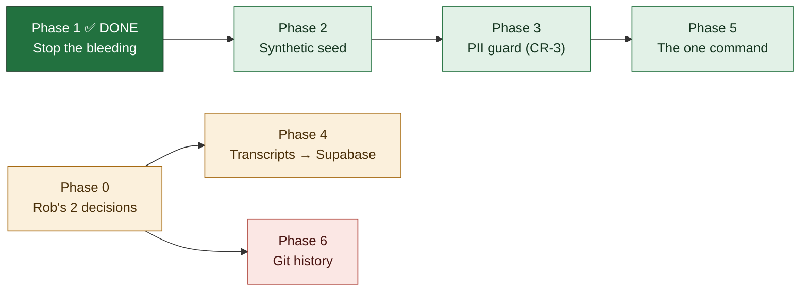

# PRD — Scaffolding in Git, Data in Supabase

**Version:** 1.4 · **Created:** 2026-07-29 · **Updated:** 2026-07-29
**Status:** IN PROGRESS — Phase 1 complete, Phase 2 next · **Owner:** Rob + Max · **Project:** MLE ROB Dashboard · **Type:** technical

---

## Goal

Clone the repo and nothing sensitive leaks. Run one command and get a fully working dashboard on synthetic data. Point it at Supabase and get the real thing in seconds.

## Why this exists

Rob, 2026-07-29: *"Wouldn't there be a way to have any people or company or financial or anything at all empty and just the scaffolding in the GitHub. Can it all get populated from Supabase in a few seconds?"*

He was right, and the audit that followed found the problem is **larger than the transcripts that prompted it** — 16 tracked files carrying real contacts and deal values, one committed the same day, and a script that actively refills them.

---

## The finding that reorders everything

`scripts/regen-fallback.mjs` reads **live Supabase** and writes `data/network.json`, which is **committed** and is what `fileStore.ts` serves in CI.

**The repo contains a pump pointing real customer data into git.** Deleting the artifacts without re-pointing that pump means they come back on the next run. This is why Phase 1 must precede Phase 2 — a synthetic seed landing first gets silently overwritten with real rows and re-committed.

---

## Status

---

## Scope

**IN**
- Untracking every file that carries real contacts, phones, or deal values
- Re-pointing the fallback pump so it can never re-commit real data
- A deterministic synthetic seed that makes a fresh clone *work*, not just build
- A code-enforced guard that fails the suite before real PII can be committed
- Loading the 13 Fireflies transcripts into the existing `0021` tables

**OUT**
- Rewriting git history on the existing repo (Phase 6 — gated, and the recommendation is *don't*)
- The `~/Projects/MyLocalEverything/contracts` repo — separate repo, needs its own pass
- Re-opening the dashboard auth decision (Rob closed it 2026-07-27; prod stays open)

---

## Verified inventory — tracked files holding real data

| File | What's in it | Action |
|---|---|---|
| `data/network.json` | 26 phones, 22 emails incl. Rob's family | Replace with synthetic |
| `backups/0031-preapply-2026-07-29/*.json` (8 files) | 13 phones, 14 emails, `quoted_amount` 19000/10000/7000 — **committed today** | Untrack |
| `backups/pre-0003-*-2026-07-21.json` (4 files) | 14 phones, 9 emails, 5 quoted amounts | Untrack |
| `docs/backups/*-2026-07-17.json` (4 files) | 58 records, quoted amounts | Untrack |
| `MLE Internal Meetings/manifest.json` | **12 real participant emails** — my "metadata only, no speech" claim last night was wrong | Regenerate without emails |
| `docs/research/ENRICHMENT-GAP-AUDIT-2026-07-17.md` | 22 real contacts in prose | Redact |
| `BUILD-QUEUE.md`, `docs/plans/PRD-mle-crm.md` | One real phone, propagated across 3 files | Redact |
| **this PRD** | **4 phones + a family gmail address** — quoted while *documenting* the leaks. Inventory correction, 2026-07-29 inc.4: the count above was low and this file was missing from its own list. | Redacted |

Test fixtures using invented domains (`roofco.com`, `proplogix.com`, ~15 files) are **left alone** — a guard that flags all 57 files gets disabled within a day.

---

## Phase 0 — Rob only

- [ ] [Rob] **Is this repo going public, or do you just want a clean tree?** Private + 0 forks today. If it stays private, Phases 1–5 are sufficient and history stays as-is. | DoD: one-word answer logged below.
- [ ] [Rob] **May the 13 transcripts load into prod Supabase?** Verified safe despite the open dashboard: the only public route validates against `/^RE[0-9a-fA-F]{32}$/`, so a `fireflies-…` key is structurally unreachable, and `0021` has RLS on with zero policies. Two independent barriers. Not re-raising the auth decision — just need a go. | DoD: yes/no.

## Phase 1 — Stop the bleeding *(tonight, fully reversible)*

- [x] [Max] Add `backups/`, `docs/backups/`, `data/network.local.json`, `data/crm.json` to `.gitignore` | DoD: `git check-ignore backups/0031-preapply-2026-07-29/people.json` exits 0 — **DONE 2026-07-29 inc.1, exit 0 verified**
- [x] [Max] `git rm -r --cached backups docs/backups` (16 files, stay on disk) | DoD: `git ls-files | grep -c backups` = 0 — **DONE 2026-07-29 inc.1: index count 0, all 12 files (8 + 4) still on disk. Checked first that nothing reads these paths — the only `backups/` in code is `regen-fallback.mjs:103`, the Supabase Storage *bucket*, not the local dir.**
- [x] [Max] **Re-point the pump** — `regen-fallback.mjs` target → `data/network.local.json` | DoD: running it leaves `git status` clean — **DONE 2026-07-29 inc.2, proven against LIVE Supabase: the run reported `41 people, 47 edges, 8 verticals, 12 projects` and `git status --porcelain` showed only the three source files of this increment — zero data files. Before this change that same run dirtied the tracked `data/network.json`.**
- [x] [Max] Teach `fileStore.ts` to prefer `network.local.json` when present, resolved per-call | DoD: new test asserts local-wins and synthetic-fallback; 187 existing test files green — **DONE 2026-07-29 inc.2: `lib/storage/__tests__/fileStoreNetworkOverlay.test.ts`, 5 tests (fallback-when-absent, local-wins, per-call re-resolution both directions, write-lands-in-overlay-and-committed-file-is-byte-identical, corrupt-overlay-fails-loud). 189/189 files, 2901/2901 tests, build green.**
- [x] [Max] De-PII the manifest — `participants` → `participantCount` + domains only | DoD: 0 email matches; 13 meetings still identifiable by title/date/link — **DONE 2026-07-29 inc.3.** `scripts/manifest-privacy.mjs` (pure `redactAttendees`/`redactMeeting`/`redactManifest` + a no-network CLI); the committed manifest now greps **0** for any address-shaped string (broad regex, not just the 12 known), all 13 meetings keep title/date/duration/keywords/Fireflies link, and `organizer` became `organizerDomain`. **`fireflies-ingest.mjs` now shapes attendees at the point of creation**, so a future pull cannot re-introduce emails by re-running the ingest. 10 new tests in `lib/__tests__/manifestPrivacy.test.ts`, three of which assert against the real committed file. Idempotent both ways (second CLI run = no-op; `redactManifest(manifest)` deep-equals the file).
- [x] [Max] Redact the 3 prose leaks | DoD: Tier-B guard passes on all three — **DONE 2026-07-29 inc.4.** `scripts/prose-redact.mjs` (pure `redactProse`/`isRedactableEmail`/`isRedactablePhone` + a no-network CLI) rewrote all three: `ENRICHMENT-GAP-AUDIT-2026-07-17.md` 9 emails + 14 phones, `PRD-mle-crm.md` 4 + 4, `BUILD-QUEUE.md` 4 + 7 — **17 mailboxes and 25 numbers, against the 22-contact estimate in the inventory above.** The prose rule is narrower than Tier A's whitelist by necessity: the *mailbox* goes, the *organisation* stays (`<name>@omegatitlegroup.com` → `[email redacted @omegatitlegroup.com]`), so the record of the enrichment work survives its own redaction. Rob's own `aivoicetech.io` and the invented fixture domains (`roofco.com`, `proplogix.com`, …) are allowlisted — redacting them would break tests for zero privacy gain. Idempotent (second CLI run: "clean — no change" on all three). 17 tests in `lib/__tests__/proseRedact.test.ts`, six of them asserting against the real committed files **with a broader regex than the redactor's own**, so the DoD is not graded by the matcher that produced it. Tier B (Phase 3) inherits `isRedactablePhone`/`isRedactableEmail` rather than restating them.
- [x] [Max] Confirm the 110 `ARCHITECTURE-ATLAS.html` hits are SVG coordinates | DoD: 5 sampled, each inside `d=` or `viewBox` — **DONE 2026-07-29 inc.4, and the answer is yes — but the check found a live trap first.** Sampling showed the frequent hits are path data (`[phone redacted]` ×18, `[phone redacted]` ×12, `[phone redacted]` ×14) and `viewBox` geometry. The trap: `viewBox="0 0 2663.84375 634.171875"` contains a substring straddling the two numbers (width's last 3 digits, space, height's first 3, decimal, 4 more) which is phone-**shaped**, NANP-**valid**, and a coordinate — the first draft of the redactor would have silently rewritten the Atlas. Fixed by construction, not by exception list: a phone may not sit flush against a digit or a decimal point (`(?<![\d.])`/`(?![\d.])`), and markup is matched on formatted numbers only. **Pinned by test** — `redactProse(ATLAS)` must return byte-identical text with 0 emails and 0 phones — so this conclusion is re-proven on every run instead of resting on tonight's eyeballs.

## Phase 2 — Synthetic seed *(tonight)*

Reuses the repo's own convention — 6 existing `demo-` rows use RFC 2606 `@example.com` and the reserved 555-01XX block. Those are the nucleus; the generator extends them.

- [ ] [Max] `scripts/seed-synthetic.mjs` — seeded PRNG, no `Date.now()`, no network, emits full `NetworkData` + `__synthetic: true` | DoD: two runs byte-identical (`cmp` exits 0)
- [ ] [Max] Generate and commit the new `data/network.json` | DoD: `STORAGE_SOURCE=file npm run build` + vitest green; dashboard populated, zero real names
- [ ] [Max] Drift guard — vitest regenerates in-memory and asserts the committed file matches | DoD: a hand-edit fails with "run `node scripts/seed-synthetic.mjs`"
- [ ] [Max] Demo banner driven off `__synthetic` | DoD: shows on `npm run dev:demo`, absent on Supabase
- [ ] [Max] Emit `data/crm.json` too — deals/activities/tasks are empty in file mode today | DoD: demo dashboard shows a populated CRM, not an empty one

## Phase 3 — The guard *(tonight, CR-3)*

Rides the existing `.githooks/pre-push` + CI vitest step — **a new test file is enforced at both gates with zero new wiring.** Gitleaks rejected: tuned for credential entropy, would sail past `[email redacted @gmail.com]`, and `scripts/secrets-sweep.mjs` already covers credentials.

- [ ] [Max] **Tier A — structural whitelist** on `data/*.json` + manifest: every email a reserved domain, every phone 555-01XX, `__synthetic` present | DoD: pasting one real email fails the suite. Zero false positives by construction.
- [ ] [Max] **Tier B — hashed denylist** across all tracked files: SHA-256 of ~35 real emails + ~30 phones, each with a human label | DoD: re-pasting the known phone fails; all 15 fixture files and the Atlas pass untouched
- [ ] [Max] Allowlist pinned to the **hash of the finding, not the file** — change the file and the exception expires | DoD: an allowlisted finding re-fires after the line is edited
- [ ] [Max] `npm run guard:pii` | DoD: exits 0 clean, 1 with `file:line` + label + the two fix commands

> **Stated limitation:** SHA-256 of a 10-digit phone is enumerable in seconds. The denylist avoids re-publishing PII in cleartext inside the guard itself — obfuscation, not encryption. If the repo goes public, drop the denylist from the public mirror and run Tier B only in private CI.

## Phase 4 — 13 transcripts → `0021` *(blocked on Rob)*

`0021` is **not** empty scaffolding — `transcriptDb.ts`, `transcriptStore.ts`, `transcriptSegments.ts` and 7 test files already exist. Reuse `persistTranscript()`; write no SQL.

- [ ] [Max] `lib/calls/firefliesMapping.ts` — pure, no I/O. Five load-bearing decisions: derived key `fireflies-${id}` (never collides with a Twilio `RE…` sid, and rejected by the public validator); `status: "complete"` with `error` omitted per the `0021` CHECK; `startMs = round(start_time * 1000)` because Fireflies gives float seconds; `confidence` omitted because Fireflies supplies none and defaulting to 1 asserts certainty we weren't given; `durationMs` derived from `max(end_time)`, not `t.duration` — verified ambiguous (`duration: 5` on a file ending at 166.95s) | DoD: unit tests for all five, no network
- [ ] [Max] `scripts/transcripts-to-supabase.mjs` | DoD: 13 transcripts, 4,451 segments; `count(*)` = 4451
- [ ] [Max] Prove idempotency — run twice | DoD: identical counts, no 23505
- [ ] [Max] `--verify` mode comparing disk sentence counts to DB segment counts | DoD: reports `13/13 match`

Flat files **stay** — gitignored, on disk, as the re-ingest cache. Supabase becomes system of record; disk stays the recovery path.

## Phase 5 — The one command *(tonight)*

- [ ] [Max] Add `dev:demo`, `seed:local`, `seed:synthetic` scripts | DoD: all three run from a clean clone
- [ ] [Max] Rewrite README quickstart to exactly three paths | DoD: `git clone && npm i && npm run dev:demo` → populated dashboard, zero network calls, zero secrets
- [ ] [Max] Add `FIREFLIES_API_KEY` to `.env.example` (missing though a script needs it) | DoD: every env var any script reads is listed

## Phase 6 — Git history *(irreversible, gated)*

**Recommendation: do not rewrite. Keep this repo private with history intact. If you want public, publish a *new* repo from a single squashed orphan commit.**

You cannot rotate a customer's phone number — so "leave and rotate" isn't available, and if this ever goes public, rewrite is the only remediation. But `filter-repo` rewrites all 455 commits, changes every SHA, permanently diverges the stale Desktop clone, breaks 3 dependabot branches, needs a force-push to main — and GitHub still retains unreferenced objects reachable by direct SHA until you delete the repo anyway. **You accept all the risk and still don't get a clean guarantee.** An orphan commit gets one clean commit by construction, with none of that.

- [ ] [Rob] Decide: private (stop at Phase 5) or public
- [ ] [Max] *If public:* orphan-commit mirror, denylist dropped, guard run before first push | DoD: `git log --oneline` = 1 commit; guard exits 0
- [ ] [Max] *If public:* warning `CLAUDE.md` naming the private repo canonical; both added to `~/.claude/rules/canonical-repos.md`

> **Do not** run `filter-repo` on `blacklabelbob/mle-rob-dashboard` without written go from Rob and a full `git clone --mirror` backup.

---

## Open questions

| # | Question | Owner | Due |
|---|---|---|---|
| 1 | Public or private? Gates Phase 6 entirely. | Rob | 2026-07-30 |
| 2 | Transcripts into prod Supabase — go? | Rob | 2026-07-30 |
| 3 | Rob raised Vercel/other templates — check whether a Supabase starter already ships the seed + demo-mode pattern before hand-rolling Phase 2. Prior OSS sweep (`docs/research/oss-crm-landscape-2026-07-22.md`) covered CRM forks, **not** seed/demo scaffolding. | Max | Before Phase 2 |

## Decisions log

| Date | Decision | Why |
|---|---|---|
| 2026-07-29 | Transcript bodies gitignored, manifest committed | Git history is permanent; encrypted-in-git still leaks retroactively if a key leaks |
| 2026-07-29 | Guard is vitest, not gitleaks | Gitleaks targets credential entropy; the risk here is plain email addresses |
| 2026-07-29 | Orphan mirror over `filter-repo` | Same outcome, none of the SHA churn or missed-blob risk |

## Revision history

| Version | Date | Change |
|---|---|---|
| 1.4 | 2026-07-29 | **PHASE 1 IS COMPLETE — items 6–7 shipped, the bleeding is stopped.** `scripts/prose-redact.mjs` redacted 17 mailboxes and 25 phone numbers out of the three prose leaks, keeping the organisation and dropping the individual so the docs still read as a record of the work. The Atlas check answered yes (the 110 hits are path data and `viewBox` geometry) **and caught a live trap on the way**: `2663.84375 634.171875` yields the phone-shaped, NANP-valid coordinate `[phone redacted]`, which the first draft would have rewritten — now impossible by construction and pinned by a byte-identity test. 17 new tests; 191/191 files, 2928/2928, build exit 0. **Phase 2 is next and is now unblocked** — `data/network.json` (26 phones / 22 emails) is the last tracked file holding real data, and Q71 stays unticked until `npm run guard:pii` exits 0 on a clean clone. |
| 1.3 | 2026-07-29 | **Phase 1 item 5 shipped — the manifest is de-PII'd at rest AND at the source.** `scripts/manifest-privacy.mjs` holds the pure shaping (`redactAttendees`) and doubles as a no-network CLI; `fireflies-ingest.mjs` imports the same function, so the fix survives the next pull instead of being undone by it. Committed manifest greps **0** address-shaped strings; all 13 meetings still identifiable. Phase 1 now has **2 items left** (prose redaction + the Atlas false-positive check). |
| 1.0 | 2026-07-29 | Initial PRD — from the engineering audit that found the `regen-fallback` pump and 16 unlisted files |
| 1.2 | 2026-07-29 | **Phase 1 items 3–4 shipped together — the pump is off git.** `regen-fallback.mjs` now writes the gitignored `data/network.local.json`; `fileStore.ts` prefers that overlay per-call and falls back to the committed `network.json`, and **all writes land in the overlay**, so the committed file can never be mutated back into a PII carrier. Proven live, not asserted. **Side effect recorded honestly:** the MC.16 restore path no longer bundles into a deploy as a side effect of a commit — restoring prod is now a deliberate act, documented in the script header. `data/network.json` still carries 26 phones / 22 emails and is still tracked — Phase 2 replaces it. |
| 1.1 | 2026-07-29 | Phase 1 items 1–2 shipped (gitignore + untrack, both DoDs proven). PRD adopted into BUILD-QUEUE as **Q71** — it had been sitting untracked in the working tree from a cut-off run. Every inventory claim above was re-verified against the repo before acting rather than trusted from the document. |
