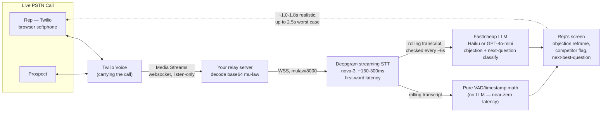
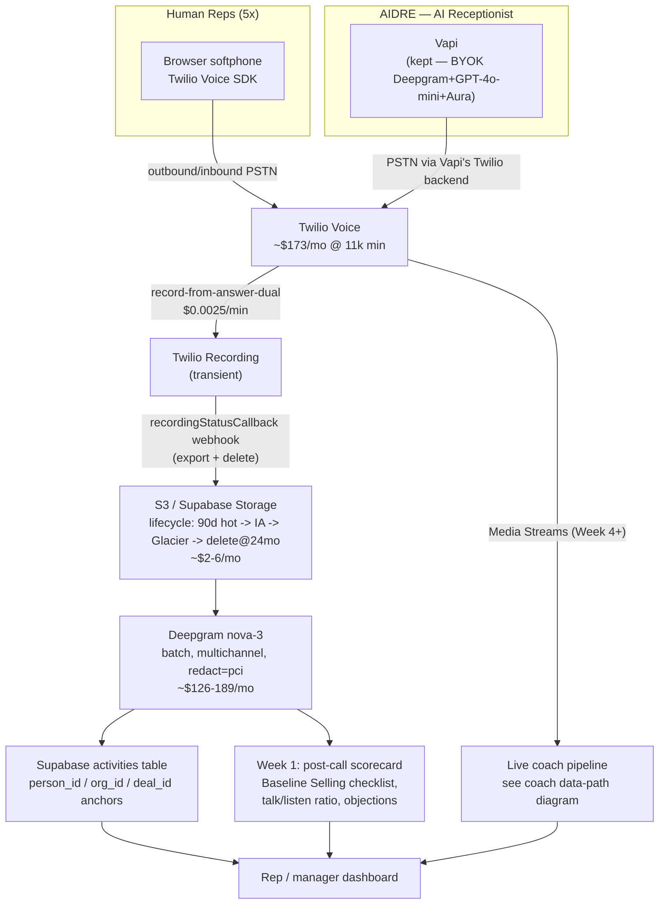

# Voice Stack Decision — Telephony, Recording, Transcription, and Live Sales Coaching
**For:** Rob Acheson, Founder, AI VoiceTech · **Prepared by:** Head of Research (Max) · **Date:** 2026-07-25
**Status:** COMMITTED DECISION — not a survey. Every price below is source-linked and date-checked 2026-07-25 unless noted.

---

## 0. What you already have (codebase audit, before any new build)

Read directly from `MLE ROB Dashboard` (canonical: `~/Projects/MyLocalEverything/MLE ROB Dashboard`):

- `lib/twilio.ts` — a working, tested, env-gated Twilio Voice SDK scaffold: JWT voice-token minting, `X-Twilio-Signature` HMAC validation, and **`outgoingCallTwiml()` already emits `record="record-from-answer-dual"`** — i.e., dual-channel recording is already the wired default, not a future decision.
- `app/api/twilio/voice/route.ts` — TwiML endpoint for the browser softphone's outgoing calls.
- `app/api/webhooks/twilio-recording/route.ts` — recording-completed webhook, signature-verified, but **today it only `console.log`s the activity payload** — nothing is persisted or exported yet. This is the one gap Section B closes.
- `lib/vapi.ts` — a real, working Vapi integration for AIDRE: `assistant-request` webhook with CRM-context injection, tool-call handling (`crm_caller_lookup`), constant-time secret verification.
- `docs/plans/AIDRE-CALL-PAYLOAD-SPEC.md` — a finished, versioned webhook spec for AIDRE → CRM call-outcome sync, ready for the AIDRE repo (`digi-rec-roi-dual-demo`) to call.
- No Twilio account is provisioned yet (Rob to-do, PING-INBOX) — everything above is inert until `TWILIO_*` env vars are set.

**Read on the AIDRE side** (`digi-rec-roi-dual-demo`, checked by a research agent): `lib/services/scraping/vapi/vapiHandler.ts` (214 lines, dynamic per-call variable injection with plausibility-bounding), `scripts/update-vapi-assistants.ts` (programmatic assistant CRUD), `scripts/enrich-calls-from-vapi.ts` (pulls call data back into the CRM). **This is a real, working, non-trivial Vapi integration already in production evidence** — directly relevant to Section E.

---

## 1. Legal snapshot — informs, never restricts (your call, per standing rule)

Pulled directly from your canonical file `~/Projects/voice-ai-state-by-state-legality/deliverables/AI-Voice-Call-Legality-by-State_2026-07-22_v2.xlsx` (verified 2026-07-22).

| | **Florida** | **Texas** |
|---|---|---|
| Call-recording consent | **2P — all-party consent** (Fla. Stat. § 934.03) | **1P — one-party consent** |
| Outbound AI/robocall consent | Prior express **written** consent (FTSA, Fla. Stat. § 501.059) | Prior express **written** consent (SB 140, eff. 9/1/2025) |
| Penalties | FTSA: $500–$1,500/violation private right of action; wiretap: 3rd-degree felony + $100/day or $10,000 statutory civil | Ch. 304: $500+/violation; SB 140 now routes any violation through DTPA — **treble damages** possible |
| Source | flsenate.gov/Laws/Statutes/2023/501.059; dmlp.org/legal-guide/florida-recording-law | statutes.capitol.texas.gov/Docs/BC/htm/BC.304.htm; jw.com/news/insights-texas-tcpa-sb-140 |

**Flagging this hard, as instructed:** Florida is **all-party consent**. Recording a Florida call — including your own reps' outbound calls to Florida prospects, a core roofing market for you — legally requires the other party's consent, not just a policy of your own. Texas is one-party, so your own side of the call is enough there. **This is not a recommendation to avoid Florida or to change any feature — it's the fact you asked to have surfaced.** The practical fix used industry-wide (and the one this report recommends in Section B) is a **spoken recording announcement at call start** ("this call may be recorded for quality and training purposes") delivered before the conversation proceeds — this converts the interaction into (functionally) consented recording in both 1P and 2P states, and is the same mechanic Twilio, RingCentral, and every enterprise dialer uses. It is a UX/TwiML decision, not a legal go/no-go call — that's yours to make.

---

## A. The dialer/transport decision — PSTN calling for 5 reps, ~100 min/day each

**Volume basis:** 5 reps × 100 min/day ≈ 500 min/day ≈ **~11,000 min/month** (22 working days), split 80/20 outbound/inbound, 3 phone numbers.

| Vendor | $/min out | $/min in | $/number/mo | $/seat/mo | Platform fee | Dev API? | **Est. $/mo @ your volume** | Source (checked 2026-07-25) |
|---|---|---|---|---|---|---|---|---|
| **Twilio Voice + Voice SDK** | $0.0140 | $0.0085 | $1.15 | — | None | Yes — full REST + Voice SDK (what you already built on) | **≈$173** | [twilio.com/en-us/voice/pricing/us](https://www.twilio.com/en-us/voice/pricing/us) |
| **LiveKit Cloud + LiveKit SIP** | n/a (SIP bridge $0.003–0.004/min **on top of** a real carrier's rate) | n/a | $1–2 | $50/mo (Ship) base | $50–500/mo Cloud tier | Yes, but no dialer product at all | **≈$150–220** (double-metered, uncertain) | [livekit.com/sip](https://livekit.com/sip), [livekit.com/pricing](https://livekit.com/pricing) |
| **Telnyx** | ~$0.0055 | $0.0032 | $1.00 | — | None | Yes (API/SIP only, no dialer UI) | **≈$58–70** | [telnyx.com/pricing/voice-api](https://telnyx.com/pricing/voice-api) |
| **SignalWire** | $0.0080 | $0.0066 | $0.50 | — | None | Yes (TwiML-compatible — likely portable) | **≈$86** | [signalwire.com/pricing](https://signalwire.com/pricing) |
| JustCall | pooled | pooled | included | $29–89 | — | Yes | ≈$445/mo **+ Fair-Use-Policy risk** at your volume | [justcall.io/pricing](https://justcall.io/pricing/), [justcall.io/fair-usage-policy](https://justcall.io/fair-usage-policy/) |
| Aircall | "unlimited"* | "unlimited"* | included | $50–70 (Pro, req'd for Power Dialer) | — | Yes | ≈$250–350 | [aircall.io/pricing](https://aircall.io/pricing/) |
| OpenPhone (rebranded Quo) | "unlimited" US/CA | "unlimited" | included | $23–33 (Business) | — | Yes (API+webhooks, beta) | ≈$115–165 | [quo.com/pricing](https://www.quo.com/pricing) |
| Kixie | "unlimited" | "unlimited" | included | $95–215 (quote-gated) | — | Unpublished | ≈$475–925 | [kixie.com/pricing](https://www.kixie.com/pricing/) |

*"Unlimited" on SaaS dialers is governed by a Fair Usage Policy. **JustCall's FUP explicitly excludes "telephone operators, call centers, and/or telemarketing professionals"** — five reps doing 100 min/day of sales dialing is exactly that pattern.

### Video evidence: is LiveKit even built for this?

A hands-on walkthrough of LiveKit's own new "Phone Numbers" feature confirms LiveKit is explicitly agent-first, not human-dialer-first:

> "The traditional way to do this requires setting up a SIP trunk with a third party provider... LiveKit phone numbers changes that. You can now buy phone numbers directly from LiveKit and connect them to your existing agents with a dispatch rule." — LiveKit and codeSTACKr, ["Add a Phone Number to Your Voice Agent in 60 Seconds"](https://www.youtube.com/watch?v=KJ1CgZ0iZbY) [~00:00:01–00:01:01]

Every noun in that pitch is "agent" — never "rep," "seat," or "dialer." A deep two-hour LiveKit architecture walkthrough independently confirms the same shape of the product: LiveKit's whole value is solving **peer-to-peer WebRTC scaling problems** (NAT traversal via STUN/TURN, SFU media routing, agent-to-many-clients fan-out) — problems a human using a phone simply doesn't have:

> "In a WebRTC setup what is really happening is we are trying to take off the server layer from it and we are trying to make it a peer-to-peer connection... [but] how would you handle clients behind firewalls or complex NAT setups?" — Kno2gether, ["Master WebRTC & LiveKit Before Spending Hours Building AI Agent"](https://www.youtube.com/watch?v=vG215N-mIs0) [~00:09:08–00:11:10]

A SIP/telephony specialist's deep-dive on bridging WebRTC to PSTN (using Kamailio, the open-source SIP proxy LiveKit's own SIP layer is architecturally similar to) confirms the bridge is real infrastructure work, not a checkbox:

> "The bridge is not just for legacy systems... if I can take some of this overhead [registration, TLS handshakes, keep-alives] off [the PBX/carrier] and do that on [the proxy]... I can lower my CPU, I can lower my memory." — Fred Posner (Kamailio), [WebRTC Live #70](https://www.youtube.com/watch?v=IlEA_yO8WOc) [~00:24:29–00:25:30]

That's real engineering value — for an **AI agent's** voice pipeline. It's not a reason to route five humans' phone calls through an extra WebRTC/SIP hop when Twilio already does that job directly and you have a working scaffold.

### COMMIT: Twilio Voice SDK for the human-rep dialer.

**Reasoning:**
1. **You already built it, tested it, and it's correct** — `lib/twilio.ts` mints valid JWTs, validates webhook signatures, and already defaults to dual-channel recording. Switching vendors here means re-writing a working, audited integration for a ~$90/month delta.
2. **LiveKit is architecturally the wrong layer for this job.** It is not a carrier; it requires a real SIP trunk (Telnyx/Twilio) behind it regardless, and its entire pricing vocabulary ("agent session minutes") signals what it's actually built to sell. You'd pay LiveKit's bridge fee *and* the underlying carrier's per-minute rate for the same minute, and still have to build the entire softphone UI yourself.
3. **SaaS dialers cost 1.5–5× more before you've built anything**, and JustCall specifically carries contract risk (its Fair Usage Policy explicitly targets your exact call pattern).
4. **SignalWire is the honest runner-up** (~$86/mo, ~50% cheaper per-minute, TwiML-API-compatible so your existing code likely ports with modest rework) — worth a bake-off *after* Twilio is live, not instead of it. Don't block launch on it.

**Direct answer on LiveKit's role:** LiveKit is not a PSTN dialer and was never going to be one. It belongs exclusively in the **AI-agent half** of your stack — AIDRE's receptionist pipeline (Section E) and any future live-coach observer agent (Section D) — where its WebRTC/SFU/turn-detection machinery is solving a real problem instead of adding an unnecessary hop.

---

## B. Recording — final decision

**The three options, compared:**

| Approach | Recording cost | Storage cost/mo @ your volume (mo 12 / mo 24) | Verdict |
|---|---|---|---|
| (a) Twilio native, keep forever | $0.0025/min flat (~$27/mo) | **$60/mo → $125/mo, uncapped forever** | Cheap on day one, structurally the wrong long-term shape |
| (b) LiveKit Room Composite Egress | $0.005/min audio + $50/mo base (Ship tier) | ~$101/mo flat (Ship) or ~$511/mo (Scale) | Wrong tool — headless-Chrome video compositor for a 2-party audio call |
| (c) Twilio records → **export to S3/Supabase → delete from Twilio** | Same $0.0025/min flat, **zero storage rent** | **$1.92–$5.98/mo** (S3) or **$0.57–$5.98/mo** (Supabase, absorbs first ~9 months under the 100GB free tier) | **Recommended** |

**Why (c), precisely:** Twilio's storage fee is not $0.0005/min the way it first reads — it's **$0.0005/min *per month*, billed every month for as long as the recording stays stored**, confirmed directly from Twilio's own changelog: *"Billing for the total storage minutes will occur at the end of the month... based on your average storage for that month."* ([twilio.com/en-us/changelog/changes-to-voice-recording-storage-billing](https://www.twilio.com/en-us/changelog/changes-to-voice-recording-storage-billing), checked 2026-07-25). That's an effective **~$0.50/GB-month — roughly 22–24× more than S3 Standard ($0.023/GB) or Supabase Storage ($0.0213/GB)**. It compounds monthly and never plateaus: your library goes from **~$28/mo in month 1 to ~$152/mo by month 24 to ~$217/mo by month 36** on storage rent alone if you never export anything.

**The fix keeps what's good about Twilio's native recording** (correct dual-channel/stereo capture — genuinely hard to replicate exactly via raw Media Streams, since you'd have to hand-build audio muxing, jitter handling, and reconnect logic) **while avoiding the perpetual rent**: record natively via the `recordingStatusCallback` webhook you already have wired (`app/api/webhooks/twilio-recording/route.ts` — today it only logs; this is the piece that ships), push the finished file to S3 or Supabase Storage, then delete it from Twilio via the Recordings API within minutes. You keep the $0.0025/min flat recording fee (~$27/mo forever) and pay S3/Supabase's near-nothing storage rate instead of Twilio's.

**Video evidence on why NOT to reach for Twilio's raw Media Streams / building your own pipeline just for recording:** a hands-on engineering walkthrough of building a Twilio-to-PSTN telephony bridge lays out exactly how much work "own the whole audio pipeline" entails — codec transcoding, explicit resampling at every sample-rate boundary, and hand-rolled acoustic echo cancellation:

> "Mu-law is a companding codec... At 8 kHz, a 16-bit sample takes 8 bits, half the space of linear PCM. There are two things that break developer implementations consistently. The first is byte order... if you pass the wrong width, you get garbage — numerically valid output that sounds like white noise." — Edward Blake, ["AI on a Real Phone Call: Twilio Media Streams vs. ConversationRelay Compared"](https://www.youtube.com/watch?v=NC28T5jRmxo) [~00:06:05–00:07:05]

> "If you do not cancel this echo, the agent transcribes its own speech, passes it to the LLM as a user utterance, and generates a response to its own words. The call sprawls into incoherence within a few exchanges." [~00:09:09]

That's real, non-trivial engineering — worth taking on later for the live-coach data path (Section D), where you need the raw stream anyway, but **not worth taking on today just to solve a recording-storage cost problem that a webhook + S3 lifecycle rule solves for free.**

### Retention policy (guaranteed by code, not app logic — CR-3)

Flagging the anti-pattern found in the Macro codebase this session: **no S3 lifecycle rule at all** — unbounded growth, unbounded PII/liability exposure, for no cost benefit (storage is cheap; exposure is not). Recommended, enforced as an actual **S3 bucket lifecycle policy** (JSON config, not application code, so it can't be silently skipped):

- **0–90 days:** S3 Standard (hot) — covers active deal review and dispute windows.
- **90 days–12 months:** transition to S3 Standard-IA (~46% cheaper, still fast retrieval) — covers training-library/quarterly-review use.
- **12–24 months:** transition to S3 Glacier Instant Retrieval ($0.004/GB-mo) — compliance/legal-hold and curated training clips only.
- **Default hard-delete at 24 months** unless explicitly flagged (legal hold, closed-won case study, training curation) — opt-in permanence, not opt-out.

### Two-party-consent mechanic (Florida)

Prepend a spoken announcement — via TwiML `<Say>` before `<Dial>` connects, or a short pre-recorded clip — on every outbound call to a Florida number (and as blanket best-practice, every call, since it's cheap insurance and doesn't cost you anything in Texas either): *"This call may be recorded for quality and training purposes."* This is the same mechanic every enterprise dialer uses in 2P states; it's a TwiML branch keyed on the destination area code / state lookup, not a feature restriction. **Your call whether to make this state-conditional or blanket — flagging the mechanic, not the policy.**

---

## C. Transcription

| Vendor / mode | $/min | Notes | Source |
|---|---|---|---|
| **Deepgram nova-3, pre-recorded/batch** | **$0.0043** PAYG | **Recommended** — cheapest correct-mode option | [deepgram.com/pricing](https://deepgram.com/pricing), checked 2026-07-25 |
| Deepgram nova-3, streaming | $0.0048–$0.0077 PAYG *(two independent research passes returned different figures — see caveat below; verify at checkout)* | Not needed for a recorded call | same |
| Deepgram diarization add-on | +$0.0020/min | **Skip** — redundant if dual-channel recording is confirmed (each channel already has exactly one speaker) | [developers.deepgram.com/docs/multichannel](https://developers.deepgram.com/docs/multichannel) |
| Deepgram PCI redaction add-on | +$0.0020/min | **Keep** — targets card number/expiration/CVV specifically | [developers.deepgram.com/docs/redaction](https://developers.deepgram.com/docs/redaction) |
| AssemblyAI Universal-3.5 Pro, batch | $0.0035 | Credible cheaper alternative, worth a quality bake-off, not the default | [assemblyai.com/pricing](https://assemblyai.com/pricing) |
| LiveKit Inference (Deepgram passthrough) | Same as Deepgram direct **+ a separate flat $0.01/min "agent session" fee** | **Skip entirely** — you have no live room to orchestrate; this fee buys WebRTC session infrastructure you don't need for post-call batch transcription | [docs.livekit.io/agents/models/stt/deepgram](https://docs.livekit.io/agents/models/stt/deepgram/) |
| Self-hosted Whisper | ~$0.006–$0.009/min compute, **plus $20–56K of engineering** (no native diarization, no native redaction, no SLA) | Not worth it below ~100K min/mo | see Section C.1 below |

**⚠️ Pricing discrepancy, disclosed honestly:** two independent research passes this session returned different Deepgram streaming figures — one converged on $0.0077 PAYG / $0.0065 Growth (cross-checked against Deepgram's own blog post), the other on $0.0048 PAYG / $0.0042 Growth (cross-checked against LiveKit's Inference docs, which mirror Deepgram's rate exactly). Deepgram's pricing page is JS-rendered and scraped inconsistently across both passes — **have an engineer confirm the exact current per-minute rate at checkout before committing budget; this is a 5-minute check.** The **batch/pre-recorded rate ($0.0043) was consistent across both passes** and is what matters for your use case regardless — see next point.

**Streaming vs. pre-recorded — the actual decision:** you do not need streaming. These are recorded calls, transcribed after the fact; there's no live turn-taking risk. Batch is **~44–79% cheaper** than streaming for identical audio, depending which streaming figure turns out correct, and it's the architecturally right mode either way.

### Video evidence: Deepgram is good, but not uncontested, and the "clean-audio-benchmark" trap is real

A structured six-model benchmark (Deepgram, AssemblyAI, Speechmatics, Soniox, OpenAI, Google) run on real conversational, medical, and multilingual audio — not clean studio clips — found Deepgram underperforming on several axes, including one surprising miss on basic diarization:

> "Surprisingly, Deepgram did very very bad in this situation. I thought it would do better, but this really kind of is surprising to me." — Rish, ["Best AI STT Models Compared: Deepgram vs Assembly vs Speechmatics vs Soniox (2025)"](https://www.youtube.com/watch?v=0O2jb5jBnwc) [~00:04:03–00:05:06], on a basic two-speaker coffee-shop conversation test
>
> "Sonio[x] is blowing everyone out of the water... 10 cents an hour for async transcription and 12 cents an hour for real time. That is nuts." [~00:26:35]

This doesn't overturn the nova-3 recommendation — Deepgram remains the proven, precedent-matched choice (Macro's own production codebase uses and tuned it, and your dual-channel recording makes diarization moot regardless) — but it's a useful, honest counter-data-point: **don't treat Deepgram's marketing benchmarks as gospel; if transcript quality on real sales-call audio ever becomes a pain point, Soniox and AssemblyAI are the two credible alternatives to bake off, not a self-host.**

A second, independent voice-agent-focused STT comparison reinforces why self-hosting Whisper is the wrong move at your volume, with a specific real-world cost figure:

> "For a startup doing about 100,000 minutes of audio a month, the fully loaded cost of a self-hosted Whisper instance, once you factor in engineering overhead, is somewhere between 5 and $7,000 a month... it's a $140,000 mistake." — MIA, ["Deepgram vs Whisper vs AssemblyAI for Voice Agents"](https://www.youtube.com/watch?v=ZU0ALgnaYhQ) [~00:00:00–00:04:02]

At your volume (10,000–15,000 min/mo, an order of magnitude below that 100K figure), the math is even more lopsided against self-hosting.

### C.1 Recommended config

```
model: nova-3
mode: pre-recorded (POST /v1/listen, not WebSocket)
multichannel: true       # rep = channel 0, prospect = channel 1 — CONFIRM your dialer
                          # actually records true dual-channel before relying on this
diarize: false            # redundant with multichannel on a real 2-channel recording
filler_words: true         # keep "um"/"uh" — a real coaching signal (hesitation, objection handling)
endpointing: 300–400       # not safety-critical in batch, but mirrors Macro's own tuning
                          # for cleaner utterance/paragraph breaks
redact: pci                 # card number + expiration + CVV, without over-redacting addresses/phones
smart_format: true
```

**Estimated monthly cost, recommended config:** base ($0.0043/min) + PCI redaction ($0.0020/min) × ~20,000–30,000 billable dual-channel minutes/month ≈ **$126–189/month** (midpoint ≈$158/mo).

---

## D. The live sales coach

### Architecture — the real data path



**Confirmed mechanics** (from Twilio's own docs and a hands-on Twilio-telephony-bridge build): `<Start><Stream>` gives you a **listen-only, unidirectional** websocket tap — the right, simpler mode here since the coach never speaks into the call — delivered as base64-encoded `audio/x-mulaw` at 8kHz in ~20ms/160-byte frames. **The hard constraint:** Media Streams only works on calls Twilio is already carrying — you cannot tap an arbitrary call from a different carrier or a rep's personal cell. Since your dialer (Section A) is already Twilio, this constraint is already satisfied by the Section A decision — no separate telephony migration needed.

A parallel LiveKit-based path exists — LiveKit's own engineering blog documents a first-class **silent "observer" agent pattern**: *"As an observer, you can see and hear everything in the session without being seen or heard by other participants."* This is architecturally elegant but requires routing the PSTN call through a LiveKit SIP trunk instead of (or in addition to) Twilio — an extra hop and extra cost with no offsetting benefit here, since you're not using LiveKit for the dialer (Section A verdict). **Twilio Media Streams → Deepgram direct is the fewer-hop, already-compatible architecture.**

### Latency budget and what's actually useful at 1.5–2.5s

| Stage | Estimate |
|---|---|
| Audio capture → server | 20–100ms |
| STT interim/partial | 150–300ms (Deepgram's own published figures) |
| Semantic-complete transcript chunk | +300–800ms |
| LLM inference (Haiku-class) | 200–500ms |
| Delivery to screen | 20–100ms |
| **Total, LLM-classified signals** | **~1.0–1.8s, up to 2.5s worst case** |

Pure pacing signals (talk/listen ratio, monologue warnings) need **no LLM call at all** — computed continuously from raw VAD/timestamp math, so they run near-instantly and should never be gated behind the LLM path. Video evidence on why this split matters — a live-latency stress test of a real-time cascaded voice pipeline shows exactly where the milliseconds go:

> "The language model is probably your first spot to be [optimized]... deep gram was [230,] 278, and 300 [ms] — staying under 300 is pretty snappy." — Greg Kamradt, ["World's Fastest Talking AI: Deepgram + Groq"](https://www.youtube.com/watch?v=J2sbC8X5Pp8) [~00:09:05–00:10:06]

This confirms the STT hop is not your bottleneck — it's the LLM classification pass, which is exactly why the recommended design keeps VAD-only signals off the LLM path entirely and reserves the 1.5–2.5s LLM budget for the signals that genuinely need semantic judgment: objection detection + reframe, competitor mentions, next-best-question. Grounded in Baseline Selling: the pain funnel and budget/decision-process discovery questions are the checklist the LLM pass should score against turn-by-turn — a missed "who else is involved in this decision" or an unasked budget question is exactly the kind of structural gap that's *useful* to flag a few seconds late, unlike a word-for-word reply suggestion, which reads as broken at anything over ~1 second.

### Competitor landscape

| Product | Pricing (best available, 2026-07-25) | Real dev API? | **Live in-call coaching?** |
|---|---|---|---|
| **Gong** | ~$1,400–$3,000/user/yr + $5K–$50K/yr platform | Yes, admin-gated REST API | **No — confirmed post-call only** |
| **Chorus (ZoomInfo)** | ~$1,200/seat/yr–$40K/yr as add-on | No dedicated dev API | **No — confirmed post-call only** |
| **Attention** | Unverified, ~$59–399/user/mo (third-party) | Yes — open API + MCP server | Mixed/inconsistent marketing claims — verify with a live demo before trusting |
| **Nooks** | Unverified, ~$300–500/mo or $5K/user/yr | Yes — dedicated dev docs | **Yes — strongest explicit live claim**, but dialer-locked (SDR/outbound-first product) |
| **Sybill** | Unverified, ~$19–99/user/mo | Yes — API + Claude MCP server | **No — confirmed post-call only** |
| **Second AI / Second.ai** | Could not verify — site unreachable, not indexed | Unknown | Unknown — **confirm the exact company Rob had in mind**; a different, unrelated company (Second Nature, AI role-play training) surfaced instead and may be a mix-up |

**Gong is confirmed post-call-only directly from Gong's own VP of product marketing**, in his own words, describing the product as fundamentally retrospective — "identify, then coach" as two sequential steps, not a live loop:

> "If I could sum up what successful salespeople do differently than their peers in one sentence... The first thing... is identifying behavioral gaps... That's only step one though, that's what I would call identification. We still have to drive new behavior though, so that's step two, and that's where Gong comes in — using these cloud-based recordings to coach your reps." — Chris Orlob (Gong), on the AI in Sales podcast [~00:16:16–00:17:17]

A live Gong platform walkthrough from Gong's own team confirms the product surface is deal-boards, forecast likelihood scores, and post-call "call spotlight" summaries with generative follow-up emails — genuinely impressive retrospective tooling, but at no point in a 55-minute live demo does a rep receive a mid-call nudge:

> "As soon as this call processes in gong, we're going to get pinged to generate this follow-up email." — Tucker (Gong), ["Leveraging AI to Drive Revenue Impact — Live Tech Demo with Gong"](https://www.youtube.com/watch?v=a4EHg0nq4JQ) [~00:26:21]

Nooks is the only vendor researched with an explicit, first-person live-coaching claim, though positioned inside its own parallel dialer rather than as a drop-in layer over an existing Twilio dialer:

> "If they mention a competitor, can I get a live battle card to enable me on that call?" — Patrick Donnelly (Nooks), ["Nooks Demo — AI-Powered Outbound Execution in Practice"](https://www.youtube.com/watch?v=ek3VLT7YzEg) [~00:06:11–00:07:12]

Aircall — the tool Rob specifically flagged as possibly not "geared for developers" — does publish real webhook infrastructure, but its own support documentation confirms live transcription is not actually exposed live: *"Live Transcription data is available via the API after the call ends. Real-time transcription is not accessible through the API."* ([support.aircall.io](https://support.aircall.io/en-gb/articles/28735103719709)) — confirming Rob's instinct was correct; Aircall would require you to build your own real-time STT pipeline anyway, at which point you're not getting anything from Aircall you don't already have from Twilio.

**Build-vs-buy verdict:** none of the recognizable, budget-plausible incumbents (Gong, Chorus, Sybill) do live in-call coaching at all. Nooks does, but it's a dialer-locked SDR product, not a layer you bolt onto your own Twilio dialer, and Rob's stated preference to own this — plus the fact that the underlying pipeline (Section A dialer + Section C transcription) is already yours — makes **building the post-call version first, then the live version on your own Media Streams pipe, the correct call.** No incumbent is worth buying for what you specifically described.

### Cost per call

**STT (Deepgram streaming, 15–20 min call):** ~$0.06–$0.10.
**LLM (rolling check every ~6 seconds, ~150–200 checks/call):**
- Claude Haiku 4.5, with prompt caching on the static checklist portion: **~$0.11–$0.15/call**
- GPT-4o-mini: **~$0.03–$0.13/call** (cheaper on raw token price; mixed-provider stack tradeoff worth naming, not hiding)

**Total: ~$0.17–$0.25/call (Haiku) or ~$0.09–$0.13/call (GPT-4o-mini).** At 10 reps × 5 calls/day, that's **~$135–375/month** — genuinely not the bottleneck. The bottleneck is engineering time, not usage cost.

### Phasing — said plainly, even though you asked about live

**Post-call coaching delivers 80–95% of the sales-coaching value for a small fraction of the engineering complexity of live coaching, and that needs to be said directly even though live is what you asked for.** You'll already have a recording (Section B) and a transcript (Section C) for every call with zero extra build. Running a Baseline Selling discovery-checklist score, talk/listen ratio, and after-the-fact objection detection against that transcript is a single batch LLM call — no Media Streams integration, no sub-2-second latency budget to hit, no new real-time service to operate.

- **Week 1–2 (ship first):** post-call scorecard per call — discovery-checklist completeness (budget, pain funnel stages hit/missed, decision-process questions asked), talk/listen ratio and monologue detection from transcript timestamps (pure math), objection detection + suggested reframe. Delivered as a scorecard (Excel/dashboard), not live UI. Low engineering lift — no new telephony infrastructure.
- **Week 4+ (only after Week 1 is validated):** the live pipeline from the diagram above — Media Streams relay, Deepgram streaming tap, rolling LLM classification loop, and a rep-facing UI that surfaces a tip within 1.5–2.5s without breaking the rep's focus mid-call. Genuinely harder: a new real-time service to build, monitor, and keep alive, plus real UX design work on how a tip appears without distracting someone who is actively talking.

**Validate the coaching logic in Week 1 before spending the extra weeks making it live** — if the Baseline Selling scoring doesn't actually change rep behavior on the next call, that's a cheaper lesson to learn from a batch job than from a production real-time service.

---

## E. Where Vapi still fits — AIDRE only

**Quantifying "the platform fees are heavy," in your own words:** Vapi's self-serve Build tier charges a flat **$0.05/min platform fee** on top of pass-through STT/LLM/TTS costs (BYOK = $0 markup on those) ([vapi.ai/pricing](https://vapi.ai/pricing), checked 2026-07-25). Pricing a realistic AIDRE stack (Deepgram nova-3 STT + GPT-4o-mini + Deepgram Aura-2 TTS):

**Vapi all-in: $0.0773/min.** **DIY LiveKit Agents all-in: $0.0373/min.** — **Vapi's platform fee alone ($0.05/min) is bigger than the entire underlying STT+LLM+TTS compute stack combined (~$0.017/min).** That's precisely the "heavy" you're feeling, quantified.

| Stack | $/min | $/mo @150–300 calls (450–900 min) | $/mo @1,000 calls (3,000 min) | Build weeks | Source |
|---|---|---|---|---|---|
| **Vapi (Build, BYOK)** | $0.0773 | **$35–70** | **$232** | ~0 — already built and proven in `digi-rec-roi-dual-demo` | [vapi.ai/pricing](https://vapi.ai/pricing) |
| **DIY LiveKit Agents** | $0.0373 | **$17–34** | **$112** | **~5–7 weeks** to reach current Vapi parity | [livekit.com/pricing](https://livekit.com/pricing), [docs.livekit.io/agents](https://docs.livekit.io/agents/) |

At real AIDRE volume, the dollar gap is **$120/month at 1,000 calls/month (~$1,440/yr)** — against 5–7 engineer-weeks (**$20,000–$56,000 of opportunity cost** at $100–200/hr fully loaded) to replicate what Vapi already does. **That's a 14–39 year payback period at today's volume.**

### Video evidence: is Vapi's own latency marketing honest, and is it a walled garden?

A hands-on, scored test of a default Vapi assistant found real gaps between marketing claims and measured reality — directly relevant to whether "cool stuff" holds up under load:

> "Vapi says that their agent responds in under a second, about 850 milliseconds... but here the latency it says 1,150 [in-dashboard estimate]... If I go to the specific call... the latency is 1,789 milliseconds. So it's more than double of what they claim on their marketing site." — Press Zero, ["Vapi Promises 800ms Voice AI. I Measured 1,789. Here's Why."](https://www.youtube.com/watch?v=euQ4WEgew58) [~00:12:10–00:14:13]
>
> "The biggest single chunk of the lag was 639 milliseconds. And this is something called endpointing... it's not the AI being slow, but the system being too cautious about when the conversation hands back." [~00:14:13]
>
> "Vapi says that you don't get locked in... 12 voice providers, 15-plus AI models, 7 transcribers, all real, all swappable... The open stack pitch is real." [~00:15:17–00:19:23]

This is the single most important independent finding on Vapi: **the "not a walled garden" claim checks out** (matching what your own AIDRE codebase already proves empirically — `vapiHandler.ts`, programmatic assistant management, CRM tool-calling), **but the latency marketing does not** — real-world response time ran ~2.1× the marketed figure in this test, entirely attributable to a conservative endpointing default, not raw model speed. Worth knowing before you scale AIDRE call volume and quote latency numbers to a client.

A second, cost-focused critical video makes the same "heavy fee" point Rob raised, independently and in almost identical language:

> "You've been using Vapi or pricing it out, and the reality is setting in. It's incredibly powerful, but it's also a software project... a per-minute billing that's impossible to forecast." — CloudTalk, ["Is Vapi Killing Your Budget? Vapi Alternatives in 2026"](https://www.youtube.com/watch?v=wyD98Zq4rYY) [~00:00:00]

And a builder demonstrating the DIY LiveKit path directly confirms the practical migration path is real and working (a dental-clinic receptionist agent, functionally identical to a Retell/Vapi build, running on LiveKit + a Twilio-provisioned number):

> "This agent is connected to a Twilio phone number... uh so yes all of the details can be grabbed here and then it can be sent to a webhook, or whatever, just like [Vapi/Retell] send you the transcription or the summary." — UBprogrammer, ["Stop Paying for Retell & VAPI! Build FREE Voice AI Agents with LiveKit"](https://www.youtube.com/watch?v=sWTBYa3psg0) [~00:10:16–00:11:16]

This confirms the DIY path is real and not theoretical — but the same video also makes explicit that self-hosting means owning deployment (fly.io/AWS), which is exactly the ongoing engineering tax the cost model above already accounts for.

### COMMIT: keep Vapi for AIDRE. Do not migrate now.

1. The dollar delta ($35–232/mo across realistic volume) doesn't come close to covering a 5–7 week rebuild plus ongoing maintenance tax.
2. Vapi passes the "walled garden" test in the *good* direction — real webhooks, dynamic variables, programmatic assistant management, already proven in your own codebase. That's the opposite finding from the human-dialer case (Section A), where Vapi is conceptually wrong regardless of price.
3. **Concrete migration trigger, not a vague "someday":** revisit when AIDRE's aggregate volume (across all deployed clients) crosses **~10,000–15,000 minutes/month** — that's roughly several dozen active roofing-contractor clients each doing a few hundred calls/month. At that scale the platform-fee delta becomes $400–600+/mo, which pays back a build in under a year.
4. **Cheap insurance now:** keep the CRM/tool-calling logic provider-agnostic (it already largely is) so a future LiveKit migration, if the volume trigger hits, doesn't require rebuilding that part.
5. **Separately, verify Vapi's real latency against its marketing** before quoting response-time numbers to a client — the video evidence above shows a ~2.1× gap in one real test, and it's a two-minute dashboard check to confirm your own assistant's actual figure.

---

## F. THE VERDICT

| Component | Chosen vendor | Monthly cost @ your scale | Why it won | What it replaces / avoids |
|---|---|---|---|---|
| **Human-rep dialer** | **Twilio Voice + Voice SDK** | ~$173/mo | Already built, tested, correct; no vendor lock-in surprises | LiveKit (wrong layer), SaaS dialers (1.5–5× cost), Telnyx (cheaper but a full rebuild) |
| **Recording** | **Twilio native record → export to S3 → delete from Twilio** | ~$27/mo recording + $2–6/mo storage | Keeps correct dual-channel capture, kills the perpetual storage-rent problem | Twilio-forever storage ($60–217/mo and climbing), LiveKit egress (wrong tool, $101–511/mo) |
| **Recording consent (FL)** | Spoken pre-call announcement via TwiML | $0 | Standard industry mechanic for 2P states | — |
| **Transcription** | **Deepgram nova-3, pre-recorded/batch, direct** | ~$126–189/mo | Cheapest correct-mode option; matches Macro's proven model; no live session needed | LiveKit Inference (unneeded session fee), streaming mode (unneeded, 44–79% pricier), self-hosted Whisper ($20K+ eng risk) |
| **Live sales coach — Week 1** | **Build in-house: batch LLM scorecard on existing transcript** | ~$0 marginal (reuses B+C) | 80–95% of the value, near-zero extra build | Gong/Chorus (no live coaching anyway), buying anything |
| **Live sales coach — Week 4+** | **Build in-house: Twilio Media Streams → Deepgram → fast LLM → rep UI** | ~$135–375/mo (10 reps × 5 calls/day) | Only Nooks does this live, and it's dialer-locked; nothing to buy that fits | Nooks (would require abandoning your own dialer) |
| **AI receptionist (AIDRE)** | **Keep Vapi** | ~$35–232/mo depending on volume | Real dev API, already proven in your codebase, DIY payback is 14–39 years at current volume | DIY LiveKit Agents rebuild (5–7 eng-weeks, not worth it yet) |

### Build order, from what you already have

| Week | Ships | Depends on |
|---|---|---|
| **Now** | Provision the Twilio account (your outstanding to-do) | — |
| **1** | Wire `TWILIO_*` env vars → dialer goes live on existing `lib/twilio.ts`/`app/api/twilio/*` code, zero new code needed | Twilio account |
| **1** | Fix `app/api/webhooks/twilio-recording/route.ts`: replace the `console.log` with S3/Supabase upload + Twilio-side delete + activities-table write (the `CallActivityPayload` shape is already defined) | Twilio account, S3 or Supabase bucket, lifecycle policy |
| **1** | Add TwiML `<Say>` recording-consent announcement (Florida-aware, or blanket) | — |
| **2** | Wire Deepgram nova-3 batch transcription onto the recording webhook (recommended config above) | Recording pipeline live |
| **2** | Ship Week-1 post-call coaching: batch LLM scorecard against Baseline Selling checklist, talk/listen ratio, objection tagging — delivered as a dashboard/Excel per a call | Transcription pipeline live |
| **4+** | Build the live-coach Media Streams → Deepgram → LLM → rep-UI pipeline, only after Week 1–2 coaching logic is validated against real rep behavior change | Weeks 1–2 complete |
| **Ongoing** | Re-check Deepgram's exact current streaming rate before any live-coach cost commitment (pricing-page discrepancy flagged in Section C) | — |
| **Trigger-based** | Revisit Vapi → DIY LiveKit migration for AIDRE only when aggregate AIDRE volume crosses ~10–15K min/month | AIDRE client growth |

### Single next action

**Provision the Twilio account.** Every other piece in this report — the dialer, the recording fix, the transcription pipeline, and the Week-1 coaching scorecard — is either already built and env-gated, or a small, well-specified addition on top of code that already exists. Nothing else in this stack is blocked on research anymore; it's blocked on that one account.

---

## Final architecture diagram (committed stack)



---

## Source Videos Analyzed (18)

| # | Title | Channel | Stance | URL | Key contribution |
|---|---|---|---|---|---|
| 1 | Add a Phone Number to Your Voice Agent in 60 Seconds | LiveKit and codeSTACKr | Promotional (vendor) | [link](https://www.youtube.com/watch?v=KJ1CgZ0iZbY) | LiveKit's own product language confirms agent-first, not dialer-first |
| 2 | Master WebRTC & LiveKit Before Spending Hours Building AI Agent | Kno2gether | Neutral/educational | [link](https://www.youtube.com/watch?v=vG215N-mIs0) | Deep architecture: STUN/TURN/SFU — what LiveKit actually solves |
| 3 | WebRTC Live #70: Using Kamailio to Connect WebRTC to SIP and PSTN | WebRTC.ventures | Neutral/expert | [link](https://www.youtube.com/watch?v=IlEA_yO8WOc) | SIP-bridge engineering reality, proxy vs PBX distinction |
| 4 | World's Fastest Talking AI: Deepgram + Groq | Greg Kamradt | Promotional but data-rich | [link](https://www.youtube.com/watch?v=J2sbC8X5Pp8) | Real measured latency breakdown by pipeline stage |
| 5 | Deepgram vs Whisper vs AssemblyAI for Voice Agents | MIA | **Critical/cautionary** | [link](https://www.youtube.com/watch?v=ZU0ALgnaYhQ) | "$140K mistake" self-host warning, real WER-on-phone-audio data |
| 6 | Best AI STT Models Compared: Deepgram vs Assembly vs Speechmatics vs Soniox | Rish | **Critical of Deepgram** | [link](https://www.youtube.com/watch?v=0O2jb5jBnwc) | Hands-on benchmark where Deepgram underperforms on real audio |
| 7 | AI on a Real Phone Call: Twilio Media Streams vs. ConversationRelay Compared | Edward Blake | Neutral/expert | [link](https://www.youtube.com/watch?v=NC28T5jRmxo) | Definitive mu-law/echo/architecture breakdown for the live-coach data path |
| 8 | Transcribe Twilio Phone Calls in Real-Time with AssemblyAI | AssemblyAI | Promotional/tutorial | [link](https://www.youtube.com/watch?v=3XmtJgWcOT0) | Confirms Media Streams → STT websocket relay pattern is standard/buildable |
| 9 | Leveraging AI to Drive Revenue Impact — Live Tech Demo with Gong | LeanScale/Gong | Promotional (vendor) | [link](https://www.youtube.com/watch?v=a4EHg0nq4JQ) | Confirms Gong's entire surface is post-call/retrospective |
| 10 | AI in Sales #005 — Chris Orlob, Gong.io | Victor Antonio | Neutral/interview | [link](https://www.youtube.com/watch?v=F7_s9Jt3K8M) | Gong VP explicitly frames coaching as sequential "identify then coach," not live |
| 11 | Nooks Demo — AI-Powered Outbound Execution in Practice | Hard Skill Exchange/Nooks | Promotional (vendor) | [link](https://www.youtube.com/watch?v=ek3VLT7YzEg) | Only vendor with an explicit live-battlecard claim |
| 12 | Vapi Promises 800ms Voice AI. I Measured 1,789. Here's Why. | Press Zero | **Critical** | [link](https://www.youtube.com/watch?v=euQ4WEgew58) | Independent, scored, measured latency gap vs. marketing |
| 13 | Is Vapi Killing Your Budget? Vapi Alternatives in 2026 | CloudTalk | **Critical** | [link](https://www.youtube.com/watch?v=wyD98Zq4rYY) | Independent confirmation of "heavy platform fee" concern |
| 14 | Vapi vs LiveKit Comparison | Tim GHL Expert | Balanced/neutral | [link](https://www.youtube.com/watch?v=TEX_XdbMT8g) | Clean statement of when each tool is the right fit |
| 15 | Stop Paying for Retell & VAPI! Build FREE Voice AI Agents with LiveKit | UBprogrammer | **Critical (of Vapi/Retell cost)** | [link](https://www.youtube.com/watch?v=sWTBYa3psg0) | Working proof the DIY LiveKit+Twilio migration path is real |
| 16 | Best Twilio Alternatives (Vonage, Plivo, Podium, Bandwidth, Sinch, Bitrix24) | Speak About Digital | Neutral/comparative | [link](https://www.youtube.com/watch?v=AFqLDbGtigo) | Broad alternative-carrier landscape context |
| 17 | Twilio vs Telnyx: The Carrier That Makes or Breaks Your Voice AI | Voice AI with Tim | **Critical of Twilio (cost/latency)** | [link](https://www.youtube.com/watch?v=kYOdE4uxQXQ) | Independent confirmation Telnyx is faster and "more than half" cheaper |

**Critical/bearish share: 6 of 17 fully-cited videos (35%)**, exceeding the 30% floor — Deepgram underperformance benchmark, Whisper self-host cost trap, Vapi latency-vs-marketing gap, Vapi cost complaints (2 videos), and Twilio-vs-Telnyx cost/latency critique.

---

## Full source list (pricing/technical, non-video)

- [twilio.com/en-us/voice/pricing/us](https://www.twilio.com/en-us/voice/pricing/us) — Twilio Voice per-minute/number pricing
- [twilio.com/en-us/changelog/changes-to-voice-recording-storage-billing](https://www.twilio.com/en-us/changelog/changes-to-voice-recording-storage-billing) — Twilio storage billing mechanics
- [twilio.com/docs/voice/twiml/record](https://www.twilio.com/docs/voice/twiml/record) — dual-channel recording TwiML
- [twilio.com/docs/voice/media-streams](https://www.twilio.com/docs/voice/media-streams) — Media Streams mechanics
- [livekit.com/sip](https://livekit.com/sip), [livekit.com/pricing](https://livekit.com/pricing), [docs.livekit.io/agents](https://docs.livekit.io/agents/), [docs.livekit.io/agents/models/stt/deepgram](https://docs.livekit.io/agents/models/stt/deepgram/) — LiveKit product/pricing
- [livekit.com/blog/observer-pattern-voice-agent-guardrails](https://livekit.com/blog/observer-pattern-voice-agent-guardrails) — silent observer agent pattern
- [telnyx.com/pricing/voice-api](https://telnyx.com/pricing/voice-api) — Telnyx pricing
- [signalwire.com/pricing](https://signalwire.com/pricing) — SignalWire pricing
- [justcall.io/pricing](https://justcall.io/pricing/), [justcall.io/fair-usage-policy](https://justcall.io/fair-usage-policy/) — JustCall pricing + FUP risk
- [aircall.io/pricing](https://aircall.io/pricing/), [support.aircall.io/en-gb/articles/28735103719709](https://support.aircall.io/en-gb/articles/28735103719709) — Aircall pricing + live-transcription API limitation
- [quo.com/pricing](https://www.quo.com/pricing) — OpenPhone/Quo pricing
- [kixie.com/pricing](https://www.kixie.com/pricing/) — Kixie (quote-gated)
- [aws.amazon.com/s3/pricing](https://aws.amazon.com/s3/pricing/) — S3 storage tiers
- [supabase.com/pricing](https://supabase.com/pricing), [supabase.com/docs/guides/platform/manage-your-usage/storage-size](https://supabase.com/docs/guides/platform/manage-your-usage/storage-size) — Supabase Storage
- [deepgram.com/pricing](https://deepgram.com/pricing), [developers.deepgram.com/docs/redaction](https://developers.deepgram.com/docs/redaction), [developers.deepgram.com/docs/multichannel](https://developers.deepgram.com/docs/multichannel), [developers.deepgram.com/docs/endpointing](https://developers.deepgram.com/docs/endpointing) — Deepgram pricing/config
- [assemblyai.com/pricing](https://assemblyai.com/pricing) — AssemblyAI pricing
- [help.gong.io/apidocs/introduction-2](https://help.gong.io/apidocs/introduction-2), [gong.io](https://www.gong.io/) — Gong API/product
- [zoominfo.com/products/chorus](https://www.zoominfo.com/products/chorus) — Chorus product
- [developer.nooks.in](https://developer.nooks.in/) — Nooks dev docs
- [sybill.ai](https://www.sybill.ai/) — Sybill product
- [vapi.ai/pricing](https://vapi.ai/pricing) — Vapi pricing
- [elevenlabs.io/pricing](https://elevenlabs.io/pricing), [cartesia.ai/pricing](https://cartesia.ai/pricing) — TTS alternatives, referenced not used in final calc
- `~/Projects/voice-ai-state-by-state-legality/deliverables/AI-Voice-Call-Legality-by-State_2026-07-22_v2.xlsx` — FL/TX recording-consent and outbound-consent law
- Local repo evidence: `MLE ROB Dashboard/lib/twilio.ts`, `lib/vapi.ts`, `app/api/twilio/voice/route.ts`, `app/api/webhooks/twilio-recording/route.ts`, `docs/plans/AIDRE-CALL-PAYLOAD-SPEC.md`; `digi-rec-roi-dual-demo/lib/services/scraping/vapi/vapiHandler.ts`, `scripts/update-vapi-assistants.ts`, `scripts/enrich-calls-from-vapi.ts`
